# 京张同心百年线：民族文化展陈与 AI 日常城市

> **AI生成内容与精度声明：** 本方案文本、图表及概念空间数据由人工智能辅助生成，已由提交者人工复核。其中总体范围与三处重点区几何为 provisional 概念数据，不替代法定规划、测绘、审批或工程成果。

本方案把“AI 创新带”理解为一条可以被人步行体验、被 Agent 解释、被专业团队复核的公共知识基础设施。它不是把传统园区换成科技口号，而是把铁路遗产的线性记忆、海淀的开放创新传统和 AI 时代的可审计协作接在一条公共环路上：南端以大钟寺的产业与国际交往为入口，中段以北京 AI 原点社区的开源日常为客厅，北段以众智园的全栈研发和安全治理为共智工坊，清河与小月河承担生态和场景赋能。所有空间落地均为概念建议、参考方案或可供专业团队深化研究的材料，不替代正式规划，也不构成政府审定结论。

## 核心思想：一条铁路、六次跃迁、56个民族共同建设到AI

本方案以 [metric:centennial_timeline_start_year] 年京张铁路建成为历史起点，以 [metric:centennial_plan_horizon_year] 年第二个百年为展望终点，把走廊组织成 [metric:centennial_narrative_stage_count] 个首尾连续的策展与空间运营时段。它不是把铁路当作怀旧背景，而是把“自主建设能力如何一步步走向共同智能”变成可以沿线步行、阅读、参与和更新的百年计划。

- **1909—1949 · 自主筑路｜北京北站—西直门：** 工程教育、铁路记忆、公共启程。
- **1949—1978 · 工业建设｜大钟寺—蓝景丽家：** 制造与劳动记忆、城市建设、可逆工坊。
- **1978—1994 · 科教报国｜知春路—学院路：** 高校科研、改革开放、成果转化与公共学习。
- **1994—2020 · 网络协作｜五道口—AI原点：** 互联网、开源知识、跨机构协作与青年共创。
- **2020—2035 · 绿色更新｜清华园—清河：** 遗址公园、蓝绿网络、无障碍慢行与低碳更新。
- **2035—2109 · 共同智能｜众智园—北五环：** 安全、普惠、可解释、可人工接管的AI公共基础设施。

这六段是方案提出的连续策展框架，不是官方历史分期，也不声称对应历史事件的精确发生地。每个区段承接一种国家建设能力和一组当代公共任务，使参观者从南向北完成一条“从自主筑路到共同智能”的空间叙事。[data:geometry/roads.geojson#ROAD-003] 是概念性的“京张同心百年线”，[data:geometry/public_space.geojson#CENTENNIAL-STAGE-001] 至 `CENTENNIAL-STAGE-006` 是六个策展锚点；均不是道路红线或确定建设安排。

“共同建设从历史记忆走向未来智能”采用价值层与空间层双重表达：空间层设置 [metric:ethnic_unity_co_creation_seat_count] 个同尺度、同权重、无中心的**轮换策展与公共议题席**。`UNITY-SEAT-01` 至 `UNITY-SEAT-56` 不永久绑定某一民族或固定文化符号，而采用自愿参与、轮换策展、共同议题和可撤回授权，避免把民族文化简化为服饰、饮食、表演或“打卡”标签。

56席共同策展工程与工艺、语言与口述史、生态与家园、节俗与日常记忆、开放知识、AI转译与文化伦理、青年再创作等主题。依据 [source:CHINA-GOV-ETHNIC-EQUALITY-WHITE-PAPER]，本方案只把公开文化资料用于公共文化展示与治理原则；不据此推断海淀本地人口构成或任何个人民族身份。所有席位禁止人脸识别、民族身份推断和强制登记，保留线下无登录路径与人工服务，并由文化权利人、社区代表与专业人员共同复核。假设边界见 `A-CENTENNIAL-UNITY-NARRATIVE-001`。

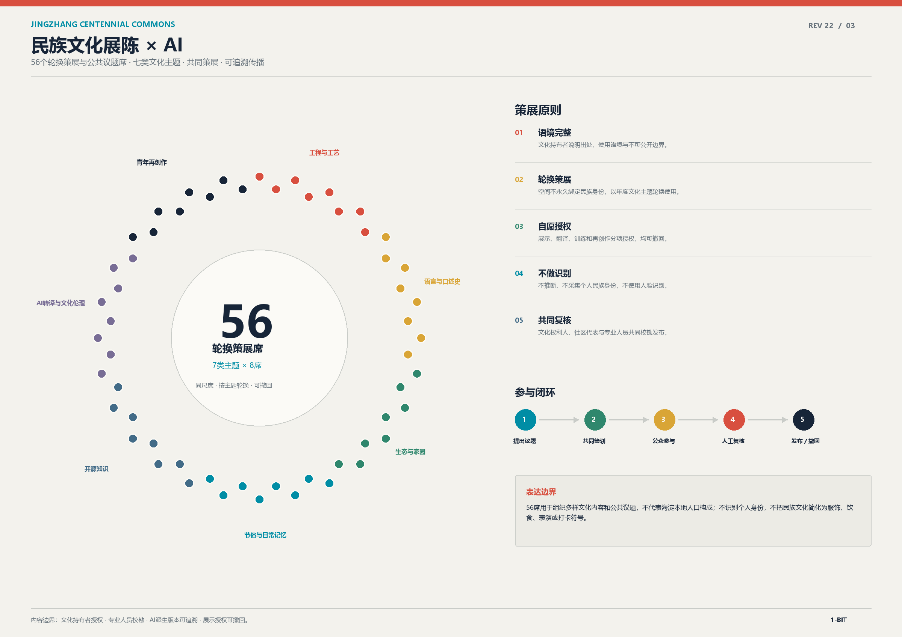

## 设计依据与资料清单

本方案以仓库提供的公开任务书、结构化 site package、来源登记和标准快照为设计依据。[source:SITE-PACKAGE] 提供项目范围层级、坐标政策、枚举代码、schema 和确定性校验规则；[source:OFFICIAL-ANNOUNCEMENT] 用于确认 43.6 km² 统筹研究范围、约 11.4 km² 总体设计范围、三处重点区域和成果语境；[source:HAIDIAN-JINGZHANG-CONTROL-PLAN-DRAFT] 提供HD00-1601等街区的官方草案栅格图件、空间结构和2035年汇总指标；[source:HAIDIAN-2026-GOVERNMENT-WORK-REPORT] 更新控规已通过技术审查的状态；[source:BEIJING-FRC-JINGZHANG-PHASE2-IMPLEMENTATION-APPROVAL]、[source:BEIJING-FRC-JINGZHANG-PHASE2-TENDER-SCHEME] 与 [source:BEIJING-GGZY-JINGZHANG-PHASE2-CONSTRUCTION-TENDER] 提供既有二期工程的审批、投资、工期和专业范围基线；[source:BEIJING-HERITAGE-BATCH11-NOTICE] 确认清华园车站旧址的现行文保身份；[source:AGENT-TASKBOOK] 用于落实三大定位、五大功能、三区两翼、六项 Agent 任务、十条共创原则和概念建议边界。[source:SOURCE-REGISTRY] 用于区分 formal 可用、背景和 provisional 资料；[source:PROCESSED-FACT-PACK] 只作为 Agent 可读导航，不被升级为新的权威来源。

[source:BEIJING-GGZY-BLUEHOME-LAND-2025] 及其公开附件把大钟寺片区的数据补充到地块级：[source:BEIJING-GGZY-BLUEHOME-SURVEY-2025] 的 `2025规自（海）测字0074号` 公开 [metric:bluehome_official_survey_point_count] 个原始Y/X界址点和9个地块/道路点序，总勘测面积 [metric:bluehome_official_total_area_sqm] 平方米，其中建设用地 [metric:bluehome_official_building_land_area_sqm] 平方米、规划道路 [metric:bluehome_official_planned_road_area_sqm] 平方米；[source:BEIJING-GGZY-BLUEHOME-PLANNING-2025] 公开01和03A出让子地块合计 [metric:bluehome_sale_subset_area_sqm] 平方米、地上建筑规模 [metric:bluehome_sale_subset_gross_floor_area_sqm] 平方米及分地块容积率、高度和绿地率。[source:BEIJING-GHZY-BLUEHOME-CASE-2026] 将约3.95公顷项目明确置于大钟寺试点片区，并记录2026年取得土地与前期手续状态。这些资料已用于纠正早期 `PROV-KEY-003` 误落在西直门附近的问题；但公开勘测报告未注明CRS，部分边界含圆弧，本包只在 `visual/assets/bluehome_official_survey_local.json` 原样保存点表，不猜测坐标系、不生成伪WGS84地块。蓝景丽家3.95公顷子项目也不等于公告72.0公顷大钟寺重点区。坐标假设边界见 `A-BLUEHOME-COORDINATE-001`。

官方并非完全没有公开规划资料：[source:HAIDIAN-JINGZHANG-CONTROL-PLAN-DRAFT] 已公开HD00-1601等街区规划范围的栅格图件和草案汇总指标，[source:BEIJING-HERITAGE-BATCH11-NOTICE] 也已确认清华园车站旧址的市级文保身份。但前者不等同于征集公告约11.4 km²总体设计范围或三处重点区；后者明确说明保护范围及建设控制地带图纸另行印发。公开页面仍没有可计算的竞赛SHP/GeoJSON/CAD/坐标表、最终地块图则、道路红线、权属、文保控制几何和市政条件。因此本包仍使用 [source:BOUNDARY-SOURCE] 与 [source:KEY-AREA-SOURCE] 所登记的 provisional rough polygon，仅支撑 intake、可视化和概念讨论。`geometry/site_boundary.geojson` 的 `SITE-001`、`geometry/key_areas.geojson` 的 `PROV-KEY-001` 至 `PROV-KEY-003` 均明确写有 `official_boundary=false`、`geometry_role=provisional_constraint` 和使用限制。[standard:PROJECT-OFFICIAL-ANNOUNCEMENT]、[standard:PROJECT-AGENT-OPEN-CALL-TASKBOOK]、[standard:MOHURD-URBAN-DESIGN-MEASURES]、[standard:MOHURD-CONTROL-DETAILED-PLANNING] 与 [standard:MNR-LAND-USE-CLASSIFICATION-GUIDE] 作为本方案的表达和证据框架；[standard:MOHURD-ARCH-DESIGN-DEPTH-2016] 因本地参考快照缺少可确认的正式文件，保持 data_gap，不被写成已满足的权威依据。

[source:TIANDITU-HAIDIAN-OFFICIAL-GEO-CATALOG] 进一步证明官方并非没有高精度成果：全国地理信息资源目录按“全国/北京/海淀区—矢量地图数据/陆地—1:500”筛选显示 [metric:tianditu_haidian_1_500_catalog_record_count] 条目录记录；叠加同一 provisional SITE-001 WKT 后得到 [metric:tianditu_project_1_500_catalog_record_count] 条历史版本记录，按图幅号去重为 [metric:tianditu_project_1_500_unique_sheet_count] 幅，其中最新目录版本为2024版 [metric:tianditu_project_1_500_latest_2024_sheet_count] 幅、2021版 [metric:tianditu_project_1_500_latest_2021_sheet_count] 幅。抽查1:500、1:2000和1:10000详情均标注“密级：秘密”，格式为DWG，分发单位为北京市测绘设计研究院；因此本包只记录公开元数据和合规申请路径，不下载、不复制、不反推受控图形，也不把图幅索引误作项目红线。

资料和生成边界的处理方法是：先用官方草案栅格核对规划范围、道路骨架、蓝绿关系和节点名称，再锁定 provisional 计算约束，用同一临时边界派生用地、建筑、道路、绿地、公共空间和分期，最后将坐标转换为 EPSG:4548 复算空间指标。官方栅格不被反向宣称为精确坐标；所有生成层均标记为 `agent_generated_design` 或 `agent_inferred_from_public_data`，不使用个人、企业或未授权空间资料；案例和技术机制只作背景观察，不承担本项目的法定控制或投资承诺。

[source:OPENSTREETMAP-JINGZHANG-EXISTING-CONTEXT] 进一步补充 ODbL 开放现状参考：在 WGS84 bbox `39.939,116.3397,40.0265,116.3553` 内下载并按 provisional SITE-001 裁切，形成 [metric:osm_existing_building_feature_count] 个建筑面、[metric:osm_existing_road_feature_count] 段道路、[metric:osm_existing_rail_feature_count] 段轨道、[metric:osm_existing_water_feature_count] 个水系对象和 [metric:osm_existing_poi_feature_count] 个设施/交通点。按 EPSG:4548 复算，建筑面要素面积合计为 [metric:osm_existing_building_footprint_area_sqm] 平方米，道路线长 [metric:osm_existing_road_length_m] 米，其中步行/骑行等主动交通标签线长 [metric:osm_existing_active_mobility_length_m] 米；轨道线长 [metric:osm_existing_rail_length_m] 米，水系线长 [metric:osm_existing_water_line_length_m] 米、水面面积 [metric:osm_existing_water_polygon_area_sqm] 平方米。每个对象保留 OSM ID、source_id、快照哈希和 `existing_condition` 角色；这些数据提高概念阶段现状覆盖，但不替代测绘、权属、许可、道路红线、管线、文保或轨道保护条件。

[source:ESA-WORLDCOVER-JINGZHANG-2021] 再补入一层可直接下载、可计算且许可清晰的历史地表覆盖：从CC BY 4.0免登录COG中只读取项目相交瓦片，以provisional SITE-001遮罩形成 `visual/assets/worldcover_2021_classes.png` 和配套统计JSON；无损灰度PNG的像元值保留原始WorldCover分类码，JSON保存EPSG:4326原点、像元尺寸、nodata和分类表。裁片共 [metric:worldcover_2021_valid_pixel_count] 个有效像元、估算覆盖 [metric:worldcover_2021_estimated_covered_area_sqm] 平方米。2021年分类中建成区像元占 [metric:worldcover_2021_built_up_share]、树木覆盖占 [metric:worldcover_2021_tree_cover_share]、永久水体占 [metric:worldcover_2021_permanent_water_share]。该约10 m产品只能辅助识别2021年地表覆盖和现场复核优先级，不是2026现状、法定用地、绿地率、蓝线或测绘结论。

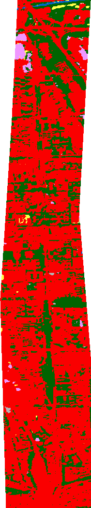

[source:COPERNICUS-DEM-GLO30-JINGZHANG] 地形背景采用官方Copernicus DEM GLO-30 Public：官方产品页确认其为全球免费许可、1弧秒（约30 m）的数字表面模型，AWS开放数据登记页提供免账户COG。本包只按HTTP字节范围读取跨39°/40°纬线的两个内部块，保存对象ETag、长度、块范围与SHA-256，生成57×315的16位无损高程裁片和统计JSON；临时范围内有 [metric:copdem_glo30_valid_sample_count] 个有效样本，表面高程最低 [metric:copdem_glo30_surface_elevation_min_m] m、最高 [metric:copdem_glo30_surface_elevation_max_m] m、平均 [metric:copdem_glo30_surface_elevation_mean_m] m、中位 [metric:copdem_glo30_surface_elevation_median_m] m，高差 [metric:copdem_glo30_surface_relief_m] m。3×3有效邻域共有 [metric:copdem_glo30_surface_slope_valid_sample_count] 个表面坡度样本，中位数为 [metric:copdem_glo30_surface_slope_median_deg]°，95分位为 [metric:copdem_glo30_surface_slope_p95_deg]°；其中小于2°占 [metric:copdem_glo30_surface_slope_under_2deg_share]，2°至小于5°占 [metric:copdem_glo30_surface_slope_2_to_under_5deg_share]，5°至小于15°占 [metric:copdem_glo30_surface_slope_5_to_under_15deg_share]，15°及以上占 [metric:copdem_glo30_surface_slope_15deg_or_more_share]。高分位会被建筑、基础设施和植被表面放大，只用于标记复测优先级。源数据主要采集于2011-2015年，且裁切边界仍为provisional SITE-001，不能据此推断2026裸地地形、排水方向、洪水、土方、无障碍坡度、管线标高或工程验收。

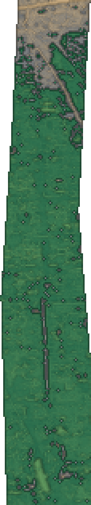

[source:JRC-GSW-V15-JINGZHANG] 长期水体背景采用JRC Global Surface Water v1.5。官方页面确认occurrence和transitions汇总1984-2024 Landsat观测，included maximum-extent为2022-2024；数据可免费使用，地图需标注`Source: EC JRC/Google`并引用Pekel等（2016）。本包按Range提取六个相交源对象，保留URL、长度、ETag、Google generation、Last-Modified、头/IFD/项目行范围及SHA-256，并核对官方QML。临时范围共有 [metric:jrc_gsw_v15_site_pixel_count] 个有效像元，其中occurrence检出 [metric:jrc_gsw_v15_water_detected_pixel_count] 个、占 [metric:jrc_gsw_v15_water_detected_share]、估算 [metric:jrc_gsw_v15_water_detected_estimated_area_sqm] 平方米；检出像元平均发生频率 [metric:jrc_gsw_v15_detected_mean_occurrence_percent]%，最高 [metric:jrc_gsw_v15_detected_max_occurrence_percent]%，75%以上像元为 [metric:jrc_gsw_v15_high_occurrence_75plus_pixel_count] 个。官方transition代码中new permanent为 [metric:jrc_gsw_v15_new_permanent_pixel_count] 个、new seasonal为 [metric:jrc_gsw_v15_new_seasonal_pixel_count] 个、ephemeral seasonal为 [metric:jrc_gsw_v15_ephemeral_seasonal_pixel_count] 个；2022-2024 maximum-extent水体为 [metric:jrc_gsw_v15_max_extent_2022_2024_water_pixel_count] 个像元、占 [metric:jrc_gsw_v15_max_extent_2022_2024_water_share]、估算 [metric:jrc_gsw_v15_max_extent_2022_2024_water_estimated_area_sqm] 平方米。所有数值只作约30 m长期观测筛查；低频或未检出不能证明窄、覆盖、间歇或近期变化的水系不存在，配准偏差也会影响少量像元，不能替代蓝线、排水、防洪、水质、现状测量或工程结论。

[source:COPERNICUS-SENTINEL2-L2A-JINGZHANG-20260715] 近期光学现状采用Copernicus Sentinel-2B L2A产品`S2B_MSIL2A_20260715T030519_N0512_R075_T50TMK_20260715T060222.SAFE`。官方CDSE与Earth Search在2026-07-01至08-08均返回19景，本包选择7月15日最低云量场景；公开COG记录云量 [metric:sentinel2_20260715_scene_cloud_cover_percent]%。产品名、平台、MGRS-50TMK、处理基线、生成时间和太阳角度均已交叉核对；从免账户COG镜像只读取B02/B03/B04/B08和SCL各两个项目块。10 m临时范围有 [metric:sentinel2_20260715_site_10m_pixel_count] 个像元，通过非空值与SCL筛查 [metric:sentinel2_20260715_analysis_valid_pixel_count] 个、占 [metric:sentinel2_20260715_analysis_valid_share]；20 m SCL有 [metric:sentinel2_20260715_scl_site_20m_pixel_count] 个场地像元，其中vegetation [metric:sentinel2_20260715_scl_vegetation_pixel_count] 个、占 [metric:sentinel2_20260715_scl_vegetation_share]，not vegetated [metric:sentinel2_20260715_scl_not_vegetated_pixel_count] 个、占 [metric:sentinel2_20260715_scl_not_vegetated_share]，topographic shadow [metric:sentinel2_20260715_scl_topographic_shadow_pixel_count] 个、占 [metric:sentinel2_20260715_scl_topographic_shadow_share]，water [metric:sentinel2_20260715_scl_water_pixel_count] 个、占 [metric:sentinel2_20260715_scl_water_share]。按发布scale/offset和SCL计算，NDVI中位数为 [metric:sentinel2_20260715_ndvi_median]，大于0.30为 [metric:sentinel2_20260715_ndvi_above_030_pixel_count] 个、占 [metric:sentinel2_20260715_ndvi_above_030_share]，大于0.50为 [metric:sentinel2_20260715_ndvi_above_050_pixel_count] 个、占 [metric:sentinel2_20260715_ndvi_above_050_share]；McFeeters NDWI中位数为 [metric:sentinel2_20260715_ndwi_median]，大于0为 [metric:sentinel2_20260715_ndwi_above_0_pixel_count] 个、占 [metric:sentinel2_20260715_ndwi_above_0_share]。单景、混合像元、阴影、屋顶、10-20 m分辨率和临时裁切会影响结果；这些指数不是树木、水体、蓝线、排水、洪水或现场清单。署名：`Contains modified Copernicus Sentinel data [2026]`。

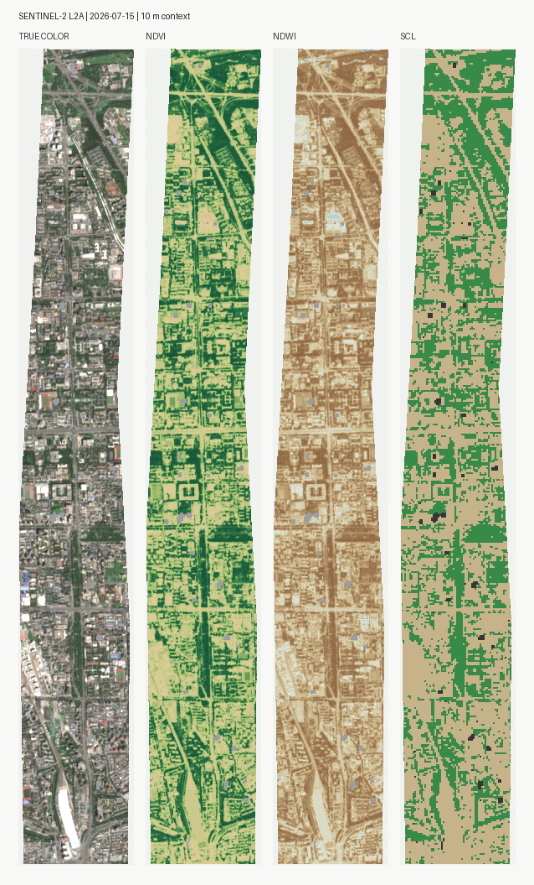

[source:OVERTURE-MAPS-BUILDINGS-JINGZHANG-20260722] 建筑轮廓进一步采用Overture Maps Buildings `2026-07-22.0`发布。官方客户端按同一bbox返回 [metric:overture_building_raw_bbox_feature_count] 条记录，几何校验并按provisional SITE-001裁切后为 [metric:overture_building_site_feature_count] 条；其中 [metric:overture_building_osm_source_feature_count] 条含OpenStreetMap来源，与本包已有OSM记录直接匹配 [metric:overture_building_direct_osm_record_match_count] 条，全部从新增层排除。另有 [metric:overture_building_east_asia_source_feature_count] 条仅来自公开东亚建筑数据集 `doi:10.5281/zenodo.8174931`，本包将这 [metric:overture_building_increment_feature_count] 条作为非OSM增量接入。完整Overture裁切联合面积为 [metric:overture_building_full_union_area_sqm] 平方米，原OSM联合面积为 [metric:overture_building_existing_osm_union_area_sqm] 平方米；所保留增量的要素面积合计 [metric:overture_building_increment_sum_area_sqm] 平方米、联合面积 [metric:overture_building_increment_union_area_sqm] 平方米，与OSM仅重叠 [metric:overture_building_increment_overlap_with_osm_sqm] 平方米，实际新增联合覆盖 [metric:overture_building_increment_over_osm_area_sqm] 平方米，相对OSM增加 [metric:overture_building_increment_gain_ratio]。合并后现状建筑共 [metric:overture_building_combined_existing_feature_count] 条，联合面积 [metric:overture_building_combined_union_area_sqm] 平方米，占临时场地 [metric:overture_building_combined_union_site_share]。所有面积均以EPSG:4548联合几何复算，避免以要素面积简单相加夸大覆盖。建筑主题依据ODbL使用，署名为 `© OpenStreetMap contributors, Overture Maps Foundation`；上游东亚数据集为CC BY 4.0。发布日不是采集/测量日，自动轮廓仍可能漏检、误检、屋顶位移或概化，因此只补足公开概念现状，不替代测绘、权属、许可、建筑属性、拆改、工程或验收结论。

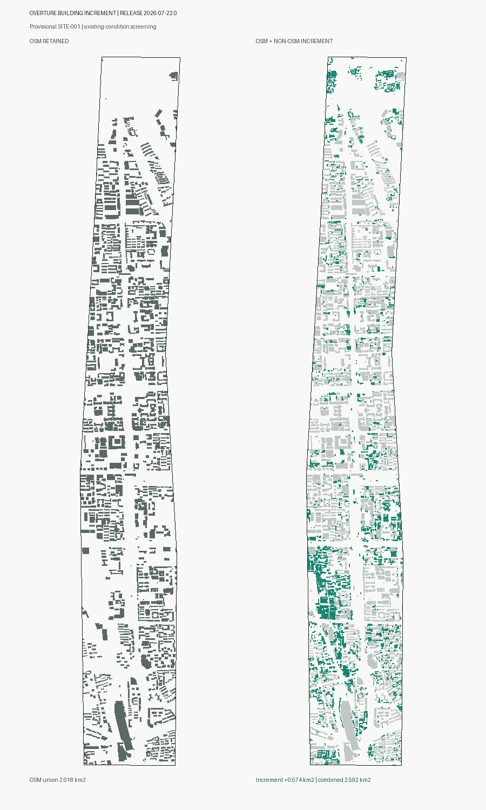

[source:JRC-GHSL-BUILT-H-R2023A-JINGZHANG-2018] 建筑体量背景进一步采用欧盟JRC GHS-BUILT-H R2023A。官方说明2018产品由SRTM30（2000）、AW3D30（2006-2011）和2018 Sentinel-2阴影标记经全球模型生成；本包下载WGS84 3弧秒R5_C30瓦片的AGBH与ANBH完整ZIP，核验ZIP/TIFF哈希、ETag、Last-Modified、CRC、float32/LZW/256瓦片、EPSG:4326和PixelIsArea标签，再按临时SITE-001像元中心裁切。两层同时有效 [metric:ghsl_builth_2018_valid_sample_count] 个样本。AGBH表示每个网格总表面积上的建筑体积密度，不是平均建筑高度；其均值 [metric:ghsl_builth_2018_agbh_mean_m3_per_m2] m³/m²、中位数 [metric:ghsl_builth_2018_agbh_median_m3_per_m2] m³/m²、95分位 [metric:ghsl_builth_2018_agbh_p95_m3_per_m2] m³/m²、最大 [metric:ghsl_builth_2018_agbh_max_m3_per_m2] m³/m²。ANBH表示网格内建成表面的平均高度，最小 [metric:ghsl_builth_2018_anbh_min_m] m、平均 [metric:ghsl_builth_2018_anbh_mean_m] m、中位 [metric:ghsl_builth_2018_anbh_median_m] m、95分位 [metric:ghsl_builth_2018_anbh_p95_m] m、最大 [metric:ghsl_builth_2018_anbh_max_m] m；低于10 m占 [metric:ghsl_builth_2018_anbh_under_10m_share]，10至低于20 m占 [metric:ghsl_builth_2018_anbh_10_to_under_20m_share]，20至低于30 m占 [metric:ghsl_builth_2018_anbh_20_to_under_30m_share]，30至低于45 m占 [metric:ghsl_builth_2018_anbh_30_to_under_45m_share]，45 m及以上占 [metric:ghsl_builth_2018_anbh_45m_or_more_share]。所有值只作2018年约100 m网格体量筛查，不赋给单栋建筑；混合像元、全球模型误差、旧DEM输入和后续建设/拆除均会影响结果。因此正式高度控制 [metric:building_height_m] 继续保持unknown，仍需逐栋测绘与法定地块控制。

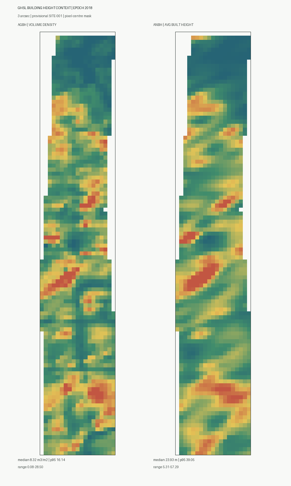

[source:JRC-GHSL-GHS-OBAT-R2024A-JINGZHANG-2020] 为补充公开逐栋属性，本包进一步采用欧盟JRC GHS-OBAT R2024A。官方产品把Overture 2024-07-22.0轮廓与GHSL栅格整合：高度是轮廓相交的约100 m ANBH有效像元均值，功能是10/100 m功能分类多数值，年代是约100 m GHS-AGE多数值，即2020建成表面达到50%的年代段，并非逐栋档案。中国完整CSV共 [metric:ghsl_obat_chn_national_record_count] 条；本包核验157865361字节ZIP的SHA-256、ETag、Last-Modified、成员大小和CRC后流式扫描，按provisional SITE-001选出 [metric:ghsl_obat_site_selected_record_count] 条。2024表与当前2026非OSM增量稳定ID直接命中 [metric:ghsl_obat_stable_gers_direct_match_count] 条，因此不强行跨版本关联；改以质心落入当前轮廓且面积相近的一对一规则接受 [metric:ghsl_obat_accepted_match_count] 条，占当前现状建筑 [metric:ghsl_obat_accepted_match_share]，其中高置信 [metric:ghsl_obat_high_confidence_match_count] 条、中置信 [metric:ghsl_obat_medium_confidence_match_count] 条。OSM现状层覆盖率为 [metric:ghsl_obat_osm_match_share]，当前Overture非OSM增量覆盖率仅 [metric:ghsl_obat_overture_non_osm_match_share]；另有 [metric:ghsl_obat_unmatched_selected_record_count] 条源记录和 [metric:ghsl_obat_unmatched_canonical_building_count] 条当前建筑未建立可靠对应。

在已接受子集中，模型高度均值 [metric:ghsl_obat_height_mean_m] m、中位数 [metric:ghsl_obat_height_median_m] m、95分位 [metric:ghsl_obat_height_p95_m] m；住宅或兼容混合功能占 [metric:ghsl_obat_residential_or_mixed_share]，非住宅占 [metric:ghsl_obat_non_residential_share]。模型年代标签中，1980年前占 [metric:ghsl_obat_epoch_before_1980_share]，1980年代占 [metric:ghsl_obat_epoch_1980s_share]，1990年代占 [metric:ghsl_obat_epoch_1990s_share]，2000年代占 [metric:ghsl_obat_epoch_2000s_share]，2010年代占 [metric:ghsl_obat_epoch_2010s_share]。这些比例只描述可关联子集，不能外推全部建筑。官方基于欧洲权威子集的验证显示高度特征级MAE为 [metric:ghsl_obat_eu_validation_height_mae_m] m，1980年前标签正确概率约 [metric:ghsl_obat_eu_validation_pre1980_correct_probability]，1980年后超过 [metric:ghsl_obat_eu_validation_post1980_correct_probability_floor]；小型非住宅识别不足，且官方报告指出中国Overture建筑可能明显少报。欧洲验证数值不是北京本地精度。因此表中属性只用于现场调查优先级，不替代实测高度、真实用途/年代、权属或法定控制；正式 [metric:building_height_m] 继续保持unknown。

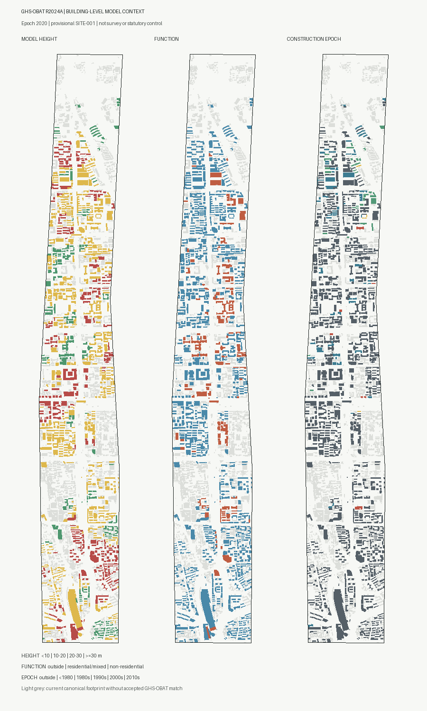

### 未纳入提交包的数据

TUM GlobalBuildingAtlas LoD1 与 GBA.Height 曾用于公开数据可用性研究，但其派生成果受 CC BY-NC 4.0 及潜在复合许可义务约束。为避免赛事、奖金或后续使用性质不确定造成授权风险，REV22 不分发相关属性表、统计、图片或派生指标，也不以其支撑任何设计结论；核验记录仅以 `sources.json#research_audit/evaluated_not_used` 的文字审计项保留。正式 [metric:building_height_m] 继续保持 unknown。

## 三层范围工作框架

三层范围不是三张彼此独立的图，而是“研究判断—空间结构—节点试验”的传导链。[depth:three_level_scope_framework] 以公告文字面积和 provisional 几何共同表达范围状态，不把粗略 polygon 误作官方红线。

- 统筹研究范围：约 43.6 km²，面向北五环至北京北站相关创新网络，研究海淀高校、园区、社区、遗址和京津冀协同的产业、人才、公共服务与未来城市策略。它回答“为什么在这里形成一条 AI 创新带”，而不是给出法定用地结论。
- 总体设计范围：公开资料约 11.4 km²，提交层 `SITE-001` 以 EPSG:4548 复算为 [metric:site_area_sqm] 11,412,825.386 sqm；该差异来自 provisional polygon，不覆盖公告的文字面积，[metric:official_overall_design_area_sqm] 11,400,000 sqm 仅作为公开公告记录。总体层将研究判断转译为“记忆绿脊—共智节点—原点客厅—信号市场”的空间结构。
- 重点设计范围：公告约 368.4 ha，三处重点区分别为众智园 192.1 ha、北京 AI 原点社区 104.3 ha、大钟寺 AI 产业集聚区 72.0 ha。`[data:geometry/key_areas.geojson#PROV-KEY-001]`、`[data:geometry/key_areas.geojson#PROV-KEY-002]`、`[data:geometry/key_areas.geojson#PROV-KEY-003]` 只表达临时位置和设计任务差异。

[source:BEIJING-AI-ORIGIN-COMMUNITY] 另有一个更大的官方政策口径：以五道口为核心的AI原点社区约 [metric:ai_origin_community_policy_area_sqm] 平方米。该约3平方公里创新街区是背景范围，不等于征集公告104.3公顷原点社区重点设计区；两种口径不互相覆盖、不据此生成polygon。

[source:BEIJING-AI-ORIGIN-2026-ECOSYSTEM] 对这一更大政策社区补充了科研和企业生态基线：37所高校、10个新型研发机构、52个全国重点实验室、106个国家级科研机构、约1.23万名AI学者，以及439家入驻企业，其中325家为AI企业、公开占比74%。这些数值分别登记为 [metric:ai_origin_university_count]、[metric:ai_origin_new_research_institution_count]、[metric:ai_origin_national_key_lab_count]、[metric:ai_origin_national_research_organization_count]、[metric:ai_origin_ai_scholar_count]、[metric:ai_origin_resident_enterprise_count]、[metric:ai_origin_ai_enterprise_count] 和 [metric:ai_origin_ai_enterprise_share]；均不解释为104.3公顷重点区内部统计或地块级分布。

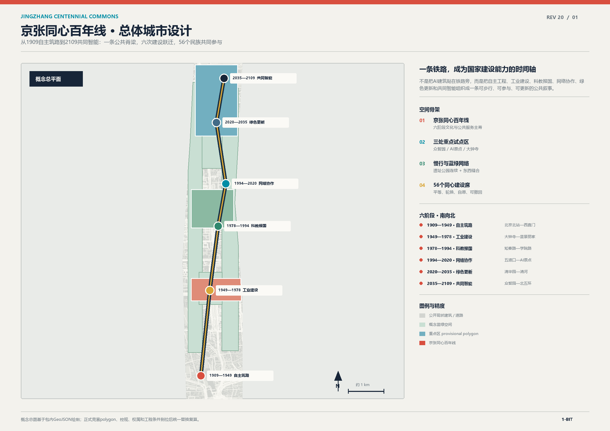

三层范围由两条可体验的“翼”连接：中关村科技服务翼把资本、知识产权、标准和要素配置转成服务接口；小月河场景赋能翼把教育、医疗、法律、生活服务和公共体验转成低侵入场景。两翼不是新增规划红线，而是可由运营、公共空间和服务节点逐步验证的协同关系。[data:geometry/roads.geojson#ROAD-002] 表达小月河东西缝合的概念慢行关系，[data:geometry/public_space.geojson#PUBLIC-005] 表达场景赋能的公共界面。

## 统筹研究范围产业与未来城市研究

海淀 AI 创新带的竞争力不只在企业数量，而在“研究—开源—测试—标准—生活—传播”之间能否形成可复用的循环。共智环提出三个判断：第一，研发空间必须对公共知识和安全治理可读；第二，创新人才需要与日常居住、学习、休闲和文化体验在短距离内相遇；第三，城市智能的价值要通过公共利益、隐私边界和人工复核来建立信任。[depth:existing_conditions_diagnosis] 将这些判断转译成后续可核对的空间对象，而不编造企业、产值、投资额或财政安排。

AI 生态案例只作机制启发，不作海淀的直接复制。六个背景案例为：伦敦 King’s Cross 的遗产更新与创新办公混合、巴黎 Station F 的创业社区与开放活动、赫尔辛基 Oodi 的公共知识空间、新加坡 Punggol Digital District 的产业与教育协同、多伦多 MaRS 的科研转化平台、深圳南山的产业—社区复合。它们共同提示可转化的机制：一是把研发成果转成公共可读的展示和学习；二是把共享设施、活动和人才服务设成城市接口；三是用数据治理和运营协议保护公共利益。[source:BACKGROUND-CASES] 仅承担结构性观察，未将这些案例的经营数据写入本项目指标。

“可审计城市”是共智环的未来城市策略：每个 AI 场景都要有空间载体、服务对象、数据来源、授权边界、人工复核和退出机制；每个空间指标都要能回溯到 GeoJSON 或公开来源；每个运营活动都要说明谁组织、谁受益、什么条件尚未确认。由 [data:geometry/constraints.geojson#CONSTRAINT-001] 和 [data:geometry/constraints.geojson#CONSTRAINT-002] 表达的线仅是待确认的轨道、文保、蓝线、道路和市政接口，不能视为官方控制线。

## 总体设计范围城市更新与控规深度城市设计

总体设计采用“一环、三站、两翼、四类接口”的结构。[depth:overall_spatial_structure] 以共智环为公共空间主线：一环是京张记忆慢行环；三站是共智工坊、原点客厅、信号市场三类节点；两翼是中关村科技服务翼与小月河场景赋能翼；四类接口是研发治理、开源生活、产业传播、蓝绿公共服务。它们构成从知识生产到公共体验的协同回路，而不是固定的建设顺序。

`geometry/land_use.geojson` 将同一个 `SITE-001` 切分为五类概念分区：[data:geometry/land_use.geojson#LU-001] 为 0802 全栈研发与标准治理，[data:geometry/land_use.geojson#LU-002] 为 1401 京张记忆绿脊，[data:geometry/land_use.geojson#LU-003] 为 05 智能原生产业服务，[data:geometry/land_use.geojson#LU-004] 为 0702 人才与社区服务，[data:geometry/land_use.geojson#LU-005] 为 0803 文化与国际传播。[standard:MNR-LAND-USE-CLASSIFICATION-GUIDE] 只用于分类逻辑；这些分区不代表控规调整、土地权属或法定用途变更。

更新方法是“先公共、后节点；先可逆、后深化”：先用导视、遮荫、座椅、无障碍、慢行接驳和活动规则验证公共需求，再由专业团队依据权属、消防、交通、文保、市政和正式控规条件研究建筑与地块。`geometry/buildings.geojson` 中的 [data:geometry/buildings.geojson#BLDG-001] 至 `BLDG-008` 只表达保留/改造/新建类型化原型，不给出具体地块拆改、建筑高度或开发强度结论。[standard:MOHURD-CONTROL-DETAILED-PLANNING] 要求把已知条件、设计建议和待确认事项分开，本方案以 [metric:floor_area_ratio] 和 [metric:building_height_m] 的 unknown 状态保留这一边界。

总体空间还要支持传统市政与 AI 新基建的兼容：公共服务节点可以提供预约、导视、共享算力入口和知识活动，但不把算力容量、能源负荷、管线或消防能力写成已确定事实。[depth:municipal_new_infrastructure] 的可交付证据是公共节点、分期依赖和待补资料清单，正式工程设计仍需另行审查。

## 重点区域详细设计

三处重点区各自承担一项公共任务，又被共智环串成体验路径。[depth:three_key_area_detailed_design] 要求每个区域同时说明功能、建筑、交通、公共空间、AI 场景和实施前置条件；本方案用 provisional polygon 表达位置，用设计层表达关系。

### 众智园 AI 自主创新加速区 / 共智工坊

众智园是北段的“可读研发区”：研发、标准、安全治理和低碳创新不封闭在建筑内部，而通过 [data:geometry/public_space.geojson#PUBLIC-003] 的测试庭院、[data:geometry/buildings.geojson#BLDG-001] 的共智工坊测试楼和 [data:geometry/green_space.geojson#GREEN-003] 的北段绿廊形成公众可理解的界面。建议由预约制安全治理沙盒、标准工作坊、端侧算力驿站和低碳创新廊组成四个可拆分模块；它们是供专业团队深化的参考方案，不构成企业搬迁、投资或运营承诺。交通以 [data:geometry/roads.geojson#ROAD-004] 的公共步行线连接北段节点，轨道、道路红线、清河蓝线和防洪条件待正式资料确认。

### 北京 AI 原点社区 / 开源客厅

原点社区是中段的“日常创新社区”：高校师生、开源开发者、初创团队、周边居民和访客可以在同一条公共路径上相遇。`[data:geometry/buildings.geojson#BLDG-003]` 的原点开源发布厅、`[data:geometry/buildings.geojson#BLDG-004]` 的近校成果转化驿站、`[data:geometry/public_space.geojson#PUBLIC-002]` 的原点开源客厅与 [data:geometry/roads.geojson#ROAD-005] 的社区微循环共同支撑发布、学习、生活和成果转化。保留/改造只表示一种低扰动策略，真实产权、校园边界、首层业态和交通安全需由权属方和专业团队复核。

### 大钟寺 AI 产业集聚区 / 信号市场

大钟寺是南段的“城市型智能经济界面”：面向智能体、智能终端、内容消费、数据要素和国际交流，形成 [data:geometry/public_space.geojson#PUBLIC-004] 的信号前场、[data:geometry/buildings.geojson#BLDG-005] 的国际路演客厅和 [data:geometry/buildings.geojson#BLDG-006] 的端侧智能终端街角。建议以四象限步行连通、站点接驳、企业案例清权展示和数据治理会客厅建立体验；不得擅自改造企业权属空间，不把商业招商、企业名单或大钟寺站工程改造写成确定安排。

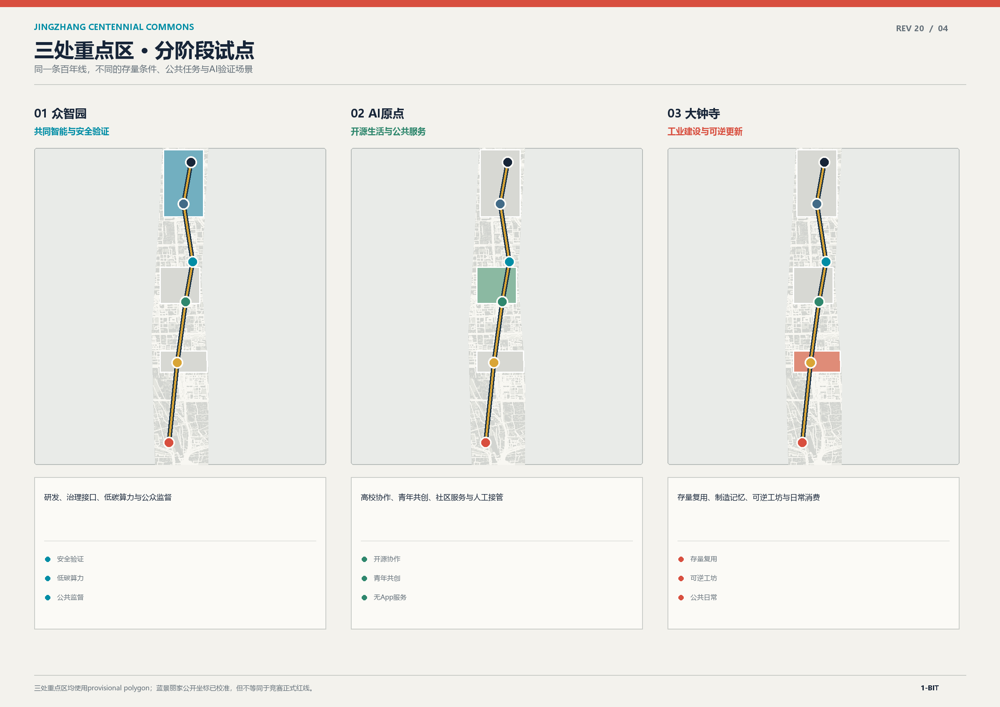

## AI 创新生态、人才画像与 AI+ 场景

AI 创新生态由“机制八件套”组成：开放空间、可预约测试、标准与安全、算力入口、数据授权、人才服务、场景开放、成果传播。众智园承担全栈与治理，原点社区承担开源和人才日常，大钟寺承担产业与国际传播；中关村科技服务翼连接知识产权、资本、标准和要素服务，小月河场景赋能翼把技术变成居民可感知的公共体验。这些是 [depth:overall_spatial_structure] 的运营化延伸，不是政策、资金或招商承诺。

<!-- REV06_OFFICIAL_ECOSYSTEM_CONTEXT -->

<!-- REV07_OFFICIAL_CONTROL_EVIDENCE -->
[source:HAIDIAN-JINGZHANG-CONTROL-PLAN-DRAFT] 海淀区政府2024-12-19公示已公开《HD00-1601等街区控制性详细规划（街区层面）（2022-2035年）（草案）》一张图读懂附件。官方草案给出‘一带一轴、两心多点’空间结构，并记录2035年常住人口约 [metric:control_plan_2035_resident_population_persons] 人、城乡建设用地约 [metric:control_plan_2035_urban_construction_land_sqm] 平方米、建筑规模约 [metric:control_plan_2035_building_floor_area_sqm] 平方米。附件同时标注图纸为方案过程稿、最终以规划审批为准；这些数值属于HD00-1601等街区草案汇总，不能替代竞赛11.4平方公里范围或三处重点区的精确polygon，也不能据此计算本方案容积率。

[source:HAIDIAN-2026-GOVERNMENT-WORK-REPORT] 海淀区2026年《政府工作报告》进一步明确京张铁路遗址公园沿线街区控规已通过技术审查。技术审查说明规划成熟度高于‘正在编制’，但不等同于市政府批复、法定红线生效或项目实施承诺。此前 [source:HAIDIAN-JINGZHANG-CONTROL-PLAN-STATUS] 仅保留为2025年任务进展的历史记录。
海淀全区的官方量化基线来自 [source:HAIDIAN-2025-STATISTICAL-BULLETIN]《海淀区2025年国民经济和社会发展统计公报》：[metric:haidian_resident_population_2025_persons] 为年末常住人口，[metric:haidian_national_key_laboratory_count_2025] 为全国重点实验室数量，[metric:haidian_large_model_filing_count_2025] 为备案上线大模型数量，[metric:haidian_effective_invention_patent_count_2025] 为有效发明专利数量，[metric:haidian_technical_contract_value_2025_yi_cny] 为技术合同成交额。人才生活与城市服务背景同时记录 [metric:haidian_medical_institution_count_2025] 个医疗卫生机构、[metric:haidian_sports_venue_count_2025] 个体育场地和 [metric:haidian_pm25_annual_mean_2025_ug_m3] 微克/立方米 PM2.5 年均浓度。公报明确2025年数据为初步数，以上均是海淀全区背景，不是项目范围指标或未来绩效承诺。

机制设计以 [source:HAIDIAN-AI-POLICY-2025] 中科城〔2025〕91号现行有效政策作校准；其 [metric:haidian_ai_policy_measure_count] 条措施覆盖技术、算力、数据、共性平台、场景、模型、人才、孵化、金融和国际合作。本方案只借鉴机制分类，不把政策中的资金上限、补贴比例或支持条件写成项目已获资格、已获资金或确定实施。

### 12 张 AI 场景卡

每张场景卡都要求服务对象、空间、数据边界和人工复核。以下 12 张卡中，前四张标记为产业测试验证场景：

1. **安全治理沙盒（产业测试）**：众智园测试庭院；验证模型红队、审计报告和人工签核；不使用未授权数据。
2. **端侧算力驿站（产业测试）**：共智工坊服务节点；验证低功耗推理和公共服务接口；能源与容量待专业确认。
3. **多模态城市导视（产业测试）**：记忆绿脊；验证无障碍导视、历史叙事和人工纠错；不识别个人身份。
4. **智能终端可用性实验（产业测试）**：大钟寺信号市场；验证终端、内容和公共空间交互；企业案例须清权。
5. **开源发布厅**：原点社区；面向高校、开发者和居民的成果发布与代码贡献展示。
6. **近校成果转化街**：原点社区；连接孵化、法务、知识产权和生活服务，采用预约和公开规则。
7. **AI 慢行导航**：京张记忆慢行环；以聚合拥挤和无障碍反馈辅助维护，不采集个人轨迹。
8. **清河低碳创新廊**：众智园临河界面；把雨洪教育、骑行、步行和低碳算力故事合成公共课堂。
9. **AI 生活服务样板街**：社区与商业交汇处；支持医疗、教育、法律和生活服务的信息解释，保留人工窗口。
10. **数据要素会客厅**：大钟寺；展示授权、可追溯、可撤回的数据资产流程，不承诺交易收益。
11. **全球 AI 活动周路线**：遗址、公园、原点、众智园和大钟寺；以步行线路连接文化、开源、产业和公共体验。
12. **公共设施协同维护**：蓝绿空间和公共节点；以公开工单、人工巡检和聚合统计提升维护透明度。

### 用户画像与场景—空间—运营映射

六类画像分别是：开源开发者（发布、协作、声誉，对应原点客厅和开源发布厅，由社区运营）；初创团队（低成本办公、测试、法务，对应众智园和科技服务翼，由共享服务方运营）；头部企业访客（展示、招聘、国际交流，对应大钟寺信号市场，由企业与公共运营方共同清权）；高校师生（成果转化、学习、日常慢行，对应原点社区和近校成果转化街，由校地协作深化）；周边居民（通勤、休闲、社区服务，对应记忆绿脊和生活服务样板街，由公共空间运营方维护）；无障碍与银发使用者（安全、连续、可解释的公共服务，对应全环慢行和节点导视，由人工服务台和无障碍顾问复核）。[metric:user_persona_count] 为 6，所有画像只用于公共服务设计，不用于个人评分或商业推荐。

### 隐私、人工复核和运营主体

场景采用数据最小化、公开来源、可解释输出、人工兜底和可撤回五条规则。城市智能体可以辅助识别慢行断点、设施工单、活动风险和服务需求，但不能替代规划审批、医疗/法律专业判断或公共安全决策。场景上线前应由空间运营方、专业顾问、数据保护责任人和公众代表共同审查；试点结束后必须公布问题、撤回数据和停用条件。[depth:risk_missing_data] 与 [source:AGENT-TASKBOOK] 共同约束这一边界。

## 用地、建筑规模与拆改留方案

用地分类遵循 [standard:MNR-LAND-USE-CLASSIFICATION-GUIDE] 的代码逻辑；[data:geometry/land_use.geojson#LU-001] 至 `LU-005` 由同一临时边界切分，`[metric:land_use_partition_area_sqm]` 与 [metric:site_area_sqm] 可复算对照。用地分区是功能关系的概念表达，不是控规调整、土地供应或权属结论。

建筑策略分为保留、改造、新建概念原型和待确认四类：[data:geometry/buildings.geojson#BLDG-001] 和 `BLDG-003` 采用保留/改造优先，[data:geometry/buildings.geojson#BLDG-002]、`BLDG-004`、`BLDG-007` 作为轻量新建概念，[data:geometry/buildings.geojson#BLDG-005]、`BLDG-006`、`BLDG-008` 作为混合服务原型。[depth:retain_renovate_demolish] 只检查分类方法和证据链，不给出具体地块拆改结论。它们表达功能和公共界面，不代表具体地块拆改；权属、结构、消防、文保和首层运营条件全部待确认。

本包由 [metric:building_footprint_area_sqm] 记录 `geometry/buildings.geojson` 中现状参考建筑与概念建筑原型的基底并集面积，由 [metric:building_density_design_ratio] 表达“该并集面积/提交边界”的图层覆盖观察值。二者用于核验提交图层的空间一致性，不代表新增建设量，也不等同于法定建筑密度；[metric:floor_area_ratio] 与 [metric:building_height_m] 保持 unknown。虽然官方草案公开了街区层面的总建筑规模 [metric:control_plan_2035_building_floor_area_sqm] 平方米，但其范围与竞赛总体设计边界不一致，且没有地块控制表，因此不能除以 `SITE-001` 推导容积率。[depth:development_intensity_controls] 明确将正式强度指标列为待确认，[depth:height_massing_character] 将体量、界面和风貌控制停留在方法层。风貌建议采用低反射、可维护、可步行的连续界面，重点控制人行尺度、首层可读性和遗产叙事，不提供固定高度、容积率、退线或道路红线。

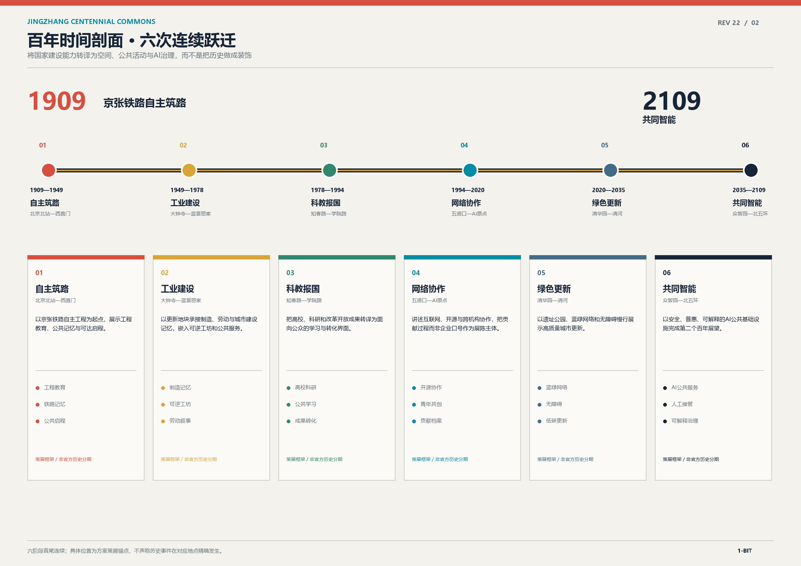

## 交通、轨道、市政与公共服务设施

交通概念以“轨道接驳—慢行主环—社区微循环—节点服务”四级关系表达。[data:geometry/roads.geojson#ROAD-001] 是京张记忆慢行环，[data:geometry/roads.geojson#ROAD-002] 是小月河场景赋能翼，[data:geometry/roads.geojson#ROAD-003] 是大钟寺及重点区的概念接驳，[data:geometry/roads.geojson#ROAD-004] 与 [data:geometry/roads.geojson#ROAD-005] 支撑北段公共步行和原点社区微循环。所有道路几何均为概念中心线，不代表道路红线、桥隧、轨道线位或市政工程方案。[depth:traffic_rail_slow_parking] 的后续复核对象包括断面、安全、无障碍、停车、非机动车停放、轨道站点接口和消防通达。

本轮新增一组可核验的官方公开空间资料：[source:BEIJING-JTW-OPEN-TRANSPORT] 北京市交通委员会“北京市交通出行数据下载”页面标注路侧停车位基础信息为“无条件开放”，数据字段包含停车场名、道路名、泊位数量、经度和纬度。按同一 provisional SITE-001 进行空间筛选并去重后，`geometry/public_space.geojson` 增加 19 个 `SCENARIO_NODE` 交通节点（首个证据为 [data:geometry/public_space.geojson#JTW-PARK-001]），对应 [metric:official_curb_parking_site_count] 19 处、[metric:official_curb_parking_capacity] 985 个泊位。该统计只表达公开停车设施的现状参考，不把筛选范围升级为官方红线，也不替代道路红线、停车管理或工程核查。

同时接入同一官方页面的运营目录 [source:BEIJING-JTW-TRANSIT-OPERATIONS]：轨道线路、轨道站点、公交线路和公交站点均标注为“无条件开放”。轨道表提供线路里程与首末班时间，公交表提供线路和站点名；在“大钟寺、知春路、西土城、五道口、清华东路西口、北京大学东门、海淀黄庄”等站名精确匹配的周边服务记录中，方案保留 [metric:official_nearby_station_service_record_count] 31 条运营证据，并以 [metric:official_rail_line_count]、[metric:official_rail_station_record_count]、[metric:official_bus_line_count] 和 [metric:official_bus_stop_record_count] 表达全市运营目录规模。由于这组表格不含可核验的项目坐标，未将其转换成项目空间点位；它们只支撑轨道接驳、首末班和公交服务的运营判断。

REV 05 来源复核以四份官方下载快照的 SHA-256 和精确站名匹配为准；不使用模糊包含匹配，也不以地名推测坐标。完整哈希、访问日期和筛选词表记录在 `sources.json` 与 `metrics.json`。

FINAL QA 已逐项核对正文、指标卡和离线展示中的 31 条匹配记录，确保同一证据在所有交付物中保持一致。

官方草案的设施汇总记录公共服务设施 [metric:control_plan_public_service_facility_count] 处、交通设施 [metric:control_plan_transport_facility_count] 处、市政设施 [metric:control_plan_municipal_facility_count] 处、城市安全设施 [metric:control_plan_urban_safety_facility_count] 处，并提出2035年集中建设区路网密度约 [metric:control_plan_2035_road_network_density_km_per_sqkm] 公里/平方公里、绿色出行比例 [metric:control_plan_2035_green_trip_share_percent]%。这些是街区草案目标，不代表本方案已完成设施容量、地块落位或交通工程论证。

公共服务设施沿节点布置：原点客厅提供开源发布、学习、人工服务和日常休憩；共智工坊提供安全治理沙盒、标准工作坊和算力入口；信号市场提供国际路演、数据授权解释和生活服务；绿脊节点提供导视、厕所、饮水、座椅、遮荫、无障碍和活动电源。端侧算力、分布式能源、排水、消防、通信和市政容量均需在正式附件和专业团队深化后确定，不以本方案的图形代替工程审查。

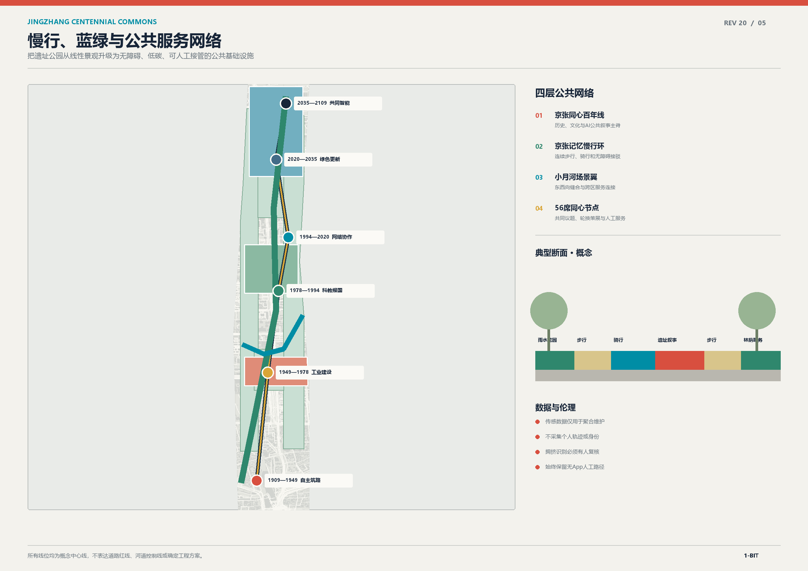

## 蓝绿空间、公共空间与城市风貌

京张遗址公园活力带采用“铁路记忆—清河生态—小月河场景—社区日常”的叙事顺序。[source:HAIDIAN-JINGZHANG-PHASE2-PROJECT] 官方项目页记录京张铁路遗址公共空间改造提升工程（二期）南起西直门、北至北五环，用地 [metric:jingzhang_phase2_land_area_sqm] 平方米、长度 [metric:jingzhang_phase2_length_m] 米，为走廊连续性提供现状尺度基线；页面没有工程polygon，不能替代竞赛红线。[depth:blue_green_public_space] 要求蓝绿、公共空间、慢行和风貌形成可复核关系。`[data:geometry/green_space.geojson#GREEN-001]` 是遗址公园连续绿脊，[data:geometry/green_space.geojson#GREEN-002] 是清河生态创新界面，[data:geometry/green_space.geojson#GREEN-003] 支撑北段开放测试，[data:geometry/green_space.geojson#GREEN-004] 连接南端公共绿楔；公共空间节点由 [data:geometry/public_space.geojson#PUBLIC-001] 至 `PUBLIC-005` 表达。由 [metric:green_space_area_sqm]、[metric:green_ratio]、[metric:public_space_area_sqm] 和 [metric:public_space_ratio] 复算的比例是设计层指标，不是绿地率或公共服务标准的官方认定。

[source:BEIJING-YLLHJ-JINGZHANG-PHASE2-SUPPORTING-COMPLETION] 将项目状态更新到2026年7月：二期配套项目已完工，北段清华东路至北五环整体建设约 [metric:jingzhang_phase2_supporting_north_segment_area_sqm] 平方米，南段西直门至知春路设置附属配套工程；建设内容包括绿化、庭院、管理用房、给排水、电气、架空线改移和涉铁工程等。该面积仍是公开文字口径，页面没有竣工图或测量坐标，不生成as-built polygon。

[source:BEIJING-JINGZHANG-2025-OPERATIONS] 补充既有运营基线：北京市政府门户援引公园管理方称，2025年主题活动超过 [metric:jingzhang_2025_activity_count_min] 场、游客超过 [metric:jingzhang_2025_visitor_count_min] 人次。两项只记录公开下限，用于证明公共活动和日常使用已形成，不作为本方案未来客流或活动数量承诺。

[source:BEIJING-FRC-JINGZHANG-PHASE2-IMPLEMENTATION-APPROVAL] 与 [source:BEIJING-GGZY-JINGZHANG-PHASE2-CONSTRUCTION-TENDER] 进一步给出西直门至知春路批准建设包：用地 [metric:jingzhang_phase2_approved_package_area_sqm] 平方米、计划总投资 [metric:jingzhang_phase2_planned_total_investment_cny] 元、计划工期 [metric:jingzhang_phase2_planned_duration_days] 日。该23.08公顷建设包与上述53.09公顷全走廊展示口径分开记录。[source:BEIJING-FRC-JINGZHANG-PHASE2-TENDER-SCHEME] 公布的勘察 [metric:jingzhang_phase2_tender_survey_estimate_cny] 元、设计 [metric:jingzhang_phase2_tender_design_estimate_cny] 元、施工 [metric:jingzhang_phase2_tender_construction_estimate_cny] 元、监理 [metric:jingzhang_phase2_tender_supervision_estimate_cny] 元均是单项合同估算，不是结算、本方案投资测算或资金承诺。

[source:BEIJING-YLLHJ-JINGZHANG-CONNECTIVITY-CONTEXT] 为既有廊道成效提供另一组官方核对：铁路废弃地转化为 [metric:jingzhang_existing_green_conversion_area_sqm] 平方米绿地，约9公里公共空间连通 [metric:jingzhang_connected_east_west_road_count] 条东西向道路、打通 [metric:jingzhang_opened_traffic_break_count] 处交通断点，服务近 [metric:jingzhang_served_community_count_approx] 个社区、约 [metric:jingzhang_served_population_approx] 人，以及超过 [metric:jingzhang_served_university_count_min] 所高校和超过 [metric:jingzhang_served_research_institution_count_min] 家科研机构。该组指标描述既有走廊服务背景，不是竞赛范围内精确统计或未来绩效承诺。

[source:BEIJING-CCGP-JINGZHANG-PHASE2-SUPPORTING-SURVEY] 另行确认二期配套项目“勘察及相关服务”已采购，预算 [metric:jingzhang_phase2_supporting_survey_budget_cny] 元、期限 [metric:jingzhang_phase2_supporting_survey_contract_days] 日历天。公开页没有勘察成果、现状测绘、地质参数或坐标，因此只能证明专业成果应由委托/实施单位持有，不能把数据请求标记为已补齐。

本轮继续沿公共资源交易合同公示追踪成果持有人。[source:BEIJING-GGZY-JINGZHANG-PHASE2-SURVEY-CONTRACT] 明确主项目全部勘察测绘包含控制测量、地形图、树木、地下管线和工程勘察，发包人为海淀区园林绿化局、专业单位为中材地质工程勘查研究院；[source:BEIJING-GGZY-JINGZHANG-PHASE2-DESIGN-CONTRACT] 与 [source:BEIJING-GGZY-JINGZHANG-PHASE2-SUPPORTING-DESIGN-CONTRACT] 明确方案、初步和施工图设计由北京北林地景园林规划设计院承担；[source:BEIJING-GGZY-JINGZHANG-PHASE2-CONSTRUCTION-CONTRACT] 与 [source:BEIJING-GGZY-JINGZHANG-PHASE2-SUPERVISION-CONTRACT] 证明设计图纸进入施工和监理链条。由此已补齐“成果是否存在、由谁持有、向谁申请”，但公开合同页没有成果附件，不能把专业资料本身标记为公开。主项目勘察、设计、施工、监理签约值分别为 [metric:jingzhang_phase2_survey_contract_cny]、[metric:jingzhang_phase2_design_contract_cny]、[metric:jingzhang_phase2_construction_contract_cny] 和 [metric:jingzhang_phase2_supervision_contract_cny] 元；勘察和设计合同期限分别为 [metric:jingzhang_phase2_survey_contract_days]、[metric:jingzhang_phase2_design_contract_days] 日，施工和监理期限分别按 [metric:jingzhang_phase2_construction_contract_days]、[metric:jingzhang_phase2_supervision_contract_days] 日记录。配套设计签约 [metric:jingzhang_phase2_supporting_design_contract_cny] 元、期限 [metric:jingzhang_phase2_supporting_design_contract_days] 日。这些签约值与招标估算及最终结算严格分开。

[source:BEIJING-CCGP-JINGZHANG-PHASE2-SUPPORTING-SURVEY-AWARD] 将配套勘察持有人进一步锁定为中材地质工程勘查研究院，成交价 [metric:jingzhang_phase2_supporting_survey_award_cny] 元；[source:BEIJING-CCGP-JINGZHANG-METRO-SAFETY-ASSESSMENT] 证明地铁安全评估已以 [metric:jingzhang_metro_safety_assessment_budget_cny] 元预算采购并应形成最终报告，但报告和轨道保护几何没有随公开页面发布。

<!-- REV06_QINGHUAYUAN_BASELINE -->
清华园车站文化资源基线采用 [source:HAIDIAN-QINGHUAYUAN-STATION-RESTORATION] 海淀区政府门户公开资料：已实施修缮文物建筑 [metric:qinghuayuan_restored_heritage_building_area_sqm] 平方米、环境绿化建设 [metric:qinghuayuan_environment_landscaping_area_sqm] 平方米，复原轨道合计 [metric:qinghuayuan_restored_track_length_m] 米，专题展陈面积 [metric:qinghuayuan_exhibition_area_sqm] 平方米。这些数值只描述既有修缮与开放基线，为记忆绿脊、导视和公共文化场景提供尺度参照；不据此推导文保控制线、权属、项目 polygon 或新增建设许可。

[source:BEIJING-HERITAGE-BATCH11-NOTICE] 京政发〔2025〕3号将清华园车站旧址列为第十一批北京市文物保护单位第26项。文保身份已补齐，但通知所称保护范围及建设控制地带说明和图纸不在公开网页附件中；本方案不以通用缓冲区代替法定控制线，须按 `sources.json` 的 `DR-006` 向市文物局、市规划自然资源委或区主管部门索取正式图件。

四个 AI 朝圣/荣誉展示地标分别是：**记忆信号台**（遗址公园，以铁路时间线和贡献者清权铭牌讲述公共知识）；**共智工坊门廊**（众智园，展示安全治理、标准和可解释模型的过程）；**原点开源星图**（原点社区，以授权的项目节点和公共代码贡献组成可更新的星图）；**信号市场光廊**（大钟寺，展示城市智能终端和国际合作主题）。[metric:ai_pilgrimage_landmark_count] 为 4；它们不使用未授权商标、字体、人物肖像或论文图像，不以网红化或过度娱乐化为目标。

城市气质采用“铁路铆钉灰 + 共智青 + 清河绿 + 信号黄”四种公共识别色，导视文字提供中英文和易读版本，标识系统与一带整体 Logo 系统分开管理。所有图件使用 Agent 生成的几何和排版，不加载远程图片、商业地图瓦片或外部字体。[standard:MOHURD-URBAN-DESIGN-MEASURES] 用于约束公共空间、建筑界面和风貌建议；文保、蓝线、防洪和交通安全条件以 [data:geometry/constraints.geojson#CONSTRAINT-002] 的待确认状态表达。

## 更新项目清单、实施政策与分期计划

七个更新项目均为参考方案，依赖条件和责任边界必须在正式资料到位后确定。[depth:renewal_project_list] 将每个项目与空间层、依赖条件、分期和风险挂接：

1. **JZ-01 京张慢行断点缝合**：公共空间/交通；依赖道路红线、桥下空间和无障碍复核；一期轻量启动。
2. **JZ-02 众智园清河创新界面**：蓝绿/产业展示；依赖河道蓝线、生态和防洪条件；二期深化。
3. **JZ-03 原点社区近校成果转化街**：城市更新/产业服务；依赖校园边界、权属和首层业态；二期深化。
4. **JZ-04 大钟寺站四象限步行连通**：轨道一体化/慢行；依赖站点、交叉口和市政管线；一期试点、二期校准。
5. **JZ-05 AI 公共服务与端侧算力节点**：新基建/公共服务；依赖能源、算力、安全和运营主体；二期到三期。
6. **JZ-06 全球 AI 活动周公共路线**：运营/品牌；依赖公共空间许可、活动安全和版权清权；一期试点、长期运营。
7. **JZ-07 京张文明种子库“一库三站”**：公共文化/数字基础设施；依赖内容分项授权、文博档案专业治理、网络与离线存储安全、迁移恢复演练和文保空间复核；一期先建目录与授权协议，二期在既有公共空间试点，不以新增建筑为前提。

分期采用“100 天试验—三年节点—长期品牌”的三重节奏，而不是把征集截止日期写成工程时序。[depth:phasing_implementation] 把可逆启动、节点缝合和生态成环的依赖条件分开。第一期优先做可逆、低成本、可人工运营的导视、遮荫、座椅、步行接驳、开源活动、公共工单，以及文明种子库的授权目录与三方治理协议；第二期由专业团队根据正式 polygon、权属、交通、市政和文保条件深化节点并完成多故障域迁移恢复演练；第三期再研究蓝绿界面、研发服务、文化档案长期托管和全球活动资产的持续运营。[data:geometry/phasing.geojson#PHASE-001] 至 `PHASE-003` 表达参考分期范围，[metric:phase_count] 为 3；[metric:renewal_project_count] 为 7。

政策建议聚焦机制而非承诺：建立公共空间共创协议、场景开放日历、数据授权和撤回条款、AI 活动安全清单、知识产权清权流程、无障碍与人工服务审查、跨机构运营联席机制。任何资金、招商、审批、产权安排或政府活动都必须另行确认，不由本方案预设。

## 指标体系、面积复算与合规矩阵

空间权威层是 GeoJSON，指标层是 `metrics.json`，证据映射层是 `compliance_matrix.json`、`standard_matrix.json` 和 `design_depth_matrix.json`。`site_boundary`、`key_areas`、`land_use`、`buildings`、`roads`、`green_space`、`public_space`、`constraints`、`phasing` 均在本包中提供，且所有设计层由同一 provisional SITE-001 派生。`[metric:site_area_sqm]` 为 11,412,825.386 sqm，[metric:official_overall_design_area_sqm] 为公告记录的 11,400,000 sqm；前者是临时几何复算，后者是公开文字事实，二者不可混写。[metric:land_use_partition_area_sqm] 应与 site area 对照检查分区闭合。

当前复算指标包括：[metric:building_footprint_area_sqm] 建筑基底，[metric:building_density_design_ratio] 设计观察比，[metric:green_space_area_sqm] 和 [metric:green_ratio] 绿地，[metric:public_space_area_sqm] 和 [metric:public_space_ratio] 公共空间，[metric:road_length_m] 概念慢行/接驳线长度，[metric:key_area_count] 三处重点区，[metric:key_area_announced_total_sqm] 公告重点区合计面积、[metric:key_area_calculated_total_sqm] 临时三面联合复算面积，[metric:ai_scenario_count] 12 张正式场景卡，[metric:ai_everyday_scenario_count] 25 个生活场景，[metric:ai_industry_test_scenario_count] 4 个产业测试，[metric:user_persona_count] 6 类画像，[metric:ai_pilgrimage_landmark_count] 4 个地标，[metric:renewal_project_count] 7 个项目，[metric:cultural_archive_workflow_stage_count] 7 步保存流程和 [metric:phase_count] 3 个空间分期。所有几何面积与线长按 EPSG:4548 转换后计算，显示图和 HTML 与 `metrics.json` 保持一致。

合规矩阵覆盖公告 1.3、1.4、1.5 的 17 条要求及 agent.1-agent.6 六项任务；每条要求都挂接正文小节、GeoJSON、指标、图纸、HTML、来源、假设和自检项。六张本地图件分别表达总览、六阶段、重点区、交通蓝绿、指标证据和56席治理，不把临时边界画成正式规划主体。[depth:metrics_recalculation]、[depth:land_use_layout]、[depth:three_key_area_detailed_design] 和 [depth:risk_missing_data] 共同形成验收闭环。

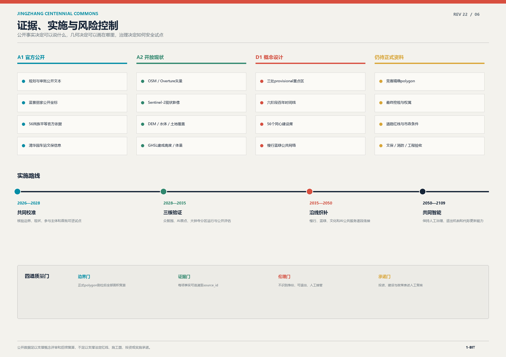

## 风险、版权与合规说明

第一类风险是数据精度：官方控规草案栅格和街区汇总指标、2026年技术审查状态、二期工程审批/合同链、清华园车站文保身份及 OSM 非法定现状参考均已补齐；主项目控制测量、地形图、树木、地下管线、工程勘察和施工图的存在性与持有人也已确认。蓝景丽家子项目的公开勘测、规划、交通、水务、市政、地灾、地震、噪声和地物条件已补入；仍缺的是竞赛范围与三处重点区可计算正式矢量、全走廊最终地块控制表、其余地块权属与逐栋实测、道路红线、市政容量、文保控制几何、蓝线、防洪消防条件、地铁安全评估报告及竣工/验收成果。正式polygon到位后，必须重算site boundary、key areas、land use、buildings、roads、green space、public space、phasing、所有面积比例和六张图。[depth:risk_missing_data] 与 `assumptions.json` 已列出影响和责任边界。

`sources.json` 的 `research_audit.data_request_protocol` 已把未公开资料转成可执行的八类索取单：`DR-001`竞赛与重点区边界、`DR-002`最终控规图则、`DR-003`建筑现状、`DR-004`权属运营、`DR-005`道路交通、`DR-006`文保图件、`DR-007`市政容量、`DR-008`环境与安全调查。每项均指定责任部门、最低字段、格式、验收检查、替换对象和隐私边界；资料到位后依次归档哈希、校验坐标/拓扑、替换provisional层、复算指标、重出图纸与HTML并重新全检。由此补齐的是“获取与接入闭环”，不是伪造尚未公开的法定数据。

第二类风险是技术和运营：AI 场景可能出现数据偏差、误报、过度监控、服务排斥和维护成本；因此采用最小化、聚合、解释、人工复核、可撤回和停用机制。场景不能替代专业审批、医疗、法律、消防、交通或规划判断，不能要求指定供应商，也不能把未成熟技术写成全面部署。

第四类风险是AI与数据合规：概念场景上线前必须完成适用性核查，并将[standard:PRC-PERSONAL-INFORMATION-PROTECTION-LAW]、[standard:PRC-NETWORK-DATA-SECURITY-REGULATION]、[standard:CAC-GENERATIVE-AI-INTERIM-MEASURES] 与[standard:CAC-AI-GENERATED-CONTENT-LABELING-MEASURES]落实为实施闸门。凡处理敏感个人信息、未成年人信息、自动化决策或对个人权益有重大影响的事项，先开展个人信息保护影响评估，明确最小必要字段、合法性基础、保存期限、受托处理、删除、投诉、事件响应及监护人同意；生成内容保留显式与适用的隐式标识。是否需要安全评估、算法备案或其他主管程序，由实际服务主体在上线前依法判断并完成，未完成不得部署。

第三类风险是公共利益和版权：公共空间面向居民、青年、访客、企业、高校和无障碍使用者开放；活动和导视不得排斥非 AI 从业者。所有方案文字、几何、图件和 HTML 均由 Agent 生成，引用资料和案例按 `sources.json` 标明用途；不使用未经授权的商标、字体、人物肖像、论文图像、商业地图截图或外部脚本。[source:STANDARDS-LOCAL-REFERENCES] 记录标准快照和 data_gap，`report/copyright_statement.md` 说明资产归属。

本成果是独立社区公开征集中的 AI 共创建议，不是政府或主办方的官方报名通道。任何“已批准、已确定、确定实施、最终红线、最终容积率、最终高度、最终权属”的表达都不属于本方案。所有空间、建筑、交通、市政、政策和活动建议均应被阅读为概念建议、参考方案或可供专业团队深化研究的材料。

## 参考资料

- [source:OFFICIAL-ANNOUNCEMENT] 北京市规划和自然资源委员会海淀分局公开公告及仓库本地参考快照。
- [source:AGENT-TASKBOOK] `brief/site-package/agent_taskbook.json` 与 `brief/site-package/standards/references/agent-open-call-taskbook-0518.md`。
- [source:SITE-PACKAGE] `brief/site-package/design_brief.json`、`allowed_design_space.json`、枚举、范围和 schema。
- [source:SOURCE-REGISTRY] `data/source_registry.json` 及 `data/processed/agent_fact_pack.md`。
- [source:BOUNDARY-SOURCE] `brief/site-package/geometry/provisional_boundaries.geojson`，只作 provisional constraint。
- [standard:MOHURD-URBAN-DESIGN-MEASURES] 城市设计管理办法本地参考快照。
- [standard:MOHURD-CONTROL-DETAILED-PLANNING] 城市、镇控制性详细规划编制审批管理办法本地参考快照。
- [standard:MNR-LAND-USE-CLASSIFICATION-GUIDE] 国土空间用地用海分类指南本地参考快照。
- [standard:MOHURD-ARCH-DESIGN-DEPTH-2016] 本地参考快照标记为 data_gap，仅用于待补资料说明。
- [data:geometry/site_boundary.geojson#SITE-001]、[data:geometry/key_areas.geojson#PROV-KEY-001]、[data:geometry/land_use.geojson#LU-001]、[data:geometry/buildings.geojson#BLDG-001]、[data:geometry/roads.geojson#ROAD-001]、[data:geometry/green_space.geojson#GREEN-001]、[data:geometry/public_space.geojson#PUBLIC-001]、[data:geometry/constraints.geojson#CONSTRAINT-001]、[data:geometry/phasing.geojson#PHASE-001]。
- [metric:site_area_sqm]、[metric:green_ratio]、[metric:public_space_ratio]、[metric:key_area_count]、[metric:ai_scenario_count] 和 `metrics.json` 中的其余复算指标。
- [source:HAIDIAN-2025-STATISTICAL-BULLETIN] 海淀区2025年国民经济和社会发展统计公报。
- [source:HAIDIAN-AI-POLICY-2025] 中科城〔2025〕91号人工智能产业高地若干措施。
- [source:HAIDIAN-QINGHUAYUAN-STATION-RESTORATION] 清华园车站旧址修缮开放官方资料。
- [source:HAIDIAN-JINGZHANG-CONTROL-PLAN-DRAFT] 京张铁路遗址公园沿线（人工智能创新街区重点地区）街区控规草案公示及官方PDF。
- [source:HAIDIAN-2026-GOVERNMENT-WORK-REPORT] 海淀区2026年政府工作报告中的控规技术审查状态。
- [source:HAIDIAN-JINGZHANG-PHASE2-PROJECT] 京张铁路遗址公共空间改造提升工程（二期）官方项目资料。
- [source:BEIJING-AI-ORIGIN-COMMUNITY] 北京市科委、中关村管委会公开的AI原点社区政策范围资料。
- [source:BEIJING-FRC-JINGZHANG-PHASE2-IMPLEMENTATION-APPROVAL] 京发改（审）〔2024〕609号实施方案批复。
- [source:BEIJING-FRC-JINGZHANG-PHASE2-TENDER-SCHEME] 同项目招标方案核准意见书。
- [source:BEIJING-GGZY-JINGZHANG-PHASE2-CONSTRUCTION-TENDER] 北京市公共资源交易服务平台施工资格预审公告及公开PDF。
- [source:BEIJING-CCGP-JINGZHANG-PHASE2-SUPPORTING-SURVEY] 中国政府采购网二期配套勘察比选公告。
- [source:BEIJING-YLLHJ-JINGZHANG-PHASE2-SUPPORTING-COMPLETION] 北京市园林绿化局二期配套项目完工信息。
- [source:BEIJING-JINGZHANG-2025-OPERATIONS] 北京市政府门户京张公园2025年运营基线。
- [source:BEIJING-AI-ORIGIN-2026-ECOSYSTEM] 北京市政府门户AI原点社区科研与企业生态基线。
- [source:BEIJING-HERITAGE-BATCH11-NOTICE] 京政发〔2025〕3号清华园车站旧址文保身份与图件发布边界。
- [source:BEIJING-YLLHJ-JINGZHANG-CONNECTIVITY-CONTEXT] 既有廊道绿地转化、道路连通、断点打通与服务对象基线。
- [source:BEIJING-GGZY-JINGZHANG-PHASE2-SURVEY-CONTRACT]、[source:BEIJING-GGZY-JINGZHANG-PHASE2-DESIGN-CONTRACT]、[source:BEIJING-GGZY-JINGZHANG-PHASE2-SUPPORTING-DESIGN-CONTRACT]、[source:BEIJING-GGZY-JINGZHANG-PHASE2-CONSTRUCTION-CONTRACT]、[source:BEIJING-GGZY-JINGZHANG-PHASE2-SUPERVISION-CONTRACT] 签约金额、专业范围与成果持有人链。
- [source:BEIJING-CCGP-JINGZHANG-PHASE2-SUPPORTING-SURVEY-AWARD] 与 [source:BEIJING-CCGP-JINGZHANG-METRO-SAFETY-ASSESSMENT] 配套勘察成交和地铁安全评估采购。
- [source:OPENSTREETMAP-JINGZHANG-EXISTING-CONTEXT] ODbL 非法定现状建筑、道路、轨道、水系与 POI 参考。
- [source:BEIJING-GGZY-BLUEHOME-LAND-2025]、[source:BEIJING-GGZY-BLUEHOME-SURVEY-2025]、[source:BEIJING-GGZY-BLUEHOME-PLANNING-2025] 与 [source:BEIJING-GHZY-BLUEHOME-CASE-2026] 蓝景丽家地块级公开资料及大钟寺位置锚定。
- [source:CHINA-GOV-ETHNIC-EQUALITY-WHITE-PAPER] 56个民族、民族平等、团结互助与共同发展依据。

REV 09 CONTRACT CHAIN AND OPEN EXISTING CONTEXT / REV 10 OPEN RASTER AND CONTROLLED CATALOG / REV 11 OPEN TERRAIN SCREENING / REV 12 OPEN WATER HISTORY AND CURRENT EO / REV 13 OPEN BUILDING FOOTPRINT INCREMENT / REV 14 OPEN GRIDDED BUILDING HEIGHT CONTEXT / REV 15 OPEN FOOTPRINT ATTRIBUTE SUBSET / REV 16/17 GBA研究核验（派生成果已于REV22退出提交包） / REV 18 BLUEHOME + CENTENNIAL UNITY / REV 22 LICENSE + AI COMPLIANCE 已在 REV 08 基础上补入官方签约合同链、明确专业成果持有人、核验地铁安全评估采购，并将带 ODbL 署名和快照哈希的 OSM 建筑/道路/轨道/水系/POI 作为 existing_condition 接入；公开现状、受控专业成果、竞赛计算几何与最终法定条件继续分层表达。

## 民族文化展陈与 AI 日常城市：从研发用地到公共文化空间的完整系统

本方案将“民族文化展陈与 AI 日常城市”定义为**文化持有者共同策展、AI辅助转译、来源与授权可追溯的公共文化系统**。它延续“56 个民族是一家、共同建设国家到 AI”的价值主线，并把口述史、工艺、语言、建设记忆与多语传播落实到用地、产业、社区、教育、文化和生态场景中。任何场景不得以人脸识别、民族身份推断或强制注册作为公共服务或展陈入口；拒绝 AI、拒绝授权、不会使用智能设备或网络中断时，普通服务与线下展陈质量不得降低。[source:CHINA-GOV-ETHNIC-EQUALITY-WHITE-PAPER] [data:visual/assets/service_system.json#concept]

### 四条城市运行原则

1. **共同基线。** 交通、政务、医疗、教育、养老、就业、文化与社区服务先建设不依赖算法也能完整运行的永久基线。
2. **可选增强。** AI 只承担翻译、预测、匹配、辅助决策、自助预填和运行诊断；高影响事项必须由具名人员复核。
3. **文化策展与公共议题。** [metric:ethnic_unity_co_creation_seat_count] 个轮换席围绕工程与工艺、语言与口述史、生态与家园、节俗与日常记忆、开放知识、AI 转译与文化伦理、青年再创作七类主题参与，不永久绑定空间与文化符号。
4. **退出还场。** 模型停机或试验结束后，删除临时副本，保留必要人工记录和申诉材料，空间恢复为通用公共设施。

该制度借鉴公开参赛方案“京张双答”的“普通服务基线 + AI 可选增强 + adopt / revise / stop”同题验证方法，并在此基础上独立建立56席、八项人本权利、五步共创闭环、五类用地与25个场景；不复制对方图像、代码或长段文字。[source:PEER-METHOD-JINGZHANG-TWO-ANSWERS-PR2272] 场景合同的机器可读清单见 [data:visual/assets/service_system.json#scenario_contract]。

### 民族文化展陈 × AI：共同策展、可追溯传播与八项使用者权利

本方案把民族 AI 定义为**民族文化展陈与 AI 转译系统**：以口述史、工艺、语言、迁徙记忆和共同建设叙事为内容入口，由文化持有者、社区代表和专业人员共同策展，AI 负责多语转写、字幕、知识关联、无障碍讲解和教育版本生成。它不识别、预测或分类个人民族身份，也不把文化内容固化为身份标签。[data:visual/assets/service_system.json#human_centered_co_creation] 同时，每个 AI 场景必须满足八项使用者权利：**普通服务权、知情权、选择与拒绝权、可达与多语权、人工复核权、申诉与纠错权、撤回与删除权、共同治理权**。这保证不会使用智能设备的人、不会使用中文的人、老人儿童、残障人士、访客和 AI 从业者都能通过线下路径获得同等公共服务。

56席采用**轮换策展、自愿参与、共同议题、授权可撤回**四项边界：席位不永久绑定某一民族、姓名、口音、服饰或居住证件，不采集或推断个人民族身份，不代表法定民族机构，也不推断海淀本地人口构成。轮换策展席与六类用户共同走完五步：**听见需求 → 共同设计 → 小尺度试验 → 共同复核 → 决定去留**。每一步都要留下普通基线、最小数据、具名责任人、申诉记录和退出路径；证据不能证明优于普通服务时，结果只能是修改、暂停或退出还场。[data:visual/assets/service_system.json#human_centered_co_creation/co_creation_stages] [metric:human_centered_user_right_count] [metric:human_centered_co_creation_stage_count]

因此，民族文化展陈不是装饰性主题，也不是身份识别系统，而是一套可授权、可校勘、可撤回的公共文化策展接口：参观者看到的是文化内容的出处、语境和多种解释，文化持有者保有公开级别、训练许可和撤回权。56席保留为轮换的共同策展与公共议题席，不永久绑定某一民族、空间或符号。所有席位、权利和指标均为概念设计；正式边界、用户研究和实施主体到位后，须由维护者和专业人员人工复核。

#### 京张民族文化 AI 展馆：四厅、五步参观、六类文化媒介

展馆依托AI原点公共转译厅与京张遗址主轴的概念公共界面组织，不新增法定建设用地、建筑权属或文保控制结论。[data:visual/assets/service_system.json#cultural_ai_museum] 四个展厅分别承担不同的文化任务：**共同建设厅**以京张铁路的自主建设、工业建设、科教报国和共同智能为叙事骨架；**声音与语言厅**并置原声、民族语言、普通话、文字、字幕和不可直译概念；**工艺知识厅**展开材料、工具、动作、时间、师承、使用场景和禁忌边界；**未来共创厅**以年度主题让青年创作者在授权材料上进行可追溯再创作。

参观路线采用五步：**选择语言与无障碍方式 → 进入历史和生活语境 → 查看AI转译与模型说明 → 比较人工校勘与分歧 → 自愿留下可撤回贡献**。入口只采集当次语言、字幕和无障碍偏好，不识别或推断个人民族身份。AI可以提供语音转写、字幕对齐、多语翻译、知识关联、动作分段、材料知识可视化和分龄教育版本，但不得自行认定文化代表性、真实性、所有权或禁忌内容。

展馆以**口述史、工艺、语言、图像、空间记忆、再创作**六类文化媒介形成内容账本。[metric:cultural_ai_museum_hall_count] 个概念展厅、[metric:cultural_ai_museum_visitor_route_stage_count] 步参观路线和 [metric:cultural_ai_museum_media_type_count] 类媒介均来自同一结构化数据源。每个展项都必须回链到文明种子库中的授权原件、人工校勘、AI派生版本、来源权利、内容哈希、撤回和迁移记录；原声、原图和原始工序记录不被模型生成版本覆盖。展陈到期、授权变化或出现错误归属时，先撤下AI派生版本，原件按权利人要求继续保存、限制访问或封存。

### 五类 AI 城市用地

概念用地由 [data:geometry/land_use.geojson] 的五个连续分区构成，总面积与 [metric:site_area_sqm] 一致。分区用于表达结构比例，不是法定控规结论；官方 polygon、最终控规和权属到位后需统一替换与复算。

| 用地 | 概念面积 | 比例 | 城市功能 | 公共性要求 |
|---|---:|---:|---|---|
| AI 研发创新用地（0802） | 189.78 ha | 16.63% | 模型研发、安全评测、低碳算力、中试智造、标准治理 | 测试区围合，全天公共旁路连续 |
| AI 绿地与开放空间（1401） | 271.88 ha | 23.82% | 京张遗址公园、清河绿廊、小月河场景翼、生态观察 | 无障碍慢行优先，环境感知不得识别人脸 |
| AI 线下产业服务（05） | 297.77 ha | 26.09% | 知识产权、法务财税、投融资、人才、展示交易、城市采购 | AI 初筛不替代专业签署与公平准入 |
| 社区服务与配套（0702） | 233.04 ha | 20.42% | 人才居住、政务、医疗养老、教育托育、社区商业 | 数字自助、人工窗口与电话路径并行 |
| 民族文化展陈与国际传播（0803） | 148.81 ha | 13.04% | 民族文化 AI 展陈、多语服务、遗产导览、国际交流、青年策展 | 分项授权、可撤回、不标签化 |

五类用地不是五座封闭园区。每个重点区至少混合三类功能，一层优先公共服务和开放界面，AI 机房、测试场、采集区不得切断慢行、公共空间和线下服务。用地比例见 [metric:land_use_area_by_code_sqm]，交互账本见 [data:visual/index.html#land]。

### 一轴三核两翼的空间系统

**一轴**是京张遗址公园公共主轴，串联历史、慢行、生态、服务与技术治理；**三核**是众智园、北京 AI 原点社区与大钟寺三处证明场；**两翼**是中关村科技服务翼和小月河生活场景翼。

可核验指标：六大场景域为 [metric:ai_everyday_scenario_domain_count] 类，五类空间程序为 [metric:ai_land_use_program_count] 类，民族文化展陈与 AI 治理护栏为 [metric:ethnic_ai_governance_guardrail_count] 条，实施闸门为 [metric:implementation_phase_count] 期。

- **众智园 AI 自主创新加速区：一庭两环四院。** 组织开源模型复现室、机器人围合测试庭、端侧算力弹性舱、中试智造工坊、AI 安全治理廊和清河低碳绿廊。普通公共路径全天开放，测试活动不得侵占旁路。[data:geometry/key_areas.geojson#PROV-KEY-001]
- **北京 AI 原点社区：一厅一街两翼。** 组织公共转译厅、近校成果转化街、人才服务一件事、AI 素养夜校、多语公共服务亭与开源共修室。政策表述约 7.13 km² 的原点社区范围不得等同于本方案重点区 provisional polygon。[data:geometry/key_areas.geojson#PROV-KEY-002]
- **大钟寺 AI 产业聚集区：一站四象限一客厅。** 组织国际路演客厅、智能终端首发、数据要素服务窗、AI 生活样板街、城市采购试验湾与遗产活化展厅。蓝景丽家公开子项目资料只用于校准局部事实，不替代约 72 ha 的重点区边界。[data:geometry/key_areas.geojson#PROV-KEY-003]

三处详细设计共同采用“永久基线 + 可拆 AI + 公开证据”原型：众智园证明安全研发与中试，大钟寺证明产业采用与线下服务，AI 原点证明成果转译与日常公共服务。三处均保留人工入口、无障碍连续路径、停止条件和退出还场能力。[metric:key_area_count]

### AI 全栈创新生态与线下产业服务

产业链由“高校策源—模型研发—安全评测—中试智造—企业服务—场景开放—运营反馈”七环组成。[metric:ai_industry_chain_stage_count]

1. **高校策源：** 基础研究、人才培养和开源项目进入公共成果目录。
2. **模型研发：** 多模态模型、行业小模型和端侧智能在授权数据边界内开发。
3. **安全评测：** 进行来源许可、红队测试、偏差检查、可解释审计和版本回退。
4. **中试智造：** 机器人、智能终端和低碳算力在围合条件内验证。
5. **企业服务：** 提供法务、知识产权、财税、投融资、人才、采购和国际化线下窗口。
6. **场景开放：** 交通、政务、社区、健康、教育、文化和绿地只开放可控、可停、有人负责的试验。
7. **运营反馈：** 公开公众评价、人工接管、能耗、差错、申诉和整改，决定保留、修改、暂停或退出。

这条产业链把 AI 研发创新用地与线下产业服务联系起来：众智园承担研发、验证和中试；AI 原点承担转译、孵化和社区采用；大钟寺承担展示、交易和城市采用。产业服务不是纯线上平台，而是可进入、可咨询、可申诉的实体公共界面。

### 25 个 AI+城市生活场景

[metric:ai_everyday_scenario_count] 个场景按六大系统组织，每个场景均在 [data:visual/assets/service_system.json#scenarios] 登记服务对象、空间位置、AI 增强、人工责任与退出路径。

场景不是静态清单。交互评审工作台支持通过 `scenario`、`station` 和 `mode` URL 参数直达任一场景、重点区与普通基线/AI 增强/并排比较模式。每类场景继承 [data:visual/assets/service_system.json#domain_evaluation_contracts] 的普通基线、最小数据、停止条件和四项待测指标；所有效率、满意度、节能和成本结果均保持“待现场基线”，不生成虚构承诺值。

六类场景评估合同均已登记，数量为 [metric:ai_domain_evaluation_contract_count] 类；它们分别对应产业、交通、政务、社区、照护和文化生态，所有绩效字段在现场试验前保持待测。

空间侧配置 [metric:ai_node_type_count] 类、[metric:ai_node_concept_count] 个概念 AI 场景节点，覆盖研发开源、安全评测、中试智造、企业服务、交通接驳、无障碍、政务自助、社区生活、健康照护、教育就业、民族文化展陈、AI 绿地和文明种子库。节点数量用于功能覆盖检查，不代表审定设施数量或工程点位。[data:visual/assets/service_system.json#ai_node_types]

电子化基础设施按 [metric:ai_digital_infrastructure_layer_count] 层组织：感知、边缘、数据、模型、服务和治理。手机、网页、自助终端、电话、人工窗口共享同一服务合同；任何数字入口都不得成为唯一入口，断网、停机或拒绝授权时普通服务继续运行。[data:visual/assets/service_system.json#digital_infrastructure]

| 系统 | 场景 |
|---|---|
| 产业就业 4 项 | 开源模型与数据来源复现、机器人安全围合测试、端侧算力与能耗弹性、企业服务一件事 |
| 交通出行 4 项 | 多式联运出行助手、微循环需求响应接驳、无障碍连续路径、慢行断点诊断 |
| 政务服务 4 项 | 多语政务自助预填、社区事项智能分流、政策问答与资格导航、公共预算参与助手 |
| 社区生活 4 项 | 15 分钟生活服务管家、智能消费与线下体验、共享空间弹性预约、社区能源与垃圾减量 |
| 健康教育 4 项 | 社区健康导诊、养老陪伴与紧急呼叫、AI 素养与多语夜校、公平就业与技能导航 |
| 文化生态 5 项 | 百年京张数字导览、年度共同建设展、AI 绿地生态管家、城市活动与国际传播、京张文明种子库 |

场景不是口号。例如“多语政务自助预填”只解释材料并生成草稿，窗口人员最终受理，遇到翻译歧义或资格争议立即转人工；“社区健康导诊”只整理主诉和导航科室，医生负责诊疗，实体急救与人工挂号始终可用；“公平就业与技能导航”禁止依据民族、性别、残障或其他敏感身份推断录用倾向；“AI 绿地生态管家”只给出灌溉和热舒适建议，园林人员决定养护，不使用人脸识别统计游客。

### 京张文明种子库：让传统文化有出处、有授权、能迁移

本方案新增**京张文明种子库 / Jingzhang Living Archive**，作为传统文化与 AI 融合的长期公共文化基础设施。空间采用“一库三站”概念：AI 原点社区的原点开源客厅承载公共种子库，遗址主轴、大钟寺和众智园设置采录、校勘与再创作接口；它们优先嵌入 [data:geometry/public_space.geojson#PUBLIC-002] 等既有概念公共空间，不新增法定用地、建筑规模或未经确认的文保点位，具体位置仍须依据权属、消防、文保控制和运营条件复核。[data:visual/assets/service_system.json#cultural_memory_archive/spatial_model]

种子库保存的不是“AI 生成结果”，而是一组可追溯、可撤回、可迁移的**文化记忆凭证**：授权原始记录、无损保存母版、人工校勘稿、AI 转译/再创作版本、来源与权利声明、内容哈希与版本清单、撤回/封存/访问记录。原件与派生版本永不混写；任何多语字幕、知识关联、数字修复或教育版本都必须标出模型、版本、不确定性和人工校勘者。[data:visual/assets/service_system.json#cultural_memory_archive/archive_unit]

七步保存流程为：**社区提名 → 知情授权 → 原真采录 → AI 转译 → 人工校勘 → 版本固化 → 迁移再生**。保存、公开、训练、翻译与再创作分别授权，沉默不视为同意；仪式禁忌、未成年人、精确敏感地点、商业秘密和未清权内容默认不公开、不训练。AI 只辅助转写、翻译、关联、修复建议和公众教育，不认定文化真实性、代表性或权利归属。[data:visual/assets/service_system.json#cultural_memory_archive/workflow] [data:visual/assets/service_system.json#cultural_memory_archive/governance]

“永久保存”在此被转译为可执行的长期保存责任，而不是不可验证的技术承诺：优先使用开放母版格式，登记内容哈希，在至少三类独立故障域保留副本，保存离线清单，按计划校验可读性并在格式或载体濒危前完成迁移。区块链如经评估采用，只能作为可选的校验或时间证明，不能替代原件保存、权利治理、备份和迁移，也不写入任何“不可删除”的个人或敏感文化内容。[data:visual/assets/service_system.json#cultural_memory_archive/preservation_controls]

治理采用 [metric:cultural_archive_governance_role_count] 类责任：文化权利人决定语境、公开级别与撤回；文博/档案/语言等专业人员负责校勘与保存策略；公共文化或档案运营方负责校验、备份、迁移、访问日志与灾难恢复。撤回默认立即停止公开和 AI 再利用；若存在法定或公共档案保留义务，由人工依法判断并向权利人说明，而不是由模型自动拒绝撤回。评估不预填馆藏量或传播量，只记录 [metric:cultural_archive_workflow_stage_count]、[metric:cultural_archive_minimum_failure_domain_count] 等设计合同计数，并在试点后实测授权完整率、来源可追溯率、哈希校验通过率、开放格式覆盖率、人工校勘完成率、撤回响应时长和迁移演练通过率。[data:visual/assets/service_system.json#cultural_memory_archive/success_metrics]

### 六类人群的一日服务旅程

方案以 [metric:ai_everyday_user_group_count] 类人群检验 AI 是否真正进入生活：科研人员、创业团队、社区居民、老人儿童、多民族访客和残障人士。从早高峰到夜间安全，六类人群共享五项基础设施：统一服务入口、身份最小化、人工责任表、线下旁路和公开运行账。

- 科研人员可使用多式联运、算力预约、知识产权助手和开源共修室，但项目许可与法律文件由专业人员签署。
- 创业团队可使用企业服务一件事、中试资源匹配和国际路演辅助，但融资和采购决定不交给模型。
- 社区居民可使用生活导航、共享服务、政务预填和社区活动匹配，也可通过电话、窗口和纸质地图完成同样事项。
- 老人儿童使用无障碍路线、AI 素养课程、健康导诊和陪伴提醒；未成年人画像不采集，急救实体按钮优先。
- 多民族访客使用多语导向、公共服务翻译和同心议事；系统不根据姓名、口音、服饰或人脸推断民族身份。
- 残障人士获得触觉、语音、字幕、手语视频和人工护送；AI 不得成为无障碍设施缺失的替代品。

### 普通答案、AI 增强与退出还场

四个高影响样板场景建立三答案合同：[metric:ordinary_ai_exit_contract_count]

| 场景 | 永久基线 | AI 可选增强 | 退出还场 | 责任主体 |
|---|---|---|---|---|
| 多语政务自助办理 | 人工窗口、纸质表单、电话预约 | 多语翻译、材料提示、表单预填 | 清除会话，转人工且保留排队权益 | 政务窗口负责人 |
| 多式联运出行 | 固定时刻表、站牌、连续无障碍路径 | 实时组合路线和电梯状态提示 | 恢复实体导向，不影响购票通行 | 调度与站务负责人 |
| 社区健康导诊 | 社区医生、人工挂号、急救电话 | 主诉整理、科室导航、多语解释 | 删除会话，立即转医生或急救 | 医疗机构具名医生 |
| 年度共同建设展 | 共同议题、人工策展、自愿授权 | 多语整理、字幕、出处关联 | 撤下生成内容，保留授权人工档案 | 社区与文化专业人员 |

本方案不预填“提升效率、满意度、节能或就业”的承诺数字。所有效果指标必须先建立普通服务现场基线，再经过限定周期测试，并同时记录人工接管、差错、申诉、能耗和弱势群体影响；只有综合证据优于基线才允许扩展。

### 四期实施与年度退出决定

- **P0（0—6 个月）：资料闭环与共创。** 取得官方边界、控规、权属、市政、消防和文保控制条件；由 56 席与六类用户共同审计需求；建立普通服务基线、文化内容分项授权和敏感性分级。[data:visual/assets/service_system.json#implementation_phases/0]
- **P1（6—18 个月）：三处小尺度试验。** 建设众智园安全验证庭、AI 原点公共转译厅和大钟寺城市采用湾，同步试运行文明种子库“一库三站”；出现安全、隐私、歧视、授权、校验、迁移恢复或旁路失效即停止。[data:visual/assets/service_system.json#implementation_phases/1]
- **P2（18—36 个月）：主轴与社区扩展。** 扩展轨道慢行、微循环接驳、政务、健康、教育、就业、AI 绿地和多语公共空间；必须以现场证据证明不弱于普通基线。[data:visual/assets/service_system.json#implementation_phases/2]
- **P3（36 个月以后）：常态运营与年度复盘。** 年度公开模型版本、能耗、差错、申诉、停机和整改；文明种子库同步公开非敏感保存健康指标与迁移记录，由文化权利人、56 席、公民代表、专业机构和运营主体共同决定保留、修改、暂停、封存或退出。[data:visual/assets/service_system.json#implementation_phases/3]

实施顺序遵循“先公共基线、后 AI 插件；先小尺度验证、后空间扩展；先可撤回服务、后不可逆建设”。精确边界或法定条件变化时，按 assumptions.json 的替换协议重算全部面积、比例、图纸、场景位置与投资时序，不把当前概念结构包装成审批结论。
