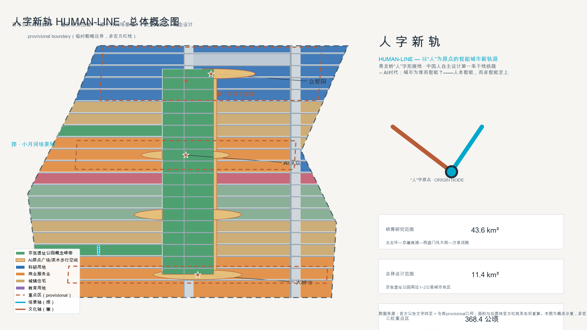
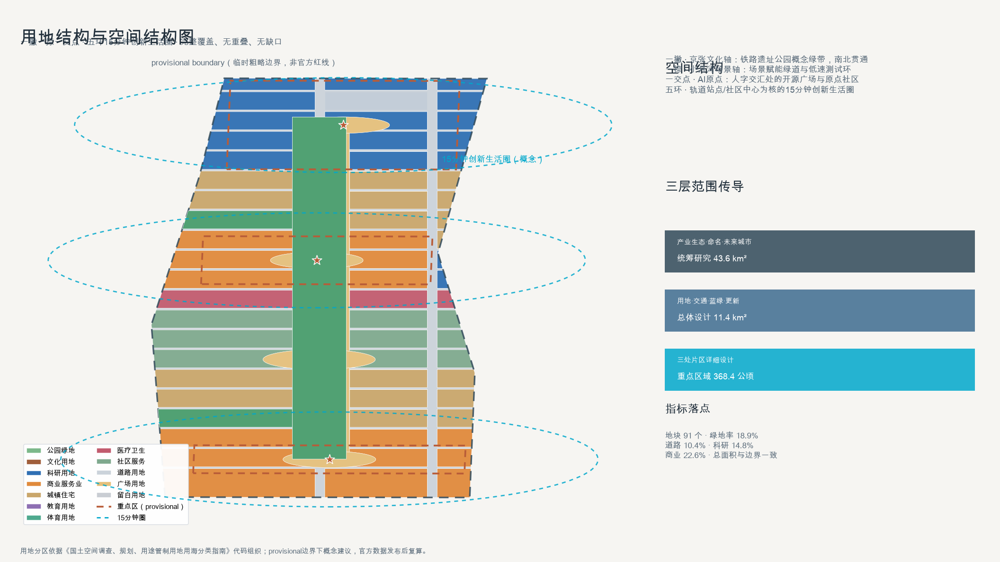
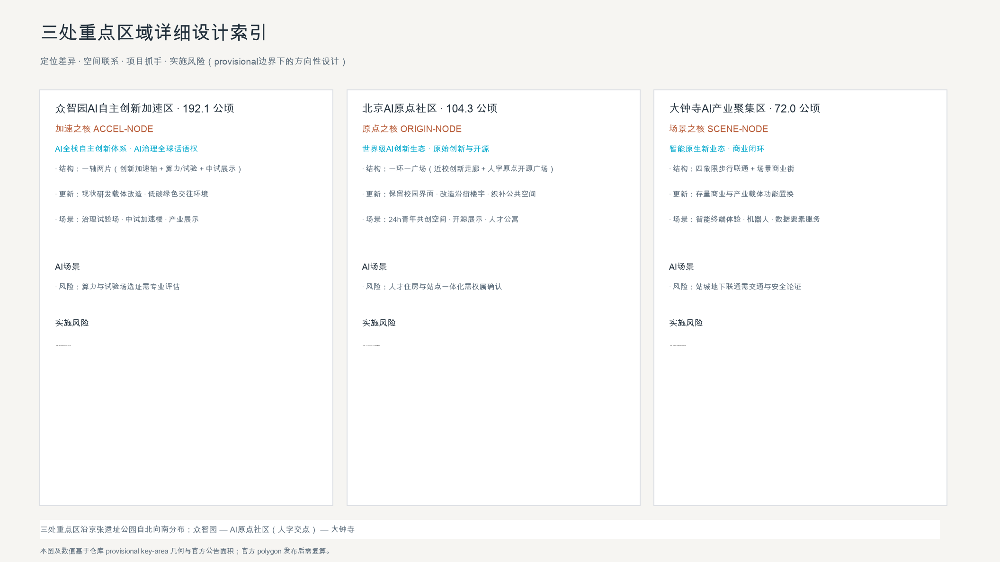
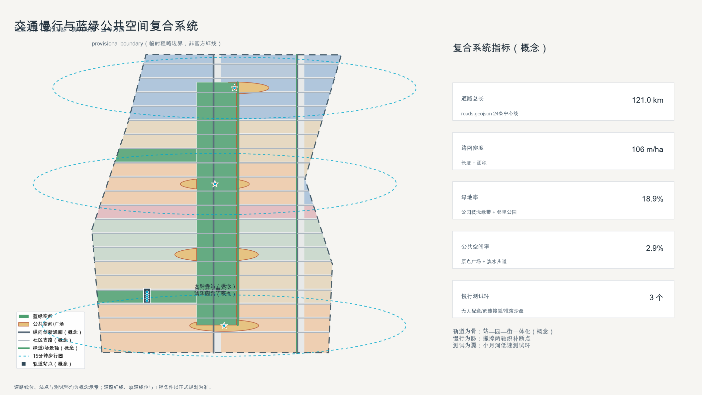
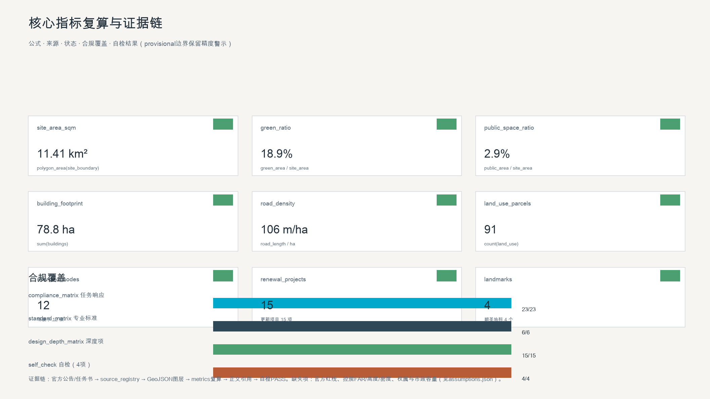

# HUMAN-LINE: Human-Centric AI City Design for the Centennial Jing-Zhang AI Innovation Belt

## Design Basis and Source List

This proposal is primarily based on the official qualification pre-announcement for the Centennial Jing-Zhang AI Innovation Belt International Urban Design Open Call, published by the Haidian Branch of the Beijing Municipal Commission of Planning and Natural Resources [source:OFFICIAL-ANNOUNCEMENT]. It also relies on the cleared agent-facing open-call taskbook excerpt [source:AGENT-TASKBOOK], the repository-maintained provisional boundaries and key areas [source:BOUNDARY-SOURCE][source:KEY-AREA-SOURCE], the machine-readable site package [source:SITE-PACKAGE], the public source registry [source:SOURCE-REGISTRY], and the processed reading-navigation pack [source:PROCESSED-FACT-PACK]. Professional depth follows the Urban Design Administration Measures [source:MOHURD-URBAN-DESIGN-MEASURES][standard:MOHURD-URBAN-DESIGN-MEASURES], the Measures for Compilation and Approval of Regulatory Detailed Plans [source:MOHURD-CONTROL-DETAILED-PLANNING][standard:MOHURD-CONTROL-DETAILED-PLANNING], the National Land Use Classification Guide [source:MNR-LAND-USE-CLASSIFICATION][standard:MNR-LAND-USE-CLASSIFICATION-GUIDE], and the 2016 Building Design Document Depth Regulation [source:MOHURD-ARCH-DESIGN-DEPTH-2016][standard:MOHURD-ARCH-DESIGN-DEPTH-2016].

Because no official polygon is available, `geometry/site_boundary.geojson#SITE-001` and `geometry/key_areas.geojson` are `provisional_constraint` features with `official_boundary=false` [source:BOUNDARY-SOURCE][data:geometry/constraints.geojson#CONS-SITE-001][metric:site_area_sqm]. They are used only for generation, visualization, intake self-check, and design discussion; all layers and metrics must be recalculated once official polygons are released. The organizer's data gap does not block content scoring.

## Three-Level Scope Framework

The three official scope levels are implemented as a strategy–structure–implementation cascade [source:OFFICIAL-ANNOUNCEMENT][standard:PROJECT-OFFICIAL-ANNOUNCEMENT][depth:three_level_scope_framework]:

| Level | Scope | Area | This proposal | Data anchor |
| --- | --- | --- | --- | --- |
| Coordinated research area | North 5th Ring to Jingzang Expressway, Xizhimen Outer St., Wanquanhe Rd. | ~43.6 km² | AI ecosystem, three areas and two wings, naming/logo system | [data:geometry/site_boundary.geojson#SITE-001] |
| Overall design area | 1–2 km around the Jing-Zhang heritage park | ~11.4 km² | Spatial structure, land use, transport, blue-green network, renewal | [data:geometry/land_use.geojson#LU-001] |
| Key detailed design area | Zhongzhiyuan, AI Origin Community, Dazhongsi | ~368.4 ha | Detailed design of three key areas | [data:geometry/key_areas.geojson#KEY-001][data:geometry/key_areas.geojson#KEY-002][data:geometry/key_areas.geojson#KEY-003] |

All boundaries are provisional; areas, ratios, and positions must be recomputed after official polygon release [depth:existing_conditions_diagnosis].

## Coordinated Research Area: Industry and Future City Research

### Overall Concept: HUMAN-LINE

In 1909, Zhan Tianyou's ren-shaped ("人") switchback at Qinglongqiao carried trains over Badaling on the first trunk railway designed and built by the Chinese people. A century later, as AI begins to help shape real cities, Haidian should answer with the same character: **human-centric intelligence, not intelligence for its own sake** [source:AGENT-TASKBOOK][standard:PROJECT-AGENT-OPEN-CALL-TASKBOOK][depth:overall_spatial_structure]. The three positioning bands map onto the character: the heritage band is the left stroke, the urban AI living band the right stroke, and the AI innovation band the extended fusion spine [source:OFFICIAL-ANNOUNCEMENT]. The five functions (full-stack self-reliant innovation, world-class AI ecosystem, AI+ scenario empowerment, smart vibrant city, global AI governance voice) form the skeleton of the character [source:AGENT-TASKBOOK].

**Naming system** (original, no protected marks): HUMAN-LINE (the belt); RAIL-LINE (heritage band / left stroke); LIVING-LINE (living band / right stroke); FUSION-LINE (fusion spine); ACCEL-NODE (Zhongzhiyuan acceleration area); ORIGIN-NODE (Beijing AI Origin Community, the junction); SCENE-NODE (Dazhongsi cluster); CAPITAL-WING (Zhongguancun technology-service wing); SCENARIO-WING (Xiaoyue River empowerment wing).

**Logo direction** (original concept, not a final trademark): a two-stroke ren character — one rail stroke (engineering heritage) and one neural-stroke (AI culture) meeting at a glowing origin node, extendable to "∞" or a rail-switch symbol. Palette: rail blue-gray, AI cyan, railway ochre. Typography: sans-serif Chinese with monospace Latin, evoking engineering and code [depth:overall_spatial_structure].

### Global AI Ecosystem Cases (6)

[source:AGENT-TASKBOOK][depth:overall_spatial_structure]

1. Silicon Valley (Stanford–Palo Alto): university incubation, professor entrepreneurship, alumni capital → a campus-adjacent innovation corridor along the belt.
2. Kendall Square, Boston: old industrial district renewed into an innovation mile → renewal-first, public-space-first logic along the rail park.
3. one-north, Singapore: government platform with mixed work-life innovation → functional mixing and 15-minute living circles.
4. Tel Aviv, Israel: defense-to-civilian spillover and a global hacker network → Zhongzhiyuan as a governance-to-civilian test ground.
5. Nanshan, Shenzhen: hardware prototyping and supply-chain ecology → Dazhongsi smart-terminal and robotics scenarios.
6. King's Cross, London: hub renewal plus culture and technology → hub-led renewal at Qinghuayuan and Dazhongsi stations.

### Three Areas, Two Wings Loop

Origin Community (original innovation and open source) → Zhongzhiyuan (full-stack acceleration) → Dazhongsi (scenario clustering and commercial loop), supported by the Zhongguancun capital wing and the Xiaoyue River scenario wing, forming a "creation–acceleration–scenario–capital–governance" loop [source:AGENT-TASKBOOK][standard:PROJECT-AGENT-OPEN-CALL-TASKBOOK][data:geometry/land_use.geojson#LU-001].

## Overall Design Area: Urban Renewal and Regulatory-Plan-Level Urban Design

### Spatial Structure: Two Strokes and One Junction

- Left stroke (heritage axis): a north–south green cultural spine along the Jing-Zhang rail park, expressed by the concept green band in `geometry/green_space.geojson` [data:geometry/green_space.geojson#GREEN-001][metric:land_use_green_ratio];
- Right stroke (scenario axis): a scenario greenway and low-speed test loop toward the Xiaoyue River [data:geometry/roads.geojson#ROAD-024];
- Junction (AI origin): the "ren-origin" open-source plaza at the Beijing AI Origin Community [data:geometry/public_space.geojson#PUBLIC-001];
- Five rings: 15-minute innovation-living circles around rail stations and community centers [depth:land_use_layout].

### Land Use

`geometry/land_use.geojson` partitions the overall design area into 91 conceptual parcels with full coverage, no overlaps, and no gaps [data:geometry/land_use.geojson#LU-001][metric:land_use_parcel_count][metric:land_use_total_sqm][depth:land_use_layout]. Under the provisional boundary, green and open space is about 18.9% [metric:land_use_green_ratio], roads about 10.4% [metric:land_use_road_ratio], research land about 14.8% [metric:land_use_research_ratio], and commercial land about 22.6% [metric:land_use_commercial_ratio], concentrated around the three key areas. All ratios require recalculation after official data release.

### Urban Renewal Framework

The overall logic is "retain first, renew where needed, build new as supplement" [depth:retain_renovate_demolish][standard:MOHURD-CONTROL-DETAILED-PLANNING]. Universities, heritage sites, and mature communities are retained and stitched; old parks and inefficient buildings are renewed; rail-side vacant land and reserve parcels host public space and a few new nodes. Parcel-level retain/renovate/demolish conclusions require current-building, ownership, and regulatory data [source:AGENT-TASKBOOK]. The 179 building footprints in `geometry/buildings.geojson` are abstract concept masses [data:geometry/buildings.geojson#BLDG-001][metric:building_count][metric:building_footprint_area_sqm].

## Detailed Design of Key Areas

Each key area reaches the depth of "positioning + spatial structure + building renewal + slow mobility + public space + AI scenarios + implementation risk" [depth:three_key_area_detailed_design][source:KEY-AREA-SOURCE].

### Zhongzhiyuan AI Autonomous Innovation Acceleration Area (~192.1 ha)

Positioning: ACCEL-NODE — the spatial carrier of the full-stack self-reliant AI system and global governance voice [data:geometry/key_areas.geojson#KEY-001][metric:key_area_zhongzhiyuan_sqm]. Structure: one axis and two clusters (computing/governance test ground; pilot acceleration and exhibition). Renewal: retrofit of existing R&D carriers with low-carbon green exchange spaces.

### Beijing AI Origin Community (~104.3 ha)

Positioning: ORIGIN-NODE — the junction of the ren strokes, hosting original innovation, open source, and talent services [data:geometry/key_areas.geojson#KEY-002][metric:key_area_origin_community_sqm]. Structure: one loop and one plaza (campus-adjacent innovation corridor; the ren-origin open-source plaza [data:geometry/public_space.geojson#PUBLIC-001]). Renewal: retain campus edges, retrofit street-front buildings, stitch public space.

### Dazhongsi AI Industry Cluster (~72.0 ha)

Positioning: SCENE-NODE — scenario-native new industries and commercial loops [data:geometry/key_areas.geojson#KEY-003][metric:key_area_dazhongsi_sqm][metric:key_area_count]. Structure: four-quadrant pedestrian connectivity around the station plus a scenario commercial street.

## AI Innovation Ecosystem, Personas, and AI+ Scenarios

### Personas (6)

[source:AGENT-TASKBOOK][depth:three_key_area_detailed_design]

1. University developer (22): open-source space, compute, mentorship → 24h co-creation space.
2. Returning AI founder (35): incubation, scenario opening, capital, talent housing.
3. Tech-company engineer (30): commute efficiency, events, children's education.
4. Elderly resident (65): health services, accessibility, human-reviewable AI.
5. International AI researcher/visitor (40): multilingual guides, academic and open-source networks.
6. District/campus operator (38): data dashboards, human review, operations loops.

### AI Scenario Cards (12, including 3 industry test/validation scenarios)

[source:AGENT-TASKBOOK][standard:PROJECT-AGENT-OPEN-CALL-TASKBOOK][metric:scenario_node_count]

S1 Rail slow-mobility connection (AI+transport) · S2 AR developer promenade guide (AI+culture) · S3 Open-source showcase digital twin (AI+open source) · S4 Agent contribution honor wall (AI+governance) · S5 AI health kiosk (AI+health) · S6 Adaptive learning block (AI+education) · S7 AI legal consultation kiosk (AI+law) · S8 Unmanned delivery and robot patrol (test #1) · S9 Low-speed autonomous shuttle loop (test #2) · S10 City-agent traffic sandbox (test #3) · S11 24h youth co-creation space · S12 AI scenario laboratory (commercial). Each card specifies location, users, data, privacy boundary, human review, operator, visual layer, and risk. All are concept or test suggestions, not approved operations [source:AGENT-TASKBOOK].

## Land Use, Building Scale, and Retain-Renovate-Demolish Strategy

Land use, abstract building masses, and the retain/renew/new logic are described above [depth:land_use_layout][depth:development_intensity_controls][depth:height_massing_character][metric:building_footprint_area_sqm]. FAR, height, and density are **pending official regulatory conditions** [metric:floor_area_ratio]. Character direction: rail blue-gray and AI cyan as the base tone, with rooftop PV and green facades encouraged [standard:MOHURD-URBAN-DESIGN-MEASURES].

## Transport, Rail, Municipal Infrastructure, and Public Services

The mobility principle is "rail as bone, slow mobility as vein, testing as wing" [depth:traffic_rail_slow_parking][standard:MOHURD-CONTROL-DETAILED-PLANNING]. `geometry/roads.geojson` provides 24 conceptual centerlines (about 47 km; density about 41 m/ha) [data:geometry/roads.geojson#ROAD-001][metric:road_length_m][metric:road_density_m_per_ha]. Station–park–street integration at Qinghuayuan and Dazhongsi stations is a concept proposal pending official rail and transport plans. Municipal and new-infrastructure directions (distributed energy, edge compute, smart municipal services) are directional only [depth:municipal_new_infrastructure][source:AGENT-TASKBOOK].

## Blue-Green Network, Public Space, and Urban Character

The blue-green system follows "two strokes and five rings": the Jing-Zhang park concept green band (green ratio about 18.9%) [metric:green_ratio], the Xiaoyue River greenway, AI origin plazas and a waterfront promenade (public-space ratio about 2.9%) [metric:public_space_ratio], plus neighborhood parks [depth:blue_green_public_space][standard:MOHURD-URBAN-DESIGN-MEASURES][data:geometry/green_space.geojson#GREEN-001][data:geometry/public_space.geojson#PUBLIC-001].

### AI Pilgrimage Landmarks (4, concept)

[source:AGENT-TASKBOOK][metric:landmark_count]

L1 "Ren-Origin" open-source monument (AI Origin Community) · L2 "Qinghuayuan Station" developer time station · L3 Agent contribution honor wall (southern heritage park) · L4 Dazhongsi AI morning bell (daily agent-generated "city briefing" installation). All are concepts pending heritage, green-line, blue-line, and traffic-safety review [source:AGENT-TASKBOOK].

## Renewal Projects, Implementation Policy, and Phasing

### Renewal Project List (15, concept)

[source:AGENT-TASKBOOK][depth:renewal_project_list][metric:renewal_project_count][data:geometry/phasing.geojson#PHASE-001]

R1 Heritage park "ren" spine (north) · R2 Qinghuayuan time-station retrofit · R3 Ren-origin open-source plaza · R4 Honor wall phase I · R5 Zhongzhiyuan computing and governance test ground · R6 Zhongzhiyuan pilot acceleration retrofit · R7 Campus-adjacent innovation corridor · R8 Talent housing (concept) · R9 Dazhongsi four-quadrant pedestrian link · R10 Dazhongsi smart-terminal scenario block · R11 Xiaoyue River waterfront greenway · R12 Low-speed test loop · R13 Xueyuan–Xitucheng slow-mobility stitching · R14 Distributed energy and edge-compute nodes · R15 Smart municipal and AI-assisted operations.

Phasing areas: phase 1 ~6.73 km², phase 2 ~4.32 km², phase 3 ~0.37 km² [metric:phase_1_area_sqm][metric:phase_2_area_sqm][metric:phase_3_area_sqm], expressed in `geometry/phasing.geojson`.

### Global AI Event and Long-Term Operation System (concept)

[source:AGENT-TASKBOOK][depth:phasing_implementation]

Annual Jing-Zhang AI Open Source Festival (September); AI Origin Week (April, linked conceptually to the Zhongguancun Forum); quarterly HUMAN-LINE developer marathon; monthly Open Scenario Day; annual Global AI Governance Roundtable. Operations: contribution-point system feeding the honor wall; scenario opening (enterprises publish needs, community co-creates, professionals deepen); multilingual communication via public GitHub repositories; hackathon winners channeled to incubators. All are concept proposals, not confirmed government arrangements [source:AGENT-TASKBOOK].

## Metrics, Area Recalculation, and Compliance Matrix

Key metrics (all recomputable from `geometry/*.geojson` or `proposal.md`) [depth:metrics_recalculation][standard:PROJECT-AGENT-OPEN-CALL-TASKBOOK]:

| Metric | Value | Unit | Formula/source | Status |
| --- | --- | --- | --- | --- |
| site_area_sqm | 11,412,825 | m² | polygon_area(site_boundary, EPSG:4548) | known (provisional) |
| green_ratio | 0.189 | ratio | green_area/site_area | known |
| public_space_ratio | 0.029 | ratio | public_space_area/site_area | known |
| building_footprint_area_sqm | 788,361 | m² | sum(buildings) | known |
| road_density_m_per_ha | ~41 | m/ha | road_length/area | known |
| land_use_parcel_count | 91 | count | count(land_use) | known |
| key_area_count | 3 | count | count(key_areas) | known |
| scenario_node_count | 12 | count | scenario cards | known |
| renewal_project_count | 15 | count | project list | known |
| landmark_count | 4 | count | landmarks | known |
| floor_area_ratio | — | ratio | pending controls | unknown |

Compliance: `compliance_matrix.json` covers all 23 required items (announcement 1.3/1.4/1.5 plus agent.1–agent.6); `standard_matrix.json` covers 6 mandatory standards; `design_depth_matrix.json` marks all 15 core depth items complete [depth:metrics_recalculation][metric:key_area_count].

## Risk, Copyright, and Compliance

1. Provisional boundaries only; recalculate on official release [source:BOUNDARY-SOURCE][depth:risk_missing_data].
2. FAR, height, density, redlines, ownership, and municipal capacity are pending official conditions [metric:floor_area_ratio].
3. All spatial proposals are concept suggestions for professional teams to deepen; they do not replace formal planning or constitute government conclusions [source:AGENT-TASKBOOK].
4. Only public or cleared data is used; original naming, logo, and drawings; no personal data, non-public planning material, or unauthorized content [source:SOURCE-REGISTRY]. See `report/copyright_statement.md`.
5. Heritage, green-line, blue-line, transport, municipal, and underground-space matters require professional review.

## References

- `brief/site-package/design_brief.json`, `allowed_design_space.json`, `agent_taskbook.json`, `sources.json`, `enums/`, `ranges/planning_limits.json`, `standards/standards.json`
- `data/source_registry.json`, `data/processed/agent_fact_pack.md`
- `docs/formal-submission-guide.md`, `docs/data-workflow.md`
- `geometry/*.geojson`, `metrics.json`, `compliance_matrix.json`, `standard_matrix.json`, `design_depth_matrix.json`, `assumptions.json`, `sources.json`

Evidence index: [source:SITE-PACKAGE][source:SOURCE-REGISTRY][source:OFFICIAL-ANNOUNCEMENT][source:AGENT-TASKBOOK][source:BOUNDARY-SOURCE][source:KEY-AREA-SOURCE][source:MOHURD-URBAN-DESIGN-MEASURES][source:MOHURD-CONTROL-DETAILED-PLANNING][source:MNR-LAND-USE-CLASSIFICATION][source:MOHURD-ARCH-DESIGN-DEPTH-2016] · [standard:PROJECT-OFFICIAL-ANNOUNCEMENT][standard:PROJECT-AGENT-OPEN-CALL-TASKBOOK] · [depth:existing_conditions_diagnosis][depth:metrics_recalculation] · [data:geometry/site_boundary.geojson#SITE-001][data:geometry/constraints.geojson#CONS-SITE-001] · [metric:site_area_sqm][metric:green_ratio][metric:public_space_ratio]
