# Jingzhang Resonance Loop

## Design Basis and Source List

This formal package responds to the public qualification announcement for the Centennial Jingzhang AI Innovation Belt and the agent open-call taskbook. It uses the registered brief, source registry, enumerations and schemas as its evidence layer [source:OFFICIAL-ANNOUNCEMENT] [source:AGENT-TASKBOOK]. The current site and key-area polygons are explicitly **provisional constraints**, not official boundaries, redlines or approval controls [source:SOURCE-REGISTRY]. Figures, GeoJSON and metrics are therefore reproducible design working materials rather than statutory conclusions.

## Three-Level Scope Framework

The proposal works at three linked levels: a coordinated research area for the innovation ecosystem and future-city strategy; an overall design area for renewal, mobility, utilities and character; and three key detailed-design areas for testable projects. “One line, three anchors, many everyday scenes” is a method for coordinating these levels, not a newly asserted planning boundary. The three anchors are Zhongzhiyuan, the AI Origin Community and Dazhongsi [depth:three_level_scope_framework].

## Coordinated Research Area: Industry and Future City Research

The innovation ecosystem is structured as a six-step public-value loop: university and institute research; open-source collaboration; enterprise conversion; public-space testing; independent review; and return of lessons to the developer community. The Jingzhang heritage park becomes the shared civic interface of this loop. It translates the brief’s cultural belt, AI living-experience belt and AI-integrated innovation belt into a coherent identity without claiming a government implementation commitment.

## Overall Design Area: Urban Renewal and Regulatory-Plan-Level Urban Design

The overall structure is a “resonance loop”: a heritage-and-public-space spine, three innovation anchors, a blue-green and walking circuit, and distributed service nodes. The submitted land-use layer is a complete, non-overlapping conceptual partition; buildings, roads, green space, public space and phasing are separate auditable layers. Heights, FAR, redlines and approved capacities remain subject to verified statutory controls.

## Detailed Design of Key Areas

**Zhongzhiyuan — trusted-AI test garden.** A reviewable testing ground combines a public contribution wall, prototype demonstrations and a human-in-the-loop observation deck. It is designed to make model limits, review routes and feedback visible.

**AI Origin Community — open-source conversion commons.** Flexible collaboration rooms, shared device libraries and enterprise-service counters support the move from research contribution to accountable adoption.

**Dazhongsi — city showcase and heritage gateway.** A slower cultural route, accessible civic interface and event-ready forecourt connect historical interpretation with legible urban AI services.

### One Public-Interface Chain: From Railway Memory to Station-City Daily Life

“One spine, three anchors” should not read as three isolated innovation projects. The proposal conceptually breaks the continuous public interface between Qinghuayuan, Dongsheng, Zhongguancun and Dazhongsi into six **walkable, legible and maintainable** transitions: the north makes railway memory readable; the middle lets research meet everyday walking; the three anchors bring testing and knowledge to a public front desk; the south returns station-city service to ordinary movement and stopping. The east-side Xueyuan Road/rail corridor and the central east–west rapid-road condition are structures to cross, connect and verify carefully—not background for a single generic “AI avenue”.

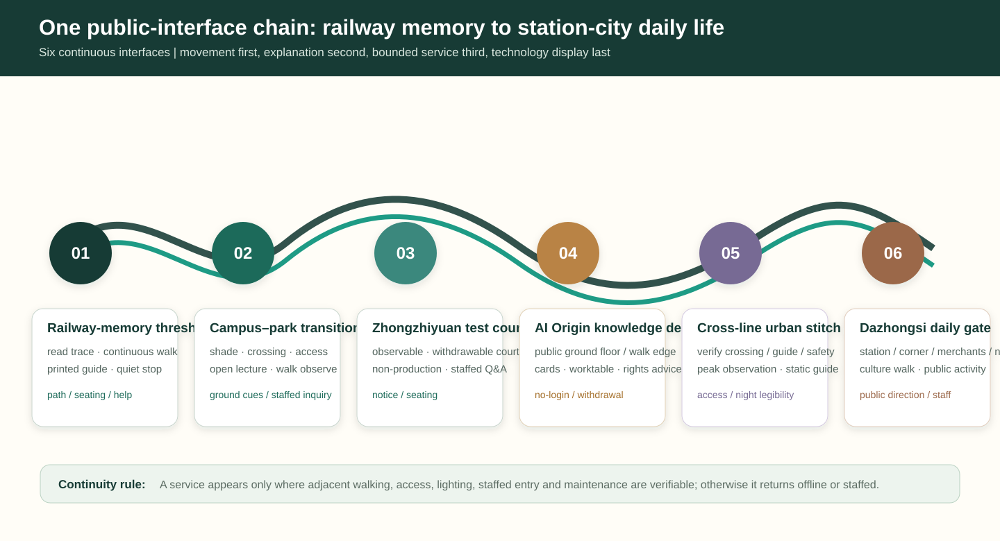

| Public-interface segment | Spatial action first | Light service that may enter | Non-digital baseline that remains | What is not pre-set |
| --- | --- | --- | --- | --- |
| 01 Railway-memory threshold | read the trace, continuous walking, quiet stopping | printed cultural guide, staffed telling, question collection | legible path, seating and emergency help | fixed event scale or delivery quantity |
| 02 Campus–park transition | shade, crossings, walking continuity and access | open-lecture meeting, walk observation | ground cues, physical map and staffed inquiry | replacing public movement with a digital entry |
| 03 Zhongzhiyuan Test Return Court | an observable, withdrawable public court | non-production test explanation and compute-literacy talk | printed notice, seating and staffed Q&A | equipment in principal routes or live-official-data claims |
| 04 AI Origin Knowledge Front Desk | public campus-edge ground floor and walking edge | project cards, open class, rights advice and worktable | no-login guide and attribution/withdrawal notice | unclear-rights display or closed campus-style edge |
| 05 Cross-line connection and urban stitch | verify crossings, guidance and safety before the rapid-road/rail condition | peak observation, temporary static guide and staffed transfer inquiry | continuous accessible route and night legibility | a promised crossing work or traffic arrangement from a concept drawing |
| 06 Dazhongsi station-city daily gate | make station exit, corner, merchants and night service legible together | cultural walk, merchant service and bounded public activity | public directions first, shade/seating and staffed desk | commercial information obscuring public guidance or automation replacing people |

The priority is consistent from north to south: **continuous movement first, legible explanation second, bounded service third, technology display last**. A service appears only when adjacent walking, accessibility, lighting, staffed access and maintenance are verifiable. If construction, weather, crowding, rights or safety interrupt any segment, it returns to the previous segment or becomes offline/staffed. In this way railway culture, Zhongguancun’s collaborative culture and new AI culture do not merely coexist on one masterplan; each takes its turn along the same everyday route.

### R04 Flagship Node: One Spatial Decision, Not Another Service List

The AI Origin “open knowledge front desk” does not aim to add more screens or service points. It judges space by three questions: **does public walking remain unbroken; can a first-time visitor receive staffed help without login; can a result be withdrawn?** Three relations are compared on the same concept interface. R04-A, a “central display island”, places digital display in the movement centre and is rejected because it compresses ordinary walking. R04-B, “distributed service points”, preserves movement but fragments explanation, rights and takeover responsibility, so it returns for revision. R04-C, the “side knowledge front desk”, keeps the public route continuous and brings reversible result cards, rights notes, staffed help and a shared table to one edge front desk; it advances for conceptual detailing.

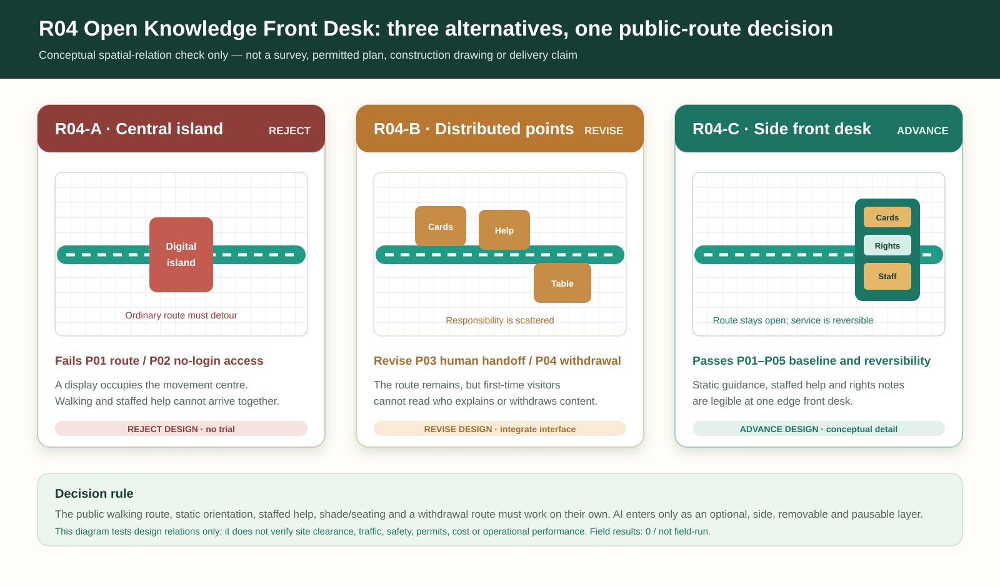

This is not a survey, building permit or engineering proposal for an existing parcel. The alternatives test only five concept relations: continuous public route, no-login arrival at staffed help, readable responsibility, readable withdrawal and a removable optional information layer. The three alternatives are reproducible as [metric:r04_spatial_alternative_count]. R04-C’s four design-relation checks and zero field results are recorded in `visual/assets/r04-spatial-decision.json`, as [metric:r04_design_relation_check_count] and [metric:r04_field_result_count]. Any future plan dimensions, clear widths, fire conditions, equipment, tenure, trees, drainage, permits, costs and operating performance require official information and professional review.

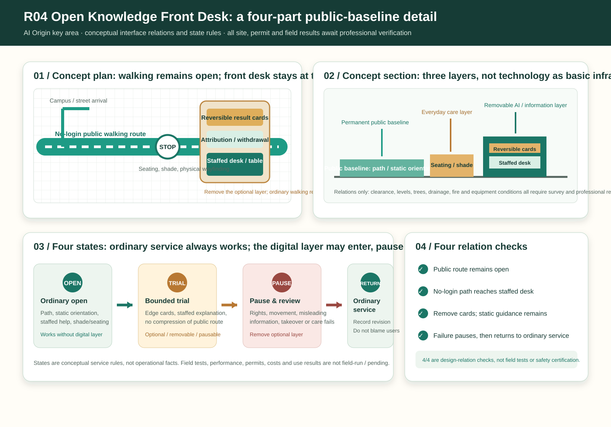

| R04 state | Public baseline visible on site | Optional information / AI layer | When to stop | What remains after pause |
| --- | --- | --- | --- | --- |
| OPEN ordinary opening | No-login walking, physical orientation, staffed help, seating and shade | Not required | N/A | Every ordinary service exists independently |
| TRIAL bounded use | Public route and staffed access must not shrink | Edge result cards, optional explanation and staffed table | Rights unclear, misleading information, blocked movement, no takeover or absent maintenance | Move immediately to PAUSE |
| PAUSE review | Static orientation and staffed help continue | Remove optional service layer | Review cannot state a revision route | Risk is not answered by “continue testing” |
| RETURN ordinary service | Public route, physical information and staffed help return as the only front desk | May be discussed later only if conditions support it | No repeat trial presumed | Revision rationale and non-identifying aggregate record |

R04 prevents AI+ education, open-source transfer and rights service from becoming a functional collage: every result display obeys an ordinary public route that already exists, and every digital layer can leave without taking staffed help away. The node is only a concept prototype under the provisional key-area index; transport, accessibility, site, heritage, building and operating decisions stay with later professional review [data:geometry/key_areas.geojson#PROV-KEY-002] [depth:three_key_area_detailed_design].

### Six Interface Delivery Cards: Turning a Public Interface into Verifiable Place Actions

To keep the six-part chain from remaining a narrative only, this edition arranges it as **six delivery cards, R01–R06**. Each card is tied only to the submitted provisional study extent, key-area index, road/public-space layers and items awaiting site verification. An “anchor” identifies the type of existing interface to be checked; it is **not a coordinate, works boundary or permit**. Every segment begins with an everyday question and ends with a retained benefit that does not depend on an algorithm continuing to run.

| Interface | Everyday question to answer first | First reversible action | Public benefit that remains | Stop / rollback trigger |
| --- | --- | --- | --- | --- |
| R01 Railway-memory threshold | Can a walker read the railway trace without being hurried? | Walk the route and mark gaps in shade, seating, wayfinding and emergency help | Printed route map and maintenance notes | Where heritage, movement or safety is unclear, retain observation and staffed interpretation only |
| R02 Campus–park transition | Can class-change and commuter movement pass continuously and accessibly? | Check walking gaps, rain refuge and staffed-help locations | Physical map, movable seating and issue cards | Do not add installations or events before crossing, fire and accessibility conditions are verified |
| R03 Trusted-test return court | When a display is off, is the court still a place to stay? | Non-production observation with temporary shade, printed explanation and staffed answers | Usable court and takeover explanation | If the principal route is blocked, information misleads or no person can take over, remove the display and return to staffed interpretation |
| R04 Open-source knowledge front desk | Can a visitor without login understand a result, see attribution and get help? | Reversible result cards, rights notes and staffed consultation time | Physical guide, attribution/withdrawal route and shared table | Where rights or maintenance responsibility are unclear, remove content and return to offline explanation |
| R05 Cross-line safety stitch | Have safety, orientation and transfer gaps at road/rail conditions been identified without promising works? | Peak, night and rain observation; temporary static guidance only | Issue map, accessible detour note and staffed transfer help | For road, rail or municipal works, stop site action and hand it to professional review |
| R06 Station-city everyday gate | Are public direction, seating and staffed help first at peaks and at night? | Check station wayfinding, shade, night legibility and merchant interface | Static guidance, accessible stopping point and staffed desk | On crowding, complaint or night-safety risk, return to ordinary static service |

R01–R06 form one spatial grammar: **question → reversible action → retained benefit → stop condition**; the count is reproducible as [metric:public_interface_count]. The machine-readable anchors, first actions, suggested coordination roles and rollback routes are in `visual/assets/interface-delivery-matrix.json`; provisional spatial evidence remains [data:geometry/key_areas.geojson#PROV-KEY-001] [data:geometry/roads.geojson#ROAD-001] [data:geometry/public_space.geojson#PUBLIC-001]. No card is a physical delivery instruction before official boundary, transport, municipal, fire, heritage and tenure information is available.

### Twelve Reversible Micro-Projects: Each Has a First Move and an Exit Gate

The three anchor packages are further split into twelve small, reversible actions rather than judged through one-off construction scale. M01–M12 enter only the delivery gates G0–G5 they can meet. If accessibility, human takeover, rights or maintenance cannot be verified, the action remains desk research, becomes staffed, or is withdrawn. Listed roles are **suggested coordination interfaces**, not appointed implementers.

| Micro-project | Interface | First action | Suggested coordination interface | Minimum public evidence | Rollback |
| --- | --- | --- | --- | --- | --- |
| M01 | R01 | Printed railway timeline guide | Cultural interpretation / site maintenance | Cleared text and route observation | Remove display; retain ordinary guidance |
| M02 | R01 | Heritage stopping and maintenance note | Park maintenance | Accessibility and maintenance check | Remove temporary item; restore routine maintenance |
| M03 | R02 | Campus-walking issue map | District operations / accessibility | Walk-through and rain observation | Retain desk-based issue list only |
| M04 | R02 | Movable seating and physical wayfinding test | Site maintenance / safety | Clear-width and removal record | Remove elements; restore open space |
| M05 | R03 | Trusted-test explanation desk | Technical operations / staffed answers | Test scope, anomaly and takeover record | Turn off digital explanation; use staffed explanation |
| M06 | R03 | Reversible shade-and-seating court | Public-space maintenance | Court observation after display is off | Remove elements and revise layout |
| M07 | R04 | Open-source result cards and attribution rack | Open-source community / translation | Authorisation, attribution and withdrawal summary | Remove content; retain blank information rack |
| M08 | R04 | Rights consultation and shared worktable | IP / staffed service | Service period and no-login route | Use appointment-based staffed consultation; collect no extra data |
| M09 | R05 | Peak/night continuity observation | Transport / accessibility / safety | Time-window observation summary | Do not enter site; submit issue map only |
| M10 | R05 | Temporary static transfer guidance | Site management / transport | Professional check and complaint summary | Remove immediately; restore existing guidance |
| M11 | R06 | Station-city everyday help desk | District operations / merchants | Staffed-service, feedback and maintenance record | Revert to ordinary staffed enquiry point |
| M12 | R06 | Night static guidance and stopping point | Accessibility / lighting / safety | Night observation and safety review | Pause night activity; restore routine cues |

The count is reproducible as [metric:reversible_micro_project_count]. This matrix defines “implementation feasibility” as an intelligible public process: observe, try, retain a non-digital benefit, review it through a clear role, and only then discuss professional delivery. It does not promise investment, construction, tenanting or approval outcomes [depth:renewal_project_list] [depth:phasing_implementation].

## AI Innovation Ecosystem, Personas, and AI+ Scenarios

Five operating personas keep the spatial proposal grounded: a researcher, a start-up product lead, a neighbourhood resident, a public-service operator and a visitor. Each has a clear entry point, consent boundary, human contact and feedback route.

Ten grouped scenarios are proposed as pilots, never as claims of deployed systems: accessible walking and station transfer; route confidence and night-time safety support; enterprise-service copilot; research-to-prototype matching; shared device booking; public-space event coordination; heritage interpretation; environmental observation; civic issue triage; and emergency-information review. Personal data minimisation, consent, reversible pilots, audit logs and trained human reviewers are prerequisites for every scenario [standard:PROJECT-AGENT-OPEN-CALL-TASKBOOK].

**AI+ law** enters the AI Origin open-source conversion front desk as a seventh first-use service card. It explains only the boundaries of display consent, attribution, withdrawal, intellectual property and public-service referral, while retaining a printed rights guide and qualified human advice. It does not generate case-specific legal advice, replace lawyers or public authorities, or collect personal information unrelated to the service. If the human referral, service boundary or correction route is unavailable, it stops and returns to offline advice [standard:GENERATIVE-AI-INTERIM-MEASURES] [source:AGENT-TASKBOOK].

## Land Use, Building Scale, and Retain-Renovate-Demolish Strategy

The conceptual partition prioritises AI research and innovation, park and open space, industry-service support, and civic-cultural uses. Existing building decisions are recorded as retain, renovate or replace hypotheses only; they require parcel, ownership, heritage and structural verification. No formal intensity, height or demolition quota is inferred from the provisional package.

## Transport, Rail, Municipal Infrastructure, and Public Services

The mobility strategy is a walk-first loop with station access, micromobility parking, safe crossings and fine-grain street connections. AI assistance is limited to legible wayfinding and operator review; it does not replace accessibility design or on-site staff. Municipal and computing infrastructure is proposed as a staged, resilient service layer subject to utility capacity confirmation.

## Blue-Green Network, Public Space, and Urban Character

Continuous shade, water-sensitive planting, rest points, universally accessible routes and event-ready clearings turn the heritage park into a daily civic room. Material and lighting choices favour calm, durable and interpretable public space. AI interfaces remain optional, low-friction and visibly governed.

### Climate–Space–Service Care Loop: Blue-Green Space Serves Everyday Resilience First

AI+ energy and AI+ park maintenance are not defined by the number of “smart” devices. They are judged by whether blue-green space still lets people move safely, stop and receive help in sun, rain and evening. The proposal introduces a conceptual **climate–space–service care loop**: water is first slowed through verifiable depressed planting, permeable stopping surfaces and existing-drainage conditions; shade, seating, night legibility and staffed reporting serve walking and access first; low-carbon compute enters only as non-live, explainable examples and remains subordinate to public-space, ecological, energy, safety and maintenance conditions. Without utilities, drainage, flood, power, fire and ownership information, no engineering method, capacity or performance value is assumed.

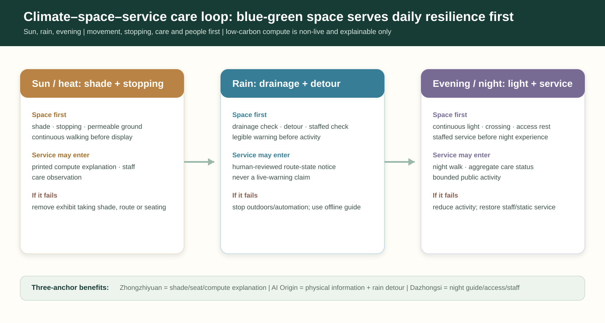

| Weather / time | Public-space action first | Low-disturbance service that may enter | Staffed and offline baseline retained | If conditions fail |
| --- | --- | --- | --- | --- |
| Sun and heat | shade, stopping, permeable ground and continuous walking before display | printed compute-literacy explanation, staffed talk and maintenance observation | physical guide, drinking/rest information and staffed inquiry | close or remove any exhibit taking shade, route or seating |
| Rain and ponding risk | drainage observation, detour, legible warning and staffed inspection before activity | only human-reviewed route state; display data never pretends to be live warning | static temporary guide, on-site/phone reporting and staffed safety cue | stop outdoor display and automated prompts; use offline guide or pause |
| Evening and night | continuous lighting, readable crossing, accessible rest and staffed service before experience | night cultural walk, aggregate care-status notice and bounded activity | static night guide, staffed desk and emergency-help information | reduce activity and restore normal service for lighting, crowding or safety risk |

The loop leaves distinct but connected benefits at the three anchors: Zhongzhiyuan’s compute explanation must also leave shade, seating and a care responsibility; AI Origin’s knowledge desk retains readable physical information and a detour in rain; Dazhongsi’s daily gate treats night guidance, accessible rest and staffed inquiry as prerequisites for any commercial or technical service. Park care publishes only authorised work-order category, state and review date—not private contact details—and never replaces human inspection with visual recognition, continuous location or automated scoring. Blue-green space therefore becomes more than a base map: it keeps technology within everyday care that can be maintained, explained and reversed.

## Renewal Projects, Implementation Policy, and Phasing

Phase 1 establishes the public loop, baseline observation and three low-risk demonstration nodes. Phase 2 equips the conversion commons and service interoperability. Phase 3 expands only after independent review of access, safety, benefit distribution and environmental performance. A quarterly public review and an annual open contribution cycle provide the operating rhythm.

### Three-Stage Resonance Roadmap: Every Stage Can Pause, Look Back and Leave a Benefit

Rather than advancing through a vague short- to long-term construction vision, the proposal uses three public decisions to connect space, service and operation. All three are conceptual action windows, not approved schedules, investment, quantities or delivery appointments. A later stage is discussed only when the previous stage’s public return remains in use, site conditions are verifiable and a staffed responsibility is clear.

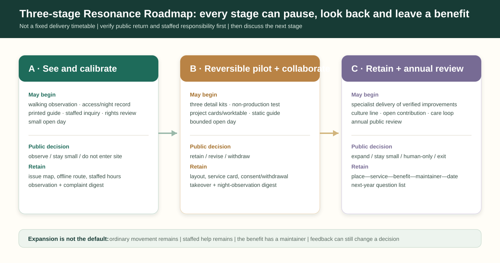

| Stage | What may begin | What must wait | Public decision at stage end | Minimum public benefit retained |
| --- | --- | --- | --- | --- |
| A · See and calibrate | walking observation, access/night records, staffed inquiry, printed guide, rights review and small open day | fixed installation, road/rail works, live-data connection or face/trajectory-based service | publish why the work continues observing, stays small or does not enter the site | issue map, offline route, staffed hours, observation and complaint digest |
| B · Reversible pilot and collaboration | three detail kits, non-production test, project cards/worktable, station-city static guide and bounded open day | unverified expansion, funding promise, exclusive tenancy or presenting display data as live official data | users, maintainers and professional advisers decide retain, revise or withdraw | temporary layout, service card, consent/withdrawal record, takeover and night-observation digest |
| C · Retain and review annually | later specialist teams deepen verified civic improvements and sustain culture line, open contribution and care loop | routine service without maintainer, permission, access conditions or explainable rights/responsibility | winter public assembly publishes expand, remain small, switch to people or exit | place—service—retained benefit—maintainer—review-date ledger and next-year question list |

The point is not to force every technology into Stage C. It may remain at A or B, or exit. **The right to expand comes neither from traffic, funding nor media attention, but from ordinary movement, staffed help, a maintained return and feedback that can still change a decision.** Capital, technology and event organisers can participate but cannot replace public decision-making; approvals, procurement, construction, health, transport, heritage and data matters require their respective processes.

## Metrics, Area Recalculation, and Compliance Matrix

The package records calculable areas, green/public-space ratios, building footprint and key-area count in `metrics.json`; GeoJSON is the source of calculations [metric:site_area_sqm] [metric:green_ratio] [metric:public_space_ratio]. Because the base boundary is provisional, spatial values are medium-confidence working figures and must be recalculated when official polygons are released. The compliance, standards and design-depth matrices map every required task to text, geometry, visual and review evidence.

## Design Upgrade: Resonance Protocol and Three Operable Prototypes

The **Resonance Protocol** organizes a public-responsibility chain from spatial prototype to long-term operation. It asks every AI service to be understandable, voluntary, capable of human takeover and open to public review before it moves from a one-off demonstration to routine use along the corridor [source:AGENT-TASKBOOK] [standard:GENERATIVE-AI-INTERIM-MEASURES]. It is not an administrative approval process.

### Review Handoff Cards: Turning Vision into a Checkable Next Step

To avoid a complete concept without a credible next step, every spatial action must leave a short handoff record before it can advance. The record is neither an approval nor a project promise. It lets the public, maintainers and later specialists decide whether to retain, revise, switch to people or exit.

| Handoff card | Spatial fact checked first | Civic benefit that must remain | Responsibility interface | If it cannot pass |
| --- | --- | --- | --- | --- |
| Movement card | principal route, crossing, accessibility, shade and night legibility | physical route map, ground cues, rest point and staffed inquiry | park/street operations and accessibility specialists | add no digital service; correct the route or use staffed guidance first |
| Rights card | consent for displayed material; usable attribution and withdrawal path | readable consent notice, withdrawal route and staffed advice hours | university transfer, open-source community and IP-service roles | remove or do not publish; a “pilot” never bypasses rights clarification |
| Takeover card | whether a person can take over after misleading guidance, crowding or an incident | staffed desk, stop condition and revision digest | scenario operator and on-site safety role | reduce the scope, turn off automated prompts and retain static information |
| Care card | whether facilities are still maintained in rain, at night and at peaks | care card, offline reporting route and review date | landscape, facility, merchant or venue maintainer | remove temporary elements or pause activity; restore routine care first |

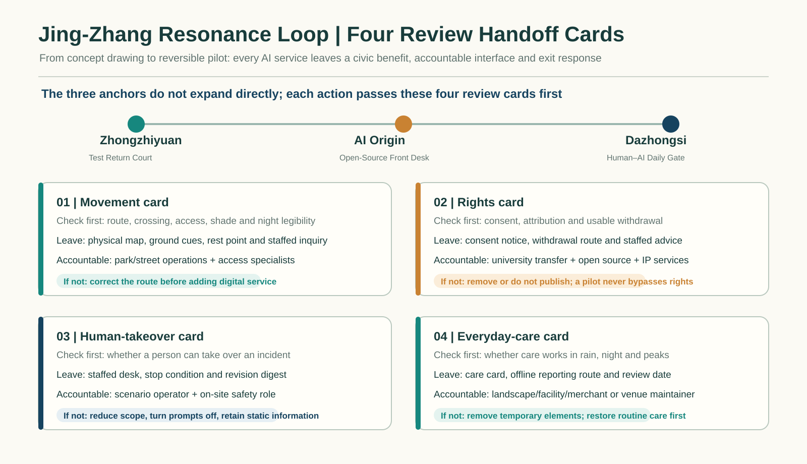

These four cards give AI+ education, health, commerce, energy, walking and park care one shared baseline: **technology enters public space only when movement, rights, takeover and care are all explainable**. They are the minimum common language that takes the six open-call tasks from drawing to long-term operation [source:AGENT-TASKBOOK] [depth:phasing_implementation].

### Three-Anchor Pilot Observation Ledger: Observe Whether Service Works, Never Score People

Zhongzhiyuan, AI Origin and Dazhongsi each begin with one public question, not attendance, commercial conversion or individual behavioural data. Zhongzhiyuan observes whether a principal route remains clear, staffed explanation is available and the test court still works after an exhibit closes. AI Origin observes no-login access, consent/attribution, staffed advice and withdrawal response. Dazhongsi observes station guidance, accessible stopping, night-time staffed inquiry and crowding-triggered downgrade. Every record is an aggregate condition of space and service; identity, journey, device identifiers and identifiable feedback are excluded.

The ledger has only four outcomes: **retain small, revise, switch to people, exit**. It hands later specialists a readable record of site conditions; it is not a live dashboard, approval record, construction promise or people-scoring system. The machine-readable version is `visual/assets/pilot-observation-ledger.json` [data:geometry/public_space.geojson#PUBLIC-001] [depth:phasing_implementation].

### Lasting Returns: Each Digital Trial Leaves an Offline Civic Improvement

Resonance cannot remain only on a screen, at an event or in a short-lived demonstration. The proposal therefore adds a **Lasting Return Rule**: every digital service entering the heritage park or a street-facing interface must also deliver one public-space improvement that remains usable without an account, device or continuously running algorithm. If the digital service is paused, that improvement must remain available for everyday use, maintenance and review. The question shifts from “what was demonstrated?” to “what did the city keep?”

This is not a list of new landmarks. It is a set of three design components that can be calibrated in existing open space, ground-floor corners and station-city interfaces: a **mobility return** repairs walking, resting, shade and accessible information; a **knowledge return** leaves attribution, rights, staffed explanation and revision traces at a readable public front desk; a **care return** keeps staffed reporting for lighting, water, trees, facilities and complaints on site. All components remain subject to site, heritage, fire, transport and ownership conditions and do not replace professional design or approval.

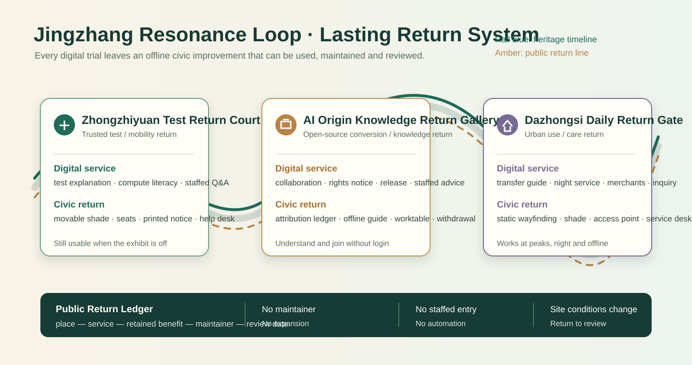

| Return unit | Public-space action | What remains when digital service pauses | First professional handoff | First review question |
| --- | --- | --- | --- | --- |
| Zhongzhiyuan Test Return Court | movable shade, seating, printed explanation and a staffed Q&A table in a test courtyard | compute-literacy notice, usable court and staffed inquiry hours | public-realm maintenance and technical-operations teams | Is the explanation clear, and does the space still work when the exhibit is off? |
| AI Origin Knowledge Return Gallery | updateable project cards, rights notice, public worktable and offline meeting point on the campus-edge route | attribution ledger, withdrawal route, physical wayfinding and reusable worktable | venue operator, university transfer and IP-service teams | Can a visitor understand a result without login, and can a rights dispute be handled by a person? |
| Dazhongsi Daily Return Gate | static wayfinding, shade, seating, night-lighting cues and a staffed inquiry point at a station exit/corner | legible transfer/crossing information, accessible rest point and staffed service window | district operations, accessibility and transport teams | Are ordinary walking, staffed inquiry and accessible routing continuous at peaks and at night? |

The three units are linked through a public ledger of **place — service — retained benefit — maintainer — review date**. It records only spatial facilities, service responsibility and authorised aggregate feedback; it does not record personal journeys, identity or profiling. A digital service cannot expand when its maintainer, staffed entry or site condition is absent. The ledger is a working handoff record for later professional teams, not an administrative approval, a live-surveillance system or a construction commitment.

### One Cultural Line, Four Seasons, Three Returns to Site

Operation is not a string of events added beside the heritage park. The proposal organises Qinghuayuan—Dongsheng—Zhongguancun—Dazhongsi as a cultural line of **memory — question — co-create — return**: railway culture makes connection and maintenance legible; Zhongguancun culture provides a daily stage for problem-led work, open collaboration and conversion; AI culture enters the site only when it can be understood, questioned and leave a physical return. Each event follows the same three actions: raise a question on site, test collaboratively across the three anchors, and return to public space with a visible revision or pause.

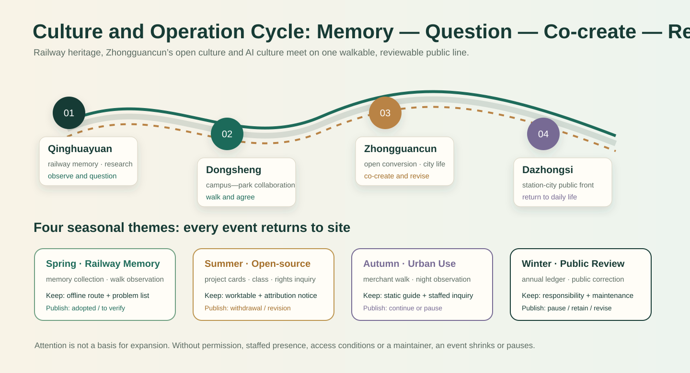

| Season / theme | Cultural-line venue | What the public can do | Return that must remain | What must be published at the end |
| --- | --- | --- | --- | --- |
| Spring · Railway Memory Open Week | Qinghuayuan—Dongsheng | collect oral memory, walk and observe, agree access/rest points | mobility return: updated offline route map and a rest/problem list | which routes and memories are adopted; which still need site verification |
| Summer · Open-Source Co-creation Season | AI Origin campus edge | use project cards, join open classes/tool repair and ask rights questions | knowledge return: consent/attribution notice, public worktable and staffed advice hours | authorised material, withdrawals and revision digest |
| Autumn · Urban-Use Observation Week | Dazhongsi station-city edge | walk with merchants/residents, observe night wayfinding, see demos and ask people | daily return: static wayfinding, night cue, access point and staffed inquiry | peak/night observation, complaint handling and whether testing continues |
| Winter · Public Review Assembly | rotating anchors and heritage-park nodes | read the annual ledger, correct it and co-set next year’s questions | care return: responsibility card, maintenance list and next review date | pause, retain, revise or retain-human-only decision for each scenario |

The four seasons are not a fixed festival commitment. They are a replaceable, scalable operating framework. If a proposed event lacks permission, staffed presence, access conditions or a named maintainer at G0–G5, it must shrink to an indoor/online discussion or pause; attendance, publicity and media reach never replace public value, spatial safety or human review.

### Four Cultural Nodes: Three Cultures Take Turns Leading Everyday Life

The cultural line does not cover the corridor with a uniform set of photo spots. Each node has a distinct **reason to stop, public narrative, low-threshold action and retained benefit**. At Qinghuayuan, railway culture is read through connection, care and time; at Dongsheng–Zhongguancun, Zhongguancun culture is read through question, collaboration and contribution; at AI Origin and Dazhongsi, new AI culture is felt only through explainable, withdrawable and human-takeover-capable services. Each is first a daily public interface; events occur only temporarily on top.

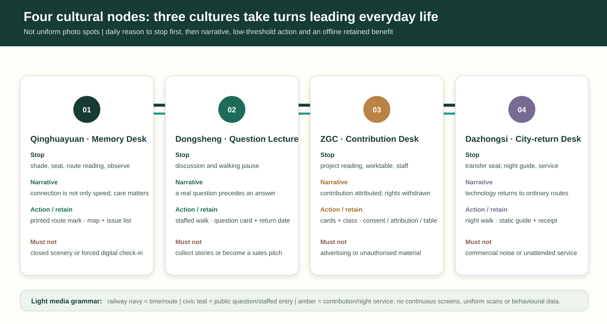

| Node | Everyday reason to stop | Narrative readable that day | Low-threshold action | Offline benefit retained | What must not happen |
| --- | --- | --- | --- | --- | --- |
| Qinghuayuan · Railway-memory desk | shade, seating, route reading and quiet observation | “connection is not only speed; care is also innovation” | mark an obstacle on a printed route or tell an openly shareable memory | updated walking map, issue list and care cue | turn heritage into closed scenery or require a digital check-in |
| Dongsheng · Question lecture | open discussion and a campus–park walking pause | “a real question comes before a technical answer” | raise a public-space/life/collaboration question; join a staffed walk | public question card, offline agenda and return date | collect identifiable stories or turn a discussion into a sales pitch |
| Zhongguancun / AI Origin · Contribution front desk | no-login project reading, worktable and staffed advice | “contribution can be attributed, rights withdrawn and knowledge repaired together” | read a project card, join a class, ask a question or request withdrawal | attribution/consent notice, worktable and staffed hours | fill the public front desk with advertising or unauthorised content |
| Dazhongsi · City-return desk | shade, seating, night guidance and staffed service before/after transfer | “technology finally returns to the ordinary route” | observe night guidance, walk with merchants/residents or ask staff | static guidance, night cue and care/review receipt | let commercial information obscure public direction or replace people with unattended service |

The four nodes use one light media grammar: **railway navy marks time and route; civic teal marks public questions and staffed entry; amber marks contribution and night service**. All wording still needs accessibility, bilingual/multilingual, copyright and site-condition review before delivery. Nodes neither require continuous screens nor uniform scanning nor behavioural-data collection. Printed material, physical elements, people and a small amount of updateable information become a cultural route usable on ordinary days—not only a visual package for events.

| Resonance segment | Spatial prototype | Primary users | Question to test first | Non-digital alternative | Minimum public evidence |
| --- | --- | --- | --- | --- | --- |
| Zhongzhiyuan trusted-test segment | Trusted Compute Garden, observatory and shared test court | developers, start-ups, park staff | Is the service safe, explainable and transferable to a human? | in-person advice, printed notice, manual booking | test scope, incident response, responsible role, withdrawal record |
| AI Origin open-source conversion segment | Open-Source Front Desk, contribution gallery and campus-edge lounge | students, contributors, conversion teams | Can a result be understood and joined fairly? | no-login wayfinding, offline release, staffed counter | consent status, attribution, feedback digest, revision log |
| Dazhongsi urban-use segment | Human–AI Co-walking Street, station-city lounge and evening stage | residents, merchants, visitors | Does a service improve daily life without excluding non-users of AI? | staffed inquiry, manual assistance, static wayfinding | accessibility check, complaint route, service hours, pause condition |

The segments are not a one-way industrial pipeline. Any service can return to an earlier segment for revision or stop after public feedback. This translates the railway’s idea of connection into a repeatable public-value check rather than a one-direction technology showcase. Exact locations, dimensions, building actions and engineering conditions remain subject to official boundaries, ownership, transport, municipal, fire and heritage review [data:geometry/key_areas.geojson#PROV-KEY-001] [data:geometry/key_areas.geojson#PROV-KEY-002] [data:geometry/key_areas.geojson#PROV-KEY-003].

| Prototype | Everyday use | Spatial action | Responsibility and stop condition | Low-risk first test |
| --- | --- | --- | --- | --- |
| RP-01 Trusted Compute Garden | Daytime test explanation and low-carbon compute display; an evening public question-and-human-answer session | movable shade, seating, information counter and reversible exhibition in existing open space | pause and publish a correction when safety, misleading communication, energy or complaint thresholds are breached | booked workshops, temporary wayfinding and anonymous feedback; no personal profiling |
| RP-02 Open-Source Front Desk | campus-edge advice by day; release, IP inquiry and developer walk meeting point in the evening | a visible, walk-in and no-login public front desk across ground-floor edge, promenade and gallery | no display without consent, attribution and a withdrawal path; pause where rights or maintenance responsibility are unclear | offline project cards, human explanation and small open days |
| RP-03 Human–AI Co-walking Street | accessible transfer and walking information at commute peaks; merchant service, cultural interpretation and small talks at night | repair crossing, shade, seating, lighting and static wayfinding before adding explainable digital prompts | revert to human and static systems for crowding, misleading information, accessibility failure or privacy dispute | time-limited test at one corner and one station exit; no road-engineering promise |

The machine-readable version is `visual/assets/resonance-protocol.json`. It contains only conceptual operating fields and no personal, real-time or engineering-control data.

### Three Anchors, One Day: Testing Human-Centred AI Across Time

The three anchors do not claim public space for an all-day technology show. They test whether a service improves ordinary life across three observable conditions—**commute peak, daytime and evening**. These are operating scenarios, not promised opening hours. Every condition retains walking, explanation and staffed access that do not depend on a phone, account or running algorithm. When crowding, weather, permission, access conditions or staffing are inadequate, the digital service must remain small, revert to people or pause.

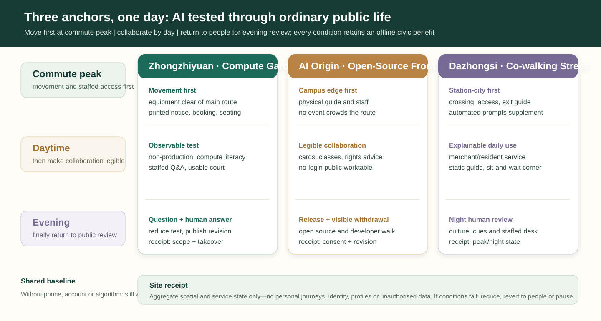

| Time condition | Zhongzhiyuan · Trusted Compute Garden | AI Origin · Open-Source Front Desk | Dazhongsi · Human–AI Co-walking Street |
| --- | --- | --- | --- |
| Commute peak: make movement work first | Test equipment stays out of principal routes; printed notice, manual booking and quiet seating come first | retain the campus-edge walking route, physical guide and staffed inquiry; no release event may crowd the route | crossing, station-exit guidance, accessible continuity and staffed inquiry come first; automated prompts remain supplementary |
| Daytime: then make collaboration legible | booked non-production tests, compute-literacy explanation and observable staffed Q&A | project cards, open classes, rights/attribution advice and a no-login public worktable | explainable service for merchants and residents, bounded observation, static wayfinding and a corner to sit and wait |
| Evening: finally return to public review | close or reduce testing; switch to question-and-human-answer and a same-day incident/revision note | open-source release, developer-walk meeting and withdrawal/revision notice, with a calm exit route | cultural walk, night-lighting cues and staffed desk; revert to static systems immediately for crowding, misleading information or access risk |

At the end of each condition, a visible **site receipt** remains: Zhongzhiyuan records that day’s test scope and human-takeover note; AI Origin shows authorised material and withdrawal/revision routes; Dazhongsi shows the peak/night observation and staffed-service state. The receipt carries aggregate service and spatial information only—never personal journeys, identity, profiles or unauthorised data. It returns the question of expansion to ordinary walking, understanding, stopping and receiving help, rather than demonstration duration or traffic metrics.

### Six Global Cases and a Haidian Translation

The cases below are not an international name collage. They test missing interfaces in the innovation chain: spatial access, operating roles and public safeguards. Only mechanisms are translated; scale, funding, governance powers and policy conditions are not copied.

| Public case | Mechanism observed | Specific Haidian translation | Not copied |
| --- | --- | --- | --- |
| Kendall Square, MIT | research, labs, housing, retail, open space and community participation | AI Origin’s campus-edge conversion street joins a staffed ground floor, shared workshop, walking interface and daily service | no MIT parcel, intensity or timetable is inferred |
| STATION F, Paris | adaptive reuse; programme-based access to mentors, corporates, capital and events | Dazhongsi station-city lounge uses a public front desk, booked collaboration and event pitch sequence | no desk count, admission rule, investment return or brand partnership |
| MaRS Discovery District, Toronto | commercialisation support and links to capital, customers and talent | an AI Origin service desk joins IP, sector consultation, venture support and human inquiry | no fund, health credential or financing outcome |
| one-north / LaunchPad, Singapore | research park plus work, learn, live and public community activity; close incubator/VC access | Zhongzhiyuan Trusted Compute Garden combines a test court, low-carbon explanation, developer walk and open day | no estate-management power, land supply or national policy transfer |
| Cyberport, Hong Kong | incubation, technology networks, sector pilots and talent support | a Dazhongsi application-test front desk makes merchant, civic-service and enterprise trials observable and pausable | no subsidy, computing capacity, approval or tenant commitment |
| Waterfront Innovation Centre, Toronto | digital infrastructure, employment space, public realm and accountable delivery aligned together | the heritage park puts public space first and digital capability second through reversible packages | no developer, budget, construction scale or engineering standard transfer |

The local chain is therefore: **basic research → open contribution → trusted test → incubation/IP/capital connection → small public-service pilot → public review and international exchange**. Every link needs a spatial carrier, accountable role, staffed option and stop condition; capital service means compliant advice, pitch and connection—not an investment promise [source:CASE-KENDALL-SQUARE] [source:CASE-STATION-F] [source:CASE-MARS].

### From Research to City Adoption: a Six-Stage Ecosystem Relay

To prevent the ecosystem from becoming a one-way investment-attraction diagram, the proposal treats it as a reversible spatial relay. Each stage hands over one readable, reviewable item only: research hands over a problem brief; open source hands over consent/attribution; testing hands over a human-takeover and incident summary; conversion hands over an IP and scenario-fit list; capital service hands over non-exclusive pitch preparation and resource-connection records; city adoption hands over the public-return ledger. A stage cannot advance when rights, responsibility, staffed entry or a stop condition cannot be explained.

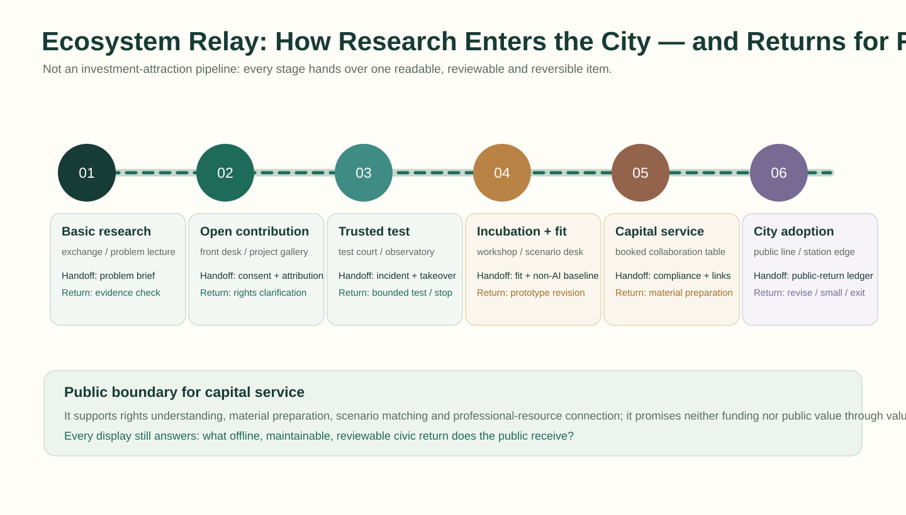

| Ecosystem stage | Spatial front desk | Only handoff from this stage | Staffed responsibility entry | Where it returns if incomplete |
| --- | --- | --- | --- | --- |
| Basic research | Qinghuayuan—Dongsheng research exchange and problem lecture | research brief linked to a real everyday question, without unauthorised data | public hours held by university/research institution | problem definition and evidence check |
| Open contribution | AI Origin open-source front desk and project-card gallery | consent status, attribution and withdrawable result abstract | open-source community and transfer-service counter | rights clarification or non-public display |
| Trusted test | Zhongzhiyuan Test Return Court and observatory | test scope, incident digest and human-takeover/removal record | test lead and staffed on-site Q&A | bounded test or stop |
| Incubation and scenario fit | campus-edge workshop and scenario-advice desk | scenario-fit list, service boundary and non-AI baseline | transfer, legal/IP and scenario-operations roles | prototype revision or human service |
| Capital service and collaboration | booked collaboration table in the Dazhongsi station-city lounge | pitch-material completeness, compliance note and resource-connection record; no funding promise | compliance adviser, start-up service and event organiser | material preparation; financing result is never an entry condition |
| City adoption and review | heritage-park public line and station-city daily interface | retained benefit, maintainer, review date and authorised aggregate feedback | park/district operations and public-feedback entry | revise an earlier stage, remain small or exit |

The relay returns capital service to an appropriate urban-design boundary: it helps teams understand rights, prepare an explanation, match a scenario and reach professional resources. It does not define public-space value through enterprise valuation, investment amount, exclusive tenancy or commercial return. Any display along the public line is still judged first by whether it provides an offline civic return.

### Three Anchor Project Packages: Responsibility, Metrics and Exit

| Package | Near-term action (0–12 months) | Lead / partners | Public pilot KPI | What happens if it fails |
| --- | --- | --- | --- | --- |
| P-01 Zhongzhiyuan Trusted Compute Garden | temporary test court, movable information desk, low-carbon explanation and booked open days | park operator; university/enterprise teams and public-realm maintainer | explanation coverage, takeover-drill completion, anonymous-feedback closure and energy-disclosure completeness | pause digital display, retain human/physical guidance and review safety, energy and misleading claims |
| P-02 AI Origin Open-Source Front Desk | shared ground-floor workshop, project cards, IP advice hours and developer-walk meeting point | venue operator; university transfer, open-source and legal/IP partners | consent/attribution completeness, no-login participation, response time and withdrawal handling | remove unclear content; switch to human/offline explanation or stop display |
| P-03 Dazhongsi Human–AI Co-walking Street | one station exit/corner with static wayfinding, shade, seating, limited shuttle and merchant-service pilot | district operator; merchants, transport/accessibility specialists and community representatives | continuous ordinary walking, staffed-service availability, complaint closure and night-safety review | immediately return to static wayfinding and human service; stop automation and publish a review |

These KPIs are not used for profiling, ranking people or real-time surveillance. They use only authorised aggregated operations records, site observation and anonymous feedback. Any road, rail, municipal, fire, heritage, medical or drone pilot requires relevant professional review and site permission.

### Professional Handoffs for Three Spatial Actions

To avoid a complete concept losing focus in delivery, the three packages are not handed to a single operator. Reviewable handoff materials connect planning, architecture/landscape, mobility/accessibility, operations and compliance work. The table identifies conceptual-stage outputs only; dimensions, quantities, cost, ownership and permits must be determined by responsible parties and professional teams.

| Spatial action | Conditions to confirm first | Concept-stage handoff | Receiving professional roles | If unconfirmed |
| --- | --- | --- | --- | --- |
| Heritage-park mobility return | entrances, crossings, drainage, trees, lighting, accessibility and rail-safety boundary | walking-observation record, physical-wayfinding sketch, resting-point list and staffed-inquiry flow | landscape, municipal, accessibility and park-operations teams | retain temporary staffed tours only; add neither digital guidance nor fixed installation |
| Campus-edge knowledge return | ground-floor openness, walking edge, fire egress, content rights and daily maintenance | project-card template, consent/withdrawal notice, activity timetable and public-worktable principles | adaptive-reuse, operations, university-transfer and IP-service teams | do not publish unclear material; use staffed advice and offline explanation |
| Station-city daily return | station flow, crossings, night lighting, merchant edge and accessible continuity | peak-observation sheet, static-wayfinding priorities, service-desk responsibility card and pause/review record | transport, accessibility, district-operation and merchant-coordination teams | restore static wayfinding and staffed inquiry before any automated service |

The crosswalk from the three positionings and five functions to local actions is `visual/assets/taskbook-resonance-crosswalk.json`; representative key-area concept windows are recorded in `spatial.json`; eight implementation risks and their required human review are in `risk.json`. These files add reviewable evidence and do not create statutory controls or delivery commitments.

### Three Reversible Detail Kits: Observe, Test, Then Hand Over

The shared method across the three anchors is **observe use first, place reversible elements second, then decide whether professional delivery should follow**. It prevents a rendering from becoming a construction list before boundaries, trees, fire routes, flows and ownership have been verified. Every element assumes uninterrupted access and emergency routes, no encroachment on rail-safety limits and no personal profiling. Quantities, dimensions, materials, cost and fixing methods are deliberately not prescribed here.

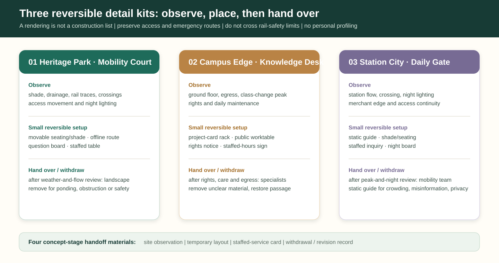

| Detail kit | What to observe first | Small reversible setup | How the public knows / uses it | When to hand over; when to withdraw |
| --- | --- | --- | --- | --- |
| Heritage-park mobility court | shade, drainage, rail traces, crossings, wheelchair/pram movement and night lighting | movable seating/shade, offline route map, updateable question board and staffed table | low-impact ground cues and printed route; neither scan nor booking required | after observation across weather and flows, hand to landscape/municipal/accessibility teams; remove temporary items for ponding, obstruction or safety-boundary concern |
| Campus-edge knowledge front desk | ground-floor opening, egress, walking width, class-change peak, display rights and daily care | movable project-card rack, public worktable, attribution/withdrawal notice and staffed-hours sign | readable on approach and explained by a person when needed; a screen never replaces rights notice | after consent, maintenance and egress are stable, hand to adaptive-reuse/operations/IP teams; remove unclear material or restore passage immediately |
| Station-city daily gate | station flow, crossing wait, night lighting, merchant spill-out and accessible continuity | static-wayfinding priority board, temporary shade/seating, staffed inquiry and night-observation board | public directions precede commercial information; a person can explain every digital prompt | after peak and night observations, hand to transport/accessibility/district teams; revert to static guidance for crowding, misinformation or privacy concern |

Each kit generates only four handoff materials: a **site-observation sheet, temporary-layout sketch, staffed-service responsibility card and withdrawal/revision record**. At concept stage these are more valuable than a spectacular fixed installation: they let specialists judge what should remain, and let the public see why a service began, how it changed and when it exited.

### Public-Value Evidence Ledger: Observe Service, Not Profile People

To make human-centred AI testable without turning it into surveillance, the proposal adds a low-data, offline-readable **public-value evidence ledger**. It records whether space and service are working; it does not record identity, faces, device identifiers, precise trajectories, commercial preferences or re-identifiable raw feedback. Staff observation, paper checklists, authorised aggregate comments and maintenance work orders can form a digest. Raw records are handled by responsible parties under applicable rules and never enter the public display.

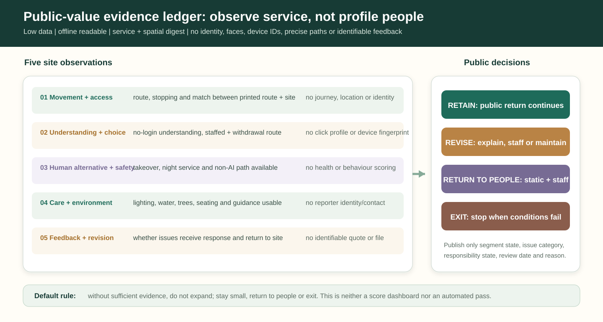

| Observation | Observe only | Do not collect | Minimum public digest | Action triggered |
| --- | --- | --- | --- | --- |
| Movement and access | route continuity, obstruction from stopping, match between printed route and site | individual journeys, precise location or identity labels | segment state, obstacle type and repair/review date | remove obstruction and restore static guidance; pause service if needed |
| Understanding and choice | ability to understand without login and find human/withdrawal route | click profile, device fingerprint or emotion inference | legibility, staffed-hours availability and question categories | rewrite, add human explanation or remove unclear material |
| Human alternative and safety | availability of human takeover, emergency notice, night service and non-AI path | health data, behaviour score or automated risk profile | staffed-entry state, drill/check completion and pause reason | return to staffed/static system; review before any restart |
| Care and environment | whether lighting, water, trees, seating and guides remain usable | reporter identity or contact details | work-order category, completion state and next review | maintenance first; no expansion without a maintainer |
| Feedback and revision | whether authorised feedback receives a response and revision returns to site | identifiable quotations, personal files or social relations | issue count, response state and retain/revise/exit decision | publish the reason in the stage receipt and annual review |

The ledger is not a score dashboard or an automated pass. Its sole purpose is to let the public, maintainers and later specialists see whether a service still improves space, retains a human choice and merits staying on site. Without readable evidence, the default is not expansion but **staying small, returning to people or exiting**.

### Six First-Use Scenario Cards

The design now turns AI+ education, health, commerce, energy, walking and park maintenance into six reviewable cards in `visual/assets/scenario-persona-matrix.json`. Each card identifies a person and everyday task, spatial anchor, a retained civic benefit, non-AI baseline, accountable role, public evidence and stop condition. They are conceptual service patterns, not authorised service listings.

| Scenario | Everyday task and place | Retained civic benefit | Non-AI baseline | Stop condition |
| --- | --- | --- | --- | --- |
| AI+ education | students and conversion teams at the AI Origin front desk | knowledge return: physical guide, public worktable and updateable attribution/rights notice | physical wayfinding, printed timetable and staffed counter | unclear content rights, blocked passage or no human explanation |
| AI+ health | older people and carers finding accessible service routes | care return: accessible map, waiting/rest point and staffed-navigation contact card | staffed navigation, printed directory and accessible map | mistaken medical advice, inaccessible route or unavailable human service |
| AI+ commerce | residents, merchants and commuters at Dazhongsi | daily return: static wayfinding, shade/seating and staffed inquiry window | static wayfinding, staffed inquiry and ordinary merchant service | public wayfinding is obscured, crowding or privacy concern |
| AI+ energy | compute-literacy at Zhongzhiyuan | test return: printed energy explanation, usable court and staffed Q&amp;A hours | physical notice, human explanation and offline board | unsafe condition or misleading presentation as live official data |
| AI+ walking | continuous accessible route in the heritage park | mobility return: ground cues, resting points and offline route map | physical map, ground cues and staffed inquiry | directions conflict with site conditions or block ordinary access |
| AI+ park maintenance | reporting lighting, water, trees and facilities | care return: on-site reporting point, responsibility card and readable maintenance record | phone/on-site reporting, paper form and human inspection | no staffed route, exposed contact details or compromised safety response |

### Ten Service Blueprints: Turning AI Scenes into Reviewable Services

| Service | Start and staffed entry | Minimum data/tool | Responsible role | Public evidence and stop condition |
| --- | --- | --- | --- | --- |
| Open-source release hall | staffed desk and physical project cards | authorised project summary | community curator | attribution, consent and withdrawal log; remove on unclear rights |
| Safety-governance sandbox | booked briefing and human Q&A | non-production test log | test lead | test scope and incident summary; pause on safety concern |
| Edge-compute stop | physical board and human explanation | non-live energy example | facility operator | explanation sampling; remove if misleading |
| AI walking navigation | physical map and staffed inquiry | reviewed route status | public-realm operator | route check and complaints; close when site conflicts |
| International pitch lounge | human reception and event desk | event registration and rights materials | event organiser | access/crowd review; cancel without capacity or permission |
| Qinghe low-carbon corridor | park service point | maintenance ledger | landscape maintainer | work-order summary; stop installation for ecology/safety risk |
| Campus-edge conversion street | university-enterprise consultation window | authorised result abstract | transfer service | response and withdrawal log; shift rights disputes to human process |
| Data-elements lounge | staffed compliance consultation | non-personal process example | compliance lead | data-use notice; do not display if it cannot be explained |
| AI daily-service street | community service desk | voluntary, minimised request | community operator | staffed-alternative availability; stop if no human takeover |
| Global AI activity-week route | offline tour point | itinerary and anonymous attendance observation | route curator | permits, access and complaint review; reduce or cancel if absent |

### Six Delivery Gates

Four public-experience gates govern each service encounter; six delivery gates govern whether a proposal can advance from desktop study to a time-limited pilot or a wider conceptual discussion. `visual/assets/implementation-gates.json` records G0 site/data prerequisites, G1 public value, G2 rights and access, G3 safety and human takeover, G4 operating responsibility and G5 expansion review. A failed gate requires revision, a small-scale hold or exit; visibility or usage alone never proves public value.

## Risk, Copyright, and Compliance

This is an AI-assisted conceptual design package. It does not assert official boundaries, statutory controls, government commitments, personal-data access or construction approval. Generated visuals are clearly presented as concept diagrams. All implementation requires professional planning, legal, heritage, accessibility, privacy, safety and technical review.

## References

See `sources.json`, `assumptions.json`, `compliance_matrix.json`, `standard_matrix.json`, `design_depth_matrix.json`, and the registered public brief/source registry for the complete traceable source list and data-use conditions.
