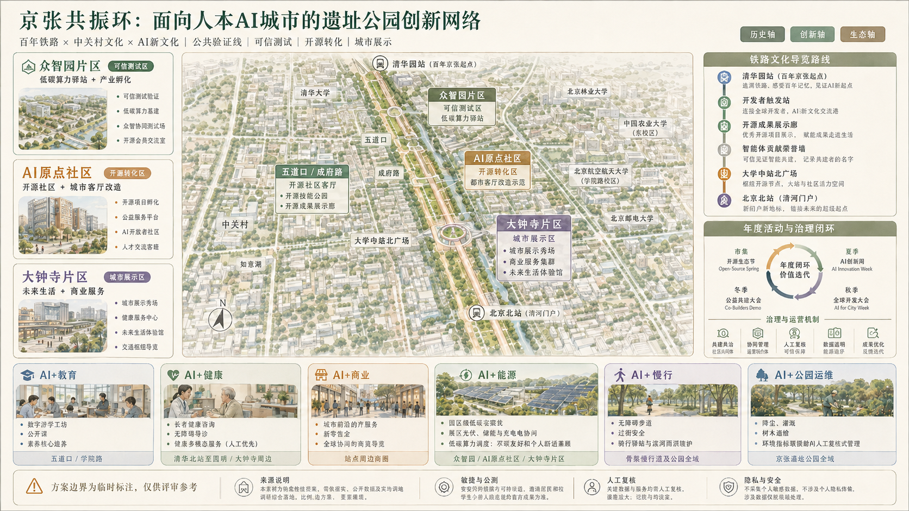
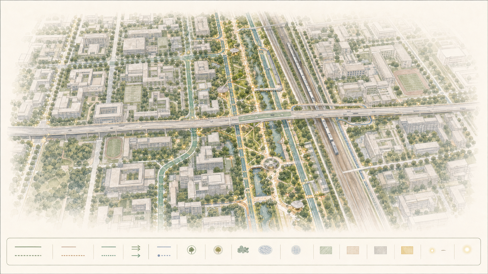
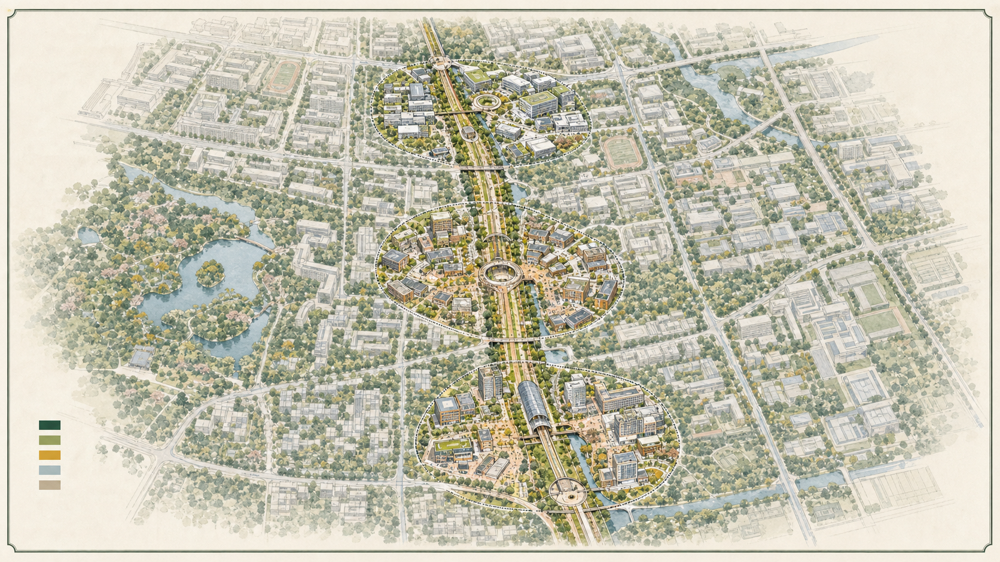
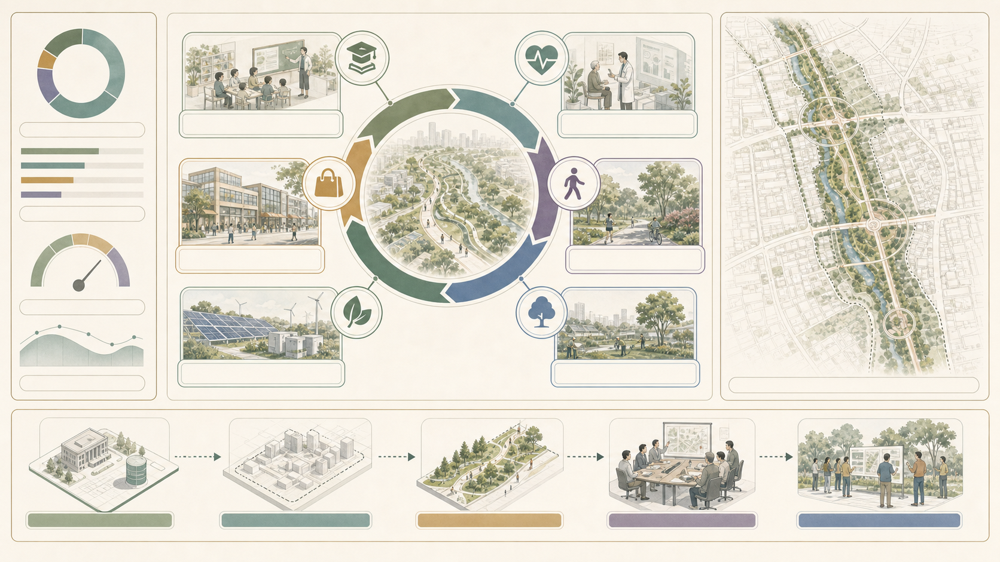

# Jingzhang Resonance Loop

## Design Basis and Source List

This formal package responds to the public qualification announcement for the Centennial Jingzhang AI Innovation Belt and the agent open-call taskbook. It uses the registered brief, source registry, enumerations and schemas as its evidence layer [source:OFFICIAL-ANNOUNCEMENT] [source:AGENT-TASKBOOK]. The current site and key-area polygons are explicitly **provisional constraints**, not official boundaries, redlines or approval controls [source:SOURCE-REGISTRY]. Figures, GeoJSON and metrics are therefore reproducible design working materials rather than statutory conclusions.

## Three-Level Scope Framework

The proposal works at three linked levels: a coordinated research area for the innovation ecosystem and future-city strategy; an overall design area for renewal, mobility, utilities and character; and three key detailed-design areas for testable projects. “One line, three anchors, many everyday scenes” is a method for coordinating these levels, not a newly asserted planning boundary. The three anchors are Zhongzhiyuan, the AI Origin Community and Dazhongsi [depth:three_level_scope_framework].

## Coordinated Research Area: Industry and Future City Research

The innovation ecosystem is structured as a six-step public-value loop: university and institute research; open-source collaboration; enterprise conversion; public-space testing; independent review; and return of lessons to the developer community. The Jingzhang heritage park becomes the shared civic interface of this loop. It translates the brief’s cultural belt, AI living-experience belt and AI-integrated innovation belt into a coherent identity without claiming a government implementation commitment.

## Overall Design Area: Urban Renewal and Regulatory-Plan-Level Urban Design

The overall structure is a “resonance loop”: a heritage-and-public-space spine, three innovation anchors, a blue-green and walking circuit, and distributed service nodes. The submitted land-use layer is a complete, non-overlapping conceptual partition; buildings, roads, green space, public space and phasing are separate auditable layers. Heights, FAR, redlines and approved capacities remain subject to verified statutory controls.

## Detailed Design of Key Areas

**Zhongzhiyuan — trusted-AI test garden.** A reviewable testing ground combines a public contribution wall, prototype demonstrations and a human-in-the-loop observation deck. It is designed to make model limits, review routes and feedback visible.

**AI Origin Community — open-source conversion commons.** Flexible collaboration rooms, shared device libraries and enterprise-service counters support the move from research contribution to accountable adoption.

**Dazhongsi — city showcase and heritage gateway.** A slower cultural route, accessible civic interface and event-ready forecourt connect historical interpretation with legible urban AI services.

## AI Innovation Ecosystem, Personas, and AI+ Scenarios

Five operating personas keep the spatial proposal grounded: a researcher, a start-up product lead, a neighbourhood resident, a public-service operator and a visitor. Each has a clear entry point, consent boundary, human contact and feedback route.

Ten grouped scenarios are proposed as pilots, never as claims of deployed systems: accessible walking and station transfer; route confidence and night-time safety support; enterprise-service copilot; research-to-prototype matching; shared device booking; public-space event coordination; heritage interpretation; environmental observation; civic issue triage; and emergency-information review. Personal data minimisation, consent, reversible pilots, audit logs and trained human reviewers are prerequisites for every scenario [standard:PROJECT-AGENT-OPEN-CALL-TASKBOOK].

## Land Use, Building Scale, and Retain-Renovate-Demolish Strategy

The conceptual partition prioritises AI research and innovation, park and open space, industry-service support, and civic-cultural uses. Existing building decisions are recorded as retain, renovate or replace hypotheses only; they require parcel, ownership, heritage and structural verification. No formal intensity, height or demolition quota is inferred from the provisional package.

## Transport, Rail, Municipal Infrastructure, and Public Services

The mobility strategy is a walk-first loop with station access, micromobility parking, safe crossings and fine-grain street connections. AI assistance is limited to legible wayfinding and operator review; it does not replace accessibility design or on-site staff. Municipal and computing infrastructure is proposed as a staged, resilient service layer subject to utility capacity confirmation.

## Blue-Green Network, Public Space, and Urban Character

Continuous shade, water-sensitive planting, rest points, universally accessible routes and event-ready clearings turn the heritage park into a daily civic room. Material and lighting choices favour calm, durable and interpretable public space. AI interfaces remain optional, low-friction and visibly governed.

## Renewal Projects, Implementation Policy, and Phasing

Phase 1 establishes the public loop, baseline observation and three low-risk demonstration nodes. Phase 2 equips the conversion commons and service interoperability. Phase 3 expands only after independent review of access, safety, benefit distribution and environmental performance. A quarterly public review and an annual open contribution cycle provide the operating rhythm.

## Metrics, Area Recalculation, and Compliance Matrix

The package records calculable areas, green/public-space ratios, building footprint and key-area count in `metrics.json`; GeoJSON is the source of calculations [metric:site_area_sqm] [metric:green_ratio] [metric:public_space_ratio]. Because the base boundary is provisional, spatial values are medium-confidence working figures and must be recalculated when official polygons are released. The compliance, standards and design-depth matrices map every required task to text, geometry, visual and review evidence.

## Risk, Copyright, and Compliance

This is an AI-assisted conceptual design package. It does not assert official boundaries, statutory controls, government commitments, personal-data access or construction approval. Generated visuals are clearly presented as concept diagrams. All implementation requires professional planning, legal, heritage, accessibility, privacy, safety and technical review.

## References

See `sources.json`, `assumptions.json`, `compliance_matrix.json`, `standard_matrix.json`, `design_depth_matrix.json`, and the registered public brief/source registry for the complete traceable source list and data-use conditions.
