# 京张骑行公地

## 骑着上班，也能慢下来

早上八点，一位软件工程师沿京张遗址公园骑车去园区。主路没有被晨练队伍、临时展台或智能设备截断。中午，她把车停在林下，走二十分钟，喝水，坐一会儿。不扫码，也不需要证明休息提高了效率。下午，维护人员在众智园复核一条由AI整理的积水工单。如果系统判断错误，就关掉它，普通巡检继续。周末，孩子在独立场地练车，退休教师在史料桌旁校对铁路记忆，通勤主轴仍保持畅通。

京张骑行公地把自行车通勤连续性设为总图硬约束。它用一条C1主轴连接百年铁路遗产、众智园、AI原点和大钟寺。跑步、散步、无障碍与林间轻越野作为枝线展开。AI不做满街说话的主角，而是进入设施维护、公共服务导航和有限测试，接受人工复核、停止和退役。

一句话概念是：以一条不断线的骑行轴连接百年铁路遗产与三处AI重点区，以无绩效恢复补足海淀日常生活，以可失败、可接管、可退役的公共AI试验形成产业实践。

本方案中的空间、项目和制度均为概念建议或参考方案，可供专业团队深化研究，不替代正式规划，不构成政府审定、投资、采购或实施承诺。

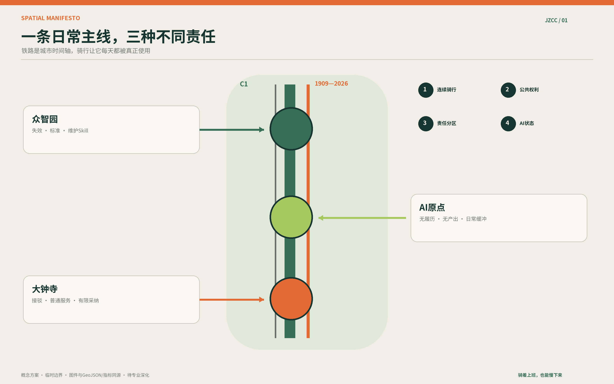

## 设计依据与资料清单

方案以公开征集公告、Agent任务书和仓库场地包为任务依据 [source:OFFICIAL-ANNOUNCEMENT] [source:AGENT-TASKBOOK] [source:SITE-PACKAGE]。总体设计范围和三处重点区尚无正式精确polygon，提交包采用仓库登记的临时边界。它被明确标注为 `official_boundary=false`、`geometry_role=provisional_constraint`，只能用于概念落图、图件表达和临时指标复算 [data:geometry/site_boundary.geojson#SITE-001] [source:BOUNDARY-SOURCE]。

已公开的三层面积为：统筹研究范围43.6平方公里，总体设计范围11.4平方公里，重点区域共368.4公顷。临时总体边界按EPSG:4548复算为11,412,825.386平方米。两者的差异来自粗略边界，不应解释为法定面积调整 [metric:site_area_sqm]。当官方polygon发布后，应替换边界并重新生成所有用地、绿地、公共空间和指标。

法定容积率、建筑高度、建筑密度、道路红线、退线、权属、市政容量和文保控制尚未随场地包公开。本方案不编造这些数值，相关字段保留unknown。绿地率与公共空间率不同，它们是本方案几何模型的临时结果，因此写为known、低或中置信度，并保留公式和复算触发条件 [metric:green_ratio] [metric:public_space_ratio]。

## 三层范围工作框架

统筹研究范围讨论产业协同和未来城市方式；总体设计范围组织骑行、公共空间、产业服务和更新项目；三处重点区承担不同的测试与运营责任。三层不是三套口号，而是一条从区域资源到日常行程、再到十二周试点的证据链 [depth:three_level_scope_framework]。

| 层级 | 主要问题 | 本方案的回答 |
| --- | --- | --- |
| 43.6平方公里统筹研究 | 高校、企业、社区与外部创新节点如何协同 | 建立“问题进入、原型验证、城市采用、知识开放”的协同回路 |
| 11.4平方公里总体设计 | 公园、轨道、园区和社区如何成为日常网络 | C1-C4骑行系统加步行、跑步、越野枝线，叠加全龄服务与AI状态分区 |
| 368.4公顷重点区域 | 三处重点区如何避免功能雷同 | 众智园做标准与失效，AI原点做日常缓冲，大钟寺做到达与有限采用 |

总体结构可记作“1-2-3-4”：一条不断线的C1骑行轴；无产出权与普通完成权两项公共权利；三个责任不同的重点区；关闭、后台、主动请求、受控测试四种AI状态。

<!-- FORMAL-REPAIR:taskbook:START -->
## 官方任务书对位：一套品牌、三大定位、五项功能、三片两翼

“百年京张AI创新带”是不可替代的官方总品牌；“京张骑行公地”是面向日常使用者的公共空间子品牌；“C1百年轮迹”是可落到路面、车架、纸图和活动中的线路名称。三者不是另起炉灶，而是总品牌、公共体验和空间导视的三级关系。标志方向采用“一条连续深绿线＋一组可修复的橙色断点”：深绿线代表每天可用的骑行主干，橙色断点代表被发现、测试、修好并公开关闭的问题。完整标志不使用企业Logo；小尺寸只保留两条线与“C1”，中英文长名称用于入口和正式材料。

| 官方定位 | 本方案的空间与制度回答 | 可检查成果 |
| --- | --- | --- |
| 百年京张文化带 | C3按骑行速度串联詹天佑、自主建造、百年维护与共同纠错 | 百年轮迹、史料桌、维护者里程墙；史实另行核验 |
| 都市AI生活体验带 | AI保持关闭、后台、主动请求、受控测试四种状态；无产出权与普通完成权兜底 | 十二张场景卡、五类一日行程、全龄公共服务 |
| AI融合创新带 | 真实问题进入、人工基线、众智园测试、大钟寺有限采用、失败知识开放 | T01—T03产业测试、公共AI准入单、退役记录 |

五项功能被拆成可以实施的责任，而不是五句口号：①“AI全栈自主创新体系”由众智园的测试沙箱、维护Skill、数据最小化和可审计算力额度承担；②“世界级AI创新生态”由八要素机制、开放Forge和国际落地路径承担；③“AI+场景赋能新范式”由小月河场景赋能翼和十二张带普通基线的场景卡承担；④“智能化AI活力城市”由C1—C4慢行网络、三站多点和全龄日常服务承担；⑤“AI治理全球话语权”由准入、人工接管、退出、双语公开账本和可复用治理Skill承担。

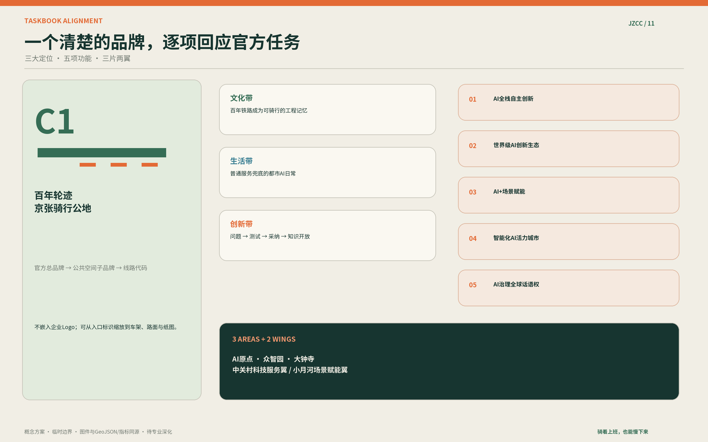
<!-- FORMAL-REPAIR:taskbook:END -->

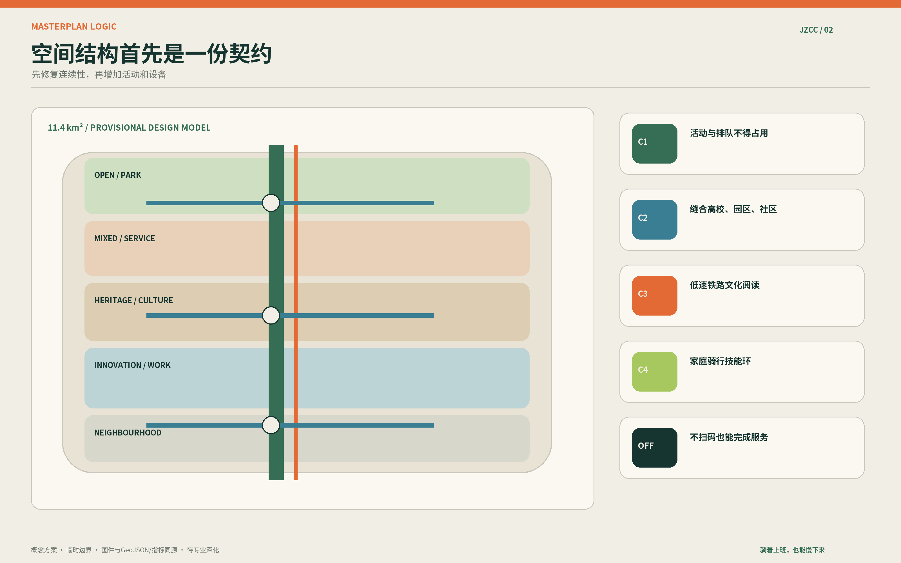

## 统筹研究范围产业与未来城市研究

京张的产业优势不必靠更大的展厅证明。高校、实验室、开源社区、企业、资本和公共场景已经近距离共存，短板是它们之间缺少清楚的城市采用路径。方案提出四步回路：居民、通勤者和运营者提出真实问题；AI原点把问题整理成可公开的问题卡；众智园完成基线对照、安全测试和维护验证；大钟寺只采用通过测试且有责任主体的服务。失败案例也进入知识库，避免其他片区重复付费。

全球案例只比较机制，不复制建筑或景观形态，也不作为本场地事实。检索采用各项目或运营机构的一手公开页面，图像、图纸、Logo和宣传文案均未复制：

| 案例与一手来源 | 可转译机制 | 京张采用什么／明确不复制什么 |
| --- | --- | --- |
| 巴黎 Station F [source:CASE-STATION-F] | 一个平台容纳多种独立项目，公共资源与专业计划并存 | 借鉴“共享底座＋多计划”；不复制封闭园区和品牌密度 |
| 多伦多 MaRS [source:CASE-MARS] | 研究、创业、资本、客户、人才和采用路径被同一机构连接 | 借鉴从科学到采用的服务链；不照搬治理与地产模式 |
| 剑桥 Kendall Square [source:CASE-KENDALL] | 协会连接高校、企业与街道生活，以持续活动补足创新区公共性 | 借鉴街道层交流和免费日常活动；不复制高租金集聚模式 |
| 纽约 High Line [source:CASE-HIGH-LINE] | 城市所有、非营利伙伴运营维护和公共项目的长期分工 | 借鉴责任与预算公开；不把高强度旅游化当成功指标 |
| 香港海滨公共空间 [source:CASE-HK-HARBOUR] | 分段连通、腹地可达、开放时间和管理模型共同决定公共性 | 借鉴“先连通、再成景”；不复制滨水形式语言 |
| 丹麦首都圈 Cycle Superhighways [source:CASE-CYCLE-SUPERHIGHWAYS] | 跨行政边界按通勤者需求形成连续网络和服务标准 | 借鉴连续性审计与协同办公室；不直接套用速度和断面数值 |

八项要素围绕一次“城市采用”闭环配置。土地以存量复用、短约测试单元和退出恢复条款为主；空间由三站、分散Forge和普通服务底座提供；产业以问题卡、测试单和维护工单组织；资本采用企业承担试验成本、依法购买必要服务、公益支持不换排他权的组合；人才采用高校导师、居民复核者、付费驻场工程师和双语国际伙伴；算力使用可计量的企业或高校沙箱额度，公开成本与能耗，不假定新建算力中心；数据优先合成数据、现场人工基线和最小字段，敏感数据不进入开放Skill；场景必须由真实服务责任人共同定义，并保留人工完成、停止和恢复。

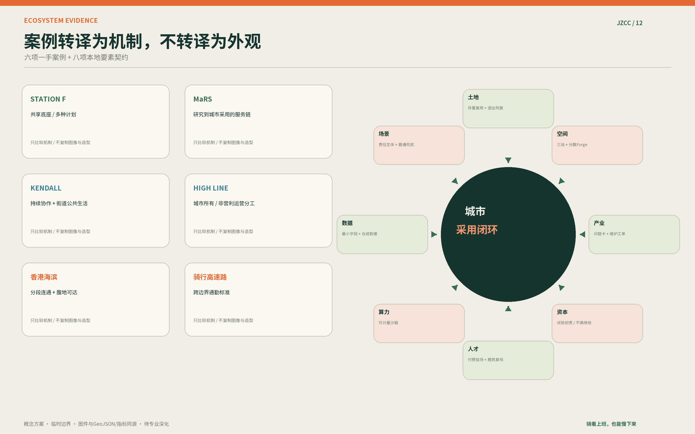

区域协同不只列地名，也写清交换物和往返责任。中关村AI北纬社区作为北部协同节点，可承接经C1与三处重点区验证后的问题卡、维护Skill和公共AI准入单，用于先进孵化与应用融合；再把运营约束、产业反馈和可规模化条件送回京张。未来科学城、怀柔科学城、经开区和京津冀伙伴则分别对应研究测试、科学验证、工程制造与跨区域复用核验。任务书明确要求核对这些协同对象，北纬社区的公开定位也强调先进孵化和应用融合 [standard:PROJECT-AGENT-OPEN-CALL-TASKBOOK] [source:HD-AI-BEIWEI]。这里描述的是待协商的接口，不代表任何机构已经同意合作；只有责任主体、交换内容、数据边界和退出方式形成书面记录后，具体交换才能启动。

## 总体设计范围城市更新与控规深度城市设计

方案不主张大拆大建。优先顺序是修复连续性、开放首层、复用既有空间、再讨论必要的新建。临时用地分区形成完整无缝的设计模型，便于计算与替换，不等同于法定用地调整 [data:geometry/land_use.geojson#LU-001]。建筑图层只表达概念性服务基底和更新原型，拆改留必须等待现状测绘、权属、结构与控规条件核实 [data:geometry/buildings.geojson#BLDG-001] [depth:retain_renovate_demolish]。

骑行决定空间顺序。C1是工作日通勤主干，任何活动、排队、外摆、共享单车堆放和设备不得占用。C2连接东西两侧高校、园区、社区和商业街。C3是低速铁路文化线。C4是家庭骑行技能环。跑步、步行、无障碍与林间轻越野从C1分出，在交叉口通过清楚的速度与让行规则回接 [data:geometry/roads.geojson#C1]。

公共服务按照骑行处境布置：轨道换乘端设置分类车架、普通地图和人工问询；园区到达端设置短停、打气简修、储物和更衣；长距离段优先补树荫、饮水、厕所、座椅、AED和人工求助；家庭段容纳儿童车、载物车和特殊尺寸车位。淋浴、喷雾、防虫、智慧售卖和健康检测设备只有在水质、排水、消防、隐私与维护责任核实后才进入试点。

## 重点区域详细设计

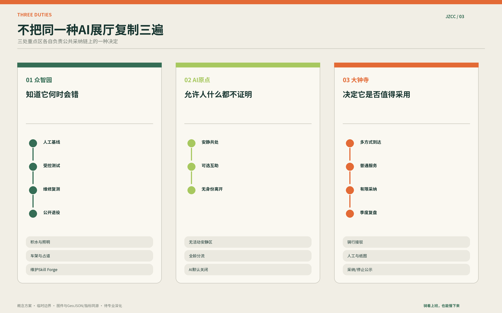

### 众智园：骑行设施失效与标准工场

众智园验证技术在什么情况下会失败。首批只碰三个普通问题：路面积水、照明视线、车架与占道。每项试验先做人工基线，再限定时间、空间和数据，技术方承担值守、撤除、恢复和必要评估。现场设置可参观的Skill Forge，但展示对象是工单、修复、误报和退役，不是滚动广告 [data:geometry/key_areas.geojson#PROV-KEY-001]。

### AI原点：无履历日常缓冲院

这里允许人暂时不以单位、学历、职位或创业项目定义自己。安静共处区不安排活动；互助桌提供修车、路线、照护与数字服务帮助；可选Forge小屋用于公开讨论公共问题。普通使用者可以什么都不留下。儿童活动、家庭休息、老年健身、林下散步和轻越野分开组织，避免所有人挤在同一条漂亮路径上 [data:geometry/key_areas.geojson#PROV-KEY-002]。

### 大钟寺：骑行到达与城市采用站

大钟寺先解决地铁、公交、步行、自行车、共享单车、出租车和私家车落客的接驳冲突。通过众智园测试的公共服务可在这里有限采用，但必须公布用途、责任、数据边界、普通替代和停止状态。沿街商业可提供修车、储物、简餐与休息，不以消费作为使用厕所、饮水和基本座位的前提 [data:geometry/key_areas.geojson#PROV-KEY-003]。

<!-- FORMAL-REPAIR:wings:START -->
### 三片两翼不是五个同质园区

AI原点社区对应“世界级AI创新生态”，但本方案为它补上一项稀缺能力：高密度知识人群可以不展示履历、不被记录地恢复，也可以自愿进入问题讨论。众智园AI自主创新加速区对应“AI全栈自主创新体系”和“AI治理全球话语权”，重点是测试、标准、维护、接管与退役。大钟寺AI产业集聚区对应“智能原生新业态”，先把换乘、修车、储物、简餐和普通服务做好，再为通过测试的企业提供有限城市采用窗口。

中关村科技服务翼不再多造一个展厅，而是把知识产权、合规、资本、人才、市场和国际落地服务送到三站和公开问题库。小月河场景赋能翼不是第四个重点区，而是一条让公众每天经过的场景验证路线：①轨道到达与纸图，②C1第一公里，③树荫、饮水与厕所，④家庭练车与全龄活动，⑤铁路史料与安静恢复，⑥主动报名的开放Forge。45分钟可完成通勤体验，90分钟可完成日常休闲，半日才进入产业交流；不用App也能走完全程。

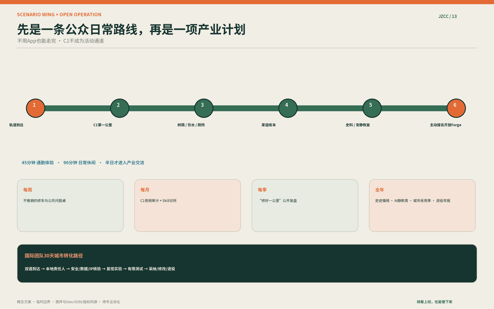
<!-- FORMAL-REPAIR:wings:END -->

## AI 创新生态、人才画像与 AI+ 场景

六类人物用于检查空间，不用于给人贴标签：软件工作者、博士生或青年教师、学区家庭、独居长者或退休教职工、维护与服务人员、短期访客与创业团队。每类人物都要完成一条包含时间、停留、冲突和普通服务的一日行程。网络材料只能形成假设，不能冒充访谈或代表性民意 [source:AGENT-TASKBOOK] [data:geometry/public_space.geojson#PUBLIC-001]。

| 场景卡 | 位置 | 普通基线 | AI的有限工作 | 人工与隐私边界 |
| --- | --- | --- | --- | --- |
| 01 骑行第一公里 | 轨道站至C1 | 人工记录等待与绕行 | 整理断点与过期路线 | 不识别人，交通人员复核 |
| 02 通行维护Skill | 全线 | 人工巡检和报修 | 归类积水、照明、车架问题 | 维修后人工复测 |
| 03 公共AI准入单 | 众智园 | 一页纸风险审查 | 检查数据与退出项 | 运营负责人可急停 |
| 04 无履历缓冲 | AI原点 | 林下座椅与纸图 | 默认关闭 | 不采集身份和停留轨迹 |
| 05 轨道接驳助手 | 大钟寺 | 实体导视与人工问询 | 主动请求的换乘建议 | 不中断普通导航 |
| 06 智慧厕所维护 | 服务节点 | 保洁巡检和人工求助 | 后台识别耗材与故障 | 不做默认生物检测 |
| 07 饮水与热风险 | 长距离段 | 饮水、树荫、休息点 | 提示设施状态和高温信息 | 不生成个人健康评分 |
| 08 骑行健康转介 | 运营站 | 正规医疗与120通道 | 主动请求的服务导航 | 不诊断，不进雇主档案 |
| 09 家庭骑行技能场 | C4 | 教练或看护规则 | 可选动作反馈 | 儿童数据默认不留存 |
| 10 铁路史料桌 | C3 | 来源清楚的纸质史料 | 主动问答与多语解释 | 显示来源和不确定性 |
| 11 Forge讨论间 | 三处林间节点 | 白板、小桌和主持人 | 整理公开问题卡与Skill | 普通交谈不录音 |
| 12 全龄服务导航 | 社区接口 | 人工窗口和电话号码 | 主动请求的服务转介 | 紧急情况转正式渠道 |

三项产业验证对应不同成熟度。T01骑行第一公里比较普通基线与AI辅助识别；T02维护Skill走完发现、确认、工单、维修、复测和公开关闭；T03公共AI准入与退役测试检查数据最小化、人工接管、普通替代和撤除。通过、修改、不适用和退役都是有效结果。

健康场景采用反绩效原则。智慧水站可以在用户主动请求、明确同意和合规条件下提供一般饮食提示，但不把尿液、生物识别或心理状态检测设为默认功能，不生成排行榜、健康分、雇主画像或保险建议。任何疑似疾病或心理危机都转向正规医疗与应急渠道。

## 用地、建筑规模与拆改留方案

提交的用地、建筑、绿地和公共空间图层属于设计模型。模型把总体边界完整分区，用于证明结构一致和指标可复算 [data:geometry/land_use.geojson#LU-001]。它不声称现状权属、法定用地性质或拆迁结论。建筑策略分四步核验：测绘现状；确认结构、权属和运营条件；优先保留或轻改；必要更新再进入专业论证。固定Forge小屋、厕所、售卖机和设备箱须逐项回答谁维护、停电后如何使用、合同结束如何撤除。

在空间意图上，公园沿线的新增建筑应保持小尺度、可逆和分点布置，避免连续商业界面把公共绿道变成室内化消费通道。安静小屋以一至两桌为基本单元，家庭休息点要能容纳儿童车和照护者，学者讨论间应允许预约，也应保留不预约的空闲时段。每处设施都要与车架、厕所、饮水、无障碍路径、保洁和夜间安全一起审查，不能只看建筑造型 [depth:height_massing_character]。

建筑基底面积是临时模型值，不等于确认建设量 [metric:building_footprint_area_sqm]。正式深化前应把每一处对象放入“现状保留、修缮提升、功能置换、必要更新、暂不判断”的核验表，并附现状照片、测绘、权属、结构、消防和运营条件。缺少其中任何一项时，不进入拆除或新建结论。这样做会降低概念阶段的视觉冲击，却能避免把居民正在使用的空间误判为“低效用地”。

## 交通、轨道、市政与公共服务设施

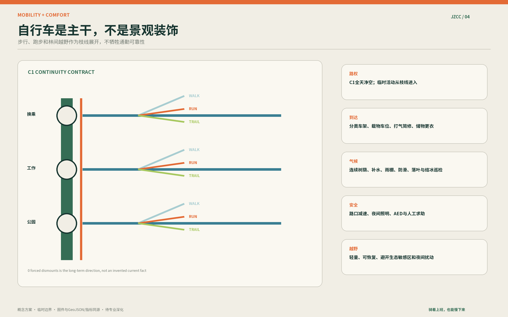

C1应建立《骑行连续性契约》，长期公开强制下车点、路口等待、绕行、积水、结冰、照明盲区、停车容量和活动占线时长。正式断面宽度、桥隧、信号和道路红线需交通与工程团队深化，本方案只给出路权顺序和空间原则 [depth:traffic_rail_slow_parking]。

四季运行纳入通勤可靠性。夏季核查有效遮阴、热表面和补水；雨季检查积水、防滑与排水；秋季安排落叶清理；冬季检查背阴结冰、除雪和照明。公共服务保留纸图、现金或普通支付、人工帮助和清楚电话号码。使用者无需下载新App。

紧急安全按110、119、120、122和既有应急体系处理。明确产权的设施进入物业、公园、道路或设备养护工单；跨产权和长期未解决事项由属地协调，必要时接入12345。项目台账只公开匿名状态，不复制个人诉求内容。

## 蓝绿空间、公共空间与城市风貌

设计模型的绿地率为12.3423%，公共空间率为7.3281%，两项均由提交几何在EPSG:4548下复算。它们不是官方控规指标，而是临时空间模型的证据 [metric:green_ratio] [metric:public_space_ratio]。深化时优先提高连续树荫和可达草坪的质量，而不是追求单一漂亮比例。

铁路文化线避免常见的道岔、信号灯和车站符号拼贴。叙事聚焦一种工程责任：自主包括建造，也包括判断、维护、纠错和停止。三个地标分别对应“敢于建造”的詹天佑与自主起点、“持续使用”的百年轮迹、“共同纠错”的AI规划者与维护者里程墙。最后一个地标记录可核验贡献，不制造个人崇拜，也不使用未经授权的肖像或企业商标。

视觉识别以两条并行线为基础：深绿线代表日常骑行，橙色短划代表需要被发现和修复的断点。标志可以随路面、车架、纸图和网页缩放。四种AI状态用空心圆、低亮点、手形触发和围合测试框表达，避免在环境中增加大量屏幕。

## 更新项目清单、实施政策与分期计划

运营结构采用“一席、三站、多点”。共治联席机制只协调C1连续性、跨产权工单、公共AI准入和季度复盘，不替代审批。三站优先复用现有社区、党群、园区首层、物业或游客服务空间。微议事点分布在车架、史料桌和林间小屋，不要求所有人到一个中心开会 [data:geometry/phasing.geojson#PHASE-001] [source:BJ-12345-REGULATION]。

十二周样板只选择一个短段和一个主站。第1-2周核对属地、产权、合同和正式渠道；第3-4周做人工基线；第5-8周先修车架、纸图、座椅、遮阴和工单分流；第9-10周只测试一项主动请求或维护AI；第11周由专业人员和居民复核；第12周公开错误、费用、恢复和下一步。试点先证明组织能关闭一个失败项目，再讨论扩大。

样板启动前设置四道“有记录才前进”的确认门：一是**场地与权属门**，明确具体短段、资产管理人、允许使用方式和时间；二是**普通服务与责任门**，确认不用AI时的完成路径、工单去向、现场责任人与闭环规则；三是**资源与退出门**，分别封顶普通设施、AI试验和撤除恢复费用，并记录资金来源、采购或合作路径及恢复责任；四是**专业与安全门**，按实际试验内容完成交通、无障碍、树木、排水、结构机电、消防、公共卫生和数据保护核验。第1至3门未形成责任路由表、费用上限表和场地确认记录，样板不得进入人工基线；第4门未通过，固定设施、健康服务和真实数据处理不得进入测试。这四道门是待真实主体确认的启动协议，不是现有审批、预算或合作承诺 [depth:phasing_implementation]。

最低新增协调团队约4至5.5个全职当量，包括总协调、峰时运营、维护工单、志愿协调、AI登记与数据合规、评估沟通。另设8至12人的按需专业名册、6至9名志愿班组长和30至60名储备志愿者。这只是“一段样板加一个主站”的规划假设，正式人数需按权责和客流重算。

志愿者只承担低风险观察、导视帮助、文化讲述和公众反馈，不承担交通执法、医疗判断、电气维修、结构检查、独立儿童照护或敏感数据处理。专业岗位、养护和长期值守应付费。企业试验方承担设备、值守、撤除、恢复和必要评估成本，不能用赞助换公共空间排他权或个人数据。

五份最小制度文件是：《共治联席议事规则》《责任与工单分流表》《志愿岗位与禁止任务目录》《公共AI试验单与登记册》《季度公开账本》。它们构成可供其他公园、园区和社区属地化复用的治理Skill。

<!-- FORMAL-REPAIR:programme:START -->
## 年度活动、开发者共同体与国际转化

活动品牌采用“百年轮迹 · 城市采用季”，目的是把一项技术从路演带到真实服务，而不是再造大型科技节。每周开放一次不推销的修车与公共问题桌；每月组织一次C1夜骑审计和一次Skill诊所；每季度举行“修好一公里”公开复盘，展示修复前后、人工成本、误报和未解决问题。四个年度节点分别是春季铁路史慢骑开线、夏季“AI静默周”（主动关掉部分系统检查普通服务是否成立）、秋季城市采用季和冬季维护与退役年报。所有活动提交占线表，C1不得被舞台、排队和市集占用。

开发者共同体围绕开放问题而不是企业名单组织。每个公共Skill至少包含问题卡、普通基线、最小数据、复现实验、人工复核、维护负责人、许可证和退役记录；居民、保洁、维修、无障碍使用者和基层工作人员可作为有报酬或有明确保障的评审者。公开仓库只收非敏感数据和可复现方法，现场白板默认不上传。

国际团队采用30天转化路径：第1—3天完成双语到达说明与本地责任人配对；第4—10天做场景、安全、数据和知识产权核验；第11—20天只用合成数据或人工基线复现实验；第21—27天在众智园进行有限测试；第28—30天形成中英双语的采用、修改、不适用或退役备忘录。进入大钟寺展示的前提不是“国际知名”，而是已有本地服务责任人、维护预算和退出办法。

对应年度最低公开成果为：一份C1连续性账本、一份公共AI登记与退役表、一套可复用维护Skill、一次第三方无障碍与数据复核、以及一份含费用和基层新增工时的双语年报。它们同时回应开发者社区、开放运营、国际吸引和城市转化，不把客流与媒体曝光当成主要绩效。
<!-- FORMAL-REPAIR:programme:END -->

## 指标体系、面积复算与合规矩阵

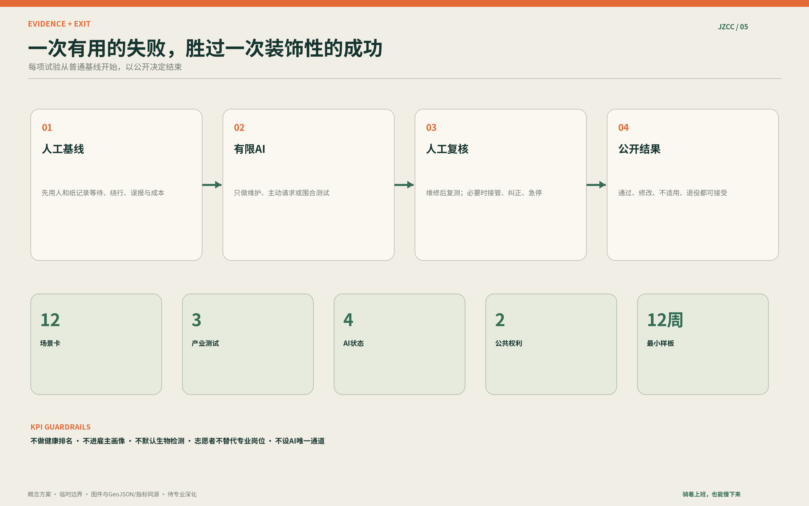

| 指标 | 当前值 | 状态与含义 |
| --- | ---: | --- |
| 总体边界复算面积 | 11,412,825.386平方米 | 临时边界的低置信度设计模型值 |
| 绿地率 | 12.3423% | green_space面积除以site_boundary面积 |
| 公共空间率 | 7.3281% | public_space面积除以site_boundary面积 |
| 重点区 | 3处 | 三处均为临时polygon |
| 场景卡 | 12张 | 每张含普通基线、AI工作和人工边界 |
| 产业测试 | 3项 | T01、T02、T03均有失败与退出条件 |

实施绩效不预设漂亮百分比。先记录四周基线，再共同设定目标。建议持续追踪C1占线时长、强制下车点、维修人工复测率、无AI完成率、AI人工接管成功率、专业岗位付费覆盖、每项问题闭环成本和基层新增填表时间。完整任务映射见 `compliance_matrix.json`，标准和深度证据见 `standard_matrix.json` 与 `design_depth_matrix.json` [depth:metrics_recalculation] [metric:site_area_sqm]。

## 风险、版权与合规说明

当前最大不确定性不是概念，而是精确边界、现状测绘、权属、道路红线、控规、市政、消防、文保和真实使用基线。任何涉及桥隧、建筑规模、固定设施、医疗服务、数据处理和采购的内容都需要专业团队及相关主体另行核验 [depth:risk_missing_data] [data:geometry/constraints.geojson#CONSTRAINTS]。

网页不加载远程脚本、地图瓦片、iframe、表单或追踪代码；中文字体采用OFL许可的Noto Sans SC页面字符子集。`visual/index*.html`从本地样式表加载字体，两份必交`report/proposal*.html`则分别直接内嵌同一裁剪字库，避免评审预览器单独抓取HTML时丢失中文。图件由提交者基于仓库临时几何和原创图形生成，案例仅作有出处的机制比较，未复制案例图像、图纸、Logo或宣传文字。三张AI概念场景的工具、日期、用途与权利边界已逐项登记。完整资产、字体、来源、生成方式、哈希和复用边界见 `visual/assets/asset-register.json` 与 `report/copyright_statement.md`。作者目录与 `agent_id` 均使用已核验的GitHub登录名 `bj-collab`。

## 从总图走到断面：骑行连续性如何真正成立

本案把“骑行优先”从态度变成可检查的空间契约。C1不是一条涂了颜色的园路，而是一段工作日早晚高峰仍能稳定使用的交通设施。它至少要回答五件事：从地铁和社区如何进入，在哪里被迫下车，路口需要等多久，雨雪和活动期间是否仍然连续，抵达办公地后车停在哪里。正式宽度必须以测绘、流量和道路条件为准，图中的断面数值只是下一阶段的讨论起点，不是施工图。

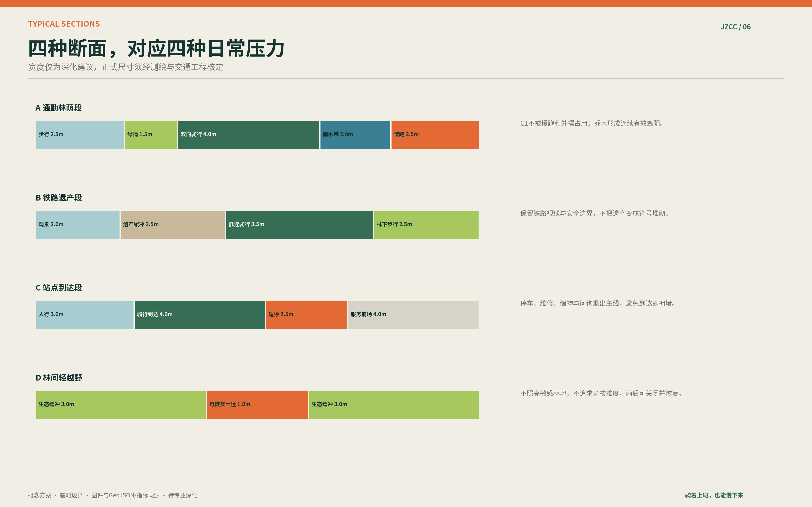

通勤林荫段建议把双向骑行置于冲突最少的一侧，用绿隔和雨水带把跑步、散步与骑行分开。铁路遗产段不追求快速通过，降低骑行速度，并留出能停下来阅读史料的侧向空间。站点到达段把短停、修理、储物、快递和共享单车归位，保证主线不在最后五十米失效。林间轻越野只承担轻度探索和自然体验，采用可恢复土径，暴雨后可关闭，不进入生态敏感林地，也不把夜间照明带进动物栖息空间。

每一处交叉口都先确定谁让谁。C1在连续通勤段保持路权清楚；进入家庭活动和站点前场时主动降速；步行无障碍路径不以跨越高差、穿过停车或绕远作为代价。活动策划必须提交“占线时间表”，任何市集、展览、路演和排队不得占用C1。共享单车企业、物业和公园运营方共同维护停车边界，但其职责仍需通过协议确认。

## 五种海淀日常：把本地化写进时间表

海淀不是一种人。它同时属于赶时间的研发人员、在校园和家庭之间往返的青年教师、课后缺少自由活动空间的孩子、愿意帮助别人但不想总被组织起来的退休教职工，也属于清晨已经开始工作的保洁和维修人员。设计不把网络吐槽当成民意调查，而是把常见压力转译成需要现场验证的空间假设。

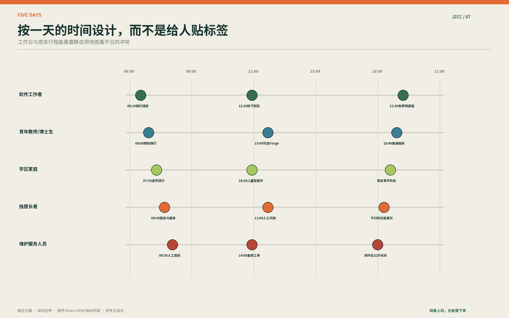

软件工作者的难题不是缺少更多屏幕，而是上班路被切断、午间没有不消费的去处、夜间返程照明不稳定。青年教师和博士生需要跨校骑行、短时讨论和可独处的空间，不应先出示项目或履历。学区家庭需要的是放学后可自由练习、照护者能坐下、儿童车不妨碍通勤的位置。独居长者需要人工问询、清楚的电话号码、可辨认的回家路线和不扫码也能使用的服务。维护人员需要合理工单、工具、休息与专业尊重，而不是被算法要求在更短时间里完成更多任务。

工作日早晚以通勤可靠性为最高优先级；中午释放林下短时恢复、简餐和二十分钟散步；傍晚增加家庭、跑步和邻里活动；周末开放史料共读、修车教学、儿童练习与小规模Forge。若同一场地在不同时间冲突，优先使用预约时段、移动家具和枝线分流，不通过扩音、围栏和大屏争夺注意力。

## 十二张场景卡：AI在何时出现，何时退后

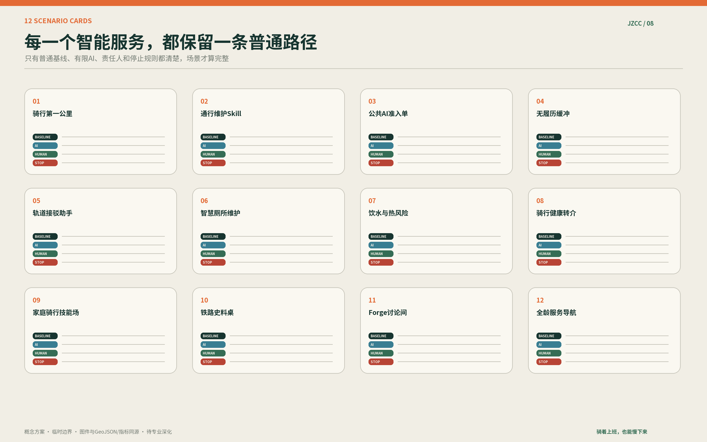

场景不是设备采购清单。每张卡都必须包含普通基线、有限的AI工作、明确责任人、数据最小化、失败判据和停止后的恢复方式。比如智慧厕所的第一目标是干净、可达、有纸、有水、有人能处理故障。AI只能在后台帮助识别耗材和设备状态，不能默认分析尿液，不能推断个人疾病，更不能把结果推送给单位、学校或保险机构。

饮水站同样先保证水质、补水和维护。个性化饮食建议只在使用者主动选择、明确同意并能看到信息来源时出现。健康转介只回答“去哪里、何时开门、怎样获得合规帮助”，不在公园里做诊断。发现胸痛、跌倒或心理危机时，场景立即退出创新展示逻辑，转入120、110和正规医疗渠道。

Forge讨论间是一间能关掉技术的小房间。普通谈话不录音，白板内容由参与者决定是否公开。公开问题卡应写清楚问题的提出者类型、普通处理方式、谁受影响、什么证据能推翻最初判断。Skill Forge展示的不是“一键生成城市”，而是需求澄清、数据边界、人工复核、维护工单、错误记录和退役步骤，让周边学生、工程师、居民与一线服务人员能共同理解一项公共AI如何被城市谨慎采用。

## 三项产业实践：从原型热闹走向城市采用

T01“骑行第一公里”在一个站点到C1的短段开展。前四周由人工记录高峰等待、绕行、违停、强制下车和过期导视；AI只帮助归类和发现重复问题。对照组保留原有人工方式。若识别结果无法由现场复核，或者增加基层填表时间而没有减少闭环成本，则判定需要修改或停止。

T02“通行维护Skill”把一次普通缺陷走完：发现、确认、派单、维修、复测、公开关闭。开放资产包括字段说明、责任路由、照片脱敏规则、误报处理和停止模板。真正的成果不是模型准确率，而是问题是否更快被正确主体接住，维修后是否有人复查，下一处是否能少付一次学习成本。

T03“公共AI准入与退役”不测试一个特定产品，而是测试一套城市制度。任何候选服务先提交一页准入单，写明用途、数据、普通替代、人工接管、责任人、合同结束、设备撤除和场地恢复。通过众智园受控测试后，最多在大钟寺有限采用；一个季度后重新判断。服务被退役时，数据删除、标识撤除、设备回收和普通服务恢复必须同时完成。

三项测试形成一条可以对产业真正有用的链条：高校和创业团队获得真实而克制的问题；企业获得可核验的试验条件；政府和运营者获得能比较、能停止的采购前证据；居民获得不因试验而失去的普通服务。这比长期摆放一批“智慧设施”更接近城市级创新。

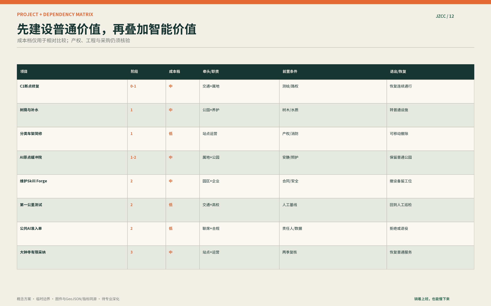

## 小型公共设施：好用、好修、不会夺走注意力

车架采用分类布置：短时倒U架靠近入口，长时带顶棚车架靠近办公与换乘，载物车、儿童拖车和特殊尺寸车辆保留更宽位置。每个主站配打气、基础工具、人工或签约维修时段；微点位只放耐用且容易补充的工具，不把复杂设备留给志愿者独自处理。车架数量、周转率和弃置车清理周期应在试点基线中实测。

智慧厕所首先是一座好厕所。入口清楚、无障碍、亲子与照护友好，设置夜间照明、人工求助和保洁状态。传感只用于设备和耗材维护，默认不感知人的身体。智慧售水机支持普通购买和清楚价格，也保留免费饮水点。任何健康建议必须是可选附加服务，且不能比取得一瓶水更费事。

遮阴采用“树冠优先、构筑补充”。对新植乔木不承诺立刻形成大树效果，先保护现有树、补齐断点，并在幼树成长期间设置可维护的轻型遮阳和雨棚。喷雾只在水质、排水、能耗和军团菌等风险经过专业评估后试点。防虫优先采用积水管理、植物配置、照明控制和维护，不以大范围化学喷洒作为常态。

讨论小屋、家庭休息房和史料桌都保持小尺度、可逆和分散。房间不是企业包厢，也不是必须预约的会议室。运营方可以开放部分可预约时段，同时保留无需登录即可使用的空闲时段。儿童滑梯、平衡练习、老年健身和安静座椅互相看得见但不挤在一起，让照护、社交和独处都有选择。

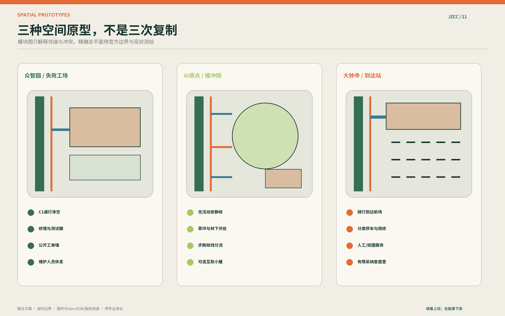

## 铁路文化叙事：从自主建造到共同纠错

百年不等于复古造型。京张铁路最值得延续的是在限制条件下形成自己的工程判断，并对安全、维护和长期使用负责。文化线从詹天佑与“敢于建造”起步，经过展示历代测绘、施工、运营和维护劳动的“百年轮迹”，最后抵达“AI规划者与维护者里程墙”。这条时间线从个人英雄扩展到共同责任，却不稀释詹天佑的历史位置。

里程墙不设置一个永久的“AI英雄”雕像，而是记录经核验的公共贡献：谁提出问题、谁完成现场复核、谁修复设施、谁发现算法不适用、谁决定停止。贡献可以来自工程师，也可以来自保洁员、社区工作者、学生和居民。被证明无效而及时退役的项目，同样留下简短记录。自主因此不再只是拥有技术，也包括有能力对技术说“不”。

文化体验以骑行速度组织。每个节点的信息量控制在一次短停能读完的范围，深度史料进入纸本和主动请求的数字内容。夜间不采用高亮屏幕和循环播音。涉及历史事实、图像和人物时必须核验来源与授权；概念渲染不能作为史料证据。

## 四季舒适与生态：让“常待在这里”成为可测目标

春季重点处理花粉、柳絮、风和施工恢复；夏季看有效遮阴、地表温度、饮水距离和暴雨排水；秋季处理落叶、防滑与视线；冬季关注背阴结冰、积雪清理、挡风与提前亮灯。舒适不是一张盛夏效果图，而是设施在最不利季节仍可维护。

草坪承担自由坐卧和家庭共处，森林承担降温、慢走和安静，雨水花园承担滞蓄和环境教育。高强度活动、越野和夜间使用避开敏感区。生态监测优先记录树木存活、冠幅、土壤压实、积水、照明时段和维护成本，不把“增加若干智慧传感器”当作生态改善本身。

## 运营与人员：一席、三站、多点

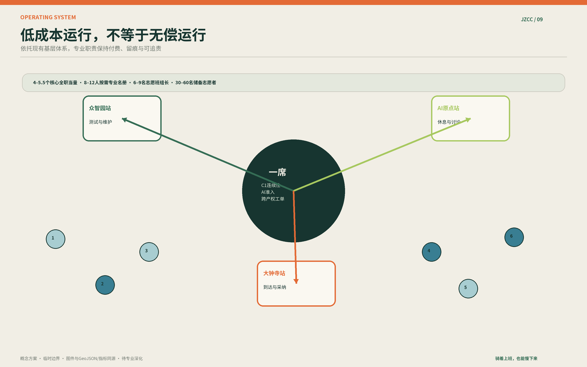

共治联席机制由属地牵头或协调，邀请公园与道路养护、社区、园区、高校、交通接驳、企业试验方和必要专业机构参加。它只处理跨界问题，不新设审批权。三站优先复用党群服务、社区服务、物业、园区首层或游客服务空间；多点是车架、史料桌、林间讨论处和可移动服务台。

样板段新增核心协调量约4至5.5个全职当量：总协调0.8至1.0，峰时骑行与站点运营1.0至1.5，维护工单0.8至1.0，公众参与与志愿协调0.6至0.8，AI登记与数据合规0.4至0.6，评估沟通0.4至0.6。岗位可以由既有单位明确分工或依法购买服务，但不能用“大家顺手做”掩盖真实工作量。

按需专业名册包括交通工程、无障碍、景观与树木、结构机电、公共卫生、数据保护、儿童安全和评估人员。志愿者承担导视帮助、低风险观察、文化讲述和活动反馈，不承担执法、医疗判断、电气维修、结构检查、独立照护儿童或敏感数据处理。企业承担自身试验的设备、值守、撤除、恢复和评估成本，不能用赞助换排他空间或个人数据。

## 十二周样板与退出机制

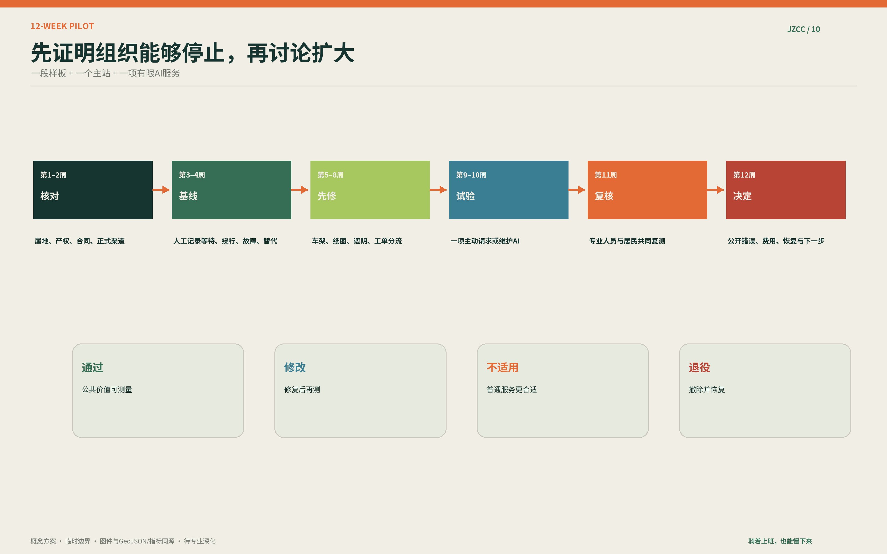

样板不追求一次做完整条创新带，而是选择一段问题清楚的C1连接和一个可复用的主站。第1至2周确认产权、合同、正式渠道与安全边界；第3至4周做纯人工基线；第5至8周先完成纸图、车架、座椅、遮阴和工单分流；第9至10周只放入一项AI服务；第11周复核；第12周公开决定。

继续的条件包括：普通通道未受损，现场问题闭环有改善，人工复核可执行，基层新增负担可接受，费用与责任清楚。停止条件包括：持续误报或漏报造成风险，技术方无法值守或修复，数据用途扩大，普通替代被削弱，设备占用公共空间，居民投诉无法及时处理。停止后应在约定期限内撤除设备、删除不再需要的数据、恢复场地，并公开简短原因。

经十二周验证后仍不自动全线复制。先比较三个选择：维持普通服务，修改后再试，在有限位置采用。只有当第二个季节和更高客流下仍成立，才讨论扩展。这样既保护公共空间，也把产业竞争从演示效果推向维护能力和长期责任。

## 概念场景渲染：只表达气质，不代替证据

以下图像为AI生成的概念场景渲染，用于表达尺度、材料、人物和AI克制程度。图中建筑、轨道、树木、设施和人员不代表现状测绘、法定方案、施工做法或实施承诺。正式设计必须以官方边界、现状调查、产权、市政、消防、文保、交通和生态评估为依据。

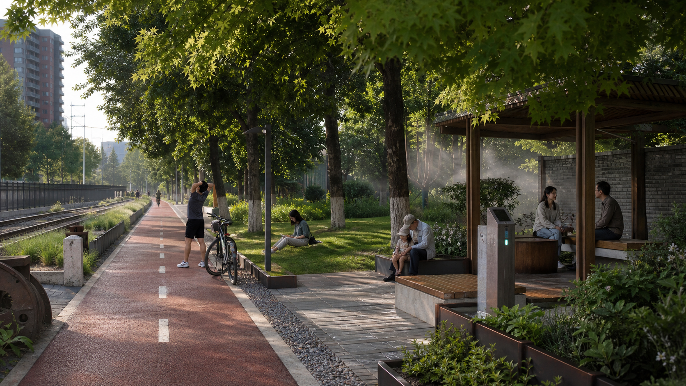

AI原点的画面重点不是设备，而是树荫、普通座椅、骑车后能停下来的身体和不同年龄之间不过度组织的共处。AI只留下一盏低亮状态灯，普通使用不需要交出身份。

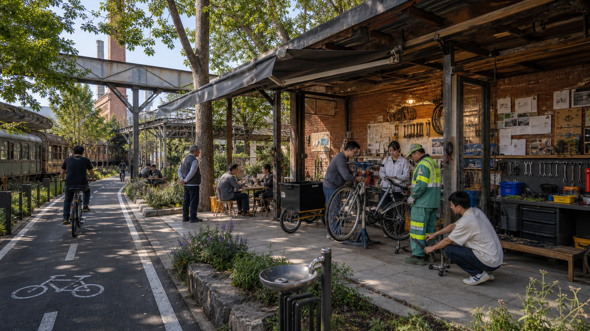

众智园把产业交流放到真实维护旁边。工程师、一线维护人员和学生围绕一辆车、一个工单和一次修复共同工作，失败记录与维修工具比品牌展示更重要。

大钟寺把到达秩序放在技术采纳之前。停车、简修、储物、饮水和人工讨论形成温暖而普通的公共前场，有限采用的AI在室内接受复盘，不占据街道注意力。

## 评分维度回应：把独特性落实为可审查成果

创新性不只来自“骑行+AI”的组合，而来自两项公共权利和三处责任分工：人可以不产出，服务可以不用AI完成，技术必须能失败、接管和退役。专业性由三层范围、完整几何、典型断面、场景卡、人物日程和指标链支撑。场地回应通过百年铁路、海淀高压生活、轨道换乘、高校与产业邻接共同形成，而不是套用通用未来城市模板。

可实施性落在十二周样板、责任路由、付费专业岗位、志愿边界、普通基线、退出条件和季度账本。产业价值落在三项可复用测试和开放Skill，而不是一次性路演。公共价值由连续骑行、全龄服务、无障碍、四季舒适、反绩效健康和不消费也可使用的设施共同保证。表达质量则采用“总图与断面负责证据，场景渲染负责气质，结构化文件负责审计”的三层体系。

这套方案真正想说的很简单：海淀不缺聪明，也不缺速度。它更需要一个地方，让知识仍然有用，让骑行仍然顺畅，让人不必一直证明自己，让技术在进入城市之前先学会负责。

## 参考资料

- 百年京张AI创新带城市设计国际方案征集资格预审公告 [source:OFFICIAL-ANNOUNCEMENT]
- 面向全球智能体的开源征集任务书 [source:AGENT-TASKBOOK]
- 仓库场地包、临时边界、标准与结构化规则 [source:SITE-PACKAGE] [source:BOUNDARY-SOURCE]
- 资料登记、事实包和缺资料清单 [source:SOURCE-REGISTRY] [source:PROCESSED-FACT-PACK]
- 完整机器可读出处与用途边界见 `sources.json`

参考资料在本案中承担三种不同工作。公告与Agent任务书确定任务、范围和提交责任；场地包与临时GeoJSON支撑概念落图和面积复算；法律政策链接只用于提出可能的基层协商、诉求分流、志愿服务和购买服务路径，不表示有关单位已参与或已有资金。案例研究则只比较机制，不提供本场地的事实依据。

本次正式评分修订已完成来源与版权闭环：`sources.json` 已去重并补齐六项一手案例、字体和制度来源；`visual/assets/asset-register.json` 逐项登记图件、网页、PDF、GeoJSON、AI场景和字体；所有外部案例只引用文字事实，不复制图像和标识；网页不依赖远程资源。仍待专业深化的是场地事实而非投稿版权——官方边界、测绘、权属、道路红线、控规、市政和文保资料发布后，必须触发几何、指标、图件与正文的整体复算 [source:SOURCE-REGISTRY] [depth:risk_missing_data]。
