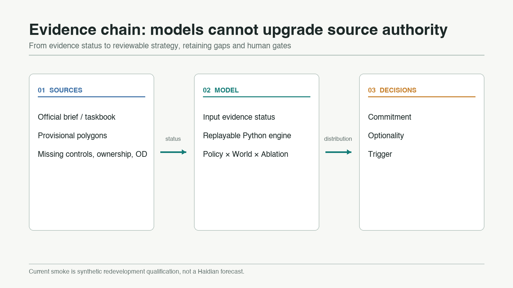
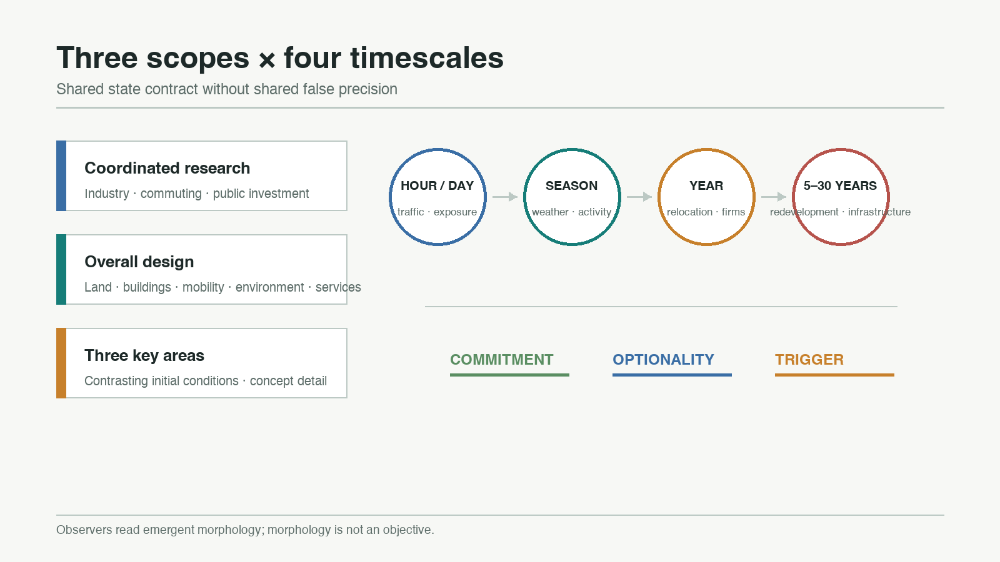
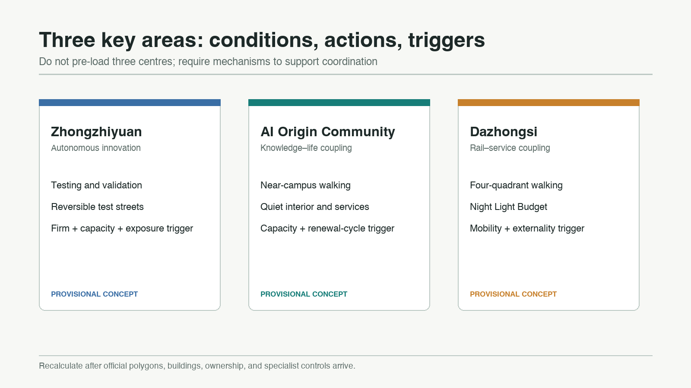
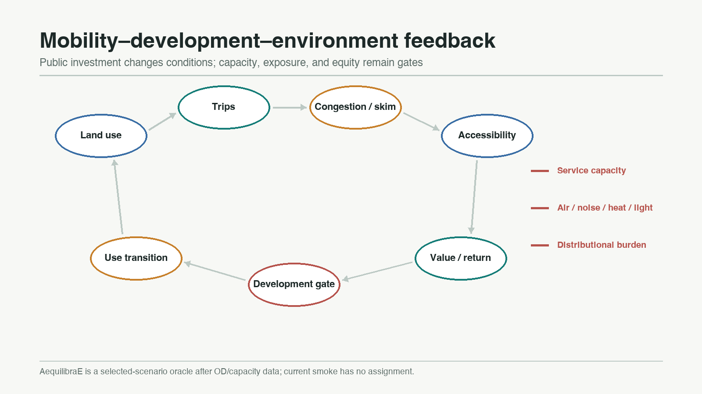
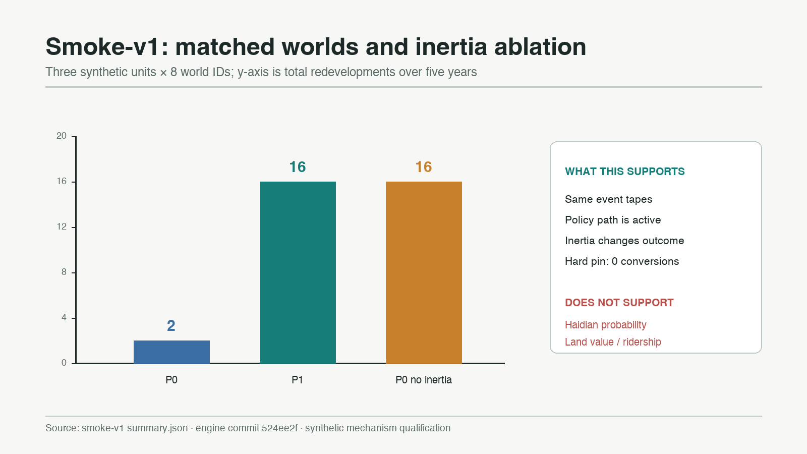

# Urban Field Dynamics

> **We do not optimise the city. We optimise the conditions under which the city evolves.**

## Design Basis and Source List

This proposal responds to the three project scopes, three key areas, and six agent tasks of the Jingzhang AI Innovation Belt. It replaces a single deterministic “2050 master image” with a rolling policy-testing system. The official announcement is the source for the task and approximate scope descriptions; the agent taskbook supplies the branding, scenarios, precedents, landmark, and operational requirements. The processed fact pack is a navigation aid, not a new authority. [source:OFFICIAL-ANNOUNCEMENT] [source:AGENT-TASKBOOK] [source:PROCESSED-FACT-PACK]

Spatial inputs are tiered by evidence status. The submitted site and key-area polygons are repository-provided provisional constraints. They support intake visualisation, topology checks, and concept discussion, but they are not official redlines or a precise basis for statutory controls, ownership, quantities, or engineering alignments. [source:BOUNDARY-SOURCE] [source:KEY-AREA-SOURCE] [source:SOURCE-REGISTRY] All dependent layers, metrics, figures, and model inputs must be recalculated when official polygons and control-plan data become available.

The model description follows ODD. Interpretation follows UrbanSim’s warning that long-horizon parcel outcomes should not be presented as accurate individual predictions, and robust decision making’s emphasis on stress-testing policies across plausible futures. [source:ODD-PROTOCOL-2020] [source:URBANSIM-DOCUMENTATION] [source:ROBUST-DECISION-MAKING] The public Python engine is pinned to commit `524ee2f1ee5c37b9e77775e327285bf8af1c1f4a`. Its implemented evidence is only a synthetic redevelopment qualification slice, not a calibrated Haidian forecast. [source:UFD-ENGINE] [source:UFD-SMOKE-V1]

## Three-Level Scope Framework

The coordinated research area studies industry networks, household and firm movement, cross-area accessibility, knowledge spillovers, and public investment. The overall design area links land, buildings, transport, environment, services, and renewal projects. The three key areas provide contrasting initial conditions for concept-level detailed design. Each level shares a state contract but uses a suitable resolution; a 43.6-square-kilometre strategic question is not reduced to false parcel precision. [standard:PROJECT-OFFICIAL-ANNOUNCEMENT] [depth:three_level_scope_framework]

The system represents the city as `W_t=(P,B,H,F,T,U,N,E,R,Θ,Ξ_t)`. Representative days handle mobility and exposure; seasons alter environment and outdoor activity; annual steps handle relocation, firm dynamics, prices, ageing, and turnover; long horizons handle redevelopment and major public investment. The competition implementation begins with four representative seasons and annual updates. Additional fidelity must pass unit tests, mechanism qualification, and local calibration.

Outputs become three decision classes. **Commitment** is reserved for actions that remain desirable across worlds and have adequate evidence. **Optionality** keeps reversible capacity where outcomes diverge. **Trigger** links an action to an observable threshold such as station opening, service capacity, asset age, or demand. These are policy discussion labels, not statutory land-use decisions. Spatial references remain [data:geometry/key_areas.geojson#PROV-KEY-001], [metric:key_area_count], and [depth:overall_spatial_structure].

## Coordinated Research Area: Industry and Future City Research

The primary brand remains **Urban Field Dynamics**, with the Chinese name 城市场演化系统. The visual motif combines a railway switch with field contours: public decisions change pathways, while transport, knowledge, environmental quality, and price generate dynamic fields. The logo direction is an open trajectory crossing three field bands. It avoids government marks, company trademarks, unauthorised typefaces, and a literal train icon. [standard:PROJECT-AGENT-OPEN-CALL-TASKBOOK] [source:AGENT-TASKBOOK]

The innovation ecosystem is not pre-programmed to form a cluster. Universities and institutes contribute knowledge and talent; rail and walking supply accessibility; compute and data infrastructure supply production factors; firm entry, exit, and development feasibility determine whether agglomeration emerges. Mechanism references include Kendall Square, Toronto MaRS, King’s Cross, Paris-Saclay, Singapore one-north, Barcelona 22@, and Tsukuba. They inform hypotheses only; transferability to Jingzhang requires local public evidence.

The three zones and two wings are treated as initial conditions and coordination hypotheses. Zhongzhiyuan focuses on sovereign innovation and testing, the AI Origin Community on knowledge–life–entrepreneurship coupling, and Dazhongsi on enterprise services, demonstration, and metropolitan footfall. If a non-prescriptive model does not reproduce cooperation, the diagnosis should be missing mechanisms or insufficient conditions—not an objective function that forces three centres. [data:geometry/land_use.geojson#LU-001] [depth:industry_function_layout]

## Overall Design Area: Urban Renewal and Regulatory-Plan-Level Urban Design

The overall structure is a “fields–gates–feedback” method rather than a fixed one-belt/three-core diagram. Heritage, waterways, established communities, rail, and campuses create pins of different strengths. Boundedly rational households, firms, developers, and travellers make local choices. Public actors alter conditions through mobility, public services, blue-green infrastructure, environmental rules, fees, and incentives. Polycentricity, functional entropy, segregation, exposure gradients, and corridor continuity are post-run observers, never encoded aesthetic targets. [standard:MOHURD-URBAN-DESIGN-MEASURES] [depth:urban_design_controls]

The development gate is `NPV_redevelop > NPV_keep + C_transition`. Transition cost includes demolition, remaining asset value, construction, finance, relocation, embodied carbon, and utility adjustment. Hard pins never convert; soft pins weaken with asset age; renewal-ready status only opens professional investigation. In synthetic smoke-v1, P0 produced two redevelopments across eight matched worlds, P1 produced sixteen, and the P0 no-inertia ablation produced sixteen. The hard pin remained unchanged. This establishes software and directional mechanism behaviour only. [source:UFD-SMOKE-V1] [source:UFD-ENGINE]

Existing geometry remains provisional concept geometry. It cannot be upgraded into observed conditions by passing through a model. Height, FAR, setbacks, road sections, ownership, and utility capacity remain unknown until official controls and surveys are supplied. [metric:floor_area_ratio] [depth:development_intensity_controls]

## Detailed Design of Key Areas

**Zhongzhiyuan AI Autonomous Innovation Accelerator** is a production-factor and test-validation potential well. The concept preserves river and blue-green buffers while allowing research, pilot production, robotics testing, compute services, and industrial services to compete. Early actions are reversible test streets, shared logistics windows, and energy/compute capacity ledgers. Expansion requires simultaneous enterprise, mobility, capacity, and exposure triggers. No building is identified for demolition without survey and ownership evidence. [data:geometry/key_areas.geojson#PROV-KEY-001] [depth:three_key_area_detailed_design]

**Beijing AI Origin Community** couples knowledge, daily life, and public service. It prioritises near-campus walking, affordable living, quiet interiors, entrepreneurship, and community services. Active uses face mobility and open-space edges; homes, schools, healthcare, and older-person services seek low-noise, low-exposure locations. The model observes whether buffering emerges; it does not force it. Triggers include repaired walking links, service capacity, building renewal cycles, and public review. [data:geometry/key_areas.geojson#PROV-KEY-002] [standard:MOHURD-CONTROL-DETAILED-PLANNING]

**Dazhongsi AI Industry Cluster** couples rail, demonstration, enterprise service, and evening activity. Concept actions include four-quadrant station-area walking, timed kerb management, a night-light budget, exhibition, and enterprise-service nodes. Mobility gains must be assessed with noise, air, and night externalities. Station works, road redlines, and parking projects remain subject to official information and specialist review. [data:geometry/key_areas.geojson#PROV-KEY-003] [data:geometry/roads.geojson#ROAD-001]

## AI Innovation Ecosystem, Personas, and AI+ Scenarios

The system uses weighted cohorts rather than personal trajectories. Five resident personas are a rail- and rent-sensitive young developer; a researcher needing universities, compute, and knowledge networks; a service worker relying on public transport and affordable housing; a family valuing schools, green space, safety, and low noise; and an older resident valuing healthcare, continuous walking, air quality, and quiet. Firm cohorts cover research, start-ups, business services, logistics, and cultural activity. All parameters are discussable synthetic assumptions and contain no identifiable person data.

Ten scenario cards define objects, inputs, uncertainty, and a human gate: (1) multi-world policy room; (2) walking-link leverage scan; (3) transit-first coordination test; (4) renewal-window radar; (5) firm factor matching; (6) public-service capacity stress test; (7) heatwave and shade operations; (8) quiet-space budget; (9) Night Light Budget; and (10) Trigger/Optionality ledger. The first three relevant industrial tests examine auditable multi-world execution, infrastructure coordination failure, and asset-inertia triggers.

Only scenario 4 has an implemented synthetic slice. Mobility will first use a fast surrogate; AequilibraE is reserved for selected scenarios after observed OD and capacity inputs exist. [source:AEQUILIBRAE-DOCUMENTATION] [source:UFD-ENGINE] Every scenario remains advisory: it must display uncertainty, affected groups, data gaps, reversible exit conditions, and a named human review point. [depth:ai_scenario_system]

## Land Use, Building Scale, and Retain-Renovate-Demolish Strategy

Land use is not a frictionless model variable. Every unit records site potential, current use, candidate use, asset age, design life, pin type, transition cost, and evidence status. Hard pins cover protected or irreplaceable assets; soft pins cover new buildings, established communities, large campuses, and railway infrastructure; free or renewal-ready status means “investigate”, not “demolish”. A time-varying `κ_i(t)` allows a poor 2026 decision to become a reasonable future option as assets age.

Current building and land-use geometries are submission structure and concept evidence. They do not establish observed gross floor area or approved intensity. [data:geometry/buildings.geojson#BLDG-001] [data:geometry/land_use.geojson#LU-001] `building_footprint_area_sqm` is recalculated from concept footprints and is not total floor area. [metric:building_footprint_area_sqm] FAR remains unknown pending official controls. [metric:floor_area_ratio]

Retain/renovate/demolish decisions follow evidence first, classification second, project third. Building outline, use, age, structure, ownership, carbon, and service condition must be added before pin classification; specialists then determine retention, repair, conversion, demolition, or new building. Simulation can flag timing and parameter sensitivity but cannot replace structural inspection, heritage approval, property negotiation, or resident process. [depth:building_renewal_strategy]

## Transport, Rail, Municipal Infrastructure, and Public Services

Mobility closes the loop `LandUse → Trips → Congestion → Accessibility → LandValue → Development → LandUse`. The planned network includes walking, cycling, road, bus, metro, and rail as sparse multimodal graphs. A fast surrogate runs in every world; selected policies and years can be checked with AequilibraE OD, skims, generalised cost, and assignment. The smoke input `accessibility_delta=0.35` is synthetic and does not represent station, road, ridership, or measured travel-time improvement. [source:AEQUILIBRAE-DOCUMENTATION] [source:UFD-SMOKE-V1]

Public investment can shift a coordination equilibrium before private demand appears, but appraisal must compare long-run welfare, cost, exposure, and distribution. Controls include public transport, road-space allocation, walking repairs, services, blue-green infrastructure, fees, and environmental rules. A small crossing or bus-priority change may have greater leverage than a large project; project size is not a benefit metric. [data:geometry/roads.geojson#ROAD-001] [depth:transport_municipal_system]

Power, drainage, fire safety, healthcare, education, and community services receive explicit capacities. The model may not silently exceed them. With no pipe, flood, fire, facility-capacity, or served-population data, the submission defines interfaces and evidence gaps only. Facility allocation considers access cost, inequality, and shortage and remains subject to professional confirmation. [standard:MOHURD-CONTROL-DETAILED-PLANNING]

## Blue-Green Network, Public Space, and Urban Character

Air, noise, light, and heat begin as relative fields. Meaningful exposure is `Field × PopulationSensitivity × TimeSpent`; no absolute PM2.5, decibel, or health prediction is reported before local emissions, weather, sensor, and activity calibration. Seasons alter diffusion, vegetation, outdoor activity, and energy demand. Heatwaves, heavy rain, pollution, and major events are stress tests, not visual themes.

Jingzhang Heritage Park, the Qinghe/Xiaoyue rivers, and continuous green areas are natural capital and candidate buffers among movement, activity, and sensitive uses. A green corridor, dark corridor, or quiet interior becomes a mechanism-supported emergent pattern only when it recurs across worlds and weakens under a relevant ablation. Current ratios derive only from provisional concept geometry. [metric:green_ratio] [metric:public_space_ratio]

Three “AI pilgrimage landmarks” are evidence interfaces rather than monumental objects: **World Switchyard** compares policies under the same seed; **Optionality Observatory** shows which decisions should remain open; and **Trigger Signal** publishes whether thresholds are met. All are concepts requiring heritage, ecology, mobility, safety, lighting, and public review. [data:geometry/public_space.geojson#PUBLIC-001] [depth:public_space_landscape_design]

## Renewal Projects, Implementation Policy, and Phasing

The 2026–2030 phase builds evidence and institutional foundations: a public source ledger, model ODD, a replacement path for provisional geometry, walking-link surveys, building-renewal baselines, and environmental/service-capacity baselines. Three reversible pilots are the World Switchyard, renewal-window radar, and one walking-leverage repair. Every physical pilot remains conditional on professional checks and competent-authority procedure.

From 2030–2035, mobility, household and firm cohorts, exposure, and service capacity enter rolling planning only after qualification. Projects proceed only when named triggers are met. From 2035–2050, policy combinations are recalculated every five years, preserving adaptability to demographic, technical, economic, and climate changes. [data:geometry/phasing.geojson#PHASE-001] Current phasing is conceptual and does not prove budget, delivery body, or programme. [depth:implementation_phasing]

Operations use four public reviews each year and a five-year rolling plan. Spring updates data and assumptions; summer tests heat and event stress; autumn publishes policy/ablation comparisons; winter examines equity, capacity, and exit decisions. The developer community maintains the open engine and regression tests; specialists maintain data interpretation; residents can inspect winners, burdened groups, uncertainty, and manual-review routes.

## Metrics, Area Recalculation, and Compliance Matrix

Metrics have four layers: software invariants such as replay and hard-pin preservation; mechanism qualification through matched-seed policy and ablation comparisons; urban objectives covering mobility, production, environment, equity, services, infrastructure, nature, and transition; and morphology observers such as polycentricity, entropy, segregation, exposure gradients, and corridor continuity. Objectives may enter Pareto and robust sweeps. Observers are post-run evidence and cannot be hidden aesthetic targets.

The package includes `site_area_sqm`, `building_footprint_area_sqm`, `green_ratio`, `public_space_ratio`, `floor_area_ratio`, and `key_area_count`. [metric:site_area_sqm] [metric:key_area_count] Areas and ratios remain limited by provisional geometry, and FAR remains unknown. Markdown, `metrics.json`, GeoJSON, figures, PDFs, and HTML must consume the same derived values. Smoke-v1’s 24 runs, eight matched world IDs, and three-arm summary are stored as synthetic visual assets, not mixed into official spatial metrics. [source:UFD-SMOKE-V1]

`compliance_matrix.json` covers announcement tasks 1.3–1.5 and agent tasks 1–6; `standard_matrix.json` connects professional standards; and `design_depth_matrix.json` records evidence depth. [standard:PROJECT-OFFICIAL-ANNOUNCEMENT] [depth:metrics_and_compliance] Claims of completion remain subject to regenerated figures, bilingual outputs, finalisation, deterministic self-checks, and professional review.

## Risk, Copyright, and Compliance

The primary risk is mistaking computational precision for factual accuracy. Provisional polygon, synthetic unit, design target, and unknown control are separate evidence statuses; no model output inherits a higher status than its inputs. A second risk is mechanism overclaim: only redevelopment is implemented, while mobility, household, firm, environment, and service modules remain development and calibration work. A third risk is automated decision making: the system compares and explains but does not approve demolition, roads, service allocation, or investment.

Privacy is protected through aggregate weighted cohorts rather than identifiable trajectories. Enterprise names, output, investment, and recruitment are not invented. No undisclosed redline, ownership, utility, or heritage data is introduced. Projects, events, operations, and landmarks are concepts requiring planning, mobility, municipal, heritage, ecological, safety, copyright, and public review. [source:SITE-PACKAGE] [source:SOURCE-REGISTRY]

Code uses the licence declared in its public repository. Data, standards, tools, images, and fonts retain their own source records. A3/A0, HTML, SVG/PNG, and interactive outputs use local assets only—no CDN, remote tile, iframe, form, or network API. The complete statement is in `report/copyright_statement.md`. [depth:existing_conditions_diagnosis]

## References

1. Beijing Municipal Commission of Planning and Natural Resources, Haidian Branch, official Jingzhang AI Innovation Belt announcement.
2. Agent-facing Jingzhang AI Innovation Belt open-call taskbook.
3. Grimm et al., “The ODD Protocol for Describing Agent-Based and Other Simulation Models”, 2020.
4. UrbanSim documentation on annual simulation, development, location choice, and multi-run interpretation.
5. World Bank Policy Research Working Paper 6906 on robust decision making under deep uncertainty.
6. AequilibraE documentation on assignment, skims, and generalised cost.
7. Urban Field Dynamics engine, commit `524ee2f1ee5c37b9e77775e327285bf8af1c1f4a`.
8. National urban design and control-plan-related standards listed in the package.

The complete machine-readable index and usage limits are in `sources.json`. Citation does not grant a source official spatial-control status. [source:UFD-ENGINE] [source:ODD-PROTOCOL-2020]
