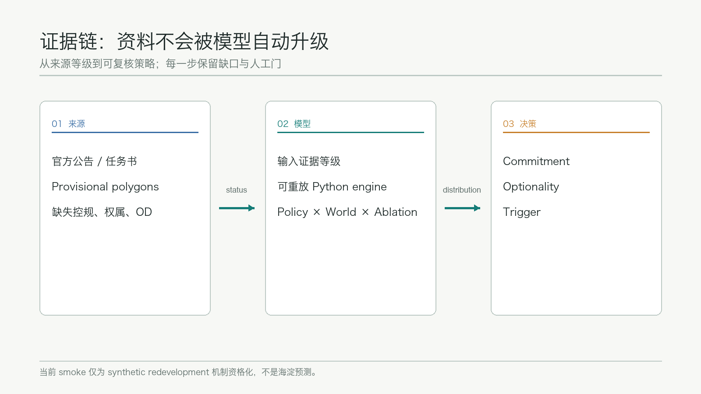
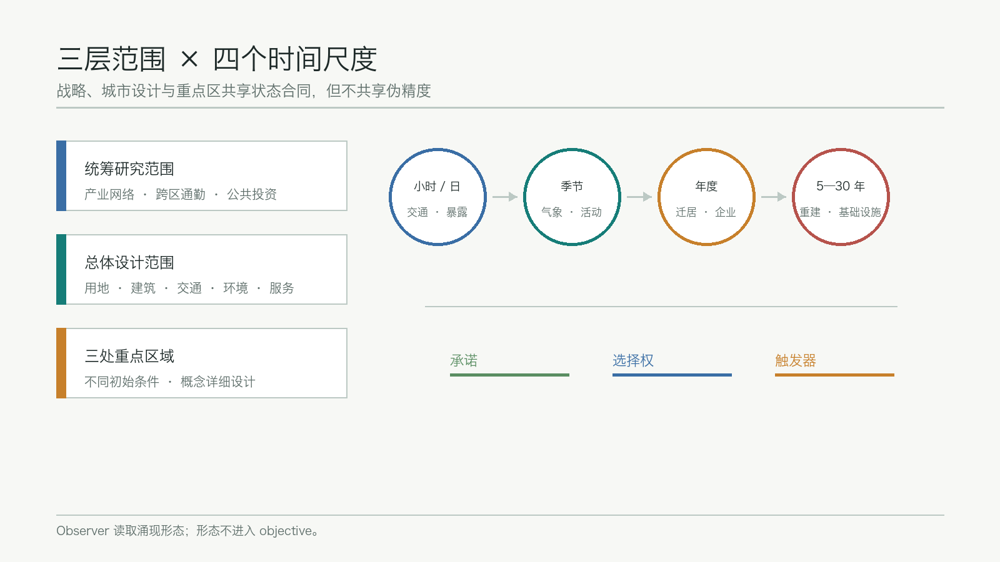
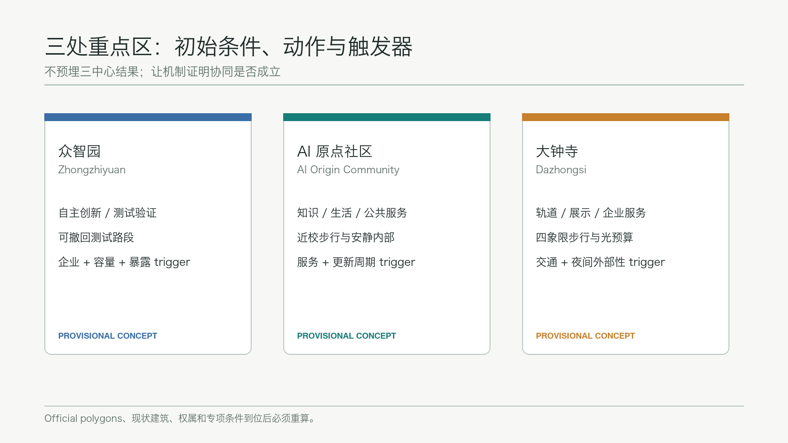
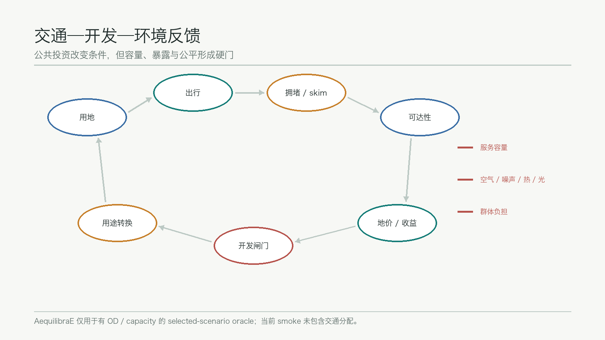
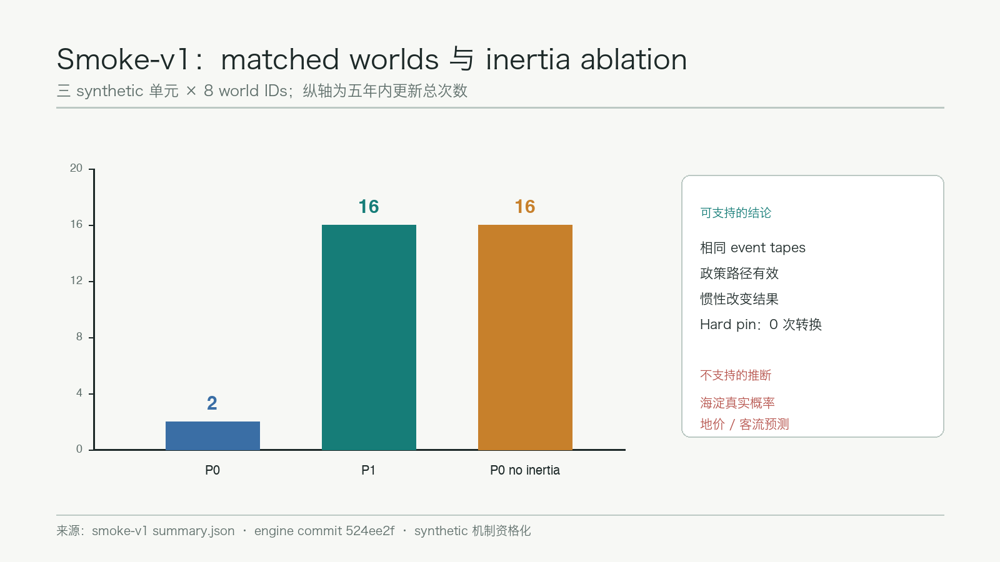

# Urban Field Dynamics｜城市场演化系统

> **We do not optimise the city. We optimise the conditions under which the city evolves.**
>
> 我们不直接优化城市，而优化城市演化的条件。

## 设计依据与资料清单

本方案回应百年京张 AI 创新带的三层范围、三处重点区域和六项智能体任务，将城市设计从一张“2050 终局图”改写为可滚动检验的公共策略。正式任务、面积约值和文字四至来自官方公告，品牌、场景、案例、地标与长期运营要求来自面向智能体任务书；处理事实包只作为阅读导航，不新增权威性。[source:OFFICIAL-ANNOUNCEMENT] [source:AGENT-TASKBOOK] [source:PROCESSED-FACT-PACK]

空间输入严格分级。`site_boundary.geojson` 和三处 `KEY_AREA` 采用仓库 provisional polygons，能够支撑 intake 可视化、概念空间讨论和拓扑自检，不能作为官方红线、精确面积、权属或法定控制依据。[source:BOUNDARY-SOURCE] [source:KEY-AREA-SOURCE] [source:SOURCE-REGISTRY] 当 official polygons、控规、现状建筑、道路红线和市政资料发布后，所有受影响图层、指标、图纸和模拟输入必须重新计算。

模型方法遵循 ODD 对 purpose、entities、scales、process scheduling、initialisation、input data 和 submodels 的显式描述要求，并借鉴 UrbanSim 对年度开发与选址、聚合解释和多次运行的边界说明。鲁棒决策部分采用“在多种可能未来中压力测试政策、暴露脆弱条件”的方法，而不是在单一预测上求伪精确最优。[source:ODD-PROTOCOL-2020] [source:URBANSIM-DOCUMENTATION] [source:ROBUST-DECISION-MAKING]

公开 Python engine 固定到 commit `524ee2f1ee5c37b9e77775e327285bf8af1c1f4a`；当前实现只完成 redevelopment / transition-inertia 资格化切片，并通过 34 项测试。随包 `smoke-v1` 含 8 个 matched worlds、P0/P1 两政策和 no-inertia ablation，全部输入均为 synthetic，不能外推真实海淀概率、地价、客流或建设规模。[source:UFD-ENGINE] [source:UFD-SMOKE-V1] 图层与面积证据仍以 [data:geometry/site_boundary.geojson#SITE-001] 和 [metric:site_area_sqm] 为准。

## 三层范围工作框架

统筹研究范围用于研究产业网络、人口与企业迁移、跨区通勤、公共投资和知识集聚的反馈；总体设计范围用于表达土地、建筑、交通、环境、公共服务与更新项目的耦合；重点区域范围用于构造三类不同初始条件并开展概念详细设计。三层工作共享同一状态合同，但采用不同空间分辨率，避免把 43.6 平方公里战略问题压成伪精确 parcel 输出。[standard:PROJECT-OFFICIAL-ANNOUNCEMENT] [depth:three_level_scope_framework]

系统把城市表示为 `W_t=(P,B,H,F,T,U,N,E,R,Θ,Ξ_t)`。小时/代表性日处理交通、能耗、噪声和设施使用；季节层处理温度、风雨、植被、户外活动和能源需求；年度层处理迁居、企业进入退出、价格、建筑老化和商业更替；5—30 年层处理重建、交通设施和大型公共投资。比赛实现先使用四个代表季节与年度离散步，后续模块只能在通过单元测试、机制资格化和本地数据校准后提高精度。

三层输出也按确定性分级：跨世界一致且证据充分的方向进入 **Commitment**；跨世界分散的方向进入 **Optionality**；只有在站点开通、人口阈值、资产寿命或容量扩充后成立的方向进入 **Trigger**。这三个标签是政策讨论接口，不是土地权属或审定用地结论。空间框架对应 [data:geometry/key_areas.geojson#PROV-KEY-001]、[metric:key_area_count] 与 [depth:overall_spatial_structure]。

## 统筹研究范围产业与未来城市研究

总体品牌保留英文主名 **Urban Field Dynamics**，中文名“城市场演化系统”，视觉母题为“铁路转辙器 × 等势线”：转辙器代表公共策略改变路径，等势线代表交通、知识、环境和价格形成的场。Logo 方向采用一条开放轨迹穿过三组场线，不直接描摹火车，也不把政府标志、企业商标或未经授权字体纳入视觉资产。该品牌服务“百年京张文化带、都市 AI 生活体验带、AI 融合创新带”三大定位，并把五大功能组织为可观测反馈回路。[standard:PROJECT-AGENT-OPEN-CALL-TASKBOOK] [source:AGENT-TASKBOOK]

创新生态不靠模型预埋“产业集群”答案。高校与研究机构提供知识和人才场，轨道与慢行提供可达性，算力与数据设施提供生产要素，企业进入退出和开发收益决定集聚是否形成。作为机制参照，方案研究 7 类公开案例：Boston Kendall Square 的校企邻近、Toronto MaRS 的转化平台、London King’s Cross 的渐进更新、Paris-Saclay 的科研网络、Singapore one-north 的产业分区与公共空间、Barcelona 22@ 的存量转型、Tsukuba Science City 的科研生活配套。案例只提供机制假设，任何适用性均需结合京张公开数据复核。

三区两翼在模型中是初始条件和协同假设：众智园偏向自主创新与测试验证，AI 原点社区偏向知识—生活—创业耦合，大钟寺偏向企业服务、展示和城市级人流；两翼连接更广域高校、科学城、经开区与京津冀创新网络。若模拟不能在不预设形态的情况下形成协同，结论应是机制或投入不足，而不是调整 objective 强迫出现三中心。产业与空间判断落到 [data:geometry/land_use.geojson#LU-001] 和 [depth:industry_function_layout]。

## 总体设计范围城市更新与控规深度城市设计

总体结构不是固定“一带三核”总图，而是“场—闸门—反馈”工作法。自然、遗产、轨道、高校和成熟社区构成不同强度的 pin；居民、企业、开发者和交通参与者按照有限理性局部选择演化；公共部门通过交通、公共设施、蓝绿基础设施、环境规则、税费和补贴改变条件。规划者优化政策 `π`，宏观形态仅在运行后由 polycentricity、functional entropy、segregation、exposure gradient 和 corridor continuity 等 observer 观察。[standard:MOHURD-URBAN-DESIGN-MEASURES] [depth:urban_design_controls]

开发闸门采用 `NPV_redevelop > NPV_keep + C_transition`。`C_transition` 包含拆除、剩余资产、建设、融资、搬迁、隐含碳和设施调整；hard pin 永不转换，soft pin 随资产年龄降低壁垒，renewal-ready 单元进入更新窗口。当前 `smoke-v1` 的 synthetic 结果为：P0 在 8 个 world 中产生 2 次更新，P1 产生 16 次，关闭 transition inertia 的 P0 产生 16 次；hard-pin 单元在所有运行中保持不变。该结果只证明代码路径和机制方向，不能作为真实项目收益或概率。[source:UFD-SMOKE-V1] [source:UFD-ENGINE]

总体设计的 land-use、building、road、green、public-space 和 phasing 图层目前仍来自 scaffold 的 provisional 概念分区，不能被模型结果“升级”为真实现状。下一阶段将把公开 OSM/context 与经清权的官方数据适配到相同 schema，再对规划建议做复算。建筑高度、容积率、密度、退线、道路断面和市政容量保持 unknown，分别由 [metric:floor_area_ratio] 与 [depth:development_intensity_controls] 显示缺口。

## 重点区域详细设计

**众智园 AI 自主创新加速区**设为“生产要素—测试验证 potential well”。概念空间保留清河及蓝绿缓冲，把研发、中试、机器人测试、算力服务和产业服务作为可竞争用途。近期动作是建立可撤回的测试路段、共享装卸和能源/算力容量台账；中期只有在企业进入、交通容量和环境暴露同时通过 trigger 时扩大测试网络。缺少现状建筑和权属数据时，不指定具体拆除对象。[data:geometry/key_areas.geojson#PROV-KEY-001] [depth:three_key_area_detailed_design]

**北京 AI 原点社区**设为“知识—生活—公共服务耦合区”。设计优先近校步行、可负担住房、安静内部空间、创业与社区服务的共址条件。高活动功能靠近交通和开放界面，住宅、学校、医疗与老人服务进入低噪声、低暴露空间；是否形成缓冲结构由多世界结果观察，而非写进目标函数。项目触发条件包括慢行断点修复、服务容量、建筑更新周期和公众反馈。[data:geometry/key_areas.geojson#PROV-KEY-002] [standard:MOHURD-CONTROL-DETAILED-PLANNING]

**大钟寺 AI 产业聚集区**设为“轨道—展示—企业服务—夜间活动耦合区”。概念动作包括站区四象限连续步行、时段化路缘、夜间光预算、展陈和企业服务节点。交通改善必须同时检查噪声、空气和夜间活动外部性；任何站体改造、道路红线或停车工程均待官方资料和专项评估，不表述为已批准工程。[data:geometry/key_areas.geojson#PROV-KEY-003] [data:geometry/roads.geojson#ROAD-001]

## AI 创新生态、人才画像与 AI+ 场景

系统使用 weighted cohorts 而非个人画像数据。至少五类 persona 为：①租金与轨道敏感的青年开发者；②重视高校、算力和知识网络的科研人员；③依赖公共交通与可负担住房的服务业员工；④重视教育、绿地、安全和噪声的育儿家庭；⑤重视医疗、步行连续性、空气和安静环境的老年居民。企业侧另设研发、初创、商业服务、物流和文化活动五类 representative firms。所有 cohort 参数都是可讨论假设，不包含个人轨迹或可识别数据。

十张场景卡如下，每张均需在后续交互页映射到对象、数据、人工复核和退出条件：

| 场景 | 服务对象 | 数据与运行 | 风险与人工门 |
| --- | --- | --- | --- |
| 1. 多世界政策沙盘 | 规划与公众 | 公开图层、参数、world seed | 显示不确定性，禁止自动审批 |
| 2. 慢行断点杠杆扫描 | 行人、骑行、无障碍用户 | 路网与可达性 surrogate | 现场勘察后实施 |
| 3. 轨道先行协调测试 | 居民、企业 | accessibility policy counterfactual | 不把 synthetic 客流当预测 |
| 4. 更新窗口雷达 | 业主、社区、规划团队 | 建筑年龄与转换成本 | 权属和现状调查为硬门 |
| 5. 企业选址与要素匹配 | 研发与服务企业 | 人才、空间、交通、算力 | 不生成企业名单或招商承诺 |
| 6. 公共服务容量压力测试 | 儿童、老人、社区 | 服务容量与可达性 | 人工核验供给和脆弱群体影响 |
| 7. 热浪与绿荫调度 | 户外人群 | 季节、热暴露、树荫 | 不替代气象和健康专业判断 |
| 8. 噪声与安静空间预算 | 居民、学校、医院 | 相对 exposure field | 现场测量前只报相对势能 |
| 9. Night Light Budget | 夜间活动与居民 | 时段、亮度、遮挡、运营 | 安全、生态和运营联合审核 |
| 10. Trigger / Optionality 台账 | 投资与公众 | world distributions、阈值 | 每次滚动规划重新确认 |

其中 1、3、4 为产业测试验证场景：分别验证多世界运行与审计、基础设施协调失灵、资产惯性与更新触发。现有 engine 只实现第 4 场景的 synthetic slice；交通 assignment 计划使用 fast surrogate，并在取得 OD 和容量数据后用 AequilibraE 对 selected scenarios 复核。[source:AEQUILIBRAE-DOCUMENTATION] [source:UFD-ENGINE] AI 场景与用户覆盖由 [depth:ai_scenario_system] 约束。

## 用地、建筑规模与拆改留方案

用地不作为模型自由改写的无摩擦变量。每个空间单元同时记录 site potential、当前用途、候选用途、资产年龄、设计寿命、pin 类型、转换成本和证据等级。Hard pin 对应法定保护、核心自然资源和不可替代设施；soft pin 对应新建建筑、成熟社区、大型园区和铁路设施；free/renewal-ready 只表示值得进入专业核查，不代表自动拆除。`κ_i(t)` 随时间变化，使 2026 年不合理的拆除可能在未来资产周期内成为可讨论更新。

当前 geometry 中的建筑基底、用地分区和面积只用于提交结构与概念图，不能推导现状总建筑面积或审定开发强度。[data:geometry/buildings.geojson#BLDG-001] [data:geometry/land_use.geojson#LU-001] `building_footprint_area_sqm` 是由概念几何复算的基底指标，[metric:building_footprint_area_sqm] 不等于总建筑规模；`floor_area_ratio` 保持 unknown，[metric:floor_area_ratio] 需要官方控规和高度条件。

拆改留采用“先证据、再类别、后项目”顺序：先补建筑轮廓、用途、年龄、结构、权属、碳和设施条件；再用 hard/soft/free pin 和安全约束分类；最后由专业团队确定保留、修缮、改造、拆除或新建。任何模拟输出只提示更新窗口和敏感参数，不能替代结构鉴定、产权协商、文保审查或居民程序。[depth:building_renewal_strategy]

## 交通、轨道、市政与公共服务设施

交通构成 `LandUse → Trips → Congestion → Accessibility → LandValue → Development → LandUse` 反馈。比赛版计划使用 walking、cycling、road、bus、metro/rail 的稀疏 multimodal graph；每个 world 运行 fast surrogate，选定政策和年份再用 AequilibraE 做 OD、skim、generalized cost 与 assignment 对照。当前 smoke 的 `accessibility_delta=0.35` 是 synthetic mechanism input，不代表地铁站、道路或实际通达改善值。[source:AEQUILIBRAE-DOCUMENTATION] [source:UFD-SMOKE-V1]

公共投资能够在潜力区域尚无即时需求时改变协调均衡，但项目评价必须比较长期社会福利、建设与运营成本、环境外部性和最差群体负担。规划控制变量包括轨道/公交、道路空间再分配、慢行修补、公共设施、蓝绿基础设施、税费和环境规则。小型 crossing、公交优先或绿化缓冲与大型基础设施使用同一 leverage 口径，避免“项目越大越重要”。交通和公共空间证据落到 [data:geometry/roads.geojson#ROAD-001] 与 [depth:transport_municipal_system]。

市政和公共服务采用容量约束，不允许模型结果静默超过电力、排水、消防、医疗、教育和社区服务承载。缺少管线、消防、防洪、设施容量和服务人口数据时，本方案只提出模块接口与待核清单。公共设施不会简单追逐最繁华位置，而以 access cost、inequality 和 capacity shortage 共同评价。[standard:MOHURD-CONTROL-DETAILED-PLANNING]

## 蓝绿空间、公共空间与城市风貌

空气、噪声、光和热环境首先作为相对场，最终评价的是 `Field × PopulationSensitivity × TimeSpent`。没有本地排放、风场和监测校准时，不报告绝对 PM2.5、分贝或热风险预测。季节改变扩散 kernel、户外活动和能源需求；极端热浪、降雨、污染和大型活动作为压力测试，而不是视觉换肤。

京张遗址公园、清河/小月河和连续绿地在概念上既是自然资本，也是交通、活动和敏感功能之间的缓冲候选。绿廊、dark corridor 或安静内部空间只有在多个 world 中重复出现且对应 ablation 消失时，才可称为机制支持的 emergent pattern。当前 `green_ratio` 与 `public_space_ratio` 只来自 provisional concept geometry。[metric:green_ratio] [metric:public_space_ratio]

三处“AI 朝圣地标”采用证据界面而非巨型造型：①**World Switchyard / 世界转辙台**，比较同 seed 不同政策；②**Optionality Observatory / 选择权观测站**，展示哪些决定应暂缓；③**Trigger Signal / 触发信号塔**，公开项目达到或未达到的阈值。三者均为概念节点，需经文保、绿地、交通、安全、照明和公众程序深化，不构成建设承诺。公共空间与城市风貌由 [data:geometry/public_space.geojson#PUBLIC-001] 和 [depth:public_space_landscape_design] 共同约束。

## 更新项目清单、实施政策与分期计划

近期（2026—2030）优先建设数据和制度底座：公开资料账本、模型 ODD、provisional geometry 替换接口、慢行断点调查、建筑更新底数、环境与服务容量基线；开展三个可撤回的小型测试——世界转辙台、更新窗口雷达和一处慢行杠杆修补。任何现场试点均需专业核查和主管程序。

中期（2030—2035）在数据与机制通过后，把交通 surrogate、居民/企业 cohort、环境 exposure 和服务容量接入滚动规划；只执行通过 trigger 的项目。长期（2035—2050）每五年重算政策组合，保留对需求、技术、人口和气候变化的适应能力。分期图层 [data:geometry/phasing.geojson#PHASE-001] 当前仅表达概念时序，[depth:implementation_phasing] 不证明资金、主体或工期已落实。

长期运营形成“一年四次公开复盘 + 五年滚动规划”：春季更新数据与假设，夏季做热浪和活动压力测试，秋季发布政策/ablation 对比，冬季审查公平、容量和退出事项。开发者社区维护公开 engine、版本和回归测试；专业团队维护数据与规划解释；公众能够查看赢家/受损群体、提出异议和要求人工复核。全球活动、品牌传播和企业招引均是概念运营建议，不代表政府承诺。

## 指标体系、面积复算与合规矩阵

指标分为四层：软件 invariant（可重放、无 NaN、hard pin 不变）、机制 qualification（matched-seed policy 与 ablation）、城市结果 objective（mobility、production、environment、equity、service、infrastructure、nature、transition）和 morphology observer（多中心、混合度、隔离、暴露梯度、廊道连续性）。Objective 可以进入 Pareto 和 robust sweep；observer 只能事后观察，禁止把期望形态偷写进目标。

提交包已有 `site_area_sqm`、`building_footprint_area_sqm`、`green_ratio`、`public_space_ratio`、`floor_area_ratio` 和 `key_area_count`。[metric:site_area_sqm] [metric:key_area_count] 其中面积和比例受 provisional geometry 限制，FAR 为 unknown；正文、`metrics.json`、GeoJSON、图件和 HTML 必须共享同一派生结果。`smoke-v1` 的 24 次 run、8 个 matched world IDs 和三 arm 摘要属于 synthetic evidence，单列于 visual assets，不混入官方空间指标。[source:UFD-SMOKE-V1]

`compliance_matrix.json` 覆盖公告 1.3、1.4、1.5 和 agent.1—agent.6；`standard_matrix.json` 连接专业标准；`design_depth_matrix.json` 记录成果深度。[standard:PROJECT-OFFICIAL-ANNOUNCEMENT] [depth:metrics_and_compliance] 在真实图纸和专业内容完成前，scaffold 的 `complete` 状态仍需人工复核，最终只由 finalize、自检与专业审核共同确认。

## 风险、版权与合规说明

首要风险是把计算精确度误写成事实精度。Provisional polygon、synthetic unit、design target 和 unknown control 在正文与图例中必须分开；模型输出不得继承高于输入的证据等级。第二类风险是 mechanism overclaim：当前只实现 redevelopment slice，其余交通、居民、企业、环境和服务模块仍需开发、资格化和校准。第三类风险是自动决策：系统只支持比较和解释，不自动批准拆除、道路、公共服务分配或招商政策。

隐私上只使用 aggregated/weighted cohorts，不收集可识别个人轨迹；企业名单、产值、投资额和招商结果不得编造。空间上不引入非公开红线、权属、管线或文保控制数据。工程、运营、活动和地标均写为概念建议，需规划、交通、市政、文保、生态、安全、版权与公众参与审查。[source:SITE-PACKAGE] [source:SOURCE-REGISTRY]

模型代码按公开仓库声明许可证发布；任务书、标准、数据、字体、图像和工具分别登记来源。A3/A0、HTML、SVG/PNG 和交互页只使用本地资产，不依赖 CDN、远程瓦片、iframe、表单或联网 API。完整声明见 `report/copyright_statement.md`。边界与待补数据风险由 [depth:existing_conditions_diagnosis] 和 assumptions 共同记录。

## 参考资料

1. 北京市规划和自然资源委员会海淀分局，《百年京张 AI 创新带城市设计国际方案征集资格预审公告》。
2. 面向全球智能体开展百年京张 AI 创新带城市设计开源征集任务书。
3. Grimm et al., “The ODD Protocol for Describing Agent-Based and Other Simulation Models”, 2020。
4. UrbanSim documentation：年度城市开发、选址与多次运行解释。
5. World Bank Policy Research Working Paper 6906：Robust Decision Making under deep uncertainty。
6. AequilibraE documentation：交通分配、skim 与 generalized cost。
7. Urban Field Dynamics engine，commit `524ee2f1ee5c37b9e77775e327285bf8af1c1f4a`。
8. 住建部《城市设计管理办法》及控制性详细规划相关规范。

完整机器索引、用途限制和 synthetic evidence 路径见 `sources.json`；引用这些资料不意味着其自动具备官方空间控制效力。[source:UFD-ENGINE] [source:ODD-PROTOCOL-2020]
