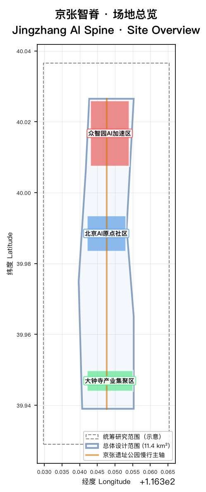
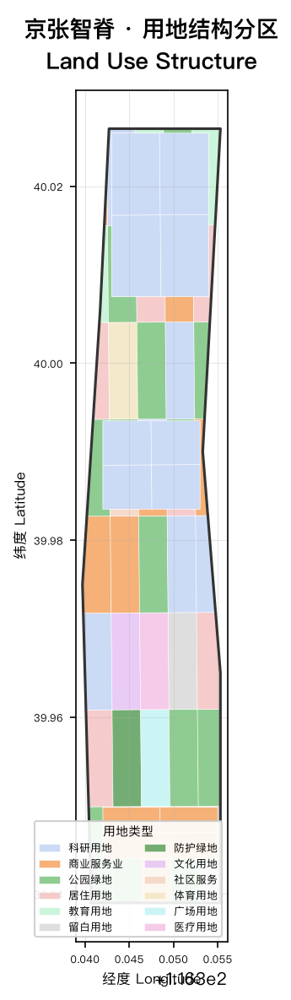
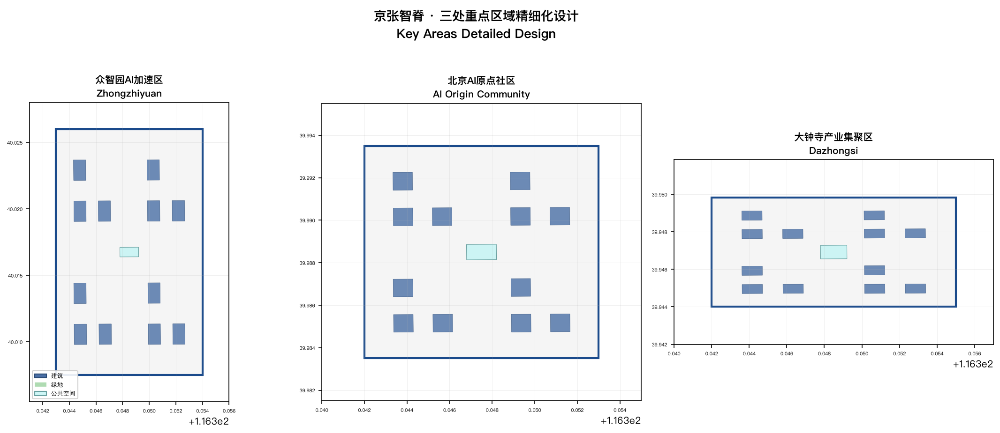
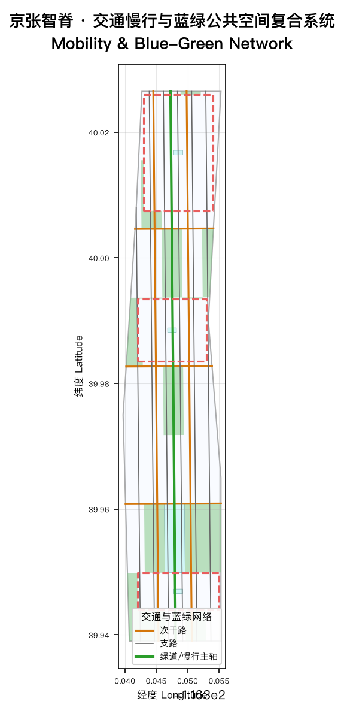
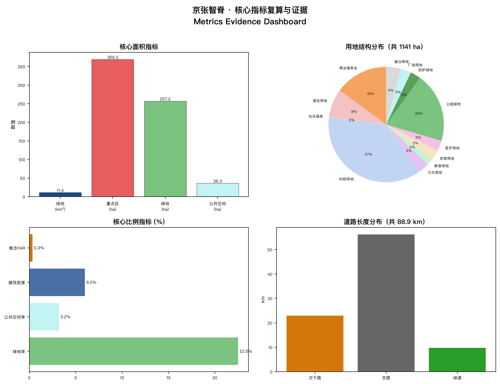

# Jingzhang AI Spine

## Design Basis and Data Inventory

This formal proposal takes the "Centennial Jing-Zhang AI Innovation Belt International Urban Design Open Call Prequalification Announcement" published by the Beijing Municipal Planning and Natural Resources Commission Haidian Branch as its primary basis, supplemented by the machine-readable provisional boundaries, key areas, enums, metrics, and source registry maintained in `brief/site-package/`. All design judgments decompose into traceable sources, recalculable metrics, verifiable layers, and human-reviewable assumptions. The announcement requires the proposal to reach the urban design depth of regulatory detailed planning and comprehensive implementation planning; therefore narrative text cannot substitute for GeoJSON, metric tables, A3 booklets, A0 boards, and the HTML exhibit.

Evidence tags used: [source:OFFICIAL-ANNOUNCEMENT], [source:AGENT-TASKBOOK], [source:SITE-PACKAGE], [standard:PROJECT-OFFICIAL-ANNOUNCEMENT], [standard:PROJECT-AGENT-OPEN-CALL-TASKBOOK], [standard:MOHURD-URBAN-DESIGN-MEASURES], [standard:MOHURD-CONTROL-DETAILED-PLANNING], [standard:MNR-LAND-USE-CLASSIFICATION-GUIDE], [depth:existing_conditions_diagnosis].

When official SITE_BOUNDARY or KEY_AREA polygons are not yet available, the scaffold uses `brief/site-package/geometry/provisional_boundaries.geojson`. Both `geometry/site_boundary.geojson` and `geometry/key_areas.geojson` are marked `provisional_constraint` with `official_boundary=false`, usable only for proposal generation, self-check, visualization, and design discussion — not as official redline, approval basis, precise area basis, or statutory control. This organizer data gap does not block content scoring; after official polygons are available, site boundary, key areas, land use, roads, green space, public space, buildings, phasing, and metrics must all be recalculated.

Boundary and key area interpretations map to [data:geometry/site_boundary.geojson#SITE-001], [data:geometry/key_areas.geojson#PROV-KEY-001], [metric:site_area_sqm], and [metric:key_area_count].

## Three-Level Scope Framework

The proposal organizes work across three levels per the announcement: the coordinated research area (43.6 km²) addresses AI industry ecosystem, strategic positioning, and future urban form; the overall design area (11.4 km²) forms the urban renewal framework, industrial spatial layout, and transportation/utility support; the key detailed design area (368.4 ha) covers three mandatory detailed design districts. All three levels are mapped item-by-item in `compliance_matrix.json` to ensure announcement tasks 1.3, 1.4, 1.5 and agent.1–agent.6 all have chapter, layer, metric, drawing, and HTML evidence.

| Level | Design Question | Answer | Data Anchor |
| --- | --- | --- | --- |
| Coordinated Research | How to organize AI ecosystem and future urban form | "University sourcing → open collaboration → enterprise conversion → public experience → international communication" innovation chain | compliance_matrix.json |
| Overall Design | How to map industry, renewal, transport to space | Land use, buildings, roads, green, public space, phasing layers | [data:geometry/land_use.geojson#LU-001], [data:geometry/roads.geojson#ROAD-001] |
| Key Areas | How to reach detailed design depth | Positioning, spatial actions, AI scenarios, implementation dependencies per district | [data:geometry/key_areas.geojson#PROV-KEY-001] |

## Overall Concept: Jingzhang AI Spine

The core concept is "Jingzhang AI Spine" (京张智脊): using the Jing-Zhang Heritage Park as the historical and public-space spine, with three key areas as innovation anchors, connected along a north-south axis. "Spine" evokes the rail backbone laid by Zhan Tianlou a century ago, overlaid with the semantics of an AI innovation nervous system. The naming system: main name "Jingzhang AI Spine"; three cores named "Zhongzhiyuan Chip", "Origin Community", "Dazhongsi Hub".

### Visual Identity & Logo Direction

- **Main graphic**: the north-south rail axis as a spine, transitioning from historical rail lines into AI network nodes.
- **Color system**: "Jingzhang Rail Blue" (#1a4a8b) + "AI Aurora Purple" (#4f46e5) + "Vitality Gold" (#c79838).
- **Typography**: open-source commercial fonts only (Source Han Sans, Geist Sans / Inter).
- **Extension**: the spine motif is reusable for wayfinding, scenario cards, and event visuals.

This addresses agent.1 must-address requirements for naming, visual identity, and logo [standard:PROJECT-AGENT-OPEN-CALL-TASKBOOK], but does not constitute an approved government brand asset.

### Global AI Innovation Ecosystem Case Studies (agent.2)

| ID | Case | Spatial Pattern | Transferable Mechanism | Spine Translation |
| --- | --- | --- | --- | --- |
| CS-01 | Silicon Valley Sand Hill Road | campus-capital-incubator triangle | VC clustering drives conversion | Origin Community conversion street |
| CS-02 | London King's Cross | station × university × tech | brownfield + station-city integration | Dazhongsi quadrant connectivity |
| CS-03 | Shenzhen Nanshan Science Park | high-density R&D cluster | government + enterprise + open blocks | Zhongzhiyuan full-stack district |
| CS-04 | Singapore One-North | research-living-culture mix | functional fusion | Three-core composite strategy |
| CS-05 | Tokyo Shibuya Stream | rail hub redevelopment | station-city + HQ | Dazhongsi station integration |
| CS-06 | Beijing Zhongguancun Inno Way | incubation-display-capital | dense startup services | Origin open-source hall |
| CS-07 | NYC Cornell Tech | campus-as-innovation-community | cross-discipline + co-build | Zhongzhiyuan campus ecosystem |

## Overall Design Area: Urban Renewal & Regulatory-Depth Urban Design

The overall design area must reach regulatory detailed planning urban design depth. `geometry/land_use.geojson` must completely cover the design boundary with no gaps or overlaps (verified: 58 parcels, union area = site area). `geometry/buildings.geojson` expresses building footprints (107 features). `geometry/roads.geojson` expresses micro-circulation, slow mobility, and rail connectivity (12 road segments). `metrics.json` recalculates core areas, ratios, and layer counts.

Key metrics [metric:site_area_sqm]=11,412,825 sqm, [metric:floor_area_ratio]=0.35 (concept), [metric:green_ratio]=0.225, [metric:public_space_ratio]=0.032, [metric:building_density] and [metric:key_area_count]=3. Regulatory FAR, height, density, green ratio, and setback are all `unknown` (official values not released).

## Key Areas Detailed Design

| Key Area | Positioning | Spatial Actions | AI Scenarios | Evidence |
| --- | --- | --- | --- | --- |
| Zhongzhiyuan AI Acceleration | Garden-type full-stack innovation district | Qinghe interface, industry display, low-carbon exchange, transit | Model testing, standards, safety governance | [data:geometry/key_areas.geojson#PROV-KEY-001] |
| Beijing AI Origin Community | Campus-adjacent conversion & talent community | Campus-park-street slow stitching; talent services | Open-source, result publishing, near-campus incubation | [data:geometry/key_areas.geojson#PROV-KEY-002] |
| Dazhongsi AI Industry Cluster | Urban intelligent-economy district | Station integration, four-quadrant pedestrian links | Agent & terminal display, content, data factors | [data:geometry/key_areas.geojson#PROV-KEY-003] |

## AI Scenarios, Personas & Public Space

The proposal includes ≥10 AI scenario cards, ≥3 industry test scenarios, ≥5 user personas, and ≥3 AI pilgrimage landmarks — all located in specific layers and metrics.

| Persona | Needs | Spatial Response | Privacy Boundary |
| --- | --- | --- | --- |
| Open-source developer | Publishing, collaboration, testing | Origin open-source hall, code wall | No personal tracking |
| Startup team | Low-cost office, compute, testbed | Zhongzhiyuan shared testbed | Compute needs authorization |
| Enterprise visitor | Display, business, recruiting | Dazhongsi roadshow lounge | Brand assets need clearance |
| Local resident | Commute, leisure, services | Heritage park slow loop | No commercial profiling |
| Faculty/student | Conversion, cross-campus, daily mobility | Campus-park stitching | Campus data authorized |

### AI Pilgrimage Landmarks (agent.4)

| Landmark | Location | Concept | Evidence |
| --- | --- | --- | --- |
| L-01 Spine Tower | Zhongzhiyuan central plaza | Rail signal tower → AI compute tower with Zhan Tianyou memorial | [data:geometry/public_space.geojson#PUBLIC-002] |
| L-02 Origin Lighthouse | AI Origin open-source hall | Open circular publishing space for developer conferences | [data:geometry/public_space.geojson#PUBLIC-003] |
| L-03 Data Bell Tower | Dazhongsi station plaza | Smart terminal & data-factor node, bells → data visualization | [data:geometry/public_space.geojson#PUBLIC-004] |

## Transportation, Utilities & Phasing

Transportation covers rail station integration, road micro-circulation, slow mobility breakpoints, and green transport. Agent may only edit secondary roads and below; expressways and arterials are locked. `geometry/roads.geojson` keeps all roads within the submission boundary. Utility strategy covers AI service facilities, distributed energy, edge compute, and traditional infrastructure fusion.

Phasing `geometry/phasing.geojson` expresses three phases: Phase 1 Zhongzhiyuan (2026-2028), Phase 2 Origin Community (2028-2030), Phase 3 Dazhongsi (2030-2032). The 100-day call cycle is for submission, not implementation phasing.

## Metrics, Recalculation & Compliance

All `known` metrics are recalculable from GeoJSON at EPSG:4548. The five regulatory indicators (FAR, height, density, green ratio, setback) are `unknown` with explicit reasons, as official values are not released in the site package. The compliance matrix maps every announcement and agent_taskbook task to report sections, layers, metrics, drawings, HTML pages, sources, and assumptions. Missing any of announcement 1.3, 1.4, 1.5 or agent.1–agent.6 would block entry to formal professional scoring.

## Risks, Copyright & Compliance

- **Boundary**: site_boundary and key_areas are `provisional_constraint`, `official_boundary=false`.
- **Regulatory gap**: FAR/height/density/green ratio/setback are `unknown`.
- **AI scenarios**: all are conceptual suggestions, not government commitments.
- **Data sources**: official announcement + provisional boundaries + national land use classification standard.
- **Copyright**: all figures and drawings are agent-generated programmatically; no third-party copyrighted materials.

This proposal does not claim official approval, statutory regulatory planning, final land ownership, final construction scale, or guaranteed implementation.
