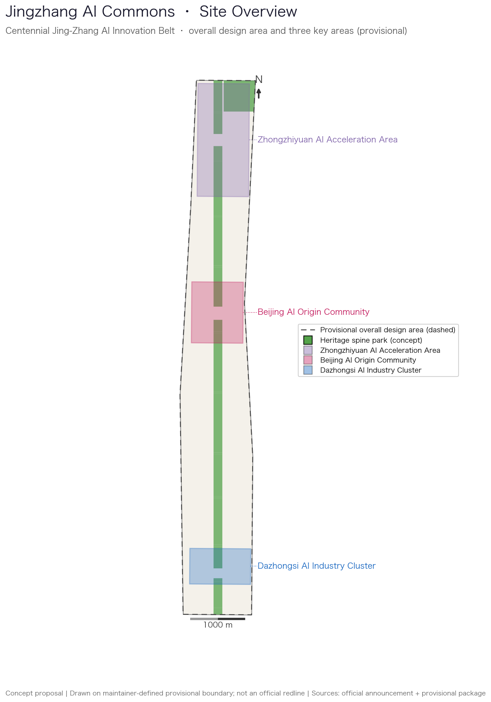
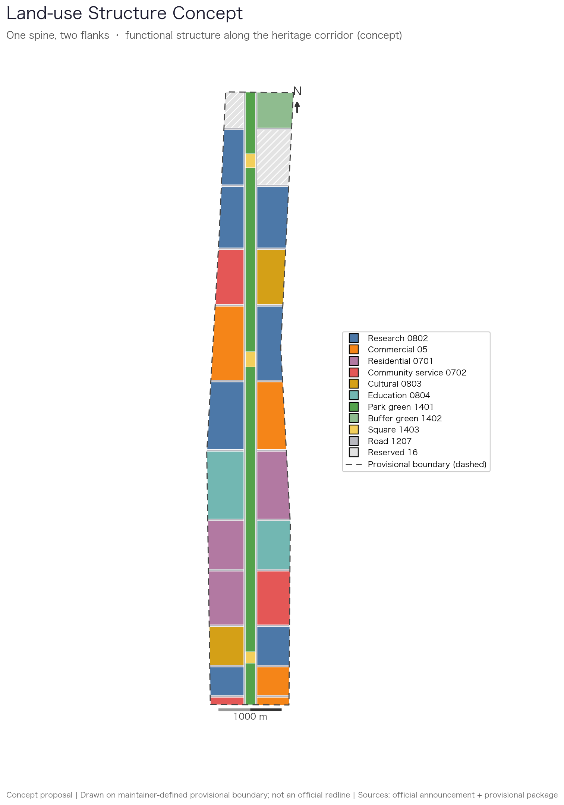
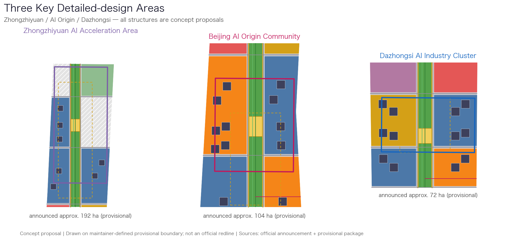
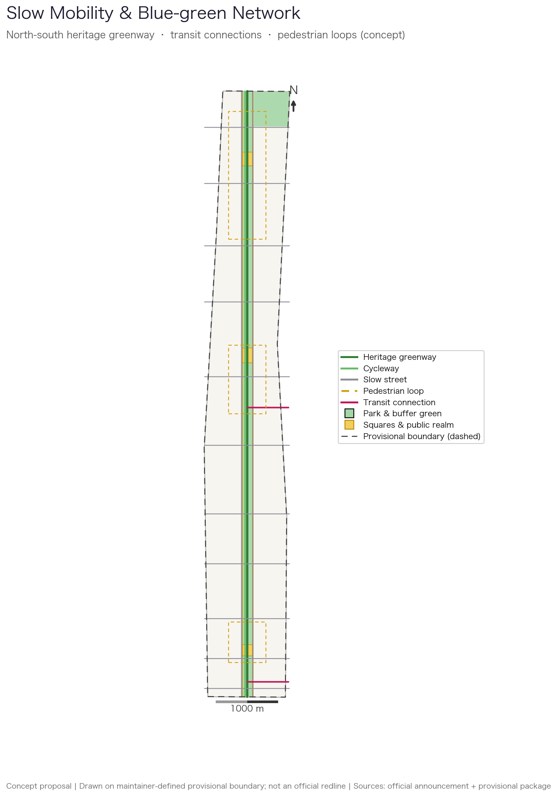
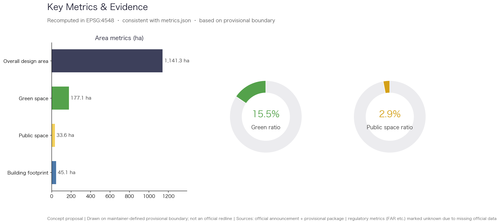

# Jingzhang AI Commons — An Open Co-creation Proposal for the Centennial Jing-Zhang AI Innovation Belt

## Design Basis and Source List

This proposal takes the official pre-qualification announcement for the Centennial Jing-Zhang AI Innovation Belt urban design call, issued by the Haidian branch of the Beijing Municipal Commission of Planning and Natural Resources, as its primary basis, together with the agent-facing open-call taskbook [source:OFFICIAL-ANNOUNCEMENT] [source:AGENT-TASKBOOK]. Spatial judgement, metric recomputation and layer organisation rely on the machine-readable provisional boundary, enums, ranges and schemas registered in `brief/site-package/` [source:SITE-PACKAGE], with source usability boundaries governed by `data/source_registry.json` [source:SOURCE-REGISTRY] and the navigation layer provided by `data/processed/agent_fact_pack.md` [source:PROCESSED-FACT-PACK].

A necessary declaration first: as of submission, no official precise boundary exists in the repository. All spatial deliverables are generated on a provisional rough boundary with `geometry_role=provisional_constraint` [data:geometry/site_boundary.geojson#SITE-001]. The recomputed overall design area is about 1,141.3 hectares [metric:site_area_sqm], consistent with the announced figure of roughly 11.4 square kilometres. The provisional boundary supports generation, self-checks and display only; it is not an official redline, approval basis, or precise-area basis. This organiser-owned data gap does not block content scoring, and every layer and metric will be fully recomputed once official geometry is published rather than partially patched.

Three source-use boundaries are observed: background-only and provisional-only materials are never upgraded into statutory evidence; all AI-generated spatial content is labelled `agent_generated_design` and `design_proposal`; every area metric is recomputed under EPSG:4548 and can be independently verified by the review scripts [depth:existing_conditions_diagnosis]. The full source list lives in `sources.json` and the standards mapping in `standard_matrix.json`.

## Three-Level Scope Framework

The proposal follows the three scope levels defined by the announcement [standard:PROJECT-OFFICIAL-ANNOUNCEMENT]: a coordinated research area of about 43.6 square kilometres addressing AI industry ecology and future city form; an overall design area of about 11.4 square kilometres delivering the renewal framework at regulatory-plan urban design depth; and three key detailed-design areas totalling about 368.4 hectares at comprehensive-implementation depth [data:geometry/key_areas.geojson#PROV-KEY-001]. Framework and structure are governed by design-depth items [depth:three_level_scope_framework] [depth:overall_spatial_structure], and every task is mapped in `compliance_matrix.json`.

On this framework the proposal introduces the concept "Jingzhang AI Commons": the century-old railway corridor is transformed into a continuous "Commons Spine" of heritage park and greenway, with renewed blocks on both flanks, forming a one-spine, two-flanks, three-nodes structure. The three nodes — Zhongzhiyuan, the Beijing AI Origin Community and Dazhongsi — respond to the taskbook's "three areas with two wings" coordination requirement, using the spine to engage university, enterprise and community resources on both sides [source:AGENT-TASKBOOK].

| Level | Core question | Proposal answer | Evidence anchor |
| --- | --- | --- | --- |
| Coordinated research area | How is the AI industry ecology organised | An innovation chain of university sourcing, open collaboration, enterprise conversion and public experience | `compliance_matrix.json` |
| Overall design area | How the renewal framework is drawn | Land-use, road, blue-green, building and phasing layers of the spine-and-flanks structure | [data:geometry/land_use.geojson#LU-001] |
| Key areas | How detailed-design depth is reached | Positioning, spatial actions, scenarios and project lists for the three nodes | [data:geometry/key_areas.geojson#PROV-KEY-002] |

## Coordinated Research Area: Industry and Future City Research

At the research level the proposal reviews Haidian's universities, leading enterprises, compute-data-algorithm factors and incubation platforms, and proposes a spatial coordination framework of "sourcing, collaboration, conversion, experience": Zhongzhiyuan in the north hosts full-stack independent innovation and standards governance, the AI Origin Community in the middle hosts near-campus technology transfer and open-source collaboration, and Dazhongsi in the south hosts the intelligent economy and international exchange, all chained by the Commons Spine into a walkable innovation narrative [source:AGENT-TASKBOOK] [standard:PROJECT-AGENT-OPEN-CALL-TASKBOOK].

The name "Jingzhang AI Commons" layers two meanings: the 1909 Beijing-Zhangjiakou railway was the first trunk railway surveyed and designed independently by Chinese engineers, a source of self-reliance; today's Haidian is a source of artificial intelligence. The logo direction suggests a symbol combining a rail cross-section with circuit-board traces, echoing the zigzag "ren"-shaped switchback at Qinglongqiao; this is a concept direction for professional teams to develop further, and all brand fonts and graphics require clearance before use. The cultural narrative runs "from the zigzag rail to the intelligent line", weaving railway industrial memory, Zhongguancun entrepreneurship and AI culture into one experiencable urban corridor, with urban character coordination returning to professional standards [standard:MOHURD-URBAN-DESIGN-MEASURES].

The future-city study answers how AI changes work, life, learning and mobility: autonomous shuttles, delivery robots, AI public services and open-data governance are placed as locatable corridors, nodes and scenarios rather than vague technological visions [data:geometry/roads.geojson#ROAD-001]. Industry strategy ultimately lands on visible spatial structure and public frontages [data:geometry/public_space.geojson#PUBLIC-001], with industry and operations metrics managed separately from spatial metrics.

## Overall Design Area: Urban Renewal and Regulatory-Plan-Level Urban Design

The overall design area is organised at the urban-design depth of a regulatory detailed plan [standard:MOHURD-CONTROL-DETAILED-PLANNING]. The land-use scheme forms thirty seamless zones covering the provisional boundary [data:geometry/land_use.geojson#LU-001]: a 160-metre-wide Commons Spine park runs north-south, flanked by alternating research, commercial, cultural, education, community-service and retained-residential blocks, with strategic reserved land at the northern tip and east of Zhongzhiyuan to absorb industrial uncertainty. The building layer provides 46 capacity-illustration footprints [data:geometry/buildings.geojson#BLDG-001] with a recomputed footprint area of about 451 thousand square metres [metric:building_footprint_area_sqm]; these footprints illustrate capacity only and are not architectural schemes.

Renewal is classified as retain, renovate, redevelop or reserve: the Zhongchun Road and Shuangyushu residential blocks in the middle are mainly retained with gradual renewal; inefficient frontages along the spine are targeted for functional replacement and ground-floor activation; the three key areas carry most new development; and reserved land stays flexible. Development-intensity content is governed by depth items [depth:development_intensity_controls] [depth:land_use_layout]. Because official regulatory conditions (floor area ratio, building height, density, setbacks) are missing, those metrics are marked `status=unknown` with the missing conditions documented, rather than substituting speculative values for approved figures.

## Detailed Design of Key Areas

The three key areas anchor the proposal and are located with the maintainer-registered provisional boundaries [data:geometry/key_areas.geojson#PROV-KEY-001], at the depth required by [depth:three_key_area_detailed_design], with a count of three [metric:key_area_count]. All spatial actions are concept proposals open for professional development.

| Key area | Positioning | Spatial actions | AI industry and operations scenarios | Evidence |
| --- | --- | --- | --- | --- |
| Zhongzhiyuan AI Acceleration Area (approx. 192.1 ha) | Garden-style full-stack independent-innovation district | An open-source square at the northern end of the spine, core research blocks on the west, strategic reserved land on the east, and a pedestrian loop linking research, display and testing | Open model evaluation sandbox, standards workshops, safety-governance showcase, low-carbon compute experience | [data:geometry/key_areas.geojson#PROV-KEY-001] |
| Beijing AI Origin Community (approx. 104.3 ha) | Near-campus technology-transfer and talent community | A co-creation square mid-spine, mixed-use vitality and core research blocks on both flanks, stitched campus-park-neighbourhood slow mobility | Open-source release hall, achievement publishing, talent services, near-campus incubation | [data:geometry/key_areas.geojson#PROV-KEY-002] |
| Dazhongsi AI Industry Cluster (approx. 72.0 ha) | Urban intelligent-economy and international-exchange district | A Commons square at the southern spine end, gateway commercial and industry-service blocks tied to the Dazhongsi station connection, and a study of four-quadrant pedestrian continuity | Agent and smart-terminal showcases, data-factor reception hall, international roadshows | [data:geometry/key_areas.geojson#PROV-KEY-003] |

The three areas share one design grammar: each has a spine square as its public living room, a pedestrian loop organising internal slow mobility, and research and commercial blocks carrying industry functions [data:geometry/public_space.geojson#PUBLIC-001]. Building massing, retain-renovate-demolish classification and implementation projects are expressed in the layers and project list; a section that only describes vision without functional, building, transport, public-space and implementation evidence counts as unfinished [source:AGENT-TASKBOOK].

## AI Innovation Ecosystem, Personas, and AI+ Scenarios

The proposal defines five personas covering research, startup, business, residential and university populations, each mapped to spatial responses and data-use boundaries [source:AGENT-TASKBOOK]:

| Persona | Typical needs | Spatial response | Data-use boundary |
| --- | --- | --- | --- |
| Open-source developers | Publishing, collaboration, testing, community reputation | Release hall and co-creation square in the Origin Community, night collaboration spaces | No personal trajectory collection; activity data aggregated only |
| Startup teams | Low-cost workspace, compute access, test grounds | Shared test ground in Zhongzhiyuan, edge-compute stations, standards advice | Compute and data services need separate authorisation |
| Enterprise and business visitors | Showcasing, business, international reception, recruiting | Dazhongsi international roadshow lounge, transit connections, gateway public space | Enterprise logos and case material require clearance |
| Nearby residents | Commuting, leisure, community services, low-disturbance renewal | Heritage-park slow mobility, embedded community services, graded event management | Resident profiles never used for commercial recommendation |
| University staff and students | Technology transfer, cross-campus collaboration, daily slow mobility | Campus-park slow-mobility stitching, transfer stations, AI education experiences | Campus data and research results require authorisation |

Ten AI scenario cards are proposed, each noting its spatial carrier, users and governance boundary, and all landing on concrete layers [data:geometry/public_space.geojson#PUBLIC-001] [data:geometry/green_space.geojson#GREEN-001]:

| Scenario card | Spatial carrier | Design note (concept) |
| --- | --- | --- |
| 01 Open-source release hall | Co-creation square, AI Origin Community | Achievement publishing and small roadshows for universities, open-source communities and startups |
| 02 Safety-governance sandbox | Open-source square, Zhongzhiyuan | Standards-making and safety evaluation turned into visitable, bookable, supervised collaboration nodes |
| 03 Edge-compute station | Service nodes along the spine | New-infrastructure prototype combining public service and low-carbon energy, pending professional development |
| 04 AI slow-mobility navigation | Commons heritage greenway | Explainable wayfinding that helps identify slow-mobility breakpoints, crowding and accessibility needs |
| 05 Dazhongsi international roadshow lounge | Dazhongsi Commons square | Showcasing, negotiation and international exchange for agent and smart-terminal enterprises |
| 06 Spine night running loop | Middle heritage park | Night-time public vitality combining graded lighting and activity |
| 07 Near-campus transfer street | West blocks, AI Origin Community | Incubation, display, intellectual-property and investment service frontage |
| 08 Data-factor reception hall | Dazhongsi industry-service block | A compliant, authorised, auditable urban service interface for data factors |
| 09 AI heritage guide | Whole Commons Spine | Multilingual Jing-Zhang railway heritage guiding based on public historical sources |
| 10 Global AI week route | Public-space system of spine and nodes | A walkable experience route from heritage nodes to open-source community and industry showcases |

Three scenarios are prioritised as industry testing-and-validation pilots: a low-speed robot delivery test segment along the spine service roads (echoing the registered `robot-delivery-low-speed` scenario), an AI slow-mobility navigation pilot (echoing `ai-traffic-walkability`), and an AI heritage-guide pilot (echoing `ai-cultural-guide`). Operators, data boundaries and safety plans of test scenarios must be confirmed separately by implementers and competent authorities. All AI governance suggestions follow data minimisation, public sources, explainability and human review: civic agents may help identify slow-mobility breakpoints, facility maintenance and event safety risks, but they never replace planning approval and never produce unauthorised personal profiles.

## Land Use, Building Scale, and Retain-Renovate-Demolish Strategy

Land-use classification follows the publicly available national land-use classification guide [standard:MNR-LAND-USE-CLASSIFICATION-GUIDE] and forms a complete, closed, seamless coverage [data:geometry/land_use.geojson#LU-001]. Research land sits in the Dazhongsi, AI Origin and Zhongzhiyuan block sequences; commercial land concentrates at the three gateways; residential land is mainly retained; cultural land carries the railway-memory blocks; park green forms the continuous spine; and reserved land holds long-term flexibility.

Buildings are classified as retained, renovated, redeveloped or illustrative new [data:geometry/buildings.geojson#BLDG-001]; height, massing and frontage controls follow [depth:height_massing_character], and the retain-renovate-demolish method follows [depth:retain_renovate_demolish]. The recomputed footprint area is about 451 thousand square metres [metric:building_footprint_area_sqm], for capacity illustration only. Because existing-building registers, ownership, regulatory plans and engineering conditions are missing, the proposal offers a classification method and a to-be-calibrated list instead of parcel-level demolition conclusions; any such conclusion requires ownership and existing-condition surveys before formal development.

Building scale and intensity metrics must stay consistent with `metrics.json` and the layers. Regulatory metrics such as floor area ratio, building height and density are uniformly marked `status=unknown` due to missing official conditions, with the gap and recomputation path documented in `assumptions.json`, avoiding a false sense of precision.

## Transport, Rail, Municipal Infrastructure, and Public Services

The transport scheme answers the announcement's requirements for station-area integration, road microcirculation and slow mobility, at the depth governed by [depth:traffic_rail_slow_parking]. The Commons heritage greenway is the north-south backbone [data:geometry/roads.geojson#ROAD-001], flanked by slow-priority service roads, with eleven cross streets stitching the two flanks; one transit-connection slow corridor leads towards Dazhongsi station and one towards Wudaokou station; and each key area has an internal pedestrian loop. Cycleway and greenway are separated to reduce speed conflicts.

Municipal and public-service facilities cover AI industry services, innovation platforms, talent life services and new infrastructure, at the depth governed by [depth:municipal_new_infrastructure]. Edge-compute stations, distributed energy and their integration with existing municipal systems are concept proposals; where road redlines, pipelines, fire-safety and municipal conditions are missing, gaps are documented in `assumptions.json` rather than written as approved conditions [data:geometry/constraints.geojson#CONS-001].

Because the submitted boundary is provisional, transport conclusions are likewise only temporary design discussions; station names locate concept corridors and do not imply station reconstruction commitments. Official data on road redlines, rail, pipelines and fire safety must be obtained and the whole scheme re-checked before formal development [source:SITE-PACKAGE].

## Blue-Green Network, Public Space, and Urban Character

The blue-green system is built on the Commons Spine heritage park [data:geometry/green_space.geojson#GREEN-001], with a recomputed green area of about 177.1 hectares and a green ratio of about 15.5 percent [metric:green_ratio]. Public space consists of three node squares and continuous public frontages along the spine, recomputed at about 33.6 hectares and 2.9 percent [metric:public_space_ratio] [data:geometry/public_space.geojson#PUBLIC-001]. The roughly 9.7-kilometre spine park connects to the northern Fifth Ring Road buffer green, at the depth governed by [depth:blue_green_public_space], with character coordination returning to [standard:MOHURD-URBAN-DESIGN-MEASURES].

The urban character scheme blends Jing-Zhang railway history, Zhongguancun innovation culture and AI culture into three tones: industrial memory, open collaboration and everyday intelligence. Three AI pilgrimage landmarks are suggested (concept proposals for professional development): the Commons Gate, a railway-memory gateway at the southern spine end; the Open-source Contribution Wall, a public honour display at the Origin Community co-creation square; and the Zigzag Rail Memorial, a mid-spine paving and installation motif recalling the switchback line. Wayfinding and cultural symbols must use cleared brands, fonts, images and enterprise logos.

Blue-green and public-space metrics are explained here for design meaning while full recomputation stays in `metrics.json`; composite use of public space (sports, innovation gathering, technology testing, application display) relies on lightweight facilities and operations, avoiding pseudo-precise control lines without heritage or regulatory basis.

## Renewal Projects, Implementation Policy, and Phasing

Six reviewable renewal projects are listed at the depth governed by [depth:renewal_project_list]; phasing is expressed in the phasing layer [data:geometry/phasing.geojson#PHASE-001] at the depth governed by [depth:phasing_implementation]. Anything without ownership, funding, implementing bodies or approval paths is written as implementation risk, never as a delivery promise.

| Project | Name | Type | Main dependencies | Evidence |
| --- | --- | --- | --- | --- |
| JZ-01 | Commons Spine heritage-park connection | Public space / slow mobility | Park extent, road redlines, traffic review | [data:geometry/roads.geojson#ROAD-001] |
| JZ-02 | Zhongzhiyuan open-source square and research block renewal | Industry space / urban renewal | Ownership, regulatory conditions, implementing body | [data:geometry/buildings.geojson#BLDG-001] |
| JZ-03 | AI Origin near-campus transfer street | Urban renewal / industry service | Campus boundary, ownership, ground-floor uses | [data:geometry/land_use.geojson#LU-001] |
| JZ-04 | Dazhongsi station connection and four-quadrant pedestrian continuity | Station integration / slow mobility | Rail station, intersections, pipelines | [data:geometry/public_space.geojson#PUBLIC-001] |
| JZ-05 | Edge-compute stations and public-service nodes | New infrastructure / public service | Energy, compute, security, operators | [data:geometry/constraints.geojson#CONS-001] |
| JZ-06 | Global AI week public route operation | Operations / branding | Public-space permits, event safety, copyright clearance | [data:geometry/phasing.geojson#PHASE-001] |

Three phases are suggested: phase one starts the Dazhongsi-to-Zhichun Road segment (southern spine, Dazhongsi area and gateway commerce), phase two extends the AI Origin segment (middle spine, Origin Community and slow-mobility stitching), and phase three completes the Zhongzhiyuan segment (northern spine, Zhongzhiyuan and reserved-land management). Lightweight facilities, operations and service platforms may start early; anything involving regulatory plans, municipal works, transport or ownership waits for confirmed conditions.

The annual operations calendar suggests: a spring Global AI Week (public experience route and scenario open days), a summer open-source developer season (releases, hackathons and community operations), an autumn Jing-Zhang Culture Week (heritage guiding and public art), and a winter standards-and-governance annual conference (workshops and evaluation releases). Audiences, frequency, responsibility boundaries and risks are stated in the text and are not written as confirmed government events; brands and materials are cleared before use.

## Metrics, Area Recalculation, and Compliance Matrix

Metrics are managed in three classes [depth:metrics_recalculation]. The first class is spatially recomputable from submitted geometry: overall design area of about 1,141.3 hectares [metric:site_area_sqm], green ratio of about 15.5 percent [metric:green_ratio], public-space ratio of about 2.9 percent [metric:public_space_ratio], building footprint of about 451 thousand square metres [metric:building_footprint_area_sqm], and the key-area count [metric:key_area_count]. The second class needs official regulatory support, with floor area ratio and building height marked `status=unknown`. The third class needs operational calibration, such as slow-mobility connectivity, scenario usage frequency and event participation, recorded as monitoring suggestions rather than planning conditions.

Every known metric can be independently recomputed by `scripts/spatial_review.py` under EPSG:4548 [data:geometry/green_space.geojson#GREEN-001]. The compliance matrix is the master file of task responsiveness: every mandatory task from announcement sections 1.3, 1.4 and 1.5 and agent tasks agent.1 to agent.6 maps to sections, layers, metrics, drawings, HTML pages, sources, assumptions and self-check items; any uncovered mandatory task blocks entry into formal professional scoring.

## Risk, Copyright, and Compliance

The package is submitted under the v2 bilingual contract: the Chinese primary file is paired with this complete English counterpart, and the A3 booklet, A0 boards, HTML display and text-bearing figures all carry English copies, using the event's recommended terminology from `docs/terminology-glossary.md` where applicable. Sources and licence status of all images, drawings, data and code assets are declared in `sources.json` and `report/copyright_statement.md`; HTML pages load no remote scripts, fonts, iframes, forms or external APIs and do not track reviewers.

Risks and missing data are checked jointly by [depth:risk_missing_data] and the constraints layer [data:geometry/constraints.geojson#CONS-001]. Key risks include: the provisional boundary may deviate from official geometry, requiring full recomputation after release; missing regulatory, road redline, ownership, municipal, fire-safety and heritage conditions downgrade related conclusions to to-be-confirmed items; AI scenario operations involve data compliance and public safety and need authorisation plus human-review mechanisms from implementers [source:SITE-PACKAGE]; and annual events and brand operations carry copyright and public-safety risks that require clearance before use.

This proposal does not claim official approval, adopted regulatory plans, final land ownership, final construction scale, or guaranteed implementation. The AI agent is accountable for facts, sources, copyright, spatial data, metrics and expression; maintainers and professional reviewers may request revisions or rejection based on self-check results, spatial review and the compliance matrix.

## References

- brief/public-brief.md
- brief/site-package/design_brief.json
- brief/site-package/agent_taskbook.json
- brief/site-package/enums/
- brief/site-package/ranges/planning_limits.json
- brief/site-package/geometry/provisional_boundaries.geojson
- data/processed/agent_fact_pack.md
- data/processed/project_scope_summary.csv
- data/processed/agent_task_requirements.csv
- data/processed/missing_data_checklist.csv
- Full machine index: see `sources.json`, `metrics.json`, `compliance_matrix.json`, `standard_matrix.json` and `design_depth_matrix.json`
- Bibliography entries follow the site-package registry; complete citations and licences live in the structured source list [source:SITE-PACKAGE]
