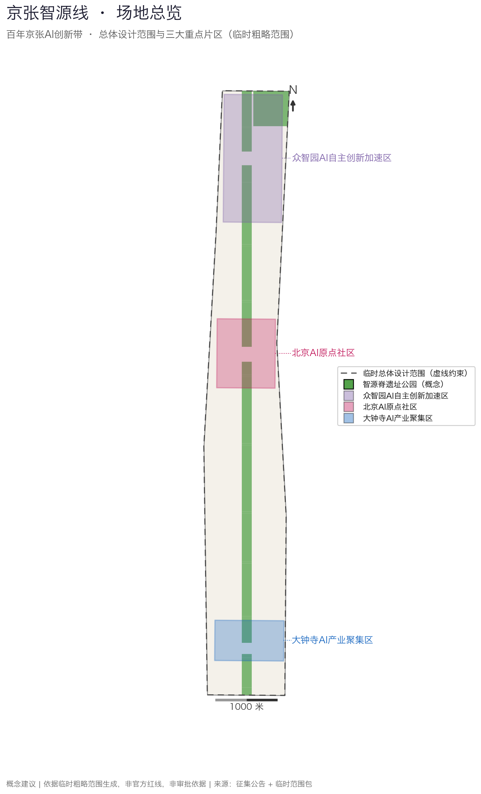
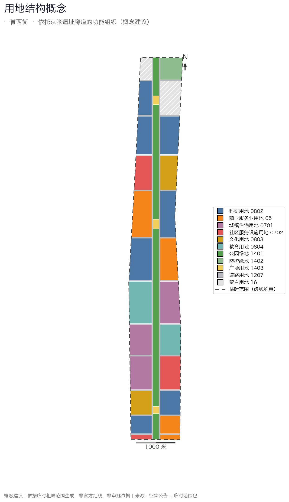
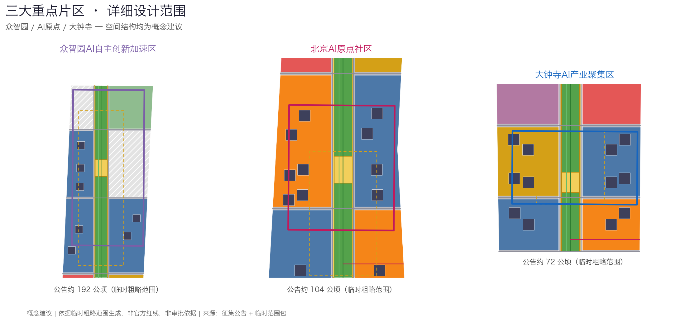
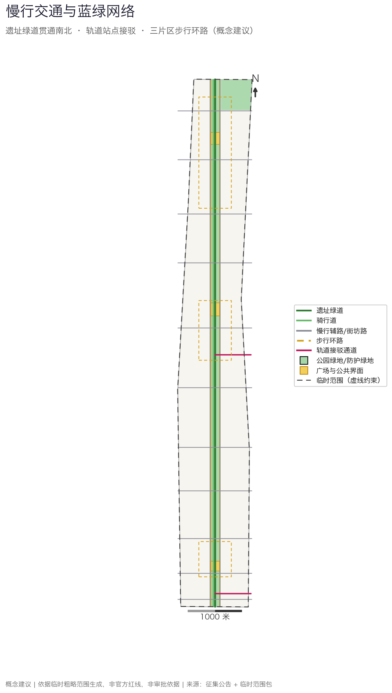
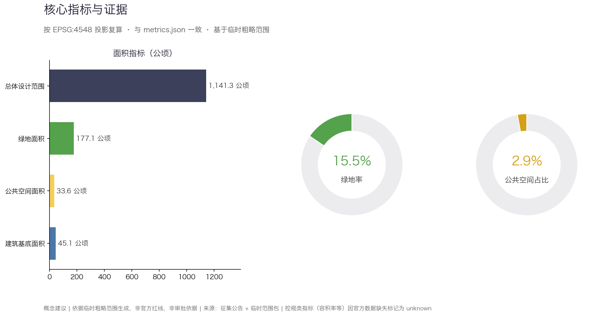

# 京张智源线——百年京张AI创新带开放共创方案

## 设计依据与资料清单

本方案以北京市规划和自然资源委员会海淀分局《百年京张AI创新带城市设计国际方案征集资格预审公告》为第一依据，结合面向智能体的开源征集任务书组织全部成果 [source:OFFICIAL-ANNOUNCEMENT] [source:AGENT-TASKBOOK]。方案的空间判断、指标计算和图层组织以 `brief/site-package/` 中维护者登记的临时粗略边界、枚举、指标范围和数据模式为机器可读依据 [source:SITE-PACKAGE]，资料用途边界以 `data/source_registry.json` 为准 [source:SOURCE-REGISTRY]，任务导航层为 `data/processed/agent_fact_pack.md` [source:PROCESSED-FACT-PACK]。

需要首先声明：截至提交日，仓库中不存在官方精确范围线，本方案全部空间成果基于 `provisional_constraint` 性质的临时粗略范围生成 [data:geometry/site_boundary.geojson#SITE-001]，总体设计范围复算面积约 1141.3 公顷 [metric:site_area_sqm]，与公告约 11.4 平方公里约束一致。临时范围只用于方案生成、自检和展示，不构成官方红线、审批依据或精确面积依据；这一组织方数据缺口不阻断内容评分，官方边界发布后所有图层与指标将整体复算，而非局部替换。

资料使用遵守三条边界：背景资料和 provisional-only 资料不升级为法定依据；AI 生成的空间内容一律标注 `agent_generated_design` 与 `design_proposal`；所有面积指标以 EPSG:4548 投影复算并可由评审脚本独立验证 [depth:existing_conditions_diagnosis]。完整来源清单见 `sources.json`，标准对应见 `standard_matrix.json`。

## 三层范围工作框架

方案按公告确定的三层范围组织工作 [standard:PROJECT-OFFICIAL-ANNOUNCEMENT]：统筹研究范围约 43.6 平方公里，回答 AI 产业生态与未来城市形态问题；总体设计范围约 11.4 平方公里，落实城市更新总体框架与控规深度城市设计；重点区域约 368.4 公顷三处片区，达到规划综合实施方案深度 [data:geometry/key_areas.geojson#PROV-KEY-001]。三层范围的框架与结构由设计深度项约束 [depth:three_level_scope_framework] [depth:overall_spatial_structure]，任务映射逐条记录在 `compliance_matrix.json`。

在三层框架上，方案提出总体概念"京张智源线"：把百年京张铁路的历史廊道转译为一条"智源脊"——连续遗址公园绿道，脊柱两侧组织功能街坊，形成"一脊两街三区"的空间结构。"一脊"是遗址公园复合廊道；"两街"是脊柱东西两侧的更新街坊序列；"三区"是众智园、北京AI原点社区、大钟寺三处重点片区，并呼应任务书"三区两翼"协同要求，以脊柱为轴带动两翼高校、企业与社区资源 [source:AGENT-TASKBOOK]。

| 层级 | 核心问题 | 方案回答 | 证据落点 |
| --- | --- | --- | --- |
| 统筹研究范围 | AI 产业生态如何组织 | "高校策源—开源协作—企业转化—公共体验"创新链 | `compliance_matrix.json` |
| 总体设计范围 | 更新框架如何落图 | 一脊两街三区的用地、道路、蓝绿、建筑与分期图层 | [data:geometry/land_use.geojson#LU-001] |
| 重点区域范围 | 片区如何达到详细设计深度 | 三片区定位、空间动作、场景与项目清单 | [data:geometry/key_areas.geojson#PROV-KEY-002] |

## 统筹研究范围产业与未来城市研究

统筹研究层面，方案梳理海淀高校院所、头部企业、算力算法数据要素与孵化平台资源，提出"策源—协作—转化—体验"的 AI 创新链空间协同框架：北部众智园承接全栈自主创新与标准治理，中部 AI 原点社区承接近校成果转化与开源协作，南部大钟寺承接智能经济与国际交往，三段由智源脊串联为可步行的创新叙事 [source:AGENT-TASKBOOK] [standard:PROJECT-AGENT-OPEN-CALL-TASKBOOK]。

命名方案"京张智源线"意在叠加两层含义：1909 年京张铁路是中国人自主勘测设计的第一条干线铁路，是"自主之源"；今天的海淀是中国 AI 策源地，是"智能之源"。Logo 方向建议以钢轨横截面与电路走线的同构图形为核心符号，辅以"人"字形轨道转折母题，致敬青龙桥人字形线路；该方向为概念建议，可供专业团队深化研究，品牌字体与图形使用时须另行清权。文化叙事主线为"从人字轨到智能线"：把铁路工业记忆、中关村创业文化与 AI 创新文化编排在同一条可体验的城市廊道上，城市风貌统筹回到专业标准 [standard:MOHURD-URBAN-DESIGN-MEASURES]。

未来城市形态研究回答 AI 如何改变工作、生活、学习与出行：方案把无人驾驶接驳、机器人配送、AI 公共服务、开放数据治理等趋势落实为可定位的廊道、节点与场景，而不是泛泛的技术愿景 [data:geometry/roads.geojson#ROAD-001]。产业策略最终落到可见的空间结构与公共界面上 [data:geometry/public_space.geojson#PUBLIC-001]，产业指标与运营指标在指标体系中与空间指标分类管理。

## 总体设计范围城市更新与控规深度城市设计

总体设计范围按控制性详细规划的城市设计深度组织成果 [standard:MOHURD-CONTROL-DETAILED-PLANNING]。用地方案形成 30 个无缝覆盖临时范围的分区 [data:geometry/land_use.geojson#LU-001]，中央 160 米宽的智源脊公园绿地贯通南北，两侧交替布置科研、商业、文化、教育、社区服务与保留居住街坊，北端和众智园东侧安排战略留白用地，应对产业不确定性。建筑基底图层给出 46 处容量示意基底 [data:geometry/buildings.geojson#BLDG-001]，复算基底面积约 45.1 万平方米 [metric:building_footprint_area_sqm]；建筑基底仅为容量示意，不构成建筑方案。

更新策略按"保留、改造、更新、留白"分类：中段知春路、双榆树居住街坊以保留与渐进更新为主；沿脊柱两侧的低效界面以功能置换和首层活化为主；三处重点片区内部以更新新建为主；北端留白用地维持弹性。开发强度控制内容按深度项管理 [depth:development_intensity_controls] [depth:land_use_layout]，由于官方控规条件（容积率、建筑高度、建筑密度、退线）缺失，相关指标一律标记 `status=unknown` 并说明待补条件，不以推测值冒充审定指标。

## 重点区域详细设计

三处重点片区是方案的锚点，均使用维护者登记的临时粗略范围定位 [data:geometry/key_areas.geojson#PROV-KEY-001]，深度由 [depth:three_key_area_detailed_design] 约束，数量为 3 处 [metric:key_area_count]。三片区的空间动作均为概念建议，可供专业团队深化研究。

| 重点片区 | 设计定位 | 空间动作 | AI 产业与运营场景 | 证据引用 |
| --- | --- | --- | --- | --- |
| 众智园AI自主创新加速区（约192.1公顷） | 花园型全栈自主创新街区 | 智源脊北端设开源广场，西侧布局核心研发街坊，东侧安排战略留白；组织步行环路串联研发、展示与测试功能 | 开放模型评测沙盒、标准制定工作坊、安全治理展示、低碳算力体验 | [data:geometry/key_areas.geojson#PROV-KEY-001] |
| 北京AI原点社区（约104.3公顷） | 近校型成果转化与人才社区 | 智源脊中段设众创广场，东西两侧组织混合活力街坊与核心研发街坊；缝合校区、园区、街区慢行联系 | 开源发布厅、成果发布、人才特区服务、近校孵化 | [data:geometry/key_areas.geojson#PROV-KEY-002] |
| 大钟寺AI产业聚集区（约72.0公顷） | 城市型智能经济与国际交往街区 | 智源脊南端设智源广场，结合大钟寺站接驳通道组织门户商业与产业服务街坊；研究路口四象限步行连通 | 智能体与智能终端展示、数据要素会客厅、国际路演 | [data:geometry/key_areas.geojson#PROV-KEY-003] |

三片区共享一套设计语法：每个片区都以一个脊柱广场作为公共客厅，以一条步行环路组织内部慢行，以两侧的科研与商业街坊承载产业功能 [data:geometry/public_space.geojson#PUBLIC-001]。片区内部的建筑体量、拆改留分类和实施项目以图层与项目清单表达，若仅描述愿景而没有功能、建筑、交通、公共空间和实施证据，应被视为未完成 [source:AGENT-TASKBOOK]。

## AI 创新生态、人才画像与 AI+ 场景

方案建立五类用户画像，覆盖研发、创业、商务、居住与高校人群，每类画像对应空间响应与数据使用边界 [source:AGENT-TASKBOOK]：

| 用户画像 | 典型需求 | 空间响应 | 数据使用边界 |
| --- | --- | --- | --- |
| 开源开发者 | 发布、协作、测试、社区声誉 | 原点社区开源发布厅、众创广场、夜间协作空间 | 不采集个人行为轨迹，活动数据只做聚合统计 |
| 初创团队 | 低成本办公、算力入口、产品试验场 | 众智园共享测试场、端侧算力驿站、标准治理咨询 | 算力与数据服务须另行授权 |
| 企业与商务访客 | 展示、商务、国际接待、人才招聘 | 大钟寺国际路演客厅、轨道接驳、门户公共空间 | 企业标识和案例素材须清权 |
| 周边居民 | 通勤、休闲、社区服务、低扰动更新 | 遗址公园慢行、社区服务嵌入、活动分级管理 | 居民画像不用于商业推荐 |
| 高校师生 | 成果转化、跨校协作、日常慢行 | 校区—园区慢行缝合、成果转化驿站、AI 教育体验 | 校园数据与科研成果须授权 |

方案提出十张 AI 场景卡，每张场景卡标注空间载体、服务对象与治理边界，均落入具体图层 [data:geometry/public_space.geojson#PUBLIC-001] [data:geometry/green_space.geojson#GREEN-001]：

| 场景卡 | 空间载体 | 设计说明（概念建议） |
| --- | --- | --- |
| 01 开源发布厅 | 北京AI原点社区众创广场 | 面向高校、开源社区和初创团队的成果发布与小型路演空间 |
| 02 安全治理沙盒 | 众智园开源广场 | 把标准制定、安全评测转译为可参观、可预约、可监管的协作节点 |
| 03 端侧算力驿站 | 脊柱沿线服务节点 | 与公共服务和低碳能源结合的新型基础设施原型，待专业深化 |
| 04 AI 慢行导航 | 智源脊遗址绿道 | 用可解释导视帮助识别慢行断点、拥挤节点与无障碍需求 |
| 05 大钟寺国际路演客厅 | 大钟寺智源广场 | 服务智能体与智能终端企业的展示、洽谈与国际交流 |
| 06 智源脊夜光跑道 | 遗址公园中段 | 结合照明分级与运动数据的夜间公共活力场景 |
| 07 近校成果转化街 | AI 原点社区西侧街坊 | 组织孵化、展示、知识产权与投融资服务界面 |
| 08 数据要素会客厅 | 大钟寺产业服务街坊 | 以合规、授权、可审计为前提的数据要素城市服务界面 |
| 09 AI 导览与遗产讲解 | 智源脊全线 | 多语种京张铁路遗产导览，内容以公开史料为准 |
| 10 全球AI活动周路线 | 一带三区公共空间系统 | 从遗产节点、开源社区到产业展示的可步行体验路线 |

其中三个场景作为产业测试验证场景优先深化：低速机器人配送测试段（沿脊柱辅路划定测试时段与路段，呼应 `robot-delivery-low-speed` 场景登记）、AI 慢行导航试点（呼应 `ai-traffic-walkability`）、AI 遗产导览试点（呼应 `ai-cultural-guide`）。测试场景的运营主体、数据边界和安全预案须由实施方与主管部门另行确认。所有 AI 治理建议遵守数据最小化、公开来源、可解释和人工复核原则：城市智能体可辅助识别慢行断点、设施维护和活动安全风险，但不替代规划审批，不输出未经授权的个人画像。

## 用地、建筑规模与拆改留方案

用地分类依据国土空间调查规划用途管制相关公开标准表达 [standard:MNR-LAND-USE-CLASSIFICATION-GUIDE]，形成完整、闭合、无缝的分区覆盖 [data:geometry/land_use.geojson#LU-001]。分区结构为：科研用地分布于大钟寺、AI 原点与众智园三段街坊；商业服务业用地集中于三处节点门户；居住用地以现状保留为主；文化用地布置京张记忆与工业文化街坊；公园绿地构成连续脊柱；留白用地承担远期弹性。

建筑方案区分保留、改造、更新与示意新建四类对象 [data:geometry/buildings.geojson#BLDG-001]，建筑高度、体量与界面控制按深度项管理 [depth:height_massing_character]，拆改留方法按 [depth:retain_renovate_demolish] 管理。复算建筑基底面积约 45.1 万平方米 [metric:building_footprint_area_sqm]，仅作容量示意。由于缺少现状建筑台账、权属、控规与工程条件，本方案不给出具体地块的拆改留结论，只提出分类方法和待校准清单；任何拆改留判断在正式深化前须经权属与现状调查核实。

建筑规模与强度指标必须与 `metrics.json` 和图层一致。容积率、建筑高度、建筑密度等管控指标因官方条件缺失统一标记 `status=unknown`，并在 `assumptions.json` 中说明待补条件与复算路径，不以固定数值制造精确感。

## 交通、轨道、市政与公共服务设施

交通方案回应公告对轨道站点一体化、道路微循环和慢行系统的要求，专业深度由 [depth:traffic_rail_slow_parking] 约束。方案以智源脊遗址绿道为南北主轴 [data:geometry/roads.geojson#ROAD-001]，两侧布置慢行优先辅路，十一条横向街坊路缝合两侧街区；大钟寺站与五道口站方向各设一条轨道接驳慢行通道；三处重点片区内部各设一条步行环路。骑行道与绿道分离设置，减少快慢冲突。

市政与公共服务设施覆盖 AI 产业服务设施、创新服务平台、人才生活服务与新型基础设施，深度由 [depth:municipal_new_infrastructure] 约束。端侧算力驿站、分布式能源与既有市政融合的内容均为概念建议；道路红线、管线、消防和市政条件缺失时，通过 `assumptions.json` 说明待补，不把策略写成审定条件 [data:geometry/constraints.geojson#CONS-001]。

由于提交边界为临时范围，交通结论同样只作为临时设计讨论；轨道站点名称仅用于定位概念通道，不代表站点改造承诺。正式深化前须取得道路红线、轨道、市政管线与消防条件的官方资料并整体复核 [source:SITE-PACKAGE]。

## 蓝绿空间、公共空间与城市风貌

蓝绿空间以智源脊遗址公园为骨架 [data:geometry/green_space.geojson#GREEN-001]，复算绿地面积约 177.1 公顷、绿地率约 15.5% [metric:green_ratio]；公共空间由三处节点广场和脊柱两侧连续公共界面组成，复算面积约 33.6 公顷、占比约 2.9% [metric:public_space_ratio] [data:geometry/public_space.geojson#PUBLIC-001]。脊柱公园贯通南北约 9.7 公里，衔接北五环防护绿地，设计深度由 [depth:blue_green_public_space] 约束，风貌统筹回到 [standard:MOHURD-URBAN-DESIGN-MEASURES]。

城市风貌方案融合京张铁路历史文化、中关村创新文化与 AI 创新文化，提出"工业记忆、开放协作、日常智能"三层基调：保留铁路廊道的工业尺度与材质记忆，以开放首层界面表达协作文化，以克制耐久的建筑风貌承接日常智能设施。方案建议三处 AI 朝圣地标（均为概念建议，供专业团队深化研究）：一是智源之门——脊柱南端的铁路记忆门户节点；二是开源贡献墙——AI 原点社区众创广场的公共荣誉展示界面；三是人字轨纪念节点——脊柱中段以铺装与装置再现人字形线路意象。导视标识与文化符号使用时，品牌、字体、图像和企业标识均须有清权来源。

蓝绿与公共空间指标在正文解释设计意义，完整复算保存在 `metrics.json`；公共空间的复合利用（体育、创新交往、科技测试、应用展示）以轻量设施与运营活动为主，避免在缺少文保与控规依据时给出伪精确控制线。

## 更新项目清单、实施政策与分期计划

实施层面形成六个可审查的更新项目，深度由 [depth:renewal_project_list] 约束；分期范围以图层表达 [data:geometry/phasing.geojson#PHASE-001]，深度由 [depth:phasing_implementation] 约束。没有权属、资金、实施主体和审批路径的内容一律写成实施风险，不承诺落地。

| 项目编号 | 项目名称 | 类型 | 主要依赖 | 证据引用 |
| --- | --- | --- | --- | --- |
| JZ-01 | 智源脊遗址公园贯通工程 | 公共空间/慢行 | 公园范围、道路红线、交通组织复核 | [data:geometry/roads.geojson#ROAD-001] |
| JZ-02 | 众智园开源广场与研发街坊更新 | 产业空间/城市更新 | 权属、控规条件、实施主体 | [data:geometry/buildings.geojson#BLDG-001] |
| JZ-03 | AI 原点近校成果转化街 | 城市更新/产业服务 | 校区边界、权属、首层业态 | [data:geometry/land_use.geojson#LU-001] |
| JZ-04 | 大钟寺站接驳与四象限步行连通 | 轨道一体化/慢行 | 轨道站点、交叉口、市政管线 | [data:geometry/public_space.geojson#PUBLIC-001] |
| JZ-05 | 端侧算力驿站与公共服务节点 | 新基建/公共服务 | 能源、算力、安全和运营主体 | [data:geometry/constraints.geojson#CONS-001] |
| JZ-06 | 全球AI活动周公共路线运营 | 运营/品牌 | 公共空间许可、活动安全、版权清权 | [data:geometry/phasing.geojson#PHASE-001] |

分期建议为三期：一期启动大钟寺—知春路段（脊柱南段、大钟寺片区与门户商业），二期拓展 AI 原点段（脊柱中段、原点社区与慢行缝合），三期完善众智园段（脊柱北段、众智园与战略留白管理）。轻量设施、运营活动和服务平台可先行启动；涉及控规、市政、交通和权属的内容须等待正式条件确认。

年度活动运营体系建议包括：春季全球AI活动周（公共体验路线与场景开放日）、夏季开源开发者季（发布、马拉松与社区运营）、秋季京张文化周（遗产导览与公共艺术）、冬季标准与治理年会（工作坊与评测发布）。运营对象、频率、责任边界与风险在正文中说明，不写为已确定的政府活动；活动品牌与素材使用前完成清权。

## 指标体系、面积复算与合规矩阵

指标体系分三类管理 [depth:metrics_recalculation]：第一类是可由提交几何直接复算的空间指标，包括总体设计范围面积约 1141.3 公顷 [metric:site_area_sqm]、绿地率约 15.5% [metric:green_ratio]、公共空间占比约 2.9% [metric:public_space_ratio]、建筑基底面积约 45.1 万平方米 [metric:building_footprint_area_sqm] 与重点片区数量 [metric:key_area_count]；第二类是需官方控规支撑的管控指标，容积率、建筑高度等统一标记 `status=unknown`；第三类是需运营数据校准的绩效指标，如慢行连通、场景使用频次与活动参与度，作为运营期监测建议而非规划条件。

所有 known 指标均可由 `scripts/spatial_review.py` 在 EPSG:4548 下独立复算 [data:geometry/green_space.geojson#GREEN-001]。合规矩阵是任务响应性的主控文件，公告 1.3、1.4、1.5 与 agent.1—agent.6 的每条必选任务都对应到章节、图层、指标、图纸、HTML、来源、假设与自检项；任一必选任务未覆盖，方案不得进入正式专业评分。

## 风险、版权与合规说明

本方案按 v2 双语合同提交：中文主文件配 `proposal.en.md` 完整对照译文，A3 文册、A0 展板、HTML 展示与含文字图件均提供英文副本，译法优先参照 `docs/terminology-glossary.md` 的赛事推荐译法。所有图片、图纸、数据和代码资产的来源与授权状态在 `sources.json` 与 `report/copyright_statement.md` 中说明；HTML 页面不加载远程脚本、远程字体、iframe、表单或外部 API，不跟踪评审者行为。

风险与缺资料清单由 [depth:risk_missing_data] 与约束图层共同校核 [data:geometry/constraints.geojson#CONS-001]。主要风险包括：临时范围与官方边界可能存在偏差，官方数据发布后须整体复算；控规、道路红线、权属、市政、消防与文保条件缺失，相关结论降级为待确认事项；AI 场景运营涉及数据合规与公共安全，须由实施方建立授权与人工复核机制 [source:SITE-PACKAGE]；年度活动与品牌运营存在版权与公共安全风险，须先清权后使用。

本方案不声称官方批准、审定控规、最终土地权属、最终建设规模或保证实施。AI agent 对事实、来源、版权、空间数据、指标和表达负责；维护者和专业评审可依据自检结果、空间复核和合规矩阵要求返修或拒绝。

## 参考资料

- brief/public-brief.md
- brief/site-package/design_brief.json
- brief/site-package/agent_taskbook.json
- brief/site-package/enums/
- brief/site-package/ranges/planning_limits.json
- brief/site-package/geometry/provisional_boundaries.geojson
- data/processed/agent_fact_pack.md
- data/processed/project_scope_summary.csv
- data/processed/agent_task_requirements.csv
- data/processed/missing_data_checklist.csv
- 完整机器索引：见 `sources.json`、`metrics.json`、`compliance_matrix.json`、`standard_matrix.json` 与 `design_depth_matrix.json`
- 本节书目入口依据场地包登记，完整出处和许可见结构化来源清单 [source:SITE-PACKAGE]
