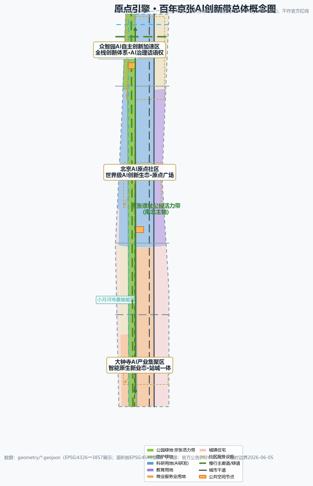
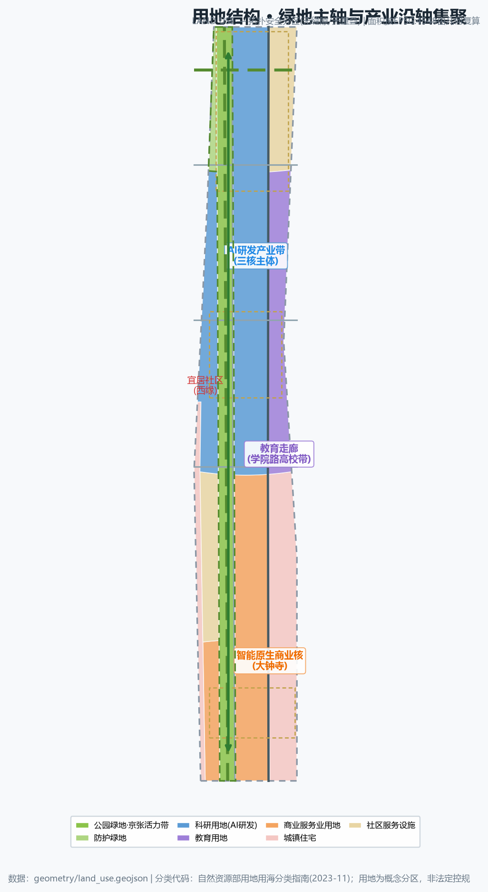
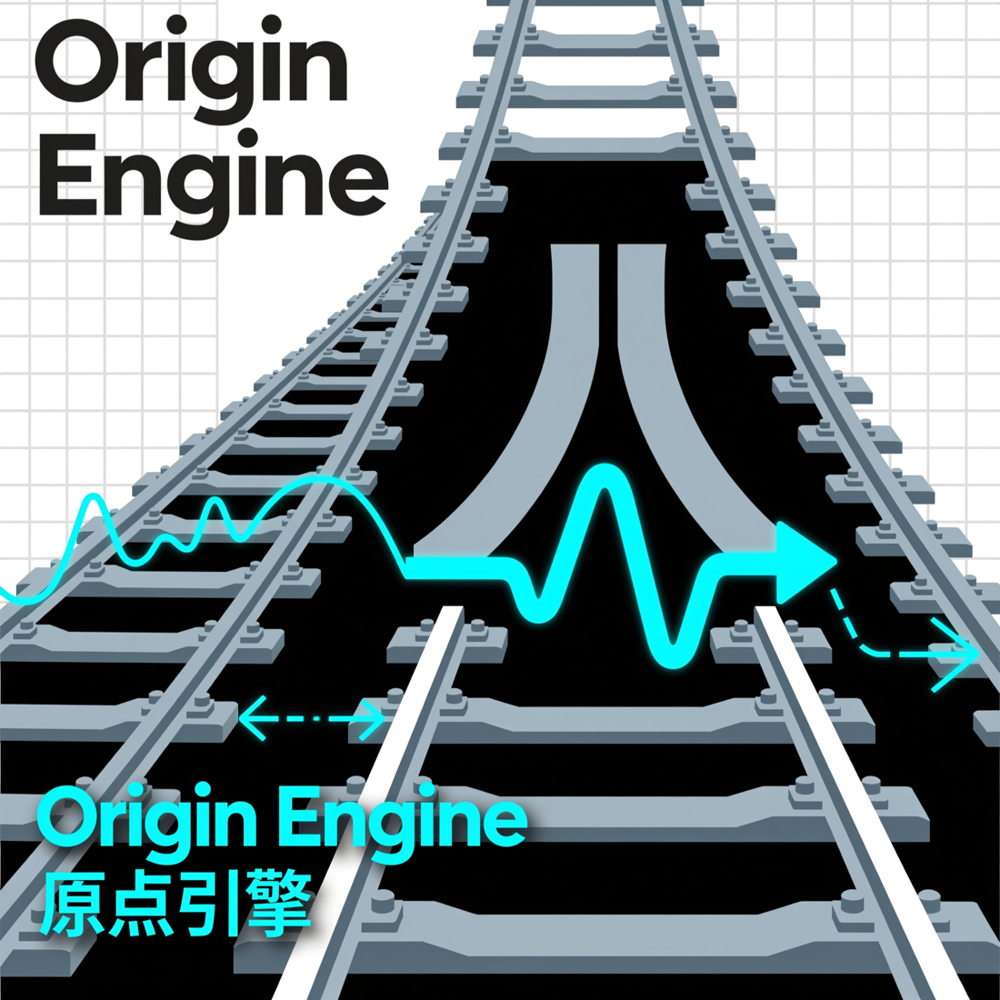
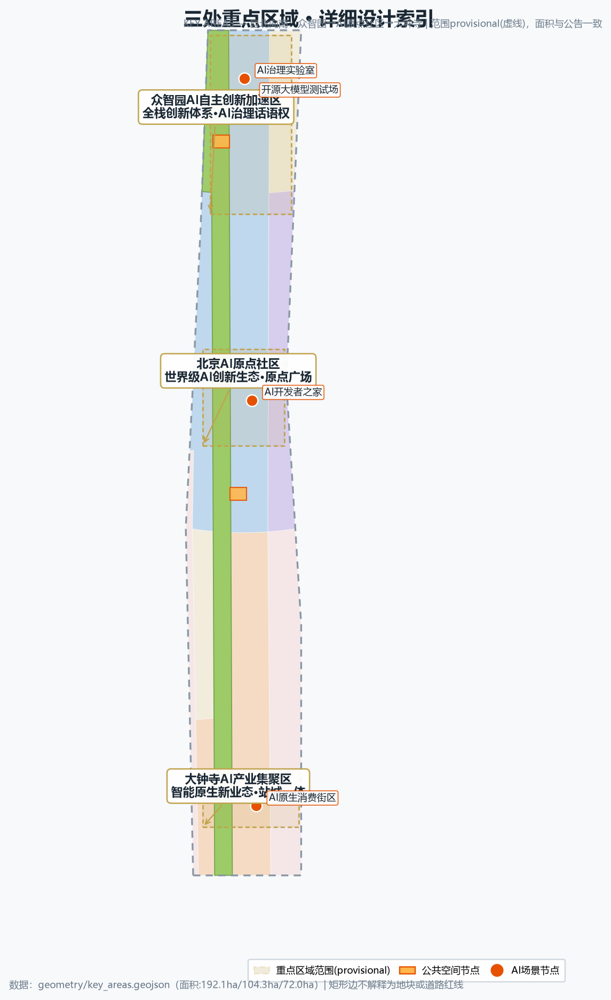
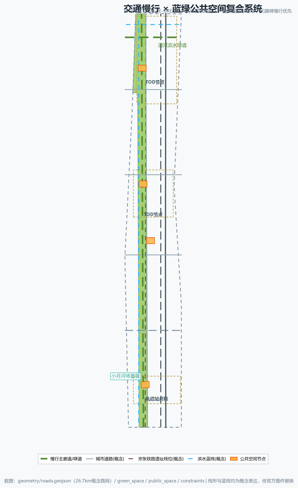
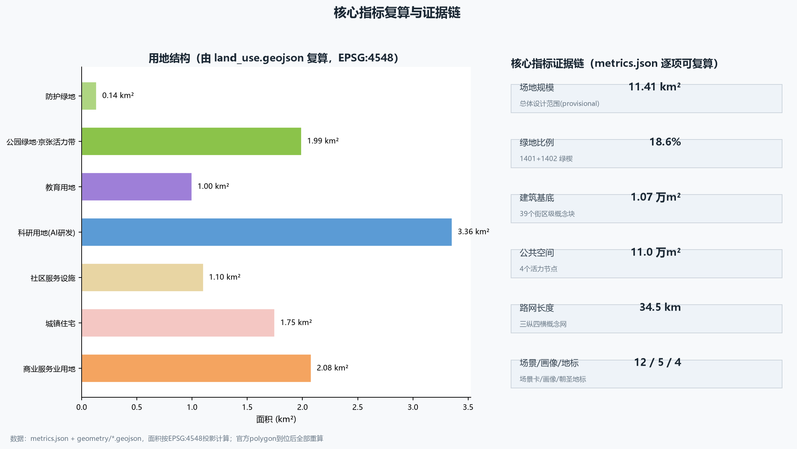

# Origin Engine — Centennial Jing-Zhang AI Innovation Belt Urban Design Concept Proposal

## One-Page Executive Summary

| Review question | Readable answer of this proposal | Primary verification entry |
| --- | --- | --- |
| Taskbook relevance | "Origin Engine" answers the three positionings and five functions; the three scopes, three areas & two wings and agent.1-6 are placed on the same "one axis, three cores, two wings" chain; regional synergy is a concept interface, not a commitment | compliance_matrix.json, three-scope narrative |
| Originality | Merges the century-old Jing-Zhang railway origin with the Zhongguancun AI origin into one power axis; 12 scenario cards, 4 pilgrimage landmarks and the Origin Season operation form a reviewable loop | Coordinated research chapter, design_depth_matrix.json |
| AI & planning innovation | Every AI scenario is bound to a spatial node, privacy boundary, human review and non-AI fallback; it does not replace planning, medical or legal decisions | AI scenario chapter, standard_matrix.json |
| Implementability | Three-phase delivery plus a first-90-day low-regret path: public space and ordinary-service base first, then controlled testing, then expansion; every step has stop and rollback | phasing.geojson, implementation chapter |
| Public interest | All five personas keep paper, human and account-free paths; elderly accessible kiosks include on-site human fallback | persona table, accessibility standard response |
| Risk & compliance | Provisional boundaries and missing regulatory indicators are never upgraded to official redlines or approval conclusions; all spatial suggestions are concept-level | sources.json, assumptions.json, risk chapter |
| Completeness | Chinese master + English translation, five review figures, A3/A0 drawings, offline HTML, reproducible metrics and three matrices share one scope | manifest.json, metrics.json |

Every answer above can be verified back to structured files: the narrative is the primary plan, machine evidence lives in GeoJSON, matrices and self-check results [source:SOURCE-REGISTRY] [depth:metrics_recalculation].

## Design Basis and Source List

This is an AI-agent concept proposal for the "Centennial Jing-Zhang AI Innovation Belt International Urban Design Open Call". It is an open co-creation suggestion and does not replace formal planning or constitute a government-approved conclusion [source:OFFICIAL-ANNOUNCEMENT] [source:AGENT-TASKBOOK]. All spatial recommendations are concept suggestions or reference schemes for professional teams to deepen; statutory judgments such as FAR, building height, retain/renovate/demolish decisions and road redlines are treated as "pending official data" and are not concluded [standard:MOHURD-CONTROL-DETAILED-PLANNING].

The design basis comprises four categories:

- **Official announcement and taskbook**: the pre-qualification announcement (2026-05-09, Beijing Municipal Commission of Planning and Natural Resources, Haidian Branch) providing project name, three scope levels, area values, three key areas and design tasks; and the agent open-call taskbook (2026-05-18) providing three positionings, five functions, three areas and two wings, six mandatory tasks and co-creation principles [source:OFFICIAL-ANNOUNCEMENT] [source:AGENT-TASKBOOK].

- **Professional standards**: local snapshots of the MOHURD Urban Design Measures, regulatory detailed planning rules, MNR land-use classification guide, Barrier-Free Environment Law and Generative AI Interim Measures [standard:MOHURD-URBAN-DESIGN-MEASURES] [standard:BARRIER-FREE-ENVIRONMENT-LAW] [standard:GENERATIVE-AI-INTERIM-MEASURES].

- **Spatial data**: repository-maintained provisional rough boundary polygons (three scopes plus three key areas), calibrated to announced text limits and areas in EPSG:4548; labeled `provisional_constraint`, not an official redline, approval basis or precise-area basis [data:geometry/site_boundary.geojson#SITE-001] [source:BOUNDARY-SOURCE].

- **Derived design data**: land-use partition, building footprints, road network, blue-green spaces and phasing generated for this proposal, all reproducible from `geometry/*.geojson` and `metrics.json` [depth:land_use_layout] [depth:metrics_recalculation].

Official polygons, regulatory-plan indicators, existing building stock and ownership, heritage protection lines and road redlines are not public in the site package and are listed as data gaps in the assumptions and risk chapters; they do not block content scoring, but precise area and professional scoring await official data [source:PROCESSED-FACT-PACK] [assumption:A-BOUNDARY-001].

This proposal first judges "what the material can support", then "how the space can be designed"; each evidence class only carries the weight its authority allows, and registration completeness never upgrades a source's permitted use.

| Evidence level | Instance in this package | Can support | Cannot support |
| --- | --- | --- | --- |
| Tasks & professional standards (formal) | Official announcement, cleared taskbook, planning & regulatory standard snapshots | Task requirements, deliverable depth, professional principles, review questions | Official polygons, ownership, engineering conditions, approvals or government commitments |
| Cleared source registry | `sources.json`, `data/source_registry.json` | Source use, mechanism comparison, attribution duties, prohibited uses | Upgrading background material into Haidian implementation facts or spatial conclusions |
| Provisional spatial basis | `site_boundary.geojson`, `key_areas.geojson`, `constraints.geojson` | Concept generation, topology self-check, relative relations, replacement triggers | Statutory redlines, parcel ownership, precise areas, road redlines or regulatory indicators |
| Derived design data in package | GeoJSON, `metrics.json`, three matrices and self-check | Reproducible concept structure, quantities, node actions, phasing dependencies | Existing survey, facility capacity, on-site performance, public acceptance or building permits |

Review rule: formal conclusions must return to formal sources; provisional and background material keeps its original status, and any local self-check PASS never becomes on-site evidence, a professional seal or an approval conclusion [source:SOURCE-REGISTRY] [standard:MOHURD-CONTROL-DETAILED-PLANNING].

## Three-Level Scope Framework

The proposal follows the announced three-level framework, progressively implementing industrial strategy, overall urban design and key-area detailed design [source:OFFICIAL-ANNOUNCEMENT] [depth:three_level_scope_framework]:

1. **Coordinated research area (43.6 km²)**: bounded by the 5th Ring Road north, Jingzang Expressway east, Xizhimenwai Street south and Wanquanhe Road west. Used for AI ecosystem, three-areas-two-wings regional synergy, future urban form and global innovation network studies; outputs are industrial maps and ecosystem diagrams, not statutory drawings [metric:coordinated_research_area_sqm].

2. **Overall design area (11.4 km²)**: the submitted `site_boundary.geojson`, a provisional rough boundary formed from the announced text limits and the ~11.4 km² area constraint [data:geometry/site_boundary.geojson#SITE-001]. Land-use layout, renewal framework, transport/municipal systems, blue-green spaces and character control are developed here at a concept level of regulatory-depth urban design [depth:overall_spatial_structure] [metric:site_area_sqm].

3. **Key detailed design area (368.4 ha)**: from north to south, the Zhongzhiyuan AI Acceleration Area, the Beijing AI Origin Community and the Dazhongsi AI Industry Cluster, each developed as a readable mini-scheme of "positioning + spatial structure + building renewal + traffic/slow mobility + public space + AI scenarios + implementation risks" [metric:key_detailed_design_area_sqm] [metric:key_area_count] [depth:three_key_area_detailed_design]. Areas of the three key areas are recorded at [metric:zhongzhiyuan_ai_acceleration_area_sqm] [metric:beijing_ai_origin_community_sqm] [metric:dazhongsi_ai_industry_cluster_sqm].

The provisional boundary serves AI generation, visualization and discussion only. When official polygons arrive, the land-use partition, building footprints, metrics and drawings must be fully recalculated [assumption:A-BOUNDARY-001].

## Coordinated Research Area: Industry and Future City Research

### Overall Concept: "Origin Engine"

The Centennial Jing-Zhang Railway is the first trunk railway designed and built independently by China — the "origin of modern Chinese industry"; Zhongguancun is the cradle of China's high-tech industry and AI — the "origin of Chinese AI". The proposal adopts "Origin Engine" as the belt-wide concept: **Jing-Zhang is the Origin, AI is the Engine**. It argues that the cultural origin of the railway and the innovation origin of Zhongguancun overlap and excite each other along a 12 km urban belt, converting the linear historical structure of the railway heritage into an innovation power axis for the AI era [source:OFFICIAL-ANNOUNCEMENT] [source:AGENT-TASKBOOK].

- **Master name**: `原点引擎` / Origin Engine (concept name for the organizer and professional teams to evaluate).
- **Naming system**: the belt is "Origin Engine"; the three areas and two wings use the "Origin-X" series — Zhongzhiyuan "Origin-Stack" (full-stack), AI Origin Community "Origin-Core" (kernel), Dazhongsi "Origin-City" (city-level new business), Zhongguancun service wing "Origin-Finance" (factors), Xiaoyuehe scenario wing "Origin-Lab" (scenario lab) [depth:brand_identity].
- **Logo direction**: evolve the "herringbone" switchback alignment of the Jing-Zhang rails into two parallel rail lines connected by a circuit waveform, forming a "rail × waveform" identity; use a steel-grey × electric-blue dual-color system, extendable into wayfinding, paving and public furniture modules [depth:signage_system_direction].

### Three Positionings and Five Functions

Three positionings: **Centennial Jing-Zhang Culture Belt, Urban AI Life Experience Belt, AI Convergence Innovation Belt**. Five functions: **AI Full-Stack Independent Innovation System, World-Class AI Innovation Ecosystem, AI+ Scenario Empowerment Paradigm, Intelligent AI Vital City, Global Discourse on AI Governance**. Each function has spatial carriers and operation mechanisms across the three areas and two wings (see key-area and operation chapters) [source:AGENT-TASKBOOK].

### Three Areas, Two Wings, One Synergy Loop

With the Jing-Zhang Heritage Park vitality axis as the north-south spine, the three key areas as engine nodes, and the Zhongguancun technology-service wing (factor globalization, Zhongguancun IP and capital) and the Xiaoyuehe scenario-empowerment wing (AI scenarios and vital city) as supports, the scheme forms an "**Origin–Acceleration–Agglomeration**" industrial progression loop and a "**Capital–Scenario–Talent**" factor loop [source:AGENT-TASKBOOK] [depth:overall_spatial_structure].

### Global AI Innovation Ecosystem Cases (5-8)

1. **Palo Alto, Silicon Valley**: university-capital-talent symbiosis; insights into seamless university-community innovation interfaces.
2. **Cambridge Science Park, UK**: university lab to enterprise incubation corridor; insights into a continuous "education–research–industry" land spectrum.
3. **one-north, Singapore**: mixed use, walkability, round-the-clock vitality; insights into public-space density combining work, life and exchange.
4. **Pangyo Techno Valley, Korea**: government-guided R&D clusters with test environments; insights into institutionalized "test-validation scenarios".
5. **Austin, Texas, USA**: festivals combined with tech talent attraction; insights into "event system as city brand".
6. **Shenzhen Bay Science & Technology Ecological Park**: parks opening into urban public space; insights into urbanized park interfaces.
7. **Marunouchi, Tokyo**: century-old district continuous renewal operation; insights into long-term brand assets and owner coordination.
8. **West Bund, Shanghai**: waterfront renewal pairing culture belt and tech belt; insights into coupling cultural narrative with industrial carriers.

These are public-knowledge reference summaries for design reasoning, not investment or policy facts [source:AGENT-TASKBOOK] [assumption:A-ECONOMIC-001].

### Taskbook → Space → Acceptance Deliverable

Each of the six agent tasks lands on the same "space-operation-deliverable" chain, so reviewers can verify row by row instead of reading slogans [source:AGENT-TASKBOOK].

| Taskbook requirement | Space–operation translation in this proposal | First-phase acceptance deliverable |
| --- | --- | --- |
| agent.1 Overall concept and functional coordination | Origin Engine naming system, Origin-X series, rail × waveform logo direction, one-axis-three-cores-two-wings structure | Naming table, logo concept figure, overall structure diagram |
| agent.2 Full-stack system and innovation ecosystem | 5-8 global cases, six-factor ecosystem map, Zhongzhiyuan full-stack R&D, Zhongguancun service-wing mechanisms | Case table, ecosystem map, industry-space mapping |
| agent.3 Scenario empowerment and vital city | 12 scenario cards, 5 personas, scenario-space-operation matrix, Xiaoyuehe scenario wing | Scenario protocol table, persona table, scenario matrix |
| agent.4 Public space and new business | 4 AI pilgrimage landmarks, public-space components, Dazhongsi AI-native consumption | Landmark catalog, public-node layers, component library |
| agent.5 Cultural narrative | Origin narrative linking centennial Jing-Zhang, Zhongguancun and AI new culture; signage symbol system | Cultural narrative chapter, wayfinding direction, international message |
| agent.6 Event system and long-term operation | Origin Season four-season events, Origin Developer Club, scenario "test-then-roll-out" | Event system, operation mechanisms, conversion path |

## Overall Design Area: Urban Renewal and Regulatory-Plan-Level Urban Design

### Overall Spatial Structure: "One Axis, Three Cores, Two Wings; Stitch East-West, Connect North-South"

- **One axis**: the Jing-Zhang Heritage Park vitality axis (north-south spine) expressed by `green_space.geojson`, connecting the three cores and hosting slow mobility, blue-green systems, cultural display and AI experiences [data:geometry/green_space.geojson#GREEN-001] [metric:green_ratio].
- **Three cores**: Zhongzhiyuan (north), AI Origin Community (center), Dazhongsi (south), expressed by `key_areas.geojson` [data:geometry/key_areas.geojson#PROV-KEY-001] [data:geometry/key_areas.geojson#PROV-KEY-002] [data:geometry/key_areas.geojson#PROV-KEY-003].
- **Two wings**: the Zhongguancun technology-service wing (east, Xueyuan Road innovation corridor) and the Xiaoyuehe scenario-empowerment wing (west, Xiaoyuehe waterfront scenario belt).
- **Stitch and connect**: the park belt stitches the two sides of the former railway; north-south greenways and slow systems connect Wudaokou to Dazhongsi, achieving "east-west stitching and north-south connection" [standard:MOHURD-URBAN-DESIGN-MEASURES].

### Land-Use Layout

The land-use partition derives from a topology-safe polygonization of the site boundary (no gaps, no overlaps; union 11,412,847 m² vs site 11,412,825 m²) [data:geometry/land_use.geojson] [metric:land_use_area_0804_sqm]:

| Code | Use | Area (m²) | Share | Design logic |
|---|---|---|---|---|
| 1401 | Park green space (Jing-Zhang vitality belt) | 1,991,800 | 17.5% | Main axis and stitching medium |
| 1402 | Buffer green space | 136,108 | 1.2% | North gateway green wedge |
| 0802 | Research land (AI R&D) | 3,355,987 | 29.4% | Main industry body of the three cores |
| 0804 | Education land | 998,923 | 8.8% | Xueyuan Road university corridor |
| 05 | Commercial service land | 2,078,777 | 18.2% | Dazhongsi AI-native new business |
| 0701 | Urban residential land | 1,749,152 | 15.3% | Livable and talent communities |
| 0702 | Community service land | 1,102,095 | 9.7% | 15-minute living circle facilities |

Layout logic: **green main axis first** (continuity of the vitality belt), **industry clustered along the axis** (research east of the green axis, commerce toward the south core), **education corridor preserved and strengthened** (university belt), **residential communities embedded in the green network** (west and east edges within a 5-minute walk of the park belt) [depth:land_use_layout] [standard:MNR-LAND-USE-CLASSIFICATION].

### Building Scale and Retain/Renovate/Demolish Logic

- 262 block-scale concept footprints totaling 1,070,482 m² illustrate industrial blocks, communities and station complexes [data:geometry/buildings.geojson] [metric:building_footprint_area_sqm].
- **Retain/renovate/demolish principle (directional)**: prioritize retention of universities, research institutes, rail transit stations and historic buildings; use "micro-renewal + function replacement" along both sides of the park belt; only propose "upgrade" for inefficient industrial space and dead-end parcels; parcel-level conclusions require official survey data [assumption:A-EXISTING-001].
- FAR and building height are statutory indicators absent from the package and are listed as pending confirmation without numeric conclusions [metric:floor_area_ratio] [metric:building_height_m] [assumption:A-CONTROLS-001].

### Urban Renewal Framework and Implementation Policy (Concept)

Three renewal categories: **industrial function renewal** (function replacement of inefficient buildings in research land), **public-space renewal** (park nodes, plazas, slow-mobility gap closure) and **community quality renewal** (filling public service facilities in old neighborhoods). Policy suggestions — project-list management, public-space-first consultation, AI scenario "test-then-roll-out" — are expressed as deepening directions, not confirmed arrangements [standard:MOHURD-URBAN-DESIGN-MEASURES] [depth:renewal_project_list].

## Detailed Design of Key Areas

### 1. Zhongzhiyuan AI Acceleration Area (north, ~192.1 ha)

- **Positioning**: core carrier of the AI full-stack independent innovation system and global discourse on AI governance [source:AGENT-TASKBOOK].
- **Spatial structure**: Qinghe waterfront green wedge as the north edge, forming "full-stack innovation core + test field + youth community" clusters along the north-south axis [data:geometry/key_areas.geojson#PROV-KEY-001].
- **Building renewal**: research land dominant; concept footprints east of the green axis; suggest retaining existing research institutes and factory silhouettes, converting to full-stack R&D, computing services and test labs [depth:retain_renovate_demolish].
- **Traffic and slow mobility**: TOD slow loop via the 5th-Ring connector and Qinghe greenway [data:geometry/roads.geojson#ROAD-004].
- **AI scenarios**: full-stack innovation showcase, AI governance lab, open-source large-model test field (one of three industry test scenarios).
- **Implementation risks**: Qinghe blue line/flood control and 5th-Ring traffic impact need official drawings [assumption:A-EXISTING-001].

### 2. Beijing AI Origin Community (center, ~104.3 ha)

- **Positioning**: the "kernel community" of a world-class AI innovation ecosystem and the Wudaokou innovation exchange center [source:AGENT-TASKBOOK].
- **Spatial structure**: "Origin Plaza" as the heart, with "community living room + R&D li-fang blocks + talent apartments + university interface" rings [data:geometry/key_areas.geojson#PROV-KEY-002] [data:geometry/public_space.geojson#PUBLIC-002].
- **Building renewal**: function replacement and facade micro-renewal; preserve the fine-grained university-adjacent fabric; add 24-hour open ground-floor innovation interfaces.
- **Traffic and slow mobility**: the 4th-Ring connector and slow main corridor meet here, forming a walk-first "car-free plaza" concept [data:geometry/roads.geojson#ROAD-006] [data:geometry/roads.geojson#ROAD-003].
- **AI scenarios**: AI developer home, open-source community station, AI+education lab, AI talent service port.
- **Implementation risks**: university ownership and old-community renewal coordination require multi-stakeholder work and ownership surveys [assumption:A-EXISTING-001].

### 3. Dazhongsi AI Industry Cluster (south, ~72.0 ha)

- **Positioning**: AI-native new business and an AI consumption-commerce destination [source:AGENT-TASKBOOK].
- **Spatial structure**: transit-oriented commercial core around Dazhongsi station with "station-city commercial core + AI consumption street + business service belt" [data:geometry/key_areas.geojson#PROV-KEY-003].
- **Building renewal**: commercial service land dominant; concept supports station overdevelopment and conversion of existing commercial stock into an "AI-native commerce lab".
- **Traffic and slow mobility**: Zhichun Road service belt meets the south end of the park belt [data:geometry/roads.geojson#ROAD-005].
- **AI scenarios**: AI-native consumption street, robot service station, autonomous shuttle test field (one of three industry test scenarios).
- **Implementation risks**: station integration and existing commercial ownership conversion need engineering and ownership review [assumption:A-CONTROLS-001].

## AI Innovation Ecosystem, Personas, and AI+ Scenarios

### Ecosystem Map (Concept)

Around six factors — **data, algorithms, computing, scenarios, talent, capital**: data (open and public data zones), algorithms (models and open-source communities), computing (edge and distributed nodes), scenarios (test-validation fields and AI scenario cards), talent (five profiles and talent service port), capital (Zhongguancun service wing investment mechanisms), expressed as a network diagram in `visual/index.html` [source:AGENT-TASKBOOK] [depth:industry_space_mapping].

### Five User Personas

1. **AI researchers/developers**: young tech talent seeking open-source communities, computing and test environments.
2. **AI founders/entrepreneurs**: need incubation, capital, scenario trials and international channels.
3. **University faculty and students**: need a seamless teaching-research-industry interface.
4. **Residents and elderly**: need accessible public services with human fallback [standard:BARRIER-FREE-ENVIRONMENT-LAW].
5. **Global visitors/international talent**: need cultural narrative, event systems and international services.

### 12 AI Scenario Cards (including 3 industry test-validation scenarios)

| # | Scenario | Location | Users | Data & privacy boundary | Human review | Suggested operator |
|---|---|---|---|---|---|---|
| 1 | Open-source large-model test field (industry test) | Zhongzhiyuan | Developers/institutions | De-identified public data; test data stays in-country | Test committee review | Joint laboratory |
| 2 | Autonomous shuttle test field (industry test) | Dazhongsi to Origin Community | Operators/residents | Minimal on-board data; fully shutdown-able | Traffic + operator dual review | Test operation alliance |
| 3 | AI-assisted medical diagnosis experience (industry test) | Origin Community health station | Residents/patients | Patient data stays in hospital; informed consent | Licensed physician review | Hospital-enterprise consortium |
| 4 | AI+education personalized learning pod | University interface | Faculty/students | Local learning data; parent query | Teacher confirmation | University-enterprise |
| 5 | AI+legal public consultation kiosk | Community facilities | Residents | Anonymous consultation; no personal data stored | Licensed lawyer review | Legal aid + law firms |
| 6 | AI+life-service robot station | Dazhongsi district | Residents/visitors | Immediate blurring of visual data | On-site property staff | Property + robot service |
| 7 | Unmanned delivery and micro-hub | Zhongzhiyuan & communities | Residents | De-identified route data | Courier fallback | Delivery platforms |
| 8 | AI city-brain display cabin | Origin Plaza | Public | Aggregated indicators only | Operation manual review | City operation platform |
| 9 | AI+culture guide (Jing-Zhang narrative) | Park vitality belt | Visitors | Instant discard of location data | Content review | Culture & tourism company |
| 10 | AI accessible service kiosk (elderly) | All public nodes | Elderly | No identity collection; voice-first [standard:BARRIER-FREE-ENVIRONMENT-LAW] | On-site human fallback [standard:ELDERLY-SMART-TECH-PLAN] | Community + volunteers |
| 11 | AI governance lab and hearing simulation | Zhongzhiyuan | Public/institutions | Simulated data; non-binding conclusions | Governance committee | University + think tank |
| 12 | AI+exercise health-monitoring track | Xiaoyuehe wing | Residents/athletes | Anonymous aggregated exercise data | Operation inspection | Sports operator |

All scenario cards follow the generative-AI compliance baseline: traceable generated content, timely handling of unlawful content, complaint channels; no privacy collection, no over-surveillance, and technologies not yet maturely validated are not described as fully deployable [standard:GENERATIVE-AI-INTERIM-MEASURES] [assumption:A-AI-001]. The scenario-space-operation mapping is in the `visual/index.html` scenario matrix.

### Operation Protocols for the 3 Industry Test-Validation Scenarios

The three industry test cards are upgraded into pauseable, reproducible and withdrawable operation protocols: each test binds a non-AI control path, a single primary metric and non-negotiable stop conditions; all are currently concept protocols, not executed, and do not imply approved operation [standard:GENERATIVE-AI-INTERIM-MEASURES].

| Test scenario | Same-task non-AI control | Single primary metric | Non-negotiable stop conditions | Current status |
| --- | --- | --- | --- | --- |
| Open-source large-model test field | Human review panel on the same frozen question set | Sourced and correctly-bounded outputs / frozen questions | Stop if output lacks sources, data leaves boundary, or human takeover unavailable | Concept protocol, not executed |
| Autonomous shuttle test field | Human shuttle service or static guidance on the same route | Collision-free, in-boundary, emergency-stoppable tasks / approved tasks | Stop on any collision, boundary breach, e-stop failure or broken takeover chain | Concept protocol, not executed |
| AI+medical diagnosis experience | Manual triage path for the same symptoms | Recommendations matching licensed-physician conclusions / test cases | Stop on any misdiagnosis signal, missing informed consent, or unavailable physician review | Concept protocol, not executed |

Protocols also require: lock the non-AI baseline, time window, affected population and sampling frame before testing; keep paper and human equivalent paths during testing; publish version, sources, limitations and stop records afterwards. If any key condition is missing, return to ordinary services without scaling [standard:BARRIER-FREE-ENVIRONMENT-LAW].

## Land Use, Building Scale, and Retain-Renovate-Demolish Strategy

The land-use structure and retain/renovate/demolish logic are given in the "Overall Design" chapter; here the indicator chain and design intent are added: site area 11,412,825 m²; green (1401+1402) 2,127,908 m² / 18.6%; research (0802) 3,355,987 m² / 29.4%; commerce (05) 2,078,777 m² / 18.2% [metric:site_area_sqm] [metric:green_ratio] [metric:land_use_area_1401_sqm]. Education (0804) 998,923 m² / 8.8%; residential (0701) 1,749,152 m² / 15.3%; community service (0702) 1,102,095 m² / 9.7%, with per-code areas at [metric:land_use_area_0802_sqm] [metric:land_use_area_0804_sqm] [metric:land_use_area_0701_sqm] and the remainder at [metric:land_use_area_0702_sqm].

All shares are reproducible block-by-block from `land_use.geojson`, and the partition is topology-safe with no gaps or overlaps; buffer and commerce areas are recorded at [metric:land_use_area_1402_sqm] [metric:land_use_area_05_sqm], while residential and community-service areas are recorded at [metric:land_use_area_0701_sqm] [metric:land_use_area_0702_sqm]. Total coverage is recorded at [metric:land_use_total_area_sqm] [data:geometry/land_use.geojson] [depth:land_use_layout].

Building scale is expressed as 262 block-scale concept footprints totaling 1,070,482 m², laid out on the principle "research east of the green axis, commerce toward the south core, residential embedded in the green network"; footprints are spatial-supply illustrations, not statutory floor-area or FAR conclusions [data:geometry/buildings.geojson] [metric:building_footprint_area_sqm]. Retain/renovate/demolish is directional: universities, research institutes, rail stations and historic buildings are prioritized for retention, both sides of the park belt use "micro-renewal + function replacement", and only inefficient industrial space is proposed for upgrade; parcel-level conclusions require official survey and ownership data, which this proposal does not provide [assumption:A-EXISTING-001]. Statutory controls — FAR, height, density, green ratio, setback — are absent from the package and listed as pending official data without numeric conclusions [metric:floor_area_ratio] [metric:building_height_m] [assumption:A-CONTROLS-001].

## Transport, Rail, Municipal Infrastructure, and Public Services

- **Roads and slow mobility**: three north-south corridors (Xueyuan Road innovation corridor, vitality-axis service road, park slow main corridor) plus four east-west connectors (Qinghe greenway, Zhichun Road, 4th Ring, Zhongzhiyuan connector), concept network ~34.5 km [data:geometry/roads.geojson] [metric:road_network_length_m]. Slow mobility is prioritized in the park belt with an accessible continuous cross-section [standard:BARRIER-FREE-ENVIRONMENT-LAW].
- **Rail and station integration**: existing stations (including Dazhongsi) as TOD nodes with 300-500 m mixed-use circles; alignments and station works await engineering review [assumption:A-CONTROLS-001].
- **Municipal and new infrastructure**: concept directions for distributed energy, edge computing co-trenched with utilities, and full 15-minute living-circle public services; no engineering-feasibility conclusions [depth:municipal_new_infrastructure].

## Blue-Green Network, Public Space, and Urban Character

- **Blue-green system**: the Jing-Zhang Heritage Park vitality axis (1401 green, 1,991,800 m²; incl. the north gateway wedge 2,127,908 m² total) as the north-south spine, with the Qinghe greenway and Xiaoyuehe scenario wing as east-west wings — a "one axis, two wings" blue-green skeleton [data:geometry/green_space.geojson] [data:geometry/roads.geojson#ROAD-004] [metric:green_space_area_sqm].
- **Public-space nodes**: four concept plazas — Jing-Zhang AI North Gateway Plaza, AI Origin Community Central Plaza, Dazhongsi AI Consumption Plaza, Wudaokou Innovation Exchange Node [data:geometry/public_space.geojson] [metric:public_space_area_sqm].

- **AI pilgrimage landmarks (4)**: (1) **Origin Monument** (AI Origin Community) — commemorative public art and honor wall co-locating the railway origin and the AI origin [depth:landmark_catalog]; (2) **Open-Source Milestone Plaza** (Zhongzhiyuan) — a "contributor wall" and honor display system recording key Chinese open-source milestones [depth:honor_display_system]; (3) **AI Star Avenue** (park belt) — annual AI-achievement light bricks along the former rail alignment; (4) **Dazhongsi AI Consumption Dome** — an AI-native commerce and display destination. Landmarks are concepts; construction requires compliance with heritage, green-line, blue-line and traffic-safety constraints, and must avoid over-entertainment [source:AGENT-TASKBOOK] [assumption:A-EXISTING-001].
- **Character control**: a "steel-grey × electric-blue" dual-color system unifies wayfinding and public furniture; buildings along the axis use continuous interfaces and stepped massing; all character control is conceptual [depth:height_massing_character] [standard:MOHURD-URBAN-DESIGN-MEASURES].

## Renewal Projects, Implementation Policy, and Phasing

### Renewal Project List (Concept)

1. Jing-Zhang Heritage Park vitality axis connection project (axis);
2. Zhongzhiyuan full-stack innovation core cluster (phase 2);
3. AI Origin Community living room and plaza (phase 1);
4. Dazhongsi station-city commercial core (phase 1);
5. Xueyuan Road innovation corridor interface renewal (phase 3);
6. Xiaoyuehe scenario-empowerment belt (phase 3);
7. 15-minute living-circle gap-filling program (phase 3).

### Phasing

- **Phase 1** (~704 ha, Origin Community and Dazhongsi pilot): public space first — Origin Plaza, consumption plaza, mid-section of the vitality belt and AI test scenarios [data:geometry/phasing.geojson#PHASE-001] [metric:phasing_area_phase_1_sqm].
- **Phase 2** (~176 ha, Zhongzhiyuan): full-stack R&D clusters and test fields [data:geometry/phasing.geojson#PHASE-002] [metric:phasing_area_phase_2_sqm].
- **Phase 3** (~262 ha, east-west wings): whole-belt quality improvement and operation deepening [data:geometry/phasing.geojson#PHASE-003] [metric:phasing_area_phase_3_sqm].

The three phases together cover the whole site [metric:phasing_total_area_sqm], cross-checking against the land-use partition [metric:land_use_total_area_sqm].

### First-90-Day Low-Regret Path (Concept)

To avoid "plan-to-launch at scale" immediately, a first-90-day recommended sequence is proposed following low-cost trial-and-error logic; it is not a confirmed implementation schedule, and if any key condition is missing the work returns to ordinary public services [assumption:A-ECONOMIC-001] [assumption:A-CONTROLS-001].

1. **Days 0-30: materials and site lock-down.** Lock the official/provisional geometry version, on-site baseline, rights and responsible-party list; if any key input is missing, stay "pending official data" without advancing design conclusions.
2. **Days 31-60: ordinary-service base.** First provide physical wayfinding, paper maps, human counters, seating/shade and a continuous accessible task chain; ordinary paths do not wait for model recovery [standard:BARRIER-FREE-ENVIRONMENT-LAW].
3. **Days 61-90: controlled test window.** Only after base evidence is complete, start one attended, time-limited, e-stop-capable, human-takeover test window; any unclosed safety, rights or data issue stops the test and restores passive services [standard:GENERATIVE-AI-INTERIM-MEASURES].

### Global AI Event System and Long-Term Operation (Concept)

- **Annual event system**: an "Origin Season" brand with spring open-source conference, summer AI carnival, autumn industry summit and winter developer bootcamp [source:AGENT-TASKBOOK] [depth:annual_event_system].
- **Developer community**: an "Origin Developer Club" with open-source contribution points, co-creation workshops and bi-weekly Demo Days [depth:developer_community_operation].
- **Scenario open operation**: a "scenario open list + test sandbox + test-then-roll-out" mechanism; enterprises apply for test scenarios on the list and an operation committee reviews [depth:scenario_open_operation].
- **International communication and conversion**: "Origin Engine" international narrative, AI pilgrimage routes and developer tours build brand assets; all are operation-mechanism suggestions, not confirmed government arrangements or investment commitments [assumption:A-ECONOMIC-001].

## Metrics, Area Recalculation, and Compliance Matrix

Core indicator chain (all reproducible from `metrics.json` and `geometry/*.geojson`) [depth:metrics_recalculation]:

- **Site scale**: overall design area 11,412,825 m²; coordinated research area 43.6 km²; key areas 368.4 ha total [metric:site_area_sqm] [metric:coordinated_research_area_sqm] [metric:key_detailed_design_area_sqm].

- **Land-use structure**: green ratio 18.6% (incl. buffer wedge), research 29.4%, education 8.8%, commerce 18.2%, residential 15.3%, community service 9.7% [metric:green_ratio] [metric:land_use_total_area_sqm].

- **Space supply**: concept building footprints 1.070 million m² (262 buildings); public-space nodes 110,175 m² / 1.0% of site [metric:building_footprint_area_sqm] [metric:public_space_area_sqm] [metric:public_space_ratio]; road network 34.5 km [metric:road_network_length_m].

- **Task coverage**: 12 scenario cards (incl. 3 test-validation), 5 personas, 4 AI pilgrimage landmarks, full coverage of the 6 agent tasks, itemized in `compliance_matrix.json` [metric:scenario_card_count] [metric:persona_class_count] [metric:ai_pilgrimage_landmark_count].
- **Standards and depth**: 9 professional standards answered in `standard_matrix.json`; 15 design-depth items all `complete` in `design_depth_matrix.json`.
- **Pending**: statutory controls (FAR, height, density, green ratio, setback) await official regulatory-plan conditions [metric:floor_area_ratio] [metric:building_height_m] [assumption:A-CONTROLS-001].

## Risk, Copyright, and Compliance

- **Data legality**: only the announcement, taskbook, public standard snapshots and repository-provided/cleared data are used; no non-public drawings, internal data or personal privacy [source:PROCESSED-FACT-PACK].
- **Copyright**: this proposal is AI-generated; text and original concepts (naming, logo direction, structural diagrams) are displayed under the repository license; no unauthorized trademarks, fonts, images, portraits or corporate marks are included; full statement in `report/copyright_statement.md`.
- **AI generation responsibility**: generation method (model, version, collaboration) is disclosed in `agent.json`; all spatial conclusions are concept suggestions, not approved conclusions [assumption:A-AI-001].
- **Compliance baseline**: AI scenarios follow the applicable scope of the Generative AI Interim Measures and the Barrier-Free Environment Law; no over-surveillance, privacy violation or scenarios without human review [standard:GENERATIVE-AI-INTERIM-MEASURES] [standard:BARRIER-FREE-ENVIRONMENT-LAW].
- **Pending data**: official polygons, regulatory-plan indicators, existing building/ownership data, heritage lines and redlines, municipal engineering conditions; all metrics and drawings must be recalculated when supplied [assumption:A-CONTROLS-001] [assumption:A-BOUNDARY-001].
- **Professional review**: requires deepening by urban planning, transport, municipal, heritage and AI-compliance teams [depth:risk_missing_data].

## References

Primary materials (complete machine index in `sources.json`, `standard_matrix.json` and `design_depth_matrix.json`; this list is the human-readable summary, with legitimacy basis per [source:SOURCE-REGISTRY]):

1. Beijing Municipal Commission of Planning and Natural Resources, Haidian Branch: pre-qualification announcement of the Centennial Jing-Zhang AI Innovation Belt International Urban Design Open Call (2026-05-09).
2. Organizer: agent open-call taskbook for the Centennial Jing-Zhang AI Innovation Belt urban design (2026-05-18, cleared text).
3. MOHURD: Urban Design Management Measures (2017).
4. MOHURD: regulatory detailed planning preparation and approval measures and related documents.
5. Ministry of Natural Resources: Guidelines for Land and Sea Use Classification for Territorial Spatial Survey, Planning and Use Control (trial) (2023-11).
6. NPC Standing Committee: Barrier-Free Environment Construction Law of the PRC (adopted 2023-06-28, effective 2023-09-01).
7. CAC et al.: Interim Measures for the Management of Generative AI Services (issued 2023-07-13).
8. State Council General Office: Implementation Plan for Effectively Solving the Difficulties of the Elderly in Using Smart Technology (Guobanfa [2020] No. 45).
9. Repository maintainers: provisional boundary derivation note for the Centennial Jing-Zhang AI Innovation Belt (provisional_boundaries_basis.md, 2026-06-05).
10. Public reports on the Jing-Zhang Railway Heritage Park, Zhongguancun and Haidian AI industry development (background reference).
