# JING-ZHANG CITY COMMISSIONING BELT
## A CIVIC AI OVERLAY FOR THE AI-NATIVE CITY
### Urban Planning and Real-World Innovation for the AI Era

**GOOD CITY FIRST｜City life first**

**One-sentence proposal:** Jing-Zhang railway heritage forms the public-space spine; Haidian's innovation resources form the industrial and knowledge base; Zhongzhiyuan, AI Origin Community and Dazhongsi form an urban innovation chain from technical validation to civic application and planning translation. Urban design leads, while AI enters as an adaptable layer for public space, services and renewal.

The Jing-Zhang public spine links heritage, innovation, neighborhood life and renewal into a continuous, walkable and shareable public corridor that can shift between everyday and event states. The Civic AI Overlay brings AI-related spatial objects, service areas, resource capacity, operating conditions, responsible parties and dynamic-maintenance interfaces into planning. Compute / Power / Water provides the professional basis for matching tasks with urban resources in time and space; C0–C6 and the City Evidence Ledger provide validation, records and re-certification.

The three key areas have distinct urban roles: Zhongzhiyuan supports open innovation and urban validation, AI Origin Community carries real everyday living load, and Dazhongsi translates mature evidence into renewal rules for the existing city. Together they form:

**Technical validity → Civic validity → Planning validity.**

The conceptual design uses repository-maintained `provisional_rough` geometry as an open-call boundary for spatial relationships, area recalculation and consistency checks. The next stage connects it with official polygons, statutory controls, ownership, heritage and engineering information for coordinated review. [source:BOUNDARY-SOURCE] [standard:PROJECT-OFFICIAL-ANNOUNCEMENT]

## 01 | Vision

### 1. Jing-Zhang railway heritage: the public-space structure

Jing-Zhang railway heritage carries collective memory through a continuous linear space and provides a clear base for walking, cycling, accessibility, blue-green systems and east-west stitching. The railway's sequence of surveying, construction, trial operation and verification becomes an urban-design method: establish public space first, then introduce new capabilities.

### 2. Haidian innovation resources: the industrial and knowledge base

The Zhongguancun technology-service wing connects research, talent, intellectual property, professional services and innovation activity to the public spine. The Xiaoyue River scenario-enablement wing connects ecology, neighborhoods, municipal systems and everyday feedback to the innovation chain. Concentrated resources become walkable, participatory and legible urban space and public service.

### 3. Three key areas: from capability validation to planning translation

The three key areas carry one innovation chain at different urban scales: the open test environment produces technical evidence, the everyday neighborhood tests civic value, and the existing-city district turns mature evidence into maintainable renewal rules. The urban design therefore addresses spatial quality, lived experience, infrastructure adaptation and implementation together.

### No standard answer for a city

Cities are shaped by everyday life, institutions, infrastructure, memory and continued use. Human intelligence contributes values, experience, ethics, emotion and responsibility; silicon intelligence contributes sensing, simulation, coordination and learning. Together they serve everyday life, public value and long-term urban resilience. This proposal makes that collaboration legible through spatial structure, public services and a verifiable implementation path.

## 02 | Overall Urban Structure | One Spine · Three Key Areas · Two Wings · Many Nodes | Coordinated Research Area: Industry and Future City Research

The overall urban-design framework is:

- **One spine | Jing-Zhang Public Innovation Spine:** a continuous public-space structure based on railway heritage park, connecting walking, cycling, accessibility, blue-green systems, public services and the three key areas.
- **Three key areas | Zhongzhiyuan, AI Origin Community and Dazhongsi:** open validation, everyday living load, and existing-city renewal-rule translation.
- **Two wings | Zhongguancun technology-service wing and Xiaoyue River scenario-enablement wing:** research, professional services and innovation on one side; ecology, neighborhoods, municipal systems and lived feedback on the other.
- **Many nodes | heritage, innovation, neighborhood, stitching and event spaces:** public rooms, innovation foyers, stitching gates and open event fields create a network for staying, meeting and learning.

The structure follows a clear sequence: city life is established first, innovation is embedded next, and rules are maintained through evidence. The public spine provides continuity, the key areas provide differentiated urban functions, the two wings provide regional coordination, and the nodes provide everyday and event flexibility. [depth:overall_spatial_structure]

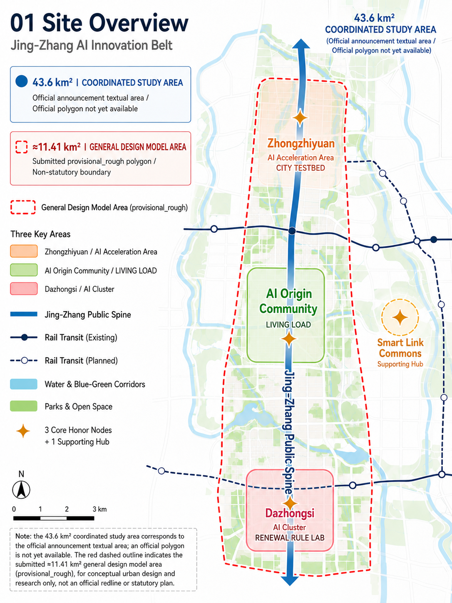

### START HERE | Reviewer guide

Follow this path from the urban-design subject to the technical and implementation interfaces (a reading guide, not an additional proposal layer):

1. **What kind of city is being designed?** Read 01/02 first: see how the railway-heritage public spine, three key areas, two wings and many nodes organize urban life.
2. **Why are the three key areas different?** Read 05: see how Zhongzhiyuan, AI Origin Community and Dazhongsi carry technical validation, everyday life and renewal-rule translation.
3. **How does AI enter urban planning?** Read 10: see how AI capability becomes six Civic AI Overlay planning controls.
4. **How does AI infrastructure land in the city?** Read 09: see how Compute / Power / Water matches tasks with resources and space.
5. **How is implementation staged?** Read 11/12: see how C0–C6, the City Evidence Ledger and NOW / NEXT / CONDITION-BASED create a validation and delivery rhythm.
6. **How is the evidence boundary maintained?** Read 11.3/13.3: see how the evidence ledger, provisional/source status and next-stage technical interfaces keep claims traceable.

## 03 | Three Scales and the Working Framework | Three-Level Scope Framework

### 43.6 km² coordinated research area | CITY SYSTEM

The 43.6 km² coordinated research area is the textual area stated in the official announcement. It studies relationships among AI research, industry, talent, public services, compute and energy, and real-world urban feedback, establishing the innovation-ecosystem and city-system framework. This city-system scale is expressed through the announced area and task relationships; the organizer has not supplied a corresponding official polygon, so 43.6 km² is not drawn as the current submitted geometry. [source:OFFICIAL-ANNOUNCEMENT]

### Approx. 11.4 km² overall design area | CITY COMMISSIONING DISTRICT

The overall design area uses the Jing-Zhang Heritage Park and surrounding urban fabric as its principal carrier. It locates the public spine, east-west stitching, active mobility and blue-green systems, AI-infrastructure interfaces, resilient municipal networks and existing-city renewal units. `geometry/site_boundary.geojson` feature `SITE-001` is marked `provisional_rough`; its area recalculates from the submitted polygon to about 11.41 km² as the conceptual design-model scale. The red dashed outline in the site overview indicates only this approx. 11.41 km² model area and is independent of the 43.6 km² textual coordinated research scale; it enters coordinated review with statutory boundaries, regulatory plans, ownership, heritage and engineering conditions and is not an approval basis. [data:geometry/site_boundary.geojson#SITE-001] [metric:site_area_sqm]

### Approx. 368.4 ha of three key areas | CITY LABS

Zhongzhiyuan, Beijing AI Origin Community and Dazhongsi respectively support open innovation and validation, real everyday living load, and renewal-rule translation. Their current boundaries serve area relationships and design expression, followed by coordinated review with statutory boundaries, ownership and specialist conditions. [data:geometry/key_areas.geojson#PROV-KEY-001] [metric:key_area_count]

The three scales create a working division of city-system coordination, overall urban design and key-area deepening: the upper scale coordinates resources and capability flows, the middle scale organizes the public spine and spatial structure, and the lower scale turns spatial prototypes, public services, building interfaces and renewal actions into implementable units. [depth:three_level_scope_framework]

### Regional Innovation Coordination | From Regional Position to Urban Capability Translation

Within the 43.6 km² textual coordinated research scale, Jing-Zhang serves as the planning interface through which regional capabilities enter the real city. Jing-Zhang takes **URBAN VALIDATION & PLANNING TRANSLATION INTERFACE** as its regional role, carrying the middle of **research supply → engineering translation → urban validation → civic application → evidence feedback → iteration**. External innovation capabilities become urban conditions that can enter public space, neighborhood life and existing-city renewal, while remaining complementary to research campuses, manufacturing bases and regional compute. The 43.6 km² figure remains a research-narrative scale; current spatial placement follows the approx. 11.41 km² `provisional_rough` overall design model and the three key-area geometries.

Regional coordination follows the working chain **real position → urban reception → scene interface → evidence settlement → planning translation → regional scaling**. Regional partners provide research, simulation, engineering, lived feedback and industry-network inputs; one spine, three key areas, two wings and many nodes provide spatial reception; scene validation and the City Evidence Ledger create traceable feedback; mature experience becomes spatial prototypes, public-service requirements, renewal rules and transferable methods. The table separates capability input, Jing-Zhang's role and output / feedback. It is a proposed planning interface for capability exchange and coordination; formal partnerships, funding, data-exchange agreements and government implementation mechanisms enter dedicated procedures after the relevant parties confirm them:

|Coordination interface|Capability input / scene|Jing-Zhang's existing role|Output / feedback|Existing system|
|---|---|---|---|---|
|Beiwei Community and surrounding Haidian communities|Resident needs, everyday-life feedback, all-age and accessibility scenes, education and health needs|Public-service prototypes and real-life scene validation|Service-prototype refinement, use feedback, inclusion and accessibility evidence|AI Origin Community LIVING LOAD / Xiaoyue River scenario-enablement wing|
|Future Science City|AI research outputs, models, toolchains and research-platform capacity|Scene testing from technical output to real urban application conditions|Urban-scene evidence, use conditions and feedback|Zhongzhiyuan CITY TESTBED / Research → Test|
|Huairou Science City|Scientific intelligence, simulation, research outputs and scientific data|Translation and validation of urban-application conditions|Urban validation evidence, applicable boundaries and feedback|Zhongzhiyuan CITY TESTBED / City Evidence Ledger|
|Beijing E-Town|Robotics, intelligent equipment, engineering translation and pilot manufacturing|Real-environment validation in streets, neighborhoods, public space and infrastructure|Product refinement, scene requirements and validation feedback|CITY TESTBED / Open Urban AI Plugfest|
|Beijing-Tianjin-Hebei coordination|Regional compute, industry networks, migratable computation and batch processing|Local interfaces for high-value, low-latency urban tasks|Task-scheduling needs, validation methods and transferable experience|Compute Matching / regional compute → shared district services → edge nodes|

The interfaces are organized around capability input, spatial capacity, service feedback and evidence return: research and simulation provide verifiable capabilities, engineering translation provides deployable conditions, the public spine and three key areas provide real users and urban fabric, and the City Evidence Ledger translates feedback into the next rule and pilot conditions. [source:AGENT-TASKBOOK]

### Four Regional Coordination Boards | From Spatial Relationship to Value Loop

The following four boards form a supplementary regional-coordination design layer. In sequence, they answer where regional capabilities come from, how they enter Jing-Zhang, which urban scenes receive them, and how they return as planning value. Arrows, distances and boundaries are used as planning diagrams; photo-like insets are consistently labeled **Representative Scenario Imagery**. Specific locations, distances, boundaries and points enter coordinated review against authoritative public sources and specialist studies at the next stage.

#### Board 1 | Regional Position and Coordination Pattern

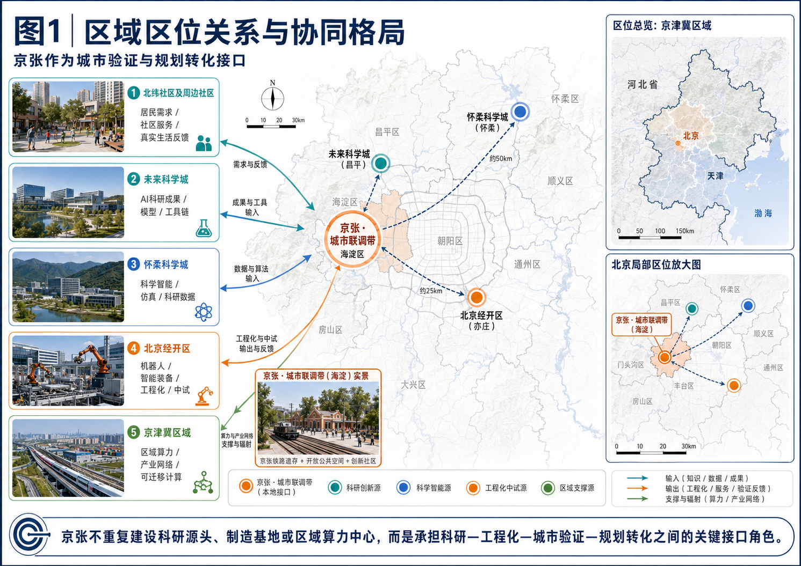

*Scene insets: Representative Scenario Imagery · Not Site-Condition Evidence.*

**Planning judgment |** A three-level view—Beijing-Tianjin-Hebei region, Beijing municipality and the Haidian local area—establishes the spatial reading of regional coordination. Jing-Zhang is positioned as an interface where research, scientific intelligence, engineering pilot work, lived feedback and regional support enter local urban validation.

**Spatial reception |** The Jing-Zhang public spine, Zhongzhiyuan, AI Origin Community, Dazhongsi and the two wings create a reception framework from regional capability to urban space and civic application. Railway-heritage public space provides an identifiable local validation interface.

**Input → reception → output / feedback |** Research outputs, models and toolchains enter urban testing; scientific intelligence and simulation enter the evidence ledger; engineering capability enters equipment and street scenes; neighborhood feedback enters service and public-space renewal; regional compute and industry networks support high-value, low-latency and migratable tasks.

#### Board 2 | Beijing-Scale Coordination Interfaces and Spatial Reception

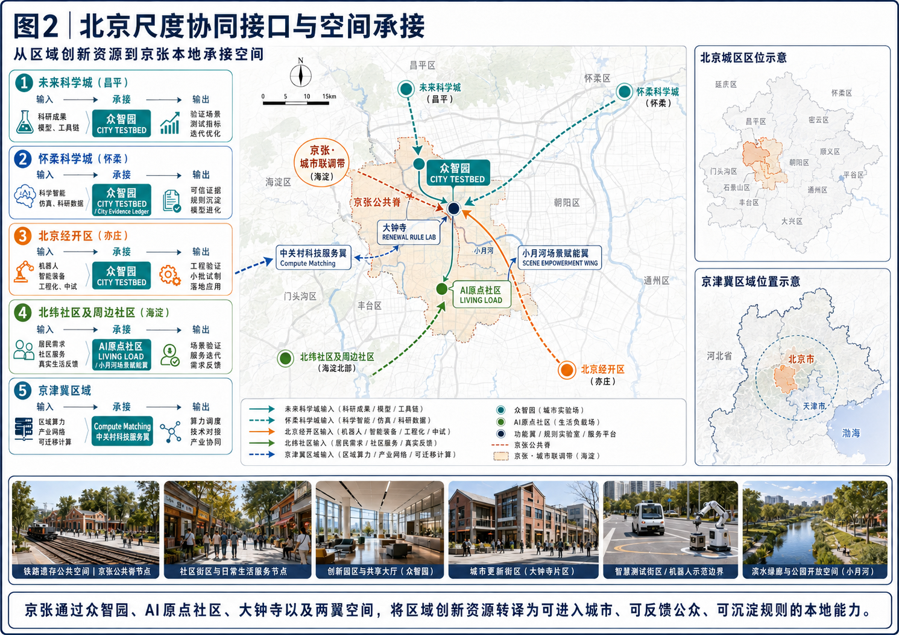

*Scene insets: Representative Scenario Imagery · Not Site-Condition Evidence.*

**Planning judgment |** At the Beijing scale, an interface layer organizes **input → spatial reception → urban output**. Capabilities from different sources and at different maturity levels are directed to reception units with clear urban roles, creating a planning-oriented capability–space match.

**Spatial reception |** Zhongzhiyuan CITY TESTBED receives research, engineering and multi-party testing; AI Origin Community LIVING LOAD receives neighborhood service, lived feedback and accessibility validation; Dazhongsi RENEWAL RULE LAB receives scientific intelligence, evidence re-testing and existing-city renewal rules. The Zhongguancun technology-service wing, Xiaoyue River scenario-enablement wing and Compute Matching provide professional services, ecological life and compute-scheduling support.

**Input → reception → output / feedback |** Future Science City and Huairou Science City provide research and scientific-intelligence inputs; Beijing E-Town provides robotics and engineering inputs; Beiwei Community and surrounding Haidian communities provide lived feedback; Beijing-Tianjin-Hebei provides regional compute and industry coordination. Jing-Zhang translates these into urban-validation evidence, public-service improvements, product-interface requirements and reusable rules.

#### Board 3 | Representative Scenes and Urban-Test Interfaces

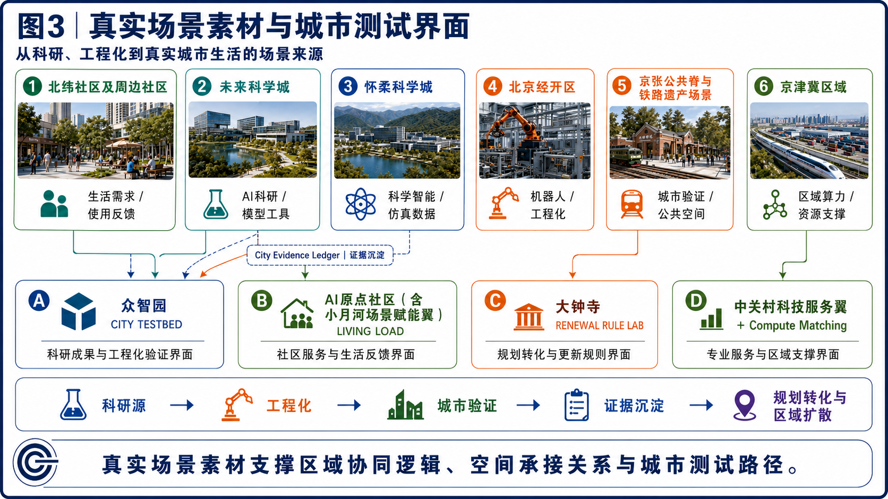

*Scene insets: Representative Scenario Imagery · Not Site-Condition Evidence.*

**Planning judgment |** Regional coordination is further grounded in real urban conditions. Six scene sources—community life, research innovation, scientific intelligence, engineering, the Jing-Zhang railway-heritage public space and regional resources—are matched with four local reception interfaces in the Jing-Zhang urban-design system, clarifying how different capabilities enter the real city and become testable.

**Six scene sources |**

- **Beiwei Community and surrounding neighborhoods** provide everyday needs and lived-use feedback;
- **Future Science City** provides AI research results, models and tools;
- **Huairou Science City** provides scientific intelligence, simulation and research data;
- **Beijing E-Town** provides robotics, intelligent equipment and engineering capability;
- **The Jing-Zhang public spine and railway-heritage scenes** provide real public space, heritage use and urban-event settings;
- **The Beijing-Tianjin-Hebei region** provides regional compute, industry networks and resource support.

**Four local reception interfaces |**

1. **Zhongzhiyuan | CITY TESTBED** receives research, scientific-intelligence and engineering capabilities represented by Future Science City, Huairou Science City and Beijing E-Town, and adapts models, tools, equipment and products to real streets, buildings, public space and infrastructure conditions.

2. **AI Origin Community + Xiaoyue River Scenario Wing | LIVING LOAD** receives everyday needs and lived-use feedback from Beiwei Community and surrounding neighborhoods, using community services, public space, accessibility and daily-life scenes to assess improvements in civic-service experience.

3. **Dazhongsi | RENEWAL RULE LAB** receives spatial experience and operating evidence from the Jing-Zhang public spine, railway-heritage use and local urban validation, translating mature results into existing-city renewal, spatial organization and dynamic-maintenance rules.

4. **Zhongguancun Technology Service Wing + Compute Matching** receives regional compute, industry networks and resource support from Beijing-Tianjin-Hebei, connecting enterprise services, talent, capital and technology transfer to support local validation and regional scaling.

**Evidence mechanism |** The City Evidence Ledger is a horizontal evidence mechanism rather than an independent spatial node. It runs across research, engineering and urban validation, recording model versions, test conditions, spatial scope, feedback and re-test requirements so that scene testing can inform subsequent planning judgments.

The simplified scene-translation path is:

**Research Source → Engineering → Urban Validation → Evidence Settlement → Planning Translation & Regional Scaling**

The scene images express representative spatial types, use conditions and capability sources as **Representative Scenario Imagery**; specific cooperation, authorization and implementation arrangements remain subject to authoritative public information and subsequent specialist review.

#### Board 4 | Coordination Loop and Value-Translation Path

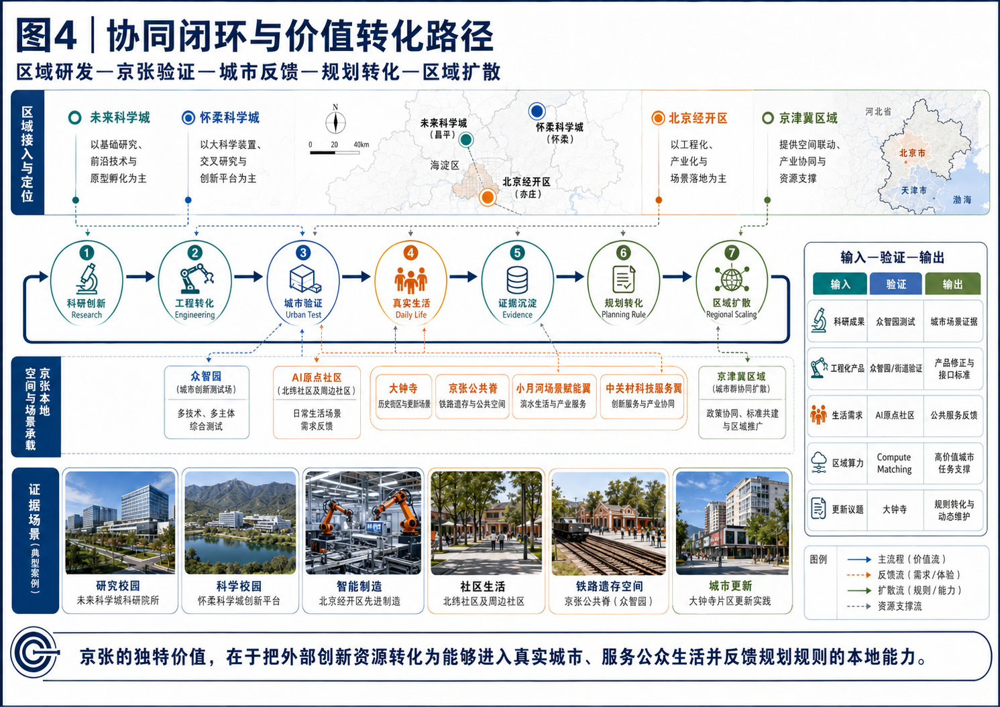

*Scene insets: Representative Scenario Imagery · Not Site-Condition Evidence.*

**Planning judgment |** Board 4 summarizes regional coordination as a recurring urban-innovation mechanism: **Research → Engineering → Urban Test → Daily Life → Evidence → Planning Rule → Regional Scaling**. Jing-Zhang's distinctive value is to convert external innovation resources into local capacity that can enter the real city, serve everyday civic life and feed back into planning rules.

**Spatial reception |** Zhongzhiyuan carries urban testing; AI Origin Community receives everyday life; Dazhongsi carries rule translation; the Jing-Zhang public spine links heritage, public activity and urban service; the Zhongguancun and Xiaoyue River wings coordinate professional services, ecological life and industry activity.

**Input → reception → output / feedback |** Research and engineering create verifiable capability and deployable conditions; urban testing and daily life create use feedback; evidence settlement becomes planning rules; regional scaling returns re-tested spatial prototypes, service methods and interface experience to the regional network for the next research and testing cycle. [depth:three_level_scope_framework]

## 04 | Jing-Zhang Public Spine | From Railway Heritage to Civic Life

The Jing-Zhang Public Spine is the spatial protagonist. Railway heritage provides the cultural continuity; active mobility, shade, rest, accessibility, blue-green systems and active ground floors provide the everyday public-life base. Digital elements enter as small-scale, distributed and environment-integrated interfaces alongside wayfinding, charging, emergency support, interpretation and public service. [standard:MOHURD-URBAN-DESIGN-MEASURES]

### Five urban-space prototypes

1. **Railway Heritage Room:** heritage elements, paving, exhibition and seating tell the story of Jing-Zhang engineering and create a shared memory room for residents, visitors and students.
2. **Developer Commons:** an open ground-floor foyer for developers, firms, researchers and public agencies to meet, interpret, coordinate interfaces and gather for events.
3. **Neighborhood Commons:** a reachable everyday node that combines neighborhood service, all-age activity, rest, health and social life.
4. **Stitching Gate:** a clear walking and accessible transition among railway, roads, neighborhoods and blue-green spaces, supporting east-west connection.
5. **Event Field:** an adaptable open field with movable elements and adjacent public services for Commissioning Week, Open Urban AI Plugfest, markets, exhibitions and everyday use.

Together the five prototypes establish a time-based public space with everyday and event states: daily movement, rest and service can shift into exhibition, exchange, testing and public feedback. Public-space quality comes first, with AI interpretation interfaces, civic micro-nodes and commissioning activity added as compatible layers.

### VI and Wayfinding Minimum System | Wordmark, Area Identity and Civic Direction

This proposal uses a clear, reusable wordmark system that places the urban-design spine, three key areas and annual public programs under one parent identity. At this stage the identity is delivered as a wordmark and conceptual colour system; it does not claim a separate graphic logo. [source:AGENT-TASKBOOK]

|Identity layer|Unified rule|Urban-space application|
|---|---|---|
|**Parent wordmark**|The English lockup is **JING-ZHANG CITY COMMISSIONING BELT**; it pairs with the Chinese-language title while keeping stable spacing, line spacing and relative proportions wherever both appear together.|Public-spine gateways, public orientation, Open Evidence Hall and formal publications.|
|**Primary tagline**|**GOOD CITY FIRST｜City life first** is the English rendering of the value line under the parent identity and remains visually subordinate to the wordmark.|Gateway titles, public-space interpretation, event openings and the page hero.|
|**Three area identities**|Zhongzhiyuan **CITY TESTBED**, AI Origin Community **LIVING LOAD**, and Dazhongsi **RENEWAL RULE LAB** are secondary identities under the parent brand.|Area gateways, node descriptions, civic furniture and special-purpose wayfinding.|
|**Orange star node**|The orange star means **core public honor node / supporting commons** only; it does not identify an AI device, approval status or commercial brand.|Wayfinding to First Run Yard, Open Evidence Hall, Civic Override Beacon and Commissioning Commons.|
|**Program sub-brands**|Commissioning Week, Open Urban AI Plugfest, Civic Audit Open Day and Rulebook Release use the parent-brand prefix or a clear co-signature, with name, date, responsible organizer and event state shown together.|Event Field, Developer Commons, Open Evidence Hall and annual program wayfinding.|

**Colour and type rules |** Railway-spine red `#B5523B` (RGB 181, 82, 59), CITY TESTBED gold `#CF9D3E` (RGB 207, 157, 62), LIVING LOAD blue `#1C5C73` (RGB 28, 92, 115), and RENEWAL RULE LAB green `#486B5D` (RGB 72, 107, 93); full-colour, black-and-white monochrome and reversed versions are available for light and dark grounds. The minimum clear space is **1x**, where x equals the wordmark cap-height; suggested minimum width is **120px** on screen and **25mm** in print. Below that size, retain the area wordmark rather than compressing the bilingual lockup. Chinese pages use the embedded `JingZhang CJK Subset`; English uses the same sans-serif family. Font provenance and the SIL Open Font License 1.1 are recorded in `report/copyright_statement.md`; arrows, dots and stars retain their separate spatial meanings.

**Originality statement |** Open public space, active-mobility priority, adaptive reuse, Living Lab practice and evidence ledgers are reusable urban-planning methods. This proposal's distinctive combination is **railway-heritage public spine + three key-area roles + Compute / Power / Water adaptation + six Civic AI Overlay planning controls + C0–C6 evidence cycle**, connecting heritage, everyday life, industry, infrastructure and renewal rules through one urban-design line.

## 05 | Urban Design of the Three Key Areas | Detailed Design of Key Areas

The three key areas use one design template—position, spatial structure, urban interface, characteristic places and implementation actions—and are linked by the public spine.

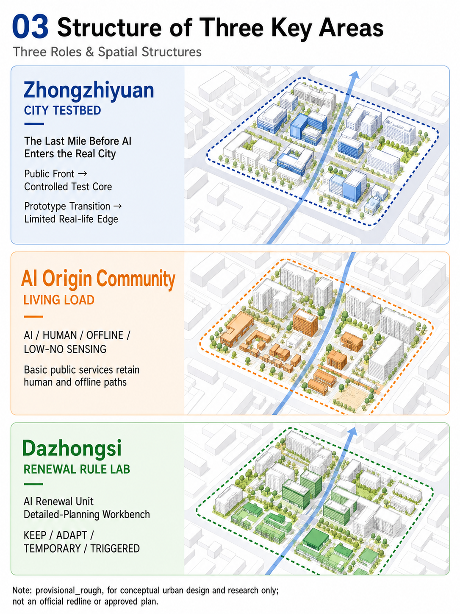

### A. Zhongzhiyuan | CITY TESTBED

**Position | Open innovation and urban validation district.**

Zhongzhiyuan uses a public innovation foyer as its urban entrance, a controlled validation core for devices, robots, models, networks and municipal-AI interfaces, a prototype transition belt between research and public space, a limited real-use interface for validated scenarios, and plug-in test units for updating devices and services.

**Spatial structure | Public-sharing loop + R&D validation loop + operations-support loop.** The public-sharing loop supports visits, exchange, interpretation and events; the R&D loop organizes open test fields, low-speed robot/autonomous-system routes and edge compute/communication nodes; the operations loop carries energy interfaces, maintenance, fault isolation and human response.

**Urban interface | Open ground floors, visible testing, continuous walking.** Ground floors open onto the public spine, while test devices enter the street interface at a small and maintainable scale. Open evidence, on-site explanation and legible status information connect testing with the public.

**Characteristic places |** public innovation foyer, low-speed robot test street, developer commons, edge-node garden and City Commissioning Pod.

**Implementation action |** establish public space and open testing conditions first, then introduce limited real load as evidence matures. C0–C6 continuously tests interface compatibility, real load, recovery, human intervention and long-term maintenance. [data:geometry/key_areas.geojson#PROV-KEY-001]

### B. Beijing AI Origin Community | LIVING LOAD

**Position | High-quality living community for the AI era.**

AI Origin Community is organized around a 15-minute living network. Housing, education, health, elder care, childcare, neighborhood services, commerce, commuting, accessibility and night life sit within a continuous and reachable public-space system. Active ground floors, all-age public space, education and health nodes, and the neighborhood commons establish everyday life; AI enters as an enhancement service.

**Spatial structure | Living network + neighborhood commons + continuous active mobility.** The neighborhood commons links public services, social life and activity spaces; shade, rest, accessibility and clear wayfinding form a continuous route; public-service nodes provide interpretation, advice and human transfer.

**Four service modes | AI / HUMAN / OFFLINE / LOW-SENSING.** Residents can choose AI for navigation, information and coordination, or complete basic public tasks through human, offline and low-sensing paths. The four paths share the target of reachable basic-service outcomes and support different ages, abilities and digital preferences.

**Characteristic places |** neighborhood commons, all-age shared courtyard, accessible active-mobility loop, education and health service node, and low-sensing rest space.

**Implementation action |** strengthen the public-service network, active ground floors and continuous mobility first, then connect validated AI services to everyday scenes. Resident feedback, accessibility and service continuity guide operation and rule updates. [data:geometry/key_areas.geojson#PROV-KEY-002] [standard:BARRIER-FREE-ENVIRONMENT-LAW]

### C. Dazhongsi | RENEWAL RULE LAB

**Position | Demonstration unit for existing-city innovation and renewal.**

Dazhongsi follows **unit coordination → project implementation → dynamic maintenance**. Existing-condition assessment, resource identification, multi-party deliberation, district-parcel checks, public-interest review and project action form one renewal workbench. Mature AI capabilities are translated into spatial interfaces, public-service requirements, project conditions and maintainable renewal rules.

**Spatial structure | Renewal deliberation hall + public-service gap filling + adaptive-reuse units.** The renewal hall supports evidence disclosure, option comparison and multi-party deliberation; public-service projects improve walking, station-city connections and everyday services; existing buildings gain new public value through retention and enhancement, adaptive reuse, public-function insertion, staged use and condition-triggered renewal.

**Urban interface | Small-scale renewal, active ground floors, continuous stitching.** Street, ground-floor, public-space and existing-structure improvements are prioritized so projects gradually complete the public-space network and establish recognizable walking connections to the public spine.

**Characteristic places |** renewal deliberation hall, public-function insertion unit, adaptive-reuse building, temporary innovation space and station-city mixed service scene.

**Implementation action |** build project lists through assessment, resource identification, unit planning, project action, specialist review and dynamic maintenance. AI supports evidence organization, rule search, scenario comparison, district-parcel checking and version maintenance; final planning judgments proceed through real public participation, professional review and authorized procedures. [data:geometry/key_areas.geojson#PROV-KEY-003] [depth:three_key_area_detailed_design]

## 06 | Architecture and Public Space | Supplemental Design Layer

Three architecture scheme boards provide a complementary design layer for building prototypes, street interfaces, public space, material relationships and spatial experience. Together with the five core planning figures, they create a reading sequence from spatial structure to area role and architectural experience. Building position, scale, structure and engineering conditions enter coordinated specialist review at the next stage.

### Scheme 1 | Urban Interface Prototype: Open Innovation Buildings and the Jing-Zhang Public Spine

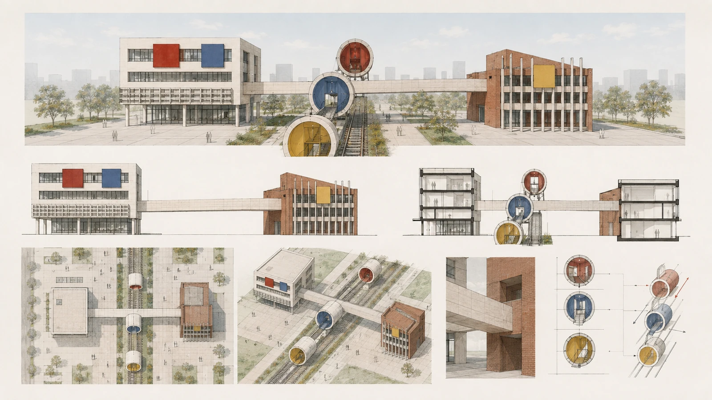

Scheme 1 focuses on complementary building prototypes along the public spine. The open white building uses ordered massing, a transparent ground floor, horizontal windows and adaptable work interfaces for open innovation and collaboration. The red-brick building uses solidity, deep windows and vertical elements to respond to railway memory, urban scale and long-term civic use. Setbacks form forecourts and courtyards; a public bridge links the two ground floors; three color-coded nodes show the spatial translation from technical validity to civic validity to planning validity.

### Scheme 2 | Building–Public Space Integration System

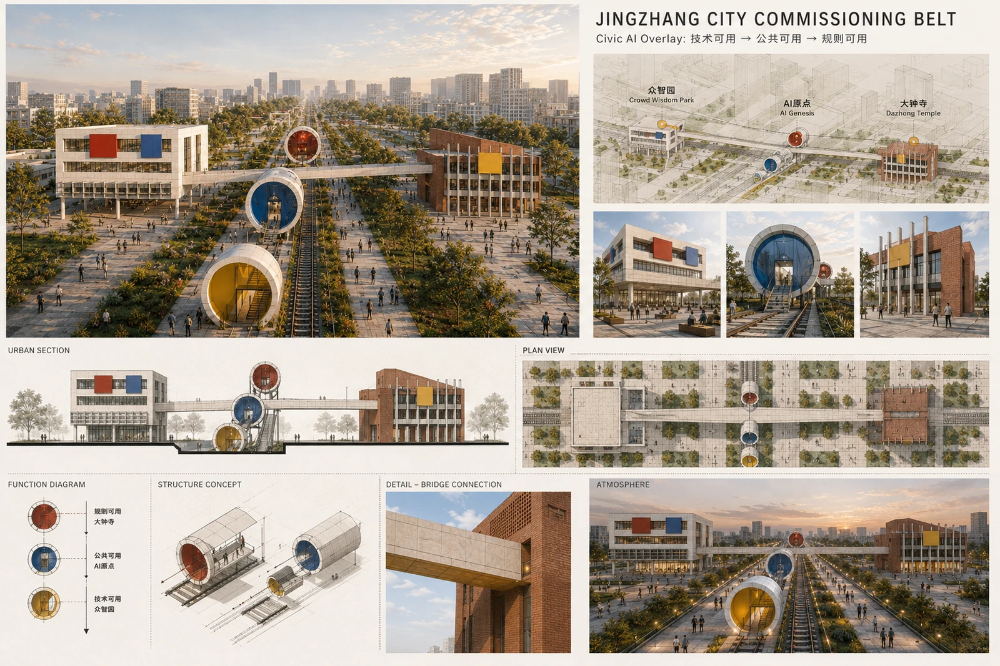

Scheme 2 uses a sequence of master plan, urban section, function diagram, structural intention, bridge detail, materials and day/night states to explain an integrated building–public-space system. Shared halls, three-dimensional walking, urban terraces and public bridges extend interior activity to the public spine. Light-colored buildings, warm brick and stone, and lightweight metal and glass create a legible relationship between new and existing fabric. Yellow, blue and red nodes indicate technical testing, public service and public rule disclosure.

### Scheme 3 | Public-Space Sequence: From Innovation Foyer to Renewal Deliberation Hall

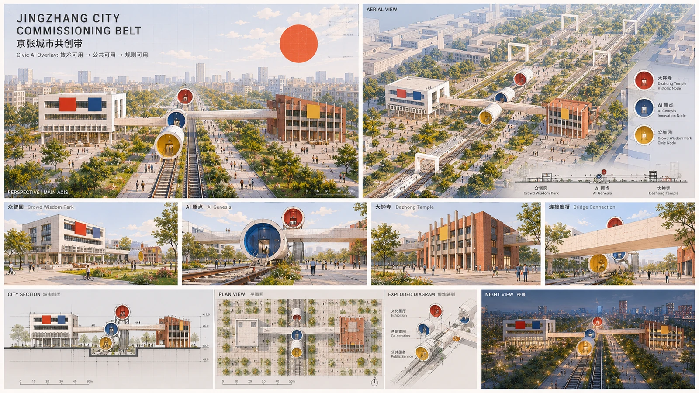

Scheme 3 establishes a continuous sequence: **innovation foyer → validation street → civic commons → neighborhood commons → renewal deliberation hall**. Zhongzhiyuan provides reproducible technical testing and replaceable device interfaces; AI Origin provides resident-facing public service, interpretation and human help; Dazhongsi provides evidence disclosure, rule re-testing and renewal deliberation. Axis, plaza, ground floor, bridge, planting and commissioning pods form a walkable public spine; day and night scenes express different use atmospheres and operating periods.

### Architectural notes and next-stage specialist interfaces

1. **Buildings first establish complete civic functions.** Public halls, walking connections, accessibility, fire egress and human service have independent spatial logic; AI enters as a maintainable and replaceable layer.
2. **Public interfaces lead.** Active ground floors, forecourts, courtyards, public bridges and street setbacks create continuous urban interfaces; building mass opens toward the public spine and becomes legible at key nodes.
3. **Commissioning pods remain small-scale and plug-in.** Sensing, compute, energy and interaction interfaces are concentrated in replaceable interface spaces, equipment bands and pods, adapted to the life of the primary building.
4. **Next-stage specialist interfaces.** Height, setbacks, structure, fire safety, heritage, ownership, railway and road conditions enter specialist checks; the present boards express urban-design intention, building–public-space relationships and material atmosphere. [depth:height_massing_character]

## 07 | Land Use, Renewal and Regulatory-Plan Depth | Overall Design Area: Urban Renewal and Regulatory-Plan-Level Urban Design | Land Use, Building Scale, and Retain-Renovate-Demolish Strategy

### 7.1 Land-use structure and functional gradient

Unified categories for research land, park and green space, commercial services and community facilities organize a gradient of **research → validation → everyday life → renewal translation**. Research and innovation spaces form open foyers along the public spine; parks and green spaces provide ecological and active-mobility continuity; commercial and community services support everyday life and public activity. [data:geometry/land_use.geojson#LU-001] [standard:MNR-LAND-USE-CLASSIFICATION-GUIDE] [depth:land_use_layout]

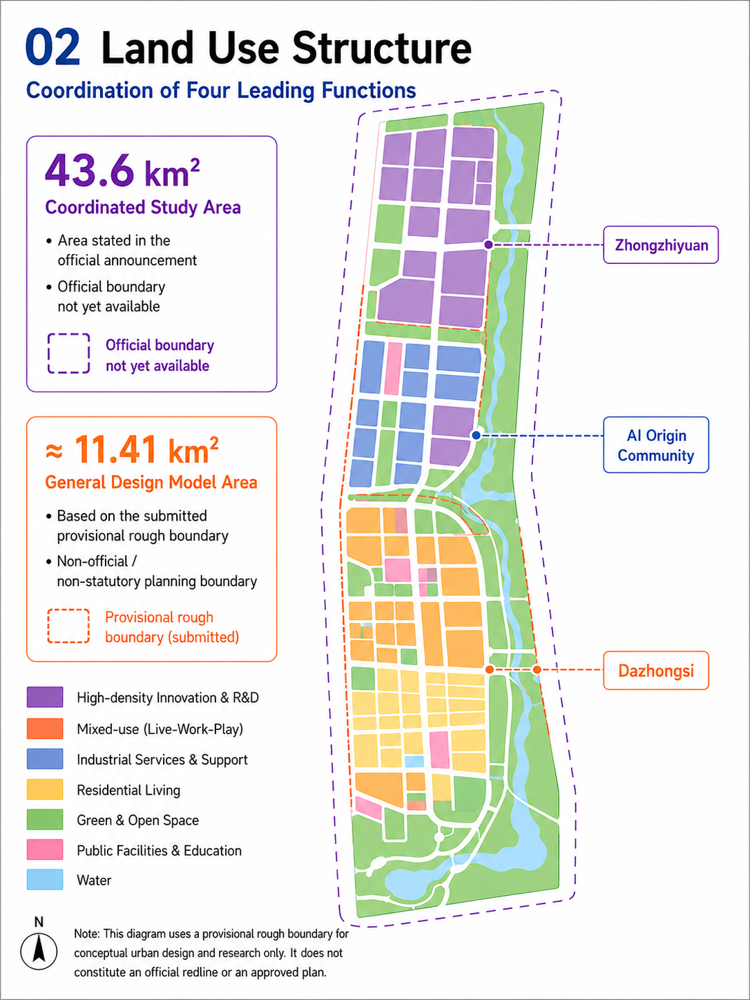

The current land-use model uses seven conceptual units to express functional relationships and provide a base for overall design and regulatory-plan coordination.

### 7.2 Existing-city renewal method

Renewal follows:

**assessment → resource identification → unit planning → project action → specialist review → dynamic maintenance.**

The method coordinates existing buildings, public space, industry, neighborhood services and infrastructure within one renewal unit. Actions are combined according to existing value, public needs, ownership coordination and engineering conditions:

- **KEEP | retain and enhance:** continue buildings and spaces with memory, use and structural value;
- **ADAPT | adaptive reuse:** introduce new uses through active ground floors, public functions, interface improvements and facility renewal;
- **TEMPORARY | staged use:** use reversible, maintainable spaces for events, testing and transition;
- **TRIGGERED | condition-based renewal:** start larger actions when ownership, heritage, engineering, public-interest and statutory conditions are complete.

These four actions form the renewal toolkit of unit coordination, project implementation and dynamic maintenance, and retain the existing machine-readable layer. Public-function insertion is a human-readable design action that can be embedded in KEEP, ADAPT or TEMPORARY units for neighborhood services, public space, interpretation and shared facilities; it does not add a machine category. [standard:MOHURD-CONTROL-DETAILED-PLANNING] [depth:retain_renovate_demolish]

### 7.3 Conceptual building massing and implementation boundary

The building-footprint model represents conceptual renewal units in the key areas and supports comparison of retention, adaptive reuse, public-function insertion and staged use. The current conceptual footprint is about 892,843.844 m² and the design-model green ratio is about 17.6%. [metric:building_footprint_area_sqm] [metric:green_ratio] [depth:development_intensity_controls]

Building massing follows three principles: openness along the public spine, recognizable key nodes and adaptation to real functions within each area. Height, setback, density, FAR, population capacity, ownership, heritage and structural conditions enter regulatory-plan and specialist checks when authoritative information is available.

### 7.4 City Commissioning Pod | Modular urban interface

The City Commissioning Pod is a small-scale, plug-in urban interface prototype. Depending on area needs, it can combine edge inference, energy interface, public sensing notice, human assistance and physical shutdown. Together with the public spine, courtyards, forecourts and active ground floors, it creates visible and maintainable civic-service nodes; quantity, spacing, equipment power, storage and structure enter engineering deepening.

## 08 | Mobility, Blue-Green Systems and Public Services | Transport, Rail, Municipal Infrastructure, and Public Services | Blue-Green Network, Public Space, and Urban Character

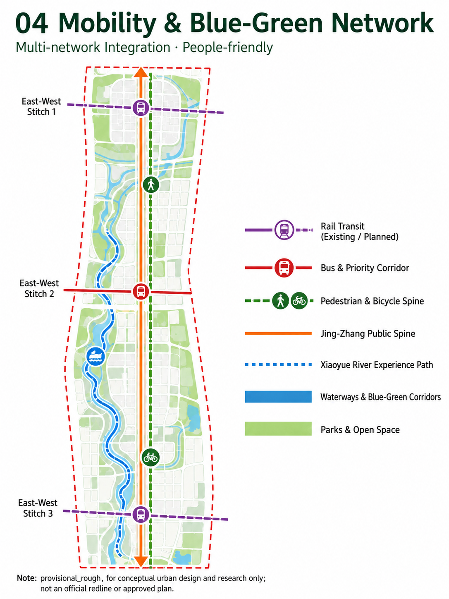

### 8.1 Active-mobility spine and east-west stitching

Mobility design centers on the active-mobility public spine, continuously organizing walking, cycling, accessibility, shade, rest, wayfinding and public service. Three conceptual east-west stitching points connect railway, park, roads, neighborhoods and Xiaoyue River scenes, turning the heritage line into a reachable urban-life network. [data:geometry/roads.geojson#ROAD-X01] [depth:traffic_rail_slow_parking]

### 8.2 Commissioning Right-of-Way | Layered test access

Ordinary urban traffic, emergency movement and service access retain clear priorities. Low-speed robots, delivery devices and autonomous systems enter defined test segments under explicit spatial, time, speed, responsibility and human-intervention conditions. Low-altitude logistics, underground micro-utility corridors and dedicated energy/cooling interfaces are condition-based elements coordinated with airspace, safety, heritage, municipal capacity and engineering conditions.

### 8.3 Blue-green system and urban character

Blue-green space follows the public spine, streets, nodes and Xiaoyue River scenes as a continuous shade and stormwater-adaptation base. Railway heritage continuity, real street scale, all-age activity, seating and small-scale digital interfaces shape urban character; the conceptual design model indicates a green ratio of about 17.6%. [metric:green_ratio] The public-space ratio is about 6.7%, coordinated with urban-design measures. [metric:public_space_ratio] [standard:MOHURD-URBAN-DESIGN-MEASURES] [depth:blue_green_public_space]

### 8.4 Four equivalent paths for public service

Nodes carrying basic public services use four service modes:

1. **AI:** voluntary intelligent navigation, information and coordination;
2. **HUMAN:** a staffed counter, attendant or human transfer;
3. **OFFLINE:** basic tasks during no-account, offline or model-unavailable conditions;
4. **LOW-SENSING:** normal movement and public-space use in low- or non-continuous-sensing environments.

The four paths share reachable basic-service outcomes, legible responsibility and user choice. Accessibility continuity, children and all-age activity, elder support, public interpretation and complaint/appeal routes are part of node design. [standard:BARRIER-FREE-ENVIRONMENT-LAW]

### 8.5 Digital Quiet / Low-Sensing Zones

Residential, child-oriented, accessible and ecologically sensitive scenes prioritize minimum necessary sensing, clear notice, non-identifying technology, local processing and an exit route. Low-sensing space combines with rest, reading, neighborhood exchange and nature to support quiet civic life; its detailed extent is coordinated with use, privacy impact, technical necessity and operating responsibility.

### 8.6 Public nodes: 3 core honor nodes + 1 supporting commons

1. **First Run Yard:** a public starting point for city commissioning, translating railway testing, verification and operation culture.
2. **Open Evidence Hall:** a place for rules, sources, versions, test evidence, issue records and open-source contributions.
3. **Civic Override Beacon:** a legible civic marker for bounded authority, human responsibility, degradation and exit.
4. **Commissioning Commons:** a supporting shared space for developers, residents, firms, operators and public agencies to test, exchange and provide feedback.

The machine-readable layer uses `PUBLIC-LM-01`, `PUBLIC-LM-02` and `PUBLIC-LM-03` for the three core node points and `PUBLIC-LM-004` for the supporting shared field. [data:geometry/public_space.geojson#PUBLIC-LM-01] [data:geometry/public_space.geojson#PUBLIC-LM-02]

The remaining node features and the total public-node count are represented together in the structured layer. [data:geometry/public_space.geojson#PUBLIC-LM-03] [data:geometry/public_space.geojson#PUBLIC-LM-004] [metric:ai_landmark_count]

## 09 | AI-Infrastructure Adaptation | Compute / Power / Water

AI-infrastructure adaptation is organized around the time-space matching of **task → resource → place**. Public space, building systems, regional compute, shared district services and edge nodes form tiered interfaces, coordinated with power, cooling, water, communications and operations.

### Compute | Tiered compute

**Regional compute → shared district services → edge nodes.** Regional compute handles training and migratable batch work; shared services carry urban models, research and enterprise inference; edge nodes serve tasks with genuine low-latency, privacy-sensitive or high-reliability needs. Compute interfaces enter the city through innovation foyers, public-service nodes and commissioning pods.

### Power | Task–power coordination

`AI workload × power condition × storage × flexible building load × time` organizes coordination:

- **Protected tasks:** continuity for public safety and critical city services;
- **Flexible tasks:** time-shifted operation under energy and operating conditions;
- **Migratable tasks:** transfer to regional compute or another time window.

### Water | Compute–water adaptation

W0–W3 provides a conceptual adaptation scale from low-cooling-water edge micro-nodes to dense compute requiring coordinated energy, cooling, water, heat rejection and waste-heat use. Resource conditions, task necessity, spatial capacity and environmental impact jointly determine the adaptation level.

Communications, underground municipal systems and transport/logistics remain urban engineering conditions, using multi-path, key-node redundancy, maintainability and fault isolation. The framework embeds AI prediction, scheduling and resource allocation in engineering coordination while keeping human responsibility and ordinary city-operation paths clear. [depth:municipal_new_infrastructure]

## 10 | Civic AI Overlay | Six Planning Controls

**Civic AI Overlay is an AI-era detailed-planning overlay.** It brings AI facilities, intelligent services and operating states into existing land use, transport, municipal infrastructure, public space, construction projects and dynamic maintenance. Planning therefore addresses spatial allocation together with service range, resource capacity, responsible parties and continued maintenance.

### Six planning controls

|Planning control|Machine field|Urban-design and detailed-planning expression|
|---|---|---|
|**Spatial access**|Object|Define the spatial object and entry conditions for an AI capability, sensing device, edge node, autonomous system or public AI service.|
|**Service range**|Spatial Scope|Define users, impact range, spatial boundary, time period and public-space relationship.|
|**Resource capacity**|Resource Interface|Coordinate roads, power, water, compute, communications, building systems and public-space resources.|
|**Operating conditions**|Permission / Requirement / KPI|Translate permission level, performance, human transfer, emergency conditions and service continuity into operating requirements.|
|**Responsible party**|Responsible Party|Identify the operator, maintainer, responsible human, public agency and partner roles.|
|**Dynamic maintenance**|Evidence / Version / Re-test / Exit|Record data/model versions, test evidence, change triggers, re-test, degradation, rollback and exit paths.|

Each rule keeps the common machine-readable structure:

`Rule ID → Spatial Scope → Object → Requirement/KPI → Source → Responsible Party → Permission → Commissioning Gate → Evidence → Version → Re-test Trigger → Rollback/Exit`

Rules use three classes:

- **A Mandatory:** public safety, privacy, public interest, human intervention, audit and emergency conditions;
- **B Conditional:** entry to the next stage after explicit prerequisites or equivalent performance;
- **C Guidance / Experimental:** suggestions for pilots, innovation and iteration.

Planning drawings express the urban structure; the Overlay explains spatial access, service range, resource capacity, operating conditions, responsible parties and dynamic maintenance. AI assists rule search, scenario simulation and consistency checks; statutory conclusions, public participation and authorized approvals follow existing professional procedures. [depth:professional_evidence_chain]

## 11 | Urban Innovation Cycle, C0–C6 and Scenario System | AI Innovation Ecosystem, Personas, and AI+ Scenarios

### 11.1 Urban innovation cycle

The Jing-Zhang City Commissioning Belt organizes innovation as a cycle that returns to everyday urban life:

**Research → Test → Urban Pilot → Daily Use → Evidence → Rule Update → Re-test.**

Zhongzhiyuan produces technical, interface and equipment evidence; AI Origin Community provides lived experience, accessibility, fairness and operational feedback; Dazhongsi translates mature evidence into renewal and planning rules. The Zhongguancun wing connects research, IP, talent, capital and professional services; the Xiaoyue River wing supplies ecological, neighborhood, municipal and public-service feedback.

Seven international cases provide mechanism-level reference:

- **EU CitCom.ai:** real-city testing and experimentation facilities;
- **Punggol Digital District:** district digital infrastructure and real operation;
- **Helsinki / Forum Virium:** enterprise, resident and public-sector Living Lab participation;
- **Paris-Saclay DataIA:** research–talent–innovation continuum;
- **Toronto Vector Institute:** research engineering and industrial adoption;
- **London Knowledge Quarter:** institutional density, public culture and walkable innovation setting;
- **Regulatory sandbox mechanisms:** limited scope, continuous monitoring, real evidence and adjustable operation.

These cases compare mechanism components; Jing-Zhang assembles them through local public-space, key-area and existing-city conditions. [metric:ecosystem_case_count]

### 11.2 C0–C6 | City capability validation sequence

C0–C6 connects the Civic AI Overlay and City Evidence Ledger and moves a capability from evidence baseline into urban scenes:

1. **C0 Evidence Baseline:** confirm data source, model version, spatial scope, responsible party and initial performance;
2. **C1 Simulation:** simulate urban tasks, resources and risks in controlled conditions;
3. **C2 Rule Check:** check planning conditions, public interest, interfaces and operating boundaries;
4. **C3 Shadow / Dummy Load:** observe system state and coordination interfaces in a real setting;
5. **C4 Limited Real Load:** operate within defined space, time, task and responsibility conditions;
6. **C5 Human-supervised Operation:** continuous review, response and maintenance by a responsible party;
7. **C6 Recertification / Rollback / Exit:** re-test when conditions change, with degradation, rollback or exit where needed.

C0–C6 provide a verifiable pace for urban innovation. Test evidence and city operating authority remain distinct records; material changes in model, data, facility, policy or use environment return the capability to the appropriate validation stage.

### 11.3 City Evidence Ledger | Evidence interface

The City Evidence Ledger is the evidence interface between the Overlay and C0–C6. Each AI urban project records at least:

`Project ID / Spatial Scope / Operator / Responsible Human / Data Source / Model & Version / Risk Class / Permission / Commissioning Gate / Test Evidence / Failure Events / Human Intervention / Approval / Re-test Trigger / Rollback / Exit / Public Summary`

The ledger makes project state, current authority, test evidence, failure events, human intervention, model changes and re-test conditions traceable. It also lets the public distinguish proposal, test, pilot, operation and exit states, and indexes them to land use, transport, municipal, public-space and project records.

### 11.4 Eight user groups | Public-interest test set

Eight user groups translate different urban needs into observable spatial services and acceptance tasks. [metric:persona_count]

|User group|Core urban task|Spatial/service response|Acceptance focus|
|---|---|---|---|
|AI researchers / developers|Test models, devices, robots and interfaces|Reproducible test environment, developer commons and evidence interfaces|Evidence and city-access status are legible|
|Start-ups / firms|Validate products and find real needs|Interfaces, sites, compliance paths and failure feedback|Real load and public value are observable|
|Residents / households|Commuting, education, health, neighborhood life and leisure|Low-threshold information, public service and multiple paths|Basic service is continuous, legible and chosen|
|Older / disabled users|Accessibility, human help and reliable service|Continuous accessible routes, status information and human transfer|Service remains reachable through network or model change|
|Students / visitors|Learn, visit and join innovation activity|Heritage room, open evidence and low-threshold programs|Public space supports learning and everyday use|
|Municipal operators|Safety, fault response, maintenance and emergency|Shadow operation, assisted diagnosis, scheduling advice and operations interfaces|Responsibility and maintenance paths are clear|
|Owners / developers|Renewal feasibility, rules and investment|Option simulation, public-function insertion and rule checking|Ownership and project conditions follow formal procedures|
|Planning / regulatory decision-makers|Public interest, process, rules and responsibility|Evidence chain, simulation, machine-readable checks and public communication|Professional judgment, participation and procedural responsibility remain complete|

### 11.5 Twelve scenario cards | Stress tests of one city rule set

The 12 cards test the Overlay and the common evidence–risk–authority–human–rollback mechanism across different spaces, users, data conditions, resource loads and risk levels.

|ID|Space / type|Users and task|Data and privacy|Human review / operation|Risk and exit|
|---|---|---|---|---|---|
|SC-01|Zhongzhiyuan · industrial validation|AI infrastructure interoperability Plugfest|Public interfaces / test data; production data isolated|Testing body + vendor; human approval|Interoperability evidence leads to the next stage|
|SC-02|Zhongzhiyuan · industrial validation|Robot and autonomous-logistics micro-hub|Road / device state; minimum personnel identification|On-site stop + remote intervention|Pedestrian conflict or fault triggers operating response|
|SC-03|Zhongzhiyuan / Xiaoyue River · industrial validation|Municipal-AI control sandbox|Water, drainage and energy data by authorization level|Municipal operator final confirmation|Shadow operation first; authority event triggers rollback|
|SC-04|Dazhongsi · planning validation|Machine-readable detailed-planning rule engine|Public planning and project evidence|Planning professional review|Supports statutory process through assisted checking|
|SC-05|AI Origin · public service|Public-service Agent station|User-initiated input; minimum collection|Human window transfer|Human service remains continuous through account/model change|
|SC-06|Origin + public spine|All-age accessible-mobility Agent|Slope, lift, construction and flood state|Human confirmation for high-risk routes|Offline map and human help support access|
|SC-07|Xiaoyue River / corridor|Urban-flood resilience Agent|Measured, predicted and simulated states labeled|Authorized body confirms closure decision|Uncertain model state becomes advice and human judgment|
|SC-08|Zhongzhiyuan + overall area|Compute–power–water matching and task orchestration|Task class, energy, cooling and resource constraints|Joint review by district, energy and facility operators|Protected tasks first; migratable tasks move to regional compute|
|SC-09|Jing-Zhang public spine|Civic AI micro-node|Low-sensitivity public information|Public-space operator|Shade, rest and emergency functions remain during outage|
|SC-10|Public spine|Event / crowd-resource coordination|Aggregated flow, non-identifying information|Event operations + emergency human confirmation|Public-space order remains with the authorized body|
|SC-11|Public-spine landmark|Open-source contribution wall and public-AI audit node|Public versions, sources and test states|Project operating organization|Proposal, test, selection and deployment states are clear|
|SC-12|Dazhongsi|Renewal deliberation hall + district-parcel optioning|Public rules + authorized project parameters|Multi-party deliberation and human final decision|Renewal proceeds through real participation and statutory process|

SC-01, SC-02, SC-03 and SC-04 form four industrial / planning validation scenarios covering interoperability, robotics, municipal AI and machine-readable detailed planning. [metric:scenario_card_count] [metric:test_validation_scenario_count]

Health, education, legal, life, commerce and mobility become vertical service cards: health focuses on navigation and care coordination; education retains teacher review; legal and planning Agents explain public rules and procedures; commerce uses explainable public access; mobility shares accessibility, flood and construction evidence. All cards retain multi-path public service and human review. [standard:GENERATIVE-AI-INTERIM-MEASURES]

## 12 | Implementation Path and Long-Term Operation | Renewal Projects, Implementation Policy, and Phasing

The implementation path puts spatial projects, public services and operations first, using **PROVE BEFORE SCALE** as the long-term principle and three stages of near-term action, deepening implementation and condition-based initiation.

### NOW | Near-term action

Prioritize clear public value, limited prerequisites and maintainable actions:

- Civic AI rulebook and City Evidence Ledger;
- open evidence web, Railway Heritage Room and Open Evidence Hall;
- developer, resident and public programs;
- public-space micro-nodes, accessible service and low-sensing paths;
- shadow-operation scenarios and reversible temporary innovation spaces;
- shade, rest, wayfinding and basic-service improvements along the public spine.

### NEXT | Deepening implementation

With stronger evidence, operating responsibility and engineering conditions, advance:

- Zhongzhiyuan open test environment and City Commissioning Pods;
- edge inference, shared compute and energy interfaces;
- robot and logistics micro-hubs;
- AI Origin public-service network and neighborhood commons;
- Dazhongsi renewal-rule pilots, renewal deliberation hall and adaptive-reuse units;
- public-space links for planning, station-city and commercial-service scenes.

### CONDITION-BASED | Initiation when conditions mature

After formal planning, engineering studies, departmental approvals, risk assessment and commissioning evidence are jointly available, initiate:

- wider real-control AI operation;
- low-altitude logistics and underground municipal interfaces;
- high-intensity compute infrastructure;
- renewal actions requiring coordinated transport, energy, cooling or water conditions.

The phasing layer uses NOW / NEXT / CONDITION-BASED. [data:geometry/phasing.geojson#PHASE-001] [metric:phasing_stage_count]

The renewal project list combines conceptual building units, public-space projects and service interfaces; the current building model contains 18 conceptual renewal units, with project actions coordinated through the implementation framework. [depth:renewal_project_list] [depth:phasing_implementation]

### agent.6 Operational Conversion and Embedded Design-to-Delivery Correspondence

agent.6 uses Developer Commons as an annual operating entry point and organizes registration, controlled testing, evidence review, community/enterprise services and rule updates as a traceable conversion chain. Developer Commons is a conceptual public-space operating interface; it does not predefine a formal operating organization, partnership agreement or funding arrangement. All parties, funding and partnerships remain marked proposed / to be confirmed.

**Seven-step operating chain |** Application → Eligibility Check → Controlled Test → Evidence Review → Community / Enterprise Service → Rule Update → Scale / Hold / Exit.

**Annual operating rhythm (conceptual) |** Annual topic release and application → eligibility check → controlled testing and Open Urban AI Plugfest → community/enterprise service conversion and everyday use → evidence review and Civic Audit Open Day → Rulebook Release. Entry into controlled testing requires the use case, spatial scope, data category, responsible human, resource conditions, public-service paths and test plan; incomplete entry conditions remain in Hold. After testing, evidence completeness, service continuity, public feedback, issue-closure rate and re-test triggers guide conversion to community/enterprise service; mature and reproducible conditions enter Scale, conditions requiring continued observation remain in Hold, and re-test or exit triggers enter Exit.

**Verifiable KPIs (proposed / to be confirmed) |** Each year records the registration and screening list, number of C3 tests, C3→C4/C5 conversion records, evidence-package completeness, coverage of human/offline/low-sensing paths, public feedback and response records, issue closure and re-test records, Rulebook version updates and exit records. These indicators support operational acceptance and evidence handover; target values, responsible parties and data permissions enter the next-stage implementation study.

Existing spaces and actions form implementation interfaces at the planning level, using the current area, public-space, program, infrastructure and C0–C6 vocabulary. `Delivery Lead`, `Decision Owner`, `Start Condition`, `No-Go / Hold`, `Acceptance Evidence` and `Handover Evidence` jointly describe responsibility, initiation, acceptance and handover interfaces for later implementation research; they do not predefine formal partners, contracts or engineering commitments.

|Existing space / action|Scale|Phase|Delivery Lead (planning interface)|Funding Mode (conceptual path)|Service Level|Decision Owner|Start Condition|No-Go / Hold|Acceptance Evidence|Handover Evidence|
|---|---|---|---|---|---|---|---|---|---|---|
|Jing-Zhang public spine and public-space micro-nodes|Overall urban design / public space|NOW|Urban-design and public-space operations coordination (proposed)|Public-space improvement and operations study (proposed)|C0–C2 Research / Simulation / Rule Check|Public-space operating party (to be confirmed)|Existing-condition review, node list, accessibility and maintenance paths confirmed|Hold when responsible party, maintenance path or basic-service continuity remains unconfirmed|Active-mobility continuity, accessibility, four service paths and public feedback records|Node register, operating responsibility, version and issue list|
|Developer Commons / Zhongzhiyuan test environment|Key area / urban testing|NEXT|Test-environment and space-operations coordination (proposed)|Open testing and professional-services combination (proposed)|C3 Controlled Test|Test-environment operating party (to be confirmed)|Annual topic, registration rules, space/resource conditions, responsible human and test plan ready|Hold when data/rights, privacy, public safety or human-intervention conditions are incomplete|Registration and screening records, interface compatibility, operating conditions, human intervention and test evidence|Test report, open issues, re-test trigger and service-responsibility handover|
|AI Origin public service|Key area / everyday services|NEXT|Public-service and neighborhood-space coordination (proposed)|Public-service and space-operations study (proposed)|C4 Limited Real-load Service|Community-service operating party (to be confirmed)|Basic-service baseline, accessibility, human/offline paths and resident-feedback mechanism confirmed|Hold when basic paths, public notice or feedback mechanism is incomplete|Service accessibility, four paths, resident feedback and continuity evidence|Service catalogue, human handoff, offline path, issue register and version record|
|Dazhongsi renewal|Key area / existing-city renewal|NEXT → CONDITION-BASED|Renewal-unit and project-delivery coordination (proposed)|Phased renewal and public-function insertion study (proposed)|C0–C2 → C5 Human-supervised Operational Service|Renewal-unit and project-delivery party (to be confirmed)|Assessment, resource identification, ownership/heritage/engineering conditions and public-participation path enter review|Hold when ownership, heritage, public-interest or specialist conditions lack evidence|Assessment, unit planning, specialist review, participation and rule versions|Project list, specialist review notes, rule version, next responsibility and maintenance trigger|
|JZ Commissioning Week / Open Urban AI Plugfest|Public-space operation / program|NOW → NEXT|Program and public-space operations coordination (proposed)|Program operations and open-testing combination (proposed)|C0–C3 Research to Controlled Test|Annual program operating party (to be confirmed)|Topic, venue capacity, service paths, human staffing and safety plan confirmed|Hold when venue, service, safety or rights conditions are incomplete|Registration, event, interoperability, public feedback and version-update records|Event review, issue closure, re-test plan and next-year topic input|
|Compute / Power / Water and Civic AI Overlay|City system / infrastructure adaptation|NEXT → CONDITION-BASED|Infrastructure and planning-interface coordination (proposed)|Specialist study and condition-based development research (proposed)|C0–C2 → C4/C5|Infrastructure and planning-interface party (to be confirmed)|Task–resource–space checklist and communications, energy, water and operations interfaces reviewed|Hold when capacity, heat rejection, water, communications or operating responsibility lacks evidence|Task–resource–space matching, condition list and re-test records|Interface list, engineering boundary, resource responsibility, operating version and re-test trigger|

Service levels retain the existing C0–C6 vocabulary: C0–C2 = Research / Simulation / Rule Check; C3 = Controlled Test; C4 = Limited Real-load Service; C5 = Human-supervised Operational Service; C6 = Re-certified / Reduced / Exit. The table uses existing spaces, phases and validation terms without adding project IDs or a new management system.

### Long-term operation | Time-based public space and evidence feedback

- **JZ Commissioning Week:** annual test topics, public-space programs, results and issue review;
- **Open Urban AI Plugfest:** interoperability reports for devices, software, models and interfaces;
- **Civic Audit Open Day:** human intervention, public feedback, failure testing and risk review;
- **Rulebook Release:** annual rule versions, change notes, re-test results and exit records.

These programs are both time-based public-space operation and feedback interfaces for the city evidence cycle. Operating costs can combine public investment, open testing and professional service, scenario operation and space operation; organization, fees and fiscal arrangements enter later implementation research. [source:AGENT-TASKBOOK]

## 13 | Task Response, Metrics, Technical Boundaries and References | Design Basis and Source List | Metrics, Area Recalculation, and Compliance Matrix | Risk, Copyright, and Compliance | References

### 13.1 Design basis and task response

Formal evidence includes the organizer announcement, `brief/site-package/`, the agent taskbook, `data/source_registry.json` and repository-maintained provisional geometry. The method layer draws on existing research in urban planning, municipal infrastructure, resilient cities, AIDC commissioning, AI-assisted planning, urban renewal and underground-space coordination; the public package expresses content that can be openly reviewed and generally reused. [source:AGENT-TASKBOOK] [source:SOURCE-REGISTRY]

Design basis, existing-condition diagnosis and data gaps follow the project's professional evidence system. [standard:PROJECT-AGENT-OPEN-CALL-TASKBOOK] [depth:existing_conditions_diagnosis]

### Participant-side provenance labels

This proposal labels material by its participant-side use so that source nature, design basis and conceptual assumptions remain legible:

|Category|Use in this proposal|
|---|---|
|`Organizer-supplied`|Organizer announcement, taskbook, repository structure and maintained submission interfaces.|
|`Public official`|Publicly verifiable government, public-institution or formally published material used for urban context, planning conditions and professional basis.|
|`Background research`|Urban planning, urban design, infrastructure, AI-enabled planning, renewal and mechanism-level case research used for method reference.|
|`Design assumption / provisional`|Current conceptual geometry, architecture visuals, spatial prototypes, scenario interfaces and conditional parameters used for design expression and next-stage review.|

These labels describe material nature, use and applicability on the participant side. They do not equal the organizer's formal approval status in `source_registry`; the organizer's system remains authoritative for registry status.

|Required task|Planning response|Main evidence and sections|
|---|---|---|
|**agent.1 Overall concept and functional coordination**|One spine, three key areas, two wings and many nodes organize the three positionings and five functions|Overall structure, three scales, nine GeoJSON layers and five core figures|
|**agent.2 Full-stack AI innovation and world-class ecosystem**|Research → Test → Urban Pilot → Daily Use → Evidence → Rule Update → Re-test|Three key areas and mechanism-level case comparison|
|**agent.3 AI+ scenarios and lively intelligent city**|12 scenario cards cover industry, planning, public service, mobility, municipal and everyday tasks, with four validation scenarios|SC-01–SC-12, `metrics.json` and scenario system|
|**agent.4 AI public space, new uses and landmark**|The public spine carries everyday life and open innovation through 3 core public nodes + 1 supporting commons|Public spine, public nodes and `public_space.geojson`|
|**agent.5 Centennial Jing-Zhang culture and AI culture**|Railway surveying, construction, testing, verification and operation become an urban commissioning method|Vision, Railway Heritage Room and First Run Yard|
|**agent.6 Global program and long-term operation**|Annual programs, public-space state changes and Rulebook Release establish long-term evidence feedback|Implementation, long-term operation and City Evidence Ledger|

Together the six tasks frame one planning question: how an AI capability obtains spatial access, resource capacity and service range, enters real urban settings through validation and human supervision, and continues into renewal and public-service rules. [depth:professional_evidence_chain]

### 13.1a | Evidence Crosswalk | Reviewer-focus index

This index reduces reviewer search cost by linking review focuses directly to existing sections, drawings and structured evidence; it is a navigation index, not a self-score.

|Review focus|Planning response|Existing sections and evidence|
|---|---|---|
|Jing-Zhang AI innovation belt, Haidian innovation ecosystem, urban space and public governance|One spine, three key areas, two wings and many nodes translate regional capabilities into public space, public service and renewal rules.|01–05, 08, 10; site-overview, key-areas, regional-coordination-01/02/04, public_space.geojson|
|Phasing, pilot areas, participants and metrics|Three key areas and NOW / NEXT / CONDITION-BASED organize spatial actions, operating interfaces and metric review.|05, 07, 12, 13.2; key_areas.geojson, phasing.geojson, metrics.json|
|Residents, young talent, firms, universities, visitors and vulnerable groups|Eight user groups, four service paths and public-spine prototypes organize reachable, legible and participatory urban services.|04, 05B, 08.4, 11.4–11.5; scenario cards and four paths|
|Public-source boundary, privacy, copyright and policy uncertainty|Provenance labels, Civic AI Overlay, City Evidence Ledger and technical interfaces keep evidence and responsibility boundaries traceable.|10, 11.3, 13.1, 13.3; sources.json, risk.json and three matrices|
|Brand identity, regional coordination, planning innovation and industrial support|Railway-heritage public spine, regional innovation interfaces and Compute / Power / Water create a Jing-Zhang-specific planning innovation.|01–03, 09–10; site-overview, regional-coordination-01/02/04, mobility-bluegreen, metrics-evidence|
|Scene legibility, spatial clarity, transferability and completeness of expression|Five core planning drawings, four regional-coordination boards and three supplemental architecture boards create a reading chain from spatial structure to regional relationship, area role, building experience and delivery interface.|04–08, 12; five core drawings, regional-coordination-01/02/03/04, three architecture boards and delivery table|
|Public compliance, international communication and long-term value|Annual public-space programs, mechanism-level references, the evidence ledger and Rulebook Release support continuing re-testing and open communication.|11–13.4; City Evidence Ledger, program system and sources.json|

### 13.2 Core metrics and evidence index

Core numbers currently reviewable from the announcement, submitted geometry or structured records are:

- **43.6 km²** textual coordinated research area from the official announcement, expressed as a city-system research scale with no corresponding official polygon;
- **about 11.4 km²** overall design-model area, recalculating to about 11.41 km² from the `provisional_rough` polygon in `geometry/site_boundary.geojson`; [metric:site_area_sqm]
- **about 368.4 ha** across three key areas; [metric:key_area_count]
- **about 17.6%** design-model green ratio; [metric:green_ratio]
- **about 6.7%** design-model public-space ratio; [metric:public_space_ratio]
- **12** scenario cards, including **4** industrial / planning validation scenarios; [metric:scenario_card_count] [metric:test_validation_scenario_count]
- **8** user groups; [metric:persona_count]
- **3 core public honor nodes + 1 supporting commons**; [metric:ai_landmark_count]

Green space, public space, building footprints and public nodes are outputs of the current conceptual design model. The recalculation path is:

**data replacement → geometry review → metric recalculation → rule re-test.** [depth:metrics_recalculation]

Structured evidence is distributed across `geometry/site_boundary.geojson`, `key_areas.geojson`, `land_use.geojson`, `buildings.geojson`, `roads.geojson`, `green_space.geojson`, `public_space.geojson`, `constraints.geojson` and `phasing.geojson`, supported by `metrics.json`, `risk.json`, `simulation.json`, three matrices and bilingual drawings.

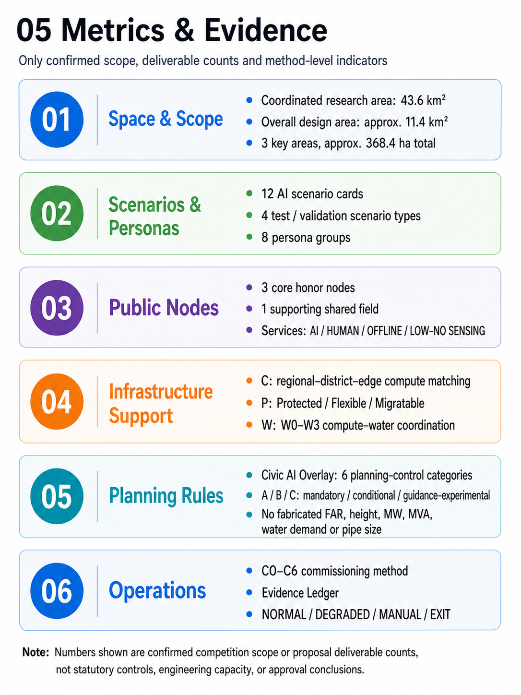

Board 05 has been updated in bilingual versions and now consistently presents **six planning controls** (spatial access, service range, resource capacity, operating conditions, responsible party and dynamic maintenance), aligned with this section, `metrics.json` and the structured Civic AI Overlay rules. Asset source, input/base-map record, processing and public-submission-rights status are recorded in `report/copyright_statement.md` and `sources.json` under `visual_asset_provenance`. [source:VISUAL-ASSET-PROVENANCE]

### 13.3 Technical boundaries and next-stage interfaces

1. **Research scale, conceptual-design boundary and statutory-boundary coordination.** The 43.6 km² figure carries the announcement's research scale; the `provisional_rough` polygon in `geometry/site_boundary.geojson` supports open-call conceptual design, area recalculation and spatial consistency, currently recalculating to about 11.41 km². Official polygons, statutory controls, ownership, heritage and engineering information trigger coordinated review of areas, ratios, parcels and interfaces. [depth:risk_missing_data]
2. **Missing parameters remain `unknown / to verify`.** FAR, height, density, population capacity, road redlines, heritage lines, municipal capacity, airspace management, MW, MVA, water volume, pipe diameter, equipment spacing, test duration, investment and return are carried into next-stage planning, ownership, heritage and engineering checks.
3. **Urban base and AI layer coordinate.** AI nodes provide prediction, simulation, scheduling and explanation; roads, power, water, drainage, fire safety, communications, railway and emergency systems remain organized through ordinary engineering and operating responsibility. The AI layer keeps clear interfaces with the urban base, while basic public services retain human, offline and low/no-sensing paths.
4. **Participation and professional procedures.** AI supports evidence organization, rule search, option comparison and version maintenance; judgments concerning public rights, land, demolition, compensation and statutory planning proceed through real public participation, professional review and authorized procedures.
5. **Operational safety and copyright.** AI capabilities use pause, isolation, degradation, rollback and exit; the cover, land-use board, architecture visuals and regional-coordination boards are labeled as AI/digitally generated conceptual illustrations or representative scenario imagery. Per-asset source, generation tool/model, input material, processing and public-submission-rights status are registered in `report/copyright_statement.md` and `sources.json`; the participant has confirmed public-submission rights for VIS-001–VIS-018 in the competition submission, GitHub PR, Gallery, Proposal Page and A3/A0 PDF scope. Historical tool/model, version, date, full-prompt and third-party-credential details were not retained as production metadata; each asset's base-map and personal-data status is explicit in the provenance ledger, and the visuals are not used as existing-site or statutory factual evidence. The public repository contains no known uncleared internal base maps, non-public metrics, personal information or restricted engineering material. [standard:GENERATIVE-AI-INTERIM-MEASURES]
6. **Regional-coordination fact boundary.** The regional innovation interfaces are planning-level capability interfaces and potential coordination paths. They do not establish named partnerships, funding arrangements, data-exchange agreements or government implementation arrangements; once participating parties confirm involvement, responsibility, data boundaries, service levels and exit mechanisms can be developed in the next stage.

### 13.4 References

The machine-readable source list is `sources.json`; compliance coverage is in `compliance_matrix.json`, professional standards in `standard_matrix.json`, and design-depth evidence in `design_depth_matrix.json`. Standards and design depth map to sections, layers, metrics, sources, assumptions and `completeness_limited_by`, keeping the conceptual package and next-stage interfaces explicit.

The organizer announcement and taskbook establish the three scales, three positionings, five functions, Three Zones-Two Wings and agent.1–agent.6. Provisional geometry supports conceptual design and consistency review; international cases provide mechanism-level comparison only. Missing FAR, height, ownership, heritage, municipal capacity, airspace, road-redline and engineering parameters remain `unknown` or conditional and trigger coordinated review and recalculation when authoritative information is released. [source:SOURCE-REGISTRY] [standard:PROJECT-OFFICIAL-ANNOUNCEMENT]
