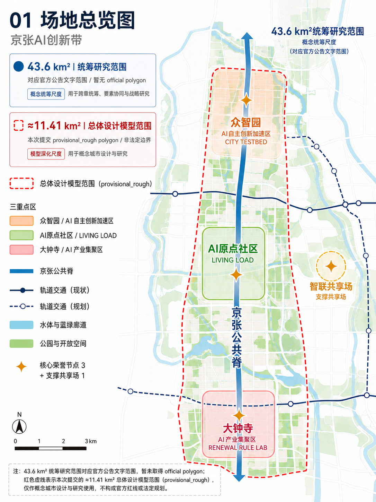
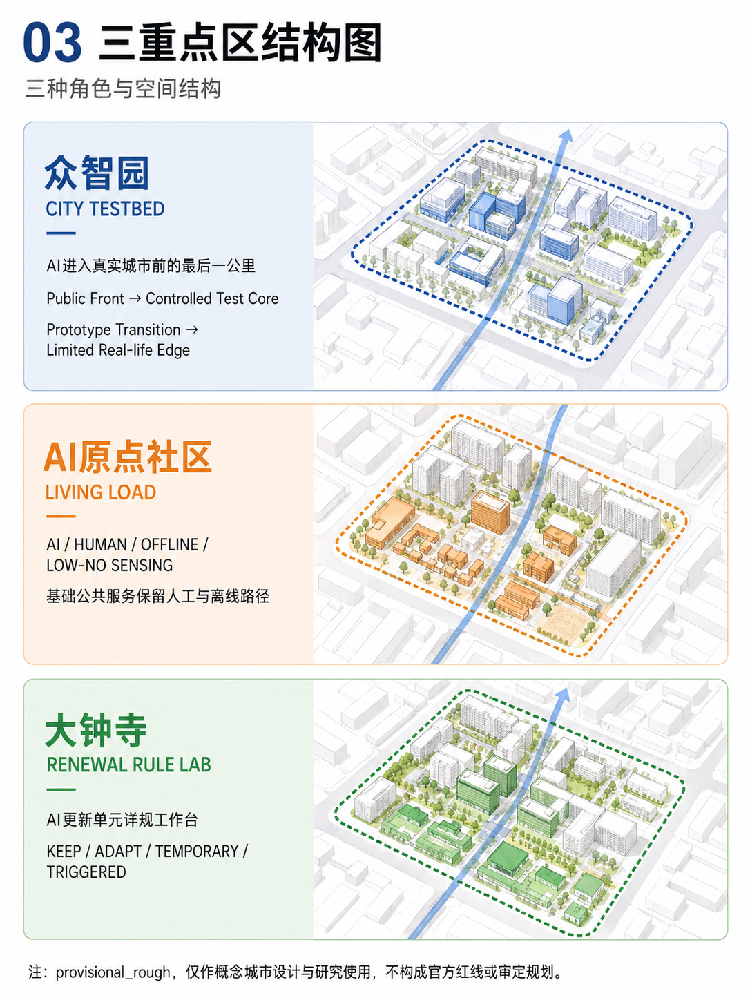
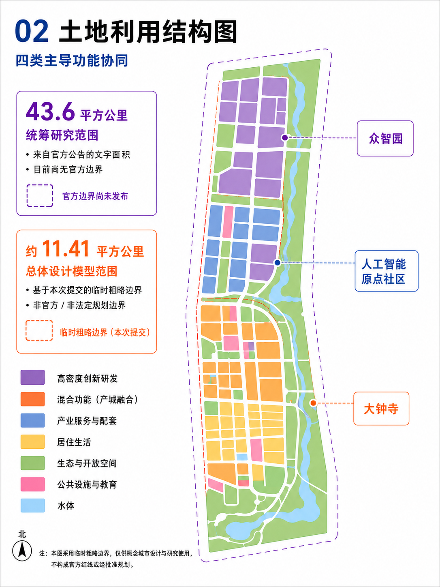
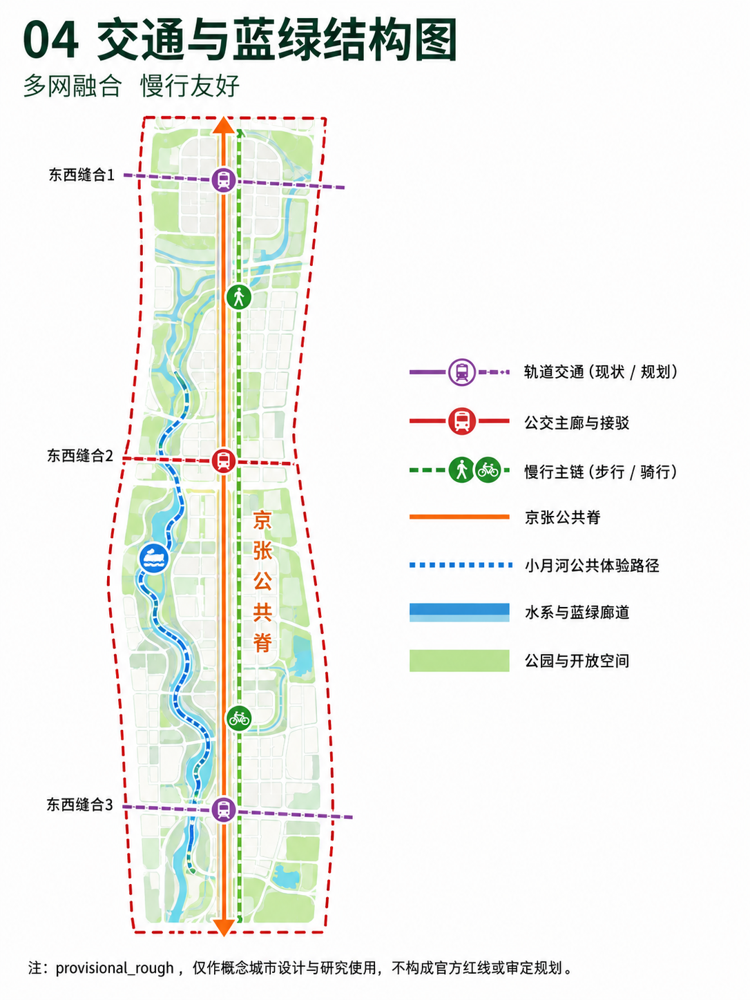
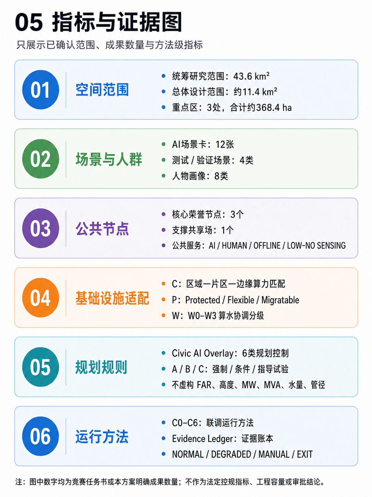

# 京张·城市联调带
## JING-ZHANG CITY COMMISSIONING BELT
### AI时代的城市规划与真实场景创新｜A CIVIC AI OVERLAY FOR THE AI-NATIVE CITY

**GOOD CITY FIRST｜城市生活优先**

**一句话方案：**京张铁路遗产构成公共空间骨架，海淀创新资源构成产业与知识基础，众智园、AI原点社区和大钟寺共同形成“技术验证—公共应用—规划转化”的城市创新链。方案以城市设计先行，把AI作为可进入城市空间、公共服务与更新机制的适配层。

京张公共脊连接遗产、创新、社区与更新场所，形成一条连续、可步行、可共享、可随日常与活动状态转换的城市公共走廊。Civic AI Overlay 把AI相关的空间对象、服务范围、资源承载、运行条件、责任主体和动态维护接口纳入规划表达；Compute / Power / Water 为任务与城市资源的时空匹配提供专业支撑；C0–C6 与 City Evidence Ledger 负责验证、记录和复验。

三处重点区各有清晰的城市角色：众智园承担开放创新与城市验证，AI原点社区承载AI时代的真实生活负载，大钟寺把成熟证据转译为存量城区的更新规则。三者共同构成：

**技术可用 → 公共可用 → 规则可用。**

当前概念设计采用主办方仓库维护的 `provisional_rough` 几何作为开放共创边界，承担空间关系表达、面积复算和一致性检查；后续将与官方 polygon、法定控规、权属、文保和工程资料开展衔接校核。 [source:BOUNDARY-SOURCE] [standard:PROJECT-OFFICIAL-ANNOUNCEMENT]

## 01｜方案愿景

### 1. 京张铁路遗产：城市公共空间骨架

京张铁路遗产以连续的线性空间承接城市记忆，也为步行、自行车、无障碍、蓝绿系统和东西向缝合提供清晰的空间基底。铁路工程从测量、建设、试运行到复核的实践经验，转化为今天城市设计中“先形成公共空间，再导入新能力”的工作方法。

### 2. 海淀创新资源：城市更新的产业与知识基础

中关村科技服务翼把科研、人才、知识产权、专业服务和创新活动接入公共脊；小月河场景赋能翼把生态、社区、市政系统和真实生活反馈接入创新链。创新资源由企业与机构集聚，进一步转化为可步行、可参与、可理解的城市空间和公共服务。

### 3. 三重点区：从能力验证到规划转化

众智园、AI原点社区和大钟寺以不同城市尺度承接同一条创新链：在开放测试环境中形成技术证据，在日常社区中检验公共价值，在存量城区中形成可持续维护的更新规则。城市设计因此同时关注空间品质、生活体验、基础设施适配和实施机制。

### 城市没有标准答案

城市由生活、制度、基础设施、文化记忆和持续使用共同塑造。人类智慧提供价值判断、经验、伦理、情感与责任，硅基智慧提供感知、推演、协同与学习；二者共同服务于人的日常生活、公共利益和城市长期韧性。方案把这种协作落实为空间结构、公共服务和可复核的实施路径。

## 02｜总体城市结构｜一脊·三重点区·两翼·多节点｜统筹研究范围产业与未来城市研究

方案形成清晰的总体城市设计总纲：

- **一脊｜京张公共创新脊**：以铁路遗产公园为连续公共空间骨架，串联步行、自行车、无障碍、蓝绿和公共服务，连接三处重点区。
- **三重点区｜众智园、AI原点社区、大钟寺**：分别承担开放验证、日常生活负载和存量更新规则转化。
- **两翼｜中关村科技服务翼、小月河场景赋能翼**：一侧强化科研、专业服务和创新生态，另一侧强化生态、社区、市政和生活场景反馈。
- **多节点｜遗产、创新、社区、缝合与活动空间**：沿公共脊布置公共客厅、创新前厅、城市缝合门和开放活动场，形成可停留、可交流、可学习的节点网络。

总体结构遵循“城市生活先成立、创新能力再嵌入、规则随着证据维护”的层次关系。公共脊提供连续的空间体验，重点区提供差异化的城市功能，两翼提供跨区域协同，多节点提供日常与活动的弹性承载。 [depth:overall_spatial_structure]

### START HERE｜评审导读

沿以下路径阅读，可从城市空间主体进入技术与实施接口（这是阅读导航，不新增方案层级）：

1. **这里要设计什么样的城市？** 阅读 01/02，先看铁路遗产公共脊、三重点区、两翼与多节点如何组织城市生活。
2. **三重点区为什么不同？** 阅读 05，看众智园、AI原点社区、大钟寺如何分别承担技术验证、真实生活与更新规则转化。
3. **AI如何进入城市规划？** 阅读 10，看AI能力如何转译为六类 Civic AI Overlay 规划控制。
4. **AI基础设施如何落位？** 阅读 09，看 Compute / Power / Water 如何按“任务—资源—空间”匹配。
5. **如何逐步实施？** 阅读 11/12，看 C0–C6、City Evidence Ledger 与 NOW / NEXT / CONDITION-BASED 如何组成验证与实施节奏。
6. **如何保持证据边界？** 阅读 11.3/13.3，看证据账本、provisional/source 状态和技术深化接口如何共同维护事实边界。

## 03｜三层尺度与工作框架｜三层范围工作框架

### 43.6km²统筹研究范围｜CITY SYSTEM

43.6km²是公告文字明确的统筹研究范围，用于研究AI科研、产业、人才、公共服务、算力能源和真实场景反馈之间的区域关系，形成创新生态与城市系统协同框架。当前以公告文字面积和任务关系表达该城市系统尺度；组织方尚未提供与该文字面积对应的官方polygon，因此本层不把43.6km²绘制为当前提交几何。 [source:OFFICIAL-ANNOUNCEMENT]

### 约11.4km²总体设计范围｜CITY COMMISSIONING DISTRICT

总体设计范围以京张遗址公园及周边城市地区为主要空间载体，落位公共脊、东西向缝合、慢行与蓝绿系统、AI基础设施接口、市政韧性网络和存量更新单元。`geometry/site_boundary.geojson` 的 `SITE-001` 采用 `provisional_rough` 属性，面积由当前 submitted polygon 几何复算约11.41km²，属于本稿概念设计模型范围。场地总览图中的红色虚线只表示这一约11.41km²模型范围，与43.6km²公告文字统筹研究尺度相互独立；后续与法定边界、控规、权属、文保和工程条件衔接校核，不作为审批依据。 [data:geometry/site_boundary.geojson#SITE-001] [metric:site_area_sqm]

### 约368.4ha三处重点区域｜CITY LABS

三处重点区域由众智园、北京AI原点社区和大钟寺组成，分别承担开放创新与验证、真实生活负载、更新规则转化。重点区边界当前服务于片区关系和空间设计表达，后续与法定边界、权属和专项条件开展衔接校核。 [data:geometry/key_areas.geojson#PROV-KEY-001] [metric:key_area_count]

三层尺度形成“城市系统统筹—总体城市设计—重点片区深化”的工作分工：上层统筹资源与能力流，中层组织空间结构与公共脊，下层将空间原型、公共服务、建筑界面和更新行动落到可实施单元。 [depth:three_level_scope_framework]

### 区域创新协同｜从真实区位到城市能力转化

在43.6km²公告文字统筹研究尺度内，京张承担区域能力进入真实城市的规划接口功能。京张以**城市验证与规划转化接口**（URBAN VALIDATION & PLANNING TRANSLATION INTERFACE）作为区域角色，承接“科研供给—工程转化—城市验证—公共应用—证据反馈—再迭代”的中段环节，把外部创新能力转译为可进入公共空间、社区生活和存量更新的城市条件，并与科研园区、制造基地和区域算力形成互补。该处43.6km²继续表示研究叙事尺度，当前空间落位以约11.41km² `provisional_rough` 总体设计模型及三处重点区几何为准。

区域协同采用“**真实区位 → 城市承接 → 场景接口 → 证据沉淀 → 规划转化 → 区域扩散**”的工作链。区域主体提供科研、仿真、工程化、生活反馈和产业网络等能力输入；一脊、三重点区、两翼、多节点提供空间承接；场景验证与 City Evidence Ledger 形成可追溯反馈；成熟经验再转化为空间原型、公共服务要求、更新规则和可迁移的方法。下表将“输入—承担—输出 / 反馈”分开呈现，属于 proposed planning interface，用于组织能力交换与规划协同；正式合作关系、资金安排、数据交换协议和政府实施机制在相关主体确认后进入专门程序：

|协同对象|输入能力 / 场景|京张现有体系承担的角色|输出 / 反馈|对应现有体系|
|---|---|---|---|---|
|北纬社区及海淀周边社区|居民需求、日常生活反馈、老幼与无障碍服务场景、教育健康需求|公共服务原型与真实生活场景验证|服务原型改进、使用反馈、包容性与可达性证据|AI原点社区 LIVING LOAD／小月河场景赋能翼|
|未来科学城|AI科研成果、模型、工具链与科研平台能力|从技术成果到真实城市应用条件的场景测试|城市场景证据、使用条件与反馈|众智园 CITY TESTBED／Research → Test|
|怀柔科学城|科学智能、仿真、科研成果与科学数据|城市应用条件转译与验证|城市验证证据、适用边界与反馈|众智园 CITY TESTBED／City Evidence Ledger|
|北京经开区|机器人、智能装备、工程化与中试能力|真实街道、社区、公共空间和基础设施验证|产品修正、场景要求和验证反馈|CITY TESTBED／Open Urban AI Plugfest|
|京津冀协同|区域算力、产业网络、可迁移计算与批处理能力|本地高价值、低时延城市任务接口|任务调度需求、验证方法与可迁移经验|Compute Matching／区域算力 → 片区共享 → 边缘节点|

区域接口以能力输入、空间承载、服务反馈和证据回流为基本关系：科研与仿真提供可验证能力，工程化提供可部署条件，京张公共脊与三重点区提供真实用户和城市基底，City Evidence Ledger 将反馈转译为下一轮规则与试点条件。 [source:AGENT-TASKBOOK]

### 四张区域协同图｜从区位关系到价值闭环

以下四张图构成区域协同的补充设计层，依次回答“区域能力从哪里来、如何进入京张、在哪些城市场景中被承接、如何形成可回流的规划价值”。图中箭头、距离和边界用于规划关系示意；图内照片样式插图统一标注为 **典型场景示意 / Representative Scenario Imagery**，具体区位、距离、边界和点位在下一阶段以正式公开资料与专项校核为准。

#### 图1｜区域区位关系与协同格局

*图内场景影像：典型场景示意｜非对应地点实景证据。*

**规划判断｜**以京津冀区域—北京市域—海淀局部三级区位关系建立区域协同的空间认知，明确京张在区域创新网络中的接口位置：科研源、科学智能源、工程化中试、生活反馈与区域支撑共同汇入本地城市验证。

**空间承接｜**京张公共脊、众智园、AI原点社区、大钟寺和两翼形成“区域能力—城市空间—公共应用”的承接骨架；铁路遗产公共空间提供可识别的本地验证界面。

**输入—承接—输出 / 反馈｜**科研成果、模型和工具链进入城市测试，科学智能与仿真进入证据账本，工程化能力进入设备与街道场景，社区反馈进入生活服务与公共空间更新，区域算力和产业网络支撑高价值、低时延及可迁移任务。

#### 图2｜北京尺度协同接口与空间承接

*图内场景影像：典型场景示意｜非对应地点实景证据。*

**规划判断｜**在北京尺度建立“资源输入—空间承接—城市输出”的接口层，把不同来源、不同成熟度的创新能力分配到具有明确城市角色的承接单元，形成面向规划实施的能力—空间匹配。

**空间承接｜**众智园 CITY TESTBED 承接研发、工程化和多主体测试；AI原点社区 LIVING LOAD 承接社区服务、生活反馈与可达性验证；大钟寺 RENEWAL RULE LAB 承接科学智能、证据复验与存量更新规则；中关村科技服务翼、小月河场景赋能翼和 Compute Matching 提供专业服务、生态生活与算力调度支撑。

**输入—承接—输出 / 反馈｜**未来科学城与怀柔科学城形成科研和科学智能输入，北京经开区形成机器人与工程化输入，北纬社区及海淀周边社区形成生活反馈输入，京津冀形成区域算力与产业协同输入；京张将其转译为城市验证证据、公共服务改进、产品接口要求和可复用规则。

#### 图3｜真实场景素材与城市测试界面

*图内场景影像：典型场景示意｜非对应地点实景证据。*

**规划判断｜**区域协同进一步落实到真实城市环境，通过社区生活、科研创新、科学智能、工程制造、京张铁路遗产公共空间和区域资源六类场景来源，与京张现有城市设计体系中的四类本地承接界面建立对应关系，说明不同创新能力进入真实城市后的具体测试路径。

**六类场景来源｜**

- **北纬社区及周边社区**提供生活需求与真实使用反馈；
- **未来科学城**提供AI科研成果、模型与工具能力；
- **怀柔科学城**提供科学智能、仿真和科研数据能力；
- **北京经开区**提供机器人、智能装备和工程化能力；
- **京张公共脊与铁路遗产场景**提供真实公共空间、遗产利用和城市活动环境；
- **京津冀区域**提供区域算力、产业网络和资源支撑。

**四类本地承接界面｜**

1. **众智园 CITY TESTBED** 承接未来科学城、怀柔科学城和北京经开区所代表的科研、科学智能与工程化能力，在真实街道、建筑、公共空间和基础设施条件中开展模型、工具、设备和产品的城市适配验证。

2. **AI原点社区 LIVING LOAD（含小月河场景赋能翼）** 承接北纬社区及周边社区形成的生活需求和使用反馈，通过社区服务、公共空间、无障碍和日常生活场景检验技术对城市服务体验的改善效果。

3. **大钟寺 RENEWAL RULE LAB** 承接京张公共脊、铁路遗产利用和本地城市验证过程中形成的空间经验与运行证据，将成熟结果进一步转化为存量城区更新、空间组织和动态维护规则。

4. **中关村科技服务翼 + Compute Matching** 承接京津冀区域算力、产业网络与资源支撑，并连接企业服务、人才、资本和成果转化，为本地城市验证及成熟经验的区域扩散提供专业支撑。

**证据机制｜**City Evidence Ledger 不作为独立空间节点，而作为贯穿科研、工程化与城市验证过程的横向证据机制，持续记录模型版本、测试条件、空间范围、反馈结果和复验要求，使场景测试能够进入后续规划判断。

由此形成一条简化而清晰的场景转化路径：

**科研源 → 工程化 → 城市验证 → 证据沉淀 → 规划转化与区域扩散**

图中场景影像用于表达典型空间类型、使用状态和能力来源，统一作为 **典型场景示意 / Representative Scenario Imagery**；具体合作关系、授权安排和实施机制以正式公开资料及后续专项校核为准。

#### 图4｜协同闭环与价值转化路径

*图内场景影像：典型场景示意｜非对应地点实景证据。*

**规划判断｜**图4将区域协同归纳为可循环的城市创新机制：**Research → Engineering → Urban Test → Daily Life → Evidence → Planning Rule → Regional Scaling**。京张的核心价值在于把外部创新资源转换为可进入真实城市、服务公众生活并反馈规划规则的本地能力。

**空间承接｜**众智园承担城市测试，AI原点社区承接日常生活，大钟寺承接规则转化，京张公共脊串联遗产、公共活动与城市服务，中关村科技服务翼和小月河场景赋能翼承担专业服务、生态生活和产业活动的协同界面。

**输入—承接—输出 / 反馈｜**研究与工程化形成可验证能力和可部署条件；城市测试与日常生活形成使用反馈；证据沉淀转化为规划规则；区域扩散将经复验的空间原型、服务方法和接口经验带回区域网络，进入下一轮研究与测试。 [depth:three_level_scope_framework]

## 04｜京张公共脊｜从铁路遗产到城市公共生活

京张公共脊是方案的空间主角。它以铁路遗产连续性为文化底色，以慢行、树荫、休憩、无障碍、蓝绿和开放首层构成日常公共生活的连续基底；数字设施以小型化、分布式、环境融合的方式进入公共空间，与导航、充电、应急、解释和公共服务共同工作。 [standard:MOHURD-URBAN-DESIGN-MEASURES]

### 五类城市空间原型

1. **Railway Heritage Room｜铁路记忆客厅**：以遗产构件、铺装、展陈和可停留的座椅系统讲述京张工程文化，成为居民、访客和学生共享的城市记忆场。
2. **Developer Commons｜开发者共享前厅**：面向开发者、企业、科研人员和公共部门，提供开放交流、展示解释、接口协作和活动集合的首层空间。
3. **Neighborhood Commons｜社区生活客厅**：把社区服务、儿童与全龄活动、日常休憩、健康和邻里交往组织在公共脊可达的生活节点。
4. **Stitching Gate｜城市缝合门**：在铁路、道路、街区和蓝绿空间之间形成清晰的步行与无障碍过渡，承接东西向公共联系。
5. **Event Field｜城市开放活动场**：通过可移动设施、可调整的开放场地和周边公共服务，支持 Commissioning Week、Open Urban AI Plugfest、市集、展览与日常使用之间的状态转换。

五类原型共同建立“日常状态 + 活动状态”的时间性公共空间：平日提供通行、停留和服务，活动时提供展陈、交流、测试和公众反馈。它们以公共空间品质为先，再容纳AI解释界面、城市微节点和联调活动。

### VI与导视最小规范｜文字标识、片区识别与公共空间导向

本稿采用清晰、可复用的文字标识系统，将城市设计主线、三处重点区和年度公共活动纳入同一母品牌；当前阶段以文字标识和概念色彩系统完成识别，不另行主张独立图形Logo。 [source:AGENT-TASKBOOK]

|识别层级|统一规范|城市空间应用|
|---|---|---|
|**母品牌文字标**|中文：**京张·城市联调带**；英文：**JING-ZHANG CITY COMMISSIONING BELT**。中英文采用锁定组合，同版出现时保持字距、行距和相对比例稳定。|公共脊入口、公共导览、开放证据厅和正式发布物。|
|**主口号**|**GOOD CITY FIRST｜城市生活优先**，作为母品牌下的价值口号，与主标志保持清晰层级。|入口标题、公共空间说明、活动开场和页面首屏。|
|**三重点区身份**|众智园 **CITY TESTBED**、AI原点社区 **LIVING LOAD**、大钟寺 **RENEWAL RULE LAB**。三者作为片区副身份，统一置于母品牌下。|片区入口、节点说明、城市家具与专题导视。|
|**橙色星形节点**|仅表示“核心公共荣誉节点 / supporting commons”识别，不代表AI设备、审批状态或商业品牌。|First Run Yard、Open Evidence Hall、Civic Override Beacon 与 Commissioning Commons 的节点导向。|
|**活动子品牌**|Commissioning Week、Open Urban AI Plugfest、Civic Audit Open Day、Rulebook Release 均使用母品牌前缀或联署关系，保持名称、日期、主办责任和活动状态清晰。|Event Field、Developer Commons、开放证据厅和年度活动导视。|

**色彩与字体规则｜**公共脊铁路色 `#B5523B`（RGB 181, 82, 59），CITY TESTBED 金色 `#CF9D3E`（RGB 207, 157, 62），LIVING LOAD 蓝色 `#1C5C73`（RGB 28, 92, 115），RENEWAL RULE LAB 绿色 `#486B5D`（RGB 72, 107, 93）；纸面底色和深色底分别提供全彩、黑白单色和反白版本。标识安全区以主文字标志字高的 **1x** 为最小周边留白，屏幕最小宽度建议 **120px**、印刷最小宽度建议 **25mm**；低于该尺寸时只保留片区文字，不压缩中英文锁定组合。中文页面使用页面内嵌的 `JingZhang CJK Subset`，英文使用同一无衬线字体系；字体来源与 SIL Open Font License 1.1 见 `report/copyright_statement.md`，导视箭头、圆点和星形符号按其空间语义独立使用。

**方法原创性说明｜**开放公共空间、慢行优先、适应性再利用、Living Lab 和证据账本属于可复用的城市规划方法；本方案的特有组合是“京张铁路遗产公共脊 + 三重点区城市角色 + Compute / Power / Water 资源适配 + 六类 Civic AI Overlay 规划控制 + C0–C6 证据循环”，以同一条城市设计主线把遗产、生活、产业、基础设施和更新规则连接起来。

## 05｜三重点区城市设计｜重点区域详细设计

三重点区统一采用“定位—空间结构—城市界面—典型场所—实施行动”的设计模板，并通过公共脊建立连续的城市体验。

### A. 众智园｜CITY TESTBED

**定位｜开放创新与城市验证片区。**

众智园以公共创新前厅为城市入口，以受控验证核心承载设备、机器人、模型、网络和市政AI接口测试，以原型过渡带连接研发与公共空间，以有限真实应用界面承接经过验证的场景，并以可插拔测试单元支持设备和服务的更新。

**空间结构｜公众共享环 + 研发验证环 + 运维保障环。** 公众共享环面向参观、交流、解释和活动；研发验证环组织开放测试场、机器人与自主系统测试路网、边缘算力与通信节点；运维保障环承接能源接口、维护、故障隔离和人工处置。

**城市界面｜开放首层、可见测试、连续步行。** 建筑首层与公共脊形成开放前厅，测试设备以小尺度、可维护的方式进入街道界面；测试过程通过开放证据、现场说明和可理解的状态信息与公众沟通。

**典型场所｜**公共创新前厅、机器人低速测试街道、开发者共享设施、边缘节点花园、City Commissioning Pod。

**实施行动｜**先形成公共空间和开放测试条件，再以证据成熟度推进有限真实负载；通过 C0–C6 对接口兼容、真实负载、故障恢复、人工接管和长期维护开展连续验证。 [data:geometry/key_areas.geojson#PROV-KEY-001]

### B. 北京AI原点社区｜LIVING LOAD

**定位｜AI时代高品质生活社区。**

AI原点社区以15分钟生活网络为组织框架，把住房、教育、健康、养老、托育、社区服务、商业、通勤、无障碍和夜间生活布置在连续可达的公共空间体系中。开放首层、全龄公共空间、教育健康节点和社区生活客厅构成日常生活的基本场景，AI作为增强服务进入其中。

**空间结构｜生活网络 + 社区客厅 + 连续慢行。** 社区客厅连接公共服务、邻里交往和活动场地；慢行系统以树荫、休憩、无障碍和清晰导向形成连续体验；公共服务节点提供解释、咨询和人工转接。

**四类服务方式｜AI / HUMAN / OFFLINE / LOW-SENSING。** 居民可以主动使用AI获得导航、信息和协同服务，也可以沿人工、离线和低感知路径完成基础公共任务。四类路径以基本服务结果可达为共同目标，支持不同年龄、能力和数字使用偏好的居民。

**典型场所｜**社区生活客厅、全龄共享庭院、无障碍慢行环、教育健康服务节点、低感知休憩场。

**实施行动｜**先完善公共服务网络、开放首层和连续慢行，再将经过验证的AI服务接入生活场景；以居民反馈、可达性和服务连续性作为空间运营与规则更新依据。 [data:geometry/key_areas.geojson#PROV-KEY-002] [standard:BARRIER-FREE-ENVIRONMENT-LAW]

### C. 大钟寺｜RENEWAL RULE LAB

**定位｜存量创新城区更新示范单元。**

大钟寺以“单元统筹—项目实施—动态维护”为主线，把现状体检、资源识别、多主体协商、片区—地块校核、公共利益校核和项目行动组织成连续的更新工作台。成熟的AI能力在这里转化为空间接口、公共服务要求、项目条件和可维护的更新规则。

**空间结构｜更新议事厅 + 公共服务补短板 + 适应性再利用单元。** 更新议事厅承接证据公开、方案比选和多主体协商；公共服务项目改善步行、站城联系和生活服务；存量建筑通过保留提升、适应性再利用、公共功能植入、阶段性使用和条件成熟型更新获得新的公共价值。

**城市界面｜小尺度更新、开放首层、连续缝合。** 以街道、首层、公共场地和既有结构的适应性改善作为优先行动，让更新项目逐步补齐公共空间网络，并与京张公共脊形成可识别的步行联系。

**典型场所｜**更新议事厅、公共功能植入单元、适应性再利用建筑、临时创新空间、站城复合服务场景。

**实施行动｜**以体检评估、资源识别、单元策划、项目行动、专项校核和动态维护形成项目清单；AI用于证据整理、规则查询、情景比选、片区—地块校核和版本维护，最终规划判断由真实公众参与、专业审查和有权主体程序完成。 [data:geometry/key_areas.geojson#PROV-KEY-003] [depth:three_key_area_detailed_design]

## 06｜建筑与公共空间｜补充设计层

三张建筑方案图作为城市设计的补充表达层，负责说明建筑母体、街道界面、公共空间、材料关系和空间体验；它们与五张核心规划证据图共同构成“空间结构—片区角色—建筑体验”的阅读链。建筑位置、尺度、结构和工程条件在后续专业深化阶段与正式资料衔接校核。

### 方案一｜城市界面原型：开放创新建筑群与京张公共脊

方案一以京张公共脊两侧的建筑母体为重点：白色开放建筑采用规则体量、通透首层、水平长窗和可变工作界面，承接开放创新与协作；红砖城市建筑以实体感、深窗和垂直构件回应铁路记忆、城市尺度和长期公共使用。建筑退界形成前广场与庭院，公共连廊串联两侧首层，三个色彩节点提示“技术可用—公共可用—规则可用”的空间转译关系。

### 方案二｜建筑—公共空间一体化系统

方案二通过“总图—城市剖面—功能图解—结构意向—连廊细部—材料—日夜状态”的组合，说明建筑如何与公共空间形成一体化系统。共享大厅、立体步行、城市露台和公共连廊把建筑内部活动延伸到公共脊；浅色建筑、暖色砖石、轻型金属与玻璃共同构成新旧关系清晰、尺度亲切的材料体系。黄色、蓝色和红色节点分别表达技术测试、公共服务与规则公开的空间角色。

### 方案三｜公共空间序列：从创新前厅到更新议事厅

方案三建立连续的场所序列：**创新前厅 → 验证街道 → 城市共享场 → 社区生活客厅 → 更新议事厅**。众智园提供可复现的技术测试和设备替换界面，AI原点提供面向居民的公共服务、解释和人工帮助，大钟寺提供证据公开、规则复验和更新协商界面。主轴、广场、首层、连廊、绿化和联调舱共同形成可步行的公共脊；日景与夜景表达使用氛围和运营时段的变化。

### 建筑设计说明与后续专业深化接口

1. **建筑首先形成完整的城市功能。** 公共大厅、步行联系、无障碍、消防疏散和人工服务具备独立的空间逻辑，AI以可维护、可替换的附加层进入建筑。
2. **公共界面优先。** 开放首层、前广场、庭院、公共连廊和街道退界共同形成连续的城市界面，建筑体量沿公共脊开放并在重点节点形成识别。
3. **联调舱采用小尺度、可插拔原型。** 感知、计算、能源和交互界面集中在可替换的接口空间、设备带和联调舱中，与主体建筑的结构寿命形成适配关系。
4. **下一阶段深化接口。** 高度、退线、结构、消防、文保、权属、铁路与道路条件进入专项校核；当前图件承担城市设计意向、建筑—公共空间关系和材料氛围表达。 [depth:height_massing_character]

## 07｜用地、更新与控规深度｜总体设计范围城市更新与控规深度城市设计｜用地、建筑规模与拆改留方案

### 7.1 用地结构与功能梯度

用地结构以科研用地、公园绿地、商业服务业和社区服务设施等统一分类，组织“研究—验证—日常生活—更新转化”的功能梯度。科研与创新空间沿公共脊形成开放前厅，公园绿地提供连续的生态与步行基底，商业服务和社区服务补充日常生活与公共活动，形成由城市系统到街区生活的多层次接口。 [data:geometry/land_use.geojson#LU-001] [standard:MNR-LAND-USE-CLASSIFICATION-GUIDE] [depth:land_use_layout]

当前用地模型以7个概念用地单元表达功能关系，作为总体城市设计与后续控规衔接的空间底板。

### 7.2 存量城区更新方法

更新工作采用：

**体检评估 → 资源识别 → 单元策划 → 项目行动 → 专项校核 → 动态维护。**

这一方法把存量建筑、公共空间、产业活动、社区服务和基础设施条件放在同一更新单元中统筹。项目根据现状价值、公共需求、权属协商和工程条件选择行动组合：

- **KEEP｜保留提升**：延续具有记忆、使用和结构价值的建筑与空间；
- **ADAPT｜适应性再利用**：通过开放首层、功能植入、公共界面改善和设施更新导入新使用；
- **TEMPORARY｜阶段性使用**：以可逆、可维护的临时空间承接活动、测试和过渡运营；
- **TRIGGERED｜条件成熟型更新**：在权属、文保、工程、公共利益和法定程序条件齐备后启动更大尺度行动。

上述四类行动构成“单元统筹—项目实施—动态维护”的更新工具箱，并与机器可读图层保持既有口径。公共功能植入作为人类可读的设计动作，可以嵌入 KEEP、ADAPT 或 TEMPORARY 单元，用于补充社区服务、公共空间、解释展陈和共享设施，不新增机器分类。 [standard:MOHURD-CONTROL-DETAILED-PLANNING] [depth:retain_renovate_demolish]

### 7.3 概念建筑体量与实施边界

建筑基底模型用于表达重点区的概念更新单元，服务于保留提升、适应性再利用、公共功能植入和阶段性使用的空间比选。当前模型建筑基底面积约892843.844m²，绿色空间比例约17.6%，均属于设计模型输出。 [metric:building_footprint_area_sqm] [metric:green_ratio] [depth:development_intensity_controls]

建筑体量以沿公共脊开放、重点节点形成识别、重点区内部适应真实功能为设计原则。高度、退线、密度、FAR、人口承载、权属、文保和结构条件将在正式资料到位后进入控规与专项工程校核；本阶段重点完成空间关系、公共界面和更新路径表达。

### 7.4 City Commissioning Pod｜模块化城市联调舱

City Commissioning Pod 是一种小尺度、可插拔的城市接口原型，可根据片区需要复合边缘推理、能源接口、公共感知告知、人工求助和物理停用等功能。它与公共脊、庭院、前广场和开放首层共同形成可见、可维护的城市服务节点；数量、间距、设备功率、储能规模和具体结构进入后续工程深化。

## 08｜交通、蓝绿与公共服务｜交通、轨道、市政与公共服务设施｜蓝绿空间、公共空间与城市风貌

### 8.1 慢行公共脊与东西向缝合

交通设计以慢行公共脊为核心，连续组织步行、自行车、无障碍、树荫、休憩、导向和公共服务。三个概念东西向缝合点连接铁路、公园、道路、街区和小月河场景，使公共脊从线性遗产空间转化为可达的城市生活网络。现有道路图层中的主脊长度约9483.47m，用于概念模型的空间关系表达。 [data:geometry/roads.geojson#ROAD-X01] [depth:traffic_rail_slow_parking]

### 8.2 Commissioning Right-of-Way｜分级调测路权

常规城市交通、应急和服务交通维持清晰的通行优先级；低速机器人、配送设备和自主系统在明确的空间、时段、速度、责任与人工接管条件下进入限定测试段。低空物流、地下微管廊和专用能源/散热通道作为条件成熟型接口，与空域、安全、文保、市政容量和工程条件同步深化。

### 8.3 蓝绿系统与城市风貌

蓝绿空间沿公共脊、街道、节点和小月河场景形成连续的树荫与雨洪适应基底。公共空间以铁路遗产连续叙事、真实街道尺度、全龄活动、可停留家具和小尺度数字界面塑造城市风貌；概念设计模型的绿地比例约17.6%。 [metric:green_ratio] 公共空间比例约6.7%，并与城市设计措施衔接。 [metric:public_space_ratio] [standard:MOHURD-URBAN-DESIGN-MEASURES] [depth:blue_green_public_space]

### 8.4 公共服务的四类等价路径

承载基础公共服务的节点统一组织四类服务方式：

1. **AI**：主动使用智能导航、信息和协同服务；
2. **HUMAN**：通过现场窗口、值守或人工转接获得服务；
3. **OFFLINE**：在无账号、断网或模型不可用状态下完成基础任务；
4. **LOW-SENSING**：在低感知或无持续识别的环境中正常通行和使用公共空间。

四类路径以基本服务结果可达、责任主体可理解和使用过程可选择为共同标准。无障碍连续性、儿童与全龄活动、老人服务、公共解释和投诉申诉入口进入节点设计。 [standard:BARRIER-FREE-ENVIRONMENT-LAW]

### 8.5 Digital Quiet / Low-Sensing Zones｜数字宁静与低感知空间

居住、儿童、无障碍和生态敏感场景优先采用最小必要感知、明确告知、非识别技术、本地处理和可退出机制。低感知空间与休憩、阅读、社区交往和自然体验结合，形成数字设施与宁静生活并存的公共环境；具体范围随正式用途、隐私影响、技术必要性和运营责任开展专项确定。

### 8.6 公共节点：3个核心荣誉节点 + 1个支撑共享场

1. **First Run Yard｜首发试运行场**：以铁路工程的测试、复核和真实运营文化作为城市联调的公共起点。
2. **Open Evidence Hall｜开放证据厅**：公开规则、来源、版本、测试证据、问题记录和开源贡献。
3. **Civic Override Beacon｜公共接管灯塔**：把有限权限、人工责任、降级与退出转化为公众可理解的空间标识。
4. **Commissioning Commons｜联调共享场**：服务开发者、居民、企业、运维者和公共部门的测试、交流与反馈，作为支撑型共享场。

机器可读层以 `PUBLIC-LM-01`、`PUBLIC-LM-02`、`PUBLIC-LM-03` 表达三个核心节点的概念代表点，以 `PUBLIC-LM-004` 表达支撑型共享场的面状关系。 [data:geometry/public_space.geojson#PUBLIC-LM-01] [data:geometry/public_space.geojson#PUBLIC-LM-02]

其余两个节点要素与公共节点总数由结构化图层共同表达。 [data:geometry/public_space.geojson#PUBLIC-LM-03] [data:geometry/public_space.geojson#PUBLIC-LM-004] [metric:ai_landmark_count]

## 09｜AI基础设施适配｜Compute / Power / Water

AI基础设施适配围绕“任务—资源—空间”的时空匹配展开。城市公共空间、建筑设备、区域算力、片区共享服务和边缘节点形成分级接口，计算能力与电力、冷却、水、通信和运维条件协同组织。

### Compute｜分级算力

采用：

**区域算力 → 片区共享服务 → 边缘节点。**

区域算力承担训练和可迁移批处理；片区共享服务承接城市模型、科研和企业推理；边缘节点服务具有真实低时延、隐私敏感或高可靠需求的任务。算力接口沿创新前厅、公共服务节点和联调舱以分布式方式进入城市。

### Power｜任务与电力协同

以 `AI workload × power condition × storage × flexible building load × time` 组织任务与资源协调：

- **Protected｜保障型任务**：公共安全与关键城市服务优先获得连续保障；
- **Flexible｜柔性任务**：根据能源和运行条件开展移峰调度；
- **Migratable｜可迁移任务**：转移至区域算力或其他时间窗口执行。

### Water｜计算与水资源适配

采用 **W0–W3** 概念适配等级，从低冷却用水的边缘微节点，到需要联合协调能源、冷却、用水、散热和余热利用的高密算力。资源条件、任务必要性、空间承载和环境影响共同决定适配等级。

通信、地下市政和交通物流作为城市基础工程条件，遵循多路径、关键节点冗余、可维护和故障隔离原则。上述框架将 AI 预测、调度和资源配置能力嵌入城市工程协同，同时保留清晰的人工责任与常规城市运行路径。 [depth:municipal_new_infrastructure]

## 10｜Civic AI Overlay｜六类规划控制

**Civic AI Overlay 是AI时代详细规划的叠加管控层。** 它把AI设施、智能服务和运行状态纳入既有用地、交通、市政、公共空间、建设项目和动态维护体系，使规划从空间配置进一步延伸到服务范围、资源承载、责任主体和持续维护。

### 六类规划控制

|规划控制|机器字段|城市设计与详细规划表达|
|---|---|---|
|**空间准入**|Object|明确AI能力、感知设备、边缘节点、自主系统或公共AI服务的空间对象与进入条件。|
|**服务范围**|Spatial Scope|明确服务对象、影响范围、空间边界、时段和公共空间关系。|
|**资源承载**|Resource Interface|衔接道路、电力、水、算力、通信、建筑设备和公共空间等资源接口。|
|**运行条件**|Permission / Requirement / KPI|把权限等级、性能要求、人工转接、应急条件和服务连续性转化为运行条件。|
|**责任主体**|Responsible Party|标明运营者、维护者、人工责任人、公共部门和协作主体的职责接口。|
|**动态维护**|Evidence / Version / Re-test / Exit|记录数据与模型版本、测试证据、变更触发、复验、降级、回滚和退出路径。|

每条规则沿用统一机器可读结构：

`Rule ID → Spatial Scope → Object → Requirement/KPI → Source → Responsible Party → Permission → Commissioning Gate → Evidence → Version → Re-test Trigger → Rollback/Exit`

规则按三类组织：

- **A Mandatory｜强制底线**：公共安全、隐私、公共利益、人工接管、审计和应急条件；
- **B Conditional｜条件准入**：满足明确前置条件或等效性能后进入下一阶段；
- **C Guidance / Experimental｜指引与试验**：面向试点、创新和迭代的设计建议。

规划图负责表达城市空间骨架，Overlay负责说明AI能力在骨架中的空间准入、服务范围、资源承载、运行条件、责任主体和动态维护。规则检索、情景推演和一致性校核由AI辅助，法定规划结论、公众参与和有权主体审批沿既有专业程序完成。 [depth:professional_evidence_chain]

## 11｜城市创新循环、C0–C6与场景体系｜AI 创新生态、人才画像与 AI+ 场景

### 11.1 城市创新循环

京张城市联调带把创新活动组织为一条可回到城市日常的循环：

**Research → Test → Urban Pilot → Daily Use → Evidence → Rule Update → Re-test。**

众智园提供技术、接口和设备证据，AI原点社区提供生活体验、可达性、公平性和运营反馈，大钟寺把成熟证据转化为更新与规划规则；中关村科技服务翼连接科研、知识产权、人才、资本和专业服务，小月河场景赋能翼提供生态、社区、市政和公共服务反馈。

七个国际案例在本方案中承担机制级参照：

- **EU CitCom.ai**：真实城市测试与实验设施；
- **Punggol Digital District**：城区数字底座与真实运行；
- **Helsinki / Forum Virium**：企业、居民和公共部门共同参与 Living Lab；
- **Paris-Saclay DataIA**：科研—人才—创新连续体；
- **Toronto Vector Institute**：研究工程化和产业采用；
- **London Knowledge Quarter**：机构密度、公共文化与可步行创新环境；
- **监管沙盒机制**：有限范围、持续监测、真实证据和可调整运行。

这些案例用于比较机制零件，京张以本地公共脊、三重点区和城市更新条件组织组合机制。 [metric:ecosystem_case_count]

### 11.2 C0–C6｜城市能力验证序列

C0–C6 是连接 Civic AI Overlay 与 City Evidence Ledger 的运行方法，用于把一项AI能力从证据基线逐步带入城市场景：

1. **C0 Evidence Baseline｜证据基线**：确认数据来源、模型版本、空间范围、责任主体和初始性能；
2. **C1 Simulation｜情景模拟**：在可控条件下推演城市任务、资源和风险；
3. **C2 Rule Check｜规则校核**：核对规划条件、公共利益、接口要求和运行边界；
4. **C3 Shadow / Dummy Load｜影子 / 假负载**：在真实环境中观察系统状态与协同接口；
5. **C4 Limited Real Load｜有限真实负载**：在限定空间、时段、任务和责任条件下运行；
6. **C5 Human-supervised Operation｜人工监督运行**：由明确责任主体持续复核、处置和维护；
7. **C6 Recertification / Rollback / Exit｜复验 / 回滚 / 退出**：条件变化时复验，必要时降级、回滚或退出。

C0–C6的作用是为城市创新提供可复核的推进节奏；测试证据与城市运行权限分别记录，模型、数据、设施、政策或使用环境发生重要变化时重新进入相应验证阶段。

### 11.3 City Evidence Ledger｜城市证据账本

City Evidence Ledger 是 Overlay 与 C0–C6 之间的证据接口。每个AI城市项目至少记录：

`Project ID / Spatial Scope / Operator / Responsible Human / Data Source / Model & Version / Risk Class / Permission / Commissioning Gate / Test Evidence / Failure Events / Human Intervention / Approval / Re-test Trigger / Rollback / Exit / Public Summary`

账本让项目状态、当前权限、测试证据、失败事件、人工干预、模型变化和复验条件可追溯，也让公众能够区分“投稿、测试、试点、运行、退出”等不同事实状态。它与现有项目、用地、交通、市政和公共空间资料建立索引关系，服务后续规则维护。

### 11.4 八类用户｜公共利益测试集

八类用户将真实城市中的不同需求转化为可观察的空间服务和验收任务。 [metric:persona_count]

|用户类型|核心城市任务|空间与服务响应|重点验收焦点|
|---|---|---|---|
|AI科研 / 开发者|测试模型、终端、机器人与接口|可复现测试环境、开发者共享前厅和证据接口|证据与城市准入状态清晰|
|创业团队 / 企业|验证产品、寻找真实需求|接口、场地、合规路径和失败反馈|真实负载与公共价值可观察|
|居民与家庭|通勤、教育、健康、社区与休闲|低门槛信息、公共服务和多路径入口|基础服务连续、可理解、可选择|
|老人 / 残障人士|无障碍、人工帮助和可靠服务|连续无障碍慢行、状态信息和人工转接|断网或模型变化时服务保持可达|
|学生 / 访客|学习、参观和参与创新活动|铁路记忆客厅、开放证据和低门槛活动|公共空间兼具学习与日常使用|
|市政运维人员|安全、故障、维护和应急|影子运行、辅助诊断、调度建议和运维接口|责任清晰、维护路径可执行|
|产权人 / 开发主体|更新可行性、规则和投入|多方案推演、公共功能植入和规则校核|权属与项目条件沿正式程序确认|
|规划监管 / 公共决策人员|公共利益、程序、规则与责任|证据链、模拟、机器可读校核和公众沟通|专业判断、公众参与和程序责任完整|

### 11.5 十二张场景卡｜同一城市规则的压力测试

12张场景卡在不同空间、用户、数据条件、资源消耗和风险等级下，共同检验 Overlay 的规划控制与“证据—风险—权限—人工—回滚”机制。

|ID|空间 / 类型|用户与任务|数据与隐私|人工复核 / 运营|风险与退出|
|---|---|---|---|---|---|
|SC-01|众智园·工业验证|AI基础设施互操作 Plugfest|公开接口 / 测试数据，生产数据隔离|测试机构 + 厂商，人工批准|互操作证据达标后进入下一阶段|
|SC-02|众智园·工业验证|机器人与自主物流微枢纽|道路 / 设备状态，最小化人员识别|现场熔断 + 远程接管|行人冲突或设备故障触发停运处置|
|SC-03|众智园 / 小月河·工业验证|AI市政控制沙盒|水、排水、能源运行数据分级授权|市政运营主体最终确认|先影子运行，越权事件触发回滚|
|SC-04|大钟寺·规划验证|机器可读详规 / 规则引擎|公开规划与项目证据|规划人员审核|以辅助校核服务法定程序|
|SC-05|AI原点·公共服务|公共服务 Agent 站|用户主动输入，最小采集|人工窗口可转接|账号或模型变化时人工服务保持连续|
|SC-06|原点 + 公共脊|全龄无障碍出行 Agent|坡度、电梯、施工、积水状态|高风险路线人工确认|离线地图与人工帮助共同保障可达性|
|SC-07|小月河 / 沿线|内涝韧性 Agent|实测、预测、模拟严格标识|封控决策由授权主体确认|模型不确定时转为提示与人工判断|
|SC-08|众智园 + 总体区|算力—电力—水资源适配与任务编排|任务等级、能源、冷却和资源约束|园区、能源、设施运营者联合复核|保障型优先，迁移型任务转区域算力|
|SC-09|京张公共脊|AI城市微节点|低敏公共信息|公共空间运营者|断网时遮阴、休息和应急功能保持|
|SC-10|公共脊|活动 / 人群资源调度|聚合客流，采用非身份化信息|活动运营 + 应急人工确认|公共空间秩序由授权主体维护|
|SC-11|公共脊地标|开源贡献墙与公共AI审计节点|公开版本、来源和测试状态|项目运营组织|投稿、测试、入选、落地状态清晰|
|SC-12|大钟寺|更新议事厅 + 片区地块优化|公开规则 + 经授权项目参数|多主体协商，人类最终决策|规划更新沿真实公众参与和法定程序推进|

SC-01、SC-02、SC-03、SC-04构成4个产业 / 规划验证场景，覆盖互操作、机器人、市政AI和机器可读详规四类城市能力。 [metric:scenario_card_count] [metric:test_validation_scenario_count]

医疗、教育、法律、生活、商业和交通作为垂直服务子卡：健康服务聚焦导航与就医协同，教育保留教师审核，法律与规划Agent解释公开规则和办事路径，商业服务关注可解释的公共准入，交通服务共享无障碍、积水和施工状态证据。所有子卡沿用公共服务多路径与人工复核要求。 [standard:GENERATIVE-AI-INTERIM-MEASURES]

## 12｜实施路径与长期运营｜更新项目清单、实施政策与分期计划

实施路径把空间项目、公共服务和运营行动置于前端，以 **PROVE BEFORE SCALE｜验证后再扩展** 作为长期原则，采用近期行动、深化实施和条件成熟启动的三级时序。

### NOW｜近期行动

优先推进公共价值清晰、前置条件较少且便于维护的行动：

- Civic AI规则库与 City Evidence Ledger；
- 公开证据网页、铁路记忆客厅和开放证据厅；
- 开发者、居民和公众活动；
- 公共空间微节点、无障碍服务和低感知路径；
- 影子运行场景与可逆临时创新空间；
- 公共脊的树荫、休憩、导向和基础服务补强。

### NEXT｜深化实施

在测试证据、运营责任和工程条件进一步明确后，推进：

- 众智园开放测试环境与 City Commissioning Pod；
- 边缘推理、共享算力和能源接口；
- 机器人与物流微枢纽；
- AI原点社区公共服务网络与生活客厅；
- 大钟寺更新规则试点、更新议事厅和适应性再利用单元；
- 规划、站城复合和商业服务场景的公共空间衔接。

### CONDITION-BASED｜条件成熟启动

在正式规划、工程论证、部门审批、风险评估和联调证据共同具备后，启动：

- 更大范围的真实控制型AI运行；
- 低空物流与地下市政接口；
- 高强度算力基础设施；
- 需要系统性交通、能源、冷却或水务条件配合的更新行动。

当前分期图层以 NOW / NEXT / CONDITION-BASED 表达三类行动阶段。 [data:geometry/phasing.geojson#PHASE-001] [metric:phasing_stage_count]

更新项目清单以概念建筑单元、公共空间项目和服务接口组成，当前建筑模型对应18个概念更新单元；项目行动与实施分期在同一工作框架中衔接。 [depth:renewal_project_list] [depth:phasing_implementation]

### agent.6运营转化与嵌入式设计—实施对应

agent.6 以 Developer Commons 为年度运营入口，把活动报名、受控测试、证据复核、社区/企业服务和规则更新组织为可追踪的转化链。Developer Commons 是当前概念性的公共空间运营接口，不预设正式运营机构、合作协议或资金安排；各主体、资金和合作关系均标记为 proposed / 待确认。

**七步运营转化链｜**Application（申请）→ Eligibility Check（资格审查）→ Controlled Test（受控测试）→ Evidence Review（证据复核）→ Community / Enterprise Service（社区/企业服务）→ Rule Update（规则更新）→ Scale / Hold / Exit（扩展运行 / 保持受控 / 降级退出）。

**年度运营节奏（概念性）｜**年度主题发布与申请 → 资格审查 → 受控测试与 Open Urban AI Plugfest → 公共服务/企业服务转化与日常使用 → 证据复核与 Civic Audit Open Day → Rulebook Release。进入受控测试需提交场景目的、空间范围、数据类别、人工责任人、资源条件、公众服务路径和测试计划；资格条件进入待补环节时保持 Hold（保持受控）。完成测试后，依据证据完整度、服务连续性、公众反馈、问题关闭率和复验触发条件推进社区/企业服务转化；证据成熟且条件可复制时进入 Scale（扩展运行），条件需持续观察时保持 Hold，触发复验或退出条件时进入 Exit（降级退出）。

**可核验KPI（proposed / 待确认）｜**每年度记录报名与筛选清单、进入 C3 的测试数量、C3→C4/C5 的转化记录、证据包完整度、人工/离线/低感知路径覆盖、公众反馈与响应记录、问题关闭与复验记录、Rulebook 版本更新和退出记录。上述指标用于运营验收与证据交接，具体目标值、责任主体和数据权限在后续实施研究中确认。

既有空间与行动在规划层形成实施接口，沿用现有片区、公共空间、活动、基础设施和 C0–C6 口径。`Delivery Lead`、`Decision Owner`、`Start Condition`、`No-Go / Hold`、`Acceptance Evidence` 与 `Handover Evidence` 共同描述后续实施研究中的责任、启动、验收和交接接口，不预设正式合作主体、合同或工程承诺。

|既有空间 / 行动|对应层级|Phase|Delivery Lead（规划层接口）|Funding Mode（概念路径）|Service Level|Decision Owner|Start Condition|No-Go / Hold|Acceptance Evidence|Handover Evidence|
|---|---|---|---|---|---|---|---|---|---|---|
|京张公共脊与公共空间微节点|总体城市设计 / 公共空间|NOW|城市设计与公共空间运营协调（proposed）|公共空间改善与运营研究（proposed）|C0–C2 Research / Simulation / Rule Check|公共空间运营责任主体（待确认）|现状核查、节点清单、无障碍与维护路径确认|责任人、维护路径或基础服务连续性待确认时保持 Hold|慢行连续性、无障碍、四类服务路径与公众反馈记录|节点台账、运维责任、版本和问题清单|
|Developer Commons / 众智园验证环境|重点片区 / 城市测试|NEXT|测试环境与空间运营协调（proposed）|开放测试与专业服务组合（proposed）|C3 Controlled Test|测试环境责任主体（待确认）|年度主题、报名规则、空间/资源条件、人工责任人和测试计划齐备|数据/权利、隐私、公共安全或人工接管条件未闭合时保持 Hold|报名与筛选记录、接口兼容、运行条件、人工介入与测试证据|测试报告、未关闭问题、复验触发和服务责任交接记录|
|AI原点公共服务|重点片区 / 生活服务|NEXT|公共服务与社区空间协调（proposed）|公共服务与空间运营研究（proposed）|C4 Limited Real-load Service|社区服务运营责任主体（待确认）|基础服务底线、可达性、人工与离线路径和居民反馈机制确认|基础路径、公众告知或反馈机制未齐备时保持 Hold|服务可达性、四类路径、居民反馈与连续性证据|服务目录、人工转接、离线路径、问题台账和版本记录|
|大钟寺更新|重点片区 / 存量更新|NEXT → CONDITION-BASED|更新单元与项目实施协调（proposed）|分期更新与公共功能植入研究（proposed）|C0–C2 → C5 Human-supervised Operational Service|更新单元与项目实施责任主体（待确认）|体检、资源识别、权属/文保/工程条件与公众参与路径进入校核|权属、文保、公共利益或专项条件未形成证据时保持 Hold|体检、单元策划、专项校核、公众参与与规则版本|项目清单、专项审查意见、规则版本、后续责任和维护触发|
|JZ Commissioning Week / Open Urban AI Plugfest|公共空间运营 / 活动|NOW → NEXT|活动与公共空间运营协调（proposed）|活动运营与开放测试组合（proposed）|C0–C3 Research to Controlled Test|年度活动责任主体（待确认）|活动主题、场地容量、服务路径、人工值守和安全预案确认|场地、服务、安全或权利条件未闭合时保持 Hold|报名、活动、互操作、公众反馈和版本更新记录|活动复盘、问题关闭、复验计划和下一年度主题输入|
|Compute / Power / Water 与 Civic AI Overlay|城市系统 / 基础设施适配|NEXT → CONDITION-BASED|基础设施与规划接口协调（proposed）|专业专项研究与条件成熟型建设研究（proposed）|C0–C2 → C4/C5|基础设施与规划接口责任主体（待确认）|任务—资源—空间条件清单、通信/能源/水务和运维接口完成核查|容量、散热、用水、通信或运维责任未形成证据时保持 Hold|任务—资源—空间匹配、条件清单和复验记录|接口清单、工程专项边界、资源责任、运行版本和复验触发|

服务等级沿用既有 C0–C6 口径：C0–C2 = Research / Simulation / Rule Check；C3 = Controlled Test；C4 = Limited Real-load Service；C5 = Human-supervised Operational Service；C6 = Re-certified / Reduced / Exit。表中直接沿用既有空间、阶段和验证口径，不新增项目编号或管理体系。

### 长期运营｜公共空间时间性运营与证据反馈

- **JZ Commissioning Week**：公开年度测试议题、公共空间活动、阶段成果和问题复盘；
- **Open Urban AI Plugfest**：形成设备、软件、模型和接口互操作报告；
- **Civic Audit Open Day**：开展人工接管、公众反馈、失效测试和风险复盘；
- **Rulebook Release**：公开年度规则版本、变更说明、复验结果和退出记录。

四项活动既是公共空间的时间性运营，也是城市证据循环的反馈接口。运营成本可以由公共基础投入、开放测试与专业服务、场景运营和空间运营共同承担；具体组织架构、收费机制和财政安排进入后续实施研究。 [source:AGENT-TASKBOOK]

## 13｜任务响应、指标、技术边界与参考资料｜设计依据与资料清单｜指标体系、面积复算与合规矩阵｜风险、版权与合规说明｜参考资料

### 13.1 设计依据与任务响应

正式方案依据包括主办方公告、仓库 `brief/site-package/`、面向智能体任务书、`data/source_registry.json` 和主办方维护的 provisional geometry。方法层吸收城市规划、市政基础设施、韧性城市、AIDC投产联调、AI赋能规划、城市更新和地下空间等既有研究经验；公开稿只表达能够公开复核和普适复用的内容。 [source:AGENT-TASKBOOK] [source:SOURCE-REGISTRY]

设计依据、现状诊断与资料缺口沿项目专业证据体系组织。 [standard:PROJECT-AGENT-OPEN-CALL-TASKBOOK] [depth:existing_conditions_diagnosis]

### 参与者侧资料性质标注

本文按参与者侧的使用目的标注资料性质，用于区分资料来源、设计依据与概念假设：

|分类|本稿中的使用方式|
|---|---|
|`Organizer-supplied`|主办方公告、任务书、仓库结构和主办方维护的投稿接口。|
|`Public official`|可公开核验的政府、公共机构或正式公开资料，用于城市背景、规划条件和专业依据。|
|`Background research`|城市规划、城市设计、基础设施、AI赋能规划、城市更新与机制案例研究，用于方法参照。|
|`Design assumption / provisional`|当前概念几何、建筑视觉、空间原型、情景接口和条件性参数，用于方案表达与下一阶段校核。|

该分类用于说明资料性质、用途和适用边界，不等同于组织方 `source_registry` 的正式批准状态；组织方登记状态仍以组织方系统为准。

|必选任务|本方案的规划回应|主要证据与章节|
|---|---|---|
|**agent.1 一带总体概念与功能统筹**|以一脊、三重点区、两翼、多节点组织三大定位与五大功能|总体结构、三层尺度、9个GeoJSON、五张核心图|
|**agent.2 AI全栈自主创新与世界级生态**|以 Research → Test → Urban Pilot → Daily Use → Evidence → Rule Update → Re-test 形成城市创新循环|众智园、AI原点、大钟寺、机制级案例比较|
|**agent.3 AI+场景与智能活力城市**|用12张场景卡覆盖产业、规划、公共服务、交通、市政和生活任务，其中4个为验证场景|SC-01–SC-12、`metrics.json`、场景体系|
|**agent.4 AI公共空间、新业态与朝圣地标**|以京张公共脊承接日常公共生活和开放创新，形成3个核心公共节点 + 1个支撑共享场|公共脊、公共节点、`public_space.geojson`|
|**agent.5 百年京张文化与AI新文化**|把铁路工程的测量、建设、测试、复核和运营文化转化为城市联调方法|方案愿景、铁路记忆客厅、First Run Yard|
|**agent.6 全球活动体系与长期运营**|以年度活动、公共空间状态转换和 Rulebook Release 建立长期证据反馈|实施路径与长期运营、City Evidence Ledger|

六项任务共同指向同一规划问题：AI能力如何获得空间准入、资源承载和服务范围，如何在真实城市中经过验证和人工监督，并如何持续进入更新与公共服务规则。 [depth:professional_evidence_chain]

### 13.1a｜Evidence Crosswalk｜评审焦点索引

下表用于降低评审检索成本，把评审关注点直接连接到已有章节、图件与结构化证据；它是定位索引，不是自评分表。

|评审焦点|规划回应|对应章节与证据|
|---|---|---|
|京张AI创新带、海淀创新生态、城市空间与公共治理|一脊、三重点区、两翼、多节点把区域能力转译为公共空间、公共服务与更新规则。|01–05、08、10；site-overview、key-areas、regional-coordination-01/02/04、public_space.geojson|
|阶段路径、试点区域、参与主体与指标|以三重点区和 NOW / NEXT / CONDITION-BASED 组织空间行动、运营接口与指标复核。|05、07、12、13.2；key_areas.geojson、phasing.geojson、metrics.json|
|居民、青年人才、企业、高校、游客与弱势群体|以八类用户、四类服务路径和公共脊空间原型组织可达、可理解、可参与的城市服务。|04、05B、08.4、11.4–11.5；场景卡与四类路径|
|公开资料边界、隐私、版权与政策不确定性|以资料性质标注、Civic AI Overlay、City Evidence Ledger 和技术深化接口维持证据与责任边界。|10、11.3、13.1、13.3；sources.json、risk.json、三类矩阵|
|品牌识别度、区域协同性、规划创新性与产业支撑度|以铁路遗产公共脊、区域创新协同接口和 Compute / Power / Water 形成具有京张识别度的规划创新。|01–03、09–10；site-overview、regional-coordination-01/02/04、mobility-bluegreen、metrics-evidence|
|场景可感知度、空间明确性、可转化性与表达完整性|五张核心规划图、四张区域协同补充图与三张建筑补充图形成“空间结构—区域关系—片区角色—建筑体验—实施接口”的阅读链。|04–08、12；五张核心图、regional-coordination-01/02/03/04、三张建筑方案图、实施对应表|
|公开合规、国际传播力与长期运营价值|年度公共空间运营、机制级案例参照、证据账本和 Rulebook Release 支撑持续复验与开放传播。|11–13.4；City Evidence Ledger、活动体系、sources.json|

### 13.2 核心指标与证据索引

当前可由公告、提交几何或结构化清单复核的核心数字为：

- **43.6km²**公告文字统筹研究范围，当前以城市系统研究尺度表达且没有对应官方polygon；
- **约11.4km²**总体设计模型范围，`geometry/site_boundary.geojson` 的 `provisional_rough` polygon 几何复算约11.41km²； [metric:site_area_sqm]
- **约368.4ha**三处重点区域； [metric:key_area_count]
- **约17.6%**设计模型绿地比例； [metric:green_ratio]
- **约6.7%**设计模型公共空间比例； [metric:public_space_ratio]
- **12张**场景卡，其中**4个**产业 / 规划验证场景； [metric:scenario_card_count] [metric:test_validation_scenario_count]
- **8类**用户画像； [metric:persona_count]
- **3个核心公共荣誉节点 + 1个支撑共享场**； [metric:ai_landmark_count]

绿地、公共空间、建筑基底和公共节点均属于当前概念设计模型输出。面积与比例的复算路径为：

**数据替换 → 几何复核 → 指标复算 → 规则复验。** [depth:metrics_recalculation]

第05图已更新为中英文双语版本，统一表达 **六类规划控制**（空间准入、服务范围、资源承载、运行条件、责任主体、动态维护），与本章正文、`metrics.json` 和 Civic AI Overlay 的结构化规则保持同一口径。图件来源、输入/底图记录、处理过程和公开提交权状态见 `report/copyright_statement.md` 与 `sources.json` 的 `visual_asset_provenance`。 [source:VISUAL-ASSET-PROVENANCE]

结构化证据分布在 `geometry/site_boundary.geojson`、`key_areas.geojson`、`land_use.geojson`、`buildings.geojson`、`roads.geojson`、`green_space.geojson`、`public_space.geojson`、`constraints.geojson`、`phasing.geojson`，并由 `metrics.json`、`risk.json`、`simulation.json`、三类矩阵和双语图纸共同支撑。

### 13.3 技术边界与后续深化接口

1. **研究尺度—概念设计边界—法定边界衔接校核。** 43.6km²承接公告文字研究尺度；`geometry/site_boundary.geojson` 的 `provisional_rough` polygon 用于开放征集阶段的概念设计、面积复算和空间一致性检查，当前复算约11.41km²。官方 polygon、控规、权属、文保和工程资料到位后，面积、比例、地块关系和接口条件整体复核。 [depth:risk_missing_data]
2. **缺失参数保持 `unknown / to verify`。** FAR、建筑高度、密度、人口承载、道路红线、文保控制线、市政容量、低空管理、MW、MVA、水量、管径、设备间距、测试天数、投资额和收益率等，进入下一阶段的控规、权属、文保和工程专项校核。
3. **城市基础与AI增强层协同。** AI节点可提供预测、推演、调度和解释能力；道路、电网、水务、排水、消防、通信、铁路和应急系统继续按常规工程与运营责任组织。AI增强层与常规城市基底保持清晰接口，基础公共服务持续提供人工、离线和低 / 无感知路径。
4. **公共参与与专业程序。** AI可以辅助证据整理、规则查询、情景比选和版本维护；涉及公共权利、土地、拆改、补偿和法定规划的判断，由真实公众参与、专业审查和有权主体程序完成。
5. **运行安全与版权。** AI能力采用可暂停、可隔离、可降级、可回滚和可退出的运行设计；封面、土地利用图、建筑视觉和区域协同图均按“AI/数字生成的概念示意，非现状实景、非批准方案”或“典型场景示意”就地标识。逐图来源、生成工具/模型、输入素材、转换过程和公开提交权利状态登记在 `report/copyright_statement.md` 与 `sources.json`；投稿人已确认 VIS-001–VIS-018 具有用于本次 competition submission、GitHub PR、Gallery、Proposal Page 和 A3/A0 PDF 的公开提交权。历史工具/模型、版本、日期、完整提示词和第三方凭证未保留，属于生产元数据缺失；各资产的底图与个人数据状态已在 provenance 台账中明确，视觉图像不作为现状或法定事实证据。公共仓库不包含已知未清权的内部底图、非公开指标、个人信息或受限工程资料。 [standard:GENERATIVE-AI-INTERIM-MEASURES]
6. **区域协同的事实边界。** 区域创新协同接口属于规划层面的能力接口和潜在协同路径，不据此推定已经建立具名合作、资金安排、数据交换协议或政府实施安排；相关主体确认参与后，再进入责任、数据边界、服务水平和退出机制深化。

### 13.4 参考资料

机器可读来源清单见 `sources.json`；合规覆盖见 `compliance_matrix.json`，专业规范响应见 `standard_matrix.json`，设计深度证据见 `design_depth_matrix.json`。专业标准与设计深度分别映射到章节、图层、指标、来源、假设和 `completeness_limited_by`，保证当前概念设计成果与后续深化接口清晰对应。

主办方公告与任务书用于确定三层范围、三大定位、五大功能、三区两翼和 agent.1–agent.6；临时几何用于概念设计和空间一致性复核；国际案例仅作机制级比较。所有缺失的FAR、高度、权属、文保、市政容量、低空管理、道路红线和工程参数继续保持 `unknown` 或条件性判断，权威资料发布后触发统一复核与复算。 [source:SOURCE-REGISTRY] [standard:PROJECT-OFFICIAL-ANNOUNCEMENT]
