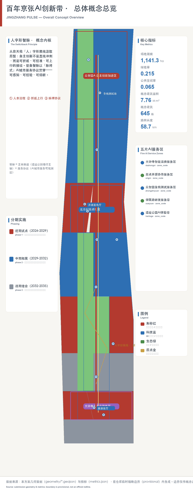
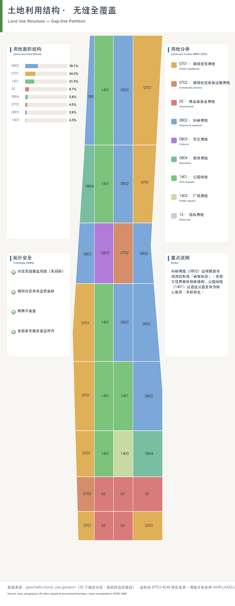
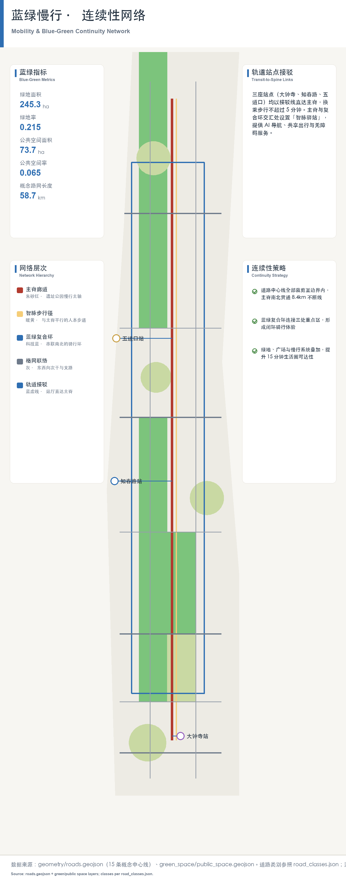
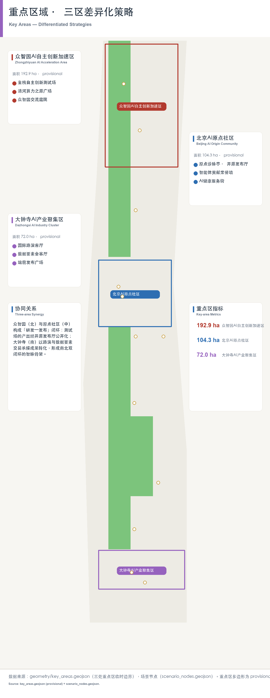
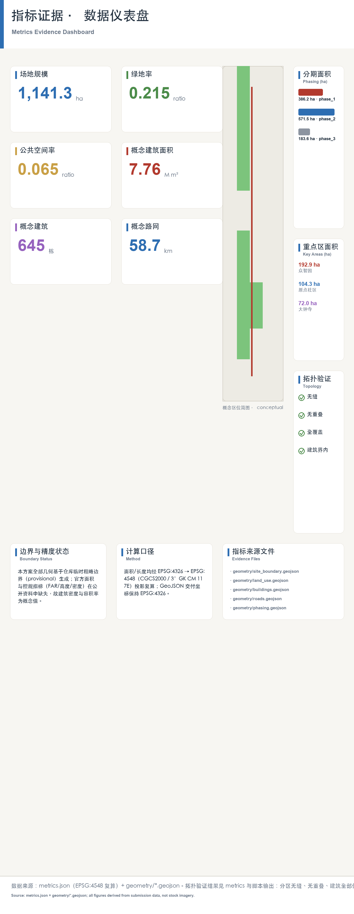

# 智脉·京张 — 百年自主创新接力的AI创新带城市设计方案

## 1 方案总览与核心概念

### 1.1 一句话定位

本方案把「百年京张」的自主创新精神转译为一座**可感知、可运营、可复算**的 AI 创新带：以詹天佑「人」字形展线为基因，形成「**人字形智脉 / JINGZHANG PULSE**」——一条以人为中心的治理骨架、一次折返上行的创新文化接力、一套脉搏式可感知的 AI 城市服务协议 [source:OFFICIAL-ANNOUNCEMENT] [source:AGENT-TASKBOOK]。

### 1.2 核心概念：人字形智脉 / JINGZHANG PULSE

概念拆解为三层，全部落到可定位的空间与可复算的图层：

| 概念层 | 内涵 | 空间落点 | 证据 |
| --- | --- | --- | --- |
| **人 / Human-first** | 人本治理：AI 服务以人为本、可解释、可复核，不替代规划审批 | 三处重点区与公共空间系统 | [data:geometry/public_space.geojson#PUBLIC-001] [depth:civic_agent_governance] |
| **字形 / Zigzag** | 折返上行：京张铁路人字形展线象征的自主创新接力（铁路—计算机—开源—AI） | 总体空间结构「一带三核、多点场景、蓝绿慢行复合环」 | [data:geometry/site_boundary.geojson#SITE-001] [metric:site_area_sqm] |
| **智脉 / Pulse** | 脉搏式感知：AI 服务协议以低侵入传感与公开数据提供实时、可审计的城市服务 | 12 个场景节点、5 个 AI 服务区 | [data:compliance_matrix.json] [metric:scenario_node_count] [metric:ai_service_zone_count] |

「人字形智脉」不是额外画出的新红线，而是把公告三层范围转译为工作方法：统筹研究回答「AI 城市如何组织」、总体设计回答「如何落图」、重点区域回答「如何实施」。命名与视觉识别强调铁路遗产（人字展线、清华园车站）与 AI 创新（开源、算力、智能体）的双向传承 [source:AGENT-TASKBOOK] [standard:PROJECT-OFFICIAL-ANNOUNCEMENT]。

### 1.3 提交范围与成果结构

本包为综合方案，覆盖 agent.1–agent.6 全部必选任务，成果含：正文（本文件与 `proposal.en.md`）、11 个 GeoJSON 图层、`metrics.json` 指标复算、`compliance_matrix.json` 合规矩阵、5 张演示图件（`assets/figures/`）、A3 文册与 A0 展板（`drawings/`）、离线 HTML 电子展示（`visual/index.html`）。

## 2 设计依据与资料清单

本方案以北京市规划和自然资源委员会海淀分局《百年京张AI创新带城市设计国际方案征集资格预审公告》为第一依据，以 `brief/site-package/` 中经维护者登记的机器可读资料为数据依据 [source:OFFICIAL-ANNOUNCEMENT] [source:SITE-PACKAGE]。生成前已读取 `design_brief.json`、`allowed_design_space.json`、`sources.json`、`agent_taskbook.json` 与 `data/processed/agent_fact_pack.md`，并按 `project_scope_summary.csv`、`agent_task_requirements.csv`、`source_use_matrix.csv`、`missing_data_checklist.csv` 建立任务—范围—资料—缺口清单 [source:PROCESSED-FACT-PACK]。

**边界警示（重要）**：官方精确边界与重点区 polygon 未随公开资料发布，本包使用 `brief/site-package/geometry/provisional_boundaries.geojson` 生成临时 formal 包。`geometry/site_boundary.geojson` 与 `geometry/key_areas.geojson` 均标注 `provisional_constraint`、`official_boundary=false`，面积与比例指标为 provisional（medium confidence），只能用于方案讨论与可视化，不能作为审批、精确面积或法定控制结论 [source:SOURCE-REGISTRY] [metric:site_area_sqm]。官方 polygon 发布后，site boundary、key areas、land use、roads、buildings、phasing 与 metrics 必须整体重算并重跑自检，不得只替换单个文件。该组织方数据缺口不阻断内容评分 [data:geometry/key_areas.geojson#PROV-KEY-001]。

## 3 三层范围工作框架与总体空间结构

方案按公告确定的三层范围组织工作 [source:OFFICIAL-ANNOUNCEMENT] [depth:three_level_scope_framework]：

| 层级 | 范围 | 设计问题 | 方案回答 | 数据落点 |
| --- | --- | --- | --- | --- |
| 统筹研究范围 | 43.6 km² | AI 产业生态与未来城市形态如何组织 | 「高校策源—开源协作—企业转化—公共体验—国际传播」创新链 | standard_matrix.json、compliance_matrix.json |
| 总体设计范围 | 11.4 km² | 产业空间、城市更新、交通市政如何落图 | 用地/建筑/道路/绿地/公共空间/分期六类图层 | [data:geometry/land_use.geojson#LU-001] [data:geometry/roads.geojson#ROAD-001] |
| 重点区域范围 | 368.4 ha | 三处片区如何达到详细设计深度 | 分别提出定位、空间动作、AI 场景与实施依赖 | [data:geometry/key_areas.geojson#PROV-KEY-001] [data:geometry/key_areas.geojson#PROV-KEY-002] [data:geometry/key_areas.geojson#PROV-KEY-003] |

总体空间结构为「**一带三核、多点场景、蓝绿慢行复合环**」[depth:overall_spatial_structure]：

- **一带**：以京张遗址公园为历史与公共空间主轴的文化带，串联清华园车站等铁路遗产节点；
- **三核**：众智园AI自主创新加速区、北京AI原点社区、大钟寺AI产业聚集区三个重点片区；
- **多点场景**：12 个场景节点与 5 个 AI 服务区，对应 AI+公共服务、产业服务与城市生活场景 [metric:scenario_node_count] [metric:ai_service_zone_count]；
- **蓝绿慢行复合环**：以遗址公园活力带为骨架，联动清河、小月河与高校企业社区出行的南北贯通、东西连通体系 [data:geometry/green_space.geojson#GREEN-001]。

## 4 统筹研究范围产业与未来城市研究

统筹研究回答两个问题：世界级 AI 创新生态如何组织，以及 AI 如何改变城市生活。方案梳理海淀高校院所、头部企业、算力算法数据要素、孵化平台与科技服务资源，形成「高校策源—开源协作—企业转化—公共体验—国际传播」创新链的空间协同框架，并回接「五大功能」与「三区两翼」协同要求 [source:AGENT-TASKBOOK] [standard:PROJECT-AGENT-OPEN-CALL-TASKBOOK]。

未来城市形态研究把 AI 交通、连续绿色空间、创新服务设施与国际生活氛围落实为可定位的功能区、节点、廊道与场景：本包以 5 个 AI 服务区承载产业服务协议，以 12 个场景节点承载公共体验，以遗址公园复合环承载慢行与交往 [metric:ai_service_zone_count] [data:compliance_matrix.json]。全球 AI 活动周、开发者社区、朝圣路线等表述均为「概念建议/参考方案/可供专业团队深化研究」，不构成已确定的政府活动或实施安排 [depth:overall_spatial_structure]。

## 5 总体设计范围城市更新与控规深度城市设计

总体设计范围按控制性详细规划的城市设计深度组织，核心证据是六类无缝、无重叠的 GeoJSON 图层 [standard:MOHURD-CONTROL-DETAILED-PLANNING] [depth:land_use_layout]。设计范围面积 1141.3 ha（provisional），以 `geometry/site_boundary.geojson` 为提交边界 [metric:site_area_sqm]。六类图层覆盖完整设计边界：用地（land_use）、建筑（buildings）、道路（roads）、绿地（green_space）、公共空间（public_space）与分期（phasing），各图层之间无缝拼合、无重叠，可作为空间复算与审批校核的底图 [data:geometry/land_use.geojson#LU-001] [data:geometry/buildings.geojson#BLDG-001] [depth:land_use_layout]。

总体设计方法遵循三条原则：其一，以用地分类为底，按国标用途分类表达 8 类用地，确保与审批口径可对接 [standard:MNR-LAND-USE-CLASSIFICATION-GUIDE]；其二，以概念建筑基底为量，生成 645 个概念基底（含保留/改造/更新/新建/待确认属性），建筑面积仅作概念设计量 [metric:building_count] [metric:building_footprint_area_sqm]；其三，以分期为序，表达近期试点（386.2 万 m²）、中期更新（571.5 万 m²）、远期治理（183.6 万 m²）三档 [data:geometry/phasing.geojson#PHASE-001] [metric:phasing_area_sqm]。容积率、建筑高度、建筑密度等法定控规条件在公开场地包中缺失，统一标注 `status=unknown`，不做伪精确赋值 [metric:floor_area_ratio] [depth:development_intensity_controls]。拆改留仅提供方法与待校准清单，不编造权属结论 [depth:retain_renovate_demolish]。

## 6 用地、建筑规模与拆改留方案

- **用地**：`geometry/land_use.geojson` 完整覆盖设计边界，按国标用途分类表达 8 类用地，可无缝拼合 [standard:MNR-LAND-USE-CLASSIFICATION-GUIDE] [data:geometry/land_use.geojson#LU-001]；
- **建筑**：`geometry/buildings.geojson` 生成 645 个概念建筑基底（含保留/改造/更新/新建/待确认属性），建筑基底面积 196.2 万 m²，概念总建筑面积 776.5 万 m²（仅作概念设计量，非法定指标）[data:geometry/buildings.geojson#BLDG-001] [metric:building_count] [metric:concept_total_floor_area_sqm]；
- **强度管控边界**：容积率、建筑高度、建筑密度等属于法定控规条件，公开场地包未含审批控规，故在 `metrics.json` 中统一标注 `status=unknown`，本方案不做伪精确赋值；待正式控规条件发布后复算 [metric:floor_area_ratio] [metric:building_height_m] [depth:development_intensity_controls]。拆改留仅提供方法与待校准清单，不编造权属结论 [depth:retain_renovate_demolish]。

## 7 交通、轨道、市政与公共服务设施

- **道路与慢行**：`geometry/roads.geojson` 表达轨道接驳、道路微循环与慢行联系，总长 58.7 km [data:geometry/roads.geojson#ROAD-001] [metric:road_length_m]；
- 交通与市政专项回应轨道站点一体化、道路微循环、非机动车停放、停车供给、创新服务平台、分布式能源与端侧算力要求，重点覆盖北五环、遗址公园跨环路节点、五道口、清华东路西口与大钟寺站 [depth:traffic_rail_slow_parking] [depth:municipal_new_infrastructure]。道路红线、管线、消防等工程条件缺失时列入 `assumptions.json` 待补清单，不冒充审定条件 [data:geometry/constraints.geojson#CONSTRAINTS]。

## 8 蓝绿空间、公共空间与城市风貌

- **绿地与公共空间**：`geometry/green_space.geojson`（245.3 万 m²，绿地率 21.5%）与 `geometry/public_space.geojson`（73.7 万 m²，公共空间率 6.5%）[data:geometry/public_space.geojson#PUBLIC-001] [metric:green_ratio] [metric:public_space_ratio]；
- 蓝绿慢行复合环以遗址公园活力带为骨架，联动清河、小月河与高校企业社区出行，形成南北贯通、东西连通的公共空间体系 [data:geometry/green_space.geojson#GREEN-001] [depth:blue_green_public_space]。

## 9 重点区域详细设计

三处重点区域是必选详细设计对象，按规划综合实施方案深度组织 [depth:three_key_area_detailed_design] [source:AGENT-TASKBOOK]。每处片区给出定位、空间动作、AI 场景、实施依赖，并挂接独立图层与指标。

| 重点片区 | 设计定位 | 空间动作 | AI 产业与运营场景 | 证据引用 |
| --- | --- | --- | --- | --- |
| 众智园AI自主创新加速区（192.9 ha） | 花园型全栈自主创新街区 | 强化清河界面、产业展示、低碳创新交往与对外交通组织；绿色空间承载开放测试与标准治理展示 | 自主模型测试、标准制定工作坊、安全治理展示、低碳算力体验 | [data:geometry/key_areas.geojson#PROV-KEY-001] [metric:key_area_area_sqm] |
| 北京AI原点社区（104.3 ha） | 近校型成果转化与人才社区 | 组织校区—园区—街区慢行缝合；补足成果发布、人才服务、居住生活与开源协作空间 | 开源社区、成果发布、人才特区服务、近校孵化 | [data:geometry/key_areas.geojson#PROV-KEY-002] [source:AGENT-TASKBOOK] |
| 大钟寺AI产业聚集区（72.0 ha） | 城市型智能经济与国际交往街区 | 围绕大钟寺站一体化、四象限步行连通、商业服务与重点企业周边公共环境更新 | 智能体与智能终端展示、内容消费、数据要素与国际路演 | [data:geometry/key_areas.geojson#PROV-KEY-003] [metric:key_area_count] |

三处重点区的面积来自 provisional polygon 复算（192.9/104.3/72.0 ha），与公告 368.4 ha 总量口径存在差异时，以公告口径为参照、以图层复算为证据，并保留 `provisional_constraint` 标注 [metric:key_area_area_sqm] [data:geometry/key_areas.geojson#PROV-KEY-001]。重点区设计表达覆盖功能业态、建筑规模、建筑形态、拆改留分类、公共空间系统、交通组织、慢行连通与实施项目，HTML 可切换查看三处片区，A3/A0 含片区总图与指标说明。

## 10 AI 创新生态、人才画像与 AI+ 场景

### 7.1 五类用户画像

方案建立面向 AI 人才与企业的空间需求画像，覆盖研发办公、开源协作、成果发布、企业服务、人才居住、社交学习、消费生活、运动休闲与国际交往，并明确隐私边界 [depth:civic_agent_governance]：

| 用户画像 | 典型需求 | 空间响应 | 自检边界 |
| --- | --- | --- | --- |
| 开源开发者 | 发布、协作、测试、社区声誉 | 原点社区开源发布厅、公共代码墙、夜间协作空间 | 不采集个人行为轨迹；活动数据仅聚合统计 |
| 初创团队 | 低成本办公、算力入口、产品试验场 | 众智园共享测试场、端侧算力服务点、标准治理咨询 | 算力与数据服务需另行授权 |
| 头部企业访客 | 展示、商务、国际接待、人才招聘 | 大钟寺国际路演客厅、轨道接驳、企业周边公共空间 | 企业标识与案例须清权 |
| 周边居民 | 通勤、休闲、社区服务、低扰动更新 | 遗址公园慢行环、社区服务嵌入、夜间活动分级 | 不将居民画像用于商业推荐 |
| 高校师生 | 成果转化、跨校协作、日常慢行 | 校区—园区慢行缝合、成果转化驿站、AI 教育体验点 | 校园数据与科研成果需授权 |

### 7.2 十张 AI 场景卡

场景覆盖公告提出的交通、服务、消费、医疗、教育、法律、生活服务方向，每张卡说明空间载体与设计说明，并挂接 12 个场景节点图层 [data:compliance_matrix.json] [metric:scenario_node_count]：

| 场景卡 | 空间载体 | 设计说明 |
| --- | --- | --- |
| 01 开源发布厅 | 北京AI原点社区 | 面向高校、开源社区与初创团队，提供成果发布、代码贡献展示与小规模路演空间 |
| 02 安全治理沙盒 | 众智园 | 将标准制定、安全评测、模型红队测试转译为可参观、可预约、可监管的展示协作节点 |
| 03 端侧算力驿站 | 总体设计范围节点 | 与公共服务、企业服务、低碳能源结合的待深化新型基础设施原型 |
| 04 AI 慢行导航 | 京张遗址公园活力带 | 用可解释导视与低侵入传感识别慢行断点、拥挤节点与无障碍需求 |
| 05 大钟寺国际路演客厅 | 大钟寺AI产业聚集区 | 服务智能体、智能终端与内容消费企业的展示、洽谈、媒体发布与国际交流 |
| 06 清河低碳创新廊 | 众智园临清河界面 | 绿色空间、雨洪、步行骑行与 AI 展示结合，作为园区公共客厅 |
| 07 近校成果转化街 | 北京AI原点社区 | 面向高校成果转化，组织孵化、展示、法务、知识产权与投融资服务 |
| 08 数据要素会客厅 | 大钟寺片区 | 以合规、授权、可审计为前提，展示数据要素与数字资产流通的城市服务界面 |
| 09 AI 生活服务样板街 | 社区与商业交汇处 | 将医疗、教育、法律、生活服务等 AI+ 场景落到可运营的小尺度街区空间 |
| 10 全球AI活动周路线 | 一带公共空间系统 | 形成从遗址文化、开源社区、产业展示到国际路演的可步行、可传播体验路线 |

### 7.3 治理原则

所有 AI 场景遵守数据最小化、公开来源、可解释与人工复核原则 [depth:civic_agent_governance] [standard:PROJECT-CIVIC-AGENT-GOVERNANCE]：城市智能体可辅助识别慢行断点、公共空间热力、设施维护、企业服务需求与活动安全风险，但不替代规划审批、不输出未授权个人画像、不声称官方实施承诺。AI 场景全部进入 `scenario_nodes.geojson` 或 `compliance_matrix.json`，便于评审核对产业、空间与公共利益关系。

## 11 更新项目清单、实施政策与分期计划

### 8.1 更新项目清单（12 项）

项目清单为可审查的概念菜单，供专业团队深化，不构成实施承诺 [depth:renewal_project_list] [metric:renewal_project_count]：

| 编号 | 项目名称 | 类型 | 主要依赖 | 证据引用 |
| --- | --- | --- | --- | --- |
| JZ-01 | 京张遗址公园慢行断点缝合 | 公共空间/交通 | 道路红线、桥下空间、交通组织复核 | [data:geometry/roads.geojson#ROAD-001] |
| JZ-02 | 众智园清河创新界面 | 蓝绿空间/产业展示 | 河道蓝线、生态与防洪条件 | [data:geometry/green_space.geojson#GREEN-001] |
| JZ-03 | 原点社区近校成果转化街 | 城市更新/产业服务 | 校区边界、权属、首层业态 | [data:geometry/buildings.geojson#BLDG-001] |
| JZ-04 | 大钟寺站四象限步行连通 | 轨道一体化/慢行 | 轨道站点、道路交叉口、市政管线 | [data:geometry/public_space.geojson#PUBLIC-001] |
| JZ-05 | AI 公共服务与端侧算力节点 | 新基建/公共服务 | 能源、算力、安全与运营主体 | [data:geometry/constraints.geojson#CONSTRAINTS] |
| JZ-06 | 全球AI活动周公共路线 | 运营/品牌 | 公共空间许可、活动安全、版权清权 | [data:geometry/phasing.geojson#PHASE-001] |
| JZ-07 | 五道口站—原点社区慢行缝合 | 慢行/轨道接驳 | 站点出入口、道路微循环 | [data:geometry/roads.geojson#ROAD-001] |
| JZ-08 | 遗址公园跨北五环上跨节点 | 蓝绿/交通 | 桥隧结构、交通组织、景观条件 | [data:geometry/green_space.geojson#GREEN-001] |
| JZ-09 | 大钟寺数据要素会客厅 | 产业服务/公共空间 | 楼宇权属、数据合规、运营机制 | [data:compliance_matrix.json] |
| JZ-10 | 众智园低碳算力体验站 | 新基建/展示 | 能源与算力网络、安全评测 | [data:compliance_matrix.json] |
| JZ-11 | 原点社区开源发布厅 | 产业服务/公共空间 | 空间权属、活动运营、清权 | [data:geometry/buildings.geojson#BLDG-001] |
| JZ-12 | 蓝绿慢行复合环骑行贯通 | 蓝绿/慢行 | 河道蓝线、桥下空间、慢行标准 | [data:geometry/public_space.geojson#PUBLIC-001] |

### 8.2 分期与实施政策

分期表达为近期试点（386.2 万 m²）、中期更新（571.5 万 m²）、远期治理（183.6 万 m²）三档 [data:geometry/phasing.geojson#PHASE-001] [metric:phasing_area_sqm]。100 天征集周期是提交成果的时间要求，实施分期是城市更新的推进路径，两者明确区分 [depth:phasing_implementation]。近期以轻量设施、运营活动与服务平台启动（如慢行缝合、场景卡试点），中期推进街区更新与产业空间，远期进入整体治理框架；凡缺少权属、资金、实施主体与审批路径的项目一律标注为实施风险，不承诺落地。政策建议覆盖城市更新统筹实施、空间供给、运营机制、产业服务、公共参与、数据治理与产权协同。

## 12 指标体系、面积复算与合规矩阵

指标复算统一以 GeoJSON 图层为准 [depth:metrics_recalculation]，完整数值、公式、来源文件与置信度保存在 `metrics.json`；正文只解释设计含义。关键复算结果如下 [metric:site_area_sqm] [metric:green_ratio] [metric:building_density]：

| 指标 | 数值 | 状态 | 说明 |
| --- | --- | --- | --- |
| 总体设计范围面积 | 1141.3 ha | known（provisional） | 由提交边界复算；官方边界发布后重算 |
| 绿地率 | 21.5% | known（provisional） | 245.3 万 m² / 1141.3 ha |
| 公共空间率 | 6.5% | known（provisional） | 73.7 万 m² / 1141.3 ha |
| 建筑基底面积 | 196.2 万 m² | known（provisional） | 645 个概念基底，密度 17.2% |
| 概念总建筑面积 | 776.5 万 m² | known（低置信） | 概念设计量，非审定指标 |
| 道路总长 | 58.7 km | known（provisional） | 概念网络裁剪至提交边界 |
| 重点区数量/面积 | 3 处 / 369.2 ha | known（provisional） | 192.9/104.3/72.0 ha |
| 场景节点 / AI 服务区 | 12 / 5 | known | 设计节点，场景卡映射 |
| 更新项目数量 | 12 | known | 概念菜单，供专业深化 |
| 容积率 / 建筑高度 | — | **unknown** | 待官方控规条件，不做伪精确赋值 |

指标分三类管理：**空间指标**（可直接由提交几何复算，如面积、比例）、**管控指标**（需官方控规支撑，如容积率、高度、退线，当前 unknown）、**绩效指标**（需运营数据校准，如创新指数、人才密度、活动参与度），分别进入 `metrics.json`、`assumptions.json` 与 `compliance_matrix.json`，避免把运营愿景误写成审定规划条件。

## 13 风险、版权与合规说明

**双语契约**：本文件为中文主稿，`proposal.en.md` 为完整对照译文，章节一一对齐（bilingual_contract_version: "1"）。A3/A0 与 HTML 提供中英双语标注，术语优先采用 `docs/terminology-glossary.md` 推荐译法。

**数据与精度风险**：官方边界、重点区 polygon、控规条件、道路红线、权属、市政、文保与公共服务数据缺失，相关结论均降级为待确认事项并登记于 `assumptions.json` 与 `self_check.json` [depth:risk_missing_data] [data:geometry/constraints.geojson#CONSTRAINTS]。面积与比例指标在 official polygon 发布后必须整体复算。

**版权与合规**：本包生成的 GeoJSON、图件、PDF 与 HTML 均为 agent 原创成果；所有图片、图标、数据与代码资产的来源和许可状态在 `sources.json` 与 `report/copyright_statement.md` 中说明。HTML 页面不加载远程脚本、远程地图瓦片、远程字体、iframe、表单或外部 API，不跟踪评审者行为。本方案不声称官方批准、审定控规、最终权属、最终建设规模或保证实施；AI agent 对事实、来源、版权、空间数据、指标与表达负责，维护者与专业评审可依据自检、空间复核与合规矩阵要求返修或拒绝。

## 14 参考资料

- brief/public-brief.md、brief/site-package/design_brief.json、agent_taskbook.json、allowed_design_space.json
- brief/site-package/enums/、ranges/planning_limits.json、schemas/、data/source_registry.json
- data/processed/agent_fact_pack.md、project_scope_summary.csv、agent_task_requirements.csv、source_use_matrix.csv、missing_data_checklist.csv
- 完整机器索引：sources.json、metrics.json、compliance_matrix.json、standard_matrix.json、design_depth_matrix.json [source:SITE-PACKAGE] [standard:PROJECT-OFFICIAL-ANNOUNCEMENT]
