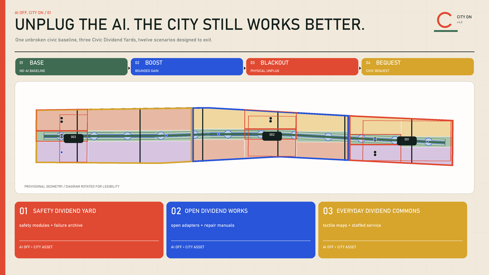
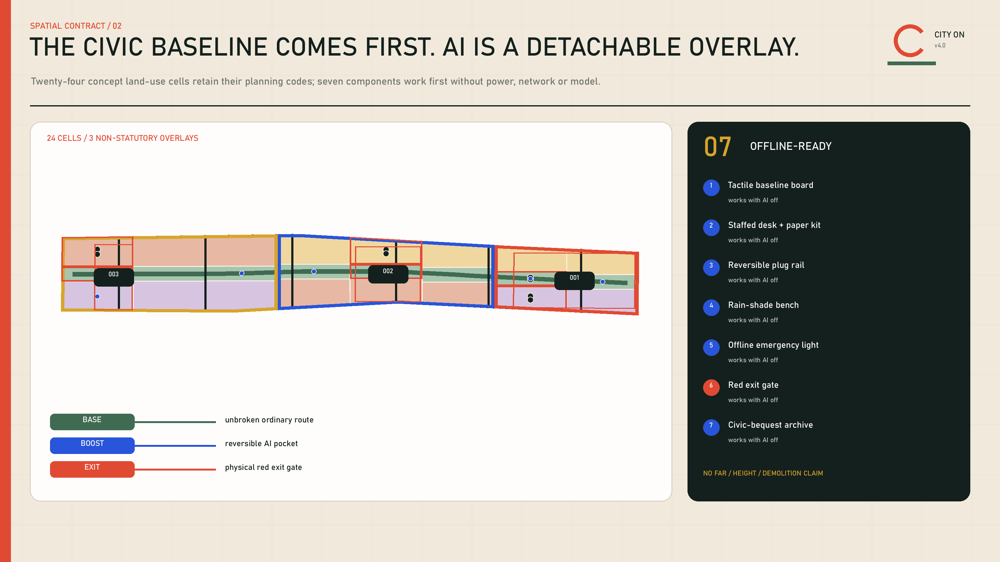
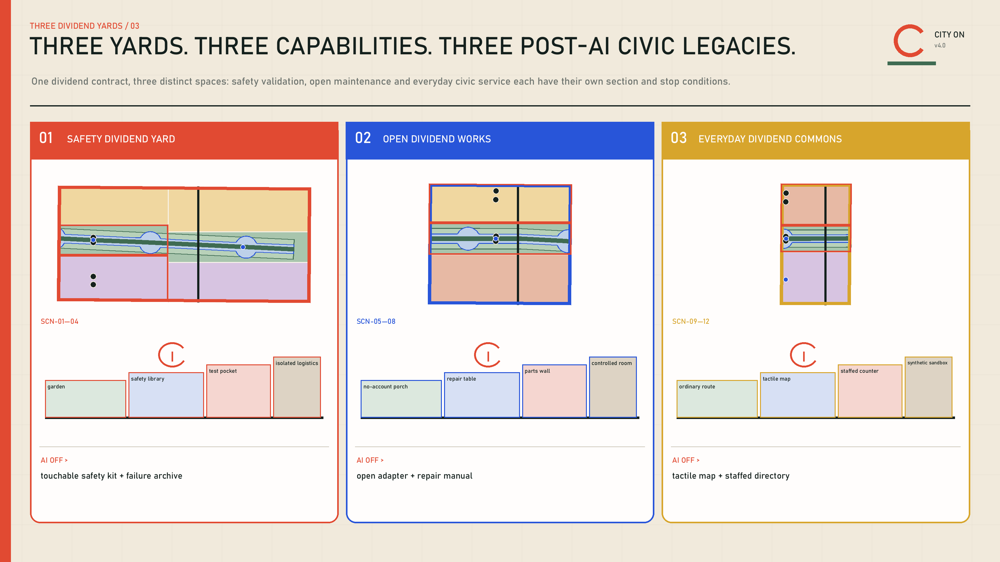
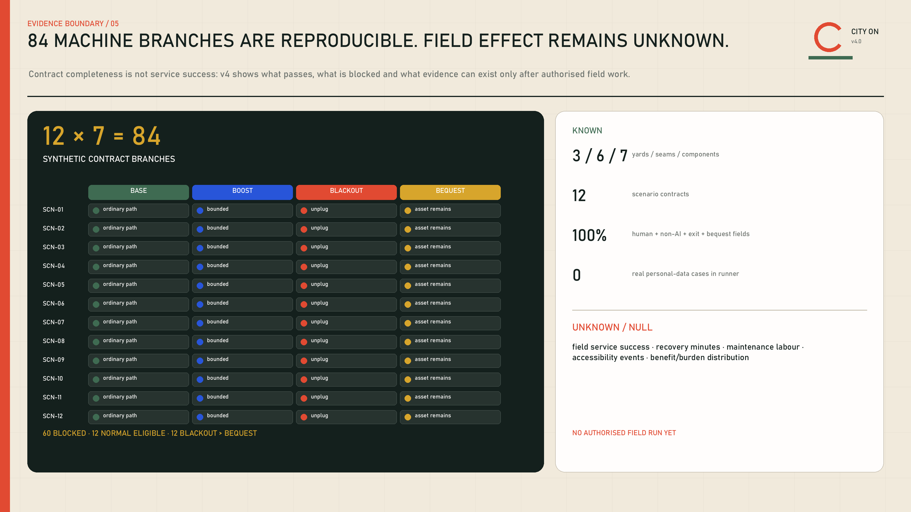

# JING-ZHANG CITY ON: AI Off, City On

> **AI OFF, CITY ON.** Unplug the AI; the city must still work better. Every trial must leave Jing-Zhang a civic dividend that remains usable without a model, account, network or smart device.

## Executive Summary

The Jing-Zhang Railway Heritage Park is not an empty site waiting for technology to take over. Official material describes an approximately 9 km corridor, about 6 km of undergrounded high-speed railway in Haidian, and a first 2.5 km, 16.8 ha phase already open. That work reuses rails, turnouts and Qinghuayuan Station while combining sponge infrastructure and continuous public space to stitch the city together [source:OFFICIAL-PARK-PLAN-2021] [source:OFFICIAL-PARK-PHASE1-2023]. This proposal therefore no longer asks “how much more AI can fit here?” It asks a harder urban-design question: **when the model is offline, the vendor leaves and the devices are removed, what exactly does the public keep?** [assumption:A-EXISTING-PARK-001]

The answer is a four-part Civic Dividend Contract: `BASE → BOOST → BLACKOUT → BEQUEST`. `BASE` proves that movement, rest, wayfinding and staffed help work without AI. `BOOST` permits only a bounded task, minimum data and a named human. `BLACKOUT` physically disconnects the model, network, sensors and automated actuators. `BEQUEST` then verifies whether a tactile map, staffed directory, open adapter, repair manual, rain-garden care card or heritage walk still works independently [data:visual/assets/civic-dividend-contracts.json].

Spatially, the plan forms one unbroken public baseline spine, three differentiated Civic Dividend Yards, six east–west seams, seven offline-ready components and twelve scenarios. In the north, the Safety Dividend Yard converts embodied-AI, safety, energy and rainwater tests into touchable safety modules and a failure archive. In the centre, the Open Dividend Works converts open-source maintenance, interoperability and learning into repairable public tools. In the south, the Everyday Dividend Commons converts accessibility, public service, heritage and consumer-agent trials into static maps, staffed counters and appeal routes [data:visual/assets/dividend-yards.json] [metric:scenario_dividend_contract_count].

Implementation starts with a twelve-week commissioning period, not permanent construction. The first two weeks test the non-AI baseline only. Ordinary 1:1 prototypes, synthetic data and shadow operation follow. Week 8 is “City Unplug Day”. The final four weeks audit the dividend, maintenance labour and distributional effects before any retain, revise or remove decision [data:visual/assets/first-12-weeks.json]. A local tabletop runner executes seven synthetic branches for each of twelve contracts, 84 cases in total. Sixty paths lacking a baseline, a human, an unplug action, a bequest, or containing prohibited data are blocked; twelve blackout paths advance to bequest review [metric:unplugged_tabletop_case_count] [assumption:A-TABLETOP-001].

This is not an anti-AI proposal. It adds a scarce industrial capability: products must prove not only that they can launch, but that they are portable, repairable, stoppable, resistant to vendor lock-in and able to convert trial value into open components, service standards and durable civic assets. A world-class AI district is not advanced because every device stays online forever. It is mature because the city preserves dignity, continuity and learning through every technology cycle.

## Design Basis and Source Register

Evidence is organised in four tiers. The first is the official call and Agent Taskbook, which define the three spatial scales, three positions, five functions, three zones and two wings, and six Agent tasks without providing statutory control values [source:OFFICIAL-ANNOUNCEMENT] [source:AGENT-TASKBOOK]. The second is public information from Beijing and Haidian authorities on the park, railway heritage, AI industry and urban regeneration; it establishes what already exists and why renewal matters. The third is the repository site package, source registry and provisional geometry used for reproducible design. The fourth is international cases and AI risk frameworks, used only to extract mechanisms—not to transplant foreign institutions or values as Beijing standards.

| Evidence status | What v4 can do | What v4 will not do | Evidence that triggers the next version |
|---|---|---|---|
| Official public information available | Identify the opened phase, railway heritage, renewal direction and industrial context | Infer the full corridor condition, owners, investment or approvals | Official addenda and project records |
| Provisional boundary plus nine GeoJSON sets | Check topology, concept zoning, recalculate areas and draw relationships | Claim statutory red lines, ownership, demolition or engineering alignments | Official polygon and survey products |
| Concept buildings and components | Express retain-first, public ground floors and reversible plug-ins | Claim an existing-building survey, floors, heights or demolition quantities | Building, title, structure, fire, heritage and service surveys |
| Scenario contracts and synthetic tabletop tests | Test fields, failure branches, stop and recovery logic | Claim field performance, public acceptance or operating authority | Named actors, permits, budgets, baselines and independent evaluation |

Seven international references are reduced to seven transferable mechanisms:

| Case / framework | Transferable mechanism | Jing-Zhang translation | Explicit non-transfer |
|---|---|---|---|
| Barcelona Decidim [source:CASE-BARCELONA-DECIDIM] | Open-source and reusable; online and face-to-face participation in parallel | Publish Civic Dividend Contracts together with paper procedures | Do not transplant local institutions or platform governance |
| Amsterdam Responsible Sensing [source:CASE-AMSTERDAM-SENSING] | Design sensing around freedom, control and privacy | Give every sensor a visible purpose, unplug action and human alternative | Do not treat public space as a default data source |
| Punggol Digital District [source:CASE-PUNGGOL] | Open platform, mixed learning-industry-city setting and operating-environment trials | Link northern validation, central translation and southern use | Do not copy new-town scale, investment or a central platform |
| Seoul Oil Tank Culture Park [source:CASE-SEOUL-OIL-TANK] | Turn restricted industrial heritage into public cultural space | Make rails, repair and exit traces usable civic memory | Do not copy architectural form or adaptive-reuse conclusions |
| UK ATRS [source:CASE-UK-ATRS] | Publish purpose, human decision, appeal, update and retirement information | Publish plain-language dividend and exit records for every scenario | Do not present it as a Chinese statutory standard |
| NIST AI RMF [source:CASE-NIST-AI-RMF] | Record full-lifecycle risk and decommissioned components | Put `BLACKOUT` and `removed_archived` into the state machine | Do not replace accountable professional safety work with a framework |
| UN-Habitat People-Centred Smart Cities [source:CASE-UNHABITAT-PEOPLE] | Human rights, digital public goods, inclusion and small pilots | Start with account-free services, ordinary routes and open reuse packs | Do not treat non-binding guidance as approval evidence |

Every substantive statement carries nearby evidence. Full rights, dates, collection methods, transformations and limitations are registered in `sources.json`. Drawings are the interpretation layer; GeoJSON, JSON, matrices and checks are the verification layer. Where they conflict, higher-grade sources and machine assets prevail. The overall boundary and three focus areas remain provisional [data:geometry/site_boundary.geojson#SITE-001] [assumption:A-BOUNDARY-001].

## Three-Level Scope Framework

The three scales are not three independent plans. They are one transmission chain that takes a civic dividend from strategy, through spatial structure, to a testable prototype [depth:three_level_scope_framework].

| Scale | Core question | v4 deliverable | Boundary that cannot be crossed |
|---|---|---|---|
| Coordinated research area | How should AI industry, talent, public problems and regional partners exchange capability? | Civic-dividend ecosystem, seven cases, five regional interfaces and a long-term programme | Do not fabricate partners, companies, finance or implementation |
| Overall design area | How can the corridor preserve public continuity through technology change? | One baseline spine, three yards, six seams, seven components and 24 land-use cells | Provisional SITE-001 is not a statutory boundary |
| Three focus areas | How does one trial land, unplug and leave something useful? | Twelve scenario contracts, three sectional types, nine projects and a twelve-week commissioning plan | Provisional rectangles are not parcels, titles or works boundaries |

The provisional overall area is about 11.4 km² and is only an internal geometry diagnostic [metric:site_area_sqm]. The rough polygons for the three focus areas are used only to locate design intent [data:geometry/key_areas.geojson#PROV-KEY-001]. When an official boundary arrives, the team must lock its version, clip every layer again, recalculate all areas and ratios, reassign scenarios and projects, update both languages and PDFs, and publish a difference log. Editing a headline number is not sufficient [depth:metrics_recalculation].

Every scale uses the same acceptance sentence: **who can still do what without AI; what AI adds; who can unplug it; what remains after unplugging; and who maintains it.** Strategic ideas without a real public problem and receiver do not enter the overall plan. Overall-plan moves without an unbroken ordinary route do not enter a focus area. Focus-area pilots without a dividend asset, maintenance owner and removal plan do not enter the site.

## Coordinated Research Area: Industry and Future-City Research

The Taskbook’s three positions are translated into three verifiable public outcomes rather than three slogans [source:AGENT-TASKBOOK]:

| Three positions | v4 translation | Five-function contribution |
|---|---|---|
| Century-old Jing-Zhang cultural belt | Translate the engineering culture of China’s first nationally owned trunk railway designed and built by Chinese engineers into AI infrastructure that can be understood, repaired and passed on | Global voice in AI governance; intelligent and vibrant AI city |
| Metropolitan AI-life experience belt | Let the public compare the non-AI baseline, AI boost and post-exit service in one place | New model for AI+ scenarios; intelligent and vibrant AI city |
| AI convergence innovation belt | Link R&D, testing, open-source maintenance, industrial translation and public use through dividend receipts | Full-stack independent AI innovation; world-class AI ecosystem |

Public information from Beijing and Haidian shows a substantial AI enterprise, investment and output base; the embodied-intelligence park likewise emphasises innovation paths, application scenarios and translation [source:OFFICIAL-AI-INDUSTRY-2026] [source:OFFICIAL-EMBODIED-PARK-2025]. The proposal does not downscale citywide or districtwide statistics onto this corridor. Instead it adds an industrial capability: **advance from “deployable” to “able to exit without leaving lock-in, debt or public loss.”** Companies can gather safety, energy, offline and failure evidence in the north; translate it into open adapters, repair packs and bilingual explanations in the centre; and test real public benefit using only synthetic or authorised data in the south.

The three zones and two wings form a two-way chain. Zhongzhiyuan Safety Dividend Yard handles isolated validation of higher-risk technology. AI Origin Open Dividend Works handles maintenance, intellectual property, interoperability and talent. Dazhongsi Everyday Dividend Commons handles accessibility, public service, heritage and consumer use. The Zhongguancun Technology Service Wing contributes legal, standards, finance and professional-service directions. The Xiaoyue River Scenario Wing contributes public problems, ecology and everyday-life feedback. Neither wing may bypass the three yards’ human and public gates [data:visual/assets/regional-interfaces.json].

Regional collaboration is expressed only as proposed “input → shareable output”, pending consent, without inventing partnerships. Beiwai Community may contribute resident problem statements; Future Science City, test-method directions; Huairou Science City, measurement and calibration directions; Beijing E-Town, engineering feedback; and the Jing-Jin-Ji region may receive de-located schemas, failure packs and version differences. Coordinates, personal data, approval conclusions and partnership names do not flow by default [metric:regional_interface_count].

The identity system uses a broken circle above a continuous ground line: technology can be unplugged, while the civic baseline remains. The Chinese name `京张常在` stresses urban and cultural continuity; `JING-ZHANG CITY ON` is the international call. `AI OFF, CITY ON` is a public promise, never an official mark. Bone, coal, signal red, engineering blue, moss and maintenance yellow form the palette. Red is reserved for exit authority, blue for open components and green for the ordinary public baseline.

## Overall Design Area: Urban Regeneration and Regulatory-Plan-Depth Urban Design

The overall structure is **one spine, three yards, six seams, seven components and twelve dividends**. A public baseline spine follows the old railway direction with uninterrupted walking, cycling, rest, static wayfinding and staffed help. Three yards specialise in safety, open-source and everyday dividends. Six seams prioritise east–west repair. Seven components constrain technology to detachable interfaces. Twelve scenarios each bind a location to an exit product [data:geometry/constraints.geojson#DY-01-SAFETY-DIVIDEND] [metric:civic_baseline_spine_length_m].

Twenty-four concept land-use cells retain permitted territorial-spatial-planning codes, cover provisional SITE-001 and pass topology checks [data:geometry/land_use.geojson] [metric:land_use_parcel_count]. The new Safety Dividend Yard, Open Dividend Works and Everyday Dividend Commons are non-statutory operating overlays, not land-use categories. Industry space sits near controlled testing and professional services; public services and life-experience uses sit nearer existing urban interfaces. Green, park and transport spaces preserve ordinary use first.

The seven offline-ready components are urban design, not an equipment catalogue: `OC-01` tactile public-baseline marker, `OC-02` staffed service and paper pack, `OC-03` reversible plug rail, `OC-04` rain-shade bench, `OC-05` offline emergency light, `OC-06` red exit gate and `OC-07` civic-dividend archive frame [metric:offline_ready_component_count]. Each provides a model-free, network-free and power-free core function before any sensor, robot or interface is attached. Smart attachments must not take accessible clear width, tree pits, fire routes or ordinary counters.

The renewal sequence is: preserve existing public value → repair access, shade, drainage and human service → install ordinary reversible components → shadow-run AI → audit exit → decide to retain, revise or remove. FAR, height, density, setback, parking, municipal capacity and demolition quantities remain unknown [assumption:A-CONTROLS-001] [depth:development_intensity_controls].

## Detailed Design for Three Focus Areas

All three focus areas use organiser-provided rough provisional polygons to express functional relationships only. Rectangular edges do not represent roads, parcels or ownership [data:geometry/key_areas.geojson#PROV-KEY-001] [assumption:A-LOCATOR-001].

| Focus area | Public-space section | AI boost is permitted only in | Mandatory post-exit bequest | First scenarios |
|---|---|---|---|---|
| Zhongzhiyuan Safety Dividend Yard | Public observation garden—touchable safety library—controlled test pocket—isolated logistics | Embodied safety, edge energy, red-teaming and rainfall sensing | Obstacle modules, energy table, failure cards and manual rain gauge | SCN-01–04 |
| AI Origin Open Dividend Works | Account-free porch—repair table—open parts wall—controlled development room | Open maintenance, interoperability, model explanations and youth co-learning | Repair manual, open adapters, bilingual labels and tool directory | SCN-05–08 |
| Dazhongsi Everyday Dividend Commons | All-day ordinary route—tactile map—staffed counter—time-bounded synthetic sandbox | Accessible navigation, service triage, heritage reading and consumer agents | Static map, paper directory, sourced heritage path and appeal entry | SCN-09–12 |

**Zhongzhiyuan.** Robots and sensors enter only physically bounded test pockets with human emergency stops and isolated logistics. The public observation zone is not a brand grandstand. It is a safety garden where people can touch test obstacles, read why a system failed and compare offline modes. Qinghe ecology, energy capacity, platform qualifications, actual buildings and accountable actors all require separate verification. Passing a test is not regulatory or product approval [data:visual/assets/dividend-yards.json].

**AI Origin.** The space centres repair rather than pitching. One public table hosts open-source issue clinics, interface adaptation, bilingual explanation and youth reverse mentoring. Intellectual property, trade secrets and sensitive material remain in the controlled back room; the porch shows only public, reusable and retractable versions. When AI is offline, the table, tools, manuals, paper procedures and human network still work.

**Dazhongsi.** Ground, ground floor and static information come before imagined bridges, tunnels or underground links. A tactile map, staffed counter and Jing-Zhang memory walk work all day. Consumer agents appear only in time-bounded synthetic transactions with step-by-step human confirmation. The scenario exits immediately if the ordinary route is blocked, real payment is connected, the staffed counter is absent or appeal is unavailable.

## AI Innovation Ecosystem, Personas and AI+ Scenarios

Eight personas are not marketing segments. They are design inputs for authority, risk, maintenance and distribution [metric:persona_count]: researchers and open-source maintainers; startups and product teams; park users and residents; older and disabled users; children, youth and carers; frontline operators and maintainers; night workers and couriers; international visitors and regional partners. No group can consent for another. Passage, quiet and ordinary service for non-participants come first.

| ID | Scenario | AI boost | `BEQUEST` without AI | Immediate exit condition |
|---|---|---|---|---|
| SCN-01 | Embodied-AI unplug test | Multi-agent safety and takeover drill | Touchable obstacle modules and paper safety boundary | Boundary breach, loss of link, stop failure or ordinary-route conflict |
| SCN-02 | Edge energy and offline resilience | Compare offline, degraded and energy modes | Public energy table and manual operating envelope | Content cannot be isolated or power cannot be safely disconnected |
| SCN-03 | Model red team and failure library | Synthetic prompts and version retests | Failure cards, risk labels and repair version | High-risk issue escapes or disclosure responsibility is unclear |
| SCN-04 | Rain sensing and manual gauge | Public environmental readings support care | Manual rain gauge and rain-garden care card | Drift, erroneous control or ecological risk |
| SCN-05 | Open-source maintenance clinic | Issue triage and dependency checks | Repair manual, issue sheet and parts rack | Trade secret or unauthorised material enters the public zone |
| SCN-06 | Civic-service interoperability sandbox | Synthetic service-ticket handoff checks | Open adapter and paper service path | High-risk misrouting, missing logs or unclear responsibility |
| SCN-07 | Bilingual model-label workshop | Draft plain-language explanations and diffs | Bilingual templates and terminology cards | Unknown source, misleading statement or rights conflict |
| SCN-08 | Youth reverse-mentoring class | Voluntary learning partners and task matching | Paper task cards and tool-lending directory | Profiling, inducement or inability to exit for minors |
| SCN-09 | Accessible dual-path wayfinding | Temporary-obstacle and route support | Tactile static map and field-checked ordinary route | Misguidance, safety risk or unavailable hotline |
| SCN-10 | Staffed public-service triage | Public-directory search and material prompts | Staffed directory, paper form and telephone path | Professional conclusion or retained sensitive material |
| SCN-11 | Jing-Zhang memory reading room | Cleared-source retrieval and multilingual interpretation | Physical timeline, source card and withdrawal card | Unsourced or distorted history, or failed withdrawal |
| SCN-12 | Consumer-agent unplug sandbox | Synthetic budgets and stepwise confirmation | Human comparison board, refund and appeal entry | Real payment, dark pattern or failed cancellation |

The four-part contract is operational. `BASE` registers ordinary service and a human entrance. `BOOST` records permitted/prohibited data, tool permissions and spatial bounds. `BLACKOUT` records who unplugs, how data are deleted and how the space is restored. `BEQUEST` records the residual asset, maintainer, open reuse pack and retain decision [data:visual/assets/scenario-cards.json]. A city that still works after exit earns the right to discuss another boost [metric:contract_bequest_coverage_ratio].

`unplugged-test.schema.json` gives third parties a minimum machine-checkable contract; its example uses synthetic data only [data:visual/assets/unplugged-test.schema.json]. The local runner executes complete, missing non-AI baseline, missing human, missing unplug action, missing bequest, prohibited-data and post-exit-service branches for each contract. `84/84` proves only that contract logic is closed; field performance remains null [data:visual/assets/unplugged-tabletop-evidence.json] [metric:blackout_bequest_branch_count].

The eight-state machine runs from `proposed` to `removed_archived`; `blackout_drill` and `bequest_audit` cannot be skipped. The public-baseline guardian and safety role can stop a trial independently. Operators cannot sign their own dividend audit. Paper, telephone, staffed counter and the physical red gate form parallel stop channels [data:visual/assets/state-machine.json] [data:visual/assets/governance-raci.json].

## Land Use, Building Capacity and Retain–Renovate–Demolish

Concept land uses close only within provisional SITE-001 and are not statutory areas [metric:site_area_sqm]. Twenty-four cells retain territorial-spatial-planning codes and add non-statutory operating tags: `public_baseline`, `reversible_boost`, `controlled_test` and `heritage_bequest` [data:geometry/land_use.geojson]. These tags ask what must remain and what can be unplugged; they do not alter land use.

The building layer contains concept placeholders only. Its approximately 250,000 m² total footprint is an internal relationship diagnostic [metric:building_footprint_area_sqm] [assumption:A-BUILDING-001]. Before any real building enters the plan, the team must survey condition, age, structure, title, fire, heritage, tenancy, ground-floor accessibility and maintenance. The decision tree has four exits: retain as-is, repair, reversible adaptive reuse, or separate study. When evidence is insufficient, retain is the default; there is no demolition list [depth:retain_renovate_demolish].

All three prototypes put the ordinary public layer outside and at ground level. The Safety Yard observation garden never crosses the test zone. The Open Works repair table never enters the controlled intellectual-property and data room. The Everyday Commons tactile map and staffed counter never depend on a commercial tenant. Smart devices attach only to `OC-03`; when their term ends, devices, wiring, bases and data leave together. Removal must not leave fences, broken routes, blank screens or an unmaintained digital ruin.

FAR, height, density, setback, parking, underground space, energy load, municipal capacity and cost remain unknown. “Unknown” is not absent design; it names the required record, accountable discipline and decision gate [assumption:A-CONTROLS-001].

## Transport, Rail, Municipal and Public-Service Infrastructure

Only two mobility moves can be supported by current evidence: preserve an ordinary public baseline spine along the corridor and prioritise repair of six east–west seams [data:geometry/roads.geojson#ROAD-168] [metric:unplugged_seam_count]. They are connection intentions, not engineering alignments. Rail safety, road red lines, ridership, junctions, parking, bridges, tunnels and underground connections require separate transport and rail-professional decisions.

Low-speed robots appear only in the physically controlled Zhongzhiyuan test pocket. A named safety operator can stop, push or isolate them. Ordinary park paths, accessible clear width and fire access are never variables in an “intelligent logistics efficiency” trial [assumption:A-DELIVERY-001]. SCN-09 wayfinding must publish a tactile static map and a field-verified ordinary route; algorithmic advice does not replace traffic-safety responsibility.

Municipal and digital infrastructure follows “ordinary systems first, smart plug-ins second”. Core rainwater, lighting, emergency, communications, power and fire functions operate independently under professional standards. Sensors, edge compute, robots and models attach through a common reversible plug rail labelled with power, network, data, maintainer and unplug action [data:geometry/constraints.geojson#OC-03-REVERSIBLE-PLUG-RAIL]. Offline lights, manual rain gauges, paper directories and staffed counters preserve minimum service after network, power or vendor failure [depth:municipal_new_infrastructure].

Public service keeps four parallel routes: onsite human, paper material, telephone and account-free digital entry. AI may assist search and translation, but may not decide medical diagnosis, legal outcome, benefit eligibility, credit scoring, enforcement or real payment [assumption:A-AI-001]. Staffing, shifts, maintenance, insurance and continuing budgets remain unknown until G5.

## Blue-Green Space, Public Realm and Urban Character

Within the provisional boundary, concept green space is about 1.532 million m² or 13.4%, and concept public space about 0.866 million m² or 7.6%; both are internal recalculations only [data:geometry/green_space.geojson#GREEN-168] [metric:green_ratio] [metric:public_space_ratio]. Ecology, trees, soils, rainwater, waterways, maintenance and heritage conditions have not yet reached specialist conclusions.

The blue-green system carries the most important non-AI civic dividend: continuous shade and rest, legible rainwater, quiet edges, ordinary walking and repairable materials. After SCN-04’s sensors are removed, the manual gauge, overflow path, care card and rain garden continue to work. Unverified sensor data must never directly control drainage or ecological infrastructure.

The Jing-Zhang Railway opened in 1909 as the first nationally owned trunk railway designed and built by Chinese engineers. The park’s first phase restores the old line, repairs Qinghuayuan Station and returns railway elements to everyday use [source:OFFICIAL-JINGZHANG-HISTORY] [source:OFFICIAL-PARK-PHASE1-2023]. v4 does not turn rails into a decorative logo. It translates the railway culture of measurement, repair, handover and sustained operation into spaces the public can understand, maintainers can fix and the city retains after technology exits.

Four concept landmarks are the Red Exit Gate, Open Parts Wall, City-On Gallery and First Rail Memory Band [metric:landmark_count]. They do not presume new buildings. They can begin as reversible display frames, public tables, tactile components and annual records. Any attachment to heritage fabric requires conservation review. The honour system records repair, shutdown, negative results, maintenance labour and public correction—not success alone.

The character palette uses warm brick, weathering steel, pale timber, mineral paving and replaceable metal parts. Interfaces are low-luminance, switchable and never giant screens. AI-generated images express only material mood and human-scale experience; they cannot prove buildings, boundaries, vegetation, attendance or implementation effects [source:IMAGEGEN-CONCEPT-V4] [assumption:A-IMAGEGEN-001].

## Renewal Projects, Implementation Policy and Phasing

Nine project packages can pause independently [data:visual/assets/renewal-projects.json]:

| Project | Core delivery | Entry condition | Default action after failure |
|---|---|---|---|
| PRJ-01 Public Baseline Spine Audit | Baseline for ordinary movement, rest, static guidance and staffed help | Official scope and field walk | Publish gaps; do not attach AI |
| PRJ-02 Six-Seam Repair | Accessible, lighting, drainage and safety gaps plus ordinary prototypes | Title, transport, heritage and accessibility review | Preserve status quo and isolate risk |
| PRJ-03 Safety Dividend Yard | Four controlled industry tests and public dividends | Responsibility, energy, ecology and safety | Stop, restore and publish failure |
| PRJ-04 Open Dividend Works | Repair clinic, open adapters and co-learning | Site, IP, fire and operator | Revert to a paper clinic |
| PRJ-05 Everyday Dividend Commons | Tactile map, staffed counter, heritage and consumer sandbox | Transport, title, consumer rights and accessibility | Retain ordinary service only |
| PRJ-06 Seven Offline Components | 1:1 ordinary prototypes, maintenance and removal notes | G0–G5 | Remove and restore |
| PRJ-07 Civic Dividend Contract | Schema, example, adapter and version record | Legal, data, public and professional review | Archive; do not enter the site |
| PRJ-08 Four City-On Landmarks | Reversible landmarks, contribution and failure archive | Sources, copyright, heritage and maintenance | Do not display permanently |
| PRJ-09 City On Week | Annual unplug drill, international dialogue and open retrospective | Permit, people, budget and safety | Reduce, postpone or cancel |

Project maturity G0–G7 and scenario admission C0–C7 are independent gates [data:visual/assets/implementation-gates.json]. G asks whether a project can carry spatial, professional and long-term responsibility. C asks whether one AI scenario may enter. One scenario cannot endorse another; a funded project cannot bypass public purpose, non-AI baseline or exit verification [metric:project_maturity_gate_count] [metric:scenario_admission_gate_count].

The first twelve weeks form nine stages: evidence lock, two-week non-AI baseline, two-week ordinary 1:1 prototype, two-week synthetic shadow run, one-week authorised boost, City Unplug Day in Week 8, two-week bequest and maintenance audit, one-week independent public review, and Week 12 retain/revise/remove decision [metric:first_twelve_week_stage_count]. This is a commissioning order, not a government event schedule [assumption:A-FIRST-12W-001].

Long-term operation uses four rhythms: a weekly open repair clinic; a monthly unplug drill for one scenario; a quarterly dividend and burden distribution report co-signed by independent evaluators, maintainers and affected publics; and an annual bilingual `CITY ON WEEK / 京张常在周` sharing reusable components, failures, retirement and repair. The developer and enterprise path is not pitch → promotion. It is public problem → ordinary baseline → bounded boost → exit → open dividend → professional adoption. Actors, funding, procurement and outcomes are not pre-committed [assumption:A-RESOURCES-001].

## Metrics, Area Recalculation and Compliance Matrices

Metrics have three tiers. The first is provisional geometry diagnostics: boundary, green space, public space, concept building and corridor length. They have formulas but no statutory effect. The second is contract completeness: twelve scenarios, three yards, six seams, seven components, eight states, nine projects, 84 branches and complete human, non-AI, exit and bequest fields. These are countable from package JSON. The third is field effect: accessibility incidents, recovery time, maintenance labour, benefit/burden distribution, public use and service success. Every field metric is currently unknown [data:metrics.json].

| Metric | Current value | What it proves | What it does not prove |
|---|---:|---|---|
| Civic Dividend Yards / seams / components | 3 / 6 / 7 | Spatial contracts are located | Official scope or engineering feasibility |
| Scenario contracts / human / non-AI / exit / bequest coverage | 12 / 100% / 100% / 100% / 100% | Field completeness | Effective service or public consent |
| Synthetic tabletop run | 84 branches, expected outcomes matched | Failure paths are reproducible | Real devices, people or site performance |
| Field service success rate | unknown | There is no authorised baseline | It may not be filled with 0, 100% or an estimate |
| FAR / height / demolition quantity | unknown | Evidence and professional decision are pending | They cannot be inferred from concept images |

Spatial metrics are recalculated in EPSG:4548, with source, formula, unit, confidence and statutory use recorded. Contract metrics are counted from machine assets rather than copied from the narrative. Field metrics remain null until a permitted method, sample, coverage, bias record, owner and review date exist. All values must be recalculated when an official polygon arrives [assumption:A-BOUNDARY-001].

The compliance matrix covers seventeen official requirements and agent.1–agent.6. The standards matrix covers six standards. The design-depth matrix covers fifteen professional judgments. Each points separately to narrative, drawings, geometry, metrics, sources, assumptions and checks rather than duplicating the same evidence set across all six Agent tasks [self_check:PROFESSIONAL_EVIDENCE].

## Risk, Copyright and Compliance

The gravest failure is not a wrong model output. It is technology exiting while leaving closed interfaces, abandoned equipment, maintenance debt, occupied public space and orphaned data. Any of the following is a hard stop: the non-AI ordinary route fails; no named human exists; physical unplugging is impossible; sensitive personal data cross the boundary; a dividend asset has no maintainer; building, transport, municipal, fire, heritage, ecology or accessibility gates fail; or real payment, medical, legal, enforcement or personal-scoring decisions become automated [data:risk.json].

Information and assets are used only within a publicly reviewable evidence boundary; data or material without a demonstrably public source or documented authorisation never enters the package. A named human reviews privacy, copyright, authorisation, implementation risk and compliance status. Any evidentiary gap remains `pending` and is never filled by model inference.

A civic dividend is not money, a land right, a subsidy, statutory compensation or a government performance indicator. It is a reviewable design acceptance concept [assumption:A-DIVIDEND-001]. Every spatial move is a concept suggestion or reference scheme for professional study. It does not replace formal planning and does not constitute government approval, project initiation, procurement, partnership, promotion, investment or implementation commitment.

The text, structured assets, five core figures, HTML, PDFs, interaction and local video sequencing are original submission work. Three spatial-experience bases were generated with built-in GPT Image 2, manually confirmed to contain no readable characters, and recropped, regraded and composed for v4. Model, date, prompt, purpose, transformation, rights and limitations are registered per asset [source:IMAGEGEN-CONCEPT-V4]. Generated images are `concept / presentation only`, never evidence of existing conditions, maps, numbers, engineering or public opinion. Fonts, code, media, sources and third-party rights are recorded separately in `report/copyright_statement.md` and `visual/assets/rights-ledger.json` [data:visual/assets/rights-ledger.json].

Offline pages load no CDN, remote font, map tile, API, iframe, form or tracker. Interaction is keyboard operable, honours reduced motion and has a static fallback. Video does not autoplay and includes a poster, WebVTT captions and Markdown transcript. Chinese and English narratives, core figures, HTML and PDFs are independently isomorphic. Every neutral concept asset is explicitly marked text-free in the manifest [self_check:VISUAL_PACKAGING].

## References

The full source register is `sources.json`. Core primary material includes the official call and Taskbook; Beijing planning authority material on the Jing-Zhang park; Beijing park authority material on the first phase; public Haidian and Beijing information on AI and regeneration; and Jing-Zhang historical material. International cases are used only for mechanism comparison. Every source records publisher, URL or local path, date, collection, geographic/temporal scope, rights, transformations and limitations. No third-party image, logo, map or extended text is embedded [source:SITE-PACKAGE] [source:SOURCE-REGISTRY].

Citation follows a minimum-necessary, nearby-verifiable and primary-source-first rule. Official pages confirm published facts and policy context but are not extrapolated onto a parcel. The Taskbook verifies delivery scope but is not rewritten as an existing-condition claim. The site package and provisional GeoJSON support internal recalculation; every area and spatial relationship changes with the official polygon. NIST, UN-Habitat and overseas projects inform comparisons of exit, public rights, open reuse and heritage translation only. If a source changes, disappears or conflicts with later official material, the next version will retain the previous version, describe the difference, retract affected claims and regenerate both narratives, figures, metrics and inventories.

The package scrapes or embeds no source-page image, map tile, logo, video, font or extended passage. Public pages are used as factual summaries and mechanism comparisons; reuse remains subject to the original publisher’s rights statement. Generated experience images, deterministic evidence figures, layout code, media sequencing and fonts each have a separate rights record. Reviewers can move from a narrative anchor into `sources.json` and trace publisher, access date, collection method, applicable place and time, transformation, permitted use and limitation. The index supports audit while preventing an attractive image from manufacturing its own evidence.
