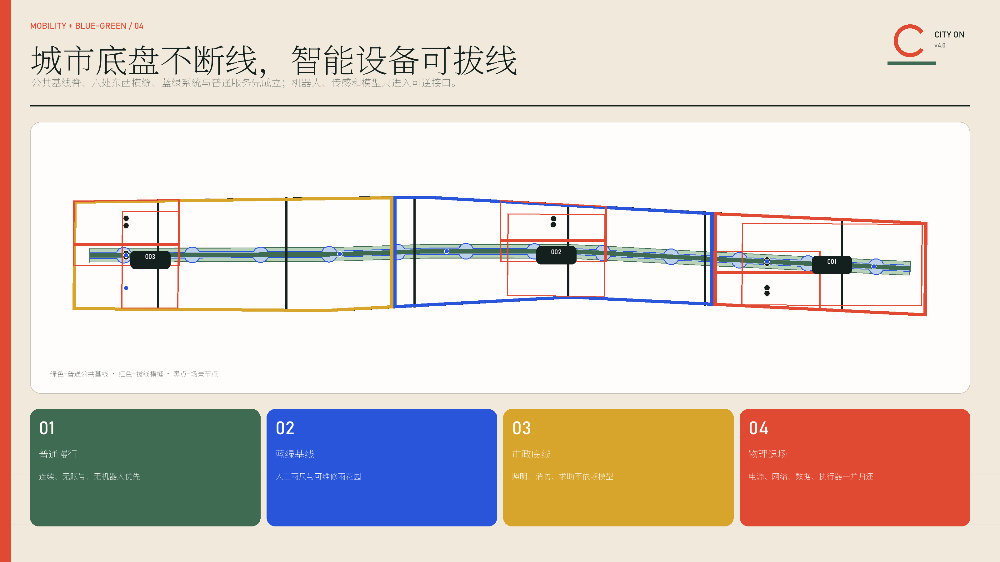
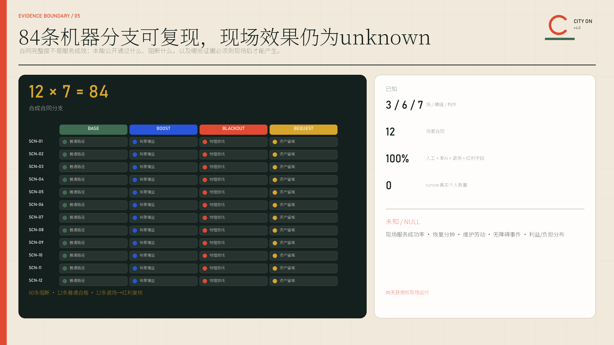

# 京张常在：AI退场，城市仍在

> **AI OFF, CITY ON。** 把AI拔掉，城市仍然更好用。每一次试验都要给京张留下一项无需模型、账号、网络或智能设备也能继续使用的公共红利。

## 执行摘要

京张铁路遗址公园不是等待科技接管的空白场地。官方资料显示，走廊规划约9公里，京张高铁在海淀约6公里入地，一期2.5公里、16.8公顷已经开放；建设本身通过保留铁轨、道岔、清华园站、海绵设施和连续公共空间推动城市缝合 [source:OFFICIAL-PARK-PLAN-2021] [source:OFFICIAL-PARK-PHASE1-2023]。因此本案不再问“还能放多少AI”，而问一个更难、也更像城市设计的问题：**当模型停机、供应商退出、设备拆走，市民究竟得到什么？** [assumption:A-EXISTING-PARK-001]

答案是一份四段式公共红利合同：`BASE 基线 → BOOST 增益 → BLACKOUT 退场 → BEQUEST 留城`。`BASE`先证明无AI也能通行、休息、问路和获得人工服务；`BOOST`只允许有限任务、最小数据和具名人工；`BLACKOUT`必须真实拔掉模型、网络、传感器和自动执行器；`BEQUEST`再验收触觉地图、人工目录、开放适配器、维修手册、雨花园养护卡或遗产步道是否仍可独立工作 [data:visual/assets/civic-dividend-contracts.json]。

空间上是一条不可断开的公共基线脊、三座差异化公共红利场、六处东西横缝、七类离线可用构件和十二项场景。北部众智园把具身智能、安全、能耗和雨洪测试转成可触摸安全模块与失败档案；中部AI原点把开源维护、互操作和人才学习转成可修补的公共工具；南部大钟寺把无障碍、公共服务、文化与消费场景转成静态地图、有人柜台和申诉路径 [data:visual/assets/dividend-yards.json] [metric:scenario_dividend_contract_count]。

实施从12周调试开始，而非永久建设。前两周只测无AI基线；中段依次经过普通1:1样机、合成数据和影子运行；第8周设置“城市退场日”；最后四周只做红利、维护劳动和分布影响审计，再决定保留、修改或拆除 [data:visual/assets/first-12-weeks.json]。本地推演对12份合同各跑7类合成分支，共84例；60条缺基线、缺人工、缺退场、缺红利或出现禁入数据的路径全部阻断，12条退场分支进入红利复核 [metric:unplugged_tabletop_case_count] [assumption:A-TABLETOP-001]。

这不是“反AI”方案。它为企业增加一项稀缺能力：产品不仅要证明能上线，还要证明可移植、可维修、可停用、可退出供应商锁定，并能把试验价值沉淀为开放组件、服务标准和长期城市资产。真正的世界级AI街区，不以设备永远在线证明先进，而以城市在任何技术周期里都能保持尊严、连续和学习能力证明成熟。

## 设计依据与资料清单

本版把证据分为四层。第一层是征集公告与智能体任务书，只界定三层空间、三大定位、五大功能、三区两翼和六项任务，不提供法定控制值 [source:OFFICIAL-ANNOUNCEMENT] [source:AGENT-TASKBOOK]。第二层是北京、海淀主管部门公开的公园建设、铁路遗产、AI产业和城市更新事实，用于建立“已有何物、为何更新”的背景。第三层是仓库资料包、来源注册表和临时几何，用于可复算设计；第四层是国际案例与AI风险框架，只提取机制，不把境外制度或数值移植为北京标准。

| 资料状态 | 本版可做 | 本版绝不做 | 触发下一版的证据 |
|---|---|---|---|
| 已有官方公共信息 | 判断走廊已开放段、铁路遗产、更新方向和产业背景 | 推定全部走廊现状、主体、投资或审批 | 官方补遗与项目资料 |
| 临时范围与九组GeoJSON | 拓扑检查、概念分区、面积复算和图面关系 | 官方红线、权属、征拆或工程线位 | official polygon与测绘成果 |
| 概念建筑和构件 | 表达保留优先、公共首层、可逆插接 | 现状建筑普查、层数、高度或拆除量 | 建筑、权属、结构、消防和文保调查 |
| 场景合同与合成推演 | 检查字段、失败路径、停止和恢复逻辑 | 现场性能、公众接受或运营授权 | 具名主体、许可、预算、基线和独立评估 |

七个国际参考被压缩成七种可迁移机制：

| 案例 / 框架 | 可迁移机制 | 京张转译 | 明确拒绝照搬 |
|---|---|---|---|
| Barcelona Decidim [source:CASE-BARCELONA-DECIDIM] | 开源、可复用，线上与面对面并行 | 公共红利合同与纸面流程同步发布 | 不移植当地制度或平台治理 |
| Amsterdam Responsible Sensing [source:CASE-AMSTERDAM-SENSING] | 从自由、控制、隐私出发设计传感器 | 传感器必须有可见用途、拔线和人工替代 | 不把公共空间默认成数据源 |
| Punggol Digital District [source:CASE-PUNGGOL] | 开放平台、产学城混合、运行环境试验 | 北部验证—中部转化—南部使用形成闭环 | 不复制新城规模、投资和中央平台 |
| Seoul Oil Tank Culture Park [source:CASE-SEOUL-OIL-TANK] | 工业遗产由受限设施转为公共文化空间 | 铁轨、维修和退场痕迹成为可使用的城市记忆 | 不复制建筑形式或改造结论 |
| UK ATRS [source:CASE-UK-ATRS] | 公开用途、人工决定、申诉、更新和退役 | 每项场景发布通俗红利与退出记录 | 不声称其是中国法定标准 |
| NIST AI RMF [source:CASE-NIST-AI-RMF] | 全生命周期风险与停用组件记录 | `BLACKOUT`与`removed_archived`进入状态机 | 不以框架替代专业安全责任 |
| UN-Habitat People-Centred Smart Cities [source:CASE-UNHABITAT-PEOPLE] | 人权、数字公共品、包容和小规模试点 | 无账号服务、普通路径和开放复用包先行 | 不把非约束指南当审批依据 |

所有正文判断在附近引用，完整来源权利、日期、采集、转换与限制登记在 `sources.json`。图面是解释层，GeoJSON、JSON、矩阵和自检是复核层；冲突时以更高等级来源和机器资产为准。当前总体范围与三处重点区仍是临时几何 [data:geometry/site_boundary.geojson#SITE-001] [assumption:A-BOUNDARY-001]。

## 三层范围工作框架

三层不是三份各自成立的规划，而是同一项公共红利从策略到空间、再到可验证原型的传导链 [depth:three_level_scope_framework]。

| 层级 | 核心问题 | v4交付 | 不能越过的边界 |
|---|---|---|---|
| 统筹研究范围 | AI产业、人才、公共问题和区域伙伴如何交换能力 | 公共红利生态、七案例、五区域接口、长期活动体系 | 不虚构伙伴、企业、资金或落地 |
| 总体设计范围 | 走廊怎样在技术更替中保持公共连续 | 一条基线脊、三场、六缝、七构件、24个用地单元 | 临时SITE-001不是官方红线 |
| 三处重点区域 | 一次试验如何落位、拔线并留下可用之物 | 12场景合同、三种剖面、9项目和12周调试 | 临时矩形不是地块、权属或工程范围 |

总体临时范围约11.4平方公里，只是包内几何诊断 [metric:site_area_sqm]。三处重点区的粗略polygon只用于方案落位 [data:geometry/key_areas.geojson#PROV-KEY-001]。官方边界到位后必须锁定版本、重裁全部图层、重算面积与比例、重新归属场景和项目、更新中英图件与PDF，再发布差异日志；不能只手改标题数字 [depth:metrics_recalculation]。

每层使用同一条验收句：**无AI时谁仍能做什么；AI增加了什么；谁能拔线；拔线后留下什么；谁来维护。** 统筹层若没有真实公共问题和接收方，不进入总体层；总体层若没有不断线普通路径，不进入重点层；重点层若没有红利资产、维护主体和拆除方案，不进入试点。

## 统筹研究范围产业与未来城市研究

任务书的三大定位在本案中不是三个口号，而是三种可验证的公共产出 [source:AGENT-TASKBOOK]：

| 三大定位 | v4翻译 | 五大功能的落点 |
|---|---|---|
| 百年京张文化带 | 从“自主设计第一条国有干线”的工程文化，转向可理解、可维修、可传承的AI基础设施 | AI治理全球话语权、智能化AI活力城市 |
| 都市AI生活体验带 | 公众能在同一地点比较无AI基线、AI增益和退场后的服务 | AI+场景赋能新范式、智能化AI活力城市 |
| AI融合创新带 | 研发、测试、开源维护、产业转化和公共使用由红利回执连接 | AI全栈自主创新体系、世界级AI创新生态 |

北京和海淀公开信息显示AI企业、投资和核心产值已形成显著规模；具身智能产业园也在强调创新路径、应用场景和成果转化 [source:OFFICIAL-AI-INDUSTRY-2026] [source:OFFICIAL-EMBODIED-PARK-2025]。本案不把这些全市/全区数据压到走廊内，而提出一项产业竞争力补充：**从“能部署”升级为“能退场而不遗留锁定、债务和公共损失”。** 企业可在北部获得安全、能耗、断网和失败证据；在中部把证据转成开放适配器、维修包和双语说明；在南部只用合成或授权数据验证公众是否真的受益。

三区两翼形成一条双向链。众智园安全红利场负责高风险技术的隔离验证；AI原点开源红利工场负责维护、知识产权、互操作和人才；大钟寺日常红利客厅负责无障碍、公共服务、文化和消费端使用。中关村科技服务翼提供法律、标准、资本和专业服务方向，小月河场景赋能翼提供公共问题、生态与生活反馈方向。任何一翼都不能绕过三座场的人工与公共闸门 [data:visual/assets/regional-interfaces.json]。

区域协同只提出待同意的“输入—可分享输出”，不虚构伙伴关系：北纬社区可提出居民问题，未来科学城可提供测试方法方向，怀柔科学城可提供测量与校准方向，经开区可提供工程制造反馈，京津冀只接收去地点化schema、失败包和版本差异。任何坐标、个人数据、审批结论或合作名义都不跨区默认流动 [metric:regional_interface_count]。

品牌系统以一个断开的圆与仍连续的地面线构成：上部是可拔除的技术插件，下部是不断线的城市基线。中文主名“京张常在”强调城市与文化连续，英文 `JING-ZHANG CITY ON` 形成国际传播口令；`AI OFF, CITY ON`只作为公共承诺，不伪装官方标识。色彩使用骨白、煤黑、信号朱红、工程蓝、苔绿和维护黄；红色只标退场权，蓝色标开放组件，绿色标普通公共基线。

## 总体设计范围城市更新与控规深度城市设计

总体结构为“**一脊三场、六缝七件、十二红利**”。一条公共基线脊沿旧铁路方向组织不断线步行、骑行、休息、静态导向和人工求助；三座场承担安全、开源和日常三种红利；六条横缝优先修补东西向到达；七类构件把技术安装限制在可拔除接口；十二项场景逐一绑定位置和退场产物 [data:geometry/constraints.geojson#DY-01-SAFETY-DIVIDEND] [metric:civic_baseline_spine_length_m]。

24个概念用地单元继续使用允许的国土空间分类代码，覆盖临时SITE-001并通过拓扑审查 [data:geometry/land_use.geojson] [metric:land_use_parcel_count]。v4新增的“安全红利场、开源工场、日常客厅”是运营叠加标签，不是法定用地类别。产业空间靠近可控测试和专业服务，公共服务与生活体验靠近已有城市界面；绿地、公园和交通空间优先保持普通使用。

七类离线可用构件是城市设计而非设备清单：`OC-01`触觉公共基线牌、`OC-02`有人服务与纸面包、`OC-03`可逆插接轨、`OC-04`雨荫长凳、`OC-05`离线应急灯、`OC-06`红色退场闸、`OC-07`公共红利档案框 [metric:offline_ready_component_count]。每件先完成无电、无网、无模型的功能，再允许外挂传感、机器人或交互界面；智能部件不得占用无障碍净宽、树池、消防或普通服务台。

总体更新顺序是：保留现状公共价值 → 修补通行、遮荫、排水和人工服务 → 安装普通可逆构件 → 影子运行AI → 退场审计 → 决定保留、修改或拆除。建筑高度、容积率、密度、退线、停车、市政容量和拆除量保持unknown [assumption:A-CONTROLS-001] [depth:development_intensity_controls]。

## 重点区域详细设计

三处重点区均使用组织方临时粗略polygon，只表达功能关系；矩形边不代表道路、地块或权属 [data:geometry/key_areas.geojson#PROV-KEY-001] [assumption:A-LOCATOR-001]。

| 重点区 | 公共空间剖面 | AI增益只允许发生在 | AI退场后必须留下 | 首批场景 |
|---|---|---|---|---|
| 众智园安全红利场 | 公共观察花园—可触摸安全库—受控试验口袋—隔离后勤 | 具身安全、端侧能耗、红队、雨洪感知 | 障碍模块、能耗表、失败卡、人工雨尺 | SCN-01—04 |
| AI原点开源红利工场 | 无账号前廊—修补长桌—开放零件墙—受控开发后室 | 开源维护、互操作、模型说明、青年共学 | 维修手册、开放适配器、双语标签、工具目录 | SCN-05—08 |
| 大钟寺日常红利客厅 | 全天普通路径—触觉地图—有人柜台—限时合成沙盒 | 无障碍导航、服务分诊、文化共读、消费代理 | 静态地图、纸面目录、核史步道、申诉入口 | SCN-09—12 |

**众智园。** 机器人和传感器只进入有物理边界、人工急停和隔离后勤的试验口袋；公众观察区不是品牌看台，而是一座可以触摸测试障碍、阅读失败原因、比较断网模式的安全花园。清河生态、能源容量、平台资质、实际建筑和责任主体必须另行核查；测试通过不等于监管或产品批准 [data:visual/assets/dividend-yards.json]。

**AI原点。** 空间以修补而非路演为中心：一张公共长桌同时承接开源issue门诊、接口适配、双语说明和青年反向导师课。知识产权、商业秘密和敏感材料留在受控后室，前廊只展示可公开、可复用、可撤回的版本。AI停机后，桌、工具、手册、纸面流程和人际网络仍能运行。

**大钟寺。** 先做地面、首层和静态信息，不以桥隧或地下连通的工程想象替代现状调查。触觉地图、有人柜台和京张记忆步道全天可用，消费智能体只在合成交易和逐步人工确认下限时出现。只要普通路径被堵、真实支付被接入、人工柜台离岗或申诉不可用，场景立即退场。

## AI 创新生态、人才画像与 AI+ 场景

八类画像不是营销标签，而是权限、风险、维护和收益分布的设计输入 [metric:persona_count]：研发与开源维护者、初创和产品团队、公园使用者与居民、老年与残障使用者、儿童青年与照护者、一线运营维护者、夜间劳动者与骑手、国际访客与区域伙伴。任何一类都不能替另一类同意；非参与者的通行、安静和普通服务优先。

| ID | 场景 | AI增益 | `BEQUEST`无AI公共红利 | 立即退场条件 |
|---|---|---|---|---|
| SCN-01 | 具身智能退场测试 | 多主体安全与接管演练 | 可触摸障碍模块、纸面安全边界 | 越界、失联、急停或普通路径冲突 |
| SCN-02 | 端侧能耗与断网韧性 | 比较离线、降级和能耗 | 公共能耗表、人工运行包络 | 无法隔离内容或安全断电 |
| SCN-03 | 模型红队与失败陈列 | 合成提示和版本复测 | 失败卡、风险标记、修补版本 | 高危缺陷外溢或披露责任不清 |
| SCN-04 | 雨洪感知与人工雨尺 | 公开环境读数辅助养护 | 人工雨尺、雨花园养护卡 | 数据漂移、错误控制或生态风险 |
| SCN-05 | 开源维护门诊 | issue归类、依赖检查 | 修补手册、问题单、零件架 | 商密或未授权材料进入公开区 |
| SCN-06 | 城市服务互操作沙盒 | 合成工单检查转接 | 开放适配器、纸面服务流程 | 高风险误转、日志缺失或责任不清 |
| SCN-07 | 双语模型说明工坊 | 草拟通俗解释与差异 | 中英说明模板、术语卡 | 来源不明、误导或权利冲突 |
| SCN-08 | 青年反向导师课 | 自愿学习伙伴与任务匹配 | 纸面任务卡、工具借用目录 | 未成年人画像、诱导或无法退出 |
| SCN-09 | 无障碍慢行双轨导航 | 临时障碍与路线辅助 | 触觉静态地图、实测普通路线 | 错误导向、安全风险或热线失效 |
| SCN-10 | 公共服务分诊柜台 | 公开目录检索与材料提示 | 有人目录、纸面单、电话路径 | 输出专业结论或敏感材料滞留 |
| SCN-11 | 京张记忆共读 | 清权史料检索和多语解释 | 实体时间线、来源与撤回卡 | 来源不明、歪曲历史或撤回失败 |
| SCN-12 | 消费智能体拔线沙盒 | 合成预算和逐步确认 | 人工比价板、退款和申诉入口 | 接真实支付、暗黑模式或撤销失败 |

四段合同不是口号。`BASE`登记普通服务和人工入口；`BOOST`登记允许/禁止数据、工具权限和空间边界；`BLACKOUT`登记谁拔线、如何删除数据、怎样恢复；`BEQUEST`登记残留资产、维护人、开放复用包和是否保留 [data:visual/assets/scenario-cards.json]。退场后城市仍工作，才有资格谈下一轮增益 [metric:contract_bequest_coverage_ratio]。

`unplugged-test.schema.json`给第三方一个可检查的最小合同，样例只使用合成数据 [data:visual/assets/unplugged-test.schema.json]。本地runner对每份合同执行完整、缺无AI基线、缺人工、缺拔线、缺红利、出现禁入数据和退场后服务七个分支；84/84只说明合同逻辑闭合，现场绩效仍为null [data:visual/assets/unplugged-tabletop-evidence.json] [metric:blackout_bequest_branch_count]。

八状态机从 `proposed` 到 `removed_archived`，其中 `blackout_drill` 和 `bequest_audit`不可跳过。公共基线守护人和安全角色都能独立停试，运营方不能给自己的红利审计签字；纸面、电话、有人柜台和现场红闸共同构成停止通道 [data:visual/assets/state-machine.json] [data:visual/assets/governance-raci.json]。

## 用地、建筑规模与拆改留方案

概念用地总面积只在临时SITE-001内闭合，不是法定面积 [metric:site_area_sqm]。24个单元保留国土空间分类码，同时增加不具法定效力的运营标签：`public_baseline`、`reversible_boost`、`controlled_test`和`heritage_bequest` [data:geometry/land_use.geojson]。标签用于问“什么必须常在、什么可以拔除”，不改变土地用途。

建筑图层只含概念占位，总轮廓面积约25.0万平方米用于内部关系诊断 [metric:building_footprint_area_sqm] [assumption:A-BUILDING-001]。任何真实建筑进入方案前依次完成现状、年代、结构、权属、消防、文保、租赁、首层可达和维护调查。决策树只有四个出口：保留原状、修缮、可逆适配性再用、另行论证；在证据不足时默认保留，不产生拆除清单 [depth:retain_renovate_demolish]。

三种原型都把普通公共层放在最外侧和首层：安全场的观察花园不穿过测试区；开源工场的公共长桌不进入受控知识产权与数据后室；日常客厅的触觉地图和有人柜台不依赖商业租户。智能设备只挂接 `OC-03`，到期可连同线缆、基座和数据一并撤除；不得把设备拆走后留下围栏、断路、空屏或无人维护的“数字废墟”。

容积率、建筑高度、建筑密度、退线、停车、地下空间、能源负荷、市政容量和造价均保持unknown。unknown不是缺设计，而是明确列出所需资料、责任专业和决策闸门 [assumption:A-CONTROLS-001]。

## 交通、轨道、市政与公共服务设施

交通策略只有两项可在当前资料上成立：沿走廊保持一条普通公共基线脊，优先修补六处东西横缝 [data:geometry/roads.geojson#ROAD-168] [metric:unplugged_seam_count]。它们是连接意图而非工程线位；轨道安全、道路红线、客流、路口、停车、桥隧和地下连通都须由交通与轨道专业团队另行判断。

低速机器人只在众智园物理受控试验口袋出现，具名安全员能停、推行或隔离；公园普通路径、无障碍净宽和消防通道永不作为“智能物流效率”测试变量 [assumption:A-DELIVERY-001]。SCN-09导航必须同时发布触觉静态图和现场核验路线，算法建议不能替代交通安全责任。

市政与数字基础设施采用“普通系统先行、智能插件后置”。雨水、照明、应急、通信、供电和消防的基础功能按专业标准独立运行；传感器、边缘计算、机器人和模型接入统一可逆插接轨，标记电源、网络、数据、维护人和拔线动作 [data:geometry/constraints.geojson#OC-03-REVERSIBLE-PLUG-RAIL]。断网、断电或供应商退出后，离线灯、人工雨尺、纸面目录和有人柜台继续提供最低服务 [depth:municipal_new_infrastructure]。

公共服务坚持四条并行路径：现场人工、纸面材料、电话、无账号数字入口。AI可以帮助检索和翻译，不能作医疗诊断、法律结论、福利资格、信用评分、执法或真实支付决定 [assumption:A-AI-001]。任何试点的人力、班次、维护、保险和持续预算在G5前保持unknown。

## 蓝绿空间、公共空间与城市风貌

临时范围内概念绿地约153.2万平方米、比例约13.4%；概念公共空间约86.6万平方米、比例约7.6%，均只用于内部方案复算 [data:geometry/green_space.geojson#GREEN-168] [metric:green_ratio] [metric:public_space_ratio]。生态、树木、土壤、雨洪、河道、养护和文保条件尚未形成专项结论。

蓝绿系统承担最重要的“无AI公共红利”：连续树荫与休息、雨洪可读、安静边界、普通步行和可维修材料。SCN-04的传感器拔除后，人工雨尺、溢流路径、养护卡和雨花园仍可工作；任何自动控制不得把未经核实的数据直接写入排水或生态设施动作。

京张铁路1909年建成，是中国人自主设计建造的第一条国有干线铁路；一期公园又通过恢复老线、修复清华园站和再用铁路元素让文化遗产回到日常生活 [source:OFFICIAL-JINGZHANG-HISTORY] [source:OFFICIAL-PARK-PHASE1-2023]。v4不把铁轨变成装饰logo，而把铁路的测量、维修、交接和可持续运行翻译为“公众看得懂、维护者修得了、技术退场后还在”的空间文化。

四座概念地标分别是红色退场闸、开源零件墙、常在廊和第一轨记忆带 [metric:landmark_count]。它们不预设新建筑：可以先是可逆展架、公共长桌、触觉构件和年度记录；任何附着遗产本体的动作必须经过文保审查。荣誉系统记录的不只是成功，也记录修补、停用、负面结果、维护劳动和公众纠错。

风貌采用暖砖、耐候钢、浅色木、矿物铺装和可替换金属件；界面低亮度、可关闭、无巨屏。AI生成图只表达材料气质与人本场景，不能证明建筑、边界、植被、人数或实施效果 [source:IMAGEGEN-CONCEPT-V4] [assumption:A-IMAGEGEN-001]。

## 更新项目清单、实施政策与分期计划

九个项目包彼此可独立暂停 [data:visual/assets/renewal-projects.json]：

| 项目 | 核心交付 | 进入条件 | 失败后的默认动作 |
|---|---|---|---|
| PRJ-01 公共基线脊审计 | 普通通行、休息、静态导向和人工求助基线 | 官方范围与现场走查 | 公示缺口，不接AI |
| PRJ-02 六处横缝修补 | 无障碍、照明、排水和安全缺口清单及普通样机 | 权属、交通、文保和无障碍复核 | 维持现状并隔离风险 |
| PRJ-03 安全红利场 | 四个受控产业测试与公共红利 | 责任、能源、生态、安全 | 停测、复原、公开失败 |
| PRJ-04 开源红利工场 | 维修门诊、开放适配器和共学 | 场地、知识产权、消防和运营 | 退回纸面门诊 |
| PRJ-05 日常红利客厅 | 触觉地图、有人柜台、文化和消费沙盒 | 交通、权属、消费者权益和无障碍 | 只保留普通服务 |
| PRJ-06 七类离线构件 | 1:1普通样机、维护和拆除说明 | G0-G5 | 拆除并恢复 |
| PRJ-07 公共红利合同 | schema、样例、适配器和版本记录 | 法律、数据、公众和专业复核 | 归档，不进入现场 |
| PRJ-08 四座常在地标 | 可逆地标、贡献与失败档案 | 来源、版权、文保和维护 | 不永久展示 |
| PRJ-09 常在周 | 年度退场演练、国际对话和公开复盘 | 许可、人员、预算、安全 | 缩小、延期或取消 |

项目成熟度G0—G7和场景准入C0—C7是两套独立闸门 [data:visual/assets/implementation-gates.json]。G回答“项目能否承担空间、专业和长期责任”，C回答“某一AI场景能否进入”；一个场景通过不能替另一个场景背书，一个项目有预算也不能绕过公共目的、无AI基线和退场验证 [metric:project_maturity_gate_count] [metric:scenario_admission_gate_count]。

首12周分九段：证据锁定、两周无AI基线、两周普通1:1样机、两周合成影子运行、一周授权增益、第8周城市退场日、两周红利与维护审计、一周独立公众复核、第12周保留/修改/拆除 [metric:first_twelve_week_stage_count]。这是一份调试次序，不是政府活动日程 [assumption:A-FIRST-12W-001]。

长期运营采用四个节奏：每周开放维修门诊；每月选择一个场景做拔线演练；每季度由独立评估者、维护者和受影响公众共同发布红利与负担分布；每年举办 `CITY ON WEEK / 京张常在周`，用中英双语展示可复用组件、失败、退役和修补。开发者和企业的转化路径不是路演—招商，而是公共问题—普通基线—有限增益—退场—开放红利—专业采用；主体、资金、采购和成效均不预先承诺 [assumption:A-RESOURCES-001]。

## 指标体系、面积复算与合规矩阵

指标分成三层。第一层是临时几何诊断：范围、绿地、公共空间、概念建筑和走廊长度；它们有公式但没有法定效力。第二层是合同完整度：12场景、3场、6缝、7构件、8状态、9项目、84分支以及人工、非AI、退场和红利字段覆盖；它们可由本包JSON计数。第三层是现场效果：无障碍事件、恢复时间、维护劳动、利益负担分布、公众使用和服务成功率；目前全部unknown [data:metrics.json]。

| 指标 | 当前值 | 能说明 | 不能说明 |
|---|---:|---|---|
| 公共红利场 / 横缝 / 构件 | 3 / 6 / 7 | 空间合同已落位 | 官方范围或工程可行 |
| 场景合同 / 人工 / 非AI / 退场 / 红利覆盖 | 12 / 100% / 100% / 100% / 100% | 字段完整 | 服务有效或公众同意 |
| 合成推演 | 84分支，预期一致 | 失败路径可复现 | 真实设备、人员或场地表现 |
| 现场服务成功率 | unknown | 尚无授权基线 | 不能填0、100%或估值 |
| FAR / 高度 / 拆除量 | unknown | 资料与专业判断未到 | 不能由概念图反推 |

空间指标在EPSG:4548复算，来源、公式、单位、置信度和statutory_use逐项记录。合同指标从机器资产计数，不由正文手填；现场指标在有许可、方法、样本、覆盖、偏差、责任人和复核日期前保持null。official polygon到位后需全量复算 [assumption:A-BOUNDARY-001]。

合规矩阵覆盖17项官方要求和agent.1—agent.6；标准矩阵覆盖6项标准；设计深度矩阵覆盖15项专业判断。三张矩阵分别指向正文、图纸、几何、指标、来源、假设和自检，不把同一组证据复制给六项智能体任务 [self_check:PROFESSIONAL_EVIDENCE]。

## 风险、版权与合规说明

最严重的失败不是模型输出错误，而是**技术退场后留下封闭接口、废弃设备、维护债务、被占用公共空间和无人负责的数据**。因此以下条件均为硬停止：无AI普通路径不可用；没有具名人工；无法物理拔线；个人敏感数据越界；红利资产没有维护人；建筑、交通、市政、消防、文保、生态或无障碍专业闸未过；真实支付、医疗、法律、执法或个人评分进入自动决定 [data:risk.json]。

信息与资产只在可公开复核的资料边界内使用；不能证明公开来源或取得授权的数据与素材不进入提交包。隐私、版权、授权、实施风险与合规状态均由具名人工复核，任何一项证据不足就保持 `pending`，不得用模型推断补齐。

公共红利不是货币、土地权益、财政补贴、法定补偿或政府绩效指标，只是一项可审查的设计验收概念 [assumption:A-DIVIDEND-001]。所有空间落地均为概念建议、参考方案或可供专业团队深化研究，不替代正式规划，不构成政府审定、项目立项、采购、合作、招商、投资或实施承诺。

文本、结构化资产、五张核心图、HTML、PDF、交互和本地视频编排为本次投稿原创制作。三张空间体验底图来自内置GPT Image 2，人工复核无可读字符后在v4中重新裁切、调色和编排；逐资产记录模型、日期、提示词、用途、转换、权利和局限 [source:IMAGEGEN-CONCEPT-V4]。生成图只作 `concept / presentation only`，不作为现状、地图、数字、工程或公众意见证据。字体、代码、媒体、来源和第三方权利分别登记在 `report/copyright_statement.md` 与 `visual/assets/rights-ledger.json` [data:visual/assets/rights-ledger.json]。

离线网页不加载CDN、远程字体、地图瓦片、API、iframe、表单或跟踪器；交互可键盘操作、支持减少动态并有静态后备。视频无自动播放，提供poster、WebVTT字幕和Markdown文字稿。中英文正文、核心图、HTML和PDF独立同构；所有 neutral 概念媒体在manifest中显式登记无文字状态 [self_check:VISUAL_PACKAGING]。

## 参考资料

完整来源登记见 `sources.json`。核心一手来源包括征集公告与任务书、北京市规划自然资源部门的京张公园规划解读、北京市园林绿化部门的一期开放信息、海淀与北京AI及城市更新公开资料、京张历史文化资料；国际案例仅用于机制比较。来源均记录发布者、URL或本地路径、日期、采集、时空范围、权利、转换和限制，不嵌入第三方图片、Logo、地图或长段文本 [source:SITE-PACKAGE] [source:SOURCE-REGISTRY]。

引用采用“最小必要、近端可核、原始优先”的原则。官方网页用于确认已公开事实和政策语境，不推断到具体地块；任务书用于核对交付范围，不把任务表述写成现状结论；资料包和临时GeoJSON用于内部复算，任何面积和空间关系都随official polygon替换；NIST、UN-Habitat与海外项目只帮助形成退场、公共权利、开放复用和遗产转化的方法比较。若来源更新、失效或与后续官方资料冲突，下一版将保留旧版本、标明差异、回退相关结论并重新生成中英正文、图件、指标和清单。

本包没有抓取或嵌入来源页面的图像、地图瓦片、Logo、视频、字体或大段原文。公开页面仅以事实摘要和机制比较方式使用，具体复用仍以原发布者权利声明为准。生成体验图、确定性证据图、排版代码、媒体编排和字体各自拥有独立权利记录；审阅者可从正文锚点进入 `sources.json`，再追溯发布者、访问日期、采集方式、适用时空范围、转换、允许用途和局限。此索引既支持复核，也阻止“漂亮图面反向制造证据”。
