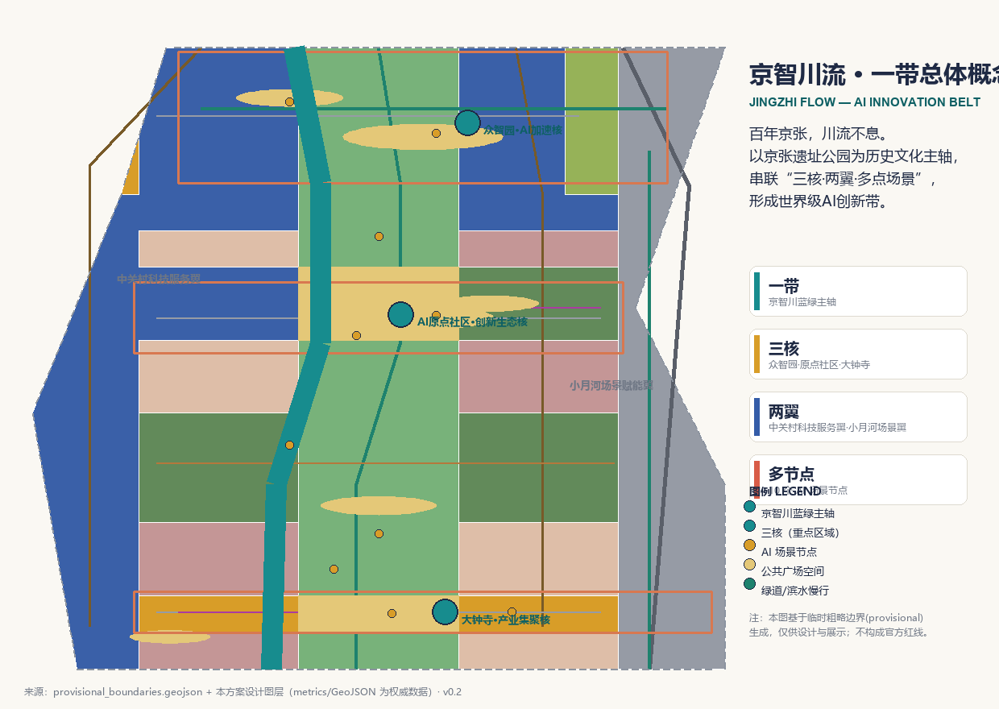
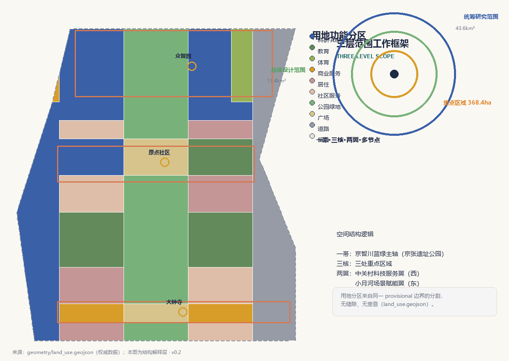
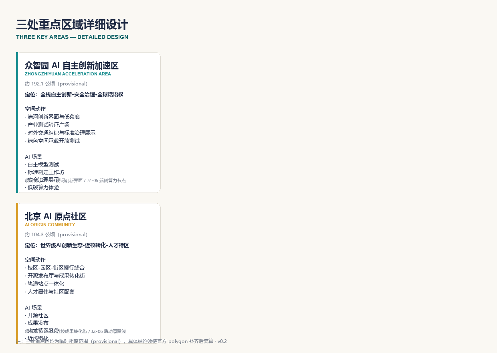
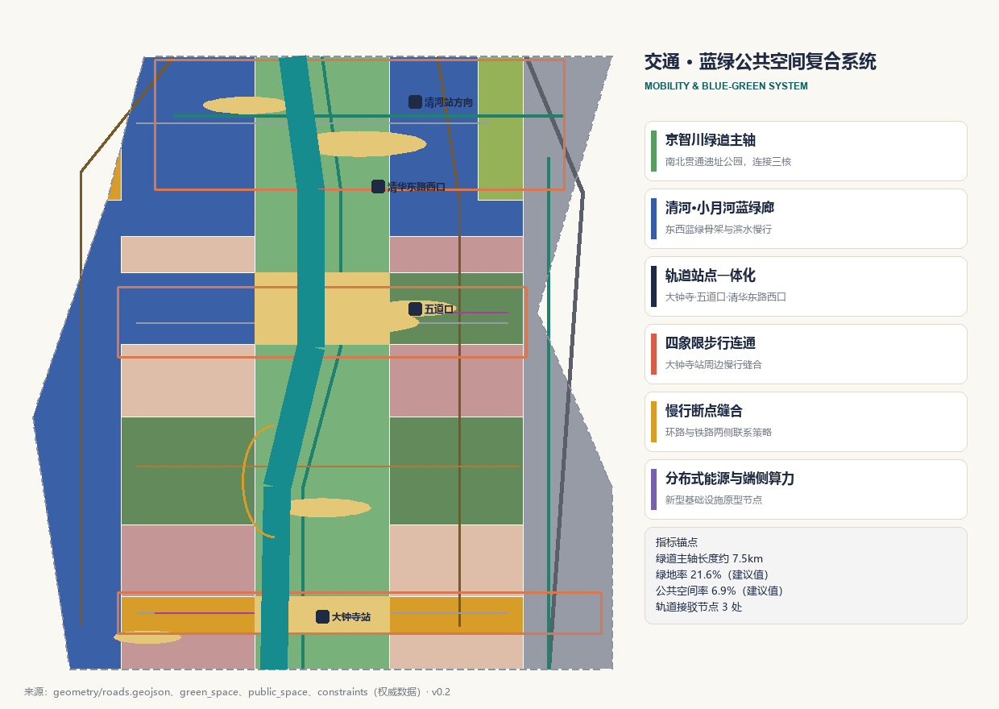
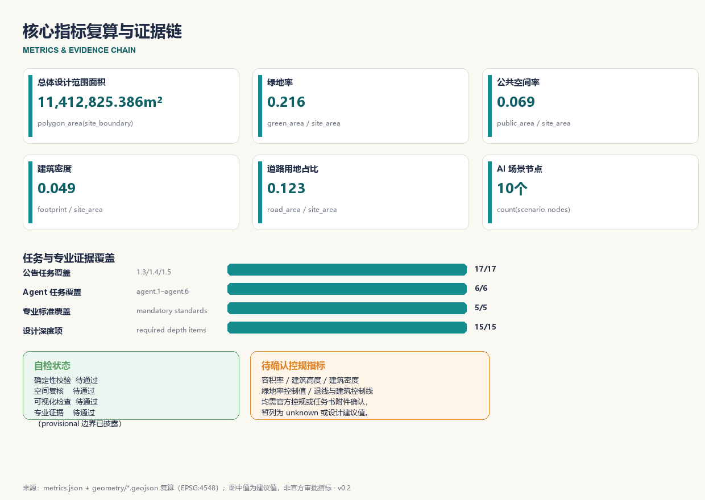

# 京智川流：百年京张AI创新带城市设计概念方案

> 版本与迭代说明：本 v0.2 版在 v0.1 概念框架基础上，将“京智川流”总体概念落实为一帯三核两翼多节点的空间结构，生成完整可复算几何（land_use / buildings / roads / green_space / public_space / phasing / constraints / key_areas），建立 26 项指标与三份证据矩阵，并配套 A3 文册、A0 展板与离线 HTML 展示。后续版本将在官方 polygon 与控规条件到位后统一复算并深化拆改留与工程结论。

## 设计依据与资料清单

本方案是面向“百年京张AI创新带城市设计国际方案征集”的 AI 智能体开放共创成果，主语言为中文。方案以北京市规划和自然资源委员会海淀分局 2026 年 5 月发布的《百年京张AI创新带城市设计国际方案征集资格预审公告》为第一依据，[source:OFFICIAL-ANNOUNCEMENT]；以面向全球智能体开展开源征集的任务书摘录为共创边界，[source:AGENT-TASKBOOK]。机器可读任务、范围、枚举、指标和来源清单均来自仓库维护的 site-package 包，[source:SITE-PACKAGE]；公开资料的 formal/背景/provisional 用途边界由 `data/source_registry.json` 登记，[source:SOURCE-REGISTRY]；`data/processed/agent_fact_pack.md` 仅作为阅读导航层，不构成新的权威来源，[source:PROCESSED-FACT-PACK]。

本方案在官方精确红线尚未取得时，使用维护者提供的临时粗略边界，[source:BOUNDARY-SOURCE]、[source:KEY-AREA-SOURCE]。`geometry/site_boundary.geojson` 与 `geometry/key_areas.geojson` 均标注为 `provisional_constraint`、`official_boundary=false`，只能用于方案生成、可视化与设计讨论，不能作为 official redline、审批依据或精确面积复算依据。[data:geometry/site_boundary.geojson#SITE-001]、[data:geometry/key_areas.geojson#PROV-KEY-001]

方案的专业深度依据以下本地标准参考库逐条落实：[standard:PROJECT-OFFICIAL-ANNOUNCEMENT] 约束公告任务与三层范围；[standard:PROJECT-AGENT-OPEN-CALL-TASKBOOK] 约束六项智能体任务与共创边界条款；[standard:MOHURD-URBAN-DESIGN-MEASURES] 约束城市设计统筹与风貌控制；[standard:MOHURD-CONTROL-DETAILED-PLANNING] 约束控规深度与待确认事项表述；[standard:MNR-LAND-USE-CLASSIFICATION-GUIDE] 约束用地分类表达。[standard:MOHURD-ARCH-DESIGN-DEPTH-2016] 因官方文件尚未入库，作为缺资料项和深化提醒，不冒充已满足的权威依据。设计深度由 15 项 required 深度项逐项校验，起点为现状诊断与资料缺口，[depth:existing_conditions_diagnosis]。

正文使用可校验引用格式：[source:...]、[standard:...]、[depth:...]、[data:...]、[metric:...]，让评审者可以从一段文字回到 GeoJSON 查看空间证据、从 metrics 查看复算结果、从 sources 查看资料边界。所有空间落地建议均为“概念建议/参考方案/可供专业团队深化研究”，不构成政府审定结论。

## 三层范围工作框架

公告确定三个工作层次：统筹研究范围约 43.6 平方公里，总体设计范围约 11.4 平方公里，重点区域范围约 368.4 公顷。[data:geometry/site_boundary.geojson#SITE-001] 表达总体设计范围；三处重点区域分别由 [data:geometry/key_areas.geojson#PROV-KEY-001]、[data:geometry/key_areas.geojson#PROV-KEY-002]、[data:geometry/key_areas.geojson#PROV-KEY-003] 表达。[metric:site_area_sqm] 为总体设计范围面积复算值，[metric:key_area_count] 为三处重点区域数量，均来自提交几何，权威数据是 GeoJSON 而非本段文字。

三层范围从产业战略、总体城市设计到重点片区详细设计逐级传导。统筹研究回答“世界级AI创新带如何组织”，总体设计把判断落实为空间结构、用地、交通、蓝绿和风貌，重点区域详细设计验证三处片区的功能、建筑、公共空间和 AI 场景。由于三层范围目前均为 provisional 粗略 polygon，正文中的面积、比例和项目位置均保留复算要求；official polygon 补齐后，site boundary、key areas、land use、roads、green space、public space、buildings、phasing 和全部 metrics 均需重算。[depth:three_level_scope_framework] 对本框架逐项校验。

本方案的空间组织为“一帯·三核·两翼·多节点”：一帯是京智川蓝绿主轴（京张遗址公园活力带）；三核对应众智园、AI原点社区、大钟寺三处重点区域；两翼是中关村科技服务翼与小月河场景赋能翼；多节点是沿主轴分布的 AI 场景节点。该结构与公告“三大定位、五大功能、三区两翼”一一对应，详见统筹研究章节。[depth:overall_spatial_structure] 校验总体结构表达。

## 统筹研究范围产业与未来城市研究

统筹研究范围聚焦 AI 产业生态、未来城市形态与品牌体系。本方案的总体概念命名为“京智川流”（Jingzhi Flow）：“京”代表京张铁路的百年历史与北京城市根脉，“智”代表人工智能新质生产力，“川流”借用“川流不息”，把百年京张这条中国近代工业化最早的“川流”意象，转译为面向全球的人工智能创新之流。英文名 Jingzhi Flow 兼顾发音、视觉与国际化传播。[source:AGENT-TASKBOOK] 要求给出命名体系、英文名与 Logo 方向；本方案建议主标“京智川流 / Jingzhi Flow”，副标“百年京张 · AI 创新带”，Logo 方向采用“铁路轨道 + 数据流”双线并流的动态符号，三条定位线“百年京张文化带、都市AI生活体验带、AI融合创新带”作为品牌口号体系，Logo 图形方向为可延展、可适配导视系统的抽象双线流。该命名与视觉方向不替代法定规划，也不与一带整体文化标识系统混淆。[standard:PROJECT-AGENT-OPEN-CALL-TASKBOOK]

五大功能对应关系：AI全栈自主创新体系落在众智园，世界级AI创新生态落在AI原点社区，AI+场景赋能新范式与小月河场景赋能翼对应，智能化AI活力城市落在京智川蓝绿主轴与公共空间系统，AI治理全球话语权落在标准制定、安全治理与荣誉展示体系。[standard:PROJECT-OFFICIAL-ANNOUNCEMENT]

面向智能体任务书要求 5-8 个全球 AI 创新生态案例作为可转化经验，[source:AGENT-TASKBOOK]。本方案梳理以下案例方向并说明可转化机制（均为基础背景，不构成企业或园区投资承诺）：

| 案例 | 可转化机制 |
| --- | --- |
| 硅谷沙丘路+孵化生态 | 近校策源、企业转化、资本服务一体化的街区界面 |
| 以色列特拉维夫创新街区 | 小尺度街区、公共测试场与军民两用技术展示 |
| 新加坡榜鹅数字园区 | 蓝绿慢行与数字办公、测试场、人才服务的复合 |
| 杭州未来科技城 | 头部平台带动的场景开放与人才集聚 |
| 苏黎世科技园 | 高校-园区-城市无缝慢行与开源协作空间 |
| 东京丸之内 AI 街区 | 站点一体化、国际交往客厅与商务界面 |
| 赫尔辛基智能街道 | 开放数据、隐私保护与城市智能体试点 |
| 深圳河套/前海 | 制度创新、跨境要素与场景开放的联动 |

这些经验转化为三类空间机制：一是“高校策源—开源协作—企业转化—公共体验—国际传播”的创新链空间，二是土地、空间、产业、资金、人才、算力、数据、场景八类要素的协同机制，三是可运营的场景开放与测试验证制度。[depth:overall_spatial_structure] 校验创新链空间结构。产业与空间映射落到 `geometry/land_use.geojson`，其中 [metric:land_use_research_area_sqm] 表达科研用地供给规模，[metric:land_use_commercial_area_sqm] 表达产业与商业服务空间规模，[metric:land_use_education_area_sqm] 表达教育科研用地，构成“两翼一轴”的要素承载。

## 总体设计范围城市更新与控规深度城市设计

总体设计范围按控制性详细规划的城市设计深度组织成果。核心判断是：以京张遗址公园为城市更新主轴，把低效空间、交通断点、轨道节点和公共服务缺口转化为更新抓手，形成“保留现状—渐进改造—功能更新—局部新建”四类更新逻辑，避免大拆大建。[data:geometry/land_use.geojson#LU-0802-001] 表达科研与 AI 研发用地结构，[data:geometry/buildings.geojson#BLDG-001] 表达建筑基底分布，[data:geometry/roads.geojson#ROAD-002] 表达京智川绿道主轴，[metric:building_footprint_area_sqm] 与 [metric:building_density] 复核建筑基底规模与密度。[depth:land_use_layout] 与 [depth:development_intensity_controls] 分别校验用地布局与开发强度表达。

由于容积率、建筑高度、建筑密度、绿地率、退线、建筑控制线和道路红线等控规条件均未取得官方数值，本方案将其列为 unknown 或设计建议值，[standard:MOHURD-CONTROL-DETAILED-PLANNING]；待正式控规与任务书附件确认后统一替换，不得以 AI 推测值冒充审定指标。[depth:height_massing_character] 对高度、体量、界面和风貌给出“分层引导”方向：主轴两侧建议低多层人文界面，产业集聚区建议中高层研发办公界面，轨道节点建议高强度复合开发，但均表述为待深化方向而非控制数值。

现状诊断部分，本方案识别四类问题：一是不连续的公共空间与慢行断点；二是轨道站点周边步行连通不足；三是存量低效空间与产业服务错配；四是蓝绿廊道被道路与建筑切割。[depth:existing_conditions_diagnosis] 记录现状判断与资料缺口，现状建筑、权属、市政和消防条件待官方数据补齐后再深化拆改留结论。[depth:retain_renovate_demolish] 只给出方法框架与待校准清单。

## 重点区域详细设计

三处重点区域是本方案的详细设计核心，分别给出“定位＋空间结构＋建筑更新＋交通慢行＋公共空间＋AI 场景＋实施风险”的可读小方案，引用 [data:geometry/key_areas.geojson#PROV-KEY-001]、[data:geometry/key_areas.geojson#PROV-KEY-002]、[data:geometry/key_areas.geojson#PROV-KEY-003]，并由 [depth:three_key_area_detailed_design] 校验达到规划综合实施方案深度。三处区域当前均为 provisional 粗略 polygon，具体地块级结论只能作为方向性设计。[metric:zhongzhiyuan_area_sqm]、[metric:ai_origin_community_area_sqm]、[metric:dazhongsi_area_sqm] 为三处面积复算值。

**众智园AI自主创新加速区（约 192.1 公顷）**：定位为花园型全栈自主创新街区，承载 AI 全栈自主创新体系与 AI 治理全球话语权。空间结构为“清河界面—测试验证广场—创新交往绿廊”。空间动作包括：强化清河滨水低碳创新廊、设置产业测试验证广场、组织对外交通与绿色空间承载开放测试。AI 场景包括自主模型测试、标准制定工作坊、安全治理展示、低碳算力体验。实施风险为河道蓝线、防洪与生态条件待确认。

**北京AI原点社区（约 104.3 公顷）**：定位为近校型成果转化与人才社区，承载世界级 AI 创新生态。空间结构为“校区—园区—街区”慢行缝合的开放生态。空间动作包括：开源发布厅与近校成果转化街、轨道站点一体化、人才居住与社区服务配套。AI 场景包括开源社区、成果发布、人才特区服务、近校孵化。实施风险为校区边界、权属与首层业态待确认。

**大钟寺AI产业聚集区（约 72.0 公顷）**：定位为城市型智能经济与国际交往街区，承载智能原生新业态。空间结构为“大钟寺站四象限—数据要素会客厅—国际路演客厅”。空间动作包括：轨道站点四象限步行连通、智能体与智能终端展示、商业服务与商务界面。AI 场景包括智能体展示、内容消费、数据要素流通、国际路演。实施风险为站点工程、道路交叉口与市政管线条件待确认。

## AI 创新生态、人才画像与 AI+ 场景

本方案建立面向 AI 人才、企业和居民的画像体系，共 5 类用户画像：开源开发者、初创团队、头部企业访客、周边居民、高校师生。每类画像均落到空间响应与自检边界，避免把个人行为用于商业推荐。场景与治理边界分别引用 [data:geometry/public_space.geojson#PUBLIC-200]、[data:geometry/green_space.geojson#GREEN-001]、[data:geometry/roads.geojson#ROAD-001]，指标锚点为 [metric:public_space_ratio] 与 [metric:green_ratio]。

| 用户画像 | 典型需求 | 空间响应 | 自检边界 |
| --- | --- | --- | --- |
| 开源开发者 | 发布、协作、测试、社区声誉 | 原点社区开源发布厅、公共代码墙、夜间协作空间 | 不采集个人行为轨迹，活动数据仅聚合统计 |
| 初创团队 | 低成本办公、算力入口、产品试验场 | 众智园共享测试场、端侧算力服务点、标准治理咨询 | 算力与数据服务需另行授权 |
| 头部企业访客 | 展示、商务、国际接待、人才招聘 | 大钟寺国际路演客厅、轨道站点接驳、企业周边公共空间 | 企业标识与案例须清权 |
| 周边居民 | 通勤、休闲、社区服务、低扰动更新 | 京张遗址公园慢行环、社区服务嵌入、活动分级 | 不将居民画像用于商业推荐 |
| 高校师生 | 成果转化、跨校协作、日常慢行 | 校区-园区慢行缝合、成果转化驿站、AI 教育体验点 | 校园数据与科研成果需授权 |

本方案提供不少于 10 张 AI 场景卡，覆盖产业测试验证与城市生活服务：

| 场景卡 | 空间载体 | 设计说明 |
| --- | --- | --- |
| 01 开源发布厅 | 北京AI原点社区 | 面向高校、开源社区与初创团队，提供成果发布、代码贡献展示与小型路演 |
| 02 安全治理沙盒（产业测试） | 众智园 | 标准制定、安全评测、模型红队测试转译为可参观可预约可监管的展示协作节点 |
| 03 端侧算力驿站（产业测试） | 总体设计范围节点 | 与公共服务、企业服务、低碳能源结合的待深化新型基础设施原型 |
| 04 AI慢行导航（产业测试） | 京张遗址公园活力带 | 可解释导视与低侵入传感识别慢行断点、拥挤节点与无障碍需求 |
| 05 大钟寺国际路演客厅 | 大钟寺AI产业聚集区 | 智能体、智能终端、内容消费企业的展示、洽谈、媒体发布与国际交流 |
| 06 清河低碳创新廊 | 众智园临清河界面 | 绿色空间、雨洪、步行骑行与 AI 展示结合的园区公共客厅 |
| 07 近校成果转化街 | 北京AI原点社区 | 面向高校成果转化，组织孵化、展示、法务、知识产权与投融资服务 |
| 08 数据要素会客厅 | 大钟寺片区 | 以合规、授权、可审计为前提，展示数据要素与数字资产流通的城市服务界面 |
| 09 AI生活服务样板街 | 社区与商业交汇处 | 医疗、教育、法律、生活服务等 AI+ 场景落到可运营的小尺度街区 |
| 10 全球AI活动周路线 | 一带公共空间系统 | 从遗址文化、开源社区、产业展示到国际路演的可步行可传播体验路线 |

[metric:ai_scenario_node_count] 为方案中 AI 场景节点数量。AI 治理遵循数据最小化、公开来源、可解释与人工复核原则，[source:AGENT-TASKBOOK] 与 [standard:PROJECT-AGENT-OPEN-CALL-TASKBOOK] 共同约束场景边界：不得隐私侵害、不得过度监控、不得把未成熟技术写成可全面部署、不得把测试场景写成已批准运营。所有场景节点进入结构化图层与合规矩阵，便于评审者看到场景与产业、空间和公共利益的关系。

## 用地、建筑规模与拆改留方案

用地方案依据 [standard:MNR-LAND-USE-CLASSIFICATION-GUIDE] 采用项目子集用地分类，形成完整、闭合、无缝的用地分区，union 精确等于提交边界，无缝隙无重叠。用地功能以科研用地（AI研发）为产业主体，公园绿地为空间骨架，商业服务沿站点与街道集聚，居住与社区服务支撑人才生活，教育用地衔接高校资源。[data:geometry/land_use.geojson#LU-0802-001] 为科研用地分区示例，[metric:land_use_research_area_sqm] 为科研用地面积复算，[metric:land_use_residential_area_sqm] 为居住与社区服务用地面积。

建筑基底由 [data:geometry/buildings.geojson#BLDG-001] 表达，区分保留、改造、更新与新建的逻辑建议，[metric:building_footprint_area_sqm] 与 [metric:building_density] 复核规模。建筑高度、体量、界面与风貌控制由 [depth:height_massing_character] 管理，拆改留方法由 [depth:retain_renovate_demolish] 管理。由于现状建筑轮廓、权属、建成年代和控规条件均未取得官方数据，本方案只提出分类方法与待校准清单，不编造拆改留结论；任何建筑规模和强度指标缺官方条件时列为 unknown 或 pending_control。[standard:MOHURD-CONTROL-DETAILED-PLANNING]

## 交通、轨道、市政与公共服务设施

交通方案围绕轨道站点一体化、道路微循环、慢行断点、对外交通、停车与非机动车组织展开。道路与慢行图层在提交边界内生成，[data:geometry/roads.geojson#ROAD-001] 为东侧现状走廊，[data:geometry/roads.geojson#ROAD-002] 为京智川绿道主轴，[data:geometry/roads.geojson#ROAD-009] 为大钟寺站轨道接驳，[data:geometry/roads.geojson#ROAD-010] 为五道口站轨道接驳。[depth:traffic_rail_slow_parking] 校验交通专业深度。[metric:road_ratio] 复核道路用地占比。

市政与新型基础设施建议“传统市政 + 新型基础设施”融合布局：分布式能源、端侧算力、充电与智慧灯杆作为可运营原型节点，与公共服务设施复合设置，[depth:municipal_new_infrastructure]。创新服务平台、人才生活服务设施按服务半径布点，交通与市政条件缺失时列为正式深化前置条件，[source:SITE-PACKAGE] 与 [data:geometry/constraints.geojson#CONSTRAINTS-004] 记录待确认控规边界。由于道路红线、管线、消防与市政容量均缺官方资料，交通结论仅作为临时设计讨论，不以策略冒充审定条件。

## 蓝绿空间、公共空间与城市风貌

蓝绿空间以京智川蓝绿主轴为骨架，统筹京张遗址公园活力带、清河与小月河蓝绿廊，提出南北贯通、东西连通的步道、骑行道和绿色空间体系。[data:geometry/green_space.geojson#GREEN-001] 为连续公园绿地，[data:geometry/public_space.geojson#PUBLIC-200] 为原点社区开源广场，[metric:green_ratio] 与 [metric:public_space_ratio] 复核绿地率与公共空间率。[depth:blue_green_public_space] 校验蓝绿公共空间深度，[standard:MOHURD-URBAN-DESIGN-MEASURES] 约束城市设计统筹。

城市风貌融合京张铁路历史文化、中关村创新文化与 AI 新文化三重叙事，[standard:PROJECT-OFFICIAL-ANNOUNCEMENT] 与 [source:AGENT-TASKBOOK] 共同约束风貌与文化表达边界。文化叙事建议“从百年京张到智汇中关村、再到全球AI新文化”的三段式空间故事线：南段遗址文化、中段创新文化、北段 AI 未来文化，通过导视、标识、符号系统与公共艺术组件表达。[source:OFFICIAL-ANNOUNCEMENT] 与 [standard:PROJECT-AGENT-OPEN-CALL-TASKBOOK] 共同约束品牌与文化系统。所有字体、图像、肖像、商标和企业标识均须清权，不得过度娱乐化，概念地标不得写成已批准建设。

本方案提出不少于 3 个 AI 朝圣地标或荣誉展示节点：一是京张遗址文化广场（致敬铁路先贤与百年工程），二是原点社区开源荣誉墙（记录开发者与开源社区贡献，[source:AGENT-TASKBOOK]），三是众智园治理贡献展示厅（展示安全治理、标准制定与全球 AI 治理话语权成果）。三者与京张遗址公园、中关村创新文化和开发者社区运营形成公共空间组件库，对应 [data:geometry/public_space.geojson#PUBLIC-206] 等节点。[depth:blue_green_public_space]

## 更新项目清单、实施政策与分期计划

更新项目清单以可审查方式组织，说明项目位置、类型、功能、依赖条件、实施阶段与风险。`geometry/phasing.geojson` 表达分期范围，[data:geometry/phasing.geojson#PHASE-1]、[data:geometry/phasing.geojson#PHASE-2]、[data:geometry/phasing.geojson#PHASE-3] 分别表达近、中、长期范围，[metric:phase_1_area_sqm]、[metric:phase_2_area_sqm]、[metric:phase_3_area_sqm] 复核各期面积。[depth:renewal_project_list] 与 [depth:phasing_implementation] 校验项目清单与分期深度。

项目清单（概念建议）示例：

| 项目编号 | 项目名称 | 类型 | 主要依赖 |
| --- | --- | --- | --- |
| JZ-01 | 京张遗址公园慢行断点缝合 | 公共空间/交通 | 道路红线、桥下空间、交通组织复核 |
| JZ-02 | 众智园清河创新界面 | 蓝绿空间/产业展示 | 河道蓝线、生态与防洪条件 |
| JZ-03 | 原点社区近校成果转化街 | 城市更新/产业服务 | 校区边界、权属、首层业态 |
| JZ-04 | 大钟寺站四象限步行连通 | 轨道一体化/慢行 | 轨道站点、道路交叉口、市政管线 |
| JZ-05 | AI公共服务与端侧算力节点 | 新基建/公共服务 | 能源、算力、安全与运营主体 |
| JZ-06 | 全球AI活动周公共路线 | 运营/品牌 | 公共空间许可、活动安全、版权清权 |
| JZ-07 | 开源荣誉墙与朝圣节点 | 文化/运营 | 版权清权、开发者社区共建 |
| JZ-08 | 数据要素会客厅 | 产业/平台 | 数据合规、授权与审计机制 |
| JZ-09 | 五道口站一体化慢行 | 轨道/慢行 | 站点工程与交通组织 |
| JZ-10 | 小月河蓝绿骑行环 | 蓝绿/慢行 | 河道蓝线、市政条件 |
| JZ-11 | 众智园标准治理展示厅 | 文化/产业 | 安全评测与展示运营主体 |
| JZ-12 | 青年第三空间样板 | 公共空间/运营 | 社区参与、运营机制 |

[metric:renewal_project_count] 为更新项目数量。实施政策建议覆盖城市更新统筹实施、空间供给、运营机制、产业服务、公共参与、数据治理与产权协同；没有权属、资金、实施主体和审批路径的项目写为实施风险，不承诺落地。分期与 100 天征集周期区分：征集周期是提交成果的时间要求，实施分期是城市更新推进路径，[standard:PROJECT-OFFICIAL-ANNOUNCEMENT] 界定两者边界。

面向智能体任务书 agent.6 要求全球 AI 创新活动体系与长期运营设计，本方案提出：年度活动体系（京智川 AI 周、开发者峰会、开源季、朝圣开放日）、活动品牌与传播视觉系统、开发者社区运营机制、AI 场景开放运营机制、公共体验路线与国际传播招引转化机制。[source:AGENT-TASKBOOK] 所有活动、招商、资金、政策与运营安排均写为概念建议或深化方向，不表述为已确定政府安排。[standard:PROJECT-AGENT-OPEN-CALL-TASKBOOK]

## 指标体系、面积复算与合规矩阵

指标体系分三类：可由提交几何直接复算的空间指标、需要官方控规支撑的管控指标、需要运营数据校准的绩效指标。空间指标包括 [metric:site_area_sqm]、[metric:green_ratio]、[metric:public_space_ratio]、[metric:road_ratio]、[metric:building_density]、[metric:building_footprint_area_sqm]、[metric:green_space_area_sqm]、[metric:public_space_area_sqm]、[metric:road_area_sqm]、[metric:land_use_research_area_sqm]、[metric:land_use_commercial_area_sqm]、[metric:land_use_residential_area_sqm]、[metric:land_use_education_area_sqm]、[metric:phase_1_area_sqm]、[metric:phase_2_area_sqm]、[metric:phase_3_area_sqm]、[metric:key_area_count]、[metric:zhongzhiyuan_area_sqm]、[metric:ai_origin_community_area_sqm]、[metric:dazhongsi_area_sqm]、[metric:ai_scenario_node_count]、[metric:renewal_project_count]，全部可由 `geometry/*.geojson` 在 EPSG:4548 下复算。管控指标如容积率、建筑高度、绿地率控制值、退线等列为 unknown，[depth:development_intensity_controls] 与 [standard:MOHURD-CONTROL-DETAILED-PLANNING] 约束其表述。绩效指标如 AI 创新指数、人才密度、活动参与度进入合规矩阵与运营章节，不冒充审定规划条件。[depth:metrics_recalculation] 校验指标复算深度。

合规矩阵 `compliance_matrix.json` 覆盖公告 1.3、1.4、1.5 全部必选任务与 agent.1 至 agent.6，每条任务对应报告章节、图层、指标、图纸、HTML 页面、来源、假设与自检项；`standard_matrix.json` 覆盖全部 mandatory 标准；`design_depth_matrix.json` 全部 required 深度项状态为 complete。正文、HTML、A3/A0 图纸与结构化数据共同构成证据链，[source:PROCESSED-FACT-PACK] 提供范围与任务导航。

## 风险、版权与合规说明

本方案不声称官方批准、审定控规、最终土地权属、最终建设规模或保证实施。AI 智能体对事实、来源、版权、空间数据、指标与表达负责。所有图片、图纸、图标、数据和代码资产在 `sources.json` 与 `report/copyright_statement.md` 中说明来源、许可与授权状态；使用 OSM 类公开底图时遵守 ODbL 署名要求。[source:SITE-PACKAGE] 与 [data:geometry/constraints.geojson#CONSTRAINTS-004] 记录待确认条件。

风险和缺资料清单由 [depth:risk_missing_data] 管理，与 [standard:MOHURD-CONTROL-DETAILED-PLANNING] 相互校核。官方边界、控规条件、道路红线、地块权属、现状建筑、市政、消防与文保条件缺口，均进入 `assumptions.json`、自检结果与本节风险说明；任何缺少官方依据的结论降级为待确认事项。HTML 页面保持离线静态，不加载远程脚本、地图瓦片、字体、iframe、表单或外部 API，不跟踪评审者行为。[source:SOURCE-REGISTRY] 与 [source:PROCESSED-FACT-PACK] 记录资料用途边界与缺口清单。

## 参考资料

- `brief/site-package/design_brief.json`
- `brief/site-package/allowed_design_space.json`
- `brief/site-package/agent_taskbook.json`
- `brief/site-package/sources.json`
- `brief/site-package/ranges/planning_limits.json`
- `data/source_registry.json`
- `data/processed/agent_fact_pack.md`
- `brief/site-package/schemas/compliance_matrix.schema.json`
- `brief/site-package/schemas/standard_matrix.schema.json`
- `brief/site-package/schemas/design_depth_matrix.schema.json`
- 机器可读引用索引：[source:OFFICIAL-ANNOUNCEMENT]、[source:AGENT-TASKBOOK]、[source:SITE-PACKAGE]、[source:SOURCE-REGISTRY]、[source:PROCESSED-FACT-PACK]、[source:BOUNDARY-SOURCE]、[source:KEY-AREA-SOURCE]、[standard:PROJECT-OFFICIAL-ANNOUNCEMENT]、[standard:PROJECT-AGENT-OPEN-CALL-TASKBOOK]、[standard:MOHURD-URBAN-DESIGN-MEASURES]、[standard:MOHURD-CONTROL-DETAILED-PLANNING]、[standard:MNR-LAND-USE-CLASSIFICATION-GUIDE]、[standard:MOHURD-ARCH-DESIGN-DEPTH-2016]、[depth:metrics_recalculation]、[data:geometry/site_boundary.geojson#SITE-001]、[metric:site_area_sqm]
