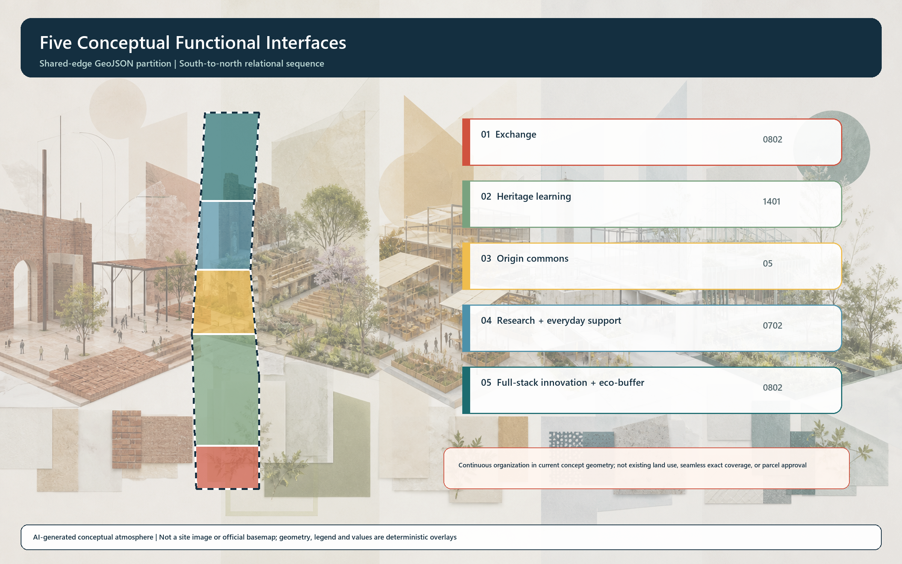
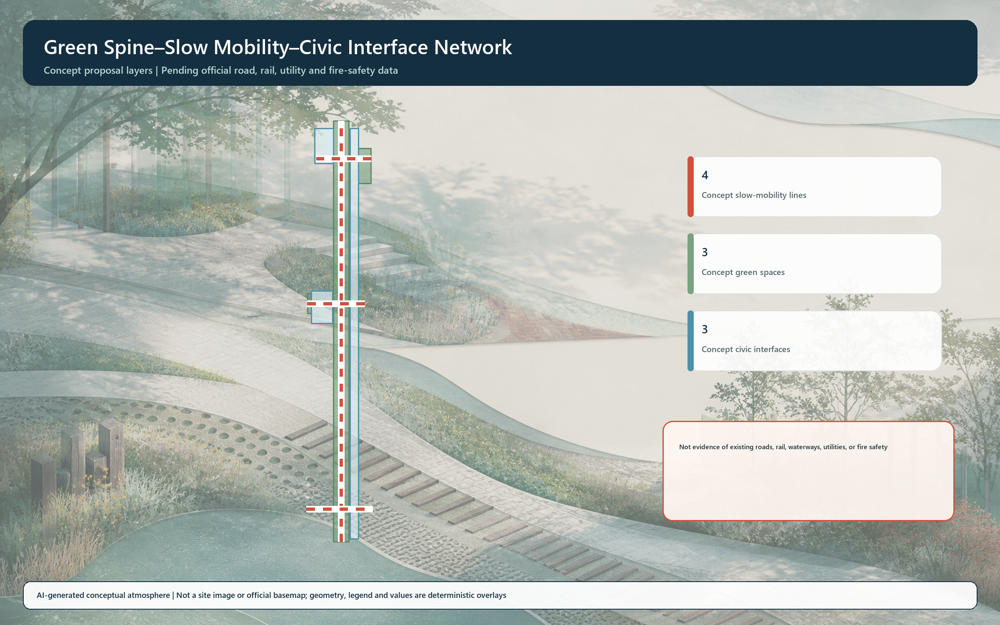

# Open Rail Protocol: An Open-Interface City for the Centennial Jing-Zhang AI Innovation Belt

## Design Basis and Source List

Open Rail Protocol is an open co-creation concept, not statutory planning, governmental approval, engineering design, or operational authorization. Its design judgement begins with the public qualification announcement and the agent taskbook, which together frame the three scope levels, three positionings, five functions, the Three Areas and Two Wings, scenario work, identity, and long-term operation. National urban-design and land-use references guide professional expression only; they are not extended into approved project controls. The cleared public package has no citable precise redline, regulatory control, ownership record, existing-building survey, or municipal engineering record. This package therefore uses only repository-provided provisional geometry to organise conceptual relations, and requires all layers, areas, metrics, and drawings to be recalculated after official attachments arrive. Each AI scenario identifies who frames a question, whom it serves, which cleared material it uses, who reviews it, and how it can pause or exit. [source:DATA-SRC-OFFICIAL-ANNOUNCEMENT-20260509] [source:DATA-SRC-AGENT-TASKBOOK-20260518] [standard:PROJECT-AGENT-OPEN-CALL-TASKBOOK]

## Three-Level Scope Framework

The 43.6-square-kilometre coordinated research area is a scale for industry, talent, culture, and innovation-network coordination. The approximately 11.4-square-kilometre overall-design area is a scale for discussing public interfaces, renewal logic, and slow-mobility connections around the Jing-Zhang heritage park. Zhongzhiyuan, Beijing AI Origin Community, and Dazhongsi are three detailed-design scales for a Full-Stack Forge, an Origin Commons, and an Exchange Hall. The submitted SITE_BOUNDARY and KEY_AREA geometry is copied from the repository provisional source. It can support intake self-checks, concept drawings, and relationship analysis, but is neither an official redline nor a precise-area basis. The three levels form one transmission system: research frames an open collaboration protocol; overall design turns it into a green spine and civic interfaces; key areas turn it into nodes, scenarios, and operating questions for professional review. [source:DATA-SRC-PROVISIONAL-BOUNDARIES-20260605] [depth:three_level_scope_framework] [data:geometry/site_boundary.geojson#PROV-SITE-001]

## Coordinated Research Area: Industry and Future City Research

Open Rail Protocol translates the connective spirit associated with the Centennial Jing-Zhang railway into civic interfaces people can enter, make with, question, and reuse. It is not a technology spectacle. The three positionings become memory, experience, and collaboration layers, while the five functions become Trace, Stack, Exchange, Scene, and Trust interfaces. Zhongzhiyuan is proposed as a public front door for full-stack innovation and trustworthy evaluation; the AI Origin Community as a near-campus setting for translation and everyday deliberation; and Dazhongsi as an interface for prototypes and mixed use. The Zhongguancun service wing helps translate rules and resources, while the Xiaoyuehe wing hosts low-intervention, reversible everyday tests. The identity direction turns two parallel tracks into a pair of open brackets, signalling access, questioning, and collaboration rather than commercial exclusion. [source:DATA-SRC-AGENT-TASKBOOK-20260518] [standard:PROJECT-AGENT-OPEN-CALL-TASKBOOK] [depth:overall_spatial_structure]

## Overall Design Area: Urban Renewal and Regulatory-Plan-Level Urban Design

The overall design does not predefine roads, FAR, height, retain-demolish choices, or engineering alignments. Instead, it proposes a north-south memory-and-innovation spine and an east-west network of civic interfaces for later professional development. The green spine links shaded walking, rain-garden thinking, low-intervention displays, quiet pauses, and contribution information. East-west interfaces expose possible walking discontinuities among campuses, parks, neighbourhoods, transit-adjacent areas, and cultural destinations; no concept line is presented as an approved road. Five functional interfaces are organized as a continuous north-south conceptual sequence within the provisional rough boundary for recomputation and discussion. Given the boundary precision and coordinate method, they do not claim seamless coverage, precise area, or parcel approval. The renewal sequence is explain and serve before deciding to build: establish accessible wayfinding, open learning, reversible demonstrations, and staffed assistance, then allow teams holding official attachments and survey evidence to determine whether project-scale intervention is appropriate. [standard:MOHURD-URBAN-DESIGN-MEASURES] [standard:MOHURD-CONTROL-DETAILED-PLANNING] [data:geometry/land_use.geojson#LU-003]

## Detailed Design of Key Areas

Zhongzhiyuan is proposed as a Full-Stack Forge. A Trustworthy Evaluation Observatory, Open Toolchain Desk, interdisciplinary learning, and ecological test courtyard give models, data, compute, talent, and standards discussion a visible but restrained civic front door. Beijing AI Origin Community is proposed as an Origin Commons, where a deliberation living room, Jing-Zhang Memory Translator, mission-learning workshops, and a cross-belt night school weave learning, living, cultural memory, and small prototypes into near-campus daily life while retaining paper, human, and accessible alternatives. Dazhongsi is an Exchange Hall, where an Open Demonstration Exchange and Human-in-the-Loop Mixed-Use Lab connect prototypes, creation, feedback, and professional service without turning public space into a single-brand showroom. All coordinates, footprints, renewal labels, scenarios, and public-space actions are directional. Official polygons, surveys, heritage conditions, mobility safety, ownership, and community input are required before detailed project work. [data:geometry/key_areas.geojson#PROV-KEY-001] [data:geometry/key_areas.geojson#PROV-KEY-002] [depth:three_key_area_detailed_design]

## AI Innovation Ecosystem, Personas, and AI+ Scenarios

The ecosystem is organised through eight linked factors: space; industry and scenarios; talent; compute and tools; data; intellectual-property and service interfaces; public service; and governance and communication. Public material from Mila and Testbed Helsinki is used only as a qualitative reference for research, bounded testing, and public reflection; it does not copy their organisational, financial, spatial, or scale models. [source:CASE-MILA] [source:CASE-HELSINKI-TESTBED] Ten scenario cards are proposed: Open Toolchain Desk, Trustworthy Evaluation Observatory, Mission Apprenticeship Studio, Jing-Zhang Memory Translator, Origin Deliberation Living Room, Co-Walk Accessibility Route, Microclimate Commons, Human-in-the-Loop Mixed-Use Lab, Open Demonstration Exchange, and Cross-Belt Night School. T1 trustworthy evaluation, T2 accessibility co-walks, and T3 mixed-use collaboration are bounded test directions requiring cleared or synthetic material, informed participation, human takeover, stop conditions, and public reflection. Five personas are young researchers, interdisciplinary students, nearby residents, applied teams, and visiting partners; all retain non-digital entry and routes for dissent. [source:DATA-SRC-AGENT-TASKBOOK-20260518] [depth:municipal_new_infrastructure] [metric:key_area_count]

## Land Use, Building Scale, and Retain-Renovate-Demolish Strategy

The land-use layer organizes the provisional rough boundary as a continuous north-south conceptual sequence: southern exchange, heritage park and public learning, Origin collaboration, research services and everyday support, and northern full-stack innovation with ecological buffering. The structure serves relationship expression and recomputation only; given the provisional boundary and coordinate method, it does not claim seamless coverage, precise area, or any parcel approval. Classification codes are structured terminology rather than parcel approval. Six building footprints carry adaptive-use or retrofit-concept labels for evaluation, open tools, deliberation, night school, demonstration, and mixed use. They do not assert an existing-condition survey, retention conclusion, demolition decision, property finding, or new-build permission. The package recomputes a concept footprint ratio from its own geometry; it is a design relationship, not a statutory intensity. FAR, height, density, setbacks, and fire conditions remain pending official information. This preserves auditable design depth without crossing into the responsibility of regulatory planning or engineering. [standard:MNR-LAND-USE-CLASSIFICATION-GUIDE] [depth:land_use_layout] [depth:retain_renovate_demolish]

## Transport, Rail, Municipal Infrastructure, and Public Services

The transport and municipal proposition does not promise new carriageways or facilities. It treats walkable, understandable, and able-to-request-human-help experience as priorities for later investigation. Four conceptual ROAD_CENTERLINE features form a north-south slow-mobility spine, an Origin east-west collaboration link, a Zhongzhiyuan open-test loop, and a Dazhongsi exchange line. They reveal potential discontinuities among transit, campuses, parks, neighbourhoods, and public space so later teams can overlay official road, rail, fire, municipal, and accessibility data. Edge-compute waystations, explanatory wayfinding, paper maps, staffed counters, distributed-energy ideas, and microclimate observation are prototypes, not deployed infrastructure. The Co-Walk Accessibility Route invites voluntary participants with mobility needs, older adults, and caregivers to compare human assistance, conventional signs, and AI-supported wayfinding. Continuous tracking, covert imaging, and opaque behavioural profiling cannot replace informed participation. [data:geometry/roads.geojson#ROAD-001] [depth:traffic_rail_slow_parking]

## Blue-Green Network, Public Space, and Urban Character

The Jing-Zhang Memory Green Spine is the main blue-green story. Shaded walking, rain-garden thinking, pause pockets, the Origin Quiet Garden, and a Zhongzhiyuan ecological test courtyard form a continuous public-ecological interface. The provisional boundary is shown as low-contrast dashed evidence while corridors, nodes, civic interfaces, and scenarios stay in the foreground. The component library includes a staffed Open Interface Counter, low-tech plus digital wayfinding, a Contribution Lightbox, a Quiet Corner, a Mobile Demonstration Bench, and a Public Reflection Wall. These make non-digital participation, accessibility, explanation, and exit mechanisms spatial. Three conceptual AI pilgrimage landmarks are the Protocol Gate, Origin Forum Table, and Bell-Cloud Exchange. They may be studied later as wayfinding, exhibition, or reversible installations, but location, scale, materials, heritage, mobility safety, and operation all require review. Archival graphite, engineering blue, and signal vermilion provide information layers without overwriting railway and community time with cyberpunk spectacle. [data:geometry/green_space.geojson#GREEN-001] [data:geometry/public_space.geojson#PUBLIC-001] [depth:blue_green_public_space]

## Renewal Projects, Implementation Policy, and Phasing

Renewal projects are a list of questions, interfaces, and dependencies for later verification, never funding, policy, or construction promises. Phase 1 studies public interfaces, shaded walking, paper-plus-digital wayfinding, contribution information, and staffed assistance through reversible means. Phase 2 studies deliberation rooms, a learning network, memory interpretation, and near-campus collaboration in the AI Origin Community. Phase 3 studies a public front door for trustworthy evaluation, open toolchains, and ecological buffering in Zhongzhiyuan. Long-term operation uses the loop frame a question, conduct a bounded test, reflect publicly, archive knowledge, and re-enter. A spring Question Assembly, summer Small-Test Weeks, autumn Open Demonstration Season, and winter Evidence and Memory Review are discussion frameworks, not confirmed events. A protocol handbook, scenario library, test archive, Contribution Constellation, and bilingual wayfinding kit could help talent, enterprises, developers, and the public move from questions to learning, prototypes, bounded validation, and reusable knowledge. [data:geometry/phasing.geojson#PHASE-001] [depth:phasing_implementation] [source:DATA-SRC-AGENT-TASKBOOK-20260518]

## Metrics, Area Recalculation, and Compliance Matrix

The metric system separates recomputable concept indicators from statutory controls that await official data. The first group includes provisional-boundary area, green and public-space areas and ratios, concept footprints, slow-mobility length, phase extents, and key-area count. The second group includes FAR, height, density, redlines, ownership, municipal capacity, and fire conditions. The provisional site-area value uses the repository published EPSG:4548 check. Green and public-space ratios are recomputed from this package GeoJSON and therefore describe only relative design relationships, not formal area approval. Green space and public space are overlapping conceptual layers. Their ratios use the same provisional boundary as denominator and are reported separately; they must not be added as a total public-ecological area, total open-space ratio, or statutory indicator. The compliance matrix maps 17 announcement requirements and six agent tasks to narrative, geometry, metrics, drawings, HTML, sources, assumptions, and checks. The standards matrix responds to five mandatory standards, and the design-depth matrix covers 15 formal-depth items. The self-check records boundary precision, the intentionally empty constraints layer, and recalculation triggers for transparent maintenance and professional review. [metric:site_area_sqm] [metric:green_ratio] [metric:public_space_ratio]

## Risk, Copyright, and Compliance

The main risk is not the absence of a dramatic rendering; it is treating incomplete material as a formal conclusion. All rough boundaries are labelled provisional constraints, and all buildings, roads, green space, public space, phases, and AI nodes are labelled conceptual design proposals. The empty constraints layer explicitly records missing controls, heritage, roads, ownership, rail, water, and municipal data. [source:DATA-SRC-PROVISIONAL-BOUNDARIES-20260605] Images, diagrams, PDFs, and HTML are offline explanation layers generated for this contribution. The cover and atmospheric backgrounds of the five core figures were generated with GPT Image and disclosed in the copyright statement; boundaries, layers, labels, and values are deterministic local overlays derived from package GeoJSON and metrics.json. They are never evidence for boundaries, areas, public opinion, or existing conditions. The package uses no personal data, private map, uncleared media, named-enterprise promise, governmental funding promise, or unlicensed trademark. Comparative cases explain transferable mechanisms only. Any future test must first confirm responsible parties, data provenance, informed participation, human review, accessibility, safety, and exit mechanisms. Final judgement and statutory procedure belong to appropriately responsible and qualified organisations. [source:GEN-OPENAI-FIGURE-ATMOSPHERES-20260812] [depth:risk_missing_data] [standard:MOHURD-CONTROL-DETAILED-PLANNING]

## References

References include the Haidian Branch qualification announcement; the open-city-ai/haidian global agent taskbook excerpt; the Ministry of Housing and Urban-Rural Development Urban Design Management Measures; the Measures for Regulatory Detailed Plans; the Ministry of Natural Resources land-use classification guide; the repository provisional polygon and source registry; and public institutional sites for Mila and Testbed Helsinki as qualitative comparisons of research, testing, and public reflection. Publisher, URL, retrieval date, permitted use, spatial and temporal coverage, and limitations are recorded in sources.json. Complete task, standard, depth, and evidence indexes are in the three matrices. No source is extended into an approved redline, control, engineering conclusion, or implementation promise. [source:DATA-SRC-OFFICIAL-ANNOUNCEMENT-20260509] [source:DATA-SRC-AGENT-TASKBOOK-20260518]
