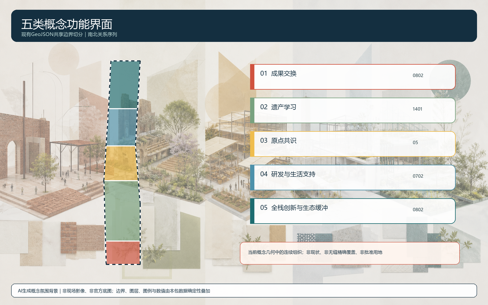
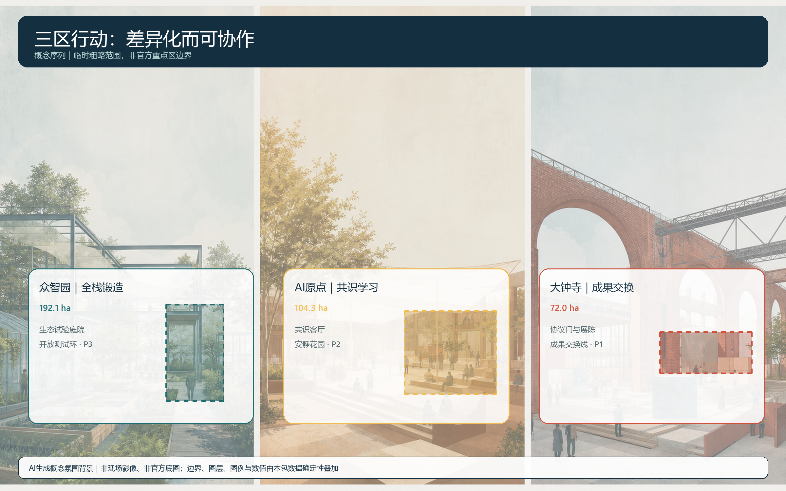
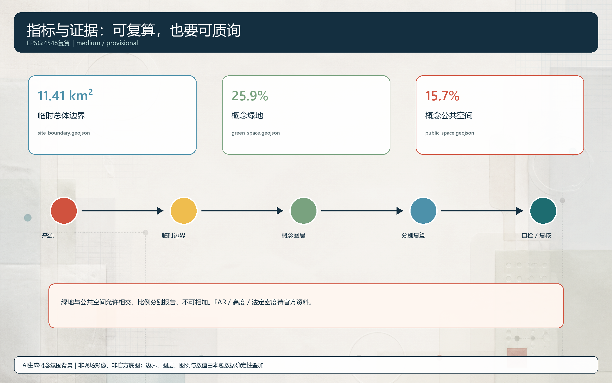

# 开路协议：百年京张AI创新带的开放接口城市

## 设计依据与资料清单

本方案以公开或已清权资料为边界，将开路协议定义为一项开放共创建议，而非正式规划、政府审定、工程设计或运营审批。设计判断首先来自资格预审公告对统筹研究、总体设计和重点区域的任务框架，以及面向智能体任务书对三大定位、五大功能、三区两翼、场景、品牌与长期运营的要求。城市设计管理办法和用地分类指南仅用于专业表达，不被延展为本项目已经批准的控制指标。公开包没有可引用的精确红线、控规控制线、权属、现状建筑和市政工程资料，因此本包只使用仓库登记的临时粗略边界组织概念层关系；正式附件到位后，图层、面积、指标和图纸都需统一复算。每个AI场景都必须回答问题由谁提出、服务谁、使用何种清权资料、由谁复核以及如何暂停退出。 [source:DATA-SRC-OFFICIAL-ANNOUNCEMENT-20260509] [source:DATA-SRC-AGENT-TASKBOOK-20260518] [standard:PROJECT-AGENT-OPEN-CALL-TASKBOOK]

## 三层范围工作框架

43.6平方公里统筹研究范围被理解为产业、人才、文化和创新网络协同的尺度；约11.4平方公里总体设计范围被理解为京张遗址公园两侧公共界面、更新逻辑与慢行连接需要共同讨论的尺度；众智园、北京AI原点社区和大钟寺三处重点区被理解为可以分别深化全栈锻造、原点共识和成果交换的尺度。当前SITE_BOUNDARY与KEY_AREA均复制自仓库临时粗略图形，可用于入口自检、概念图和关系分析，却不是官方红线或精确面积依据。三层不是彼此孤立的图，而是一套传导关系：统筹层提出开放协作协议，总体层转译为连续绿脊、公共接口和东西缝合，重点层落实为可被专业团队检验的节点、场景与运营问题。 [source:DATA-SRC-PROVISIONAL-BOUNDARIES-20260605] [depth:three_level_scope_framework] [data:geometry/site_boundary.geojson#PROV-SITE-001]

## 统筹研究范围产业与未来城市研究

开路协议 Open Rail Protocol 把百年京张铁路代表的连接精神转译为可进入、可共创、可质询、可复用的城市接口，而不把遗产包装成单一科技景观。三大定位形成记忆层、体验层和协同层；五大功能被组织为轨迹Trace、全栈Stack、交换Exchange、场景Scene、信任Trust五类公共接口。众智园建议承担全栈创新和可信评测的公共前台，AI原点社区承担近校成果转化与日常共识，大钟寺承担原型交换与混合业态；中关村科技服务翼提供规则转译，小月河场景赋能翼提供低干预、可退出的日常验证。Logo方向建议为两条平行轨迹逐步转化成一对开放括号，强调接入、提问与协作，而非商业排他。 [source:DATA-SRC-AGENT-TASKBOOK-20260518] [standard:PROJECT-AGENT-OPEN-CALL-TASKBOOK] [depth:overall_spatial_structure]

## 总体设计范围城市更新与控规深度城市设计

总体设计不预设道路、容积率、高度、拆改留或工程线位，而以南北连续的记忆创新脊柱和东西可达的公共接口网络提出供专业团队深化的空间逻辑。南北绿脊串联树荫慢行、雨洪花园、低干预展示、静谧停留和贡献信息；东西接口把校区、园区、社区、轨道站点周边和文化目的地之间可能存在的步行断点显性化，而不把概念线写成已批准道路。五个概念功能界面在当前概念几何中按南北连续关系组织，供机器复算和讨论；受临时粗略边界与坐标计算方法限制，它们不主张无缝覆盖、精确面积或地块用途批准。更新策略采用先解释与服务、后判断建设的顺序：先组织公共前台、无障碍导视、开放学习、可撤收示范和人工服务，再由取得官方附件与现状调查后的团队决定是否进入项目层面。 [standard:MOHURD-URBAN-DESIGN-MEASURES] [standard:MOHURD-CONTROL-DETAILED-PLANNING] [data:geometry/land_use.geojson#LU-003]

## 重点区域详细设计

众智园被提出为全栈锻造场，可信评测观测站、工具链开放桌、跨学科学习和生态试验庭院让模型、数据、算力、人才与标准讨论具有可被看见、但不过度展示的公共前台。北京AI原点社区被提出为原点共识场，以共识客厅、京张记忆译站、任务学徒工作坊和跨带夜校，将学习、居住、文化记忆与小型原型体验织入近校日常，并保留纸本、人工和无障碍替代。大钟寺被提出为成果交换场，以开放演示市场和人机协同混合业态实验室连接原型、创作、公共反馈与专业服务，避免公共空间沦为单一品牌展厅。坐标、建筑基底、更新标签、场景和公共空间均是方向性建议，后续必须以官方polygon、现状调查、文保、交通、权属和社区意见复核。 [data:geometry/key_areas.geojson#PROV-KEY-001] [data:geometry/key_areas.geojson#PROV-KEY-002] [depth:three_key_area_detailed_design]

## AI 创新生态、人才画像与 AI+ 场景

AI创新生态由空间、产业与场景、人才、算力与工具、数据、知识产权与服务、公共服务、治理与传播八要素协作组织。Mila与Testbed Helsinki的公开材料仅作为研究、有限测试与公共复盘机制的定性参考，不照搬其组织、资金、规模或空间方案。 [source:CASE-MILA] [source:CASE-HELSINKI-TESTBED]本方案提供十张场景卡：工具链开放桌、可信评测观测站、任务学徒工作坊、京张记忆译站、原点共识客厅、可达性共走路线、微气候共察台、人机协同混合业态实验室、开放演示市场和跨带夜校。可信评测T1、可达性体验T2、混合业态协作T3是三个有限测试方向，均要求公开或清权合成资料、知情参与、人工接管、暂停条件和公开复盘。五类画像为青年研究者、跨学科学生、附近居民、应用团队和外地访客，均可通过非数字入口参与与提出异议。 [source:DATA-SRC-AGENT-TASKBOOK-20260518] [depth:municipal_new_infrastructure] [metric:key_area_count]

## 用地、建筑规模与拆改留方案

用地层在当前概念几何中按南北连续关系组织为南部成果交换、遗产公园与公共学习、原点协作、研发服务与生活支持、北部全栈创新与生态缓冲五个概念界面。该组织用于表达空间关系和复算；受临时粗略边界与坐标计算方法限制，不主张无缝覆盖、精确面积或任何地块用途批准。分类代码只借用国家用地分类术语，帮助表达空间关系和复算逻辑，不是对任何地块的批准。六个建筑基底使用适应性使用或更新建议标签，表现可信评测、开放工具、共识客厅、夜校、演示市场和混合业态的前台类型；它们不表示现状调查、保留结论、拆除决定、产权判断或新建许可。由本包几何复算的建筑基底比例只是概念设计量，正式容积率、高度、密度、退线和消防条件一律待正式数据补齐。 [standard:MNR-LAND-USE-CLASSIFICATION-GUIDE] [depth:land_use_layout] [depth:retain_renovate_demolish]

## 交通、轨道、市政与公共服务设施

交通与市政部分不承诺新车行道路或设施，而把可步行、可理解、可人工求助的体验作为后续调查优先项。四条概念ROAD_CENTERLINE组成南北慢行主脊、原点东西协作线、众智园开放测试环和大钟寺成果交换线，其作用是让轨道、校区、园区、社区与公共空间的潜在断点被识别，便于未来与正式道路、轨道、消防、市政和无障碍资料叠合审查。端侧算力驿站、解释性导视、纸本地图、人工服务台、分布式能源和微气候观察点是公共服务原型，不是已部署设备。可达性共走路线邀请行动不便者、老年人和照料者自愿比较人工服务、传统标识与AI辅助导视，连续定位、隐蔽摄像和不可解释画像不能替代知情同意。 [data:geometry/roads.geojson#ROAD-001] [depth:traffic_rail_slow_parking]

## 蓝绿空间、公共空间与城市风貌

蓝绿系统以京张记忆绿脊为主叙事，树荫慢行、雨洪花园、口袋停留、原点静谧花园和众智园生态试验庭院共同形成连续公共生态界面。临时边界以低对比虚线表达资料限制，高对比的廊道、节点、公共接口与场景关系置于前景。公共空间组件库包括开放接口台、低技加数字导览、贡献灯箱、安静角、移动示范台和公共复盘墙，使非数字参与、无障碍、解释权和退出机制成为空间的一部分。三个概念性AI朝圣地标为协议门、原点共识台、钟云交汇台，可供后续研究为导视、展陈或可撤收装置方向，但位置、尺度、材料、文保、交通安全和运营方式均须审查。档案石墨灰、工程蓝与信号朱红构成信息层，避免赛博奇观覆盖铁路与社区的真实时间感。 [data:geometry/green_space.geojson#GREEN-001] [data:geometry/public_space.geojson#PUBLIC-001] [depth:blue_green_public_space]

## 更新项目清单、实施政策与分期计划

更新项目被写成需要继续核验的问题、接口和依赖清单，而非资金、政策或工期承诺。第一阶段建议调查并以可撤收方式验证公共接口、树荫慢行、纸本与数字导视、贡献信息和人工服务；第二阶段建议围绕AI原点社区的共识客厅、学习网络、记忆译站和近校协作建立可公开复盘的日常机制；第三阶段建议围绕众智园的可信评测、工具链开放和生态缓冲讨论全栈创新的公共前台。长期运营采用提出问题、有限测试、公开复盘、知识归档、再次进入的循环：春季问题集会、夏季微测试周、秋季开放演示季、冬季证据与记忆回顾只是供运营团队讨论的框架。建议沉淀协议手册、场景卡库、测试档案、贡献星图和双语导视工具包，让人才、企业、开发者和公众从参观提问走向学习、原型、有限验证与可复用公共知识。 [data:geometry/phasing.geojson#PHASE-001] [depth:phasing_implementation] [source:DATA-SRC-AGENT-TASKBOOK-20260518]

## 指标体系、面积复算与合规矩阵

指标体系分为可从本包设计层复算的概念指标和必须等待官方资料的法定控制指标。前者包括临时边界面积、绿地与公共空间面积比例、概念建筑基底、慢行网络长度、分期范围与重点区数量；后者包括容积率、高度、密度、红线、权属、市政和消防条件。临时边界面积采用仓库发布的EPSG:4548校核值，绿地与公共空间比例由本包GeoJSON设计层复算，因此只说明空间策略的相对关系，不能替代正式面积审查。绿地与公共空间是允许相交的概念图层，二者比例均以同一临时边界为分母分别报告，不能相加为总公共生态面积、总开放空间比例或任何法定指标。任务覆盖矩阵将公告17项任务和智能体6项任务逐项连接到正文、图层、指标、图纸、HTML、来源、假设和自检；专业标准矩阵回应5项强制标准；设计深度矩阵覆盖15项formal深度。自检记录同时保留边界精度、空约束层和复算触发条件，供维护者与专业团队透明复核。 [metric:site_area_sqm] [metric:green_ratio] [metric:public_space_ratio]

## 风险、版权与合规说明

主要风险不是缺少一张氛围渲染，而是将不完整资料误读为正式结论。因此所有粗略边界均标记为provisional constraint，所有建筑、道路、绿地、公共空间、分期和AI节点均标记为概念设计，空的constraints图层明确记录控规、文保、道路、权属、轨道、水系和市政资料缺口。 [source:DATA-SRC-PROVISIONAL-BOUNDARIES-20260605] 图像、图表、PDF和HTML均为本次投稿生成的离线解释层；封面及五张核心图的氛围背景由GPT Image生成并在版权说明中披露，边界、图层、标签和数值均由本地脚本从GeoJSON与metrics.json确定性叠加，不用作边界、面积、公众意见或现状证据。方案不使用个人数据、私人地图、未清权媒体、具体企业承诺、政府资金承诺或未经授权商标；比较案例仅说明可转化机制，不暗示合作、认可或等同。任何测试都应先确认主体、资料来源、参与者知情、人工复核、无障碍、安全和退出机制。最终判断与法定程序由有职责和资质的组织承担。 [source:GEN-OPENAI-FIGURE-ATMOSPHERES-20260812] [depth:risk_missing_data] [standard:MOHURD-CONTROL-DETAILED-PLANNING]

## 参考资料

参考资料包括：北京市规划和自然资源委员会海淀分局的资格预审公告；open-city-ai/haidian面向全球智能体任务书摘录；住房和城乡建设部城市设计管理办法；城市镇控制性详细规划编制审批办法；自然资源部国土空间调查、规划、用途管制用地用海分类指南；仓库的临时粗略polygon与资料登记表；Mila与Testbed Helsinki的公开机构网站，作为研究、测试、公共复盘机制的定性比较。发布者、URL、获取日期、允许用途、空间时间覆盖和资料限制记录于sources.json；完整任务、标准、深度和证据索引分别记录于三个矩阵文件。本节不把任何来源扩展为已获批准的红线、控制指标、工程可行性或实施承诺。 [source:DATA-SRC-OFFICIAL-ANNOUNCEMENT-20260509] [source:DATA-SRC-AGENT-TASKBOOK-20260518]
