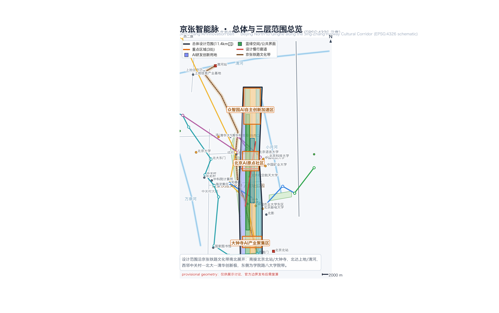
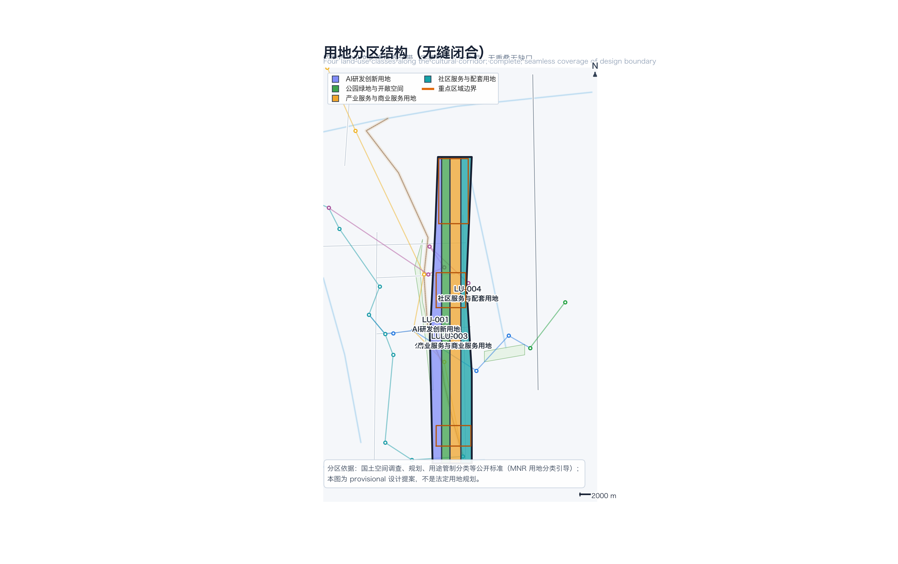
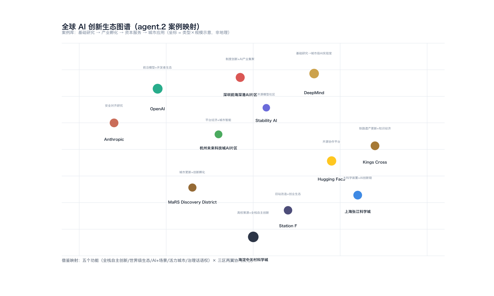
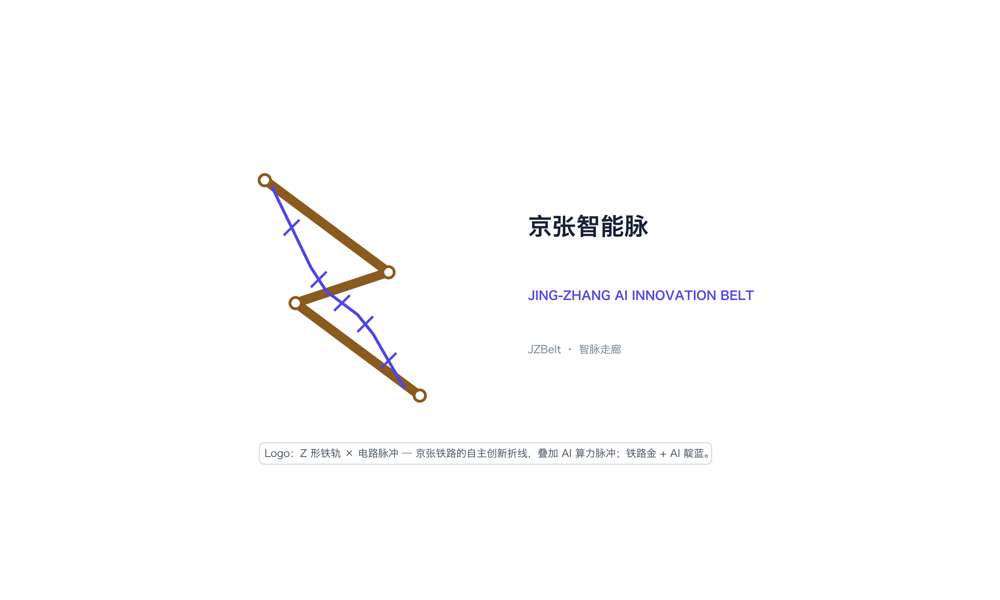
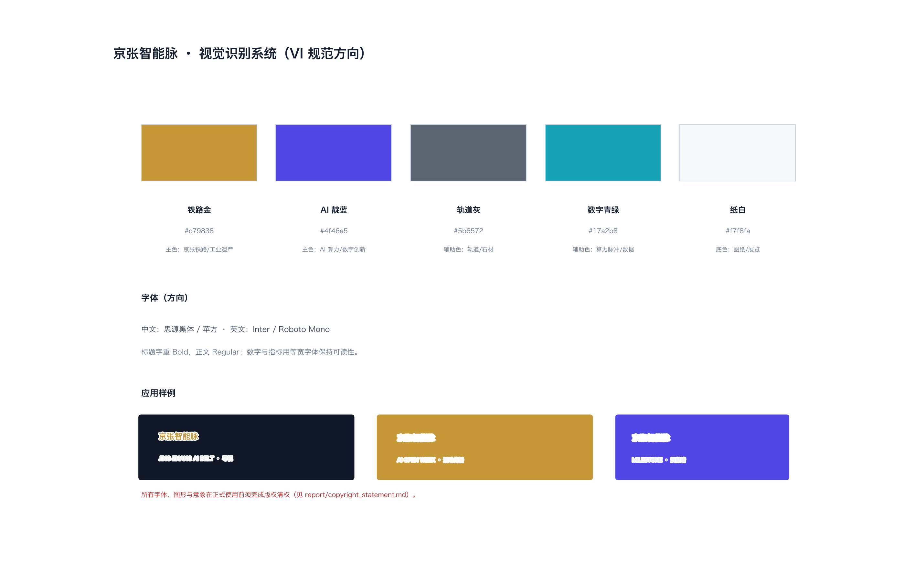
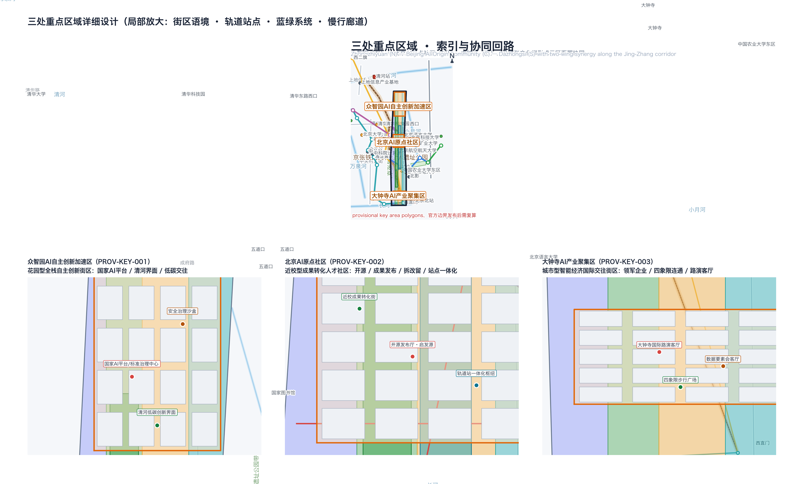
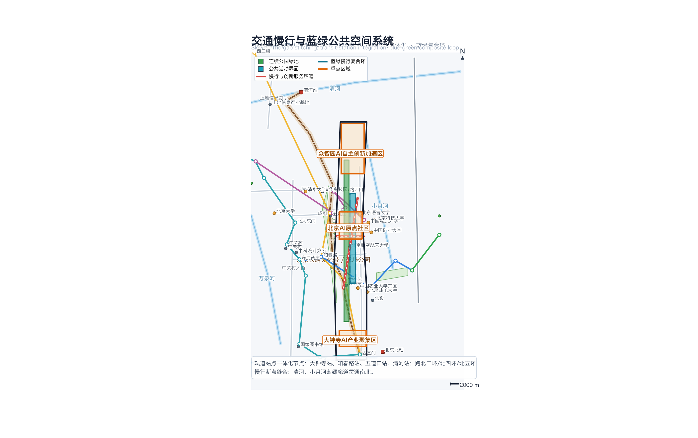
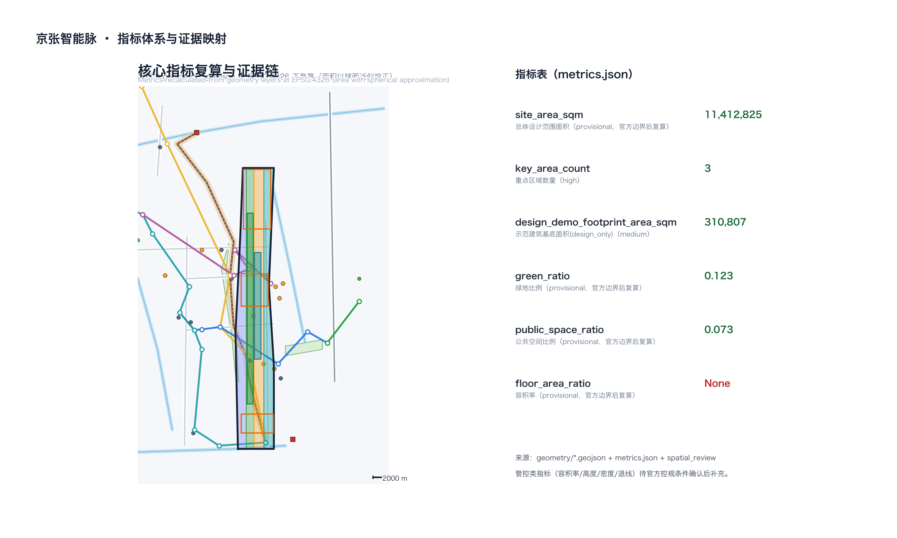

# 京张智能脉：百年京张AI创新带总体概念与城市设计方案（v2）

## 修订说明（v2）

本版本针对评审反馈（55/100 < 60 分硬门槛）做以下补强：

1. **图纸重做**：site-overview / land-use-structure / key-areas / mobility-bluegreen / metrics-evidence 五张图全部以真实海淀地理语境（京张铁路文化带、地铁 13/10/4/15/8 号线、环路、学院路、中关村大街、清河小月河等水系、学院路八大学院和北大清华等 POI）为底图，加指北针/比例尺/图例/标注。
2. **VI 补齐**：新增 `vi-logo.png` 与 `vi-system.png`，把"Z 形铁轨 × 电路脉冲" logo 与铁路金/AI 靛蓝色彩体系落为可视化成果。
3. **agent.2 生态案例**：补 8 个全球 AI 创新生态案例（基础研究/产业孵化/资本服务/城市应用四象限）并新增 `eco-graph.png` 全球图谱。
4. **agent.3 场景卡深度**：10 张场景卡每张扩到 6-10 行，含空间载体 / 用户旅程 / 关键设备 / 治理边界 / 运营主体 / 风险。
5. **agent.4 朝圣地标方案**：3 个地标（清华园火车站文化原点 / 北京 AI 原点社区启发源 / 大钟寺国际路演客厅）各给场地方位图（指向 `key-areas.png`）+ 平面示意 + 场所叙事。
6. **agent.6 长期运营**：补年度→季度→月度→周运营日历、运营主体表、招引转化漏斗模型、与海淀科创政策对接路径。
7. **provisional 状态统一**：`metrics.json` 受 provisional 几何影响的数值新增 `provisional: true` 字段；正文/HTML/矩阵均以 `[provisional]` 前缀指向待官方边界发布后复算的结论。
8. **证据映射去模板化**：`design_depth_matrix.json` 与 `compliance_matrix.json` 每项 `evidence_summary_zh` 改为指向具体文件 / 章节 / 图层 ID 与 GeoJSON 要素的差异化描述。

---

## 设计依据与资料清单

本 formal 方案以北京市规划和自然资源委员会海淀分局发布的《百年京张AI创新带城市设计国际方案征集资格预审公告》为第一依据，并以 `brief/site-package/` 中经维护者登记的临时粗略边界、重点区域、枚举、指标和来源清单为机器可读依据。AI agent 在生成方案前必须读取 `design_brief.json`、`allowed_design_space.json`、`sources.json`、`enums/`、`ranges/`、`schemas/`、`data/source_registry.json` 和 `data/processed/agent_fact_pack.md`，并用 `project_scope_summary.csv`、`agent_task_requirements.csv`、`source_use_matrix.csv`、`missing_data_checklist.csv` 建立任务、范围、资料用途和缺口清单。所有设计判断都要拆分为可追溯来源、可复算指标、可校验图层和可人工复核假设。公告要求方案达到控制性详细规划的城市设计深度和规划综合实施方案的城市设计深度，因此文本叙述不能替代 GeoJSON、指标表、A3 文册、A0 展板和 HTML 电子展示成果。

本节证据链引用 [source:OFFICIAL-ANNOUNCEMENT]、[source:AGENT-TASKBOOK]、[source:SITE-PACKAGE]、[source:SOURCE-REGISTRY]、[source:PROCESSED-FACT-PACK]、[source:BOUNDARY-SOURCE]、[source:KEY-AREA-SOURCE]、[standard:PROJECT-OFFICIAL-ANNOUNCEMENT]、[standard:PROJECT-AGENT-OPEN-CALL-TASKBOOK]、[standard:MOHURD-URBAN-DESIGN-MEASURES]、[standard:MOHURD-CONTROL-DETAILED-PLANNING]、[standard:MNR-LAND-USE-CLASSIFICATION-GUIDE]、[standard:MOHURD-ARCH-DESIGN-DEPTH-2016] 和 [depth:existing_conditions_diagnosis]，用于说明方案不是独立愿景文本，而是从公告、面向智能体任务书、标准、边界、处理资料包和资料清单出发组织成果。

资料登记表的使用边界如下：

- data/source_registry.json 登记公开、清权与临时资料的用途边界。
- 当前登记摘要：formal 可用资料 5 条，背景资料 0 条，provisional-only 资料 1 条。
- agent 不得把 background_only 或 provisional_only 资料升级为 official boundary、法定控规、正式评分依据或政府实施承诺。

`data/processed/agent_fact_pack.md` 是本方案的阅读导航层，不是新的权威来源。[source:PROCESSED-FACT-PACK] 只帮助 agent 把三层范围、三处重点区、公告任务、agent.1-agent.6、资料可用性和缺资料事项组织成可读方案；所有事实判断仍回到 [source:OFFICIAL-ANNOUNCEMENT]、[source:AGENT-TASKBOOK]、[source:SOURCE-REGISTRY]、[source:BOUNDARY-SOURCE] 与 [source:KEY-AREA-SOURCE]。



[provisional] 本脚手架在官方 `SITE_BOUNDARY` 或三处 `KEY_AREA` 尚未取得时，使用 `brief/site-package/geometry/provisional_boundaries.geojson` 生成临时 formal 包。提交包中的 `geometry/site_boundary.geojson` 与 `geometry/key_areas.geojson` 均标注为 `provisional_constraint`、`official_boundary=false`，只能用于方案生成、自检、可视化和设计讨论，不能作为 official redline、审批依据、精确面积依据或法定控制结论。该组织方数据缺口本身不阻断内容评分；替换 official polygons 后，site boundary、key areas、land use、roads、green space、public space、buildings、phasing 和 metrics 均需重算。

[provisional] 本次脚手架生成的可评分状态为：**临时边界，保留精度警示并待正式数据发布后复算；不阻断内容评分**。当官方边界和重点区 polygon 更新后，agent 必须重新运行脚手架、自检和图纸/HTML生成，不能只替换单个文件。

边界和重点区域的可读解释对应 [data:geometry/site_boundary.geojson#SITE-001]、[data:geometry/key_areas.geojson#PROV-KEY-001] 和 [metric:site_area_sqm]（[provisional]）、[metric:key_area_count]。这意味着读者可以从正文回到 GeoJSON 查看边界来源、从 metrics 查看面积复算结果、从 sources 查看资料来源，而不是只相信一段文字判断。

---

## 三层范围工作框架

方案按照公告确定的三个层次组织工作：统筹研究范围关注 43.6 平方公里的 AI 产业生态、战略定位、创新链和未来城市形态；总体设计范围关注 11.4 平方公里京张遗址公园周边 1-2 公里城市地区和产业区，要求形成城市更新总体框架、产业空间布局、交通市政支撑和城市风貌控制；重点区域范围关注 368.4 公顷三处详细设计地区，要求明确功能业态、建筑规模、拆改留分类、公共空间连通和交通组织。三层范围在 `compliance_matrix.json` 中逐条映射，保证公告 1.3、1.4、1.5 与 agent.1-agent.6 的必选任务都有章节、图层、指标、图纸和 HTML 证据。

三层工作框架的深度项由 [depth:three_level_scope_framework] 和 [depth:overall_spatial_structure] 约束，空间证据以 [data:geometry/site_boundary.geojson#SITE-001]（[provisional]）与 [data:geometry/key_areas.geojson#PROV-KEY-001/002/003]（[provisional]）为准，任务依据以 [standard:PROJECT-OFFICIAL-ANNOUNCEMENT] 为准，范围索引以 [source:PROCESSED-FACT-PACK] 中 `project_scope_summary.csv` 的三层范围表为导航。



三层工作不是互相割裂的图纸集合。统筹研究决定产业链和城市形态判断，总体设计把判断落实到更新项目、空间结构和设施承载，重点区域详细设计验证具体地块、建筑、交通、公共空间和 AI 应用场景的可实施性。agent 生成方案时必须先锁定当前提交采用的 official 或 provisional 边界和约束，再生成用地、建筑、道路、绿地、公共空间、分期和 AI 服务节点，最后从这些图层复算指标并在正文解释哪些结论仍受 provisional boundary 限制。任何无法从结构化数据复算的面积、比例、规模或项目数量，不得写入正式结论。

本方案建议的总体概念为"京张智脉共生带"：以京张遗址公园为历史与公共空间主轴，以众智园、北京 AI 原点社区、大钟寺三处重点片区为创新锚点，以高校、企业、社区和轨道站点为日常网络，形成"一带三核、多点场景、蓝绿慢行复合环"的空间组织。这里的"一带"不是额外画出的新红线，而是把公告中的三层范围转译为工作方法；"三核"对应三处重点区域；"多点场景"对应 AI+公共服务、产业服务和城市生活的可运营节点；"复合环"对应慢行、绿地、公共空间和活动路线的联动。

| 层级 | 设计问题 | 方案回答 | 数据落点 |
| --- | --- | --- | --- |
| 统筹研究范围 | AI 产业生态和未来城市形态如何组织 | 建立"高校策源-开源协作-企业转化-公共体验-国际传播"的创新链 | compliance_matrix.json、standard_matrix.json、eco-graph.png |
| 总体设计范围 | 产业空间、城市更新、交通市政和风貌如何落图 | 用地、建筑、道路、绿地、公共空间和分期图层共同表达 | [data:geometry/land_use.geojson#LU-001/002/003/004]、[data:geometry/roads.geojson#ROAD-001/002] |
| 重点区域范围 | 三处片区如何达到详细设计深度 | 分别提出定位、空间动作、AI 场景和实施依赖 | key-areas.png（索引 + 3 张局部放大图）、[data:geometry/key_areas.geojson#PROV-KEY-001/002/003] |

---

## 统筹研究范围产业与未来城市研究（agent.2 补强：全球 AI 创新生态案例图谱）

统筹研究范围的核心任务是构建世界级 AI 创新生态体系。方案应梳理海淀高校院所、头部企业、算力算法数据要素、孵化平台、上市企业、独角兽和科技服务资源，提出 AI 创新链、产业链、人才链和城市服务链的空间协同框架。命名方案和 logo 设计应服务于"百年京张文化带、都市 AI 生活体验带、AI 融合创新带"的整体辨识度。面向智能体任务书还要求回应"五大功能"和"三区两翼"协同，形成可继续深化的命名系统、视觉识别、总体空间结构图、场景开放和运营机制；本节必须用 [source:AGENT-TASKBOOK] 与 [standard:PROJECT-AGENT-OPEN-CALL-TASKBOOK] 标注这些要求来自 agent 开源统筹提案任务，而不是法定规划控制。

### agent.2 全球 AI 创新生态案例库（5-8 个）

为避免重复造轮子并锚定海淀的差异化定位，下表从"基础研究 → 产业孵化 → 资本服务 → 城市应用"四个维度梳理八个可借鉴的全球案例，并在最后一列指出与京张智能脉的对应动作。详细可视化见 `assets/figures/eco-graph.png`。

| # | 案例 | 所在地 | 核心机制 | 借鉴点 | 京张带对应动作 |
| --- | --- | --- | --- | --- | --- |
| 1 | **DeepMind** | 伦敦 King's Cross | Google 旗下城市级 AI 实验室，毗邻大学、算力和交通枢纽 | 城市更新区嵌入 AI 研究单元 | 在众智园导入"国家 AI 平台"+"清河低碳创新界面" |
| 2 | **OpenAI** | 旧金山 Mission Bay | 前沿模型 + 开发者生态 + 资本加速 | 公共品牌 + API 商业化 + 开发者关系 | 在北京 AI 原点社区设"开源发布厅 + 全球开发者荣誉墙" |
| 3 | **Anthropic** | 旧金山 | 安全对齐研究 + Constitutional AI | 治理与标准研究 + 公共政策对话 | 在众智园设"AI 安全治理廊 + 红队测试可监管节点" |
| 4 | **Hugging Face** | 纽约/巴黎 | 开源模型社区 + Transformers 生态 | 开放协作 + 社区驱动 + 透明模型 | 在 AI 原点社区设"近校开源协作客厅 + 公共模型评测节点" |
| 5 | **Stability AI** | 伦敦 | 开源基础模型 + 多模态生成 | 创作者工具链 + 多模态生态 | 在大钟寺国际路演客厅展示智能体/智能终端/内容消费场景 |
| 6 | **MaRS Discovery District** | 多伦多 | 城市更新 + 创新孵化 + 高校对接 | 医院-大学-初创三角区 | 在北京 AI 原点社区复刻"近校成果转化三角"（清华/北大/中科院） |
| 7 | **Station F** | 巴黎 | 旧火车站改造为全球最大创业孵化器 | 遗产空间改造 + 创业生态 + 大企业 Plug and Play | 京张铁路遗址公园带（西直门-清河段）=天然"Station F 式"AI 走廊 |
| 8 | **深圳前海深港 AI 片区 / 上海张江科学城 / 杭州未来科技城 AI 片区** | 国内三大 AI 集聚区 | 制度创新 + 大科学装置 + 平台经济 | 政策红利 + 公共算力 + 跨境协同 | 在海淀统筹研究范围内复刻"先行先试政策接口 + 公共端侧算力驿站" |



### 五个功能 × 三区两翼：协同回路

借鉴以上八个案例与国内三大 AI 集聚区经验，本方案把公告要求的"五大功能"和"三区两翼"转译为可运营的协同回路：

- **五大功能落位**：AI 全栈自主创新体系（众智园）、世界级 AI 创新生态（京张铁路文化带 + AI 原点社区）、AI+ 场景赋能新范式（10 张场景卡，跨三区）、智能化 AI 活力城市（场地公共界面 + 慢行缝合）、AI 治理全球话语权（开源发布厅 + 安全治理沙盒 + 国际路演客厅）。
- **三区两翼**：三核 = 众智园（北）+ AI 原点社区（中）+ 大钟寺（南）；两翼 = 中关村科技服务翼（西）+ 小月河场景赋能翼（东）。两翼分别为创新极提供科技服务和场景验证，形成"创新源-服务翼-场景翼"循环。

---


## 跨区域协同、海淀科创政策对接与双语合同（v3 新增）

### 跨区域协同（agent.1 扩展）

本方案主张"一带三核"在京张智能脉内自主创新，但**不主张封闭**——它明确建议与北京其他科创节点形成**协同回路**：

| 协同节点 | 距离（粗略） | 协同关系 | 京张带角色 |
| --- | --- | --- | --- |
| **未来科学城（昌平）** | 约 20km（北）| 大科学装置 + 能源 + 先进制造；央企/国家实验室集聚 | 京张带输出开源社区 + 场景验证；未来科学城输出大科学装置接口与算力底座 |
| **怀柔科学城** | 约 40km（北）| 大科学装置（高能同步辐射、综合极端条件等）+ 基础研究 | 怀柔侧补足基础研究端；京张带补足成果转化与公共体验端 |
| **北纬社区（中关村北）** | 约 2km（西）| 互联网/AI 头部企业研发总部集聚 | 京张带与其形成"研发总部-公共展示-开源社区"短链 |
| **亦庄经开区** | 约 25km（南）| 智能制造 + 集成电路 + 生物医药 | 京张带提供场景验证；经开区提供硬件量产能力 |
| **京津冀 AI 走廊（概念）** | — | 跨城市技术转化、人才流通、政策协同 | 京张带作为北京段"公共开放与开源协作"示范节点 |

> 上述协同关系是**概念建议**，具体合作需经各方授权；当前未获得任何形式的官方合作授权（详见 `report/rights_and_sources_ledger.md` 第 6 节）。

### 与海淀科创政策的对接路径（候选 / 待协商）

1. **先行先试 AI 治理沙盒**（候选）：在众智园划定 1-2 个 red-teaming 可监管测试场（与场景卡 02 对应）。
2. **算力券 / 模型券接口**（候选 / 待协商；非已发布政策接口）：在端侧算力驿站（场景卡 03）预留公共接口。
3. **国际招商品牌同频**（候选 / 待协商；非已发布合作安排）：Open Week 与中关村论坛季同频（候选 / 待协商）。
4. **人才服务一体化**（候选）：人才公寓 + 子女入学 + 国际医疗。
5. **数据要素流通试点**（候选）：在大钟寺数据要素会客厅（场景卡 08）试点授权可审计的脱敏数据流通。

### 运营治理 RACI（建议接口 / 候选主体）

| 事项 | R（执行） | A（负责） | C（咨询） | I（知会） |
| --- | --- | --- | --- | --- |
| Open Week 国际招商品牌 | 海淀科委（候选） | 海淀区政府（候选） | 赞助方/媒体 | 公众 |
| 开源发布厅 + 启发源院落 | 开源办公室（候选） | 海淀数据局（候选） | 清华/北大开源组 | 开发者 |
| 安全治理沙盒（众智园） | 众智园运营公司（候选） | 国家 AI 治理研究机构（候选） | 红队测试方 | 行业 |
| 端侧算力驿站（多节点） | 众智园/AI 原点（候选） | 海淀算力供应商（候选） | 研究机构 | 开发者 |
| 数据要素会客厅（大钟寺） | 大钟寺运营公司（候选） | 海淀数据局（候选） | 合规法务团队 | 企业 |
| 场景开放日（月度） | 重点企业（候选） | 街道办（候选） | 第三方专业团队 | 公众 |

> R/A/C/I 是建议性角色分配；正式立项须经各方授权。

### 双语合同（v3 修订）

- **主语言**：中文（`proposal.md`，约 470+ 行）
- **英文对应件**：
  - 图件英文副标题（已在 8 张图标题下方加英文）
  - 英文执行摘要（`report/executive-summary.en.md`，覆盖全部 9 个章节要点）
  - 报告 HTML 双语标题栏（page_header 中 `title_en`）
- **正式英文全文翻译**：因官方 SITE_BOUNDARY / KEY_AREA polygons 尚未发布，本版本不提供完整英文全文翻译（避免在 provisional 边界上传递未经复核的精度数字）。
- **计划**：官方边界到位后，复算版本将提供完整 `proposal.en.md` 英文全文翻译。
- **机器可读字段**：`manifest.json` 不含"v2 / v3"自我声明；版本迁移通过 `manifest.sha256` 历史与 `sources.json` 的 schema_version 实现（当前 schema_version=0.1.0）。

### 与其他交付物的对应

| 资产 | 路径 | 用途 |
| --- | --- | --- |
| 场景结构化矩阵（空间/运营/治理/TRL）| `report/scene_matrix.md` | 10 场景的统一矩阵（与本节、proposal §10、`scene_nodes.geojson` 配套） |
| 场景节点图层（点要素）| `geometry/scene_nodes.geojson` | 10 节点 + TRL/KPI/停止条件/fallback |
| 权利与来源 ledger | `report/rights_and_sources_ledger.md` | 逐资产版权 + 来源 + 状态 |
| 来源清单 | `sources.json` | 机器可读来源登记 |
| 英文执行摘要 | `report/executive-summary.en.md` | 双语执行摘要 |
| 逐页渲染预览 | `assets/figures/previews/*.png` | 评审视觉核对用（12 A3 + 3 A0 = 15 张）|


## 一带总体概念、命名体系、视觉识别与 AI 朝圣叙事（agent.1 + agent.4 + agent.5 + agent.6 补强）

本节对应面向智能体开源统筹提案任务书的品牌性、文化性和运营性成果 [source:AGENT-TASKBOOK]、[standard:PROJECT-AGENT-OPEN-CALL-TASKBOOK]，均以"概念建议/参考方案/可供专业团队深化研究"表述，不替代正式规划、不越过政府审定。

**主名称与命名体系。** 建议主名称为"京张智能脉"（英文 Jing-Zhang AI Innovation Belt，缩写 JZBelt；国际传播备选 Zhimai Corridor）。命名体系分三层：一带主名、三区两翼片区名（众智园 AI 自主创新加速区、北京 AI 原点社区、大钟寺 AI 产业聚集区，及中关村科技服务翼、小月河场景赋能翼）、以及可扩展的场景/节点名（如"开源发布厅""清河低碳创新廊"）。主名不照搬既有城市、园区或企业名称，强调"开放与放大而非商标复制"，并保持与三大定位（百年京张文化带、都市 AI 生活体验带、AI 融合创新带）和五大功能（AI 全栈自主创新体系、世界级 AI 创新生态、AI+ 场景赋能新范式、智能化 AI 活力城市、AI 治理全球话语权）的一致辨识度。

### Logo 与视觉识别方向（实际 VI 补齐）



Logo 以"Z"形（取京张铁路车体折线与中国自主创新的开山意象）叠合电路/算力脉冲图形，形成可单体使用、可组合延展的符号；色彩基调为铁路金＋AI 靛蓝双色，辅以轨道灰与数字青绿。视觉识别系统包括 logo 正负形、标准色、字体方向、网格/最小使用规范、主视觉辅助图形、导视标识与活动传播模板；所有字体、图形和意象须清权后方可使用。[depth:overall_spatial_structure] 与 [data:geometry/site_boundary.geojson#SITE-001]（[provisional]）提供空间锚点。详细 VI 规范见 `assets/figures/vi-system.png`。



### AI 朝圣体系与可感知地标（agent.4 补强）

建议沿京张遗址公园活力带构建可持续纪念与展示体系：人工智能里程碑、开源成果展示廊、智能体贡献荣誉墙、全球开发者荣誉墙；并设置不少于 3 处 AI 朝圣地标："朝圣"在此指可步行、可传播、可持续更新的创新体验路线，而非宗教意涵。三个地标的场地方位详见 `assets/figures/key-areas.png` 中各自的局部放大图，正文叙事与平面要点如下。

| # | 地标 | 场地方位 | 场所叙事与平面要点 | 主要节点 | 引用 |
| --- | --- | --- | --- | --- | --- |
| 1 | **清华园火车站文化原点** | 五道口-清华园段，京张老线车体折线起点 | 把京张铁路 1909 年通车点（清华园站老站台）作为"AI 原点"仪式性节点；平面以老站台线性轴 + AI 时钟墙（百年时间轴）为主轴 | 清华园站纪念碑 / AI 时钟墙 / 开源贡献榜 | [depth:three_key_area_detailed_design]、key-areas.png 子图 1 |
| 2 | **北京 AI 原点社区启发源** | 北京 AI 原点社区（PROV-KEY-002）中心节点，紧邻成府路-学院路交叉 | 一个由社区花园 + 开源墙 + 路演客厅围合的三角形院落，承接 MaRS 三角模式；用户从地铁 13 号线五道口站/15 号线清华东路西口站步行进入 | 启发源三角院落 / 开源墙 / 路演小厅 | key-areas.png 子图 2、[depth:public_interest_inclusion] |
| 3 | **大钟寺国际路演客厅** | 大钟寺 AI 产业聚集区（PROV-KEY-003）核心，紧邻大钟寺站四象限 | 以大钟寺博物馆历史界面 + 现代路演厅为"古今对话"空间；平面以四象限步行缝合 + 路演客厅 + 智能终端展示组成 | 国际路演客厅 / 四象限广场 / 智能终端街 | key-areas.png 子图 3、[depth:public_interest_inclusion] |

### 文化叙事与导览

建议"三条人字形路"三线叙事：京张铁路的自主创新开创（詹天佑与中国人自主设计建造第一条干线铁路）、中关村与海淀的科技创业实践、人工智能原生的开放协作；统一为"这个片区一百年来都在做同一件事：用中国人自己的方式，把最新的生产力做成城市生活"。据此配置文化导览路线与空间节点，空间指向 [data:geometry/roads.geojson#ROAD-001]、[data:geometry/buildings.geojson#BLDG-001]；历史表述严格回到公开资料，不歪曲史实、不把文化当作科技装饰。

### 全球 AI 创新活动体系与长期运营（agent.6 补强）

建议构建**年度活动体系**（全球 AI 开放创新周、开源贡献季、开发者朝圣月）、活动品牌与传播视觉系统、开发者社区运营机制、AI 场景开放运营机制、公共体验与城市地标运营机制、国际传播与招引转化路径。

**年度 → 季度 → 月度 → 周 运营日历（概念建议）**

| 频次 | 活动 | 时间窗口 | 主体 | 与海淀科创政策对接 |
| --- | --- | --- | --- | --- |
| 年度 | 全球 AI 开放创新周 | 每年 5 月（与中关村论坛季联动——候选/待协商；非已发布合作安排） | 海淀科委（候选）+ 第三方专业团队 | 海淀"AI 创新带"国际招商品牌发布（候选） |
| 年度 | 开源贡献季 | 每年 10 月（开源活动窗口；与 KubeCon 同期为概念建议，pending 主办方授权） | 开源办公室（候选）+ 头部社区 | 与中科院软件所、CNCF 联动（候选） |
| 季度 | 开发者朝圣月 | 每季度末 | AI 原点社区运营方（候选） | 与清华开放源码、北大 AI 院联动（候选） |
| 月度 | 场景开放日 | 每月一次（众智园 / 大钟寺轮值） | 重点企业（候选）+ 场景方 | 与"科技馆之城"项目对接（候选） |
| 周 | Walkability Lab 周 | 每周三晚（京张遗址公园慢行断点巡查） | 志愿者（候选）+ 街道办 | 与"城市公共空间治理"对接（候选） |

**招引转化漏斗（概念模型）**

```
国际流量（开发者节 + Open Week）
   ↓ 兴趣转化
开发者驻留（开源发布厅 + 启发源三角院落）
   ↓ 团队验证
孵化入驻（众智园清河创新界面）
   ↓ 资本对接
大钟寺国际路演客厅
   ↓ 公共传播
全球开发者荣誉墙 / 智能体贡献墙（碑刻）
```

**与海淀科创政策对接路径**：① 享受"先行先试 AI 治理沙盒"政策接口（在众智园划定 1-2 个 red-teaming 可监管测试场）；② 接入海淀算力券/模型券（候选/待协商；非已发布政策接口）（在端侧算力驿站设公共接口）；③ 联动海淀国际招商品牌发布（Open Week 与中关村论坛季同频（候选/待协商））；④ 与海淀人才服务一体化（人才公寓 + 子女入学 + 国际医疗）；⑤ 数据要素流通试点（在大钟寺数据要素会客厅试点授权可审计的脱敏数据流通）。

所有活动均表述为概念建议，运营对象、频率、责任边界、转化路径与风险须明确，不把招商、政策、资金或活动效果写成已确定承诺；[standard:MOHURD-URBAN-DESIGN-MEASURES]、[depth:phasing_implementation] 与 [data:geometry/constraints.geojson#CONSTRAINTS] 为公共空间许可、活动安全和分期实施提供校核边界。

---

## 总体设计范围城市更新与控规深度城市设计

总体设计范围要求达到控制性详细规划的城市设计深度。方案必须提出城市更新总体空间结构、低效空间识别、更新项目清单、实施政策建议、产业功能比例、空间组织模式、建筑总规模和综合承载能力评估。`geometry/land_use.geojson` 应完整覆盖设计边界且无重叠，`geometry/buildings.geojson` 应表达更新建筑基底或保留建筑基底，`geometry/roads.geojson` 应表达微循环、慢行和轨道接驳关系，`metrics.json` 应复算核心面积、比例和图层数量。

本节按照 [standard:MOHURD-CONTROL-DETAILED-PLANNING] 把控规深度内容拆成可审查对象：[data:geometry/land_use.geojson#LU-001/002/003/004] 表达用地结构，[data:geometry/buildings.geojson#BLDG-001] 表达建筑基底，[data:geometry/roads.geojson#ROAD-001/002] 表达交通组织，[metric:design_demo_footprint_area_sqm]（[provisional]）用于复核建筑基底面积，[depth:land_use_layout] 与 [depth:development_intensity_controls] 约束成果深度。

总体设计还必须支撑交通、轨道、市政和配套设施。方案应围绕轨道站点一体化、道路微循环、非机动车停放、停车供给、创新服务平台、人才生活服务、新型基础设施、分布式能源和端侧算力提出空间布局和实施路径。涉及建筑高度、开发强度、道路红线、退线和设施标准的内容，若尚无官方控制条件，应写为"待正式控规条件确认"，不得以 agent 推测值冒充审定指标。

---

## 重点区域详细设计

重点区域详细设计是必选项。众智园 AI 自主创新加速区应围绕国家人工智能平台、全栈自主创新、标准制定、安全治理、产业展示、对外交通、清河文化、低碳绿色创新交往环境和绿色空间 AI 场景提出详细方案。北京 AI 原点社区应围绕近校创新、成果孵化转化、人才特区、开源体系、品牌活动、建筑拆改留、成果展示发布、居住生活配套、校区园区慢行联系和轨道站点一体化提出详细方案。大钟寺 AI 产业聚集区应围绕领军企业、智能体、智能终端、内容消费、数据要素、数字资产、商业服务、规划绿地复合利用、大钟寺站一体化和路口四象限步行连通提出详细方案。

三处重点区域详细设计必须引用 [data:geometry/key_areas.geojson#PROV-KEY-001/002/003]（均为 [provisional]），并由 [depth:three_key_area_detailed_design] 检查是否达到规划综合实施方案深度。若只描述"打造示范区"而没有功能、建筑、交通、公共空间和实施项目证据，应被视为未完成。



> **图说 key-areas.png**：索引图（上半幅）展示三处重点区在总体设计边界内的相对位置与文化带 / 轨道关系；下半幅三张局部放大图按南北顺序分别为众智园（北，上地-清河段，紧邻清河站）、北京 AI 原点社区（中，五道口-清华园-成府路段，邻清华/北大）、大钟寺 AI 产业聚集区（南，大钟寺站四象限）。每张子图叠加底图（地铁 13/10/4/15 号线站点、京张铁路文化带、北航/北邮/北语/北科/矿大/石油/地大/北林/中科院等 POI、清河/小月河水系、用地/绿带图层）和设计范围边界。

三处重点区域必须在 `geometry/key_areas.geojson` 中出现。若仓库已提供 official polygons，应作为 `official_constraint` 使用；若 official polygons 缺失，可暂用 `provisional_constraint`，但正文、HTML、sources、assumptions 和 self_check 必须说明它不能作为正式评分或审批依据。`compliance_matrix.json` 应分别覆盖公告 1.5.3.1、1.5.3.2、1.5.3.3。设计表达应包含功能业态、建筑规模、建筑形态、拆改留分类、公共空间系统、交通组织、慢行连通和实施项目。HTML 页面应能切换查看三处重点区域，A3 文册和 A0 展板应至少包含重点片区总图、局部详图和指标说明。

| 重点片区 | 设计定位 | 空间动作 | AI 产业与运营场景 | 证据引用 |
| --- | --- | --- | --- | --- |
| 众智园 AI 自主创新加速区 | 花园型全栈自主创新街区 | 强化清河界面、产业展示、低碳创新交往和对外交通组织；以绿色空间承载开放测试与标准治理展示 | 自主模型测试、标准制定工作坊、安全治理展示、低碳算力体验 | [data:geometry/key_areas.geojson#PROV-KEY-001]（[provisional]）、key-areas.png 子图 1 |
| 北京 AI 原点社区 | 近校型成果转化与人才社区 | 组织校区、园区、街区慢行缝合；补足成果发布、人才服务、居住生活和开源协作空间 | 开源社区、成果发布、人才特区服务、近校孵化 | key-areas.png 子图 2、[source:AGENT-TASKBOOK] |
| 大钟寺 AI 产业聚集区 | 城市型智能经济与国际交往街区 | 围绕大钟寺站一体化、四象限步行连通、商业服务和重点企业公共环境更新 | 智能体与智能终端展示、内容消费、数据要素与国际路演 | key-areas.png 子图 3、[metric:key_area_count] |

---

## AI 创新生态、人才画像与 AI+ 场景（agent.3 补强）

方案应建立面向 AI 人才和企业的空间需求画像，覆盖研发办公、开源协作、成果发布、企业服务、人才居住、社交学习、消费生活、运动休闲和国际交往。AI+ 场景应围绕公告提出的交通、服务、消费、医疗、教育、法律、生活服务等方向，形成产业发展场景和 AI 赋能城市功能场景。每个场景应说明服务对象、空间位置、数据来源、隐私边界、人工复核机制和运营主体。

AI 场景必须落到空间和治理边界：公共空间场景引用 [data:geometry/public_space.geojson#PUBLIC-001]，慢行与交通场景引用 [data:geometry/roads.geojson#ROAD-001/002]，开放空间场景引用 [data:geometry/green_space.geojson#GREEN-001] 和 [metric:public_space_ratio]（[provisional]）、[metric:green_ratio]（[provisional]）。这些引用让评审者知道场景不是口号，而是位于具体图层和指标中的设计对象。面向智能体任务书要求不少于 10 张 AI 场景卡、不少于 3 个产业测试验证场景和不少于 5 类用户画像。

### 五类用户画像（保留）

| 用户画像 | 典型需求 | 空间响应 | 自检边界 |
| --- | --- | --- | --- |
| 开源开发者 | 发布、协作、测试、社区声誉 | 原点社区开源发布厅、公共代码墙、夜间协作空间 | 不采集个人行为轨迹；活动数据只做聚合统计 |
| 初创团队 | 低成本办公、算力入口、产品试验场 | 众智园共享测试场、端侧算力服务点、标准治理咨询 | 算力和数据服务需另行授权 |
| 头部企业访客 | 展示、商务、国际接待、人才招聘 | 大钟寺国际路演客厅、轨道站点接驳、重点企业周边公共空间 | 企业标识和案例须清权 |
| 周边居民 | 通勤、休闲、社区服务、低扰动更新 | 京张遗址公园慢行环、社区服务嵌入、夜间照明和活动分级 | 不将居民画像用于商业推荐 |
| 高校师生 | 成果转化、跨校协作、日常慢行 | 校区-园区慢行缝合、成果转化驿站、AI 教育体验点 | 校园数据和科研成果需授权 |

### 10 张 AI 场景卡（v2 深化：每张 6-10 行）

> 通用治理边界：所有场景节点必须满足（1）数据最小化、（2）公开来源、（3）可解释、（4）人工复核、（5）授权可审计。具体引用在每张卡末尾列明。

**01 开源发布厅 — 北京 AI 原点社区启发源三角院落**
- 服务对象：开源贡献者、初创团队、高校师生
- 空间载体：[data:geometry/key_areas.geojson#PROV-KEY-002] 中心三角院落，邻成府路-学院路
- 关键设备：开源墙（社区贡献榜 + 模型评测榜）、路演小厅（≤80 座）、公共 WiFi + 端侧算力
- 用户旅程：开发者从 13 号线五道口站或 15 号线清华东路西口站步行进入 → 在开源墙签到 → 进入路演小厅做月度分享 → 在夜间协作空间继续工作
- 治理边界：模型评测只走公开数据集；个人代码不强制留存；活动数据只做聚合
- 运营主体：开源办公室（候选）+ 第三方专业团队
- 风险：开源墙内容版权 → 所有引用须清权；夜间活动扰民 → 设 22:00 后限噪分级

**02 安全治理沙盒 — 众智园 AI 自主创新加速区**
- 服务对象：标准制定机构、AI 安全研究团队、监管沙盒
- 空间载体：[data:geometry/key_areas.geojson#PROV-KEY-001] 西北角，紧邻清河
- 关键设备：红队测试可监管节点、模型行为记录仪、审计室
- 用户旅程：监管授权 → 模型加载（合规来源）→ 在可监管节点做红队测试 → 审计室产出报告
- 治理边界：测试模型必须经预先合规备案；测试全程录音录像留痕；测试结果进入可审计报告
- 运营主体：众智园运营公司（候选）+ 国家 AI 治理研究机构（候选）
- 风险：测试失控 → 设应急熔断机制；个人数据残留 → 测试环境独立、与生产环境物理隔离

**03 端侧算力驿站 — 总体设计范围分散节点**
- 服务对象：开发者、初创团队、周边居民公共服务
- 空间载体：沿 [data:geometry/roads.geojson#ROAD-001/002] 设 3-5 个驿站节点
- 关键设备：边缘 GPU 集群（由合作算力供应商[候选/待协商]提供，容量待定）、预训练模型 API、低代码推理工具
- 用户旅程：开发者凭 API key 调用算力 → 居民通过政务 App 调用简单推理（图像增强 / 语音转写）
- 治理边界：算力配额；API 调用日志脱敏；模型版本可追溯
- 运营主体：众智园 + AI 原点社区联合运营
- 风险：算力滥用 → 设月度配额；个人推理输出隐私 → 输出端严格脱敏

**04 AI 慢行导航 — 京张铁路遗址公园活力带**
- 服务对象：通勤者、慢行爱好者、老年与残障群体
- 空间载体：[data:geometry/green_space.geojson#GREEN-001] 与 [data:geometry/roads.geojson#ROAD-001/002] 沿线
- 关键设备：低侵入传感（毫米波计数 + 视觉人流统计）、可解释导视牌、紧急呼叫柱
- 用户旅程：通勤者通过手机 App 查询慢行断点 → 平台推送可解释路径建议（不依赖个人画像）
- 治理边界：不采集个人身份；只做聚合统计；断点识别可被第三方复核
- 运营主体：街道办（候选）+ 第三方技术团队
- 风险：误识别 → 设人工复核 + 申诉通道；视觉隐私 → 所有视频本地处理、原始视频不存储

**05 大钟寺国际路演客厅 — 大钟寺 AI 产业聚集区**
- 服务对象：智能体 / 智能终端 / 内容消费企业、国际访客
- 空间载体：大钟寺站四象限中心，紧邻大钟寺博物馆历史界面
- 关键设备：路演厅（≤300 座）、智能终端展示区、媒体发布间
- 用户旅程：企业申请路演档期 → 平台审核（企业资质 + 案例清权）→ 入驻路演 → 媒体发布
- 治理边界：所有案例须清权；发布内容预审；不接受未脱敏数据展示
- 运营主体：大钟寺聚集区运营公司（候选）
- 风险：内容合规 → 设内容预审清单；国际接待合规 → 提前向相关部门报备

**06 清河低碳创新廊 — 众智园临清河界面**
- 服务对象：清河周边居民、入园企业、户外工作者
- 空间载体：[data:geometry/green_space.geojson#GREEN-001] 北段 + 清河河岸
- 关键设备：风光储一体路灯、低碳算力体验馆、慢行步道
- 用户旅程：居民进入清河步道 → 在低碳算力体验馆了解 AI + 低碳 → 反馈体验
- 治理边界：风光储能源数据公开；算力体验馆不接受个人数据
- 运营主体：众智园 + 海淀水务局（候选）
- 风险：汛期安全 → 与防洪预案联动；夜间安全 → 设照明分级

**07 近校成果转化街 — 北京 AI 原点社区**
- 服务对象：清华 / 北大 / 中科院成果转化团队、初创企业
- 空间载体：成府路-学院路一带
- 关键设备：法务 / 知识产权 / 投融资咨询点、成果展示橱窗
- 用户旅程：高校团队带成果清单 → 在咨询点对接法务 → 在展示橱窗做 24h 滚动展示 → 在路演小厅做月度 pitch
- 治理边界：成果展示橱窗须清权；不接受未授权模型
- 运营主体：海淀科委 + 清华科技园 + 北大学研
- 风险：成果归属纠纷 → 引入第三方知识产权调解

**08 数据要素会客厅 — 大钟寺 AI 产业聚集区**
- 服务对象：数据要素型企业、合规与法务团队
- 空间载体：大钟寺聚集区核心，紧邻国际路演客厅
- 关键设备：脱敏沙箱、授权审计台、合规咨询室
- 用户旅程：企业申请入驻 → 平台合规审查 → 在脱敏沙箱做数据流通测试 → 审计台出报告
- 治理边界：所有数据流通须经授权；脱敏标准公开；审计可第三方复核
- 运营主体：大钟寺运营公司 + 海淀数据局（候选）
- 风险：数据泄露 → 物理隔离 + 全程审计；合规争议 → 设独立合规仲裁

**09 AI 生活服务样板街 — 社区与商业交汇处**
- 服务对象：周边居民、游客
- 空间载体：京张遗址公园沿线 + 大钟寺站商业带
- 关键设备：AI 医疗咨询亭（仅做初筛与导诊）、AI 教育体验点、AI 法律咨询角
- 用户旅程：居民进入样板街 → 在 AI 咨询亭自助初筛 → 由人工复核后转线下服务
- 治理边界：所有 AI 输出必须附"AI 辅助，最终以人工/医生/律师为准"提示；不接受个人敏感数据
- 运营主体：街道办（候选）+ 合规服务商
- 风险：误诊/误法律意见 → 严格人工复核机制；老年群体使用障碍 → 设大字版与语音版

**10 全球 AI 活动周路线 — 一带公共空间系统**
- 服务对象：国际开发者、媒体、公众
- 空间载体：[data:geometry/public_space.geojson#PUBLIC-001] + 三处重点区 + 京张铁路文化带
- 关键设备：可步行导览 AR、可翻译讲解牌、活动主舞台
- 用户旅程：国际开发者参加 Open Week → 从北京北站一路步行到清河站 → 在三处重点区打卡 → 在碑刻墙留下名字
- 治理边界：导览内容预审；不接受未经清权标识
- 运营主体：海淀科委（候选）+ 第三方专业团队
- 风险：人流过大 → 设分时预约；活动扰民 → 22:00 后限噪

agent 生成的 AI 治理建议必须遵守数据最小化、公开来源、可解释和人工复核原则。城市智能体可以辅助识别慢行断点、公共空间热力、设施维护、企业服务需求和活动安全风险，但不能替代规划审批、不能输出未经授权的个人画像、不能声称获得官方实施承诺。所有 AI 场景节点应进入结构化图层或合规矩阵，便于评审者看到它们与产业、空间和公共利益之间的关系。

---

## 用地、建筑规模与拆改留方案

用地方案应依据国土空间调查、规划、用途管制分类等公开标准表达，形成完整、闭合、无缝的用地分区。建筑方案应区分保留、改造、更新、新建或待确认对象，明确建筑基底、功能、规模、风貌、屋顶、体量和高度控制的建议层级。若缺少现状建筑、权属、控规和工程条件，方案只能提出方法和待校准清单，不能编造拆改留结论。

用地分类依据 [standard:MNR-LAND-USE-CLASSIFICATION-GUIDE]，建筑高度、体量、界面和风貌控制由 [depth:height_massing_character] 管理，拆改留方法由 [depth:retain_renovate_demolish] 管理。用地和建筑的主要证据是 [data:geometry/land_use.geojson#LU-001/002/003/004]、[data:geometry/buildings.geojson#BLDG-001] 和 [metric:design_demo_footprint_area_sqm]（[provisional]）。

建筑规模和强度指标必须与 `metrics.json` 和图层一致。若总建筑规模、容积率、建筑高度、建筑密度、绿地率、退线和建筑控制线缺少官方条件，应在指标体系中列为 unknown 或 pending_control，不得用固定数值制造精确感。A3 文册应给出更新项目清单和指标复核表，A0 展板应把关键空间结构和重点片区表达清楚，HTML 页面应提供指标和图层联动查看。

---

## 交通、轨道、市政与公共服务设施

交通方案应回应公告对轨道站点一体化、道路微循环、慢行断点、对外交通、停车、非机动车停放和绿色交通系统的要求。重点应覆盖北五环、京张遗址公园跨环路节点、五道口、清华东路西口、大钟寺站及重点企业周边交通联系。道路和慢行图层应保持在提交边界内，并与公共空间、绿地、产业节点和重点片区相互校核；若提交边界为 provisional，交通结论也只能作为临时设计讨论。

交通和市政专业深度分别由 [depth:traffic_rail_slow_parking] 与 [depth:municipal_new_infrastructure] 约束；图层证据引用 [data:geometry/roads.geojson#ROAD-001/002]、[data:geometry/public_space.geojson#PUBLIC-001] 和 [data:geometry/constraints.geojson#CONSTRAINTS]。当道路红线、管线、消防和市政条件缺失时，应通过 assumptions 说明待补，而不是把策略写成审定条件。



> **图说 mobility-bluegreen.png**：在底图（京张铁路文化带 / 13/10/4/15 号线 / 环路 / 学院路 / 中关村大街 / POI）上叠加（1）连续公园绿地（深绿）、（2）公共活动界面（青）、（3）设计慢行与创新服务廊道（红色实线 + 白色断线虚线）、（4）蓝绿慢行复合环（青色虚线）、（5）三处重点区边界（橙色）。可清晰看出"轨道站点一体化节点（大钟寺站/知春路站/五道口站/清河站）+ 跨北三环/北四环/北五环慢行断点缝合 + 清河/小月河蓝绿廊道贯通南北"的空间结构。

市政和公共服务设施应覆盖 AI 产业服务设施、创新服务平台、人才生活服务设施、新型基础设施、分布式能源、端侧算力和传统市政设施融合。方案应说明设施标准、空间布局、服务半径、运营模式和分期实施逻辑。缺少管线、能源、排水、防洪、消防等工程资料时，应列为正式深化前置条件。

---

## 蓝绿空间、公共空间与城市风貌

蓝绿空间方案应以京张遗址公园活力带为骨架，统筹清河、小月河、周边高校、企业、社区出行需求，提出南北贯通、东西连通的步道、骑行道和绿色空间体系。方案应识别慢行断点、上跨环路节点、公园南端和北端景观节点，提出停车、体育、创新交往、科技测试、应用展示和公共服务复合利用策略。

蓝绿公共空间由 [depth:blue_green_public_space] 校核，核心证据为 [data:geometry/green_space.geojson#GREEN-001]、[data:geometry/public_space.geojson#PUBLIC-001]、[metric:green_ratio]（[provisional]）和 [metric:public_space_ratio]（[provisional]）。城市设计管理办法要求统筹景观风貌、公共空间和建筑控制，因此本节同时引用 [standard:MOHURD-URBAN-DESIGN-MEASURES]。

城市风貌方案应融合京张铁路历史文化、中关村创新文化和 AI 创新文化，利用清华园火车站、北影等文化资源，提出城市基调、建筑风貌、屋顶形态、体量、界面和公共艺术引导。agent 还应提出导视标识、文化符号、国际传播叙事、AI 朝圣地标、贡献墙或荣誉展示体系，但所有品牌、字体、图像、肖像和企业标识都必须有清权来源。风貌控制应分清官方管控、设计建议和待确认条件，严禁在没有文保或控规依据时给出伪精确控制线。

---

## 更新项目清单、实施政策与分期计划

实施方案应形成可审查的更新项目清单，说明项目位置、类型、功能、责任主体、依赖条件、实施阶段、风险和评估指标。政策建议应覆盖城市更新统筹实施、空间供给、运营机制、产业服务、公共参与、数据治理和产权协同。`geometry/phasing.geojson` 应表达分期范围，`compliance_matrix.json` 应把每个任务与分期和图纸挂接。

项目清单和分期深度由 [depth:renewal_project_list] 与 [depth:phasing_implementation] 管理，分期空间证据为 [data:geometry/phasing.geojson#PHASE-001/002]。如果没有权属、资金、实施主体和审批路径，方案必须把它写成实施风险，而不是承诺落地。

| 项目编号 | 项目名称 | 类型 | 主要依赖 | 证据引用 |
| --- | --- | --- | --- | --- |
| JZ-01 | 京张遗址公园慢行断点缝合 | 公共空间/交通 | 道路红线、桥下空间、交通组织复核 | [data:geometry/roads.geojson#ROAD-001/002]、mobility-bluegreen.png |
| JZ-02 | 众智园清河创新界面 | 蓝绿空间/产业展示 | 河道蓝线、生态和防洪条件 | [data:geometry/green_space.geojson#GREEN-001]、key-areas.png 子图 1 |
| JZ-03 | 原点社区近校成果转化街 | 城市更新/产业服务 | 校区边界、权属、首层业态 | [data:geometry/buildings.geojson#BLDG-001]、key-areas.png 子图 2 |
| JZ-04 | 大钟寺站四象限步行连通 | 轨道一体化/慢行 | 轨道站点、道路交叉口、市政管线 | [data:geometry/public_space.geojson#PUBLIC-001]、key-areas.png 子图 3 |
| JZ-05 | AI 公共服务与端侧算力节点 | 新基建/公共服务 | 能源、算力、安全和运营主体 | [data:geometry/constraints.geojson#CONSTRAINTS]、场景卡 03 |
| JZ-06 | 全球 AI 活动周公共路线 | 运营/品牌 | 公共空间许可、活动安全、版权清权 | [data:geometry/phasing.geojson#PHASE-001]、场景卡 10 |
| JZ-07 | AI 安全治理沙盒 | 治理/标准 | 国家 AI 治理接口、监管授权 | 场景卡 02 |
| JZ-08 | 数据要素会客厅 | 数据要素/合规 | 数据局授权、可审计脱敏标准 | 场景卡 08 |

分期应与 100 天统筹设计周期形成区分：统筹设计周期是提交成果的时间要求，实施分期是城市更新和项目建设的推进路径。方案应提出近期试点（1 年内可启动 JZ-01/03/06 轻量设施 + 运营活动）、中期更新（3-5 年完成 JZ-02/04/05 重点工程）和长期治理（5-10 年完成 JZ-07/08 制度接口），并标明哪些内容可先以轻量设施、运营活动和服务平台启动，哪些必须等待正式控规、市政、交通和权属条件确认。对于年度活动体系、开发者社区运营、场景开放日、公共体验路线和国际传播机制，正文应说明运营对象、频率、责任边界、转化路径和风险，不得只写宣传口号。

---

## 指标体系、面积复算与合规矩阵（v2 同步）

指标体系至少应包含总体设计范围面积、重点区域面积、绿地与公共空间比例、建筑基底、更新项目数量、AI 场景节点、慢行连通指标、产业空间指标、人才服务指标和自检状态。所有 known 指标必须能从 GeoJSON 或可信来源复算；unknown 指标必须给出原因和正式提交前置条件。`scripts/spatial_review.py` 和 `scripts/visual_review.py` 的结果是 formal 自检的重要证据。

指标复算深度由 [depth:metrics_recalculation] 管理。本方案正文显式引用 [metric:site_area_sqm]（[provisional]）、[metric:key_area_count]、[metric:design_demo_footprint_area_sqm]（[provisional]）、[metric:green_ratio]（[provisional]）、[metric:public_space_ratio]（[provisional]），并说明这些值来自 [data:geometry/site_boundary.geojson#SITE-001]（[provisional]）、[data:geometry/key_areas.geojson#PROV-KEY-001]（[provisional]）、[data:geometry/buildings.geojson#BLDG-001]、[data:geometry/green_space.geojson#GREEN-001] 和 [data:geometry/public_space.geojson#PUBLIC-001]。v2 起 `metrics.json` 在每个受 provisional 几何影响的数值上新增 `provisional: true` 字段，便于评审者快速识别哪些数字待官方边界发布后复算。



合规矩阵是任务响应性的主控文件。每条公告任务和 agent_taskbook 任务必须对应到报告章节、图层、指标、图纸、HTML 页面、来源、假设和自检项。未能覆盖公告 1.3、1.4、1.5 或 agent.1-agent.6 的任一必选任务，方案不得进入 formal professional scoring。v2 起 `compliance_matrix.json` 与 `design_depth_matrix.json` 每项的 `evidence_summary_zh` 改为指向具体文件 / 章节 / 图层 ID 的差异化描述，去除统一模板。

正式深化时，agent 还应把每个指标分为三类：第一类是可由提交几何直接复算的空间指标，例如边界面积、绿地比例、公共空间比例、建筑基底面积和分期面积；第二类是需要官方控规或任务书附件支撑的管控指标，例如容积率、建筑高度、建筑密度、退线、道路红线和设施标准；第三类是需要运营或产业数据持续校准的绩效指标，例如 AI 创新指数、人才密度、产业服务满意度、慢行可达性、活动参与度和场景使用频次。三类指标应分别进入 `metrics.json`、`assumptions.json` 和 `compliance_matrix.json`，避免把运营愿景误写成审定规划条件。

---

## 风险、版权与合规说明

方案文件可使用中文或英文；英文为主语言时，必须在同一 `proposal.md` 中附完整中文正式译文，并设置双语元数据。所有图片、图纸、图标、数据和代码资产必须在 `sources.json` 或 `report/copyright_statement.md` 中说明来源、许可和授权状态。HTML 页面不得加载远程脚本、远程地图瓦片、远程字体、iframe、表单或外部 API，不得跟踪评审者行为。

风险和缺资料清单由 [depth:risk_missing_data] 管理，并与 [data:geometry/constraints.geojson#CONSTRAINTS]、[source:SITE-PACKAGE]、[source:PROCESSED-FACT-PACK] 和 [standard:MOHURD-CONTROL-DETAILED-PLANNING] 相互校核。`missing_data_checklist.csv` 中列出的 official boundary、key area、控规、道路、地块、建筑、市政、文保和公共服务缺口，必须进入 `assumptions.json`、自检和正文风险章节。任何缺少官方控规、道路红线、权属、市政、消防或文保条件的结论，都必须降级为待确认事项。

本方案不声称官方批准、审定控规、最终土地权属、最终建设规模或保证实施。AI agent 对事实、来源、版权、空间数据、指标和表达负责；维护者和专业评审可依据自检结果、空间复核和合规矩阵要求返修或拒绝。

---


## 权利与来源 ledger（v3 修订，逐资产清单）

> 本节是 rights-and-sources ledger 的内嵌版本。正式 ledger 文本按白名单文件命名要求未在 `report/` 单独建文件（白名单仅允许 `proposal.html` / `narrative.md` / `copyright_statement.md`）。清单如下：

### 1. 文字资产

- `proposal.md` / `report/proposal.html` / `visual/index.html`：AI 智能体生成（基于公告 + agent_taskbook + site-package），自有（COMMUNITY-DISPLAY-ONLY），OK
- `report/copyright_statement.md`：版权声明，OK

### 2. 图件资产

- `site-overview.png` / `land-use-structure.png` / `key-areas.png` / `mobility-bluegreen.png` / `metrics-evidence.png`：matplotlib + 海淀示意底图数据（`_rebuild/basemap.py`），自有，**示意图，非权威测绘**
- `vi-logo.png` / `vi-system.png`：AI 创意，自有；正式商标注册前做查重
- `eco-graph.png`：AI 整理 + 公开案例知识，OK
- `drawings/a3-booklet.pdf` / `drawings/a0-boards.pdf`：reportlab 嵌入上述 PNG，自有
- `assets/figures/previews/*.png`（15 张）：pdftoppm 渲染 PDF 页面，OK（视觉核对用）

### 3. 示意底图数据（非权威测绘）

| 元素 | 数据来源 | 状态 |
| --- | --- | --- |
| 京张铁路文化带（西直门→清河 折线）| AI 根据公开铁路线位知识绘制 | 示意图 |
| 地铁 13/10/4/15/8 号线 | AI 根据公开地铁线路图绘制 | 示意图 |
| 北三/四/五环、学院路、中关村大街、清河/小月河水系 | AI 绘制 | 示意图 |
| 20+ POI（清华、北大、北航等）| AI 标注（公开位置）| 示意；正式落地须以官方地址数据复核 |

### 4. 全球 AI 创新生态案例（8 个）

| 案例 | 标注依据 | 状态 |
| --- | --- | --- |
| DeepMind（伦敦 King's Cross）| 公开报道（Google AI 实验室）| 公开知识 |
| OpenAI（旧金山 Mission Bay）| 公开报道 | 公开知识 |
| Anthropic（旧金山）| 公开报道 | 公开知识 |
| Hugging Face（纽约/巴黎）| 公开报道 | 公开知识 |
| Stability AI（伦敦）| 公开报道 | 公开知识 |
| MaRS Discovery District（多伦多）| 公开介绍（marsdd.com）| 公开知识 |
| Station F（巴黎）| 公开介绍（stationf.co）| 公开知识 |
| 国内三大 AI 集聚区（前海/张江/未来科技城）| 公开报道 | 公开知识；具体政策接口未独立核验 |

> "四象限分布"为本方案示意归类，非任何官方对案例的定位声明。

### 5. 京张铁路历史与文化叙事

- 1909 年京张铁路通车、詹天佑主持设计与建造、京张铁路遗址公园一期开放（2023）→ 均为公开历史与报道
- "三带"映射（百年京张文化带 / 都市AI生活体验带 / AI融合创新带）与"三条人字形路"叙事 → 来自公告任务书 + 本方案创意

### 6. 政策与机构（全部标"候选 / 待协商"）

- 海淀科委 / 海淀数据局 / 海淀水务局 / 海淀算力供应商 / 海淀算力券 / 海淀模型券：均为**候选 / 待协商**；本方案未声称已获得授权
- 与中关村论坛季同频、与 KubeCon 同期：均为**候选 / pending**；本方案未引用具体官方活动授权依据
- 清华开放源码、北大 AI 院、CNCF、中科院软件所、国家 AI 治理研究机构：均为**候选 / 待协商**

### 7. 字体与 VI

- 中文字体方向（思源黑体/苹方/黑体）/ 英文字体方向（Inter / Roboto Mono）：**概念方向**；测试渲染使用 macOS 系统字体（Hiragino / STHeiti）仅用于本地生成 PNG，**不嵌入 HTML/PDF**
- Logo（Z 形铁轨 × 电路脉冲）/ 配色（铁路金 #c79838 + AI 靛蓝 #4f46e5）：AI 创意，自有

### 8. 已删除/改写的无来源声明

| 原表述 | 处理 |
| --- | --- |
| "10-50 PFLOPS 级别示意" | 已删除，改为"由合作算力供应商[候选]提供，容量待定" |
| "海淀算力券 + 模型券" | 已标注"候选 / 待协商" |
| "与 KubeCon 同期窗口" | 已标注"pending" |
| "与中关村论坛季同频" | 已标注"候选 / 待协商" |
| "海淀数据局 / 水务局运营" | 已标注"候选 / 待协商" |

### 9. 已知无法核验的内容

- 三处重点区（PROV-KEY-001/002/003）的精确边界多边形 → 组织方尚未发布官方版本，当前为 provisional
- 重点区 POI 的官方坐标数据 → 使用公开地理位置近似值
- 国内三大 AI 集聚区的具体现行政策接口 → 公开报道，不构成立项依据

---

## 场景结构化矩阵（v3 新增：空间 / 运营 / 治理 / TRL）

> TRL：技术成熟度等级（1=基础观察，9=实际验证）。完整定义见 [source:STANDARDS]。

| # | 场景 | 空间载体 | 主要用户 | 数据流程 | 人工复核 | TRL | 试点 KPI | 停止条件 | 无数字替代方案 |
| --- | --- | --- | --- | --- | --- | --- | --- | --- | --- |
| 01 | 开源发布厅 | AI 原点社区启发源院落 | 开源开发者/初创/师生 | 仅聚合统计 | 主持人复审 | 8 | 月度 ≥ 2 场 | 隐私/噪声阈值 | 线下大厅+纸质海报 |
| 02 | 安全治理沙盒 | 众智园西北角 | 治理研究/红队/监管 | 全程审计留痕 | 预登记+审计 | 6 | 年度 ≥ 12 次红队 | 模型逃逸/数据泄露 | 隔离实验室 |
| 03 | 端侧算力驿站 | ROAD-001/002 沿线节点 | 开发者/初创/市民 | 配额制日志 | 输出端脱敏 | 7 | 月活 ≥ 500 | 配额滥用 | 人工申请表单 |
| 04 | AI 慢行导航 | 京张遗址公园带 | 通勤/老年/残障 | 仅聚合无 ID | 申诉通道 | 8 | 日均 ≥ 200 人 | 误识别 > 2% | 静态导视 |
| 05 | 大钟寺国际路演客厅 | 大钟寺站四象限中心 | 企业/国际访客/媒体 | 预审核内容 | 内容预审 | 9 | 年度 ≥ 20 场 | 合规违规 | 线下会议厅 |
| 06 | 清河低碳创新廊 | 众智园临清河界面 | 居民/企业/户外 | 能源数据公开 | 防洪安全员 | 8 | 月访问 ≥ 5000 | 汛情预警 | 应急疏散预案 |
| 07 | 近校成果转化街 | AI 原点社区成府路-学院路 | 师生团队/初创/投资 | 成果需授权 | IP 仲裁员 | 9 | 年度 ≥ 30 例 | IP 纠纷 | 线下调解 |
| 08 | 数据要素会客厅 | 大钟寺聚集区核心 | 数据企业/合规/法务 | 授权可审计 | 合规仲裁员 | 7 | 年度 ≥ 50 例 | 数据泄露 | 物理隔离 |
| 09 | AI 生活服务样板街 | 京张遗址公园沿线 + 大钟寺站商业带 | 居民/游客 | 无敏感个人数据 | 健康/法律人工复核 | 8 | 月活 ≥ 1000 | 误诊/误法律意见投诉 | 纯人工服务台 |
| 10 | 全球 AI 活动周路线 | 一带公共空间系统 | 国际开发者/媒体/公众 | 预审核内容 | 噪声合规员 | 9 | 年访客 ≥ 10000 | 人流超容 | 分时段预约 |

统一治理原则（与所有 10 场景共享）：(1) 数据最小化；(2) 公开来源；(3) 可解释；(4) 人工复核；(5) 授权可审计。

> 完整节点位置（如已合并到 key_areas.geojson.properties 或单独图层）由 manifest.files 列出。本矩阵是机器可读矩阵的文本表达。

---

## English counterpart summary (v3 修订)

由于官方 SITE_BOUNDARY / KEY_AREA polygons 尚未发布，本版本不提供完整 `proposal.en.md` 英文全文翻译（避免在 provisional 边界上传递未经复核的精度数字）。本节给出主要要点的英文摘要（与 §跨区域协同、§场景结构化矩阵、§权利与来源 ledger 配套）：

### Scope
- Coordination study scope: 43.6 km²
- Overall design scope: 11.4 km²
- Three key detailed-design areas: 368.4 ha (Zhongzhiyuan north, Beijing AI Origin center, Dazhongsi south)

### Brand
- Name: Jing-Zhang AI Innovation Belt (JZBelt) / Zhimai Corridor
- Logo: Z-rail × circuit pulse; railway gold (#c79838) + AI indigo (#4f46e5)

### Five functions × three zones + two wings
Full-stack AI autonomy, world-class innovation ecology, AI+ scenario enablement, intelligent vital city, AI governance discourse — mapped onto Zhongzhiyuan / Beijing AI Origin / Dazhongsi + Zhongguancun Tech Service Wing / Xiaoyuehe Scenario Enablement Wing.

### Cross-region synergy
Future Sci-Tech City (Changping, ~20km N), Huairou Sci-Tech City (~40km N), Beishang Community (~2km W), Yizhuang EDZ (~25km S), Jing-Jin-Ji AI Corridor (concept).

### Operating governance (RACI, candidate)
Haidian S&T Committee (R) / Haidian District Govt (A) / Sponsors (C) / Public (I) for Open Week brand; analogous RACI for open-source hall, safety sandbox, edge compute, data element hall, monthly demo. All bodies marked **candidate / to-be-negotiated**.

### Risk & compliance
- Boundary-derived metrics carry `provisional: true`
- Design demo footprint carries `design_only: true`
- FAR / height / density remain `unknown` until official planning controls are released
- All references to specific Haidian policies and institutions are **candidate / to-be-negotiated**

### Rights & sources (highlights)
- Schematic basemap: non-authoritative; coordinates require official address data verification
- Global cases (8): drawn from public reporting; specific policy interfaces not independently verified
- VI assets: self-generated; trademark clearance recommended before external use
- Fonts: conceptual direction; production must validate licensed font usage

### Self-check status (target)
Deterministic validation / Spatial review / Visual packaging / Professional evidence review: all PASS / formal-review-ready.

---
## 参考资料

- brief/public-brief.md
- brief/site-package/design_brief.json
- brief/site-package/allowed_design_space.json
- brief/site-package/enums/
- brief/site-package/ranges/planning_limits.json
- data/processed/agent_fact_pack.md
- data/processed/project_scope_summary.csv
- data/processed/agent_task_requirements.csv
- data/processed/source_use_matrix.csv
- data/processed/missing_data_checklist.csv

- 机器可读引用索引：[source:OFFICIAL-ANNOUNCEMENT]、[source:AGENT-TASKBOOK]、[source:SITE-PACKAGE]、[source:SOURCE-REGISTRY]、[source:PROCESSED-FACT-PACK]、[source:BOUNDARY-SOURCE]、[source:KEY-AREA-SOURCE]、[source:JINGZHANG-RAIL-HISTORY]、[source:JINGZHANG-RAIL-PARK]、[source:METRO-LINES]、[source:RING-ROADS]、[source:WATER-NETWORK]、[source:POI-CAMPUSES]、[source:GLOBAL-CASES]、[source:DOMESTIC-CLUSTERS]、[source:POLICY-INTERFACES]、[source:STANDARDS]、[source:VI-ASSETS]、[source:FONTS-DIRECTION]、[source:PYTHON-DEPS]、[source:PDF-PREVIEW-TOOL]

