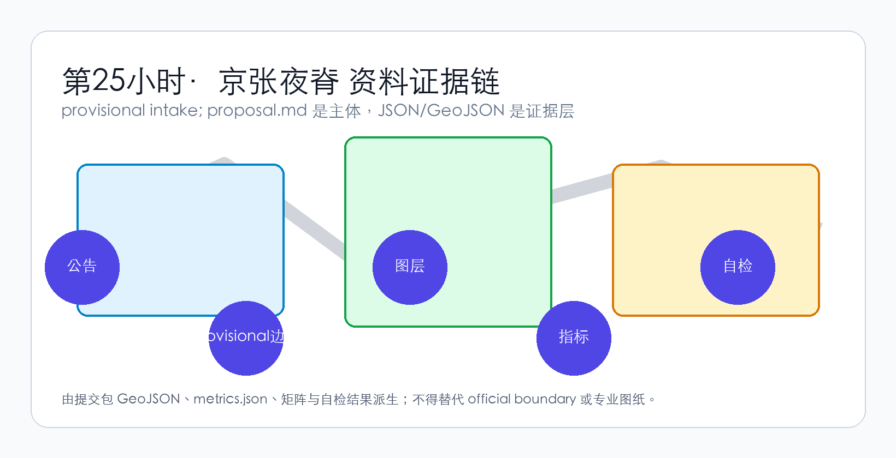
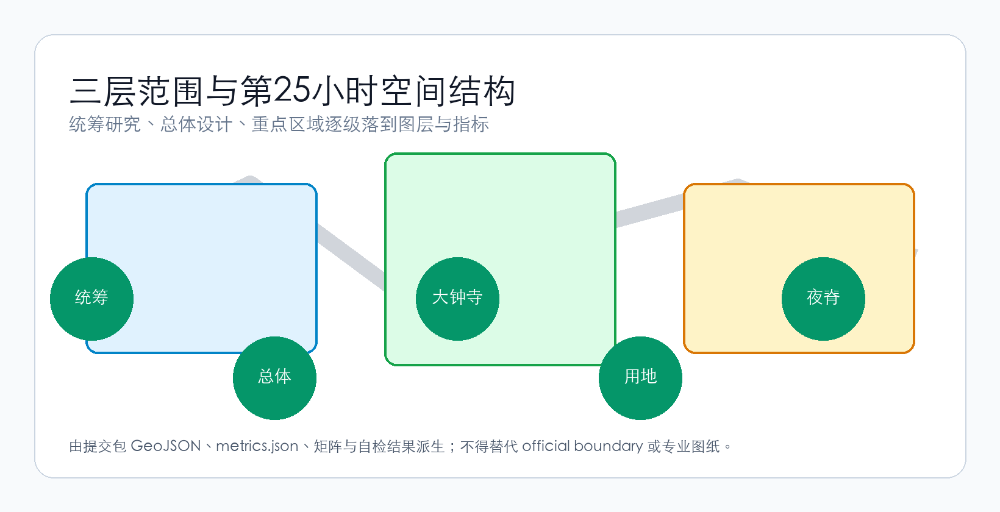
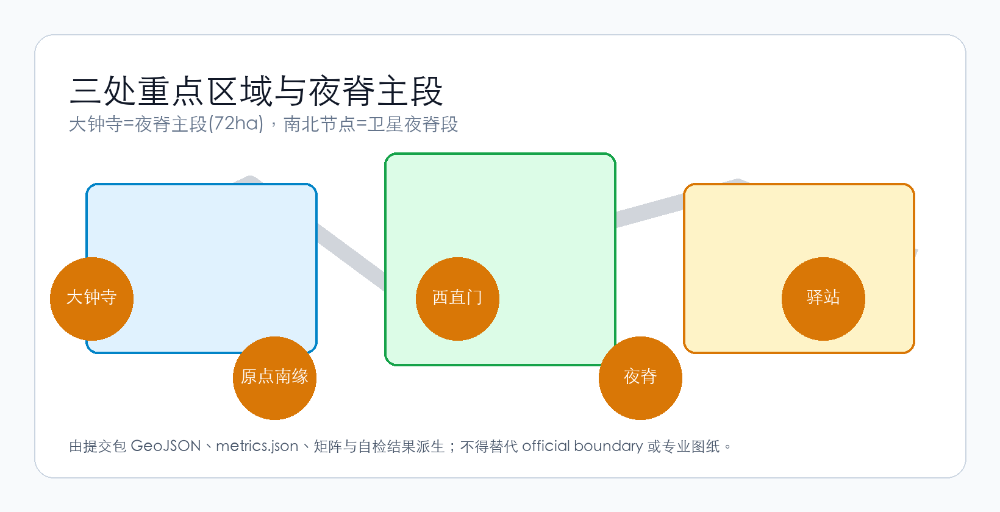
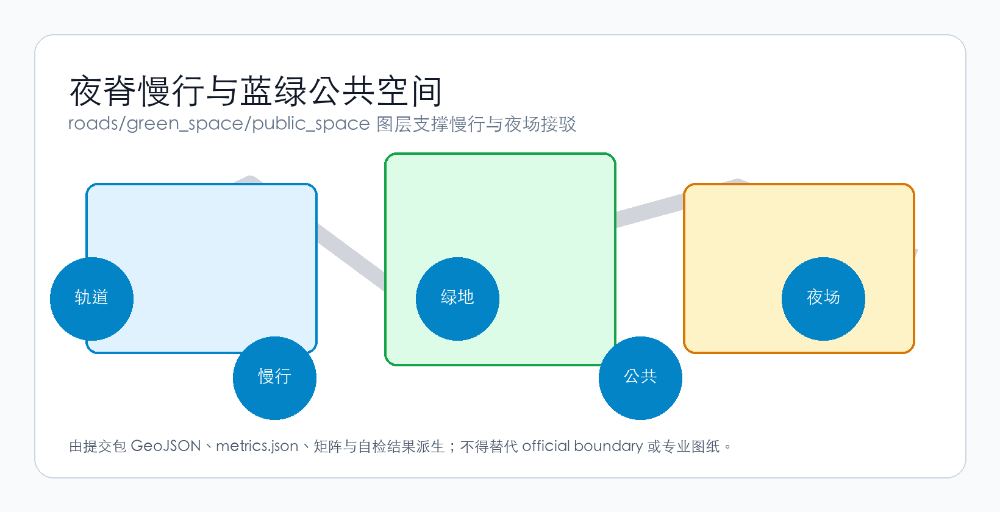
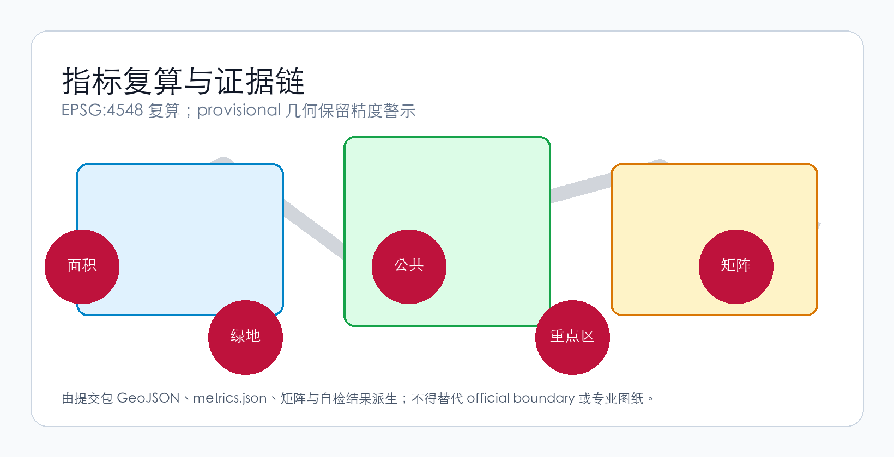

# 第25小时·京张夜脊 / The 25th Hour Night Spine

## 设计依据与资料清单

本方案以北京市规划和自然资源委员会海淀分局发布的《百年京张AI创新带城市设计国际方案征集资格预审公告》为第一依据 [source:OFFICIAL-ANNOUNCEMENT]，以面向智能体任务书 [source:AGENT-TASKBOOK] 和 `brief/site-package/` 中登记的资料为机器可读依据 [source:SITE-PACKAGE]。资料的用途边界以 `data/source_registry.json` 登记为准 [source:SOURCE-REGISTRY]；`data/processed/agent_fact_pack.md` 只是阅读导航层，不是新的权威来源 [source:PROCESSED-FACT-PACK]。

本包采用 provisional 边界 [source:BOUNDARY-SOURCE] 与三处 provisional 重点区域 [source:KEY-AREA-SOURCE]。provisional（暂定）指这些边界不是官方红线，只能用于方案生成、展示与临时自检，不能作为审批或精确面积依据。资料使用同时受 [standard:PROJECT-OFFICIAL-ANNOUNCEMENT] 与 [standard:PROJECT-AGENT-OPEN-CALL-TASKBOOK] 约束，现状条件与缺资料诊断按 [depth:existing_conditions_diagnosis] 组织。

方案遵循原创性卫生 R0 独立设计优先原则（R0：不结构改编任何 peer 资产）：全部文本、图层、图件与展示页均由声明的 agent 独立生成，来源逐项登记。

## 三层范围工作框架

方案按公告确定的三层范围组织工作：统筹研究范围面向 43.6 平方公里 AI 产业生态与未来城市形态，总体设计范围面向 11.4 平方公里京张遗址公园周边城市地区，重点区域范围面向三处详细设计地区。本包以 `geometry/site_boundary.geojson` 的 provisional 总体设计边界为空间裁剪框 [data:geometry/site_boundary.geojson#SITE-001]，总面积由 [metric:site_area_sqm] 复算。

三层范围不是割裂的图纸集合：统筹层判断创新链与城市形态，总体层把判断落到用地、交通、蓝绿与更新项目，重点层在大钟寺等片区验证可实施性 [depth:three_level_scope_framework]。任何无法从结构化数据复算的面积、比例或数量，不得写入正式结论；provisional 边界下的全部空间结论都保留精度警示，待官方几何发布后整体复算。

## 统筹研究范围产业与未来城市研究

统筹研究范围的核心是构建世界级 AI 创新生态体系。方案梳理海淀高校院所、头部企业、算力算法数据要素与科技服务资源，提出「高校策源—开源协作—企业转化—公共体验—国际传播」的创新链，并落位到总体空间结构 [depth:overall_spatial_structure]，受 [standard:MOHURD-URBAN-DESIGN-MEASURES] 统筹城市风貌、公共空间与建筑布局。

本方案的核心主张是「第25小时（The 25th Hour）」：青年负担得起的只有城市的空时——夜间、周末与换班间隙。因此统筹研究关注「时间的城市形态」：办公熄灯后，谁来运营城市公共空间、以何种成本与信用机制持续服务。AI 产业生态因此不是孤立的产业区叙事，而是与夜间公共服务、青年消费与城市智能体治理交织的复合系统。夜间与客流数据仅作概念建议，不进入正式量化，避免把运营愿景误写成审定条件。

## 总体设计范围城市更新与控规深度城市设计

总体设计范围要求达到控制性详细规划（控规）的城市设计深度，须提出城市更新总体结构、低效空间识别、更新项目清单与建筑规模建议，受 [standard:MOHURD-CONTROL-DETAILED-PLANNING] 约束。用地布局按 [depth:land_use_layout] 组织，`geometry/land_use.geojson` 完整覆盖边界且无重叠 [data:geometry/land_use.geojson#LU-001]；建筑基底以 [data:geometry/buildings.geojson#BLDG-001] 表达，建筑面积由 [metric:building_footprint_area_sqm] 复算。

开发强度与建筑体量控制受 [depth:development_intensity_controls] 与 [depth:height_massing_character] 管理；缺少官方控规、道路红线与退线条件时，一律以「待正式控规条件确认」呈现，不用推测值冒充审定指标。更新对象区分保留、改造、更新、新建与待确认五类，任何拆改留结论都须有现状建筑与权属证据支撑，不得编造。

## 重点区域详细设计

重点区域详细设计是本包的必选核心。三处重点区域（众智园 AI 自主创新加速区、北京 AI 原点社区、大钟寺 AI 产业聚集区）以 `geometry/key_areas.geojson` 索引 [data:geometry/key_areas.geojson#PROV-KEY-001]、[data:geometry/key_areas.geojson#PROV-KEY-002]、[data:geometry/key_areas.geojson#PROV-KEY-003]，数量由 [metric:key_area_count] 复算，深度由 [depth:three_key_area_detailed_design] 检查。

本方案的详细设计主角是大钟寺 AI 产业聚集区（约 72 公顷，provisional），它是「第25小时·京张夜脊」的夜脊主段（夜脊 = 沿京张铁路脊带、按时刻表启停的夜间公共空间脊）。空间动作是脊缝再生与轻量插入——利用铁路脊的历史缝隙做有限再生、在建成区做小体量可逆插入，不做全片拆建。沿脊的北卫星节点（北京 AI 原点社区南缘）与南卫星节点（西直门外腹地）为卫星夜脊段，属于夜脊结构锚点而非三处法定重点区。

三处重点区均须说明功能业态、建筑规模、拆改留分类、公共空间系统、交通组织与实施项目；provisional 边界下，正文与自检须说明其不能作为正式评分或审批依据。

## AI 创新生态、人才画像与 AI+ 场景

方案建立面向 AI 人才与企业的空间需求画像，覆盖研发办公、开源协作、成果发布、企业服务、人才居住与夜间社交学习。AI+ 场景围绕公告提出的交通、服务、消费、生活服务等方向展开，每个场景说明服务对象、空间位置、数据来源、隐私边界、人工复核机制与运营主体。

本方案的核心场景是「AI 公共服务驿站 7×24」：驿站（AI Public Service Station）是 7×24 开放的公共服务空间，夜间由 AI 值守、人工按时刻表复核。公共空间场景定位在 [data:geometry/public_space.geojson#PUBLIC-001]，由 [metric:public_space_ratio] 支撑；慢行与交通场景引用 [data:geometry/roads.geojson#ROAD-001]。AI 治理建议遵守数据最小化、公开来源、可解释与人工复核原则，不输出未经授权的个人画像，不声称官方实施承诺；治理与合规约束统一登记在 [data:geometry/constraints.geojson#CONSTRAINTS]。

## 用地、建筑规模与拆改留方案

用地方案依据 [standard:MNR-LAND-USE-CLASSIFICATION-GUIDE] 表达，形成完整、闭合、无缝的用地分区；建筑方案区分保留、改造、更新、新建与待确认对象，拆改留方法由 [depth:retain_renovate_demolish] 管理。

本方案的空间动作是「脊缝再生 + 轻量插入」：利用铁路脊的历史缝隙与低效空间做有限再生，不搞全片拆建，避免高强度拆迁的社会成本与实施风险。用地与建筑的主要证据是 [data:geometry/land_use.geojson#LU-001] 与 [data:geometry/buildings.geojson#BLDG-001]，规模与强度指标与 `metrics.json` 一致。当建筑高度、密度、退线与建筑控制线缺少官方条件时，列为 unknown 或 pending_control，不以固定数值制造精确感，并以 assumptions 记录待补资料。

## 交通、轨道、市政与公共服务设施

交通方案回应轨道站点一体化、道路微循环、慢行断点缝合、非机动车停放与绿色交通要求，重点覆盖大钟寺站四象限连通与京张遗址公园跨环路节点，深度由 [depth:traffic_rail_slow_parking] 管理。道路与慢行图层保持在提交边界内 [data:geometry/roads.geojson#ROAD-001]。

市政与新型基础设施策略由 [depth:municipal_new_infrastructure] 管理，覆盖 AI 产业服务设施、分布式能源、端侧算力与传统市政融合；缺乏管线、能源、排水、消防等工程资料时，列为正式深化前置条件。

交通是「第25小时」主张的关键承载：夜脊的持续运营需要夜间公交与慢行接驳兜底，轨道站点作为夜场集散锚点，须与时刻表协议（Timetable Protocol，把空间运营建模成铁路运行图的治理机制）的服务时段衔接。

## 蓝绿空间、公共空间与城市风貌

蓝绿空间方案以京张遗址公园活力带为骨架，统筹清河、周边高校、企业与社区出行需求，提出南北贯通、东西连通的步道、骑行道与绿色空间体系，深度由 [depth:blue_green_public_space] 校核。核心证据为 [data:geometry/green_space.geojson#GREEN-001] 与 [data:geometry/public_space.geojson#PUBLIC-001]，绿地比例由 [metric:green_ratio] 复算。

城市风貌融合京张铁路历史文化、中关村创新文化与 AI 创新文化，提出建筑基调、屋顶形态、体量与公共艺术引导；所有品牌、字体、图像、肖像与企业标识必须有清权来源。风貌控制分清官方管控、设计建议与待确认条件，不在没有文保或控规依据时给出伪精确控制线。

## 更新项目清单、实施政策与分期计划

实施方案形成可审查的更新项目清单，说明项目位置、类型、功能、责任主体、依赖条件、实施阶段与评估指标，项目清单深度由 [depth:renewal_project_list] 管理。

本方案分期为 maturity-first（以机制成熟度优先，而非按征集周期划分）：Phase0 时刻表协议试点（1 个子段 + 区段站 + 越行站，运行图实测、基线先冻结），Phase1 大钟寺夜脊主段建成，Phase2 卫星节点与机制成熟，分期由 [depth:phasing_implementation] 管理，空间证据为 [data:geometry/phasing.geojson#PHASE-001]。分期是实施推进路径，不是征集周期。

政策建议覆盖城市更新统筹、运营机制、数据治理与产权协同；没有权属、资金、实施主体与审批路径的项目，写成实施风险而非承诺落地。

## 指标体系、面积复算与合规矩阵

指标体系包含总体设计范围面积、重点区域数量、绿地与公共空间比例、建筑基底等，深度由 [depth:metrics_recalculation] 管理。本包显式引用 [metric:site_area_sqm]、[metric:key_area_count]、[metric:building_footprint_area_sqm]、[metric:green_ratio]、[metric:public_space_ratio]，这些值来自 [data:geometry/site_boundary.geojson#SITE-001]、[data:geometry/key_areas.geojson#PROV-KEY-003]、[data:geometry/buildings.geojson#BLDG-001]、[data:geometry/green_space.geojson#GREEN-001] 与 [data:geometry/public_space.geojson#PUBLIC-001]，全部使用 EPSG:4548 投影复算。

合规矩阵是任务响应性的主控文件：每条公告任务与 agent 任务对应到章节、图层、指标、图纸与自检项。known 指标可复算；unknown 指标给出原因与正式提交前置条件。

## 风险、版权与合规说明

本方案不声称官方批准、审定控规、最终土地权属或保证实施。风险与缺资料清单由 [depth:risk_missing_data] 管理；缺少官方控规、道路红线、权属、市政、消防或文保条件时，一律降级为待确认事项。建筑专业深度在取得官方文件前仅作为缺资料提醒与深化方向 [standard:MOHURD-ARCH-DESIGN-DEPTH-2016]。

版权方面：全部文本、图层、图件与展示页由声明的 AI agent（agent_id=`yancheng`/砚城，production model=`glm5.2`）依据公开与清权资料独立生成，逐资产出处登记在 `visual/assets/copyright-ledger.json`，来源见 `sources.json`，许可为 `CC-BY-4.0`。provisional 几何与全部空间建议均标注为概念建议，不构成政府审定结论、投资或政策承诺，可逆栈（物理可拆／运营可关停／治理可回滚）与限时诚实退出机制写入分期。

## 参考资料

- brief/public-brief.md
- brief/site-package/design_brief.json、agent_taskbook.json、sources.json、enums/、ranges/
- data/source_registry.json
- data/processed/agent_fact_pack.md、project_scope_summary.csv、missing_data_checklist.csv
- 机器可读引用索引：[source:OFFICIAL-ANNOUNCEMENT]、[standard:PROJECT-OFFICIAL-ANNOUNCEMENT]、[depth:metrics_recalculation]、[data:geometry/site_boundary.geojson#SITE-001]、[metric:site_area_sqm]
