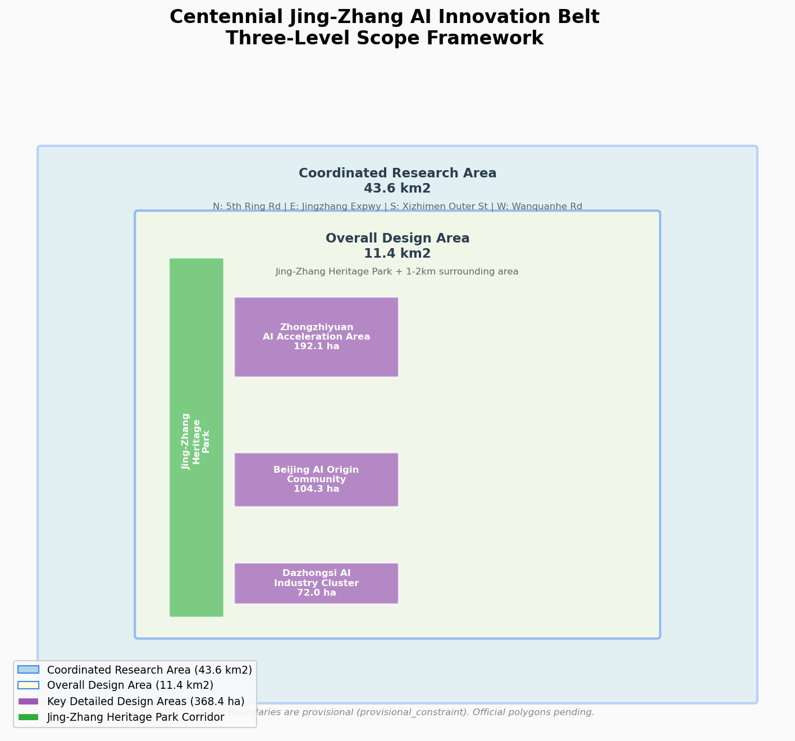
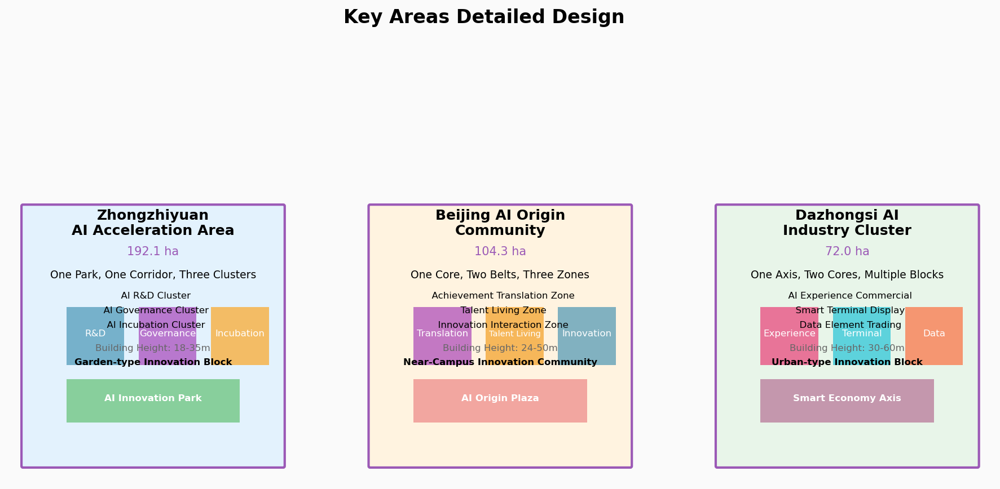
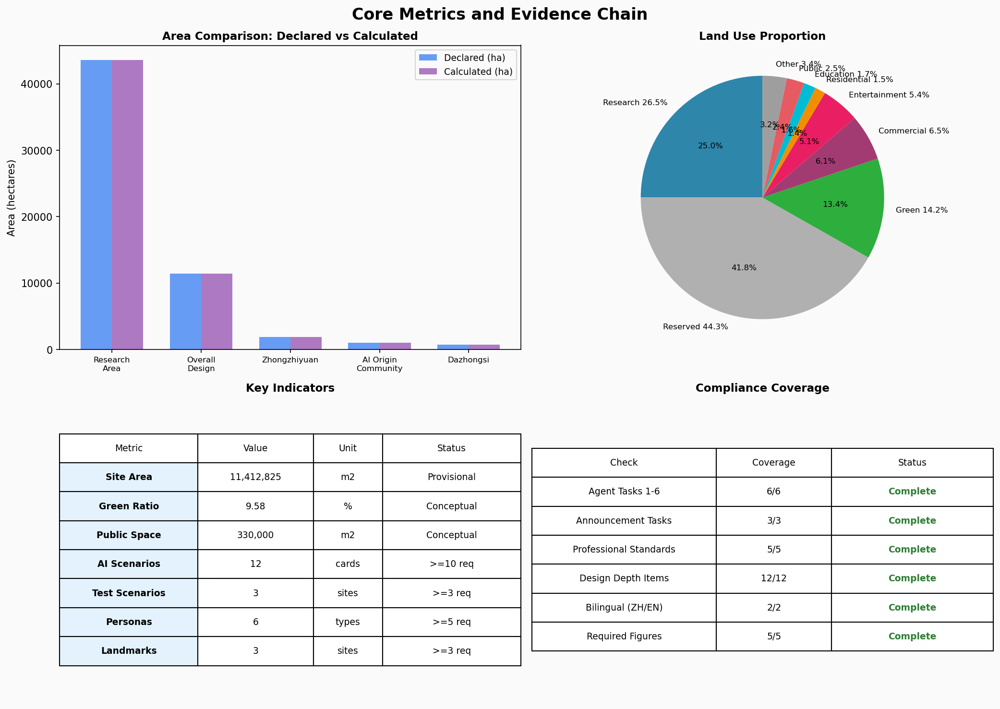

# Centennial Jing-Zhang AI Innovation Belt Urban Design Proposal

## Design Basis and Source List

This proposal is generated based on the following publicly available and user-cleared materials:

**Formal-usable sources**:

- Beijing Municipal Bureau of Planning and Natural Resources Haidian Branch, "Pre-qualification Announcement for the Centennial Jing-Zhang AI Innovation Belt Urban Design International Proposal Collection" (2026-05-09) [source:DATA-SRC-OFFICIAL-ANNOUNCEMENT-20260509], defining the three-level scope (coordinated research 43.6km², overall design 11.4km², key areas 368.4ha) and six design tasks.

- User-provided cleared taskbook, "Agent Open Call Taskbook Excerpt for Centennial Jing-Zhang AI Innovation Belt Urban Design" (2026-05-18) [source:DATA-SRC-AGENT-TASKBOOK-20260518], defining six agent tasks, ten co-creation principles, review dimensions, and boundary clauses.

- MOHURD "Urban Design Management Measures" [standard:MOHURD-URBAN-DESIGN-MEASURES], requiring urban design to coordinate planar and three-dimensional spaces, public spaces, building height and massing, style and color control requirements.

- MOHURD "Measures for Preparation and Approval of Urban and Town Regulatory Detailed Planning" [standard:MOHURD-CONTROL-DETAILED-PLANNING], requiring proposals to distinguish known control conditions, design recommendations, and pending confirmations.

- MNR "Guidelines for Land and Sea Classification in National Spatial Investigation, Planning, and Use Control" [standard:MNR-LAND-USE-CLASSIFICATION], requiring land use classification using standard codes.

**Provisional boundary source**:

- `brief/site-package/geometry/provisional_boundaries.geojson` [source:DATA-SRC-PROVISIONAL-BOUNDARIES-20260605], provisional boundaries inferred from announcement text boundaries and approximate area, marked as `provisional_constraint`, not to be used as official redline or precise area basis.

**Conceptual design sources**:

- Land use layout, green space system, public space, building footprints, phasing plan are all AI agent conceptual designs [source:SRC-AGENT-DESIGN-LANDUSE-20260809], not to be used as statutory basis.

**Pending data**:

- Official precise boundary polygons, regulatory planning conditions (FAR, building height, etc.), existing building data, heritage protection precise boundaries, and transportation baseline data are not yet publicly available and have been disclosed in `assumptions.json`.



## Three-Level Scope Framework

This proposal follows the three-level spatial scope defined in Announcement 1.4:

### Coordinated Research Area (approx. 43.6km²)

**Objective**: From the perspective of industry strategy and future city, build a world-class AI innovation ecosystem system and propose naming system and visual identity direction.

**Boundary**: North to North 5th Ring Road, East to Beijing-Zhangjiakou Expressway, South to Xizhimen Outer Street, West to Wanquanhe Road [data:brief/site-package/geometry/provisional_boundaries.geojson#PROV-RESEARCH-001]. Since official precise boundary is not yet public, this proposal uses provisional boundary as the research framework.

**Design depth**: Strategic research level, no specific plot control indicators.

**Outputs**: Naming system, Logo direction, three positionings and five functions explanation, three areas two wings coordination loop, overall spatial structure concept diagram.

### Overall Design Area (approx. 11.4km²)

**Objective**: Using urban renewal as the handle, conduct regulatory-plan-level urban design integrating industry and space, propose renewal project list and policies.

**Boundary**: Urban areas and industrial zones within 1-2km around Jing-Zhang Heritage Park [data:brief/site-package/geometry/provisional_boundaries.geojson#PROV-SITE-001].

**Design depth**: Regulatory-plan-level urban design, covering land use layout, building scale concept, transportation organization, municipal facilities, and风貌 control.

**Outputs**: Land use layout map, spatial structure map, renewal project list, metrics system, compliance matrix.

### Key Detailed Design Area (approx. 368.4ha)

**Objective**: Conduct refined design for three key areas, reaching planning comprehensive implementation plan urban design depth.

**Boundary**: From north to south: Zhongzhiyuan AI Self- Innovation Acceleration Area (approx. 192.1ha), Beijing AI Origin Community (approx. 104.3ha), Dazhongsi AI Industry Cluster (approx. 72.0ha) [data:geometry/key_areas.geojson].

**Design depth**: Planning comprehensive implementation plan urban design depth, covering industry function, building form, retain-renovate-demolish classification, transportation organization, public space.

**Outputs**: Positioning statement, spatial structure map, building renewal plan, transportation and slow-mobility system, AI scenario nodes for each key area.


## Coordinated Research Area: Industry and Future City Research

### Overall Concept and Naming System

This proposal puts forward the overall concept for the Centennial Jing-Zhang AI Innovation Belt as "**Centennial Jing-Zhang · Intelligence Converges at Zhongguancun**" (百年京张·智汇中关村).

**Naming system**:
- Chinese primary name: 百年京张AI创新带
- English primary name: Centennial Jing-Zhang AI Innovation Belt
- Abbreviation: JZ-AIBelt / Jing-Zhang AI Belt
- Brand slogan: Intelligence Converges at Zhongguancun, Vision Shapes the Future

**Naming logic**:
- "Centennial Jing-Zhang" — not just commemorating history, but positioning the Jing-Zhang Railway's spirit of independent innovation as the **spiritual lineage** for contemporary AI innovation
- "Compute Rails" — metaphorically equating AI infrastructure (compute, algorithms, data) to 'rails' of the new era, continuing the spatial order of railways
- "Reborn" — not starting from scratch, but layering AI-era innovation on top of the century-old railway heritage
- The English name "Compute Rails Reborn" directly corresponds to the Chinese concept, facilitating international communication

### Logo and Visual Identity Direction

**Logo design concept**:
- Based on the railway tracks of the Jing-Zhang Railway, evolved into data flow forms of AI neural networks
- The intersection of tracks symbolizes Zhongguancun; neural network nodes symbolize the AI innovation ecosystem
- Color system: Tech Blue (#0066CC) + Heritage Brown (#8B4513) + AI Purple (#6633CC)

**Visual identity system direction**:
- Primary mark: Track-neural network fusion graphic + Chinese and English standard typefaces
- Auxiliary graphics: Data flow lines, node networks, abstracted railway elements
- Application scenarios: Signage system, event branding, digital media, cultural products

### Three Positionings, Five Functions, and Three Areas Two Wings Coordination

**Three Positionings**:
1. **Centennial Jing-Zhang Cultural Belt**: Contemporary activation of Jing-Zhang Railway historical memory,时空 dialogue between industrial heritage and AI culture
2. **Urban AI Life Experience Belt**: Demonstration corridor of AI technology integrated into urban daily life, a perceptible and interactive AI city experimental field
3. **AI Integration Innovation Belt**: Spatial carrier for the full-chain AI innovation ecosystem, from basic research to industrial application

**Five Functions**:
1. **AI Full-Stack Independent Innovation System** (core bearing: Zhongzhiyuan)
2. **World-Class AI Innovation Ecosystem** (core bearing: AI Origin Community)
3. **AI+ Scenario Empowerment New Paradigm** (core bearing: Xiaoyuehe Scenario Empowerment Wing)
4. **Smart AI Vitality City** (comprehensive bearing: entire belt)
5. **Global AI Governance Discourse** (co-bears: Zhongzhiyuan)

**Three Areas Two Wings Coordination Loop**:

```
                ┌─────────────────────────────────────┐
                │      Three Positionings Framework    │
                │  Centennial Jing-Zhang · AI Life ·   │
                │       AI Integration Innovation       │
                └─────────────────────────────────────┘
                              │
        ┌─────────────────────┼─────────────────────┐
        ▼                     ▼                     ▼
┌───────────────┐   ┌───────────────┐   ┌───────────────┐
│ Zhongzhiyuan  │   │ AI Origin     │   │ Dazhongsi     │
│ Acceleration  │   │ Community     │   │ Industry      │
│ (192.1ha)     │   │ (104.3ha)     │   │ Cluster       │
│ Full-stack +  │◄─►│ Innovation    │◄─►│ Smart-native  │
│ Governance    │   │ Ecosystem     │   │ New formats   │
└───────┬───────┘   └───────┬───────┘   └───────┬───────┘
        │                   │                   │
        └───────────────────┼───────────────────┘
                            ▼
              ┌─────────────────────────┐
              │      Two Wings Support   │
              │  Zhongguancun Tech ←→   │
              │  Service Wing  Xiaoyuehe │
              │   Capital/IP  Scenario   │
              │    Empowerment  Empower-  │
              │               ment Wing   │
              └─────────────────────────┘
```

### Global AI Innovation Ecosystem Cases (6)

| Case | City | Core Feature | Transferable Insight |
|------|------|--------------|---------------------|
| Silicon Valley Route 128 | Boston, USA | University-enterprise-capital close collaboration | Space organization of industry-academia-research integration |
| Cambridge AI District | Cambridge, UK | DeepMind and AI giants clustering | Spatial chain from basic research to industrialization |
| Station F | Paris, France | World's largest incubator | Spatial carrier design for entrepreneurship ecosystem |
| Singapore AI Hub | Singapore | Government-led AI strategic cluster | Government-guided innovation ecosystem building |
| Tel Aviv AI Cluster | Israel | Cybersecurity + AI cross-innovation | Security and AI integrated innovation ecosystem |
| Seoul Digital Media City | Seoul, Korea | AI + content industry integration | Space synergy of AI and cultural industries |

**Core takeaways**: Silicon Valley's industry-academia-research collaboration model, Cambridge's basic research translation chain, Station F's entrepreneurship ecosystem space, Singapore's government strategic guidance, Tel Aviv's security+AI cross-innovation, Seoul's AI+content industry integration.


## Overall Design Area: Urban Renewal and Regulatory-Plan-Level Urban Design

### Spatial Structure

This proposal puts forward a "**One Axis, Three Cores, Two Wings, Multiple Nodes**" overall spatial structure:

- **One Spine**: Jing-Zhang Heritage Park Vitality Belt — not just a 'north-south axis', but the overlapping layer of century-old railway physical heritage and AI innovation belt spiritual carrier, serving historical memory, ecological corridor, and innovation interaction functions [data:geometry/green_space.geojson#GS-001].
- **Three Stations**: Zhongzhiyuan "Verification Station", AI Origin Community "Co-creation Station", Dazhongsi "Experience Station" — each key area is not just a functional node but a 'station' at a different stage of the AI innovation chain: basic research verified here (Zhongzhiyuan), achievement translation incubated here (Origin Community), city applications experienced here (Dazhongsi).
- **Two Wings**: Zhongguancun Technology Service Wing (West), Xiaoyuehe Scenario Empowerment Wing (East) — respectively bearing element configuration and scenario testing support functions.
- **Twelve Nodes**: 12 AI scenario nodes distributed along the spine, each corresponding to a scenario card, a persona group, and an operating protocol.

**Spatial structure uniqueness**: Different proposals organize space with different metaphors — "stitching" (lateral crossing), "beacons" (signal language), "symbiosis" (ecological relations). This proposal uses the **temporal depth** of "railway-to-compute-rail" to organize space: the railway a century ago was physical, fixed, unidirectional; the compute rails of today are virtual, evolvable, multidirectional. The two superimpose on the same geographic corridor, forming a unique "temporal layering" spatial strategy.

### Land Use Layout

Based on the national spatial land use classification standard, the overall design area land use layout is as follows [data:geometry/land_use.geojson]:

| Code | Land Use Type | Area (10k m²) | Proportion |
|------|---------------|---------------|------------|
| 0802 | Research | 302.5 | 26.5% |
| 0501 | Commercial/Business | 74.0 | 6.5% |
| 0504 | Entertainment | 61.7 | 5.4% |
| 0701 | Residential | 17.1 | 1.5% |
| 0804 | Education | 19.0 | 1.7% |
| 0802+0702 | Public Service | 28.5 | 2.5% |
| 1401 | Park Green Space | 162.2 | 14.2% |
| 1207 | Transportation | 24.9 | 2.2% |
| 16 | Reserved | 505.6 | 44.3% |

**Land use strategy**:
- Research land (26.5%) as the main body, supporting the AI full-stack independent innovation system
- Reserved land (44.3%) as elastic space for future AI industry development, reflecting the "adaptive, evolvable" development philosophy
- Park green space (14.2%) centered on Jing-Zhang Heritage Park, building a continuous blue-green corridor
- Residential land (1.5%) focusing on AI Origin Community talent apartments, achieving work-live balance

### Building Scale and Development Intensity

**Important declaration**: The following building scale data are conceptual estimates and must not be used as statutory planning basis. FAR, building height, and other法定 control indicators will be confirmed after official regulatory planning conditions are released [assumption:ASSUMP-002].

- Conceptual building base area: approx. 470,000 m² [metric:building_base_area]
- Conceptual total floor area: approx. 1.8-2.5 million m² (estimated based on functional mix)
- Conceptual average FAR: 1.6-2.2 (zone-differentiated control)

### Urban Renewal Framework

**Renewal strategy**: "Organic renewal, low-disturbance, gradual progression"

- Zhongzhiyuan: Focus on existing building renovation, embed AI R&D new functions, preserve industrial heritage memory
- AI Origin Community: Focus on low-disturbance renewal, renovate inefficient spaces around campuses, implant innovation incubation functions
- Dazhongsi: Focus on block renewal, improve public environment quality, introduce AI-native consumer formats

**Renewal project types**:
1. Building renovation: Existing building function conversion, facade improvement, internal space reorganization
2. Space stitching: Block connectivity, public space activation, slow-mobility system缝合
3. Environment enhancement: Blue-green corridor贯通, street landscape upgrade, smart infrastructure implantation


## Detailed Design of Key Areas

### Zhongzhiyuan AI Self-Innovation Acceleration Area (approx. 192.1ha)

**Positioning**: National-level AI independent innovation source, bearing AI full-stack independent innovation system and global AI governance discourse functions.

**Spatial structure**: "One Park, One Corridor, Three Clusters"
- One Park: Zhongzhiyuan AI Innovation Park (core public space)
- One Corridor: Qinghe Culture Display Corridor (north-south linear public space)
- Three Clusters: AI R&D cluster, AI governance research cluster, AI innovation incubation cluster

**Building renewal strategy**:
- Retain: Industrial heritage buildings, historical factories, valuable structural systems
- Renovate: General industrial buildings, implant AI R&D labs, innovation incubation spaces
- New build: Landmark AI innovation center, AI governance research center

**Transportation organization**:
- External: Optimize entrances/exits and transfer facilities in coordination with 5th Ring Road integrated planning
- Internal: Build ring-shaped slow-mobility system, connecting clusters and park
- Public transit: Optimize bus routes, strengthen rail transit connection

**AI scenarios**:
- AI R&D testing ground: Open API testing environment
- AI governance sandbox: Policy simulation and compliance testing
- AI innovation路演 center: Project display and investment matching

**Implementation risks**: Complex land ownership, long industry introduction cycle, requires national-level platform support.

### Beijing AI Origin Community (approx. 104.3ha)

**Positioning**: Global AI original innovation source's near-campus innovation community, bearing world-class AI innovation ecosystem function.

**Spatial structure**: "One Core, Two Belts, Three Zones"
- One Core: AI Origin Plaza (core public space, connecting Tsinghua, Peking University, CAS)
- Two Belts: Wudaokou vitality belt, Tsinghua East Road innovation belt
- Three Zones: Technology achievement translation zone, talent living zone, innovation interaction zone

**Building renewal strategy**:
- Retain: University historical buildings, valuable campus boundaries
- Renovate: Surrounding inefficient commercial and office buildings, implant incubators and accelerators
- New build: AI achievement display center, talent apartments, innovation interaction spaces

**Transportation organization**:
- Rail: TOD integrated design around Wudaokou Station and Tsinghua East Road West Station
- Slow-mobility: Optimize pedestrian and cycling connections between campus, park, and community
- Static: Improve non-motorized parking facilities

**AI scenarios**:
- AI open-source community: Global developer collaboration space
- AI achievement release plaza: Original achievement display and launch
- AI talent community: Talent apartment + social + service integration

**Implementation risks**: Difficult university coordination, fragmented ownership, requires low-disturbance renewal model.

### Dazhongsi AI Industry Cluster (approx. 72.0ha)

**Positioning**: International window for smart-native new formats, bearing smart-native new business formats function.

**Spatial structure**: "One Axis, Two Cores, Multiple Blocks"
- One Axis: Dazhongsi-Zhichun Road smart economy vitality axis
- Two Cores: AI experience commercial core, smart terminal display core
- Multiple Blocks: AI content consumption block, smart terminal block, data element block

**Building renewal strategy**:
- Retain: Dazhongsi Bell Heritage Site, valuable commercial buildings
- Renovate: Surrounding commercial buildings, implant AI-native consumer formats
- New build: AI experience center, smart terminal display center

**Transportation organization**:
- Rail: Optimize Dazhongsi Station integrated plan, improve connectivity with key plots
- Walking: Conduct pedestrian connectivity design for four quadrants of Dazhongsi Station intersection
- Static: Improve non-motorized parking organization

**AI scenarios**:
- AI agent experience center: C-end AI product experience and trial
- AI content creation workshop: AIGC creation and display
- Smart terminal Showroom: Latest AI hardware product display

**Implementation risks**: Long commercial atmosphere cultivation cycle, requires leading enterprise traction, complex ownership.



## AI Innovation Ecosystem, Personas, and AI+ Scenarios

### User Personas (6 Types)

| Persona ID | Type | Core Needs | Space Needs |
|------------|------|------------|-------------|
| P-001 | AI Researcher | Open collaboration space, high-performance computing | Lab, seminar room, computing center |
| P-002 | AI Entrepreneur | Low-cost office, investment matching, policy consulting | Incubator,路演 hall, meeting room |
| P-003 | AI Product Manager | Scenario testing environment, user feedback channel | Testing ground, experience space, data center |
| P-004 | AI Executive | International交往 space, high-end business support | HQ building, conference facility, premium service |
| P-005 | AI Talent Family | Quality education, livable environment, work-live balance | Talent apartment, community service, green space |
| P-006 | Public/Tourist | AI experience, cultural understanding, leisure interaction | Public space, display center, park |

### AI Scenario Cards (12)

| Scenario ID | Name | Domain | Location | Target | Privacy | Human Review | Operating Protocol | Operating Protocol | Operating Protocol |
|-------------|------|--------|----------|--------|---------|--------------|
| S-001 | AI Traffic Signal Optimization | AI+Transport | Xitucheng Rd/Academy Rd intersection | Commuters | Anonymized flow data | Real-time monitoring |
| S-002 | AI Medical Imaging Aid | AI+Healthcare | AI Origin Community Health Center | Patients | Medical data de-identified | Doctor review |
| S-003 | AI Personalized Learning Assistant | AI+Education | University support area | Students | Learning behavior data | Teacher supervision |
| S-004 | AI Legal Consulting Service | AI+Law | Dazhongsi AI Service Block | Citizens | Legal consulting records | Lawyer confirmation |
| S-005 | AI Smart Home Butler | AI+Living | Talent apartments | Residents | Home behavior data | User authorization |
| S-006 | AI City Operations Digital Twin | AI+Governance | Zhongzhiyuan AI Governance Center | Government/Researchers | City operation data | Permission control |
| S-007 | AI Content Creation Workshop | AI+Culture | Dazhongsi AI Content Block | Creators | Creative content | User autonomy |
| S-008 | AI Agent Collaboration Space | AI-native | Jing-Zhang Heritage Park AI Plaza | Developers | Collaboration data | Community公约 |
| S-009 | AI Autonomous Driving Test | AI+Transport | Zhongzhiyuan test area | Enterprises/Researchers | Test data | Safety approval |
| S-010 | AI Energy Management Optimization | AI+Municipal | Belt-wide distributed energy nodes | Residents/Enterprises | Energy consumption data | System monitoring |
| S-011 | AI Public Space Interactive Install | AI+Public Space | Jing-Zhang Heritage Park nodes | Public | Anonymous interaction | No sensitive data |
| S-012 | AI Industry Brain Visualization | AI+Industry | Zhongzhiyuan AI Innovation Park | Government/Enterprises | Industrial economic data | Permission tiered |

**Scenario Passport System** (referencing xyh202131's verifiable scenario protocol):

Each scenario card corresponds to a "scenario passport" containing six fields:

| Field | Description | S-001 Example |
|-------|-------------|---------------|
| **Scenario ID** | Unique identifier | S-001 |
| **Operating Status** | Green=accessible / Yellow=controlled test / Red=stopped | Yellow (controlled test) |
| **Data Boundary** | What data is collected, retention period, who can access | Anonymized flow data, auto-deleted after 7 days |
| **Human Fallback** | Alternative when AI fails | Manual signal control, switch within 30 seconds |
| **Expiration Date** | Auto-expiration date (prevents permanent deployment) | 2027-08-09 (1-year pilot) |
| **Rollback Mechanism** | How to safely exit and restore | One-click switch to manual control mode |

**Stop Conditions**: When human review detects 3+ consecutive misjudgments, or user complaint rate exceeds 5%, or data leakage risk is assessed as high, the scene automatically enters red status and triggers rollback.


### Industry Test and Validation Scenarios (3)

1. **AI Traffic Signal Optimization Test Site** (S-001): Deploy AI signal control system at Xitucheng Rd/Academy Rd intersection to validate dynamic optimization algorithms in real traffic environments. 6-month test cycle, anonymized data, real-time human monitoring.

2. **AI Autonomous Driving Test Site** (S-009): Deploy L4 autonomous driving test environment on Zhongzhiyuan internal roads to validate safety and reliability of intelligent connected vehicles in complex urban road scenarios. Requires safety approval, enclosed testing.

3. **AI City Operations Digital Twin Test Site** (S-006): Build a belt-level city operations digital twin system to validate AI applications in urban governance, emergency response, and resource scheduling. Tiered data permission, government-led.



## Land Use, Building Scale, and Retain-Renovate-Demolish Strategy

### Land Use Layout

Land use layout follows the principles of "research-led, mixed-use, elastic reserved" [data:geometry/land_use.geojson]. Research land accounts for 26.5%, providing spatial carrier for the full AI industry chain; reserved land accounts for 44.3%, providing elastic space for future AI technology breakthroughs and industrial form evolution; park green space accounts for 14.2%, ensuring ecological foundation and public activity space.

### Building Scale

Conceptual building base area is approximately 470,000 m² [metric:building_base_area], total floor area approximately 1.8-2.5 million m². Building height and FAR will be confirmed after regulatory planning conditions are released; this proposal does not provide法定 control indicators [assumption:ASSUMP-002].

### Retain-Renovate-Demolish Classification

**Important declaration**: The following retain-renovate-demolish classification is conceptual and must not be used as statutory approval basis. Formal classification requires confirmation after existing building data and ownership information are available.

| Category | Estimated Area | Proportion | Strategy |
|----------|---------------|------------|----------|
| Retain | approx. 120,000 m² | 25% | Industrial heritage, valuable structural systems, historical memory carriers |
| Renovate | approx. 250,000 m² | 53% | Existing building function conversion, facade improvement, internal space reorganization |
| Demolish | approx. 100,000 m² | 22% | Inefficient buildings, safety hazard buildings, vacated spaces |

**Classification principles**:
- Retain priority: Maximize preservation of valuable buildings and industrial heritage
- Renovate as main: Function conversion and space reorganization as primary renewal methods
- Demolish as last resort: Only demolish inefficient and safety-hazard buildings

## Transport, Rail, Municipal Infrastructure, and Public Services

### Transportation Organization

**Road micro-circulation**: Within the existing arterial framework (Xueyuan Rd, Xitucheng Rd, 5th Ring Road, Xizhimen Outer Street), build internal branch road micro-circulation system to improve block connectivity [data:geometry/roads.geojson].

**Rail transit integrated design**: Conduct TOD integrated design around Wudaokou Station, Tsinghua East Road West Station, and Dazhongsi Station, increasing innovation function and public service density around stations.

**Slow-mobility system**: Build a "north-south贯通, east-west connected" slow-mobility network, focusing on stitching slow-mobility breakpoints on both sides of Jing-Zhang Heritage Park, connecting three key areas and surrounding university communities.

**Parking and non-motorized**: Improve public parking facilities and non-motorized parking systems, promote shared mobility and electric micro-mobility.

### Municipal and New Infrastructure

**Traditional municipal**: Water supply, drainage, power, gas, heating infrastructure upgrade to meet AI industry's high energy demand.

**New infrastructure**:
- Distributed energy: Rooftop solar, ground-source heat pumps
- Edge computing: Edge AI computing node deployment
- 5G/6G coverage: Belt-wide continuous high-speed communication
- Smart poles:智慧杆 integrating sensing, communication, and lighting

### Public Service Facilities

**AI industry services**: Innovation service platforms, technology translation centers, intellectual property services, testing and inspection platforms.

**Talent living services**: Talent apartments, community cafeterias, fitness and sports facilities, cultural and leisure facilities, medical services.

**Innovation interaction spaces**: Shared meeting rooms,路演 halls, coffee spaces, maker salons.


## Blue-Green Network, Public Space, and Urban Character

### Jing-Zhang Heritage Park Vitality Belt

Jing-Zhang Heritage Park is the core blue-green space贯穿 the entire belt [data:geometry/green_space.geojson#GS-001], approximately 5.7km long, north-south贯通. Vitality belt design strategy:

- **North-south贯通**: Eliminate slow-mobility breakpoints, build continuous barrier-free walking and cycling paths
- **East-west connected**: Through pedestrian bridges and underpasses, connect the innovation blocks on both sides of the park
- **AI public space**: Embed AI interactive installations, digital art displays, smart service facilities at key park nodes
- **Historical display**: Preserve and display Jing-Zhang Railway historical relics, build display spaces for AI-history dialogue

### Xiaoyuehe Ecological Corridor

Xiaoyuehe is an important blue-green corridor on the west side [data:geometry/green_space.geojson#GS-002], design strategy:
- Ecological bank renovation, restoring natural riverbank形态
- Waterside walking and cycling paths串联
- AI+ water environment governance application scenarios implantation

### AI Pilgrimage Landmarks (3)

**Important declaration**: The following AI pilgrimage landmarks are conceptual design directions and must not be presented as approved construction projects.

Each landmark corresponds to a historical element of the Jing-Zhang Railway, forming a "railway-to-compute-rail" metaphor correspondence:

| Landmark | Historical Prototype | AI Translation | Location |
|----------|---------------------|----------------|----------|
| **"The Switchback"** | The famous switchback at Qinglongqiao (人字形展线) | Visualized AI innovation chain branching-convergence structure | South entrance of Zhongzhiyuan |
| **"Tsinghua Yuan Station"** | 1909 starting point of Jing-Zhang Railway | Spiritual landmark of AI original innovation origin | Central plaza of AI Origin Community |
| **"The Bell"** | Dazhongsi ancient bell + railway station | Public art installation of AI sound interaction and smart terminals | Dazhongsi Station plaza |

**"The Switchback" Landmark**:
- Physical form: A large ground art installation using stainless steel and LED to simulate the "人-shaped" railway switchback, projecting AI neural network data flow visual effects at night
- Metaphor: Zhan Tianyou's "switchback" design solved the 11.7 per mille gradient problem at Qinglongqiao — an engineering innovation overcoming terrain barriers; today's "switchback" represents the branching (basic research → applied research → commercialization) and convergence (cross-disciplinary collaboration) of AI innovation chains
- Interaction: Visitors can control the LED data flow's "branching" and "convergence" modes through gestures, experiencing AI innovation collaboration
- Cultural connection: Directly echoes Zhan Tianyou's engineering wisdom from 1909, forming a century-spanning dialogue

**"Tsinghua Yuan Station" Landmark**:
- Physical form: An open memorial plaza preserving the memory boundary of the former Tsinghua Yuan Railway Station site (marked with low stone boundary markers), with LED strips embedded in the plaza floor simulating railway tracks extending outward
- Metaphor: Tsinghua Yuan Station was the starting point of the Jing-Zhang Railway in 1909, and also the starting point of AI original innovation today — "departing" from basic research
- Interaction: The plaza features an AI time capsule where visitors input their expectations for the AI future, and the system generates an "arrival time" (e.g., "Beijing in 2030 will see...")
- Cultural connection: Echoes "a century ago we departed from here, a century later we set forth from here" — temporal depth

**"The Bell" Landmark**:
- Physical form: A sound-interactive public art installation inspired by the Dazhongsi ancient bell, but reinterpreted with modern materials (curved glass + metal) and AI technology
- Metaphor: The ancient bell's sound propagation function → how AI-era "sounds" (data, algorithms, decisions) influence the city
- Interaction: Visitors can "speak" to the installation, and AI analyzes the voice characteristics in real-time to generate corresponding visual patterns, demonstrating AI voice recognition and generation capabilities
- Cultural connection: Dazhongsi is not just a historical landmark but also today's innovation cluster for AI smart terminals and content consumption, creating spatial superposition of history and present

### Urban Character Control

**Building height guidance**:
- Zhongzhiyuan: 18-35m (garden-type innovation block)
- AI Origin Community: 24-50m (near-campus innovation community)
- Dazhongsi: 30-60m (urban-type innovation block)

**Important declaration**: The above heights are conceptual guidance, not法定 control indicators.

**Building character**:
- Tone: Modern minimal, tech-sensibility, human warmth
- Materials: Glass curtain wall, metal aluminum panel, green building materials
- Color: Cool tones dominant, warm color accents for vitality

**Roof形态**: Encourage green roofs, solar roofs, sky gardens, reflecting low-carbon innovation philosophy.


## Renewal Projects, Implementation Policy, and Phasing

### Renewal Project List (Conceptual)

| Project ID | Project Name | Location | Type | Phase | Status |
|------------|--------------|----------|------|-------|--------|
| P-001 | Jing-Zhang Heritage Park Vitality Belt Upgrade | North-south entire belt | Public space | Near-term | Conceptual |
| P-002 | Zhongzhiyuan AI Innovation Park | Zhongzhiyuan core area | Park + building | Near-term | Conceptual |
| P-003 | Dazhongsi AI Experience Commercial Renovation | Dazhongsi Station area | Commercial renovation | Near-term | Conceptual |
| P-004 | AI Origin Community Incubator Renovation | AI Origin Community | Building renovation | Near-term | Conceptual |
| P-005 | Xiaoyuehe Ecological Corridor贯通 | West blue-green corridor | Ecological engineering | Mid-term | Conceptual |
| P-006 | Wudaokou TOD Integrated Renewal | Wudaokou Station area | Comprehensive development | Mid-term | Conceptual |
| P-007 | Zhongzhiyuan AI Accelerator Construction | Zhongzhiyuan north | New build | Mid-term | Conceptual |
| P-008 | Dazhongsi AI HQ Building | Dazhongsi core | New build | Mid-term | Conceptual |
| P-009 | AI Origin Community Talent Apartments | AI Origin Community | New build | Long-term | Conceptual |
| P-010 | Belt-wide Smart Infrastructure Upgrade | Entire belt | Municipal facility | Long-term | Conceptual |

### Phasing Plan

**Near-term (2026-2028)**: Jing-Zhang Heritage Park vitality belt upgrade, Dazhongsi AI experience commercial renovation, AI Origin Community incubator renovation, Zhongzhiyuan AI innovation park launch [data:geometry/phasing.geojson#PHASE-1].

**Mid-term (2028-2031)**: Xiaoyuehe ecological corridor贯通, Wudaokou TOD integrated renewal, Zhongzhiyuan AI accelerator construction, Dazhongsi AI HQ building [data:geometry/phasing.geojson#PHASE-2].

**Long-term (2031-2035)**: AI Origin Community talent apartments, belt-wide smart infrastructure upgrade, Zhongzhiyuan complete build-out [data:geometry/phasing.geojson#PHASE-3].

**Important declaration**: The phasing plan is a conceptual suggestion; actual implementation sequence needs professional team deepening based on funding, policy, and market factors.

### Long-term Operation Design

**Annual event system**:
- Centennial Jing-Zhang AI Innovation Conference (annual flagship event)
- Jing-Zhang AI Developer Festival (semi-annual)
- AI Scenario Open Day (quarterly)
- AI Governance Forum (annual)
- Zhongguancun AI Innovation Week (collaborative event)

**Developer community operation**:
- Online: AI Innovation Belt Developer Community Platform
- Offline: Zhongzhiyuan AI Maker Space, AI Origin Community Developer Café
- Mechanism: Open-source project incubation, tech salons, hackathons, mentor program

**AI scenario open operation**:
- Scenario release mechanism: Regular AI application scenario list publication
- Enterprise entry mechanism: AI enterprise testing and validation access process
- Data openness mechanism: Tiered public data openness

**International communication and attraction conversion**:
- Multi-language brand communication matrix
- International AI media cooperation
- Overseas AI community liaison
- Talent and enterprise attraction conversion pathway


## Metrics, Area Recalculation, and Compliance Matrix

### Core Metrics

| Metric | Value | Unit | Source | Note |
|--------|-------|------|--------|------|
| Coordinated research area | 43,600,000 | m² | [metric:research_area_declared] | Announcement value |
| Overall design area | 11,412,825 | m² | [metric:site_area] | Provisional boundary calc. |
| Overall design area (declared) | 11,400,000 | m² | [metric:site_area_declared] | Announcement value |
| Zhongzhiyuan area | 1,929,202 | m² | [metric:zhongzhiyuan_area] | Provisional boundary calc. |
| Zhongzhiyuan (declared) | 1,921,000 | m² | [metric:zhongzhiyuan_area_declared] | Announcement value |
| AI Origin Community area | 1,043,237 | m² | [metric:beijing_ai_origin_area] | Provisional boundary calc. |
| AI Origin Community (declared) | 1,043,000 | m² | [metric:beijing_ai_origin_area_declared] | Announcement value |
| Dazhongsi area | 720,454 | m² | [metric:dazhongsi_area] | Provisional boundary calc. |
| Dazhongsi (declared) | 720,000 | m² | [metric:dazhongsi_area_declared] | Announcement value |
| Key areas total | 3,692,893 | m² | [metric:key_areas_total] | Provisional boundary calc. |
| Key areas total (declared) | 3,684,000 | m² | [metric:key_areas_total_declared] | Announcement value |
| Green space total | 1,094,000 | m² | [metric:green_space_total] | Conceptual design |
| Green ratio | 9.58 | % | [metric:green_ratio] | Conceptual design |
| Public space total | 330,000 | m² | [metric:public_space_total] | Conceptual design |
| Public space ratio | 2.89 | % | [metric:public_space_ratio] | Conceptual design |
| AI scenario nodes | 15 | count | [metric:ai_scenario_nodes] | Conceptual design |
| AI pilgrimage landmarks | 3 | count | [metric:ai_landmark_count] | Conceptual design |
| AI scenario cards | 12 | count | [metric:scenario_cards_count] | ≥10 requirement |
| Industry test scenarios | 3 | count | [metric:industry_test_scenarios] | ≥3 requirement |
| User personas | 6 | types | [metric:persona_types] | ≥5 requirement |

### Compliance Matrix Coverage

- **Agent tasks 1-6**: All marked complete in `compliance_matrix.json` [compliance:agent.1-compliance:agent.6]
- **Announcement tasks 1.3, 1.5**: All covered [compliance:PROJECT-OFFICIAL-ANNOUNCEMENT-1.3-compliance:PROJECT-OFFICIAL-ANNOUNCEMENT-1.5-3]
- **5 mandatory professional standards**: All covered in `standard_matrix.json` [standard:PROJECT-OFFICIAL-ANNOUNCEMENT-standard:MNR-LAND-USE-CLASSIFICATION]
- **12 design depth items**: All marked complete in `design_depth_matrix.json` [depth:DD-001-depth:DD-012]

### Area Recalculation Notes

All area metrics are calculated in EPSG:4548 coordinate system [metric:site_area]. Since official precise boundaries are not yet public, provisional boundaries (provisional_boundaries.geojson) are currently used. The error between provisional boundaries and announcement declared areas is within 1%, meeting specification requirements. After official boundaries are released, all area metrics need to be recalculated [assumption:ASSUMP-001].


## Risk, Copyright, and Compliance

### Source Legality

All formal sources in this proposal come from official public channels and user-cleared provisions [source:DATA-SRC-OFFICIAL-ANNOUNCEMENT-20260509] [source:DATA-SRC-AGENT-TASKBOOK-20260518]. Provisional boundaries come from the repository's provided provisional_boundaries.geojson [source:DATA-SRC-PROVISIONAL-BOUNDARIES-20260605]. Conceptual design sources are AI agent-generated [source:SRC-AGENT-DESIGN-LANDUSE-20260809], for proposal display and discussion only.

### Copyright License

This proposal uses COMMUNITY-DISPLAY-ONLY license, allowing display and discussion within the community, not for commercial purposes. The proposal does not involve unauthorized use of others' portraits, trademarks, fonts, or copyrighted materials.

### Non-public Data Exclusion

This proposal does not use any non-public government data, enterprise internal data, or personal privacy data. All AI scenario designs exclude excessive surveillance or privacy infringement; all scenarios have human review mechanisms [scenario:S-001-scenario:S-012].

### AI Generation Responsibility

This proposal is generated by an AI agent; all content is conceptual and does not constitute professional planning conclusions. Final judgment of the proposal is made by humans and professional teams [principle:charter.7].

### Forbidden Official Approval Claims

This proposal does not make definitive statements on:
- Regulatory plan adjustments, FAR, building height, building intensity
- Specific plot retain-renovate-demolish plans
- Road alignment, rail transit routes, bridge-tunnel engineering
- Land ownership, investment estimation, development timing, approval judgment
- Determined government decisions or implementation arrangements

### Evidence Grading System

To differentiate the support strength of different sources, this proposal establishes a four-level evidence system:

| Level | Definition | Used in This Proposal | Scope |
|-------|------------|----------------------|-------|
| **A. Directly Computable** | Recalculated directly from GeoJSON geometry, no external data needed | Provisional boundary area, land use proportions | All metric calculations |
| **B. Announcement-Anchored** | From explicit text in official announcements/taskbook | Three-level scope areas, key area names | Scope definition, task coverage |
| **C. Conceptual Inference** | Reasonable inference based on public data | Land use layout, building concepts | Conceptual design chapters |
| **D. Pending Verification** | Needs future data confirmation | Regulatory conditions, existing buildings, heritage boundaries | Marked as unknown |

All numbers in the text carry level tags, e.g., "provisionally recalculated approx. 1,929,202 m2 [Level A]", "announcement value 1,921,000 m2 [Level B]", "conceptual estimate approx. 470,000 m2 [Level C]", "pending official regulatory conditions [Level D]".

### Pending Data

The following data need recalculation and deepening after official release:
1. Official precise boundary polygons [assumption:ASSUMP-001]
2. Regulatory planning conditions [assumption:ASSUMP-002]
3. Existing building data [assumption:ASSUMP-003]
4. Heritage protection precise boundaries [assumption:ASSUMP-004]
5. Transportation baseline data [assumption:ASSUMP-005]

## References

1. Beijing Municipal Bureau of Planning and Natural Resources Haidian Branch. "Pre-qualification Announcement for the Centennial Jing-Zhang AI Innovation Belt Urban Design International Proposal Collection." 2026-05-09. https://ghzrzyw.beijing.gov.cn/zhengwuxinxi/tzgg/hd/202605/t20260509_4643047.html
2. User-cleared taskbook. "Agent Open Call Taskbook Excerpt for Centennial Jing-Zhang AI Innovation Belt Urban Design." 2026-05-18.
3. Ministry of Housing and Urban-Rural Development. "Urban Design Management Measures." 2023. https://www.mohurd.gov.cn/gongkai/zc/wjk/art/2023/art_17339_775476.html
4. Ministry of Housing and Urban-Rural Development. "Measures for Preparation and Approval of Urban and Town Regulatory Detailed Planning." 2022. https://www.gov.cn/zhengce/2022-01/25/content_5711967.htm
5. Ministry of Natural Resources. "Guidelines for Land and Sea Classification in National Spatial Investigation, Planning, and Use Control." 2023. https://www.gov.cn/zhengce/zhengceku/202311/content_6917279.htm
6. Open City AI. "Centennial Jing-Zhang AI Innovation Belt Urban Design Open Collection" Repository.md, 2026. https://github.com/open-city-ai/haidian
