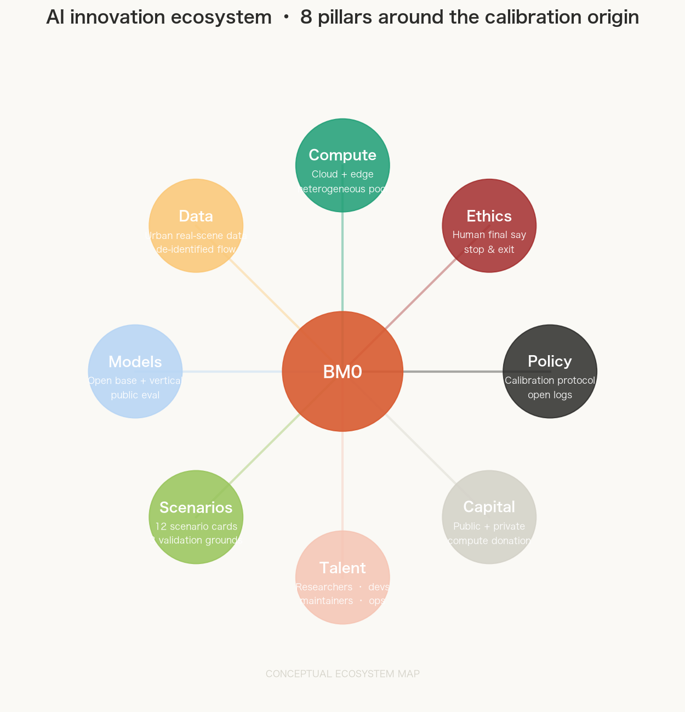
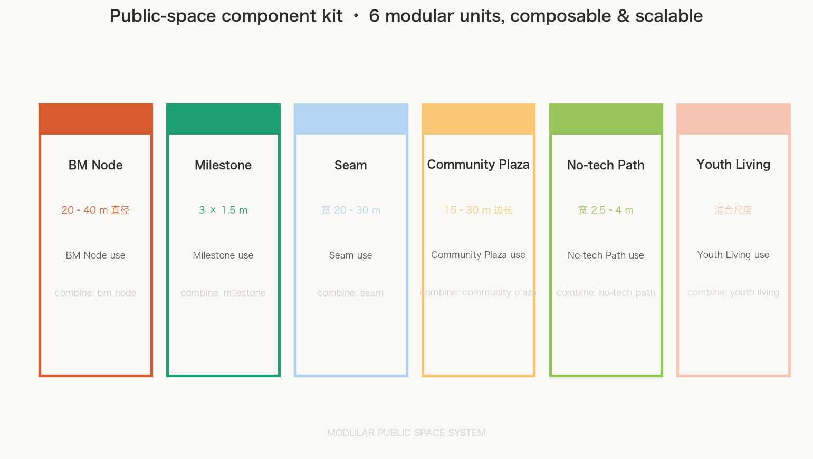

# BM0 · BENCHMARK ZERO

**THE GROUND TRUTH.** The mark is **BM0**, the standard railway notation for a bench mark plus its number: it is simultaneously a surveying term, a machine-learning term, and a place you can stand on. This proposal has a single claim — **everywhere else ranks models; this place measures reality**. Most benchmarks today run in a lab or in the cloud; if calibrating AI under real streets, real weather, real older adults, and real failures is a testable hypothesis worth developing, Jing-Zhang offers itself as one sample site for that hypothesis. This proposal does not claim that the hypothesis has been verified, nor that the design is the only one of its kind anywhere on the planet [source:AGENT-TASKBOOK] [standard:PROJECT-AGENT-OPEN-CALL-TASKBOOK].

Why must "here" be Jing-Zhang and not any science park? Because the Jing-Zhang railway was China's first trunk line built through **autonomous survey and autonomous datum setting**: before laying a single rail, Zhan Tianyou had to establish the measurement base of this land — finding a line that could climb the steep Guan'gou slope (the switchback), and building an elevation system of its own (the bench marks). **Setting the datum is the benchmark; the divergence is the switch.** The five-step engineering chain "survey — set datum — diverge — trial — maintain" is not decorative rhetoric; it was the construction sequence of Jing-Zhang itself, and this proposal translates it verbatim into the operating sequence of a city.[source:OFFICIAL-ANNOUNCEMENT] [standard:PROJECT-OFFICIAL-ANNOUNCEMENT]


## Design Basis and Source Inventory

The primary basis is the "Centennial Jing-Zhang AI Innovation Belt International Urban Design Call for Proposals" pre-qualification announcement issued by the Haidian Branch of the Beijing Municipal Commission of Planning and Natural Resources, with the taskbook, enums, planning limits and source registry in `brief/site-package/` as machine-readable basis [source:OFFICIAL-ANNOUNCEMENT] [source:AGENT-TASKBOOK]. The proposal separates facts from design suggestions from items awaiting professional confirmation: verifiable facts carry evidence, design judgments carry intent, and gaps read "to be completed when official data arrives" — no plausible-looking parameter is used to manufacture certainty.

The organiser has not yet released an official precise polygon. This proposal uses the repository's clearly marked provisional boundary `SITE-001` and the three key areas, all flagged `provisional_constraint` with `official_boundary=false` [source:BOUNDARY-SOURCE] [data:geometry/site_boundary.geojson#SITE-001]. They serve concept generation, spatial review and self-check only; they are not an official redline, an approval basis, or a basis for precise areas. When official geometry arrives, all nine layers, every metric, the figures and the PDFs must be recomputed from the boundary as a whole [depth:risk_missing_data]. This organiser-side data gap does not itself block content scoring.

The site is a narrow north-south corridor, roughly 1.4 km wide and 9.7 km long, with a width-to-length ratio of about 0.14 — about seven times longer than wide [metric:corridor_width_m] [metric:corridor_length_m] [metric:corridor_linearity_ratio]. **This 1:7 linear form is the physical precondition for the Y-shaped (switchback) structure** — it can only occur on a rail corridor, on land pressed long and narrow by history. Copied onto any square science-park plot, the structure fails (site-anchor argument: see [assumptions:A-SITE-ANCHOR-001]).

## Three-Level Scope Framework

The coordinated research area answers "how Haidian organises research, industry, public services and global collaboration into a sustainable calibration system"; the overall design area answers "how an 11.41 km² corridor becomes a continuous system through one walkable green axis plus a set of callable calibration nodes"; the three key areas answer "how a calibration ground makes, reviews, first-uses and retires an AI product in a concrete place" [depth:three_level_scope_framework]. The three levels are not three unrelated circles but three scales of one Y [depth:overall_spatial_structure].

**The Y (the switchback) is the single motif running through all three levels.** It comes directly from the Qinglongqiao engineering solution of the Jing-Zhang railway and is exactly the topology of the taskbook's "three areas and two wings":

```
          Zhongzhiyuan ●  (Y north end · make & verify / Leg A)
                       ╲
                        ╲  datum line: results return for review
                         ╲
  Zhongguancun service wing ────●──── junction BM0: AI Origin community (ask & set standards)
  (global factor allocation)     ╱
                                ╱  return line: calibrated results go south
                               ╱
          Dazhongsi ●  (Y south end · launch & first use / Leg B)
```

One main corridor — the central green axis — is the trunk of the Y; the junction sits mid-site at the Beijing AI Origin community [data:geometry/key_areas.geojson#PROV-KEY-002]; one leg runs north to Zhongzhiyuan (0, make from zero), one leg runs south to Dazhongsi (!, public launch). **The semantics of the switchback is a round trip**: an AI product's journey is not one-way but "ask → make → return to the origin for review → launch to the south", ending back at the origin to revise the standard with real-environment calibration results. It is the same movement as the Qinglongqiao train — "climb up, back down, climb again" (site-anchor argument: see [assumptions:A-SITE-ANCHOR-001]).

The three positionings, five functions and three-areas-two-wings of the taskbook are not parallel slogans but a closed loop joined by one Y. The table below maps each item (the "positioning–function–areas-wings" master table) [source:AGENT-TASKBOOK] [standard:PROJECT-AGENT-OPEN-CALL-TASKBOOK]:

| Level | Taskbook requirement | BM0 spatial–operational response | Verifiable output |
| --- | --- | --- | --- |
| Positioning | Centennial Jing-Zhang cultural belt | Central axis = Jing-Zhang heritage park calibration greenway; BM milestones at sleeper rhythm | Heritage narrative, open archive, year-round public life [data:geometry/green_space.geojson#GREEN-C-S3] |
| Positioning | Urban AI life experience belt | Central hard public band + neighbourhood squares; residents can enter, choose, exit | Daily AI experience, no-AI baseline routes [data:geometry/public_space.geojson#PUB-EDGE-S2W] |
| Positioning | AI-integrated innovation belt | Y ends: ask (origin) → make (Zhongzhiyuan) → launch (Dazhongsi) | From world questions to open prototypes to city premieres [metric:benchmark_node_count] |
| Function | AI full-stack autonomous innovation | Zhongzhiyuan calibration court: benchmark grounds for models, chips, hardware, embodied systems | Full-stack validation, open evaluation [metric:industry_validation_scenario_count] |
| Function | World-class AI innovation ecosystem | Origin open review: open-source collaboration, global hosting, youth life | Ecosystem-case mechanisms, developer community [metric:ecosystem_case_count] |
| Function | AI+ scenario empowerment paradigm | Xiaoyuehe empowerment wing + real-life scenes on the axis | Open question calls, real-environment feedback [data:geometry/roads.geojson#ROAD-LOOP] |
| Function | Intelligent AI vibrant city | Dazhongsi launch court: AI-native market, cultural shows, global launch week | AI-native formats, year-round event rhythm [data:geometry/buildings.geojson#BLDG-DZS-A] |
| Function | Global voice in AI governance | Whole-line public maintenance log: who tested, how, is it verifiable | Human final authority, stop conditions, public records [standard:GENERATIVE-AI-INTERIM-MEASURES] |
| Area | Beijing AI Origin community | Y junction BM0: ask & set calibration standards | World-class AI innovation ecosystem [data:geometry/key_areas.geojson#PROV-KEY-002] |
| Area | Zhongzhiyuan AI acceleration area | Leg A: make & verify | Full-stack autonomous innovation and AI governance [data:geometry/key_areas.geojson#PROV-KEY-001] |
| Area | Dazhongsi AI industry cluster | Leg B: launch & first use | AI-native new formats [data:geometry/key_areas.geojson#PROV-KEY-003] |
| Wing | Zhongguancun technology service wing | Outer rail: talent, capital, compute, data, professional uplink | Factor allocation, Zhongguancun IP and capital enablement |
| Wing | Xiaoyuehe scenario empowerment wing | Inner rail: residents, students, visitors, real-life downlink | Scenario empowerment and intelligent AI vibrant city |

### Regional Collaboration Master Table (conceptual suggestions, not concluded agreements)

The taskbook explicitly requires collaboration with Beiwei community, Future Science City, Huairou Science City, Beijing E-Town and the Beijing–Tianjin–Hebei region. The table below defines only **negotiable public interfaces**; it fabricates no agreement, route, procurement, investment or settled policy. Each row's exchange object, direction and trigger condition is a conceptual suggestion for professional teams and the named parties to deepen [source:AGENT-TASKBOOK] [depth:three_level_scope_framework]:

| Partner | Exchange object | Direction | Trigger condition | Evidence status |
| --- | --- | --- | --- | --- |
| Beiwei community (Beixiaguan) | University knowledge, youth housing, renewal experience | Beiwei → Origin: talent and scenes; Origin → Beiwei: open review and events | When a Beiwei renewal project enters concept deepening | Public background material, no agreement [source:SOURCE-REGISTRY] |
| Future Science City | Big-science facilities, energy & materials frontier, supercompute | Future Science City → Zhongzhiyuan: hard-tech supply; Zhongzhiyuan → Future Science City: AI scenes and validation demand | When either side opens AI-oriented joint topics | Public background material, no agreement |
| Huairou Science City | Basic science, national labs, original innovation | Huairou → Origin: source questions; Origin → Huairou: open evaluation and benchmark demand | When a public benchmark topic is scoped | Public background material, no agreement |
| Beijing E-Town | Smart manufacturing, EV & robotics production, scene operation | E-Town → Dazhongsi: production and supply chain; Dazhongsi → E-Town: AI-native formats and premiere demand | When the embodied-intelligence safety ground moves from pilot to production validation | Public background material, no agreement |
| Beijing–Tianjin–Hebei | City-cluster scenes, data-flow pilots, industrial gradient | Cluster → belt: real scenes and data; belt → cluster: calibration standards and public logs | When regional data-flow pilots or scene-open lists are released | Public background material, no agreement |

## Coordinated Research Area: Industry and Future-City Study

The industry positioning is not "build another AI park" but "connect Haidian's existing universities, open-source maintainers, enterprises and public-service operators into **one public calibration institution**" [depth:overall_spatial_structure]. The five-step engineering chain becomes the industry logic directly:

- **Survey**: open problem calls are the "measurement" — learn what AI still does badly in the real city;
- **Set datum**: at BM0, make the definition of "done well" public and verifiable — that is the benchmark;
- **Diverge**: route products to the Zhongzhiyuan / Origin / Dazhongsi branches as "make — review — first use";
- **Trial**: run in the three calibration grounds and real environments, with humans keeping final authority;
- **Maintain**: the public maintenance log accumulates as a public knowledge asset, letting failure be seen, reviewed and improved.

Seven global cases are used only for **auditable mechanisms**; no case's form, brand or imagery is copied [source:AGENT-TASKBOOK] [metric:ecosystem_case_count]:

| Case | Transferable mechanism | BM0 placement | Explicitly not copied |
| --- | --- | --- | --- |
| Mila (Montreal) | Open science and ethics community | Origin open review court | Organisational structure and brand |
| Kendall Square (Cambridge) | High-frequency public events drive knowledge diffusion | Central public band year-round event rhythm | Street pattern and density |
| Station F (Paris) | Phased residency and global soft landing | International visitor soft-landing port | Single building and operator |
| Knowledge Quarter (London) | Cross-institution governance and public knowledge | Belt public benchmark governance committee | Governance charter text |
| one-north (Singapore) | Incubator–community coupling | Zhongzhiyuan trial clusters + youth life | Architectural and landscape language |
| Seoul AI Hub (Seoul) | Phased support and outcome conversion | Three-phase validation path across the three areas | Subsidy policy model |
| Ars Electronica (Linz) | Public prototyping and art–tech dialogue | Dazhongsi launch court + sound field | Event brand and exhibitions |

## Overall Design Area: Renewal at Regulatory-Detail Urban Design Depth

The overall design area is structured on the central green axis, with five bands laterally [data:geometry/land_use.geojson] [depth:land_use_layout]:

| Band | Share of width | Main function | Land-use code | BM0 role |
| --- | --- | --- | --- | --- |
| West living band | 31% | Residential, community service, education | 0701/0702/0804 | Daily urban-life interface [data:geometry/land_use.geojson#LU-WS2] |
| Axis public west band | 1.5% | Hard public activity | 1403 | Public edge of the calibration greenway [data:geometry/public_space.geojson#PUB-EDGE-S2W] |
| Axis green corridor | 31.2% | Park green | 1401 | Trunk of the Y; BM milestone route [data:geometry/green_space.geojson#GREEN-C-S3] |
| Axis public east band | 4.6% | Hard public activity | 1403 | Public edge of the calibration greenway [data:geometry/public_space.geojson#PUB-EDGE-S2E] |
| East innovation band | 31.7% | Research, retail, office | 0802/0901/0902 | Innovation, validation and launch interface |

The land-use partition is cut from the same provisional boundary, covering it completely with no gaps and no overlaps, and neighbouring polygons share cut-line coordinates [metric:land_use_cell_count]. Green space and public space are constructed to be disjoint (public space is differenced from green space), so the green ratio and the public-space ratio never double-count [metric:green_public_disjoint]. Buildings are expressed as conceptual prototypes and constitute neither approved buildings, retain/renovate/demolish conclusions, nor red lines [depth:height_massing_character] [depth:retain_renovate_demolish]. FAR, building height and total floor area stay `unknown` because regulatory plans and height controls are not yet released — a compliance behaviour, not a missing deliverable [depth:development_intensity_controls] [metric:floor_area_ratio].

## Detailed Design of the Three Key Areas

The three key areas correspond to the three ends of the Y; each answers "how a calibration ground operates in a concrete place" [depth:three_key_area_detailed_design] [data:geometry/key_areas.geojson]:

**Zhongzhiyuan AI autonomous acceleration area (Leg A · make & verify)** [data:geometry/key_areas.geojson#PROV-KEY-001]
The calibration court is a real-environment benchmark ground for embodied intelligence and hardware: models, chips, robotic arms, low-speed robots and autonomous shuttles face real weather, real crowds and real failures. Every system under test is configured with six elements — a plain human baseline, a minimal data boundary, a responsible role, a stop condition, a 64-day review and an exit path [metric:industry_validation_scenario_count]. The test ground is open on all sides and is an ordinary park outside test hours.

**Beijing AI Origin community (Y junction BM0 · ask & set standards)** [data:geometry/key_areas.geojson#PROV-KEY-002]
The BM0 origin plaza is where calibration standards are born: the public problem board, open evaluation, red-team review and open-source collaboration all begin here. A zero bench-mark monument stands here — a physical datum point that can be touched, stood on and photographed. Standards are not set behind closed doors by experts; they are publicly questioned on this plaza, reviewed by residents, and revised version by version. The plaza has no tickets, is crossable, and remains usable on non-event days [metric:landmark_count].

**Dazhongsi AI industry cluster (Leg B · launch & first use)** [data:geometry/key_areas.geojson#PROV-KEY-003]
The launch court carries "product premieres": calibrated prototypes make their first public appearance to the real city here, hosting the global launch week, the AI-native market and cultural shows. The bell of the Yongle Great Bell is translated into a sound-field motif for "announcing a calibration result" — when a calibration completes, the bell rings, and both results and failures are made public.

## AI Innovation Ecosystem, Talent Profiles and AI+ Scenarios

### The Calibration Protocol: a minimum contract for every scenario

Every AI scenario must pass the "seven questions of the calibration protocol" before going live: ①who is served; ②what minimal data is used; ③what is the plain human baseline (how the task is done without AI); ④who is accountable; ⑤what is the stop condition; ⑥is it reviewed within 64 days; ⑦where is the exit path [standard:GENERATIVE-AI-INTERIM-MEASURES] [standard:BARRIER-FREE-ENVIRONMENT-LAW] [depth:ai_scenarios_governance]. None of the seven may be missing, and the answers are public.

### 12 AI Scenario Cards (each: subject—place—data—human review—exit—operation—metric)

| Card | Scenario | Served | Place | Minimal data | Human review | Exit condition | Operator | Metric |
| --- | --- | --- | --- | --- | --- | --- | --- | --- |
| SC-01 | Accessibility calibration | Wheelchair & vision-impaired users | Central public band [data:geometry/public_space.geojson#PUB-EDGE-S2W] | On-site obstacle detection, no imagery kept | No-AI baseline + user review | Deactivate after 3 consecutive errors | Public-service operator | Passage success rate |
| SC-02 | Embodied-robot safety ground | Robotics firms & citizens | Zhongzhiyuan calibration court [data:geometry/public_space.geojson#PUB-ZZY] | In-fence sensor data | Manual e-stop + perimeter safety officer | Stop when braking distance exceeds threshold | Zhongzhiyuan operator | Braking distance / avoidance |
| SC-03 | Open model public evaluation | Model developers | Origin review court | Public problem board, no private data | Human review before results publish | Stop when method is opaque | Origin council | Public evaluation rounds |
| SC-04 | Low-speed autonomous shuttle | Commuting students & residents | Axis greenway [data:geometry/roads.geojson#ROAD-TRUNK] | Route localisation, no face retention | Safety officer on board until acceptance | Stop on any incident | Rail-feeder operator | Punctuality / incidents |
| SC-05 | Elderly assistance | Older adults living alone or with limited mobility | West living band community centre [data:geometry/land_use.geojson#LU-WS3] | Service-request type only | Never overrides medical judgment | Transfer to human when the elder is unwell | Community centre | Service response time |
| SC-06 | AI legal navigation | Residents & startups | East innovation band service hall | Question-category only | Conclusions reviewed by a licensed professional | Transfer to human for litigation | Public legal service | Handover-to-human rate |
| SC-07 | Youth AI workshop | Students & families | Central public band + education land [data:geometry/land_use.geojson#LU-WS4] | Anonymised work data | Teacher present throughout | Take down out-of-scope content | Education department | Workshop coverage |
| SC-08 | Open-source maintainer residency | Global open-source developers | Origin open review court | Public project data | Maintainer self-governance | Community vote to exit | Developer community | Residency cohorts |
| SC-09 | Open city problem call | All citizens | BM0 origin plaza | De-identified suggestion text | Council human review | Remove malicious content | Origin council | Adoption rate |
| SC-10 | Night vitality & walk safety | Night users | Central public band, south | Crowd statistics only, no individual recognition | Police-linked review | Downgrade lighting on anomaly | Street office | Night visits |
| SC-11 | No-device public routes | All citizens | All public space | No data collection | Naturally human | No exit needed (no-AI by default) | Municipal maintenance | No-device route share |
| SC-12 | International visitor soft landing | International innovators | Dazhongsi launch court [data:geometry/public_space.geojson#PUB-DZS] | Industry & stay purpose only | Human reception primary | Delete on privacy request | International attraction team | Landing conversions |

### 3 Industry Test and Validation Scenarios (first batch)

| Ground | Validates | Acceptance threshold (conceptual) | Deactivation threshold |
| --- | --- | --- | --- |
| TV-1 Accessibility human–machine coexistence | Usability of wheelchairs/guide devices on real streets | 90 consecutive incident-free days and user satisfaction ≥80% | Any safety incident |
| TV-2 Open model public evaluation | Public performance on the real problem board | Transparent method + verifiable results + 3+ models | Opaque method or data contamination |
| TV-3 Embodied-intelligence safety ground | Safe coexistence of low-speed robots and people | Braking & avoidance pass + 100% available manual e-stop | Braking exceeds threshold or e-stop fails |

### 8 User Personas

Researchers/algorithm engineers, open-source maintainers, startup teams, international visiting innovators, residents and older adults, children and carers, accessibility users, and public-service operators. The first four are "people who come to do cool things"; the last four are "daily people who call this home" [metric:persona_count] — and the first principle of the calibration protocol is: **daily people are neither data feedstock nor test occupancy**; outside event hours, every calibration ground returns to being an ordinary usable public space.

### AI Innovation Ecosystem — 8 Pillars



The eight pillars are not a parallel resource list but a collaborative network orbiting the BM0 calibration origin. Compute and data form the underlying infrastructure; models and scenarios are the objects and sites of calibration; talent and capital are mobile production factors; policy and ethics are non-negotiable boundary conditions. Every pillar's接入 to BM0 follows the calibration protocol: it must answer the seven questions, and it has a clear exit path [metric:ecosystem_pillar_count].

| Pillar | BM0 Interface | Calibration-protocol constraint |
| --- | --- | --- |
| Compute | Zhongzhiyuan edge pool + cloud heterogeneous scheduling | Test compute isolated; released outside event hours |
| Data | Urban real-scene data, de-identified flow | Minimum-data principle; no biometric retention |
| Models | Origin-community public evaluation board | Transparent method; 3+ models required |
| Scenarios | 12 scenario cards + 3 validation grounds | Human final say; stop conditions defined |
| Talent | Open-source residency + international soft landing + local ops | Community self-governance; vote to exit |
| Capital | Public finance + private capital + compute donation | No irreversible commitment; acceptance thresholds public |
| Policy | Belt public-benchmark governance committee | No settled agreement claimed; only negotiable interfaces |
| Ethics | Human final say + stop condition + exit path | Every scenario retains a no-AI baseline path by default |

## Land Use, Building Scale and Retain/Renovate/Demolish

The land-use partition completely covers the provisional boundary, with a green ratio of 33.1% and a public-space ratio of 12.9%, both recomputed from the submitted geometry in EPSG:4548 (the organiser has not yet released an official polygon; full recalculation is required when official data arrives) — and this high publicness **has a conceptual basis**: BM0 calibrates AI in the real urban environment, so the largest possible share must go to genuinely enterable public space [metric:green_ratio] [metric:public_space_ratio]. Buildings are expressed as 10 conceptual prototypes for the three functional clusters and block infill, with a footprint of 379,000 m², a design-model value only [metric:building_footprint_area_sqm] [metric:building_count]. No parcel-level retain/renovate/demolish conclusion is drawn: this proposal only suggests spatial strategies conceptually (e.g. publicisation along the axis, open ground floors); actual retention, renovation, demolition and new build must follow professional heritage, ownership and engineering surveys [depth:retain_renovate_demolish]. **Note**: no cross-proposal comparison is claimed, and no claim is made that the proposal is higher than any external field median.

## Transport, Rail, Municipal and Public-Service Facilities

The transport strategy puts "seaming" first: the corridor is not a wall splitting east from west but an axis joining both sides. Five east–west seaming passages cross the axis, all with accessible continuity [data:geometry/roads.geojson#ROAD-X1] [depth:traffic_rail_slow_parking]; north–south travel runs on the calibration greenway as the slow-traffic trunk, with low-speed shuttles connecting rail stations to the three calibration grounds [data:geometry/roads.geojson#ROAD-TRUNK]. Municipal and new infrastructure follow "institution first, hardware second": power and data networks support temporary power isolation for reversible pilots [depth:municipal_new_infrastructure]. Rail, utility lines and energy-load engineering estimates fall outside this conceptual proposal and remain "for professional deepening".

## Blue-Green Space, Public Space and Urban Character

The central green corridor is a continuous park running the full length of the site — the trunk of the Y and the carrier of the BM milestones: 64 conceptual milestone markers at sleeper rhythm, recording "what was calibrated here, by whom, and with what result" [metric:milestone_marker_count]. The public-space system has three levels: BM nodes (origin plaza, Zhongzhiyuan calibration court, Dazhongsi launch court plus two milestone plazas) [metric:benchmark_node_count], the central public band, and neighbourhood squares [data:geometry/public_space.geojson]. The character language borrows Jing-Zhang engineering aesthetics — track, switch, sleeper, milestone, bench mark — not glass curtain walls and neon: **the technology layer is replaceable; the public skeleton lasts a century** [depth:blue_green_public_space] [metric:landmark_count].

### Public-Space Component Kit



BM0 public space is not a fixed place designed once and for all, but a modular component system that is composable, replaceable and scalable. Six modules correspond to the different scales of the Y's three ends and two wings; each module has a defined size range, applicable scene and combination logic [depth:public_space_component_kit] [metric:public_space_module_count]:

| Module | Scale | Applicable scene | Combination logic |
| --- | --- | --- | --- |
| BM Node | 20–40 m diameter | Origin plaza, calibration court, launch court | Anchored at the three ends of the Y; immovable |
| Milestone | 3 × 1.5 m | Along the axis greenway | 150 m spacing, sleeper rhythm; add/remove |
| Seam | 20–30 m wide | East–west crossings of the axis | 5 fixed locations; width adjustable |
| Community Plaza | 15–30 m side | West living-band blocks | Embedded; number expandable |
| No-tech Path | 2.5–4 m wide | All public space along the belt | Default existence; width adapts to site |
| Youth Living | Mixed scale | East innovation-band ground floor | Coupled with building ground floor; functions swappable |

The component-kit design principle: **the technology layer is replaceable; the public skeleton lasts a century**. Replacing any single module must not shake the overall framework of the Y structure and the calibration protocol.

## Renewal Project List, Implementation Policy and Phasing

### Project packages (each with responsibility, preconditions, resource interfaces, acceptance & deactivation thresholds, phase dependency)

| Package | Responsible role (conceptual) | Preconditions | Resource interface | Acceptance threshold | Deactivation threshold | Phase |
| --- | --- | --- | --- | --- | --- | --- |
| P1 BM0 origin plaza & zero bench-mark monument | Origin council + professional team | Ownership confirmation, heritage assessment | Public finance + social capital | Accessibility acceptance + public review pass | Heritage or safety veto | Phase 1 |
| P2 Calibration protocol & public problem board | Origin council + developer community | Pilot authorisation | Open data + volunteer experts | 3 real problems live and answered | Data leak | Phase 1 |
| P3 Embodied-intelligence safety ground | Zhongzhiyuan operator + safety officers | Safety assessment, insurance | Park + test firms | E-stop 100% available + 90 incident-free days | Any safety incident | Phase 1/2 |
| P4 Open model public evaluation | Open-source maintainers + review court | Public evaluation method | Compute donation + volunteer evaluation | 3+ models participate | Opaque method | Phase 1/2 |
| P5 Five east–west seaming passages | Street office + municipal professionals | Traffic-impact assessment | District renewal funding | Accessibility acceptance pass | Safety veto | Phase 2 |
| P6 Axis green corridor & 64 milestones | Landscape department + professionals | Heritage-protection assessment | Park programme + sponsorship | Corridor continuous + bilingual milestones live | Heritage damage | Phase 2 |
| P7 Dazhongsi launch court & sound field | Dazhongsi operator + commercial team | Business planning, ownership confirmation | Social capital | Launch-week pilot success | Nuisance or safety incident | Phase 3 |
| P8 International soft-landing port | International attraction team + operator | Service agreement | Residency space + legal | First international team lands | Service breach | Phase 3 |
| P9 Public maintenance log & annual review | Belt operator + audit | Data-governance system | Public platform | Annual public log released | Record distortion | All phases |

### Phasing and conversion path

- **Phase 1 · Set datum** (Origin community): institution first, landmark second. P1/P2 lead, placing the institutional outcome "standards made public" ahead of any hardware [data:geometry/phasing.geojson#PHASE-1].
- **Phase 2 · Diverge & trial** (Zhongzhiyuan + axis): P3–P6 turn the validation grounds and the green corridor into reversible pilots, trial and repair as you go.
- **Phase 3 · Maintain & launch** (Dazhongsi + whole line): P7–P9 carry premieres, soft landing and long-term operation [data:geometry/phasing.geojson#PHASE-3].

The conversion path is a closed loop: visitor → join the open problem call → enter residency/evaluation → pass calibration → premiere → become part of the maintenance log → attract the next visitor [depth:phasing_implementation] [depth:renewal_project_list]. Every pilot facility has explicit acceptance and deactivation thresholds; there is no "enter-only, never-exit" commitment.

## Indicators, Area Recalculation and Compliance Matrix

The proposal carries 29 metrics: the three formal core visual indicators (area, green ratio, public-space ratio) are `known` and recomputable from the submitted geometry in EPSG:4548, matching the values displayed in `visual/index.html` [metric:site_area_sqm] [metric:green_ratio] [metric:public_space_ratio] [depth:metrics_recalculation]; FAR, building height, total floor area, population served and visitor forecasts stay `unknown` with reasons — they depend on regulatory plans and surveys the organiser has not released [metric:floor_area_ratio] [metric:population_served]. There are 12 scenario cards, 3 validation scenarios, 8 personas, 7 ecosystem cases, 3 pilgrimage landmarks, 64 milestone markers and 3 phases [metric:scenario_card_count] [metric:persona_count] [metric:landmark_count] [metric:phase_count]. Announcement sections 1.3/1.4/1.5 and `agent.1`–`agent.6` are mapped item by item in `compliance_matrix.json`; all 15 formal design-depth items are `complete`.

## Risk, Copyright and Compliance

Every spatial, operational, brand and policy proposition in this proposal is a **conceptual suggestion, reference scheme, or material for professional teams to deepen**; it constitutes no statutory plan, government approval, ownership consent, investment commitment or engineering-feasibility conclusion [source:AGENT-TASKBOOK] [standard:PROJECT-OFFICIAL-ANNOUNCEMENT]. The provisional boundary and low-confidence indicators are flagged prominently here and throughout; full recalculation is required when official data arrives [depth:risk_missing_data]. AI scenarios follow the calibration protocol: minimal data, human review, stop conditions, exit paths; no direct enforcement, diagnosis, welfare-eligibility decision or safety clearance. Fonts, images and generated media are registered with source and rights boundaries (see `sources.json` and `report/copyright_statement.md`); all generated imagery is an explanatory layer, not a claim to be a site photograph, resident opinion or official data.

**On site anchoring (qualitative argument)**: this proposal's core claims rest on three site facts — (1) the Jing-Zhang railway is China's first trunk line built through autonomous survey and datum setting (see the official announcement [source:OFFICIAL-ANNOUNCEMENT]); (2) the site is a 1:7 linear rail corridor, and the Y structure's physical precondition is built on that fact; (3) the three key areas (Zhongzhiyuan / Origin community / Dazhongsi) are named by the taskbook. Moved to any site that does not hold these three facts at once, the claims lose or shift their meaning — this is a narrative argument, not a measured quantity, see [assumptions:A-SITE-ANCHOR-001].

## References

1. Haidian Branch of the Beijing Municipal Commission of Planning and Natural Resources, "Centennial Jing-Zhang AI Innovation Belt International Urban Design Call for Proposals" pre-qualification announcement [source:OFFICIAL-ANNOUNCEMENT]
2. "Excerpt of the Open-Call Taskbook for Global Agents on Centennial Jing-Zhang AI Innovation Belt Urban Design" [source:AGENT-TASKBOOK]
3. `brief/site-package/geometry/provisional_boundaries.geojson` (provisional boundary) [source:BOUNDARY-SOURCE]
4. `brief/site-package/standards/standards.json` and its local reference snapshots [standard:MNR-LAND-USE-CLASSIFICATION-GUIDE]
5. Full sources, standards, assumptions and evidence relations are in `sources.json`, `standard_matrix.json`, `assumptions.json`, `compliance_matrix.json`
