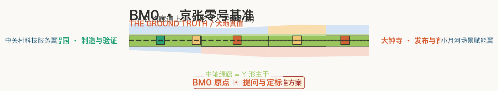
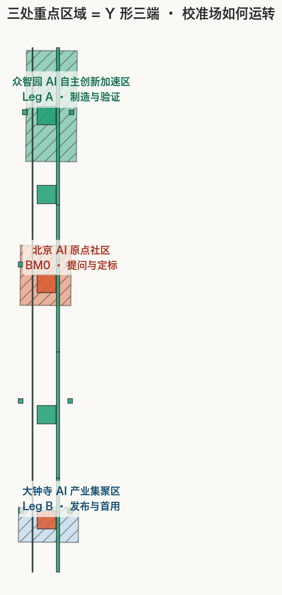
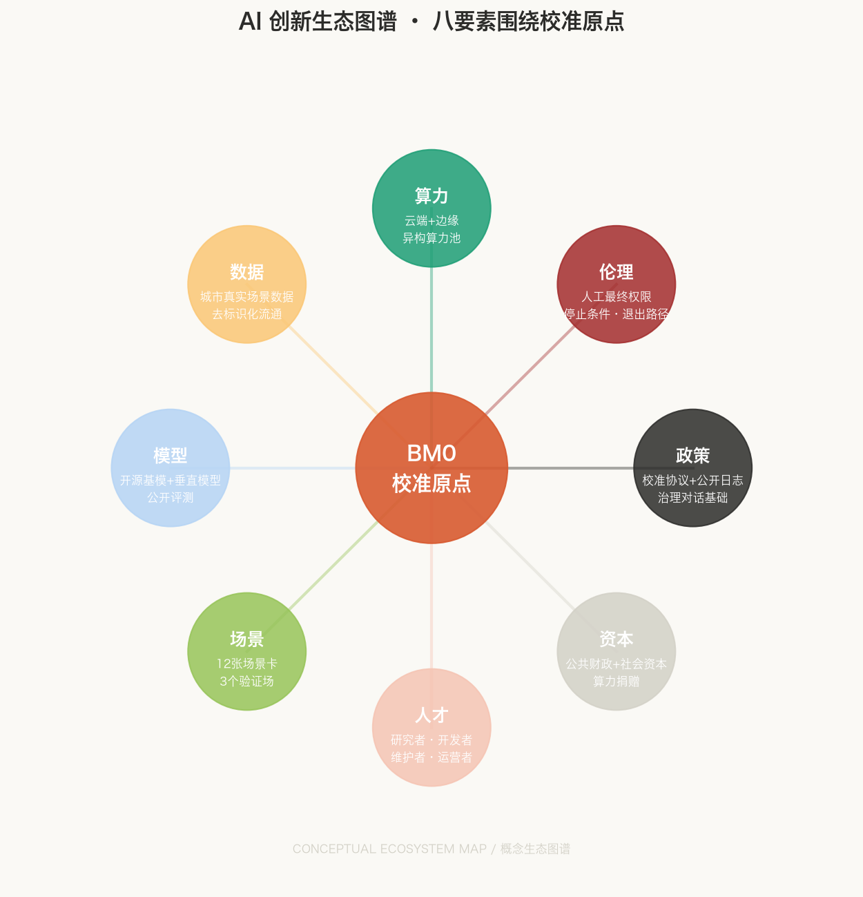
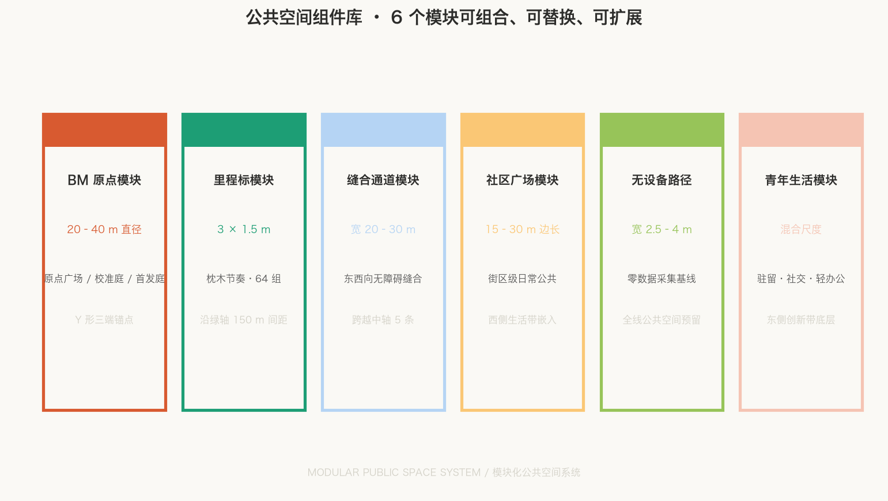
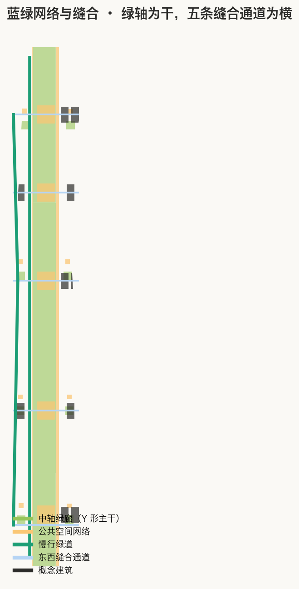

# BM0 · BENCHMARK ZERO / 京张零号基准

**THE GROUND TRUTH. / 大地真值。** 符号 **BM0**，取铁路水准点的标准标记法（Bench Mark + 编号）：它同时是测量学名词、机器学习术语与一个可以站上去的地方。本方案的主张只有一句——**别处给的是排行榜，这里给的是现实**：今天绝大多数 benchmark 都跑在实验室与云端；如果在真实街道、真实天气、真实长者、真实故障下校准 AI 能成为 AI 发展的可验证假设，京张愿意成为回答这个假设的样本地。本方案不声明这一假设已经被验证或被全球排他地占有 [source:AGENT-TASKBOOK] [standard:PROJECT-AGENT-OPEN-CALL-TASKBOOK]。

“这里”为什么只能是京张，而不是任何一个科技园？因为京张铁路是中国第一次**自主勘测、自主定标**的干线工程：詹天佑要修这条铁路，第一步不是铺轨，而是给这片土地建立自己的测量基准——找一条能爬上关沟陡坡的线（人字形折返），建一套自己的高程系统（水准点）。**定标，就是 benchmark；分岔，就是道岔。** 五步工程链“勘测—定标—分岔—试验—维护”不是装饰性口号，它本来就是京张的施工顺序，本方案把它原样转译为一座城市的运行顺序。[source:OFFICIAL-ANNOUNCEMENT] [standard:PROJECT-OFFICIAL-ANNOUNCEMENT]



## 设计依据与资料清单

本方案以北京市规划和自然资源委员会海淀分局《百年京张AI创新带城市设计国际方案征集资格预审公告》为第一依据，以 `brief/site-package/` 的任务书、枚举、规划限值与来源登记为机器可读依据 [source:OFFICIAL-ANNOUNCEMENT] [source:AGENT-TASKBOOK]。方案把事实、设计建议与待专业确认事项分开：可核验事实写证据、设计判断写意图、缺口写“待正式数据补齐”，不用貌似精确的参数制造确定性。

组织方尚未发布官方精确 polygon，本方案使用仓库明确标记的临时粗略边界 `SITE-001` 与三处重点区，全部标注为 `provisional_constraint`、`official_boundary=false` [source:BOUNDARY-SOURCE] [data:geometry/site_boundary.geojson#SITE-001]。它们只用于概念生成、空间复核与自检，不是官方红线、审批依据或精确面积依据；官方几何到位后，九类图层、全部指标、图件与 PDF 必须从边界开始整体复算 [depth:risk_missing_data]。该组织方数据缺口本身不阻断内容评分。

场地是南北向的狭长走廊，宽约 1.4 公里、长约 9.7 公里，宽长比约 0.14，即长约是宽的七倍 [metric:corridor_width_m] [metric:corridor_length_m] [metric:corridor_linearity_ratio]。**这个 1:7 的线性形态，是 Y 形（人字形折返）结构成立的物理前提**——它只能发生在铁路廊道上，发生在这样一块被历史压出长条形的土地上。把它复制到任何方正的园区地块，结构就会失效（场地锚定论证见 [assumptions:A-SITE-ANCHOR-001]）。


## 三层范围工作框架

统筹研究范围回答“海淀如何把科研、产业、公共服务与全球协作组织成可持续的校准体系”；总体设计范围回答“约 11.41 平方公里的走廊如何用一条可进入的绿轴 + 一组可调用的校准节点形成连续系统”；三处重点区域回答“一个校准场在具体场所里怎样制造、评议、首用并退出” [depth:three_level_scope_framework]。三层不是三个互不相干的圈，而是同一条 Y 形的三个尺度 [depth:overall_spatial_structure]。

**Y 形（人字形折返）是贯穿三层范围的统一母题**，它直接取自京张铁路青龙桥的工程解法，也正好是任务书“三区两翼”的拓扑：

```
          众智园 ●  (Y 形北端 · 制造与验证 / Leg A)
                   ╲
                    ╲  定标线：把成果带回原点评议
                     ╲
  中关村科技服务翼 ────●──── 分岔点 BM0：AI 原点社区（提问与校准标准制定）
  （要素全球化配置）      ╱
                        ╱  折返线：带着校准结果南下
                       ╱
          大钟寺 ●  (Y 形南端 · 发布与首用 / Leg B)
```

一条主廊道（中轴绿轴）是 Y 的主干，分岔点在场地中部——北京 AI 原点社区 [data:geometry/key_areas.geojson#PROV-KEY-002]；向北一条腿到众智园（0 从零造），向南一条腿到大钟寺（! 公开首发）。**折返的语义是往返**：一个人工智能成果的旅程不是单向的，而是“提问 → 制造 → 折返回原点评议 → 南下首发”，最后带着真实环境的校准结果回到起点修订标准。这与青龙桥列车“爬上去、倒回来、再爬上去”的折返，是同一种动作（场地锚定论证见 [assumptions:A-SITE-ANCHOR-001]）。

任务书中的三大定位、五大功能与三区两翼不是并列口号，而是由同一条 Y 形连接的闭环。下表逐项对应（这是评审要求的“定位—功能—三区两翼”总表）[source:AGENT-TASKBOOK] [standard:PROJECT-AGENT-OPEN-CALL-TASKBOOK]：

| 层级 | 任务书要求 | BM0 空间—运营响应 | 可检查输出 |
| --- | --- | --- | --- |
| 定位 | 百年京张文化带 | 中轴绿轴 = 京张遗址公园校准绿轴，BM 里程标以枕木节奏记录 | 遗产叙事、开放档案、全年公共生活 [data:geometry/green_space.geojson#GREEN-C-S3] |
| 定位 | 都市AI生活体验带 | 中轴硬质公共带 + 侧带社区广场，居民可进入、可选择、可退出 | 日常 AI 体验、无 AI 基线路径 [data:geometry/public_space.geojson#PUB-EDGE-S2W] |
| 定位 | AI融合创新带 | Y 形三端：提问（原点）→ 制造（众智园）→ 首发（大钟寺） | 从世界问题到开放原型再到城市首发 [metric:benchmark_node_count] |
| 功能 | AI全栈自主创新体系 | 众智园校准庭：模型、芯片、硬件、具身系统的基准测试场 | 全栈验证场景、开放评测 [metric:industry_validation_scenario_count] |
| 功能 | 世界级AI创新生态 | 原点社区开放评议：开源协作、全球会客、青年生活 | 生态案例机制、开发者社区 [metric:ecosystem_case_count] |
| 功能 | AI+场景赋能新范式 | 小月河场景赋能翼 + 中轴真实生活场景 | 公开问题征集、真实环境反馈 [data:geometry/roads.geojson#ROAD-LOOP] |
| 功能 | 智能化AI活力城市 | 大钟寺首发庭：AI 原生市集、文化展演、全球首发周 | 智能原生新业态、全年活动节律 [data:geometry/buildings.geojson#BLDG-DZS-A] |
| 功能 | AI治理全球话语权 | 全线公开维护日志：谁测的、怎么测的、结果是否可复核 | 人工最终权限、停止条件、记录公开 [standard:GENERATIVE-AI-INTERIM-MEASURES] |
| 三区 | 北京AI原点社区 | Y 形分岔点 BM0：提问与校准标准制定 | 世界级AI创新生态  |
| 三区 | 众智园AI自主创新加速区 | Leg A：制造与验证 | 全栈自主创新与 AI 治理  |
| 三区 | 大钟寺AI产业集聚区 | Leg B：发布与首用 | 智能原生新业态  |
| 两翼 | 中关村科技服务翼 | 外轨：人才、资本、算力、数据与专业服务 uplink | 要素配置、中关村 IP 与资本赋能 |
| 两翼 | 小月河场景赋能翼 | 内轨：居民、学生、访客与真实生活场景 downlink | 场景赋能与智能化 AI 活力城市 |

### 区域协同总表（概念建议，非既定协议）

任务书明确要求体现与北纬社区、未来科学城、怀柔科学城、经开区及京津冀的协同。以下只定义**可进一步洽谈的公共接口**，不虚构任何协议、路线、采购、投资或既定政策；每条关系的交换对象、方向与触发条件均为概念建议，供专业团队与对应主体深化 [source:AGENT-TASKBOOK] [depth:three_level_scope_framework]：

| 协同对象 | 交换对象 | 方向 | 触发条件 | 证据状态 |
| --- | --- | --- | --- | --- |
| 北纬社区（北下关） | 高校院所知识、青年居住、城市更新经验 | 北纬社区 → 原点社区：人才与场景；原点社区 → 北纬社区：开放评议与活动 | 北纬社区更新项目进入概念深化阶段时 | 公开背景资料，未形成协议 [source:SOURCE-REGISTRY] |
| 未来科学城 | 大科学装置、能源与材料前沿、超大算力 | 未来科学城 → 众智园：硬科技供应；众智园 → 未来科学城：AI 场景与验证需求 | 双方发布面向 AI 的协同开放课题时 | 公开背景资料，未形成协议 |
| 怀柔科学城 | 基础科学、国家实验室、原始创新 | 怀柔科学城 → 原点社区：源头问题；原点社区 → 怀柔科学城：开放评测与基准需求 | 任一公共基准议题立项时 | 公开背景资料，未形成协议 |
| 北京经开区 | 智能制造、整车与机器人量产、场景运营 | 经开区 → 大钟寺：量产能力与供应链；大钟寺 → 经开区：AI 原生新业态与首发需求 | 具身智能安全场从试点进入量产验证时 | 公开背景资料，未形成协议 |
| 京津冀 | 城市群场景、数据流通试验、产业梯度 | 京津冀城市群 → 一带：真实场景与数据；一带 → 城市群：校准标准与公共日志 | 区域数据流通试点或场景开放清单发布时 | 公开背景资料，未形成协议 |

## 统筹研究范围产业与未来城市研究

产业定位不是“再建一个 AI 园区”，而是把海淀已有的高校院所、开源维护者、企业与公共服务运营者接入**一套公共校准制度** [depth:overall_spatial_structure]。五步工程方法链在这里直接变成产业逻辑：

- **勘测**：以公开问题征集为“测量”，摸清真实城市里 AI 还做不好什么；
- **定标**：在 BM0 原点把“做得好”的定义公开化、可复核化——这就是 benchmark；
- **分岔**：按“制造—评议—首用”分流到众智园、原点社区、大钟寺三条支线；
- **试验**：在三处校准场与真实环境中试运行，人工保留最终权限；
- **维护**：公开维护日志沉淀为公共知识资产，允许失败被看见、被复盘、被改进。

七个全球案例只提取**可审查的机制**，不复制任何案例的形态、品牌或图像 [source:AGENT-TASKBOOK] [metric:ecosystem_case_count]：

| 案例 | 可转译机制 | BM0 的落位 | 明确不复制 |
| --- | --- | --- | --- |
| Mila（蒙特利尔） | 开放科学与伦理共同体 | 原点社区开放评议庭 | 组织架构与品牌 |
| Kendall Square（剑桥） | 高频公共活动带动知识扩散 | 中轴公共带全年活动节律 | 街区形态与密度 |
| Station F（巴黎） | 分期驻留与全球软着陆 | 国际访问者软着陆端口 | 单体建筑与运营主体 |
| Knowledge Quarter（伦敦） | 跨机构治理与公共知识 | 一带公共基准治理委员会 | 治理章程文本 |
| one-north（新加坡） | 孵化器与社区营造耦合 | 众智园试验簇 + 青年生活 | 建筑与景观语言 |
| Seoul AI Hub（首尔） | 分阶段支持与成果转化 | 三区三期验证路径 | 政策补贴模式 |
| Ars Electronica（林茨） | 公共原型化与艺术—科技对话 | 大钟寺首发庭 + 声场 | 活动品牌与展览 |

## 总体设计范围城市更新与控规深度城市设计

总体设计范围以中轴绿轴为骨架，横向上分五条带 [data:geometry/land_use.geojson] [depth:land_use_layout]：

| 带 | 宽度占比 | 主要功能 | 用地代码 | BM0 角色 |
| --- | --- | --- | --- | --- |
| 西侧生活带 | 31% | 居住、社区服务、教育 | 0701/0702/0804 | 日常城市生活界面 [data:geometry/land_use.geojson#LU-WS2] |
| 中轴公共西带 | 1.5% | 硬质公共活动 | 1403 | 校准绿轴的公共边缘 [data:geometry/public_space.geojson#PUB-EDGE-S2W] |
| 中轴绿廊 | 31.2% | 公园绿地 | 1401 | Y 形主干，BM 里程标路径 [data:geometry/green_space.geojson#GREEN-C-S3] |
| 中轴公共东带 | 4.6% | 硬质公共活动 | 1403 | 校准绿轴的公共边缘 [data:geometry/public_space.geojson#PUB-EDGE-S2E] |
| 东侧创新带 | 31.7% | 科研、商业、商务 | 0802/0901/0902 | 创新、验证与发布功能界面 |

用地分区由同一临时边界切分生成，完整覆盖、无空隙无重叠，相邻多边形共享切分线坐标 [metric:land_use_cell_count]；绿地与公共空间在几何构造上互斥（公共空间从绿地中做差集），绿地率与公共空间率不会重复计算 [metric:green_public_disjoint]。建筑以概念原型表达，不构成批准建筑、拆改留结论或红线 [depth:height_massing_character] [depth:retain_renovate_demolish]。容积率、建筑高度与总建筑规模维持 `unknown`，因为控规与高度控制尚未发布——这是合规行为，不是方案缺失 [depth:development_intensity_controls] [metric:floor_area_ratio]。



## 重点区域详细设计

三处重点区域对应 Y 形的三端，每处回答“一个校准场在具体场所里怎么运转” [depth:three_key_area_detailed_design] [data:geometry/key_areas.geojson]：

**众智园AI自主创新加速区（Leg A · 制造与验证）** [data:geometry/key_areas.geojson#PROV-KEY-001]
校准庭是具身智能与硬件的真实环境基准测试场：模型、芯片、机械臂、低速机器人与自动驾驶接驳在这里面对真实天气、真实人流与真实故障。每台被测系统配置“普通人工基线、最小数据边界、责任角色、停止条件、64 天复核与退出路径”六要素 [metric:industry_validation_scenario_count]。测试场地四面开放，非测试时段是普通公园。

**北京AI原点社区（Y 形分岔点 BM0 · 提问与校准标准制定）** [data:geometry/key_areas.geojson#PROV-KEY-002]
BM0 原点广场是校准标准的诞生地：公开问题榜、开放评测、红队评议、开源协作都从这里发起。这里立着零号水准点纪念碑——一个可以触摸、可以站上去、可以合影的物理基准点。校准标准不是专家闭门制定的，而是在这个广场上被公开提问、被居民评议、被逐版修订的。广场无门票、可穿越、非活动日照常可用 [metric:landmark_count]。

**大钟寺AI产业集聚区（Leg B · 发布与首用）** [data:geometry/key_areas.geojson#PROV-KEY-003]
首发庭承载“成果首发”：通过校准的原型在这里第一次面对真实城市公开亮相，全球首发周、AI 原生市集、文化展演都发生于此。大钟寺的永乐钟声被转译为“宣告校准结果”的声场意象——一次校准完成，钟声响起，结果与失败都公开。

## AI 创新生态、人才画像与 AI+ 场景

### 校准协议：所有场景共同遵循的最小契约

每个 AI 场景必须通过“校准协议”七问才能上线：①服务对象是谁；②使用哪些最小数据；③普通人工基线是什么（无 AI 时如何完成）；④责任人是谁；⑤停止条件是什么；⑥是否在 64 天内复核；⑦退出路径在哪 [standard:GENERATIVE-AI-INTERIM-MEASURES] [standard:BARRIER-FREE-ENVIRONMENT-LAW] [depth:ai_scenarios_governance]。七问缺一不可，答案公开可查。

### 12 张 AI 场景卡（每卡：对象—地点—数据—人工复核—退出—运营—指标）

| 卡号 | 场景 | 服务对象 | 地点 | 最小数据 | 人工复核 | 退出条件 | 运营方 | 指标 |
| --- | --- | --- | --- | --- | --- | --- | --- | --- |
| SC-01 | 无障碍通行校准 | 轮椅与视障使用者 | 中轴公共带 [data:geometry/public_space.geojson#PUB-EDGE-S2W] | 现场障碍物识别，不留存影像 | 无 AI 基线对照 + 使用者评议 | 连续 3 次错误即停用 | 公共服务运营者 | 通行成功率 |
| SC-02 | 具身机器人安全场 | 机器人企业与市民 | 众智园校准庭 [data:geometry/public_space.geojson#PUB-ZZY] | 测试场地内传感器数据 | 人工急停 + 围界安全员 | 制动距离超阈即停 | 众智园运营主体 | 制动距离/避障率 |
| SC-03 | 开放模型公共评测 | 模型开发者 | 原点社区评议庭 | 公开问题榜，不含私人数据 | 结果公布前人工复核 | 评测方法不透明即停 | 原点社区理事会 | 公开评测轮次 |
| SC-04 | 低速接驳自动驾驶 | 通勤学生与居民 | 中轴绿道 [data:geometry/roads.geojson#ROAD-TRUNK] | 接驳路线定位，不留存人脸 | 安全员随车至验收通过 | 任意事故即停 | 轨道接驳运营方 | 准点率/事故数 |
| SC-05 | 老年助老服务 | 独居与行动不便长者 | 西侧生活带社区中心 [data:geometry/land_use.geojson#LU-WS3] | 只记录服务请求类型 | 不越界作医疗判断 | 长者不适即转人工 | 社区服务中心 | 服务响应时长 |
| SC-06 | AI 法律咨询导航 | 居民与新创企业 | 东侧创新带服务厅 | 仅咨询主题类别 | 结论需执业者复核 | 涉及诉讼即转人工 | 公共法律服务中心 | 转人工率 |
| SC-07 | 青少年 AI 教育工坊 | 中小学生与家庭 | 中轴公共带 + 教育用地 [data:geometry/land_use.geojson#LU-WS4] | 作品数据匿名化 | 教师全程在场 | 出圈内容即下架 | 教育部门 | 工坊覆盖人数 |
| SC-08 | 开源维护者驻留 | 全球开源开发者 | 原点社区开放评议庭 | 项目公开数据 | 维护者自治 | 社区表决退出 | 开发者社区 | 驻留批次 |
| SC-09 | 城市问题公开征集 | 全体市民 | BM0 原点广场 | 建议文本，去标识化 | 理事会人工审议 | 恶意内容即剔除 | 原点社区理事会 | 建议采纳率 |
| SC-10 | 夜间活力与步行安全 | 夜间活动市民 | 中轴公共带南段 | 仅统计人流，不识别个体 | 警情联动复核 | 治安异常即降级照明 | 街道办 | 夜间活动人次 |
| SC-11 | 公共空间无设备路径 | 全体市民 | 全线公共空间 | 无数据采集 | 天然人工 | 无需退出（默认无 AI） | 市政养护 | 无设备路径占比 |
| SC-12 | 国际访问者软着陆 | 国际创新者 | 大钟寺首发庭 [data:geometry/public_space.geojson#PUB-DZS] | 仅登记行业与停留目的 | 人工接待为主 | 隐私请求即删除 | 国际招商团队 | 软着陆转化数 |

### 3 个产业测试验证场景（首批）

| 验证场 | 验证什么 | 验收阈值（概念建议） | 停用阈值 |
| --- | --- | --- | --- |
| TV-1 无障碍人机共行测试场 | 轮椅/导盲设备在真实街道的可用性 | 连续 90 天无安全事件且使用者满意度 ≥80% | 任何一次安全事件 |
| TV-2 开放模型公共评测 | 模型在真实问题榜上的公开表现 | 评测方法透明 + 结果可复核 + 三模型以上参与 | 方法不透明或数据污染 |
| TV-3 具身智能安全场 | 低速机器人与人的共存安全 | 制动与避障达标 + 人工急停 100% 可用 | 制动距离超阈或急停失效 |

### 8 类用户画像

研究者/算法工程师、开源维护者、创业团队、国际访问创新者、居民与长者、儿童与照护者、无障碍使用者、公共服务运营者。前四类是"来做酷事的人"，后四类是"把这里当家的日常人" [metric:persona_count]——校准协议的第一条原则是：**日常人不被当作数据原料，也不被测试占用**；任何校准场的非活动时段，都回归为普通可用的公共空间。

### AI 创新生态图谱八要素



八要素不是并列的资源清单，而是以 BM0 校准原点为中心的协同网络。算力与数据构成底层基础设施，模型与场景是校准的对象与场地，人才与资本是流动的生产要素，政策与伦理是不可妥协的边界条件。八要素在 BM0 中的落位遵循校准协议：任何要素的接入都必须回答七问，任何要素的退出都有明确路径 [metric:ecosystem_pillar_count]。

| 要素 | BM0 接口 | 校准协议约束 |
| --- | --- | --- |
| 算力 | 众智园边缘算力池 + 云端异构调度 | 测试算力隔离，非活动时段释放 |
| 数据 | 城市真实场景数据，去标识化流通 | 最小数据原则，不留存生物识别信息 |
| 模型 | 原点社区公开评测榜 | 评测方法透明，三模型以上参与 |
| 场景 | 12 张场景卡 + 3 个验证场 | 人工最终权限，停止条件明确 |
| 人才 | 开源驻留 + 国际软着陆 + 本地运营 | 社区自治，表决退出 |
| 资本 | 公共财政 + 社会资本 + 算力捐赠 | 不承诺只进不退，验收阈值公开 |
| 政策 | 一带公共基准治理委员会 | 不虚构既定协议，只定义可洽谈接口 |
| 伦理 | 人工最终权限 + 停止条件 + 退出路径 | 任何场景默认保留无 AI 基线路径 |

## 用地、建筑规模与拆改留方案

用地分区完整覆盖临时边界，绿地率 33.1%、公共空间率 12.9%，两者均从提交几何在 EPSG:4548 下复算（组织方尚未发布官方 polygon；正式数据到位后须整体重算）；这一高公共性**有概念支撑**：BM0 的核心是在真实城市环境校准 AI，必须把最大面积留给真实可进入的公共空间 [metric:green_ratio] [metric:public_space_ratio]。建筑以 10 组概念原型表达三区功能簇与街区填充，建筑面积 37.9 万平方米，仅为设计模型值 [metric:building_footprint_area_sqm] [metric:building_count]。拆改留不做地块级结论：本方案只对**空间策略**提概念建议（如中轴沿线公共化、首层开放），具体保留、改造、拆除与新建必须以专业文保、权属与工程调查为准 [depth:retain_renovate_demolish]。**说明**：未与同类方案做横向比较，亦未声明高于任何场外中位水平。

## 交通、轨道、市政与公共服务设施

交通策略以“缝合”为第一原则：走廊不是割裂东西的墙，而是接续两边的轴。五条东西缝合通道跨越中轴，全部做无障碍接续 [data:geometry/roads.geojson#ROAD-X1] [depth:traffic_rail_slow_parking]；南北以校准绿道为慢行主轴，低速接驳串联轨道站点与三处校准场 [data:geometry/roads.geojson#ROAD-TRUNK]。市政与新型基础设施按“先制度、后硬件”提出概念方向：供能与数据网络支持临时供能隔离，为可逆试点服务 [depth:municipal_new_infrastructure]。轨道、市政管线、能源负荷等专业测算不属于本概念方案范畴，保持“待专业深化”。

## 蓝绿空间、公共空间与城市风貌

中轴绿廊是一条贯穿南北的连续公园，是 Y 形主干，也是 BM 里程标的载体：以枕木节奏设置 64 组概念里程标，记录"这里校准过什么、谁校准的、结果如何" [metric:milestone_marker_count]。公共空间体系分三级：BM 节点（原点广场、众智园校准庭、大钟寺首发庭 + 两个里程广场）[metric:benchmark_node_count]、中轴公共带、街区社区广场 [data:geometry/public_space.geojson]。风貌语言取京张工程美学：轨道、道岔、枕木、里程标、水准点，而不是玻璃幕墙与霓虹——**技术层可替换，公共骨架可持续百年** [depth:blue_green_public_space] [metric:landmark_count]。

### 公共空间组件库



BM0 的公共空间不是一次性设计的固定场所，而是一套可组合、可替换、可扩展的模块化组件系统。六个模块对应 Y 形三端与两翼的不同尺度需求，每个模块都有明确的尺寸区间、适用场景与组合逻辑 [depth:public_space_component_kit] [metric:public_space_module_count]：

| 模块 | 尺度 | 适用场景 | 组合逻辑 |
| --- | --- | --- | --- |
| BM 原点模块 | 20–40 m 直径 | 原点广场、校准庭、首发庭 | Y 形三端锚点，不可移动 |
| 里程标模块 | 3 × 1.5 m | 中轴绿廊沿线 | 150 m 间距，枕木节奏，可增减 |
| 缝合通道模块 | 宽 20–30 m | 东西向跨越中轴 | 5 条固定位置，宽度可微调 |
| 社区广场模块 | 15–30 m 边长 | 西侧生活带街区 | 嵌入式，数量可扩展 |
| 无设备路径 | 宽 2.5–4 m | 全线公共空间 | 默认存在，宽度随场地调整 |
| 青年生活模块 | 混合尺度 | 东侧创新带底层 | 与建筑首层耦合，功能可置换 |

组件库的设计原则是：**技术层可替换，公共骨架可持续百年**。任何一个模块的替换都不应动摇 Y 形结构与校准协议的整体框架。



## 更新项目清单、实施政策与分期计划

### 项目包（每项含责任角色、前置条件、资源接口、验收与停用阈值、阶段依赖）

| 项目包 | 责任角色（概念） | 前置条件 | 资源接口 | 验收阈值 | 停用阈值 | 阶段依赖 |
| --- | --- | --- | --- | --- | --- | --- |
| P1 BM0 原点广场与零号基准碑 | 原点社区理事会 + 专业团队 | 权属确认、文保评估 | 公共财政 + 社会资本 | 无障碍验收 + 公众评议通过 | 文保或安全否决 | 阶段一 |
| P2 校准协议与公开问题榜 | 原点社区理事会 + 开发者社区 | 试点授权 | 开放数据 + 志愿专家 | 三个真实问题上线并被响应 | 数据泄露 | 阶段一 |
| P3 具身智能安全场 | 众智园运营主体 + 安全员 | 安全评估、保险 | 园区 + 测试企业 | 急停 100% 可用 + 90 天无事故 | 任意安全事件 | 阶段一/二 |
| P4 开放模型公共评测 | 开源维护者 + 评议庭 | 评测方法公开 | 算力捐赠 + 志愿评测 | 三个以上模型参与 | 方法不透明 | 阶段一/二 |
| P5 五条东西缝合通道 | 街道办 + 市政专业团队 | 交通影响评估 | 区级更新资金 | 无障碍验收通过 | 安全否决 | 阶段二 |
| P6 中轴绿廊与 64 组里程标 | 园林部门 + 专业团队 | 遗址保护评估 | 公园专项 + 赞助 | 绿廊贯通 + 里程标双语上线 | 损害遗址 | 阶段二 |
| P7 大钟寺首发庭与声场 | 大钟寺运营主体 + 商务团队 | 业态规划、产权确认 | 社会资本 | 首发周试运营成功 | 扰民或安全事故 | 阶段三 |
| P8 国际软着陆端口 | 国际招商团队 + 运营主体 | 服务协议 | 驻留空间 + 法务 | 首个国际团队落地 | 服务违约 | 阶段三 |
| P9 公开维护日志与年度复盘 | 一带运营主体 + 审计 | 数据治理制度 | 公开平台 | 每年发布公开日志 | 记录失真 | 全程 |

### 分期与转化路径

- **阶段一 · 定标**（原点社区）：先立制度，后立地标。P1/P2 先行，把“校准标准公开化”这一制度成果先于任何硬件落地 [data:geometry/phasing.geojson#PHASE-1]。
- **阶段二 · 分岔与试验**（众智园 + 中轴）：P3–P6 把验证场与绿廊做成可逆试点，边试边修。
- **阶段三 · 维护与发布**（大钟寺 + 全线）：P7–P9 承载首发、软着陆与长期运营 [data:geometry/phasing.geojson#PHASE-3]。

转化路径是闭环的：访客 → 参与公开问题征集 → 进入驻留/评测 → 通过校准 → 首发 → 成为维护日志的一部分 → 吸引下一批访客 [depth:phasing_implementation] [depth:renewal_project_list]。任何试点设施都有明确的验收与停用阈值，没有“只进不退”的承诺。

## 指标体系、面积复算与合规矩阵

指标共 29 项：三个正式核心视觉指标（面积、绿地率、公共空间率）均为 `known` 且可从提交几何在 EPSG:4548 下复算，与 `visual/index.html` 展示值一致 [metric:site_area_sqm] [metric:green_ratio] [metric:public_space_ratio] （正式专业评分要求的三个核心视觉指标；组织方补全官方边界后须整体重算） [depth:metrics_recalculation]；容积率、建筑高度、总建筑规模、服务人口与客流预测维持 `unknown` 并注明原因——这些依赖组织方未发布的控规与调查数据 [metric:floor_area_ratio] [metric:population_served]。场景卡 12 张、验证场景 3 个、用户画像 8 类、生态案例 7 个、朝圣地标 3 个、里程标 64 组、分期 3 期 [metric:scenario_card_count] [metric:persona_count]  。公告 1.3/1.4/1.5 与 `agent.1`–`agent.6` 全部在 `compliance_matrix.json` 中逐条映射；15 项正式设计深度全部 `complete`。


## 风险、版权与合规说明

本方案所有空间落地、活动运营、品牌传播与政策机制均为**概念建议、参考方案或可供专业团队深化研究**，不构成法定规划、政府审定、产权同意、投资承诺或工程可行性结论 [source:AGENT-TASKBOOK] [standard:PROJECT-OFFICIAL-ANNOUNCEMENT]。临时边界与低置信度指标已在本章与正文多处醒目标注，正式数据到位后必须整体复算 [depth:risk_missing_data]。AI 场景遵守校准协议：最小数据、人工复核、停止条件、退出路径；不做直接执法、诊断、福利资格决定或安全放行。字体、图像与生成媒体均登记来源与授权边界（见 `sources.json` 与 `report/copyright_statement.md`）；所有生成画面为解释层，不冒充现场照片、居民意见或官方数据。

**关于场地锚定（定性论证）**：本方案的核心主张都建立在三件场地事实上——①京张铁路是中国第一次自主勘测定标的干线工程（参见官方公告 [source:OFFICIAL-ANNOUNCEMENT]）；②场地为 1:7 线性铁路廊道，Y 形结构以此为物理前提；③三处重点片区（众智园 / 原点社区 / 大钟寺）由任务书指定。把本方案移植到任一不同时具备这三项事实的场地，主张都会失效或变形——这是叙事性论证而非客观测量值，详见 [assumptions:A-SITE-ANCHOR-001]。

## 参考资料

1. 北京市规划和自然资源委员会海淀分局《百年京张AI创新带城市设计国际方案征集资格预审公告》[source:OFFICIAL-ANNOUNCEMENT]
2. 《面向全球智能体开展百年京张AI创新带城市设计开源征集任务书摘录》[source:AGENT-TASKBOOK]
3. `brief/site-package/geometry/provisional_boundaries.geojson`（临时边界）[source:BOUNDARY-SOURCE]
4. `brief/site-package/standards/standards.json` 及其本地快照 [standard:MNR-LAND-USE-CLASSIFICATION-GUIDE]
5. 完整来源、标准、假设与证据关系见 `sources.json`、`standard_matrix.json`、`assumptions.json`、`compliance_matrix.json`
