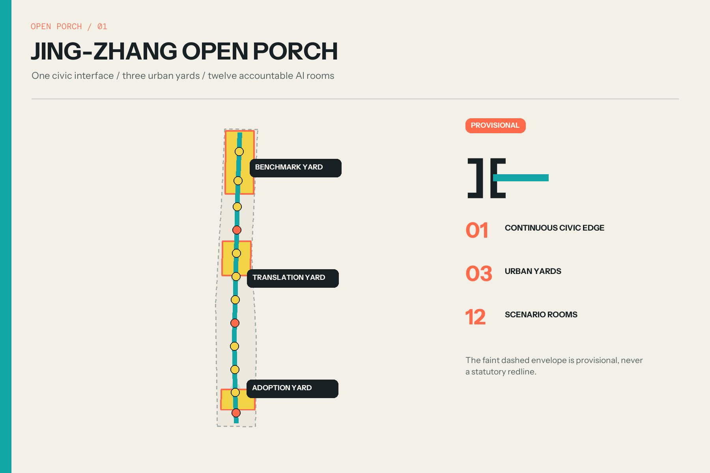
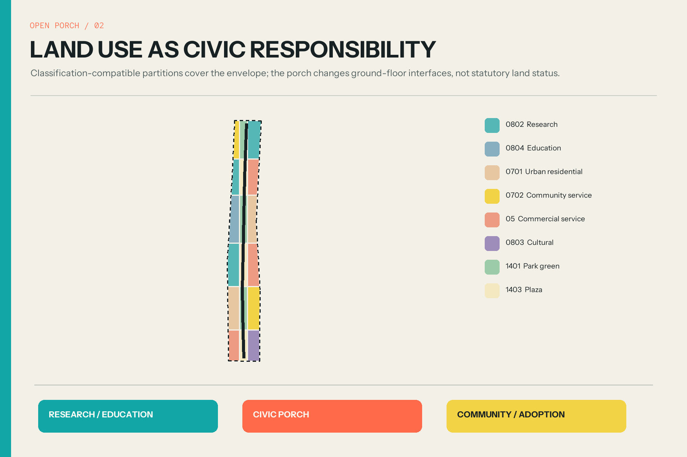
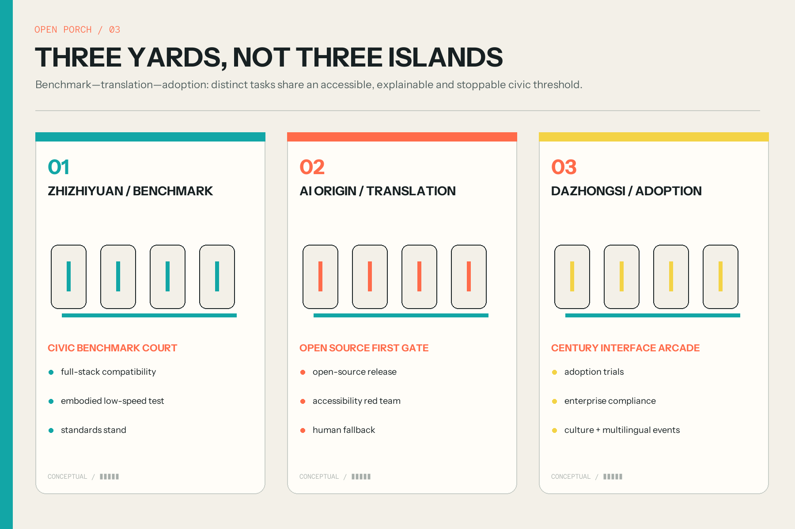
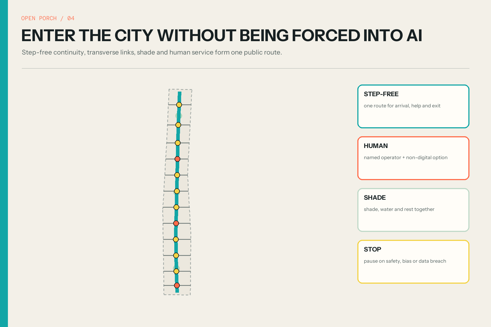
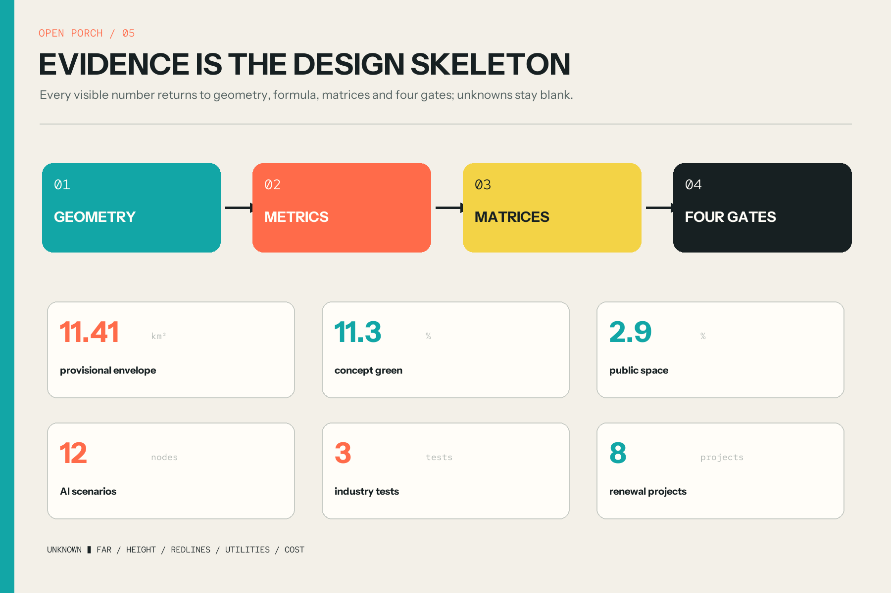

# JING-ZHANG OPEN PORCH / 京张敞廊

> One civic interface, three urban yards, twelve accountable AI rooms. All space is conceptual; provisional geometry is not a redline.

## Design Basis and Source List

The controlling basis is the official open-call announcement, the cleared agent taskbook and the repository site package. The announcement defines three scales, three key areas and required depth; the taskbook adds six agent responsibilities; the site package supplies validation schemas, enums and source-use rules. Facts, recommendations and unknown conditions are separated across `sources.json`, the professional matrices and `assumptions.json`. [source:OFFICIAL-ANNOUNCEMENT] [standard:PROJECT-OFFICIAL-ANNOUNCEMENT]

The overall and key-area polygons available to the public are maintainer-derived approximations. They remain `official_boundary=false` and serve only as a temporary generation and review envelope. The recomputed 11.41 km² is the area of that provisional polygon, not a statutory redline. Repository issue #846 also records a context gap with mapped heritage-park information, so the proposal makes no exact heritage, ownership, road or engineering claim. [source:BOUNDARY-SOURCE] [source:ISSUE-846]

The graphic language makes evidence confidence visible: faint dashed lines for provisional context, teal for a conceptual public interface, coral for entry or review thresholds, and yellow for temporary events. Global precedents contribute mechanisms only; no third-party images, dimensions or planning controls are reused. [source:SOURCE-REGISTRY] [depth:existing_conditions_diagnosis]

## Three-Level Scope Framework

The three scopes are one chain of decisions. The coordinated research area asks what urban interfaces an AI ecosystem needs. The overall design area converts that answer into land use, walking, blue-green space, reference massing, projects and phases. The three key areas test whether the proposal can actually be used by technical teams, residents and operators. Each scale has narrative, geometry, metrics and a recalculation trigger. [depth:three_level_scope_framework] [data:geometry/site_boundary.geojson#PROV-SITE-001]

At the strategic scale, the north, middle and south zones become a benchmark yard, translation yard and adoption yard; west and east wings provide enterprise services and civic test settings. At the design scale, only the provisional 11.4 km²-class envelope receives generated geometry. At the detailed scale, only the three disclosed approximate key-area polygons are used. This prevents background narratives from being promoted into precise control boundaries. [source:BEIJING-THREE-ZONES-TWO-WINGS] [data:geometry/key_areas.geojson#PROV-KEY-001]

One porch, three yards and twelve rooms connect the scales. Every room exposes who operates a service, what data it needs, who reviews consequential output, when it stops and how a person completes the same task without AI. [standard:PROJECT-AGENT-OPEN-CALL-TASKBOOK] [metric:scenario_node_count]

## Coordinated Research Area: Industry and Future City Research

Six cases provide complementary mechanisms: work-live-play-learn and community building at one-north; active ground floors and public-space accountability at Kendall Square/Volpe; district conversion linked to innovation clustering at 22@; membership and knowledge access at Knowledge Quarter London; legible program zones at STATION F; and research-to-adoption services at MaRS. Their shared lesson is that an innovation district depends on a visible translation layer, not only a concentration of laboratories. [source:CASE-ONE-NORTH] [source:CASE-KENDALL] [source:CASE-22AT]

The proposal turns that lesson into a Porch Protocol. An innovation first reaches the northern benchmark yard for compatibility, safety and standards explanation; it then enters the central translation yard for plain-language, accessibility and human-fallback testing; only then can a small, reversible real-world trial enter the southern adoption yard. Every crossing produces a named operator, a public notice, a term and a stop condition. [source:CASE-KQ] [source:CASE-STATIONF] [source:CASE-MARS]

The west service wing connects policy, legal, compute, finance and talent support. The east scenario wing connects neighborhoods, green space and public services. The Open Porch is their low-threshold meeting ground, tested against six personas rather than an idealized “tech talent” archetype. [depth:overall_spatial_structure] [metric:global_case_count]

## Overall Design Area: Urban Renewal and Regulatory-Plan-Level Urban Design

Within the provisional envelope, the package generates a gap-free classification-compatible land-use partition, one continuous walking line, twelve transverse interfaces, a blue-green edge, twelve porch rooms, reference massing and three implementation phases. Partitions are cut on shared edges in EPSG:4548 and inverse-projected, so spatial review can reproduce coverage and overlap results. [data:geometry/land_use.geojson#LU-001] [standard:MNR-LAND-USE-CLASSIFICATION-GUIDE]

The central move is to open doors, not draw another monumental axis. Research, education, housing, community services, commerce, culture, green and plaza uses keep their identity while facing a shared civic ground floor. Transparent test rooms, a human service desk, temporary worktables, shade, a contribution ledger and reversible display bays form a common interface. Building polygons test rhythm only; they are neither an existing-building survey nor confirmed development scale. [data:geometry/buildings.geojson#BLDG-001] [depth:height_massing_character]

The current geometry recomputes about 129.2 ha of landscape function, 33.7 ha of programmed public space and 16.8 ha of reference footprints. FAR, height, setback, redline, service capacity and cost remain unknown. Official geometry and controls must trigger a complete reclip, recalculation and redraw. [metric:green_ratio] [metric:building_coverage_ratio]

## Detailed Design of Key Areas

Zhizhiyuan becomes the Benchmark Yard. Civic Benchmark Court makes full-stack compatibility, low-speed embodied systems, standards work and safety explanations publicly legible without exposing secure research areas. A light canopy connects research entrances, landscape and outward movement. Precise placement waits for the official boundary, ownership and safety zones. [data:geometry/key_areas.geojson#PROV-KEY-001] [depth:three_key_area_detailed_design]

AI Origin becomes the Translation Yard. Open Source First Gate credits verifiable contributions and the first public release of a laboratory result. Projects must pass plain-language explanation, accessibility, data minimization and non-digital alternative tests. Campus, park, neighborhood and transit edges are joined by a step-free porch rather than by a separate VIP facility. [data:geometry/key_areas.geojson#PROV-KEY-002] [standard:BARRIER-FREE-ENVIRONMENT-LAW]

Dazhongsi becomes the Adoption Yard. Century Interface Arcade combines Jing-Zhang narrative, device trials, enterprise compliance support, family-care navigation and multilingual events in reversible bays. The purpose is not a permanent technology showroom but an accessible, comparable and escapable adoption environment around transit and four-quadrant walking links. [data:geometry/key_areas.geojson#PROV-KEY-003] [standard:GENERATIVE-AI-INTERIM-MEASURES]

## AI Innovation Ecosystem, Personas, and AI+ Scenarios

Six personas cover open-source developers, startup/SME teams, corporate and research operators, residents and families, university communities and visitors, and older, disabled or low-digital-literacy users. They are design test cases rather than demographic claims. A civic interface fails if only a fluent technology user can enter, understand and leave it. [metric:persona_count] [source:AGENT-TASKBOOK]

Twelve cards are located at SCN-01 through SCN-12. Three are explicit industry validation settings: the full-stack compatibility bench, low-speed embodied shared-edge test and public-service accessibility red team. The other rooms address release, accessible navigation, human fallback, cultural interpretation, microclimate, adoption, enterprise compliance, family care and multilingual events. [data:geometry/public_space.geojson#SCN-01] [metric:industry_test_scenario_count]

Every card defaults to purpose limitation, minimum data and non-identifying counts. It excludes covert face recognition, ambient recording, fine-grained personal trails, automated diagnosis and credit scoring without a separate lawful basis and review. A named operator reviews consequential output; a non-digital route remains available; safety incidents, unexplained bias, scope breach, failed fallback or public-space obstruction trigger suspension. [standard:GENERATIVE-AI-INTERIM-MEASURES] [source:BARRIER-FREE-LAW]

## Land Use, Building Scale, and Retain-Renovate-Demolish Strategy

Land use employs repository-approved national classification codes for research, education, housing, community service, commercial service, culture, park green and plaza. Scenario labels never replace the land-use code. The narrow middle strip alternates green and plaza functions so the Open Porch cannot be mistaken for a new road parcel or a single-purpose park. [data:geometry/land_use.geojson#LU-007] [standard:MNR-LAND-USE-CLASSIFICATION-GUIDE]

Building polygons are reversible low-rise porch-cluster references. They test the cadence of an open ground floor and scenario rooms; height, floor area, FAR, setback and fire separation are intentionally blank. Retain-renovate-demolish begins with survey: retain cultural, structural and ongoing-use value; lightly renovate appropriate ground floors; discuss removal only after structural, ownership, value and life-cycle review. [data:geometry/buildings.geojson#BLDG-001] [depth:retain_renovate_demolish]

Six components support low-cost iteration: porch canopy, step-free threshold, human-service desk, transparent test cabinet, reversible plug-in bay and contribution ledger. They can begin as events or interior pilots and become permanent only when planning and engineering evidence permits. [metric:building_footprint_area_sqm] [source:CONTROL-DETAILED-PLANNING]

## Transport, Rail, Municipal Infrastructure, and Public Services

One north-south walking line and twelve transverse interfaces organize mobility. Three links emphasize transit context, while the others prioritize walking, cycling and greenway continuity. They are connectivity intentions, not road redlines. Detailed design must verify levels, crossings, ownership, fire access, traffic and station management; step-free continuity means no forced detour, no equipment obstruction and visible human help. [data:geometry/roads.geojson#ROAD-001] [depth:traffic_rail_slow_parking]

Parking supply is not the default intervention. The package prioritizes transit transfer, shared-parking information, orderly cycle parking and event-day management. Low-speed robotics only enters a bounded route after speed, time, human takeover and incident suspension are defined. A person without a smartphone must still reach, ask and leave. [standard:BARRIER-FREE-ENVIRONMENT-LAW] [metric:conceptual_route_length_m]

Municipal and digital infrastructure is reserved but not fabricated. Porch modules allow a disconnectable edge-compute cabinet, visible status light, maintenance face and rainwater learning surface. The proposal draws no invented electricity, telecom, water, drainage or gas network; capacity, fire, security and operations remain discipline reviews. [data:geometry/constraints.geojson#data_gap] [depth:municipal_new_infrastructure]

## Blue-Green Network, Public Space, and Urban Character

The blue-green system is comfort infrastructure, not a background fill. A conceptual continuous shade and sponge strip supports walking and habitat stepping stones, while three larger planted courts host benchmark, translation and adoption activities. Widths and areas are design tests that must respond to utilities, trees, sponge-city engineering and official green controls. [data:geometry/green_space.geojson#GREEN-001] [metric:green_space_area_sqm]

Twelve rounded porch rooms remain smaller than a ceremonial plaza, allowing each scenario to close, move or disappear. Teal marks continuity, coral marks review thresholds and yellow marks temporary events. Warm ivory, charcoal and light metal form a calm base. The urban character is porous and legible, not an exaggerated futurist façade. [data:geometry/public_space.geojson#PUBLIC-001] [standard:MOHURD-URBAN-DESIGN-MEASURES]

Three honor nodes form an AI pilgrimage route: Civic Benchmark Court credits reproducibility; Open Source First Gate credits verifiable contribution; Century Interface Arcade records durable civic adoption. Jing-Zhang history is treated as a public ethic of connection and contribution, not a decorative image source. [metric:landmark_count] [source:ISSUE-846]

## Renewal Projects, Implementation Policy, and Phasing

Eight projects follow a reversible-first sequence. Phase 1 starts the twelve-porch kit, three human-fallback desks and a southern four-quadrant walking study. Phase 2 develops the AI Origin release porch, continuous accessible shade route and transparent test rooms. Phase 3 proceeds with the northern benchmark yard only after official conditions, then establishes the contribution ledger and civic event cycle. [metric:renewal_project_count] [data:geometry/phasing.geojson#PHASE-01]

The recommended implementation instrument is a Scenario Permit plus Civic Interface Agreement. Each pilot states term, operator, data purpose, human review, stop rule, accessible alternative and removal duty. Each porch states opening hours, maintenance, noise and complaints access. Legal planning, construction, procurement and service-compliance procedures remain with authorized parties. [standard:MOHURD-CONTROL-DETAILED-PLANNING] [source:CONTROL-DETAILED-PLANNING]

Long-term operations use four seasons: Open Source First Gate Week in spring, Accessibility and Shade Stress Test in summer, Global Civic AI Interface Forum in autumn, and Century Contribution Ledger Review in winter. Community, developer, accessibility, operator and professional representatives jointly renew scenarios; without review, permission expires. [source:AGENT-TASKBOOK] [depth:phasing_implementation]

## Metrics, Area Recalculation, and Compliance Matrix

Metrics are produced from geometry: provisional site 11412825 m²; conceptual green ratio 0.1132; public-space ratio 0.0295; reference footprint coverage 0.0148; plus three key areas, twelve scenarios, three industry tests, six personas, six global cases, three honor nodes and eight projects. Areas and lengths are calculated in EPSG:4548. [metric:site_area_sqm] [metric:public_space_ratio] [metric:building_coverage_ratio]

Values have three epistemic classes. Site area is known only for the provisional polygon. Green, public space, massing and route metrics are known only for the conceptual design. FAR, height, setback, parking, capacity and investment are unknown. `metrics.json` preserves formula, source files, confidence and assumptions so graphics cannot silently become the source of truth. [depth:metrics_recalculation] [source:SITE-PACKAGE]

The compliance matrix covers announcement clauses 1.3–1.5 and agent.1–agent.6. The standards matrix covers all mandatory sources plus narrow AI-governance and accessibility references. The depth matrix covers all fifteen formal design items. Four blocking gates test deterministic files, topology, offline visualization and professional evidence. [standard:PROJECT-AGENT-OPEN-CALL-TASKBOOK] [depth:risk_missing_data]

## Risk, Copyright, and Compliance

The primary risk is evidence precision: official boundaries, heritage controls, ownership, regulatory controls, road lines, utilities and existing-building surveys are absent. The package responds with an empty official-constraints layer, low confidence, unknown metrics and explicit recalculation triggers. It never fills a missing control with an attractive guess. [source:BOUNDARY-SOURCE] [depth:risk_missing_data]

AI risks are reduced by minimum data, named human review, non-digital alternatives, visible status, term limits and stop rules. These are design recommendations, not legal advice, filing, security assessment or ethics approval. The generative-AI reference is used only within its applicable public-service boundary; human-service obligations are not generalized beyond verified legal contexts. [standard:GENERATIVE-AI-INTERIM-MEASURES] [standard:BARRIER-FREE-ENVIRONMENT-LAW]

Original writing, code-generated diagrams, logo and layouts are submitted under COMMUNITY-DISPLAY-ONLY terms. External sources contribute citation and mechanism analysis, never copied protected imagery. All synthetic or conceptual experience/massing visuals are labeled as non-existing, non-approved and non-committal. [source:SOURCE-REGISTRY] [source:ISSUE-846]

## References

Formal bases include the announcement, agent taskbook, urban design measures, control-detailed-planning measures and land-use guide. Narrow compliance references cover public generative-AI service and accessibility. `sources.json` records publisher, link, retrieval date, use, limitation and reuse status. [source:OFFICIAL-ANNOUNCEMENT] [source:URBAN-DESIGN-MEASURES] [source:LAND-USE-GUIDE]

Mechanism precedents are JTC one-north, Cambridge Kendall Square/Volpe, Barcelona 22@, Knowledge Quarter London, STATION F and MaRS Discovery District. They support public-edge, community, conversion, membership, program-legibility and translation mechanisms only. [source:CASE-ONE-NORTH] [source:CASE-KQ] [source:CASE-MARS]

Reviewable evidence includes nine GeoJSON files, metrics, three matrices, `visual/assets/program.json`, bilingual HTML, A3 booklets and A0 boards. Official geometry must be replaced first, followed by spatial review and the complete four-gate self-check. [data:geometry/site_boundary.geojson#PROV-SITE-001] [metric:key_area_count]
