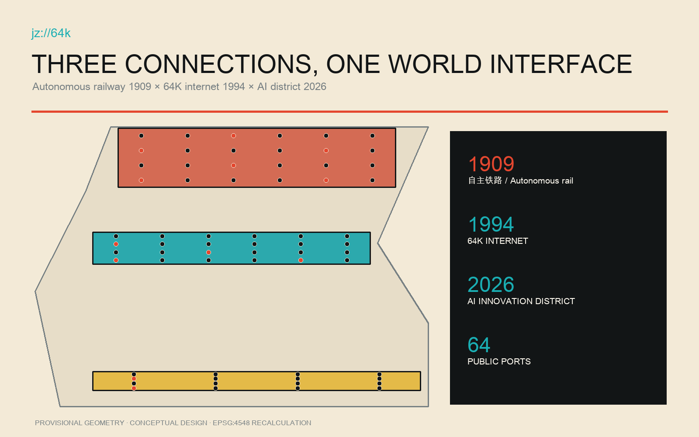
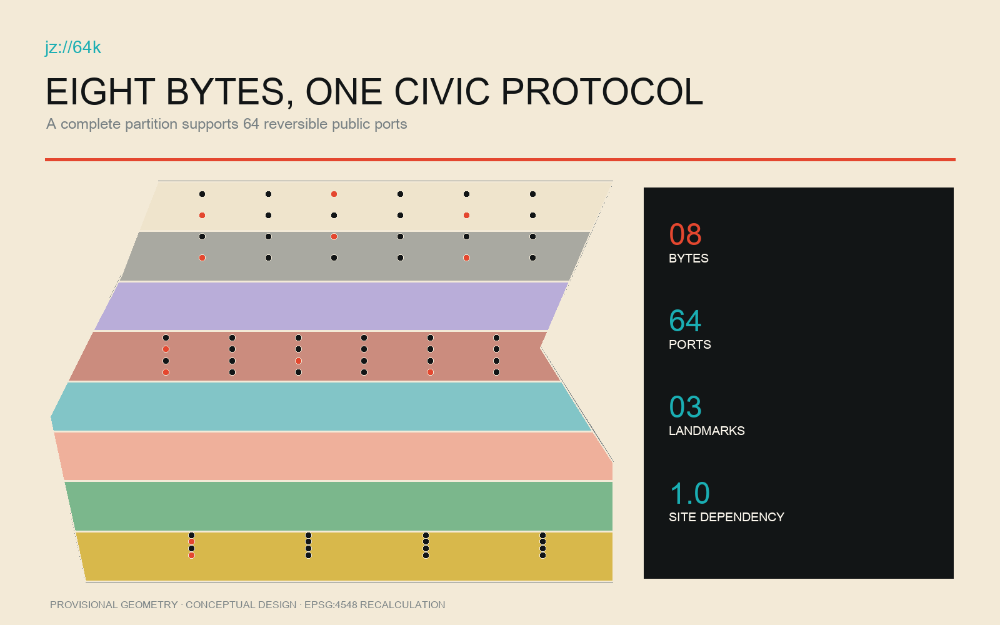
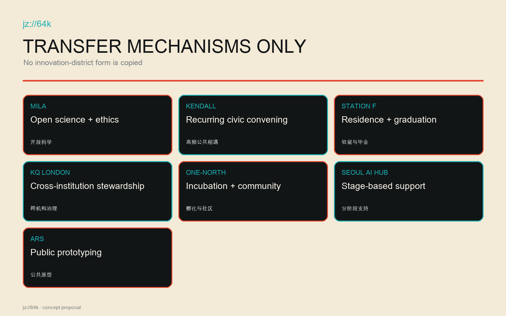
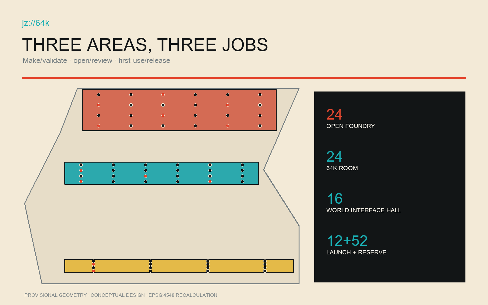
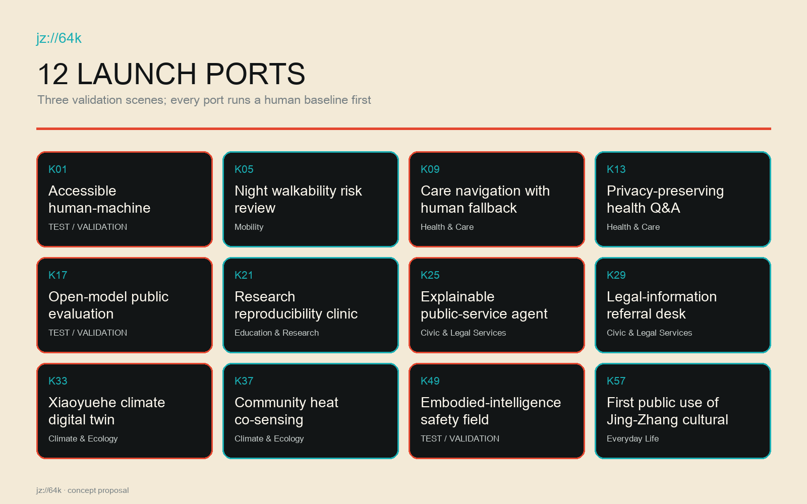
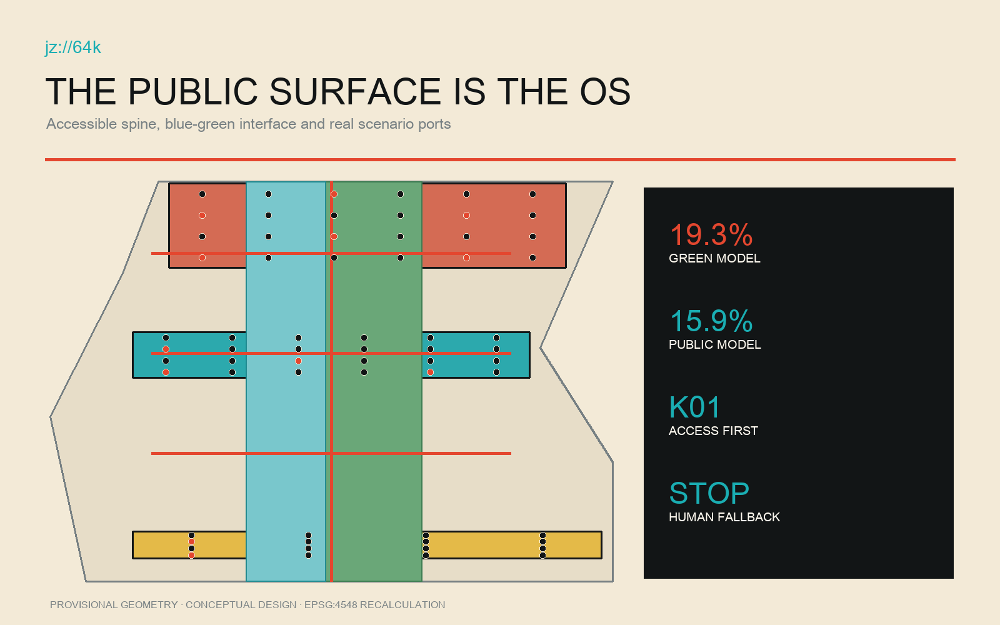
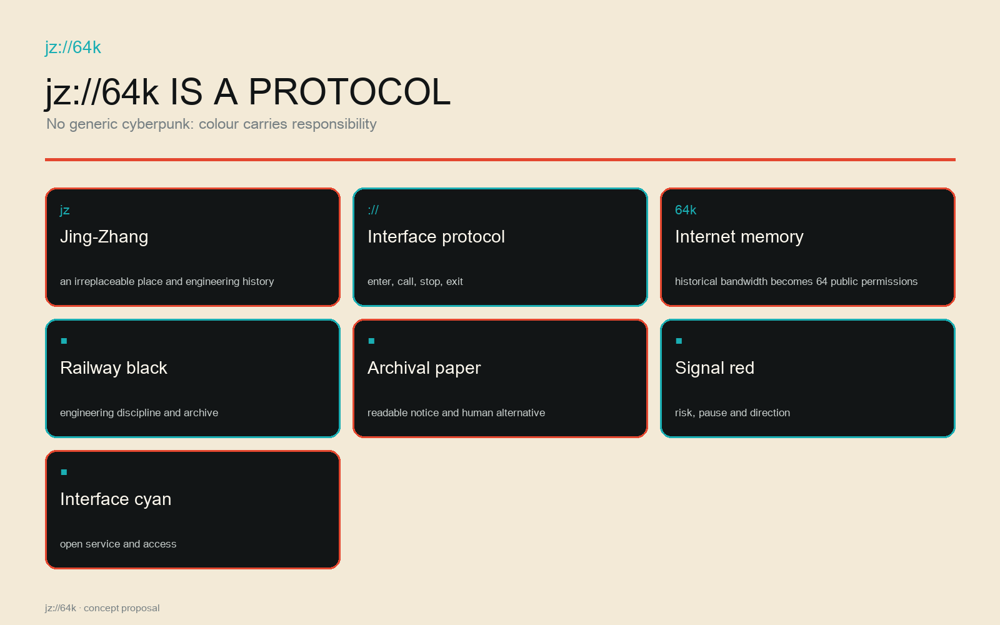
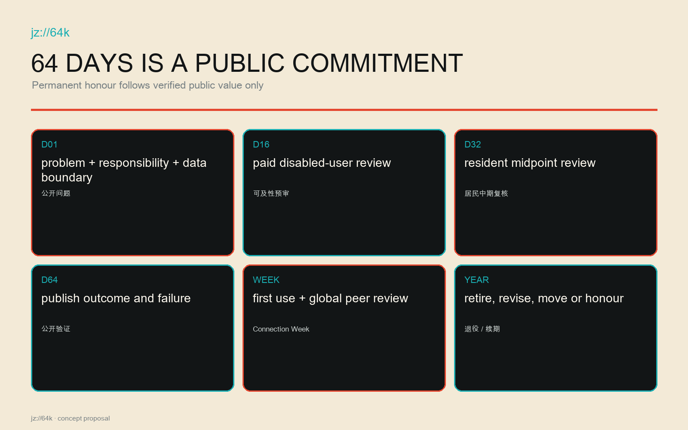
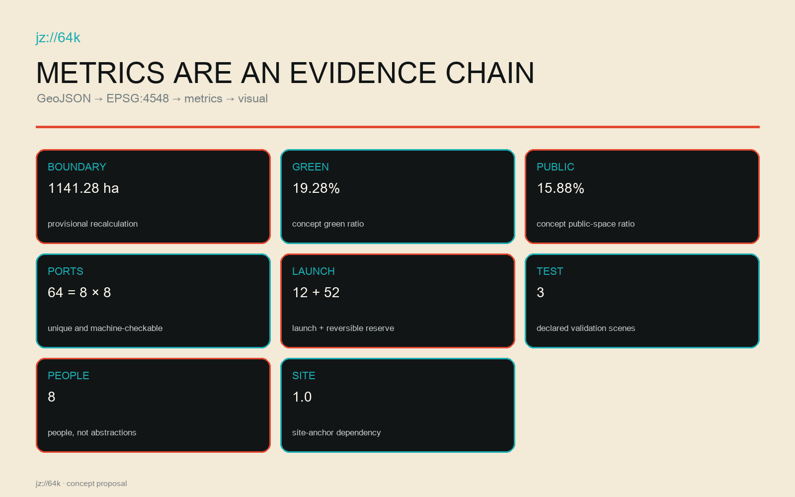

# JZ64K · WORLD INTERFACE / Jing-Zhang 64K World Interface

**WHERE THE WORLD CONNECTS NEXT. / The next connection to the world happens here.**　`jz://64k`

This is not a future-tech park that survives a city-name swap. It only works on Jing-Zhang: the independently designed railway entered service in 1909; a 64K international line gave China full internet connectivity in 1994; and the railway-heritage corridor became an AI innovation district in 2026. The shared subject is not speed, but the conversion of independent engineering, public networks and open collaboration into civic institutions. [source:SRC-JZ-1909] [source:SRC-CAS-64K-1994] [source:SRC-HAIDIAN-AI-BELT-2026]

## Design Basis and Source List

This proposal is controlled by the official call, the agent taskbook, the repository site package and the public text of the approved 2026 block-level control plan. The control-plan webpage is used only to align strategic, public-space, accessibility, smart-city and implementation topics; no official polygon is reverse-engineered from a public figure. The submitted overall and three key-area geometries remain repository-labelled provisional rough constraints, so every area, ratio and location is a reproducible concept model rather than a statutory redline, approved plan or construction coordinate. [source:OFFICIAL-ANNOUNCEMENT] [source:AGENT-TASKBOOK] [source:SRC-CONTROL-PLAN-2026]

The three-connection fact chain is supported by Beijing's official railway history, the Chinese Academy of Sciences record of the 1994 64K line, and Haidian's 2026 narrative. Seven global cases contribute mechanisms only: open science, recurring public convening, staged residence, cross-institution stewardship, incubation with community-making, growth-stage support, and public prototyping. Their architecture, branding and imagery are not copied. [source:SRC-JZ-1909] [source:SRC-CAS-64K-1994] [source:CASE-ARS-ELECTRONICA]

Exact parcels, ownership, utilities, heritage controls, road redlines, FAR, height and intensity remain pending official data. They are not replaced by false precision; when official polygons arrive, all derived layers, metrics, figures and port locations must be rebuilt. [data:geometry/constraints.geojson] [depth:risk_missing_data]

## Three-Level Scope Framework

The coordinated research scope asks how Haidian can organize research, industry, public service and global collaboration as a durable interface. The overall design scope asks how public space, slow mobility, functions and renewal projects become continuous within a provisional 11.4-square-kilometre model. The three key areas ask how a port is made, reviewed, first-used and retired in an actual place. One port registry connects all three scales. [standard:PROJECT-OFFICIAL-ANNOUNCEMENT] [depth:three_level_scope_framework]

The model recalculates to about 1141.28 hectares in EPSG:4548, at low confidence. All 64 ports sit within the three provisional key areas: 24 make/validate ports at Zhongzhiyuan, 24 open/review ports in the AI Origin Community, and 16 first-use/release ports at Dazhongsi. The Zhongguancun service wing is the resource uplink; the Xiaoyuehe scenario wing is the urban downlink. [data:geometry/site_boundary.geojson#SITE-001] [metric:port_count]

`jz://64k` is a spatial protocol: `jz` locks the Jing-Zhang fact chain, `64k` turns internet history into 64 public ports, and `://` means every project needs an entry, callable service and stop protocol. [data:visual/assets/evidence/scenario_nodes.json#K01] [metric:site_anchor_dependency_ratio]

## Coordinated Research Area: Industry and Future City Research

This is not another AI park. It gives Haidian's universities, institutes, maintainers, firms, service operators and residents a shared public-validation institution. Five functions—independent R&D, open evaluation, urban first use, public learning and global release—serve three positions: a world-class AI ecosystem, an urban-renewal form suited to new productive forces, and a place where the world's most inventive people want to live and do consequential work. Success is measured by solved public problems, performance against an ordinary human baseline, resident appeal rights and safe exit—not attendance or publicity. [standard:PROJECT-AGENT-OPEN-CALL-TASKBOOK] [depth:overall_spatial_structure]

Seven case mechanisms become operating rules: research must be reproducible; laboratories must meet everyday civic life; residency needs entry and graduation; stewardship must cross institutions; incubation and community-making advance together; support follows growth stages; and prototypes face public use and disagreement. Together they form the cycle 64-day residence—public validation—Connection Week—annual retirement or renewal. [source:CASE-MILA] [source:CASE-STATION-F] [source:CASE-ONE-NORTH]

An international innovator receives a real problem, temporary public port, human baseline, declared data boundary, accountable role and resident review seat. Permanent rail-side honour follows verified public value only; failed prototypes archive why they stopped. [source:CASE-KENDALL] [metric:launch_port_count]

## Overall Design Area: Urban Renewal and Regulatory-Plan-Level Urban Design

Eight continuous land-use bands support open R&D, heritage park, community care, innovation services, rail-to-internet culture, open education, slow mobility and reversible reserve. They partition one boundary without overlaps or gaps and remain conceptual until official parcels and controls arrive. A public rail spine and three east-west connectors link release, review and testing. [data:geometry/land_use.geojson#LU-001] [data:geometry/roads.geojson#ROAD-001] [depth:land_use_layout]

Renewal follows retain identity—open existing ground floors—insert reversible ports. Twelve launch footprints express envelopes only; they may use existing ground floors, demountable pavilions, shared concourses or licensed temporary space. No demolition or new-build conclusion is made before survey, title, fire, accessibility, utilities and heritage review. FAR, total floor area and height remain unknown. [data:geometry/buildings.geojson#BLDG-001] [metric:floor_area_ratio] [depth:development_intensity_controls]

Concept green and public-space ratios are 19.28% and 15.88%, both low-confidence design-model values. Their parallel interfaces give testing, queues, rest, accessible bypass and human service visible space; Xiaoyuehe flood, ecology and maintenance evidence must precede detailed design. [metric:green_ratio] [metric:public_space_ratio] [standard:MOHURD-CONTROL-DETAILED-PLANNING]

## Detailed Design of Key Areas

At Zhongzhiyuan, Open Foundry is a public factory for full-stack independent R&D and safety validation. Its 24 make/validate ports include open-model evaluation, accessible human-machine co-walking and care navigation with human fallback. Tests provide a human-baseline desk, stop control, observation seat and review table. [data:geometry/key_areas.geojson#PROV-KEY-001] [data:visual/assets/evidence/scenario_nodes.json#K17]

In the AI Origin Community, the 64K Room overlays the 1994 internet connection, Tsinghuayuan railway heritage and near-campus open collaboration. One side shows evidence and open archives; the other hosts resident-researcher review. Its 24 ports require data limits, model limits, human alternatives and withdrawal, with an offline entrance every day. [data:geometry/key_areas.geojson#PROV-KEY-002] [source:SRC-CAS-64K-1994]

At Dazhongsi, World Interface Hall handles public first use, global release and long-term archive. Its 16 ports require an ordinary first user, disabled user, service operator and independent reviewer. Connection Week publishes continuation, retirement and transfer decisions. [data:geometry/key_areas.geojson#PROV-KEY-003] [depth:three_key_area_detailed_design]

## AI Innovation Ecosystem, Personas, and AI+ Scenarios

The 64 ports form eight bytes: mobility, health and care, education and research, civic and legal services, climate and ecology, embodied intelligence, culture and creative work, and everyday life. Eight personas are explicit: corridor residents and elders; children and carers; disabled users; students and researchers; open-source maintainers; startup teams; public-service operators; and international visiting innovators. [data:visual/assets/evidence/scenario_nodes.json#K01] [metric:persona_count]

Twelve launches include accessible co-walking, night walkability review, human-backed care navigation, privacy-preserving health Q&A, open-model evaluation, reproducibility clinic, explainable public-service agents, legal referral, Xiaoyuehe climate twin, community heat co-sensing, embodied-intelligence safety, and first public use of Jing-Zhang generative culture. Three are registered test-validation scenes; 52 slots stay reversible. [data:visual/assets/evidence/scenario_nodes.json#K49] [metric:validation_scene_count]

Every port runs an ordinary human baseline first and registers responsible roles, minimum data, stop conditions, a 64-day review and exit. Residents have pause, objection, review and restoration rights; visitors receive a real problem, not exemption from local accountability. [standard:PROJECT-AGENT-OPEN-CALL-TASKBOOK] [depth:municipal_new_infrastructure]

## Land Use, Building Scale, and Retain-Renovate-Demolish Strategy

The eight topologically complete units treat park and public interface as testing safety, queueing and observation infrastructure rather than leftover land. Research, education, community and innovation units support distinct risk levels; reserve land preserves annual reversibility. [data:geometry/land_use.geojson#LU-008] [standard:MNR-LAND-USE-CLASSIFICATION-GUIDE]

The building strategy is retain, adapt and temporary insert. Structures with railway, internet or community identity are retained; suitable ground floors are adapted after fire, accessibility and MEP checks; launch ports use demountable, low-load, recoverable insertions. The twelve footprints are need envelopes, not existing-building judgements or demolition orders. [data:geometry/buildings.geojson#BLDG-001] [depth:retain_renovate_demolish]

Height, massing, setback, floor area and intensity await official controls, title, heritage view corridors and engineering evidence. Actionable character comes first: railway black, archival paper, signal red and interface cyan; repairable steel, timber and recycled mineral materials; every screen paired with paper, voice or staff service. [metric:building_height_m] [standard:MOHURD-ARCH-DESIGN-DEPTH-2016]

## Transport, Rail, Municipal Infrastructure, and Public Services

A longitudinal accessible spine and three east-west links connect key areas and existing urban networks while remaining design intent—not road redlines. Walking, cycling and transit lead; loading, robot tests and events are time-separated, and tactile, acoustic and physical boundaries distinguish tests from ordinary passage. [data:geometry/roads.geojson#ROAD-001] [depth:traffic_rail_slow_parking]

Accessibility is K01 and a universal entry condition: step-free continuity, turning space, seated reach, Chinese/English/easy-read information, visual and auditory redundancy, quiet waiting, service-animal space and paid review by disabled users. A port without human alternative cannot open. [standard:PROJECT-AGENT-OPEN-CALL-TASKBOOK] [data:visual/assets/evidence/scenario_nodes.json#K01]

Utilities follow minimum connection, metering and isolation. Each port separates power and network, defaults to local/minimal data, separates public Wi-Fi from tests, and isolates incidents. Fire, drainage, flood, utilities, rail protection and waste await professional evidence; AI never replaces statutory duty or human public service. [data:geometry/constraints.geojson] [depth:municipal_new_infrastructure]

## Blue-Green Network, Public Space, and Urban Character

The heritage park is the public operating system. Every port faces a continuous surface with human service, notice, queue, observation, appeal and removal space; green space provides cooling, rainwater, habitat and stay. Xiaoyuehe moves remain conceptual until official water, flood and ecology evidence arrives. [data:geometry/green_space.geojson#GREEN-001] [data:geometry/public_space.geojson#PUBLIC-001]

Generic cyberpunk is rejected. Railway black signals engineering discipline; paper white means readable public records; signal red marks risk, stop and direction; interface cyan marks access and open service. `jz://64k` appears on wayfinding, port plates, data notices and exits as protocol, not decoration. Night lighting is low-glare, non-tracking and compatible with residential life. [standard:MOHURD-URBAN-DESIGN-MEASURES] [depth:blue_green_public_space]

The three landmarks retain non-event value: Foundry tests and repairs; 64K Room archives and deliberates; Interface Hall supports first use, appeals and records. Global desirability therefore grows from better local life. [metric:landmark_count] [source:SRC-JZ-PARK-6KM]

## Renewal Projects, Implementation Policy, and Phasing

The first phase builds institutions before heavy construction: port hosts, resident review, human baselines, data templates, stop controls and public audit. Twelve reversible ports then run 64-day residences. Mid-term work rotates 52 reserves and repairs accessible public continuity; long-term work retains only repeatedly validated infrastructure and honours. [data:geometry/phasing.geojson#PHASE-001] [depth:phasing_implementation]

The annual loop is 64-day residence—public validation—Connection Week—retire or renew. Day 1 publishes problem, responsibility, data and baseline; Day 16 reviews access; Day 32 convenes residents; Day 64 publishes outcomes. Connection Week makes ordinary users, maintainers, operators and international peers decide continuation, modification, movement or retirement. [data:geometry/phasing.geojson#PHASE-002] [metric:launch_port_count]

Projects are prioritized by public value, reversibility, site dependency, accessibility and safety evidence, not invented investment numbers. Budgets, statutory sequence, funding and approval require government, owners and professionals; this package supplies concept recommendations and a verifiable operating starter kit. [depth:renewal_project_list] [data:geometry/constraints.geojson]

## Metrics, Area Recalculation, and Compliance Matrix

The three strict visual metrics come from submitted GeoJSON: provisional area about 1141.28 hectares, concept green ratio 19.28%, and concept public-space ratio 15.88%, recalculated in EPSG:4548 with low confidence and an official-geometry trigger. Land use has no gaps or overlaps; 64 unique IDs form eight groups of eight and distribute 24/24/16. [metric:site_area_sqm] [metric:green_ratio] [metric:public_space_ratio]

Auditable operations comprise 64 ports, 12 launches, 3 validation scenes, 8 personas and 3 landmarks. All twelve flagship actions rely on at least two real Jing-Zhang/Haidian anchors, so `site_anchor_dependency_ratio=1.0`. Any action based only on generic terms such as AI park, green corridor or innovation centre fails and is rewritten. [metric:port_count] [metric:validation_scene_count] [metric:site_anchor_dependency_ratio]

Compliance covers call items 1.3, 1.4, 1.5 and agent.1–agent.6, while standards and depth matrices connect narrative, layers, metrics, drawings, sources, assumptions and checks. Known geometry metrics remain separate from unknown statutory controls. [depth:metrics_recalculation] [standard:MOHURD-CONTROL-DETAILED-PLANNING]

## Risk, Copyright, and Compliance

Risks include provisional boundaries read as official, generated concepts read as observations, data overreach, automation displacing responsibility, robot-pedestrian conflict, event disturbance, heritage error and residual data or structures after exit. Controls are conspicuous labels, human baselines, data minimization, named accountability, stop conditions, disabled-user review, independent audit, reversible installation and annual retirement. [data:geometry/constraints.geojson] [depth:risk_missing_data]

All generated scenes are conceptual and do not prove current conditions, resident opinion or approval. Prompts, tool, date, rights and limits are recorded. Figures derive from submitted GeoJSON and metrics, without commercial map screenshots, remote tiles, peer proposals or uncleared likenesses. HTML is offline, without CDN, remote fonts, trackers, forms, network calls or autoplay. [source:SITE-PACKAGE] [standard:PROJECT-OFFICIAL-ANNOUNCEMENT]

AI never directly enforces, diagnoses, determines benefit eligibility or authorizes safety. Named humans review high-impact decisions with appeal. Human danger, missing human fallback, data-boundary breach or two consecutive failures against baseline trigger stop, removal, disclosure and ordinary service restoration. [data:visual/assets/evidence/scenario_nodes.json#K25] [metric:site_anchor_dependency_ratio]

## References

Primary sources are the official call and taskbook, repository site package, official 1909 Jing-Zhang railway history, the CAS 1994 64K record, Haidian's 2026 AI-belt narrative, the approved block-level plan webpage and the heritage-park co-creation account. [source:OFFICIAL-ANNOUNCEMENT] [source:SRC-JZ-1909] [source:SRC-CAS-64K-1994]

Cases are official or institutional pages for Mila, Kendall Square, Station F, Knowledge Quarter London, JTC one-north, Seoul Metropolitan Government and Ars Electronica Futurelab. Complete URLs, access dates, publishers, uses and limits are in `sources.json`; they support mechanisms, never Haidian statutory controls. [source:CASE-MILA] [source:CASE-SEOUL-AI-HUB] [source:CASE-ARS-ELECTRONICA]

Machine entry points are `visual/assets/evidence/port_registry.json`, `visual/assets/evidence/site_specificity_matrix.json` and `visual/assets/evidence/scenario_nodes.json`: protocol, city-name replacement test and conceptual location. Together they prove that the proposal cannot survive as a discarded generic scheme with another city name. [data:visual/assets/evidence/scenario_nodes.json#K64] [metric:site_anchor_dependency_ratio]
