# JZ64K · WORLD INTERFACE / 京张64K·世界接口

**WHERE THE WORLD CONNECTS NEXT. / 下一次连接世界，从这里发生。**　`jz://64k`

这不是一个可以换掉城市名继续成立的“未来科技园”。它只在京张成立：1909年，中国人自主设计建造的京张铁路开始运营；1994年，中国科学院计算机网络信息中心通过64K国际专线实现全功能互联网接入；2026年，京张铁路遗址公园沿线被明确推进为人工智能创新街区。三次接入的共同点不是速度崇拜，而是把自主工程、公共网络和开放协作变成城市制度。[source:SRC-JZ-1909] [source:SRC-CAS-64K-1994] [source:SRC-HAIDIAN-AI-BELT-2026]

## 设计依据与资料清单

本案以征集公告、面向智能体任务书、仓库场地包和2026年获批街区控规公开文本为主控资料；控规网页仅用于核对总体战略、公共空间、无障碍、智慧城市和实施机制的议题，不从公开图件擅自提取官方polygon。总体边界和三个重点区仍采用仓库明确标注的临时粗略几何，因此所有面积、比例和点位都是可复算的概念模型，不是法定红线、审定控规或施工坐标。[source:OFFICIAL-ANNOUNCEMENT] [source:AGENT-TASKBOOK] [source:SRC-CONTROL-PLAN-2026]

事实链另由北京市重点站区管理委员会、中科院和海淀区政府页面支撑；京张高铁入地后约6公里地面空间的公共性机会由北京市规划自然资源委材料支撑。七个全球案例只提取可审查的机制：Mila的开放科学与伦理共同体、Kendall Square的高频公共活动、Station F的分期驻留、Knowledge Quarter的跨机构治理、one-north的孵化与社区营造、Seoul AI Hub的分阶段支持、Ars Electronica的公共原型化。任何案例形态、品牌或图像均不复制。[source:SRC-JZ-PARK-6KM] [source:CASE-MILA] [source:CASE-ARS-ELECTRONICA]

官方精确地块、权属、市政、文保控制线、道路红线、容积率、高度与建设强度尚缺，均保持“待正式数据补齐”。它们不会被貌似精确的参数替代；正式数据到达时，必须从边界开始重算所有派生图层、指标、图件和端口位置。[data:geometry/constraints.geojson] [depth:risk_missing_data]

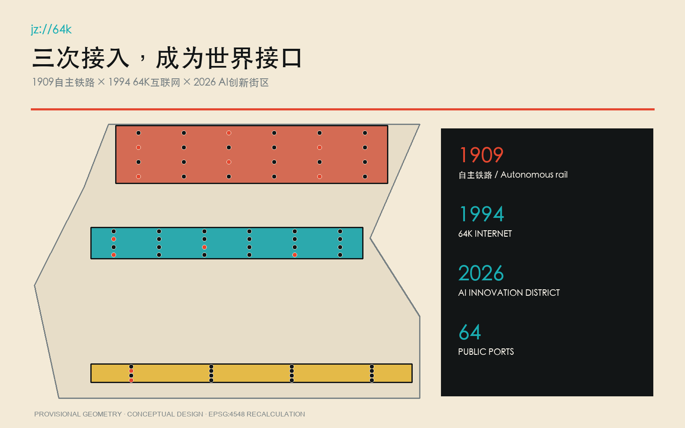

## 三层范围工作框架

统筹研究范围回答“海淀如何把科研、产业、公共服务和全球协作组织成可持续接口”；总体设计范围回答“约11.4平方公里临时范围内，公共空间、慢行、功能和更新项目如何形成连续系统”；三处重点区域回答“一个端口在具体场所里怎样制造、评议、首用并退出”。本案不把三层范围画成三个互不相干的圈，而用同一份端口注册表将战略、空间和运营贯通。[standard:PROJECT-OFFICIAL-ANNOUNCEMENT] [depth:three_level_scope_framework]

总体空间暂按EPSG:4548复算为约1141.28公顷，低置信度且随官方polygon重算。64个端口全部进入三处临时重点区：众智园24个制造/验证端口，AI原点社区24个开源/评议端口，大钟寺16个首用/发布端口；中关村科技服务翼提供人才、资本、法务和国际服务uplink，小月河场景赋能翼提供真实城市问题downlink。[data:geometry/site_boundary.geojson#SITE-001] [data:geometry/key_areas.geojson#PROV-KEY-001] [metric:port_count]

`jz://64k` 是空间语法：`jz` 指定不可替换的京张事实链，`64k`把互联网史转成64个公共端口，`://`提示每个项目必须有可进入、可调用、可停止的协议。总体结构不是“轴线+地标”的常规图式，而是铁路公共面上的端口网络；每个端口都连接一个具体问题、一组居民、一名责任人和一条退出路径。[data:visual/assets/evidence/scenario_nodes.json#K01] [metric:site_anchor_dependency_ratio]

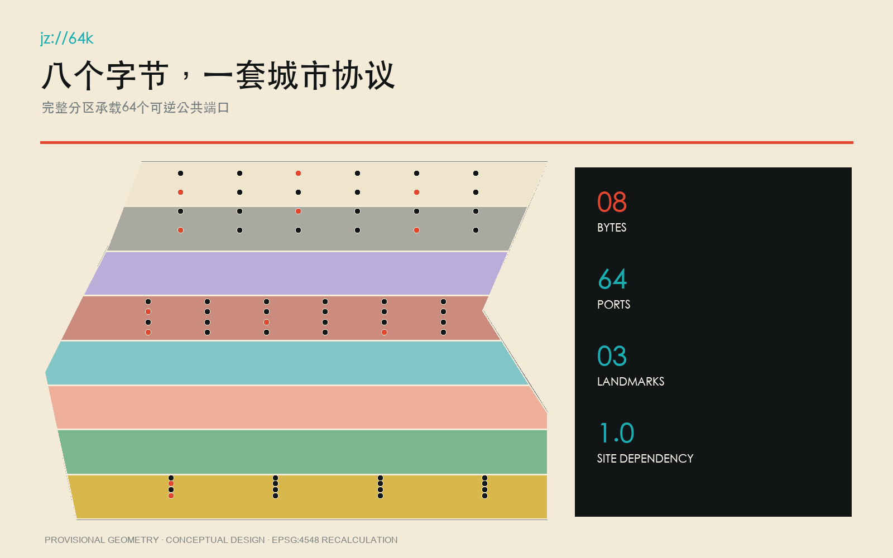

## 统筹研究范围产业与未来城市研究

产业定位不是“再建一个AI园区”，而是把海淀已有高校院所、开源维护者、企业、公共服务运营者和国际访问者接入一套公共验证制度。五项功能分别为自主研发、开放评测、城市首用、公共学习和全球发布；三项定位分别是世界级AI创新生态、适配新质生产力的更新城区、全球创新人才愿意长期生活和做酷事的公共目的地。成功不以活动人数或媒体曝光替代，而以公开问题是否被解决、普通人工基线是否被超越、居民是否能申诉、项目是否能安全退出衡量。[standard:PROJECT-AGENT-OPEN-CALL-TASKBOOK] [depth:overall_spatial_structure]

七个案例的转译形成七条运营原则：科研必须开放复现；实验室与日常生活必须在公共界面相遇；驻留必须有明确进入与毕业；区级运营要跨机构而非单一房东；孵化资源要与社区营造同步；人才支持按成长阶段配置；原型必须经过公共体验和争议讨论。它们共同服务“64天驻留—公共验证—Connection Week—年度退役/续期”闭环，而不导出任何国外园区的形态复制。[source:CASE-KENDALL] [source:CASE-STATION-F] [source:CASE-ONE-NORTH]

全球吸引力来自真实权限：访问创新者不是来参观展厅，而是获配一个带场地、普通人工基线、公开数据边界、责任角色和居民评议席位的城市端口。只有形成可公开验证的公共价值，成果和贡献者才进入沿铁轨的永久荣誉档案；失败原型同样归档其停止原因，让“可失败但不可掩盖”成为地区信誉。[source:CASE-KNOWLEDGE-QUARTER] [metric:launch_port_count]

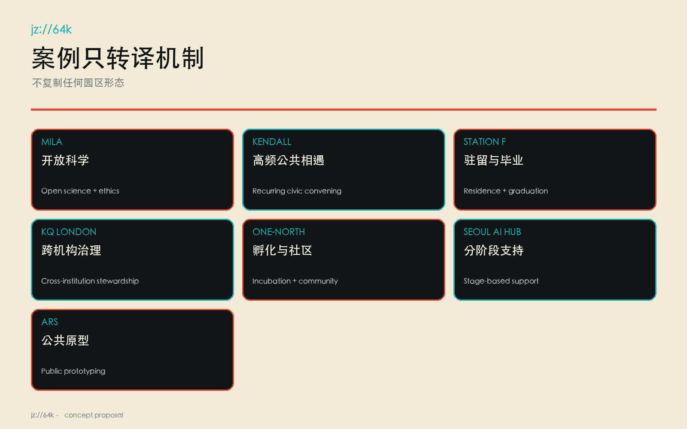

## 总体设计范围城市更新与控规深度城市设计

用地方案采用八段连续分区，对应八个字节主题及其城市支撑：开放科研、遗址公园绿地、社区照护、创新服务、铁路—互联网文化、开放教育、慢行接驳与可逆留白。分区由同一边界切分，互不重叠且无空隙；它是等待官方地块和控规条件后再落位的概念结构，不是新增法定用地。以铁路公共面为主脊，三条东西连接线分别服务大钟寺发布、原点开放评议和众智园测试接入。[data:geometry/land_use.geojson#LU-001] [data:geometry/roads.geojson#ROAD-001] [depth:land_use_layout]

更新方法优先“保留身份、改造首层、插入可逆端口”。首发12个原型基底仅表示空间需求包络：可利用存量建筑首层、可拆装亭、站厅共享界面或临时许可空间；在未完成建筑调查、权属、消防、无障碍、市政和文保核查前，不指认具体建筑拆除或新建。容积率、总建筑面积与高度保持unknown，这比编造一个漂亮数值更接近专业责任。[data:geometry/buildings.geojson#BLDG-001] [metric:floor_area_ratio] [depth:development_intensity_controls]

蓝绿和公共空间在概念几何中分别占19.28%与15.88%，仅为低置信度设计模型值。二者被画为与铁路主脊平行的连续界面，使测试设备、排队、休憩、无障碍绕行和人工服务都有可见空间；正式深化须结合小月河防洪、树木、地下管线、热环境和养护条件重新组织。[metric:green_ratio] [metric:public_space_ratio] [standard:MOHURD-CONTROL-DETAILED-PLANNING]

## 重点区域详细设计

众智园的 **Open Foundry / 开源铸场** 不是炫技大厅，而是全栈自主研发和安全验证的公共工厂。24个端口以制造/验证为主，首发包括开放模型公共评测、无障碍人机共行、照护导航人工兜底等；每次测试都同时开放人工基线工位、停止按钮、观察席和复核桌。空间动作依赖众智园加速区与京张公共廊道，移到一般科技园便失去真实验证对象。[data:geometry/key_areas.geojson#PROV-KEY-001] [data:visual/assets/evidence/scenario_nodes.json#K17]

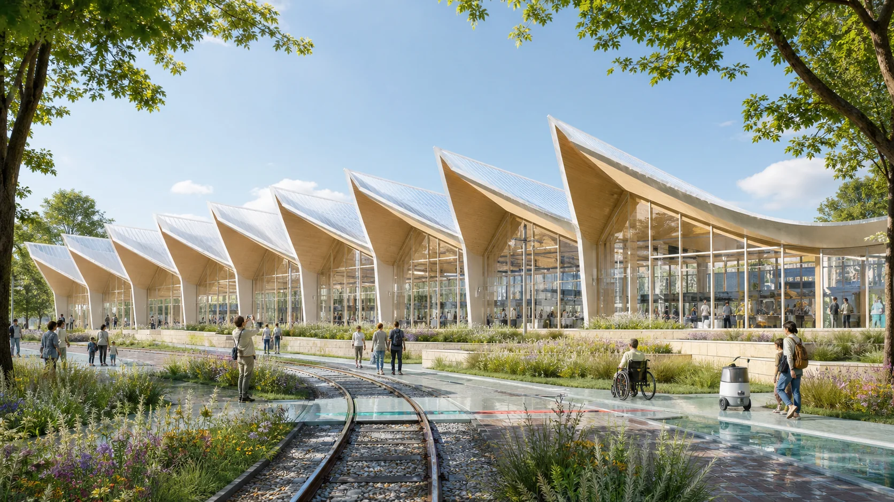

AI原点社区的 **64K Room / 64K源室** 将1994互联网接入史、清华园站铁路遗产和近校开放协作叠在一个可进入房间：一侧是64K历史证据和开源档案，一侧是居民与研究者共同评议的端口控制台。24个端口以开源/评议为主，任何模型必须说明训练与数据边界、能力限制、人工替代路径和撤回方式；房间每天都保留无需数字身份的线下入口。[data:geometry/key_areas.geojson#PROV-KEY-002] [source:SRC-CAS-64K-1994]

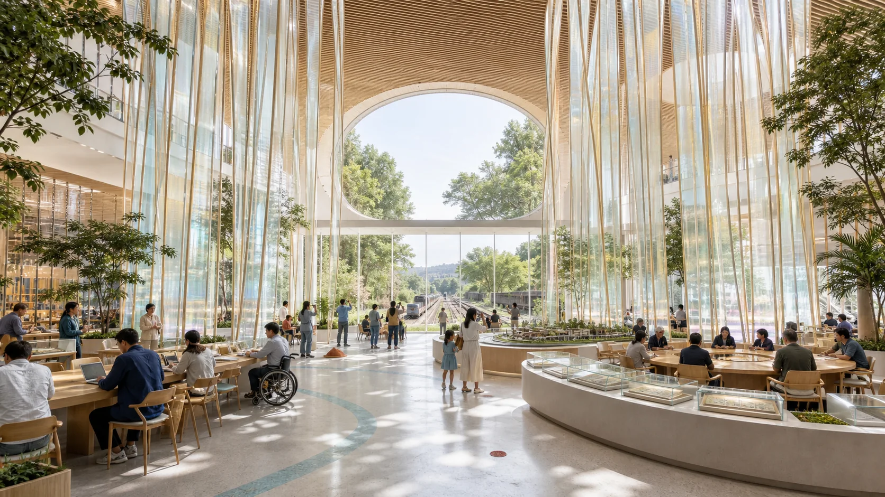

大钟寺的 **World Interface Hall / 世界接口厅** 承担公共首用、全球发布和长期归档。16个端口不以新品发布会为终点，而要求首位普通使用者、残障使用者、公共服务运营者和独立复核员共同完成验证；Connection Week中，继续运行、退役和转移的决定当场公布。世界接口厅依赖大钟寺产业集聚区、轨道可达性和京张沿线的南部门户关系，不能复制成任何城市的会议中心。[data:geometry/key_areas.geojson#PROV-KEY-003] [depth:three_key_area_detailed_design]

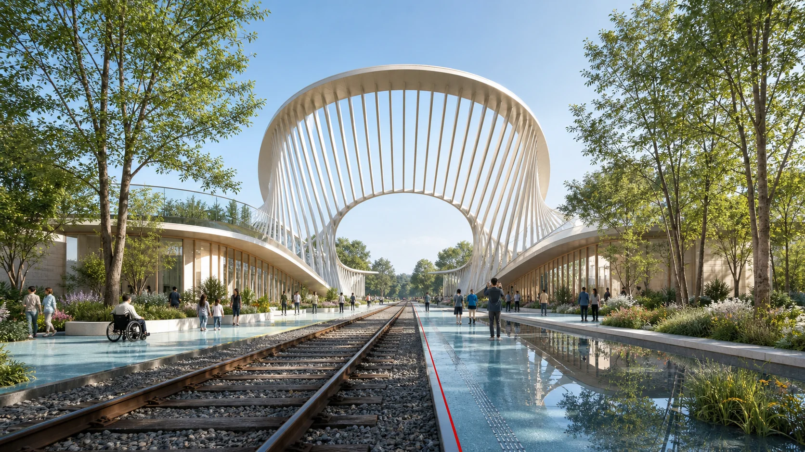

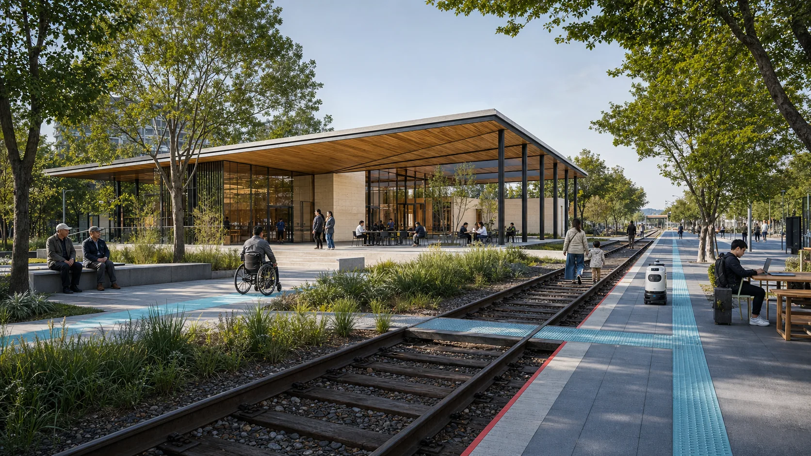

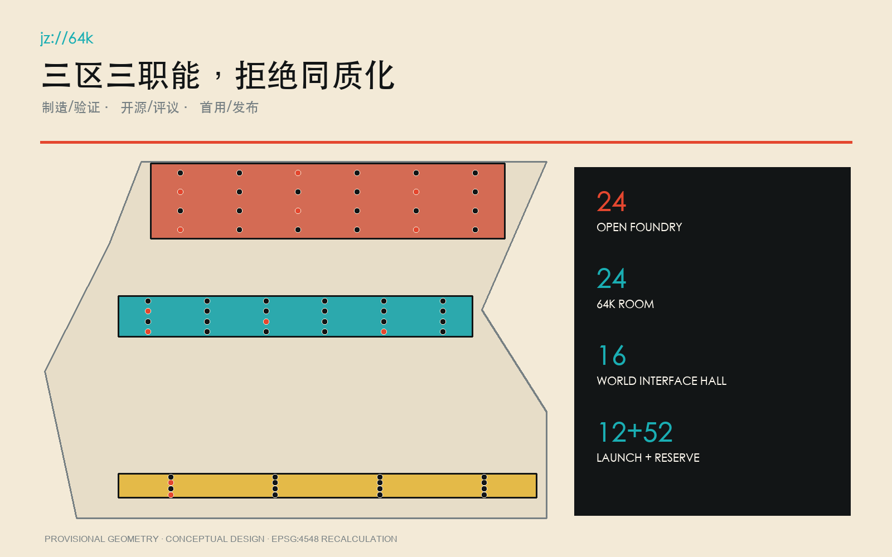

## AI 创新生态、人才画像与 AI+ 场景

64个端口分为交通、健康照护、教育科研、公共与法律服务、气候生态、具身智能、文化创意、日常生活八个字节，每组8个。服务对象是八类具体人物：沿线居民与老人、儿童及照护者、残障使用者、学生研究者、开源维护者、创业团队、公共服务运营者、国际访问创新者。端口注册表把人物、空间、运营和数据边界合并记录，避免“给所有人”的空泛口号。[data:visual/assets/evidence/scenario_nodes.json#K01] [metric:persona_count]

12个首发场景为：无障碍人机共行、夜间慢行风险复核、照护导航人工兜底、隐私保留健康问答、开放模型公共评测、科研复现门诊、公共服务可解释代理、法律信息转介台、小月河气候数字孪生、社区热环境共测、具身智能安全场、京张文化生成作品首用。其中无障碍人机共行、开放模型公共评测和具身智能安全场被明确登记为测试验证场景；其余52个端口保留为可逆轮换槽位，不用假繁荣填满。[data:visual/assets/evidence/scenario_nodes.json#K49] [metric:validation_scene_count]

每个端口先运行普通人工基线，再允许AI进入；必须登记责任角色、最小数据边界、停止条件、64天复核周期和退出方式。居民不是“体验者”，而是拥有暂停、异议、复核和要求恢复人工服务权利的共同主持人。国际访问创新者则获得真实问题、临时权限和公开评议，不获得绕过本地责任的特权。[standard:PROJECT-AGENT-OPEN-CALL-TASKBOOK] [depth:municipal_new_infrastructure]

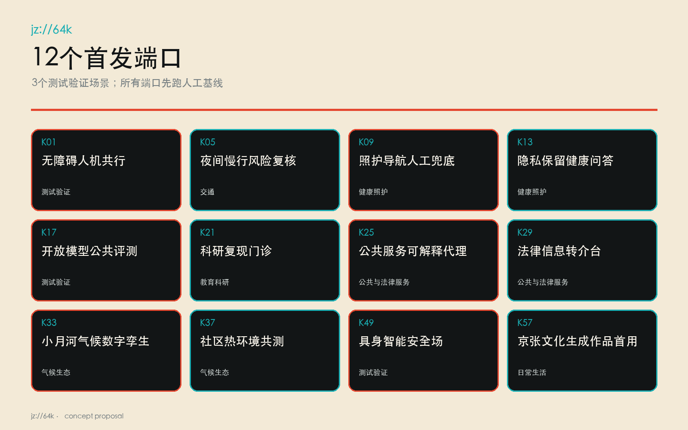

## 用地、建筑规模与拆改留方案

完整用地分区由八个拓扑连续单元构成，面积直接由临时边界内切分复算。公园绿地和连续公共面不是剩余地，而是端口测试的安全缓冲、排队与观察空间；科研、教育、社区服务和创新服务单元提供不同风险等级的室内承载；留白单元为年度端口更替保留撤回能力。[data:geometry/land_use.geojson#LU-008] [standard:MNR-LAND-USE-CLASSIFICATION-GUIDE]

建筑策略采用“留、改、临插”三类：有铁路、互联网史或社区记忆价值的建筑优先保留；具备首层开放条件的存量建筑通过消防、无障碍和机电专业核查后改造；首发端口只用可拆装、低荷载、可恢复的临时插入验证需求。提交的12个建筑基底是需求包络，不对应既有建筑判断，更不构成拆迁决定。[data:geometry/buildings.geojson#BLDG-001] [depth:retain_renovate_demolish]

建筑高度、体量、退线、总建筑面积和开发强度必须等待官方控规、地块、权属、文保视廊与工程资料；因此正文不设置虚构天际线。风貌控制先锁定可执行的低风险部分：铁路黑、纸本米白、信号朱红和接口青；构件使用可维修的钢、木与再生矿物材料；所有数字界面同时提供纸本、语音或工作人员替代。[metric:building_height_m] [standard:MOHURD-ARCH-DESIGN-DEPTH-2016]

## 交通、轨道、市政与公共服务设施

交通框架以京张公共端口主脊为纵向无障碍慢行线，三条东西连接线分别接入三处重点区和现有城市街网；它们只表达连接意图，不冒充工程线位或道路红线。端口之间形成步行、骑行和公共交通优先的64K路径，机动车装卸、机器人测试和活动人流分时管理，测试区与普通通行区以触觉、声学和实体边界共同区分。[data:geometry/roads.geojson#ROAD-001] [depth:traffic_rail_slow_parking]

无障碍不是附加检查，而是K01的首发任务和全部端口的准入条件：连续无台阶路线、轮椅回转、坐姿可达控制、中文/英文/易读文本、听觉与视觉冗余、安静等待区、服务动物空间和人工引导须由残障使用者付费参与复核。没有人工替代路径的端口不得开放。[standard:PROJECT-AGENT-OPEN-CALL-TASKBOOK] [data:visual/assets/evidence/scenario_nodes.json#K01]

市政和数字基础设施采用“最小接入、可计量、可隔离”：临时供电与网络按端口单独计量，数据默认本地化和最小化，公共Wi-Fi与测试网络分段，安全事件可一键隔离。消防、排水、防洪、地下管线、轨道保护和垃圾清运均待专业资料核实；AI不替代法定值班、应急指挥和人工公共服务。[data:geometry/constraints.geojson] [depth:municipal_new_infrastructure]

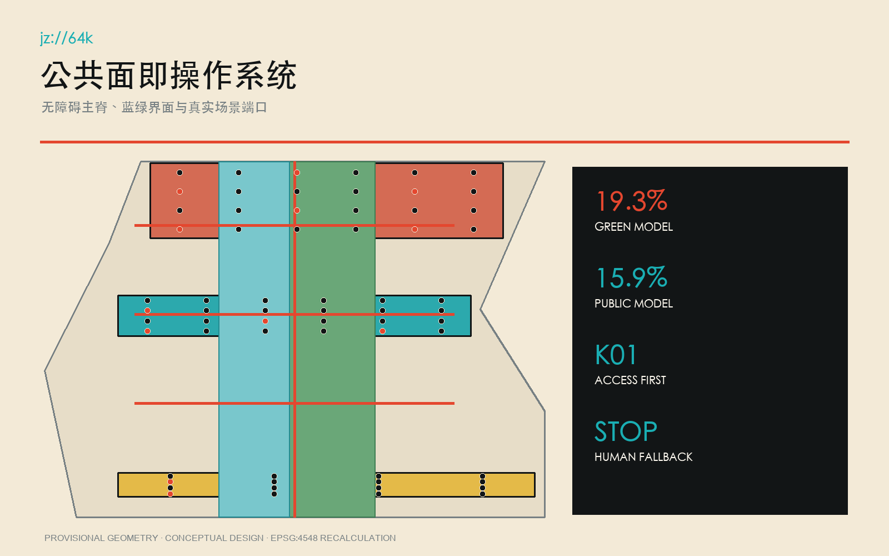

## 蓝绿空间、公共空间与城市风貌

京张遗址公园不是背景绿带，而是世界接口的公共操作系统：每个端口面向连续公共面布置人工服务、告知、排队、观察、申诉和撤除位置，绿地承担降温、雨水、栖息地和停留功能。小月河相关动作只作为概念建议，必须在正式河道蓝线、防洪和生态资料到位后再深化。[data:geometry/green_space.geojson#GREEN-001] [data:geometry/public_space.geojson#PUBLIC-001]

城市风貌拒绝通用赛博朋克。铁路黑来自钢轨与工程纪律，纸本米白对应图纸、档案和可读公共告知，信号朱红标记危险、暂停与关键方向，接口青标记开放服务和可进入性。`jz://64k`不是装饰logo，而是遍布路牌、端口铭牌、数据边界告知和退出说明的协议标识；夜间以低眩光、非追踪、非沉浸强迫的照明保持居民日常。[standard:MOHURD-URBAN-DESIGN-MEASURES] [depth:blue_green_public_space]

三个朝圣地标都必须有“非活动日价值”：开源铸场日常提供安全测试和维修；64K源室日常提供历史、开源和居民评议；世界接口厅日常提供首用、申诉与档案查询。只有这样，全球创新者的向往不会建立在挤走本地生活之上。[metric:landmark_count] [source:SRC-JZ-PARK-6KM]

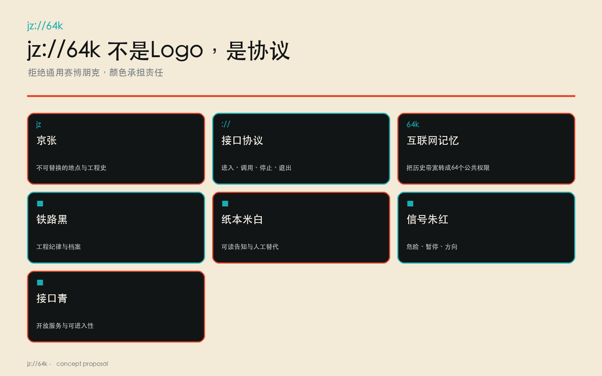

## 更新项目清单、实施政策与分期计划

近期首先实施制度而非重资产：完成端口主持人制度、居民复核席、普通人工基线、数据边界模板、停止按钮和公开审计格式；随后在三处重点区激活12个可逆端口，运行64天驻留并公开验证。中期根据证据轮换其余52个槽位，修复连续无障碍公共面和东西连接；长期只保留经多轮公共价值验证的空间设施和荣誉档案。[data:geometry/phasing.geojson#PHASE-001] [depth:phasing_implementation]

年度闭环为“64天驻留—公共验证—Connection Week—退役/续期”。驻留第1天公布问题、责任、数据和人工基线；第16天做可及性预审；第32天由居民中期复核；第64天公开结果。Connection Week不是招商秀，而是让普通首用者、维护者、运营者和国际同行共同决定继续、修改、迁移或退役。[data:geometry/phasing.geojson#PHASE-002] [metric:launch_port_count]

项目清单优先级按公共价值、可逆性、场地依赖、无障碍与安全证据排序，不按估算投资额制造确定性。正式工程预算、建设时序、政策资金和审批路径均需政府、业主与专业团队另行确认；本案只给出概念建议与可验证的先行运营包。[depth:renewal_project_list] [data:geometry/constraints.geojson]

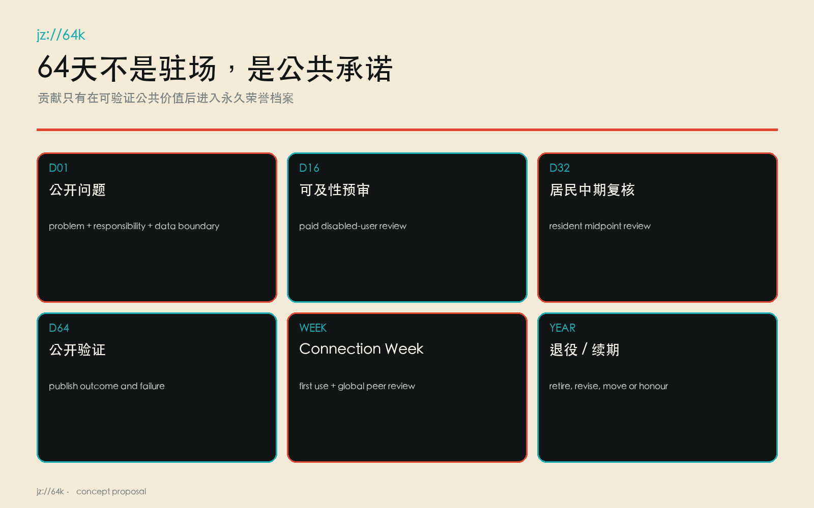

## 指标体系、面积复算与合规矩阵

三项视觉严格指标均来自提交GeoJSON：总体临时范围面积约1141.28公顷，概念绿地比例19.28%，概念公共空间比例15.88%；全部以EPSG:4548复算并带低置信度与重算触发条件。用地无空隙和重叠，64个端口均落在三个临时重点区，端口ID唯一、八组各八个、片区分配24/24/16。[metric:site_area_sqm] [metric:green_ratio] [metric:public_space_ratio]

运营指标同样可审计：端口64个，首发12个，测试验证3个，人物8类，地标3处；12项旗舰动作全部依赖至少两个真实京张/海淀锚点，因此 `site_anchor_dependency_ratio=1.0`。任何动作若只依赖“科技园、AI、绿廊、创新中心”等通用词，立即判失败并重写。[metric:port_count] [metric:validation_scene_count] [metric:site_anchor_dependency_ratio]

合规矩阵逐条覆盖公告1.3、1.4、1.5与agent.1—agent.6，专业标准矩阵和设计深度矩阵连接正文、图层、指标、图纸、来源、假设和自检。已知几何指标与unknown法定控制严格分离；容积率、高度、总建筑面积和道路面积比例不会在HTML或图纸中伪装为数值。[depth:metrics_recalculation] [standard:MOHURD-CONTROL-DETAILED-PLANNING]

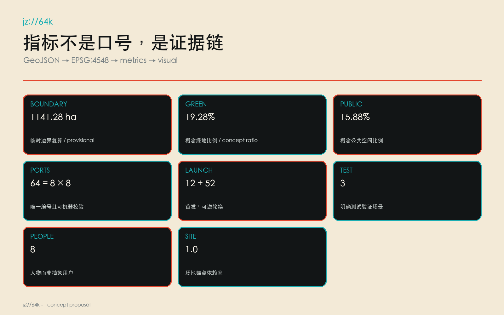

## 风险、版权与合规说明

主要风险包括：临时边界被误读为官方、生成图被误读为现状照片、端口采集越界、自动化替代人工责任、机器人与行人冲突、活动扰民、文保与视廊误判、设施退出后遗留数据或构筑物。控制方式是醒目标注临时性与概念性、保留人工基线、最小化数据、明确责任和停止条件、残障使用者参与复核、独立审计、可逆安装及年度退役。[data:geometry/constraints.geojson] [depth:risk_missing_data]

所有生成场景图均标注为概念表达，不证明现状、居民意见或政府批准；提示词、工具、日期、权利与限制写入版权说明和生成记录。图件由提交GeoJSON和指标派生，未使用商业地图截图、远程瓦片、他人参赛成果或未清权人物肖像。HTML完全离线，无CDN、远程字体、追踪器、表单、网络请求或自动播放。[source:SITE-PACKAGE] [standard:PROJECT-OFFICIAL-ANNOUNCEMENT]

治理底线是：不以AI输出直接执法、诊断、福利资格决定或安全放行；高影响决定由具名人员复核并可申诉。任何端口触发人身风险、缺少人工替代、越过数据边界或连续两次不及人工基线，即停止、撤除、公开原因并恢复普通服务。[data:visual/assets/evidence/scenario_nodes.json#K25] [metric:site_anchor_dependency_ratio]

## 参考资料

核心事实来源包括征集公告与任务书、仓库场地包、1909京张铁路官方史料、1994年64K互联网接入中科院史料、海淀2026年AI创新带公开叙事、获批街区控规公开文本和京张遗址公园众创材料。[source:OFFICIAL-ANNOUNCEMENT] [source:SRC-JZ-1909] [source:SRC-CAS-64K-1994]

案例来源包括Mila、Kendall Square Association、Station F、Knowledge Quarter London、JTC one-north、Seoul Metropolitan Government与Ars Electronica Futurelab官方页面。完整URL、获取日期、发布者、用途和限制见`sources.json`；它们只支持机制比较，不支持海淀的法定空间控制。[source:CASE-MILA] [source:CASE-SEOUL-AI-HUB] [source:CASE-ARS-ELECTRONICA]

机器证据入口为`visual/assets/evidence/port_registry.json`、`visual/assets/evidence/site_specificity_matrix.json`和`visual/assets/evidence/scenario_nodes.json`。前者定义64个公共端口协议，第二个执行城市名替换测试，第三个提供可复核概念点位；三者共同保证这不是一份“弃稿复制到别城也能用”的方案。[data:visual/assets/evidence/scenario_nodes.json#K64] [metric:site_anchor_dependency_ratio]
