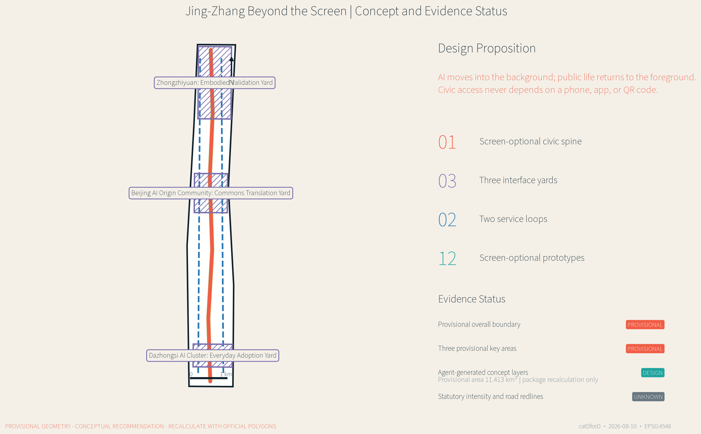
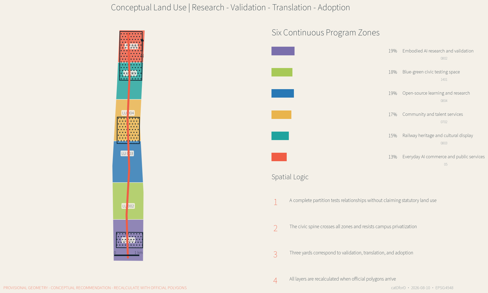
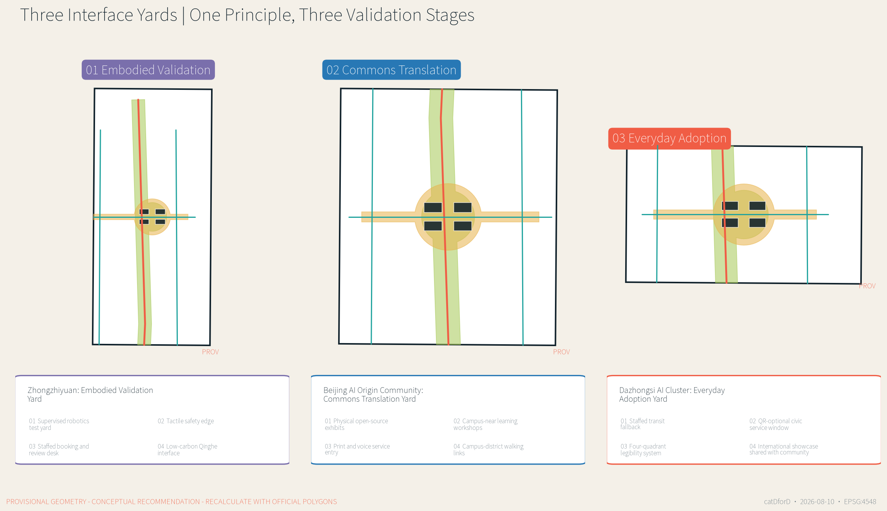
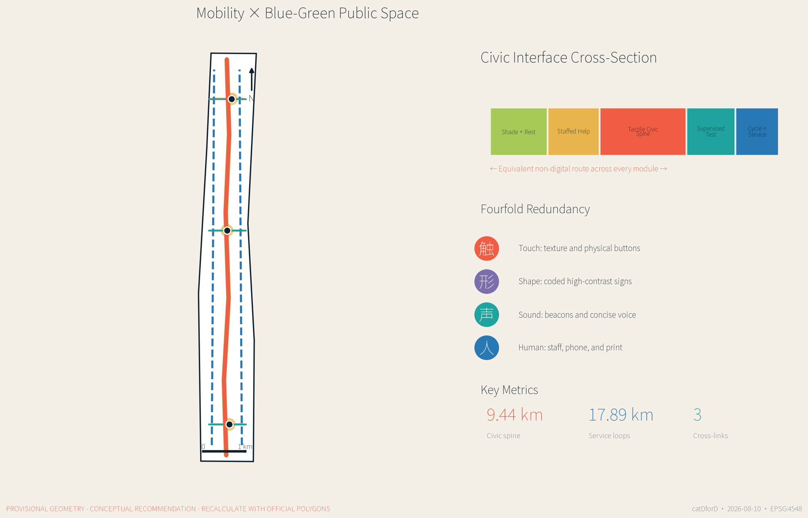
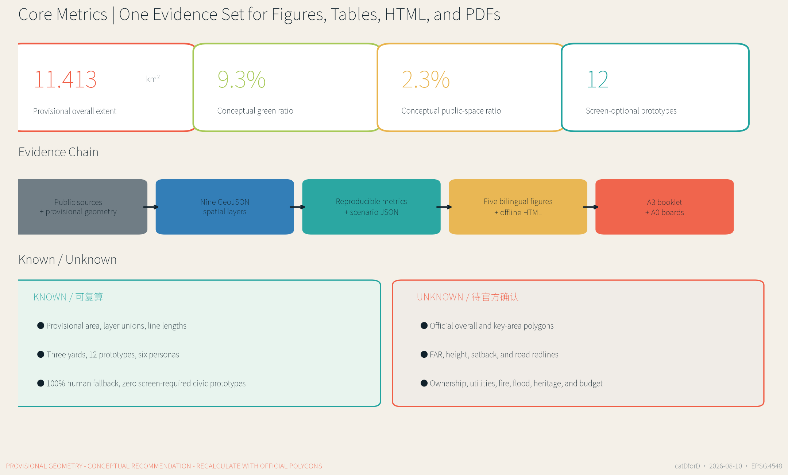

# JING-ZHANG BEYOND THE SCREEN / 屏外京张

> AI moves into the background; public life returns to the foreground. AI may improve a civic service, but the service must not fail because someone lacks a smartphone, app, QR code, reliable connection, or digital confidence.

## Design Basis and Source List

This proposal defines an AI city as **screen-optional civic infrastructure**. AI may assist environmental sensing, translation, maintenance, enterprise services, and risk prompts in the background. Yet walking, transferring, asking for help, completing a public-service task, learning, resting, or participating in civic life must not require a personal smart device or a persistent digital identity. The objective is not to eliminate every screen; it is to guarantee an equally effective non-screen route and a visible human fallback when automation fails, language access breaks down, connectivity disappears, or a person declines consent [source:AGENT-TASKBOOK] [depth:existing_conditions_diagnosis].

The first authority is the official prequalification announcement issued by the Haidian Branch of the Beijing Municipal Commission of Planning and Natural Resources. The three scope levels, three key areas, tasks, and deliverable depth follow that announcement and the registered repository materials [source:OFFICIAL-ANNOUNCEMENT] [standard:PROJECT-OFFICIAL-ANNOUNCEMENT]. The package also reads the site package, source registry, and processed agent fact pack to distinguish official public sources, background references, provisional inferences, and agent-generated design. International cases inform strategy only; they do not create statutory boundaries, controls, or implementation promises for Beijing.

No precise official overall polygon or three official key-area polygons are publicly available in the package. The proposal therefore retains the maintainer-provided provisional boundary. Its projected area is approximately 11.413 km2, consistent in order of magnitude with the announced “about 11.4 km2,” but it does not have statutory precision [data:geometry/site_boundary.geojson#PROV-SITE-001] [metric:site_area_sqm]. `PROV-KEY-001/002/003` are used in the same limited way. A background OSM check found no spatial intersection between the mapped heritage park and the provisional overall extent; the proposal does not move either geometry in response and records the mismatch as an official-data dependency.

All spatial figures, metrics, HTML pages, and PDFs are generated from the same GeoJSON and structured scenario set. They contain no commercial basemap screenshots, remote tiles, or generative renderings presented as evidence. Development intensity, height, road redlines, utilities, heritage controls, and engineering measures remain unknown or pending professional confirmation. Every spatial move is a conceptual recommendation for further professional work [source:SOURCE-REGISTRY] [data:geometry/constraints.geojson#CONSTRAINTS].

## Three-Level Scope Framework

The announcement defines an approximately 43.6 km2 coordinated research area, an approximately 11.4 km2 overall design area, and about 368.4 hectares across three key areas. Beyond the Screen treats them as one “value-network-prototype” chain rather than three disconnected drawing sets. The research layer defines industrial and public value; the overall-design layer organizes the civic spine, service loops, land use, and blue-green network; the key areas test spatial interfaces, operations, governance, and lived experience [source:PROCESSED-FACT-PACK] [depth:three_level_scope_framework].

The spatial grammar is “one spine, three yards, two loops, twelve prototypes.” The **screen-optional civic spine** provides tactile direction, audio-light cues, shape coding, print information, shade, rest, and staffed help. The **three interface yards** specialize in embodied validation, commons translation, and everyday adoption. The **two service loops** reconnect campuses, enterprises, communities, and rail stations. **Twelve prototypes** translate industry testing, mobility, public services, climate adaptation, and annual operations into auditable objects [data:geometry/roads.geojson#ROAD-001] [metric:screen_optional_spine_length_m].

| Level | Core question | Beyond-the-Screen response | Auditable evidence |
| --- | --- | --- | --- |
| Coordinated research area | How does AI industry create public value rather than internal campus efficiency only? | Research - embodied validation - public translation - everyday adoption - governance review | Sources, case comparison, operating framework |
| Overall design area | How can a long corridor become reachable, legible, and hospitable? | Civic spine, two loops, six conceptual land-use zones, continuous blue-green space, cross-links | Land use, roads, green and public-space GeoJSON |
| Key areas | How can AI prototypes remain observable, optional, and human-controlled? | Three differentiated interface yards and twelve scenario cards | Key-area and public-space GeoJSON, scenario JSON |

The three levels calibrate one another in both directions. Strategic claims must find a spatial and operating carrier in the key areas; failures and public feedback in a key area must revise higher-level rules. The provisional key areas total approximately 369.3 hectares in this machine check, but that value neither replaces the announcement nor claims official polygons [data:geometry/key_areas.geojson#PROV-KEY-001] [metric:key_area_total_sqm].

## Coordinated Research Area: Industry and Future City Research

Beyond the Screen proposes an industrial path different from “put the city in an app.” Universities and institutes advance methods; Zhongzhiyuan validates embodied systems; the Beijing AI Origin Community translates open-source work; Dazhongsi tests everyday adoption; and the civic spine exposes failure, repair, and governance to public scrutiny. Reusable industrial capabilities include accessible interfaces, edge models, civic-service tools, low-speed robotics, explainable wayfinding, and maintenance protocols. Growth is not premised on collecting more personal data [standard:PROJECT-AGENT-OPEN-CALL-TASKBOOK] [depth:overall_spatial_structure].

Seven international references provide complementary lessons without being copied. JTC one-north demonstrates long-term coordination of research, enterprise, and public realm. Smart Kalasatama treats everyday time savings as an innovation measure. Cornell Tech combines a campus, entrepreneurship, climate performance, and open space. Woven City illustrates supervised living-lab organization. STATION F demonstrates the value of a clear physical address and shared enterprise services. MaRS links research, public-interest innovation, and enterprise translation. Berlin Adlershof shows the long-term co-location of science, media, enterprise, and everyday urban services [source:INTL-ONE-NORTH] [source:INTL-KALASATAMA].

| Case | Mechanism | Translation in this proposal | What is not copied |
| --- | --- | --- | --- |
| one-north | Research-enterprise-public realm coordination | The civic spine as a shared cross-institutional front door | Governance and land conditions |
| Smart Kalasatama | Everyday benefit as an innovation metric | Whether a service can be completed without a phone | Data platforms and service promises |
| Cornell Tech | Campus-startup-city interface | Commons Translation Yard | Campus architecture and financing |
| Woven City | Controlled testing and iteration | Embodied Validation Yard with immediate human intervention | Unbounded experimentation in lived neighborhoods |
| STATION F | Legible address and shared services | Everyday Adoption Yard and staffed service window | Single-building incubator scale |
| MaRS | Public-interest innovation and translation | Health-education-legal inquiry table | Replacement of professional advice |
| Adlershof | Long-term science-enterprise district | Phased governance and public-space evolution | Industrial structure and delivery timeline |

The future-city model has three layers. Visible public interfaces should be simple, stable, tactile, and understandable. Invisible systems must minimize data, remain auditable, and be stoppable. Human service, published rules, and visible fault reporting connect the two. AI products can obtain real-world evidence, while the public can know when a machine is involved, how to choose another route, and who is accountable [source:INTL-CORNELL-TECH] [source:INTL-WOVEN-CITY].

## Overall Design Area: Urban Renewal and Regulatory-Plan-Level Urban Design

The overall design uses an approximately 9.44 km screen-optional civic spine as a conceptual armature. Two service loops totaling about 17.89 km reconnect outer resources. `roads.geojson` records conceptual walking, cycling, service, and transfer relationships rather than road redlines. Any link across an arterial, railway, bridge space, property boundary, or rail facility requires transport, engineering, accessibility, fire, and ownership review [data:geometry/roads.geojson#ROAD-001] [depth:traffic_rail_slow_parking].

Six continuous conceptual land-use zones express the innovation chain: embodied AI research and validation; blue-green civic testing; open-source learning and research; community and talent services; railway heritage and cultural display; and everyday AI commerce and public services. They partition the provisional boundary without intended gaps or overlaps, but they do not alter statutory land use. Official survey, regulatory planning, ownership, and urban-renewal policy must replace the partition before further design [data:geometry/land_use.geojson#LU-001] [standard:MNR-LAND-USE-CLASSIFICATION-GUIDE].

The building layer contains only prototype carriers around the three interface yards. Lab, incubator, community-service, and mixed-use footprints show how public courtyards might be enclosed. They are neither an existing-building survey nor demolition or construction decisions. The building-footprint metric refers only to these submitted carriers, not to the entire district [data:geometry/buildings.geojson#BLDG-001] [metric:building_footprint_area_sqm]. FAR, height, density, setbacks, fire access, and parking remain unknown.

The renewal sequence is “interface first, space second, institution third.” Low-cost signage, tactile cues, print materials, staffed tables, and movable furniture first test whether a service is genuinely reachable. Public-space and ground-floor adaptations follow only when access, ownership, and traffic are confirmed. Long-term functional renewal is studied last. A prototype must not scale if it blocks movement, creates surveillance concern, lacks reliable maintenance, or cannot sustain a human fallback.

## Detailed Design of Key Areas

The key areas are not three copies of an “AI exhibition center.” Each tests a different step in the innovation chain. All polygons are provisional, and each design describes conceptual program, interface, carrier buildings, mobility, operations, and dependencies only [data:geometry/key_areas.geojson#PROV-KEY-001] [depth:three_key_area_detailed_design].

### 1. Zhongzhiyuan: Embodied Validation Yard

The purpose is to teach machines to yield in public space before they scale. A central yard combines a visible low-speed test edge, tactile safety strip, observation seating, and a staffed intervention desk. Conceptual carriers host robotics, accessibility interfaces, edge safety, standards, and governance teams. The Qinghe-facing edge is reserved for blue-green exchange and climate prototypes, subject to river, flood, and ecological review. Public testing requires fixed hours, informed participation, a clear exit, a bypass, and on-site safety staff.

### 2. Beijing AI Origin Community: Commons Translation Yard

The purpose is to translate code and models into knowledge that the public can understand, touch, question, and take away. Open-source results appear as physical models, printed model cards, failure drawers, live interpretation, and auditable test benches rather than a wall of screens. Campus-near walking links, workshops, a joint inquiry table, and an edge-model inspection bench serve students, developers, residents, and small enterprises. Ground-floor openness, courtyard sharing, and reuse are prioritized; retain, renovate, or build decisions await survey and rights review.

### 3. Dazhongsi AI Cluster: Everyday Adoption Yard

The purpose is to test fairness in an ordinary transfer or service interaction. Around Dazhongsi Station and four-quadrant walking links, bilingual shape coding, ground texture, audio-light cues, a transit companion point, and a QR-optional civic window create redundant access. Enterprise showcase, intelligent-device experience, international welcome, resident movement, rest, and community services share the yard in time. AI navigates public information only; professionals handle medical, education, legal, and government-service risk.

| Yard | Industrial validation | Civic interface | Human fallback | Preconditions |
| --- | --- | --- | --- | --- |
| Embodied Validation Yard | Robotics, accessibility, edge safety | Low-speed testing, tactile edge, observation seating | Immediate safety intervention | River, flood, road, safety, and test permits |
| Commons Translation Yard | Open source, model cards, research translation | Physical exhibits, printed cards, inquiry table | Guides and professional appointments | Existing buildings, campus relation, ownership |
| Everyday Adoption Yard | Intelligent devices, enterprise service, content | Transfer, civic service, bilingual wayfinding | Station staff, service window, telephone | Rail interface, intersection, utilities, operator |

## AI Innovation Ecosystem, Personas, and AI+ Scenarios

Personas describe barriers and spatial needs, not predicted personal preferences. Six priority groups are a low-vision commuter, an older adult unfamiliar with smartphones, a family with children, open-source developers and university users, a small AI enterprise team, and an international visitor or newcomer. Each has a non-digital entry route. None should be inferred automatically from public-space cameras or behavioral traces [source:AGENT-TASKBOOK] [metric:persona_count].

| Persona | Main barrier | Spatial and service response |
| --- | --- | --- |
| Low-vision commuter | Wayfinding depends on small text and map screens | Tactile continuity, audio-light crossings, staffed inquiry |
| Older adult unfamiliar with smartphones | App, account, verification, and payment chains | Print process, physical buttons, phone booking, service window |
| Family with children | Fast movement and test equipment mix | Visible safety edge, low-speed rule, shaded rest |
| Open-source and university community | Work is hard to translate for the public | Physical model cards, test benches, workshops |
| Small AI enterprise | Compliance, test sites, and services are fragmented | Staffed enterprise help, validation yard, public test rules |
| International visitor and newcomer | Local apps, language, and identity barriers | Bilingual symbols, human welcome, route without a local account |

All twelve prototypes follow **dual-channel equivalence**. A digital channel may be convenient, but the non-smartphone channel must complete the same task. Every prototype includes human fallback, giving `human_fallback_ratio=1.0`; the count of civic prototypes requiring a personal screen is zero [metric:human_fallback_ratio] [metric:screen_required_public_service_count].

| ID | Prototype | Spatial carrier | Beyond-the-screen interface | Human fallback and data boundary |
| --- | --- | --- | --- | --- |
| S01 | Tactile Direction Rail | Civic spine | Texture, shape, high-contrast signs | Steward and printed map; no personal trace |
| S02 | Audio-Light Crossing Beacon | Cross-links | Audible, visible, tactile crossing cue | Human assistance; device status only |
| S03 | Dual-Channel Civic Window | Everyday Adoption Yard | Voice, print, physical button | Staff and telephone; sensitive cases offline |
| S04 | Transit Companion Point | Dazhongsi | Color, texture, fixed landmarks | Volunteers and station staff; anonymous issue classes |
| S05 | Civic Repair Bell | Spine nodes | Physical pull, telephone, staffed desk | Paper work order; fault data only |
| S06 | Thermal-Comfort Canopy | Blue-green public space | Environmental response and manual control | Passive shade; environmental data only |
| S07★ | Shared-Path Robotics Test Yard | Embodied Validation Yard | Visible low-speed area and tactile edge | Safety intervention; de-identified logs |
| S08★ | Embodied Accessibility Lab | Embodied Validation Yard | Handrails, voice, touch, robotic assistance | Stop right; informed and withdrawable consent |
| S09★ | Edge Model Inspection Bench | Commons Translation Yard | Physical sample and public test card | Expert review; cleared test sets only |
| S10 | Open-Source Translation Gallery | Commons Translation Yard | Tactile model, printed card, live explanation | Scheduled guide; open license and attribution |
| S11 | Health-Education-Legal Inquiry Table | Commons Translation Yard | AI public-information navigation | Professional referral; no sensitive records in open space |
| S12 | Beyond-the-Screen Urban Week | Civic spaces | Physical badges, tables, walking route | Community contacts; aggregate counts only |

The three starred prototypes test low-speed embodied systems, accessibility interfaces, and edge models. An enterprise cannot declare its own public test “passed.” Conditions, failures, human reviewers, and revisions must be visible. Any prototype lacking an equivalent non-screen route, or requiring unauthorized personal data, stays in a closed lab and does not enter civic space [source:SOURCE-REGISTRY] [depth:risk_missing_data].

## Land Use, Building Scale, and Retain-Renovate-Demolish Strategy

Six north-south conceptual zones express the innovation chain rather than existing or statutory land use. Every zone must have a civic front: research meets the Embodied Validation Yard; education and research meet the Commons Translation Yard; commerce and public service meet the Everyday Adoption Yard; blue-green, community, and cultural zones keep the spine from becoming an internal enterprise corridor. Areas are split directly from the provisional geometry and must be replaced and recalculated with official polygons [data:geometry/land_use.geojson#LU-001] [depth:land_use_layout].

The building method is “retain first, validate adaptation, add last,” but it makes no decision about any real building. Further work requires age, structural safety, use, ownership, lease, fire, energy, ground-floor openness, and cultural value surveys. Stable valuable buildings may be retained; structurally useful but closed ground floors may receive light adaptation; conflicting but reusable structures may receive deep renovation; demolition or addition can only follow professional evidence and lawful procedure. `buildings.geojson` contains twelve conceptual carriers only [data:geometry/buildings.geojson#BLDG-001] [depth:retain_renovate_demolish].

Massing and character are governed by relationships rather than invented height numbers. Ground floors facing a yard should be enterable, legible, and shaded. Large research carriers should form public passages. Rooftop energy or public use requires structural and fire review. Heritage-facing design should not use exaggerated futurism to overwhelm railway narratives. Final height, FAR, density, setbacks, and skyline controls belong to official regulatory, heritage, and urban-design review [standard:MOHURD-URBAN-DESIGN-MEASURES] [depth:height_massing_character].

The known building metric is therefore only the footprint of prototype carriers. `floor_area_ratio` and `maximum_building_height_m` remain unknown. The A3 and A0 drawings show spatial relationships, interfaces, and dependencies rather than approved architectural schemes.

## Transport, Rail, Municipal Infrastructure, and Public Services

The transport priority is “legibility first, continuity second, speed third.” The spine provides continuous walking recognition; the loops add cycling, service, and maintenance routes; three cross-links connect the key areas. Shape, color, texture, and concise bilingual information create redundant wayfinding, so one failed sense, language, or device does not erase the route [data:geometry/roads.geojson#ROAD-001] [standard:MOHURD-CONTROL-DETAILED-PLANNING].

Dazhongsi studies continuous recognition from station exit to corner to public yard without inventing station reconstruction. Zhongzhiyuan studies yielding rules for low-speed robots and pedestrians. The Origin Community studies campus-district-community walking links. Any crossing of an arterial, railway, bridge space, or rail facility requires transport, rail, fire, accessibility, and engineering review. Parking and bicycle parking require survey; no fixed supply is claimed.

Municipal and digital infrastructure follow “smart in the background, manually operable in the foreground.” Edge compute, environmental sensing, device health, and energy control may assist service, but must retain physical controls, offline modes, maintainable parts, and named responsibility. Public terminals do not solicit medical, education, legal, or identity records. Missing utility capacity, drainage, flood, fire, and power data keep all facility locations and sizes conceptual [data:geometry/constraints.geojson#CONSTRAINTS] [depth:municipal_new_infrastructure].

Civic service works at three levels: simple orientation, rest, and repair entry along the spine; staffed integrated service in the three yards; and specialist back-end service from universities, enterprises, hospitals, communities, and rail operators. Performance is not “number of scans.” It is whether the same task can be completed through digital and non-digital channels, whether referral is timely, whether faults are visible, and whether vulnerable users retain an exit.

## Blue-Green Network, Public Space, and Urban Character

The blue-green network is not decorative background for a technology district. It is the principal carrier of screen-optional public life. Approximately 105.8 hectares of conceptual green space follow the civic spine and enlarge at the three yards; approximately 26.1 hectares of public space combine yards and cross-links. The layers may overlap because a green space can also support walking, rest, learning, and supervised testing; each metric is calculated from its own union [data:geometry/green_space.geojson#GREEN-001] [metric:green_ratio].

Four basic modules organize public space: quiet stay, shared learning, supervised testing, and staffed service. Quiet stay provides shade, backed seating, water, and no-consumption seating. Shared learning provides public tables, physical models, and take-away material. Supervised testing provides visible edges, observation space, bypass, and stop mechanisms. Staffed service provides face-to-face, telephone, and print routes. Modules remain reversible, repairable, and reconfigurable, allowing operations to precede permanent construction [data:geometry/public_space.geojson#PUBLIC-001] [depth:blue_green_public_space].

Urban character uses three restrained archetypes: railway line, public table, and interface yard. The line becomes a directional texture without pretending to be historic fabric. The table represents shared cross-institutional work. The yard turns enterprise display into public entry. Each key area has a distinctive shape, sound, and tactile code while sharing one system. Lighting favors evenness, low glare, and maintainability rather than high-brightness screens as landmarks.

Heritage interpretation awaits official park and protection geometry. The background OSM check found an approximately 412 m nearest distance and no overlap with the provisional overall extent. This is a data-quality observation, not proof that either geometry is wrong. Official protection boundaries, control zones, historic buildings, and view requirements must reposition the spine and cultural nodes in further design [source:BOUNDARY-SOURCE] [depth:existing_conditions_diagnosis].

## Renewal Projects, Implementation Policy, and Phasing

Nine auditable work packages organize renewal. They are conceptual recommendations and do not represent commitments by government, landowners, enterprises, or operators [data:geometry/phasing.geojson#PHASE-001] [depth:renewal_project_list].

| ID | Concept project | Near-term test | Required confirmation |
| --- | --- | --- | --- |
| BS-01 | Civic-spine wayfinding segment | Shape, tactile, bilingual, printed map co-test | Flow, accessibility code, maintainer |
| BS-02 | Embodied Validation Yard | Low-speed edge, observation, intervention desk | Test permit, safety, road, river |
| BS-03 | Commons Translation Yard | Physical model cards, failure archive, guide | Ownership, building safety, content license |
| BS-04 | Everyday Adoption Yard | Transit companion and dual-channel window | Rail, intersection, utilities, operator |
| BS-05 | Two service loops | Cycling recognition, service supply, maintenance | Road condition, property, parking conflict |
| BS-06 | Three thermal-comfort canopies | Shade, sensing, manual control | Structure, energy, drainage, lifecycle cost |
| BS-07 | Civic Repair Bell network | Physical reporting, telephone, paper work order | Work-order system, response responsibility, privacy |
| BS-08 | Screen-optional service standard and audit | Completion by channel, referral, exit right | Operator, evaluator, publication mechanism |
| BS-09 | Beyond-the-Screen Urban Week | Walking route, public tables, open testing | Event permit, safety, resident agreement, rights |

Three non-overlapping phasing geometries describe a reference sequence. Years 0-2 focus on lightweight interface yards and cross-links. Years 2-5 fill continuity gaps in the spine after evaluation. Only after official planning, road, ownership, utility, and heritage controls are known should wider district renewal be studied. Areas sum to the provisional boundary, but dates are not investment or construction commitments [data:geometry/phasing.geojson#PHASE-002] [depth:phasing_implementation].

The operating rhythm is “weekly service, monthly repair, quarterly open testing, annual public review.” A staffed desk protects non-digital access. Monthly repair days expose issues and status. Quarterly tests invite residents, disabled users, developers, and enterprises to observe. An annual urban week connects the yards. Every event publishes test boundaries, data rules, accountable staff, and exit routes. If a budget cannot sustain human fallback, automation does not replace it.

Policy concepts include a screen-optional civic-service clause, reversible pilot permits, public-space testing ethics, lifecycle responsibility, and cross-institution repair work orders. Planning, legal, transport, data-security, disability-rights, procurement, and operations professionals must develop them. They are not interpretations of current policy or official promises.

## Metrics, Area Recalculation, and Compliance Matrix

Metrics have three classes: spatial values recalculated from GeoJSON; design-rule counts recalculated from structured scenarios; and controls that remain unknown until official information exists. Areas and lengths use EPSG:4548. Figures, HTML, and PDFs read the same JSON, preventing one set of numbers in the drawing and another in the table [depth:metrics_recalculation] [source:GENERATED-EVIDENCE].

| Metric | Current value | Status and meaning |
| --- | ---: | --- |
| Provisional overall extent | 11.413 km2 | known / provisional, package recalculation only |
| Three provisional key areas | 369.3 ha | known / provisional, not an official polygon substitute |
| Conceptual green area and ratio | 105.8 ha / 9.3% | Recalculated from green-space union |
| Conceptual public area and ratio | 26.1 ha / 2.3% | Recalculated from public-space union |
| Prototype building footprints | 3.93 ha | Interface-yard carriers only, not district inventory |
| Screen-optional civic spine | 9.44 km | Concept centerline pending transport review |
| Two service loops | 17.89 km | Concept cycling and service links |
| Prototypes / industrial tests | 12 / 3 | Counted from scenario JSON |
| Human fallback coverage | 100% | All twelve prototypes include a human route |
| Civic prototypes requiring a personal screen | 0 | Proposal rule, not an existing-condition statistic |
| FAR, height, road redline | unknown | Await official planning and engineering controls |

The compliance matrix covers announcement tasks 1.3, 1.4, 1.5 and agent.1-agent.6, linking sections, layers, metrics, drawings, HTML, sources, assumptions, and checks. The standard matrix retains urban-design measures, regulatory-plan depth, and land-use classification references. The design-depth matrix covers diagnosis, scope, land use, intensity, buildings, mobility, municipal systems, blue-green space, key areas, projects, phasing, recalculation, and risk. “Complete” means the submission evidence chain is present; it does not mean official gaps or engineering feasibility are resolved [standard:MOHURD-URBAN-DESIGN-MEASURES] [depth:development_intensity_controls].

When official polygons arrive, the site and key areas must be replaced, every design layer clipped again, and metrics, five figures, HTML, and PDFs regenerated. Editing one area number while retaining old drawings is prohibited.

## Risk, Copyright, and Compliance

The largest technical risk is not weak AI; it is exclusion disguised as convenience. Scan-first, account-first, camera-first, and automated-decision-first services convert differences in device, ability, age, language, connectivity, and trust into unequal civic access. Equity and inclusion therefore receive the highest score in `risk.json`, mitigated through dual-channel equivalence, co-design, human fallback, opt-out rights, and published audits [source:AGENT-TASKBOOK] [depth:risk_missing_data].

The second risk is spatial and policy uncertainty. Provisional boundaries, land use, roads, and buildings cannot be treated as approved outcomes. Missing official survey, heritage, ownership, road, rail, utility, fire, flood, and operational conditions keep the proposal at concept level. The third risk is operations: staff, print materials, multilingual access, repair, and public review require recurring funding and cannot be removed after construction in the name of full automation.

Data governance follows minimization, purpose limitation, published notice, and human review. Public space defaults to environmental data, device status, and aggregate counts. No face recognition, personal trace, emotion inference, or commercial profile is proposed. Sensitive health, education, legal, and government-service information stays off open terminals. Embodied tests state participants, hours, edges, records, exit, and incident response. The public may bypass and decline participation.

All figures and drawings are deterministically generated from submitted evidence. No AI rendering is presented as spatial proof. International cases are cited through official public pages without copying protected images, marks, or long text. Fonts, software, and source uses are disclosed in `sources.json` and the bilingual copyright statement. The proposal claims no official approval, endorsement, construction permit, investment commitment, or engineering feasibility [source:SOURCE-REGISTRY] [data:geometry/constraints.geojson#CONSTRAINTS].

## References

Primary references are the official prequalification announcement and the repository's design brief, allowed design space, agent taskbook, enums, planning limits, local standards snapshots, source registry, processed fact pack, and provisional boundary. Together they establish what the task asks, what evidence may be used formally, which values are reproducible, and which controls must remain unknown. The complete machine index is `sources.json`; use boundaries are recorded in `data/source_registry.json` [source:SITE-PACKAGE] [source:SOURCE-REGISTRY].

Comparative strategy references are the official public pages of JTC one-north, Smart Kalasatama, Cornell Tech, Toyota Woven City, STATION F, MaRS Discovery District, and Berlin Adlershof. The comparison extracts mechanisms for research-enterprise-public realm coordination, living-lab governance, campus innovation, shared services, translation, and long-term district operations. It does not transfer their regulatory scale, architecture, investment, or technology promises to Haidian [source:INTL-STATION-F] [source:INTL-MARS].

Spatial evidence includes nine GeoJSON files, `metrics.json`, `assumptions.json`, three evidence matrices, `risk.json`, and `spatial.json`. Human-readable deliverables include paired Chinese-English narratives, five bilingual figure pairs, offline HTML pages, A3 booklets, and A0 boards. Professional judgment still returns to official sources, field survey, lawful procedure, and human review [source:INTL-ADLERSHOF] [standard:PROJECT-AGENT-OPEN-CALL-TASKBOOK].
