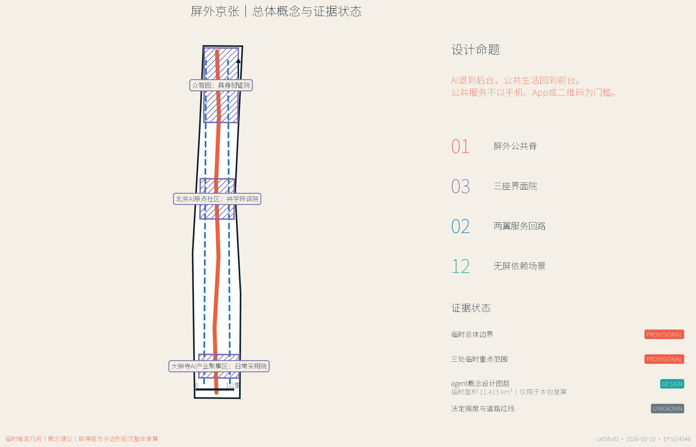
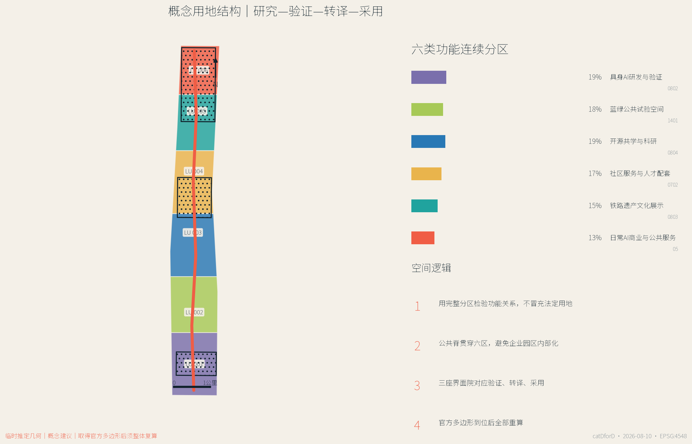
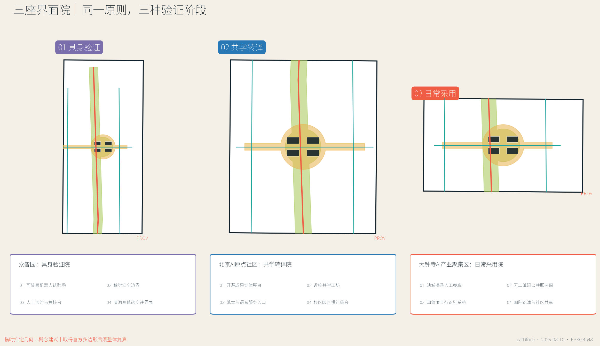
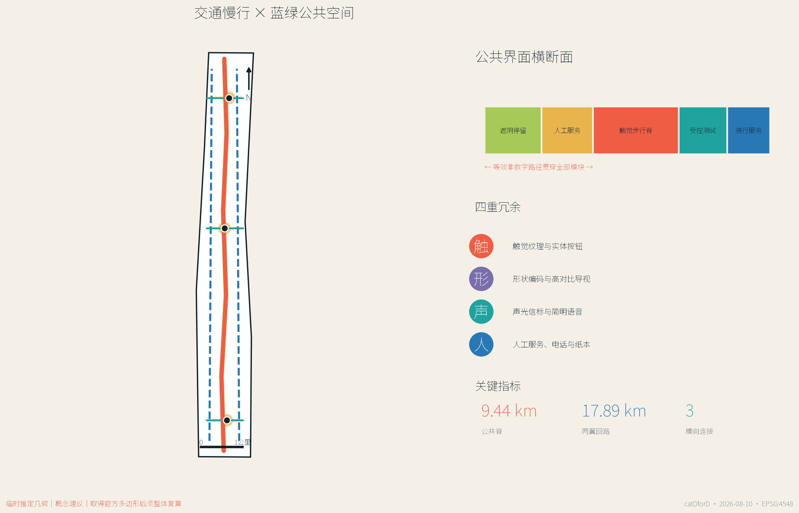
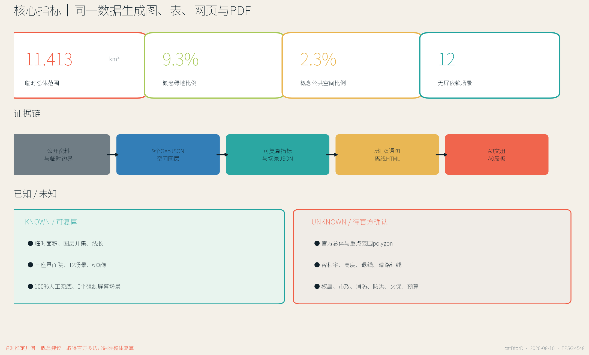

# 屏外京张 / JING-ZHANG BEYOND THE SCREEN

> AI 退到后台，公共生活回到前台。公共服务可以因 AI 更聪明，但不应因没有手机、App、二维码、稳定网络或数字熟练度而失效。

## 设计依据与资料清单

本方案把“AI 城市”重新定义为一种**无屏依赖的公共基础设施**。AI 可以在后台辅助环境感知、信息转译、设施维护、企业服务和风险提示，但一个人完成步行、换乘、问询、办事、学习、休息与公共参与，不应被迫拥有智能手机或建立个人数字身份。方案的核心不是减少一切屏幕，而是保证每一项公共服务都有同等有效的非屏幕路径，并在自动化失败、语言不通、设备断网或使用者不愿授权时，仍有清晰的人工兜底 [source:AGENT-TASKBOOK] [depth:existing_conditions_diagnosis]。

第一权威依据是北京市规划和自然资源委员会海淀分局发布的资格预审公告；项目任务、三层范围、三处重点区域和成果深度均以公告及仓库登记资料为准 [source:OFFICIAL-ANNOUNCEMENT] [standard:PROJECT-OFFICIAL-ANNOUNCEMENT]。本包同时读取 `brief/site-package/`、`data/source_registry.json` 与处理后的 agent fact pack，区分官方公开、背景参考、临时推定和 agent 设计。国际案例只用于策略比较，不用于推定北京的法定边界、控制指标或实施承诺。

当前没有官方精确总体红线和三处重点区域 polygon，因此本方案保留仓库维护者提供的临时推定边界。其投影面积复算为约 11.413 平方公里，与公告“约 11.4 平方公里”的文字量级相符，但不能据此获得法定精度 [data:geometry/site_boundary.geojson#PROV-SITE-001] [metric:site_area_sqm]。三处重点范围同样使用 `PROV-KEY-001/002/003`，只用于组织概念、图件和自检。背景 OSM 核验中，已测绘遗址公园与该临时范围没有形成空间相交；本方案没有用这一现象移动边界，而是把它登记为必须等待官方几何解决的数据缺口。

全部空间图、指标、HTML 和 PDF 由同一套 GeoJSON 与结构化场景生成。图中没有商业地图截图、远程瓦片或生成式效果图；颜色表达的是方案逻辑而非现状权属。所有建设强度、建筑高度、道路红线、市政设施、文保边界和工程做法均保持为未知或待专业确认，空间建议只作为可供专业团队深化的参考方案 [source:SOURCE-REGISTRY] [data:geometry/constraints.geojson#CONSTRAINTS]。

## 三层范围工作框架

公告把工作分成约 43.6 平方公里统筹研究范围、约 11.4 平方公里总体设计范围和约 368.4 公顷三处重点区域。屏外京张不把三层范围做成三套互不相干的图，而是建立“价值—网络—原型”的连续验证链：统筹研究层提出产业与公共价值；总体设计层组织公共脊、服务回路、用地和蓝绿结构；重点区域层用三座界面院验证空间、运营、治理和使用体验 [source:PROCESSED-FACT-PACK] [depth:three_level_scope_framework]。

总体空间语法是“一脊三院、两翼十二景”。**一条屏外公共脊**沿临时总体范围南北连续，提供触觉方向、声光提示、形状编码、纸本信息、遮阴休息和人工服务；**三座界面院**分别位于众智园、北京AI原点社区和大钟寺，承担具身验证、共学转译与日常采用；**两翼服务回路**把高校、企业、社区和轨道站点接回公共脊；**十二个场景原型**把产业试验、交通、公共服务、气候适应和年度运营落到可复核对象 [data:geometry/roads.geojson#ROAD-001] [metric:screen_optional_spine_length_m]。

| 层级 | 核心问题 | 屏外京张的回答 | 可复核证据 |
| --- | --- | --- | --- |
| 统筹研究范围 | AI产业如何形成公共价值，而非只形成园区内部效率 | 建立“研究—具身验证—公共转译—日常采用—治理复盘”链条 | `sources.json`、国际案例比较、运营机制 |
| 总体设计范围 | 如何让长廊型城区可达、可识别、可停留 | 一条公共脊、两翼回路、六类概念用地、连续蓝绿与横向连接 | `geometry/land_use.geojson`、`roads.geojson`、`green_space.geojson` |
| 重点区域 | 如何把AI场景做成可观察、可退出、可人工接管的城市原型 | 三座差异化界面院及十二个场景卡 | `geometry/key_areas.geojson`、`public_space.geojson`、场景 JSON |

三层之间设置双向校准：上层目标必须在重点区域找到空间与运营载体，重点区域的失败和公众反馈也必须反向修改总体规则。由临时边界计算的三处重点范围合计约 369.3 公顷，只是当前机器校核值，不替代公告面积或正式 polygon [data:geometry/key_areas.geojson#PROV-KEY-001] [metric:key_area_total_sqm]。

## 统筹研究范围产业与未来城市研究

屏外京张提出一条不同于“把城市装进 App”的产业路径：**高校与研究机构提供方法，众智园验证具身系统，北京AI原点社区完成开源转译，大钟寺检验日常采用，整条公共脊公开失败、修复和治理过程。** 这条链的产业价值在于形成无障碍接口、端侧模型、公共服务工具、低速机器人、可解释导视和运维协议等可复用能力，而不是以采集更多个人数据作为增长前提 [standard:PROJECT-AGENT-OPEN-CALL-TASKBOOK] [depth:overall_spatial_structure]。

七个国际案例提供互补启示，但没有一个被照搬。新加坡 one-north 显示研究、企业与公共环境需要长期协同；赫尔辛基 Smart Kalasatama 把居民日常时间收益作为创新尺度；Cornell Tech 把校园、创业和公共开放空间结合；Woven City 提供受控生活实验的组织方式；STATION F 展示清晰实体地址和共享企业服务的重要性；MaRS 强调研究向公共价值与企业转化；Berlin Adlershof 说明科学、媒体、企业和城市生活需要长期共址 [source:INTL-ONE-NORTH] [source:INTL-KALASATAMA]。

| 案例 | 可借鉴机制 | 屏外京张的转译 | 不直接复制的部分 |
| --- | --- | --- | --- |
| one-north | 研究、企业、公共空间协同 | 把公共脊作为跨机构共同前台 | 不推定同等治理结构与土地条件 |
| Smart Kalasatama | 以日常生活收益评价创新 | 用“能否不用手机完成服务”作为公平指标 | 不复制数据平台或服务承诺 |
| Cornell Tech | 校园—创业—城市界面 | 原点社区共学转译院 | 不复制校园建筑或融资模式 |
| Woven City | 受控测试与持续迭代 | 众智园具身验证院、可立即人工接管 | 不把生活区当作无限制实验场 |
| STATION F | 清晰实体地址与共享服务 | 大钟寺日常采用院和人工服务窗 | 不复制单体孵化器规模 |
| MaRS | 公共利益创新与转化服务 | 健康、教育、法律联合问询桌 | 不替代专业意见和授权流程 |
| Adlershof | 长周期科研产业城区 | 分期治理、运营和公共空间共同演进 | 不推定同等产业结构或开发时序 |

面向未来城市形态，方案把“智能”分为三层：看得见的公共界面尽量简单、稳定、可触摸；看不见的后台系统必须最小化数据、可审计、可停用；两者之间由人工服务、公开规则和故障告知连接。这样，AI 产品可以在城市中获得真实验证，公众也能知道何时在与机器互动、如何选择替代路径、由谁承担后果。该研究结论通过重点区域、风险矩阵和年度运营体系落地，而不被写成抽象品牌口号 [source:INTL-CORNELL-TECH] [source:INTL-WOVEN-CITY]。

## 总体设计范围城市更新与控规深度城市设计

总体设计把长约 9.44 公里的屏外公共脊作为概念骨架，并用总长约 17.89 公里的两翼回路连接外侧服务资源。`roads.geojson` 表达的是概念慢行和服务联系，不是道路红线；任何跨越现状主干路、轨道设施或权属边界的连接，都必须等待交通、工程和产权复核 [data:geometry/roads.geojson#ROAD-001] [depth:traffic_rail_slow_parking]。

概念用地采用六个连续分区：具身AI研发与验证、蓝绿公共试验、开源共学与科研、社区服务与人才配套、铁路遗产文化展示、日常AI商业与公共服务。六区完整覆盖临时总体边界且不重叠，作用是检验功能比例和上下游关系，不是修改法定用地。正式深化时，应以官方现状、控规、权属和城市更新政策替换本分区，并整体复算建筑、绿地、公共空间与承载指标 [data:geometry/land_use.geojson#LU-001] [standard:MNR-LAND-USE-CLASSIFICATION-GUIDE]。

建筑层只提交三座界面院周围的概念载体基底，用来表达实验室、孵化器、社区服务和混合功能如何围合公共院落。它们不是现状建筑测绘，也不是拆除或新建决定；基底面积指标只代表“本次提交的原型载体”，不能被解读为全域建筑规模 [data:geometry/buildings.geojson#BLDG-001] [metric:building_footprint_area_sqm]。建筑高度、容积率、密度、退线、消防和停车均保留为 unknown。

更新策略采用“先界面、后空间、再制度”的顺序。第一步用标识、触觉、纸本、人工桌和可移动设施验证服务是否真正可达；第二步在权属和交通明确后完善公共空间与建筑首层；第三步才研究更长期的功能更新与制度协同。每一步都设置停止条件：影响通行、引发监控疑虑、无法稳定运维或不能提供人工兜底的原型不得扩大。

## 重点区域详细设计

三处重点区域不是同一种“AI展示中心”的复制，而是创新链中三个不同验证阶段。其多边形均为临时推定，设计动作只在概念层说明功能、界面、建筑载体、交通联系和运营依赖 [data:geometry/key_areas.geojson#PROV-KEY-001] [depth:three_key_area_detailed_design]。

### 1. 众智园：具身验证院

定位是“让机器先学会在公共空间里谦让”。中心公共院落设置可见的低速测试边界、触觉安全带、观察席和人工接管台，周边概念载体容纳机器人、无障碍接口、端侧安全与标准治理团队。清河侧界面优先作为蓝绿交往与气候试验空间，任何临水动作均等待河道、防洪与生态条件确认。产业测试包括机器人共道验证场与具身无障碍试验室；公开开放必须有固定时段、参与同意、清晰退出和现场安全员。

### 2. 北京AI原点社区：共学转译院

定位是“把代码和模型翻译成公众能理解、触摸、质疑和带走的知识”。开源成果不只在屏幕滚动，而以实体模型、纸本模型卡、失败案例抽屉、真人讲解和可复核测试台出现。近校步行连接、共学工坊、联合问询桌和端侧模型检验台共同服务高校师生、开发者、居民与中小企业。建筑动作以首层开放、院落共享和既有空间复用优先，是否保留、改造或新建必须等待现状与权属调查。

### 3. 大钟寺AI产业聚集区：日常采用院

定位是“在最普通的一次换乘和办事中检验AI是否公平”。围绕大钟寺站和四象限步行联系，设置双语形状编码、地面纹理、声光提示、换乘陪伴点和无二维码公共服务窗。企业路演、智能终端体验与国际接待可以使用同一公共院落，但须与居民日常通行、休息和社区服务分时共享。AI只做公开信息导航和需求分流；医疗、教育、法律、政务等高风险事项由专业人员处理。

| 界面院 | 产业验证 | 公共界面 | 人工兜底 | 深化前置条件 |
| --- | --- | --- | --- | --- |
| 具身验证院 | 机器人、无障碍、端侧安全 | 低速试验、触觉边界、观察席 | 安全员立即接管 | 河道、防洪、道路、测试许可 |
| 共学转译院 | 开源、模型卡、成果转化 | 实体展台、纸本卡、联合问询 | 导览员、专业咨询预约 | 现状建筑、校区关系、权属 |
| 日常采用院 | 智能终端、企业服务、内容传播 | 换乘、办事、双语导视 | 站务、人工窗口、电话 | 轨道接口、路口、市政、运营 |

## AI 创新生态、人才画像与 AI+ 场景

本方案把“用户画像”理解为服务障碍与空间需求，而不是预测个人偏好。六类优先使用者包括低视力通勤者、不熟悉智能手机的老人、携童家庭、开源开发者与高校师生、中小AI企业团队、国际访客与新来者。每类画像都对应非数字化入口，且不得由公共空间摄像或行为轨迹自动推断 [source:AGENT-TASKBOOK] [metric:persona_count]。

| 画像 | 主要障碍 | 空间与服务响应 |
| --- | --- | --- |
| 低视力通勤者 | 导视只靠小字和地图屏 | 连续触觉、声光过街、真人问询 |
| 不熟悉智能手机的老人 | App下载、账号、验证码和支付链过长 | 纸本流程、实体按钮、电话预约、人工窗口 |
| 携童家庭 | 试验设备与快速通行混杂 | 可见安全边界、低速规则、遮阴停留 |
| 开源开发者与高校师生 | 成果难以转化为公众理解 | 实体模型卡、测试台、共学工坊 |
| 中小AI企业团队 | 合规、场景和服务入口分散 | 人工企业服务台、验证院、公开测试规则 |
| 国际访客与新来者 | 本地App、中文界面和身份体系门槛 | 双语符号、真人接待、无需本地账号的路线 |

十二个场景原型全部遵循“双通道等效”：数字渠道可以更便捷，但非智能手机渠道必须完成同一件事；全部场景具有人工兜底，因此 `human_fallback_ratio=1.0`，要求个人屏幕才能进入的公共场景数量为 0 [metric:human_fallback_ratio] [metric:screen_required_public_service_count]。

| 编号 | 场景 | 空间载体 | 屏外界面 | 人工兜底与数据边界 |
| --- | --- | --- | --- | --- |
| S01 | 触觉方向轨 | 屏外公共脊 | 纹理、形状、高对比导视 | 服务员与纸本地图；不采个人轨迹 |
| S02 | 声光过街信标 | 横向连接 | 声、光、触觉过街提示 | 人工交通引导；只记设备状态 |
| S03 | 公共服务双通道窗 | 日常采用院 | 语音、纸本、实体按钮 | 人工办理与电话；敏感事项离线处理 |
| S04 | 站城换乘陪伴点 | 大钟寺站周边 | 颜色、纹理、固定地标 | 志愿者与站务；只做匿名问题分类 |
| S05 | 城市维修铃 | 公共脊节点 | 实体拉环、电话、人工台 | 纸本工单；只保留故障信息 |
| S06 | 热舒适会呼吸的廊架 | 蓝绿公共空间 | 环境响应与手动开关 | 固定遮阴；只用环境数据 |
| S07★ | 机器人共道验证场 | 具身验证院 | 可见低速区和触觉边界 | 安全员接管；测试日志脱敏 |
| S08★ | 具身无障碍试验室 | 具身验证院 | 扶手、语音、触觉、机器人辅助 | 可停止测试；知情同意与可撤回 |
| S09★ | 端侧模型检验台 | 共学转译院 | 实体样本与公开测试卡 | 专家复核；仅清权测试集 |
| S10 | 开源成果转译廊 | 共学转译院 | 触摸模型、纸本卡、真人讲解 | 定时导览；公开许可与署名 |
| S11 | 健康教育法律联合问询桌 | 共学转译院 | AI公开信息导航 | 专业预约；不输入敏感档案 |
| S12 | 屏外城市周 | 全线公共空间 | 实体徽章、公共桌、步行路线 | 社区联络人；只做聚合计数 |

三项带星号的产业测试场景分别验证低速具身系统、无障碍接口和端侧模型。测试结果不能由企业自行宣布“通过”，而应公开测试条件、失败模式、人工复核者和改进记录。任何场景如不能提供等效非屏幕路径，或需要未经授权的个人数据，必须停留在封闭实验室而不能进入公共空间 [source:SOURCE-REGISTRY] [depth:risk_missing_data]。

## 用地、建筑规模与拆改留方案

概念用地以六个南北连续分区表达创新链，而非推定现状地类或法定用途。每个分区都必须承担公共前台：研发区面对具身验证院，科研区面对共学转译院，商业服务区面对日常采用院，蓝绿、社区与文化分区则保证公共脊不是企业内部通道。分区面积由临时边界几何直接切分，可在官方多边形到位后整体替换和复算 [data:geometry/land_use.geojson#LU-001] [depth:land_use_layout]。

建筑策略采用“保留优先、改造验证、增量最后”的方法，但不对任何真实建筑做拆改留判定。正式深化需先建立建筑年代、结构安全、使用状态、产权、租赁、消防、能耗、首层开放性与文化价值清单，再按四类处理：稳定使用且有价值者保留；首层封闭但结构可用者轻改；功能冲突但可转用者深改；只有在专业论证和合法程序后，才讨论拆除或新增。当前 `buildings.geojson` 只画出十二个界面院概念载体 [data:geometry/buildings.geojson#BLDG-001] [depth:retain_renovate_demolish]。

体量与风貌建议不用伪精确高度控制，而使用可复核关系：临公共院落的首层应可进入、可识别并有连续遮阴；大型研发载体应以多个可穿行体量形成公共缝隙；屋顶可研究低碳设备与公共活动，但须先核验结构和消防；历史文化界面避免用夸张“未来感”遮盖铁路叙事。最终高度、容积率、密度、退线和天际线必须以官方控规、文保与城市设计审查为准 [standard:MOHURD-URBAN-DESIGN-MEASURES] [depth:height_massing_character]。

因此，已知的建筑基底指标只是原型载体面积，未知的 `floor_area_ratio` 与 `maximum_building_height_m` 在 `metrics.json` 中保持空值。A3/A0 只展示空间关系、界面和依赖条件，不将概念体量表现成获批建筑方案。

## 交通、轨道、市政与公共服务设施

交通系统的优先级是“先可读、再连续、后提速”。屏外公共脊提供连续的步行识别，两翼回路补充骑行、服务和场景维护，三条横向连接把重点区域与两翼连接。导视采用形状、颜色、触觉和简明双语的冗余编码：即使一种感官、语言或设备失效，使用者仍能找到方向 [data:geometry/roads.geojson#ROAD-001] [standard:MOHURD-CONTROL-DETAILED-PLANNING]。

大钟寺重点研究站口—街角—公共院落的连续识别，但不虚构站内改造和道路工程。众智园重点研究低速机器人与行人共道的让行规则；原点社区重点研究校区、园区和社区之间的慢行缝合。跨主干路、铁路、桥下和轨道设施的任何连通都必须由交通、轨道、消防和无障碍专业复核。停车与非机动车停放也必须基于现状调查，当前不报固定泊位数。

市政与新型基础设施采用“后台可智能、前台可手动”。端侧计算节点、环境传感、设备状态和能源控制可以辅助服务，但必须有物理开关、断网模式、可维护部件和清晰责任人。公共终端不得要求居民输入病历、学籍、法律案件或身份信息；敏感服务转入专业空间。由于管线、容量、排水、防洪、消防和电力资料缺失，设施位置和规模只作为概念建议 [data:geometry/constraints.geojson#CONSTRAINTS] [depth:municipal_new_infrastructure]。

公共服务设施分三级：沿公共脊每隔一段设置简单的方向、休息和维修入口；三座界面院提供人工综合服务；高校、企业、医院、社区和轨道运营者提供专业后端。服务绩效不以“扫码量”衡量，而看同一事项能否通过数字和非数字渠道完成、人工转介是否及时、设备故障是否可见、弱势使用者是否拥有退出权。

## 蓝绿空间、公共空间与城市风貌

蓝绿系统不是用来装饰科技园的背景，而是无屏公共生活的主要载体。约 105.8 公顷概念绿地沿公共脊连续，并在三座界面院形成扩大节点；约 26.1 公顷公共空间由院落和横向连接组成。二者可能重叠，因为一处绿地也可以承担步行、休息、学习和测试；指标分别按各自图层并集计算 [data:geometry/green_space.geojson#GREEN-001] [metric:green_ratio]。

公共空间设置四类基础模块：安静停留、共同学习、受控测试和人工服务。安静停留提供遮阴、靠背、饮水和无消费门槛座椅；共同学习提供公共桌、实体模型和可带走材料；受控测试提供可见边界、旁观区、绕行路线和停止机制；人工服务提供面对面、电话和纸本渠道。模块可撤回、可维修、可重新组合，先用运营验证再决定永久建设 [data:geometry/public_space.geojson#PUBLIC-001] [depth:blue_green_public_space]。

城市风貌采用“铁路线、公共桌、界面院”三种朴素原型。铁路线转译为连续方向纹理，但不假冒历史构件；公共桌象征跨机构共同工作；界面院把企业展示转为公众可进入的空间。每个重点区域设置一组独特的形状、声音和触觉编码，同时保持全线规则一致。照明优先均匀、低眩光和可维护，不用高亮屏幕制造地标。

遗产叙事必须等待官方遗址公园与文保几何。当前 OSM 背景与临时总体范围存在约 412 米的最近距离且没有相交，这只是数据核验结果，不证明任何一方“错误”。正式深化时应以官方保护范围、建设控制地带、历史建筑和视线要求为准，重新定位公共脊与文化展示节点 [source:BOUNDARY-SOURCE] [depth:existing_conditions_diagnosis]。

## 更新项目清单、实施政策与分期计划

更新项目被组织为九个可独立复核的工作包。它们是概念建议，不代表政府、业主、企业或运营者已经承诺实施 [data:geometry/phasing.geojson#PHASE-001] [depth:renewal_project_list]。

| 编号 | 概念项目 | 近期可验证内容 | 必须确认的条件 |
| --- | --- | --- | --- |
| BS-01 | 屏外公共脊导视样段 | 形状、触觉、双语、纸本地图共测 | 现状人流、无障碍规范、维护主体 |
| BS-02 | 众智园具身验证院 | 低速试验边界、观察席、接管台 | 测试许可、安全、道路与河道条件 |
| BS-03 | 原点社区共学转译院 | 实体模型卡、失败案例、人工导览 | 场地权属、建筑安全、内容许可 |
| BS-04 | 大钟寺日常采用院 | 换乘陪伴点、公共服务双通道窗 | 轨道、路口、站务、市政、运营 |
| BS-05 | 两翼服务回路 | 骑行识别、服务补给、维护路线 | 道路现状、产权、停车与冲突 |
| BS-06 | 三处热舒适廊架 | 遮阴、环境感知、手动控制 | 结构、能源、排水、运维成本 |
| BS-07 | 城市维修铃网络 | 实体报修、电话、纸本工单 | 工单系统、响应责任、隐私规则 |
| BS-08 | 无屏服务标准与审计 | 双通道完成率、人工转介、退出权 | 运营者、评价主体、公开机制 |
| BS-09 | 屏外城市周 | 步行路线、公共桌、开放测试 | 活动许可、安全、居民协商、版权 |

空间分期由三类互不重叠的几何表达：0—2 年以三座界面院和横向公共连接的轻量原型为主；2—5 年在评估后补全公共脊连续性；官方控规、道路、权属、市政和文保条件明确后，才研究其余片区更新。分期面积之和等于当前临时总体边界，但时间只是参考顺序，不是投资或建设承诺 [data:geometry/phasing.geojson#PHASE-002] [depth:phasing_implementation]。

运营体系采用“每周有服务、每月有维修、每季有开放测试、每年有公共复盘”：固定时段人工服务台保证非数字渠道；每月维修日公开设施问题与处理状态；季度开放测试邀请居民、残障使用者、开发者和企业共同观察；年度屏外城市周串联三座界面院；所有活动发布测试边界、数据规则、责任人和退出方式。若运营预算不能保障人工兜底，项目不应以自动化代替。

政策层建议建立无屏公共服务条款、可撤回试点许可、公共空间测试伦理、设备生命周期责任和跨机构维修工单。它们均需法律、规划、交通、数据安全、残障权益和采购专业人员深化，不构成现行政策解释或官方承诺。

## 指标体系、面积复算与合规矩阵

指标分为三类：可由提交几何复算的空间指标、可由结构化场景计数的方案指标、必须等待官方资料的管控指标。所有面积和长度统一投影到 EPSG:4548 计算；图件、HTML 和 PDF 读取同一 JSON，因此不会出现“图上一套、表里一套”的数字 [depth:metrics_recalculation] [source:GENERATED-EVIDENCE]。

| 指标 | 当前值 | 状态与含义 |
| --- | ---: | --- |
| 临时总体范围面积 | 11.413 km² | known / provisional，仅用于本包复算 |
| 三处重点范围合计 | 369.3 ha | known / provisional，不替代公告或官方 polygon |
| 概念绿地面积与比例 | 105.8 ha / 9.3% | 由绿地图层并集复算 |
| 概念公共空间面积与比例 | 26.1 ha / 2.3% | 由公共空间图层并集复算 |
| 概念建筑载体基底 | 3.93 ha | 仅三座界面院原型，不是全域现状建筑 |
| 屏外公共脊长度 | 9.44 km | 概念中心线长度，待交通复核 |
| 两翼服务回路长度 | 17.89 km | 概念骑行与服务联系 |
| 场景原型 / 产业测试 | 12 / 3 | 场景 JSON 计数 |
| 人工兜底覆盖率 | 100% | 十二场景均有人工路径 |
| 依赖个人屏幕的公共场景 | 0 | 方案规则，不是现状统计 |
| 容积率、建筑高度、道路红线 | unknown | 等待官方控规与工程条件 |

合规矩阵逐条覆盖公告 1.3、1.4、1.5 与 agent.1—agent.6，并把章节、图层、指标、图纸、HTML、来源、假设和自检相互挂接。标准矩阵保留城市设计、控规深度、国土用途分类等依据；设计深度矩阵覆盖现状诊断、三层范围、用地、强度、建筑、交通、市政、蓝绿、重点区域、项目、分期、复算与风险。矩阵的“complete”表示提交证据链完整，不表示官方数据缺口已经消失或工程可行性已经确认 [standard:MOHURD-URBAN-DESIGN-MEASURES] [depth:development_intensity_controls]。

当官方 polygon 到位时，必须整体替换 `site_boundary` 与 `key_areas`，再裁切用地、道路、绿地、公共空间、建筑和分期，重新生成 metrics、五张图、HTML 与 PDF。禁止只改一个面积数字而保留旧图。

## 风险、版权与合规说明

本方案最大的技术风险不是“AI不够强”，而是便利性掩盖了排斥：把扫码、账号、摄像和自动判断设为默认，会把设备、能力、语言、网络和信任差异转化为公共服务差异。为此，公平与包容性在 `risk.json` 中被评为最高风险，并以双通道等效、共同设计、人工兜底、可退出和公开审计缓解 [source:AGENT-TASKBOOK] [depth:risk_missing_data]。

第二类风险是空间与政策不确定。临时边界、重点范围、用地、道路和建筑均不能当作审定成果；正式图纸、现状测绘、文保、权属、道路、轨道、市政、消防、防洪与运营条件缺失时，方案只提出方法和待确认清单。第三类风险是运维：人工服务、纸本材料、多语种、设备维修和公开复盘需要持续资金，不能在建成后被“全自动化”削减。

数据治理遵循最小化、目的限定、公开说明和人工复核。公共空间默认只采环境、设备状态和聚合计数；不做人脸识别、个人轨迹、情绪推断或商业画像。健康、教育、法律和政务敏感信息不在开放终端处理。具身测试必须说明参与者、时段、边界、记录、退出和事故响应，公众拥有绕行和不参与权。

版权方面，全部图件和图纸由提交数据确定性生成，没有把 AI 生成效果图当作证据。国际案例只引用官方网页的事实与策略，不复制图片、标志和长段文字。字体、软件和资料用途见 `sources.json` 与双语版权声明。本方案不主张任何官方批准、政府背书、建设许可、投资承诺或工程可行性；任何后续使用都必须重新核验资料、权利和专业条件 [source:SOURCE-REGISTRY] [data:geometry/constraints.geojson#CONSTRAINTS]。

## 参考资料

本方案的主要依据包括：北京市规划和自然资源委员会海淀分局资格预审公告、仓库 `brief/site-package/` 内的设计简报、allowed design space、agent taskbook、枚举、规划限制、标准本地快照、来源登记表、处理后的事实包和临时边界。它们分别回答“任务是什么、资料能否用于 formal、哪些值可以计算、哪些控制必须保持未知”。完整机器索引见 `sources.json`，来源使用边界见 `data/source_registry.json` [source:SITE-PACKAGE] [source:SOURCE-REGISTRY]。

国际策略参考来自 JTC one-north、Smart Kalasatama、Cornell Tech、Toyota Woven City、STATION F、MaRS Discovery District 和 Berlin Adlershof 的官方公开页面。比较只提取研究—企业—公共空间关系、生活实验治理、校园创新、共享服务、成果转化和长期城区运营等机制；没有把其规划尺度、法规、建筑、投资或技术承诺直接移植到海淀 [source:INTL-STATION-F] [source:INTL-MARS]。

提交包的空间证据包括九个 GeoJSON 文件、`metrics.json`、`assumptions.json`、`compliance_matrix.json`、`standard_matrix.json`、`design_depth_matrix.json`、`risk.json` 和 `spatial.json`；可读成果包括中英正文、五组双语图、离线中英 HTML、A3 文册与 A0 展板。最终专业判断仍需回到官方资料、现场调查、法定程序和人工评审 [source:INTL-ADLERSHOF] [standard:PROJECT-AGENT-OPEN-CALL-TASKBOOK]。
