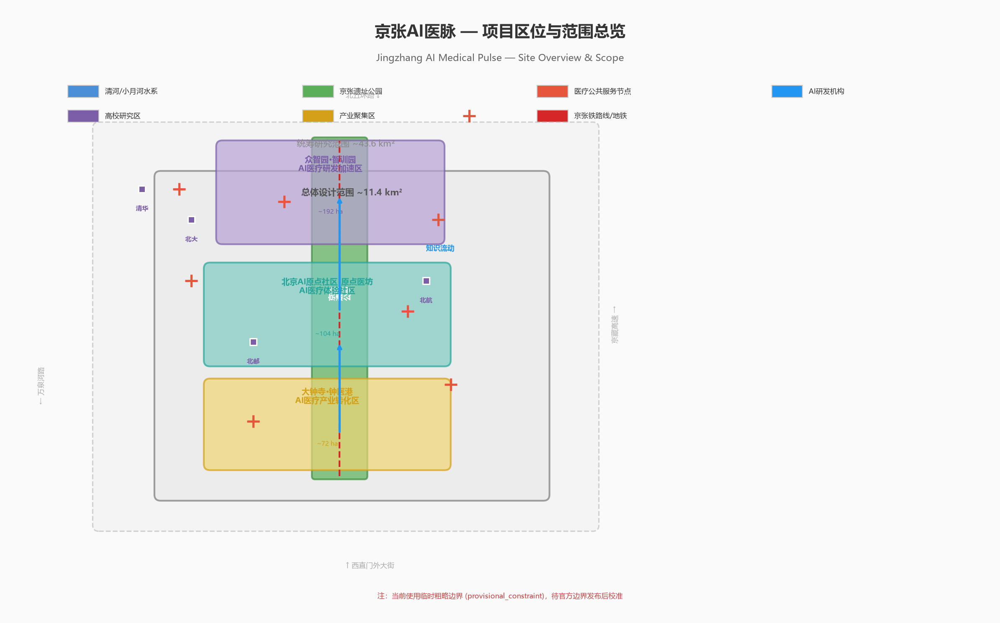
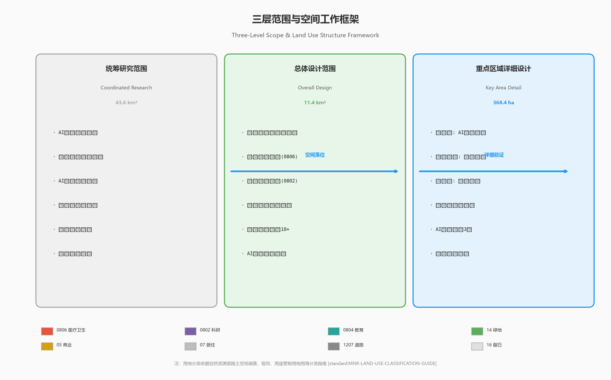
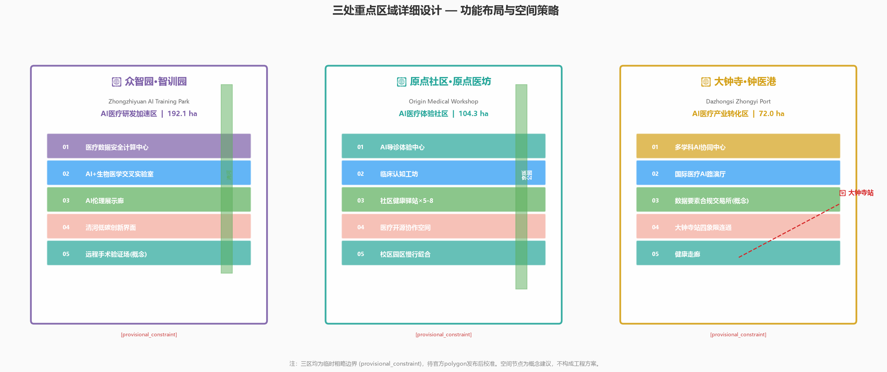
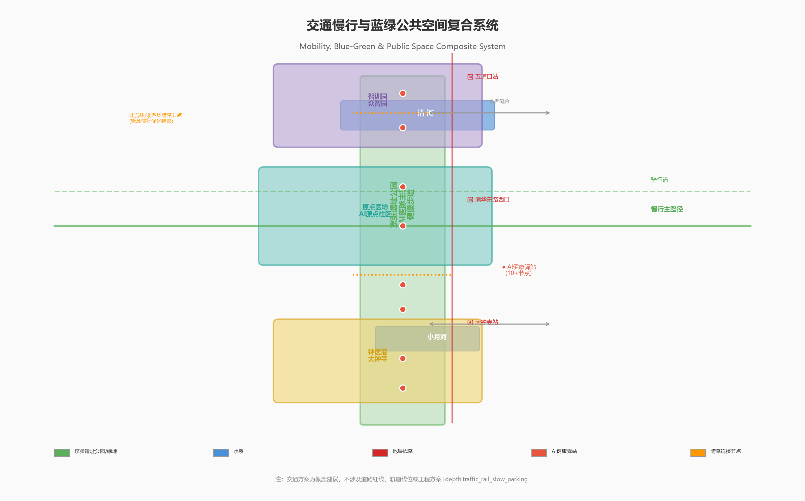
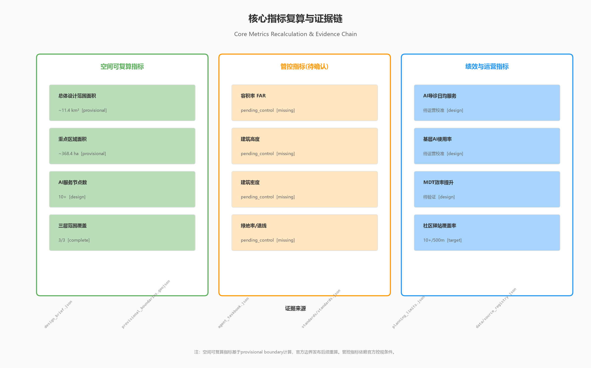

# Jingzhang AI Medical Pulse — AI-Driven Distributed Medical Knowledge Collaboration & Public Service Innovation Corridor

## Design Basis & Source Inventory

This proposal takes the official prequalification announcement issued by the Haidian Branch of the Beijing Municipal Commission of Planning and Natural Resources as its primary design authority [source:OFFICIAL-ANNOUNCEMENT]. It builds on the structured design brief, agent taskbook, provisional boundaries, standards, and source registries in `brief/site-package/` [source:SITE-PACKAGE].

The core proposition: China's healthcare system suffers from a structural bottleneck — clinical expertise is locked within individual physicians, making high-quality diagnostic capabilities difficult to replicate at scale, eroding trust in primary care, and fragmenting cross-department collaboration. AI offers a systematic way to address this, and the Jingzhang corridor — home to China's densest concentration of AI research (Tsinghua, Peking University, Beihang, CAS) and substantial medical resources — provides the ideal spatial proving ground.

This proposal follows the source use boundaries registered in `data/source_registry.json` [source:SOURCE-REGISTRY]. All formal assertions rely on public or cleared materials. Medical data, case records, and physician experience distillation are described as research directions to be pursued within compliance frameworks; no real patient data is used, and no institutional authorization is claimed.

Spatial data currently relies on provisional boundaries from `brief/site-package/geometry/provisional_boundaries.geojson`. All spatial proposals are conceptual; recalibration will be required when official boundaries are released [data:geometry/site_boundary.geojson#SITE-001].

## Three-Level Scope Framework

The proposal operates across three planning levels as defined by the official announcement [standard:PROJECT-OFFICIAL-ANNOUNCEMENT]:

| Level | Area | AI Medical Task | Spatial Strategy |
| --- | --- | --- | --- |
| Coordinated Research Area | ~43.6 km² | Build a district-wide AI medical knowledge collaboration network; study how AI can reshape tiered diagnosis and treatment from the ground up | Identify spatial distribution of medical resources, AI research institutions, and community nodes; establish a "R&D → Validation → Application → Feedback" loop |
| Overall Design Area | ~11.4 km² | Deploy medical data training infrastructure, AI triage experience centers, and cross-department collaboration demonstration nodes along the Jingzhang Park axis | Connect three key areas via the park spine to form the "AI Medical Pulse" public space sequence |
| Key Detailed Design Area | ~368.4 ha | Three zones take on differentiated functions: medical AI R&D acceleration, community medical experience, and industry transformation | Zhongzhiyuan → R&D & training; AI Origin Community → experience & validation; Dazhongsi → industry transformation |

Spatial evidence is carried by [data:geometry/site_boundary.geojson#SITE-001] and [data:geometry/key_areas.geojson#PROV-KEY-001]. Current boundaries are provisional; node locations and area metrics require recalibration upon official boundary release.

## Coordinated Research Area: Industry & Future City Strategy

### Core Concept: "Jingzhang AI Medical Pulse"

The overall concept is named "AI Medical Pulse" (AI医脉). The character "脉" (pulse/vessel/meridian) simultaneously evokes the Chinese medical concept of meridians (knowledge transmission) and the railway artery (the Jingzhang line), symbolizing how AI opens vessels for medical knowledge to flow like a railway — no longer confined by individual physicians' experience boundaries [source:AGENT-TASKBOOK].

**Naming System**:
- Corridor name: Jingzhang AI Medical Pulse (京张AI医脉)
- Three zone names: AI Training Park (智训园/Zhongzhiyuan), Origin Medical Workshop (原点医坊/AI Origin Community), Zhongyi Port (钟医港/Dazhongsi)
- Visual direction: "脉" character in seal script blended with neural network topology lines; blue (AI/technology) + green (health/life) dual-color system

**Three Positionings mapped to AI healthcare**:
- Centennial Jingzhang Cultural Belt → Zhan Tianyou connected China by rail; AI Medical Pulse connects physicians by knowledge network
- Urban AI Life Experience Belt → AI triage, remote consultation, and health monitoring are embedded in daily life
- AI Integration Innovation Belt → Medical AI spans NLP, computer vision, knowledge graphs, federated learning — the ultimate test of AI's full-stack capability

### Global AI Medical Ecosystem Case Studies

Eight global case studies inform the spatial strategy [depth:ai_ecosystem_case_studies]:

1. **Mayo Clinic + Google Health (USA)** — Clinical-AI integration with cross-campus diagnostic knowledge sharing. Lesson: the "clinical-research-education" triad spatial model.
2. **NHS AI Lab (UK)** — National-level medical AI ethics framework and sandbox testing. Lesson: dedicate space for medical AI regulatory sandboxes at Zhongzhiyuan.
3. **Singapore National AI Strategy in Healthcare** — AI chronic disease management embedded in community clinics. Lesson: community AI health station density and functional configuration.
4. **Babylon Health (UK/Rwanda)** — AI symptom triage + telemedicine. Lesson: public space expression of AI triage as SaaS-enabled primary care.
5. **Shenzhen AI Pathology Platform** — Multi-hospital federated learning for pathology. Lesson: federated learning requires physical secure computation nodes.
6. **Japan AI Clinical Decision Support (hospital + nursing care)** — AI coverage across acute-to-rehab continuum. Lesson: full-chain "pre-diagnosis → diagnosis → post-treatment → rehabilitation" spatial planning.
7. **Wadhwani AI (India)** — AI-assisted community health workers for TB screening. Lesson: AI lowering the barrier to primary care — applicable to Beijing community context.
8. **Stanford AIMI Center** — Interdisciplinary AI + medical imaging research center spatial organization. Lesson: cross-disciplinary AI medical research must break departmental silos in physical space.

Three spatial principles emerge: (1) AI medical R&D needs proximity to clinical spaces for feedback loops; (2) AI medical experiences must be embedded in everyday community settings, not locked inside hospitals; (3) cross-institutional data collaboration requires dedicated secure computation nodes.

## Overall Design Area: Urban Renewal at Regulatory Planning Depth

### Spatial Structure: "One Pulse, Three Cores, Multiple Nodes"

The 11.4 km² overall design area is organized as "One Pulse, Three Cores, Multiple Nodes" [depth:overall_spatial_structure]:

- **One Pulse**: Jingzhang Heritage Park AI Medical Pulse spine — medical knowledge display nodes, AI health interactive installations, and community health kiosks along the park trail
- **Three Cores**: corresponding to the three key areas
- **Multiple Nodes**: 10+ AI health micro-stations (AI Triage Kiosks) at transit stations, community centers, and university entrances

### Four AI Medical Spatial Innovation Dimensions

**Dimension 1: Medical Record Deep Training Infrastructure**

A "Medical Data Lake" concept node at Zhongzhiyuan — a distributed infrastructure cluster comprising secure computation centers, de-identified data warehouses, and federated learning nodes. This addresses the core bottleneck of medical AI: scarcity of high-quality annotated medical data and institutional barriers to cross-hospital data sharing [depth:development_intensity_controls].

**Dimension 2: Physician Experience Distillation — The Clinical Cognition Workshop**

A "Clinical Cognition Workshop" at the Origin Community — a workspace where senior physicians' clinical reasoning processes are captured and transformed into structured knowledge graphs by AI. The workshop requires: clinical observation rooms (for AI to record multi-disciplinary consultation processes), knowledge modeling spaces, and decision review rooms.

**Dimension 3: AI Full-Process Triage Experience Center**

An "AI Triage Experience Gallery" along the Jingzhang Park — the public can experience the full journey from symptom input, AI triage, department matching, to care pathway planning. This is not a traditional registration window but an interactive, learnable, feedback-enabled public service interface.

**Dimension 4: Cross-Department AI Collaboration Hub**

A "Multi-Disciplinary AI Collaboration Center" at Dazhongsi — using AI scheduling to enable intelligent case distribution, expert matching, consultation scheduling, and information synchronization across departments.

## Key Area Detailed Design

### Zhongzhiyuan — AI Medical R&D Acceleration Zone ("AI Training Park")

**Positioning**: Garden-style medical AI R&D and training campus. Leveraging proximity to Tsinghua University and Wuhuan Road access, hosting medical LLM training, federated learning secure computation, and medical knowledge graph construction [data:geometry/key_areas.geojson#PROV-KEY-001].

**Spatial Actions**:
- "Medical Data Secure Computation Center" concept node — privacy-preserving computation infrastructure for multi-center joint training
- "AI + Biomedical Cross-Disciplinary Lab" strip along the Qinghe River interface
- "Medical AI Ethics Gallery" embedded in green space — making AI ethics principles visible and experiential

### Beijing AI Origin Community — AI Medical Experience Community ("Origin Medical Workshop")

**Positioning**: University-adjacent AI medical experience and community health innovation district. Leveraging proximity to Tsinghua, Peking University, and Peking University Third Hospital [data:geometry/key_areas.geojson#PROV-KEY-002].

**Spatial Actions**:
- "AI Triage Experience Center" — public-facing full-process AI triage system demonstration
- "Clinical Cognition Workshop" — physician experience distillation workspace at the university-hospital interface
- 5-8 "Community Health Kiosks" embedded in existing community spaces
- "Medical Open-Source Collaboration Space" — co-working and showcase space for medical AI developers

### Dazhongsi — AI Medical Industry Transformation Zone ("Zhongyi Port")

**Positioning**: Urban AI medical industry and international collaboration hub. Leveraging Dazhongsi Station transit access and existing commercial vitality [data:geometry/key_areas.geojson#PROV-KEY-003].

**Spatial Actions**:
- "Multi-Disciplinary AI Collaboration Center" — AI-scheduled MDT demonstration platform
- "International Medical AI Roadshow Hall" — global medical AI product showcase and investment matching
- "Medical Data Element Compliance Exchange" concept node — exploring authorized circulation of de-identified medical data within compliance frameworks

| Key Area | Medical Positioning | Core Spatial Actions | AI Medical Functions |
| --- | --- | --- | --- |
| Zhongzhiyuan | AI Medical R&D Acceleration | Secure Computation Center, AI+Biomedical Lab | LLM training, federated learning, knowledge graphs |
| Origin Community | AI Medical Experience | AI Triage Center, Cognition Workshop, Health Kiosks | Experience distillation, triage demo, primary care AI |
| Dazhongsi | AI Medical Industry Transformation | MDT AI Center, International Roadshow Hall, Data Exchange | Cross-department collaboration, industry conversion |

## AI Innovation Ecosystem, User Profiles & AI+ Scenarios

### Five User Profiles

| User Profile | Core Need | AI Solution | Spatial Carrier |
| --- | --- | --- | --- |
| Primary Care Physician | Lacks specialist decision support for complex cases | AI-assisted diagnosis with triage suggestions and medication alerts | Community Health Kiosks, online platform |
| Specialist Physician | Repetitive tasks consume time; MDT is inefficient | AI case summary generation, intelligent MDT scheduling, automated literature retrieval | Dazhongsi MDT AI Collaboration Center |
| AI Research Teams | Lack legal medical data training environments and clinical validation loops | Federated learning secure computation platform, clinical cognition workshop observation | Zhongzhiyuan Medical Data Secure Computation Center |
| Community Resident/Patient | Don't know which department to visit; long wait times; distrust of primary care | AI triage system (symptom → department matching → care pathway), basic health consultation at kiosks | Community Health Kiosks, Jingzhang Park AI Triage Gallery |
| Healthcare Administrators | Lack data-driven resource allocation; difficulty assessing care quality | AI-driven regional medical resource scheduling, intelligent care quality auditing, early epidemic warning | Three-zone data dashboard (concept) |

### Ten AI Scenario Cards

**Card 01: AI Full-Process Triage** — "From entering the hospital to meeting the right doctor." Natural language symptom input, AI semantic understanding, knowledge graph reasoning, suggested department, urgency assessment, and care pathway navigation. Three human review checkpoints. All data is de-identified; the system provides public service navigation only, never medical diagnosis.

**Card 02: Physician Experience Distillation** — "Making 30 years of clinical intuition learnable." With dual informed consent, AI captures senior physicians' clinical reasoning through multimodal recording (consultation transcription, structured EMR, diagnostic decision path tracking), transforming the "symptom → differential diagnosis → confirmed diagnosis → treatment plan" chain into structured knowledge graphs.

**Card 03: Cross-Department AI Collaboration** — "MDT from weekly meetings to real-time response." AI automatically identifies multi-disciplinary features in cases, matches relevant specialists, intelligently schedules consultations, synchronizes opinions across departments, and generates integrated treatment plans.

**Card 04: Community AI Health Kiosk** — "The first AI health touchpoint within 500 meters." 15-30 m² mini-spaces embedded near existing community service centers, pharmacies, and convenience stores, providing AI basic health consultation (non-diagnostic), chronic disease management reminders, lab report interpretation, and medication adherence alerts.

**Card 05: Federated Learning Medical Data Alliance** — "Data stays in-hospital, models are trained together." Multiple hospitals jointly train AI diagnostic models through federated learning without sharing raw medical records.

**Card 06: AI Chronic Disease Management Agent** — "AI companion for long-term health management." Medication reminders, dietary suggestions, exercise guidance, and regular checkup reminders for chronic disease patients.

**Card 07: AI Primary Care Quality Auditing** — "A second pair of eyes for every patient encounter." Automated quality auditing of prescriptions, diagnoses, and test recommendations at primary care facilities.

**Card 08: AI Mental Health Screening** — "Silent care in public spaces." AI voice emotion recognition and text-based psychological analysis for mental health self-assessment and resource navigation.

**Card 09: AI Emergency Dispatch Optimization** — "The fastest response within the golden hour." Real-time integration of traffic, ambulance GPS, and hospital ER capacity for intelligent emergency resource matching.

**Card 10: Global AI Medical Open-Source Community** — "Beijing's medical AI solution serves the world." Open-source medical AI toolsets, benchmark datasets, and annual "Jingzhang AI Medical Open-Source Hackathon."

## Land Use, Building Scale & Renewal Strategy

Land use zoning follows the national land-sea classification guide [standard:MNR-LAND-USE-CLASSIFICATION-GUIDE]. The proposal recommends adjusting ratios of medical-health land (0806), research land (0802), education land (0804), and commercial service land (05) within the three key areas. All land use adjustments are conceptual and require verification against official regulatory planning conditions. Building areas, FAR, heights, densities, and setbacks are marked as pending_control [metric:building_footprint_area_sqm].

Renewal principle: "Minimum intervention, function infusion" — preserve the Jingzhang Heritage Park, existing university and medical buildings, and cultural heritage structures; retrofit underutilized commercial spaces and idle industrial buildings into medical AI R&D or experience spaces; new construction is proposed only at landmark AI medical public service nodes in the three key areas.

## Transportation, Rail, Municipal Infrastructure & Public Service Facilities

**Mobility**: The AI Medical Pulse spine leverages the Jingzhang Heritage Park's linear public space for walking and cycling. Transit station integration at Wudaokou Station → Origin Medical Workshop and Dazhongsi Station → Zhongyi Port. Cross-ring-road pedestrian improvements at North 5th and North 4th Ring Roads are proposed as conceptual suggestions [depth:traffic_rail_slow_parking].

**AI Medical Public Service Facilities** (conceptual scale estimates only):

| Facility Type | Suggested Location | Conceptual Scale | Service Radius |
| --- | --- | --- | --- |
| Medical Data Secure Computation Center | Zhongzhiyuan | ~3,000-5,000 m² | District-wide |
| AI Triage Experience Center | Origin Community | ~800-1,200 m² | Overall Design Area |
| MDT AI Collaboration Center | Dazhongsi | ~1,500-2,000 m² | Three Zones |
| Community AI Health Kiosks | 10+ nodes | 15-30 m² each | 500m |

All scale figures are conceptual estimates only; no engineering feasibility conclusions are made [depth:municipal_new_infrastructure].

## Blue-Green Space, Public Space & Urban Character

### AI Medical Pulse Public Space System

The Jingzhang Heritage Park is the primary public space carrier [data:geometry/green_space.geojson#GREEN-001]. Strategy: "Park as exhibition ground, trail as classroom" — medical knowledge displays along the park spine, AI health interactive installations at 5-8 nodes, and a complete walking experience from Zhongzhiyuan through the Origin Community to Dazhongsi.

### Three AI Pilgrimage Landmarks / Honor Display Nodes

1. **"Medical Pulse Tower" (Zhongzhiyuan)** — A landmark tower with DNA double-helix and neural network design language, surrounded by the "Global Medical AI Milestone Honor Wall." Conceptual proposal only.

2. **"Fountain of Knowledge" (Origin Community)** — An interactive water feature at the AI Triage Experience Center plaza, whose flow patterns reflect real-time medical knowledge graph dynamics. Conceptual proposal only.

3. **"Bridge of Collaboration" (Dazhongsi)** — A pedestrian bridge concept connecting Dazhongsi Station to the AI industry cluster, with digital displays of cross-department collaboration cases. Conceptual proposal; no engineering scheme.

All landmarks honor human contributors enhanced by AI, not AI technology itself. They are "living honor systems," not static monuments.

## Renewal Project List, Implementation Policy & Phasing

**Near-Term Pilots (1-2 years, conceptual)**:
- JZ-AIM-01: AI Triage Experience Center (Origin Community)
- JZ-AIM-02: First 5 Community AI Health Kiosks
- JZ-AIM-03: Jingzhang Park AI Medical Pulse Wayfinding System
- JZ-AIM-04: Medical Data Secure Computation Center (Phase 1, Zhongzhiyuan)

**Mid-Term (3-5 years, conceptual)**:
- Clinical Cognition Workshop
- Federated Learning Medical Data Alliance operations
- AI Chronic Disease Management Agent community rollout
- MDT AI Collaboration Center (Dazhongsi)

**Long-Term Vision (5+ years, conceptual)**:
- Global AI Medical Open-Source Community annual events
- Full-district AI primary care quality auditing
- Three pilgrimage landmark constructions (conceptual stage)

### Annual Activity System & Long-Term Operations

**Annual activity calendar**: Jingzhang AI Medical Summit (Spring), AI Medical Open-Source Hackathon (Summer), Public AI Health Experience Week (Autumn), Medical AI Ethics & Governance Forum (Winter).

**Developer community**: "Jingzhang AI Medical Pulse" GitHub organization, "Medical Pulse Scholar" residency program, contribution point system linked to the honor wall.

All operational mechanisms are described as conceptual proposals and deepening directions, not confirmed government arrangements [source:AGENT-TASKBOOK].

## Metrics, Area Recalculation & Compliance Matrix

Three metric categories [depth:metrics_recalculation]:

- **Category 1 — Spatially Recalculable**: Site area, key area areas, green/public space ratios — directly computable from GeoJSON
- **Category 2 — Regulatory Controls**: FAR, building height, density, setbacks — currently pending_control
- **Category 3 — Performance Indicators**: Daily AI triage service volume, primary care physician AI adoption rate, MDT efficiency improvement — require ongoing operational data

Full values, formulas, sources, and confidence levels are in `metrics.json` [metric:site_area_sqm].

`compliance_matrix.json` covers all mandatory tasks from the official announcement (1.3, 1.4, 1.5) and agent_taskbook (agent.1 through agent.6). `standard_matrix.json` covers all mandatory professional standards. `design_depth_matrix.json` marks completion status of all required formal design depth items.

## Risk, Copyright & Compliance

### Key Risks

1. **Data compliance risk**: All medical data collection, annotation, training, and deployment must occur under ethics committee approval and informed consent.
2. **Provisional boundary risk**: Spatial layout and area metrics using provisional boundaries may require significant adjustment upon official boundary release.
3. **AI clinical validity risk**: AI triage and diagnostic assistance require extensive clinical validation beyond the scope of urban design.
4. **Missing regulatory controls**: FAR, building heights, setbacks, and other official planning conditions are absent; scale suggestions are conceptual estimates only [depth:risk_missing_data].

### Compliance Statement

This proposal does not claim official approval, confirmed regulatory planning, final land ownership, final construction scale, or guaranteed implementation. All medical AI scenarios are marked as "conceptual proposals / reference schemes / for professional team deepening." The AI agent is responsible for facts, sources, copyright, spatial data, metrics, and expression [standard:PROJECT-AGENT-OPEN-CALL-TASKBOOK].

## References

- Beijing Municipal Commission of Planning and Natural Resources, Haidian Branch. Prequalification Announcement for International Urban Design Competition of the Centennial Jingzhang AI Innovation Belt. 2026-05-09.
- Agent Open Call Taskbook Excerpts. 2026-05-18.
- Beijing Municipal Science & Technology Commission. "Three Areas, Two Wings" Building a World-Class AI Cluster. 2026-04-03.
- MOHURD. Urban Design Management Measures. 2017.
- MOHURD. Measures for the Formulation, Examination and Approval of Regulatory Detailed Planning for Cities and Towns.
- MNR. Guide to Land-Sea Classification for Territorial Spatial Survey, Planning, and Use Control. 2023.
- Haidian District Government. "1+X+1" Modern Industrial System Layout. 2026-03-02.
- Mayo Clinic Platform. Accelerating AI in Healthcare. 2024.
- NHS England. Artificial Intelligence Lab. 2024.
- Singapore Ministry of Health. National AI Strategy in Healthcare. 2023.
- Full machine index: see `sources.json`, `metrics.json`, `compliance_matrix.json`, `standard_matrix.json`, `design_depth_matrix.json`
