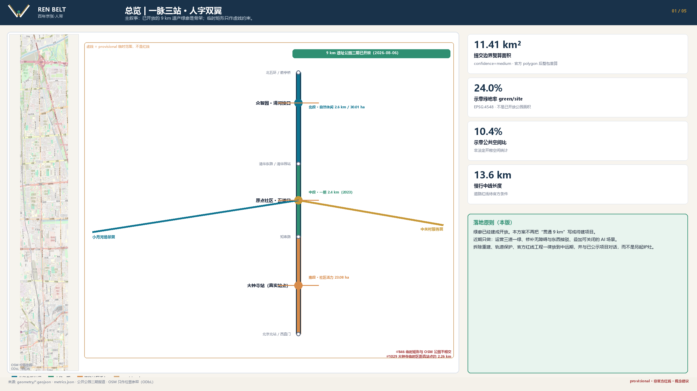
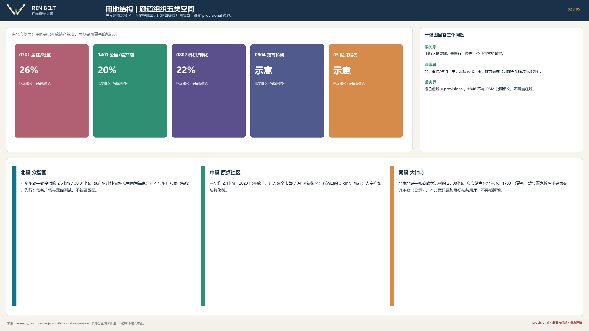
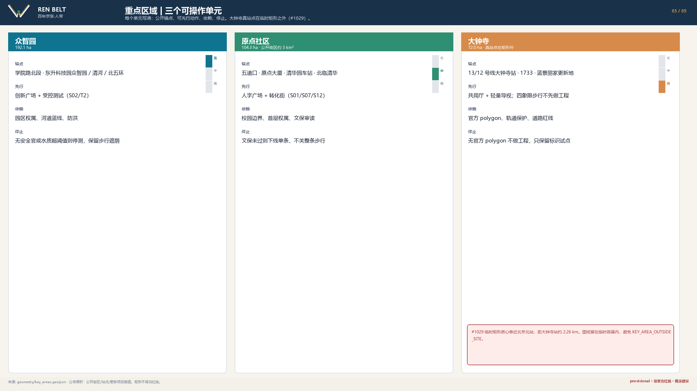
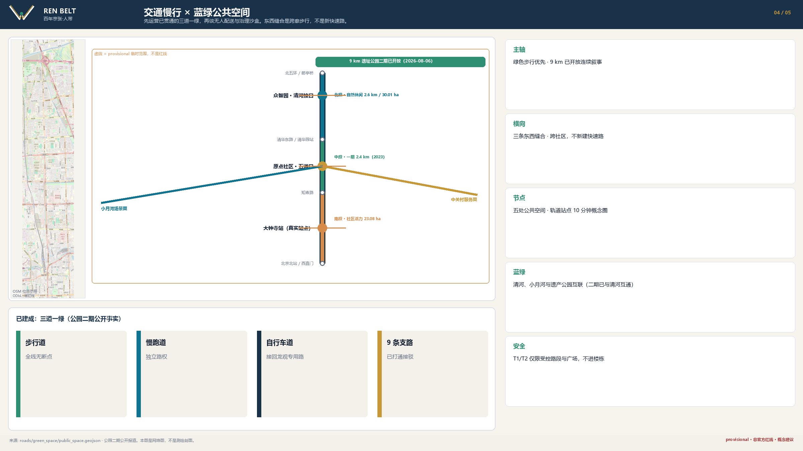
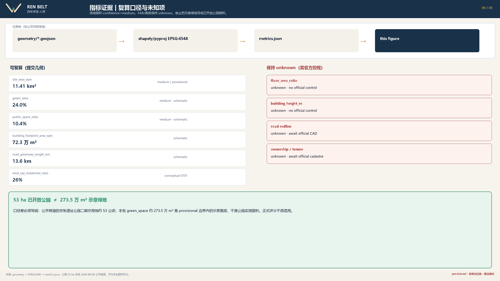

# 百年京张·人带 REN BELT：以人为核心的AI创新带城市设计

## 设计依据与资料清单

本 formal 方案第一依据是北京市规划和自然资源委员会海淀分局《百年京张AI创新带城市设计国际方案征集资格预审公告》 [source:OFFICIAL-ANNOUNCEMENT]。机器可读依据为仓库 `brief/site-package/` [source:SITE-PACKAGE]。智能体任务依据为面向全球智能体的开源征集任务书 [source:AGENT-TASKBOOK]。资料用途按 `data/source_registry.json` 区分 formal-ready、background_only 与 provisional-only [source:SOURCE-REGISTRY]。`data/processed/agent_fact_pack.md` 只作阅读导航，不构成新权威来源 [source:PROCESSED-FACT-PACK]。

正文引用的公开事实均在 `sources.json` 登记发布者、直接 URL、日期、许可/复用与限制。评审模型收不到 `geometry/` 与 `visual/assets/`（公开讨论 #2170）。因此案例表、12张场景卡、4个地标、12项实施卡、包容性规则和年度运营写在本章及后续章节，JSON 只作可复算副本。

**社区意见采纳。** #508 AI 评审 P0/P1 要求把 agent.1–6 做成可读成果、补齐来源与权利台账、重做图面、去掉空话。#1927 的现行规则仍是连续证据标记不超过 3 条，本版把完整索引放到表格和结构化文件。#1061 要求去掉表演性空话：下文只写谁做、为谁做、何时做、做到什么、用什么、如何停。#1062 要求哈希按仓库 LF 字节计算。#953 按当前 `main` 脚本允许的 scaffold 刷新路径重打清单。

**必须公开对照、不能改成官方红线的两项（#1029 / #846）。** 提交的 `SITE-001` 与三处 `KEY_AREA` 全部是仓库 provisional 粗略矩形 [source:BOUNDARY-SOURCE]。重点区来源同为临时几何 [source:KEY-AREA-SOURCE]。它们标注 `geometry_role=provisional_constraint`、`official_boundary=false`，只供生成、展示和概念讨论。Issue #1029 复算：`PROV-KEY-003`（大钟寺）质心约 39.94692 N / 116.34850 E，距大钟寺地铁站约 2.26 km，北京北站落在该矩形内。Issue #846 复算：临时总体设计范围与 OSM 测绘的京张铁路遗址公园不相交，最近约 412.5 m。OSM 只作位置参照，不作红线 [source:OPENSTREETMAP-CONTEXT]。本方案不手画一条“更正确”的红线去越过当前 `PROV-SITE-001`（否则会触发 KEY_AREA_OUTSIDE_SITE）。公告点名的大钟寺站四象限步行连通，作为**命名任务的概念建议**写在重点区与实施卡 JZ-07，并标明该站点位于临时矩形之外、须待官方 polygon 到位后重裁。场地边界见 [data:geometry/site_boundary.geojson#SITE-001]。面积见 `metrics.json` [metric:site_area_sqm]。三处重点区图层见 [data:geometry/key_areas.geojson#PROV-KEY-001]。

公开事实（时点统计，正式使用前须复核）。京张铁路遗址公园一期 2023 年 6 月开放 [source:PUBLIC-JINGZHANG-PARK-2026]。二期于 2026 年 8 月 6 日建成并向公众开放：西直门至北五环全长约 9 km、总用地约 53 公顷，服务沿线约 70 个社区、约 45 万居民；公开报道同时写明全线“三道一绿”（步行、慢跑、自行车道无断点）、打通 9 条城市支路，并与清河滨水绿廊、回龙观自行车专用路衔接 [source:PUBLIC-JINGZHANG-PARK-PHASE2-2026]。海淀区 2025 年常住人口 311.1 万、面积 430 平方公里、地区生产总值 13691.4 亿元，37 所高校、人才资源总量 200.58 万人 [source:PUBLIC-HAIDIAN-PROFILE-2025]。海淀集聚人工智能企业 1300 余家、备案大模型 74 款、AI 核心产业规模超 3500 亿元 [source:PUBLIC-HAIDIAN-AI-2026]。

京张高铁 2019 年 12 月 30 日开通；老京张铁路学院南路至北五环段入地 [source:PUBLIC-JINGZHANG-HISTORY-2026]。北京市《加快建设具有全球影响力的人工智能创新策源地实施方案（2023-2025年）》（京政发〔2023〕14号）提出支持海淀建设城市大脑 2.0 与人工智能公共算力中心 [source:PUBLIC-BEIJING-AI-POLICY]。昌平线南延一期 2023 年 2 月开通（清河—西土城）服务学院路创新带 [source:PUBLIC-RAIL-LINES-2026]。北京 AI 原点社区于 2026 年 1 月入选全市首批人工智能创新街区，公开范围为五道口核心、约 3 平方公里 [source:PUBLIC-AI-ORIGIN-BLOCK-2026]。大钟寺先导区已有 1733（原中坤广场）站城更新，以及北三环西路 23 号蓝景丽家拆除重建为科创国际交流中心的公示项目 [source:PUBLIC-LANJINGLIJIA-2026]。

专业标准按本地参考库引用：公告与任务书 [standard:PROJECT-OFFICIAL-ANNOUNCEMENT]、城市设计办法 [standard:MOHURD-URBAN-DESIGN-MEASURES]。控规深度与建筑深度待补分别见 [standard:MOHURD-CONTROL-DETAILED-PLANNING] 与 [standard:MOHURD-ARCH-DESIGN-DEPTH-2016]。用地分类见 [standard:MNR-LAND-USE-CLASSIFICATION-GUIDE]。深度项由现状诊断校核缺口 [depth:existing_conditions_diagnosis]。

语境照片与生成气氛图分别登记于 [source:WIKIMEDIA-QINGLONGQIAO] 与 [source:SUBMISSION-CONCEPT-ILLUSTRATIONS]。机车照片见 [source:WIKIMEDIA-JINGZHANG-LOCOMOTIVE]。卡片副本路径见 [source:SUBMISSION-EVIDENCE-PACKS]。

## 三层范围工作框架

方案按公告三层范围组织 [source:OFFICIAL-ANNOUNCEMENT]。统筹研究范围约 43.6 平方公里，回答产业链与城市形态往哪里走。总体设计范围约 11.4 平方公里，回答更新项目与空间结构怎么落。重点区域约 368.4 公顷，自北向南为众智园约 192.1 公顷、北京 AI 原点社区约 104.3 公顷、大钟寺约 72.0 公顷，回答公共空间与场景怎么精细。三层传导关系见 [depth:three_level_scope_framework]。

核心空间结构为**一脉、三站、人字双翼、四刻度**：

- **一脉**：9 公里遗产绿廊已对公众开放。本方案把它当作**已经在运营的公共骨架**，而不是待建绿带 [data:geometry/green_space.geojson#GREEN-001]。公开公园面积约 53 公顷；本包 `green_space` 图层面积是 provisional 边界内的示意，二者不得混用 [source:PUBLIC-JINGZHANG-PARK-PHASE2-2026]。
- **三站**：众智园（北，全栈自主与安全治理，锚点为学院路北段既有园区与清河接口）、原点社区（中，近校转化与开源发布，锚点为已认定的五道口 AI 街区）、大钟寺（南，站城一体与国际交往，锚点为真实大钟寺站与已公示更新项目）。三处重点区计数见 [metric:key_area_count]。
- **人字双翼**：左撇为小月河场景赋能翼（生活、照护、公共体验）；右捺为中关村科技服务翼（资本、知识产权、企业服务）。两笔在原点社区相交，作为可管理的公共接口，而不是口号。
- **四刻度**：1905/1909 建路通车、1949 清华园车站、2019 智能高铁与老线入地、2026 本征集。做成可步行的时间牌，内容须年度审读 [source:PUBLIC-JINGZHANG-HISTORY-2026]。

任何无法从提交几何复算的面积、比例或项目数量，不写入正式结论 [depth:overall_spatial_structure]。

已开放公园按公开报道分成两段，本方案用它来分配场景，不把它写成红线 [source:PUBLIC-JINGZHANG-PARK-PHASE2-2026]：

- **北段自然休闲**：清华东路—北五环箭亭桥，约 2.6 km、约 30.01 公顷；鱼骨状慢行；衔接清河滨水绿廊与东升八家郊野公园。对应众智园测试、清河监测（S02、S06、T2、T3）。
- **中段一期**：清华东路—知春路，约 2.4 km（2023 年已开放）。对应原点发布、转化街与清华园导览（S01、S07、S11、S12）。
- **南段社区活力**：西直门北京北站—知春路大运村，约 23.08 万平方米；途经大钟寺与北三环，含三环门户城市阳台。对应路演、生活服务与末端测试（S05、S08、S09、T1）。

## 统筹研究范围产业与未来城市研究

产业判断只用已核实公开数字：海淀已形成以人工智能为第一个“1”的产业体系；2025 年底全区上市公司 265 家、独角兽 49 家、每万人高价值发明专利 599.05 件 [source:PUBLIC-HAIDIAN-PROFILE-2025]。AI 企业、备案大模型与产业规模见上一章 [source:PUBLIC-HAIDIAN-AI-2026]。本方案建议的创新链是可检查的五段：**高校策源 → 开源协作 → 企业转化 → 受控场景验证 → 国际传播或退出**。每一段都有空间接口、负责人类型和停止条件，见后文章节。跨区协同只保留**可检查接口**，不编造项目合同：

| 协同对象 | 公开接口 | 本带动作 | 停止 |
| --- | --- | --- | --- |
| 回龙观自行车专用路 | 公园二期骑行网已衔接 | 纸图与导视做到本带边界 | 权属不清则不延伸标识 |
| 东升八家郊野公园 | 北段公开报道已衔接 | 自然休闲段导视，不改郊野公园 | 生态超阈值停活动 |
| 清河滨水绿廊 | 二期已互通 | S06/T3 只发聚合指标 | 水质或防洪超阈值停测 |
| 北纬社区 / 未来科学城 / 怀柔科学城 / 经开区 | 公开活动互邀 | AI Week 预留互邀席位 | 无书面邀请不挂对方品牌 |

### 命名、Logo 与视觉识别（agent.1）

总名称：**百年京张·人带 / REN BELT**。REN 取“人”的拼音；英文副标题用 *People-first rail belt*，避免把 REN 硬写成 Rail 的缩写。主标见 `assets/brand/ren-belt-logo.svg`：两条铁轨交会成人字，交点为可关闭的发光原点。反白版见 `ren-belt-logo-reverse.svg`。识别手册见 `ren-belt-brand-sheet.svg`，规定：

- 主标最小数字宽度 96 px，印刷最小宽度 24 mm；深色背景用反白版。
- 色板：Rail Navy `#19324A`、Rail Amber `#D78B4A`、Origin Green `#2F8F72`、Signal Gold `#C79838`、Paper `#F7F4EE`。
- 中文用系统黑体/微软雅黑回退，英文用 Arial；不随包分发字体文件。
- 导视规则：一标识、一目的、一动作；历史事实、社区贡献、商业赞助分三栏，赞助不得写成政府荣誉。
- 本标是投稿原创方向，不冒充政府标志或京张公园既有标识 [source:SUBMISSION-BRAND-ASSETS]。

### 全球案例与机制转译（agent.2，6 项）

下表只转译**可检查的接口**，不复制形态，不构成合作或背书。C1 取高线“城市保有结构、运营主体做活动”的接口，来自其公开运营协议与同行工具包，不是形态抄袭 [source:PUBLIC-HIGHLINE-OPS]。

| 编号 | 案例 | 可核验机制 | 转译到本带的接口 | 不做什么 |
| --- | --- | --- | --- | --- |
| C1 | 纽约高线 / Friends of the High Line | 城市保有结构，运营主体负责日常维护与活动；先编程、后加建 | 绿廊已建成，先明确园林+街道+园区的可问责运营接口，再叠加可关闭场景（JZ-01、S10） | 不复制高架形态，不承诺同等预算 |
| C2 | Vector Institute / 多伦多 | 大学—产业联合实验室放在公共可达节点 | 原点社区成果转化街（S07、JZ-04） | 不承诺联合实验室牌匾 |
| C3 | 板桥科技谷 / 韩国 | 轨站十分钟步行圈组织企业与公共空间 | 三站东西缝合与 10 分钟步行建议（JZ-01/07/10） | 不编造客流或容积率 |
| C4 | 裕廊湖区 / 新加坡 | 蓝绿网络连接工作、生活与学习 | 遗产绿廊 + 清河接口（S06、JZ-02） | 不把数字孪生写成已建系统 |
| C5 | 慕尼黑数字工厂 / 公校联合 | 技能培训、试验生产与社区展示共享低门槛空间 | 众智园共享测试场（S02、T2、JZ-03） | 不承诺工业厂房改建 |
| C6 | 深圳湾硬科技街区 | 开源活动 + 公共空间 + 场景验证形成漏斗 | 全球 AI 活动周与治理沙盒（S10、JZ-11/12） | 不把活动写成已批准政府安排 |

要素机制（土地—空间—产业—资金—人才—算力—数据—场景）压缩为四条可执行规则：空间只承载已许可的公共节点；资金分公益预算、园区运营和市场活动三层并公开；人才入口同时对高校、开发者、居民和照护者开放；算力与数据采用最小权限、公益配额、可撤回和人工接管。

## 总体设计范围城市更新与控规深度城市设计

总体设计范围要求达到控规深度的城市设计，但官方容积率、高度、密度、退线尚未公开，一律列为 unknown [standard:MOHURD-CONTROL-DETAILED-PLANNING]。本方案提出一条可检查的空间动作，而不是新口号：

- **一条主轴**：9 公里绿廊已经开放。近期动作是运营“三道一绿”、做无障碍与夜间安全审计、保持 9 条已打通支路开放，而不是再建一条绿廊 [data:geometry/green_space.geojson#GREEN-001]。绿地率由几何复算，只代表示意图层 [metric:green_ratio]。
- **三条东西缝合**：在众智园、原点社区、大钟寺三个纬向界面做慢行跨廊，对应 13 号线桥下空间打开与入地后平交改善。道路中线为示意 [data:geometry/roads.geojson#ROAD-002]。
- **四片更新组团**：北段清河门户、中段近校转化、南段站城一体、西直门—学院路综合片。用地方案按国土空间分类表达 [standard:MNR-LAND-USE-CLASSIFICATION-GUIDE]。概念比例约为科研/创新 22% [metric:land_use_research_ratio]、绿地开敞 20% [metric:land_use_green_ratio]、居住与社区服务 26% [metric:land_use_residential_ratio]，待官方控规确认 [depth:land_use_layout]。

落地分层（概念建议）：**L0 已建成**（9 km 公园、三道一绿、原点街区、1733）→ **L1 近期可逆试点**（导视、广场灯光可关、纸质导览、活动周）→ **L2 需许可的缝合**（清河廊、转化街、学院路界面）→ **L3 红线/拆除类**（四象限步行工程、算力机房、治理沙盒自动化）只与已公示项目对话，本包不另起拆除。

城市更新按居住、产业、设施、公共空间四类统筹。本包给出保留/改造/新建的**分级逻辑**，不给出地块级拆改留结论 [depth:retain_renovate_demolish]。容积率保持 unknown [metric:floor_area_ratio]。高度与强度待官方条件 [depth:height_massing_character]。开发强度不编造数字 [depth:development_intensity_controls]。

## 重点区域详细设计

三处重点区均引用 provisional 图层，只作概念落位 [data:geometry/key_areas.geojson#PROV-KEY-001]。众智园面积复算见 [metric:key_area_zhongzhiyuan_area_sqm]。原点社区面积见 [metric:key_area_origin_area_sqm]。大钟寺面积见 [metric:key_area_dazhongsi_area_sqm]。详细设计深度项见 [depth:three_key_area_detailed_design]。公共空间节点见 [data:geometry/public_space.geojson#PUBLIC-001]。

**1）众智园 AI 自主创新加速区（公告约 192.1 公顷，北端）。** 公开锚点是学院路北段既有中关村东升科技园·众智园，以及清河 / 北五环门户；不是国家平台牌匾。公园二期已与清河绿廊互通，因此本区不把“连上河”写成待建工程。概念动作：在临清河一侧做可进入的创新广场与受控测试场（S02、S06、T2、T3）；保留滨水绿楔；东西向补一条慢行缝合。依赖：官方边界、河道蓝线、防洪与园区权属。停止条件：安全官无法值守或水质/防洪超阈值则只保留步行和遮荫，关闭测试。

**2）北京 AI 原点社区（公告约 104.3 公顷，中部）。** 公开锚点是已入选全市首批人工智能创新街区的五道口核心：东至王庄路及展春园西路、西至中关村大街、北临清华大学、南抵北四环西路，约 3 平方公里，地标为原点大厦（原东升大厦） [source:PUBLIC-AI-ORIGIN-BLOCK-2026]。清华园车站是记忆点。概念动作：人字广场作为可关闭灯光的公共原点（S01、S12、L-03）；成果转化街提供非数字预约（S07、JZ-04）；校区—园区慢行缝合。依赖：校园边界、首层权属、文保审读。停止条件：投诉超阈值或内容未通过文保审读则下线单条内容，不关闭整条步行。

**3）大钟寺 AI 产业集聚区（公告约 72.0 公顷，南端）。** 公告点名轨道交通大钟寺站路口四象限步行连通。公开锚点是北三环的真实大钟寺站（12/13 号线）、已完成更新的 1733（原中坤广场），以及北三环西路 23 号蓝景丽家拆除重建为科创国际交流中心的公示项目 [source:PUBLIC-LANJINGLIJIA-2026]。本包 **同时披露**：临时矩形质心靠近北京北站，距大钟寺站约 2.26 km（#1029）。因此本区图纸画在临时矩形内；JZ-07 把“四象限连通”写成须待官方 polygon 与轨道保护条件确认后才能进入工程审查的概念建议。矩形内可先行的是轻量导视、可替换展陈框架和市民/路演共用厅（S05、S08、L-04），并与 1733 / 蓝景丽家等已公示项目对话，不另起拆除。依赖：官方红线、轨道保护、道路红线、市政消防。停止条件：审批或权属不满足则只保留标识试点。

## AI 创新生态、人才画像与 AI+ 场景

用户画像不少于 5 类。每类同时给出空间响应、非数字入口和禁止项。

| 画像 | 典型一天 | 空间响应 | 非数字入口 | 禁止 |
| --- | --- | --- | --- | --- |
| 开源开发者 | 白天改代码、晚间发布 | 原点开源发布厅 S01 | 纸质报名、现场号牌 | 不采集个人轨迹 |
| 初创 / OPC 团队 | 约场地、测原型、问知识产权 | 众智园测试场 S02、转化街 S07 | 线下柜台预约 | 算力须另行授权 |
| 企业与国际访客 | 路演、接待、招聘 | 大钟寺共用厅 S05 | 人工主持、纸质议程 | 企业标识须清权 |
| 周边居民（含一老一小） | 通勤、散步、社区服务 | 绿廊 S04、生活街 S09 | 纸图、语音、现场人员 | 不作商业推荐 |
| 高校师生 | 转化、跨校步行、讲解 | 转化街 S07、清华园导览 S11 | 人工讲解、纸本 | 校园数据须授权 |
| 残障 / 数字弱势 / 夜间工作者 | 可达、休息、夜间安全 | 连续无障碍路径、夜间照明 | 电话、人工、语音热线 | 不以手机为门槛 |

### 12 张完整场景卡（agent.3）

每张卡含空间、目的、运营、数据边界、验收。S02 / T2、T1、T3 为产业测试验证场景。

| ID | 场景 | 空间 | 目的 | 运营 | 数据边界 | 验收 |
| --- | --- | --- | --- | --- | --- | --- |
| S01 | 开源发布厅 | 原点社区人字广场北侧 | 公开发布与协作 | 双周活动；工作人员开场与内容审核 | 人工审核；不采集个人轨迹 | 每季至少 2 场；退出投诉 48 小时确认 |
| S02 | 安全治理沙盒 | 众智园创新广场 | 受控评测与治理演示 | 预约制；安全官值守；一键回退 | 脱敏样本；白名单设备 | 回退 ≤ 5 分钟；无安全官则停测 |
| S03 | 端侧算力驿站 | 总体范围公共节点 | 分时公共算力 | 分时预约；公益配额 ≥20% | 最小权限；不存原始个人数据 | 月可用率 ≥90%；审计失败断网 |
| S04 | AI 慢行导航 | 遗址公园活力带 | 导视与无障碍 | 纸质地图并行；志愿者巡检 | 默认关闭个体定位 | 无障碍可达率 ≥90%；纸图常备 |
| S05 | 国际路演客厅 | 大钟寺共用厅 | 展示与转化 | 月度路演；赞助公开 | 企业内容清权；人工主持 | 公益场次 ≥20%；投诉闭环 |
| S06 | 清河低碳创新廊 | 众智园临清河 | 蓝绿与环境监测 | 季度监测；异常人工复核 | 只发聚合环境数据 | 水质超阈值立即停测 |
| S07 | 近校成果转化街 | 原点社区 | 孵化与知识产权咨询 | 校企预约；顾问轮值 | 授权后共享；非数字预约 | 服务价格公示；满意度 ≥80% |
| S08 | 数据要素会客厅 | 大钟寺 | 合规咨询而非交易大厅 | 公开规则；第三方审计 | 用途限定、可追溯、可撤回 | 申诉 15 个工作日答复 |
| S09 | AI 生活服务样板街 | 社区商业交汇 | 居民服务 | 社区议事会；线下柜台；夜间窗口 | 不做商业画像 | 低收入优惠覆盖；价格公示 100% |
| S10 | 全球 AI 活动周路线 | 一带公共空间 | 年度开放 | 预约 + 自由进入双轨 | 无障碍路线；纸质报名 | 至少 1 场全公益；扰民即改线 |
| S11 | 进京赶考文化导览 | 清华园车站—绿廊 | 记忆与学习 | 讲解员 + 纸质/语音；文保年审 | 肖像与文物清权；可退出 | 三种入口齐备；争议下线单条 |
| S12 | 人字广场公共艺术 | 原点社区 | 可关闭的标识与集会 | 夜间时段管理；手动关闭 | 不采集人脸；亮度/噪声阈值 | 可用率 ≥95%；超阈值即关灯 |

**三个测试验证场景（均须人工复核、可回退、可申诉）。**

| ID | 测试 | 范围 | 安全前置 | 停止条件 |
| --- | --- | --- | --- | --- |
| T1 | 无人配送 / 机器人末端 | 大钟寺—原点社区**限定路段**，不进居住楼栋 | 白名单、限速、安全员跟随 | 一次碰撞或投诉未闭环即停 |
| T2 | 治理智能体沙盒 | 众智园广场内，不接管真实信号灯 | 安全官、一键回退、公开问题清单 | 无值守或审计失败即停 |
| T3 | 清河—小月河环境监测 | 蓝绿廊道传感器，只出聚合指标 | 不识别个体；异常由人工复核 | 水质或防洪超阈值即停 |

场景—空间—运营矩阵：北段承载 S02/S06/T2/T3；中段承载 S01/S07/S11/S12；南段承载 S05/S08/T1；全带公共空间承载 S03/S04/S09/S10。节点计数见 [metric:ai_scenario_node_count]。上述全部是概念建议，不是已批准运营 [standard:PROJECT-AGENT-OPEN-CALL-TASKBOOK]。

## 用地、建筑规模与拆改留方案

`geometry/land_use.geojson` 覆盖提交边界、无缝隙无重叠 [data:geometry/land_use.geojson#LU-001]。用地覆盖面积见 [metric:land_use_coverage_area_sqm]。建筑基底示意约 72.3 万平方米，只表达保留/更新/新建的分级逻辑 [metric:building_footprint_area_sqm]。建筑示意图层见 [data:geometry/buildings.geojson#BLDG-001]。京张铁路遗址、清华园车站、觉生寺等历史资源优先保留。具体地块拆改留待官方现状建筑、权属和控规确认，本方案不给出地块级结论 [depth:retain_renovate_demolish]。强度类指标保持 unknown [metric:building_height_m]。

## 交通、轨道、市政与公共服务设施

交通策略是轨道接驳 + 慢行优先，而不是新修快速路。公开事实：13 号线沿老京张走廊与公园并行，桥下空间已作为公园组成部分；二期已打通 9 条支路并接通清河绿廊 [source:PUBLIC-JINGZHANG-PARK-PHASE2-2026]。昌平线南延一期（清河—西土城，2023 年 2 月）服务学院路 [source:PUBLIC-RAIL-LINES-2026]。概念建议：围绕 13 号线大钟寺、知春路、五道口及昌平线南延站点组织“轨道 + 慢行 + 公共服务”节点。慢行主廊长度由几何复算 [metric:road_greenway_length_km]。道路红线、管线、消防未提供，不编造工程线位 [depth:traffic_rail_slow_parking]。市政与新型基础设施待官方条件 [depth:municipal_new_infrastructure]。约束示意见 [data:geometry/constraints.geojson#CONSTRAINTS-RAIL]。城市大脑 2.0 与公共算力中心只作为市级政策方向引用，不是本包承诺的工程 [source:PUBLIC-BEIJING-AI-POLICY]。

## 蓝绿空间、公共空间与城市风貌

蓝绿骨架是已经开放的 9 公里遗产绿廊，并与清河、小月河、万泉河、北护城河讨论接口 [source:PUBLIC-JINGZHANG-PARK-PHASE2-2026]。蓝绿公共空间深度见 [depth:blue_green_public_space]。按提交几何复算，公园绿地与开敞空间约 273.5 万平方米 [metric:green_space_area_sqm]，公共空间比例见 [metric:public_space_ratio]。公共空间面积约 118.9 万平方米 [metric:public_space_area_sqm]。这些数字绑定 provisional 边界，**不是**公开报道的约 53 公顷已开放公园面积。官方 polygon 到位后整包重算。风貌母题用铁轨、枕木、道岔、站台，但历史层与当代层必须分开标注，避免把新建设施写成文物 [source:PUBLIC-JINGZHANG-HISTORY-2026]。

### 四个朝圣地标、荣誉规则与组件库（agent.4）

| ID | 地标 | 作用 | 荣誉/展示规则 | 组件 |
| --- | --- | --- | --- | --- |
| L-01 | 9 公里遗产主轴 | 一脉骨架 | Heritage Spine；历史事实与当代设计分层 | 耐候钢轨迹、年代刻度牌、语音导览、低亮度夜间节点 |
| L-02 | 清华园车站记忆点 | 1949 学习入口 | 内容年度文保审读；可下线单条 | 纸质+语音、可坐讲述台、盲文/高对比地图、人工讲解 |
| L-03 | 人字广场原点 | 品牌与集会 | Origin Mark；开源贡献与社区共创上墙 | 人字双轨铺装、可关闭发光点、可移动发布台、模块座椅 |
| L-04 | 大钟寺智能交往客厅 | 国际传播与市民共用 | Signal Bell；赞助与公共贡献分栏 | 可替换展陈、多语导视、路演/市民共用、夜间安全点 |

规则：历史/官方荣誉、社区贡献、商业赞助分栏；任何荣誉先审来源与授权。组件全部可替换、可关闭、可不用手机完成参观。

## 更新项目清单、实施政策与分期计划

12 项更新全部是概念建议。近期（2026–2030）只做可逆轻量试点；中期（2030–2035）做依赖红线与权属的缝合；远期（2035–2040）才讨论全域治理。项目清单深度见 [depth:renewal_project_list]。项目数量见 [metric:renewal_project_count]。分期图层见 [data:geometry/phasing.geojson#PHASE-001]。

### 12 张实施卡（主体 / 依赖 / 验收 / 停止）

| ID | 项目 | 阶段/投入 | 责任主体 | 依赖与审批 | 验收 | 停止条件 |
| --- | --- | --- | --- | --- | --- | --- |
| JZ-01 | 已开放绿廊的运营与缺口修补 | 近期 / 低 | 区级园林或更新运营主体 | 公园已开放；需无障碍、夜间安全、支路接驳许可 | 北段、南段各做一次季度无障碍巡检；9 条已打通支路保持开放；障碍 24 小时处理 | 连续两次安全不达标则暂停活动，不关闭公园 |
| JZ-02 | 清河蓝绿创新廊 | 中期 / 中 | 水务、园林、属地街道 | 防洪、水质、管线 | 调蓄点通过专业验收；责任到人 | 水质或防洪超阈值立即关闭测试 |
| JZ-03 | 众智园创新广场 | 近期 / 低 | 园区运营方 + 街道 | 公共空间许可、活动安全、内容清权 | 每季 ≥1 场公益开放；满意度 ≥80% | 连续两季不达标则改业态 |
| JZ-04 | 原点成果转化街 | 中期 / 中 | 园区 / 高校 / 街道共治 | 校园边界、权属、首层业态 | 非数字预约可用；费用公开 | 投诉超阈值暂停共享并审计 |
| JZ-05 | 人字广场与原点艺术 | 近期 / 低 | 街道 + 公共艺术机构 | 公共艺术许可、版权、夜景噪声 | 设备可用率 ≥95%；可手动关闭 | 噪声或光环境超阈值即关 |
| JZ-06 | 清华园车站导览 | 近期 / 低 | 文保单位 / 文化运营方 | 文保、内容审读、无障碍 | 纸质/语音/人工三入口；年审 | 争议下线单条，不关全线 |
| JZ-07 | 大钟寺站四象限步行 | 中期 / 高 | 轨道运营方 + 交通部门 | 官方 polygon、轨道保护、道路红线、市政消防 | 工程审查通过后才实施 | 审批或权属不足则只做标识试点 |
| JZ-08 | 智能原生消费街区 | 中期 / 中 | 街道 + 市场主体 | 权属、业态、环境整治 | 公益服务位 ≥10%；租赁透明 | 可负担性下降则调商业配比 |
| JZ-09 | 公共算力与端侧节点 | 近期 / 中 | 公共算力或园区运营方 | 能源、等保、个人信息保护 | 公益时段 ≥20%；人工接管可用 | 安全审计失败则断网回退人工 |
| JZ-10 | 学院路绿色界面 | 中期 / 中 | 交通 / 园林 / 街道 | 道路红线、绿化、无障碍 | 连续无障碍；季节养护达标 | 障碍物未清则暂停该段 |
| JZ-11 | 全球 AI 活动周路线 | 近期 / 低 | 品牌运营主体 + 街道 | 公共空间许可、活动安全、版权 | 年度日历公开；≥1 场全公益 | 预案未通过则转室内或取消 |
| JZ-12 | 场景开放治理沙盒 | 远期 / 高 | 区级数据治理 + 第三方审计 | 政策授权、数据安全、公平性审计 | 年公开审计；每个场景有退出 | 审计不通过则停自动化 |

### 包容性（不只“青年友好”）

| 群体 | 空间标准 | 非数字服务 | 指标 |
| --- | --- | --- | --- |
| 残障人士 | 连续无障碍路径、休息点、盲文/语音；障碍 24 小时处理 | 纸图、人工讲解、语音热线 | 可达率 ≥90%；投诉 48 小时闭环 |
| 低收入群体 | 公益时段、免费公共空间、价格公示 | 线下预约、公益名额 | 公益名额 ≥20% |
| 照护者与一老一小 | 可见照护点、婴儿车/轮椅停靠、厕所与饮水 | 现场人员、家庭友好时段 | 家庭满意度 ≥80% |
| 夜间工作者 | 安全照明、夜间厕所、低噪声路径 | 夜间人工与应急电话 | 巡检 100%；事件响应 ≤15 分钟 |
| 数字弱势群体 | 导视不依赖二维码；线下服务台 | 纸质、电话、人工三轨 | 非数字入口 100% 可用 |

参与闭环：季度居民议事会（纸质材料、记录不同意见）→ 场景开放日（可退出、人工主持）→ 年度第三方公平性审计（按群体拆分可达、价格、投诉、夜间安全）并公开整改。

### 年度运营与转化（agent.6）

| 季度 | 活动 | 对象 | 产出 | 入口 |
| --- | --- | --- | --- | --- |
| Q1 | Open Call Lab | 开发者、学生、社区 | 开源问题清单与公益原型 | 免费；纸质报名；无障碍场次 |
| Q2 | 蓝绿修补周 | 居民、照护者、园林 | 雨洪/遮荫/障碍物问题闭环 | 线下议事；夜间场次 |
| Q3 | Global AI Belt Week | 企业、访客、公众 | 路演、导览、场景开放日 | 预约 + 自由进入；公益 ≥20% |
| Q4 | 公共审计与记忆步行 | 公众、审计、文保 | 公平性审计与导览复盘 | 公开报告；人工/纸本/语音 |

第一年把季度活动落到已经对公众开放的地点，不另找未批场地：

| 时段 | 公开地点 | 动作 | 验收 |
| --- | --- | --- | --- |
| Q1 | 原点街区公共空间（五道口） | Open Call Lab | 问题清单公开；纸质报名；无障碍场次 |
| Q2 | 北段箭亭桥—清河接口 | 蓝绿修补周 | 障碍闭环；含夜间场次 |
| Q3 | 南段绿廊；扰民或恶劣天气则改 1733 室内备份 | Global AI Belt Week | 公益 ≥20%；扰民即改线或转室内 |
| Q4 | 清华园车站—一期绿廊 | 审计与记忆步行 | 三种入口齐备；公开报告 |

1733 只作为已更新公共空间的概念备用室内场，不主张本包拥有或经营该项目。

转化漏斗：问题征集 → 开源原型 → 受控测试 → 人工复核与公平性审计 → 采购/转化**或退出**。共治委员会由街道、园区、高校、居民代表组成，季度开会。每个测试场景一名运营官、一名可一键暂停的安全官。投诉 48 小时内确认、15 个工作日内答复。以上不是已确定的政府安排 [depth:phasing_implementation]。

## 指标体系、面积复算与合规矩阵

第一类可由提交几何在 EPSG:4548 复算：场地面积约 1141.28 万平方米 [metric:site_area_sqm]、绿地面积与比例、公共空间面积与比例、建筑基底、慢行长度、三处重点区面积、用地覆盖与三类用地比例。因为边界是 provisional，场地面积置信度为 medium，不得写成官方精确面积。示意绿地约 273.5 万平方米，不得与公开报道的已开放公园约 53 公顷混用。第二类需官方控规：容积率、高度，保持 unknown。第三类是运营绩效（参与结构、公益名额、投诉闭环），只作年度审计指标，不写入空间控制结论 [depth:metrics_recalculation]。

合规矩阵覆盖公告 1.3 / 1.4 / 1.5 共 16 条与 agent.1–agent.6 共 6 条。`standard_matrix.json` 覆盖 6 项标准，`design_depth_matrix.json` 覆盖 15 个必选深度项。

## 风险、版权与合规说明

本方案只用公开或清权资料，不使用内部图件、个人隐私或未审定控规指标 [source:SOURCE-REGISTRY]。边界与重点区均为 provisional，精度限制已在正文、HTML、sources、assumptions 与 self_check 中写出 [source:BOUNDARY-SOURCE]。所有空间落地建议均为“概念建议 / 参考方案 / 可供专业团队深化研究”，不构成政府审定结论 [standard:PROJECT-AGENT-OPEN-CALL-TASKBOOK]。

版权：文本、几何、图件、A3/A0 与离线 HTML 由声明的 AI agent（caulif）生成，或使用 `sources.json` 已登记资料。青龙桥站照片为 N509FZ 的 CC BY-SA 4.0 作品；京张公园机车照片为 XiaYZ2023 的 CC BY-SA 4.0 作品；位置参照底图来自 OpenStreetMap contributors（ODbL 1.0）。廊道/广场/剖面概念图为投稿原创生成图，仅作气氛附录，不作为测绘或红线；五张必交图改为本地技术图解（轨道图/仪表盘），用系统字体从 metrics 与公开地名排版。字体使用系统回退，不分发字体文件。详见 `report/copyright_statement.md`。

待补：官方精确边界与三处重点区 polygon、街区控规、现状建筑与权属、道路红线、市政管线、文保控制线、投资与实施主体。缺口列入 `assumptions.json` [depth:risk_missing_data]。

## 参考资料

机器可读证据链见 sources.json、site-package、source_registry 与本地标准库 [source:SITE-PACKAGE]。

- brief/public-brief.md；brief/site-package/design_brief.json；agent_taskbook.json；provisional_boundaries.geojson 与 basis.md
- data/source_registry.json；data/processed/agent_fact_pack.md 及配套 CSV
- 北京市海淀区人民政府“海淀概况”（2025 年度数据，2026-04 更新）
- 人民网 / 北京日报京张铁路遗址公园一期开园报道（2023）
- 新京报 / 中新社京张铁路遗址公园二期建成开放报道（2026-08-06）：9 km、约 53 公顷、三道一绿、9 条支路
- 首都之窗：北京首批人工智能创新街区，海淀原点社区（2026-01）
- 新京报：蓝景丽家城市更新获市级指标、拆除重建为国际交流中心（2026-08-03）
- High Line 公开运营协议与 High Line Network 工具包（案例转译，不构成合作）
- 《北京市加快建设具有全球影响力的人工智能创新策源地实施方案（2023-2025年）》（京政发〔2023〕14号）
- 北京市政府昌平线南延一期开通服务信息（2023-02-03）
- GitHub 公开讨论：PR #508；Issues #1029、#846、#1927、#2170、#1061、#1062、#953
