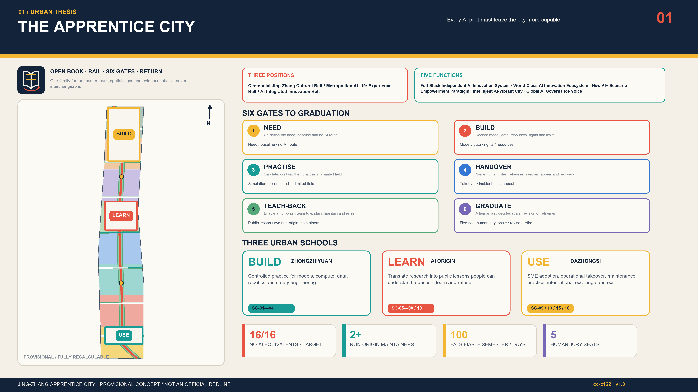
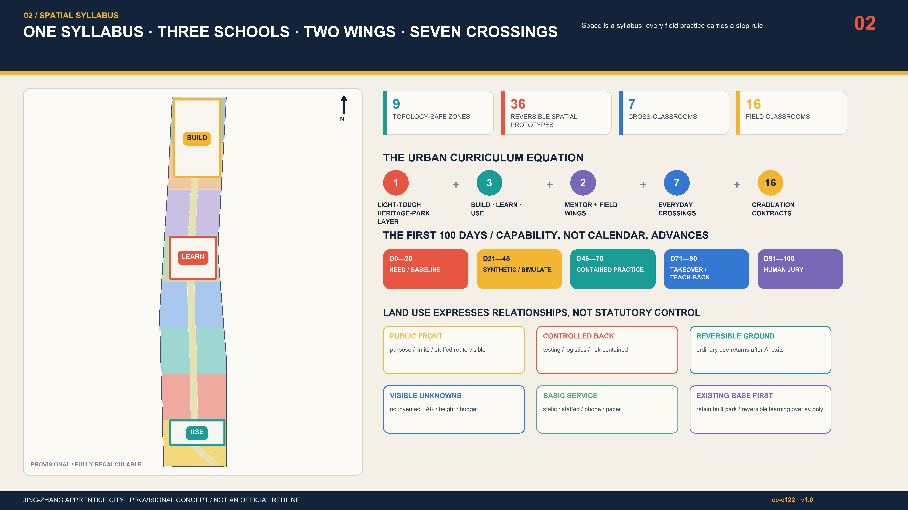
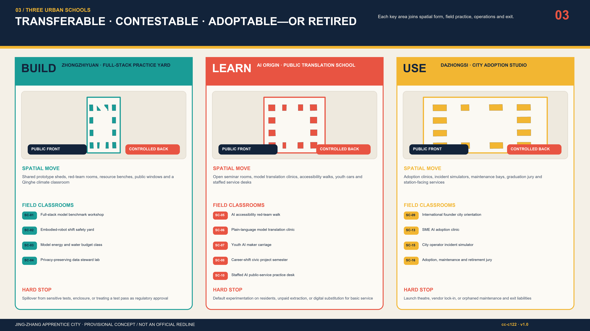
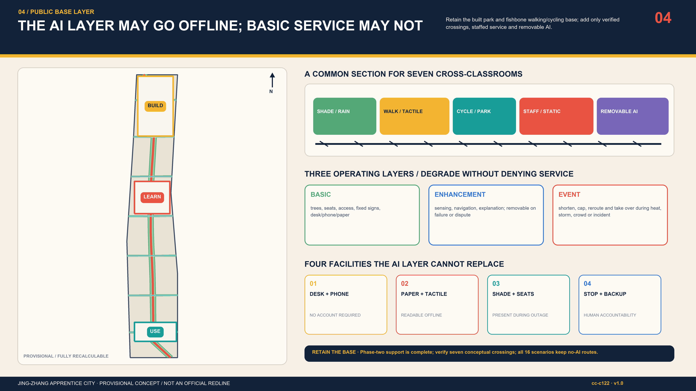
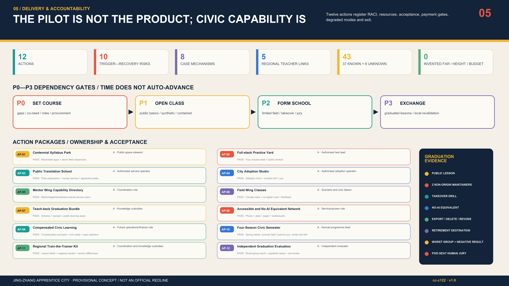

# THE APPRENTICE CITY｜JING-ZHANG

> **Every AI pilot must leave the city more capable.** The city is not technology's test subject. When a pilot ends, people in the city must be better able to explain, take over, repair, challenge and retire it.

## 1. Executive Summary

The Jing-Zhang Railway placed independent construction in China's modern history. This proposal translates that legacy into **independent maintenance** for the next century. The AI Innovation Belt does not count models, launches or delivered devices as success; a pilot graduates only when local organisations can continue, supervise, correct and stop it. If 1909 marked the historical capacity to build, 2026 can begin a civic curriculum for taking charge of AI, and 2126 should inherit public capability rather than orphaned smart equipment. [source:JINGZHANG-HISTORY] [source:AGENT-TASKBOOK] [depth:overall_spatial_structure]

The spatial proposition is **one centennial syllabus, three urban schools, two exchange wings, seven cross-classrooms and sixteen field classrooms**. Zhongzhiyuan is the BUILD school for full-stack practice, safety and resource accounting. AI Origin is the LEARN school translating research into lessons people can understand, question, learn and refuse. Dazhongsi is the USE studio for SME adoption, maintenance handover, incident rehearsal and graduation juries. A Zhongguancun mentor wing brings mentoring, legal, standards and finance translation; a Xiaoyue River field wing returns civic needs, climate conditions and operational feedback. Five regional interfaces share curricula and coaches only after local consent; no partnership or data exchange is invented. [data:geometry/key_areas.geojson#PROV-KEY-001] [metric:field_classroom_count]

Every scenario passes NEED—BUILD—PRACTISE—HANDOVER—TEACH-BACK—GRADUATE. The decisive fifth gate requires at least two non-origin maintainers to explain purpose and limits, replay takeover/failure, export or delete data, and brief retirement without vendor dependence. A five-seat human jury—operations, safety/data, domain professional, affected group and independent evaluator—then recommends scale, revision or retirement. Machines may organise evidence; they cannot award their own diploma. [data:visual/assets/teachback-bundle.schema.json] [standard:PROJECT-AGENT-OPEN-CALL-TASKBOOK]

The first 100-day semester is falsifiable: days 0—20 need/baseline, 21—45 synthetic data and simulation, 46—70 contained practice, 71—90 takeover and stop drills, 91—100 public Teach-back and jury. Procurement milestones attach payment to trained maintainers, incident drills, public materials, accessible no-AI routes and retirement assets—not equipment arrival, launch or attendance. A hard stop removes the AI enhancement while desk, phone, paper, tactile or fixed infrastructure preserves basic service. [data:visual/assets/operations-matrix.json] [metric:teachback_gate_count]

### The six-gate graduation contract

| Gate | Question | Required evidence |
| --- | --- | --- |
| 1. NEED | Co-define the need, baseline and no-AI route | Co-authored need card + baseline + no-AI route |
| 2. BUILD | Declare model, data, resources, rights and limits | Model/data/rights/resource account |
| 3. PRACTISE | Simulate, contain, then practise in a limited field | Simulation-contained-limited practice record |
| 4. HANDOVER | Name human roles, rehearse takeover, appeal and recovery | Takeover roles + incident drill + appeal |
| 5. TEACH-BACK | Enable a non-origin team to explain, maintain and retire it | Public lesson + two non-origin maintainers + replay |
| 6. GRADUATE | A human jury decides scale, revision or retirement | Human jury: scale, revise or retire |

All public commitments are **design targets pending co-calibration**: 16/16 public scenarios retain a no-account, no-app, phone, desk, paper, tactile or staffed route; every candidate graduate trains at least two non-origin maintainers; at least one jury seat belongs to a directly affected group without procurement/development conflict; civic evaluation and apprentice labour are budgeted for compensation in principle; reporting shows both overall and worst-served-group outcomes. These are neither current service claims nor government/statutory commitments. [assumption:A-PUBLIC-001] [check:SCENARIO_GOVERNANCE]

### Naming and visual identity

“Jing-Zhang Apprentice City / 京张学徒城” is the master brand; BUILD, LEARN and USE are school verbs; SC, AP, P and R freeze classroom, action, semester and risk IDs. Two open rails become a book, six learning sleepers represent the gates, and a red return arc means capability must be taught back to the city. Railway night blue `#12233A`, syllabus paper `#F4F0E7`, learning signal yellow `#F2B632` and stop/return red `#E85442` extend to diagrams, scenario cards, signs, seasons and evidence labels. System fonts only; monochrome, high-contrast, large-print and tactile versions remain required. Sub-area or event marks may not impersonate the belt master logo. International line: **AI graduates only when the city can carry on.** [data:assets/apprentice-mark.svg] [standard:PROJECT-AGENT-OPEN-CALL-TASKBOOK]

## 2. Design Basis and Source List

The workflow reads the announcement, agent taskbook, allowed design space, source register, processed fact pack, standards notes and provisional geometry before generating layers, metrics, narrative, drawings and the machine contract. The available site and three key areas are repository-maintained `provisional_constraint` geometries: useful for design discussion, intake checks and recalculation, but not official polygons, statutory controls or approvals. Building/ownership/heritage surveys, road and rail redlines, utility capacity, service baselines, operators, budgets and real-user trials are missing. FAR, floor area, height and budget therefore remain `unknown/null` in `metrics.json`. [source:SOURCE-REGISTRY] [source:BOUNDARY-SOURCE] [assumption:A-BOUNDARY-001] [depth:existing_conditions_diagnosis]

The real starting point is not a blank green corridor waiting to be redrawn. A July 2026 Beijing Municipal Forestry and Parks Bureau page confirms completion of phase-two supporting works and describes the roughly 30.01-hectare northern section, supporting utilities and a north-south/east-west fishbone walking-and-cycling network. A 6 August report that phase two had fully opened and joined phase one into roughly nine kilometres is used as current-status background only. The **Centennial Syllabus Park is therefore a light-touch learning and operating overlay on public space already built and in use**: retain the base, then add static lessons, staffed service, reversible small components, limited scenarios and still-unverified cross-corridor interfaces. Completion or opening approves none of this submission's crossings, equipment, events, operations or works. [source:PARK-PHASE2-SUPPORT-20260713] [source:PARK-PHASE2-OPEN-20260806]

Eight international cases are **text-only mechanism references**. No image is copied, no performance is claimed transferable, and no partnership is implied. Apprenticeship, testbeds, TEFs, SME adoption, research translation, regional curricula and public oversight must be revalidated under Beijing's legal, planning, ethics, procurement and affected-group conditions. [source:CASE-AIAP] [standard:MOHURD-URBAN-DESIGN-MEASURES]

| Text-only reference | Transferable mechanism | Local transfer limit |
| --- | --- | --- |
| AI Singapore AI Apprenticeship Programme [source:CASE-AIAP] | Deep-skilling followed by real projects with experienced mentors | Translate learning + real work + capability replay; do not transfer eligibility, stipend, placement rate or national status |
| JTC Punggol Digital District [source:CASE-PDD] | Campus, industry, community and district platform coexist in a real precinct | Use co-location and test sequence only; do not transfer land regime, sensing scale or performance |
| Testbed Helsinki [source:CASE-HELSINKI] | City, companies, researchers and residents test in real settings | Translate field class and closeout report; do not copy Finnish data rights or procurement |
| EU AI Testing and Experimentation Facilities [source:CASE-EU-TEF] | Physical/virtual facilities, real conditions, end users and trustworthy-AI support form a network | Translate simulation-contained-limited field gates; claim no regulatory sandbox or certification status |
| Vector Institute Applied AI Internships [source:CASE-VECTOR] | Implementation projects, mentorship and presentation connect learning to practice | Use project learning and inclusive recruitment only; do not transfer eligibility, partners or outcomes |
| Mila [source:CASE-MILA] | Research, talent, entrepreneurship and responsible-AI community operate together | Translate mentor and responsibility lessons; do not transfer scale, finance or governance |
| Barcelona Impulsa 2025-2035 / 22@ [source:CASE-BCN] | Urban regeneration, innovation clusters, urban labs and talent appear in one agenda | Use district-scale combination only; do not copy projects, law, investment or visuals |
| Brainport Agenda [source:CASE-BRAINPORT] | Triple-helix collaboration includes lifelong learning and shared prosperity | Translate train-the-trainer and lifelong learning; do not transfer credential force, partners or funding |

The added policy sources narrow claims rather than manufacture compliance. The generative-AI measures enter a specialist applicability review only where a service provides generated content to the public within their stated scope: Article 14 is not treated as a general opt-out right, Article 15 supplies no invented numeric response deadline, and Article 17 is not expanded to every system. Nothing here proves filing or security assessment. [source:STD-GENERATIVE-AI] [standard:GENERATIVE-AI-INTERIM-MEASURES]

Evidence is separated into official/repository-cleared sources, provisional constraints, design hypotheses and future measurements. `sources.json` governs provenance; `assumptions.json` lists unresolved conditions; `standard_matrix.json` maps standards; `design_depth_matrix.json` audits depth. `self_check.json` establishes package consistency only, never real-world deployability. [source:PROCESSED-FACT-PACK] [check:PROFESSIONAL_EVIDENCE]

## 3. Three-Level Scope Framework

The 43.6 km² research scope asks who teaches whom and what capacity travels; the roughly 11.4 km² overall-design scope asks how a curriculum becomes renewal, mobility, blue-green and public-service space; the 368.4 ha three-key-area scope asks who owns a field action, what is practised, when it stops and how it transfers. These are not scaled copies but a capability chain: regional teacher exchange—Jing-Zhang curriculum network—three-school field graduation. [source:OFFICIAL-ANNOUNCEMENT] [depth:three_level_scope_framework]

A Syllabus Park forms the north-south public spine. Seven transverse cross-classrooms repair everyday links across the railway heritage corridor, and three practice walks connect the schools internally. The two wings indicate exchange direction, not new redlines. Every line must work for walking/cycling, continuous access, shade/rainwater, static wayfinding and named maintenance; AI is a removable enhancement. [data:geometry/roads.geojson#ROAD-001] [metric:learning_street_count]

Frozen IDs—SC-01 to SC-16, AP-01 to AP-12, P0 to P3 and R-01 to R-10—join strategic text, detailed design, data, procurement and exit rules. Macro strategy is not a separate slogan book, and a key-area plan is not an isolated image. [data:geometry/phasing.geojson#PHASE-P0] [check:METRIC_RECALCULATION]

## 4. Coordinated Research Area: Industry and Future City Research

### Explicit taskbook map: three positions, five functions, three areas, two wings and six tasks

This is not a renaming exercise. Each formal taskbook term is translated into a locatable space, responsibility gate and handoff asset; exact requirement IDs remain in `compliance_matrix.json`. [source:AGENT-TASKBOOK] [data:compliance_matrix.json]

| Level | Taskbook term | Locatable Apprentice City translation | Evidence / boundary |
| --- | --- | --- | --- |
| Position | Centennial Jing-Zhang Cultural Belt | 1909 autonomous building—2026 autonomous maintenance—2126 intergenerational civic capability | Centennial syllabus; heritage inventory still required |
| Position | Metropolitan AI Life Experience Belt | 16 field classrooms with no-account, no-app and no-AI equivalents | SC-01—16; all concept_only |
| Position | AI Integrated Innovation Belt | BUILD—LEARN—USE schools joined by Teach-back | Three provisional key areas; not approved zoning |
| Function | Full-Stack Independent AI Innovation System | Zhongzhiyuan BUILD: reproducibility, safety, resource and data practice | SC-01—04 / AP-02 |
| Function | World-class AI Innovation Ecosystem | AI Origin LEARN: mentors, public translation, three talent routes and eight mechanism cases | No transfer of case performance or partnership |
| Function | New AI+ Scenario Empowerment Paradigm | 16 scenario contracts bind data, human gate, no-AI route, stop and Teach-back | Five industry tests; real testing pending |
| Function | Intelligent and Vibrant AI City | Syllabus Park basic/enhancement/event layers and Dazhongsi USE | AI may stop; basic service may not |
| Function | Global Voice in AI Governance | Six gates, five-seat human jury, negative results and failure archive | Schema validity is not certification |
| Area | Zhongzhiyuan AI Independent Innovation Acceleration Area | BUILD / Full-Stack Practice Yard | Build it so others can take over |
| Area | Beijing AI Origin Community | LEARN / Public Translation School | Explain it so people can contest it |
| Area | Dazhongsi AI Industry Cluster | USE / City Adoption Studio | Adopt, revise or retire through a jury |
| Wing | Zhongguancun Technology Services Wing | Input of mentors, law, standards and capital explanation | No institutional commitment claimed |
| Wing | Xiaoyue River Scenario Enablement Wing | Input of civic needs, climate, accessibility and operating feedback | Participation never means deployment consent |

| Task | Explicit output here | Handoff for development |
| --- | --- | --- |
| agent.1 concept and coordination | Bilingual Apprentice City name, mark, 3-position/5-function map and one-course/three-school/two-wing/seven-crossing structure | SVG mark, overall diagram, naming/colour/wayfinding rules |
| agent.2 full stack and ecosystem | Eight mechanism cases, five-node loop and land/space/industry/finance/talent/compute/data/scenario enablers | Source ledger, enabler gates and industry-space map |
| agent.3 AI+ scenarios | 16 scenarios, five industry tests, nine personas and scenario-space-operation-stop contracts | scenario-cards.json and public experience route |
| agent.4 public space and landmarks | Four landmarks, three honour tracks, seven public components and Dazhongsi adoption uses | Component catalogue and maintenance/access/heritage gates |
| agent.5 cultural integration | 1909—2026—2126 story, three legibilities, tiered bilingual signage and international kit | Heritage survey, rights clearance and tactile/audio development |
| agent.6 long-term operation | Four-season syllabus, developer maintainership chain, eight-step opening gate and five-level conversion ladder | Operating RACI, version/licence, exit and local-revalidation bundle |

The industrial proposition shifts from firm clustering to **city capability formation**. Research bodies and firms still make models and products, but every public pilot also produces four civic assets: an accessible public lesson, trained maintainers, a rehearsed human takeover and a rights-clear reusable knowledge bundle. Without all four, a pilot cannot move from contained testing into a limited field. Research, talent, public value and long-term operation meet on one graduation sheet. [metric:teachback_gate_count] [source:AGENT-TASKBOOK]

Regional collaboration is train-the-trainer, not product cloning. Beiwei Community can exchange civic needs and resident coaches; Future Science City research facilities and engineering practice; Huairou Science City science communication and large-facility questions; E-Town manufacturing/robotics field methods; Jing-Jin-Ji nodes local needs and graduated curricula. Every transfer requires local data rights, accountable roles, affected-group participation and exit conditions. A Jing-Zhang pass is never external certification. [assumption:A-REGION-001] [standard:PROJECT-AGENT-OPEN-CALL-TASKBOOK]

| Interface | Concept lesson exchange | Consent / stop gate |
| --- | --- | --- |
| BEIWEI COMMUNITY / 北纬社区 | Co-teach daily needs, accessibility and no-account/no-digital routes | Participation never implies deployment consent |
| FUTURE SCIENCE CITY / 未来科学城 | Concept exchange for research practice, talent lessons and reproducibility | No claim of existing mutual recognition |
| HUAIROU SCIENCE CITY / 怀柔科学城 | Concept link to AI for science, instruments and environmental lessons | Field use requires separate professional review |
| BEIJING E-TOWN / 北京经开区 | Concept link to robotics, manufacturing and engineering maintenance | No transfer of permits or industrial agreements |
| BEIJING-TIANJIN-HEBEI / 京津冀 | De-located lesson kits, negative results and train-the-trainer exchange | Each place revalidates; no copying of local coordinates or approvals |

### Five-node AI ecosystem and eight enablers

The loop is Zhongzhiyuan BUILD/validation → AI Origin PRACTISE/public translation and talent → Dazhongsi HANDOVER/adoption graduation → a graduated curriculum returns to the city's NEED. The Zhongguancun Technology Services Wing supplies mentors, law, standards and capital explanation; the Xiaoyue River Scenario Enablement Wing supplies civic needs, climate, accessibility and operating feedback. Wings and regional interfaces exchange lesson fields, coaches, version differences and negative results—not personal data, local coordinates, approvals or automatic certification. [data:visual/assets/operations-matrix.json] [depth:overall_spatial_structure]

| Enabler | Mechanism | Space / gate | Must not cross |
| --- | --- | --- | --- |
| Land | Limit field use only after rights, purpose and permission | Three key areas and nine concept relationships | No ownership, statutory use or clearance conclusion |
| Space | Public base + contained practice + observation + reversible exit | Three schools/two wings / HANDOVER | No redline, bridge/tunnel or feasibility claim |
| Industry | Need—test—adopt—Teach-back; deployments do not replace capability | Zhongzhiyuan→Origin→Dazhongsi→city | No invented company, output, attraction or agreement |
| Finance | Four outcome gates reserve safety, access, training and exit | 20/25/30/25% reference contract | No fiscal, budget or procurement commitment |
| Talent | Professional/civic/management routes; two non-origin maintainers replay | PRACTISE—TEACH-BACK | No irrelevant credential exclusion or job guarantee |
| Compute | Meter compute, electricity, water, heat, noise, fire and removal | BUILD resource account | Unknown capacity limits work to simulation/containment |
| Data | Synthetic first; minimisation, purpose/retention, export, deletion and appeal | NEED—HANDOVER | No personal, secret or internal data dependency |
| Scenario | Each of 16 cards has a human gate, no-AI equivalent, hard stop and Teach-back | Five industry tests / five-seat jury | Immature technology is never claimed approved |

Urban form makes learning visible. Public ground floors disclose purpose, limits, resources and staffed entry; controlled courtyards contain production tests while windows enable observation without conscripting passers-by as data subjects. Learning streets place maintenance, questions and appeals on daily routes. A Centennial Syllabus Gate, Plain-Language Model Hall, City Takeover Stage and Archive of Useful Failure embody entry, understanding, responsibility and honest retirement. [depth:height_massing_character] [data:geometry/public_space.geojson#SC-06]

## 5. Overall Design Area: Urban Renewal and Regulatory-Plan-Level Urban Design

Nine conceptual land-use zones are produced by one topology-safe difference operation over the provisional site, yielding complete non-overlapping coverage. Their roles include Syllabus Park, R&D/practice, public learning, civic service, living support, cultural memory and adoption/maintenance. Thirty-six building footprints are **spatial prototypes** testing reversible ground floors, courtyards, public observation, logistics and safety separation—not surveyed buildings, demolition decisions or approved quantum. [data:geometry/land_use.geojson#LU-009] [metric:land_use_coverage_ratio] [depth:land_use_layout]

Renewal first retains and reuses safe industrial/rail memory, then makes light interventions for access, shared ground floors, connections and metering; demolition is considered only after survey and lawful justification; new volume addresses missing civic learning, maintenance, hygiene, safety and climate functions. Ownership, age, structure, fire, heritage, occupancy and energy evidence is required before any prototype becomes a professional scheme. [standard:MOHURD-ARCH-DESIGN-DEPTH-2016] [assumption:A-BUILDING-001]

For intensity controls, **null is better than false precision**. Until approved controls, redlines, heritage views and utility capacity arrive, no invented FAR, height, setback, parking or engineering section is offered. The concept fixes testable interface principles only: continuous public ground floors, separate test/public routes, logistics away from vulnerable users, maintainable roofs without noise/heat spillover, and recoverable ordinary use after an AI pilot retires. [metric:floor_area_ratio] [depth:development_intensity_controls]

## 6. Detailed Design of Key Areas

### Zhongzhiyuan · Full-stack Practice Yard (BUILD)

Shared prototype sheds, isolated networks, red-team rooms, resource benches, public observation windows and a Qinghe climate classroom create an inside-test / observe / reflect sequence. SC-01—04 cover model reproduction, robot emergency stop, energy/water accounting and privacy data stewardship. AP-02 uses safety, data and resource accounts as acceptance foundations before limited field work. Boundary breach, failed stop, unclear rights, unmetered resources or failed deletion triggers hold. [data:geometry/key_areas.geojson#PROV-KEY-001] [data:geometry/public_space.geojson#SC-01]

### AI Origin · Public Translation School (LEARN)

An east-west learning street connects campus, park and community with a model translation clinic, accessibility red-team walk, youth maker carriage, career-shift semester and staffed public-service practice desk. SC-05—08 and SC-10 require understandable, refusable and appealable service plus phone/desk/paper/tactile equivalents; Syllabus Park SC-14 provides a regional trainer-exchange entry in the same middle segment. AI never makes final decisions for minors, welfare, health, law or travel safety. [data:geometry/key_areas.geojson#PROV-KEY-002] [assumption:A-PUBLIC-001]

### Dazhongsi · City Adoption Studio (USE)

Around the four station quadrants sit an SME clinic, plain-language AI contract desk, maintenance bays, incident simulator, graduation jury and bilingual classroom. SC-09, SC-13, SC-15 and SC-16 test contract understanding, human review, stop/notice, offline service, recovery and responsible retirement. Station engineering and grade-separated links require separate professional proof; this concept protects ground-level continuous access and service interfaces. A launch is not graduation: takeover, readable public material and assigned exit assets must come first. [data:geometry/key_areas.geojson#PROV-KEY-003] [depth:three_key_area_detailed_design]

Seven cross-classrooms connect wings and schools with fixed accessible routes, shade/rainwater, static direction, removable digital enhancement and named maintenance. Staff may shorten hours, cap occupancy or close enhancements during night, severe weather or abnormal flows. [data:geometry/roads.geojson#ROAD-002] [metric:key_area_count]

## 7. AI Innovation Ecosystem, Personas, and AI+ Scenarios

“Apprentice” is not cheap labour; it is a civic role in which responsibility can be observed, practised and transferred. Researchers, engineers, operators, career shifters, children, older people, disabled people, SMEs and international visitors are addressed. Capability is not equated with credentials. Civic apprenticeship avoids irrelevant degree barriers, budgets compensation in principle, and gives affected groups substantive stop and jury seats. [metric:persona_count] [check:SCENARIO_GOVERNANCE]

| Persona | Core need | Non-negotiable boundary |
| --- | --- | --- |
| P-01 Youth maker | Low-threshold practice, mentors and safe limits | No unnecessary minor data |
| P-02 University researcher | Translation, reproducibility, public questioning and collaboration | Open knowledge is not blanket release of sensitive data or IP |
| P-03 Startup engineer | Testing, standards, adoption and maintenance responsibility | Payment cannot buy a pass or endorsement |
| P-04 Front-line operator | Configuration, takeover, recovery, staffing and dignified work | Automation must not hide labour or accountability |
| P-05 Career shifter | Compensated learning, real projects and portable capability | The civic track avoids irrelevant credential barriers |
| P-06 Older resident and carer | Plain explanations and phone, desk and paper equivalents | Refusing an account or data does not reduce service |
| P-07 Disabled user | Continuous access, accessible formats, compensation and co-signoff | A QR code is never the only entrance |
| P-08 Local SME | Affordable adoption, contract clarity, human review and exit | No emotion pricing or opaque profiling |
| P-09 International visitor | Bilingual routes, legible rules and honest cooperation bounds | Translation is appealable and cooperation is never fabricated |

The sixteen field classrooms are not a wish list of what AI could do. Each is a contract stating where, for whom, with what minimum data, who may stop it, how service works without AI, and how the city proves it learned. Every item remains `concept_only`; no deployment or user testing is claimed. [data:visual/assets/scenario-cards.json] [assumption:A-AI-001]

| ID / field class | Place / people | Minimum data & human gate | No-AI equivalent | Teach-back pass / hard stop |
| --- | --- | --- | --- | --- |
| SC-01 Full-stack model benchmark workshop | Metered bench and isolated network; Researchers, startups, independent evaluators | Version, task, synthetic sample, aggregate performance/energy; Technical lead + independent reproducer | Static benchmark report and staffed explanation | A non-origin team reproduces three core tests with explained variance; **STOP:** Unclear rights, irreproducibility or excess privilege triggers hold |
| SC-02 Embodied-robot shift safety yard | Indoor/contained test bay and public window; Robotics teams, safety staff, public observers | Device state, takeover latency, collision/link-loss events; Two-person emergency stop and incident command | Static exhibit and window-side explanation | An external safety operator stops, resets and removes the system; **STOP:** Boundary breach, failed stop, link loss or public exposure stops the test |
| SC-03 Model energy and water budget class | Metered resource bench and disclosure wall; Engineers, facility operators, environmental observers | Device-level power, water, heat, time and task scale; Energy/facility staff verify and may refuse expansion | Paper label readable without running the model | A maintainer recomputes per-task resources and uncertainty; **STOP:** No metering, unknown capacity or unresolved thermal safety stops it |
| SC-04 Privacy-preserving data steward lab | Isolated data room and synthetic-data bench; Data stewards, civic observers, legal/security staff | Class, purpose, fields, duration, privileges and deletion proof; Data owner role + affected-group representative | Synthetic case route without personal data | A second steward performs export, deletion and privilege revocation; **STOP:** Purpose drift, re-identification risk or deletion failure triggers pause |
| SC-05 AI accessibility red-team walk | Origin cross-learning street and continuous accessible route; Disabled users, designers, operators | Public route, consented barrier report, transient location; Disabled evaluator holds an explicit stop vote | Tactile/static map, hotline and staff | A non-origin team updates barriers, publishes detours and closes errors; **STOP:** Unsafe routing, access interruption or unanswered appeal stops it |
| SC-06 Plain-language model translation clinic | Public translation desk and accessible explanation wall; Researchers, teachers, librarians, residents | Purpose, source, limit, version, owner and contestation; Editor + domain owner + resident reader | Plain paper, audio and staffed Q&A | A new operator explains purpose, limits and human route in two minutes; **STOP:** Unclear source, exaggerated capability or no complaint route removes it |
| SC-07 Youth AI maker carriage | Reversible lesson pavilion and public making table; Students, teachers, youth groups, guardians | Work files, minimal registration, rights and safety record; Teacher final review with safeguarding first | No-account kit and offline coding task | A peer rebuilds the work and explains data/copyright limits; **STOP:** Unnecessary minor data, manipulation or unsafe content stops it |
| SC-08 Career-shift civic project semester | School, field classroom and mentor wing; Career shifters, mentors, employers, issue sponsors | Learning goals, task version, feedback, rights and hours; Mentor and issue sponsor review; no automated rejection | Open syllabus, human coaching and paper feedback | Apprentice independently performs preflight, takeover and retirement briefing; **STOP:** Unpaid extraction, discriminatory filtering or service overreach stops it |
| SC-09 International founder city orientation | Dazhongsi international classroom and mentor-wing interface; International teams, legal/standards mentors, translators | Voluntary product, need, rights and translation material; Professionals decide; no automated legal/administrative conclusion | Bilingual checklist, human booking and paper route | Team restates local unknowns, permit gates and non-promises; **STOP:** Implied incentives, deals, endorsement or unauthorised disclosure stops it |
| SC-10 Staffed AI public-service practice desk | Staffed desk, phone seat and simulated service screen; Residents, desk staff, carers, no-account visitors | Public service directory, synthetic tickets and handoff status; Front-line staff own final routing and correction | Desk, phone and paper directory always parallel | Backup staff complete lookup, record and escalation offline; **STOP:** Automated high-impact decision or broken human route stops it |
| SC-11 Low-vision and no-smartphone travel companion | Corridor service points, tactile maps and static signs; Low-vision users, older people, visitors, transport staff | Public route, barrier state, transient request; no face recognition; On-site mobility/access staff verify safety information | Audio button, hotline, tactile map and assisted route | Operator switches to static fallback within a 15-minute design target; **STOP:** Expired safety data, broken route or failed notice closes the AI layer |
| SC-12 Heat-and-storm adaptation street class | Xiaoyue River wing, shade, rain garden and rest points; Residents, landscape/utility staff, maintainers | Microclimate, ponding, asset state and anonymous counts; Professionals issue alerts; AI never replaces emergency command | Fixed shade, static signs and human patrol | Civic steward checks sensors, sets detours and reports faults; **STOP:** Bad sensors, severe weather or insufficient maintenance triggers human mode |
| SC-13 SME AI adoption clinic | Dazhongsi adoption desk and trial room; SMEs, mentors, consumer representatives | Merchant-provided workflow, cost envelope, privileges and feedback; Merchant + consumer/professional role co-sign | Manual workflow, ordinary price label and paper contract explanation | Merchant disables the tool, exports needed records and restores manual work; **STOP:** Payment overreach, discriminatory pricing, lock-in or failed revocation stops it |
| SC-14 Jing-Zhang heritage fact-check class | Heritage park fact wall and version rings; Residents, visitors, archivists/heritage staff, oral-history contributors | Cleared source, provenance, dispute, consent and withdrawal status; Archive/heritage editor decides; contributor may withdraw | Static label, staffed tour and printed timeline | A new editor rebuilds one narrative from sources and marks uncertainty; **STOP:** Unknown source, unresolved rights or invented fact hides the item |
| SC-15 City operator incident simulator | Dazhongsi incident room and offline console; Operators, data/safety staff, disability representative, incident lead | Synthetic incident, roles, clock, decision diff and recovery proof; Independent reviewer not in the original decision leads review | Phone tree, paper manual, physical stop and assembly point | Backup shift performs stop, notice, manual service, recovery and exit; **STOP:** Late takeover, missing log, role conflict or failed recovery blocks graduation |
| SC-16 Adoption, maintenance and retirement jury | Graduation jury, maintenance bay and exit store; Operators, procurement/legal, residents, apprentices, independent evaluator | Scenario evidence, capability, cost status, appeals and asset fate; Five-seat human jury with a mandatory affected-group seat | No-AI service and complete retirement option | Non-origin team explains, runs, takes over, repairs, exports and retires it; **STOP:** Unclear owner, sustained resource, appeal or asset exit means revise or retire |

### Xiaoyue River public experience route and scenario-opening gate

The public route is Centennial Syllabus Gate → Plain-Language Model Hall → accessibility red-team walk → Xiaoyue River heat/storm learning street → City Takeover Stage → Archive of Useful Failure. Every stop has no-account entry, static/tactile direction, staffed service and a removable enhancement. Each scenario moves through application → rights/safety/access screening → synthetic/simulation → contained test → limited experience → Teach-back → five-seat human jury → continue/revise/retire. Opening a route never approves technology along it. [data:geometry/roads.geojson#ROAD-001] [standard:PROJECT-AGENT-OPEN-CALL-TASKBOOK]

Three talent routes coexist. Professional apprentices translate research into reproducible engineering; civic apprentices translate lived experience into testing, maintenance and appeal capability; management apprentices learn procurement, data, risk and retirement. Each uses a real but contained problem, makes failure review compulsory and awards a portable work bundle rather than a platform badge. [source:CASE-AIAP] [source:CASE-VECTOR]

## 8. Land Use, Building Scale, and Retain-Renovate-Demolish Strategy

| Metric | Recalculable value | Status / decision use |
| --- | --- | --- |
| Provisional overall site | 11.41 km² | Repository provisional polygon; not an official redline |
| Concept land-use coverage | 100.00% | Topology test; not approved zoning |
| Concept green network | 38.6% | Internal spatial balance; calibrate with official controls |
| Field-classroom public space | 0.9% / 16 places | Spatial placeholders for 16 scenarios; not a statutory ratio |
| Learning-street centreline | 30.5 km / 11 lines | Connectivity concept; not a road redline |
| Building spatial prototypes | 36 | Tests interfaces/courtyards only; floors, height and FAR unknown |
| Teach-back | 6 gates / 2 non-origin maintainers (target) | Graduation gate pending operator and affected-group calibration |
| Non-digital equivalence | 16/16 scenarios (design target) | Basic service remains when account, data or AI is refused |

The nine concept zones express relationships only. Syllabus Park protects a continuous public spine; R&D/practice sits near controlled logistics; public learning and civic service face learning streets; living support is buffered from hazardous testing; cultural memory uses reversible intervention first. Classification codes follow the land-use guide, but parcel purpose, compatible ratios and boundaries await official parcels/controls. [standard:MNR-LAND-USE-CLASSIFICATION-GUIDE] [data:geometry/land_use.geojson#LU-001]

Retain/adapt/remove follows five gates: inventory; safety/heritage/ownership screening; use-performance and public-value review; rights-holder negotiation; retain/repair/adaptive reuse first, lawful demolition only when necessary. All 36 footprints are `concept_spatial_prototype`; their position cannot evidence existing buildings, ownership, clearance or permission. [data:geometry/buildings.geojson#BLDG-001] [depth:retain_renovate_demolish]

Architectural language draws on Jing-Zhang's legible construction, repeated rhythm and durable maintenance—not costume historicism. Public fronts show instructions and maintenance; courtyards hold removable equipment; roofs prioritise climate and service; materials favour repair and replacement. Height, massing, fire, structure, noise, sunlight and heritage views require professional development. [depth:height_massing_character] [assumption:A-CONTROLS-001]

## 9. Transport, Rail, Municipal Infrastructure, and Public Services

One Syllabus Park spine, seven crossings, three practice walks and static station-service points organise mobility. Priority is continuous walking/accessibility, bicycle parking/interchange, transit connection, necessary logistics/emergency and then private cars. AI guidance overlays tactile maps, fixed signs, hotlines and staff; stale safety information switches the enhancement off. [data:geometry/roads.geojson#ROAD-001] [depth:traffic_rail_slow_parking]

Dazhongsi's four quadrants identify ground-level service and cross-street needs, not invented bridges, tunnels or station works. AI Origin's cross-learning street depends on campus/park agreements; Zhongzhiyuan separates logistics and public observation. Parking, sections, rail protection, emergency access and construction traffic need authoritative data and professional review. [assumption:A-CONTROLS-001] [standard:MOHURD-CONTROL-DETAILED-PLANNING]

New infrastructure follows **meter before scale**. Compute, electricity, water, heat, network, noise, fire, maintenance and disposal enter the BUILD gate. Unknown capacity restricts work to simulation or contained practice; no field use without per-task metering, thermal/fire closure and human staffing. Public-service schedules declare digital, staffed, phone/paper and outage capacity together. [data:visual/assets/teachback-bundle.schema.json] [depth:municipal_new_infrastructure]

SC-10 retains on-site guidance and human-operated service where the Accessibility Law expressly lists medical, social-security, financial and living-payment public-service contexts. The proposal independently extends desk, phone, paper, tactile and assisted routes to every pilot as a design floor, without presenting that broader floor as a universal legal rule. [source:STD-BARRIER-FREE] [standard:BARRIER-FREE-ENVIRONMENT-LAW]

Parallel traditional/smart routes for older people use the 2020—2022 policy plan as background only, never as proof of current Haidian demand, local implementation or a 2026 statutory duty. Accessible service, no-smartphone routes and human takeover in SC-10/11 are design choices that still require co-calibration with older people and carers. [source:STD-ELDERLY-SMART-TECH] [standard:ELDERLY-SMART-TECH-PLAN-2020-45]

## 10. Blue-Green Network, Public Space, and Urban Character

Syllabus Park, seven green crossings, Qinghe/Xiaoyue River classrooms and three school courts form a blue-green learning network. The Park first retains completed supporting works and the public base already in use; the submitted green layer expresses only a reversible curriculum overlay, cross-connection needs and conceptual relations among the school courts, never rebranding existing works as this proposal's achievement. It supports shade, stormwater, rest and habitat while SC-03/12 make resource accounting and severe-weather maintenance visible. The current green ratio is internal balance in provisional geometry, not a statutory ratio or performance claim. [source:PARK-PHASE2-SUPPORT-20260713] [data:geometry/green_space.geojson#GREEN-001] [metric:green_ratio]

Public space operates in basic, enhancement and event layers. Trees, seats, continuous access, static information and staffed service form the basic layer; sensors/navigation/explanations are removable enhancements; event mode shortens hours, caps flows or reroutes during heat, storm, crowding or failure. AI failure never removes shade, direction, seating or service. Robots and autonomous devices remain contained. [data:geometry/public_space.geojson#SC-12] [assumption:A-CLIMATE-001]

Character is judged by three forms of legibility: history—rail engineering, labour and time; technology—purpose, limits, resources, owner and stop; society—who can enter, refuse, appeal and take over. The Centennial Syllabus Gate and Archive of Useful Failure show that the capacity to stop honestly is itself civic intelligence. [standard:MOHURD-URBAN-DESIGN-MEASURES] [depth:blue_green_public_space]

### Public-space landmarks, honour display and component library

Four landmarks turn entry—understanding—responsibility—honest exit into actions. Dazhongsi's SME clinic, plain-language AI contract desk, maintenance bays, incident simulator and bilingual classroom are concept interfaces for AI-native commerce and services—not confirmed tenants, works or operations. [source:AGENT-TASKBOOK] [data:geometry/public_space.geojson#SC-15]

| Landmark | Space / public action | No-AI base | Development boundary |
| --- | --- | --- | --- |
| Centennial Syllabus Gate | Park entry: read rules, choose route, pose a need | Large/tactile rules, staffed help, paper map | Heritage, fire, crowd and landscape review |
| Plain-Language Model Hall | AI Origin ground floor: understand, question, refuse and appeal | Staffed explanation, paper model cards, phone | No uncleared model/data or performance promise |
| City Takeover Stage | Dazhongsi jury: stop, offline service and human takeover replay | Staffed desk, static status light, incident list | Station, structure, fire and operation reviewed separately |
| Archive of Useful Failure | Park/offline archive: inspect retirement, remedy and reusable lesson | Paper archive, version, correction/withdrawal | De-identification, rights, retention and historical review |

Honour display avoids leaderboards, face recognition and sponsor-bought placement. A **contribution track** records consented lesson, maintenance and affected-group work; a **graduation track** records version, review date, two maintainers and scope; a **responsible-exit track** records failure, remedy and reusable lesson. Every record supports correction, pseudonym, withdrawal and retention review; evidence outranks celebrity. [assumption:A-PUBLIC-001] [check:COPYRIGHT_RIGHTS]

| Public component | Basic function | Removable layer / maintenance gate |
| --- | --- | --- |
| Syllabus-sleeper sign | Direction, distance, hours and accessible route | Dynamic translation may close; system font, contrast and tactile review |
| Model-card reading table | Purpose, limit, input, owner and review date | Interactive explanation may close; content owner updates |
| No-AI service desk | Staff, phone, paper, tactile and no-account entry | Booking/translation may close; basic roster remains |
| Human takeover/stop booth | Named role, stop, incident record and appeal | Telemetry may close; two-person replay before recovery |
| Reversible test window | Separate contained test and public observation | Data demo may close; safety/privacy/heritage first |
| Resource meter post | Task energy-water-heat/compute boundary and timestamp | Prediction may close; source meter/manual log remains |
| Failure archive cabinet | Version, trigger, degrade, remedy and exit asset | Search may close; correction, withdrawal and retention apply |

### Centennial culture, wayfinding and international communication

| Time / culture | Verifiable content | Apprentice City translation | Expression / rights boundary |
| --- | --- | --- | --- |
| 1909 · Jing-Zhang | Autonomous engineering history, linear rail heritage, labour and maintenance memory | Construction, responsibility and repair stay legible | Specific station, object, person and image need survey/permission |
| Zhongguancun · Open innovation | Regional research, education, entrepreneurship and technical community | Open needs, reproduction, mentors and knowledge return | No borrowed mark or invented partnership/outcome |
| 2026 · The city takes over AI | This call's task and open-co-creation boundary | A machine cannot award its own diploma | Concept proposal, not government approval or deployment fact |
| 2126 · Intergenerational capability | The proposal's future value judgement | Honest, capable, repairable, welcoming | Vision, not prediction; revise through public evaluation |

The cultural system is one timeline, seven crossings, four landmarks and historical/technical/social legibility. Symbol tiers stay distinct: belt master logo; book/rail/six-gate/return-arrow navigation; and evidence labels for purpose, limit, input, owner, review date and no-AI route. Chinese/English, large print, high contrast, tactile and optional audio are developed together; static information remains complete when digital wayfinding fails. The international kit contains one bilingual line, a 100-word description, the six-gate diagram, version/licence/contact and local-revalidation statement. It never turns submitted into selected or implemented. [data:assets/apprentice-mark.svg] [source:JINGZHANG-HISTORY]

## 11. Renewal Projects, Implementation Policy, and Phasing

Dependencies, not promised years, determine phases. P0 SET THE COURSE closes data gaps and defines needs/roles/procurement gates; P1 OPEN CLASS builds public basics, synthetic data and contained tests; P2 BECOME A SCHOOL runs limited field practice, takeover and juries; P3 EXCHANGE shares only graduated curricula subject to local review. Missing rights, capacity, access or human ownership stops progression. [data:geometry/phasing.geojson#PHASE-P0] [metric:phase_count]

The first 100-day semester chooses three low-risk, failure-tolerant classes: SC-06 plain-language clinic, SC-12 offline heat/storm maintenance and SC-15 synthetic incident takeover. Day 20 freezes baseline/no-AI routes, day 45 simulation, day 70 contained practice, day 90 takeover/stop, day 100 public jury. Failure becomes public learning, not “demonstration” spin. [data:visual/assets/example-sc15-teachback-bundle.json] [check:TEACHBACK_CONTRACT]

| Action | Place / phase | Accountable role | Dependencies | Acceptance evidence | Stop rule |
| --- | --- | --- | --- | --- | --- |
| AP-01 Centennial Syllabus Park | Corridor / P0-P2 | Public-space steward | Continuous access, heritage, green-line and ownership checks | Reversible signs + seven field classrooms | Isolate severe risk; do not open without static fallback |
| AP-02 Full-stack Practice Yard | Zhongzhiyuan / P0-P2 | Authorised test lead | Site, fire, energy, data and insurance | Four industry tests + public window | Failed emergency stop or isolation ends test |
| AP-03 Public Translation School | AI Origin / P0-P2 | Authorised service operator | Building, fire, IP and community process | Plain explanation + human service + apprentice seats | Default experimentation on community triggers pause |
| AP-04 City Adoption Studio | Dazhongsi / P0-P3 | Authorised adoption operator | Station, consumer protection, operations and exit resources | Adoption clinic + incident drill + jury | No non-origin replacement or unknown exit asset blocks graduation |
| AP-05 Mentor Wing Capability Directory | Mentor wing / P0-P3 | Coordination role | Voluntary participation, capability, rights and exit | Mentor/legal/standards/compute service menu | Never fabricate partners or use lists as outcomes |
| AP-06 Field Wing Classes | Field wing / P0-P3 | Scenario and civic liaison | Water, green space, participation, climate and maintenance | Climate class + no-digital route + feedback | Insufficient safety/maintenance resources triggers downgrade |
| AP-07 Teach-back Graduation Bundle | Three schools / P0-P3 | Knowledge custodian | Fields, rights, deletion, version and archive | Schema + sample + public learning asset | Incomplete six-gate material cannot reach jury |
| AP-08 Accessible and No-AI Equivalent Network | Corridor / P0-P3 | Service/access role | Field audit, tactile/audio, staffing and complaint | Phone + desk + paper + tactile/audio | Any loss of basic service closes the AI layer |
| AP-09 Compensated Civic Learning | Three schools / P1-P3 | Future operations/finance role | Budget, labour classification and conflict control | Compensation principle + civic seats + open selection | If participation cost cannot be covered, reduce scope instead of extracting free labour |
| AP-10 Four-Season Civic Semester | Corridor / P1-P3 | Annual programme lead | Sustained budget, permit, safety, maintenance and exit | Spring needs / summer field / autumn jury / winter exit drill | Annual release must publish continue, revise and stop decisions |
| AP-11 Regional Train-the-Trainer Kit | Regional / P2-P3 | Coordination and knowledge custodian | Local legal review, de-location and no default mutual recognition | Lesson fields + negative results + version differences | Do not copy personal data, local coordinates or approvals |
| AP-12 Independent Graduation Evaluation | Three schools / P1-P3 | Independent evaluator | Conflict, sample, baseline and appeal separation | Worst-group result + capability replay + exit review | Decision invalid if evaluator is not independent |

### Year-round operation, developer community and conversion ladder

Four seasons share the master book/sleeper identity and vary only seasonal colour and curriculum ID; they do not invent four unrelated logos. Every calendar item is a **proposed event** pending operator, place, budget and public agreement. Communication must show concept status, version, licence and non-government endorsement. [standard:PROJECT-AGENT-OPEN-CALL-TASKBOOK] [assumption:A-OPERATIONS-001]

| Proposed semester | Public action | Developer / operating output | Stop and factual status |
| --- | --- | --- | --- |
| Spring · OPEN BRIEFS | Co-authored need, baseline and no-AI route | Issue entry, contributor covenant, licence and compensation | No owner/baseline, no class; not a confirmed event |
| Summer · FIELD PRACTICUM | Simulation—contained—limited experience and observation | Mentor office hour, reproduction sprint and resource account | Return if safety/rights/access fail; not confirmed |
| Autumn · TEACH-BACK REVIEW | Two non-origin maintainers replay and five-seat public jury | Version, negative results and continue/revise/retire decision | Machines do not vote; no government certification |
| Winter · EXIT & FAILURE ARCHIVE | Stop, remove, delete/export and archive lessons | Maintainer rota or asset handover and local-revalidation kit | No successor means retirement; not confirmed |

The developer community moves issue entry → contributor covenant/licence → mentor office hour → reproduction sprint → two non-origin maintainers → public version and negative result → maintain or retire. Conduct, compensation, credit, pseudonym/withdrawal and knowledge custody matter as much as code. Landmarks operate with staffed hours, static routes, maintenance lists and weather/failure degradation. [data:visual/assets/operations-matrix.json] [check:TEACHBACK_CONTRACT]

| Conversion level | Evidence that must remain | Talent / developer / enterprise exit |
| --- | --- | --- |
| Observer | Static route, need card and no-account entry | May leave after understanding; no forced data |
| Participant | Informed consent, compensation, withdrawal and affected-group seat | Join evaluation or trigger a stop |
| Apprentice team | Accountable roles, mentor, contained brief, resource/risk account | Talent→maintainer; developer→reproduction/knowledge custody |
| Graduated curriculum | Six-gate bundle, two maintainers, five-seat jury and exit assets | Enterprise gets a professionally reviewable limited-pilot bundle—not policy or funding |
| Local revalidation | Receiving-place law, data, operation, accessibility and expert review | Local mentor/maintenance route; never automatic recognition |

The resource timetable checks six columns: people (A/R/C/I, backup, hours, compensation), place (no displacement of basic service), equipment (maintenance/stop/removal), data (rights/minimisation/retention/deletion), energy-water-heat (metering/capacity/cooling), public value (baseline/worst-served group/appeal/no-AI equivalent). An unknown total budget is reported honestly, while safety, accessibility, training, communication and exit still require explicit lines. [metric:implementation_budget_cny] [assumption:A-OPERATIONS-001]

An illustrative outcome-based procurement gate pays 20% for co-authored need/baseline, 25% for synthetic/contained tests and resource accounts, 30% for two non-origin maintainers replaying incident takeover, and 25% for public material, appeal, export/deletion and retirement passing a human jury. This is a contract design for development, not approved procurement; payment cannot buy a pass or endorsement. [standard:PROJECT-AGENT-OPEN-CALL-TASKBOOK] [depth:phasing_implementation]

## 12. Metrics, Area Recalculation and Compliance Matrix

Metrics have four layers: spatial recalculation; capability outputs; public equity; risk/exit. Every known metric names source files, formula, unit, confidence and assumptions. Statutory or engineering metrics without evidence remain unknown/null. [data:metrics.json] [depth:metrics_recalculation]

EPSG:4548 is used only to audit submitted provisional geometry; exchange files remain EPSG:4326. Land-use union coverage is not official area accuracy; green and public polygons may overlap for composite function; building area is footprint only; roads are centre lines, not redlines. Official polygons or professional data trigger regeneration of all nine GeoJSON layers, five paired figures, four PDFs, HTML and metrics. [metric:site_area_sqm] [check:GEOMETRY_VALIDITY]

`compliance_matrix.json` maps announcement clauses 1.3—1.5 and agent.1—agent.6 to chapters, layers, metrics, drawings, sources, assumptions and checks. `standard_matrix.json` states how standards influence design and what remains missing. `design_depth_matrix.json` audits diagnosis, scopes, land use, intensity, character, retain/adapt/remove, mobility/utilities, blue-green, key areas, actions, phases, metrics and risk. Matrices cannot replace expert review; they prevent a strong story from omitting hard tasks. [data:compliance_matrix.json] [data:design_depth_matrix.json]

Graduation KPIs combine thresholds and guardrails: 100% no-AI equivalents, 100% named human owner and exit bundle, at least two non-origin maintainers per candidate, severe-incident takeover rehearsal, accessible public material; worst-served outcomes must not deteriorate behind an improved average, refusal of data cannot reduce basic service, complaint review is independent, and energy/water can be recomputed. Targets await real baselines, sample sizes and affected-group calibration. [assumption:A-PUBLIC-001] [metric:field_classroom_count]

## 13. Risk, Copyright, and Compliance

Risk is operational control, not disclaimer. Each item names trigger, immediate owner, degraded mode and recovery evidence; all remain open/monitoring until authorised professionals verify them. Hard stops outrank schedule, promotion and sunk cost; human basic service outranks AI continuity. [data:risk.json] [depth:risk_missing_data]

| Risk | Trigger | Immediate owner | Degrade | Recovery evidence |
| --- | --- | --- | --- | --- |
| R-01 Data and privacy | Purpose drift, excess fields, re-identification or failed deletion | Data owner role | Freeze access, switch to synthetic/human route and notify affected people | Deletion/isolation proof, privilege review and independent replay |
| R-02 Physical and field safety | Robot breach, failed stop, unsafe route or severe weather | Field incident lead | Immediate stop, isolation and human routing | Two-person stop, field check and recovery drill pass |
| R-03 Service exclusion | No-account, older, disabled or non-Chinese user loses equivalent service | Service/access lead | Close AI layer and restore desk/phone/paper/tactile route | Worst-group field audit and affected-group co-signoff |
| R-04 Operations and labour | No staffing, training, backup, compensation or maintenance budget | Operations owner | Do not expand; reduce operating hours | Named roles, labour/cost envelope and backup shift confirmed |
| R-05 Vendor lock-in | Non-origin team cannot run, export, repair or retire | Procurement/technical owner | Block graduation and payment milestone; retain manual service | Six Teach-back capability replays pass |
| R-06 Knowledge and rights | Unknown source, licence, person/mark or withdrawal right | Knowledge custodian | Hide or hold disputed asset first | Rights register, consent, citation and withdrawal complete |
| R-07 Planning and engineering | Treat provisional geometry, concept asset or target as approved control | Planning professional | Withdraw misleading claim and stop precision design | Official replacement, full-chain recalculation and professional review |
| R-08 Public acceptance and conflict | Retaliation or no separation between initial and appeal reviewers | Affected-group liaison/independent reviewer | Pause scenario, protect appellant and reassign review | Independent decision, public de-identified finding and remedy |
| R-09 Technical maturity | Irreproducible, excess privilege, drift or late takeover | Technical owner | Return to simulation/contained state | Independent retest, least privilege and takeover drill |
| R-10 Resources and climate | Unmetered energy/water/heat, unknown capacity or failed ecological maintenance | Facility/landscape owner | Pause high-load task and use human patrol | Resource baseline, professional capacity check and maintenance plan |

Narrative, diagrams, design GeoJSON, mark, PDFs, HTML and machine structures were created for this submission. No external map tile, photograph, icon, font file or case image is embedded. System fonts render locally but are not redistributed; public/repository sources remain attributed; external cases are short text-only comparisons. See `visual/assets/asset-rights.json` and `report/copyright_statement.md`. [data:visual/assets/asset-rights.json] [check:COPYRIGHT_RIGHTS]

A valid Teach-back JSON Schema proves only structural completeness. It does not prove model safety, data compliance, engineering feasibility, procurement, consent, partnership or government certification. Live work still requires applicable data, cyber, algorithm, accessibility, labour, child-safety, fire, planning, transport, utility, heritage and procurement review. [data:visual/assets/teachback-bundle.schema.json] [assumption:A-AI-001]

## 14. References

- *Official Centennial Jing-Zhang AI Innovation Belt call announcement*, for project, scopes, key areas and tasks; full URL and rights boundary are recorded in `sources.json`. [source:OFFICIAL-ANNOUNCEMENT]
- *Centennial Jing-Zhang, a Classic of the Century*, used only for the 1905—1909 Chinese-led surveying, design, construction and management narrative—not current spatial or heritage controls; full URL is in `sources.json`. [source:JINGZHANG-HISTORY]
- *Completion of Phase-Two Supporting Works for the Jing-Zhang Railway Heritage Public-Space Improvement*, used for the public completion, northern-section area and fishbone walking/cycling-network status—not precise geometry or approval of proposed interfaces; full URL is in `sources.json`. [source:PARK-PHASE2-SUPPORT-20260713]
- *Nine Kilometres: Phase Two of the Jing-Zhang Railway Heritage Park Fully Opens*, used only as opening-status background—not planning, engineering, ownership, heritage or scenario approval; full URL is in `sources.json`. [source:PARK-PHASE2-OPEN-20260806]
- *Interim Measures for the Management of Generative Artificial Intelligence Services*, used only within the stated boundaries of Articles 2, 14, 15 and 17—not as proof of filing, security assessment or a general opt-out right. [source:STD-GENERATIVE-AI]
- *Law on Building Accessible Environments*, with Article 39 used only for the public-service matters it expressly lists—not generalised to every space or interface. [source:STD-BARRIER-FREE]
- *Plan for Resolving Older People's Difficulties in Using Smart Technology*, used only as historical policy background for parallel traditional/smart routes—not as a 2026 site obligation or local implementation fact. [source:STD-ELDERLY-SMART-TECH]
- Repository `brief/site-package/`, `data/source_registry.json` and `data/processed/agent_fact_pack.md`, for tasks, standards, provisional constraints and gaps. [source:SITE-PACKAGE]
- AI Singapore Apprenticeship, JTC Punggol Digital District, Testbed Helsinki, EU TEFs, Vector Applied AI Internships, Mila, Barcelona Impulsa 2025—2035 and Brainport Agenda, used only for mechanism comparison; URLs and limits are registered in `sources.json`. [source:CASE-EU-TEF]

**Final boundary:** this is an independent open urban-design proposal based on public/cleared sources and provisional geometry. It is not an official plan, permit, procurement decision, partnership commitment or deployment approval. Its most important asset is not an AI system but the capability that remains with the city after the system leaves.
