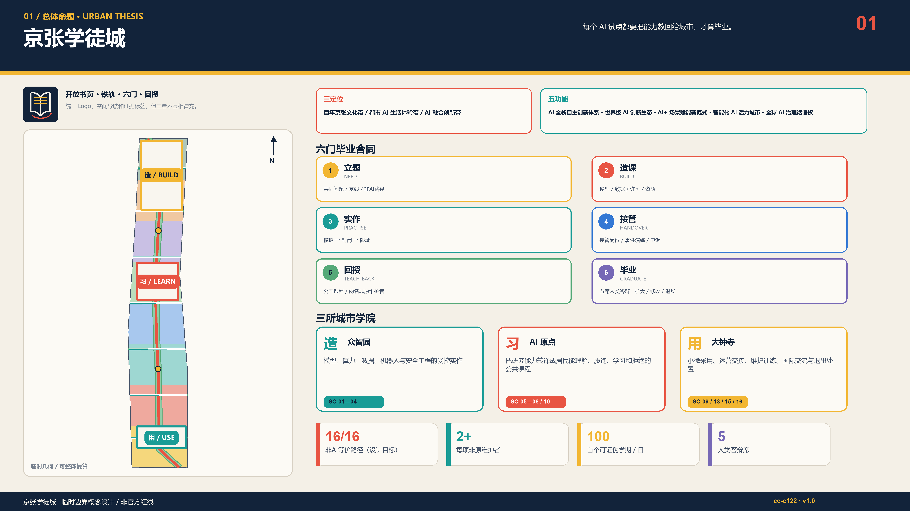
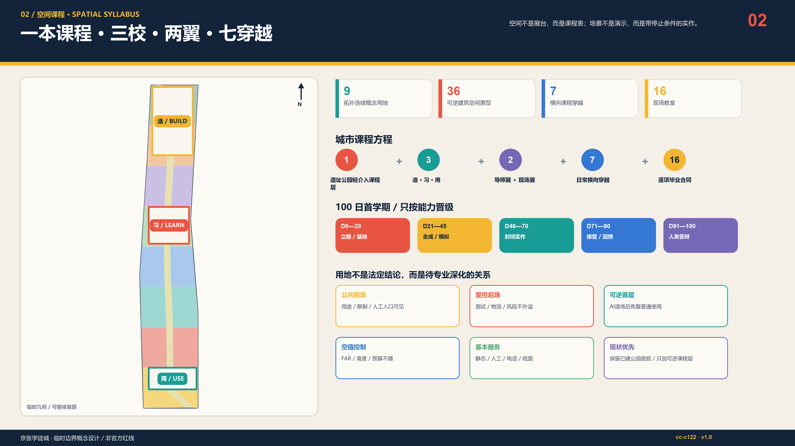
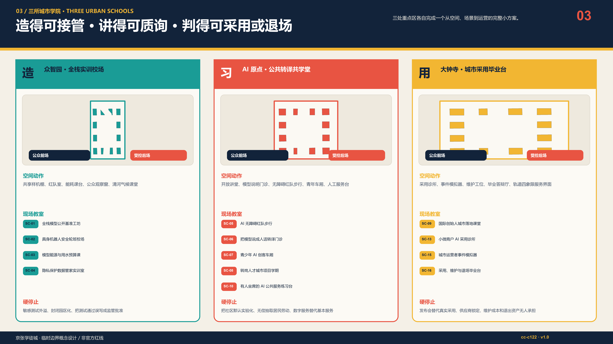
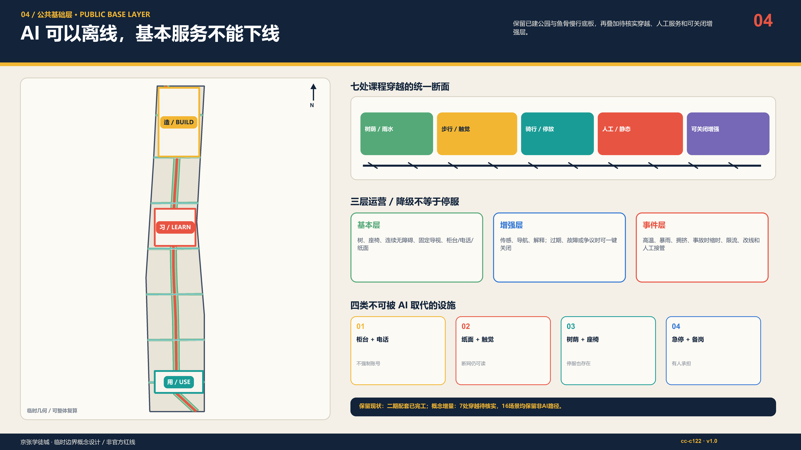
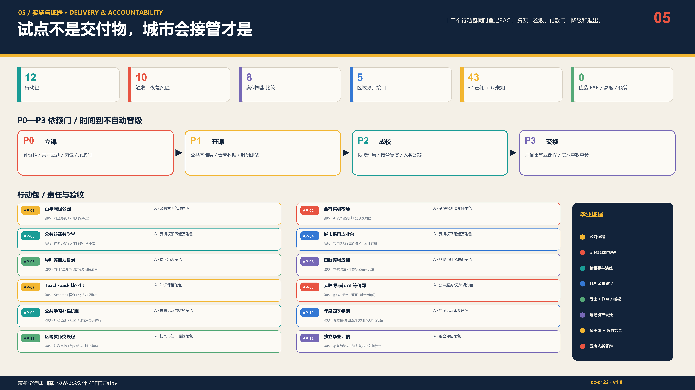

# 京张学徒城｜THE APPRENTICE CITY

> **每个 AI 试点都要把能力教回给城市，才算毕业。** 不是把城市变成技术的试验对象，而是让一次试点结束后，城市多出能解释、能接管、能修复、能质询、能退场的人。

## 1. 执行摘要

京张铁路曾把“自主建造”写进中国现代化史。面向下一个百年，本方案把这份遗产转译为“自主维护”：AI 创新带不以模型数量、发布会或设备交付作为成功，而以本地组织能否继续运行、监督、纠错和终止作为毕业标准。1909 是独立建造的历史起点，2026 是城市学习接管 AI 的开课年，2126 的遗产应是可世代传递的公共能力，而不是一批无人维护的智能设施。[source:JINGZHANG-HISTORY] [source:AGENT-TASKBOOK] [depth:overall_spatial_structure]

空间上形成“一本百年课程、三所城市学院、两条交换翼、七条课程穿越、十六间现场教室”。众智园负责“造”——全栈实训、安全与资源核算；AI 原点负责“习”——把研究翻译成居民能理解、质询、学习和拒绝的公共课程；大钟寺负责“用”——小微采用、维护交接、事件演练和毕业答辩。中关村导师翼输送导师、法务、标准与资本解释，小月河现场翼带回居民问题、气候与真实运营反馈；五类区域接口只输出可复用课程与教练，不虚构合作或数据共享。[data:geometry/key_areas.geojson#PROV-KEY-001] [metric:field_classroom_count]

每个场景必须依次通过 NEED—BUILD—PRACTISE—HANDOVER—TEACH-BACK—GRADUATE 六门。最关键的第五门要求：至少两名非原团队维护者能在不依赖供应商的情况下解释用途和限制、完成接管/故障复演、执行数据导出与删除、并讲明退出方案；第六门由运营、安全/数据、领域专业、受影响群体和独立评测五席人类答辩决定扩大、修改或退场。机器只能整理证据，不能给自己发毕业证。[data:visual/assets/teachback-bundle.schema.json] [standard:PROJECT-AGENT-OPEN-CALL-TASKBOOK]

首个 100 日学期采用可证伪路线：0—20 日立题与基线，21—45 日合成数据/模拟，46—70 日封闭实作，71—90 日接管与停机演练，91—100 日公开回授答辩。采购付款锚定“受训维护者、事件演练、公众材料、可访问非 AI 路径和退场资产”，不锚定设备到货、模型上线或活动人次。任一硬停止触发，增强层退回人工/纸面/电话/静态设施，基本服务不随 AI 停止。[data:visual/assets/operations-matrix.json] [metric:teachback_gate_count]

### 六门毕业合同

| 门 | 问题 | 必留证据 |
| --- | --- | --- |
| 1. 立题 / NEED | 共同定义问题、基线与非 AI 路径 | 共同问题卡+现状基线+非AI路径 |
| 2. 造课 / BUILD | 记录模型、数据、资源、许可与局限 | 模型/数据/许可/资源账 |
| 3. 实作 / PRACTISE | 先模拟、再封闭、后限域现场练习 | 模拟—封闭—限域测试记录 |
| 4. 接管 / HANDOVER | 明确人工岗位、演练、申诉与恢复 | 接管岗位+事件演练+申诉路径 |
| 5. 回授 / TEACH-BACK | 让非原团队能解释、维护、监督和退场 | 公开课程+两名非原维护者+复演 |
| 6. 毕业 / GRADUATE | 人类答辩决定扩大、修改或退场 | 人类答辩：扩大/修改/退场 |

本方案的公共承诺均是**待共同校准的设计目标**：16/16 公共场景保留无账号、无 App、电话、柜台、纸面、触觉或现场人员路径；每项拟毕业场景至少培训两名非原维护者；毕业答辩至少一席来自直接受影响群体且与采购/开发无利益冲突；社区评测和学徒劳动原则上计入补偿方案；结果报告同时展示总体与最差组，不用平均值掩盖排斥。这些目标不冒充现行服务水平、政府承诺或法定指标。[assumption:A-PUBLIC-001] [check:SCENARIO_GOVERNANCE]

### 命名与视觉识别

“京张学徒城 / THE APPRENTICE CITY”是总品牌；BUILD、LEARN、USE 是三校课程动词；SC、AP、P、R 分别冻结现场教室、行动、学期与风险编号。标志让两条开口铁轨折成一本书，六根学习枕木对应六门，红色回返弧表示能力必须教回城市。铁路夜蓝 `#12233A`、课程纸白 `#F4F0E7`、学习信号黄 `#F2B632`、停止/回授红 `#E85442` 延展到总图、场景卡、导视、四季活动和证据标签；仅使用系统字体，并为单色、高对比、大字和触觉版本留接口。片区/活动子标不得冒充一带总 Logo。国际主张是：**AI graduates only when the city can carry on.** [data:assets/apprentice-mark.svg] [standard:PROJECT-AGENT-OPEN-CALL-TASKBOOK]

## 2. 设计依据与资料清单

方案先读取公告、agent 任务书、允许设计空间、来源登记、已处理事实包、标准摘要和临时几何，再生成图层、指标、正文、图版与机器合同。当前可用边界和三处重点区均为仓库维护者标注的 `provisional_constraint`；它们只服务设计讨论、自检与复算，不是 official polygon、法定控规或审批依据。建筑普查、权属、文保、道路/轨道红线、市政容量、服务基线、运营主体、预算与真实用户测试尚缺，因此 FAR、总建筑面积、建筑高度与预算在 `metrics.json` 中保持 `unknown/null`，不以猜测填空。[source:SOURCE-REGISTRY] [source:BOUNDARY-SOURCE] [assumption:A-BOUNDARY-001] [depth:existing_conditions_diagnosis]

现实起点也不是一条等待重画的空白绿轴。北京市园林绿化局 2026 年 7 月公开信息确认二期配套项目完工，并说明北段约 30.01 公顷、配套市政工程及南北联通/东西联动的鱼骨状慢行网络；8 月 6 日“二期全线开放、与一期连成约 9 公里”的公开报道只作为现状背景记录。因此“百年课程公园”是对已建成并投入公共使用空间的**轻介入课程层与运营叠加层**：保留现状，以静态课程、人工服务、可逆小构件、限域场景和待核实横向接口增益，而不是重造公园。完工或开放均不代表本稿穿越、设备、活动、运营或工程建议已经获批。[source:PARK-PHASE2-SUPPORT-20260713] [source:PARK-PHASE2-OPEN-20260806]

八个全球案例只作为**机制参照**，不复制图像、不主张其绩效可直接移植，也不暗示已经建立合作。学徒制、测试床、TEF、小微采用、研究转译、区域课程和公共监督等机制必须重新经过北京的法律、规划、伦理、采购和受影响群体审查。[source:CASE-AIAP] [standard:MOHURD-URBAN-DESIGN-MEASURES]

| 参照案例（文字机制） | 可迁移机制 | 本地转译边界 |
| --- | --- | --- |
| AI Singapore AI Apprenticeship Programme [source:CASE-AIAP] | 深度训练后进入真实项目并由导师协作 | 转译为‘学习+真实项目+能力复演’，不外推资格、补贴、就业率或国家项目地位 |
| JTC Punggol Digital District [source:CASE-PDD] | 校园、产业、社区与区域数字平台在同一真实城区结合 | 只借鉴产学城共址和试验顺序，不外推土地制度、传感规模或绩效 |
| Testbed Helsinki [source:CASE-HELSINKI] | 城市、企业、研究者和居民在真实环境协作测试 | 转译为田野课与结束报告，不复制芬兰数据权利或采购 |
| EU AI Testing and Experimentation Facilities [source:CASE-EU-TEF] | 物理/虚拟设施、真实环境、终端用户与可信 AI 支持联成网络 | 转译为模拟—封闭—限域现场门，不宣称监管沙盒或认证地位 |
| Vector Institute Applied AI Internships [source:CASE-VECTOR] | 真实实施项目、导师和展示形成学习到实践路径 | 只借鉴项目制与包容招募，不外推其资格、伙伴或成效 |
| Mila [source:CASE-MILA] | 研究、人才、创业与负责任 AI 社群并行 | 转译为导师与责任课程，不外推机构规模、资金或治理 |
| Barcelona Impulsa 2025-2035 / 22@ [source:CASE-BCN] | 城市更新、创新集群、城市实验和人才议程被同框讨论 | 只借鉴城区级组合，不复制项目、法规、投资或图像 |
| Brainport Agenda [source:CASE-BRAINPORT] | 三螺旋协作把终身学习与共享繁荣纳入区域议程 | 转译为教师交换与持续学习，不外推微证书效力、伙伴或资金 |

新增政策来源只用于收紧边界，不用于制造“已合规”结论：生成式 AI 办法仅在面向境内公众提供生成内容等适用条件成立时进入专项判断，第14条不被解释为一般退出权，第15条不虚构数字响应期限，第17条不被扩张为所有系统的备案义务；任何场景都不得从本稿推定已完成备案或安全评估。[source:STD-GENERATIVE-AI] [standard:GENERATIVE-AI-INTERIM-MEASURES]

证据层级按“官方/仓库清权资料—临时约束—设计推演—未来实测”分开：正式结论只引用可追溯来源；设计推演必须带假设和停止门；未来实测必须由经授权的运营者与专业团队另行实施。`sources.json` 管来源，`assumptions.json` 管未确认条件，`standard_matrix.json` 管标准映射，`design_depth_matrix.json` 管深度，`self_check.json` 只证明包内一致性，不证明现实可部署。[source:PROCESSED-FACT-PACK] [check:PROFESSIONAL_EVIDENCE]

## 3. 三层范围工作框架

43.6 km² 统筹研究范围回答“谁教谁、何种能力跨区流动”；约 11.4 km² 总体设计范围回答“课程如何落到更新、交通、蓝绿和公共服务”；368.4 ha 三处重点范围回答“在一个可操作场地里，谁负责、练什么、何时停、如何交接”。三层不是比例缩放，而是一条能力传递链：区域教师交换—京张课程网络—三校现场毕业。[source:OFFICIAL-ANNOUNCEMENT] [depth:three_level_scope_framework]

总体范围以课程公园为南北公共脊柱，以七条横向课程穿越修补铁路遗址两侧日常联系，以三条校场环连接重点区内部实作；两翼不是新红线，而是交换方向。每一条线必须同时回答步行/骑行、无障碍、树荫雨水、静态导视和运营岗位，AI 只作为可关闭增强层。[data:geometry/roads.geojson#ROAD-001] [metric:learning_street_count]

三层范围共享同一组冻结 ID：SC-01—SC-16 场景、AP-01—AP-12 行动、P0—P3 学期和 R-01—R-10 风险。这样，宏观策略不是另一本口号册，详细设计也不是孤立效果图；图、文、数据、采购门和退出规则能回到同一个对象。[data:geometry/phasing.geojson#PHASE-P0] [check:METRIC_RECALCULATION]

## 4. 统筹研究范围产业与未来城市研究

### 任务书显式映射：三定位、五功能、三区两翼与六项任务

以下不是换名游戏，而是把任务书正式术语逐项翻译成可定位空间、责任门和可交接资产；完整 requirement ID 仍在 `compliance_matrix.json`。[source:AGENT-TASKBOOK] [data:compliance_matrix.json]

| 层级 | 任务书正式名称 | 学徒城的可定位翻译 | 证据 / 边界 |
| --- | --- | --- | --- |
| 定位 | 百年京张文化带 | 1909自主建造—2026自主维护—2126代际公共能力 | 百年课程轴；历史资源仍待专项普查 |
| 定位 | 都市AI生活体验带 | 16间现场教室与无账号、无App、非AI等价路径 | SC-01—16；全部concept_only |
| 定位 | AI融合创新带 | BUILD—LEARN—USE三校与Teach-back回路 | 三处provisional重点区；非批准功能布局 |
| 功能 | AI全栈自主创新体系 | 众智园“造”：复现、安全、资源、数据实训 | SC-01—04 / AP-02 |
| 功能 | 世界级AI创新生态 | AI原点“习”：导师、公共转译、人才三轨与八案机制比较 | 不外推案例绩效或合作 |
| 功能 | AI+场景赋能新范式 | 16张场景合同把数据、人工门、非AI路径、停止和回授绑在一起 | 5项industry_test；待真实测试 |
| 功能 | 智能化AI活力城市 | 课程公园基本层—增强层—事件层与大钟寺“用” | AI可关闭，基本服务不可下线 |
| 功能 | AI治理全球话语权 | 六门、五席人类答辩、负面结果与失败档案 | Schema只证明结构，不是认证 |
| 三区 | 众智园AI自主创新加速区 | BUILD / 全栈实训校场 | 造得可接管 |
| 三区 | AI原点社区 | LEARN / 公共转译共学堂 | 讲得可质询 |
| 三区 | 大钟寺AI产业集聚区 | USE / 城市采用毕业台 | 判得可采用或退场 |
| 两翼 | 中关村科技服务翼 | 导师、法务、标准、资本解释的输入翼 | 不声称机构已承诺 |
| 两翼 | 小月河场景赋能翼 | 居民问题、气候、无障碍与运营反馈的输入翼 | 不把参与视为部署同意 |

| 任务 | 本次显式输出 | 继续深化的交接件 |
| --- | --- | --- |
| agent.1 总体概念与功能统筹 | 京张学徒城中英文名、标志、三定位五功能映射、一本三校两翼七穿越结构 | SVG标志、总体图、命名/色彩/导视规则 |
| agent.2 全栈与创新生态 | 8案机制比较、五节点回路、土地/空间/产业/资金/人才/算力/数据/场景八要素 | 来源台账、要素门与空间—产业映射 |
| agent.3 AI+场景 | 16场景、5产业测试、9画像、场景—空间—运营—停止合同 | scenario-cards.json与公共体验路线 |
| agent.4 公共空间与地标 | 4地标、3荣誉轨、7项公共组件、大钟寺采用场景 | 组件目录、维护/无障碍/文保深化门 |
| agent.5 文化融合 | 1909—2026—2126叙事、三种可读性、分级中英导视与国际传播套件 | 历史普查、内容清权与触觉/音频深化 |
| agent.6 长期运营 | 四季学期、开发者维护链、八步场景开放门、五级转化阶梯 | 运营RACI、版本/许可、退出与本地重验包 |

产业逻辑从“企业集聚”转为“城市能力形成”。研究机构和企业仍然生产模型与产品，但每次公共试点还要生产四类城市资产：公开可访问的课程、受训维护者、经演练的人工接管、可复用且权利清楚的知识包。只有形成这四类资产，试点才有资格从封闭测试走向有限现场；这样把科研、人才、公共价值和长期运营压在同一张毕业单上。[metric:teachback_gate_count] [source:AGENT-TASKBOOK]

区域协同采用 train-the-trainer 而非复制产品。北纬社区可交换社区问题与居民教练，未来科学城可交换科研设施和工程训练，怀柔科学城可交换科学传播与大科学装置课题，经开区可交换制造/机器人现场方法，京津冀节点可交换地方需求与毕业课程。所有接口都必须先确认当地数据许可、责任人、受影响群体和退出条件；不能把京张的一次测试通过写成异地认证。[assumption:A-REGION-001] [standard:PROJECT-AGENT-OPEN-CALL-TASKBOOK]

| 接口 | 概念课程交换 | 同意与停止门 |
| --- | --- | --- |
| 北纬社区 / BEIWEI COMMUNITY | 日常需求、无障碍、无账号/非数字路径共同教学 | 不推定参与即同意部署 |
| 未来科学城 / FUTURE SCIENCE CITY | 概念交换科研实训、人才课程与复现任务 | 不声称已有课程互认 |
| 怀柔科学城 / HUAIROU SCIENCE CITY | 概念连接科学智能、仪器与环境场景课程 | 现场应用另行专业审查 |
| 北京经开区 / BEIJING E-TOWN | 概念连接机器人、制造与工程维护训练 | 不外推测试许可或产业协议 |
| 京津冀 / BEIJING-TIANJIN-HEBEI | 去地点化课程包、负面结果与教师交换方向 | 各地依法重验，不复制本地坐标和审批 |

### AI生态五节点与八要素

生态回路是：众智园 BUILD/验证 → AI原点 PRACTISE/公共转译与人才 → 大钟寺 HANDOVER/采用毕业 → 已毕业课程回到城市 NEED；中关村科技服务翼输入导师、法务、标准和资本解释，小月河场景赋能翼输入居民问题、气候、无障碍与运营反馈。两翼和区域接口交换的是课程字段、教练、版本差异与负面结果，不交换个人数据、本地坐标、审批结论或自动认证。[data:visual/assets/operations-matrix.json] [depth:overall_spatial_structure]

| 要素 | 机制 | 空间 / 毕业门 | 不得越过 |
| --- | --- | --- | --- |
| 土地 | 只在清权、用途与许可确认后限域 | 三处重点区与九片概念功能关系 | 不作权属、法定用途或拆迁判断 |
| 空间 | 公共基本层+受控实作+观察界面+可逆退场 | 三校两翼 / HANDOVER | 不作红线、桥隧或工程可行性结论 |
| 产业 | 问题—测试—采用—回授，不以上线量代替能力 | 众智园→原点→大钟寺→城市 | 不编企业、产值、招商或协议 |
| 资金 | 四个结果付款门，预留安全、无障碍、培训和退场 | 20/25/30/25%参考合同 | 不是财政、预算或采购承诺 |
| 人才 | 专业/社区/管理三轨，至少两名非原维护者复演 | PRACTISE—TEACH-BACK | 不以无关学历排除，不保证就业 |
| 算力 | 按任务计量算力、电、水、热、噪声、消防与撤场 | BUILD资源账 | 容量不明只模拟/封闭，不报节能成效 |
| 数据 | 合成优先、最小化、用途/保留、导出、删除、申诉 | NEED—HANDOVER | 不依赖个人信息、受限资料或未获授权数据 |
| 场景 | 16卡逐项配置人工门、非AI等价、硬停止和回授 | 5项产业测试 / 五席答辩 | 未成熟技术不写成已批准部署 |

未来城市形态由“学习可见性”塑造：首层公共界面展示用途、限制、资源和人工入口；生产测试在受控内院进行，公众通过观察窗而非被动成为样本；课程街把停留、问答、维修和申诉放在通勤线上；失败档案与退场案例进入“未毕业作品墙”。四处地标——百年课程门、模型白话馆、城市接管台、失败也毕业档案馆——分别表达入门、理解、承担和诚实退出。[depth:height_massing_character] [data:geometry/public_space.geojson#SC-06]

## 5. 总体设计范围城市更新与控规深度城市设计

概念用地由同一临时 site polygon 做无缝差集生成九片，保持 100% 拓扑覆盖且不互相重叠；其角色包括课程公园、研发实作、公共学习、社区服务、居住配套、文化记忆和采用维护。36 个建筑基底是“空间原型”，用于检查可逆首层、院落、公众观察、后勤与安全隔离的关系，不代表现状楼栋、拆改留决定或批准建设量。[data:geometry/land_use.geojson#LU-009] [metric:land_use_coverage_ratio] [depth:land_use_layout]

更新优先级依次为：保留与再利用可安全使用的工业/铁路记忆；以轻介入改善首层、连廊、无障碍和能源计量；在调查证明必要且依法论证后才讨论拆除；新增量只服务缺失的公共课程、维护、卫生、安全和气候设施。每栋建筑必须补齐权属、年代、结构、消防、文保、使用与能耗调查，才可从概念原型进入专业方案。[standard:MOHURD-ARCH-DESIGN-DEPTH-2016] [assumption:A-BUILDING-001]

开发强度控制采取“空值优于伪精确”：未取得官方控规、红线、文保视廊与市政容量之前，不给 FAR、高度、退线、停车和工程断面假数。设计阶段只提出可检验的界面原则——连续公共首层、测试与公众流线分离、物流不穿越儿童/老人活动区、屋顶设备可维护且声热不外溢、每个 AI 场所能在退场后恢复为普通公共/生产使用。[metric:floor_area_ratio] [depth:development_intensity_controls]

## 6. 重点区域详细设计

### 众智园 · 全栈实训校场（造）

以共享样机棚、隔离网络、红队室、计量课台、公众观察窗和清河气候课堂组成“内测—观察—复盘”三层空间。SC-01—04 聚焦模型复现、机器人急停、能源/用水核算与隐私数据管家；AP-02 以安全、数据和资源账为验收底座，再开放限域测试。任何越界、急停失效、许可不清、无法计量或删除失败都触发封存，而不是用活动热度抵消风险。[data:geometry/key_areas.geojson#PROV-KEY-001] [data:geometry/public_space.geojson#SC-01]

### AI 原点 · 公共转译共学堂（习）

以东西课程街缝合校区、园区与社区，布置模型白话门诊、无障碍红队步行、青少年创客车厢、转岗项目学期和有人坐席的公共服务练习台。SC-05—08、SC-10 的共同原则是居民可理解、可拒绝、可申诉，并有电话/柜台/纸面/触觉等价路径；课程公园 SC-14 在同一中段提供区域教师交换入口。涉及未成年人、福利、医疗、法律或出行安全时，AI 不作最终决定。[data:geometry/key_areas.geojson#PROV-KEY-002] [assumption:A-PUBLIC-001]

### 大钟寺 · 城市采用毕业台（用）

围绕轨道四象限布置小微采用诊所、AI合同白话台、维护工位、事件模拟器、毕业答辩厅与双语课堂；SC-09、SC-13、SC-15、SC-16 验证合同理解、人工复核、停机通知、离线服务、恢复和负责任退场。站城工程、桥隧与四象限连通必须另行专业论证，本方案只锁定地面连续无障碍和服务界面优先。毕业台不举办“上线即成功”的发布会，只有接管完成、公众材料可读且退出资产有人负责，才建议进入下一阶段。[data:geometry/key_areas.geojson#PROV-KEY-003] [depth:three_key_area_detailed_design]

两翼和三校之间用七处 cross-classroom 形成横向公共联系：每处同时配置固定无障碍线、遮荫/雨水、静态方向、可关闭数字增强与维护责任牌。夜间、极端天气或人流异常时，由现场岗位决定缩时、限流或关闭增强层。[data:geometry/roads.geojson#ROAD-002] [metric:key_area_count]

## 7. AI 创新生态、人才画像与 AI+ 场景

“学徒”不是低价劳动力称谓，而是责任可以被观察、练习和移交的城市角色。方案同时服务研究者、工程师、运营者、转岗者、儿童、老年人、残障者、小微商户和国际访客；能力成熟度不等于学历。社区学徒轨不设置与任务无关的学历门槛，参与测试与共评原则上进入补偿预算，受影响群体拥有实质暂停和答辩席位。[metric:persona_count] [check:SCENARIO_GOVERNANCE]

| 画像 | 核心需要 | 不可跨越的边界 |
| --- | --- | --- |
| P-01 青年创客 | 低门槛实作、可信导师与安全边界 | 不采集非必要未成年人数据 |
| P-02 高校研究者 | 成果转译、复现、公共质询与合作 | 开源不等于开放敏感数据或全部知识产权 |
| P-03 初创工程师 | 测试、标准、采用和维护责任 | 付费不能购买通过或政府背书 |
| P-04 一线运营与维护者 | 配置、接管、故障恢复、排班和尊重劳动 | 不能用自动化隐去必要劳动和责任 |
| P-05 转岗劳动者 | 带补偿的学习、真实项目和可迁移能力 | 社区学徒轨不以学历设置无关门槛 |
| P-06 老年居民与照护者 | 可理解说明、电话/柜台/纸面等价服务 | 拒绝账号或数据授权不降低服务 |
| P-07 残障使用者 | 连续无障碍、可访问格式、参与补偿和共同签字 | 不得让二维码成为唯一入口 |
| P-08 本地小微商户 | 可负担采用、合同解释、人工复核与退出 | 禁止情绪识别定价和不透明画像 |
| P-09 国际访客与观察者 | 双语路线、规则可读、合作边界诚实 | 翻译须可申诉且不伪造既有合作 |

十六间现场教室不是“AI 可以做什么”的愿望清单，而是“在何处、服务谁、最少取什么数据、谁能叫停、没有 AI 怎么办、怎样证明城市学会了”的逐项合同。每项仍为 `concept_only`，没有真实部署或用户试验主张。[data:visual/assets/scenario-cards.json] [assumption:A-AI-001]

| ID / 场景 | 场所 / 对象 | 最小数据与人工门 | 非 AI 等价路径 | 回授通过 / 硬停止 |
| --- | --- | --- | --- | --- |
| SC-01 全栈模型公开基准工坊 | 可计量测试台与隔离网络；研究者、初创、独立评测者 | 版本、任务、合成样本、聚合性能/能耗；技术负责人+独立复现者签字 | 静态基准报告与人工咨询 | 非原团队复现 3 项核心测试且偏差可解释；**停止：**数据许可不明、不可复现或越权即封存 |
| SC-02 具身机器人安全轮班校场 | 室内/围界测试湾与观察窗；机器人团队、现场安全员、公众观察者 | 设备状态、接管时延、碰撞/失联事件；双人急停与事件指挥岗位 | 静态样机展示与隔窗讲解 | 外部安全员完成停机、复位、撤场三项演练；**停止：**越界、急停失效、失联或公众区进入风险即停 |
| SC-03 模型能源与用水预算课 | 计量课台与资源说明墙；工程师、设施运营者、环境观察员 | 设备级电、水、热、时段与任务规模；能源/设施人员核验并可拒绝扩容 | 不运行模型也能阅读的纸面标签 | 维护者能重算单次任务资源并说明不确定性；**停止：**无法计量、容量不明或安全散热未闭合即停止 |
| SC-04 隐私保护数据管家实训室 | 隔离数据室与合成数据工作台；数据管家、社区观察员、法律/安全人员 | 分类、目的、字段、期限、权限和删除证明；数据责任岗位+受影响人群代表共同签字 | 不交个人数据的合成案例路径 | 第二数据管家能执行导出、删除和权限撤销；**停止：**用途漂移、再识别风险或删除失败即暂停 |
| SC-05 AI 无障碍红队步行 | 原点东西课程街与连续无障碍线；残障使用者、设计师、运维人员 | 公开路网、经同意的障碍报告、短时位置；残障体验官拥有一票暂停权 | 触觉/静态图、热线和现场人员 | 非原团队能更新障碍、发布替代线并关闭错误；**停止：**错误导向、无障碍中断或申诉未响应即下线 |
| SC-06 把模型说成人话转译门诊 | 公共转译桌与可访问说明墙；研究者、教师、图书馆员、居民 | 模型用途、来源、限制、版本、责任与争议；编辑+专业责任人+居民读者共同校对 | 简明纸本、音频和现场问答 | 陌生运营者能在 2 分钟内讲清用途、边界和人工入口；**停止：**来源不清、夸大能力或投诉入口缺失即撤下 |
| SC-07 青少年 AI 创客车厢 | 可逆课程亭与公共创作桌；学生、教师、青年机构、家长/监护人 | 作品文件、最小报名、许可与安全记录；教师终审；监护与儿童安全规则先行 | 无账号材料包与离线编程任务 | 同伴能重做作品并指出数据与版权边界；**停止：**采集非必要未成年人数据、诱导或不当内容即停 |
| SC-08 转岗人才城市项目学期 | 共学堂、现场教室和导师翼；转岗者、导师、用人方、公共问题提出者 | 学习目标、任务版本、反馈、许可和工时；导师与问题提出者评议，不以 AI 自动淘汰 | 开放讲义、人工辅导与纸面反馈 | 学徒独立完成部署前检查、人工接管和退场说明；**停止：**无补偿劳动、歧视筛选或真实服务越权即停止 |
| SC-09 国际创始人城市落地课堂 | 大钟寺国际课堂与导师翼接口；国际团队、法务/标准导师、翻译者 | 主动提交的产品、需求、许可和翻译材料；专业人员终审，不生成行政或法律结论 | 双语清单、人工预约与纸面路径 | 团队能复述本地未知项、许可门与不可承诺事项；**停止：**暗示政策待遇、签约、政府背书或未经授权披露即停 |
| SC-10 有人坐席的 AI 公共服务练习台 | 人工柜台、电话席与模拟服务屏；居民、窗口人员、照护者、无账号访客 | 公开服务目录、合成工单和转人工状态；一线人员拥有最终分流和纠错权 | 柜台、电话、纸面目录始终并行 | 备用人员能在断网下完成查询、记录和升级；**停止：**福利/医疗/法律结论自动裁决或人工通道中断即停 |
| SC-11 低视力与无智能手机出行伴侣 | 全线服务点、触觉地图和静态导视；低视力者、老人、访客、交通人员 | 公开路网、障碍状态、短时请求，不做人脸识别；现场交通/无障碍人员复核安全信息 | 音频按钮、热线、触觉图和人工陪行 | 运营者能在设备失效时 15 分钟内切换静态替代；**停止：**关键安全信息过期、路径中断或无法告知即关闭增强层 |
| SC-12 高温暴雨适应课程街 | 小月河翼、遮荫点、雨水花园与休息站；居民、景观/市政人员、维护者 | 微气候、积水、设施状态与匿名计数；专业人员发布预警，AI 不替代应急命令 | 固定遮荫、静态标识与人工巡查 | 社区管家能复核传感器、布置替代路线并上报故障；**停止：**设备失真、气象高风险或维护资源不足即降级人工 |
| SC-13 小微商户 AI 采用诊所 | 大钟寺采用桌与试营业房间；小微商户、导师、消费者代表 | 商户主动提供的流程、成本包络、权限与反馈；商户本人+消费者保护/专业角色共同签字 | 人工流程、普通价签与纸质合同说明 | 商户能停用工具、导出必要记录并恢复人工流程；**停止：**真实支付越权、歧视定价、供应商锁定或撤销失败即停 |
| SC-14 京张遗产事实核验课 | 遗址公园事实墙与版本年轮；居民、访客、档案/文保人员、口述史贡献者 | 清权史料、出处、争议、授权和撤回状态；档案/文保编辑终审，贡献者可撤回 | 静态展签、人工导览和印刷年表 | 新编辑能沿来源重建一条叙事并标注不确定性；**停止：**来源不明、权利争议未隔离或将概念写成史实即隐藏 |
| SC-15 城市运营者事件模拟器 | 大钟寺事件室与可断网操作台；运营者、数据/安全人员、残障代表、事故指挥 | 纯合成事件、角色、时钟、决策差异和恢复证据；未参与原决定的独立评议者主持复盘 | 电话树、纸本手册、机械急停与现场集合点 | 备用班组完成停机、通知、人工服务、恢复和退场五联演练；**停止：**接管超时、日志缺失、角色冲突或无法恢复即不毕业 |
| SC-16 采用、维护与退场毕业台 | 毕业答辩厅、维护工位和退场仓；运营者、采购/法务、居民、学徒、独立评估者 | 场景证据、人员能力、成本状态、申诉、资产去向；五席人类答辩；受影响群体一席不可省略 | 不采用 AI 的服务和完整退场方案 | 非原团队解释、运行、接管、修复、导出和退场全部通过；**停止：**责任人、持续资源、申诉、退出资产任一不清楚即退修或退场 |

### 小月河公共体验路径与场景开放门

公共体验按“百年课程门 → 模型白话馆 → 无障碍红队步行 → 小月河高温暴雨课程街 → 城市接管台 → 失败也毕业档案馆”串联；每站都有无账号入口、静态/触觉导视、人工服务和可关闭增强层。任何场景依次经过申请 → 权利/安全/无障碍筛查 → 合成/模拟 → 封闭测试 → 限域体验 → Teach-back → 五席人类答辩 → 继续/修改/退场；路线开放不等于沿线技术获准部署。[data:geometry/roads.geojson#ROAD-001] [standard:PROJECT-AGENT-OPEN-CALL-TASKBOOK]

人才路径有三条：专业学徒把研究转为可复现工程；社区学徒把生活经验转为测试、维护和申诉能力；管理学徒训练采购、数据、风险与退场。每条路径都以真实但受控的问题为课程，以失败复盘为必修，以可迁移作品包而非平台徽章为结业资产。[source:CASE-AIAP] [source:CASE-VECTOR]

## 8. 用地、建筑规模与拆改留方案

| 指标 | 本次可复算值 | 性质 / 决策用途 |
| --- | --- | --- |
| 临时总体设计范围 | 11.41 km² | 来自仓库 provisional polygon；非官方红线 |
| 概念用地覆盖 | 100.00% | 拓扑完整性检查；非审定用地 |
| 概念绿地网络 | 38.6% | 内部空间平衡；正式指标待校准 |
| 现场教室公共空间 | 0.9% / 16处 | 16场景空间占位；不等于法定公共空间率 |
| 课程街中心线 | 30.5 km / 11条 | 连通性概念；非道路红线或工程里程 |
| 建筑空间原型 | 36个 | 只验证界面与院落；楼层/高度/FAR未知 |
| Teach-back | 6门 / 2名非原维护者（目标） | 项目毕业门；待运营者和受影响群体校准 |
| 非数字等价 | 16/16场景（设计目标） | 拒绝账号、数据或AI时仍可获得基本服务 |

九片概念用地只表达功能关系：课程公园保证连续公共脊柱；研发/实作靠近受控后勤；公共学习和社区服务面对课程街；居住配套与高风险测试保持缓冲；文化记忆节点优先使用可逆介入。法定分类代码引用土地用途指南，但任何地块的最终性质、兼容比例和边界均待 official parcel/控规确认。[standard:MNR-LAND-USE-CLASSIFICATION-GUIDE] [data:geometry/land_use.geojson#LU-001]

拆改留采用五步门：调查建档—安全/文保/权属筛查—使用绩效与公共价值评估—权利人协商—保留/修缮/适应性再利用优先，必要拆除依法论证。36 个概念基底均标注 `concept_spatial_prototype`；不得从图形位置推断现状房屋、权属、拆迁或建设许可。[data:geometry/buildings.geojson#BLDG-001] [depth:retain_renovate_demolish]

建筑语言从京张工程理性中提取“可读构造、重复节奏、耐久维护”，不用仿古符号。公众界面展示操作说明和维护痕迹，内院容纳可撤除设备，屋顶优先气候与运维，材料优先可维修和可替换。正式高度、体量、消防、结构、声环境、日照与文保视廊由专业深化决定。[depth:height_massing_character] [assumption:A-CONTROLS-001]

## 9. 交通、轨道、市政与公共服务设施

交通结构以一条课程公园慢行脊、七条横向穿越、三条校场环和静态站城服务点为骨架。优先级为步行连续和无障碍—自行车停放与换乘—公交/轨道接驳—必要后勤和应急—小汽车。所有 AI 导航均叠加在可独立工作的触觉图、固定导视、热线和现场人员之上；安全信息过期即关闭增强层。[data:geometry/roads.geojson#ROAD-001] [depth:traffic_rail_slow_parking]

大钟寺轨道四象限只提出地面服务界面和跨街需求，不虚构桥隧、站厅改造或红线；AI 原点东西课程街以校地/园区接口协商为前提；众智园物流与公众观察流线分开。停车、道路断面、轨道保护、消防救援和施工交通须由主管部门与专业团队取得资料后论证。[assumption:A-CONTROLS-001] [standard:MOHURD-CONTROL-DETAILED-PLANNING]

新基础设施实行“先计量再扩容”：算力、电、水、热、网络、噪声、消防、设备运维和废弃处置全部进入 BUILD 门。容量未知时只允许模拟或封闭训练；无法计量单次任务资源、散热/消防未闭合、人工岗位缺失时不得进入现场。公共服务设施必须同时列出数字席、人工席、电话/纸面容量和断网排班。[data:visual/assets/teachback-bundle.schema.json] [depth:municipal_new_infrastructure]

SC-10 在医疗、社保、金融、生活缴费等法律明列公共服务语境中保留现场指导和人工办理；方案进一步把柜台、电话、纸面、触觉与人工陪行设为所有试点的自主设计底线，但不把这项更广底线冒充法律普遍要求。[source:STD-BARRIER-FREE] [standard:BARRIER-FREE-ENVIRONMENT-LAW]

老年人传统/智能通道并行只引用 2020—2022 阶段政策作背景，不推定海淀现状、需求规模或 2026 年法定义务；SC-10/11 的可访问服务、无智能手机路径与人工接班是方案选择，仍需与老年人和照护者共同校准。[source:STD-ELDERLY-SMART-TECH] [standard:ELDERLY-SMART-TECH-PLAN-2020-45]

## 10. 蓝绿空间、公共空间与城市风貌

课程公园、七处绿色穿越、清河/小月河课堂和三校庭院构成蓝绿学习网络。课程公园首先保留已完工配套工程与已经开放使用的公共底板；提交的绿色图层只表达可逆课程层、横向连接需求和三校庭院之间的概念关系，不把现状工程重新署名为本方案成果。它承载日常遮荫、雨洪、休憩与生境，也让 SC-03/12 把资源计量和极端天气维护变成公众可见课程。当前绿地比例仅为临时几何内部平衡，不代表法定绿地率、海绵绩效或生态提升结果。[source:PARK-PHASE2-SUPPORT-20260713] [data:geometry/green_space.geojson#GREEN-001] [metric:green_ratio]

公共空间按“基本层—增强层—事件层”运营：基本层是树、座椅、连续无障碍、静态信息和人工服务；增强层是可关闭的传感/导航/解释；事件层在高温、暴雨、拥挤或故障时缩时、限流、改线。AI 失效不得带走座椅、树荫、方向和服务。夜间采用低眩光、低噪声、可解释的时段表，机器人/无人设备只在受控区活动。[data:geometry/public_space.geojson#SC-12] [assumption:A-CLIMATE-001]

风貌不以“未来感屏幕”衡量，而以三种可读性衡量：历史可读——看见铁路工程、劳动和时间；技术可读——看见用途、限制、资源、责任和停机；社会可读——看见谁可以进入、拒绝、申诉和接管。百年课程门与失败档案馆共同提醒：能诚实停下，也是一种城市能力。[standard:MOHURD-URBAN-DESIGN-MEASURES] [depth:blue_green_public_space]

### 公共空间地标、荣誉展示与组件库

四处地标把“入门—理解—承担—诚实退出”变成公众可操作的序列；大钟寺的小微采用诊所、AI合同白话台、维护工位、事件模拟器和双语课堂是智能原生消费/商务的概念服务界面，不是已确定商户、改造或运营安排。[source:AGENT-TASKBOOK] [data:geometry/public_space.geojson#SC-15]

| 地标 | 空间类型 / 公众动作 | 非AI基本层 | 深化边界 |
| --- | --- | --- | --- |
| 百年课程门 | 课程公园入口：读规则、选路线、提出问题 | 大字/触觉规则、人工问询、纸面图 | 遗产、消防、人流与景观专项 |
| 模型白话馆 | AI原点公共首层：理解、质询、拒绝与申诉 | 人工解释台、纸面模型卡、电话 | 不展示未清权模型/数据或作效果承诺 |
| 城市接管台 | 大钟寺毕业台：急停、离线服务、人工接管复演 | 人工坐席、静态状态灯、事件清单 | 站城、结构、消防与运营另审 |
| 失败也毕业档案馆 | 课程公园/离线档案：查退场原因、补救和可复用教训 | 纸档、版本号、更正/撤回入口 | 去标识、权利、保留期与历史准确性另审 |

荣誉展示不用排行榜、刷脸或赞助商买位，而分三轨：**贡献轨**经同意记录课程、维护和受影响群体贡献；**毕业轨**记录版本、复核日、两名维护者和适用边界；**负责退场轨**记录失败原因、补救与可复用教训。任何记录均支持更正、化名、撤回和保留期复核，证据优先于名气。[assumption:A-PUBLIC-001] [check:COPYRIGHT_RIGHTS]

| 公共组件 | 基本功能 | 可关闭增强层 / 维护门 |
| --- | --- | --- |
| 课程枕木导视 | 方向、距离、开放时段、无障碍路线 | 动态翻译可关；系统字体、高对比、触觉复核 |
| 模型卡阅台 | 用途、限制、输入、责任、复核日 | 交互解释可关；内容责任人更新 |
| 无AI等价服务台 | 人工、电话、纸面、触觉和无账号入口 | 预约/翻译可关；基本排班不可随AI撤销 |
| 人工接管/急停亭 | 具名岗位、停机、事件记录和申诉 | 状态遥测可关；双人复演后恢复 |
| 可逆测试观察窗 | 隔离测试与公众观察分开 | 数据演示可关；安全/隐私/文保先审 |
| 资源计量柱 | 显示任务能水热/算力边界和数据时间戳 | 预测可关；原始表计与人工抄录保留 |
| 失败档案柜 | 版本、触发、降级、修复、退场资产 | 检索可关；更正、撤回和保留期执行 |

### 百年文化、导视与国际传播

| 时间 / 文化层 | 可验证内容 | 学徒城转译 | 表达与清权边界 |
| --- | --- | --- | --- |
| 1909 · 京张 | 自主建造的工程史、铁路线性遗产、劳动与维护记忆 | 看得见构造、责任和维修 | 具体站房、构件、人物与图像须专项普查/授权 |
| 中关村 · 开放创新 | 科研、教育、创业和技术社群的区域文化 | 开放问题、复现、导师与知识回授 | 不借用机构商标，不虚构合作或成果 |
| 2026 · 城市接管AI | 本征集的任务与开放共创边界 | 机器不能给自己发毕业证 | 概念建议，不是政府批准或部署事实 |
| 2126 · 代际公共能力 | 本方案提出的未来价值判断 | 诚实、能干、可修复、好客 | 愿景而非预测；由长期公共评估修订 |

空间文化系统是一条时间轴、七条课程穿越、四处地标和历史/技术/社会三种可读性。符号层级严格区分：一带总 Logo；书页/铁轨/六门/回返箭头的空间导航；用途、限制、输入、责任岗位、复核日、非AI路径的证据标签。中英、大字、高对比、触觉与可选音频共同深化，数字导视失效时静态信息仍完整。国际传播套件只包含双语一句话、100字项目说明、六门图、版本/许可/联系人和本地重验声明；不把投稿写成入选或落地。[data:assets/apprentice-mark.svg] [source:JINGZHANG-HISTORY]

## 11. 更新项目清单、实施政策与分期计划

实施按依赖而非年份许愿：P0 立课补资料/共同定义/岗位和采购门；P1 开课完成公共基础层、合成数据与封闭测试；P2 成校开展限域现场、接管和毕业答辩；P3 交换只输出已毕业且本地重审的课程。任一阶段未满足数据、权利、容量、无障碍或人工责任，下一阶段不启动。[data:geometry/phasing.geojson#PHASE-P0] [metric:phase_count]

100 日首学期只选择 3 个低风险、能失败的小课题：SC-06 模型白话门诊、SC-12 高温暴雨课程街的离线维护、SC-15 合成事件接管演练。第 20 日必须完成基线和非 AI 路径，第 45 日完成合成/模拟，第 70 日完成封闭测试，第 90 日完成接管/停机，第 100 日公开答辩。任何一项未通过可选择修改或退场，失败记录进入公共档案，不用“示范”包装。[data:visual/assets/example-sc15-teachback-bundle.json] [check:TEACHBACK_CONTRACT]

| 行动 | 位置 / 阶段 | A 责任岗位 | 关键依赖 | 可验收交付物 | 停止规则 |
| --- | --- | --- | --- | --- | --- |
| AP-01 百年课程公园 | 全线 / P0-P2 | 公共空间管理角色 | 连续路径、文保、绿线、权属 | 可逆导视+7 处现场教室 | 重安全缺口立即隔离；无静态替代不开放 |
| AP-02 全栈实训校场 | 众智园 / P0-P2 | 受授权测试责任角色 | 场地、消防、能源、数据与保险 | 4 个产业测试+公众观察窗 | 急停或隔离失败立即停测 |
| AP-03 公共转译共学堂 | AI 原点 / P0-P2 | 受授权服务运营角色 | 建筑、消防、知识产权、社区协商 | 简明说明+人工服务+学徒席 | 社区默认实验化即暂停 |
| AP-04 城市采用毕业台 | 大钟寺 / P0-P3 | 受授权采用运营角色 | 站点、消费者保护、运营与退场资源 | 采用诊所+事件模拟+毕业答辩 | 原团队不可替代或退出资产不明则不毕业 |
| AP-05 导师翼能力目录 | 中关村翼 / P0-P3 | 协同统筹角色 | 主体自愿、服务能力、许可与退出 | 导师/法务/标准/算力服务清单 | 不得虚构伙伴或用名单替代成效 |
| AP-06 田野翼场景课 | 小月河翼 / P0-P3 | 场景与社区联络角色 | 河道、绿地、公众参与、气候与维护 | 气候课堂+非数字路径+反馈 | 安全/维护资源不足即降级 |
| AP-07 Teach-back 毕业包 | 三区 / P0-P3 | 知识保管角色 | 字段、许可、删除、版本与归档 | Schema+样例+公共知识资产 | 六门材料不全不得进入人类答辩 |
| AP-08 无障碍与非 AI 等价网 | 全线 / P0-P3 | 公共服务/无障碍角色 | 实走、触觉/音频、人工排班与投诉 | 热线+柜台+纸面+触觉/音频 | 任一试点取消基本服务即关闭增强层 |
| AP-09 公共学习补偿机制 | 三区 / P1-P3 | 未来运营与财务角色 | 预算、劳动分类、无利益冲突 | 补偿原则+社区学徒席+公开选择 | 不能覆盖参与成本则缩小征集而非索取免费劳动 |
| AP-10 年度四季学期 | 全线 / P1-P3 | 年度运营牵头角色 | 持续预算、许可、安全、维护与撤场 | 春立题/夏田野/秋毕业/冬退场演练 | 年度必须同时公开继续、修改和停止 |
| AP-11 区域教师交换包 | 统筹范围 / P2-P3 | 协同与知识保管角色 | 各地依法复核、数据去地点化、不可互认默认 | 课程字段+负面结果+版本差异 | 不复制个人数据、本地坐标或审批结论 |
| AP-12 独立毕业评估 | 三区 / P1-P3 | 独立评估角色 | 利益冲突、样本、基线、申诉隔离 | 最差组结果+能力复演+退出审查 | 评估者与原决定人未隔离则结论无效 |

### 全年运营、开发者社区与转化阶梯

四季活动共用总品牌的书页/枕木系统，仅以季节色和课程编号扩展，不能另造四套互不相干的 Logo。所有日历均是待运营者、场地、预算和公众共同确认的**建议活动**；传播材料必须显示概念建议、版本、许可和非政府背书。[standard:PROJECT-AGENT-OPEN-CALL-TASKBOOK] [assumption:A-OPERATIONS-001]

| 建议学期 | 公共动作 | 开发者 / 运营产物 | 停止与事实状态 |
| --- | --- | --- | --- |
| 春·立题季 OPEN BRIEFS | 共同问题卡、基线、非AI路径 | issue入场、贡献公约、许可与补偿 | 没有责任人/基线不立项；非确认活动 |
| 夏·田野季 FIELD PRACTICUM | 模拟—封闭—限域体验与公众观察 | 导师office hour、复现冲刺、资源账 | 安全/权利/无障碍不闭合即退回；非确认活动 |
| 秋·毕业季 TEACH-BACK REVIEW | 两名非原维护者复演与五席公开答辩 | 版本、负面结果、继续/修改/退场决定 | 机器不得投票；非政府认证 |
| 冬·退场季 EXIT & FAILURE ARCHIVE | 停机、撤场、删除/导出、教训归档 | 维护轮值或资产移交、本地重验包 | 无人接管即退场；非确认活动 |

开发者社区采用 issue 入场 → 贡献者公约/许可 → 导师 office hour → 复现冲刺 → 两名非原维护者 → 公开版本与负面结果 → 维护或退场。行为准则、补偿、署名、化名/撤回和知识保管岗位与代码同等重要；地标按人工值守时段、静态路线、维护清单和天气/故障降级运营。[data:visual/assets/operations-matrix.json] [check:TEACHBACK_CONTRACT]

| 转化阶梯 | 必须留下的证据 | 人才 / 开发者 / 企业出口 |
| --- | --- | --- |
| 观察者 | 静态路线、问题卡、无账号入口 | 理解后可退出，不强迫留资 |
| 参与者 | 知情同意、补偿、撤回、受影响群体席位 | 进入共评或提出停止 |
| 学徒团队 | 责任岗位、导师、受控课题、资源与风险账 | 人才走向维护者；开发者走向复现/知识保管 |
| 毕业课程 | 六门包、两名非原维护者、五席答辩、退出资产 | 企业只获得可供专业审查的限域试点包，不获政策/资金承诺 |
| 本地重验 | 接收地法律、数据、运营、无障碍与专业复核 | 可成为本地导师/维护通道；绝不自动互认 |

资源课表逐项核对六栏：人（A/R/C/I、备份岗位、工时与补偿）、地（基本服务不被试点占用）、设备（维护/急停/撤场）、数据（许可/最小化/保留/删除）、能源水热（计量/容量/散热）、公共价值（基线/最差组/申诉/非 AI 等价）。预算缺失时不报虚假总额，但采购文件仍须预留安全、无障碍、培训、公共沟通和退场费用。[metric:implementation_budget_cny] [assumption:A-OPERATIONS-001]

结果型采购设置四个付款节点：20% 对应共同问题卡与基线，25% 对应合成/封闭测试和资源账，30% 对应两名非原维护者完成事件接管复演，25% 对应公众材料、申诉、删除/导出和退场包通过人类答辩。比例是供深化的合同示例，不是已批准采购；任何付款不得购买“通过”、政府背书或跳过专业许可。[standard:PROJECT-AGENT-OPEN-CALL-TASKBOOK] [depth:phasing_implementation]

## 12. 指标体系、面积复算与合规矩阵

指标分四层：空间可复算（面积、覆盖、数量、长度）、能力产出（维护者、复演、公开课程）、公共公平（非数字等价、最差组、申诉与补偿）、风险/退出（硬停止、恢复证据、数据/设备/空间处置）。所有 known 指标给出文件、公式、单位、置信度和假设；缺少法定或工程依据的指标保持 unknown/null。[data:metrics.json] [depth:metrics_recalculation]

本次 EPSG:4548 复算只检查所提交临时几何内部一致性，交换几何保持 EPSG:4326。用地 union 覆盖临时 site，不等于官方面积准确；绿地/公共空间可重叠以表达复合功能；建筑面积只求概念基底，不推算楼面；道路只算中心线，不推算红线。官方 polygon 或专业数据到位后，九层 GeoJSON、五图、四 PDF、HTML 和 metrics 必须整包重算。[metric:site_area_sqm] [check:GEOMETRY_VALIDITY]

`compliance_matrix.json` 把公告 1.3—1.5 和 agent.1—agent.6 逐项映射到章节、图层、指标、图纸、来源、假设与自检；`standard_matrix.json` 说明标准如何影响设计且哪些仍是缺口；`design_depth_matrix.json` 检查现状诊断、三层范围、用地、强度、风貌、拆改留、交通市政、蓝绿、三重点区、项目、分期、复算与风险。矩阵不能替代专家审查，但避免漂亮概念遗漏硬任务。[data:compliance_matrix.json] [data:design_depth_matrix.json]

毕业 KPI 采用“门槛+护栏”：目标 100% 场景有非 AI 等价、100% 有责任岗位与退出包、每项拟毕业至少两名非原维护者、严重事件接管演练通过、公众材料有可访问格式；护栏包括最差组不因总体改善恶化、拒绝数据不降级基本服务、投诉独立复核、能耗/用水能被重算。所有目标待真实基线、样本量与受影响群体共同校准。[assumption:A-PUBLIC-001] [metric:field_classroom_count]

## 13. 风险、版权与合规说明

风险不是免责声明，而是运营控制。每项登记触发、立即负责岗位、降级动作和恢复证据；状态全部保持 open/monitoring，直到经授权的专业团队完成验证。硬停止优先于进度、宣传和沉没成本，人工基本服务优先于 AI 连续运行。[data:risk.json] [depth:risk_missing_data]

| 风险 | 触发 | 立即负责 | 降级动作 | 恢复证据 |
| --- | --- | --- | --- | --- |
| R-01 数据与隐私 | 用途漂移、过度字段、再识别或删除失败 | 数据责任角色 | 立即冻结访问，切换合成/人工路径并通知受影响者 | 删除/隔离证明、权限复核、独立复演 |
| R-02 人身与现场安全 | 机器人越界、急停失败、错误导航或高温暴雨风险 | 现场事故指挥 | 立即停机/隔离/人工疏导 | 双人急停、现场复核、恢复演练通过 |
| R-03 服务排斥 | 无账号、老人、残障者或非中文用户无法取得等价服务 | 公共服务/无障碍角色 | 关闭增强层，恢复柜台/电话/纸面/触觉路径 | 最差组实走与受影响群体共同签字 |
| R-04 运营与劳动 | 无排班、培训、备岗、补偿或维护预算 | 运营责任角色 | 不扩容并缩短开放时段 | 具名岗位、工时/成本包络和备用班组确认 |
| R-05 供应商锁定 | 非原团队无法运行、导出、修复或退场 | 采购/技术责任角色 | 拒绝毕业与付款节点，保留人工服务 | Teach-back 六项能力复演通过 |
| R-06 知识与版权 | 来源、许可、人物/标志或撤回权不清 | 知识保管角色 | 先隐藏/封存争议资产 | 权利台账、授权、引用和撤回执行完成 |
| R-07 规划与工程条件 | 把 provisional 边界、概念设施或目标值当作红线/批准 | 规划专业责任角色 | 撤回误导表达并停止精确设计 | official 数据替换、全链重算和专业审查 |
| R-08 公共接受与冲突 | 投诉受报复、初审人与申诉复核人未隔离 | 受影响群体联络/独立复核 | 暂停对应场景，保护申诉者并重派复核 | 独立决定、公开去标识结论与纠正 |
| R-09 技术成熟度 | 不可复现、权限越界、关键结果漂移或人工接管超时 | 技术责任角色 | 回退到模拟/封闭状态 | 独立复测、权限最小化和接管演练 |
| R-10 资源与气候 | 无法计量能耗/水/热、设施容量不明或生态维护中断 | 设施/景观责任角色 | 暂停高耗任务并转人工巡查 | 资源基线、容量专业复核和维护计划 |

本提交正文、图形、GeoJSON 设计层、标志、PDF、HTML 和机器结构均为本次原创生成；未嵌入第三方地图瓦片、摄影、图标、字体文件或案例图片。系统字体只用于本地渲染，不随包分发；官方/仓库公共资料按来源标注；外部案例只做短篇文字机制概括。详细登记见 `visual/assets/asset-rights.json` 与 `report/copyright_statement.md`。[data:visual/assets/asset-rights.json] [check:COPYRIGHT_RIGHTS]

Teach-back JSON Schema 校验通过只说明字段结构完整，不证明模型安全、个人信息合规、工程可行、采购成立、用户同意、合作生效或获得政府认证。所有真实部署仍须依法完成数据、网络、算法、无障碍、劳动、未成年人、消防、规划、交通、市政、文保和采购等适用审查。[data:visual/assets/teachback-bundle.schema.json] [assumption:A-AI-001]

## 14. 参考资料

- 《百年京张AI创新带城市设计国际方案征集资格预审公告》；用于项目、范围、重点区和任务依据，完整 URL 与权利边界见 `sources.json`。[source:OFFICIAL-ANNOUNCEMENT]
- 《百年京张 世纪经典》；仅用于 1905—1909 年京张铁路自主勘测、设计、施工与管理的历史叙事锚点，不支撑当前空间边界或文保控制；完整 URL 见 `sources.json`。[source:JINGZHANG-HISTORY]
- 《京张铁路遗址公共空间改造提升工程（二期）配套项目完工》；用于确认配套完工、北段面积与鱼骨状慢行网络等公开现状，不支撑精确边界或本稿接口获批；完整 URL 见 `sources.json`。[source:PARK-PHASE2-SUPPORT-20260713]
- 《9公里，宝藏！京张铁路遗址公园二期全线开放》；仅作开放状态背景，不支撑规划、工程、权属、文保或场景批准；完整 URL 见 `sources.json`。[source:PARK-PHASE2-OPEN-20260806]
- 《生成式人工智能服务管理暂行办法》；仅按第2、14、15、17条明示边界用于适用性、投诉与处置审查，不推定备案、安全评估或一般退出权。[source:STD-GENERATIVE-AI]
- 《中华人民共和国无障碍环境建设法》；第39条仅用于正文列举的公共服务事项语境，不泛化为所有空间或界面的普遍结论。[source:STD-BARRIER-FREE]
- 《关于切实解决老年人运用智能技术困难实施方案》；只作传统/智能服务并行的历史政策背景，不写成2026年场地义务或本地落实事实。[source:STD-ELDERLY-SMART-TECH]
- 仓库 `brief/site-package/`、`data/source_registry.json`、`data/processed/agent_fact_pack.md`；用于任务、标准、临时边界和缺口登记。[source:SITE-PACKAGE]
- AI Singapore Apprenticeship、JTC Punggol Digital District、Testbed Helsinki、EU Testing and Experimentation Facilities、Vector Applied AI Internships、Mila、Barcelona Impulsa 2025—2035、Brainport Agenda；只用于机制比较，链接与用途见 `sources.json`。[source:CASE-EU-TEF]

**最终边界：**这是基于公开/清权资料和临时几何的独立开源城市设计建议，不是官方方案、规划许可、采购决定、合作承诺或部署批准。它提出的最重要资产不是一套 AI 系统，而是一座城市在系统离开后仍然拥有的能力。
