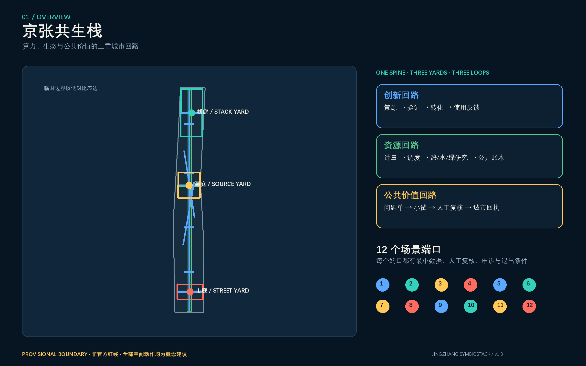
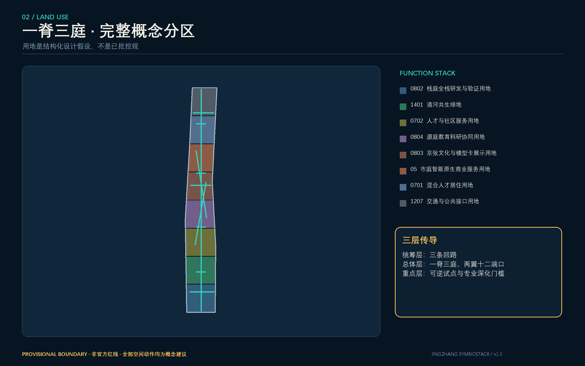
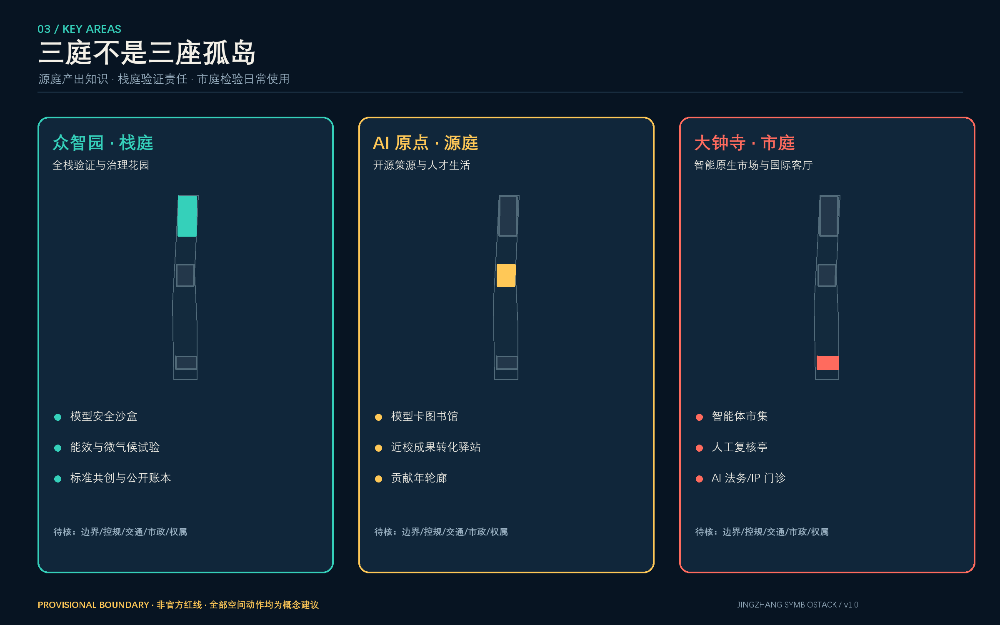
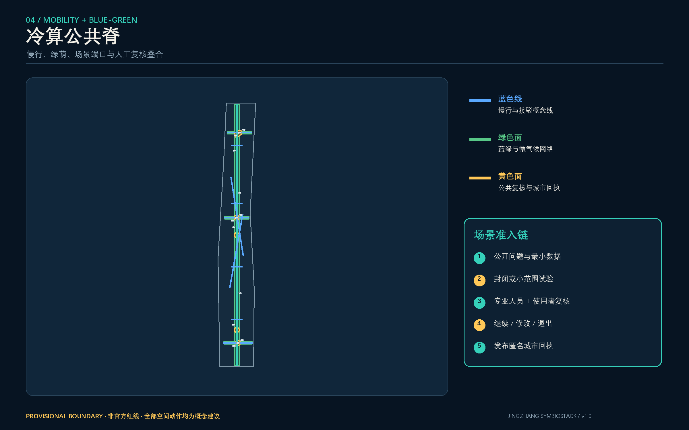
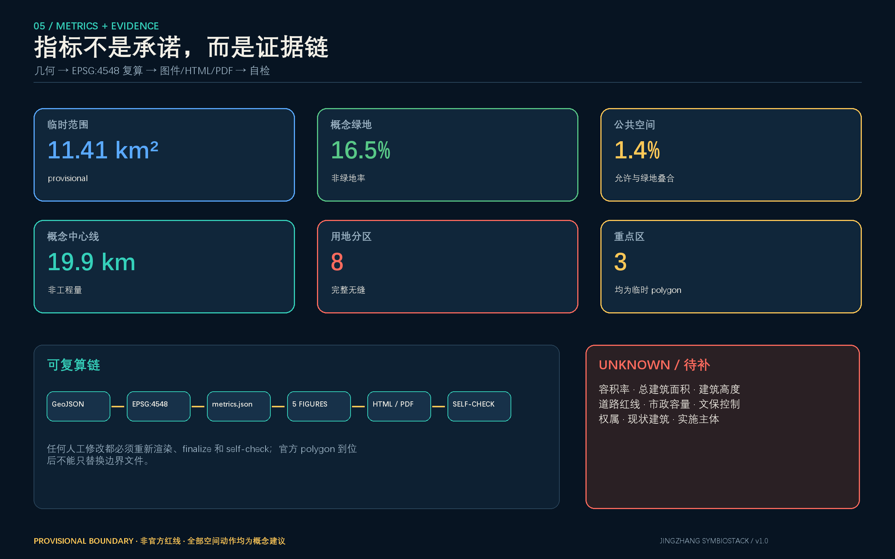

# 京张共生栈：算力、生态与公共价值的三重城市回路

> **临时边界声明**：本方案使用仓库维护者依据公开公告整理的 provisional polygon。它不是官方红线，不适用于精确面积、控规、权属、工程或审批判断。所有空间动作均为概念建议和可供专业团队深化的参考方案；官方 CAD/GIS、控规、交通、市政、文保与权属资料到位后，须整体替换几何并重算全部指标、图件和图纸。[source:BOUNDARY-SOURCE] [data:geometry/site_boundary.geojson#SITE-001]

## 设计依据与资料清单

方案的权威层依次为 GeoJSON、指标、矩阵与正文。官方公告用于确认项目名称、三层范围、约面积和任务，不推导精确 polygon；清权任务书用于确认智能体六项任务和边界条款；三项已获取本地快照的专业标准用于城市设计、控规深度语言和用地分类；临时边界仅用于生成、自检和展示。[source:OFFICIAL-ANNOUNCEMENT] [source:AGENT-TASKBOOK] [source:SOURCE-REGISTRY] [standard:PROJECT-OFFICIAL-ANNOUNCEMENT] [standard:PROJECT-AGENT-OPEN-CALL-TASKBOOK] [standard:MOHURD-URBAN-DESIGN-MEASURES] [standard:MOHURD-CONTROL-DETAILED-PLANNING] [standard:MNR-LAND-USE-CLASSIFICATION-GUIDE]

本方案另外查阅六个机构官网作为**背景案例**：新加坡榜鹅数字园区的开放数字平台和产学联动、巴黎 STATION F 的铁路工业遗产再利用与项目化服务、首尔 AI Hub 的“培养—共创—社区”体系、蒙特利尔 Mila 的研究—创业—公共利益连接、伦敦 Knowledge Quarter 的跨机构联盟、阿姆斯特丹 Marineterrein 的城市实验与公共生活叠合。这些材料只支撑机制比较，不支撑京张的边界或控制结论。[source:CASE-PUNGGOL] [source:CASE-STATION-F] [source:CASE-SEOUL-AI-HUB] [source:CASE-MILA] [source:CASE-KNOWLEDGE-QUARTER] [source:CASE-MARINETERREIN]

当前缺失官方精确边界、重点区 polygon、控规条件、道路红线与断面、宗地权属、现状建筑底数、文保控制线、市政容量和公共服务底数。它们分别进入 `assumptions.json` 与 `constraints.geojson`，不以“高精度图面”掩盖。[depth:existing_conditions_diagnosis] [data:geometry/constraints.geojson#CONSTRAINTS]

## 三层范围工作框架

三层范围被转译为三种决策尺度，而不是三套互不相干的图：统筹研究范围回答“怎样形成生态和区域协同”，总体设计范围回答“怎样把协同变成空间与公共服务网络”，三处重点区回答“怎样通过可逆试点验证”。公告约 43.6 km²、11.4 km² 与 368.4 ha 是任务尺度；提交几何复算值只用于 provisional intake。[source:OFFICIAL-ANNOUNCEMENT] [depth:three_level_scope_framework] [metric:site_area_sqm] [metric:key_area_count]

| 层级 | 主要判断 | 共生栈回答 | 证据落点 |
| --- | --- | --- | --- |
| 统筹研究范围 | 产业、人才、算力、数据、场景如何协同 | 建立创新、资源、公共价值三条回路，并以“问题单—沙盒—回执”组织跨区合作 | `compliance_matrix.json`、案例表 |
| 总体设计范围 | 走廊怎样承载更新、交通、生态和新基建 | 一条冷算公共脊、三处共生庭、十二个场景端口、两翼接口 | [data:geometry/land_use.geojson#LU-01] [data:geometry/roads.geojson#ROAD-01] |
| 重点区域 | 怎样避免一次性、封闭式示范工程 | 栈庭验证全栈与治理，源庭验证开源与人才，市庭验证市场与日常服务 | [data:geometry/key_areas.geojson#PROV-KEY-001] [data:geometry/key_areas.geojson#PROV-KEY-002] [data:geometry/key_areas.geojson#PROV-KEY-003] |

## 统筹研究范围产业与未来城市研究

### 总体概念、命名与视觉识别

**主名称：京张共生栈 / JINGZHANG SYMBIOSTACK。**“栈”同时指 AI 技术栈、可叠合的城市功能栈和铁路驿栈；“共生”要求每一次技术测试同时回答资源代价、公共受益和退出责任。标志方向由三组开口方括号叠合成铁路枕木与堆栈层，开口表示可接入、可审计、可退出；主色为深靛“算力”、青绿“生态”、暖黄“公共回执”。使用系统字体和原创几何，不调用企业商标或人物肖像。[source:AGENT-TASKBOOK] [depth:overall_spatial_structure]

三大定位通过三条回路落地：百年京张文化带对应“记忆—贡献—再使用”的公共价值回路；都市 AI 生活体验带对应“问题—试验—人工复核—服务回执”；AI 融合创新带对应“策源—验证—转化—再投资”。五大功能分配到三区两翼：众智园承载全栈自主与治理，AI 原点社区承载世界级创新生态，大钟寺承载 AI 原生业态；中关村科技服务翼提供知识产权、资本和国际服务接口，小月河场景赋能翼提供公共问题和生活场景接口。[standard:PROJECT-AGENT-OPEN-CALL-TASKBOOK]

### 六个全球案例与可转化机制

| 背景案例 | 官网所示机制 | 京张转化，不照搬形态 |
| --- | --- | --- |
| Punggol Digital District | 产业—高校共址、开放数字平台、能源管理、living lab | 建立分级数据接口、先仿真后试点、能源指标与场景准入绑定 |
| STATION F | 铁路工业遗产再利用、项目组合、创业一站式服务 | 遗产空间优先承载共享服务而非封闭总部；以项目机制激活建筑 |
| Seoul AI Hub | 培养人才、共创企业、社区交流三位一体 | 栈庭设置“训练—验证—社区评议”连续流程 |
| Mila | 研究共同体、创业支持与公共利益议题连接 | 源庭把模型能力、社会影响和创业转化放在同一张模型卡中 |
| London Knowledge Quarter | 跨学术、文化、科技和社区机构的联盟治理 | 以年度伙伴协议和共享日历替代单一园区运营者垄断 |
| Marineterrein | 在真实城市环境中试验，并与运动、历史、公共生活共存 | 所有试验设置公共时段、退出条件和恢复责任 |

上述案例是背景资料，不用于本地面积、产业规模或投资预测。[source:CASE-PUNGGOL] [source:CASE-STATION-F] [source:CASE-SEOUL-AI-HUB] [source:CASE-MILA] [source:CASE-KNOWLEDGE-QUARTER] [source:CASE-MARINETERREIN]

### 三条闭环

1. **创新回路**：源庭发布问题与开源成果，栈庭完成安全/能效/场景验证，市庭进入市场与日常服务，再将使用反馈返回源庭。
2. **资源回路**：每个算力试点公开电、热、水、时段与碳数据的可得范围；余热利用、蓄冷和绿地调节仅作为待市政和工程论证的方向，不作为可行性结论。
3. **公共价值回路**：居民或机构提交问题单，场景端口完成小规模试验，人工复核委员会给出继续/修改/退出决定，最后发布不含个人信息的“城市回执”。

这三条回路把 AI 从“装置”变为受约束的城市制度原型。[source:AGENT-TASKBOOK] [depth:overall_spatial_structure]

## 总体设计范围城市更新与控规深度城市设计

总体结构为“一脊三庭、两翼十二端口”。冷算公共脊沿京张遗址公园方向组织慢行、蓝绿空间、端侧服务与文化叙事；栈庭、源庭、市庭对应三处重点区；两翼作为跨区服务接口；十二端口是可预约、可审计、可撤回的试点单元。它不是新红线或工程线位。[data:geometry/roads.geojson#ROAD-01] [data:geometry/green_space.geojson#GREEN-01] [depth:overall_spatial_structure]

`land_use.geojson` 以同一临时边界切分形成无缝、无重叠的概念性分区，并采用仓库允许的国土空间分类代码；研究、居住、商业、文化、绿地与道路的比例仅是设计组织假设，不是已批用地。[standard:MNR-LAND-USE-CLASSIFICATION-GUIDE] [data:geometry/land_use.geojson#LU-01] [metric:land_use_partition_area_sqm] [metric:land_use_zone_count]

开发强度、容积率、高度、建筑密度、退线与建筑控制线均无官方资料。提交的建筑 polygon 是“空间原型基底”，只验证公共庭院、测试空间与慢行关系，不代表现状建筑或建设规模；相应 FAR、总建筑面积和高度为 unknown。本轮表达止于城市设计与概念方案深度，后续若进入建筑方案阶段，应依正式任务书和工程设计文件编制深度另行补齐。[standard:MOHURD-CONTROL-DETAILED-PLANNING] [standard:MOHURD-ARCH-DESIGN-DEPTH-2016] [depth:development_intensity_controls] [depth:height_massing_character] [metric:floor_area_ratio] [metric:total_floor_area_sqm] [metric:building_height_m]

拆改留采用“先调查再判断”的门槛：有权属、年代、结构、消防、文保、使用率六项资料才允许进入分类；当前只提出保留优先、可逆嵌入、材料再用和小步试验的方法，不对具体建筑下结论。[depth:retain_renovate_demolish] [data:geometry/buildings.geojson#BLDG-01] [metric:building_footprint_area_sqm]

## 重点区域详细设计

### 众智园“栈庭”——全栈验证与治理花园

以“验证可见、资源可计、风险可退”为核心。概念上设置模型安全沙盒、端侧算力能效测试、标准共创室、公共演示庭和清河生态界面；测试区与公众区采用时空分区，任何自动化测试必须有人类安全员和中止按钮。对外交通、河道、防洪、能源和建筑规模均待正式资料深化。[data:geometry/key_areas.geojson#PROV-KEY-001] [depth:three_key_area_detailed_design]

### 北京 AI 原点社区“源庭”——开源策源与人才生活

以“研究可以被理解，贡献可以被记忆”为核心。概念上串联开源发布厅、模型卡图书馆、近校成果转化驿站、人才生活服务和贡献年轮廊；校区、园区、社区的慢行连接仅表达目标界面，不越过权属边界。低扰动更新优先使用首层共享、临时展陈和可拆构件。[data:geometry/key_areas.geojson#PROV-KEY-002] [standard:MOHURD-URBAN-DESIGN-MEASURES]

### 大钟寺“市庭”——智能原生市场与国际客厅

以“真实使用决定扩容”为核心。概念上设置智能体市场、AI 法务与知识产权门诊、无障碍出行代理试验、国际路演客厅和数据授权柜台；轨道站四象限连通、停车和地下空间只作为待交通专项论证的需求，不给出桥隧或施工判断。[data:geometry/key_areas.geojson#PROV-KEY-003] [depth:traffic_rail_slow_parking]

三庭之间不是等级关系：源庭产出知识，栈庭验证责任，市庭检验社会使用，失败项目也必须留下可复用的负面结果记录。[metric:key_area_count]

## AI 创新生态、人才画像与 AI+ 场景

### 六类用户画像

| 画像 | 核心需求 | 空间接口 | 不可越过的边界 |
| --- | --- | --- | --- |
| 开源研究者 | 发布、复现、协作、声誉 | 源庭模型卡图书馆 | 训练数据和论文图像须清权 |
| 初创验证团队 | 低成本测试、合规指导、首批用户 | 栈庭安全沙盒 | 测试不等于获批运营 |
| 周边居民与照护者 | 通勤、休闲、可信公共服务 | 冷算公共脊和回执站 | 不做商业画像或隐性评分 |
| 高校学生与青年人才 | 学习、转化、生活、社交 | 源庭与两翼接口 | 校园数据与科研成果需授权 |
| 国际访客与活动策展人 | 导览、翻译、合作匹配 | 市庭国际客厅 | 自动翻译必须可申诉与人工校对 |
| 城市一线服务人员 | 工单减负、知识辅助、风险预警 | 场景端口后台 | AI 不替代专业责任与最终决定 |

### 十二张场景卡

| # | 场景与类型 | 空间载体 | 最小数据 | 人工复核与退出条件 |
| --- | --- | --- | --- | --- |
| 01 | 模型能效账本 TVS | 栈庭 | 设备级聚合能耗、时段 | 能源工程师复核；无法计量即退出 |
| 02 | 无障碍出行代理 TVS | 市庭—公共脊 | 自愿上报障碍、公开路网 | 无障碍代表复核；误导风险超阈即停用 |
| 03 | 微气候舒适试验 TVS | 栈庭绿地/公共空间 | 温湿度、遮阴、匿名计数 | 景观/安全人员复核；不得采集人脸 |
| 04 | 京张双语文化导览 | 公共脊 | 清权史料、公开展签 | 史料专家校对；争议内容可撤回 |
| 05 | 模型卡图书馆 | 源庭 | 模型用途、限制、版本 | 独立编辑复核；过期模型下架 |
| 06 | 城市问题单与公共回执 | 三庭 | 公开问题描述、处理状态 | 居民代表参与；不得公开个人工单 |
| 07 | AI 法务/IP 门诊 | 市庭 | 用户主动提交材料 | 执业专业人员最终判断 |
| 08 | 端侧算力预约驿站 | 公共脊节点 | 预约、资源配额 | 运维人员审核；超负荷自动拒绝而非扩容承诺 |
| 09 | 青年开源共修夜 | 源庭 | 活动报名最小字段 | 主持人和安全员值守；不形成行为画像 |
| 10 | 机器人可逆测试湾 | 栈庭 | 设备状态、围界安全信号 | 现场安全员中止；不进入开放道路 |
| 11 | 社区服务协同助手 | 社区接口 | 经授权的服务目录 | 社工最终决定；禁止福利资格自动裁决 |
| 12 | 智能原生市集 | 市庭 | 商户公开信息与自愿反馈 | 消费者申诉通道；不得使用情绪识别定价 |

TVS 表示产业测试验证场景；三项 TVS 均以小范围、可逆、有人监督为前提，不声称已批准。[source:AGENT-TASKBOOK] [data:geometry/public_space.geojson#PUBLIC-01] [data:geometry/roads.geojson#ROAD-01]

### 三个 AI 朝圣地标与公共组件

1. **模型年轮廊**：按版本展示公开模型卡、贡献与退役原因，位于源庭的概念性公共界面。
2. **人工复核亭**：把“暂停、申诉、人工接管”做成可见的公共制度，位于市庭。
3. **冷算共生庭**：把算力计量、微气候和绿地维护结果并置展示，位于栈庭；余热、蓄冷等工程策略须另行论证。

组件库包括同意灯、模型卡轨、可逆测试湾、回执屏、人工复核座、资源计量柱和低干扰导视。所有组件先经过无障碍、消防、隐私与文保审查。[source:AGENT-TASKBOOK] [standard:MOHURD-URBAN-DESIGN-MEASURES]

## 用地、建筑规模与拆改留方案

概念用地分区完整覆盖 submitted boundary，面积复算等于临时 site boundary；每个分区都标注 `agent_generated_design`、`design_proposal` 与 medium/low confidence。研究与公共服务区靠近三庭，绿地与开放空间形成连续脊，居住与社区服务作为人才与原居民共享的生活支撑，商业服务集中于交通与市庭接口。[data:geometry/land_use.geojson#LU-01] [metric:land_use_partition_area_sqm]

建筑原型采用“庭院+首层共享+可逆插件”三类基底，仅用于检验空间关系。[data:geometry/buildings.geojson#BLDG-01] 当前基底总面积为 [metric:building_footprint_area_sqm]；由于没有楼层、现状与控规条件，不推导总建筑面积、容积率或建筑高度。[metric:total_floor_area_sqm] [metric:floor_area_ratio] [metric:building_height_m]

拆改留流程为：资料建档—安全与文保筛查—使用绩效评估—公众和权利人协商—保留/修缮/适应性再利用优先—必要时依法论证拆除。任何具体对象在六项资料未齐前均标为待确认。[depth:land_use_layout] [depth:retain_renovate_demolish]

## 交通、轨道、市政与公共服务设施

交通概念由一条南北公共脊、三组重点区横向缝合线、两条科技/场景翼接口和多条步行骑行支线组成。[data:geometry/roads.geojson#ROAD-01] 总概念线长由 [metric:road_network_length_m] 复算，但不代表道路红线、断面或工程量。五道口、清华东路西口、大钟寺站和跨五环节点均列为“需要专项论证的接口”，不画伪精确桥隧线位。[depth:traffic_rail_slow_parking]

市政与新基建采用四级门槛：公开需求—仿真—封闭测试—经专业审批后运行。端侧算力只在能源、消防、噪声、散热、网络安全和运营责任同时确认后进入下一阶段；分布式能源、余热利用和蓄冷只是概念性方向。[depth:municipal_new_infrastructure] [data:geometry/constraints.geojson#CONSTRAINTS]

公共服务不以“AI 替代窗口”为目标，而以无障碍、多语言、人工接管和服务目录更新为优先。教育、医疗、法律、社区服务的专业判断始终由具备职责的人完成。

## 蓝绿空间、公共空间与城市风貌

冷算公共脊把京张遗产叙事、慢行、绿荫、雨水花园概念和场景端口叠合；东西缝合点优先采用地面安全改善与可逆设施，桥隧和跨环工程待专项论证。[data:geometry/green_space.geojson#GREEN-01] [data:geometry/public_space.geojson#PUBLIC-01] [depth:blue_green_public_space]

当前概念绿地率 [metric:green_ratio]、公共空间率 [metric:public_space_ratio] 均由提交几何相对 provisional boundary 复算，只用于内部平衡，不是法定绿地率或已批准公共空间范围。两者允许部分叠合，因为公共绿地可以同时提供公共空间价值；指标分别计量并在图纸中说明。

城市风貌采用“铁路工业的克制结构、中关村的开放协作、AI 时代的可解释界面”三层语汇：材料优先耐久、可拆、低反光；数字界面必须显示数据来源、更新日期、责任人和人工申诉入口；夜间照明避免大屏竞赛。历史文化内容只使用清权史料，文保边界未取得前不提出实体改造。[standard:MOHURD-URBAN-DESIGN-MEASURES] [depth:height_massing_character]

## 更新项目清单、实施政策与分期计划

| 触发包 | 概念项目 | 首要产出 | 进入下一步的条件 |
| --- | --- | --- | --- |
| P1 验证公共价值 | 城市问题单、模型卡图书馆、双语导览、三处可逆场景端口 | 公开规则、退出机制、人工复核记录 | 场景伦理/安全审查通过，获得场地许可 |
| P2 连接三庭 | 公共脊连续性、三庭服务互认、年度伙伴协议 | 统一预约、模型卡和城市回执格式 | 官方边界、道路与文保资料完成核查 |
| P3 资源共生深化 | 资源计量、微气候试验、端侧算力与能源协同研究 | 可审计资源账本和工程预可研问题清单 | 市政容量、能源、消防、噪声和投资主体依法确认 |

`phasing.geojson` 将临时边界分为三类触发式范围，全部属于概念建议，不承诺年份、资金或政府实施安排。[data:geometry/phasing.geojson#PHASE-001] [metric:phase_count] [metric:phasing_area_sqm] [depth:phasing_implementation]

更新项目清单以“可逆优先、公共收益先证、资源代价可见、失败也归档”为政策原则。运营建议为建立由园区、高校、社区、专业机构和公共部门依法参与的“共生栈伙伴议事台”，但其组织形式、预算和权限需由相关主体协商确定。[depth:renewal_project_list]

年度活动参考方案包括：春季“模型卡开放周”、夏季“城市智能体小试”、秋季“京张公共 AI 论坛”、冬季“失败档案与治理回执展”；同时设置月度开源共修、季度场景复盘和国际伙伴驻留。活动不得被描述为已确定日程，其价值以形成合作、改进规则和后续转化为衡量，而非单纯客流。

## 指标体系、面积复算与合规矩阵

| 指标 | 状态与含义 |
| --- | --- |
| [metric:site_area_sqm] | known；EPSG:4548 下复算 provisional site boundary，仅用于 intake |
| [metric:land_use_partition_area_sqm]、[metric:land_use_zone_count] | known；完整用地分区面积与分区数 |
| [metric:building_footprint_area_sqm] | known；概念建筑原型基底总面积，不是现状/批准规模 |
| [metric:green_ratio]、[metric:public_space_ratio] | known；概念绿地与公共空间相对临时边界比例 |
| [metric:road_network_length_m] | known；概念慢行/接驳中心线长度，不是工程量 |
| [metric:key_area_count] | known；三处 provisional 重点区数量 |
| [metric:phase_count]、[metric:phasing_area_sqm] | known；触发式分期数量与覆盖面积 |
| [metric:floor_area_ratio]、[metric:total_floor_area_sqm]、[metric:building_height_m] | unknown；缺官方控规与建筑资料 |

面积统一在 EPSG:4548 中复算；GeoJSON 交换坐标为 EPSG:4326。[depth:metrics_recalculation] `compliance_matrix.json` 覆盖公告 1.3、1.4、1.5 与 agent.1-agent.6 共 23 条要求；`standard_matrix.json` 对五项 mandatory 标准给出证据链，并把缺官方文件的建筑深度标准保留为 data_gap；`design_depth_matrix.json` 将 15 项正式深度映射到正文、图层、图纸、来源、假设与自检。

## 风险、版权与合规说明

1. **边界风险**：三层范围与三重点区均为 provisional；官方 polygon 到位后全部重算。[source:BOUNDARY-SOURCE]
2. **控规与工程风险**：FAR、高度、密度、退线、道路、市政、消防、文保和权属均缺正式依据；不得据此实施。[standard:MOHURD-CONTROL-DETAILED-PLANNING]
3. **AI 治理风险**：禁止隐性画像、情绪识别定价、福利资格自动裁决和无法申诉的自动化；所有高影响场景必须人工复核。
4. **公共利益风险**：场景可能挤占公共空间或形成技术排斥；采用公共时段、无障碍审查、退出恢复和居民评议进行约束。
5. **资源风险**：算力—能源—热—水联动仅为研究方向；没有市政和工程资料不得宣称节能、余热利用或容量可行。
6. **版权风险**：核心图由本方案 GeoJSON、JSON 与原创代码派生；不使用外部地图截图、远程图片、企业标识、人物肖像或未授权字体。六个案例只以文字转述官网公开信息并保留来源链接。

所有成果均为 AI 生成的开放共创建议，不替代专业规划，不构成政府审定、投资承诺、招商承诺、工程可行性或权属判断。人类与专业团队拥有最终判断权。[source:AGENT-TASKBOOK] [depth:risk_missing_data]

## 参考资料

- [source:OFFICIAL-ANNOUNCEMENT] 官方公告本地快照与官方链接。
- [source:AGENT-TASKBOOK] 面向智能体开源征集任务书清权摘录。
- [source:SITE-PACKAGE]、[source:SOURCE-REGISTRY]、[source:PROCESSED-FACT-PACK] 仓库任务、资料登记与导航层。
- [source:BOUNDARY-SOURCE]、[source:KEY-AREA-SOURCE] 临时边界与三处临时重点区，仅 provisional 使用。
- 六个背景案例来源详见 `sources.json`；专业标准详见 `standard_matrix.json`。
