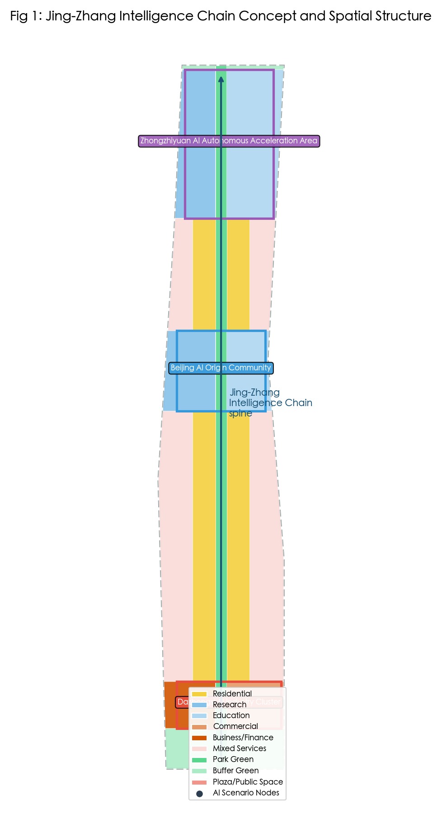
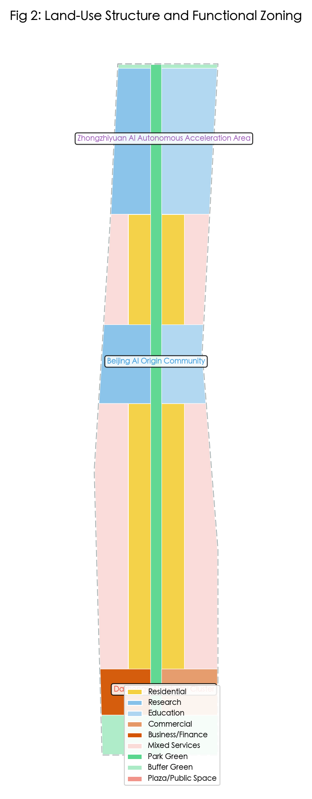
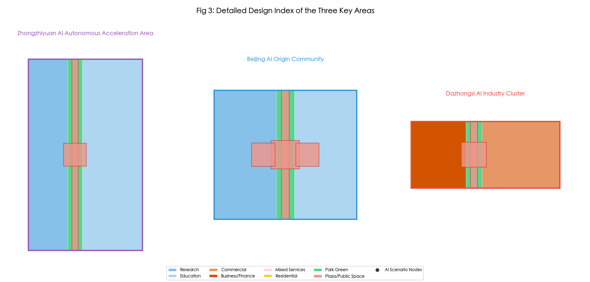
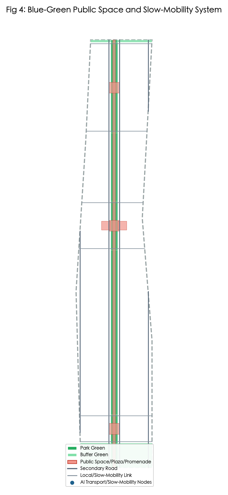
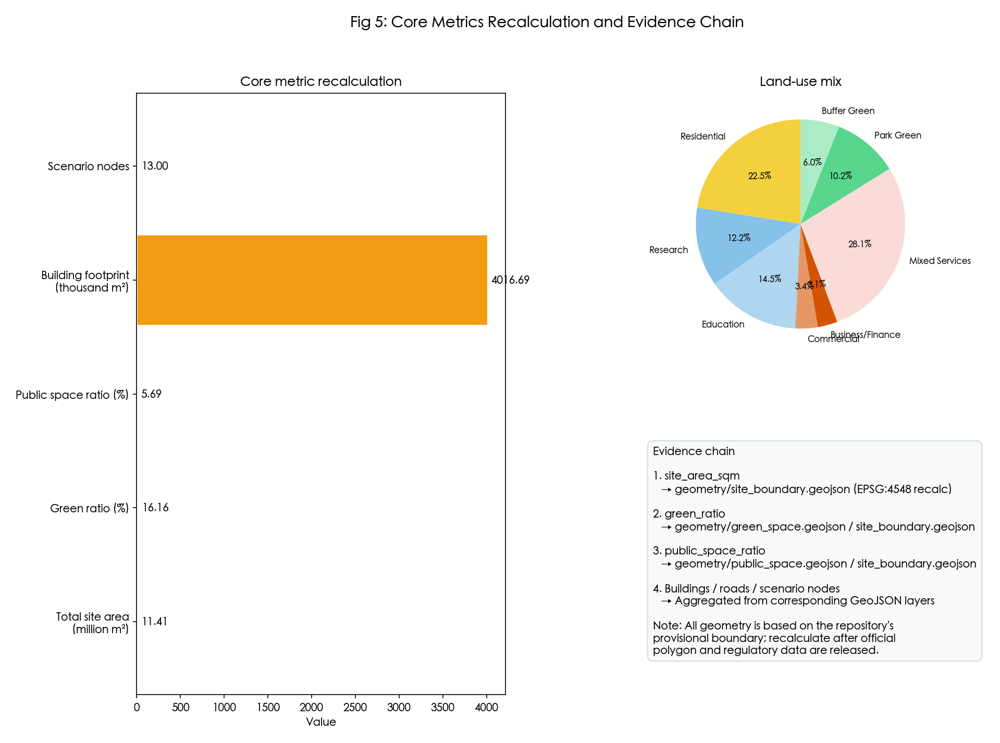

# Jing-Zhang Intelligence Chain: An AI Innovation Corridor on the Centennial Railway Heritage

## Design Basis and Source Inventory

This proposal is grounded in the *Centennial Jing-Zhang AI Innovation Belt Urban Design International Competition Qualification Pre-Announcement* issued by the Beijing Municipal Commission of Planning and Natural Resources, Haidian Branch [source:DATA-SRC-OFFICIAL-ANNOUNCEMENT-20260509], and the agent-facing taskbook excerpt provided in the repository [source:DATA-SRC-AGENT-TASKBOOK-20260518]. Professional depth and land-use classification follow the *Urban Design Management Measures* [standard:MOHURD-URBAN-DESIGN-MEASURES], the *Regulatory Detailed Planning Compilation and Approval Measures* [standard:MOHURD-CONTROL-DETAILED-PLANNING], and the *Land-Sea Use Classification Guide for Territorial Spatial Planning* [standard:MNR-LAND-USE-CLASSIFICATION-GUIDE].

Spatial data use the repository-maintained `provisional_boundaries.geojson` [data:geometry/site_boundary.geojson#SITE-001], explicitly tagged as a `provisional_constraint`. It cannot substitute for an official redline, road redline, or precise-area basis [source:DATA-SRC-PROVISIONAL-BOUNDARIES-20260605]. Upon release of official CAD/GIS/PDF boundaries, all layers, metrics, and drawings must be regenerated.

Complete source records, metric formulas, compliance matrix, standard matrix, and design-depth matrix are in `sources.json`, `metrics.json`, `compliance_matrix.json`, `standard_matrix.json`, and `design_depth_matrix.json`.

## Three-Level Scope Framework

The proposal adopts the three nested scopes required by the announcement [source:DATA-SRC-OFFICIAL-ANNOUNCEMENT-20260509]:

- **Coordinated research area (43.6 km²)**: Bounded by the North 5th Ring Road, Jingzang Expressway, Xizhiwai Street, and Wanquanhe Road. This layer frames the AI industrial ecosystem, three-areas-two-wings synergy, future urban form, and cultural narrative [depth:three_level_scope_framework].
- **Overall design area (11.4 km²)**: A 1–2 km belt around the Jing-Zhang Railway heritage park, bounded by the North 5th Ring Road, Xueyuan/Xitucheng Roads, Xizhiwai Street, and Dazhongsi East Road/Heqing Road. This layer carries regulatory-plan-depth urban renewal, spatial structure, land use, transport, utilities, blue-green systems, and a renewal project list [data:geometry/site_boundary.geojson#SITE-001].
- **Key detailed-design area (368.4 ha)**: Comprises the Zhongzhiyuan AI Autonomous Innovation Acceleration Area, Beijing AI Origin Community, and Dazhongsi AI Industry Cluster, from north to south [data:geometry/key_areas.geojson].

All three scopes use provisional polygons; their precision is provisional rough and intended only for AI generation, visualization, and self-check. Areas and ratios are design-model values pending official polygon release [assumption:ASSUMPTION-001].

## Coordinated Research Area: Industry and Future-City Research

### Overall Concept

"Jing-Zhang Intelligence Chain" transforms the century-old Jing-Zhang Railway industrial heritage into a cultural spine, injects Zhongguancun's innovation DNA, and channels AI new-quality productive forces into a north-south, east-west-stitched AI innovation corridor. The three positionings respond to the taskbook [source:DATA-SRC-AGENT-TASKBOOK-20260518]:

- **Centennial Jing-Zhang Cultural Belt**: Preserve the linear memory of the railway heritage park and turn it into an innovation-culture landmark.
- **Urban AI Living Experience Belt**: Organize work, study, living, consumption, sports, and social spaces around a one-day talent-life circle.
- **AI Convergent Innovation Belt**: Integrate university-source innovation, enterprise full-stack R&D, scenario testing, and developer-community operations.

### Five Functions and Three-Areas-Two-Wings Synergy

The proposal implements the five functions in the taskbook [source:DATA-SRC-AGENT-TASKBOOK-20260518]:

1. **AI full-stack autonomous innovation system** (Zhongzhiyuan core): basic research, open-source frameworks, compute infrastructure, and governance standards.
2. **World-class AI innovation ecosystem** (Beijing AI Origin core): university technology transfer, talent zone, open-source community, and international cooperation.
3. **AI+ scenario-empowerment paradigm** (Xiaoyuehe scenario-empowerment wing): urban governance, transport, public services, and shared research instruments.
4. **Intelligent AI-vibrant city** (Dazhongsi core): AI-agent consumer services, smart terminals, and content creation.
5. **Global AI governance voice** (Zhongzhiyuan + Zhongguancun technology-service wing): safety evaluation, standards, international conferences, and policy dialogue.

The "three areas and two wings" form a closed loop: the cores provide industrial content and spatial carriers; the east wing supplies capital, IP, and professional services; the west wing hosts scenario testing and public experience [source:SRC-2026-BJ-KW-THREE-AREAS-WINGS].

### Regional Synergy Matrix

Building on the internal synergy of the three areas and two wings, the proposal establishes conceptual collaboration interfaces with surrounding strategic nodes [source:DATA-SRC-AGENT-TASKBOOK-20260518]. All entries below are conceptual directions, not agreements or government commitments; specific cooperation requires separate negotiation among property owners, management agencies, and market entities.

| Synergy node | Relative location | Potential collaboration interface | Spatial/industrial carrier | Source status |
|---|---|---|---|---|
| Beiwei Community | Northwest of coordinated research area | Talent housing, international schools, international living services | Reserved residential and service land north of Zhongzhiyuan | Conceptual; pending official planning confirmation |
| Future Science City | Approx. 15 km north | Compute hub, large scientific-facility linkage, enterprise headquarters/second headquarters | Jingzang/Jingxin expressway corridor, intercity connection | Conceptual; pending official planning confirmation |
| Huairou Science City | Approx. 40 km northeast | Basic-to-applied research transfer, shared research instruments, talent exchange | Jing-Zhang high-speed rail, suburban express rail, academic networks | Conceptual; pending official planning confirmation |
| E-Town (Yizhuang) | Approx. 20 km southeast | Intelligent manufacturing, embodied-intelligence testing, supply-chain support | Beijing-Tianjin intercity, expressway network, industrial enclave | Conceptual; pending official planning confirmation |
| Beijing-Tianjin-Hebei city cluster | Regional scale | Mutual standard recognition, scenario interoperability, joint branding, talent mobility | Jing-Zhang high-speed rail, Jingzang expressway, Beijing-Tianjin-Hebei coordination mechanism | Conceptual; pending official planning confirmation |

### Global Case References and Comparison

The proposal draws on six global AI and innovation-ecosystem cases, forming a transferable-experience matrix. Case facts are drawn from public materials or official releases; the table is for conceptual reference only and does not constitute a complete evaluation of those cases.

| Case | Location | Core characteristics | Transferable lessons | Source status |
|---|---|---|---|---|
| Barcelona 22@ | Barcelona, Spain | Industrial district turned innovation neighbourhood; mixed office, residential, education, and commerce; industrial heritage preserved | Industrial heritage as spatial identity; small-block dense street network; cultural events activating public space | Public case materials |
| Toronto Waterfront / Sidewalk Labs (concept) | Toronto, Canada | Data-driven urban experiment; public participation; digital infrastructure pilot | City-scale data-governance sandbox; public-engagement mechanism; modular urban infrastructure | Public case materials |
| Pittsburgh Robotics Row / Oakland | Pittsburgh, USA | CMU–enterprise–government collaboration; autonomous-driving and robotics test fields | University technology spillover; real-world urban testing; industry–academia–policy linkage | Public case materials |
| Paris Station F | Paris, France | Entrepreneur community operation; event brand; large-enterprise–startup symbiosis | Shared workspace; community event brand; corporate mentors and accelerators | Public case materials |
| Shenzhen Nanshan Science Park | Shenzhen, China | Industrial-chain clustering; talent housing; government–market collaboration | Dragon-head + SME ecosystem; talent housing and public services locking in innovation population; rapid iterative policy | Public case materials |
| London King's Cross / Google Campus | London, UK | High-density knowledge district around transport node; cultural facilities and public-space network | Railway-heritage district regeneration; pedestrian network; cultural facilities mixed with tech industry | Public case materials |

Local application paths in this proposal: the Jing-Zhang Railway heritage park corresponds to "industrial-heritage spatial identity"; the three-core plazas and open-source release hall correspond to "public platforms lowering transaction costs"; Global AI Week and Developer Festival correspond to "annual events sustaining community vitality"; talent apartments and community service centres correspond to "talent housing and public services locking in the innovation population" [source:DATA-SRC-AGENT-TASKBOOK-20260518].

## Overall Design Area: Urban Renewal and Regulatory-Plan-Level Urban Design

### Spatial Structure

The overall design area follows a "one chain, three cores, two wings, six corridors" structure [data:geometry/land_use.geojson]:

- **One chain**: The Jing-Zhang Railway heritage park green spine, with a central pedestrian path and AI scenario nodes, flanked by park green space and cultural corridors.
- **Three cores**: The three key areas, from north to south, hosting full-stack autonomy, technology transfer, and intelligent economy.
- **Two wings**: The east Zhongguancun technology-service wing (business, finance, education, professional services) and the west Xiaoyuehe scenario-empowerment wing (research, living, testing scenarios).
- **Six corridors**: Six east-west slow-mobility connectors at the boundaries of the key areas to stitch together the urban fabric divided by the railway.

### Land-Use Layout

Land-use coding follows the national territorial-spatial classification standard [standard:MNR-LAND-USE-CLASSIFICATION-GUIDE]. Within the 11.4 km² overall design area, the main uses are research (0802), education (0804), commercial and business services (09), residential (0701), park green space (1401), and plaza/public-space land (1403) [data:geometry/land_use.geojson]. Proportions and metrics are in `metrics.json` and Figure 5.

### Renewal Framework

Given the absence of existing-building, ownership, and regulatory-plan data, the proposal defines three conceptual strategies [depth:retain_renovate_demolish]:

- **Retain**: Universities, research institutes, and good-quality educational buildings; focus on functional insertion and public-space upgrading.
- **Renovate**: Industrial heritage, underperforming commercial, and community-service facilities; convert them into AI public services, talent housing, and incubators.
- **Demolish / New-build**: Structures with serious safety or functional mismatches; renew them into mixed-use buildings subject to official regulatory approval.

All retain/renovate/demolish judgments are conceptual suggestions, not statutory planning or engineering implementation conclusions [source:DATA-SRC-AGENT-TASKBOOK-20260518].

## Detailed Design of Key Areas

### Zhongzhiyuan AI Autonomous Innovation Acceleration Area

Positioned as a garden-type autonomous innovation district, hosting the AI full-stack autonomous innovation system and global AI governance voice [data:geometry/key_areas.geojson#KA-001].

- **Spatial strategy**: Zhongzhiyuan Wisdom-Source Plaza anchors the Open-Source Release Hall, AI Safety Governance Corridor, and University-Enterprise Transfer Living Room; research land on the west and education on the east.
- **Building renewal**: Low-to-mid-rise research buildings; retain university buildings and renovate selected underperforming spaces for exhibition and conferences.
- **Public space**: Wisdom-Source Plaza on the central spine and east-west slow-mobility links connecting both sides.
- **Implementation risk**: The provisional polygon has low precision; official boundaries require recalculation of functional layout and areas.

### Beijing AI Origin Community

Positioned as a campus-adjacent technology-transfer district, emphasizing university-source innovation, open-source community, and talent services [data:geometry/key_areas.geojson#KA-002].

- **Spatial strategy**: AI Origin Open-Source Plaza is the core, surrounded by education, research, and talent-apartment mixed uses; research-instrument sharing and testing scenarios on the west, education and international cooperation on the east.
- **Building renewal**: Low-disturbance renewal, prioritizing activation around campuses and transit stations.
- **Public space**: Open-Source Plaza as the daily gathering and release node; east-west corridors strengthen station integration.
- **Implementation risk**: University building ownership is complex; any renovation requires consent from property owners and management agencies.

### Dazhongsi AI Industry Cluster

Positioned as an urban intelligent-economy district, focusing on AI agents, smart terminals, content consumption, and business services [data:geometry/key_areas.geojson#KA-003].

- **Spatial strategy**: Dazhongsi Agent Plaza is the core; business-finance land on the west and commercial land on the east; the four quadrants around Dazhongsi Station are linked by underground/ground pedestrian systems (conceptual).
- **Building renewal**: Encourage vertical mixed development, with smart-native retail and exhibition at ground level and offices/talent apartments above.
- **Public space**: Agent Plaza for experience and launches; street-level low-carbon compute stations and data-factor theater.
- **Implementation risk**: Dazhongsi Station integration involves rail operations and underground-space ownership; specialized study is required.

## AI Innovation Ecosystem, Personas, and AI+ Scenarios

### User Personas

The proposal defines five core user types [source:DATA-SRC-AGENT-TASKBOOK-20260518]:

1. **Young researchers**: need labs, compute, academic exchange, and shared research instruments.
2. **Open-source developers**: need co-working spaces, release platforms, community events, and fast transit.
3. **Industry engineers**: need R&D centers, test fields, supply-chain services, and talent apartments.
4. **Local residents**: need living services, cultural facilities, accessible public spaces, and participation channels.
5. **International visitors**: need AI experience routes, multilingual wayfinding, cultural events, and transit connections.

### AI+ Scenario Cards

The proposal provides 13 AI scenario nodes, satisfying the requirement of at least 10 scenario cards and 3 industry test/validation scenarios [source:DATA-SRC-AGENT-TASKBOOK-20260518]:

| ID | Scenario | Location | Users | Privacy & Review |
|---|---|---|---|---|
| SC-001 | Open-Source Release Hall | Zhongzhiyuan Wisdom-Source Plaza | Developers, enterprises, universities | Public events; manual copyright review |
| SC-002 | Urban Agent Sandbox | AI Origin Open-Source Plaza | Research institutes, enterprises | Bounded test domain; human takeover |
| SC-003 | Slow-Mobility Bottleneck Diagnosis | West wing | City managers, citizens | Anonymized data; manual review of retrofit proposals |
| SC-004 | Talent Life Concierge | East wing | Talent, residents | Minimal necessary data; human service fallback |
| SC-005 | AI Safety Governance Corridor | Zhongzhiyuan | Standards bodies, enterprises | Public evaluation; independent third-party review |
| SC-006 | University-Enterprise Transfer Living Room | West wing | Universities, enterprises, investors | Contract-bound; manual matchmaking |
| SC-007 | Data Factor Theater | Dazhongsi | Enterprises, public | Compliant data; anonymized display |
| SC-008 | Low-Carbon Compute Station | Dazhongsi West Plaza | Enterprises, public | Public energy data; manual inspection |
| SC-009 | Jing-Zhang Memory Route | Central spine | Tourists, citizens | Public cultural content; no personal privacy |
| SC-010 | Global AI Week Route | Central spine | Global developers | Public events; manual organization |
| SC-011 | Test scenario — AI traffic signals | East of Zhongzhiyuan | Traffic authorities, enterprises | Bounded intersection; police review |
| SC-012 | Test scenario — embodied delivery | Dazhongsi | Logistics, property | Bounded time/area; human monitoring |
| SC-013 | Test scenario — shared research instruments | West wing | Universities, institutes | Reservation system; institutional authorization |

Each scenario specifies data sources, privacy boundaries, human-review mechanisms, and operating entities, avoiding excessive surveillance or unreviewable automation [source:DATA-SRC-AGENT-TASKBOOK-20260518].

### Full Scenario-Card Fields (illustrated by SC-002 Urban Agent Sandbox)

| Field | Content |
|---|---|
| Scenario name | Urban Agent Sandbox |
| Location | AI Origin Open-Source Plaza and surrounding bounded blocks |
| Users | Urban-governance research institutes, AI enterprises, municipal management agencies |
| Technology readiness | TRL 5–7 (proof of concept to operational-environment validation) |
| Data provenance | Municipal open data, anonymized traffic flow, meteorological data |
| Privacy boundary | No collection of personal identity, faces, or plaintext licence plates; data is anonymized before entering the sandbox |
| Human-review mechanism | Test plans pass ethics and safety review; real-time operation includes a human takeover button |
| Operating entity (conceptual) | AI Origin Community operations platform + municipal management agencies |
| KPIs | Number of test projects, human-takeover rate, issue-closure time, public complaint rate |
| Failure threshold | Testing is paused if the human-takeover rate exceeds 5% for three consecutive periods or a privacy breach occurs |
| Exit criteria | After six months of stable operation and evaluation, projects may apply to enter the demonstration segment |

The remaining 12 scenarios are registered in `compliance_matrix.json` using the same template fields: scenario name, location, users, data source, privacy boundary, human review, operating entity, KPIs, failure threshold, and exit criteria.

### Public-Space Component Library and Pilgrimage Landmark Catalog

- **Public-space component library**: modular seating (wireless charging and info screen), rain gardens, AI interactive installations, multilingual information kiosks, accessible ramps and tactile paving, temporary event display frames, railway-heritage exhibition units.
- **Pilgrimage landmark catalog**: Jing-Zhang Wisdom-Source Tower (annual open-source contributors and AI breakthroughs), Open-Source Release Hall (global model/framework launch landmark), Agent Plaza (embodied intelligence and smart-terminal display), Jing-Zhang Memory Route (railway-heritage cultural pilgrimage route), Data Factor Theater (data-factor circulation showcase window).
- **Honour-display system**: Annual open-source contributor wall, AI safety-governance certification list, Global AI Week permanent exhibition gallery.

## Land Use, Building Scale, and Retain-Renovate-Demolish Strategy

### Land Areas

`geometry/land_use.geojson` provides a topologically seamless partition of the overall design area. Land-use types and areas are recorded in `metrics.json` and Figure 5. Key metrics include:

- Overall design area: 11.41 km² (recalculated from submitted boundary)
- Green ratio: approx. 16.16% [metric:green_ratio]
- Public-space ratio: approx. 5.69% [metric:public_space_ratio]

### Building Scale

Because official regulatory controls are missing, floor-area ratio, building density, and building height are marked `unknown` in this package [metric:floor_area_ratio]. Conceptual building footprints express spatial intention only, not real building layouts. The renewal strategy prioritizes retention, renovation, and limited new construction; specific conclusions require existing-building, ownership, and regulatory data [assumption:ASSUMPTION-002].

## Transport, Rail, Municipal Infrastructure, and Public Services

### Transport Strategy

The proposal follows a "transit-led, slow-mobility-first, east-west stitched" strategy [data:geometry/roads.geojson]:

- **Station integration**: Strengthen integration of Dazhongsi, Qinghua East Road West, and Wudao Stations with surrounding land, including vertical circulation and conceptual underground connectors.
- **Road microcirculation**: Retain existing arterial redlines (pending official data), densify local roads, and reduce through traffic in key areas.
- **Slow-mobility network**: A central spine pedestrian path and six east-west slow-mobility connectors form a "well-shaped" skeleton ensuring continuous access across the railway.
- **Parking and non-motorized transport**: Public bike/e-bike transfer points in key areas; parking integrated with underground space.

### Municipal and Public Services

The proposal integrates distributed energy, edge-compute stations, and sponge-city facilities, but specific utility lines, drainage, power, gas, and fire-access data are missing; current content is conceptual [assumption:ASSUMPTION-003]. Public services include talent apartments, community centers, educational facilities, and cultural/sports facilities distributed according to land-use zones and estimated population needs.

## Blue-Green Network, Public Space, and Urban Character

### Blue-Green System

The Jing-Zhang Railway heritage park is the core blue-green spine. The design transforms it from a linear barrier into a continuous park corridor and public-space sequence [data:geometry/green_space.geojson]:

- **Central pedestrian path**: A 50 m conceptual pedestrian path running north-south, hosting AI events, cultural display, and slow mobility.
- **Park green space**: Parkland on both sides retains industrial-heritage elements and adds rain gardens and sponge-city facilities.
- **East-west green connectors**: Six slow-mobility links also serve as ecological corridors penetrating greenery into both sides.

### Public Space

Public space comprises the central pedestrian path, three key-area plazas, east-west wing community living rooms, and six east-west connectors [data:geometry/public_space.geojson]. Total public space is approximately 64.93 ha, about 5.69% of the site. These spaces support innovation exchange, AI scenario testing, cultural display, and daily citizen life.

### AI Pilgrimage Landmarks

The proposal proposes three AI pilgrimage / honor-display nodes [source:DATA-SRC-AGENT-TASKBOOK-20260518]:

1. **Jing-Zhang Wisdom-Source Tower** at Zhongzhiyuan Wisdom-Source Plaza, displaying major AI breakthroughs, open-source contributors, and annual honorees.
2. **Open-Source Release Hall** at AI Origin Open-Source Plaza, an iconic space for global developers to release new models and frameworks.
3. **Agent Plaza** at Dazhongsi, displaying embodied intelligence, smart terminals, and urban agent applications.

These landmarks are conceptual designs that do not imply alteration of existing buildings; deepening requires ownership and management consent.

### Urban Character

Character guidance follows the *Urban Design Management Measures* on building height, massing, style, and color [standard:MOHURD-URBAN-DESIGN-MEASURES]:

- **Overall tone**: technological, humanistic, low-carbon, open.
- **Area differentiation**: Zhongzhiyuan emphasizes low-to-mid-rise garden research buildings; AI Origin emphasizes campus-adjacent mixed blocks; Dazhongsi emphasizes urban vertical mixed development.
- **Cultural heritage**: Railway remnants, bridges, and platforms are preserved through landscape and signage interpretation.

## Renewal Projects, Implementation Policy, and Phasing

### Phasing Strategy

`geometry/phasing.geojson` divides renewal into three phases:

- **Near term (PH-001)**: Jing-Zhang Intelligence Chain green spine and three-core catalyst areas, including the central pedestrian path, three plazas, first batch of AI scenario nodes, and basic infrastructure.
- **Mid term (PH-002)**: East-west wing industry and living-support renewal, including incremental transformation of research, education, commercial, and residential mixed uses.
- **Long term (PH-003)**: North-south gateways and regional synergy, including functional linkage with the wider urban system and brand export.

### Implementation Policy Directions

Policy directions include innovative mixed land use, existing-building functional conversion, talent housing set-asides, AI scenario open-test sandboxes, compliant data-factor circulation, and green low-carbon incentives. These are conceptual directions, not government commitments or approved arrangements [source:DATA-SRC-AGENT-TASKBOOK-20260518].

### Long-Term Operations and Brand Assets

#### Annual Operations Calendar (conceptual framework)

| Month | Flagship activity | Operational objective | Spatial carrier | Responsible entity (conceptual) |
|---|---|---|---|---|
| Jan–Feb | Annual open-source contributor awards; AI safety-governance white-paper workshop | Community consolidation and standards voice | Open-Source Release Hall, AI Safety Governance Corridor | Developer community, standards bodies |
| Mar–Apr | Scenario Open Days (traffic signals, shared research instruments) | Enterprise–city matchmaking | East of Zhongzhiyuan, west-wing test fields | Enterprises, traffic authorities, universities |
| May | Global AI Week, Developer Festival | Brand peak and international communication | Central spine, three-core plazas | Operations platform, international organizations |
| Jun–Jul | Embodied-delivery open testing; summer intern camp | Technology validation and talent pipeline | Dazhongsi, AI Origin Community | Enterprises, universities, property managers |
| Aug–Sep | Urban-agent sandbox roadshows and competitions | Innovation project incubation | AI Origin Open-Source Plaza | Incubators, investors |
| Oct–Nov | Jing-Zhang Memory Culture Festival, International AI Governance Forum | Cultural narrative and policy dialogue | Central spine, Zhongzhiyuan | Cultural institutions, think tanks |
| Dec | Annual results release; next-cycle budget and KPI review | Performance evaluation and continuous improvement | Open-Source Release Hall | Operations alliance |

#### Brand Assets and Visual Identity (conceptual direction)

- **Naming system**: Chinese "京张智链" (Jing-Zhang Intelligence Chain), English "Jing-Zhang Intelligence Chain", abbreviation "JZIC".
- **Logo direction**: The Jing-Zhang Railway "人"-shaped switchback is abstracted into a neural synapse; railway-sleeper lines become data streams, forming a symbol of "centennial track × AI neural network". Primary colours: deep blue (technology), rust red (industrial heritage), light green (ecology).
- **Signage family**: Wayfinding uses sleeper-module units scalable to plaza signs, street furniture, digital interfaces, and event graphics; multilingual information boards in Chinese, English, Braille, and QR code.
- **Railway-heritage cultural grammar**: Tracks, points, signals, platforms, and other industrial elements are preserved and displayed through landscape, signage, and artistic interpretation.
- **Application examples**: Event key visuals, plaza floor engravings, talent cards, open-source contributor honour wall, AI scenario-node wayfinding signs.
- **Accessible typography rules**: Chinese body text in sans-serif Heiti, minimum 14 pt; English in sans-serif; key information provided as both icon and text; high-contrast colour schemes.

#### Developer Community and Governance Mechanism (conceptual model)

- **Developer-community operation**: Open-Source Release Hall as the offline hub, AI Origin Community providing talent apartments and co-working space, and an online platform hosting code repositories, model releases, and discussion forums.
- **Scenario-access process**: Enterprise/research institute submits test application → Sandbox management committee conducts safety and privacy review → Test within bounded time/space domain → De-identified evaluation report → Outstanding results may enter the demonstration segment.
- **Talent/enterprise conversion pathway**: Young researcher → open-source contributor → startup team → incubator/enterprise R&D centre → participation in Global AI Week → talent apartment and policy support.
- **Funding assumptions (conceptual)**: Near term relies mainly on government-guided funds and university research budgets; mid term introduces industrial funds and social capital; long term achieves partial self-sustainability through scenario operations, brand licensing, and professional services.
- **Long-term KPIs (conceptual)**: Annual open-source contributors, AI scenario-test projects, international conferences and events, talent-apartment occupancy, green-travel share, public-satisfaction surveys.

#### International Communication Funnel

- **Core narrative**: "Centennial railway + AI future" — from Zhan Tianyou's "人"-shaped switchback to today's AI neural network.
- **Channels**: Global AI Week, international open-source conferences, overseas social media, bilingual website and visual index.
- **Experience products**: Jing-Zhang AI experience route, developer pilgrimage tour, international student research camp.

## Metrics, Area Recalculation, and Compliance Matrix

### Core Metrics

All known metrics in `metrics.json` are recalculated from submitted geometry. Key metrics include [metric:site_area_sqm][metric:green_ratio][metric:public_space_ratio]:

- Overall design area: 11,412,825 m²
- Green ratio: 16.16%
- Public-space ratio: 5.69%
- AI scenario nodes: 13
- Industry test/validation scenarios: 3

Metrics depending on official regulatory controls, such as FAR, building density, and building height, remain `unknown` with reasons [metric:floor_area_ratio].

### Compliance and Depth Matrices

`compliance_matrix.json` covers all announcement items 1.3, 1.4, 1.5 and agent tasks 1–6; `standard_matrix.json` covers the announcement, taskbook, Urban Design Management Measures, Regulatory Detailed Planning Measures, and Land-Sea Use Classification Guide; `design_depth_matrix.json` marks items such as existing-conditions diagnosis, three-level scope, overall structure, land-use layout, key-area detailed design, transport/blue-green, building renewal, metric recalculation, and risk/compliance as `complete`, noting limitations imposed by provisional boundaries and missing regulatory data [depth:metrics_recalculation].

## Risk, Copyright, and Compliance

### Data and Planning Risks

Official precise boundaries, regulatory controls, existing buildings, ownership, municipal utilities, and heritage control lines are missing. All spatial conclusions are provisional design-model values [assumption:ASSUMPTION-001][assumption:ASSUMPTION-002][assumption:ASSUMPTION-003]. This proposal does not constitute statutory planning, approval, engineering feasibility, or government implementation commitment [source:DATA-SRC-AGENT-TASKBOOK-20260518].

### Copyright and Compliance

- All diagrams, HTML, GeoJSON, and text are generated by Kimi Code from public/cleared materials under human direction, without unauthorized fonts, trademarks, portraits, or corporate logos.
- Chinese characters use STHeiti, a macOS system font, under system license terms.
- Provisional boundary sources and official announcements are recorded in `sources.json` and `report/copyright_statement.md`.
- AI-generated content does not infringe personal privacy; scenario designs include human-review and privacy-boundary provisions.

The full copyright statement is in `report/copyright_statement.md`.

## References

1. Beijing Municipal Commission of Planning and Natural Resources, Haidian Branch, *Centennial Jing-Zhang AI Innovation Belt Urban Design International Competition Qualification Pre-Announcement*, 2026-05-09 [source:DATA-SRC-OFFICIAL-ANNOUNCEMENT-20260509].
2. User-provided cleared taskbook, *Taskbook Excerpt for the Global Agent Open Call for the Centennial Jing-Zhang AI Innovation Belt*, 2026-05-18 [source:DATA-SRC-AGENT-TASKBOOK-20260518].
3. Ministry of Housing and Urban-Rural Development, *Urban Design Management Measures*, 2017 [standard:MOHURD-URBAN-DESIGN-MEASURES].
4. Ministry of Housing and Urban-Rural Development, *Regulatory Detailed Planning Compilation and Approval Measures* [standard:MOHURD-CONTROL-DETAILED-PLANNING].
5. Ministry of Natural Resources, *Land-Sea Use Classification Guide for Territorial Spatial Planning*, 2023 [standard:MNR-LAND-USE-CLASSIFICATION-GUIDE].
6. Repository maintainers, *Provisional Polygons for the Three-Level Scope and Three Key Areas of the Centennial Jing-Zhang AI Innovation Belt*, 2026-06-05 [source:DATA-SRC-PROVISIONAL-BOUNDARIES-20260605].
7. Beijing Municipal Science and Technology Commission & Zhongguancun Science Park Management Committee, *"Three Areas and Two Wings" Build a World-Class AI Cluster*, 2026-04-03 [source:SRC-2026-BJ-KW-THREE-AREAS-WINGS].
8. Beijing Haidian District People's Government, *Haidian District Releases "1+X+1" Modern Industrial System Layout*, 2026-03-02 [source:SRC-2026-HAIDIAN-1X1].
