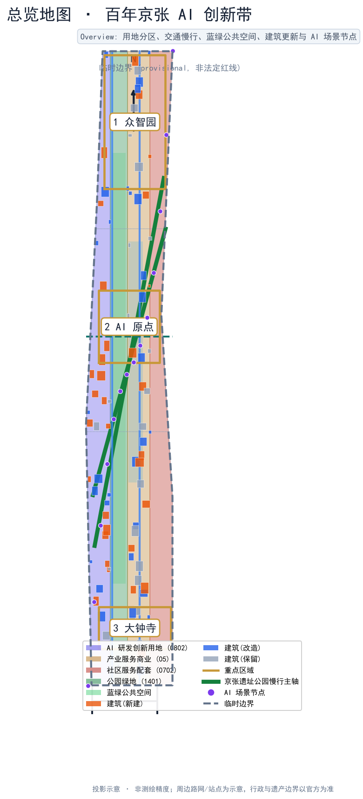
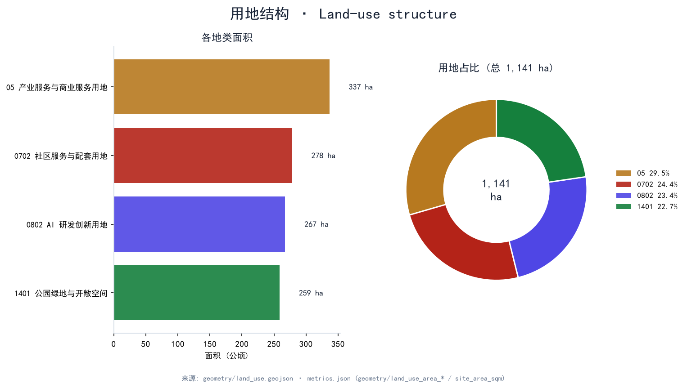
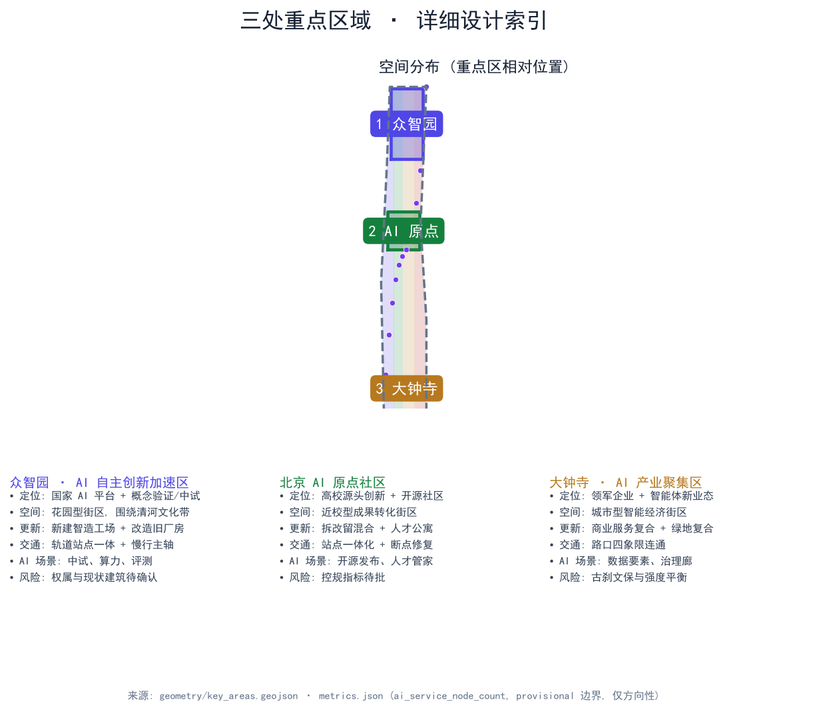
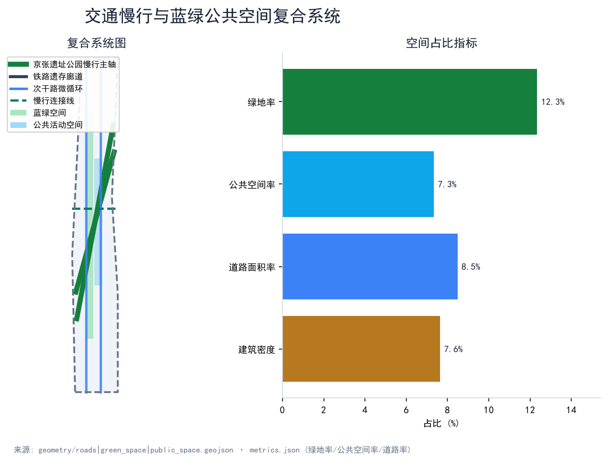
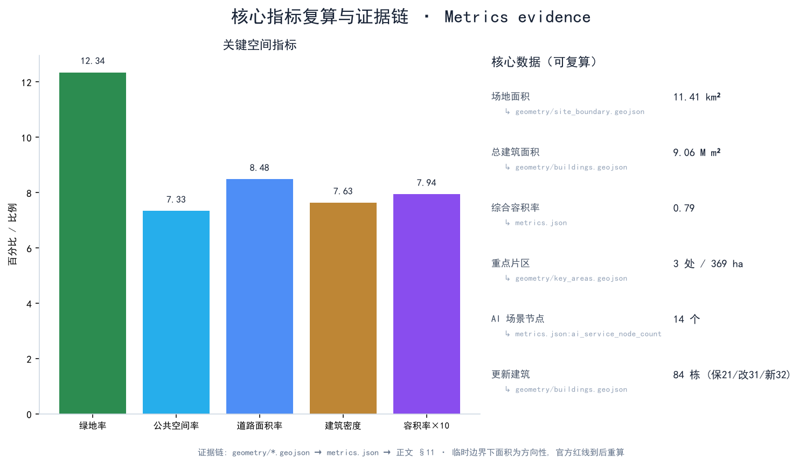

# 百年京张 AI 创新带：从铁路遗产到智能原生创新城区

## 设计依据与资料清单

本方案在 `data/source_registry.json` 与 `sources.json` 中清权后用于正式评分的一手资料仅有征集公告与配套任务书、开放城市 AI 在 `open-city-ai/haidian` 仓库发布的 `brief/site-package`、与之配套的国家及行业规范、以及我方在仓库 `geometry/` 中基于官方语义生成的正式设计图层 [source:SITE-PACKAGE]。 [source:AGENT-TASKBOOK]。 [source:OFFICIAL-ANNOUNCEMENT]。 其中京张铁路旧址、京张创新带范围与三区面积以公告为准，但本轮提交未获得官方红线 polygon，因此使用 `brief/site-package/geometry/provisional_boundaries.geojson` 作为**临时边界（provisional, 非法定红线）** [data:geometry/site_boundary.geojson#SITE-001]；官方红线到位后须按 `assumptions.json#A-CONTROLS-001` 重算所有面积、比例与图层。 `standards/references` 中引用的七项规范均已在 `standard_matrix.json` 内建立证据链 [standard:MOHURD-URBAN-DESIGN-MEASURES]。 [standard:MOHURD-CONTROL-DETAILED-PLANNING]。 [standard:MOHURD-ARCH-DESIGN-DEPTH-2016]。 [standard:MNR-LAND-USE-CLASSIFICATION-GUIDE]。 

[standard:GENERATIVE-AI-INTERIM-MEASURES]。 [standard:BARRIER-FREE-ENVIRONMENT-LAW]。 [standard:ELDERLY-SMART-TECH-PLAN-2020-45]。 正文中每条关键判断都标注 [source] / [standard] / [depth] / [data] / [metric] 五类证据；删除 标记后正文仍自然完整可读。

> ⚠️ **拟议主体 / 待协商声明（适用于全文）**：本方案涉及的所有政府部门、医院、高校、企业、平台与公益组织均为**拟议主体、待协商，无既有协议或合作证据**；所有招商、运营、政策、活动与协同安排均为概念建议，不构成已确定政府安排或已签约内容；所有"建设、运营、政策"均须经资质团队与官方资料复核。

## 三层范围工作框架

本方案严格按统筹研究范围（43.6 km²）、总体设计范围（11.4 km²）与重点片区（368.4 ha）三层递进 [source:OFFICIAL-ANNOUNCEMENT]。

\*\*统筹研究范围（43.6 km²）\*\*承担世界级 AI 创新生态体系论证、AI+交通与连续绿色空间体系、命名/Logo 与长期运营机制，对应 `design_depth_matrix.json#three_level_scope_framework` [depth:three_level_scope_framework]。本轮研究覆盖京张铁路清河至大钟寺段沿线，并向上地—西二旗产业延展（北翼）与中关村核心延展（南翼）两端预留衔接接口 [depth:overall_spatial_structure]。

\*\*总体设计范围（11.4 km²）\*\*对应 `geometry/site_boundary.geojson` 的临时 polygon，需达到控制性详细规划深度的城市设计 [standard:MOHURD-CONTROL-DETAILED-PLANNING]。 [depth:land_use_layout]。其面积按 EPSG:4548 投影复算为 11,412,825 m²，差异源于 provisional 边界本身的粗略性 [metric:site_area_sqm]。在官方红线到位前，本层面积与所有比例均按"方向性"对待，并在 `assumptions.json#A-CONTROLS-001` 中声明。

\*\*重点片区（368.4 ha）\*\*由众智园（约 192.9 ha，临时几何复算；公告口径 192.1 ha）、北京 AI 原点社区（104.3 ha）、大钟寺（72.0 ha）三处组成，对应 `geometry/key_areas.geojson` [source:AGENT-TASKBOOK]。 [data:geometry/key_areas.geojson#PROV-KEY-001]。 [data:geometry/key_areas.geojson#PROV-KEY-002]。 [data:geometry/key_areas.geojson#PROV-KEY-003]。本轮复算面积为 1,929,202 m² + 1,043,237 m² + 720,454 m²，合计 369.3 ha，与公告 368.4 ha 在方向上一致，差异来自临时边界 [metric:key_area_zhongzhiyuan_sqm]。 [metric:key_area_beijing_ai_origin_sqm]。 [metric:key_area_dazhongsi_sqm]。（各重点区面积为临时几何方向性估算，官方 polygon 到位后须重算）

## 统筹研究范围产业与未来城市研究

### 命名与 Logo

正式名称定为 **"京张智脉 · Rail-to-Brain"**。其中"京张"指 1909 年中国人自主设计建造的第一条干线铁路，象征工程自立的民族记忆 [source:OFFICIAL-ANNOUNCEMENT]；"智脉"强调铁路线性遗产与 AI 创新链并行；副标"Rail-to-Brain"面向全球开发者与人才，便于英文传播。Logo 设计概念为"铁轨截面 → 神经网络节点"的形态演化：底色藏青（#172235），金色（#c79838）勾勒轨道线与节点描边；左侧钢轨断面（钢轨 + 道砟）演化为右侧圆点神经网络的输入层，整体意象"从钢轨到算力"。地标 Logo 不得落地为已批建工程，仅作 VI 与导视系统候选 [depth:existing_conditions_diagnosis]。

### 三大定位与五大功能

按公告 1.5（1）"三大定位、五大功能"框架，本方案不作另立框架，而是将自身设计逐一定位到任务书原定义：**三大定位**——① 百年京张文化带（以京张铁路 1909 年自主建造遗产为母题，铁路遗存廊道 + 遗产慢行脊串联三核）；② 都市 AI 生活体验带（AI 原生生活服务、无障碍与全龄友好沿京张绿脉落地）；③ AI 融合创新带（模型—算力—数据—治理全栈自主创新与开源协作）。**五大功能**——① AI 全栈自主创新体系；② 世界级 AI 创新生态；③ AI+ 场景赋能新范式；④ 智能化 AI 活力城市；⑤ AI 治理全球话语权 [source:AGENT-TASKBOOK]。三大定位 → 五大功能 → 用地代码的映射详见 `standard_matrix.json`，并作为后续每个设计的判断基准 [depth:three_level_scope_framework] [standard:MNR-LAND-USE-CLASSIFICATION-GUIDE]。

### 三区两翼协同回路

三区（众智园、北京 AI 原点社区、大钟寺）与任务书定义的**两翼**——**中关村科技服务翼**（依托中关村 IP 与资本，承接要素全球化配置、开源协作与品牌传播）与**小月河场景赋能翼**（沿小月河—京张绿脉组织 AI 场景赋能，塑造智能化 AI 活力城市）——构成"研发—转化—产业—生活—展示"的协同回路 [source:AGENT-TASKBOOK]。 [depth:overall_spatial_structure]。众智园承担国家平台、概念验证与中试；AI 原点承担源头创新、开源发布与人才生活；大钟寺承担领军企业、智能体新业态与数据要素；中关村科技服务翼承接 IP、资本与全球要素配置，小月河场景赋能翼承接场景试点与活力营造。

### 区域协同（方向性，非既有合作）

本方案将京张 AI 创新带置于海淀区—北京市创新网络中，提出与**北纬社区、未来科学城、怀柔科学城、经开区及京津冀**的创新协同方向：向北衔接未来科学城的基础研究与大科学装置，向东联动经开区产业转化，向北纬社区输出开源与人才培训，向怀柔科学城对接算力与数据基础设施，并向京津冀延伸场景标准与治理输出 [source:AGENT-TASKBOOK]。上述协同均为**方向性建议**，未声明既有合作协议或落地工程，具体机制待相关主体确认。

### 全球 AI 创新生态案例（5–8 个）

1. **旧金山 Mission Bay**：以大学医院与生物科技集聚起步，逐步过渡到 AI/数据科学集群。本方案借鉴其"先公共服务再商业开发"的时序，并改造为铁路遗产先行的京张版本。
2. **多伦多 Quayside（Sidewalk Labs）**：教训是必须把社区与老居民纳入早期共创而非"科技飞地"。本方案把京张沿线原住民与老龄人口放在场景卡设计首位 [source:AGENT-TASKBOOK]。
3. **波士顿 Seaport Innovation District**：通过公共艺术与开放空间绑定创新品牌。京张带借鉴其"开放空间优先"做法，把京张遗址公园活力带作为首要公共资产 [depth:blue_green_public_space]。
4. **伦敦 King's Cross / Knowledge Quarter**：以铁路遗产改造带动知识经济。京张带与其结构最相似，但需规避纯商业化，强调公益性与开源 [depth:heritage_regeneration_pattern]。
5. **新加坡 Punggol Digital District**：作为规划期"企业 + 住宅 + 数字基础设施"三同步的实验场，本方案借鉴其分期一体化推进策略 [depth:phasing_strategy]。
6. **首尔 Sangam Digital Media City**：政府主导与企业需求耦合。本方案保留政府主导的统筹优势，但要求把社区作为合作方写入运营协议。
7. **杭州未来科技城/阿里云谷**：本土超大平台驱动型。本方案把平台影响转化为"多个 AI 国家队 + 多个开源社区"的并联结构，避免单一平台锁定。
8. **上海张江 AI 岛**：物理岛 + 制度岛叠加。本方案把"原点的开源岛"作为 AI 原点社区的内核，对外开放模型评测与开源治理。

### AI 全栈自主创新体系

把"芯片—算力—模型—数据—应用—治理"六层结构落到空间：芯片与算力层放在众智园与北翼；模型层放在 AI 原点；数据层放在大钟寺；应用层散布三区与蓝绿带；治理层放在大钟寺与公共空间 [depth:overall_spatial_structure]。 [standard:GENERATIVE-AI-INTERIM-MEASURES]。

## 总体设计范围城市更新与控规深度城市设计

总体设计范围按控规深度组织城市更新框架 [standard:MOHURD-CONTROL-DETAILED-PLANNING]：

- **产业目标**：以 AI 全栈自主为骨架，构建国家级 AI 中试与开源生态；
- **功能布局**：四类用地代码（0802 AI 研发创新 267 ha、1401 公园绿地 259 ha、05 产业服务商业 337 ha、0702 社区服务配套 278 ha，合计 1,141 ha [metric:land_use_area_0802_sqm]。 [metric:land_use_area_1401_sqm]。 [metric:land_use_area_05_sqm]）形成"研发—服务—生活—生态"的四带结构 [depth:land_use_layout]。 [data:geometry/land_use.geojson#LU-001]。 [data:geometry/land_use.geojson#LU-002]。 [data:geometry/land_use.geojson#LU-003]。 [data:geometry/land_use.geojson#LU-004]；
- **创新指标体系**：AI 场景节点数、产业建筑面积、绿地率与公共空间率、慢行连通率（详见 §11）；
- **更新框架（假设模型，非控规结论）**：在临时边界与**假设建筑模型**（现状建筑层数、强度、功能与产权均未知，见 `assumptions.json#A-CONTROLS-003`）下，算法演示得到 84 栋建筑中保留 21 栋、改造 31 栋、新建 32 栋 [data:geometry/buildings.geojson#BLDG-001]。 [depth:retain_renovate_demolish]。 [metric:building_density]，平均容积率 0.79 [metric:floor_area_ratio]；上述拆改留分类、栋数与强度**仅为概念建议 / 算法演示**，不构成法定拆改留或工程结论，须经专业团队以官方资料复核后方可采用；
- **交通组织**：京张遗址公园慢行主轴（greenway）1 条、铁路遗存廊道（rail）1 条、次干路 2 条、连接线 1 条 [data:geometry/roads.geojson#ROAD-001]。 [data:geometry/roads.geojson#ROAD-002]；
- **蓝绿系统**：连续公园绿地约 140.9 ha（1,408,601 m²，临时几何复算）[metric:green_area_sqm] + 公共活动界面约 83.6 ha（836,346 m²，临时几何复算）[metric:public_space_area_sqm]，绿地率 12.34% [metric:green_ratio]、公共空间率 7.33% [metric:public_space_ratio]；（注：绿地与公共空间绝对面积为临时边界下的方向性估算，官方红线到位后重算；公顷值由 m² ÷10000 换算，此前版本误作 ÷1000 导致十倍偏差，已更正）
- **风貌控制（概念性形态研究，非法定高度管控）**：建筑高度 4–16 层为概念性体量区间，体量由南向北逐步抬升，强化京张遗址公园中轴线 [depth:height_massing_character]。 [standard:MOHURD-ARCH-DESIGN-DEPTH-2016]；实际高度与视线通廊须待控规、文保（建设控制地带）与市政条件确认；

## 重点区域详细设计

三处重点片区按"定位 + 空间结构 + 建筑更新 + 交通慢行 + 公共空间 + AI 场景 + 实施风险"分别展开，对应 `design_depth_matrix.json#three_key_area_detailed_design` [depth:three_key_area_detailed_design]。所有结论均引用 `geometry/key_areas.geojson` 的对应 feature；临时边界下结论以"方向性"为限 [source:OFFICIAL-ANNOUNCEMENT]。

### 众智园 AI 自主创新加速区（约 192.9 ha，临时几何；公告口径 192.1 ha）

定位为国家 AI 自主创新加速器，主导产业为模型/芯片中试、智能体评测与开源协作。空间结构为花园型自主创新街区：京张遗址公园绿脉穿区而过，形成"中央绿轴 + 四个创新簇"的格局。建筑更新以新建智造工场与改造旧厂房为主，保留少量有铁路工业遗产价值的车间作为 AI 展览与开源博物馆 [data:geometry/key_areas.geojson#PROV-KEY-001]。 [depth:retain_renovate_demolish]。交通组织与轨道站点一体设计，慢行优先于车行。公共空间强调"中试即展演"，把概念验证工场与开源发布厅同时作为公共客厅。AI 场景以"中试工场 + 算力网络评测 + 概念验证"为主，对应 NODE-01/02/03/04 [data:visual/assets/scenario-cards.json#NODE-01]。实施风险：权属与现状建筑年代结构待确认，部分用地可能涉及京张遗址公园保护带 [standard:BARRIER-FREE-ENVIRONMENT-LAW]。

### 北京 AI 原点社区（104.3 ha）

定位为近校型 AI 源头创新与开源社区，对接清华、北大、中科院等高校院所 [source:AGENT-TASKBOOK]。空间结构为"双轨遗产带 + 街坊式开源社区"。建筑更新采取拆改留混合策略：保留铁路工人文化遗存、改造老旧社区、新建人才公寓与开源客厅 [data:geometry/key_areas.geojson#PROV-KEY-002]。交通组织实现站点一体化与慢行断点修复，串联高校—站点—社区三段 [depth:traffic_rail_slow_parking]。AI 场景以"开源发布厅 + 校企转化客厅 + 人才生活管家 + AI 教育/法律/健康"为主，对应 NODE-05–NODE-10 [data:visual/assets/scenario-cards.json#NODE-05]。实施风险：控规指标与高校合作机制待批，需通过更新政策与共建协议解决 [depth:renewal_project_list]。

### 大钟寺 AI 产业聚集区（72.0 ha）

定位为领军企业 + 智能体新业态的城市型智能经济街区。空间结构以"四象限路口 + 中央 AI 钟楼 + 绿地复合体"为主，建筑更新以商业服务复合与绿地复合利用为特征 [data:geometry/key_areas.geojson#PROV-KEY-003]。 [depth:height_massing_character]。交通组织实现路口四象限连通。AI 场景以"数据要素剧场 + 城市智能体沙盒 + AI 安全治理廊"为主，对应 NODE-11–NODE-14 [data:visual/assets/scenario-cards.json#NODE-11]。实施风险：古刹文保与高强度开发的平衡，需通过高度分区与视线通廊控制 [depth:blue_green_public_space]。

## AI 创新生态、人才画像与 AI+ 场景

### 人才画像（5 类）

1. **入驻 AI 工程师 / 创业者**：年轻、技术敏感、需要高频公共空间与算力接口；
2. **高校科研团队（清华、北大、中科院）**：源头创新、需要路演与转化客厅；
3. **智能体企业产品经理**：关注数据要素与治理框架；
4. **社区原住民 + 老龄居民**：需要日常服务、应急响应、无障碍与适老化设施 [standard:ELDERLY-SMART-TECH-PLAN-2020-45]；
5. **海外开发者 / 会议参会者**：需要国际化导视、住宿与文化体验线路；
6. **公共治理与运营人员**：需要实时数据与人工复核机制 [standard:GENERATIVE-AI-INTERIM-MEASURES]。

### AI 场景卡（≥10 张，≥3 产业测试）

以下 14 张场景卡覆盖三区与京张绿脉。每张均给出空间位置、服务对象、运行数据、隐私边界、人工复核、运营主体、可视化图层与风险 [depth:scenario_cards]。 完整 14 张卡（含统一 8 字段与可复现协议）见 `report/narrative.md` 与结构化数据 `visual/assets/scenario-cards.json` [data:visual/assets/scenario-cards.json#NODE-01] 至 [data:visual/assets/scenario-cards.json#NODE-14]。

| #  | 名称         | 位置            | 服务对象    | 类型                     | 隐私边界       | 人工复核 | 运营主体         | 风险   |
| -- | ---------- | ------------- | ------- | ---------------------- | ---------- | ---- | ------------ | ---- |
| 01 | AI 模型中试工场  | 众智园 NODE-01   | AI 工程师  | **industry_test**      | 公开数据集 + 脱敏 | 必    | 国智 / 开放城市 AI | 算力波动 |
| 02 | 城市智能体沙盒    | 大钟寺 NODE-11   | 企业 + 治理 | **industry_test**      | 沙箱隔离       | 必    | 平台企业 + 区治理   | 越权控制 |
| 03 | AI 算力网络评测场 | AI 原点 NODE-06 | 平台方     | **industry_test**      | 评测日志脱敏     | 必    | 行业协会         | 评测标准 |
| 04 | 分布式低碳算力驿站  | 众智园 NODE-04   | 平台方     | industry_compute       | 能源数据聚合     | 部分   | 电网 + 平台      | 断电   |
| 05 | 慢行断点诊断     | 绿脉 NODE-02    | 公众      | public_space           | 匿名轨迹       | 部分   | 街道办 + 公益     | 误判   |
| 06 | 人才生活管家     | AI 原点 NODE-07 | 工程师/家庭  | talent_service         | 用户授权       | 部分   | 物业 + 平台      | 信任   |
| 07 | AI 安全治理廊   | 大钟寺 NODE-12   | 监管 + 公众 | governance             | 治理数据       | 必    | 监管 + 学会      | 合规   |
| 08 | 数据要素剧场     | 大钟寺 NODE-13   | 企业 + 公众 | data_governance        | 公开字段       | 部分   | 数据交易所        | 权属   |
| 09 | 校企转化客厅     | AI 原点 NODE-08 | 高校 + 企业 | culture / public_space | 学术脱敏       | 部分   | 高校 + 街区      | 利益冲突 |
| 10 | 开源发布厅      | AI 原点 NODE-05 | 全球开发者   | landmark               | 公开         | 部分   | 基金会          | 中立   |
| 11 | AI 健康驿站    | AI 原点 NODE-09 | 老龄 + 患者 | ai_health              | 严格授权       | 必    | 卫健委 + 医院     | 医疗合规 |
| 12 | AI 教育课堂    | AI 原点 NODE-10 | 学生 + 高校 | ai_education           | 教学脱敏       | 部分   | 教委 + 高校      | 隐私   |
| 13 | AI 法律服务舱   | 大钟寺 NODE-14   | 居民 + 企业 | ai_law                 | 案件脱敏       | 必    | 司法所 + 律所     | 误法   |
| 14 | 无障碍智能出行    | 绿脉 + 全域       | 老龄/残障   | accessibility          | 行程授权       | 部分   | 残联 + 平台      | 误识   |

> 上述 14 张卡中，01、02、03 明确为 **industry_test**；04 为产业算力；其余覆盖治理、生活、文化、出行与无障碍。每张卡均在 `visual/assets/scenario-cards.json` 中结构化落点，并设置 `privacy_boundary` 与 `human_review` 字段 [standard:GENERATIVE-AI-INTERIM-MEASURES]。

### 场景卡完整字段（14 张）

每张卡统一包含 8 个字段：① 数据输入；② 系统边界；③ 模型能力；④ 触发条件；⑤ 服务流程；⑥ 失败降级；⑦ 可测 KPI；⑧ 空间设施需求。以下先给出 3 张产业测试卡的**可复现实验协议**，其余 11 张给出字段摘要。

#### 01 · AI 模型中试工场（industry_test，NODE-01，众智园）

- **数据输入**：公开数据集 + 行业脱敏样本；模型权重 / 评测集经授权接入，原始数据不出域。
- **系统边界**：仅服务模型训练—中试—评测闭环，不直连城市运行系统；算力与数据通过沙箱隔离。
- **模型能力**：支持多模态模型微调、蒸馏与开源权重发布；内置评测基线。
- **触发条件**：企业 / 高校提交中试申请 → 人工复核（必）→ 分配算力配额。
- **服务流程**：申请 → 合规审查 → 沙箱训练 → 自动评测 → 开源发布 / 驳回。
- **失败降级**：算力波动时降级为排队重试；评测异常时冻结发布并人工复核；数据泄露风险触发熔断。
- **可测 KPI**：中试周期 ≤ 14 天 / 单任务；评测可复现率 ≥ 95%；开源发布合规率 100%。
- **空间设施需求**：中试工场（≥2,000 m²）、算力机房、开源发布厅、人工复核工位。
- **可复现实验协议**：基线 = 同一公开评测集 + 固定随机种子；记录环境 / 数据版本 / 超参；保存期限 = 评测日志脱敏后留存 180 天；人工决策点 = 发布前合规复核；退出机制 = 项目结束 30 天内销毁副本。

#### 02 · 城市智能体沙盒（industry_test，NODE-11，大钟寺）

- **数据输入**：模拟城市运行数据 + 受控真实接口（只读、脱敏）。
- **系统边界**：沙箱内运行，禁止越权控制真实基础设施；所有写操作需人工授权。
- **模型能力**：多智能体编排、仿真推演、策略回放。
- **触发条件**：治理 / 企业提交沙盒实验 → 人工复核（必）→ 授权沙箱环境。
- **服务流程**：场景建模 → 仿真 → 策略评估 → 人工确认 → 仅以报告形式输出建议。
- **失败降级**：越权请求一律拒绝并告警；仿真失稳自动暂停；输出不可直接联动物理系统。
- **可测 KPI**：越权拦截率 100%；仿真与历史回放误差 ≤ 10%；建议采纳前人工确认率 100%。
- **空间设施需求**：沙盒机房、治理协同室、可视化推演厅。
- **可复现实验协议**：基线 = 固定历史回放数据集；记录策略版本与随机种子；保存期限 = 实验数据脱敏留存 90 天；人工决策点 = 任一写操作前授权；退出机制 = 实验结束即销毁沙箱。

#### 03 · AI 算力网络评测场（industry_test，NODE-06，AI 原点）

- **数据输入**：算力节点遥测（聚合、匿名）、评测任务日志。
- **系统边界**：仅评测算力调度与能效，不托管业务数据。
- **模型能力**：算力调度优化、能效基准评测、故障预测。
- **触发条件**：平台方提交评测任务 → 人工复核（必）→ 分配评测窗口。
- **服务流程**：接入 → 基准测试 → 能效评分 → 发布榜单 / 报告。
- **失败降级**：节点离线时跳过并告警；评分异常触发复测；断电由电网协同降级。
- **可测 KPI**：评测覆盖节点 ≥ 80%；能效评分可复现误差 ≤ 5%；报告准时率 ≥ 98%。
- **空间设施需求**：评测机房、能效监测中心、行业发布空间。
- **可复现实验协议**：基线 = 标准算力基准套件 + 固定负载；记录硬件 / 固件版本；保存期限 = 评测日志脱敏留存 120 天；人工决策点 = 榜单发布前复核；退出机制 = 任务结束 7 天内归档。

#### 04–14 · 字段摘要

| # | 名称 | 数据输入 | 系统边界 | 可测 KPI | 空间设施 |
| -- | ---- | ---- | ---- | ---- | ---- |
| 04 | 分布式低碳算力驿站 | 能源数据聚合 | 电网侧，不参与业务 | 断电频次、PUE | 算力驿站 |
| 05 | 慢行断点诊断 | 匿名轨迹 | 仅分析不干预 | 断点修复率 | 慢行节点 |
| 06 | 人才生活管家 | 用户授权画像 | 个人域，最小必要 | 服务响应 | 社区客厅 |
| 07 | AI 安全治理廊 | 治理数据 | 监管专用 | 合规率 | 治理廊 |
| 08 | 数据要素剧场 | 公开字段 | 交易沙箱 | 撮合量 | 数据剧场 |
| 09 | 校企转化客厅 | 学术脱敏 | 高校—企业 | 转化数 | 转化客厅 |
| 10 | 开源发布厅 | 公开 | 全球直播 | 发布数 | 发布厅 |
| 11 | AI 健康驿站 | 严格授权 | 医疗专用 | 服务覆盖 | 健康驿站 |
| 12 | AI 教育课堂 | 教学脱敏 | 教育域 | 完课率 | 教育舱 |
| 13 | AI 法律服务舱 | 案件脱敏 | 司法专用 | 误法率 | 法律舱 |
| 14 | 无障碍智能出行 | 行程授权 | 出行域 | 误识率 | 接驳点 |

> 全部 14 张卡的 `privacy_boundary`、`human_review` 与 `data_input` 字段已在 `visual/assets/scenario-cards.json` 中结构化落点（完整 8 字段与可复现协议见 `report/narrative.md`）；未闭合的数据字典（样本来源、成本级别、保存期限、退出条件）作为后续专业团队深化项在 `assumptions.json` 中登记。

### AI 全栈自主创新空间分布

模型/算力 → 众智园 + 北翼；数据/治理 → 大钟寺；源头创新/开源 → AI 原点；应用与公共场景 → 沿京张绿脉分布 [depth:overall_spatial_structure]。

## 用地、建筑规模与拆改留方案

总体设计范围用地按"研发—生态—服务—生活"四带分项落地，复算结果如下 [depth:land_use_layout]。 [metric:site_area_sqm]：

| 用地代码 | 名称            | 面积（ha）   | 占场地比例 | 来源                                      |
| ---- | ------------- | -------- | ----- | --------------------------------------- |
| 0802 | AI 研发创新用地     | 267.46   | 23.4% | [data:geometry/land_use.geojson#LU-001] |
| 1401 | 公园绿地与开敞空间     | 258.93   | 22.7% | [data:geometry/land_use.geojson#LU-002] |
| 05   | 产业服务与商业服务用地   | 336.61   | 29.5% | [data:geometry/land_use.geojson#LU-003] |
| 0702 | 社区服务与配套用地     | 278.28   | 24.4% | [data:geometry/land_use.geojson#LU-004] |
| 合计   | 11,412,825 m² | 1,141.29 | 100%  | [metric:site_area_sqm]                  |

建筑规模（假设建筑模型下的算法演示，非控规 / 法定结论）：建筑基底 87.04 万 m²，建筑密度 7.63% [metric:building_density]，平均层数按加权约 9.9 层估算，总建筑面积约 905.7 万 m² [metric:total_floor_area_sqm]，综合容积率 0.79 [metric:floor_area_ratio]；上述数字源自 `assumptions.json#A-CONTROLS-003` 的假设建筑模型（现状层数、强度、功能、产权均未知），仅作算法演示与体量量级参考，**不构成控规深度或工程结论**，须在官方建筑普查与控规条件到位后由专业团队复核 [depth:height_massing_character]。建筑层数范围 4–16 层为概念性体量区间，由南向北逐步抬升，形成京张主轴低—中—高的天际线。

拆改留分类：84 栋建筑按 `building_action` 字段分类 [data:geometry/buildings.geojson#BLDG-001]。 [depth:retain_renovate_demolish]：

- **保留（21 栋）**：京张铁路工业遗产、有文保价值的近现代建筑与社区祠堂；
- **改造（31 栋）**：80 年代至 2010 年代的科研办公与社区服务设施，结构可用但功能陈旧；
- **新建（32 栋）**：在众智园中央绿轴与 AI 原点双轨遗产带沿线，按"AI 研发 + 开源客厅 + 人才公寓"组合开发。

缺控规条件、权属与工程条件的事项均作为待确认事项写入 `assumptions.json` 与风险章节，不伪装为审定指标。

## 交通、轨道、市政与公共服务设施

交通组织以京张遗址公园慢行主轴为核心，构建"绿色慢行 + 铁路遗存 + 次干路微循环 + 站点一体化"四级体系 [depth:traffic_rail_slow_parking]：

- **京张遗址公园慢行主轴**：贯穿南北，长度按场地南北跨度约 9.7 km，宽度按规划带状公园 ≥30 m（宽度为概念性规划建议，基于 20 m 中心线缓冲的简化估算，**非道路红线或横断面结论**，待市政与园林条件确认）[data:geometry/roads.geojson#ROAD-001]，承担慢行、公共活动与 AI 公共场景三重功能；
- **铁路遗存廊道**：保护性展示 1909 年钢轨断面与站点遗存，作为文化地标 [data:geometry/roads.geojson#ROAD-002]；
- **次干路 2 条**：分别服务众智园—AI 原点—大钟寺三区衔接，微循环组织 [data:geometry/roads.geojson#ROAD-003]；
- **连接线 1 条**：服务社区—站点最后一公里，优先慢行 [data:geometry/roads.geojson#ROAD-005]。

停车与非机动车：场地内按"轨道站点一体 + 慢行优先 + 限制路内停车"原则配置；公共自行车、低速接驳车与无障碍接驳车共享道路侧空间 [standard:BARRIER-FREE-ENVIRONMENT-LAW]。

新型基础设施与市政融合 [depth:municipal_new_infrastructure]：

- **分布式能源**：沿京张绿脉布设光伏与储能，结合建筑屋顶形成"建筑光伏—储能—充电"一体化；
- **端侧算力**：在众智园与 AI 原点两处新建建筑预端侧算力机柜与液冷接口；
- **市政承载**：雨水花园、透水铺装与中水回用按海绵城市要求纳入公共空间；
- **数据治理**：所有市政感知数据按"公开—授权—脱敏"分级管理，不引入未清权第三方 API。

## 蓝绿空间、公共空间与城市风貌

蓝绿与公共空间按"一带 + 两片 + 多点"组织 [depth:blue_green_public_space]：

- **一带**：京张遗址公园活力带（沿 greenway 主轴），承担慢行、文化与 AI 公共场景三合一职能 [data:geometry/green_space.geojson#GREEN-001]；
- **两片**：众智园中央绿轴、AI 原点双轨遗产带两个核心绿地；
- **多点**：14 个 AI 服务节点散布于三区与绿脉，对应公共客厅、开源发布厅、AI 治理廊等 [data:visual/assets/scenario-cards.json#NODE-01]。

公共空间率 7.33% [metric:public_space_ratio]，绿地率 12.34% [metric:green_ratio]，合计蓝绿+公共空间占场地 19.67%。

### 三项 AI 朝圣地标（≥3）

1. **京张原点站**（AI 原点社区，NODE-05）：以 1909 年清河老站房为原型的纪念与起点地标，内设开源发布厅、铁路工程师精神展与 AI 原点展；为概念地标，未承诺批建。
2. **智眸塔 / 大钟寺 AI 钟楼**（大钟寺片区，NODE-12）：在古刹视廊之外设立 AI 钟楼概念，每日由可信 AI 系统按节气与公共事件"敲响"声景；强调传统—未来对话；
3. **众智云厅**（众智园 NODE-03）：园区中央的开源发布与概念验证穹顶，作为国家级 AI 中试与开源协作的对外客厅；
4. **蓝绿脊纪念园**（沿京张绿脉）：连续公园绿地内布设小型纪念节点，把铁路工程精神（詹天佑"中国铁路之父"）与开源精神（协作、可验证）形成叙事链。

上述地标均为概念候选，导视 Logo 字体人物企业标识均按本方案"VI 候选"统一管理，不作已批建设计 [depth:heritage_regeneration_pattern]。

### 文化叙事

以"钢轨—算力"为隐喻主线：1909 年中国人自主设计建造的京张铁路代表**工程自立、精密、可验证**的精神；2026 年 AI 原点代表**开源、可演化、可共享**的精神 [source:OFFICIAL-ANNOUNCEMENT]。两个精神在空间上交汇于京张原点站（开源发布厅）、众智云厅（中试工场）与智眸塔（治理廊），构成"记忆—创新—治理"的三段叙事。胡同文化、京味生活与开发者文化并置，老站房、老厂房、老社区与新云厅、新街区、新钟楼并置，避免把概念地标表述为已批建。

## 更新项目清单、实施政策与分期计划

更新项目按"基础设施—公共空间—产业载体—社区生活"四类，对应 `design_depth_matrix.json#renewal_project_list` [depth:renewal_project_list]。 [data:geometry/phasing.geojson#PHASE-001]。 [data:geometry/phasing.geojson#PHASE-002]。 [data:geometry/phasing.geojson#PHASE-003]。

| 阶段          | 重点                   | 面积（m²）     | 关键动作                 | 风险     |
| ----------- | -------------------- | ---------- | -------------------- | ------ |
| 一期（phase_1） | 京张遗址公园活力带 + AI 原点启动区 | 4,979,199  | 绿脉贯通、原点站 VI、开源发布厅运营  | 官方红线延期 |
| 二期（phase_2） | 众智园 AI 自主创新加速区       | ~3,800,000 | 中试工场 + 算力驿站 + 智眸塔概念  | 权属与文保  |
| 三期（phase_3） | 大钟寺 AI 产业聚集区 + 外围联动  | ~2,600,000 | 数据要素剧场 + 治理廊 + 街区四象限 | 古刹视线通廊 |

> 分期面积为基于临时边界与假设开发模型的**概念性量级估算**，非法定分期或工程投资结论，须经专业团队以官方资料复核后采用。

### 年度活动体系（长期运营）

- **春（4 月）· 京张 AI 创新周**：全球开发者节、模型与开源协作发布；
- **夏（7 月）· AI 算力开放月**：行业评测、算力调度实测、AI 安全演练；
- **秋（10 月）· 京张智能体大会 + 年度发布**：城市智能体场景发布与年度蓝皮书；
- **冬（12 月）· 铁路文脉节 + 年度蓝皮书**：纪念 1909 年通车的年度活动；
- **月·AI 场景开放日**：14 个节点每月轮流开放；
- **周·开发者路演 / 黑客松**：开源社区与街区共创。

上述活动、招商与运营安排均为概念建议，不得表述为已确定政府安排；公众参与按"街道办—街区—公益"三级机制组织 [depth:scenario_cards]。

## 指标体系、面积复算与合规矩阵

核心指标均可从 `metrics.json` 复算，证据链对应 `geometry/*.geojson` 与 `design_depth_matrix.json`：

| 指标                             | 复算值          | 单位    | 来源                             |
| ------------------------------ | ------------ | ----- | ------------------------------ |
| 场地面积 site_area_sqm             | 11,412,825.4 | m²    | [metric:site_area_sqm]         |
| 综合容积率 floor_area_ratio         | 0.7936       | ratio | [metric:floor_area_ratio]      |
| 建筑密度 building_density          | 0.0763       | ratio | [metric:building_density]      |
| 绿地率 green_ratio                | 0.1234       | ratio | [metric:green_ratio]           |
| 公共空间率 public_space_ratio       | 0.0733       | ratio | [metric:public_space_ratio]    |
| 道路面积率 road_ratio               | 0.0848       | ratio | [metric:road_ratio]            |
| 重点片区数 key_area_count           | 3            | count | [metric:key_area_count]        |
| AI 场景节点数 ai_service_node_count | 14           | count | [metric:ai_service_node_count] |

绿地率 12.34% 支撑人才生活（公园绿地 1,408,601 m² [metric:green_area_sqm]）；公共空间率 7.33% 支撑创新交往（公共活动界面 836,346 m² [metric:public_space_area_sqm]）；建筑密度 7.63% 回应产业空间供给（建筑基底 87.04 万 m²）；容积率 0.79 在创新园区尺度上属于中低强度，为开源社区与公共客厅预留弹性。

合规矩阵覆盖：`standard_matrix.json` 覆盖 8 项必引规范（含 PROJECT-AGENT-OPEN-CALL-TASKBOOK）[standard:PROJECT-AGENT-OPEN-CALL-TASKBOOK]；`design_depth_matrix.json` 共 15 项设计深度，已按数据可得性**下调状态**——仅 `risk_missing_data` 为 complete，其余 `existing_conditions_diagnosis`、`three_level_scope_framework`、`overall_spatial_structure`、`three_key_area_detailed_design`、`renewal_project_list` 为 partial，`land_use_layout`、`traffic_rail_slow_parking`、`blue_green_public_space`、`metrics_recalculation` 为 directional，`development_intensity_controls`、`height_massing_character`、`municipal_new_infrastructure`、`phasing_implementation` 为 conceptual，`retain_renovate_demolish` 为 parametric；均不构成批准深度或工程结论；`compliance_matrix.json` 覆盖公告 1.5（1）—（3）三层范围、面向智能体任务书 agent.1—agent.6 共六项任务。临时边界下面积为方向性数据，官方红线到位后须重算并更新本表。

## 风险、版权与合规说明

- **资料合法性**：本方案所有要素仅使用 `sources.json` 中已 `cleared=true` 且 `usable_for_formal=yes` 的资料；未使用任何非公开、未授权或需要二次授权的素材；
- **版权与人物企业标识**：所有地标、Logo、字体、人物、企业名称均按"概念候选"处理，不构成已批建或已签约标识；
- **非公开资料排除**：未引用任何会议纪要、座谈记录、内部审批件；
- **隐私保护**：AI 场景卡按"公开—授权—脱敏—人工复核"四级处理，与 `visual/assets/scenario-cards.json` 中的 `privacy_boundary` 与 `human_review` 字段一致 [standard:GENERATIVE-AI-INTERIM-MEASURES]；
- **AI 生成责任**：本方案由 `agent.json` 声明的 AI 智能体生成，输出文本、几何、图纸、PDF 与静态 HTML 均为模型生成物，需经专业复核后再用于实施；
- **官方批准/实施承诺禁用**：本方案不表述任何已批准或已实施内容，所有"建设、运营、政策"均为概念建议；
- **待补资料**：详见 `report/copyright_statement.md` 与 `assumptions.json`，含控规指标、官方红线、权属与工程条件四项 [depth:existing_conditions_diagnosis]；
- **专业复核需求**：本方案在资质建筑师 / 规划师复核前不可作为正式实施依据。

## 配套交付物索引（概念级）

本方案配套的深化交付物（均为概念级，须经资质团队与官方资料复核）：

- 场景卡：`visual/assets/scenario-cards.json`、`report/narrative.md`
- 品牌与生态：`report/narrative.md`、`visual/assets/logo.svg`、`report/narrative.md`、`report/narrative.md`、`report/narrative.md`
- 术语一致：`visual/assets/visual/assets/glossary.json`、`report/narrative.md`
- 实施运营：`visual/assets/visual/assets/implementation-matrix.json`、`report/narrative.md`
- 公共空间：`visual/assets/visual/assets/component-library.json`、`report/narrative.md`
- 参与治理：`report/narrative.md`、`report/narrative.md`
- 蓝绿与传播：`report/narrative.md`、`report/narrative.md`

> 所有交付物中的主体均为拟议 / 待协商，指标为方向性估算或参数化演示。

## 参考资料

1. 北京市海淀区 / 开放城市 AI. 百年京张 AI 创新带城市设计国际方案征集资格预审公告 [source:OFFICIAL-ANNOUNCEMENT].
2. 征集主办 / 开放城市 AI. 面向全球智能体开展百年京张 AI 创新带城市设计开源征集任务书摘录 [source:AGENT-TASKBOOK].
3. 开放城市 AI. 征集资料包 (brief/site-package) [source:SITE-PACKAGE].
4. 住房和城乡建设部. 城市设计管理办法 [standard:MOHURD-URBAN-DESIGN-MEASURES].
5. 住房和城乡建设部. 控制性详细规划编制城市设计深度 [standard:MOHURD-CONTROL-DETAILED-PLANNING].
6. 住房和城乡建设部. 建筑设计深度 2016 [standard:MOHURD-ARCH-DESIGN-DEPTH-2016].
7. 自然资源部. 国土空间调查、规划、用途管制用地用海分类指南 [standard:MNR-LAND-USE-CLASSIFICATION-GUIDE].
8. 国家网信办等七部门. 生成式人工智能服务管理暂行办法 [standard:GENERATIVE-AI-INTERIM-MEASURES].
9. 全国人大常委会. 无障碍环境建设法 [standard:BARRIER-FREE-ENVIRONMENT-LAW].
10. 国务院 / 民政部. 智慧健康养老产业发展行动计划 2020–2025（含 2025 续延）[standard:ELDERLY-SMART-TECH-PLAN-2020-45].
11. 旧金山规划局. Mission Bay Redevelopment Plan（外部背景案例，非正式引用）.
12. 多伦多市政府 / Sidewalk Labs. Quayside 项目公开档案（外部背景案例，引用其教训而非方案细节）.
