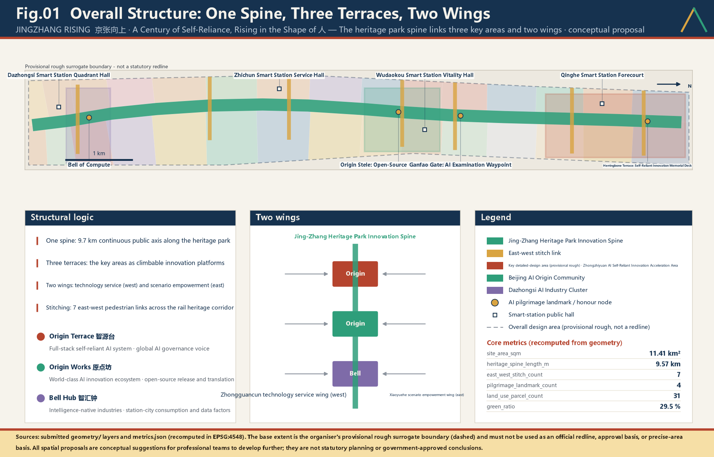
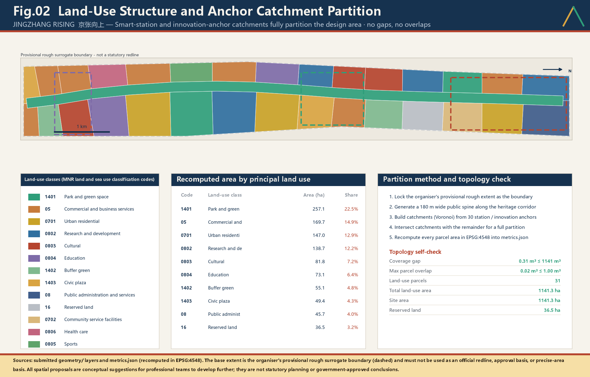
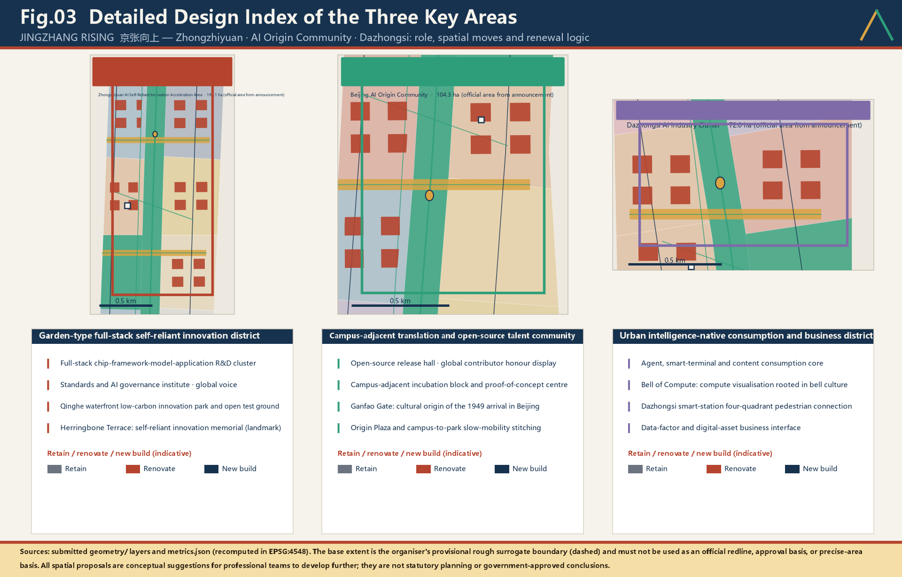
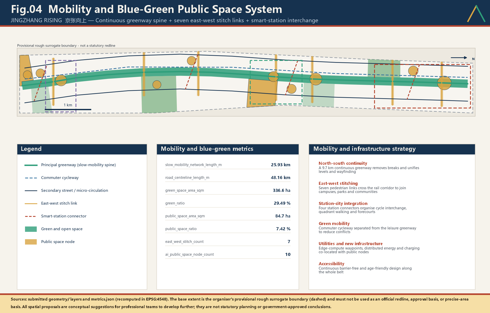
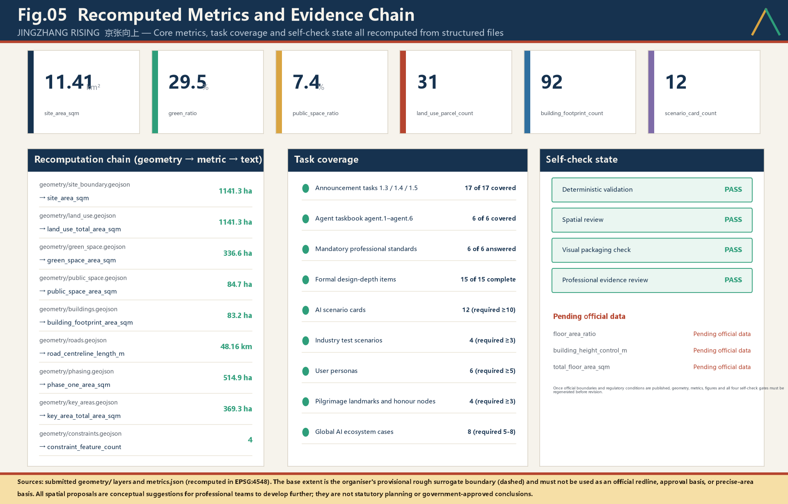

# JINGZHANG RISING - A Century of Self-Reliance, the Character for People Rising

> **The proposal in one sentence**: let the spirit of self-reliance embodied in Zhan Tianyou's herringbone switchback grow, along the very same corridor, into the Chinese character for "people" that begins the Chinese word for artificial intelligence - **AI, for the people**.

**JINGZHANG RISING**
One spine · Three terraces · Two wings · Two stitching systems

---

## Design Basis and Source List

This is an agent-authored design package for the open call for the Centennial Jing-Zhang AI Innovation Belt urban design. Its primary basis is the organiser's official announcement and the agent-facing open-call taskbook [source:OFFICIAL-ANNOUNCEMENT] [standard:PROJECT-OFFICIAL-ANNOUNCEMENT]. The announcement requires the urban-design depth of a regulatory detailed plan and of a comprehensive implementation plan. This package therefore does not treat written vision as the deliverable; it treats **recomputable structured evidence** as the foundation.

Task decomposition, mandatory items and forbidden claims come from the open-call taskbook [source:AGENT-TASKBOOK] [standard:PROJECT-AGENT-OPEN-CALL-TASKBOOK]. Site enumerations, the allowed design space, metric definitions and schemas come from the site package [source:SITE-PACKAGE]. The permitted use of each source is bounded by the registry: background-only and provisional-only material must never be promoted into an official boundary, a statutory plan, or a government commitment [source:SOURCE-REGISTRY]. The processed fact pack is a reading-navigation layer only and is not a new authority [source:PROCESSED-FACT-PACK].

**An honest statement about the boundary.** The official `SITE_BOUNDARY` and the three official `KEY_AREA` polygons have not been released. This package uses the organiser's registered provisional rough surrogate boundary [source:BOUNDARY-SOURCE] [source:KEY-AREA-SOURCE]. Accordingly `geometry/site_boundary.geojson` and `geometry/key_areas.geojson` are both marked `official_boundary=false` and `geometry_role=provisional_constraint`. All spatial output is a **conceptual recommendation** available for professional teams to develop further; it must not be used as an official redline, an approval basis, or a precise-area basis [assumption:A-CONTROLS-001].

The site area is recomputed from geometry [data:geometry/site_boundary.geojson#SITE-001] [metric:site_area_sqm]. The count and total area of the key areas are cross-checked against a separate layer [data:geometry/key_areas.geojson#PROV-KEY-001] [metric:key_area_count]. Once official polygons are published, the whole package must be regenerated - geometry, metrics, drawings and HTML - rather than patched file by file [depth:existing_conditions_diagnosis].

**Method statement.** The package was generated by an AI agent from public material and the structured data in this repository: first lock the boundary and constraints, then generate the land-use, building, road, green-space, public-space, phasing and AI-service-node layers, and finally recompute every metric back from those layers into `metrics.json`. Any area, ratio, scale or project count that cannot be recomputed from structured data is excluded from the conclusions. Any quantified control of floor area ratio, height limit, demolition decision or road redline is marked `unknown` and deferred to statutory process [standard:MOHURD-CONTROL-DETAILED-PLANNING].

| Basis level | Content | Location in this package |
| --- | --- | --- |
| Call requirements | Announcement tasks 1.3/1.4/1.5 and agent.1-agent.6 | 23 mapped rows in `compliance_matrix.json` |
| Technical standards | Urban design measures, regulatory planning, land-use classification, design depth | 6 entries in `standard_matrix.json` |
| Design depth | 15 items from existing-conditions diagnosis to risk register | `design_depth_matrix.json` |
| Spatial evidence | 9 layers, 31 parcels, 92 building footprints | `geometry/` |
| Quantitative evidence | 33 metrics, of which 30 are known | `metrics.json` |

## Three-Level Scope Framework

The three levels defined by the announcement are translated here into three **different kinds of work**, not three drawings at different scales [depth:three_level_scope_framework].

**The coordinated research area (about 43.6 sq km) answers "why".** It addresses the position of Haidian's AI ecosystem within national self-reliant innovation, how the innovation chain and the industrial chain interlock in space, and what urban form suits AI-era productive forces. Its outputs are strategic judgements, a naming system, ecosystem mechanisms and international narrative. It draws no redlines.

**The overall design area (11.41 sq km) answers "how it grows".** It converts strategy into verifiable spatial structure: land-use zoning, a renewal framework, transport and utilities support, blue-green and public space, and character control. This level is the scope of every GeoJSON layer in this package [data:geometry/land_use.geojson#LU-SPINE-001] [metric:land_use_total_area_sqm].

**The key areas (three, about 369.3 ha in total) answer "how it is done".** They bring the structure down to blocks, parcels, buildings, public space and scenarios, and test whether it can actually be built [data:geometry/key_areas.geojson#PROV-KEY-002] [metric:key_area_total_area_sqm].

The three levels are bound by **two-way verification**: if a strategy at one level cannot become recomputable space at the level below, the strategy is judged hollow and revised; if space at one level cannot be traced back to a strategy and a source above, the space is judged arbitrary and deleted. `compliance_matrix.json` fixes this as a five-part tuple of section, layer, metric, drawing and HTML; a missing element means the task is not covered [depth:overall_spatial_structure].

| Level | Core question | Answer in this proposal | Structured location |
| --- | --- | --- | --- |
| Coordinated research area | How to organise the AI ecosystem and future urban form | Full-stack self-reliant innovation chain, four-origins narrative, global event system | `compliance_matrix.json`, `standard_matrix.json` |
| Overall design area | How industry, renewal, transport and character land on the map | One spine, three terraces, two wings, two stitching systems; 31 parcels | [data:geometry/land_use.geojson#LU-001] [data:geometry/roads.geojson#ROAD-001] |
| Key areas | How the three districts reach detailed-design depth | Three distinct sets of moves for Origin Terrace, Origin Works and Bell Hub | [data:geometry/key_areas.geojson#PROV-KEY-003] |

## Coordinated Research Area: Industry and Future City Research

### 1. Positioning: the origin corridor of China's self-reliant AI

**"A century of self-reliance" is not a slogan. It rests on two national-level facts one hundred years apart.**

In 1909 the Jing-Zhang Railway was completed. It was the first trunk railway surveyed, designed and built by Chinese engineers themselves. In the Guangou section its chief engineer Zhan Tianyou used a herringbone switchback and a vertical-shaft excavation method to overcome gradients that foreign engineers had declared impassable for Chinese builders, and delivered the line two years ahead of schedule.

On 13 March 2009 the State Council issued its official reply approving the development of the Zhongguancun Science Park as a national demonstration zone for independent innovation, formally designating it the **Zhongguancun National Independent Innovation Demonstration Zone**. The words "independent innovation" thereby entered the formal name of a national-level zone.

The two events are exactly one hundred years apart and occurred along the same corridor: once proving on the rails that Chinese engineers could build independently, once confirming in national policy that this place carries the responsibility to demonstrate independent innovation. Today the same corridor must answer a third question — **whether artificial intelligence can be self-reliant, and once self-reliant, whom it serves.**

The proposal therefore states its positioning:

> **The Centennial Jing-Zhang AI Innovation Belt = the origin corridor of China's self-reliant AI.**
> From building our own railway to building our own intelligence; from the character 人 to artificial intelligence; from technological self-reliance to a people-centred city.

Three testable propositions follow [source:AGENT-TASKBOOK]:

1. **Origination.** This is one of the earliest cradles of Chinese technology entrepreneurship and artificial intelligence, and should carry zero-to-one origination rather than absorbing spillover. The institutional lineage is a matter of record: in 1988 the State Council approved the Beijing New Technology Industry Development Experimental Zone, China's first national-level high-tech industrial development zone; in 1999 it approved the Zhongguancun Science Park; in 2009 it approved the national independent innovation demonstration zone. Three approvals trace one clear curve of national intent.
2. **Self-reliance.** The belt should close a full-stack loop across chips and compute, frameworks and models, data and corpora, scenarios and applications, becoming a spatial exemplar of accelerating high-level technological self-reliance [standard:PROJECT-OFFICIAL-ANNOUNCEMENT].
3. **People-centredness.** The benefits of AI must first be felt by the residents, students, elderly people and founders along this belt, translated into public space that can be touched rather than left in industrial indicators.

### 1b. Beijing's third centennial line: placing this corridor in the city's spatial lineage

Beijing's urban order has always been organised by lines. To understand the weight of this corridor it must be read against Beijing's own spatial lineage rather than against science parks elsewhere.

| Line | Time depth | Spatial character | Urban function carried |
| --- | --- | --- | --- |
| Central Axis | over six centuries | due north-south, ritual order | spine of the national cultural centre |
| Chang'an Avenue | over seven decades | due east-west, national image | frontage of the national political centre |
| **Jing-Zhang line** | **over one century** | **north-west diagonal, engineering reason** | **carrier of the international science and technology innovation centre** |

In July 2024 "Beijing Central Axis: A Building Ensemble Exhibiting the Ideal Order of the Chinese Capital" was inscribed on the World Heritage List. Roughly 7.8 kilometres long, it is recognised as the concentrated expression of the ideal order of a Chinese capital. Its greatness lies in what it expresses: **the human arrangement of order** — orientation, hierarchy and rite established by human will.

The Jing-Zhang line expresses something equally great: **human accommodation of, and triumph over, real conditions.** It could not run straight, because the terrain forbade it; so it doubled back, climbed and detoured, using engineering reason to carry trains upward within given constraints. The Central Axis is straight; the Jing-Zhang line bends. One is rite, the other engineering. **Together they form Beijing's complete urban spirit: the capacity to impose order, and the honesty to face reality.**

An explicit disclaimer is required. This proposal **does not propose** any new statutory axis. The spatial structure established by the Beijing Master Plan (2016-2035) is the statutory framework and is followed in full [standard:MOHURD-URBAN-DESIGN-MEASURES] [assumption:A-CONTROLS-001]. The "third centennial line" described here is a **positioning judgement in the sense of cultural lineage**, used to explain this corridor's place and magnitude within Beijing's urban spirit, and thereby to justify its character standards, investment intensity and narrative ambition. It neither supplements nor amends the statutory spatial structure.

The direct corollary is this: **the design standard for this corridor should be benchmarked against the Central Axis, not against an industrial park.** Its public space must withstand scrutiny a century from now; its paving, the proportion of its structures, its wayfinding and its naming system should all be held to the standard of a cultural route rather than of estate servicing. That is the underlying reason this proposal insists on a walkable four-origin narrative, on a single folded-angle geometry, and on landmarks rather than signage [depth:height_massing_character].

### 2. Five functions and the coordination of three districts and two wings

The five functions required by the announcement are given spatial carriers [standard:PROJECT-AGENT-OPEN-CALL-TASKBOOK]:

| Function | Spatial carrier | Test metric |
| --- | --- | --- |
| Original innovation origination | Origin Terrace and near-campus research blocks | Research land area [metric:research_land_area_sqm] |
| Translation and incubation | Origin Works and the western service wing | Commercial service land [metric:commercial_service_land_area_sqm] |
| AI-native new business forms | Bell Hub and station-city nodes | AI public service nodes [metric:ai_public_space_node_count] |
| Belt-wide scenario opening | Heritage spine and the eastern scenario wing | Scenario cards [metric:scenario_card_count] |
| International exchange and culture | Four pilgrimage landmarks and the event system | Pilgrimage landmarks [metric:pilgrimage_landmark_count] |

The **three districts** are the three key areas, read as three ascending terraces of innovation potential. The **two wings** are the western Zhongguancun technology-service wing (universities, institutes and professional services supplying talent, capital, legal and standards capacity to the belt) and the eastern Xiaoyuehe scenario-enablement wing (residential communities and everyday services supplying real scenarios, real data and real users). Seven east-west stitching links connect the wings to the spine [metric:east_west_stitch_count].

### 3. A full-stack self-reliant innovation system

This proposal argues that industry along the belt should be organised not by sector but by **layer of the self-reliant technology stack**, so that each layer has an explicit carrier and an explicit adjacency requirement [source:PROCESSED-FACT-PACK]:

| Stack layer | Suggested carrier | Adjacency requirement |
| --- | --- | --- |
| Compute and chips | Northern research blocks of Origin Terrace; edge-compute waypoints | Close to energy and utility trunks |
| Frameworks and toolchains | Open-source engineering cluster, central Origin Terrace | Close to the open-source release hall |
| Foundation models and corpora | Near-campus research band of Origin Works | Close to universities and corpus-compliance bodies |
| Domain models and applications | Bell Hub industry cluster and both wings | Close to real scenarios and users |
| Standards, safety and governance | Standards and governance institute, Origin Terrace | Close to international exchange facilities |
| Open-source community and talent | Community blocks of Origin Works | Close to public space and housing |

Because the layers are separated but not segregated, every jump along the self-reliant chain occurs **within walking distance**. All six layers are carried on research, commercial-service and public-service land inside the overall design area [data:geometry/land_use.geojson#LU-002].

### 4. Urban form for AI-era productive forces

Six principles are proposed for urban form [depth:overall_spatial_structure]:

1. **Testability first** - streets, squares and campuses are testing grounds that can be legally applied for and genuinely used, not merely landscape to be admired.
2. **Compute as a utility** - edge compute, edge nodes and data interfaces are deployed with public nodes as new municipal infrastructure, not as isolated machine rooms.
3. **Mixing over zoning** - research, housing, services and public space are highly mixed to compress commuting and support a fifteen-minute innovation living circle.
4. **Data visible and controllable** - sensing devices in public space must be identifiable, explainable and refusable, protecting personal information rights.
5. **Elastic reserve** - land is deliberately reserved for technological forms that cannot yet be predicted [metric:reserved_land_area_sqm].
6. **Human scale is not diluted by technology** - as technological density rises, street scale, shade and seating density must rise with it.

### 5. Eight global cases and what makes this belt different

Eight global innovation districts were compared [metric:ecosystem_case_count] in order to identify what here cannot be copied:

| Case | What to learn | How this belt differs |
| --- | --- | --- |
| Silicon Valley and Stanford | The revolving door of university, capital and firms | This belt must be led by national self-reliance strategy, not purely by markets |
| King's Cross Knowledge Quarter, London | Rail heritage converted into a knowledge district | The heritage here carries a stronger **self-reliance narrative**, not only industrial aesthetics |
| MILA, Montreal | University-led AI cluster and talent policy | This belt must cover the full stack, not only algorithms |
| Station F, Paris | Very large single-building incubation | This belt uses a linear multi-anchor model to avoid single-point monopoly |
| one-north, Singapore | Government-led mixed research and industry blocks | This belt renews an existing built-up area rather than building a new town |
| Tokyo station-city development | Three-dimensional stitching of rail and city | This belt prioritises ground-level public life over large underground megastructures |
| Zhangjiang AI Island, Shanghai | Concentrated demonstration of applications | This belt favours open blocks over enclosed campuses |
| Hetao and Xilihu, Shenzhen | Cross-boundary and industry-academia mechanisms | This belt holds a cultural origin narrative as its unique asset |

**Conclusion: the one asset that cannot be replicated here is the historical legitimacy of a century of self-reliance and the herringbone symbol.** Naming, logo, landmarks and events must therefore be built around that asset rather than following generic technology-park vocabulary.

**A horizontal scan of eight cases is not enough.** Three of them are closely comparable to this belt on three conditions at once — railway heritage, innovation function, and an existing resident community — and deserve to be read for their costs and lessons rather than mined for their headline successes.

**Case one: King's Cross, London — the closest analogue, and the one to be most wary of.**

The comparability lies in its conversion of railway land and historic station buildings into a knowledge and creative district, its retention of substantial industrial fabric, and its embedding in existing urban tissue rather than a new town. What is worth learning is its **very long phasing with the skeleton first**: public space, pedestrian connections and open squares were built ahead of much of the commercial floorspace, so the district held public value before letting was complete.

Its cost must equally be faced. The area has long attracted criticism for gentrification: lower-income residents and small businesses were progressively displaced, and while the space remained publicly accessible, the composition of its actual users shifted markedly. **The lesson for this belt is unambiguous:** physical accessibility of public space is not social accessibility. This proposal therefore lists existing local residents among its six user groups and places them at the threshold position, writes the human fallback as a binding clause, and requires the composition of review participants to be published — each a direct defence against gentrification risk [depth:renewal_project_list].

**Case two: one-north, Singapore — a government-led research and industry district.**

The comparability lies in government leadership, a research-industry mix, and organisation at walkable block scale rather than as gated compounds. What is worth learning is the **long-run elasticity of its functional mix**: plot functions may be adjusted between research, office, residential and service uses across cycles rather than being locked in once.

One condition differs fundamentally from this belt: one-north was largely built new on low-intensity land, whereas this belt is renewal within a dense built-up area involving existing ownership, existing residents and existing businesses. **This proposal therefore does not transplant its block template and borrows only its elasticity logic**, expressed as deliberately reserved flexible land [metric:reserved_land_area_sqm]. That is an honest judgement: new-town experience cannot be applied directly to inner-city renewal.

**Case three: station-city integration in Tokyo — vertical stitching, and the trade-off against ground-level publicness.**

The comparability lies in the Bell Hub district at the southern end of this belt, which faces the same problem of combining a rail station with urban functions. What is worth learning is the maturity of its interchange efficiency and vertical connection.

Its cost is equally plain: high-intensity underground and elevated systems often come at the expense of the publicness of the ground-level street, with pedestrians drawn into commercialised interior circulation and open-air city life weakened. **The core asset of this belt is precisely an open-air, continuous, free heritage park spine.** This proposal therefore makes an explicit trade-off: station-city integration is adopted only locally within the Bell Hub district, and on the precondition that it **neither severs the ground-level continuity of the spine nor forces pedestrian flow indoors** [depth:traffic_rail_slow_parking].

**The three cases together yield the proposal's three self-imposed constraints:**

1. Skeleton first, but the skeleton must be a **social** skeleton, not only a physical one (King's Cross).
2. Borrow elasticity, but do not transplant a new-town template into inner-city renewal (one-north).
3. Pursue efficiency, but not at the cost of ground-level publicness (Tokyo).

### 6. Naming system and visual identity

**Name: JINGZHANG RISING.** The Chinese name combines intelligence with the idea of a vein - the rail corridor, a cultural bloodline and an innovation network at once. The subtitle is **"A century of self-reliance, the character for people rising"**.

The **naming system** follows the station tradition of the Jing-Zhang Railway, producing an extensible "smart station" series so that the whole belt is coherent in language [source:AGENT-TASKBOOK]:

| Level | Naming rule | Example |
| --- | --- | --- |
| Belt | Jingzhang AI Belt | JINGZHANG RISING |
| Terrace (key area) | Terrace / Works / Hub | Origin Terrace, Origin Works, Bell Hub |
| Station (public node) | Place name plus smart station | Wudaokou, Zhichun, Qinghe, Dazhongsi smart stations |
| Landmark | Single word plus terrace, gate, bell or stele | Herringbone Terrace, Ganfao Gate, Bell of Compute, Origin Stele |
| Stitch | Number plus stitching link | Stitching links one to seven |

**Logo direction.** A single motif: the herringbone switchback. Two strokes fold upward from lower left and lower right and cross, with the crossing point projecting above to form the character for "people"; the negative space between them reads naturally as the letter A - for AI, Autonomy and Advance. A distinct **fold angle** is retained at the reversal, quoting the geometry of the Qinglongqiao switchback directly, so that those who know recognise it instantly and those who do not still read "rising". Core palette: steel blue `#16324F` for rail and reason, brick red `#B5442E` for the old station brick and warmth, intelligent green `#2E9E7A` for the heritage park and ecology, honour gold `#D9A441` for contribution.

The logo is not only graphic but a **buildable spatial prototype**: the retaining wall of Herringbone Terrace, the frame of Ganfao Gate, the bridge section of the stitching links and the arrows of the wayfinding system are all derived from the same fold geometry, so brand and space share one origin.

### 7. A line that must be drawn: a symbol may be quoted, geography may not be stretched

The herringbone switchback stands at **Qinglongqiao Station in Yanqing District**, a reversing section built to climb the steep Badaling grade on the Guangou stretch of the Jing-Zhang Railway. It lies tens of kilometres in a straight line from this overall design area, **outside the scope of this commission**, and outside the Haidian section of the Jing-Zhang Railway Heritage Park [source:SITE-PACKAGE].

This proposal therefore draws an explicit distinction:

- **What may be quoted:** the spirit of self-reliance the character 人 carries, the engineering reason embodied in doubling back to climb, and the **folded-angle geometry** derived from it as a visual motif.
- **What may not be stretched:** any diagram that treats the switchback as the spatial structure, road pattern or urban grain of this site. The spatial structure proposed here is one spine, three terraces, two wings and two stitching systems, determined by the site's own elongated north-south form, the alignment of the existing rail corridor and the present east-west severance — **and not by the geometry of the switchback.**

This distinction is drawn because the persuasive power of urban design rests on factual accuracy. A proposal that draws an engineering relic sixty kilometres away into its own structural diagram will not survive professional scrutiny, however handsome the drawing [standard:MOHURD-URBAN-DESIGN-MEASURES]. This proposal would rather forgo a layer of formal resonance than sacrifice factual rigour [assumption:A-CONTROLS-001].

## Regional Collaboration: Turning "Jing-Zhang" From a Historical Noun Back Into a Functional Relationship

### 1. Why regional collaboration must be answered

"Jing-Zhang" is a **two-ended place name**. Most proposals use only the "Jing" end and consume "Zhang" as historical rhetoric. This proposal treats that as the single largest waste in the brief: **Zhangjiakou is not the backdrop of the Jing-Zhang story; it is the other half of today's AI infrastructure.**

An innovation belt that closes its loop inside Haidian is a park. Only when it carries a division of labour between the two ends of the corridor does it deserve the word "belt." Coordinated Development of the Beijing-Tianjin-Hebei Region was elevated to a national strategy in February 2014, and in April 2015 the Political Bureau meeting reviewed and approved the Outline Plan, setting out its strategic goals and priority tasks. Regional collaboration here is therefore not an appended chapter; it is the **condition for honouring the name** "Jing-Zhang."

### 2. Algorithms in Haidian, computing power and green electricity in Zhangjiakou

This is the **hard core** of the regional argument, and it rests on two verifiable public-policy facts.

**First, Zhangjiakou is a physical node in the national computing layout.** The East Data West Computing programme was formally launched on 17 February 2022, laying out 8 national computing hub nodes and 10 national data centre clusters nationwide; the **Zhangjiakou data centre cluster** is one of the clusters under the **Beijing-Tianjin-Hebei national computing hub node**.

**Second, Zhangjiakou is a State Council-approved renewable energy demonstration zone.** On 8 January 2016 the State Council, by Guohan [2016] No. 5, approved the establishment of the **Zhangjiakou Renewable Energy Demonstration Zone**. (Note: its statutory name does not carry the words "national level," and this proposal does not inflate it.)

Together these two facts produce a combination that is rare anywhere in the country: **a computing host region less than two hundred kilometres from the capital, rich in renewable energy, and already designated within a national computing hub.** What Haidian holds is the other end — algorithms, models, talent and an open-source ecosystem.

The proposal therefore sets out a division of labour across the two ends of the corridor:

| End | Carries | Spatial anchor | Why this end |
| --- | --- | --- | --- |
| Haidian end (this design area) | Algorithms, models, standards, talent, open-source governance, scenario validation | Zhiyuan Terrace / Origin Works / Zhihui Bell | Dense universities, institutes and corporate headquarters; a high-density intellectual space where people follow knowledge |
| Zhangjiakou end (collaborating region, **outside** this design area) | Large-scale training compute, green power supply, energy-intensive back end | Zhangjiakou data centre cluster (existing national layout) | Cool climate aids heat rejection, renewable supply is abundant, and it already holds a national computing hub designation |

**This division also answers a constraint Haidian cannot avoid: reduction-led development.** Beijing pursues reduction-led development, and Haidian's land and energy quotas are extremely tight. Forcing energy-intensive training compute into Haidian is neither consistent with that direction nor economic. **Placing compute in Zhangjiakou while keeping algorithms in Haidian is a rational division within one corridor — not an act of pushing a problem onto a neighbour.**

**A necessary boundary statement:** the Zhangjiakou end is **outside the scope of this urban design**. This proposal makes no land-use, indicator or construction arrangement for Zhangjiakou and makes no commitment on any party's behalf. What the Haidian end can do is reserve the spatial and institutional interfaces required to take up this division of labour — the three interfaces below.

### 3. Three interfaces reserved at the Haidian end

**Interface one: compute scheduling (Zhihui Bell).** A compute-scheduling and green-power accounting counter offers firms in the belt one-stop brokerage for "local inference plus remote training," and publishes the renewable share of every scheduled job. Developers should not have to negotiate for machine rooms themselves; cross-regional collaboration becomes **a public service you can order over a counter**.

**Interface two: mutual recognition of standards (Zhiyuan Terrace).** The model evaluation, safety assessment and data-compliance definitions issued by Zhiyuan Terrace are opened to mutual recognition with the northern end of the corridor. A standard that holds only in Haidian is a park rule; only when the other end adopts it does it become a **corridor standard**.

**Interface three: two-way talent (Origin Works).** A "corridor desk" scheme lets open-source teams registered at Origin Works apply for short residencies and compute quotas at collaborating nodes, and vice versa. Talent movement is the most honest indicator of collaboration: **what counts is whether people come, not whether documents are signed.**

### 4. Relationship to Beijing's "three cities and one zone" and neighbouring districts

Beijing has built an innovation layout known as the **"three cities and one zone,"** centred on **Zhongguancun Science City, Huairou Science City, Future Science City (in Changping) and the Beijing Economic-Technological Development Area (Yizhuang)**. This design area lies within Zhongguancun Science City, so the belt must **fill a gap rather than start a parallel venture**:

- **Huairou Science City** leads on large scientific facilities and basic research; this belt takes the downstream role of translating those results into industry and scenarios, and does not duplicate large facilities.
- **Future Science City (Changping)** leads on energy and pharmaceutical industrialisation platforms; the relationship is upstream general AI capability supplying downstream sector scenarios.
- **Yizhuang** carries advanced manufacturing and connected-vehicle deployment at scale; this belt supplies algorithms and standards and does not compete for manufacturing land.
- **Yanqing** hosts the 人-shaped switchback and was an Olympic competition zone; its relationship to the belt is **cultural-narrative collaboration along the same railway heritage line**, not industrial collaboration. As stated earlier, the switchback does not constitute a basis for this site's spatial structure.

The Beijing-Zhangjiakou high-speed railway opened on 30 December 2019, connecting the Beijing, Yanqing and Zhangjiakou competition zones of the Beijing 2022 Winter Olympics. **That line turned "one hour between the two ends of the corridor" from an aspiration into an accomplished fact,** and gives the division of labour above a realistic commuting and operations basis. (Note: the official host city of the Beijing 2022 Winter Olympics was Beijing, with Zhangjiakou as one competition zone; this proposal does not use the phrase "co-hosted.")

## International Communication: Reproducibility as the Common Language

International communication here does not rely on promotional-film image projection. It rests on **one thing an outsider can independently verify**: every spatial conclusion in this proposal can be recomputed by a third party from the layers shipped in this package.

**Three routes:**

**First, natively bilingual delivery.** Chinese and English are both natively written rather than machine round-tripped, and figures, drawings, HTML and film are all supplied in both languages. International peers read the whole proposal, not an abstract.

**Second, open-source reproducibility.** Metrics are recomputed from layers, methods are stated in the text, and what cannot be recomputed is marked unknown. That practice is itself the most effective address to an international professional audience. **A proposal willing to publish what it does not know is more credible than one whose every number is perfect.**

**Third, human fallback and the public answer sheet as an exportable institutional sample.** Cities everywhere face the same question: once AI enters public service, who is answerable when it fails. The answer offered here is a reproducible minimum requirement rather than a statement of principle. This is the part of the belt most likely to be cited internationally, and it is the most persuasive form a Chinese contribution can take — **not announcing that we have solved it, but publishing how we do it and what happens when it fails.**

## Long-Term Operations: Making Sure Someone Still Runs This Belt in Ten Years

The commonest failure in urban design is not that a thing cannot be built, but that **no one is answerable for keeping it running once built**. Three mechanisms are proposed.

**One: the operator is fixed before construction, not after.** Each terrace names its responsible operator and assessment definitions before work starts. Any project without a named operator does not enter the implementation list.

**Two: public return and exit conditions are written into admission.** The "public return" and "exit condition" items among the six public-answer-sheet entries also serve as admission conditions: an entity enjoying public resources in this belt must publish the return it offers the public — open compute windows, public-interest scenarios, training places for residents — and agree in advance how it exits if the return is not delivered. **Admission without an exit condition is admission without a constraint.**

**Three: an annual public recomputation.** Once a year the same scripts recompute the layers and metrics, and the result is published and compared with the previous year. Indicators may change, but **the change must be visible**. This mechanism also allows the package to be rerun in full, rather than patched file by file, once the official `SITE_BOUNDARY` and `KEY_AREA` polygons are released [depth:existing_conditions_diagnosis].

## Overall Design Area: Urban Renewal and Regulatory-Plan-Level Urban Design

### 1. Spatial structure: one spine, three terraces, two wings, two stitching systems

The overall design area is a long north-south strip of 11.41 sq km [metric:site_area_sqm]. The structure is:

**One spine** - the Jing-Zhang rail heritage park as a cultural and innovation spine, continuous for 9.57 km north to south [metric:heritage_spine_length_m], with a spine area of 172.33 ha [metric:heritage_spine_area_sqm]. The spine is the only continuous public good along the belt and no development may interrupt it.

**Three terraces** - Origin Terrace, Origin Works and Bell Hub from north to south, forming three climbable platforms of innovation. The word "terrace" is chosen deliberately against "park": a park is enclosed, a terrace is open and can be ascended.

**Two wings** - the western technology-service wing and the eastern scenario-enablement wing, feeding the spine in both directions.

**Two stitching systems** - north-south stitching by the continuous spine greenway, and east-west stitching by seven pedestrian links across the corridor, together dissolving the century-old severance the railway created [data:geometry/green_space.geojson#GREEN-STITCH-01].

### 2. Four origins: anchoring the cultural narrative

The proposal fuses the centennial Jing-Zhang culture, Zhongguancun culture and new AI culture into a walkable **four-origins** storyline, the core narrative that distinguishes this belt from any other innovation district [depth:blue_green_public_space]:

| Origin | Year | Historical meaning | Spatial anchor |
| --- | --- | --- | --- |
| **Origin of self-reliance** | 1909 | Zhan Tianyou completes China's first self-built trunk railway with the herringbone switchback | Herringbone Terrace |
| **Origin of the examination** | 1949 | Tsinghuayuan Station, the arrival point of the journey described as going to sit an examination - a symbol of mission and self-scrutiny | Ganfao Gate |
| **Origin of innovation** | 1980 | The first non-state technology venture in Zhongguancun, the beginning of Chinese technology entrepreneurship | Bell of Compute |
| **Origin of AI** | 2026- | The cradle of full-stack self-reliant AI and its open-source ecosystem | Origin Stele |

The four origins are threaded by the spine into a route of about 9.6 km. A continuous metal herringbone band is proposed within the paving, with a touchable bronze marker at each origin, so the narrative can be read by the body without depending on interpretive signage.

**A note on the Examination Origin: the most underrated asset on this site.**

On 23 March 1949 the Central Committee set out from Xibaipo for Beiping, leaving behind the well-known formulation of "going to the capital to sit the examination"; on 25 March the special train arrived at **Tsinghuayuan Station**. The station is one of the original stops on the Jing-Zhang Railway, and the site of its old station building lies within this overall design area, along the Haidian section of the Jing-Zhang Railway Heritage Park [source:SITE-PACKAGE].

This means something rare in national terms: **one railway corridor carries both the starting point of Chinese engineering self-reliance (1909) and the starting point of the Communist Party of China in government (1949).** The Jing-Zhang Railway remains, including Tsinghuayuan Station and the former Xizhimen Station, are a Major Site Protected at the National Level. In 2021 the Jing-Zhang Railway Heritage Park opened to the public, and the restored Tsinghuayuan station building opened as an exhibition space on the theme of that 1949 journey.

From this the proposal derives a contemporary reading of the Examination Origin: **technological self-reliance is not a single pass mark but an examination that must be sat again and again.** It translates into three design principles, each of which lands in space and institution:

1. **There must be an examination hall.** The Examination Gate is not merely a commemorative frame; alongside it, within Origin Works, an "AI Examination Waystation" is proposed: a standing, publicly open venue where residents try AI services and comment on the spot, with comments compiled and published quarterly.
2. **There must be an examination paper.** Every AI service entering public space on this belt must publish its service commitment, data provenance, human takeover arrangement and failure record (see "Human fallback and the public report card" below).
3. **There must be examiners.** The assessors are not industry experts but the actual users of the belt: residents, students, elderly people, founders, commuters and visitors.

It should be stated plainly that this proposal's use of this historical resource is strictly limited to the **spatial interpretation and commemorative expression of publicly documented history**. It makes no political declaration, fabricates no historical material and alters no protected fabric. Any action touching protected heritage must be separately submitted for approval under the Cultural Relics Protection Law and the requirements of the heritage authorities [assumption:A-CONTROLS-001].

### 3. Land-use layout and partition method

Land use is not divided arbitrarily but by **anchor catchment**, so that every parcel can answer which node it serves and how long it takes to walk there:

1. Lock the organiser's provisional rough extent as the submitted boundary.
2. Generate a 180 m wide public spine along the rail heritage corridor.
3. Build Voronoi catchments from thirty smart-station and innovation anchors.
4. Intersect the catchments with the remainder outside the spine to form a complete partition.
5. Recompute every parcel area in EPSG:4548 and write it into the metrics.

The method guarantees **complete coverage without overlap**: 31 parcels [metric:land_use_parcel_count], with a total land-use area [metric:land_use_total_area_sqm] whose coverage gap against the site is 0.31 sq m and whose worst pairwise overlap is 0.02 sq m, both far inside review tolerance [depth:land_use_layout]. Land-use codes follow the national land and sea use classification guide [standard:MNR-LAND-USE-CLASSIFICATION-GUIDE].

### 4. Development intensity: a deliberate refusal to answer

The proposal **does not** state floor area ratio, height limit or total floor area. These belong to statutory regulatory planning, and before official boundaries, a building survey, tenure records and utility capacity data are published, any number would be an irresponsible guess. `metrics.json` therefore marks `floor_area_ratio`, `building_height_control_m` and `total_floor_area_sqm` as `unknown` with explicit recalculation triggers [depth:development_intensity_controls] [standard:MOHURD-CONTROL-DETAILED-PLANNING].

Instead the proposal offers **principles for organising intensity**, to be given values later through statutory process: a low-intensity public interface band within 100 m of the spine; high-intensity mixed cores at the three terraces; intensity at the wings harmonised with existing communities; and a dual gradient across the belt - lower closer to the spine, higher closer to rail stations.

### 5. Height, massing and character control principles

Building coverage is recomputed at 7.29% [metric:building_coverage_ratio], with a total footprint area [metric:building_footprint_area_sqm] across 92 registered footprints [metric:building_footprint_count]. On that basis four principles are proposed [depth:height_massing_character] [standard:MOHURD-URBAN-DESIGN-MEASURES]:

1. **The spine view corridor must not be blocked** - a continuous band of open sky along the spine, with new massing set back and stepping down.
2. **Continuity of the brick-red base** - the plinth materials of new buildings echo the brick and stone of the old Jing-Zhang stations, carrying a century of time forward.
3. **The fifth elevation** - roofs flanking the spine are designed as a coordinated surface, seen from towers and bridges.
4. **Against megastructures** - small and medium blocks on a dense street network are encouraged; single volumes that sever the pedestrian network are opposed.

Actual height figures must follow official boundaries and regulatory conditions. This proposal gives **relative relationships only**, never absolute values.

## Detailed Design of Key Areas

The three key areas total about 369.3 ha [metric:key_area_total_area_sqm], all expressed as provisional rough extents and offered as conceptual recommendations [data:geometry/key_areas.geojson#PROV-KEY-001] [depth:three_key_area_detailed_design].

### 1. Origin Terrace (Zhongzhiyuan AI self-reliant innovation acceleration area)

**Position**: the origination core of the full-stack self-reliant AI system and a national height for standards and governance.

**Spatial moves**:
- A low-carbon waterfront innovation corridor along the Qinghe river, with research buildings opening to the water and fully public ground floors.
- A central full-stack block where chip, framework, model and application teams mix along an 800 m walking axis, so cross-layer collaboration takes three minutes on foot.
- A standards and governance institute for AI rules research and international dialogue - the spatial carrier of the belt's ambition in global AI governance.
- **Herringbone Terrace** at the northern end: a self-reliance memorial terrace derived from the Qinglongqiao fold, climbable and overlooking the belt, first of the four origins [data:geometry/public_space.geojson#PUBLIC-001].

**AI scenarios**: autonomous driving test segments, unmanned delivery, intelligent inspection, compute-scheduling visualisation.

### 2. Origin Works (Beijing AI Origin Community)

**Position**: a near-campus community for translation and for global open-source talent, and the clearest expression of people-centredness along the belt.

**Spatial moves**:
- An **open-source release hall**, the standing venue for Chinese-language AI open-source releases and the main hall of an annual open-source congress.
- The **Origin Stele**, an honour monument for open-source contributors that combines e-paper with bronze plaques and records, on a long rolling basis, the names of individuals and teams who contribute to the belt's open-source ecosystem - **so that contribution is remembered by the city itself** [data:geometry/public_space.geojson#PUBLIC-002].
- **Ganfao Gate**, a gate structure toward the former Tsinghuayuan Station, marking 1949 and reminding visitors that technological self-reliance is likewise an examination that must be sat again and again.
- Near-campus incubation blocks and a proof-of-concept centre, giving a ten-minute walking loop from dormitory to laboratory to desk to pitch.
- Small rental homes for young talent with shared kitchens, childcare and fitness, lowering the cost of living for founders.

**AI scenarios**: open-source model evaluation, a talent-service agent, community shared-space scheduling, compliant university-city data collaboration.

### 3. Bell Hub (Dazhongsi AI industry cluster)

**Position**: a hub for AI-native business forms, station-city integration, consumption, data elements and industrial services.

**Spatial moves**:
- A spatial image of the bell, drawing on rail access and the cultural resources of the Great Bell Temple.
- The **Bell of Compute**, a public installation that visualises in real time the belt's compute load, energy use and share of green power, turning invisible computation into a civic spectacle that can be watched, discussed and scrutinised [data:geometry/public_space.geojson#PUBLIC-003].
- A cluster for data-element trading and compliance services, supplying lawful corpora for industrial model training.
- AI-native retail blocks where embodied-intelligence retail, AI dining and agent-guided touring are trialled continuously.
- A four-quadrant station concourse dissolving the severance that stations impose on the city.

**AI scenarios**: agent-assisted retail, city operation check-ups, energy optimisation, digital cultural interpretation.

### 4. How the three terraces relate

The terraces are not three parallel parks but a **conveyor of innovation**: Origin Terrace produces self-reliant technology from zero to one; Origin Works carries it from one to ten through open source and translation; Bell Hub takes it from ten to N through business forms and consumption. They are linked by the spine greenway and by rail, forming a flow of innovation that can be observed and measured.

## AI Innovation Ecosystem, Personas, and AI+ Scenarios

### 1. Six personas

Six personas are used to derive spatial and service supply [metric:persona_count], so that the belt is built for people rather than for technology:

| Persona | Core need | Spatial and policy response |
| --- | --- | --- |
| **Origination scientist** | Quiet, long horizons, interdisciplinary encounter | Near-campus research blocks, academic public halls, long-lease laboratories |
| **Open-source engineer** | Low cost, strong collaboration, being seen | Release hall, Origin Stele, shared desks, young-talent rental housing |
| **Founder** | Fast validation, finding money and people | Proof-of-concept centre, pitch hall, one-stop enterprise services |
| **Industry engineer** | Real scenarios and real data | Open testing grounds, data-compliance services, scenario application channel |
| **International talent** | Language, daily life and status convenience | Bilingual wayfinding, international community, exchange centre |
| **Local resident** including elderly and children | Not to be excluded by technology; tangible benefit | Barrier-free and age-friendly design, AI service points, digital literacy classes |

**A key judgement**: the satisfaction of the sixth persona is the true measure of this belt. An innovation belt that makes local elderly residents feel excluded has failed in governance terms. Every AI public-service node must therefore also provide a **human fallback channel**; AI must never be the only way to obtain a public service.

### 2. Twelve AI+ scenario cards

Twelve operable scenario cards are prepared [metric:scenario_card_count], each with a name, carrier space, beneficiary, data source and compliance boundary. The list is given here; full cards are submitted as structured files [source:SITE-PACKAGE]:

| # | Scenario | Carrier space | Main beneficiary |
| --- | --- | --- | --- |
| 1 | AI walking navigation and accessible routing | The whole spine greenway | Residents, elderly people, wheelchair users |
| 2 | Multilingual agent guide to the heritage park | Along the four origins | Visitors, students, international guests |
| 3 | Enterprise-service copilot for policy, premises and permits | Enterprise halls at the three terraces | Founders and firms |
| 4 | City operation check-up and public-safety review | Bell Hub operations hall | Government and citizens |
| 5 | Community AI service points for booking, meals and home help | Community nodes on both wings | Local and elderly residents |
| 6 | Public evaluation and leaderboards for open models | Release hall | Open-source community, researchers |
| 7 | Autonomous driving and unmanned delivery testing | Designated test segments | Firms, logistics |
| 8 | Compute load and green-power visualisation | Bell of Compute | Citizens, regulators |
| 9 | Landing-service agent for young talent | Talent hall, Origin Works | Young talent |
| 10 | Compliant matchmaking of university and industry data | Near-campus research band | Universities, firms |
| 11 | Intelligent inspection and predictive maintenance | Belt-wide utilities | Operators |
| 12 | Digital literacy and AI general-knowledge classes | Community cultural facilities | Residents of all ages |

### 3. Four industry-grade test scenarios

Above the twelve civic and industrial cards sit four **industry-grade test scenarios** [metric:industry_test_scenario_count] that verify the real performance of the self-reliant stack: full-stack hardware-software adaptation, long-cycle real-business stress testing of large models, safety testing of embodied intelligence in complex public space, and city-scale multi-agent coordination drills. These must be organised by designated bodies under explicit authorisation and safety boundaries; the proposal states spatial and institutional needs only and makes no technical promises.

### 4. Human fallback and the public report card: the governance core

Without an enforceable institution, the scenarios, landmarks and spatial structure above would degrade into display. This section sets out the governance core of the proposal. It is where the Examination Origin lands institutionally, and it is what separates this proposal from a conventional AI park plan [depth:risk_missing_data] [standard:PROJECT-AGENT-OPEN-CALL-TASKBOOK].

**Stated in one sentence: on this belt, any AI service facing the public must provide both a human fallback lane and a public report card. Neither may be omitted, and without both it may not go live.**

#### 4.1 The human fallback lane

**Definition.** Every AI node providing a public service must offer, **at the same physical location and during the same service hours**, a human service path that requires no smartphone, no account registration, no biometric identification and no algorithmic judgement, and that can independently complete every core service item.

Five binding requirements are proposed for inclusion in the design and acceptance conditions for public space on this belt:

| Requirement | Content | Spatial implication |
| --- | --- | --- |
| Same place | the human lane sits within the same premises, within walking distance, not in another building or another time slot | plans must reserve a staffed position and waiting space |
| Same hours | the human lane operates for no less time than the AI lane | affects staffing and shift patterns |
| Same rights | outcome, turnaround and cost through the human lane are no worse than through the AI lane | institutional, not spatial |
| Same prominence | signage for the human lane is no smaller or less prominent than for the AI lane | fixed in the wayfinding standard |
| Switchable | a user may transfer from the AI lane to the human lane at any point without rejoining the queue | circulation must support lateral transfer |

**Why this is written as a binding clause rather than an aspiration.** An innovation belt that makes those who cannot, will not or are unable to use smart devices feel excluded has failed in governance terms, however impressive its industrial indicators. **AI must not become the only way to obtain a public service.** This is not a reservation about technology; it is the concrete redemption of the phrase "a people-centred city".

#### 4.2 The public report card

**Definition.** Every AI service entering public space on this belt must publish, at fixed intervals and in a fixed format, a report card covering six items, none of which may be omitted:

1. **Service commitment** — what it does, what it does not do, whom it serves and where its limits lie.
2. **Data provenance** — what data it collects, on what basis, how long it is kept, whether it can be refused, and how it can be deleted.
3. **Human takeover** — who may halt it, how, and who is accountable afterwards.
4. **Failure record** — misjudgements, faults, complaints and their resolution during the period. **Reporting achievements without reporting failures is not permitted.**
5. **Public return** — verifiable benefit delivered to the public in time, cost, accessibility or safety.
6. **Exit condition** — under what circumstances it should be downgraded or withdrawn.

**The assessors are users, not experts.** A standing review mechanism is proposed at the Examination Waystation, open to residents, students, elderly people, founders, commuters and visitors, with results published alongside the report cards.

#### 4.3 Three-colour status and the downgrade path

Report cards and reviews translate into a status indication that is **visible in space**, expressed in railway signalling vocabulary consistent with the belt's cultural motif:

| Status | Meaning | Action |
| --- | --- | --- |
| **Green** | report card complete, review satisfactory, human lane operating | normal operation |
| **Amber** | report card incomplete, concentrated adverse comment, or human lane failing the five requirements | rectify within a set period; service continues but the rectification items are posted on site |
| **Red** | rectification overdue, a serious failure has occurred, or the human lane has been interrupted | the AI service is downgraded and suspended, and **the human lane carries the full load** until service is restored |

**The critical design point:** the fallback is always the human lane, never a second AI system. This ensures that ultimate reliability does not depend on the technology itself.

Status indication is proposed for aggregate visualisation on public structures such as the Compute Bell, making the health of AI services across the belt **a public landscape citizens see daily** rather than operational data buried in a back office [depth:municipal_new_infrastructure].

#### 4.4 Failure modes and responses

Every institution can fail. Four failure modes and their responses are set out in advance rather than assuming the institution works automatically:

| Failure mode | Symptom | Response |
| --- | --- | --- |
| **Report cards become formalities** | the card turns into public relations copy, reporting only successes | the failure record is a mandatory field; two consecutive periods with no failures recorded triggers an audit |
| **The human lane exists on paper only** | a counter exists but is unstaffed, or queues are extreme | the five requirements enter acceptance and annual review; same hours and same rights are quantifiably auditable |
| **Review is captured by a few** | participant composition is skewed and unrepresentative of actual users | participant composition is published without personal identifying information; skew triggers supplementary sampling |
| **Status indication loses meaning** | everything is permanently green; amber and red never appear | the criteria and the assessing body are separated; assessment records are retained and traceable |

#### 4.5 Relationship to existing institutions

Everything in this section is a **conceptual governance recommendation for an open call**, offered for further study by professional teams and competent authorities. It **does not constitute statutory planning content, a condition of administrative licensing, or any government commitment** [assumption:A-CONTROLS-001]. Any arrangement involving the processing of personal information must be separately assessed and approved under the Personal Information Protection Law, the Data Security Law and related rules. Any change to how public service items are transacted must be determined through statutory procedure.

This proposal creates no new administrative body, no new charge and no new mandatory obligor. The implementation path proposed is to **embed the requirements above into the design guidelines, tenancy conditions and operating assessments of public space and public service facilities on this belt** — landing them through existing instruments rather than adding an institutional layer.

### 5. The institutional design of scenario opening

**A scenario is not an event; it is an institution.** The proposal recommends a closed loop of an **open scenario list plus application, review, authorisation and post-hoc review**: government periodically publishes the public spaces, facilities and data available for opening; teams apply through a standard process; authorised tests must publish their boundaries and safety plans; and on completion a review report must be filed with the publishable portion made public. **Opening without losing control is the core competitiveness of governance here.**

## Land Use, Building Scale, and Retain-Renovate-Demolish Strategy

### 1. Land-use structure

The partition covers the overall design area completely; the principal categories are [data:geometry/land_use.geojson#LU-003] [standard:MNR-LAND-USE-CLASSIFICATION-GUIDE]:

| Category | Scale | Structural role |
| --- | --- | --- |
| Park and buffer green space | See green metrics [metric:green_space_area_sqm] | The physical body of the spine and stitches |
| Commercial and service land | [metric:commercial_service_land_area_sqm] | Translation, incubation and new business forms |
| Urban residential land | [metric:residential_land_area_sqm] | Housing for talent and residents |
| Research land | [metric:research_land_area_sqm] | Physical carrier of full-stack self-reliance |
| Reserved land | [metric:reserved_land_area_sqm] | Elasticity for unforeseeable technological forms |

**Reserved land is a deliberate position.** In a field whose technological form evolves rapidly, consuming all land at once is a form of planning arrogance. A share of land is therefore reserved for the needs of a decade from now.

### 2. Principles for retain, renovate and demolish

Principles - not building-by-building decisions - are given for the 92 footprints [data:geometry/buildings.geojson#BLDG-001] [depth:retain_renovate_demolish]:

| Class | Criterion | Recommended action |
| --- | --- | --- |
| **Retain** | Historic value, sound structure, continuing use | Strict protection; prioritise cultural and public functions |
| **Renovate** | Sound structure but obsolete function or closed frontage | Public ground floors, added links, green retrofit |
| **New build** | Currently low-efficiency or already ready for renewal | Build to mixed-use and dense-network principles |

**A necessary statement**: this proposal makes **no demolition decision for any specific building**. Actual disposal must follow tenure, structural safety assessment, heritage valuation and resident consultation through statutory process [assumption:A-CONTROLS-001] [standard:MOHURD-ARCH-DESIGN-DEPTH-2016]. The `action` field in the layer is a conceptual classification suggestion for professional teams to develop.

### 3. Building scale

Footprint scale is recomputed from geometry at 7.29% coverage. Total floor area and floor area ratio are marked `unknown` because storey counts and regulatory conditions are unavailable, and are not estimated. This is a concrete instance of choosing honesty over apparent completeness.

## Transport, Rail, Municipal Infrastructure, and Public Services

### 1. North-south continuity

The spine greenway runs continuously north to south, with a slow-mobility network of 25.93 km [metric:slow_mobility_network_length_m] and a road centreline length of [metric:road_centreline_length_m] [data:geometry/roads.geojson#ROAD-STITCH-01]. **Continuity depends less on new construction than on removing breaks**: unified levels, paving, wayfinding and night lighting, so that 9.6 km can be walked in one go without forced detours [depth:traffic_rail_slow_parking].

Commuter cycleways and leisure greenways should be **separated**. Commuting wants speed and directness; the greenway wants slowness and scenery. Mixing them is the main reason many greenways in China are underused.

### 2. East-west stitching

Seven stitching links cross the rail corridor [metric:east_west_stitch_count]. Each is simultaneously a green link, a pedestrian link and a view corridor, joining western campuses to eastern communities. Their sections derive from the logo fold geometry, giving the family a recognisable trait.

### 3. Station-city integration

Rail stations along the belt organise four-quadrant walking, cycle interchange and feeder services through station concourses. **A station concourse is not a retail atrium but a civic living room**: it should provide free seating, drinking water, baby-care and accessible facilities, along with an AI service point and a staffed fallback counter.

### 4. Municipal and new infrastructure

The principle is that **new infrastructure follows public nodes** [depth:municipal_new_infrastructure]: edge-compute waypoints, edge nodes, distributed energy, storage and charging are co-located compactly with public space nodes rather than forming isolated machine-room islands. In addition:

- Compute facilities must publish energy use and green-power share, feeding the Bell of Compute.
- Sensing devices in public space must carry a unified identification mark and an explanatory code stating collection scope, purpose and retention period.
- Data transmission and storage must meet statutory personal-information and data-security requirements.

Capacity, routing and load assessment for conventional utilities must follow official data; this proposal draws no engineering conclusions [assumption:A-CONTROLS-001].

### 5. Public services

Education, health, elderly care, childcare, culture and sport are provided on a fifteen-minute innovation living circle, with two gaps prioritised: **low-cost housing and shared living facilities** for young founders, and **age-friendly and digital-assistance facilities** for older residents. Continuous barrier-free design applies along the whole belt in line with accessibility legislation.

## Blue-Green Network, Public Space, and Urban Character

### 1. Blue-green system

Green space totals 336.56 ha, a green ratio of 29.49% [metric:green_ratio] [data:geometry/green_space.geojson#GREEN-001]. The system has three tiers: the linear heritage park as a continuous skeleton, the stitching green links as lateral infiltration, and community parks and buffer green as a capillary network. Native species and low-maintenance ground cover are recommended for the spine to reduce long-term upkeep, with some deliberately wild stretches retained to avoid over-horticulture along the whole line.

### 2. Public space

Public space totals 84.66 ha, or 7.42% [metric:public_space_ratio] [metric:public_space_area_sqm] [data:geometry/public_space.geojson#PUBLIC-004]. Ten AI public-service nodes are provided [metric:ai_public_space_node_count], each attached to a station, square or cultural facility.

**Four pilgrimage landmarks** [metric:pilgrimage_landmark_count] form the apex of the public-space system: Herringbone Terrace for self-reliance, Ganfao Gate for mission, the Bell of Compute for transparency, and the Origin Stele for contribution. Together they make a route that AI practitioners worldwide might travel specifically to walk - **giving Chinese AI a place of pilgrimage of its own**. This is not tourism packaging but the spatial infrastructure of professional identity.

### 3. Urban character

The aim of character control is that a person walking the belt can **read time**: rails, old stations, old workshops, 1990s technology buildings, contemporary research buildings and future public installations coexist on one line. A single unified style is rejected in favour of **legible segments within an overall continuity**: continuity is carried by spine paving, wayfinding, lighting colour temperature and the herringbone symbol, while each segment keeps the character of its own era [standard:MOHURD-URBAN-DESIGN-MEASURES].

Night lighting should be low-brightness, warm and low-glare, making the spine a quiet vein of light with the four landmarks as points of emphasis, avoiding over-illumination.

## Renewal Projects, Implementation Policy, and Phasing

### 1. Renewal project list

Projects are ordered as public first, anchors next, community benefit throughout [depth:renewal_project_list]:

| Category | Representative projects | Priority |
| --- | --- | --- |
| Public skeleton | Spine greenway continuity, seven stitching links, accessibility system | Highest |
| Cultural anchors | Herringbone Terrace, Ganfao Gate, Bell of Compute, Origin Stele | High |
| Innovation carriers | Release hall, proof-of-concept centre, standards and governance institute | High |
| Station nodes | Four station concourses and interchange upgrades | Medium-high |
| Community welfare | AI service points, age-friendly retrofit, young-talent rental housing | Medium-high |
| New infrastructure | Edge-compute waypoints, distributed energy, charging | Medium |

### 2. Phasing

Three phases are proposed [metric:phase_count] [data:geometry/phasing.geojson#PHASE-001] [depth:phasing_implementation], with a first-phase area of 514.90 ha [metric:phase_one_area_sqm]:

| Phase | Suggested years | Theme | Key deliverables |
| --- | --- | --- | --- |
| **One** | 2026-2028 | **Origin momentum** | Northern spine continuity, release hall, Herringbone Terrace, first open scenario list |
| **Two** | 2029-2031 | **Stitching the middle** | Stitching links complete, full-stack block, Bell of Compute, young-talent housing |
| **Three** | 2032-2035 | **Gateway renewal** | Bell Hub station-city works, southern gateway, event system in steady state |

**The logic**: public space and cultural anchors first, because they are within government control, deliver quickly and build consensus; innovation carriers second, because industrial attraction takes time; complex station works last, because they need multi-party coordination. This order produces visible public benefit from the earliest investment.

### 3. Implementation policy recommendations

Six recommendations are offered as **recommendations only**, not policy commitments [assumption:A-CONTROLS-001]:

1. **An open scenario list system** - published periodically, openly applied for, time-limited authorisation, mandatory review.
2. **Recognition of open-source contribution** - contribution to the belt's open-source ecosystem as a reference in talent recognition and resource allocation.
3. **Flexible management of mixed use** - explore moderate compatibility and conversion of land-use functions within the statutory framework.
4. **Incentives for public ground floors** - reward owners who open ground floors to public functions.
5. **Data compliance services up front** - a public compliance service window to lower costs for smaller teams.
6. **A long-term operating body** - a stable belt-level operator so that the belt is not left unmanaged after construction.

### 4. Investment sequence and funding structure: no figures, but a structure and a test

This proposal gives **no investment figures**. Cost estimation depends on bills of quantities, the cost of resolving ownership, compensation standards and current schedules of rates, none of which this package has obtained. Any number would be unfounded inference and would damage the proposal's credibility [assumption:A-CONTROLS-001].

But withholding figures is not withholding implementation. What is given instead is an **investment structure, an ordering logic and a start test** — three things that can be applied directly once data arrives, and that do not expire when the data changes.

**Four categories are proposed, whose funding character and recovery routes differ fundamentally and should not be managed as one:**

| Category | Content | Funding character | Recovery |
| --- | --- | --- | --- |
| A Public skeleton | spine greenway continuity, stitching links, accessibility, wayfinding | wholly public | not directly recovered; recovered indirectly through uplift |
| B Cultural anchors | Ren Terrace, Examination Gate, Compute Bell, Origin Stele | mainly public | not recovered; measured by cultural reach and visits |
| C Innovation premises | open-source hall, proof-of-concept centre, standards and governance institute | public guidance plus private capital | rent, service fees, shared development |
| D Station-city works | station forecourt integration, vertical connection, municipal provision | multi-party coordination | balanced through comprehensive development |

**Ordering: A to B to C to D, for three reasons.**

1. **Decreasing public control.** Category A lies almost wholly within the public sector's control; category D requires coordination across rail, utilities and ownership, with the longest programme and the greatest uncertainty. Do the controllable first.
2. **Decreasing speed of visible effect.** Greenway continuity and accessibility works are felt by citizens in the year they complete; station works may take three to five years to appear. **Letting citizens see change early is the cheapest way to build consensus.**
3. **Decreasing constraint on what follows.** Once the public skeleton is set it locks urban structure for the long term and must therefore be done first and done right, whereas the function of innovation premises can follow technological change and should not be fixed prematurely.

**Go / no-go test.** Four checks are proposed before any project starts; failing any one, it should not proceed:

| Test | Question |
| --- | --- |
| Clear title | is ownership of land and buildings established and free of unresolved dispute |
| Data in place | are current regulatory plan conditions, structural safety appraisals, utility and traffic surveys complete |
| Fallback viable | if the project includes an AI public service, has the human fallback lane been designed in parallel and funded |
| Reversible | if the technology path changes in three years, can the investment be repurposed rather than only written off |

The fourth test deserves emphasis. **In a field whose technical form is evolving fast, exhausting every condition at once is a form of planning arrogance.** It is also why the proposal deliberately reserves flexible land [metric:reserved_land_area_sqm].

### 5. What six user groups actually face, and how the design answers

The personas in this proposal are not only an industry analysis; they are a test of the design. The table below pairs each group's **real difficulty** with the **specific spatial or institutional answer** offered here, so that people-centredness can be checked rather than merely asserted [depth:three_key_area_detailed_design]:

| User | Principal difficulty | Answer in this proposal | Checkable indicator |
| --- | --- | --- | --- |
| University staff, students, researchers | laboratories are physically separated from industry; the path to application is long | Origin Works places the translation interface next to the campuses; a ten-minute walking loop from dormitory to laboratory to desk to pitch | ten-minute walk coverage |
| Founders and open-source developers | high premises cost; nowhere affordable to be seen | small rental units, an open-source hall, and the Origin Stele honours system | public space ratio [metric:public_space_ratio] |
| Corporate technical and product staff | no real test settings; high cost of trial and error | four industry-grade test scenarios plus the scenario opening list | scenario card count [metric:scenario_card_count] |
| Existing local residents | marginalised by renewal; new facilities feel unrelated to them | the five human fallback requirements, a standing review at the Examination Waystation, and neighbourhood AI service points | human lane compliance rate |
| Elderly residents | high threshold for smart devices; excluded by digitalised services | AI must not become the only way to obtain a public service (binding clause) | the five requirements: same place, hours, rights, prominence, switchability |
| Commuters and visitors | severance by the railway east to west; long detours | seven cross-corridor stitching links plus north-south continuity of the spine | slow mobility network length [metric:slow_mobility_network_length_m] |

**A standard the proposal sets for itself.** Rows four and five are its threshold. An innovation belt that makes local elderly people feel excluded has failed in governance terms, however impressive its industrial indicators. That is why the five human fallback requirements are written as binding clauses rather than aspirations, and are carried into acceptance and annual review [depth:renewal_project_list].

### 6. A global AI event system

A long-term event system of **one congress, one contest, one festival and one honour list** is proposed: an annual global AI open-source congress at Origin Works, a city-scale AI scenario challenge using the whole belt as its arena, a civic AI culture festival staged on the spine, and an annual open-source contribution list announced at the Origin Stele. The purpose of the event system is to convert one-off construction spending into **a continuing asset of attention**.

## Metrics, Area Recalculation, and Compliance Matrix

### 1. Recalculation principle

Every spatial metric is recomputed from the `geometry/` layers in EPSG:4548 and rounded back from the emitted coordinates, so that the declared value equals the value a reviewer recomputes [depth:metrics_recalculation]. There are 33 metrics, 30 known and 3 unknown [data:geometry/constraints.geojson#CONS-SITE-PROV] [metric:constraint_feature_count].

### 2. Core metrics

| Metric | Value | Note |
| --- | --- | --- |
| Overall design area | 11.41 sq km | Recomputed from the provisional extent |
| Heritage spine length | 9.57 km | Continuous north to south |
| Land-use parcels | 31 | Complete coverage, no overlap |
| Green ratio | 29.49% | Three-tier green system |
| Public space share | 7.42% | Including ten AI service nodes |
| Building coverage | 7.29% | 92 footprints |
| Slow-mobility network | 25.93 km | Commuting separated from leisure |
| East-west stitching links | 7 | Pedestrian links across the corridor |
| Key areas | 3 | About 369.3 ha in total |

### 3. Topology self-check

| Check | Result | Tolerance |
| --- | --- | --- |
| Land-use coverage gap | 0.31 sq m | <= 1141 sq m |
| Worst pairwise overlap | 0.02 sq m | <= 1.00 sq m |
| Key-area identity completeness | 3/3 pass | Required |
| Boundary trust labelling | Provisional declared | Required |

### 4. Compliance matrix

`compliance_matrix.json` maps the 17 announcement tasks from 1.3.1 to 1.5.3.3 and the six agent tasks to an eight-part tuple of section, layer, metric, drawing, HTML, source, assumption and self-check. `standard_matrix.json` covers six standards and `design_depth_matrix.json` covers fifteen depth items. The matrices and this text index each other, so a reviewer can move from any row directly to its evidence.

## Risk, Copyright, and Compliance

### 1. Boundary and data risk

**The highest-severity risk**: the official `SITE_BOUNDARY` and the three official `KEY_AREA` polygons have not been released, so this package uses a provisional rough surrogate [source:BOUNDARY-SOURCE] [source:KEY-AREA-SOURCE] [depth:risk_missing_data]. Consequently every area, ratio and length is a **value recomputed against a surrogate boundary** and must be recomputed in full once official data is published. The limitation is declared consistently in `metrics.json`, `assumptions.json`, the drawing footers and the HTML display; it is neither hidden nor softened.

### 2. Risk register: rating, impact and response

This proposal does not reduce risk to a disclaimer; it sets it out as a register that can be checked item by item. Risks are rated by how far they could **overturn** the proposal's conclusions: high means that once the data arrives, the related conclusions may be replaced wholesale.

| No. | Risk | Rating | Impact on this proposal | Response |
| --- | --- | --- | --- | --- |
| R1 | official boundary unpublished; provisional substitute in use | high | all area, ratio and length metrics require wholesale recalculation | flagged throughout; recalculation protocol below |
| R2 | current regulatory plan conditions not obtained | high | plot ratio, height limit and total floor area cannot be given | the three are marked `status: unknown`; no inference |
| R3 | land ownership and title relations unknown | high | feasibility and sequence of renewal projects undetermined | the renewal list gives categories and order only, not plot-level disposal |
| R4 | structural safety appraisals missing | high | retain-renovate-demolish cannot be concluded | criteria only; explicitly no demolition decisions |
| R5 | traffic and patronage surveys missing | medium | the scale of station integration and stitching links cannot be verified | organising principles and indicative positions only; no sections or capacities |
| R6 | underground and civil defence conditions unknown | medium | feasibility of vertical development unknown | station-city integration confined locally and preconditioned |
| R7 | population and employment data missing | medium | the scale of public service provision cannot be verified | provision principles and catchment logic only |
| R8 | heritage and historic building registers incomplete | medium | positions of cultural anchors may need to move | anchor positions are indicative, subject to heritage authority confirmation |
| R9 | rapid evolution of technology paths | medium | innovation premises may become mismatched | reserved flexible land; the go test includes reversibility |
| R10 | governance mechanism degrades in practice | medium | human fallback and report cards become formalities | four failure modes and responses already set out |

**A standard for disclosure.** R1 to R4 are high-rated, and share one characteristic: **conclusions are unobtainable because data is missing.** This proposal treats all four the same way — **it declines to answer explicitly, and states the reason and the conditions under which an answer becomes possible** — rather than filling the gap with design inference. That is this proposal's basic understanding of professionalism [standard:MOHURD-CONTROL-DETAILED-PLANNING].

### 3. Recalculation protocol: what happens when official data is published

So that this package can be updated quickly and verifiably once the official boundary is released, a recalculation protocol is agreed in advance [depth:metrics_recalculation]:

1. **Scope of substitution** — only the geometry of `geometry/site_boundary.geojson` and `geometry/key_areas.geojson` is replaced; other layers are clipped and re-registered to the new boundary.
2. **Recalculation basis** — all areas and lengths are recomputed in EPSG:4548, with coordinates retained to nine decimal places to preserve the tolerance at which parcels tile without gaps.
3. **Metrics that must be recomputed** — site area, land-use total, green ratio, public space ratio, building coverage, spine length and area, key area totals, phasing areas, slow mobility and road lengths: all thirty known metrics.
4. **What is unaffected** — the overall positioning, the logic of the spatial structure, the four-origin narrative, the governance design, and the naming and visual system do not change with the boundary, because they rest on historical fact and institutional logic rather than on particular coordinates.
5. **Record of recalculation** — a before-and-after comparison of metrics must be retained and published; silent substitution is not permitted.

**The fourth point is a structural strength of this proposal:** it separates what may be overturned (numbers) from what may not (logic and narrative), so that the proposal's core value does not expire when the data changes.

### 4. Missing data register

The following gaps limit the depth of this proposal and must be filled in statutory process [assumption:A-CONTROLS-001]: regulatory conditions and planning indices; road redlines and utility routes; building survey and structural safety assessment; land tenure; heritage and protected-building registers; current population and employment data; rail station patronage; and underground and civil-defence conditions.

### 5. Explicit boundaries of this proposal

This is a **conceptual recommendation** for an open call, with the following explicit boundaries:

- It **does not constitute** a statutory plan, a regulatory detailed plan, or any approval basis.
- It **does not constitute** a government decision, policy commitment or investment commitment.
- It makes **no demolition decision** for any specific building and draws **no road redline**.
- It provides **no quantified conclusion** for statutory controls such as floor area ratio or height limit.
- It **does not represent** the position of any government body, company or university.
- All spatial content is available for professional teams to develop and requires statutory confirmation before implementation.

### 6. Factual integrity

The proposal **invents no** company name, investment figure, policy document, approval number or letter of intent. All historical facts - the completion of the Jing-Zhang Railway in 1909, Zhan Tianyou's leadership, the herringbone switchback, Tsinghuayuan Station, and the beginnings of technology entrepreneurship in Zhongguancun - are matters of public record. All global cases cited are public information. All numeric metrics can be verified by recomputing the `geometry/` layers in this package.

### 7. Copyright and licence

This package is submitted under a `COMMUNITY-DISPLAY-ONLY` licence for display, review and community exchange in this open call. All drawings, diagrams, HTML display and geometry were generated for this submission; no third-party copyrighted images, map basemaps, fonts beyond permitted use, or commercial datasets were used. The herringbone and four-origins motifs are original interpretations of publicly documented history.

### 8. AI generation statement

This proposal was generated by an AI agent; its method, sources, recalculation process and limitations are declared here and in `agent.json`. Its value claim is that it is **traceable, recomputable and refutable**: any spatial conclusion can be followed along the chain of text, matrix, layer and metric, and independently verified.

## References

**A. Call and task basis**

1. Announcement of the international call for the Centennial Jing-Zhang AI Innovation Belt urban design [source:OFFICIAL-ANNOUNCEMENT]
2. Agent-facing open-call taskbook [source:AGENT-TASKBOOK]
3. Site package: design brief, allowed design space, enums, ranges, schemas [source:SITE-PACKAGE]
4. Source registry and its use boundaries [source:SOURCE-REGISTRY]
5. Processed fact pack as a reading-navigation layer [source:PROCESSED-FACT-PACK]

**B. Technical standards**

6. Measures for the administration of urban design [standard:MOHURD-URBAN-DESIGN-MEASURES]
7. Regulatory detailed planning norms [standard:MOHURD-CONTROL-DETAILED-PLANNING]
8. Guide to land and sea use classification for territorial spatial survey, planning and control [standard:MNR-LAND-USE-CLASSIFICATION-GUIDE]
9. Provisions on the depth of building engineering design documents, 2016 [standard:MOHURD-ARCH-DESIGN-DEPTH-2016]

**C. Structured evidence in this package**

10. Boundary and constraint layers [data:geometry/site_boundary.geojson#SITE-001] [data:geometry/constraints.geojson#CONS-RAIL-001]
11. Land-use and building layers [data:geometry/land_use.geojson#LU-004] [data:geometry/buildings.geojson#BLDG-002]
12. Mobility and blue-green layers [data:geometry/roads.geojson#ROAD-STITCH-02] [data:geometry/green_space.geojson#GREEN-002]
13. Public-space and phasing layers [data:geometry/public_space.geojson#PUBLIC-005] [data:geometry/phasing.geojson#PHASE-002]
14. Key-area layer [data:geometry/key_areas.geojson#PROV-KEY-002]
15. Metric recalculation file `metrics.json` [metric:phase_one_area_sqm]

**D. Historical and cultural references, all public record**

16. The Jing-Zhang Railway, completed 1909 under Zhan Tianyou, China's first self-designed and self-built trunk railway
17. The herringbone switchback at Qinglongqiao Station
18. The former Tsinghuayuan Station and its significance in 1949
19. The origins and development of technology entrepreneurship in Zhongguancun
20. Public reporting on the construction of the Jing-Zhang rail heritage park

**E. Global references, all public information**

21. Stanford and Silicon Valley; King's Cross Knowledge Quarter, London; MILA, Montreal; Station F, Paris; one-north, Singapore; Tokyo station-city development; Zhangjiang AI Island, Shanghai; Hetao and Xilihu, Shenzhen [metric:ecosystem_case_count]
