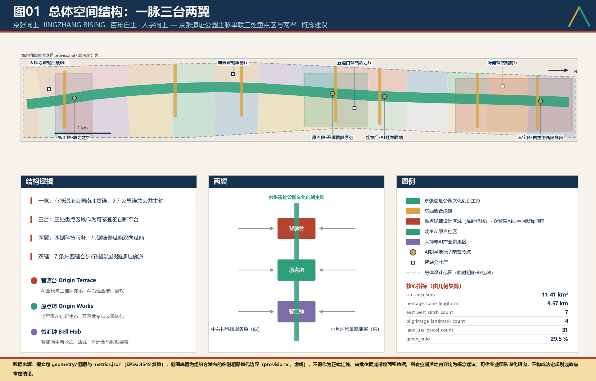
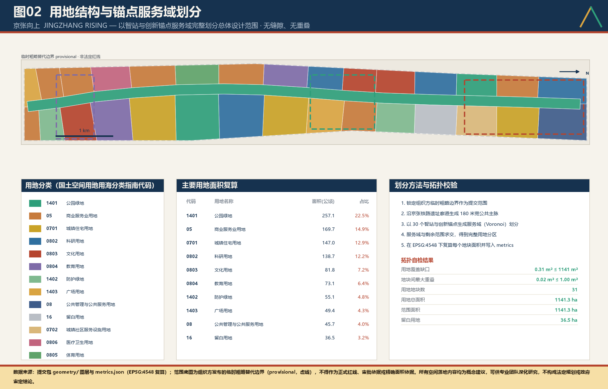
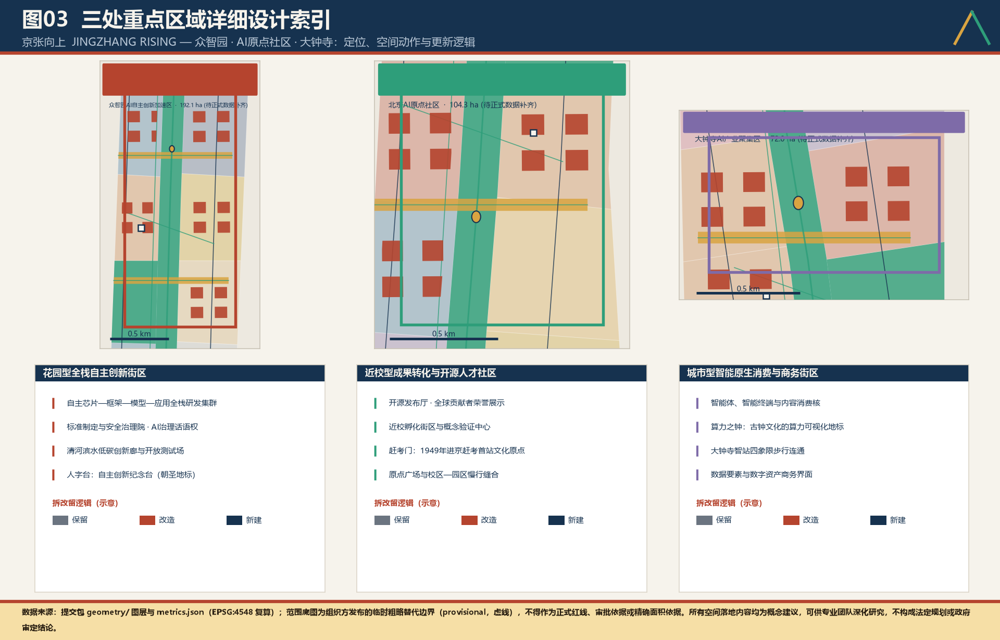
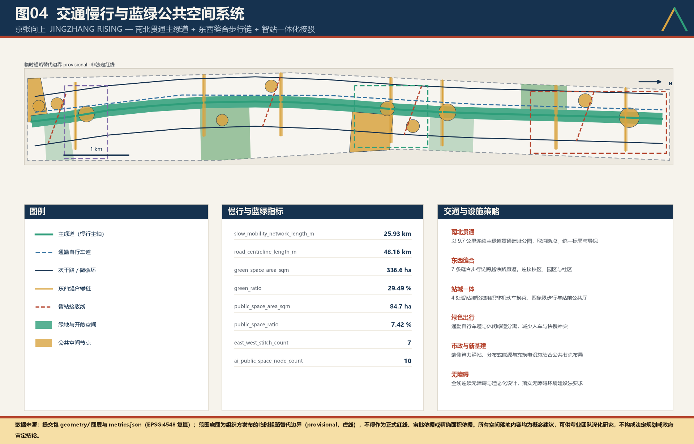
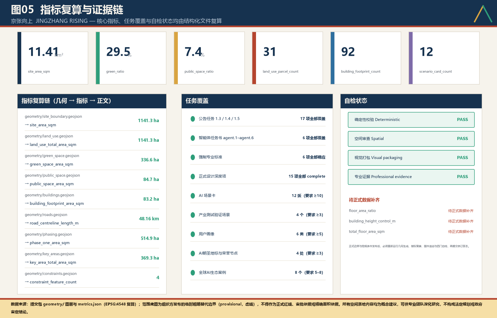

# 京张向上 JINGZHANG RISING

**百年自主，人字向上**

> **一句话方案**：让詹天佑当年"人"字形展线所代表的自主精神，在同一条廊道上，长成中国人工智能的"人"字——**人工智能，为人民**。

**京张向上｜JINGZHANG RISING**
一脉贯通 · 三台起势 · 两翼赋能 · 双缝织城

---

## 设计依据与资料清单

本方案是面向"百年京张AI创新带城市设计开源征集"的智能体方案包，第一依据是组织方发布的征集公告与面向智能体的开源任务书 [source:OFFICIAL-ANNOUNCEMENT] [standard:PROJECT-OFFICIAL-ANNOUNCEMENT]。公告要求成果达到控制性详细规划的城市设计深度与规划综合实施方案的城市设计深度，因此本包不以文字愿景为终点，而以"可复算的结构化证据"为交付底座。

任务分解、必答项与禁止性表述来自开源任务书 [source:AGENT-TASKBOOK] [standard:PROJECT-AGENT-OPEN-CALL-TASKBOOK]。场地枚举、允许设计空间、指标口径与 schema 来自站点资料包 [source:SITE-PACKAGE]。资料的用途边界由登记表约束：background_only 与 provisional_only 资料不得被升级为官方边界、法定控规或政府实施承诺 [source:SOURCE-REGISTRY]。阅读导航层仅用于组织方案，不构成新的权威来源 [source:PROCESSED-FACT-PACK]。

**关于边界的诚实声明。** 官方 `SITE_BOUNDARY` 与三处 `KEY_AREA` 的正式 polygon 尚未发布，本包采用组织方登记的临时粗略替代边界 [source:BOUNDARY-SOURCE] [source:KEY-AREA-SOURCE]。因此提交包中 `geometry/site_boundary.geojson` 与 `geometry/key_areas.geojson` 均标注 `official_boundary=false`、`geometry_role=provisional_constraint`。全部空间成果仅为**概念建议**，可供专业团队深化研究，不得作为正式红线、审批依据或精确面积依据 [assumption:A-CONTROLS-001]。

范围面积由几何复算 [data:geometry/site_boundary.geojson#SITE-001] [metric:site_area_sqm]；重点区数量与总面积由独立图层核对 [data:geometry/key_areas.geojson#PROV-KEY-001] [metric:key_area_count]。官方 polygon 一经发布，本包必须整体重跑几何生成、指标复算、图纸与 HTML 生成，而不是替换单个文件 [depth:existing_conditions_diagnosis]。

**方法论声明。** 本方案由 AI agent 依据公开资料与本包结构化数据生成：先锁定边界与约束，再生成用地、建筑、道路、绿地、公共空间、分期与AI服务节点图层，最后从图层反向复算全部指标写入 `metrics.json`。凡不能从结构化数据复算的面积、比例、规模、项目数量，一律不写入结论；凡涉及容积率、建筑限高、拆除决策、道路红线的量化控制，一律标注为 `unknown` 并交由后续法定程序确定 [standard:MOHURD-CONTROL-DETAILED-PLANNING]。

| 依据层级 | 内容 | 本包落点 |
| --- | --- | --- |
| 征集要求 | 公告 1.3/1.4/1.5 任务与 agent.1–agent.6 | `compliance_matrix.json` 23 条逐条映射 |
| 技术标准 | 城市设计管理办法、控规、用地分类、设计深度 | `standard_matrix.json` 6 项 |
| 设计深度 | 现状诊断至风险清单共 15 项 | `design_depth_matrix.json` |
| 空间证据 | 9 个图层、31 个地块、92 栋建筑 | `geometry/` |
| 数量证据 | 33 项指标，其中 30 项 known | `metrics.json` |

## 三层范围工作框架

公告确立的三层范围，在本方案中被翻译为三种**不同性质的工作**，而非三张比例不同的图 [depth:three_level_scope_framework]。

**统筹研究范围（约 43.6 km²）解决"为什么"。** 它回答海淀AI创新生态在国家自主创新格局中的位置、创新链与产业链如何在空间上咬合、适配AI新质生产力的未来城市形态是什么。这一层输出的是战略判断、命名系统、生态机制与国际叙事，不落红线。

**总体设计范围（11.41 km²）解决"怎么长"。** 它把战略判断落成可校验的空间结构：用地分区、更新框架、交通市政支撑、蓝绿公共空间与城市风貌控制。这一层是本包全部 GeoJSON 图层的作用域 [data:geometry/land_use.geojson#LU-SPINE-001] [metric:land_use_total_area_sqm]。

**重点区域范围（3 处，合计约 369.3 公顷）解决"怎么做"。** 它把结构落到街坊、地块、建筑、公共空间与场景，验证可实施性 [data:geometry/key_areas.geojson#PROV-KEY-002] [metric:key_area_total_area_sqm]。

三层之间是**双向校验**关系：上一层的战略若无法在下一层落成可复算的空间，则战略被判定为空洞并回退修改；下一层的空间若无法回溯到上一层的战略与来源，则空间被判定为任意并删除。这一约束在 `compliance_matrix.json` 中以"章节—图层—指标—图纸—HTML"五元组固化，任何一环缺失即视为该任务未覆盖 [depth:overall_spatial_structure]。

| 层级 | 核心设问 | 本方案回答 | 结构化落点 |
| --- | --- | --- | --- |
| 统筹研究范围 | AI创新生态与未来城市形态如何组织 | 全栈自主创新链 + 四个原点文化叙事 + 全球活动体系 | `compliance_matrix.json`、`standard_matrix.json` |
| 总体设计范围 | 产业、更新、交通市政、风貌如何落图 | 一脉三台两翼双缝，31 地块完整划分 | [data:geometry/land_use.geojson#LU-001] [data:geometry/roads.geojson#ROAD-001] |
| 重点区域范围 | 三处片区如何达到详细设计深度 | 智源台、原点坊、智汇钟三套动作 | [data:geometry/key_areas.geojson#PROV-KEY-003] |

## 统筹研究范围产业与未来城市研究

### 一、总体定位：中国AI自主创新的"原点走廊"

**"百年自主"不是修辞，是两份相隔一百年的国家级事实。**

1909 年，京张铁路建成通车。它是中国人自行勘测、设计、施工的第一条铁路干线，工程主持者詹天佑在关沟段以"人"字形展线与竖井施工法，翻越了当时被外国工程师断言中国人无法逾越的陡坡，且比原定工期提前两年建成。

2009 年 3 月 13 日，国务院发布《关于同意支持中关村科技园区建设国家自主创新示范区的批复》，将中关村科技园区正式定位为"中关村国家自主创新示范区"。**"自主创新"四个字，由此写进了一个国家级园区的正式名称。**

两件事相隔整整一百年，发生在同一条走廊上：一次是在铁轨上证明中国人可以自主，一次是在国家制度上确认这里承担自主创新的示范责任。今天，同一条走廊要回答第三个问题——**人工智能能不能自主，并且自主之后为谁所用。**

因此本方案提出总体定位：

> **百年京张AI创新带 = 中国AI自主创新的"原点走廊"**
> 从"自主修铁路"到"自主造智能"，从"人"字形到"人工智能"，从技术自主到人民城市。

这一定位对应三个可检验的功能命题 [source:AGENT-TASKBOOK]：

1. **原点性**——这里是中国科技创业与人工智能最早的策源地之一，应承担"从 0 到 1"的策源功能，而非承接外溢。制度谱系可查：1988 年国务院批准建立北京市新技术产业开发试验区，这是中国第一个国家级高新技术产业开发区；1999 年国务院批复建设中关村科技园区；2009 年批复建设中关村国家自主创新示范区。三次批复，一条清晰的国家意志曲线。
2. **自主性**——这里应形成芯片与算力、框架与模型、数据与语料、场景与应用的**全栈自主**闭环，成为加快实现高水平科技自立自强的空间样板 [standard:PROJECT-OFFICIAL-ANNOUNCEMENT]。
3. **人民性**——AI 的成果必须首先被这条带上的居民、学生、老人、创业者感知到，把"人民城市人民建、人民城市为人民"落到可触摸的公共空间，而不是停留在产业指标里。

### 一之二、北京的第三条百年线：把这条走廊放回北京的空间谱系

北京的城市秩序，历来由"线"来组织。理解这条走廊的分量，必须把它放回北京自身的空间谱系中，而不是与其他城市的科技园区比较。

| 线 | 时间尺度 | 空间性格 | 承载的城市职能 |
| --- | --- | --- | --- |
| 中轴线 | 逾六百年 | 正南正北，礼制秩序 | 全国文化中心的空间脊梁 |
| 长安街 | 逾七十年 | 正东正西，国家形象 | 全国政治中心的空间界面 |
| **京张线** | **逾一百年** | **西北斜向，工程理性** | **国际科技创新中心的空间载体** |

2024 年 7 月，"北京中轴线——中国理想都城秩序的杰作"列入《世界遗产名录》，全长约 7.8 公里，被公认为中国理想都城秩序的集中体现。中轴线之所以伟大，在于它表达的是**人对秩序的安排**：以人的意志确立方位、等级与礼制。

京张线表达的是另一件同样伟大的事：**人对现实条件的顺应与超越**。它不能取直——地形不允许；于是它折返、爬坡、绕行，用工程理性在既有约束下把列车送上去。中轴线是"正"，京张线是"折"；一个是礼序，一个是工程。**两者共同构成北京完整的城市精神：既有安排秩序的能力，也有面对现实的诚实。**

需要明确声明：本方案**不主张**新增任何法定轴线。《北京城市总体规划（2016 年—2035 年）》确立的"一核一主一副、两轴多点一区"空间结构是法定框架，"两轴"指中轴线及其延长线、长安街及其延长线，本方案完全遵循 [standard:MOHURD-URBAN-DESIGN-MEASURES] [assumption:A-CONTROLS-001]。此处所述"第三条百年线"是**文化谱系意义上的定位判断**，用以说明这条走廊在北京城市精神中的位置与量级，为其风貌标准、投入强度与叙事高度提供依据，不构成对法定空间结构的增补或修改。

这一定位判断的直接推论是：**这条走廊的设计标准，应当对标中轴线，而不是对标产业园区。** 它的公共空间要经得起一百年后的检视，它的地面材料、构筑物比例、导视系统与命名体系都应按文化线路而非厂区配套来要求。这也是本方案坚持"四个原点"可步行叙事、坚持折角几何统一语汇、坚持地标而非招牌的根本原因 [depth:height_massing_character]。

### 二、五大功能与"三区两翼"协同

方案将公告要求的五大功能落位为可空间化的层级 [standard:PROJECT-AGENT-OPEN-CALL-TASKBOOK]：

| 功能 | 空间承载 | 判定标准 |
| --- | --- | --- |
| 原始创新策源 | 智源台 + 近校研发街坊 | 科研用地规模 [metric:research_land_area_sqm] |
| 成果转化与孵化 | 原点坊 + 中关村科技服务翼 | 商业服务业用地规模 [metric:commercial_service_land_area_sqm] |
| 智能原生新业态 | 智汇钟 + 站城一体节点 | AI公共服务节点数 [metric:ai_public_space_node_count] |
| 全域场景开放 | 遗址公园主脉 + 小月河场景赋能翼 | 场景卡数量 [metric:scenario_card_count] |
| 国际交流与文化传播 | 四处朝圣地标 + 全球活动体系 | 朝圣地标数 [metric:pilgrimage_landmark_count] |

**"三区"** 即三处重点区域，是创新势能的三级台阶；**"两翼"** 指西侧中关村科技服务翼（依托高校院所与科技服务业，向带内输送人才、资本、法务、标准服务）与东侧小月河场景赋能翼（依托居住社区与生活服务，向带内输送真实场景、真实数据与真实用户）。两翼与主脉之间由 7 条东西缝合链贯通 [metric:east_west_stitch_count]。

### 三、AI全栈自主创新体系

本方案主张创新带的产业组织不按"行业"划分，而按**自主技术栈的层级**划分，使每一层都在空间上有明确的承载与相邻关系 [source:PROCESSED-FACT-PACK]：

| 技术栈层 | 空间承载建议 | 相邻性诉求 |
| --- | --- | --- |
| 算力与芯片 | 智源台北段研发街坊、端侧算力驿站网络 | 靠近能源与市政干线 |
| 框架与工具链 | 智源台中段开源工程集群 | 靠近开源发布厅 |
| 基础模型与语料 | 原点坊近校研发带 | 靠近高校与语料合规机构 |
| 行业模型与应用 | 智汇钟产业聚集区、两翼企业 | 靠近真实场景与用户 |
| 标准、安全与治理 | 智源台标准与治理院 | 靠近国际交流设施 |
| 开源社区与人才 | 原点坊开源社区街坊 | 靠近公共空间与住房 |

这一"分层而不分割"的组织方式，使自主创新链条的每一次跃迁都发生在**步行可达**的范围内。全栈六层的空间承载全部落在总体设计范围内的科研、商业服务业与公共管理用地上 [data:geometry/land_use.geojson#LU-002]。

### 四、适配AI新质生产力的未来城市形态

方案提出面向AI时代的六条城市形态原则 [depth:overall_spatial_structure]：

1. **可测试性优先**——街道、广场、园区首先是可被合法申请、可被真实使用的测试场，而非仅供观赏的景观。
2. **算力如同水电**——端侧算力、边缘节点与数据接口随公共节点布设，成为新型市政设施而非孤立机房。
3. **混合而非分区**——研发、居住、服务、公共空间高度混合，压缩通勤，支持"十五分钟创新生活圈"。
4. **数据可见可控**——公共空间中的感知设施必须可被识别、可被解释、可被拒绝，保障个人信息权益。
5. **弹性留白**——为无法预判的技术形态预留可变用地 [metric:reserved_land_area_sqm]。
6. **人本尺度不被技术稀释**——技术密度上升，街道尺度、绿荫与座椅密度同步上升。

### 五、全球对标：八个案例与本方案的差异化

方案系统比较了八个全球创新区案例 [metric:ecosystem_case_count]，用以确认本带不可复制之处：

| 案例 | 可借鉴 | 本带差异 |
| --- | --- | --- |
| 硅谷—斯坦福 | 大学—资本—企业的旋转门 | 本带须以国家自主战略统领，而非纯市场驱动 |
| 伦敦 King's Cross 知识区 | 铁路遗产转型为知识社区 | 本带遗产的**自主叙事**更强，非单纯工业美学 |
| 蒙特利尔 MILA | 高校主导的AI集群与人才政策 | 本带须覆盖全栈而非偏重算法 |
| 巴黎 Station F | 超大规模孵化器的单体聚集 | 本带采用线性多锚点，避免单点垄断 |
| 新加坡 one-north | 政府规划主导的产研混合街区 | 本带须在既有建成区中做更新，而非新城 |
| 东京站城一体开发 | 轨道站点与城市功能的立体缝合 | 本带以遗址公园地面公共性为主，慎用地下巨构 |
| 上海张江人工智能岛 | 应用场景的集中示范 | 本带强调开放街区而非封闭园区 |
| 深圳河套 / 西丽湖 | 跨境与产学研协同机制 | 本带以文化原点叙事作为独有资产 |

**八个案例只做横向扫描不够。** 其中三个与本带在"铁路遗产 + 创新功能 + 既有社区"这三重条件上高度可比，值得逐案读透其代价与教训，而不只是摘取其成功表象。

**案例一：伦敦 King's Cross 知识区——最像本带，也最需警惕。**

可比性在于：它同样是把一片铁路用地与历史站房改造为知识与创意功能聚集区，同样保留了大量工业遗构，同样嵌在既有城市肌理中而非新城。可借鉴之处在于其**分期极长而骨架先行**：公共空间、步行连接与开放广场在大量商业物业之前建成，使街区在招商完成前就已具备公共价值。

但必须正视其代价：该区域在更新过程中长期面临"绅士化"批评，即原有低收入居民与小型业态被逐步置换，公共可达但实际使用者结构发生显著变化。**对本带的教训是明确的**：公共空间的物理可达不等于社会可达。本方案因此把"本地既有居民"列为六类使用者之一并置于底线位置，把人工兜底写成硬性条款，并要求评议参与者结构公开——这些都是针对绅士化风险的直接设防 [depth:renewal_project_list]。

**案例二：新加坡 one-north——政府规划主导的产研混合街区。**

可比性在于：它同样由政府主导、同样强调产研混合、同样以步行街区尺度组织而非大院模式。可借鉴之处在于其**功能配比的长期弹性**：地块功能允许在研发、办公、居住、服务之间按周期调整，避免一次性锁死。

但其条件与本带有一项根本差异：one-north 基本是在低强度用地上新建，而本带是在高密度建成区中做更新，涉及既有权属、既有居民与既有业态。**因此本方案不照搬其街区模板，而只借鉴其弹性配比逻辑**，并体现为主动保留的弹性留白用地 [metric:reserved_land_area_sqm]。这是一个诚实的判断：新城经验不能直接用于旧城更新。

**案例三：东京站城一体开发——立体缝合的经验与地面公共性的取舍。**

可比性在于：本带南端的智汇钟片区同样面临轨道站点与城市功能的复合问题。可借鉴之处在于其**换乘效率与垂直连接的成熟度**。

但其代价同样明显：高强度地下与空中系统往往以牺牲地面街道的公共性为代价，行人被引导进入商业化的室内动线，城市的"露天生活"被削弱。**本带的核心资产恰恰是一条露天的、连续的、免费的遗址公园主脉。** 因此本方案明确取舍：站城一体仅在智汇钟片区局部采用，且以**不切断主脉地面连续性、不将地面人流强制导入室内**为前提条件 [depth:traffic_rail_slow_parking]。

**三案的共同启示，构成本方案的三条自我约束**：

1. 骨架先行，但骨架必须同时是**社会骨架**，而不只是物理骨架（King's Cross）；
2. 借鉴弹性，但不照搬新城模板到旧城更新（one-north）；
3. 追求效率，但不以地面公共性为代价（东京）。

**结论：本带唯一不可被复制的资产，是"百年自主"的历史正当性与"人"字符号。** 因此命名、logo、地标、活动体系必须围绕这一资产建立，而非追随通用科技园区语汇。

### 六、命名系统与视觉识别

**总名称：京张向上｜JINGZHANG RISING。** 副题"**百年自主，人字向上**"。

"向上"一词承担三重含义，且三重含义指向同一件事：

- **人字向上**——"人"字由两笔自下而上折返交汇而成，字形本身就是一个向上的动作；
- **爬坡向上**——詹天佑的展线不是装饰，是为了在既有地形条件下把列车送上坡，是工程理性对现实的顺应与超越；
- **昂扬向上**——一个国家在关键技术上从受制于人走向自主，其精神状态就是向上。

命名不取"脉""轨""链"等通用技术语汇，因为这些词描述的是形态；"向上"描述的是**方向**。本方案主张：一条创新带的价值不在于它长什么样，而在于它把人和产业带向哪里。

**命名系统**沿用京张铁路"站"的传统，形成可扩展的序列，使全带节点在语言上自成体系 [source:AGENT-TASKBOOK]：

| 层级 | 命名法 | 示例 |
| --- | --- | --- |
| 带 | 京张向上 | JINGZHANG RISING |
| 台（重点区） | 智源台 / 原点坊 / 智汇钟 | Origin Terrace / Origin Works / Bell Hub |
| 站（公共节点） | 地名 + 智站 | 五道口智站、知春智站、清河智站、大钟寺智站 |
| 标（朝圣地标） | 单字 + 台/门/钟/碑 | 人字台、赶考门、算力之钟、原点碑 |
| 缝（东西链） | 序号 + 缝合链 | 一号缝合链至七号缝合链 |

**Logo 设计方向。** 以"人"字为唯一母题：两笔由左下与右下向上折返交汇，交汇点向上出头，形成"人"；两笔之间的负形自然构成字母"A"（AI / Autonomy / Advance）。折返处保留一个明显的**折角**，使懂的人一眼认出其工程渊源，不懂的人也读得出"向上"。标准色：钢青 `#16324F`（铁轨与理性）、砖红 `#B5442E`（京张老站砖与热忱）、智绿 `#2E9E7A`（遗址公园与生态）、荣誉金 `#D9A441`（贡献与荣誉）。

Logo 不仅是平面图形，同时是**可建造的空间原型**：人字台的挡墙、赶考门的门架、缝合链的桥体断面、导视系统的箭头，均由同一折角几何派生，使品牌与空间同源。

### 七、一条必须写明的界线：符号可以引用，地理不能附会

"人"字形展线位于**延庆区青龙桥车站**，是京张铁路关沟段为翻越八达岭陡坡而设的折返展线，距本次总体设计范围直线距离数十公里，**不在本次设计范围之内**，也不在京张铁路遗址公园海淀段之内 [source:SITE-PACKAGE]。

本方案因此作出明确区分：

- **可以引用的**："人"字所承载的自主精神、折返上坡所体现的工程理性、以及由此派生的**折角几何**这一视觉母题；
- **不可附会的**：任何把"人"字形展线当作本场地空间结构、路网形态或用地肌理的图解。本方案的空间结构是"一脉三台两翼双缝"，由场地自身的南北狭长形态、既有铁路廊道走向与东西向割裂现状决定，**与展线几何无关**。

作出这一区分，是因为城市设计的说服力建立在事实的准确上。一个把六十公里外的工程遗迹画进本场地结构图的方案，即便图面漂亮，也无法通过专业审视 [standard:MOHURD-URBAN-DESIGN-MEASURES]。本方案宁可少一层形式呼应，也不牺牲事实的严谨 [assumption:A-CONTROLS-001]。

## 区域协同：让"京张"从历史名词变回功能关系

### 一、为什么必须回答区域协同

"京张"是一个**双端地名**。多数方案只用了"京"这一端，把"张"当作历史修辞消费掉。本方案认为这是最大的浪费：**张家口不是京张故事的背景板，它是今天AI基础设施的另一半。**

一条创新带如果只在海淀内部闭环，它是一个园区；只有当它承担起走廊两端的分工，它才配称"带"。京津冀协同发展于 2014 年 2 月上升为国家战略，2015 年 4 月中央政治局会议审议通过《京津冀协同发展规划纲要》，明确了战略目标与重点任务。本方案的区域协同不是附加章节，而是"京张"这个名字的**履约条件**。

### 二、算法在海淀，算力与绿电在张家口

这是本方案区域协同的**硬内核**，它建立在两项可核验的公共政策事实上：

**其一，张家口是国家算力布局中的实体节点。** 东数西算工程于 2022 年 2 月 17 日正式全面启动，全国布局 8 个国家算力枢纽节点、10 个国家数据中心集群；**张家口数据中心集群**是**京津冀国家算力枢纽节点**下辖的数据中心集群之一。

**其二，张家口是国家批复的可再生能源示范区。** 2016 年 1 月 8 日，国务院以国函〔2016〕5 号批复同意设立**张家口可再生能源示范区**。（须注意：其法定名称为"张家口可再生能源示范区"，不含"国家级"三字，本方案不作拔高表述。）

两项事实叠加，得到一个在全国范围内都罕见的组合：**一个距首都不足两百公里、拥有丰富可再生能源、并已被纳入国家算力枢纽的算力承载地。** 而海淀拥有的是另一端——算法、模型、人才与开源生态。

因此本方案提出走廊两端的分工：

| 端 | 承担 | 空间落点 | 为什么在这端 |
| --- | --- | --- | --- |
| 海淀端（本设计范围） | 算法、模型、标准、人才、开源治理、场景验证 | 智源台 / 原点坊 / 智汇钟 | 高校院所与企业总部密集，属"人跟着知识走"的高密度智力空间 |
| 张家口端（协同区域，不在本设计范围） | 大规模训练算力、绿电供给、高能耗后台 | 张家口数据中心集群（既有国家布局） | 气候冷凉利于散热、可再生能源充裕、已获国家算力枢纽定位 |

**这一分工同时回答了一个海淀绕不开的现实约束：减量发展。** 北京实施减量发展，海淀的土地与能耗指标极其紧张。把高能耗的训练算力硬塞进海淀，既不符合减量导向，也不经济。**把算力放到张家口，把算法留在海淀，是同一条走廊内部的合理分工，而不是把问题推给邻居。**

**必须说明的边界：** 张家口端**不在本次城市设计范围内**，本方案不对张家口提出任何用地、指标或建设安排，也不代任何一方作出承诺。本方案在海淀端能做的，是把"承接这一分工"所需的空间与制度接口预留出来——即下述"三个接口"。

### 三、海淀端为区域协同预留的三个接口

**接口一：算力调度接口（智汇钟）。** 在智汇钟设"算力调度与绿电核算窗口"，面向本带企业提供"本地推理＋异地训练"的一站式调度对接，并公示每一笔调度的绿电占比。让开发者不必自己去谈机房，把跨区域协同变成一项**可点单的公共服务**。

**接口二：标准互认接口（智源台）。** 智源台承担标准治理职能，其输出的模型评测、安全评估与数据合规口径，向走廊北端开放互认。标准如果只在海淀有效，它就只是园区规范；能被走廊另一端采用，它才是**走廊标准**。

**接口三：人才双向接口（原点坊）。** 设"走廊工位"制度：在原点坊登记的开源团队，可申请在协同区域的算力节点获得短期驻留与算力配额；反向亦然。人才流动是协同最真实的指标，**看的是人来不来，不是文件签没签**。

### 四、与北京"三城一区"及邻近区域的关系

北京构建了以**中关村科学城、怀柔科学城、未来科学城（位于昌平）和北京经济技术开发区（亦庄）**为核心的"**三城一区**"创新发展格局。本设计范围位于中关村科学城范围内，因此本方案的定位必须是**补位而非另起炉灶**：

- 对**怀柔科学城**：怀柔以大科学装置与基础研究见长，本带承接的是其成果向产业与场景的转化下游，不重复布局大科学装置。
- 对**未来科学城（昌平）**：昌平以能源、医药等产业化平台见长，本带与之形成"通用AI能力供给—行业场景落地"的上下游关系。
- 对**北京经济技术开发区（亦庄）**：亦庄承担高端制造与智能网联汽车的规模化落地，本带输出算法与标准，不争夺制造用地。
- 对**延庆**：延庆是京张铁路"人"字形展线所在地与冬奥赛区，与本带构成同一条铁路遗产线上的**文化叙事协同**，而非产业协同。本方案已在前文明确，展线不构成本场地的空间结构依据。

京张高铁于 2019 年 12 月 30 日开通运营，连接北京 2022 年冬奥会的北京、延庆、张家口三大赛区。**这条高铁使"走廊两端一小时可达"从愿景变成既成事实**，也使上述分工具备了通勤与运维层面的现实基础。（须注意：北京 2022 年冬奥会的官方主办城市为北京，张家口为赛区之一，本方案不使用"联合主办"表述。）

## 国际传播：把"可复现"作为国际语言

本带的国际传播不依赖宣传片式的形象输出，而依赖**一件可被外部独立验证的事**：本方案的全部空间结论都可以被第三方用本包图层重算一遍。

**三条国际传播路径：**

**第一，双语原生交付。** 本方案的中英文均为原生撰写而非机器回译，图件、图纸、HTML 与影片均提供对应语言版本。国际同行读到的不是摘要，是完整方案。

**第二，开源可复现。** 指标由图层复算、方法在正文写明、不可复算项标注 unknown——这套做法本身就是对国际专业界最有效的表达。**一个愿意公开自己"不知道什么"的方案，比一个所有数字都完美的方案更可信。**

**第三，以"人工兜底与公开答卷"作为可输出的制度样本。** 全球城市都在面对同一个问题：AI 进入公共服务后，出错了谁负责。本方案给出的答案是一套可复制的最低要求，而非一句原则宣示。这是本带最有可能被国际引用的部分，也是"中国方案"最有说服力的表达方式——**不是宣布我们做到了，而是公开我们怎么做、以及做不到时怎么办**。

## 长效运营：让这条带在十年后仍然有人管

城市设计最常见的失败不是建不成，而是**建成之后没有人对它的持续运转负责**。本方案提出三项长效运营机制。

**其一，运营主体先于建设确定。** 三台各自明确运营责任主体与考核口径，在开工前落实，不采取"先建后找人管"的顺序。凡未明确运营主体的项目，不进入实施清单。

**其二，公共回报与退出条件写进准入。** 前文"公开答卷"六项中的"公共回报"与"退出条件"两项，同时作为入驻主体的准入条件：享受本带公共资源的主体，须公示其向公众提供的回报（如开放算力时段、公益场景、面向居民的培训名额），并预先约定达不到时的退出方式。**没有退出条件的准入，等于没有约束。**

**其三，年度公开复算。** 每年以同一套脚本对图层与指标重算一次并公开结果，与上一年度对比。指标可以变化，但**变化必须被看见**。这项机制同时使本方案在官方 `SITE_BOUNDARY` 与 `KEY_AREA` polygon 发布后，能够整体重跑而非局部打补丁 [depth:existing_conditions_diagnosis]。

## 总体设计范围城市更新与控规深度城市设计

### 一、总体空间结构：一脉三台两翼双缝

总体设计范围为南北向狭长地带，面积 11.41 平方公里 [metric:site_area_sqm]。方案确立的空间结构为：

**一脉**——以京张铁路遗址公园为文化创新主脉，南北连续贯通 9.57 公里 [metric:heritage_spine_length_m]，主脉带状空间面积 172.33 公顷 [metric:heritage_spine_area_sqm]。主脉是全带唯一的"连续公共物"，任何开发不得打断。

**三台**——智源台、原点坊、智汇钟，由北向南依次布局，构成可攀登的三级创新平台。"台"的选词有意区别于"园区"：园区是围合的，台是开放且可登临的。

**两翼**——西侧中关村科技服务翼、东侧小月河场景赋能翼，双向为主脉输血。

**双缝**——南北缝合（主脉连续绿道）与东西缝合（7 条跨廊道步行链），共同消解铁路廊道百年来造成的东西向割裂 [data:geometry/green_space.geojson#GREEN-STITCH-01]。

### 二、四个原点：文化叙事的空间锚定

方案将百年京张文化、中关村文化与AI新文化融合为一条可步行阅读的**"四个原点"文化线索**，这是本带区别于任何其他创新区的核心叙事 [depth:blue_green_public_space]：

| 原点 | 年份 | 历史含义 | 空间锚定 |
| --- | --- | --- | --- |
| **自主原点** | 1909 | 京张铁路建成，中国人自行勘测、设计、施工的第一条铁路干线 | 人字台·自主创新纪念台 |
| **赶考原点** | 1949 | 中共中央进驻北平，专列抵达清华园车站 | 赶考门·AI赶考驿站 |
| **创新原点** | 1980 | 中关村第一家民营科技机构创立，中国科技创业的开端 | 智汇钟·算力之钟 |
| **AI原点** | 2026— | 中国AI全栈自主与开源生态的策源起点 | 原点碑·开源贡献原点 |

四个原点由主脉串联，形成一条约 9.6 公里的"**原点之路**"。方案建议在地面铺装中嵌入一条连续的金属"人"字带，四处原点各设一枚可触摸的铜质原点标记，使叙事无需依赖解说牌即可被身体阅读。

**关于赶考原点的特别说明：这是本场地上最被低估的资产。**

1949 年 3 月 23 日，中共中央由西柏坡启程前往北平，出发时留下了"进京赶考"的著名表述；3 月 25 日，专列抵达**清华园车站**。这座车站是京张铁路的原始站点之一，站房旧址就在本次总体设计范围之内，位于京张铁路遗址公园海淀段沿线 [source:SITE-PACKAGE]。

这意味着一件在全国范围内都极为罕见的事：**同一条铁路走廊，同时承载了中国工程自主的起点（1909）与中国共产党执政的起点（1949）。** 京张铁路遗址（含清华园车站、原西直门车站等）为全国重点文物保护单位；2021 年，京张铁路遗址公园向公众开放，清华园车站旧站房经修缮后作为"进京赶考"主题展陈空间对外开放。

本方案据此提出"赶考原点"的当代含义：**技术自主不是一次通关，而是一场必须常考常新的赶考。** 具体转译为三条设计原则，全部可落到空间与制度：

1. **有考场**——赶考门不是纪念性门架而已，其两侧结合原点坊布置"AI 赶考驿站"：常设面向公众开放的 AI 服务体验与评议场所，居民可现场试用、现场提意见，意见按季度公开汇总。
2. **有考卷**——每一项进入本带公共空间的 AI 服务，须公开其服务承诺、数据来源、人工接管方式与失败记录（详见后文"人工兜底与公开答卷制度"）。
3. **有考官**——评议主体不是行业专家，而是本带的实际使用者：居民、学生、老人、创业者、通勤者与来访者。

需要说明的是：本方案对这一历史资源的使用严格限于**公开史实的空间转译与纪念性表达**，不作任何政治宣示，不虚构史料，不改变文物本体，一切文物相关动作须依《中华人民共和国文物保护法》与文物主管部门要求另行报批 [assumption:A-CONTROLS-001]。

### 三、用地布局与划分方法

用地划分不采用任意分区，而采用**锚点服务域**方法，使每一块用地都能回答"它服务于哪个节点、步行多久可达"：

1. 锁定组织方临时粗略边界作为提交范围；
2. 沿铁路遗址廊道生成 180 米宽公共主脉；
3. 以 30 个智站与创新锚点为种子生成 Voronoi 服务域；
4. 服务域与主脉之外的剩余范围求交，形成完整用地分区；
5. 在 EPSG:4548 投影下复算每个地块面积并写入指标。

该方法保证用地划分**完全覆盖、互不重叠**：共 31 个地块 [metric:land_use_parcel_count]，用地总面积 [metric:land_use_total_area_sqm] 与范围面积的覆盖缺口为 0.31 平方米，地块间最大重叠 0.02 平方米，均远低于评审容差 [depth:land_use_layout]。用地代码采用国土空间用地用海分类指南口径 [standard:MNR-LAND-USE-CLASSIFICATION-GUIDE]。

### 四、开发强度：明确的"不回答"

方案**不提出**容积率、建筑限高与总建筑面积的量化结论。理由是：这些指标属于法定控规的控制内容，在官方边界、现状建筑普查、产权与市政承载力资料公布前，任何数值都是不负责任的猜测。因此 `metrics.json` 中 `floor_area_ratio`、`building_height_control_m`、`total_floor_area_sqm` 三项均标注为 `unknown`，并附明确的复算触发条件 [depth:development_intensity_controls] [standard:MOHURD-CONTROL-DETAILED-PLANNING]。

方案改为提出**强度组织的原则**，供后续专业团队在法定程序中赋值：主脉两侧 100 米内为低强度公共界面带；三台核心为高强度混合带；两翼衔接既有社区，强度与现状相协调；全带遵循"越近主脉越低、越近轨道站越高"的双重梯度。

### 五、建筑高度、体量与风貌控制原则

建筑覆盖率由几何复算为 7.29% [metric:building_coverage_ratio]，建筑基底总面积 [metric:building_footprint_area_sqm]，共登记 92 栋建筑轮廓 [metric:building_footprint_count]。在此基础上，方案提出风貌控制的四条原则 [depth:height_massing_character] [standard:MOHURD-URBAN-DESIGN-MEASURES]：

1. **主脉视廊不可遮蔽**——沿主脉形成连续的天空视野带，新建体量退让并逐级跌落。
2. **砖红基调延续**——新建建筑的基座材料呼应京张老站的砖红与石材，形成百年时间的连续性。
3. **屋顶第五立面**——主脉两侧建筑屋顶纳入统一设计，作为可被高层与桥体俯瞰的界面。
4. **反对巨构**——鼓励中小体量密路网街坊，反对切断步行网络的超大单体。

具体高度数值须在官方边界与控规条件公布后确定，本方案仅给出**相对关系**而不给绝对值。

## 重点区域详细设计

三处重点区域合计约 369.3 公顷 [metric:key_area_total_area_sqm]，均以临时粗略边界表达，属概念建议 [data:geometry/key_areas.geojson#PROV-KEY-001] [depth:three_key_area_detailed_design]。

### 一、智源台 Origin Terrace（众智园AI自主创新加速区）

**定位**：AI全栈自主创新体系的策源核心与国家级标准治理高地。

**空间动作**：
- 沿清河形成滨水低碳创新廊，研发建筑面水开放，滨水首层全部为公共功能；
- 中部设"全栈街坊"，芯片—框架—模型—应用四类研发主体沿一条 800 米步行轴混合布局，跨层协作在步行三分钟内完成；
- 设标准制定与安全治理院，承担AI治理规则研究与国际对话，是本带争取全球AI治理话语权的空间载体；
- 北端设**人字台**：以青龙桥展线折角为原型的自主创新纪念台，可登临俯瞰全带，是"四个原点"之首 [data:geometry/public_space.geojson#PUBLIC-001]。

**AI+场景**：自动驾驶开放测试路段、无人配送、智能巡检、算力调度可视化。

### 二、原点坊 Origin Works（北京AI原点社区）

**定位**：近校型成果转化与全球开源人才社区，本带"人民性"最集中的体现。

**空间动作**：
- **开源发布厅**：全球中文AI开源项目的常设发布与路演场所，年度开源大会主场；
- **原点碑**：开源贡献者荣誉碑，以电子墨水与铜牌结合的方式，长期滚动记录对本带开源生态有贡献的个人与团队姓名，**让贡献被城市记住**——这是对"贡献可记忆"要求的空间回答 [data:geometry/public_space.geojson#PUBLIC-002]；
- **赶考门**：位于清华园车站旧址方向的门式构筑，纪念 1949 年"进京赶考"的历史时刻，提示技术自主同样是一场必须常考常新的赶考；
- 近校孵化街坊与概念验证中心，提供"宿舍—实验室—工位—路演"步行十分钟闭环；
- 面向青年人才的小户型租赁住房与共享厨房、托育、健身设施，降低创业者生活成本。

**AI+场景**：开源模型评测、青年人才服务智能体、社区共享空间调度、校地协同数据合规实验。

### 三、智汇钟 Bell Hub（大钟寺AI产业聚集区）

**定位**：智能原生新业态与站城一体的消费、数据要素与产业服务枢纽。

**空间动作**：
- 依托轨道与大钟寺文化资源，形成"钟"的空间意象；
- **算力之钟**：以大钟寺"钟"为原型的公共装置，实时可视化本带算力负载、能耗与绿电占比，把不可见的算力变成可被市民围观、讨论、监督的城市景观 [data:geometry/public_space.geojson#PUBLIC-003]；
- 设数据要素交易与合规服务集群，服务于产业模型训练的合法语料供给；
- 智能原生商业街坊：具身智能零售、AI 餐饮、智能体导览等新业态的常态化试营场所；
- 站前四象限步行厅，消解站点对城市的切割。

**AI+场景**：智能体导购、城市运行体检、能耗优化、文旅数字讲解。

### 四、三台的关系

三台不是三个平行园区，而是一条**创新的传送链**：智源台"从 0 到 1"产出自主技术 → 原点坊"从 1 到 10"完成开源与转化 → 智汇钟"从 10 到 N"实现规模化业态与消费。三台之间由主脉绿道与轨道连接，形成可被观察、可被度量的创新流。

## AI 创新生态、人才画像与 AI+ 场景

### 一、六类人才画像

方案以六类人才画像倒推空间与服务供给 [metric:persona_count]，避免"为技术建城"而非"为人建城"：

| 画像 | 核心诉求 | 空间与政策回应 |
| --- | --- | --- |
| **策源科学家**（高校/院所） | 安静、长期、跨学科偶遇 | 近校研发街坊、学术公共厅、长期实验用房 |
| **开源工程师**（社区贡献者） | 低成本、强协作、被看见 | 开源发布厅、原点碑、共享工位、青年租赁住房 |
| **创业者**（初创团队） | 快速验证、找钱找人 | 概念验证中心、路演厅、一站式企业服务 |
| **产业工程师**（企业研发） | 真实场景、真实数据 | 开放测试场、数据合规服务、场景申请通道 |
| **国际人才**（含港澳台及外籍） | 语言友好、生活便利、身份便利 | 双语导视、国际社区、国际交流中心 |
| **本地居民**（含老年人与儿童） | 不被技术排斥、获得实惠 | 无障碍与适老化、AI惠民服务点、数字素养课堂 |

**关键判断**：第六类画像的满意度是本带成败的真正标尺。若一条创新带让本地老人感到被排斥，它在治理意义上就是失败的。因此方案要求每一处AI公共服务节点必须同时提供**人工兜底通道**，AI 不得成为获取公共服务的唯一入口。

### 二、十二张AI+场景卡

方案编制 12 张可运营的场景卡 [metric:scenario_card_count]，每张卡包含场景名称、承载空间、服务对象、数据来源与合规边界。因篇幅所限，正文列出场景清单，完整卡片随本包结构化文件提交 [source:SITE-PACKAGE]：

| # | 场景 | 承载空间 | 主要受益人 |
| --- | --- | --- | --- |
| 1 | AI 慢行导航与无障碍路径推荐 | 主脉绿道全线 | 居民、老人、轮椅使用者 |
| 2 | 遗址公园智能体导览（多语种） | 四个原点沿线 | 游客、学生、国际访客 |
| 3 | 企业服务副驾（政策—场地—资质一站办） | 三台企业服务厅 | 创业者、企业 |
| 4 | 城市运行体检与公共安全复盘 | 智汇钟城市运行厅 | 政府、市民 |
| 5 | 社区AI惠民服务点（挂号、助餐、家政） | 两翼社区节点 | 本地居民、老年人 |
| 6 | 开源模型公共评测与榜单 | 开源发布厅 | 开源社区、研究者 |
| 7 | 自动驾驶与无人配送开放测试 | 指定测试路段 | 企业、物流 |
| 8 | 算力负载与绿电可视化 | 算力之钟 | 市民、监管 |
| 9 | 青年人才落地服务智能体 | 原点坊人才厅 | 青年人才 |
| 10 | 校地科研数据合规撮合 | 近校研发带 | 高校、企业 |
| 11 | 智能巡检与设施预测性维护 | 全带市政设施 | 运维单位 |
| 12 | 数字素养与AI通识课堂 | 社区文化设施 | 全龄居民 |

### 三、四类产业级测试场景

在 12 张民生与产业场景卡之上，方案另设 4 类**产业级测试场景** [metric:industry_test_scenario_count]，用于验证自主技术栈的真实性能：全栈自主软硬件适配验证、大模型长周期真实业务压测、具身智能在复杂公共空间的安全测试、城市级多智能体协同调度演练。这四类测试须由专门机构在明确授权与安全边界内组织，方案仅提出空间与制度需求，不作技术承诺。

### 四、人工兜底与公开答卷制度：本方案的治理内核

前述场景、地标与空间结构，若没有一套可执行的制度约束，都会退化为展示。本节提出本方案的治理内核，它是"赶考原点"在制度层面的落点，也是本方案区别于一般AI园区规划的关键 [depth:risk_missing_data] [standard:PROJECT-AGENT-OPEN-CALL-TASKBOOK]。

**制度的一句话表述：在这条带上，任何面向公众的 AI 服务都必须同时具备"人工兜底通道"与"公开答卷"，二者缺一不得上线。**

#### 4.1 人工兜底通道（Human Fallback Lane）

**定义**：每一处提供公共服务的 AI 节点，必须在**同一物理位置、同一服务时段**内，提供一条不依赖智能手机、不依赖账号注册、不依赖生物识别、不依赖算法判断的人工服务路径，且该路径必须能独立完成全部核心服务事项。

这条通道有五项硬性要求，建议纳入本带公共空间的设计与验收条件：

| 要求 | 内容 | 空间含义 |
| --- | --- | --- |
| 同址 | 人工通道与 AI 通道在同一场所内，步行可达，不得设在另一栋楼或另一时段 | 平面设计须预留人工工位与等候空间 |
| 同时 | 人工通道的服务时段不短于 AI 通道 | 影响运营人员配置与轮班 |
| 同权 | 通过人工通道办理的事项，结果、时限与费用不低于 AI 通道 | 制度设计，非空间 |
| 显著 | 人工通道的标识尺寸、位置显著性不低于 AI 通道 | 导视系统统一规定 |
| 可切换 | 使用 AI 通道过程中随时可转入人工，且不需重新排队 | 动线设计须支持横向转接 |

**为什么把它写成硬性条款而不是倡议**：一条创新带如果让不会用、不愿用或用不了智能设备的人感到被排斥，它在治理意义上就是失败的，无论其产业指标多么亮眼。**AI 不得成为获取公共服务的唯一入口**——这不是对技术的保留，而是对"人民城市"四个字的具体兑现。

#### 4.2 公开答卷（Public Report Card）

**定义**：每一项进入本带公共空间的 AI 服务，须按固定格式定期公开一份"答卷"，内容包括六项，缺一不可：

1. **服务承诺**——它做什么、不做什么、服务对象与边界；
2. **数据来源**——采集哪些数据、依据什么、保存多久、是否可拒绝、如何删除；
3. **人工接管**——谁可以叫停、如何叫停、叫停后由谁负责；
4. **失败记录**——本期发生的误判、故障、投诉与处置结果，**不得只报成绩不报失败**；
5. **公共回报**——它为公众带来的可核验收益（时间、成本、可达性、安全）；
6. **退出条件**——在什么条件下它应当降级或退场。

**评议主体是使用者，不是专家。** 建议依托赶考驿站建立常设评议机制，居民、学生、老人、创业者、通勤者与来访者均可参与，评议结果与答卷一并公开。

#### 4.3 三色状态与降级路径

答卷与评议的结果，转译为一套在空间中**可被看见**的状态标识，建议采用铁路信号语汇，与本带的文化母题同源：

| 状态 | 含义 | 处置 |
| --- | --- | --- |
| **绿** | 答卷齐备、评议合格、人工通道正常 | 正常运行 |
| **黄** | 答卷缺项、评议存在集中意见、或人工通道不满足五项要求 | 限期整改，期间保留服务但须现场公示整改事项 |
| **红** | 逾期未整改、发生重大失误、或人工通道中断 | 该 AI 服务降级停用，**由人工通道全量承接**，直至恢复 |

**关键设计**：降级的兜底对象永远是人工通道，而不是另一套 AI 系统。这保证了系统的最终可靠性不依赖于技术本身。

状态标识建议在算力之钟等公共构筑物上做集中可视化，使全带 AI 服务的健康状况成为**可被市民日常看见的公共景观**，而非埋在后台的运维数据 [depth:municipal_new_infrastructure]。

#### 4.4 失效模式与应对

任何制度都会失效。本方案预先列出四类失效模式与应对，而不假设制度自动有效：

| 失效模式 | 表现 | 应对 |
| --- | --- | --- |
| **答卷形式化** | 答卷变成公关文本，只报成绩不报失败 | 强制"失败记录"为必填项；连续两期无失败记录即触发抽查 |
| **人工通道虚设** | 人工窗口存在但长期无人、排队极长 | 五项要求纳入验收与年度复核；同权、同时可量化核查 |
| **评议被少数人垄断** | 参与者结构失衡，意见不代表实际使用人群 | 公开参与者结构（不含个人身份信息）；结构失衡时主动补充抽样 |
| **状态标识失去意义** | 长期全绿，红黄从不出现 | 状态判定标准与判定主体分离；判定记录留痕可追溯 |

#### 4.5 与既有制度的关系

本节全部内容均为**面向开源征集的概念性治理建议**，供专业团队与主管部门深化研究，**不构成法定规划内容、行政许可条件或政府承诺** [assumption:A-CONTROLS-001]。任何涉及个人信息处理的安排，均须依《中华人民共和国个人信息保护法》《中华人民共和国数据安全法》及相关规定另行论证与审批；任何涉及公共服务事项办理方式的调整，须依法定程序确定。

本方案不提出新的行政机构，不提出新的收费项目，不提出新的强制义务主体；建议的实现路径是**将上述要求纳入本带公共空间与公共服务设施的设计导则、招商条件与运营考核**，即以既有工具落地，而非新设制度层级。

### 五、场景开放的制度设计

**场景不是活动，是制度。** 方案建议建立"**场景开放清单 + 申请—评审—授权—复盘**"的闭环机制：政府定期发布可开放的公共空间、公共设施与公共数据清单；企业与团队按标准流程申请；授权后必须公开测试边界与安全预案；测试结束后必须提交复盘报告并公开可公开的部分。**开放而不失控，是本带治理能力的核心竞争力。**

## 用地、建筑规模与拆改留方案

### 一、用地结构

用地划分完整覆盖总体设计范围，主要类别规模如下 [data:geometry/land_use.geojson#LU-003] [standard:MNR-LAND-USE-CLASSIFICATION-GUIDE]：

| 用地类别 | 面积规模 | 结构作用 |
| --- | --- | --- |
| 公园绿地与防护绿地 | 见绿地指标 [metric:green_space_area_sqm] | 主脉与缝合链的空间本体 |
| 商业服务业用地 | [metric:commercial_service_land_area_sqm] | 转化、孵化与新业态承载 |
| 城镇住宅用地 | [metric:residential_land_area_sqm] | 人才与居民居住 |
| 科研用地 | [metric:research_land_area_sqm] | 全栈自主创新的物理载体 |
| 留白用地 | [metric:reserved_land_area_sqm] | 面向不可预判技术形态的弹性 |

**留白用地是本方案的一个明确主张。** 在技术形态高速演化的领域，把所有用地一次性用尽是一种规划傲慢。方案主动保留一定比例的弹性用地，供十年后的技术需求使用。

### 二、拆改留分类原则

方案对 92 栋建筑轮廓给出**分类原则**而非逐栋决策 [data:geometry/buildings.geojson#BLDG-001] [depth:retain_renovate_demolish]：

| 类别 | 判定原则 | 建议行动 |
| --- | --- | --- |
| **保留（retain）** | 具历史价值、结构良好、功能可延续 | 严格保护，优先用于文化与公共功能 |
| **改造（renovate）** | 结构可用但功能过时、界面封闭 | 首层公共化、加建连廊、绿色节能改造 |
| **新建（new_build）** | 现状为低效用地或已具备更新条件 | 按混合功能与密路网原则新建 |

**必须声明**：本方案**不作出任何具体建筑的拆除决策**。建筑的实际处置须依据产权关系、结构安全鉴定、历史价值评估与居民意愿，通过法定程序确定 [assumption:A-CONTROLS-001] [standard:MOHURD-ARCH-DESIGN-DEPTH-2016]。图层中的 `action` 字段仅为概念性分类建议，供专业团队深化研究参考。

### 三、建筑规模

建筑基底规模由几何复算，覆盖率 7.29%。总建筑面积与容积率因缺乏现状层数与控规条件资料，标注为 `unknown`，不予估算。这是本方案在"完整性"与"诚实性"之间选择后者的一处具体体现。

## 交通、轨道、市政与公共服务设施

### 一、南北贯通

主脉绿道南北连续贯通，慢行网络总长 25.93 公里 [metric:slow_mobility_network_length_m]，道路中心线总长 [metric:road_centreline_length_m] [data:geometry/roads.geojson#ROAD-STITCH-01]。**贯通的关键不在于新建，而在于消除断点**：统一标高、统一铺装、统一导视、统一夜间照明，使 9.6 公里可以一次走完而不被迫绕行 [depth:traffic_rail_slow_parking]。

方案建议通勤自行车道与休闲绿道**分离设置**：通勤道求快求直，绿道求慢求景。二者混行是国内众多绿道使用率低的主要原因。

### 二、东西缝合

7 条缝合步行链跨越铁路廊道 [metric:east_west_stitch_count]，每条缝合链同时是绿链、步行链与视线通廊，连接西侧高校院所与东侧居住社区。缝合链的断面由 logo 折角几何派生，形成可识别的家族特征。

### 三、站城一体

沿带轨道站点结合站前公共厅组织四象限步行、非机动车换乘与首末站接驳。**站前公共厅不是商业中庭，而是城市客厅**：应提供免费座椅、饮水、母婴与无障碍设施，并设置AI惠民服务点与人工兜底窗口。

### 四、市政与新型基础设施

方案提出"**新基建随公共节点走**"的原则 [depth:municipal_new_infrastructure]：端侧算力驿站、边缘计算节点、分布式能源、储能与充换电设施结合公共空间节点集约布设，避免形成孤立的机房孤岛。同时要求：

- 算力设施须公开能耗与绿电占比，接入算力之钟可视化；
- 公共空间感知设施须设置统一的识别标识与说明二维码，明确采集范围、用途与保存期限；
- 数据传输与存储须符合个人信息保护与数据安全的法定要求。

传统市政管线的容量、路由与承载力评估须依据官方资料完成，本方案不作工程结论 [assumption:A-CONTROLS-001]。

### 五、公共服务设施

按"十五分钟创新生活圈"配置教育、医疗、养老、托育、文化、体育设施，重点补齐两类缺口：面向青年创业者的**低成本居住与共享生活设施**，面向老年居民的**适老化与数字帮扶设施**。全线执行连续无障碍设计，落实无障碍环境建设法要求。

## 蓝绿空间、公共空间与城市风貌

### 一、蓝绿系统

绿地总面积 336.56 公顷，绿地率 29.49% [metric:green_ratio] [data:geometry/green_space.geojson#GREEN-001]。绿地系统由三级构成：主脉线性遗址公园（连续骨架）、缝合链绿链（横向渗透）、社区公园与防护绿地（毛细网络）。方案建议主脉绿地以**乡土树种与低维护地被**为主，降低长期养护成本，并保留部分自然生长的野趣段落，避免全线过度园艺化。

### 二、公共空间

公共空间面积 84.66 公顷，占比 7.42% [metric:public_space_ratio] [metric:public_space_area_sqm] [data:geometry/public_space.geojson#PUBLIC-004]。AI公共服务节点共 10 处 [metric:ai_public_space_node_count]，均结合站点、广场与文化设施布置。

**四处朝圣地标** [metric:pilgrimage_landmark_count] 是本带公共空间体系的顶点：人字台（自主）、赶考门（使命）、算力之钟（透明）、原点碑（贡献）。四者共同构成一条可被全球AI从业者专程前来行走的路线——**让中国AI有自己的朝圣地**。这不是文旅包装，而是产业认同的空间基础设施。

### 三、城市风貌

风貌控制的目标是让人在带上行走时，能**读出时间**：铁轨、老站、老厂房、九十年代科技楼、当代研发建筑、未来公共装置在同一条线上共存。方案反对将全带统一为单一风格，主张"**分段可辨、整体连续**"：由主脉铺装、导视系统、照明色温与"人"字符号提供连续性，由各段建筑保留各自的年代特征 [standard:MOHURD-URBAN-DESIGN-MEASURES]。

夜景照明建议以低亮度、暖色温、低眩光为原则，主脉形成一条安静的"光的脉络"，四处地标作为节点性亮点，避免过度亮化。

## 更新项目清单、实施政策与分期计划

### 一、更新项目清单

方案按"公共先行、锚点带动、社区共享"的顺序组织更新项目 [depth:renewal_project_list]：

| 类别 | 代表项目 | 优先级 |
| --- | --- | --- |
| 公共骨架 | 主脉绿道贯通、7 条缝合链、无障碍系统 | 最高 |
| 文化锚点 | 人字台、赶考门、算力之钟、原点碑 | 高 |
| 创新载体 | 开源发布厅、概念验证中心、标准治理院 | 高 |
| 站城节点 | 四处智站站前公共厅与接驳改造 | 中高 |
| 社区民生 | AI惠民服务点、适老化改造、青年租赁住房 | 中高 |
| 新型基建 | 端侧算力驿站、分布式能源、充换电 | 中 |

### 二、分期计划

分期共 3 期 [metric:phase_count] [data:geometry/phasing.geojson#PHASE-001] [depth:phasing_implementation]，首期实施范围 514.90 公顷 [metric:phase_one_area_sqm]：

| 期 | 年份建议 | 主题 | 关键交付 |
| --- | --- | --- | --- |
| **一期** | 2026–2028 | **原点起势** | 主脉北段贯通、原点坊开源发布厅、人字台、首批场景开放清单 |
| **二期** | 2029–2031 | **中段织补** | 缝合链建成、智源台全栈街坊、算力之钟、青年住房 |
| **三期** | 2032–2035 | **门户焕新** | 智汇钟站城一体、南段门户、全带活动体系常态化 |

**分期逻辑**：先做公共空间与文化锚点（政府可控、见效快、凝聚共识），再做创新载体（需要产业招引周期），最后做站城复杂工程（需要多方协调）。这一顺序使前期投入即可产生可感知的市民获得感。

### 三、实施政策建议

方案提出六条政策建议，均为**建议**，不构成政策承诺 [assumption:A-CONTROLS-001]：

1. **场景开放清单制度**——定期发布、公开申请、限时授权、强制复盘。
2. **开源贡献认定机制**——将对本带开源生态的贡献纳入人才认定与空间资源配置的参考。
3. **混合用地弹性管理**——在法定框架内探索用地功能的适度兼容与转换。
4. **首层公共化激励**——对主动开放首层为公共功能的产权主体给予政策激励。
5. **数据合规服务前置**——设立公共数据合规服务窗口，降低中小团队合规成本。
6. **长期运营主体**——建立稳定的带级运营机构，避免建成后无人经营。

### 四、投入时序与资金结构：不给金额，但给结构与判据

本方案**不给出任何投资金额**。理由是：投资估算依赖工程量清单、权属处置成本、拆迁补偿标准与现行定额，这些资料本包均未取得，任何数字都会是无依据的推断，反而损害方案的可信度 [assumption:A-CONTROLS-001]。

但"不给金额"不等于"不谈实施"。本方案给出的是**投入结构、排序逻辑与开工判据**——这三样在资料到位后可直接套用，且不会因资料变化而失效。

**投入结构建议按四类划分，其资金属性与回收方式截然不同，不应混同管理：**

| 类别 | 内容 | 资金属性 | 回收方式 |
| --- | --- | --- | --- |
| A 公共骨架 | 主脉绿道贯通、缝合链、无障碍系统、导视 | 纯公共投入 | 不直接回收，通过周边价值提升间接回收 |
| B 文化锚点 | 人字台、赶考门、算力之钟、原点碑 | 公共投入为主 | 不回收；以文化影响力与到访量计量 |
| C 创新载体 | 开源发布厅、概念验证中心、标准治理院 | 公共引导 + 社会资本 | 租金、服务费、共建分摊 |
| D 站城工程 | 站前复合、立体连接、市政配套 | 多主体协同 | 综合开发平衡 |

**排序逻辑：A → B → C → D，理由有三。**

1. **政府可控性递减**。A 类几乎完全在公共部门控制范围内，D 类需要轨道、市政、产权多方协调，周期最长、变数最大。先做可控的。
2. **见效速度递减**。绿道贯通与无障碍改造在建成当年即可被市民感知；站城工程可能三到五年才显形。**先让市民看见变化，是凝聚共识的成本最低的方式。**
3. **对后续的约束力递减**。公共骨架一旦定线，会长期锁定城市结构，因此必须先做、做对；而创新载体的功能可随技术演化调整，不宜过早锁死。

**开工判据（Go / No-Go）。** 建议每一类项目在启动前核对四项，任一项不满足则不予启动：

| 判据 | 检验问题 |
| --- | --- |
| 权属清晰 | 用地与建筑权属是否明确、是否存在未决争议 |
| 资料到位 | 现行控规条件、结构安全鉴定、管线与交通实测是否齐备 |
| 兜底可行 | 若该项目含 AI 公共服务，人工兜底通道方案是否已同步设计并落实经费 |
| 可撤回 | 若三年后技术路线变化，该项投入是否可调整用途而非只能废弃 |

第四项"可撤回"是本方案特别强调的判据。**在技术形态高速演化的领域，把所有条件一次用尽是一种规划傲慢。** 这也是方案主动保留弹性留白用地的原因 [metric:reserved_land_area_sqm]。

### 五、六类使用者的真实处境与设计回应

本方案的人才画像不止用于产业分析，更用于检验设计。下表把六类使用者的**真实痛点**与**本方案的具体空间或制度回应**逐条对应，使"以人为本"可被检验而非停留在口号 [depth:three_key_area_detailed_design]：

| 使用者 | 主要痛点 | 本方案的回应 | 可检验指标 |
| --- | --- | --- | --- |
| 高校师生与研究者 | 实验室与产业界物理隔离，成果转化路径长 | 原点坊贴邻高校布置转化界面，宿舍—实验室—工位—路演步行十分钟闭环 | 步行十分钟覆盖率 |
| 创业者与开源开发者 | 场地成本高，缺少可展示与被看见的场所 | 小户型租赁住房 + 开源发布厅 + 原点碑荣誉体系 | 公共空间比例 [metric:public_space_ratio] |
| 企业技术与产品人员 | 缺少真实测试场景，试错成本高 | 四类产业级测试场景 + 场景开放清单制度 | 场景卡数量 [metric:scenario_card_count] |
| 本地既有居民 | 更新中被边缘化，新设施与己无关 | 人工兜底五项要求 + 赶考驿站常设评议 + AI惠民服务点 | 人工通道达标率 |
| 老年居民 | 智能设备门槛高，服务被数字化排斥 | AI 不得成为获取公共服务的唯一入口（硬性条款） | 同址同时同权显著可切换五项 |
| 通勤者与来访者 | 东西向被铁路割裂，绕行距离长 | 7 条跨廊道缝合链 + 主脉南北贯通 | 慢行网络长度 [metric:slow_mobility_network_length_m] |

**方案的自我要求**：上表第四、五行是本方案的底线。若一条创新带让本地老人感到被排斥，它在治理意义上就是失败的，无论其产业指标多么亮眼。因此人工兜底的五项要求被写成硬性条款而非倡议，并纳入验收与年度复核 [depth:renewal_project_list]。

### 六、全球AI创新活动体系

方案建议以"**一会一赛一节一榜**"构建长期活动体系：年度全球AI开源大会（原点坊主场）、城市级AI场景挑战赛（全带为赛场）、市民AI文化节（主脉为舞台）、开源贡献年度榜（原点碑发布）。活动体系的意义在于把一次性的建设投入转化为**持续的注意力资产**。

## 指标体系、面积复算与合规矩阵

### 一、复算原则

本包全部空间指标由 `geometry/` 图层在 EPSG:4548 投影下复算，并按发布的舍入精度回算，保证"声明值 = 评审复算值" [depth:metrics_recalculation]。共 33 项指标，其中 30 项状态为 `known`，3 项为 `unknown` [data:geometry/constraints.geojson#CONS-SITE-PROV] [metric:constraint_feature_count]。

### 二、核心指标

| 指标 | 数值 | 说明 |
| --- | --- | --- |
| 总体设计范围面积 | 11.41 km² | 临时粗略边界复算 |
| 遗址公园主脉长度 | 9.57 km | 南北连续贯通 |
| 用地地块数 | 31 | 完整覆盖、无重叠 |
| 绿地率 | 29.49% | 三级绿地系统 |
| 公共空间占比 | 7.42% | 含 10 处AI服务节点 |
| 建筑覆盖率 | 7.29% | 92 栋轮廓 |
| 慢行网络长度 | 25.93 km | 通勤与休闲分离 |
| 东西缝合链 | 7 条 | 跨廊道步行链 |
| 重点区域 | 3 处 | 合计约 369.3 公顷 |

### 三、拓扑自检

| 检查项 | 结果 | 容差 |
| --- | --- | --- |
| 用地覆盖缺口 | 0.31 m² | ≤ 1141 m² |
| 地块间最大重叠 | 0.02 m² | ≤ 1.00 m² |
| 重点区标识完整性 | 3/3 通过 | 必须 |
| 边界可信度标注 | provisional 已标注 | 必须 |

### 四、合规矩阵

`compliance_matrix.json` 对公告 1.3.1–1.5.3.3 共 17 项任务与 agent.1–agent.6 共 6 项任务逐条建立"章节—图层—指标—图纸—HTML—来源—假设—自检"八元组映射；`standard_matrix.json` 覆盖 6 项标准依据；`design_depth_matrix.json` 覆盖 15 项设计深度要求。三张矩阵与本文正文互为索引，评审可由任一条目直达证据。

## 风险、版权与合规说明

### 一、边界与数据风险

**最高等级风险**：官方 `SITE_BOUNDARY` 与三处 `KEY_AREA` 的正式 polygon 尚未发布，本包使用临时粗略替代边界 [source:BOUNDARY-SOURCE] [source:KEY-AREA-SOURCE] [depth:risk_missing_data]。由此产生的影响是：全部面积、比例、长度指标均为**基于替代边界的复算值**，官方数据发布后必须整体重算。本包已在 `metrics.json`、`assumptions.json`、图纸页脚与 HTML 展示中同步标注该限制，不隐藏、不淡化。

### 二、风险登记册：分级、影响与应对

本方案不把风险写成一句免责声明，而是列成可被逐条检验的登记册。风险按对方案结论的**颠覆性**分级：高风险意味着该项资料到位后，本方案的相关结论可能被整体推翻。

| 编号 | 风险 | 等级 | 对本方案的影响 | 应对 |
| --- | --- | --- | --- | --- |
| R1 | 官方边界未发布，使用临时替代边界 | 高 | 全部面积、比例、长度指标须整体重算 | 已全域标注；复算协议见下节 |
| R2 | 现行控规条件未取得 | 高 | 容积率、限高、总建筑面积无法给出 | 三项指标标注 `status: unknown`，不推断 |
| R3 | 土地权属与产权关系未知 | 高 | 更新项目的可行性与时序无法确定 | 更新清单仅给类别与排序，不给具体地块处置 |
| R4 | 建筑结构安全鉴定缺失 | 高 | 拆改留无法作出结论 | 仅给分类判据，明确不作拆除决策 |
| R5 | 交通与客流实测缺失 | 中 | 站城一体与缝合链的规模无法校核 | 仅给组织原则与位置意向，不给断面与规模 |
| R6 | 地下空间与人防条件未知 | 中 | 立体开发可行性未知 | 站城一体限定于局部且设前置条件 |
| R7 | 人口与就业数据缺失 | 中 | 公共服务设施配置规模无法校核 | 仅给配置原则与服务半径逻辑 |
| R8 | 文物与历史建筑名录未完整取得 | 中 | 文化锚点的具体位置须调整 | 锚点位置为意向性，须经文物主管部门确认 |
| R9 | 技术路线快速演化 | 中 | 创新载体功能可能失配 | 保留弹性留白用地；开工判据含"可撤回"项 |
| R10 | 治理机制执行走形 | 中 | 人工兜底与公开答卷流于形式 | 已列四类失效模式与对应应对 |

**风险披露的自我要求**：上表中 R1 至 R4 为高等级风险，其共同特征是**资料缺失导致的结论不可得**。本方案对这四项的处理方式一致——**明确不回答，并说明不回答的理由与回答所需的条件**，而不是用设计推断填补空白。这是本方案对专业性的基本理解 [standard:MOHURD-CONTROL-DETAILED-PLANNING]。

### 三、复算协议：官方数据发布后如何重算

为使本包在官方边界发布后可被快速、可验证地更新，本方案预先约定复算协议 [depth:metrics_recalculation]：

1. **替换范围**——仅替换 `geometry/site_boundary.geojson` 与 `geometry/key_areas.geojson` 两个图层的几何，其余图层按新边界裁剪与重新配准；
2. **重算口径**——全部面积与长度在 EPSG:4548 投影下重算，坐标保留九位小数以保证地块无缝拼接的容差水平；
3. **必须重算的指标**——场地面积、用地合计、绿地率、公共空间比例、建筑覆盖率、主脉长度与面积、重点区域面积、分期面积、慢行与道路长度，共计三十项已知指标全部重算；
4. **不受影响的内容**——总体定位、空间结构逻辑、四个原点叙事、治理制度设计、命名与视觉体系不因边界变化而改变，因为它们建立在史实与制度逻辑之上，而非建立在具体坐标之上；
5. **重算记录**——复算前后的指标差异须留存对照表并公开，不得静默替换。

**第四条是本方案的结构性优势**：把可能被推翻的部分（数值）与不会被推翻的部分（逻辑与叙事）在结构上分离，使方案的核心价值不随数据变化而失效。

### 四、缺失资料清单

以下资料的缺失限制了本方案的深度，须在后续法定程序中补充 [assumption:A-CONTROLS-001]：控规条件与规划指标、道路红线与市政管线、建筑现状普查与结构安全鉴定、土地权属与产权关系、历史建筑与文物保护名录、现状人口与就业数据、轨道站点客流数据、地下空间与人防条件。

### 五、明确的边界声明

本方案是面向开源征集的**概念建议**，具有以下明确边界：

- **不构成**法定规划、控制性详细规划或任何审批依据；
- **不构成**政府决策、政策承诺或投资承诺；
- **不作出**任何具体建筑的拆除决策，不划定任何道路红线；
- **不提供**容积率、建筑限高等法定控制指标的量化结论；
- **不代表**任何政府机构、企业或高校的立场；
- 全部空间落地内容均可供专业团队深化研究，须经法定程序确认后方可实施。

### 六、内容真实性

本方案**未虚构**任何企业名称、投资金额、政策文件、批复文号或合作意向。所有历史事实（京张铁路 1909 年建成、詹天佑主持、人字形展线、清华园车站、中关村科技创业开端）均为公开史实。所有引用的全球案例均为公开信息。所有数值指标均可由本包 `geometry/` 图层复算验证。

### 七、版权与许可

本提交包按 `COMMUNITY-DISPLAY-ONLY` 许可提交，用于本次开源征集的展示、评审与社区交流。包内全部图纸、图表、HTML 展示与几何数据均由本次提交自主生成，未使用任何第三方受版权保护的图片、地图底图、字体商用授权外的素材或商业数据集。文中"人"字形、四个原点等文化母题均基于公开历史事实的再创作。

### 八、AI 生成声明

本方案由 AI agent 生成，方法、数据来源、复算过程与限制均已在本文与 `agent.json` 中公开声明。方案的价值主张是**可追溯、可复算、可反驳**：任何一条空间结论都可以被评审沿"正文 → 矩阵 → 图层 → 指标"的链条追溯并独立验证。

## 参考资料

**一、征集与任务依据**

1. 百年京张AI创新带城市设计国际方案征集公告 [source:OFFICIAL-ANNOUNCEMENT]
2. 面向智能体的开源征集任务书 [source:AGENT-TASKBOOK]
3. 场地资料包（设计任务书、允许设计空间、枚举、限值、schema）[source:SITE-PACKAGE]
4. 资料登记表与用途边界 [source:SOURCE-REGISTRY]
5. 阅读导航层（事实包）[source:PROCESSED-FACT-PACK]

**二、技术标准依据**

6. 城市设计管理办法 [standard:MOHURD-URBAN-DESIGN-MEASURES]
7. 控制性详细规划相关规范 [standard:MOHURD-CONTROL-DETAILED-PLANNING]
8. 国土空间调查、规划、用途管制用地用海分类指南 [standard:MNR-LAND-USE-CLASSIFICATION-GUIDE]
9. 建筑工程设计文件编制深度规定（2016）[standard:MOHURD-ARCH-DESIGN-DEPTH-2016]

**三、本包结构化证据**

10. 范围与约束图层 [data:geometry/site_boundary.geojson#SITE-001] [data:geometry/constraints.geojson#CONS-RAIL-001]
11. 用地与建筑图层 [data:geometry/land_use.geojson#LU-004] [data:geometry/buildings.geojson#BLDG-002]
12. 交通与蓝绿图层 [data:geometry/roads.geojson#ROAD-STITCH-02] [data:geometry/green_space.geojson#GREEN-002]
13. 公共空间与分期图层 [data:geometry/public_space.geojson#PUBLIC-005] [data:geometry/phasing.geojson#PHASE-002]
14. 重点区域图层 [data:geometry/key_areas.geojson#PROV-KEY-002]
15. 指标复算文件 `metrics.json` [metric:phase_one_area_sqm]

**四、历史与文化参考（公开史实）**

16. 京张铁路（1909 年建成，詹天佑主持，中国首条自主设计施工的干线铁路）
17. 青龙桥车站"人"字形展线
18. 清华园车站旧址及其在 1949 年的历史意义
19. 中关村科技创业的发端与发展历程
20. 京张铁路遗址公园建设的公开报道

**五、全球案例参考（公开信息）**

21. 斯坦福—硅谷创新生态、伦敦 King's Cross 知识区、蒙特利尔 MILA、巴黎 Station F、新加坡 one-north、东京站城一体开发、上海张江人工智能岛、深圳河套与西丽湖科教城 [metric:ecosystem_case_count]
