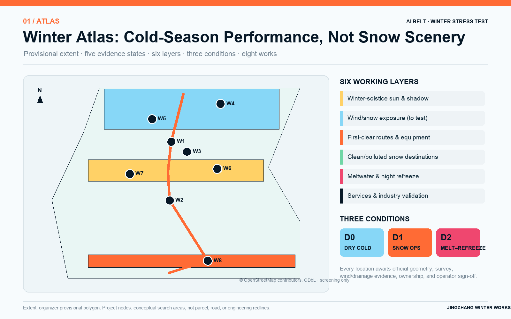
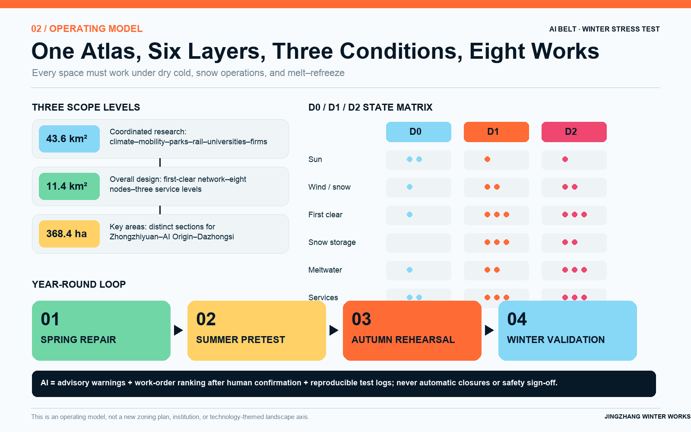
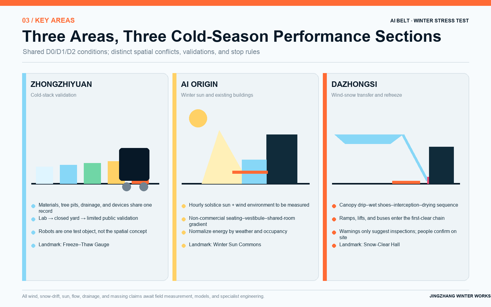
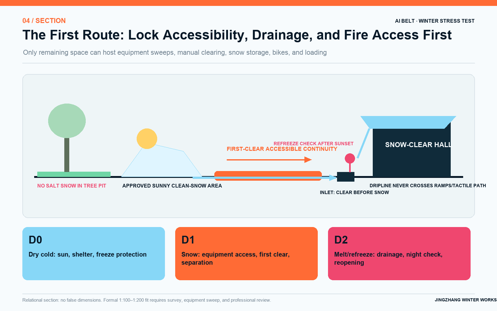
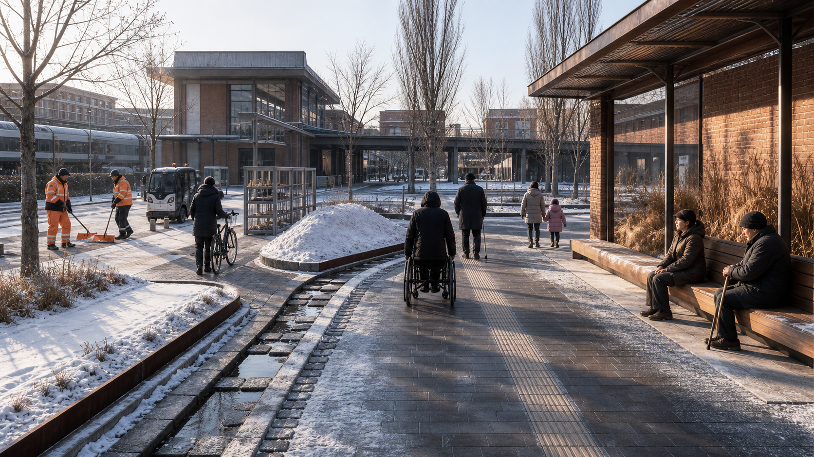
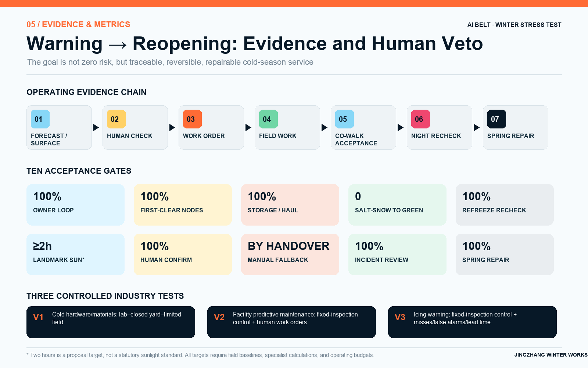

# 京张冬作 / JINGZHANG WINTER WORKS

> **以冬季为压力测试的 AI 创新带城市设计 / An AI Innovation Belt Stress-Tested by Winter**  
> **A future city must also work on a February morning.**  
> Deliverable type: 北京冬季城市作业图集 / A Winter Urban Operations Atlas for Beijing

The AI Innovation Belt is the design object and winter is the stress-test method; this is neither a snow-clearance scheme nor a winter festival. Most urban renderings take place on a dry afternoon under trees in full leaf. What truly reveals the spatial, industrial, governance, and operating quality of an innovation belt, however, is the morning after an overnight snowfall: low winter-solstice sun, wind-driven snow at station entrances, meltwater refreezing after dark, and wheelchairs, white canes, and snow-clearing equipment competing for the same space. Jing-Zhang Winter Works does not draw another technology axis. It treats the Jing-Zhang corridor as an AI Innovation Belt stress-tested by winter: where snow falls, which route is cleared first, where snow is staged, where meltwater goes, where it refreezes, how industry validation enters controlled settings, and who reinspects each location—and when—are all made part of urban design.

The AI Innovation Belt is an urban-design and long-term-operations subject; direct use of AI technology in the proposal is limited to three tasks: assisting with pavement-icing forecasts, organizing work-order priorities after human review, and recording cold-weather equipment tests. Snow-clearance decisions, route closures, accessibility acceptance, station-area operations, and engineering approvals always remain the responsibility of authorized personnel. The deliverable takes the form of *A Winter Urban Operations Atlas for Beijing*: a winter-solstice solar map, wind-and-snow exposure map, snow-clearance operations routes, snow-storage locations, meltwater paths, refreezing points, winter service levels, and pre-site-fit plan/section prototypes for the three key areas.

## Design Basis and Source List

The formal prequalification announcement defines a Coordinated Research Area of approximately 43.6 square kilometers and an Overall Design Area of approximately 11.4 square kilometers. The three key areas total approximately 368.4 hectares: Zhongzhiyuan, 192.1 hectares; Beijing AI Origin Community, 104.3 hectares; and Dazhongsi, 72.0 hectares. This proposal uses the scope published in the announcement dated 2026-05-09. The approximately 37-square-kilometer scope and “Xuebeiyuan” mentioned in earlier publicity are excluded from the formal conclusions.[source:OFFICIAL-ANNOUNCEMENT]

The repository still does not provide official machine-readable boundaries, parcels, ownership records, road boundaries, heritage-control lines, or complete regulatory planning indicators. The submission package therefore continues to use the organizer-provided provisional polygon solely for generation, discussion, and topology checks. It is not an official boundary, an approval basis, or a basis for precise area calculations. Once the official polygon is released, all nine GeoJSON layers, area calculations, winter models, drawings, and PDFs must be recalculated together; replacing only the scope diagram will not be sufficient.[data:geometry/site_boundary.geojson#SITE-001]

Beijing's current climate-adaptation action plan identifies cold waves, blizzards, and the effects of temperature, wind, ice, and snow on transport, energy, and urban operations as risk-assessment subjects. The Beijing Emergency Plan for Snow, Fog, and Low-Temperature Weather reports that, over the past decade, the probability of extreme low-temperature events has increased and the frost period has expanded, even as the probability of snowfall has decreased. “Less snow” is therefore not a reason to omit winter operating conditions from design: lower-frequency events require more explicit activation thresholds, personnel assignments, and backup routes.[source:BEIJING-CLIMATE-ADAPTATION]

Beijing's current snow- and ice-clearance regulations require main roads to be cleared by 7:30 a.m. after overnight snowfall and other responsible areas by 10:00 a.m. Cleared ice and snow must be stacked neatly in sunny locations that do not obstruct traffic, and snow containing deicer must not be placed in tree pits or green space. The 2024 pilot work plan further prioritizes mechanical clearing, requires deicer use to be reduced wherever possible and prohibited wherever necessary, and calls for pedestrian-clearing responsibilities to be assigned by grid in advance. This proposal cites these requirements only for the responsibility areas to which they apply; it does not automatically impose road requirements as a universal deadline for every park and station entrance.[source:BEIJING-SNOW-MANAGEMENT]

Sources are used at five levels: laws, announcements, and current standards support rules; government plans and project notices support statements of status; open maps provide only clues about existing conditions; the repository's provisional geometry is only a temporary container; and peer proposals are used only for originality checks. Across 400 proposal directories frozen at `origin/main@a88a818` at 14:09:40 Beijing Time on 2026-08-10, no title had winter as its primary proposition. Counted by file, “snow accumulation / icing / freeze–thaw / snowmelt / snow clearance / snow removal / cold wave / low temperature” respectively matched 4/5/3/2/1/1/1/3 proposals, while “refreezing / icing prediction / freeze–thaw material testing / wind-and-snow station transfer” each matched 0. One directory was added since the previous snapshot: `2830500285/jingzhang-open-loop` includes only an annual winter review within four-season activities. Two revised proposals were also rechecked: `wms2537/jingzhang-city-model-commons` uses generic simulation stress testing unrelated to winter, while `xr843/jingzhang-two-way-line` contains only waste-heat warm-corridor/greenhouse subitems. None develops the complete clearance–storage–meltwater–refreeze operations chain. The search scope, glob, commands, and commit are disclosed in the source registry; lexical matches are clues to differentiation, not absolute proof of originality. This proposal does not reproduce peers' suggestions for cold-weather robots, waste-heat snowmelt, or snow-removal storage. Its originality boundary is the complete winter operations chain.[source:PEER-SCAN-20260810]

## Three-Level Scope Framework

All three scope levels are read through the same six winter operations maps: winter-solstice sun and shadow; wind and snow exposure; snow-clearance priorities and equipment routes; temporary snow storage and removal; meltwater drainage and overnight refreezing; and cold-weather public services and industry validation. Each map distinguishes five statuses—existing, approved, under construction, planned, and proposed here—to avoid depicting a regulatory-plan draft still under review or an active construction project as an existing condition.[depth:three_level_scope_framework]

At 43.6 square kilometers, the coordinated level asks how climate, industry, and urban operations can produce winter innovation capacity. It links data and testing conditions across meteorology, transport, landscape and forestry, sanitation, rail, universities, enterprises, and communities. At 11.4 square kilometers, the overall level asks how snow and people move through space. It produces one priority network, eight Winter Works nodes, and three winter service classes. Each of the three key areas then receives a plan, section, and operating process to test, respectively, cold-weather materials and equipment; winter-sun communal space and building vestibules; and wind, snow, and refreezing at a high-volume station entrance.

Rather than imposing the generic form of “one belt and three cores,” the overall structure develops a corridor-wide concept through “**one atlas, six maps, three operating conditions, and eight Winter Works**.” The three conditions are D0, the dry-cold baseline, concerned with winter sun, wind shelter, and freeze protection; D1, snowfall operations, concerned with priority clearance, equipment swept paths, and temporary snow storage; and D2, snowmelt and refreezing, concerned with wet entrances, drainage discontinuities, overnight refreezing, and renewed slip-resistance checks. Every design must remain usable on all three D0/D1/D2 state maps.

The taskbook's three strategic positions are translated one by one through Winter Works. The “Centennial Jing-Zhang Cultural Belt” becomes an engineering culture of public measurement, maintenance, and review. The “Metropolitan AI Life Experience Belt” becomes winter access, places to stay, and assistance that everyone can use. The “AI Integrated Innovation Belt” becomes cold-weather validation with human controls, failure records, and stopping criteria. The five functions do not require five new landmark buildings: full-stack independent AI innovation is tested in cold conditions at Zhongzhiyuan; the world-class AI innovation ecosystem organizes talent and services through AI Origin and the two wings; AI+ scenario enablement is deployed in the Xiaoyue River Wing and on controlled operational sites; a vibrant AI-enabled city is supported by year-round access and AI-native services at Dazhongsi; and global discourse on AI governance is built through auditable benchmarks, human vetoes, and exit protocols.[source:AGENT-TASKBOOK]

“Three Zones and Two Wings” is a collaborative loop, not five isolated enclaves. Zhongzhiyuan turns failures in materials, equipment, and maintenance into reproducible field evidence. AI Origin connects universities, communities, building energy, and the everyday lives of talent. Dazhongsi turns validated results into experiential winter mobility assistance, maintenance, and business services. The Zhongguancun Technology Services Wing provides proposed standards, intellectual property, insurance, capital, and international connections. The Xiaoyue River Scenario Enablement Wing accommodates low-risk field drills and public feedback. A north–south candidate first-clearance chain connects the three key areas, while east–west station–business park–campus–community service loops stitch them together. These are conceptual links pending network analysis and confirmation of ownership and operations.[data:geometry/roads.geojson#ROUTE-02]

The visual identity does not use unauthorized railway emblems, corporate marks, or snowflake motifs. The logo direction is an orange “First Route” passing through three state windows—D0 ice blue, D1 safety orange, and D2 refreezing red—with an opening at the right to indicate that human acceptance is still pending. Drawings use a consistent palette of deep-night blue, ice blue, winter-sun yellow, safety orange, and refreezing red. Cultural wayfinding separately uses three symbol families—measurement scale, work-order time, and human sign-off—rather than folding them into the corridor logo. The international communication line is **“The Future City Works in Winter.”** Every factual status must also be labeled concept / under review / approved / built.

The eight Winter Works are W1, Winter Operations Base Maps and First-Snow Audit; W2, Accessibility-First Snow-Clearance Chain; W3, Sun-Facing Snow Storage–Meltwater–Refreeze Section; W4, Zhongzhiyuan Freeze–Thaw Co-Testing Yard; W5, Zhongzhiyuan Cold-Weather Production Support Courtyard; W6, AI Origin Winter-Sun Learning Commons; W7, Qinghuayuan Heritage Winter Protection Segment; and W8, Dazhongsi Snow-Clear Transfer Hall. In the structured layers, they indicate only conceptual locations, relationships, and search areas; they do not establish alignments for roads, waterways, heritage works, or buildings.[data:geometry/public_space.geojson#WW-01]

## Coordinated Research Area: Industry and Future City Research

Jing-Zhang can turn Beijing's actual winter into a responsible innovation environment without turning public space into an unbounded testing ground. The industry-validation chain begins in an environmental test chamber, then proceeds through material samples, a closed outdoor yard, a controlled operations surface, and limited public service. At every stage it records temperature, humidity, surface condition, deicing medium, equipment version, human takeover, and failure cases. Technology advances to the next stage only after closed testing has passed, professional safety review is complete, and staffed manual alternatives have been scheduled.[source:AGENT-TASKBOOK]

The priority industries extend beyond robotics. Paving, tree-pit edges, drainage components, curb ramps, equipment enclosures, sensors, traction batteries, vestibules, air curtains, control systems, and winter protective gear can all enter the same low-temperature–freeze–thaw–deicing-medium–maintenance cycle. Zhongzhiyuan hosts the joint testing of materials and equipment; AI Origin connects building energy, space sharing, and user research; and Dazhongsi tests high-volume station entrances with multiple operators. Results are not displayed as equipment counts, but through failure modes, maintenance hours, repair difficulty, and decisions to discontinue.

Six AI innovation-ecosystem cases and two cold-season operations references are used separately, so that climate precedents do not substitute for industry research:

| Case | Verifiable mechanism | Limited translation for Jing-Zhang |
| --- | --- | --- |
| Singapore one-north | Research institutions, firms, universities, and start-up space are colocated; the district operates as a living lab | Form a short “research–closed validation–limited scenario” chain between AI Origin and Zhongzhiyuan; do not import the land system [source:CASE-ONE-NORTH] |
| Punggol Digital District | Campus and industry are colocated; an open digital platform and digital twin support virtual testing before field deployment | Open the minimum winter-facility data necessary; simulate tests before moving into a controlled field setting [source:CASE-PUNGGOL] |
| Seoul AI Hub | City-supported space, talent, computing, PoC, and university–industry collaboration | The Zhongguancun Wing is proposed to support applications for shared computing resources and provide benchmarks and matchmaking; no subsidy is promised [source:CASE-SEOUL-AI-HUB] |
| Montréal Mila / Mile-Ex | Research talent, corporate partners, and AI start-ups form a collaboration network | The AI Origin Learning Commons connects researchers, operators, and public problems; the organizational model is not copied [source:CASE-MILA] |
| Pittsburgh Robotics Network | University research, robotics firms, accelerators, and industry demand form a commercialization network | Real winter-operations problems set the briefs at Zhongzhiyuan; failure samples and maintenance capacity determine selection [source:CASE-PITTSBURGH-ROBOTICS] |
| Zhangjiang AI Innovation Town | Models, computing, data, scenarios, and start-up services provide full-chain support | The two wings connect validation results to IP, standards, insurance, capital, and procurement assessment; investment-promotion targets are not cited [source:CASE-ZHANGJIANG-AI] |
| Edmonton WinterCity | Winter sun, wind shelter, lighting, and winter life are designed together | Borrow only the design lens; wind-screen parameters must be retested in Beijing [source:CASE-EDMONTON-WINTERCITY] |
| Oulu winter maintenance | Year-round walking and cycling depend on clear maintenance classes and continuous operations | Borrow only the “classification + reinspection” mechanism; do not import snow depth, deadlines, or climate thresholds [source:CASE-OULU-WINTER-MAINTENANCE] |

Singapore's Rail Corridor and Paris's Petite Ceinture additionally test sectional implementation and ecological continuity in heritage greenways, while Kendall/Volpe tests the boundary of public benefits. They are spatial-implementation references and are not counted among the six AI ecosystem cases above. Cases contribute mechanisms only; investment figures, climate thresholds, and institutional conclusions are not imported.

The AI innovation-ecosystem map uses eight mechanisms rather than a company list. **Land** provides approved sites for reversible pilots. **Space** forms a gradient from laboratory to closed yard to limited field setting. **Industry** focuses on cold-weather equipment, building energy, materials, and operations and maintenance. **Funding** distinguishes basic public services from corporate testing expenditure. **Talent** connects users, operations crews, researchers, and engineers. **Computing** supports reproducible benchmarks rather than continuous monitoring. **Data** uses only the minimum fields needed from weather, pavement, equipment, and work orders. **Scenarios** are opened through a problem brief, human review, controlled validation, and close-out review. The Zhongguancun Wing connects standards/IP/insurance/capital, and the Xiaoyue River Wing connects low-risk field validation. Any subsidy, investment promotion, computing voucher, or investment remains a proposal rather than a commitment.

Regional coordination with Beiwei Community, Future Science City, Huairou Science City, the Beijing Economic-Technological Development Area, and the Beijing–Tianjin–Hebei region is framed only as a research topic in “mutual recognition of benchmarks.” The parties would exchange de-identified cold-weather conditions, test protocols, failure modes, and maintenance costs to compare business parks, research facilities, manufacturing, and transport settings; no cooperation agreement, company commitment to locate there, or spatial connection is invented. Replication through a common test card—not lock-in to a common platform—is what could create a transferable Beijing benchmark for cold-season AI cities.

The future city is composed of three layers: permanent base, seasonal components, and test articles. The permanent base consists of accessible curb ramps, drainage slopes, inlets, trees, lighting, toilets, and maintenance access. Seasonal components include wind screens, snow-clearing tool points, grit bins, movable seating, and temporary snow markers. Test articles are material panels, sensors, and devices that are numbered, removable, and installed for comparison. Test articles must not damage the permanent base, and seasonal components must leave no obstruction after removal. The outdoor wind, thermal, and solar simulation methods in Beijing's *Design Standard for Ultra-Low-Energy Public Buildings* are used only as references for detailed building and node design, not extrapolated into mandatory indicators for the entire park.[standard:DB11-T-2240-2024]

AI appears only within a complete evidence chain. Output from a pavement-icing model must be shown alongside manual checks of temperature, humidity, and friction. Work-order prioritization may not demote accessible routes, schools, station entrances, or emergency routes. Cold-weather robot testing must record braking, range, sensing, noise, human takeover, and stopping criteria. Model drift, sensor condensation, communications failure, or unexplained false alarms all trigger manual operating mode; an algorithm may not close a public route on its own.

## Overall Design Area: Urban Renewal and Regulatory-Plan-Level Urban Design

The Overall Design Area first overlays five status classes for Phase I and Phase II of Jing-Zhang Railway Heritage Park, the south side of Qinghua East Road, Zhongzhiyuan, Dazhongsi station-city development, and rail projects, and only then identifies winter gaps. The proposal does not rename existing parks or repackage projects under construction as original work. It supplements what temperate-season drawings often omit: solar angle, wind-driven snow, equipment swept paths, temporary snow occupation, separation of salt-contaminated snow, meltwater paths, overnight refreezing, and freeze protection for facilities.[source:HAIDIAN-URBAN-RENEWAL-GUIDE]

Complete regulatory plans, parcels, ownership, road networks, existing buildings, and utilities have not been published. Consequently, `land_use.geojson` is a conceptual functional coverage layer rather than a final Land-Use Plan; Floor Area Ratio, Building Height, Building Coverage Ratio, setbacks, green-space ratio, and development scale all remain unknown. The winter-solstice solar map may use the astronomical relationship at approximately 39.98°N for early screening: the winter-solstice solar altitude at noon is approximately 26.6°. Actual shadows, however, must be recalculated from building surveys, terrain, and an hourly model; this single angle cannot establish compliance.[metric:winter_solstice_solar_altitude_deg]

W1 establishes 30 candidate observation points covering spaces under bridges, curb ramps, station entrances, campus edges, riverbanks, tree pits, storm inlets, and construction hoardings; each point is recorded four times—under dry-cold, snowfall, snowmelt, and nighttime conditions. W2 designates accessibility, schools, station entrances, hospitals and community services, and emergency paths as the priority chain, and identifies equipment access, manual follow-up clearing, temporary detours, and the person responsible for reinspection. W3 assigns each priority-chain segment a search area for temporary snow storage, salted/unsalted snow separation, removal conditions, meltwater discharge, and refreezing checkpoints.[depth:existing_conditions_diagnosis]

A “snow-storage location” does not mean pushing snow onto green space. Clean snow free of deicer may be stored briefly on a sunny hard or permeable operations surface that does not obstruct traffic and has been approved for the purpose by landscape and drainage authorities. Salt-contaminated snow enters an isolated container or removal chain and does not contact tree pits, green space, or rain gardens. Every snow pile must be checked for five risks: obstructing sightlines, covering tactile paving, blocking a storm inlet, sending meltwater across a walkway, and refreezing after dark.

This package does not claim to contain true 1:500 operations plans or 1:100–1:200 engineering sections. The current outputs are “standards-based relational prototypes pending site fit”: they define only the accessible, drainage, and fire-access lines that may not be occupied, plus equipment swept-path, snow-storage, and meltwater relationships that must be solved. No width is inferred from diagram pixels. Site-fitted 1:500 plans and representative 1:100–1:200 sections are next-stage deliverables after surveys, ownership, equipment, utilities, and operating data are obtained, and they require sign-off by the transport, water, landscape, accessibility, fire-safety, and operations teams.

## Detailed Design of Key Areas

The three key areas use the same D0/D1/D2 operating conditions but undertake entirely different winter tasks. All boundaries remain rough provisional polygons. The following diagrams communicate a reference proposal and a framework for professional development only; they cannot be used as engineering or land conclusions.[data:geometry/key_areas.geojson#PROV-KEY-001]

| Key area | Core winter conflict | Spatial prototype | Industry validation | Functional landmark |
| --- | --- | --- | --- | --- |
| Zhongzhiyuan, 192.1 ha | Qinghe/Fifth Ring exposure; production logistics and public routes; durability of materials and equipment | Closed co-testing yard + cold-weather production support courtyard + Qinghe winter ecological interface | Freeze–thaw and deicing-medium cycles for paving/tree pits/enclosures; cold-weather robots as one test category | Freeze–Thaw Gauge |
| AI Origin, 104.3 ha | Low winter-solstice sun; campus boundaries; short-term sharing; vestibule heat loss | Wind-sheltered, sun-facing learning commons + closable vestibule + heritage winter-protection segment | Building energy, vestibule heat loss, indoor–outdoor transition, and occupancy control | Winter Sun Commons |
| Dazhongsi, 72.0 ha | Wind-driven snow at station entrances; water tracked in on footwear; entrance ponding; overnight refreezing; continuity of transfers | Snow-Clear Transfer Hall + entrance interception/drying sequence + priority snow-clearance loop | Pavement-icing alerts, passenger/operations conflicts, and human response | Snow-Clear Hall |

**Zhongzhiyuan.** W4, the Freeze–Thaw Co-Testing Yard, preferentially reuses existing hardstand or courtyards and is divided into four zones: material samples, closed equipment tests, controlled operations, and public interpretation. Paving, curb ramps, tree-pit edges, storm inlets, and equipment enclosures undergo natural weather and laboratory cycles using the same record sheet; samples exposed to deicing media are kept strictly separate from clean meltwater. W5, the Cold-Weather Production Support Courtyard, accommodates drying, charging, spare parts, repairs, tools, duty staff, and thermal recovery for workers, rather than forcing back-of-house functions onto public walkways. Cold-weather robots already appear in peer proposals; this proposal only incorporates them into a shared material–drainage–maintenance testing system and does not claim originality for them.[data:geometry/buildings.geojson#BLDG-WINTER-001]

**AI Origin.** W6, the Winter-Sun Learning Commons, is not an all-day heated glasshouse. It is an indoor–outdoor gradient formed by south-facing winter-sun access, a wind-sheltered corner, low-conductivity seating surfaces, a closable vestibule, noncommercial seating, and short-term shared rooms. Sun hours from 10:00 to 14:00 at the winter solstice, wind conditions, and vestibule heat loss are simulated first and then verified on site. Summer shading and natural ventilation are tested in parallel so that winter optimization does not create summer overheating. W7, the Qinghuayuan Heritage Winter Protection Segment, is limited to drainage, freeze–thaw inspection, low-disturbance slip resistance, and reversible facilities; new components are discussed only outside the formal heritage-protection boundary.[standard:HERITAGE-PROTECTION-LAW]

**Dazhongsi.** W8, the Snow-Clear Transfer Hall, draws “outdoor snow–slippery entrance–water tracked in on footwear–overnight refreezing” as one continuous section. It blocks wind-driven snow on the windward side without obstructing sightlines; places waiting areas outside snow-drift vortices; provides maintainable water interception and a coarse-textured surface outside the entrance; keeps the indoor absorbent zone clear of evacuation widths; overlaps the accessible route with the first snow-clearance route; and prevents meltwater from crossing curb ramps or tactile paving. Until station-entrance locations, wind fields, passenger flows, drainage, and fire-safety information are available, the design shows alternative relationships only—not new connecting corridors or underground works.[standard:DB11-T-2129-2023]

The three “pre-site-fit prototypes” register plan dependencies, section dimension domains, and next-stage outputs separately. A “dimension domain” here means clearance, swept-path, drainage, wind/snow, and operating interfaces to be solved jointly from measured conditions. It is neither a preset width nor a dimension read from a diagram:

| Key area | Plan relationship and dependency order | Section dimension domains (all unresolved; no false values) | Missing data | Next-stage output |
| --- | --- | --- | --- | --- |
| Zhongzhiyuan | First fit existing hardstand/courtyards, logistics and public paths, fire access, and clean/contaminated water routes; then locate closed testing, material samples, repair, and thermal recovery | Accessible/fire clearance; equipment turning–braking–failure allowance; sample-rack and repair work zones; snowfall–storage–removal; slab elevations–tree roots–inlet/pipe inverts | Measured base, ownership, test-equipment envelopes, fire/power, catchment/drainage, and Qinghe ecology/flood interfaces | After data confirmation: site-fitted 1:500 plan; representative 1:100–1:200 “hardstand–sample rack–interception/drainage–snow storage” section; swept-path and water-volume calculations |
| AI Origin | First fit south-facing ground floors, entrances/egress, campus and heritage limits, tree shadows, and public/nonpublic hours; then compare vestibules, seating, and shared rooms | Accessible/egress clearance; door swings and queues; indoor–outdoor buffer; winter sun–wind shelter–summer shade; threshold–interception–external grade | Building/tree survey, formal heritage limits, ownership/opening hours, energy/infiltration/occupancy, and winter/summer wind–thermal–solar baselines | 1:500 ground-floor/outdoor fitted plan; representative 1:100–1:200 “Winter Sun Commons–vestibule–shared room” section; hourly shadow, wind/thermal, and summer-overheating checks |
| Dazhongsi | First fit real station entrances, passenger flows/queues, accessibility and egress, bus/cycle/loading, clearance swept paths, and drainage; then select snow screening, waiting, interception, and drying relationships | Accessible/egress clearance; queues and waiting; clearance-equipment swept path/snow storage; curb ramp–interception–absorbent zone; wind screen–sightline–snow vortex; inlet/pipe inverts | Official entrance/rail interfaces, peak flows, wind-driven snow, terrain/pipe network, fire safety, ownership, and crew operating data | 1:500 station-entrance operations plan; representative 1:100–1:200 “outdoor snow–interception–drying–transfer” section; combined wind/snow, drainage, and egress review plus signed operations card |

## AI Innovation Ecosystem, Personas, and AI+ Scenarios

The proposal follows eight categories of winter users: wheelchair users, white-cane users, and people with limited mobility; children traveling to school independently and caregivers pushing strollers; older people who need winter sun, rest, and slip-resistant surfaces; walking and cycling commuters and couriers; snow-clearance, landscape, drainage, and maintenance workers; station staff, bus operators, and merchants; university students and faculty, start-up teams, and test engineers; and railway-heritage visitors. Every scenario records “departure–encounter with snow/wind–request for help–detour–arrival–feedback,” and each user group, or its representatives, participates in the first-snow review.[standard:ACCESSIBILITY-LAW]

Fourteen scenario cards cover dry cold, snowfall, snowmelt and refreezing, and system failure:

| # | Scenario | Person and time | Spatial action | Evaluation |
| --- | --- | --- | --- | --- |
| 01 | First overnight snow | Snow-clearance crew, 05:30 | Opens routes in priority order and marks uncleared segments | Staff arrival, equipment swept path, closed-loop reinspection |
| 02 | Wheelchair at morning peak | Commuter, 07:10 | Moves continuously from curb ramp to walkway to station entrance | Clear width, crossfall, snow ridges, alternative route |
| 03 | Independent school trip | Child, 07:30 | Crosses a park or campus entrance | Sight distance, snow-pile obstruction, motorist yielding |
| 04 | White cane and grit | Visually impaired visitor, 08:20 | Follows tactile guidance and identifies the entrance | Tactile legibility, loose material, staffed assistance |
| 05 | Winter cycling | Commuter, 08:40 | Moves from priority chain to parking to walking transfer | Slip resistance, clearance class, snow in parking area |
| 06 | Winter-sun pause | Older person, 11:30 | Takes a short rest at a sun-facing seat | Sun, wind, seating surface, toilet access |
| 07 | Cold-wave vestibule V2 | Students, faculty, and facility operator, 13:00 | Moves from outdoors through the vestibule into a shared room; reviews anomalies in lifts/pumps/vestibules | Comparison against scheduled inspections, failure lead time, unnecessary work orders |
| 08 | Cold-weather robot V1 | Engineer, 14:00 | Tests braking/range/perception in a closed yard | Human takeover, failure samples, version |
| 09 | Freeze–thaw material engineering inspection | Materials/landscape team | Co-tests samples, tree pits, and drainage components | Spalling, friction, salt damage, and reparability; no forced AI label |
| 10 | Afternoon snowmelt | Drainage worker, 15:30 | Clears storm inlets and interception channels | Water path, blockage, wet strip crossing route |
| 11 | Overnight refreezing V3 | Station and maintenance staff, 21:30 | Rechecks entrances, curb ramps, and shaded areas | Pavement alert, manual friction verification |
| 12 | Salted-snow separation | Landscape worker | Separates clean snow from salt-contaminated snow | Zero contact with tree pits/green space, removal record |
| 13 | Cold-wave power outage | Night-shift worker | Continues manually after digital guidance shuts down | Paper maps, lighting, continuity of manual work orders |
| 14 | Spring review | Operations and design team | Inspects freeze–thaw damage and closes work orders | Repair hours, material replacement, next-season drawing update |

V1–V3 are the three AI/industry tests. No trained model, site dataset, or performance result currently exists; the cards below define evaluation methods that must be preregistered before implementation. Each test begins in shadow mode alongside the existing human process. Training, calibration, and held-out evaluation are split by asset/node and independent weather event, while missing and failure cases are retained. Thresholds are set by professionals only after a baseline exists; this package presets no accuracy, lead-time, or risk threshold. Freeze–thaw materials continue to use conventional engineering tests of friction, moisture, deterioration, and reparability; machine vision is not added merely to force an AI label.[data:geometry/constraints.geojson#TEST-WINTER-001]

**V1 Controlled Cold-Weather Equipment Validation Card.** **Inputs:** ambient/pavement temperature and humidity, precipitation and surface condition, hardware/software version, charge, payload, speed, and braking/perception/communications/emergency-stop logs; no unrelated pedestrian identity. **Baseline/control:** records for the same device under standard-temperature/manufacturer testing, closed-yard human operation, and current manual/mechanical work; another unvalidated model is not the sole control. **Output:** a test record and review checklist carrying condition, version, and data quality—not a conclusion that public-road operation is safe. **Human confirmation:** the test lead checks the site, emergency stop, braking allowance, and takeover record; the safety lead decides whether the next condition may begin. **Evaluation:** distributions of braking performance relative to control, range retention, misses/false detections, takeover and emergency stop, disconnection/condensation, noise, failure recovery, and cross-version drift; no invented gate is filled in this round. **Stop/exit:** stop the run if the emergency stop or human takeover is unavailable, the path diverges uncontrollably, braking/perception data are invalid, communications fail, or a failure is unexplained. Revert to staffed/conventional equipment; no limited public service occurs without independent safety review.

**V2 Predictive Facility-Maintenance Evaluation Card.** **Inputs:** lift door cycles/fault codes/current or vibration; pump starts/stops/water level and alarms; vestibule opening/position and indoor–outdoor temperature difference; outdoor weather; asset version; and existing inspection/repair work orders. Human activity is retained only as task-necessary aggregate fields. **Baseline/control:** scheduled inspections, onboard rule alarms, and current fault response, first logged in parallel without automatic dispatch. **Output:** a “recommended inspection” list carrying location, time, data quality, reason fields, and uncertainty; it does not automatically diagnose a fault, stop a lift, or alter statutory maintenance. **Human confirmation:** the facility operator inspects on site and labels confirmed fault, no action needed, data problem, or specialist maintenance required; authorized maintenance staff decide work orders and shutdowns. **Evaluation:** miss rate for confirmed faults, false-alert rate, lead-time distribution, unnecessary work orders/repeated reminders, service interruption, change in staff hours, sensor missingness, and seasonal/asset-version drift. **Stop/exit:** disable model advice after a missed safety-related fault, sustained growth in false alerts or unnecessary work, unexplained drift/missingness, or an alert whose reason cannot be reviewed. Scheduled inspections, onboard alarms, staffed repair, and paper records continue.

**V3 Pavement-Icing Alert Evaluation Card.** **Inputs:** pavement temperature/humidity, air temperature/dew point, precipitation and forecast, shade/drainage exposure, snow-clearance/deicer action, and manual wetness/friction spot checks; no face or individual trajectory. **Baseline/control:** fixed-time patrols, current weather/rule notices, and human discovery time, compared at the same node during the same event. **Output:** a “priority inspection” suggestion carrying location, time window, input completeness, and reason fields. A model may not declare safety, close a route automatically, or delay action on an accessible route. **Human confirmation:** station or maintenance staff use an approved method to verify surface state, temperature/humidity, and friction; authorized staff decide slip control, detour, closure, and reopening. **Evaluation:** miss rate for confirmed icing events, false-alert rate in non-icing conditions, lead-time distribution relative to human discovery, localization error, unnecessary callouts/work orders, data uptime, sensor drift, and transfer across events/seasons. **Stop/exit:** immediately disable model alerts after a missed safety event, unexplained dense false alarms, condensation/calibration drift, communications/coverage failure, or any action triggered without human confirmation. Resume fixed patrols, physical slip control, paper maps, and human work orders.

The three landmarks are also public learning devices. The Freeze–Thaw Gauge publishes material versions, weather, failures, and repairs. The Winter Sun Commons shows winter-solstice sun, summer shade, and opening hours on the same low-tech sign. The Snow-Clear Hall displays cleared/pending/detour status, the time of the last human review, and the complaints channel. A recognition wall records the shared contribution of snow-clearance, maintenance, landscape, station, and testing teams rather than ranking success by equipment count.

The public-space component library is numbered in four groups, and every component is replaceable and maintainable. The movement group includes snow markers, curb-ramp edge markers, and temporary detour signs. The snow-and-water group includes clean/contaminated-snow markers, cleanable water-interception elements, and inlet anti-blockage elements. The rest-and-recovery group includes low-conductivity seating surfaces, movable wind screens, and thermal-recovery points. The validation group includes material-sample racks, pavement temperature/humidity points, and paper work-order clips. Components may not encroach on accessibility, drainage, fire access, or sightlines; within heritage areas they must use low-disturbance, reversible interventions clearly distinguishable from historic fabric. Component specifications publish dimensional interfaces, materials, maintenance, failures, and retirement procedures without tying the system to a vendor.

Dazhongsi's “AI-native consumption and business” is not a mandatory QR-code shop. It is a set of optional winter assistance services: displays and bookings for validated slip-resistance and maintenance components; equipment health checks and demonstrations of human takeover; accessible travel assistance; climate-technology service consultation; roadshows for test results; and enterprise–operator problem postings. Basic waiting, information, warmth, and accessible movement remain free and retain nondigital equivalents. Any insurance, procurement, or business conversion requires separate review; this proposal does not promise a transaction.

## Land Use, Building Scale, and Retain-Renovate-Demolish Strategy

This proposal does not rezone statutory land because of its winter theme. `land_use.geojson` uses four conceptual coverages—a park and open-space base, research/testing, innovation services, and existing mixed urban fabric—to satisfy machine-readable topology, each marked `not_statutory_land_use=true`. Formal land use, parcels, ownership, building scale, Floor Area Ratio, Building Height, Building Coverage Ratio, and setbacks remain unknown; areas assigned to Winter Works nodes support comparison and operations only and are not land-supply or development indicators.[data:geometry/land_use.geojson#LU-WINTER-GREEN]

Buildings follow the sequence “renovate vestibules first, adapt ground floors next, test new ideas in courtyards, and leave new construction until last.” Zhongzhiyuan first locates sample racks, repair functions, and thermal recovery in existing factories or hardstand courtyards. AI Origin first renovates vestibules, south-facing ground floors, and bookable shared rooms. Dazhongsi first corrects external grades, water interception, waiting space, and staffed information at station entrances. New floor area is considered only after comparing existing buildings, fire safety, structure, ownership, energy, and whole-life carbon.

The Demolish–Renovate–Retain survey adds winter-specific fields: freeze–thaw damage; leakage and condensation; vestibule heat loss; winter-solstice sun; wind-and-snow vortices; equipment freeze protection; snow-clearance access; and maintenance hours. Railway heritage and mature trees are retained by default. Any slip-resistant, wind-screening, or drainage component within a heritage area must use minimum intervention, be reversible and distinguishable from historic fabric, and must not direct deicer or concentrated meltwater toward foundations, roots, or historic material.[source:BEIJING-URBAN-RENEWAL-REGULATION]

Conceptual building envelopes indicate only three types of need: co-testing/repair/thermal recovery at Zhongzhiyuan; vestibule/co-learning/south-facing transition at AI Origin; and waiting/information/drying at Dazhongsi. They are neither existing building outlines nor proposed demolition and construction limits. The formal proposal must replace them with a building survey fitted on site at 1:200.[data:geometry/buildings.geojson#BLDG-WINTER-001]

## Transport, Rail, Municipal Infrastructure, and Public Services

The first principle of winter transport is to open one route that everyone can use before expanding outward. The priority chain places continuous accessibility, schools, station entrances, buses, community services, and emergency connections first. Each segment records the responsible person, operating equipment, manual follow-up clearing, temporary detour, snow-storage location, and human sign-off. Cycling, deliveries, and low-speed equipment enter later service classes only after pedestrian and accessible continuity has been secured.[standard:DB11-1761-2020]

The snow-clearance section first fixes three lines that may not be occupied. The continuous accessible line may not be blocked by snow ridges, tools, or parked vehicles. The continuous drainage line may not be blocked by snow piles, grit, or leaves. The continuous fire-access line may not be occupied by seasonal facilities or equipment. Only the remaining space can accommodate equipment swept paths, manual follow-up clearing, temporary snow storage, cycle parking, and loading. Exact widths are jointly determined by the existing-condition survey, road class, and equipment selection; pixels in a conceptual diagram are not dimensions.

For rail stations, the 300-meter/5-minute network is used as a professional reference. The audit focuses on whether station entrances, ramps, lifts, buses, cycle parking, and ground-floor services remain continuous in wind and snow. Dazhongsi requires an integrated overlay of winter wind fields, wind-driven snow, water tracked through entrances, drainage capacity, and evacuation. 24-hour passages, wind screens, and any above- or below-ground connection require review by rail, fire-safety, ownership, and operations authorities.[standard:DB11-T-2129-2023]

Municipal design treats snow as short-term land occupation and delayed runoff, but does not send saline meltwater directly into sponge facilities. Clean snow, salt-contaminated snow, ordinary stormwater, and equipment wash water are separated. Storm inlets and interception channels are cleared before snow, then rechecked once during afternoon snowmelt and again before nighttime cooling. Tree-pit edges receive mechanical protection and grit is recovered in spring. Toilets, drinking water, lifts, lighting, access control, charging, and fire-safety equipment are each registered for low-temperature operation, power failure, and manual alternative modes.

Public-service nodes provide warmth without requiring consumption: sheltered sun-facing seating, short-term thermal-recovery rooms, toilets, drinking water, first aid, tools, grit, and staffed information are combined. They serve older people, caregivers with children, people with limited mobility, and outdoor workers first. Any “smart heating” or people-flow sensing must state its energy demand, data use, opening hours, maintenance, and equivalent service after shutdown.

## Blue-Green Network, Public Space, and Urban Character

Jing-Zhang Railway Heritage Park, Qinghe, and Xiaoyue River form the existing blue-green setting, and winter design must protect vegetation, soil, and water together. Ice and snow containing deicer may not be placed in tree pits or green space. Even temporary storage of clean snow must avoid young trees, areas beneath fragile branches, core habitats, and locations where it would block drainage. The spring review checks salt damage, soil compaction, mechanical bark damage, residual grit, and freeze–thaw spalling, and includes repair hours in material selection.[standard:BEIJING-SPONGE-CITY]

Winter sun requires more than the phrase “provide more sunlight.” Every public stopping place is drawn with hourly shadows from 10:00 to 14:00 at the winter solstice, prevailing winter winds, and summer shade. Seating for older people, childcare, outdoor-worker thermal recovery, and noncommercial stays is placed first where winter sun and wind shelter coincide with visibility of the primary route. The proposal target is at least 2 hours of direct winter-solstice sunlight at each of the three functional landmarks. This is not a statutory sunlight standard and must be verified using accurate models of buildings and trees.[metric:winter_sun_hours_target]

Wind-and-snow components “screen without sealing.” Low, porous wind screens, building-corner treatments, tree arrays, and vestibules reduce downdrafts and snow vortices without blocking fire access, sightlines, or summer ventilation. Snow piles are temporary operational objects, not permanent landscape sculptures. Winter color comes from material contrast, legible edges, and small warm-colored components rather than bright screens. Lighting is continuous and low-glare so that wet reflections and grade changes remain legible.

Railway culture is narrated through “how engineering gets through winter”: alignment survey, gradients, bridges and tunnels, drainage, maintenance, and timetables are all part of a century of engineering culture. Qinghuayuan Station is interpreted only to the extent supported by formal historical records; new winter-protection facilities do not attach to the protected fabric; and unidentified rails, switches, or components are not claimed as in-situ heritage. The Winter Operations Atlas is itself a form of contemporary engineering culture: it makes failure, repair, and maintenance public instead of using railway symbols as decoration.[source:QINGHUAYUAN-PROTECTION]

The spatial storyline links three cultures through one engineering ethic. Centennial Jing-Zhang contributes the infrastructure discipline of “survey before passage.” Zhongguancun innovation culture contributes problem-driven work, rapid experimentation, and open collaboration. Emerging AI culture adds uncertainty disclosure, human veto, reproducible failure, and data minimization. Wayfinding has three layers: corridor-wide visual identity, railway-culture interpretation, and Winter Works status information. Historical marks may not be repurposed as the logo, and dynamic screens may not replace physical evacuation information. The Chinese communication line means “The future city must also work on a February morning”; the English line is “The Future City Works in Winter.” Every international information panel also answers: what changed, who verified, when updated, and how to opt out.

The conceptual scene explains spatial relationships. It is not a site photograph, evidence of existing conditions, or an approved proposal:

## Renewal Projects, Implementation Policy, and Phasing

| Winter Work | 0–6 months | 6–18 months | Prerequisites for permanent works | Stop/rollback |
| --- | --- | --- | --- | --- |
| W1 Winter Operations Base Maps | Five-status overlay, 30-point/four-condition survey, first-snow drill | Public map updated each season | Official polygon, project interfaces, responsible persons | Remain provisional without site evidence |
| W2 Accessibility-First Snow-Clearance Chain | Walk routes with priority users; establish classes and paper maps | Signs, tool points, manual follow-up clearing | Confirmation of road/park/station-area responsibilities | Do not close a route without an equivalent alternative |
| W3 Snow Storage–Meltwater–Refreezing | Survey storm inlets, tree pits, curb ramps, and shaded areas | Pilot clean/salted snow separation and reinspection | Water-affairs, landscape, and sanitation review, plus drainage calculations | Any cross-route refreezing triggers clearance and correction |
| W4 Freeze–Thaw Co-Testing Yard | Material samples and recording protocol | One winter of natural exposure plus laboratory control | Ownership, environmental, safety, and procurement review | Do not expand if data are not comparable |
| W5 Cold-Weather Support Courtyard | Search existing courtyards/factories | Small-scale repair, spare-parts, and thermal-recovery pilot | Structure, fire safety, energy, occupational health | Do not build without an operating budget |
| W6 Winter-Sun Learning Commons | Baseline solar/wind conditions and vestibule heat loss | Reversible vestibules, seating surfaces, and opening-hours pilot | Ownership, fire safety, energy, and summer verification | Modify if summer overheating or energy use worsens |
| W7 Heritage Winter Protection Segment | Overlay heritage limits and inspect deterioration | Low-disturbance slip-resistance/drainage prototypes | Heritage, structural, and materials experts | Do not attach anything until heritage boundaries are confirmed |
| W8 Snow-Clear Transfer Hall | Audit wind, snow, slipperiness, and passenger flow at station entrances | Prototype entrance interception, waiting, and staffed information | Rail, fire safety, drainage, ownership | Withdraw if evacuation or accessibility fails |

The first 0–6 months are not construction-led. They establish a baseline across one complete cold season, including at least dry cold, the first observable snowfall or a substitute drill, snowmelt, and one nighttime refreezing-risk inspection. If the season brings no snow, a traceable simulation drill checks people, tools, routes, and storage locations, but may not be reported as on-site performance. The 6–18-month stage permits only reversible samples. Ground surfaces, drainage, vestibules, and station entrances are modified after specialist approvals in months 18–36; prototypes are replicated only after validation across two cold seasons, in years 3–5.[data:geometry/phasing.geojson#PHASE-001]

Operations do not invent a new institution. The statutory or contractual entities responsible for roads, parks, properties, rail, campuses, and business parks sign their boundaries on the same Winter Operations map. Every node must identify a snow-clearance lead, reinspector, drainage/landscape interface, equipment and manual modes, complaint channel, budget type, and spring review. Corporate R&D funds testing, while public funds prioritize accessibility, station entrances, and emergency routes. Basic winter access may not be paywalled or exchanged for personal data.

The annual program is not an ice-and-snow festival, but four public operations within the **Winter Works Open Season**: the prewinter “Snow Readiness Drill,” the first-snow “First Route,” the melt-period “Refreezing Night Inspection,” and the spring “Freeze–Thaw Repair Week.” Event graphics reuse the D0/D1/D2 state windows and human sign-off time rather than turning extreme weather into entertainment. Developers, material suppliers, operations crews, and users read the maps together on site, but public routes are not used as testing grounds without informed consent.[depth:phasing_implementation]

The developer community operates through “urban problem brief → minimum data package → reproducible experiment → operations-crew review → public failure library.” Scenario access has three levels—laboratory, closed yard, and limited field setting—and every advancement has a responsible person, privacy/safety review, equivalent staffed service, and end date. The proposed translation pathway is: problem release → prototype and control → two cold seasons or sufficient operating-condition evidence → professional/user review → standards, IP, insurance, and procurement assessment → optional incubation/investment matchmaking → replication in other districts. The Zhongguancun Wing hosts professional and capital services, while the Xiaoyue River Wing hosts low-risk scenarios. Certification, procurement, investment promotion, investment, or international cooperation still requires a separate decision and does not arise automatically from an event.

## Metrics, Area Recalculation, and Compliance Matrix

Metrics are divided into facts, external references, and targets proposed here. Facts are limited to announced scopes, formal policy, and reproducible submission geometry; because the boundaries are provisional, calculated areas serve only as file checks. Beijing's snow-clearance deadlines and prohibition on placing salt-contaminated snow in tree pits or green space are applicable rules. Centimeter/hour maintenance thresholds from Oulu and other precedents are comparative only and are never imported as Beijing metrics. Every “100%,” “2 hours,” and “one operating shift” is a proposal target that requires calibration against site conditions, engineering, and budget.[metric:site_area_sqm]

| Dimension | Proposal target | Measurement | Action if unmet |
| --- | --- | --- | --- |
| Operations coverage | 100% of the priority chain has a responsible person, equipment, detour, snow-storage location, and reinspector | Winter Operations register | Do not claim readiness if any item is missing |
| Accessible continuity | 100% of first-priority nodes remain continuous and legible after snow clearance | Shared wheelchair/white-cane walk-through + measurement | Manual follow-up clearing, or close and open an equivalent route |
| Complete snow-storage chain | 100% of priority segments designate a storage location or removal route | Plan, swept path, and on-site sign-off | Do not push snow into leftover space |
| Salted-snow isolation | Contact between deicer-contaminated snow/ice and tree pits or green space = 0 | Site inspection and photographs | Remove immediately and inspect soil/vegetation |
| Complete refreezing response | 100% of identified cross-route meltwater points have drainage/interception/night inspection | D2-condition inspection | Apply slip control, intercept water, and reopen the work order |
| Winter sun | Direct sun at the three landmarks ≥2 h between 10:00 and 14:00 at winter solstice | Hourly model + site verification | Relocate seating/screens; do not substitute heating |
| Test governance | 100% of tests have environmental records, human controls, and stopping criteria | Test card | Incomplete data cannot advance |
| Human confirmation | 100% of icing alerts are confirmed by on-site staff | Work-order log | Keep model in research status only |
| Technology exit | Convert to paper maps/manual work orders within the responsible entity's next staffed handover window, registered before the test | Failure drill recording the trigger and window start/end | Do not depend on one platform; do not compare “one shift” across entities as if it were one duration |
| Spring repair | 100% of winter damage has a closure, repair, or acceptance record | Defect register and labor hours | Repair access-affecting items first |

The winter-solstice noon angle of 26.6° is an early design value calculated from latitude and astronomical relationships, not an on-site sunlight conclusion. Two hours of winter sun, 100% closed loops, and one operating shift are proposal targets, not existing achievements or government commitments. “One operating shift” is not a preset number of hours: each responsible entity registers its next staffed handover window before the test, records the failure trigger and window start/end, and checks completion within that event. Results may not be compared directly across entities. `metrics.json` records type, value, formula, confidence, and recalculation prerequisites. Three matrices link announcement items 1.3–1.5, agent.1–agent.6, professional standards, and drawings item by item.[depth:metrics_recalculation]

## Risk, Copyright, and Compliance

**False-precision risk.** Without the official polygon, surveys, wind fields, snow records, pavement temperature, friction, drainage, trees, passenger flows, ownership, and crew data, the proposal cannot claim snow-storage capacity, clearance time, wind-speed improvement, icing probability, or project cost. This package contains no true site-fitted 1:500 or 1:100–1:200 drawings; the current diagrams are unscaled relational prototypes, and all must be redrawn after formal site fitting.[depth:risk_missing_data]

**Single-season and climate risk.** A snowless winter cannot prove that the system works, and one extreme snowfall cannot represent normal years. The proposal uses multiyear meteorological records, traceable drills, and cross-season review. Climate warming does not eliminate cold-wave, low-temperature, or freeze–thaw risk. When sensors fail or models raise false alarms, human inspection and physical slip control remain effective.

**Ecological and material risk.** Deicer, grit, and mechanical clearing can damage trees, soil, historic materials, and drainage. The proposal prioritizes mechanical/manual methods, classified snow storage, restricted media, and spring recovery. Waste-heat snowmelt and corridor-wide heated walkways must not become default solutions; their energy, carbon, maintenance, and refreezing side effects require specialist comparison.

**Safety and equity risk.** Wind screens, snow piles, tool boxes, and test facilities can obstruct sightlines, narrow evacuation paths, or block tactile paving. Clearance priorities may not serve only office parks or commercial entrances; children, older people, disabled people, night-shift workers, and outdoor workers must participate in acceptance. Public routes do not use facial recognition, and pedestrians are not treated as uninformed cold-weather test subjects.

**Heritage and engineering risk.** Qinghuayuan Station and railway remains are governed by formal protection drawings and approvals. Waterways, rail, station entrances, roads, fire access, and underground utilities all require specialist review. Any wind screen, drainage component, vestibule, lighting, or attached element is a conceptual recommendation only.[source:STREET-CONTROL-DRAFT-STATUS]

**Originality and copyright.** Cold-weather robots, snow-clearance storage, waste-heat snowmelt, and winter-solstice wind/shadow analysis already appear in peer proposals. This proposal does not reproduce their text, drawings, or brands, and it does not claim that any one of these subitems is original. Its original combination is the corridor-wide “sun–wind/snow–clearance–storage–meltwater–refreezing–accessibility–station entrance–spring repair” operations system and the complementary sections for the three areas. The text, code-generated graphics, structured design layers, and layouts were originally generated by OpenAI Codex. The conceptual perspective was made with the built-in image-generation tool and is explicitly identified as non-photographic. OSM is used only for attributed road-network screening; licensing is documented in the copyright statement.

This proposal uses the `COMMUNITY-DISPLAY-ONLY` license, authorizing display only within this Open Call community. It does not relicense official materials, standards, open maps, or third-party content. Every spatial action is a “conceptual recommendation, reference proposal, and subject for further professional study”; none constitutes government approval, a statutory regulatory plan, an engineering commitment, an investment commitment, safety certification, or operating authorization.

## References

- Prequalification Announcement for the Centennial Jing-Zhang AI Innovation Belt Open Call for Urban Design, 2026-05-09.
- Beijing Climate Change Adaptation Action Plan, 2024; Beijing Emergency Plan for Snow, Fog, and Low-Temperature Weather, 2024.
- Provisions of the Beijing Municipal People's Government on Snow and Ice Clearance; Beijing Snow and Ice Clearance Work Plan (Pilot), 2024.
- Beijing Urban Master Plan, Haidian District Plan, Haidian Urban Renewal Guidelines, and materials on the status of the draft regulatory plan for the corridor.
- Standard for Planning and Design of Station-City Integration Engineering, DB11/T 2129—2023; Standard for Planning and Design of Walking and Cycling Environments, DB11/1761—2020.
- Law of the People's Republic of China on the Construction of Accessible Environments; Law of the People's Republic of China on the Protection of Cultural Relics; Beijing Urban Renewal Regulation.
- Edmonton WinterCity Strategy; City of Oulu Winter Maintenance; Rail Corridor; Petite Ceinture; one-north; Punggol; Kendall/Volpe; Zhangjiang cases.
- OpenStreetMap contributors, ODbL; accessed 2026-08-10.
- The 400 peer proposals frozen at `origin/main@a88a818` were used only for corpus-based originality checking; no assets were reproduced. Complete URLs, purposes, dates, and licenses are recorded in `sources.json`.[source:SOURCES-INDEX]
