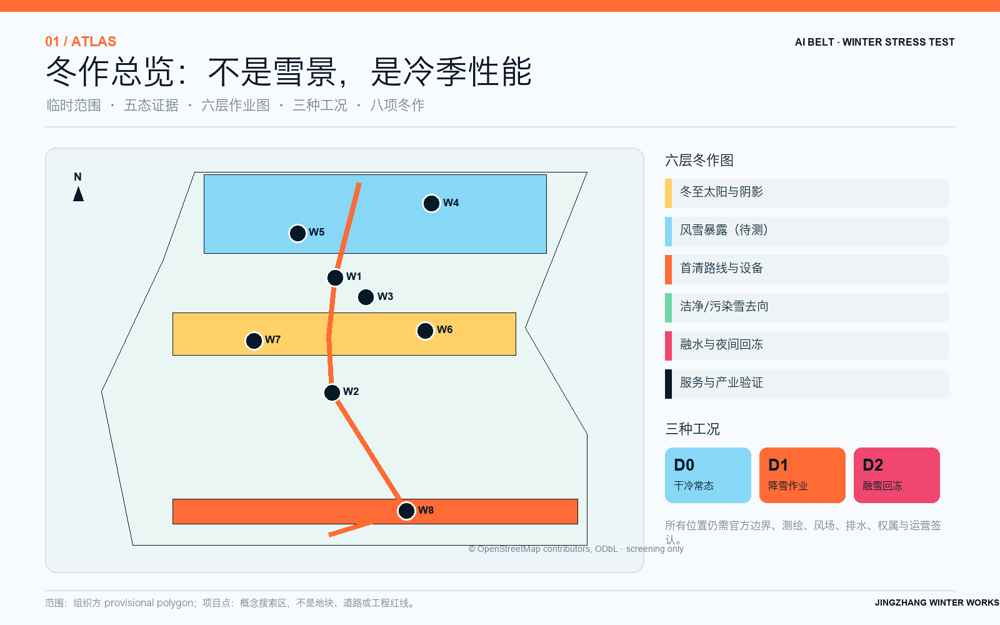
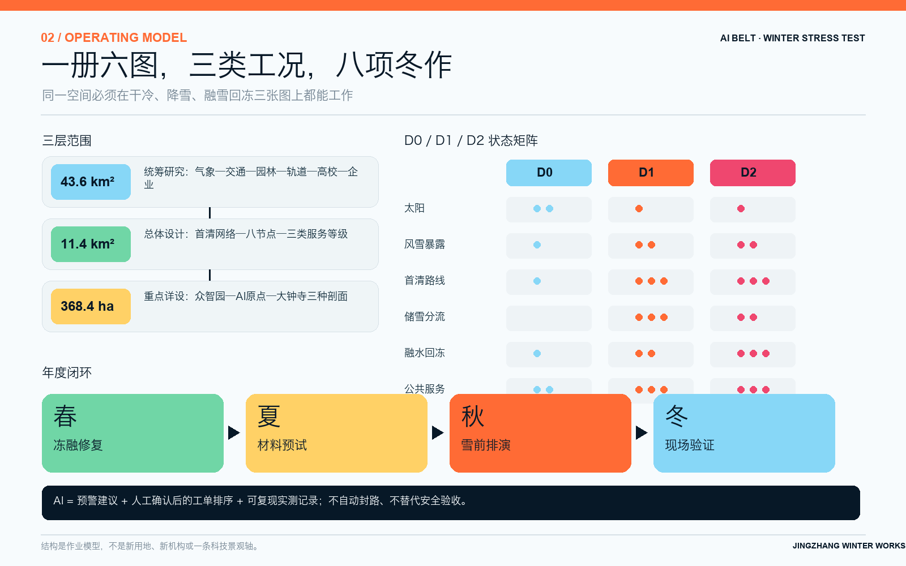
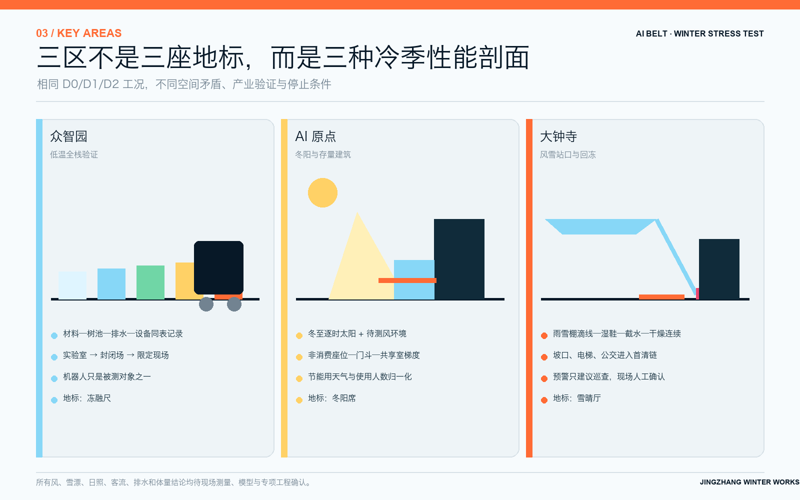
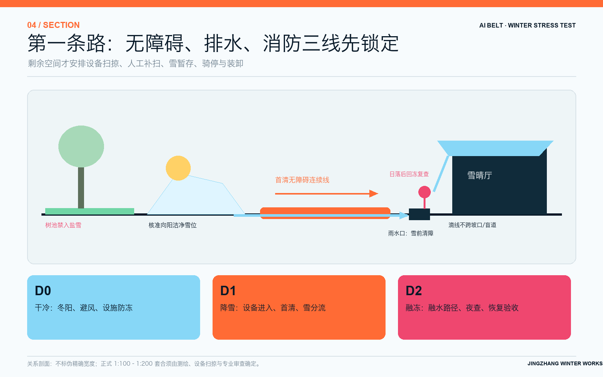
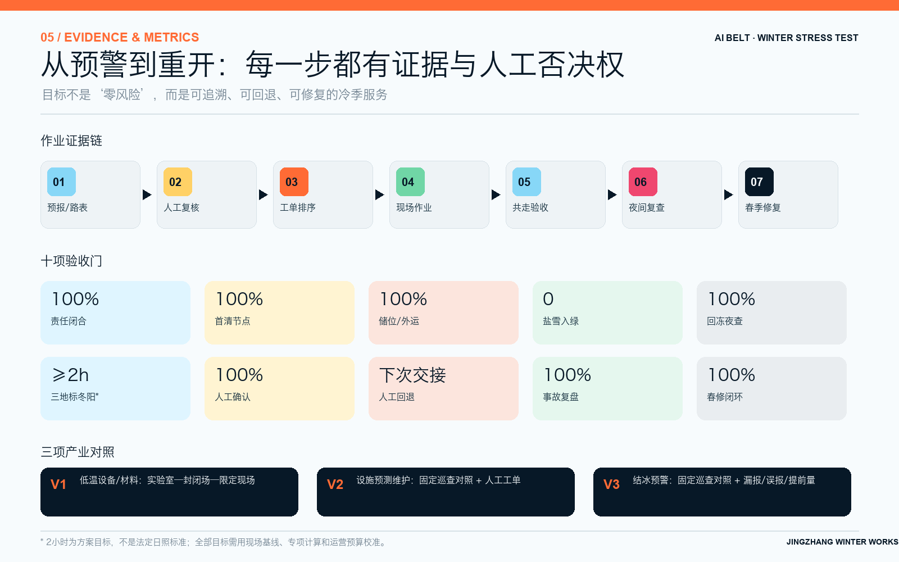

# 京张冬作 / JINGZHANG WINTER WORKS

> **以冬季为压力测试的 AI 创新带城市设计 / An AI Innovation Belt Stress-Tested by Winter**  
> **一座未来城市，必须在二月清晨也能工作。**  
> 成果类型：北京冬季城市作业图集 / Deliverable type: A Winter Urban Operations Atlas for Beijing

AI 创新带是设计对象，冬季是压力测试方法；这不是清雪专项，也不是冰雪节。多数城市效果图发生在树叶繁茂、路面干燥的午后；真正暴露一条创新带空间、产业、治理与运营质量的，却是夜雪后的清晨、冬至低角度阳光、站口风驱雪、融水夜间回冻，以及轮椅、盲杖和清雪设备争用同一条路的时候。“京张冬作”不再画一条新的科技轴，而是把京张沿线当作一套接受冬季压力测试的 AI 创新带：雪从哪里落、先清哪条路、暂存在哪里、融水流向哪里、何处会回冻、产业验证如何进入受控场景、谁在何时复核，全部进入城市设计。

AI 创新带是城市设计与长期运营议题；AI 技术在方案中的直接介入只承担三项有限工作：辅助预测路表结冰、整理人工复核后的工单优先级、记录低温设备测试。清雪决定、道路关闭、无障碍验收、站城运营和工程审批始终由有权人员负责。成果以“北京冬季城市作业图集”为载体，包括冬至太阳图、风雪暴露图、清雪作业线、储雪位、融水路径、回冻点、冬季服务等级与三处重点区的场地套合前平剖原型。

## 设计依据与资料清单

正式资格预审公告确定统筹研究范围约 43.6 平方公里、总体设计范围约 11.4 平方公里，三处重点区合计约 368.4 公顷：众智园 192.1 公顷、北京 AI 原点社区 104.3 公顷、大钟寺 72.0 公顷。本方案采用 2026 年 5 月 9 日公告口径；早期宣传中的约 37 平方公里和“学北园”不进入正式结论。[source:OFFICIAL-ANNOUNCEMENT]

当前仓库仍未提供官方机器可读红线、宗地、权属、道路红线、文保控制线和完整控规指标。提交包沿用组织方 provisional polygon，只用于生成、讨论和拓扑自检，不是官方红线、审批依据或精确面积依据。官方 polygon 发布后，九个 GeoJSON 图层、面积、冬季模型、图纸和 PDF 必须统一重算，而不是只换一张范围图。[data:geometry/site_boundary.geojson#SITE-001]

北京现行气候适应行动方案把寒潮、暴雪及气温/风力/冰雪对交通、能源和城市运行的影响列为风险评估对象；《北京市雪雾低温天气应急预案》指出近十年低温事件极端化概率增加、霜冻期扩大而降雪概率下降。这意味着“雪少”不能成为不设计冬季工况的理由：低频事件更需要明确启用条件、人员和备用路径。[source:BEIJING-CLIMATE-ADAPTATION]

北京市扫雪铲冰规定要求夜间降雪后主要道路在次日 7:30 前、其他责任地段在 10:00 前清扫，清除冰雪整齐堆放在不妨碍交通的向阳处；含融雪剂的冰雪不得堆入树坑和绿地。2024 试点工作方案进一步强调机械清扫优先、融雪剂“能减尽减、应禁全禁”、按网格提前划分人行步道责任段。本文只在适用责任地段引用这些要求，不把道路条款自动套成所有公园和站口的统一时限。[source:BEIJING-SNOW-MANAGEMENT]

资料使用分为五级：法律、公告和现行标准支撑规则；政府规划和项目公示支撑状态；开放地图只做现状线索；仓库 provisional 几何只做临时容器；同业方案只做原创性查重。2026 年 8 月 10 日 14:09:40（北京时间）固定到 `origin/main@a88a818` 的 400 个方案目录中，标题没有冬季主命题；按文件计，“积雪/结冰/冻融/融雪/清雪/除雪/寒潮/低温”分别命中 4/5/3/2/1/1/1/3 份，“回冻/结冰预测/冻融材料测试/风雪站口换乘”均为 0。相较前一快照新增 1 个目录：`2830500285/jingzhang-open-loop` 只在四季活动中设置冬季年度复盘；同时复核两份修订稿：`wms2537/jingzhang-city-model-commons` 是与冬季无关的通用仿真压力测试，`xr843/jingzhang-two-way-line` 只有余热暖廊/温室子项。三者均无完整清雪—储雪—融水—回冻作业链。检索范围、glob、命令和 commit 在来源登记中公开；词法命中只作差异线索，不是绝对原创证明。本方案不复制其中的低温机器人、余热融雪或除雪堆放提议，而把原创边界锁定在完整冬季作业链。[source:PEER-SCAN-20260810]

## 三层范围工作框架

三层范围共同读取六张冬季作业图：冬至太阳与阴影、风雪暴露、清雪优先级与设备路线、临时储雪与外运、融水排放与夜间回冻、低温公共服务与产业验证。每张图同时区分现状、已批、在建、规划和本方案建议五种状态，避免把仍在报批的控规草案或在建项目误画为现状。[depth:three_level_scope_framework]

43.6 平方公里统筹层回答“气候、产业与城市运行如何形成冬季创新能力”：连接气象、交通、园林、环卫、轨道、高校、企业与社区的资料和测试条件。11.4 平方公里总体层回答“雪和人在空间里怎么走”：形成一张优先路网、八处冬作节点与三类冬季服务等级。三处重点区则各画一套平面、剖面和作业流程，分别验证低温材料/设备、冬阳共同空间/建筑门厅、大客流站口的风雪与回冻。

总体结构不套用“一带三核”的通用造型，而以“**一册六图、三类工况、八项冬作**”形成一带总体概念。三类工况是：D0 干冷常态，关注冬阳、避风和设施防冻；D1 降雪作业，关注优先清雪、设备扫掠和临时储雪；D2 融雪回冻，关注湿滑入口、排水断点、夜间复冻和防滑复核。任何设计都必须在 D0/D1/D2 三张状态图上仍能使用。

任务书的三大定位在冬作中逐项落地：“百年京张文化带”转译为公开测量、维护与复盘的工程文化；“都市 AI 生活体验带”转译为人人可用的冬季通行、停留和问询；“AI 融合创新带”转译为有人工对照、失败记录和停止条件的低温验证。五大功能也不另造五栋地标：AI 全栈自主创新在众智园做低温全栈验证，世界级 AI 创新生态在原点与两翼组织人才和服务，AI+ 场景赋能在小月河翼及受控作业面开放，智能化 AI 活力城市由全年可达和大钟寺智能原生服务承接，AI 治理全球话语权则由可审计基准、人工否决和退出协议形成。[source:AGENT-TASKBOOK]

“三区两翼”是一条协同回路而不是五块孤岛：众智园把材料、设备和维护失败变成可复现实测；AI 原点连接高校、社区、建筑能源与人才日常；大钟寺把验证结果转成可体验的冬季辅助出行、维修和商务服务；中关村科技服务翼提供拟议的标准、知识产权、保险、资本和国际连接；小月河场景赋能翼承接低风险现场演练和公共反馈。南北以首清候选链贯通三个重点区，东西以站口—园区—校园—社区的服务回路缝合；这些只是待网络分析、权属和运营确认的概念联系。[data:geometry/roads.geojson#ROUTE-02]

视觉识别不使用未经授权的铁路徽记、企业标志或雪花图案。Logo 方向是一条穿过 D0 冰蓝、D1 安全橙、D2 回冻红三块状态窗的橙色“第一条路”，右端保留开口，表示尚待人工验收；图纸统一采用深夜蓝、冰蓝、冬阳黄、安全橙和回冻红。文化导视另用“测量刻度—工单时间—人工签认”三类符号，与一带 Logo 分开。国际传播主句为 **“The Future City Works in Winter.”**，事实状态必须同时标注 concept / under review / approved / built。

八项冬作是：W1 冬作底图与首场雪审计；W2 雪先清无障碍链；W3 向阳储雪—融水—回冻剖面；W4 众智园冻融共测场；W5 众智园低温生产支援院；W6 原点冬阳共学房；W7 清华园遗产冬护段；W8 大钟寺雪晴换乘厅。它们在结构化图层中只表达概念位置、关系和搜索范围，不构成道路、河道、文保或建筑工程线位。[data:geometry/public_space.geojson#WW-01]

## 统筹研究范围产业与未来城市研究

京张可以把北京真实冬季转化为负责任的创新条件，而不是把公共空间变成无边界试验场。产业链从环境试验箱开始，依次经过材料小样、封闭户外场、受控作业面和有限公共服务；每一级都记录温度、湿度、路表状态、融雪介质、设备版本、人工接管和失败样本。只有在封闭测试通过、专业安全审查完成、人工替代已排班后，技术才进入下一层。[source:AGENT-TASKBOOK]

重点产业不只包括机器人。铺装、树池边界、排水构件、坡道、设备外壳、传感器、动力电池、门厅、风幕、控制系统和冬季防护用品都可进入同一套低温—冻融—融雪介质—维护循环。众智园承担材料与设备共测，AI 原点把建筑节能、空间共享和用户研究连接起来，大钟寺检验站口大客流与多运营主体条件。测试结果不以“设备数量”展示，而以失败模式、维护工时、修复难度和退出决定展示。

六个 AI 创新生态案例与两个冷季作业参照分开使用，避免用气候案例替代产业研究：

| 案例 | 可核查机制 | 对京张的有限转译 |
| --- | --- | --- |
| Singapore one-north | 研究机构、企业、高校、创业空间邻近，园区作为 living lab | 原点—众智园之间形成“研究—封闭验证—有限场景”短链，不移植土地制度 [source:CASE-ONE-NORTH] |
| Punggol Digital District | 校园与产业共址，开放数字平台和数字孪生支持先虚拟后现场 | 冬季设施数据按最小必要开放，测试先模拟再进受控场 [source:CASE-PUNGGOL] |
| Seoul AI Hub | 城市支持空间、人才、算力、PoC 与产学研协作 | 中关村翼拟议提供共享算力申请、基准和对接，不承诺补贴 [source:CASE-SEOUL-AI-HUB] |
| Montréal Mila / Mile-Ex | 研究人才、企业伙伴与 AI 初创形成合作网络 | 原点共学房连接研究者、运营者和公共问题，不复制组织模式 [source:CASE-MILA] |
| Pittsburgh Robotics Network | 大学研究、机器人企业、加速与产业需求形成商业化网络 | 众智园由真实冬季运维问题发题，以失败样本和维修能力筛选 [source:CASE-PITTSBURGH-ROBOTICS] |
| 张江 AI 创新小镇 | 模型、算力、数据、场景和创业服务形成全链支撑 | 两翼把验证结果接向 IP、标准、保险、资本与采购论证，不引用招商目标 [source:CASE-ZHANGJIANG-AI] |
| Edmonton WinterCity | 冬阳、挡风、照明与冬季生活一体设计 | 只借设计镜头，风屏参数必须在北京复测 [source:CASE-EDMONTON-WINTERCITY] |
| Oulu winter maintenance | 全年步骑依赖清晰维护等级与持续运营 | 只借“分级+复核”机制，不移植雪深、时限或气候阈值 [source:CASE-OULU-WINTER-MAINTENANCE] |

另以 Singapore Rail Corridor、Paris Petite Ceinture 检查遗产绿廊的分段与生态连续，以 Kendall/Volpe 检查公共收益边界；这些是空间实施参照，不计入上述六个 AI 生态案例。案例只贡献机制，不移植投资数字、气候阈值或制度结论。

AI 创新生态图谱采用八个机制而不是企业名单。**土地**提供经批准的可逆试点载体；**空间**形成实验室—封闭场—有限现场梯度；**产业**围绕低温设备、建筑能源、材料和运维；**资金**区分公共基本服务与企业测试经费；**人才**连接使用者、班组、研究者和工程师；**算力**服务可复现基准而非持续监控；**数据**使用天气、路表、设备和工单的最小必要字段；**场景**通过问题单、人工审查、受控验证和退出验收开放。中关村翼连接标准/IP/保险/资本，小月河翼连接低风险实地验证；任何补贴、招商、算力券或投资都保持 proposal，不写成承诺。

与北纬社区、未来科学城、怀柔科学城、经开区及京津冀的区域协同只提出“基准互认”的研究议题：交换去标识化的低温工况、测试协议、失败模式和维护成本，比较园区、科研装置、制造和交通场景；不虚构合作协议、企业入驻或空间连线。通过同一测试卡复现而非同一平台锁定，才可能形成可迁移的北京冷季 AI 城市基准。

未来城市形态由“永久底盘、季节构件、测试件”三层组成。永久底盘是无障碍坡口、排水坡、雨水口、树木、照明、厕所和维修通道；季节构件是挡风屏、清雪工具点、砂砾箱、可移动座椅和临时雪标；测试件是可编号、可拆卸、可对照的材料板、传感器和设备。测试件不得破坏永久底盘，季节构件撤除后不得留下障碍。北京《超低能耗公共建筑设计标准》的室外风、热和日照模拟方法只作为建筑/节点深化参考，不外推为整条公园的强制指标。[standard:DB11-T-2240-2024]

AI 只在完整证据链中出现。路表结冰模型的输出必须与人工温度、湿度和摩擦复核并列；工单排序不得降低无障碍、学校、站口和应急路线的优先权；低温机器人测试必须记录制动、续航、传感、噪声、人工接管和停止条件。模型漂移、传感器结露、通信中断或无法解释的误报都会触发人工模式，不能由算法自行关闭公共路线。

## 总体设计范围城市更新与控规深度城市设计

总体设计先叠合京张公园一期二期、清华东路南侧、众智园、大钟寺站城和轨道工程的五种状态，再寻找冬季缺口。方案不重新命名已有公园，也不把在建项目包装成原创；它补充的是常被常温图纸遗漏的太阳角、风驱雪、设备扫掠、雪临时占地、盐雪隔离、融水路径、夜间回冻和设施防冻。[source:HAIDIAN-URBAN-RENEWAL-GUIDE]

控规、宗地、权属、路网、建筑现状和管线未完整公开，因此 `land_use.geojson` 只是概念功能覆盖而非最终用地图；容积率、建筑高度、密度、退界、绿地率与建设规模均保持 unknown。冬至太阳图可用约 39.98°N 的天文关系作早期筛查：冬至太阳正午高度角约 26.6°，但真实阴影必须用建筑测绘、地形和逐时模型重算，不能由这一个角度直接判定合规。[metric:winter_solstice_solar_altitude_deg]

W1 建立 30 个候选观察点，覆盖桥下、坡口、站口、校园边缘、河岸、树池、雨水口和施工围挡；每个点在干冷、降雪、融雪和夜间四次记录。W2 把无障碍、学校、站口、医院/社区服务和应急路径列为优先链，给出清雪设备可达、人工补扫、临时绕行和复核人。W3 为每段优先链指定临时储雪搜索区、含盐/不含盐分流、外运条件、融水排放和回冻检查点。[depth:existing_conditions_diagnosis]

“储雪位”不是把雪推到绿地。无融雪剂的洁净雪可在不妨碍交通、经园林和排水核准的向阳硬质/透水作业面短时存放；含盐雪进入隔离容器或外运链，不接触树坑、绿地和雨水花园。所有雪堆必须检查遮挡视线、占压盲道、堵塞雨水口、融水横穿步道和夜间回冻五项风险。

本包不声称已经完成真实的 1:500 作业平面或 1:100—1:200 工程剖面。当前成果是“规范关系原型+待套合”：只定义不可占用的无障碍、排水、消防连续线，以及需要被求解的设备扫掠、储雪和融水关系，不从示意图像素反推宽度。1:500 场地套合平面和 1:100—1:200 代表性剖面是取得测绘、权属、设备、管线和运行资料后的下一阶段交付，并须由交通、水务、园林、无障碍、消防和运营团队签认。

## 重点区域详细设计

三处重点区采用同一 D0/D1/D2 工况，却有完全不同的冬季任务。所有范围仍是 provisional 粗略 polygon，以下图示只表达参考方案与专业深化框架，不能作为工程或土地结论。[data:geometry/key_areas.geojson#PROV-KEY-001]

| 重点区 | 冬季核心矛盾 | 空间原型 | 产业验证 | 功能地标 |
| --- | --- | --- | --- | --- |
| 众智园 192.1 ha | 清河/五环暴露、生产物流与公众路径、材料和设备耐久 | 封闭共测场 + 低温生产支援院 + 清河冬季生态界面 | 铺装/树池/外壳冻融与介质循环；低温机器人作为其中一项 | 冻融尺 / Freeze–Thaw Gauge |
| AI 原点 104.3 ha | 冬至低角度日照、校园边界、短时共享与门厅热损失 | 背风向阳共学房 + 可关闭门斗 + 遗产冬护段 | 建筑能耗、门厅热损失、室内外过渡与占用控制 | 冬阳席 / Winter Sun Commons |
| 大钟寺 72.0 ha | 站口风驱雪、湿鞋带入、入口积水、夜间回冻与换乘连续 | 雪晴换乘厅 + 入口截水/干燥序列 + 优先清雪环 | 路表结冰预警、客流/作业冲突与人工响应 | 雪晴厅 / Snow-Clear Hall |

**众智园。** W4 冻融共测场优先使用既有硬质场地或院落，分成材料小样、封闭设备、受控作业和公众解释四区。铺装、坡口、树池边、雨水口和设备外壳在相同记录表下经历自然天气与实验室循环；受融雪介质影响的小样与洁净融水严格分开。W5 低温生产支援院容纳干燥、充电、备件、维修、工具、值守和工作人员热恢复，不把后勤挤进公共步道。低温机器人已有同业前案，本方案只把它纳入材料—排水—维护的共测体系，不声称首创。[data:geometry/buildings.geojson#BLDG-WINTER-001]

**AI 原点。** W6 冬阳共学房不是全天供暖的玻璃温室，而是由南向冬阳、背风转角、低导热座面、可关闭门斗、非消费座位和短时共享室组成的室内外梯度。冬至 10:00—14:00 的日照时数、风环境和门厅热损失先模拟再现场校核；夏季遮阳与自然通风同步验证，避免冬季优化制造夏季过热。W7 清华园遗产冬护段只做排水、冻融巡查、低扰动防滑和可逆设施，正式文保范围外才讨论新增构件。[standard:HERITAGE-PROTECTION-LAW]

**大钟寺。** W8 雪晴换乘厅把“室外雪—入口湿滑—鞋底带水—夜间回冻”画成连续剖面：上风向挡雪但不封堵视线，候车点避开落雪涡区，入口外设可维护截水与粗糙面，室内吸水区不缩窄疏散，无障碍路线与第一清雪路线重合，融水不跨越坡口或盲道。站口位置、风场、客流、排水和消防资料未到位前，只画备选关系，不画新连廊或地下工程。[standard:DB11-T-2129-2023]

三处“场地套合前原型”把平面依赖、剖面尺寸域和下一阶段成果分开登记。这里的“尺寸域”是待实测条件共同求解的净空、扫掠、排水、风雪和运营界面，不是预设宽度或从示意图读取的尺寸：

| 重点区 | 平面关系与依赖顺序 | 剖面尺寸域（均待解，不给伪数值） | 尚缺资料 | 下一阶段交付 |
| --- | --- | --- | --- | --- |
| 众智园 | 先套合既有硬地/院落、物流与公众路径、消防和洁净/污染水路，再布置封闭测试、材料小样、维修和热恢复 | 无障碍/消防净空；设备转弯—制动—失效余量；样架与维修作业；雪量—储位—外运；板面标高—树根—雨水口/管底 | 实测底图、权属、测试设备包络、消防/供电、汇排水与清河生态/防洪接口 | 经资料确认后形成 1:500 套合平面、代表性 1:100—1:200“硬地—样架—截排水—雪储位”剖面、设备扫掠与水量核算 |
| AI 原点 | 先套合南向首层、出入口/疏散、校园与文保边界、树木阴影和公共/非公共时段，再比较门斗、座位和共享室 | 无障碍/疏散净空；门扇与排队；室内外缓冲；冬阳—挡风—夏遮阳；门槛—截水—室外标高 | 建筑/树木测绘、正式文保范围、权属和开放时段、能耗/渗风/占用、冬夏风热日照基线 | 形成 1:500 首层—室外套合平面、代表性 1:100—1:200“冬阳席—门斗—共享室”剖面，以及逐时阴影、风热与夏季过热联合校核 |
| 大钟寺 | 先套合真实站口、客流/排队、无障碍与疏散、公交/骑行/装卸、清雪扫掠和排水，再选择挡雪、候车、截水与干燥关系 | 无障碍/疏散净空；队列和候车；清雪设备扫掠/储雪；室外坡口—截水—吸水区；风屏—视距—落雪涡；雨水口/管底 | 官方站口与轨道接口、峰时客流、风驱雪、地形/管网、消防、权属和各班组作业资料 | 形成 1:500 站口作业平面、代表性 1:100—1:200“室外雪—截水—干燥—换乘”剖面，以及风雪/排水/疏散联合校核和签认版作业卡 |

## AI 创新生态、人才画像与 AI+ 场景

方案跟踪八类冬季使用者：轮椅、盲杖和行动不便者；独自上学儿童与推车照护者；需要冬阳、休息和防滑的老人；步行骑行通勤者与骑手；清雪、园林、排水和维修人员；站务、公交与商户；高校师生、初创团队与测试工程师；铁路遗产访客。每类场景都记录“出发—遇雪/遇风—求助—绕行—到达—反馈”，并由本人或代表参与首场雪复核。[standard:ACCESSIBILITY-LAW]

十四张场景卡覆盖干冷、降雪、融雪回冻和系统失效：

| # | 场景 | 人与时间 | 空间动作 | 评价内容 |
| --- | --- | --- | --- | --- |
| 01 | 首场夜雪 | 清雪班组 05:30 | 按优先链开路、标记未清段 | 到岗、设备扫掠、复核闭环 |
| 02 | 轮椅早高峰 | 通勤者 07:10 | 坡口—步道—站口连续通行 | 净空、横坡、雪脊、替代路 |
| 03 | 独立上学 | 儿童 07:30 | 穿越园区出入口 | 视距、雪堆遮挡、机动车礼让 |
| 04 | 盲杖与砂砾 | 视障访客 08:20 | 触觉导向与入口辨识 | 盲道可读、松散物、人工问询 |
| 05 | 冬季骑行 | 通勤者 08:40 | 主链—停车—步行换乘 | 防滑、清雪等级、停车积雪 |
| 06 | 冬阳停留 | 老人 11:30 | 向阳席短时休息 | 日照、风、座面与厕所可达 |
| 07 | 寒潮门厅 V2 | 师生与设施员 13:00 | 室外—门斗—共享室；电梯/泵/门斗异常复核 | 固定巡查对照、故障提前量、无效工单 |
| 08 | 低温机器人 V1 | 工程师 14:00 | 封闭场制动/续航/感知 | 人工接管、失败样本、版本 |
| 09 | 冻融材料工程检测 | 材料/园林团队 | 小样—树池—排水构件共测 | 剥落、摩擦、盐害、可修性；不强贴 AI |
| 10 | 融雪午后 | 排水人员 15:30 | 清理雨水口与截水沟 | 水路、堵塞、跨路湿带 |
| 11 | 夜间回冻 V3 | 站务与维护 21:30 | 复查入口、坡口和阴影区 | 路表预警、人工摩擦复核 |
| 12 | 盐雪分流 | 园林人员 | 洁净雪与含盐雪分开 | 树坑/绿地零接触、外运记录 |
| 13 | 寒潮停电 | 夜班人员 | 数字导向关闭、人工作业 | 纸图、照明、手工工单连续性 |
| 14 | 春季复盘 | 运维与设计团队 | 检查冻融破损并关闭工单 | 修复工时、材料替换、下一季改图 |

V1—V3 为三项 AI/产业测试。当前没有已训练模型、场地数据集或性能结果；以下卡片定义的是实施前必须预注册的评价方法。三项都先在影子模式与既有人工流程并行，按设备/节点和独立天气事件划分训练、校准与留出评价，保留缺测和失败样本；阈值须在基线形成后由专业人员确定，本包不预设准确率、提前量或风险阈值。冻融材料仍采用摩擦、含水、病害与可修性的常规工程检测，不为凑 AI 使用机器视觉。[data:geometry/constraints.geojson#TEST-WINTER-001]

**V1 低温设备受控验证卡。** **输入：**环境/路表温湿度、降水与表面工况，设备硬件/软件版本、电量、载荷、速度、制动/感知/通信/急停日志；不采集无关行人身份。**基线/对照：**同一设备的常温/厂商试验记录、封闭场人工操控和现行人工/机械作业，不以另一个未知模型作唯一对照。**输出：**带工况、版本和数据质量的测试记录与复核清单，不输出公共道路“可安全运行”结论。**人工确认：**测试负责人核对场地、急停、制动余量与接管记录，安全负责人决定是否进入下一工况。**评价：**制动表现相对对照的分布、续航保持、漏检/误检、接管与急停、失联/结露、噪声、失败恢复和跨版本漂移；不在本轮填伪门槛。**停止/退出：**急停或人工接管不可用、失控偏离、制动/感知数据无效、通信中断或未解释失效即终止该轮；退回人工/常规设备，未完成独立安全审查不得进入有限公共服务。

**V2 设施预测维护评价卡。** **输入：**电梯门循环/故障码/电流或振动、泵启停/水位与报警、门斗开闭/位置与室内外温差、室外天气、资产版本、既有巡检和维修工单；人员活动只保留实现任务所需的聚合字段。**基线/对照：**固定周期巡检、设备自带规则报警和当前故障响应，先并行记录而不自动派单。**输出：**带位置、时段、数据质量、原因字段和不确定性的“建议检查”列表，不自动判故障、停梯或改变法定维保。**人工确认：**设施员现场检查后标记真故障、无需处置、数据问题或待专业维保；有权维保人员决定工单和停运。**评价：**经确认故障的漏报率、误报率、提前量分布、无效工单/重复提醒、服务中断、人工工时变化、传感缺测及按季节/设备版本的漂移。**停止/退出：**漏掉安全相关故障、误报或无效工单持续增加、数据漂移/缺测无法解释、告警理由不可复核时关闭模型建议；固定巡检、原厂报警、人工报修和纸质台账不中断。

**V3 路表结冰预警评价卡。** **输入：**路表温湿度、气温/露点、降水与预报、阴影/排水暴露、清雪/介质处置、人工湿滑与摩擦抽查；不使用人脸或个体轨迹。**基线/对照：**固定时段巡查、现行天气/规则提醒和人工发现时间，在同一节点、同一事件中并行比较。**输出：**带位置、时间窗、输入完整度和原因字段的“优先巡查”建议；模型不得宣布安全、自动关路或延后无障碍路线处置。**人工确认：**站务或维护人员按获批方法现场复核表面状态、温湿度和摩擦，再由有权人员决定防滑、绕行、关闭与重开。**评价：**已确认结冰事件的漏报率、非结冰时误报率、相对人工发现的提前量分布、定位偏差、无效出勤/工单、数据在线率、传感漂移和事件/季节迁移。**停止/退出：**出现漏掉的安全事件、无法解释的密集误报、结露/校准漂移、通信/覆盖中断或未经人工确认触发处置时，立即停用模型提醒；恢复固定巡查、物理防滑、纸图和人工工单。

三个地标同时是公共学习装置。冻融尺公开材料版本、天气、失败和修复；冬阳席把冬至太阳、夏季遮阳和开放时段画在同一块低技术标牌上；雪晴厅显示已清/待清/绕行、最后人工复核时间和投诉入口。荣誉墙记录清雪、维修、园林、站务和测试团队的共同贡献，而不按设备数量评奖。

公共空间组件库按四组编号，全部可替换、可维护：通行组包括雪标、坡口边界、临时绕行牌；雪水组包括洁净/污染雪标、可清理截水件、雨水口防堵件；停留组包括低导热座面、可移挡风屏、热恢复点；验证组包括材料小样架、路表温湿度点、纸质工单夹。组件不得侵占无障碍、排水、消防和视距；文保区内必须低扰动、可逆、可识别。组件说明公开尺寸接口、材料、维护、失败和退役，不绑定供应商。

大钟寺的“智能原生消费与商务”不是强制扫码店，而是可选择的冬季辅助服务：经过验证的防滑/维修组件展示与预约、设备体检和人工接管演示、无障碍出行协助、气候科技服务咨询、测试结果路演和企业—运营者问题发布。基本候车、问询、取暖和无障碍通行始终免费且有非数字等价服务；任何保险、采购或商务转化须另行审查，不在本方案中承诺成交。

## 用地、建筑规模与拆改留方案

本方案不因冬季主题重划法定用地。`land_use.geojson` 用公园开敞底盘、科研/测试、创新服务和现状混合城区四种概念覆盖满足机器可读拓扑，每项均标注 `not_statutory_land_use=true`。正式用地、宗地、权属、建筑规模、容积率、限高、密度和退界仍为 unknown；冬作节点的面积只是比较和作业组织，不是土地供应或建设指标。[data:geometry/land_use.geojson#LU-WINTER-GREEN]

建筑采取“门厅先改、首层再用、院落先试、新建最后”的次序。众智园优先在既有厂房或硬质院落布置小样架、维修和热恢复；AI 原点优先改造门斗、南向首层与可预约共享室；大钟寺优先修正站口外部地坪、截水、候车和人工问询。新增体量只有在现状建筑、消防、结构、权属、能耗和全生命周期碳比较后才讨论。

拆改留增加冬季专项字段：冻融破损、渗漏/结露、门厅热损失、冬至日照、风雪涡区、设备防冻、清雪可达和维护工时。铁路遗产与成熟树木默认保留；任何防滑、挡风、排水构件在文保区域内必须最小干预、可逆、可识别，且不得将融雪剂或集中融水引向基础、树根或历史材料。[source:BEIJING-URBAN-RENEWAL-REGULATION]

概念建筑 envelope 只标出三类需求：众智园的共测/维修/热恢复，AI 原点的门斗/共学/南向过渡，大钟寺的候车/问询/干燥。它们不是现状建筑轮廓，也不是建议拆建范围；正式方案必须以建筑普查和 1:200 现场套合替换。[data:geometry/buildings.geojson#BLDG-WINTER-001]

## 交通、轨道、市政与公共服务设施

冬季交通的第一原则是“先打开一条每个人都能用的路，再向两边扩展”。优先链把连续无障碍、学校、站口、公交、社区服务与应急连接放在前面；每段同时登记责任人、作业设备、人工补扫、临时绕行、雪储位和人工验收。自行车、配送与低速设备只有在行人和无障碍连续后进入后续等级。[standard:DB11-1761-2020]

清雪剖面先锁定三条不可占用线：无障碍连续线不得被雪脊、工具或停放车辆阻断；排水连续线不得被雪堆、砂砾和落叶堵塞；消防连续线不得被季节设施和设备侵占。剩余空间才安排设备扫掠、人工补扫、临时储雪、骑行停车和装卸。具体宽度由现状测绘、道路等级和设备选型共同确定，不把概念图的像素当尺寸。

轨道站以 300 米/5 分钟网络为专业参考，重点审计站口、坡道、电梯、公交、骑行停车和首层服务在风雪条件下是否连续。大钟寺必须做冬季风场、风驱雪、入口带水、排水能力和疏散叠合；24 小时通道、挡风构件和任何地上地下连接都需轨道、消防、产权与运营审查。[standard:DB11-T-2129-2023]

市政设计把雪视作短时占地和延迟径流，但不把含盐融水直接送入海绵设施。洁净雪、含盐雪、普通雨水和设备清洗水分流；雨水口与截水沟在雪前完成清障，融雪午后与夜间降温前各复查一次。树池边保留机械防护，砂砾春季回收；厕所、饮水、电梯、照明、门禁、充电与消防设备逐项登记低温工作、断电和人工替代模式。

公共服务节点提供暖身但不强迫消费：背风向阳座位、短时热恢复室、厕所、饮水、急救、工具、砂砾和人工问询组合布置。它们首先服务老人、儿童照护者、行动不便者和户外劳动者。任何“智能取暖”或人流识别都必须说明能耗、数据、开放时段、维护和关闭后的等价服务。

## 蓝绿空间、公共空间与城市风貌

京张公园、清河和小月河构成既有蓝绿背景，冬季设计必须同时保护植物、土壤和水。含融雪剂冰雪不得堆在树坑和绿地；洁净雪临时储位也需避开幼树、脆弱枝下、生境核心和堵水位置。春季复盘检查盐害、土壤板结、树皮机械伤、砂砾残留和冻融剥落，把修复工时计入材料选择。[standard:BEIJING-SPONGE-CITY]

冬阳不是“多晒太阳”一句话。每个公共停留点同时画冬至 10:00—14:00 逐时阴影、冬季主导风与夏季遮阳；优先把老人座位、儿童照护、户外劳动者热恢复和非消费停留布置在有冬阳、避风又能看见主路径的位置。方案目标为三个功能地标在冬至时段获得至少 2 小时直射日照，但它不是法定日照标准，必须用真实建筑和树木模型校核。[metric:winter_sun_hours_target]

风雪构件采用“挡而不堵”：低矮透风屏、建筑转角修正、树阵和门斗减少下洗与积雪涡，却不封闭消防、视线和夏季通风。雪堆作为短期作业对象，不做永久景观雕塑；冬季色彩来自材料对比、清晰边界和暖色小构件，不依赖高亮屏幕。照明连续、低眩光，便于识别湿滑反光与地形变化。

铁路文化通过“工程如何过冬”叙述：线路测量、坡度、桥隧、排水、维护和时刻是百年工程文化的一部分。清华园站只在正式史料支持的范围讲述，新增冬护设施不附着文保本体；未鉴定的轨道、道岔或构件不声称原址遗存。冬作图集本身就是当代工程文化——把失败、修复和维护公开，而不是用铁路符号做装饰。[source:QINGHUAYUAN-PROTECTION]

空间故事线把三种文化连成一条工程伦理：百年京张提供“先测量再通行”的基础设施纪律，中关村创新文化提供问题驱动、快速试验和开放协作，AI 新文化增加不确定度、人工否决、失败可复现和数据最小化。导视分为一带视觉识别、铁路文化解释、冬作状态信息三层，禁止把历史标识改成 Logo 或让动态屏替代实体疏散。中文传播句为“未来城市，二月清晨也能工作”，英文为“The Future City Works in Winter”；每块国际说明同时回答 what changed、who verified、when updated、how to opt out。

概念场景用于解释空间关系，不是实景、现状证据或批准方案：

## 更新项目清单、实施政策与分期计划

| 冬作 | 0—6 月 | 6—18 月 | 永久工程前置 | 停止/回退 |
| --- | --- | --- | --- | --- |
| W1 冬作底图 | 五态叠图、30点四工况调查、首场雪演练 | 每季更新公开图 | official polygon、项目接口、责任人 | 无现场证据保持 provisional |
| W2 雪先清链 | 与重点人群共走、排定等级和纸图 | 标识、工具点、人工补扫 | 道路/公园/站区责任确认 | 无等价路线不得封路 |
| W3 储雪—融水—回冻 | 查雨水口、树坑、坡口和阴影区 | 试行洁净/含盐分流与复查 | 水务、园林、环卫、排水计算 | 出现跨路回冻即清场整改 |
| W4 冻融共测场 | 材料小样与记录协议 | 一冬自然暴露+实验室对照 | 权属、环境、安全、采购 | 数据不可比即不扩展 |
| W5 低温支援院 | 搜索既有院落/厂房 | 维修、备件、热恢复小试 | 结构、消防、能源、职业健康 | 无运营预算不建设 |
| W6 冬阳共学房 | 日照风环境与门厅热损失基线 | 可逆门斗、座面、开放时段试点 | 权属、消防、节能、夏季校核 | 夏季过热或能耗恶化则改造 |
| W7 遗产冬护段 | 文保范围叠合与病害巡查 | 低扰动防滑/排水原型 | 文保、结构、材料专家 | 未清文保边界不得附着 |
| W8 雪晴换乘厅 | 站口风雪/湿滑/客流审计 | 入口截水、候车、人工问询原型 | 轨道、消防、排水、产权 | 疏散或无障碍失败即撤回 |

0—6 个月不以建设为目标，而是跨越一个完整冷季建立基线：至少完成干冷、首场可观测降雪或替代演练、融雪和一次夜间回冻风险巡查。若当季无雪，以可追溯的模拟演练检查人、工具、路线和储位，但不得写成现场性能。6—18 个月只做可逆小样；18—36 个月在专项审批后改造地坪、排水、门厅和站口；3—5 年才复制经两个冷季验证的原型。[data:geometry/phasing.geojson#PHASE-001]

运营不另设虚构机构，而由道路、公园、物业、轨道、校园和园区的法定/合同责任主体在同一张冬作图上签认边界。每个节点必须有清雪责任人、复核人、排水/园林接口、设备和人工模式、投诉入口、预算类型与春季复盘。企业研发经费承担测试，公共资金优先保障无障碍、站口和应急路线；基本冬季通行不得收费或以个人数据交换。

年度活动不是冰雪节，而是 **Winter Works Open Season / 冬作开放季** 的四次公开作业：入冬前“雪前排演”，首场雪“第一条路”，融雪期“回冻夜查”，春季“冻融修复周”。活动视觉沿用 D0/D1/D2 状态窗和人工签认时间，不把极端天气娱乐化。开发者、材料企业、运营班组和使用者在现场共同读图，但公共路径不作为无知情测试场。[depth:phasing_implementation]

开发者社区按“城市问题单—最小数据包—可复现实验—运营班组复核—公开失败库”运行；场景开放分实验室、封闭场、限定现场三级，每次升级都有责任人、隐私/安全审查、人工等价服务和结束日期。拟议转化链为：问题发布 → 原型与对照 → 两个冷季或足够工况证据 → 专业/使用者评审 → 标准、IP、保险和采购论证 → 可选孵化/投资对接 → 其他片区复现。中关村翼承接专业与资本服务，小月河翼承接低风险场景；任何认证、采购、招商、投资或国际合作仍需独立决定，不由活动自动产生。

## 指标体系、面积复算与合规矩阵

指标分为事实、外部参考和本方案目标。事实只有公告范围、正式政策与可复算的提交几何；由于边界 provisional，计算面积只做文件自检。北京清雪时限、盐雪禁入树坑绿地属于适用规则；Oulu 等案例的厘米/小时维护阈值只作比较，绝不移植为北京指标。所有“100%、2 小时、一个班次”等均为本方案目标，需经现场、工程和预算校准。[metric:site_area_sqm]

| 维度 | 本方案目标 | 测量方法 | 未达标动作 |
| --- | --- | --- | --- |
| 作业覆盖 | 100% 优先链有责任人、设备、绕行、储雪位和复核人 | 冬作台账 | 缺任一项不得宣称就绪 |
| 无障碍连续 | 首批重点节点 100% 在清雪后保持连续可辨 | 轮椅/盲杖共走+测量 | 人工补扫或关闭并开等价路 |
| 储雪闭合 | 100% 优先段指定储位或外运路径 | 平面、扫掠与现场签认 | 不得把雪推入剩余空间 |
| 盐雪隔离 | 含融雪剂冰雪与树坑/绿地接触为 0 | 现场巡查与照片 | 立即转运并检查土壤/植物 |
| 回冻闭合 | 100% 已识别跨路融水点有排水/截流/夜查 | D2 工况巡查 | 防滑、截流并重开工单 |
| 冬阳 | 三地标冬至 10—14 时直射日照 ≥2h | 逐时模型+现场校核 | 调整座位/屏障，不以加热替代 |
| 试验治理 | 100% 测试有环境记录、人工对照、停止条件 | 测试卡 | 数据不完整不得升级 |
| 人工确认 | 100% 结冰预警由现场人员确认 | 工单日志 | 模型只保留研究状态 |
| 技术退出 | 在试验前登记的该责任主体“下一次有人值守交接窗口”内转纸图/人工工单 | 记录触发点及窗口起止的故障演练 | 不依赖单一平台；禁止跨主体把“一个班次”直接比较为同一时长 |
| 春季修复 | 100% 冬季破损有关闭、修复或接受记录 | 病害台账与工时 | 影响通行项优先维修 |

冬至正午 26.6° 是由纬度与天文关系计算的早期设计量，不是现场日照结论；2 小时冬阳、100% 闭合和一个班次是方案目标，不是现状成绩或政府承诺。其中“一个班次”不对应预设小时数，而是每个责任主体在试验前登记的下一次有人值守交接窗口；必须记录故障触发点和窗口起止，同一事件内检查是否完成，不能跨主体直接比较。`metrics.json` 记录类型、值、公式、置信度和复算前提；三个矩阵把公告 1.3—1.5、agent.1—agent.6、专业标准与图纸逐项关联。[depth:metrics_recalculation]

## 风险、版权与合规说明

**伪精度风险。** 缺 official polygon、测绘、风场、雪情、路表温度、摩擦、排水、树木、客流、权属和班组数据时，不能声称雪堆容量、清雪时间、风速改善、结冰概率或工程造价。本包没有真实的 1:500/1:100—1:200 场地图纸；现有图仅为未标比例的关系原型，正式套合后全部重画。[depth:risk_missing_data]

**单季与气候风险。** 一冬无雪不能证明系统有效，一次极端雪也不能代表常年；采用多年气象资料、可追溯演练和跨季复盘。气候变暖并不消除寒潮、低温和冻融风险。传感器失效或模型误报时，人工巡查与物理防滑仍然有效。

**生态与材料风险。** 融雪剂、砂砾和机械清雪可能损伤树木、土壤、历史材料与排水；优先机械/人工、分类储雪、限制介质和春季回收。不得把余热融雪或全线加热步道当默认方案，其能源、碳、维护和回冻副作用必须专项比较。

**安全与公平风险。** 风屏、雪堆、工具箱和测试设施可能遮挡视线、缩窄疏散或阻断盲道。清雪优先级不得只服务办公园区或商业入口；儿童、老人、残障、夜班和户外劳动者必须参加验收。公共路线不做人脸识别，不把行人当作不知情低温试验样本。

**文保与工程风险。** 清华园站与铁路遗存以正式保护图和审批为准；河道、轨道、站口、道路、消防与地下管线都需专项审查。任何挡风、排水、门斗、照明或附着构件只作为概念建议。[source:STREET-CONTROL-DRAFT-STATUS]

**原创与版权。** 冬季低温机器人、除雪堆放、余热融雪和冬至风影已有同业前案，本方案不复制其文本、图纸或品牌，也不单独声称这些子项首创。原创组合是全线“太阳—风雪—清雪—储雪—融水—回冻—无障碍—站口—春修”的冬季作业系统及三区互补剖面。文本、代码图、结构化设计图层和版式由 OpenAI Codex 原创生成；概念透视由内置图像生成工具生成，明确标注非实景。OSM 只用于带署名的路网筛查，许可见版权声明。

本方案采用 `COMMUNITY-DISPLAY-ONLY`，仅授权本征集社区展示，不重新许可官方资料、标准、开放地图或第三方内容。所有空间动作均为“概念建议、参考方案、可供专业团队深化研究”，不构成政府批准、法定控规、工程承诺、投资承诺、安全认证或运营授权。

## 参考资料

- 百年京张 AI 创新带城市设计国际方案征集资格预审公告，2026-05-09。
- 北京市适应气候变化行动方案，2024；北京市雪雾低温天气应急预案，2024。
- 北京市人民政府关于扫雪铲冰管理的规定；北京市扫雪铲冰作业工作方案（试点），2024。
- 北京城市总体规划、海淀分区规划、海淀区城市更新导则与沿线控规草案状态资料。
- 站城一体化工程规划设计标准 DB11/T 2129—2023；步行和自行车交通环境规划设计标准 DB11/1761—2020。
- 中华人民共和国无障碍环境建设法；中华人民共和国文物保护法；北京市城市更新条例。
- Edmonton WinterCity Strategy；City of Oulu Winter Maintenance；Rail Corridor；Petite Ceinture；one-north；Punggol；Kendall/Volpe；张江案例。
- OpenStreetMap contributors，ODbL；访问日期 2026-08-10。
- 固定到 `origin/main@a88a818` 的 400 份同业方案仅作语料查重，不复制资产。完整 URL、用途、时点和许可见 `sources.json`。[source:SOURCES-INDEX]
