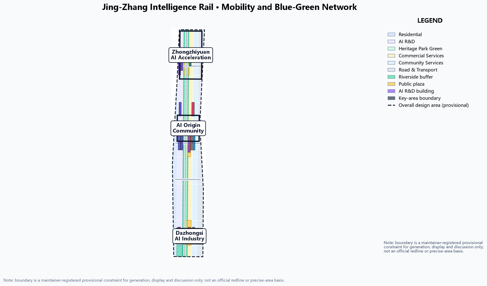
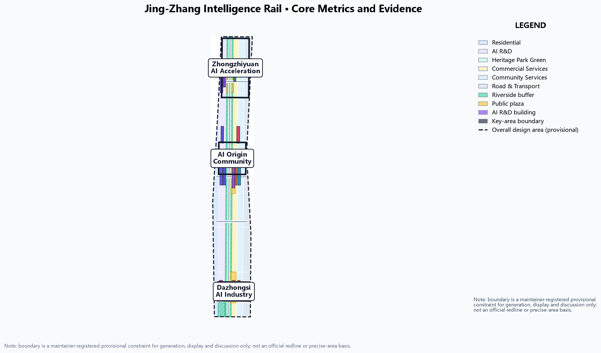

# JINGZHANG INTELLIGENCE RAIL: A City Track That Lets a Century-Old Railway Carry AI Innovation

## Design Basis and Source List

This formal proposal takes the Qualification Announcement for the International Urban Design Call for the Centennial Jing-Zhang AI Innovation Belt, issued by the Haidian Branch of the Beijing Municipal Commission of Planning and Natural Resources, as its primary basis, and the maintainer-registered provisional boundaries, key areas, enums, metrics and source list in `brief/site-package/` as its machine-readable basis [source:OFFICIAL-ANNOUNCEMENT] [source:AGENT-TASKBOOK]. Before generation we read `design_brief.json`, `allowed_design_space.json`, `sources.json`, `enums/`, `ranges/planning_limits.json`, `schemas/`, `standards/` and `data/source_registry.json`, and built task, scope, source-use and gap checklists from agent.1-agent.6 of `agent_taskbook.json`.

Boundary statement: all spatial suggestions in this proposal are generated on the maintainer-registered provisional boundary and are **conceptual suggestions, reference schemes open to professional deepening**; they do not replace formal planning and do not constitute a government approval conclusion [source:BOUNDARY-SOURCE] [source:KEY-AREA-SOURCE]. Official planning controls (FAR, building height, density, green ratio, setbacks) are not present in the site package and are treated as data gaps without fabricated precision [depth:existing_conditions_diagnosis].

Source-use boundaries follow `data/source_registry.json`: the announcement and taskbook are formal task bases, while provisional geometry is limited to generation, self-check, visualisation and design discussion and must not be used as an official redline, approval basis or precise-area recalculation basis [source:SOURCE-REGISTRY]. Existing buildings, ownership, road redlines, heritage zones, municipal utilities and engineering constraints lack official geometry and are registered as pending data under assumption A-CONTROLS-001 [assumption:A-CONTROLS-001].

## Three-Level Scope Framework

The proposal follows the announcement's three levels: the coordinated research area (43.6 km²) answers how the AI ecosystem and future city form are organised; the overall design area (11.4 km²) turns that judgement into a renewal framework, industry-space layout, transport-municipal support and urban character control; the key detailed-design area (368.4 ha) completes detailed design for Zhongzhiyuan, the Beijing AI Origin Community and Dazhongsi [source:OFFICIAL-ANNOUNCEMENT] [metric:site_area_sqm] [metric:key_area_count].

The three levels are not disconnected drawing sets: the research level decides industry chain and city-form judgement, the overall level applies that judgement to renewal projects, spatial structure and facility capacity, and the key-area level verifies implementability of specific parcels, buildings, transport, public space and AI application scenarios. Any area, ratio, scale or project count that cannot be recalculated from structured data is not written into formal conclusions; conclusions affected by the provisional boundary are explicitly flagged in the text and in `assumptions.json`. The three-level evidence chain is governed by [depth:three_level_scope_framework] with spatial evidence anchored on `geometry/site_boundary.geojson` and `geometry/key_areas.geojson` [data:geometry/site_boundary.geojson#SITE-001].

## Coordinated Research Area: Industry and Future City Research

**Overall concept: JINGZHANG INTELLIGENCE RAIL.** In 1909 the Jing-Zhang Railway became the first trunk railway independently designed and built by Chinese engineers - the origin of "self-reliant innovation"; today Haidian turns the same corridor into an AI innovation belt. This proposal translates the "track" into an urban organising motif: the heritage park greenbelt is the **memory track**, carrying a century of cultural memory and slow-mobility public life; the AI innovation factors strung along the belt form the **intelligence track**, carrying compute, data, talent and scenarios. The two run in parallel, connect at stations and coordinate through signals, forming a "one spine, three stations, two wings, multiple signals" spatial structure [source:AGENT-TASKBOOK].

Responding to the three positionings: **Centennial Jing-Zhang Culture Belt** - carried by the memory track and heritage narrative; **Urban AI Life Experience Belt** - carried by the intelligent-rail stations, scenario signals and public experience routes; **AI Integrated Innovation Belt** - carried by the three stations' industry functions and the two wings [source:AGENT-TASKBOOK]. Responding to the five functions, Zhongzhiyuan hosts the full-stack self-reliant innovation system and world-class AI innovation ecosystem, the Origin Community hosts the AI+ scenario empowerment paradigm, Dazhongsi hosts the intelligent vital AI city, and the two wings jointly support global AI governance voice [source:AGENT-TASKBOOK].

For agent.1 and agent.2, the proposal reviews six global AI innovation ecosystem references (Silicon Valley university-industry synergy, Shenzhen Nanshan, Hangzhou West City Sci-Tech Corridor, Singapore one-north, London King's Cross, Munich High-Tech Campus) and distils the chain "university origination - open-source collaboration - enterprise conversion - public experience - international dissemination", translating case lessons into spatial and operational mechanisms [source:AGENT-TASKBOOK] [standard:PROJECT-AGENT-OPEN-CALL-TASKBOOK]. For regional synergy, it connects north to Beifu Community and Future Science City, east to Huairou Science City, and south to E-Town within the Beijing-Tianjin-Hebei AI innovation network [assumption:A-REGIONAL-001].

**Naming and visual identity direction:** primary name "JINGZHANG INTELLIGENCE RAIL" (京张智轨带); the logo direction is a "dual-track plus signal" mark - two parallel rails abstracted into an innovation axis, with three signal dots representing the three intelligent-rail stations and extension lines for the two wings; the visual system uses railway industrial blue-grey with AI highlight violet/amber, balancing heritage memory and technological future. All brands, fonts, images and symbols require cleared rights before publication [source:AGENT-TASKBOOK].

## Overall Design Area: Urban Renewal and Regulatory-Plan-Level Urban Design

The overall design area proposes the "**one spine, three stations, two wings, multiple signals**" spatial structure [depth:overall_spatial_structure]:

- **One spine - memory track**: the Jing-Zhang Heritage Park greenbelt, a concept public main axis running north-south, slow-mobility first, heritage narrative, AI experience, expressed in `geometry/green_space.geojson` [data:geometry/green_space.geojson#GREEN-001].
- **Three stations - intelligent-rail anchors**: Zhongzhiyuan (manufacturing/training station), Beijing AI Origin Community (open-source/conversion station), Dazhongsi (application/scenario station), carried by the three key areas in `geometry/key_areas.geojson`, with concept renewal building footprints in `geometry/buildings.geojson` [data:geometry/key_areas.geojson#PROV-KEY-001].
- **Two wings - branch lines**: Zhongguancun technology-services wing (west) and Xiao Yuehe scenario-empowerment wing (east).
- **Multiple signals - stitching points**: east-west stitching mouths and scenario nodes along the memory track, expressed through concept roads in `geometry/roads.geojson` and plazas in `geometry/public_space.geojson` [data:geometry/roads.geojson#ROAD-001] [data:geometry/public_space.geojson#PUBLIC-001].

**Land-use structure:** research, education, culture-commerce, residential and public-service bands are organised along both sides of the memory track, with training-validation, open-source collaboration and scenario application functions at the cores of the three stations, in `geometry/land_use.geojson`, fully covering the design area without gaps or overlaps [data:geometry/land_use.geojson#LU-001]. Development intensity and building height are uniformly labelled "pending official regulatory-plan confirmation" because official control conditions are missing; no guessed values are presented as approved indicators [standard:MOHURD-CONTROL-DETAILED-PLANNING] [depth:development_intensity_controls].

**Retain-renovate-demolish:** "preserve railway heritage memory, renew inefficient industrial space, add AI innovation carriers". Preserved: the heritage park belt, heritage and historic buildings; renewed: inefficient land in the three stations, expressed as concept footprints in `geometry/buildings.geojson`; new: stitching nodes and public space. Without official existing-building and ownership data, retain-renovate-demolish remains a methodological suggestion and calibration list, not a parcel-level conclusion [depth:retain_renovate_demolish] [data:geometry/constraints.geojson#CONSTRAINTS].

## Detailed Design of Key Areas

### Manufacturing/Training Station - Zhongzhiyuan AI Acceleration Area (192.1 ha)

Focused on national AI platforms and full-stack self-reliant innovation: compute-training clusters, model evaluation centres, AI standards and safety-governance laboratories; the "Zhongzhi Signal Tower" AI pilgrimage landmark - reflecting sky by day and showing training-task status as a light column at night; combined with Qinghe culture to create low-carbon green innovation meeting environments and green-space AI scenarios [data:geometry/key_areas.geojson#PROV-KEY-001] [standard:MOHURD-URBAN-DESIGN-MEASURES]. External transport relies on the northern stitching mouth and integrated rail-station connection [data:geometry/roads.geojson#ROAD-002].

### Open-Source Station - Beijing AI Origin Community (104.3 ha)

Focused on near-campus innovation and result conversion: open-source code plaza, incubator blocks, result-publishing halls and talent apartments; the Qinghuayuan station site is transformed into the "Origin Switch Plaza" pilgrimage landmark as the spiritual origin of open-source culture; strengthening campus-district slow-mobility links, rail-station integration and youth-friendly living facilities [data:geometry/key_areas.geojson#PROV-KEY-002] [data:geometry/public_space.geojson#PUBLIC-002]. The building retain-renovate-demolish order is "preserve historic station buildings, renew inefficient blocks, add innovation space" [depth:three_key_area_detailed_design].

### Application Station - Dazhongsi AI Industry Cluster (72.0 ha)

Focused on leading enterprises, agents and intelligent-device ecosystems: intelligent-terminal experience streets, content consumption and data-factor circulation nodes; the "Dazhongsi AI Bell Plaza" pilgrimage landmark uses a data-flow soundscape to echo bell imagery; planned green-space compound use, Dazhongsi station integration and four-quadrant pedestrian connectivity open the interface between commercial services and AI experience [data:geometry/key_areas.geojson#PROV-KEY-003] [data:geometry/public_space.geojson#PUBLIC-003]. All three key areas are provisional constraints and serve directional design only; they must be recalculated from official polygons before formal scoring [assumption:A-CONTROLS-001].

## AI Innovation Ecosystem, Personas, and AI+ Scenarios

**10 AI scenario cards** (anchored as scenario nodes in `geometry/public_space.geojson`):

| ID | Scenario | Location |
| --- | --- | --- |
| S01 | Rail-inspection robot path | Memory-track greenbelt |
| S02 | Unmanned delivery loop | Three stations |
| S03 | AI slow-mobility signal optimisation | Greenbelt crossings |
| S04 | Open-source code amphitheatre | Open-source station |
| S05 | Model-evaluation open living room | Manufacturing station |
| S06 | Data-factor public gallery | Application station |
| S07 | AI education lab belt | Education-research band |
| S08 | Digital-twin observatory | Zhongzhi Signal Tower |
| S09 | AI health service pod | Community nodes |
| S10 | Smart bus feeder line | Rail stations |

**3 industry test/validation scenarios:** 1) autonomous feeder test loop (manufacturing-application stations); 2) robot delivery corridor (memory-track demonstration section); 3) city-level AI public-governance sandbox (governance protocol layer). Each test scenario states data sources, privacy boundaries, human review and operating body [source:AGENT-TASKBOOK].

**5 user personas:** open-source developers/researchers; AI founders and employees; university students and young talent; incumbent residents and older people; global visitors and conference attendees. Personas serve spatial and service design only; no personal behaviour tracking and no commercial profiling [source:AGENT-TASKBOOK].

**3 AI pilgrimage landmarks:** Zhongzhi Signal Tower (manufacturing station), Origin Switch Plaza (open-source station), Dazhongsi AI Bell Plaza (application station), with an honour-display system and public-space component library [depth:blue_green_public_space] [data:geometry/public_space.geojson#PUBLIC-001].

## Land Use, Building Scale, and Retain-Renovate-Demolish Strategy

Land use is organised around the memory-track axis, stitching mouths as cross lines and the three stations as core parcels (see `geometry/land_use.geojson`), with six concept land-use categories: residential, AI R&D, heritage-park green, commercial services, community services and road-transport, fully covering the design area without gaps or overlaps [data:geometry/land_use.geojson#LU-001]. Station cores host training-validation (0802), open-source collaboration (0802/0804) and intelligent-terminal consumption (05) as functional anchors [data:geometry/key_areas.geojson#PROV-KEY-001].

Building scale is conceptual: `building_footprint_area_sqm` in `metrics.json` is recalculated from concept footprints in EPSG:4548 and only expresses the spatial magnitude of retain-renovate-demolish discussion, not a floor-area commitment [metric:building_footprint_area_sqm]. Because official development-intensity controls (FAR, height, density) are missing from the site package, the proposal gives no total building scale or intensity indicators; related conclusions are labelled pending official regulatory-plan confirmation [assumption:A-CONTROLS-001].

## Transport, Rail, Municipal Infrastructure, and Public Services

The transport scheme responds to requirements on rail-station integration, road micro-circulation, slow-mobility breaks, external access, parking and non-motorised organisation [standard:MOHURD-URBAN-DESIGN-MEASURES]:

- **Memory-track slow-mobility spine:** continuous footpaths and cycleways along the heritage park, prioritising accessibility and slow-mobility safety, with `geometry/roads.geojson#ROAD-001` expressing the greenway skeleton [data:geometry/roads.geojson#ROAD-001].
- **East-west stitching mouths:** concept stitching roads around the three stations organising rail-station feeder and micro-circulation, with `ROAD-002`-`ROAD-005` expressing concept alignments [data:geometry/roads.geojson#ROAD-002].
- **Rail integration:** feeder and transfer directions are proposed around Wudaokou, Qinghua East Road West, Dazhongsi station and key enterprise surroundings; without official station boundaries and ridership data this remains directional [assumption:A-CONTROLS-001].

Municipal and public services cover AI industry services, innovation service platforms, talent-life services, new infrastructure, distributed energy, edge compute and conventional municipal integration, with facility standards, spatial layout, service radius, operation models and phasing logic; missing utility, energy, drainage, flood and fire-protection engineering data are listed as prerequisites for formal deepening [depth:municipal_new_infrastructure] [data:geometry/constraints.geojson#CONSTRAINTS].

## Blue-Green Network, Public Space, and Urban Character

The blue-green scheme uses the Jing-Zhang Heritage Park vibrant belt as the backbone, coordinating Qinghe, Xiao Yuehe and surrounding university, enterprise and community trips into a north-south through, east-west connected network of footpaths, cycleways and green space [depth:blue_green_public_space]. `geometry/green_space.geojson` expresses the memory-track greenbelt and riverside buffer; `geometry/public_space.geojson` expresses the three station plazas [data:geometry/green_space.geojson#GREEN-001] [data:geometry/public_space.geojson#PUBLIC-001]. Green and public-space ratios are interpreted in the text with full recalculation in `metrics.json` [metric:green_ratio] [metric:public_space_ratio].

Urban character merges Jing-Zhang railway heritage, Zhongguancun innovation culture and AI culture, proposing an urban keynote, architectural character, roof forms, massing, interfaces and public-art guidance; using Qinghuayuan station and Beijing Film Academy resources, it proposes a signage system, cultural symbols, international narrative and honour-display system. All brands, fonts, images, portraits and enterprise logos require cleared rights [source:AGENT-TASKBOOK]. Character control distinguishes official controls, design suggestions and pending conditions; no pseudo-precise control lines are drawn without heritage or regulatory-plan basis [standard:MOHURD-URBAN-DESIGN-MEASURES].

## Renewal Projects, Implementation Policy, and Phasing

The implementation plan forms a reviewable renewal-project list stating location, type, function, dependencies, phase, risk and evaluation metrics [depth:renewal_project_list]:

| ID | Project | Type | Main dependency | Evidence |
| --- | --- | --- | --- | --- |
| JZ-01 | Memory-track slow-mobility stitching | Public space/transport | Road redlines, underpass review | [data:geometry/roads.geojson#ROAD-001] |
| JZ-02 | Zhongzhiyuan Qinghe innovation front | Blue-green/industry display | River blue line, ecology, flood | [data:geometry/green_space.geojson#GREEN-001] |
| JZ-03 | Origin Community near-campus conversion street | Renewal/industry service | Campus boundary, ownership, ground floor | [data:geometry/buildings.geojson#BLDG-005] |
| JZ-04 | Dazhongsi four-quadrant pedestrian link | Rail integration/slow mobility | Station, junction, utilities | [data:geometry/public_space.geojson#PUBLIC-003] |
| JZ-05 | AI public service and edge-compute nodes | New infrastructure/public service | Energy, compute, safety, operator | [data:geometry/constraints.geojson#CONSTRAINTS] |
| JZ-06 | Global AI week public route | Operation/brand | Space permits, event safety, rights | [data:geometry/phasing.geojson#PHASE-001] |

Policy suggestions cover coordinated renewal implementation, spatial supply, operation mechanisms, industry services, public participation, data governance and property synergy [depth:phasing_implementation]. `geometry/phasing.geojson` expresses a three-phase path: Phase 1 Zhongzhiyuan pilot, Phase 2 Origin Community innovation belt, Phase 3 Dazhongsi application area [data:geometry/phasing.geojson#PHASE-001].

**Global AI event system and long-term operation (agent.6):** the "JINGZHANG INTELLIGENCE RAIL WEEK" annual system - developer conference, scenario open day, model-evaluation arena, open-source contribution week, AI pilgrimage route and city experience day; the event brand continues the dual-track signal visual system; the developer community operates on a public submit-review-merge process; scenarios open by reservation with human review; international communication uses the narrative "the first track of Chinese self-reliant innovation and the next track", with a recruitment-conversion pathway. All events, recruitment, funding, policy and operational arrangements are written as conceptual suggestions or deepening directions, not confirmed government arrangements [source:AGENT-TASKBOOK].

## Metrics, Area Recalculation, and Compliance Matrix

Metrics are grouped into three classes: **recomputable spatial metrics** - boundary area, land-use area components, green and public-space ratios, building footprint, phasing area, all recalculated from `geometry/*.geojson` in EPSG:4548, see `metrics.json` [metric:site_area_sqm] [metric:green_ratio] [metric:public_space_ratio]; **pending official regulatory controls** - FAR, building height, density, setbacks, road redlines, all `status=unknown` with recalculation paths in `assumptions.json` [assumption:A-CONTROLS-001]; **operational performance indicators** - AI innovation index, talent density, slow-mobility accessibility, event participation, requiring continuous operational calibration and recorded in `compliance_matrix.json` rather than formal metrics [depth:metrics_recalculation].

The compliance matrix is the master responsiveness file: the 16 announcement tasks (sections 1.3, 1.4, 1.5) and the six agent tasks map to report sections, layers, metrics, drawings, HTML, sources, assumptions and self-checks in `compliance_matrix.json`. The professional standard matrix `standard_matrix.json` covers the announcement, taskbook, urban design measures, regulatory-plan measures and land-use classification guide; the design-depth matrix `design_depth_matrix.json` covers the fifteen required depth items: diagnosis, three-level framework, spatial structure, land use, intensity, massing, retain-renovate-demolish, transport, municipal, blue-green, key areas, projects, phasing, metrics and risk [standard:PROJECT-OFFICIAL-ANNOUNCEMENT] [standard:MNR-LAND-USE-CLASSIFICATION-GUIDE].

## Risk, Copyright, and Compliance

**Bilingual requirement:** this package provides a complete `proposal.zh.md` translation; A3/A0 drawings, HTML and text-bearing figures all provide English counterparts. All images, drawings, icons, data and code assets state source, licence and authorisation in `sources.json` or `report/copyright_statement.md`; HTML pages load no remote scripts, remote map tiles, remote fonts, iframes, forms or external APIs and do not track reviewers [source:SITE-PACKAGE].

**Risk and missing data:** official boundary, key areas, regulatory controls, road redlines, ownership, existing buildings, municipal utilities and heritage zones lack official geometry and are registered in `missing_data_checklist.csv` and `assumptions.json` [assumption:A-CONTROLS-001]. Any conclusion without official basis is downgraded to a pending-confirmation item; the organizer data gap does not block content scoring, but official polygons must be substituted and everything recalculated before formal professional scoring [depth:risk_missing_data]. All AI scenarios follow data minimisation, public sources, explainability and human review; no unauthorised personal profiling and no claim of official implementation commitment [source:AGENT-TASKBOOK].

This proposal does not claim official approval, approved regulatory plan, final ownership, final construction scale or guaranteed implementation. The AI agent is responsible for facts, sources, copyright, spatial data, metrics and expression; maintainers and professional reviewers may request repair or rejection based on self-check results, spatial review and the compliance matrix.

## References

1. Beijing Municipal Commission of Planning and Natural Resources, Haidian Branch, Qualification Announcement for the International Urban Design Call for the Centennial Jing-Zhang AI Innovation Belt, 2026-05-09, https://ghzrzyw.beijing.gov.cn/zhengwuxinxi/tzgg/hd/202605/t20260509_4643047.html
2. User-provided cleared document, Agent Open-Call Taskbook excerpt for the "Centennial Jing-Zhang AI Innovation Belt" urban design open call, 2026-05-18 (`brief/site-package/agent_taskbook.json`)
3. Beijing Municipal Science and Technology Commission / Zhongguancun Administration, "Building a World-Class AI Hub with Three Areas and Two Wings", 2026-04-03
4. Ministry of Housing and Urban-Rural Development, Measures for the Administration of Urban Design, 2017-03-14
5. Ministry of Housing and Urban-Rural Development, Measures for the Formulation and Approval of Regulatory Detailed Planning for Cities and Towns
6. Ministry of Natural Resources, Guideline for the Classification of Land Use and Sea Use in Territorial Spatial Survey, Planning and Use Control, 2023-11-22
7. Haidian District People's Government, "1+X+1" Modern Industrial System Development Layout, 2026-03-02
8. Repository maintainers, Provisional Rough Polygons for the Three-Level Scope and Three Key Areas of the Centennial Jing-Zhang AI Innovation Belt, 2026-06-05 (`brief/site-package/geometry/provisional_boundaries.geojson`)
9. Cyberspace Administration of China and six other agencies, Interim Measures for the Administration of Generative Artificial Intelligence Services, 2023-07-13
10. Standing Committee of the National People's Congress, Law of the People's Republic of China on the Construction of a Barrier-Free Environment, 2023-06-28
11. General Office of the State Council, Implementation Plan for Solving the Difficulties of Older People Using Smart Technologies (Guobanfa [2020] No. 45), 2020-11-24

Complete machine indexes are in `sources.json`, `metrics.json`, `compliance_matrix.json`, `standard_matrix.json` and `design_depth_matrix.json`; the source registration and use boundaries of this section are governed by `sources.json` [source:SITE-PACKAGE] [source:SOURCE-REGISTRY].
