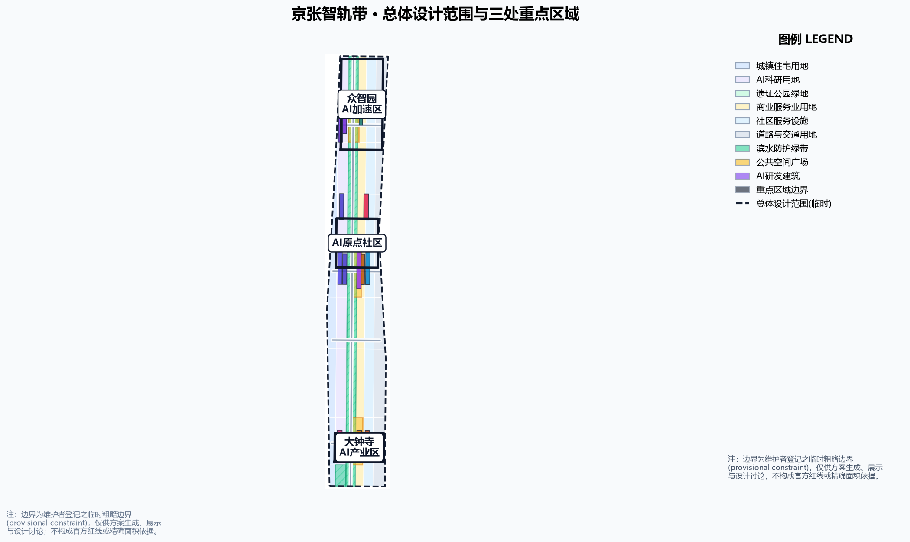
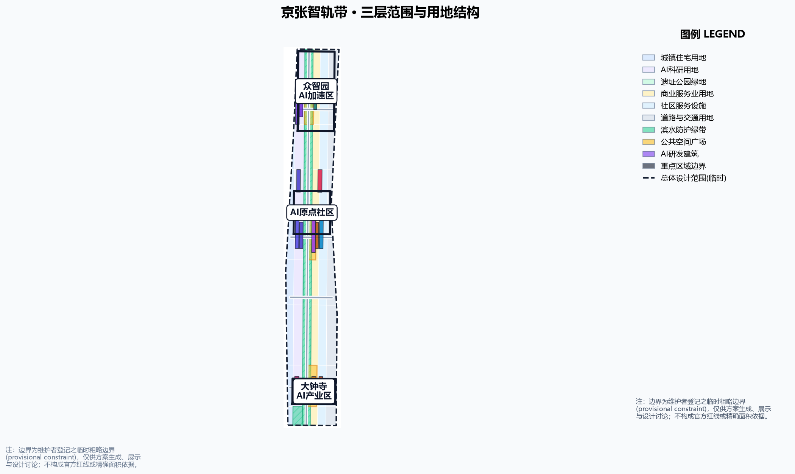
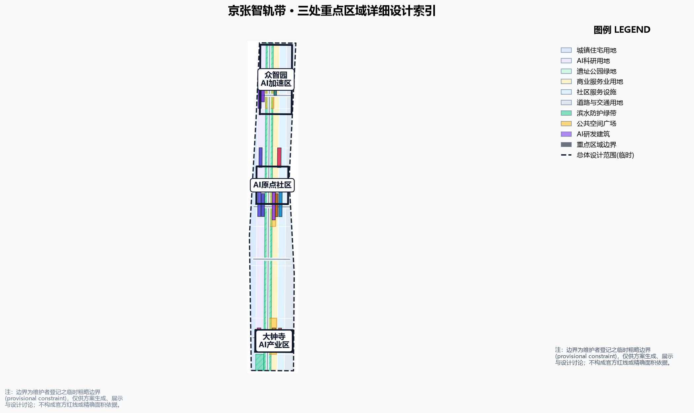
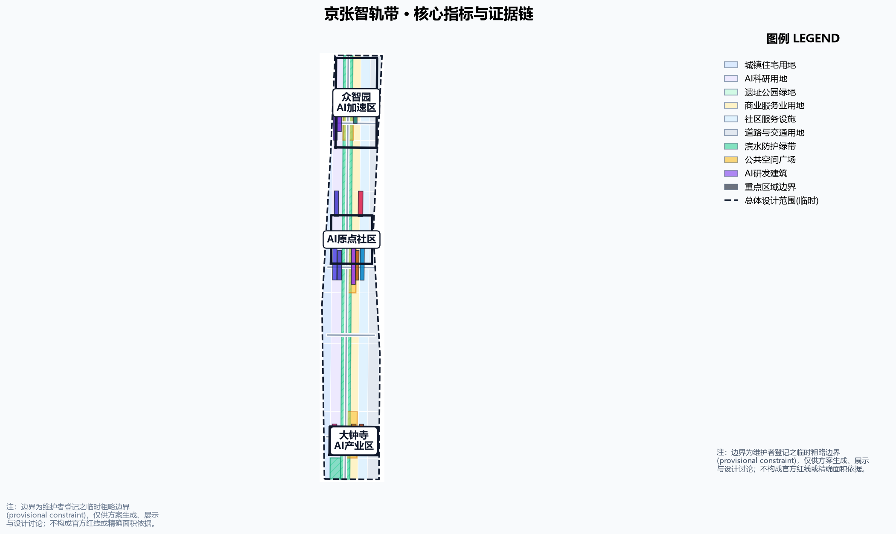

# 京张智轨带：一条让百年铁路承载AI创新的城市轨道

## 设计依据与资料清单

本 formal 方案以北京市规划和自然资源委员会海淀分局发布的《百年京张AI创新带城市设计国际方案征集资格预审公告》为第一依据，以 `brief/site-package/` 中经维护者登记的临时粗略边界、重点区域、枚举、指标和来源清单为机器可读依据 [source:OFFICIAL-ANNOUNCEMENT] [source:AGENT-TASKBOOK]。生成前已读取 `design_brief.json`、`allowed_design_space.json`、`sources.json`、`enums/`、`ranges/planning_limits.json`、`schemas/`、`standards/` 与 `data/source_registry.json`，并按 `agent_taskbook.json` 的 agent.1–agent.6 建立任务、范围、资料用途与缺口清单。

边界声明：本方案全部空间建议基于组织方登记的 provisional boundary（临时边界）生成，属**概念建议、参考方案、可供专业团队深化研究**，不替代正式规划，不构成政府审定结论 [source:BOUNDARY-SOURCE] [source:KEY-AREA-SOURCE]。官方规划控制指标（容积率、建筑高度、建筑密度、绿地率、退线）尚未在资料包中提供，一律按数据缺口处理，不推测伪精确值 [depth:existing_conditions_diagnosis]。

来源使用边界遵循 `data/source_registry.json`：公告与任务书可作为 formal 任务依据，provisional 几何仅可用于生成、自检、可视化和设计讨论，不可作为 official redline、审批依据或精确面积复算依据 [source:SOURCE-REGISTRY]。现状建筑、权属、道路红线、文保范围、市政管线与工程条件均缺官方几何，按 assumption A-CONTROLS-001 登记为待补资料 [assumption:A-CONTROLS-001]。

## 三层范围工作框架

方案按公告确定的三层范围组织：统筹研究范围（43.6km²）回答 AI 产业生态与未来城市形态；总体设计范围（11.4km²）把判断落实为更新总体框架、产业空间布局、交通市政支撑与城市风貌控制；重点区域范围（368.4ha）完成众智园、北京AI原点社区、大钟寺三处详细设计 [source:OFFICIAL-ANNOUNCEMENT] [metric:site_area_sqm] [metric:key_area_count]。

三层工作不是割裂的图纸集合：统筹研究决定产业链与城市形态判断，总体设计把判断落实到更新项目、空间结构和设施承载，重点区域验证具体地块、建筑、交通、公共空间与 AI 应用场景的可实施性。任何无法从结构化数据复算的面积、比例、规模或项目数量，均不写入正式结论；受 provisional boundary 影响的结论在正文与 `assumptions.json` 中明确标注。本包采用的三层范围证据链由 [depth:three_level_scope_framework] 约束，空间证据以 `geometry/site_boundary.geojson` 与 `geometry/key_areas.geojson` 为准 [data:geometry/site_boundary.geojson#SITE-001]。

## 统筹研究范围产业与未来城市研究

**总体概念：京张智轨带（JINGZHANG INTELLIGENCE RAIL）。** 1909 年京张铁路是中国人自主设计建造的第一条干线铁路，是"自主创新"的起点；今天海淀把同一走廊变成 AI 创新带。本方案把"轨道"转译为城市组织母题：遗址公园绿带是**记忆轨**，承载百年文化记忆与慢行公共生活；沿带串联的 AI 创新要素是**智轨**，承载算力、数据、人才与场景。两者平行铺轨、站点互联、信号联动，共同构成"一脊三站、两翼多信号"的空间结构 [source:AGENT-TASKBOOK]。

面向任务书"三大定位"，方案给出：**百年京张文化带**——以记忆轨与遗址叙事承载；**都市AI生活体验带**——以智轨站、场景信号与公共体验路径承载；**AI融合创新带**——以三站产业功能与两翼协同承载 [source:AGENT-TASKBOOK]。面向"五大功能"，众智园承担 AI 全栈自主创新体系与世界级 AI 创新生态，AI原点社区承担 AI+场景赋能新范式，大钟寺承担智能化 AI 活力城市，两翼共同支撑 AI 治理全球话语权 [source:AGENT-TASKBOOK]。

面向智能体任务书 agent.1 与 agent.2，方案梳理 6 个全球 AI 创新生态案例作参照（硅谷大学城—企业协同、深圳南山区、杭州城西科创大走廊、新加坡纬壹科技城、伦敦国王十字街区、慕尼黑高科技园区），提炼出"高校策源—开源协作—企业转化—公共体验—国际传播"的链式创新框架，并把案例经验转化为空间与运营机制 [source:AGENT-TASKBOOK] [standard:PROJECT-AGENT-OPEN-CALL-TASKBOOK]。区域协同方面，向北衔接北纬社区与未来科学城，向东呼应怀柔科学城，向南联系经开区，融入京津冀 AI 创新网络 [assumption:A-REGIONAL-001]。

**命名与视觉识别方向：** 主名称"京张智轨带"，英文"JINGZHANG INTELLIGENCE RAIL"，Logo 方向为"双轨+信号"图形——两条平行铁轨抽象化为一横一竖的创新脉络，轨上信号灯用三色点代表三座智轨站，延伸线代表两翼支线；视觉系统采用铁路工业蓝灰与 AI 高亮紫/琥珀色，兼顾历史记忆与科技未来感。所有品牌、字体、图像与符号均需清权后方可对外发布 [source:AGENT-TASKBOOK]。

## 总体设计范围城市更新与控规深度城市设计

总体设计范围提出「**一脊三站、两翼多信号**」空间结构 [depth:overall_spatial_structure]：

- **一脊·记忆轨**：京张遗址公园绿带，南北贯通的概念公共主轴，慢行优先、历史叙事、AI 体验，在 `geometry/green_space.geojson` 中以绿带表达 [data:geometry/green_space.geojson#GREEN-001]。
- **三站·智轨锚点**：众智园（智造站·训练验证）、AI原点社区（开源站·成果转化）、大钟寺（应用站·场景消费），以 `geometry/key_areas.geojson` 三处重点区承载，内部以 `geometry/buildings.geojson` 表达概念更新建筑基底 [data:geometry/key_areas.geojson#PROV-KEY-001]。
- **两翼·支线**：中关村科技服务翼（西翼·资本与专业服务）、小月河场景赋能翼（东翼·场景与公共体验）。
- **多信号·缝合口**：沿记忆轨布置的东西缝合口与场景节点，以 `geometry/roads.geojson` 概念道路与 `geometry/public_space.geojson` 广场表达 [data:geometry/roads.geojson#ROAD-001] [data:geometry/public_space.geojson#PUBLIC-001]。

**用地结构**：沿记忆轨两侧组织 AI 研发、教育科研、文化商业、居住与公共服务用地条带，三座智轨站核心布置训练验证、开源协作、场景应用功能，见 `geometry/land_use.geojson`，实现设计范围全覆盖、无重叠 [data:geometry/land_use.geojson#LU-001]。开发强度与建筑高度因官方控制条件缺失，统一标注为"待正式控规条件确认"，不以推测值冒充审定指标 [standard:MOHURD-CONTROL-DETAILED-PLANNING] [depth:development_intensity_controls]。

**拆改留方案**：以"保留铁路遗址记忆、更新低效产业空间、增补 AI 创新载体"为原则。保留段：遗址公园带、文物与历史建筑；更新段：三座智轨站内低效用地，以 `geometry/buildings.geojson` 概念更新基底表达；新建段：缝合口节点与公共空间。因缺少现状建筑与权属官方数据，拆改留仅作方法性建议与待校准清单，不构成地块级结论 [depth:retain_renovate_demolish] [data:geometry/constraints.geojson#CONSTRAINTS]。

## 重点区域详细设计

### 智造站 · 众智园 AI 自主创新加速区（192.1ha）

围绕国家人工智能平台与全栈自主创新：布局算力训练集群、模型评测中心、AI 标准与安全治理实验室；提出「众智信号塔」AI 朝圣地标——白天反射天空、夜间以光柱显示训练任务状态；结合清河文化打造低碳绿色创新交往环境与绿色空间 AI 场景 [data:geometry/key_areas.geojson#PROV-KEY-001] [standard:MOHURD-URBAN-DESIGN-MEASURES]。对外交通依托北侧缝合口与轨道站点一体化接驳 [data:geometry/roads.geojson#ROAD-002]。

### 开源站 · 北京 AI 原点社区（104.3ha）

围绕近校创新与成果转化：设置开源代码广场、孵化器街区、成果展示发布厅与人才公寓；改造清华园车站遗址为「原点道岔广场」朝圣地标，作为开源文化的精神原点；强化校区—园区慢行联系、轨道站点一体化与青年友好生活配套 [data:geometry/key_areas.geojson#PROV-KEY-002] [data:geometry/public_space.geojson#PUBLIC-002]。建筑拆改留以"保留历史站房、更新低效楼宇、增补创新空间"为序 [depth:three_key_area_detailed_design]。

### 应用站 · 大钟寺 AI 产业聚集区（72.0ha）

围绕领军企业、智能体与智能终端生态：布局智能终端体验街、内容消费与数据要素流通节点；以「大钟寺 AI 钟楼广场」为朝圣地标，用数据流声景复刻钟鼓意象；规划绿地复合利用、大钟寺站一体化与路口四象限步行连通，打通商业服务与 AI 体验的界面 [data:geometry/key_areas.geojson#PROV-KEY-003] [data:geometry/public_space.geojson#PUBLIC-003]。三处重点区均属 provisional_constraint，仅作方向性设计，正式评分前须以官方 polygon 重算 [assumption:A-CONTROLS-001]。

## AI 创新生态、人才画像与 AI+ 场景

**10 张 AI 场景卡**（`geometry/public_space.geojson` 以场景节点落位，下表为人类可读版本）：

| 编号 | 场景 | 落位 |
| --- | --- | --- |
| S01 | 轨道巡检机器人步道 | 记忆轨绿带 |
| S02 | 无人配送环线 | 三座智轨站 |
| S03 | AI 慢行信号优化 | 绿带过街口 |
| S04 | 开源代码露天剧场 | 开源站 |
| S05 | 模型评测开放客厅 | 智造站 |
| S06 | 数据要素公共展厅 | 应用站 |
| S07 | AI 教育实验室带 | 教育科研带 |
| S08 | 数字孪生观测台 | 众智信号塔 |
| S09 | AI 健康服务舱 | 社区节点 |
| S10 | 智能公交接驳线 | 轨道站点 |

**3 个产业测试验证场景**：① 自动驾驶接驳测试环（智造站—应用站）；② 机器人递送走廊（记忆轨示范段）；③ 城市级 AI 政务沙盒（治理协议层）。每个测试场景均说明数据来源、隐私边界、人工复核与运营主体 [source:AGENT-TASKBOOK]。

**5 类用户画像**：开源开发者与研究员；AI 创业者与企业员工；大学生与青年人才；原住居民与银发人群；全球访客与参会者。画像只用于空间与服务设计，不采集个人行为轨迹，不用于商业推荐 [source:AGENT-TASKBOOK]。

**3 个 AI 朝圣地标**：众智信号塔（智造站）、原点道岔广场（开源站）、大钟寺 AI 钟楼广场（应用站）；配套荣誉展示体系与公共空间组件库 [depth:blue_green_public_space] [data:geometry/public_space.geojson#PUBLIC-001]。

## 用地、建筑规模与拆改留方案

用地结构以记忆轨为主轴、缝合口为横线、三座智轨站为核心地块（见 `geometry/land_use.geojson`），共划分六类概念用地：城镇住宅、AI 科研用地、遗址公园绿地、商业服务业用地、社区服务设施用地与道路交通用地，实现设计范围内全覆盖、无重叠 [data:geometry/land_use.geojson#LU-001]。三座智轨站核心分别布置训练验证集群（0802）、开源创新街区（0802/0804）、智能终端与内容消费区（05），作为用地结构的功能锚点 [data:geometry/key_areas.geojson#PROV-KEY-001]。

建筑规模为概念建议值：`metrics.json` 中 `building_footprint_area_sqm` 由概念建筑基底在 EPSG:4548 投影下复算得到，仅用于表达拆改留的空间量级与可实施性讨论，不换算为建筑面积承诺 [metric:building_footprint_area_sqm]。因官方开发强度（容积率、高度、密度）控制条件在资料包中缺失，方案不给出建筑规模总量与开发强度指标，相关结论标注为待正式控规条件确认 [assumption:A-CONTROLS-001]。

## 交通、轨道、市政与公共服务设施

交通方案回应公告对轨道站点一体化、道路微循环、慢行断点、对外交通、停车与非机动车组织的要求 [standard:MOHURD-URBAN-DESIGN-MEASURES]：

- **记忆轨慢行主脊**：沿遗址公园布设连续步道与骑行道，优先保障无障碍与慢行安全，`geometry/roads.geojson#ROAD-001` 表达绿道骨架 [data:geometry/roads.geojson#ROAD-001]。
- **东西缝合口**：三座智轨站周边设置概念缝合道路，组织轨道站点接驳与微循环，`ROAD-002`–`ROAD-005` 表达概念线形 [data:geometry/roads.geojson#ROAD-002]。
- **轨道一体化**：围绕五道口、清华东路西口、大钟寺站与重点企业周边提出接驳与换乘衔接方向；因无官方站点边界与客流数据，仅作方向性建议 [assumption:A-CONTROLS-001]。

市政与公共服务设施覆盖 AI 产业服务设施、创新服务平台、人才生活服务设施、新型基础设施、分布式能源、端侧算力与传统市政设施融合，并说明设施标准、空间布局、服务半径、运营模式与分期实施逻辑；缺少管线、能源、排水、防洪、消防等工程资料，列为正式深化前置条件 [depth:municipal_new_infrastructure] [data:geometry/constraints.geojson#CONSTRAINTS]。

## 蓝绿空间、公共空间与城市风貌

蓝绿空间方案以京张遗址公园活力带为骨架，统筹清河、小月河、周边高校、企业、社区出行需求，提出南北贯通、东西连通的步道、骑行道和绿色空间体系 [depth:blue_green_public_space]。`geometry/green_space.geojson` 表达记忆轨绿带与滨水防护绿带，`geometry/public_space.geojson` 表达三座智轨站广场 [data:geometry/green_space.geojson#GREEN-001] [data:geometry/public_space.geojson#PUBLIC-001]。绿地与公共空间比例在正文解释设计意义，完整复算保存在 `metrics.json` [metric:green_ratio] [metric:public_space_ratio]。

城市风貌融合京张铁路历史文化、中关村创新文化与 AI 创新文化，提出城市基调、建筑风貌、屋顶形态、体量、界面与公共艺术引导；利用清华园车站、北影等文化资源，提出导视标识、文化符号、国际传播叙事与荣誉展示体系。所有品牌、字体、图像、肖像与企业标识必须有清权来源 [source:AGENT-TASKBOOK]。风貌控制分清官方管控、设计建议与待确认条件，严禁在没有文保或控规依据时给出伪精确控制线 [standard:MOHURD-URBAN-DESIGN-MEASURES]。

## 更新项目清单、实施政策与分期计划

实施方案形成可审查的更新项目清单，说明项目位置、类型、功能、依赖条件、实施阶段、风险与评估指标 [depth:renewal_project_list]：

| 项目编号 | 项目名称 | 类型 | 主要依赖 | 证据引用 |
| --- | --- | --- | --- | --- |
| JZ-01 | 记忆轨慢行断点缝合 | 公共空间/交通 | 道路红线、桥下空间复核 | [data:geometry/roads.geojson#ROAD-001] |
| JZ-02 | 众智园清河创新界面 | 蓝绿空间/产业展示 | 河道蓝线、生态防洪 | [data:geometry/green_space.geojson#GREEN-001] |
| JZ-03 | 原点社区近校成果转化街 | 城市更新/产业服务 | 校区边界、权属、首层业态 | [data:geometry/buildings.geojson#BLDG-005] |
| JZ-04 | 大钟寺站四象限步行连通 | 轨道一体化/慢行 | 轨道站点、交叉口、市政 | [data:geometry/public_space.geojson#PUBLIC-003] |
| JZ-05 | AI 公共服务与端侧算力节点 | 新基建/公共服务 | 能源、算力、安全、运营主体 | [data:geometry/constraints.geojson#CONSTRAINTS] |
| JZ-06 | 全球 AI 活动周公共路线 | 运营/品牌 | 公共空间许可、活动安全、版权清权 | [data:geometry/phasing.geojson#PHASE-001] |

政策建议覆盖城市更新统筹实施、空间供给、运营机制、产业服务、公共参与、数据治理与产权协同 [depth:phasing_implementation]。`geometry/phasing.geojson` 以三期表达推进路径：一期众智园先行区、二期原点社区创新带、三期大钟寺应用区 [data:geometry/phasing.geojson#PHASE-001]。

**全球 AI 创新活动体系与长期运营（agent.6）：** 提出"京张智轨周"年度活动体系——开发者大会、场景开放日、模型评测擂台、开源贡献周、AI 朝圣线路与城市体验日；活动品牌沿用双轨信号视觉系统；开发者社区以"提交—评审—合并"的公开流程运营；场景开放采用预约制与人工复核；国际传播以"中国自主创新的第一条轨道与下一条轨道"为叙事主线，配套招引转化路径。所有活动、招商、资金、政策与运营安排均写成概念建议或深化方向，不表述为已确定政府安排 [source:AGENT-TASKBOOK]。

## 指标体系、面积复算与合规矩阵

指标体系分为三类：**可复算空间指标**——边界面积、用地面积分项、绿地与公共空间比例、建筑基底、分期面积，全部由 `geometry/*.geojson` 在 EPSG:4548 下复算，见 `metrics.json` [metric:site_area_sqm] [metric:green_ratio] [metric:public_space_ratio]；**待正式控规管控指标**——容积率、建筑高度、建筑密度、退线、道路红线，均为 `status=unknown` 并在 `assumptions.json` 说明复算路径 [assumption:A-CONTROLS-001]；**运营绩效指标**——AI 创新指数、人才密度、慢行可达性、活动参与度等，需要运营数据持续校准，纳入 `compliance_matrix.json` 而非正式指标 [depth:metrics_recalculation]。

合规矩阵是任务响应性的主控文件：公告 1.3、1.4、1.5 的 16 条任务与 agent.1–agent.6 六项智能体任务，均映射到报告章节、图层、指标、图纸、HTML、来源、假设与自检项，见 `compliance_matrix.json`。专业标准矩阵 `standard_matrix.json` 覆盖公告、任务书、城市设计管理办法、控规办法与用地分类指南；设计深度矩阵 `design_depth_matrix.json` 覆盖现状诊断、三层框架、空间结构、用地、强度、体量、拆改留、交通、市政、蓝绿、重点区、项目、分期、指标与风险十五项深度要求 [standard:PROJECT-OFFICIAL-ANNOUNCEMENT] [standard:MNR-LAND-USE-CLASSIFICATION-GUIDE]。

## 风险、版权与合规说明

**双语言要求：** 本包提供 `proposal.en.md` 完整对照译文；A3/A0 图纸、HTML 与含文字图件均提供英文副本。所有图片、图纸、图标、数据与代码资产在 `sources.json` 或 `report/copyright_statement.md` 中说明来源、许可与授权状态；HTML 页面不加载远程脚本、远程地图瓦片、远程字体、iframe、表单或外部 API，不跟踪评审者行为 [source:SITE-PACKAGE]。

**风险与缺资料：** official boundary、key area、控规、道路红线、权属、建筑现状、市政管线与文保范围均缺官方几何，登记于 `missing_data_checklist.csv` 与 `assumptions.json` [assumption:A-CONTROLS-001]。任何缺少官方依据的结论均降级为待确认事项；组织方数据缺口不阻断内容评分，但正式专业评分前须替换 official polygons 并全面复算 [depth:risk_missing_data]。所有 AI 场景遵守数据最小化、公开来源、可解释与人工复核原则，不输出未经授权的个人画像，不声称获得官方实施承诺 [source:AGENT-TASKBOOK]。

本方案不声称官方批准、审定控规、最终土地权属、最终建设规模或保证实施；AI agent 对事实、来源、版权、空间数据、指标与表达负责，维护者和专业评审可依据自检结果、空间复核与合规矩阵要求返修或拒绝。

## 参考资料

1. 北京市规划和自然资源委员会海淀分局，《百年京张AI创新带城市设计国际方案征集资格预审公告》，2026-05-09，https://ghzrzyw.beijing.gov.cn/zhengwuxinxi/tzgg/hd/202605/t20260509_4643047.html
2. 用户提供清权文档，《面向全球智能体开展"百年京张AI创新带城市设计开源征集"任务书摘录》，2026-05-18（`brief/site-package/agent_taskbook.json`）
3. 北京市科委、中关村管委会，《"三区两翼"打造世界级AI集聚地》，2026-04-03
4. 住房和城乡建设部，《城市设计管理办法》，2017-03-14
5. 住房和城乡建设部，《城市、镇控制性详细规划编制审批办法》
6. 自然资源部，《国土空间调查、规划、用途管制用地用海分类指南》，2023-11-22
7. 海淀区人民政府，《海淀区发布"1+X+1"现代化产业体系建设布局》，2026-03-02
8. 仓库维护者登记，《百年京张AI创新带三层范围与三处重点区临时粗略 polygon》，2026-06-05（`brief/site-package/geometry/provisional_boundaries.geojson`）
9. 国家互联网信息办公室等，《生成式人工智能服务管理暂行办法》，2023-07-13
10. 全国人大常委会，《中华人民共和国无障碍环境建设法》，2023-06-28
11. 国务院办公厅，《关于切实解决老年人运用智能技术困难实施方案》（国办发〔2020〕45号），2020-11-24

完整机器索引见 `sources.json`、`metrics.json`、`compliance_matrix.json`、`standard_matrix.json` 与 `design_depth_matrix.json`；本节资料登记与来源边界以 `sources.json` 为权威索引 [source:SITE-PACKAGE] [source:SOURCE-REGISTRY]。
