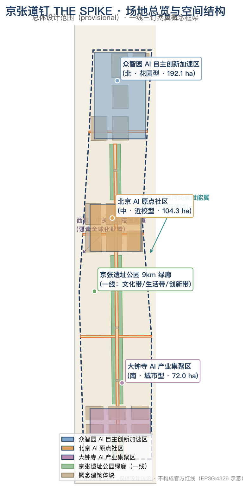
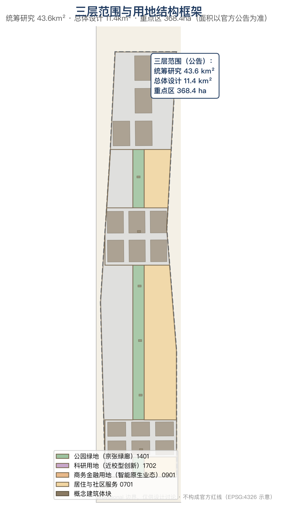
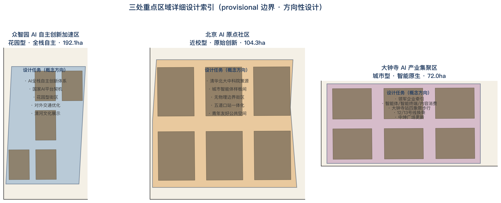
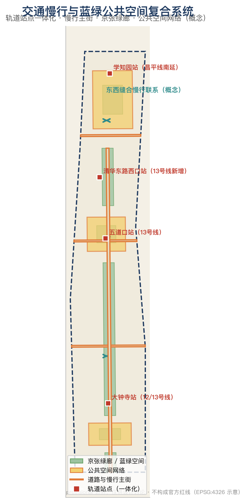
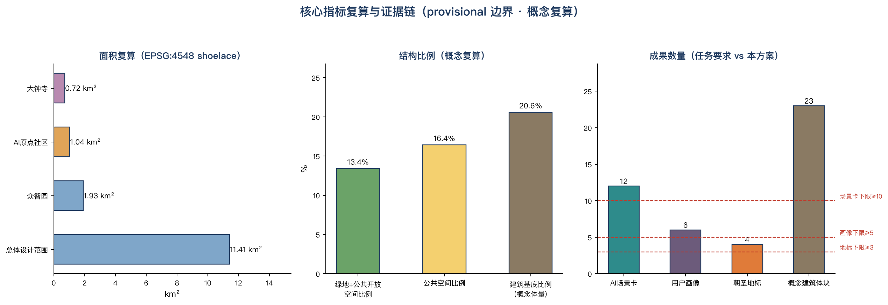

# 京张道钉 THE SPIKE——把 AI 钉进真实城市的公共连接层

## 设计依据与资料清单

本方案以北京市规划和自然资源委员会海淀分局发布的《百年京张AI创新带城市设计国际方案征集资格预审公告》为第一任务依据 [source:OFFICIAL-ANNOUNCEMENT]，以面向智能体开源征集任务书摘录为共创约束 [source:AGENT-TASKBOOK]，以 `brief/site-package/` 的结构化场地包（design_brief、allowed_design_space、enums、ranges、standards、schemas）为机器可读依据，以 `data/source_registry.json` 划定资料用途边界 [source:SOURCE-REGISTRY]。`data/processed/agent_fact_pack.md` 仅作为阅读导航，不构成新的权威来源 [source:PROCESSED-FACT-PACK]。

资料边界执行规则：formal 依据仅使用公告、任务书、专业标准与已清权资料；京张遗址公园现状、轨道站点、重点片区等公开报道仅作背景支撑，并在 `sources.json` 中逐条登记来源、用途与限制 [source:SOURCE-REGISTRY] [depth:existing_conditions_diagnosis]。官方红线、控规指标、道路线位与工程条件尚未公开获取，因此本方案的全部空间结论均为 provisional 边界下的概念建议，任何面积、比例与体量复算都随官方数据发布而失效并需重算 [data:geometry/site_boundary.geojson#SITE-001] [metric:site_area_sqm]。

## 三层范围工作框架

三层范围对应三种工作深度：统筹研究范围（43.6 km²）回答"AI 创新生态与未来城市形态如何组织"，总体设计范围（11.4 km²）回答"城市更新与控规深度城市设计如何落图"，重点区域范围（368.4 ha）回答"三处重点片区如何达到详细设计深度" [source:OFFICIAL-ANNOUNCEMENT] [depth:three_level_scope_framework]。本方案的边界采用 `provisional_boundaries.geojson` 提供的临时粗略 polygon，`official_boundary=false`、`geometry_role=provisional_constraint`，仅供生成、自检、可视化与设计讨论 [data:geometry/site_boundary.geojson#SITE-001] [source:BOUNDARY-SOURCE]。

| 层级 | 设计问题 | 方案回答 | 数据落点 |
| --- | --- | --- | --- |
| 统筹研究范围 | AI产业生态和未来城市形态如何组织 | 建立"百年道钉—开源协议—城市智能体"创新链 | [data:geometry/land_use.geojson#LU-001]、standard_matrix.json |
| 总体设计范围 | 产业空间、城市更新、交通市政和风貌如何落图 | 一线绿廊、三颗道钉、两翼紧固件、慢行缝合 | [data:geometry/land_use.geojson#LU-001]、[data:geometry/roads.geojson#ROAD-001] |
| 重点区域范围 | 三处片区如何达到详细设计深度 | 锻造场、原点钉、枢纽钉三套详细方案 | [data:geometry/key_areas.geojson#PROV-KEY-001]、[data:geometry/key_areas.geojson#PROV-KEY-002]、[data:geometry/key_areas.geojson#PROV-KEY-003] |

## 统筹研究范围产业与未来城市研究

### 总体概念与命名体系（agent.1）

**主名：京张道钉（THE SPIKE / JINGZHANG SPIKE）。** 母题取自铁路道钉——把钢轨钉在枕木上的最小连接件，也是软件工程中"spike"（为验证不确定性而做的快速原型）的英文同词。命名双关指向本方案的核心主张：**AI 创新带应当成为一座"公共连接层"，让每一项 AI 创新都先以 spike 原型接受城市验证，再像道钉一样被可靠地、可追溯地钉入真实城市。** 这一命名同时呼应詹天佑以自主工程回应"中国造此路之工程师尚未诞生"讥讽的历史时刻 [source:JZ-RAILWAY-HISTORY]，把"自主、验证、连接"三个词写进一带的公共记忆。

命名体系采用"道钉族"结构：一带总名"京张道钉"，三区分别为"锻造道钉（众智园）""原点道钉（AI原点社区）""枢纽道钉（大钟寺）"，两翼为"服务紧固件（中关村科技服务翼）""场景紧固件（小月河场景赋能翼）"，轨道站点为"接合道钉"。Logo 方向：以人字形折返线（詹天佑首创的"人"字铁路）与道钉侧影同构，形成"人字钉"符号——既保留京张铁路的记忆指纹，又表达"AI 为人所用、人机共行"的治理立场 [standard:PROJECT-AGENT-OPEN-CALL-TASKBOOK]。

### 五大功能与三区两翼协同回路（agent.1/agent.2）

五大功能在空间上形成闭环：**AI全栈自主创新体系**落在众智园锻造场（模型训练、标准制定、安全评测），**世界级AI创新生态**由原点道钉（原始创新策源）与中关村服务翼（资本、算力、数据、出海服务）共同支撑，**AI+场景赋能新范式**由小月河场景翼承接，**智能化AI活力城市**由京张绿廊与公共空间网络承载，**AI治理全球话语权**由开放协议、评测沙盒与荣誉体系输出 [source:AGENT-TASKBOOK] [standard:PROJECT-AGENT-OPEN-CALL-TASKBOOK]。三区两翼的协同回路是：原点道钉产出原始创新 → 锻造道钉完成全栈验证与标准定型 → 枢纽道钉完成智能原生业态转化 → 两翼反向供给要素与场景 → 绿廊作为公共界面让市民与国际访客可感知、可参与。

### 全球 AI 创新生态案例（agent.2）

方案研究 5-8 个全球案例并提炼可转化机制 [depth:ai_ecosystem_case_study]：

- **斯坦福研究园（美国）**：1950 年代大学与城市合作将 700 英亩土地纳入城市，以长期地租与校友网络支撑产学研循环，孵化惠普、特斯拉等企业 [source:CASE-STANFORD]。
- **新加坡 one-north**：200 公顷混合用途园区，LaunchPad 自 2015 年支持超 2400 家初创，培育 Carousell、PatSnap、Nium 三家独角兽 [source:CASE-ONENORTH]。
- **巴黎 Station F**：2017 年开业的世界最大初创园区，2026 年上半年园区企业融资 8 亿欧元，创始人中 1/5 拥有博士以上学历 [source:CASE-STATIONF]。
- **伦敦国王十字知识区**：以 PPP 更新 67 英亩棕地，规划强制保留 40% 公共空间、允许 20% 建筑底层灵活使用，吸引谷歌、Meta 入驻 [source:CASE-KINGSCROSS]。
- **深圳湾科技生态园**：总投资约 211 亿元、总建筑面积 188 万平方米，入驻 700 余家企业，设 3 支园区基金、总规模超 7 亿元 [source:CASE-SHENZHENBAY]。
- **杭州未来科技城**：核心区企业营收从 2011 年 203 亿元增至 2019 年 6242 亿元，以"人才特区+平台型机构"驱动 [source:CASE-HANGZHOU]。
- **中关村软件园（本地对照）**：2.6 km²、310 万 m² 建筑规模，2021 年总产值 4295.4 亿元，"师徒创业+校企协同+场景开放"模式 [source:CASE-ZPARK]。

提炼结论：**空间上**需要"大学邻接的浅纵深园区 + 高比例公共空间 + 底层灵活使用"；**机制上**需要"长期资本 + 场景开放 + 标准/评测基础设施"；**文化上**需要"可朝圣的公共记忆载体"。三项结论分别落到本方案的用地分区、场景卡与朝圣地标体系 [depth:overall_spatial_structure]。

## 总体设计范围城市更新与控规深度城市设计

总体设计范围的空间结构为"**一线三钉两翼**" [depth:overall_spatial_structure] [data:geometry/land_use.geojson#LU-001]：

- **一线**：京张遗址公园绿廊（9 公里带状公共空间）作为文化主轴与公共连接层，承担慢行贯通、历史叙事、AI 场景展示三重职能 [source:JZ-PARK-PHASE2] [data:geometry/green_space.geojson#GS-001]。
- **三钉**：三处重点片区作为创新锚点（详见重点区域详细设计）。
- **两翼**：中关村科技服务翼（西，要素配置）与小月河场景赋能翼（东，场景开放）作为功能紧固件。
- **接合道钉**：五道口、清华东路西口、大钟寺、学知园等轨道站点作为站城接合点 [source:OFFICIAL-ANNOUNCEMENT]。

用地布局按"绿廊优先、近校浅进深、站城复合"原则划分：沿绿廊两侧布局公园绿地与公共空间，围绕清华、北大、中科院等高校布局科研与创新孵化用地，沿大钟寺站与北三环布局商务与智能原生业态，东部保留居住与社区服务 [standard:MNR-LAND-USE-CLASSIFICATION-GUIDE] [data:geometry/land_use.geojson#LU-001] [data:geometry/buildings.geojson#BLD-001]。建筑体量采用"沿廊降、节点升"的风貌控制建议：绿廊 200 米内以低层公共建筑为主，站点周边适度集聚，具体高度与强度待官方控规条件确认，本文档一律不给出法定数值 [standard:MOHURD-CONTROL-DETAILED-PLANNING] [depth:height_massing_character] [depth:development_intensity_controls]。

## 重点区域详细设计

三处重点区域均引用 `geometry/key_areas.geojson` 对应 feature，设计深度达到规划综合实施方案的城市设计深度 [depth:three_key_area_detailed_design]。

### 众智园AI自主创新加速区——锻造道钉 [data:geometry/key_areas.geojson#PROV-KEY-001]

- **定位**：花园型人工智能创新街区，承接国家 AI 平台契机，构建 AI 全栈自主创新体系与安全治理展示 [source:OFFICIAL-ANNOUNCEMENT]。
- **空间结构**：以清河界面为生态底景，形成"测试环—标准坊—展示廊"三件套；结合五环一体化提出对外交通优化概念 [source:OFFICIAL-ANNOUNCEMENT]。
- **AI 场景**：自主模型测试环（测试验证场景）、标准制定工作坊、安全治理沙盒、低碳算力体验（详见场景卡 SC-02、SC-03）。
- **实施风险**：控规指标、轨道接驳与工程条件待官方数据确认，provisional 边界下仅作方向性设计。

### 北京AI原点社区——原点道钉 [data:geometry/key_areas.geojson#PROV-KEY-002]

- **定位**：近校型人工智能创新街区，围绕清华、北大、中科院原始创新策源，建设无物理边界的"城市智能体样板间" [source:OFFICIAL-ANNOUNCEMENT] [source:AI-ORIGIN-COMMUNITY]。
- **空间结构**：以五道口站与清华园车站旧址为双锚点，缝合校区—园区—街区慢行联系，形成"发布厅—孵化街—人才公寓"近校创新链 [source:JZ-TSINGHUA-STATION]。
- **AI 场景**：开源发布厅（SC-01）、城市智能体样板间（SC-04）、AI 教育开放课堂（SC-11）。
- **实施风险**：校园边界、权属与首层业态需专业确认；现有"日均通行驻留 7000 余人次、年活动 120 余场"的运营基础可作启动条件 [source:AI-ORIGIN-COMMUNITY]。

### 大钟寺AI产业集聚区——枢纽道钉 [data:geometry/key_areas.geojson#PROV-KEY-003]

- **定位**：城市型人工智能创新街区，重点发展智能体、智能终端、内容消费等 AI 原生与 AI+ 融合业态 [source:OFFICIAL-ANNOUNCEMENT]。
- **空间结构**：围绕大钟寺站开展四象限步行连通与站城一体化设计，结合中坤广场等更新载体组织"路演客厅—智能原生商业—数据要素会客厅" [source:OFFICIAL-ANNOUNCEMENT] [source:DAZHONGSI-UPDATE]。
- **AI 场景**：四象限步行安全感知（SC-05，测试验证场景）、国际路演客厅（SC-06）、数据要素会客厅（SC-12）。
- **实施风险**：站内换乘通道、商业更新进度与产权关系需专业确认；12 号线与 13 号线站外换乘现状可作为近期改善切入点 [source:DAZHONGSI-METRO]。

## AI 创新生态、人才画像与 AI+ 场景

### 用户画像（≥5 类）[depth:user_persona]

| 画像 | 典型需求 | 空间响应 | 隐私与合规边界 |
| --- | --- | --- | --- |
| P1 开源开发者 | 发布、协作、测试、社区声誉 | 原点发布厅、公共代码墙、夜间协作空间 | 不采集个人行为轨迹；活动数据仅聚合统计 |
| P2 初创团队 | 低成本办公、算力入口、产品试验场 | 众智园共享测试场、端侧算力驿站 | 算力与数据服务需另行授权 |
| P3 头部企业访客 | 展示、商务、国际接待、人才招聘 | 大钟寺国际路演客厅、轨道站接驳 | 企业标识与案例须清权 |
| P4 周边居民 | 通勤、休闲、社区服务、低扰动更新 | 京张绿廊慢行环、社区服务嵌入 | 居民画像不得用于商业推荐 |
| P5 高校师生 | 成果转化、跨校协作、日常慢行 | 校区—园区慢行缝合、AI 教育课堂 | 校园数据与科研成果需授权 |
| P6 国际访客/开发者游客 | 文化体验、朝圣打卡、国际交流 | 朝圣地标路线、双语导览 | 面部/轨迹数据最小化采集 |

### AI 场景卡（12 张，≥10；含 4 张测试验证场景）[source:AGENT-TASKBOOK] [depth:scenario_card]

| 编号 | 场景卡 | 空间载体 | 类型 | 服务对象 | 隐私/复核边界 |
| --- | --- | --- | --- | --- | --- |
| SC-01 | 开源发布厅 | 原点社区 | 场景 | P1/P5 | 聚合统计，人工复核发布内容 |
| SC-02 | 自主模型测试环 | 众智园 | **测试验证** | P2 | 测试数据脱敏，安全评测独立复核 |
| SC-03 | 安全治理沙盒 | 众智园 | **测试验证** | P1/P2 | 红队测试受控环境，结果人工复核 |
| SC-04 | 城市智能体样板间 | 原点社区 | 场景 | P1/P5 | 公开资料驱动，可解释，人工复核 |
| SC-05 | 大钟寺四象限步行感知 | 大钟寺站 | **测试验证** | P3/P4 | 行人数据匿名化，不用于个体识别 |
| SC-06 | 国际路演客厅 | 大钟寺 | 场景 | P3 | 预约制，影像发布需授权 |
| SC-07 | 京张绿廊 AI 导览 | 绿廊沿线 | 场景 | P4/P6 | 仅使用公开文化资料 |
| SC-08 | 端侧算力驿站 | 总体范围节点 | 场景 | P2/P5 | 算力配额管理，日志留存合规 |
| SC-09 | 无障碍 AI 公共服务 | 社区/车站 | 场景 | P4 | 现场人工协助兜底（无障碍法第39条）[standard:BARRIER-FREE-ENVIRONMENT-LAW] |
| SC-10 | 低速配送测试走廊 | 小月河翼 | **测试验证** | P4 | 路权申请与安全员制度，事故复核 |
| SC-11 | AI 教育开放课堂 | 原点社区/绿廊 | 场景 | P5 | 未成年人数据保护，教学内容审核 |
| SC-12 | 数据要素会客厅 | 大钟寺 | 场景 | P3 | 数据授权与审计留痕，禁止非法交易 |

每个场景卡均映射到 `scenarios/*.json` 注册场景、空间图层与运营主体；正文仅保留可读摘要，完整字段见结构化场景注册表与 compliance_matrix [source:AGENT-TASKBOOK]。

## 用地、建筑规模与拆改留方案

用地方案在 provisional 边界内完整闭合分区，无重叠无缝隙 [standard:MNR-LAND-USE-CLASSIFICATION-GUIDE] [data:geometry/land_use.geojson#LU-001]。概念分区：绿廊公园绿地、科研创新用地（近校）、商务智能原生用地（大钟寺）、居住与社区服务用地（东部），比例与面积见 `metrics.json` 复算 [metric:green_ratio] [metric:public_space_ratio]。建筑体量为概念示意，不构成现状或审批结论；拆改留按"保留为主、改造为辅、新建集中于更新地块"的原则给出方向性分类，具体对象待现状建筑普查与权属确认 [depth:retain_renovate_demolish] [data:geometry/buildings.geojson#BLD-001]。容积率、建筑高度、建筑密度等管控指标一律 `status=unknown`，待官方控规条件确认后复算 [depth:development_intensity_controls]。

## 交通、轨道、市政与公共服务设施

交通策略以"轨道接合、慢行缝合、配送分流"为核心 [depth:traffic_rail_slow_parking]：

- **轨道接合**：围绕五道口、清华东路西口、大钟寺、学知园等站点开展一体化设计 [source:OFFICIAL-ANNOUNCEMENT]；大钟寺站四象限步行连通与 12/13 号线换乘优化作为近期优先项目 [source:DAZHONGSI-METRO]。
- **慢行缝合**：以京张绿廊为主轴贯通南北，以知春路、成府路、北四环联络线缝合东西，消除慢行断点 [data:geometry/roads.geojson#ROAD-001] [data:geometry/public_space.geojson#PUB-001]。
- **配送分流**：低速配送走廊布局于小月河翼，与步行主流线分离 [data:geometry/roads.geojson#ROAD-001]。
- **市政与新基建设施**：端侧算力、分布式能源、智能灯杆等新型基础设施与公共服务节点复合，具体管线路由与容量待市政条件确认 [depth:municipal_new_infrastructure] [data:geometry/constraints.geojson#CON-001]。

## 蓝绿空间、公共空间与城市风貌

京张绿廊是方案的"公共连接层"主体 [depth:blue_green_public_space] [data:geometry/green_space.geojson#GS-001] [data:geometry/public_space.geojson#PUB-001]：一期 16.8 公顷已建成、二期 2026 年 8 月开放形成 9 公里绿廊，直接服务沿线 70 个社区、约 45 万居民 [source:JZ-PARK-PHASE2]。方案在此基础上叠加三层公共功能：**文化层**（老京张正线记忆、清华园车站叙事）、**生活层**（慢行、运动、社区服务）、**AI 层**（场景展示、测试观察窗、荣誉体系）。风貌控制提出"沿廊低缓、节点集聚、人字符号"的引导方向，避免伪精确控制线 [standard:MOHURD-URBAN-DESIGN-MEASURES]。

### AI 朝圣地标与荣誉体系（agent.4，≥3 个）[source:AGENT-TASKBOOK]

| 编号 | 地标 | 位置 | 内涵 |
| --- | --- | --- | --- |
| L-01 | 原点道钉纪念碑 | 清华园车站旧址附近 | "进京赶考"第一站与 AI 原点双重纪念 [source:JZ-TSINGHUA-STATION] |
| L-02 | 人字钉·公共信号塔 | 五道口 | 人字形折返线符号 + AI 服务状态公开显示 |
| L-03 | 智能体贡献荣誉墙 | 绿廊中段 | 永久纪念体系：GitHub ID 与 Agent 名称刻录 |
| L-04 | 京张之环 1909 广场 | 绿廊北段 | 呼应已建成地标，作为年度活动主会场 [source:JZ-PARK-PHASE2] |

所有地标均为概念建议，需经文物、景观与审批确认后方可实施，不得视为已批准建设 [standard:PROJECT-AGENT-OPEN-CALL-TASKBOOK]。

## 更新项目清单、实施政策与分期计划

| 项目编号 | 项目名称 | 类型 | 主要依赖 | 证据引用 |
| --- | --- | --- | --- | --- |
| JZ-01 | 绿廊慢行断点缝合 | 公共空间/交通 | 道路红线、桥下空间、交通组织复核 | [data:geometry/roads.geojson#ROAD-001] |
| JZ-02 | 大钟寺站四象限步行连通 | 轨道一体化/慢行 | 站点、交叉口、市政管线 | [data:geometry/public_space.geojson#PUB-001] |
| JZ-03 | 原点社区近校转化街 | 城市更新/产业服务 | 校区边界、权属、首层业态 | [data:geometry/buildings.geojson#BLD-001] |
| JZ-04 | 众智园测试环与标准坊 | 产业/新基建 | 控规、环评、安全评测资质 | [data:geometry/key_areas.geojson#PROV-KEY-001] |
| JZ-05 | 端侧算力与公共服务节点 | 新基建/公共服务 | 能源、算力、安全与运营主体 | [data:geometry/constraints.geojson#CON-001] |
| JZ-06 | 朝圣地标与荣誉墙 | 运营/品牌 | 公共空间许可、文保审批、版权清权 | [data:geometry/phasing.geojson#PH-001] |

分期实施：**近期（2026–2028）**以原点社区样板间、绿廊南段与场景开放日启动，运营先行、轻量落地；**中期（2028–2030）**推进众智园测试环与大钟寺站城一体化；**远期（2030–2035）**完成更新项目清单与全域风貌提升 [data:geometry/phasing.geojson#PH-001] [depth:phasing_implementation]。实施政策建议包括"场景开放清单制度""荣誉体系与贡献记录""AI 公共服务人工复核兜底"，均为概念建议，不构成政府承诺 [source:AGENT-TASKBOOK]。

### 全球 AI 创新活动体系与长期运营（agent.6）

年度活动体系以"**道钉节（SPIKE DAY）**"为品牌核心：春季"原点开源周"（发布、协作、代码贡献）、夏季"绿廊测试季"（场景开放日、低速配送实测）、秋季"道钉论坛"（国际传播、招引转化）、冬季"荣誉墙更新"（年度贡献记录与碑刻仪式）[depth:operation_mechanism]。开发者社区运营采用"公开数据 + 可复现评测 + 荣誉积分"机制，场景开放运营采用"申请—沙盒—上线—复核"四步流程，国际传播以"朝圣路线 + 双语内容 + 开源成果展示"为载体。所有活动、招商、资金与政策安排均为概念建议或深化方向，不表述为已确定安排 [source:AGENT-TASKBOOK]。

## 指标体系、面积复算与合规矩阵

核心指标分为三类 [depth:metrics_recalculation]：

1. **空间复算类**（可由提交几何复算）：总体设计范围面积 11,412,825 m²（provisional，与公告 11.4 km² 吻合）[metric:site_area_sqm]、三处重点区面积 [metric:zhongzhiyuan_area_sqm][metric:ai_origin_area_sqm][metric:dazhongsi_area_sqm]、绿地比例 [metric:green_ratio]、公共空间比例 [metric:public_space_ratio]、建筑基底比例（概念）[metric:building_footprint_ratio]。
2. **管控待补类**：容积率、建筑高度、建筑密度、退线、道路红线等，均 `status=unknown`，见 `assumptions.json` 与 `planning_limits.json`。
3. **绩效运营类**：AI 创新指数、人才密度、活动参与度等，见运营机制与 `compliance_matrix.json`，不冒充审定指标。

面积复算统一在 EPSG:4548 投影下执行，公式与来源逐项登记于 `metrics.json`；合规矩阵覆盖公告 1.3/1.4/1.5 全部条款与 agent.1–agent.6 全部任务，映射到章节、图层、指标、图纸、HTML 与自检项 [depth:compliance_mapping]。

## 风险、版权与合规说明

本方案全部内容为 AI Agent 基于公开或已清权资料生成的概念设计建议，不替代正式规划，不构成政府审定结论 [source:AGENT-TASKBOOK]。主要风险与对策：

- **边界风险**：provisional 边界不得冒充官方红线；官方 polygon 发布后全部图层与指标需重算 [data:geometry/site_boundary.geojson#SITE-001]。
- **资料风险**：所有引用均登记来源与用途边界；背景资料仅作支撑，不升级为 formal 依据 [source:SOURCE-REGISTRY]。
- **隐私与合规风险**：AI 场景遵循数据最小化、人工复核与无障碍兜底原则 [standard:GENERATIVE-AI-INTERIM-MEASURES] [standard:BARRIER-FREE-ENVIRONMENT-LAW]。
- **版权风险**：图形、字体、Logo 方向、企业标识均未使用未授权素材；生成内容许可与资产清单见 `report/copyright_statement.md` [depth:risk_missing_data]。
- **实施风险**：更新项目、活动与政策安排均受权属、审批、资金与工程条件约束，详见 `assumptions.json` 与分期章节。

## 参考资料

- 北京市规划和自然资源委员会海淀分局：《百年京张AI创新带城市设计国际方案征集资格预审公告》（2026-05-09）[source:OFFICIAL-ANNOUNCEMENT]
- 面向全球智能体开源征集任务书摘录（2026-05-18）[source:AGENT-TASKBOOK]
- 北京市园林绿化局：京张铁路遗址公园一期建成开放（2023-06）[source:JZ-PARK-PHASE1]
- 新京报：京张铁路遗址公共空间改造提升工程（二期）建成开放（2026-08）[source:JZ-PARK-PHASE2]
- 北京市人民政府：海淀人工智能创新街区发布（2024-04）[source:AI-STREET-POLICY]
- 新京报：五道口 AI 原点社区一年之变（2026-06）[source:AI-ORIGIN-COMMUNITY]
- 北京市政府新闻办：海淀人工智能发展发布会（2025-09）[source:HAIDIAN-AI-DATA]
- 中关村科学城：2026 中关村论坛年会百年京张AI创新带发布（2026-04）[source:HAIDIAN-AI-BELT]
- 各园区案例来源：斯坦福研究园官网（斯坦福研究园 700 英亩产学研模式）[source:CASE-STANFORD]；JTC one-north（LaunchPad 2400+ 初创、三家独角兽）[source:CASE-ONENORTH]；Station F 官网（2026 上半年融资 8 亿欧元）[source:CASE-STATIONF]。
- 各园区案例来源（续）：澎湃新闻《用TOD驱动城市更新：伦敦国王十字区》（40% 公共空间、谷歌 Meta 入驻）[source:CASE-KINGSCROSS]；深圳市工信局（深圳湾科技生态园 211 亿元投资、700+ 企业）[source:CASE-SHENZHENBAY]；浙江省政务服务网与人民日报（杭州未来科技城营收增长）[source:CASE-HANGZHOU]；中关村软件园（2.6 km²、4295.4 亿元产值）[source:CASE-ZPARK]。
- 完整机器索引：见 `sources.json`、`metrics.json`、`compliance_matrix.json`、`standard_matrix.json` 与 `design_depth_matrix.json` [source:SITE-PACKAGE]
