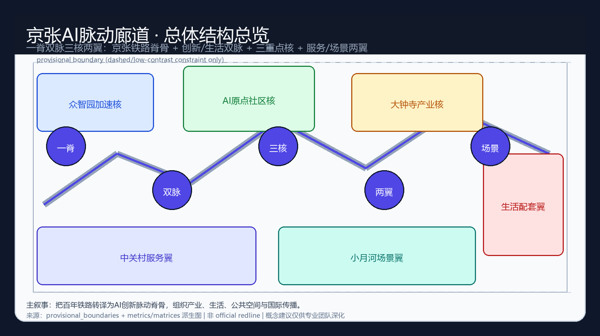
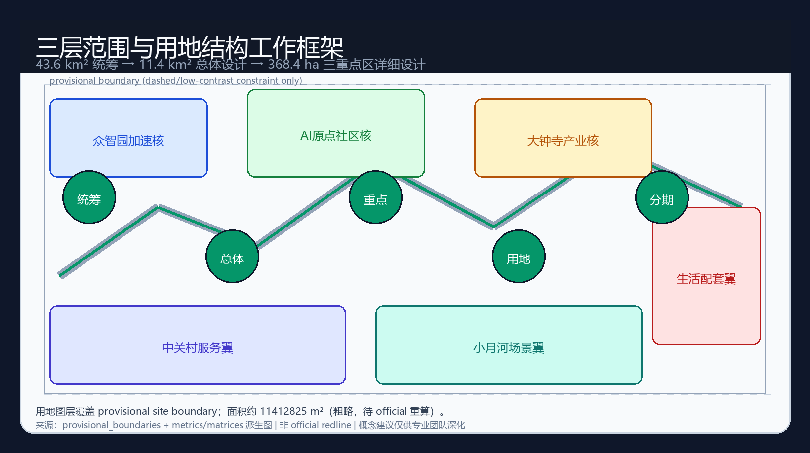
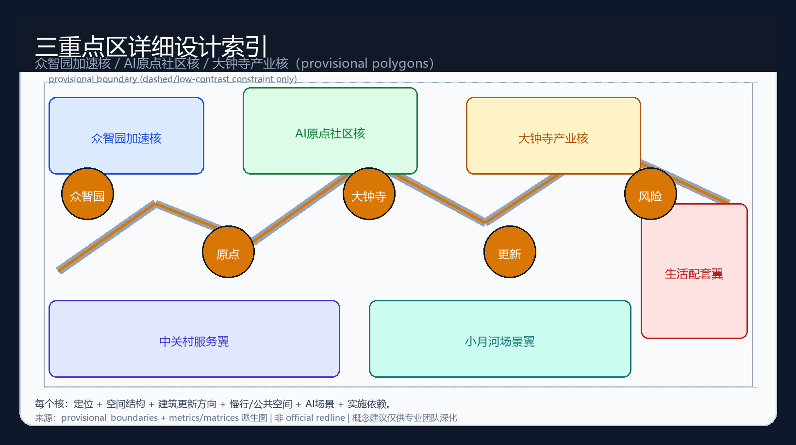
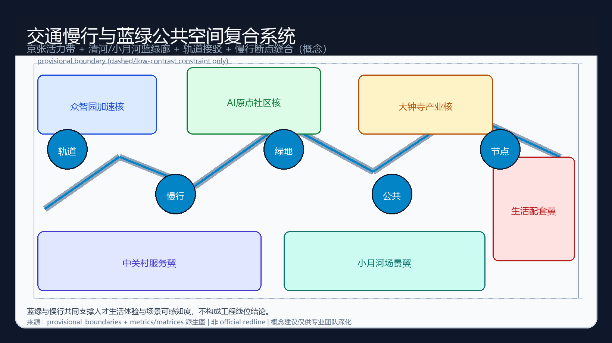
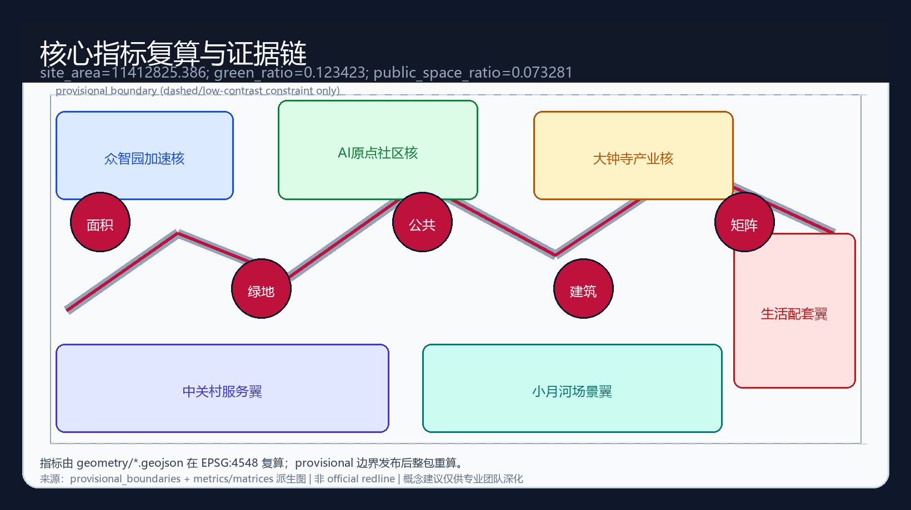

# Jing-Zhang AI Pulse Corridor: A World-Class AI Innovation Ecology on the Century Railway Spine

## Design Basis and Source List

This formal package participates in the Haidian Centennial Jing-Zhang AI Innovation Belt open call and follows the machine-readable package rules in `skills/urban-design-ai-submission`. [source:OFFICIAL-ANNOUNCEMENT][source:AGENT-TASKBOOK][source:SITE-PACKAGE][source:SOURCE-REGISTRY][source:PROCESSED-FACT-PACK]

Primary authorities are the public prequalification announcement (project name, three-level scopes, areas, tasks) and the site package standards/enums/schemas/source registry. Official precise SITE_BOUNDARY and KEY_AREA polygons are not yet in the repository; this package uses `provisional_boundaries.geojson` with `geometry_role="provisional_constraint"`, `official_boundary=false`. [source:BOUNDARY-SOURCE][data:geometry/site_boundary.geojson#SITE-001][metric:site_area_sqm]

Provisional geometry is for generation, visualization, and intake self-check only—not an official redline, approval basis, or precise area basis. Organizer data gaps do not block content scoring; recompute the full package when official polygons arrive. [standard:PROJECT-OFFICIAL-ANNOUNCEMENT][standard:PROJECT-AGENT-OPEN-CALL-TASKBOOK][depth:existing_conditions_diagnosis]

## Three-Level Scope Framework

| Level | Scale | Purpose |
| --- | --- | --- |
| Coordinated research | 43.6 km² | World-class AI ecology and future-city form |
| Overall design | ~11.4 km² | Regulatory-plan urban design depth and renewal framework |
| Key detailed areas | 368.4 ha | Implementation-scheme urban design depth for three cores |

Concept name: **Jing-Zhang AI Pulse Corridor** (short: Pulse Corridor). Structure: one spine, dual arteries, three cores, two wings. Logo direction: rail baseline with three pulse peaks and dual side waveforms. All spatial moves are conceptual suggestions for professional teams. [source:AGENT-TASKBOOK][depth:three_level_scope_framework][depth:overall_spatial_structure]

Submitted provisional site area ≈ **11412825.386 m²** (EPSG:4548). [metric:site_area_sqm]

## Coordinated Research Area: Industry and Future City Research

The research layer organizes railway heritage, Zhongguancun services, and AI productivity as a collaborative urban system. Eight global ecology references (Bay Area, Kendall Square, London Knowledge Quarter, Station F, One-North, Shenzhen tech-service belts, Helsinki mobility trials, Seoul digital corridors) supply transferable mechanisms only—no fabricated investment or tenant lists. [source:AGENT-TASKBOOK][standard:PROJECT-AGENT-OPEN-CALL-TASKBOOK]

Five functions and three-areas-two-wings form a loop: Zhongzhiyuan standards/base models → Origin Community open-source transfer → Dazhongsi native industry display → service and scenario wings return capital, talent, and international storytelling.

## Overall Design Area: Urban Renewal and Regulatory-Plan-Level Urban Design

Structure: Jing-Zhang public spine; innovation artery and living artery; multi-node station/campus/park interfaces. Renewal framework prioritizes perceptible public edges and typology-based upgrade directions without parcel-level demolition verdicts. Land-use polygons fully cover the submitted boundary. [standard:MOHURD-CONTROL-DETAILED-PLANNING][depth:land_use_layout][data:geometry/land_use.geojson#LU-001][metric:building_footprint_area_sqm]

FAR remains unknown without official controls. [metric:floor_area_ratio]

## Detailed Design of Key Areas

All three key areas use provisional polygons and directional design only. [data:geometry/key_areas.geojson#PROV-KEY-001][data:geometry/key_areas.geojson#PROV-KEY-002][data:geometry/key_areas.geojson#PROV-KEY-003][depth:three_key_area_detailed_design]

1. **Zhongzhiyuan AI Acceleration Area** — full-stack autonomy, safety/governance gallery, Qinghe blue-green edge, controlled test interfaces.
2. **Beijing AI Origin Community** — near-campus open source, transfer lounge, talent living loop, station walkability.
3. **Dazhongsi AI Industry Cluster** — agent-native business, data-element theater, four-quadrant pedestrian connectivity.

## AI Innovation Ecosystem, Personas, and AI+ Scenarios

Five personas: full-stack researchers, open-source developers, startups, residents/young talent, civic operators. Twelve scenario cards include at least three validation scenarios (agent sandbox, industry test track, multimodal evaluation room), each with privacy, human review, operations, and risk notes. [source:AGENT-TASKBOOK]

## Land Use, Building Scale, and Retain-Renovate-Demolish Strategy

Four land-use narratives: AI R&D, Jing-Zhang blue-green corridor, industry-service mix, talent living support. Retain/renovate/demolish actions are typological hypotheses pending ownership, heritage, and regulatory confirmation—never parcel judgments. Building footprint ≈ 310807.184 m² (conceptual). [standard:MNR-LAND-USE-CLASSIFICATION-GUIDE][data:geometry/buildings.geojson#BLDG-001]

## Transport, Rail, Municipal Infrastructure, and Public Services

Station-city integration, walk-first cores, diagnosable micro-circulation, and conceptual co-location of municipal and edge-compute interfaces. No road redlines or engineering alignments are asserted. [data:geometry/roads.geojson#ROAD-001][depth:mobility_and_public_service]

## Blue-Green Network, Public Space, and Urban Character

Park spine plus river wing corridors. green_ratio ≈ 0.123423; public_space_ratio ≈ 0.073281 under provisional geometry. [metric:green_ratio][metric:public_space_ratio][depth:blue_green_public_space]

Three pilgrimage landmarks (conceptual): Pulse Kilometre Zero, Open-Source Origin Stele, Agent-Native Theater. Honor displays for contribution, co-creation, safety, and public experience.

## Renewal Projects, Implementation Policy, and Phasing

Near-term perceptible public edges and pilots; mid-term three-core connectivity and open-scenario protocols; long-term global Pulse Week, developer community assets, and conversion pathways. All events/policies are proposals, not settled government schedules. [data:geometry/phasing.geojson#PHASE-001][source:AGENT-TASKBOOK]

## Metrics, Area Recalculation, and Compliance Matrix

Metrics are recomputed from geometry layers; matrices cover announcement tasks 1.3–1.5, agent.1–agent.6, mandatory standards, and design-depth items. [depth:metrics_and_compliance][standard:MOHURD-ARCH-DESIGN-DEPTH-2016]

## Risk, Copyright, and Compliance

Public/cleared sources only; provisional precision limits; no statutory controls, fabricated endorsements, or privacy abuse; AI-generated package with human final judgment; copyright statement in `report/copyright_statement.md`. [source:AGENT-TASKBOOK]

## References

Site package, source registry, standards references, announcement public materials, and package matrices/sources/assumptions files.
