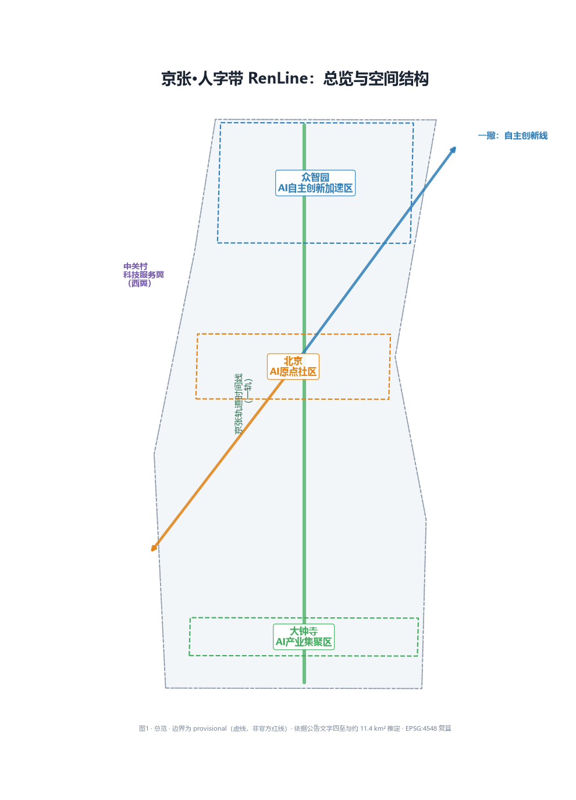
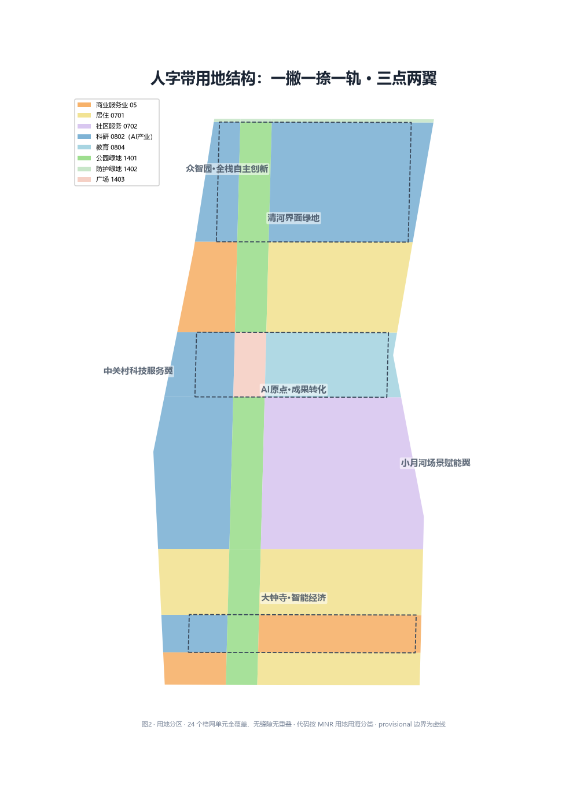
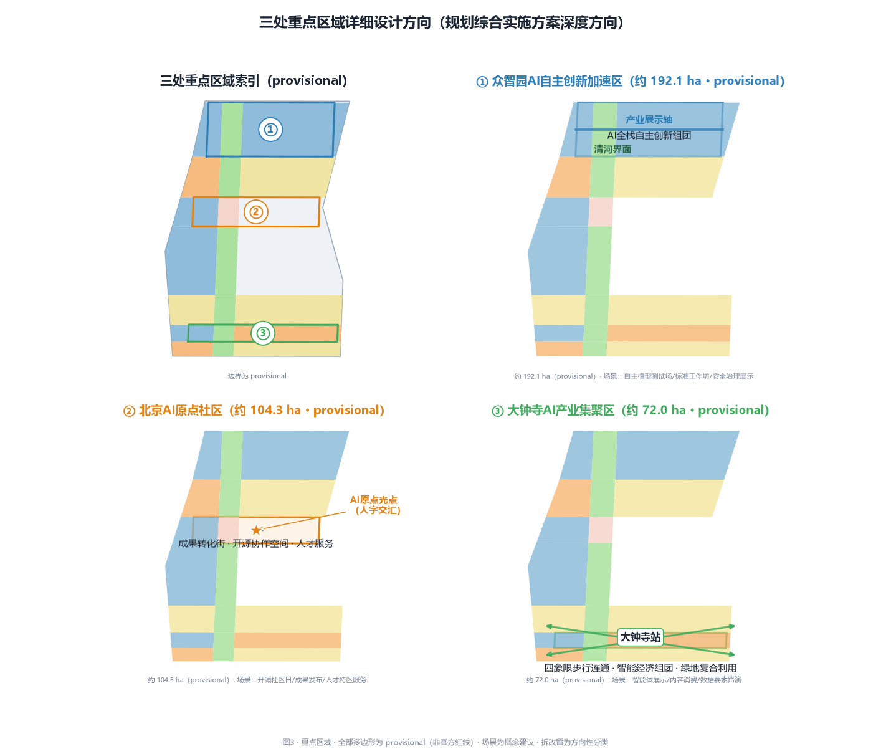
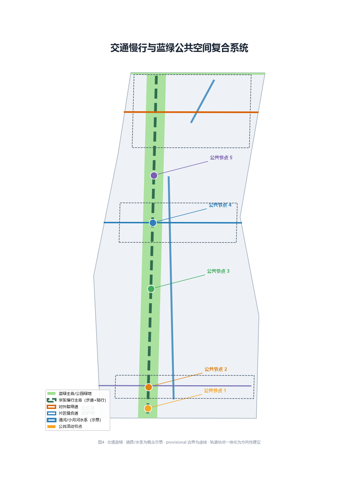
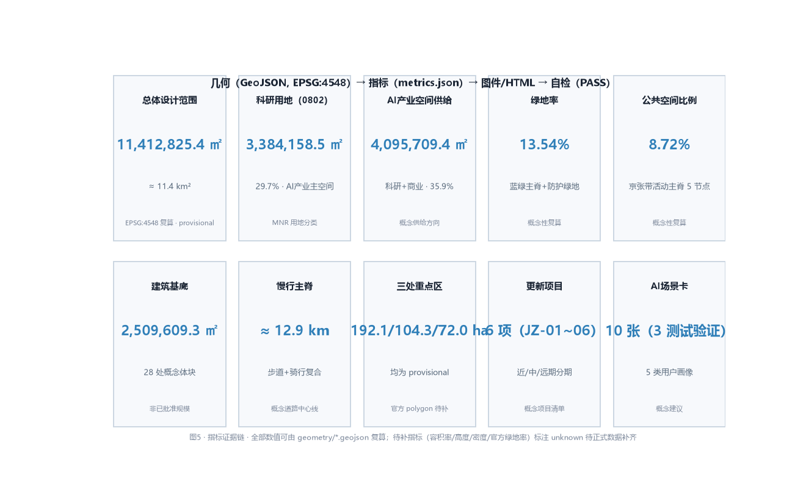

# Centennial Jing-Zhang AI Innovation Belt: The Jing-Zhang RenLine Belt Proposal

## Design Basis and Source List

This proposal is anchored by the official prequalification announcement for the Centennial Jing-Zhang AI Innovation Belt International Urban Design Open Call, which defines three working scopes — a Coordinated Research Area of about 43.6 km², an Overall Design Area of about 11.4 km², and a Key-Area Detailed Design Area of about 368.4 hectares — together with three key areas (announced approximations: Zhongzhiyuan about 192.1 ha, Beijing AI Origin Community about 104.3 ha, Dazhongsi about 72.0 ha; provisional geometry recomputation values: 192.9202, 104.3237, 72.0454 ha respectively, see metrics.json) and the full set of design tasks [source:SRC-2026-BJ-GH-QUAL-PREANNOUNCEMENT]. The agent-facing open-call taskbook adds the three positioning statements, five functions, the Three Zones and Two Wings structure, six agent tasks (agent.1–agent.6), and ten co-creation principles [source:SRC-2026-0518-AGENT-OPEN-CALL-TASKBOOK].

As of the retrieval date (2026-08-10), no official precise polygon or regulatory-plan conditions had been released through public channels. The proposal therefore generates and presents its geometry from the repository-maintained provisional rough boundaries (PROV-SITE-001, PROV-RESEARCH-001, PROV-KEY-001/002/003), flagged throughout as `provisional_constraint` with `official_boundary=false` [source:SRC-PROVISIONAL-BOUNDARIES-2026]. Once official polygons arrive, every layer — site boundary, key areas, land use, roads, green space, public space, buildings, phasing — and every metric must be recomputed as a whole, not patched file by file [depth:existing_conditions_diagnosis].

Industrial context draws on Haidian's "1+X+1" modern industry system and the municipal "Three Zones and Two Wings" positioning for a world-class AI cluster [source:SRC-2026-HAIDIAN-1X1] [source:SRC-2026-BJ-KW-THREE-AREAS-WINGS]. Land-use classification follows the MNR land and sea classification guide; urban-design depth follows the MOHURD Urban Design Measures and the Regulatory Detailed Planning Measures [standard:MNR-LAND-USE-CLASSIFICATION-GUIDE] [standard:MOHURD-URBAN-DESIGN-MEASURES] [standard:MOHURD-CONTROL-DETAILED-PLANNING].

Boundary discipline: no background-only or provisional-only material is upgraded into an official redline, statutory control, scoring evidence, or implementation commitment. Every spatial proposal is phrased as a conceptual recommendation, a reference scheme, or material for professional teams to deepen [standard:PROJECT-AGENT-OPEN-CALL-TASKBOOK] [standard:PROJECT-OFFICIAL-ANNOUNCEMENT]. The complete machine-audit index lives in `sources.json`, `metrics.json`, `standard_matrix.json`, `design_depth_matrix.json`, and `compliance_matrix.json`.

## Three-Level Scope Framework

The proposal organizes work in the three scopes required by the announcement. The Coordinated Research Area answers "why here and in which direction": industry strategy, future urban form, and regional synergy. The Overall Design Area answers "how space is organized and how renewal proceeds", reaching the design depth of regulatory detailed planning. The Key-Area Detailed Design Area answers "how the three districts land on the ground", reaching the design depth direction of an integrated planning implementation plan [source:SRC-2026-BJ-GH-QUAL-PREANNOUNCEMENT].

| Level | Official approx. area | Work content in this proposal | Main layers |
|---|---|---|---|
| Coordinated Research Area | 43.6 km² | Three Zones and Two Wings loop, future urban form, naming and logo, ecosystem cases | site_boundary, constraints |
| Overall Design Area | 11.4 km² | Renewal framework, land-use layout, mobility and municipal, Jing-Zhang vitality belt, urban character | land_use, buildings, roads, green_space, public_space, phasing |
| Key-Area Detailed Design Area | 368.4 ha | Detailed design of three districts (identity + structure + building + mobility + public space + scenario + risk) | key_areas, land_use, buildings |

The three levels cascade: strategic conclusions from the research scope must land on overall-level layers; overall judgments must support key-area detailed design; key-area schemes validate the overall structure in return. Official area facts from `brief/site-package/ranges/planning_limits.json` take priority [metric:site_area_sqm] [metric:key_area_count]. The overall envelope and the three key areas are represented by dedicated layers [data:geometry/site_boundary.geojson#SITE-001] [data:geometry/key_areas.geojson#PROV-KEY-001].

**Provisional boundary note**: all three scopes and the three key areas use provisional rough polygons inferred from the announcement text and approximate areas. Rectangle edges express neither road redlines, parcel boundaries, nor ownership boundaries. They are not used for official redlines, precise area claims, or statutory control [depth:three_level_scope_framework]. After official polygons are supplied, the partition and all indicators must be recalculated as a whole.

## Coordinated Research Area: Industry and Future City Research

### The master concept: Jing-Zhang RenLine Belt

In 1905, Zhan Tianyou solved the steep Qinglongqiao climb with a Ren-shaped switchback — an original Chinese engineering innovation. One hundred and twenty years later, Haidian grows the origin of independent Chinese AI along the same rail line. The proposal takes the Ren shape as its master symbol and develops the **Jing-Zhang RenLine Belt**: one autonomous-innovation skeleton in the shape of a Ren character, superposed on one Jing-Zhang rail timeline, telling the century-long story "from autonomous railway building to autonomous AI" [source:SRC-DESIGN-PROPOSAL-RENLINE].

- **Primary name**: Jing-Zhang RenLine Belt (京张·人字带), abbreviated RenLine (Ren = person/benevolence + Line = the Jing-Zhang rail line);
- **Spatial slogan**: One Stroke, One Dot, One Rail — Three Zones, Two Wings, One Origin;
- **Logo direction**: a rail arc (history) and a data-flow polyline (future) intersect into a Ren character, whose crossing is the AI Origin light point; technical-schematic/minimal blueprint style, two-color system (steel grey + data blue), fully self-drawn and rights-cleared, extendable into the wayfinding symbol system and the event brand system [depth:overall_spatial_structure].

### Translating the three positionings and five functions into space

The three positionings — the Centennial Jing-Zhang Culture Belt, the Urban AI Lifestyle Experience Belt, and the AI-Converged Innovation Belt — are carried respectively by the Jing-Zhang rail timeline (culture), the Xiaoyue River Scenario Enablement Wing (lifestyle), and the three zones plus the Zhongguancun Technology Services Wing (innovation). The five functions map onto zones: the full-stack independent AI innovation system to Zhongzhiyuan; the world-class AI innovation ecosystem to the AI Origin Community; the AI-enabled scenario paradigm to the Xiaoyue River Wing and Dazhongsi; the intelligent vibrant AI city to the Jing-Zhang belt and the whole area; AI-governance global voice to Zhongzhiyuan's governance showcase and the belt-wide event system [source:SRC-2026-0518-AGENT-OPEN-CALL-TASKBOOK].

### Seven global AI innovation ecosystem cases

The proposal distills transferable mechanisms from globally recognized AI and knowledge-economy clusters; all cases come from public sources and imply no commitment to attract specific firms [source:SRC-DESIGN-PROPOSAL-RENLINE]:

1. **Stanford Research Park**: campus-park-street integration and near-campus commercialization; → informs the "near-campus" identity of the AI Origin Community;
2. **Kendall Square, Boston**: AI/life-science clustering interweaved with urban renewal and lively public fronts; → informs Zhongzhiyuan's garden-style district;
3. **King's Cross, London**: industrial-heritage renewal plus a knowledge economy with station-city integration; → informs Dazhongsi station-city linkage and Jing-Zhang heritage activation;
4. **Dream Town, Hangzhou**: scenario access plus startup-community operations with low entry thresholds; → informs the scenario-access mechanism and developer community;
5. **Jurong Lake District, Singapore**: garden city plus AI testing and validation scenarios; → informs AI-enabled public-space testing along the Jing-Zhang belt;
6. **Munich AI test fields**: AI scenario testing and governance in public space; → informs the boundaries and human-review mechanisms of the three validation scenarios;
7. **Kashiwa-no-ha Smart City, Japan**: industry-government-academia-citizen collaboration and long-term operations; → informs the belt operation alliance and long-term brand assets.

Each case yields two to three transferable lessons converted into spatial moves (near-campus stitching, station-city integration, heritage activation), operating mechanisms (scenario access, community operations, event systems), and governance mechanisms (human review, public testing), feeding the AI innovation ecosystem map [depth:overall_spatial_structure].

### Future urban form

The proposal imagines AI's impact on urban life and production and defines three "future-oriented" layers: **AI culture** (the narrative "from autonomous railway to autonomous AI"), **AI society** (human-centered governance, accessibility, intergenerational inclusion), and **AI city** (an AI-enabled mobility system whose touchpoints are scenarios such as the belt slow-mobility assessment SC-03 and robot low-speed delivery SC-05, plus a continuous unbounded blue-green network) [source:SRC-2026-0518-AGENT-OPEN-CALL-TASKBOOK]. Spatially it proposes a city whose backbone is the Jing-Zhang rail axis, whose replaceable modules are the 24 grid-based land-use cells, and whose sensing antennae are the ten AI scenario nodes, serving the full life cycle of talent and firms [depth:three_level_scope_framework] [metric:ai_industry_space_sqm].

## Overall Design Area: Urban Renewal and Regulatory-Plan-Level Urban Design

### The overall spatial structure: one stroke, one dot, one rail; three zones, two wings, one origin

The Overall Design Area (about 11.4 km²) forms a south-north elongated "RenLine" structure [metric:site_area_sqm] [data:geometry/land_use.geojson#LU-00]:

- **The autonomous-innovation stroke (north)** runs from Zhongzhiyuan to the AI Origin Community, carrying the full-stack independent AI innovation system and AI-governance global voice;
- **The industry-transformation stroke (south)** runs from the AI Origin Community to Dazhongsi, carrying the complete chain from original innovation through commercialization to the intelligent economy;
- **The rail timeline** is the south-north Jing-Zhang Heritage Park vitality belt — a triple carrier of historical memory, public life, and AI experience [data:geometry/roads.geojson#ROAD-001];
- **One origin**: the AI Origin Community is both the crossing point of the Ren character and the starting point of the belt's innovation;
- **Two wings**: the Zhongguancun Technology Services Wing (west) and the Xiaoyue River Scenario Enablement Wing (east), like the Ren character's outstretched arms, delivering services and scenarios outward [data:geometry/land_use.geojson#LU-03] [data:geometry/land_use.geojson#LU-32].

This structure converts the taskbook's "Three Zones and Two Wings synergy loop" into a closed, mappable spatial circuit: innovate → transform → enable → feed back [source:SRC-2026-BJ-KW-THREE-AREAS-WINGS].

### Urban renewal overall framework

The proposal builds the renewal framework around urban renewal as the primary tool [standard:MOHURD-CONTROL-DETAILED-PLANNING]:

- **Renewal spatial structure**: the Jing-Zhang belt as the renewal spine, the three key areas as renewal engines, and the two wings as renewal extension belts;
- **Underutilized-space identification**: renewal potential is assessed by land-use cell, with research land about 29.7% [metric:land_use_0802_area_sqm], residential about 24.3% [metric:land_use_0701_area_sqm], community service about 17.0%, commercial about 9.3%, education about 6.2%, and green about 13.5%; each code area is recomputed independently in metrics.json [metric:land_use_05_area_sqm] [metric:land_use_0804_area_sqm];
- **Work-housing-commerce-service balance**: research/residential/commercial/community service form a balanced structure supporting the integrated "work-life-social-learn" needs of AI talent [metric:land_use_0702_area_sqm];
- **AI firm aggregation target**: conceptual industry-space supply (research + commercial) of about 4.10 million m², about 35.9%, as the spatial capacity direction for AI firm clustering [metric:ai_industry_space_sqm];
- **Renewal project list**: six conceptual projects JZ-01 to JZ-06 (see "Renewal Projects" chapter) [metric:renewal_project_count];
- **Implementation policy suggestions**: integrated renewal coordination, spatial supply, operations, industry services, public participation, data governance, and property-right coordination as policy directions [depth:renewal_project_list].

### Regulatory-plan-level essentials

- **Land-use layout**: land_use.geojson covers the submitted boundary completely with 24 grid cells, gap-free and overlap-free [data:geometry/land_use.geojson#LU-00];
- **Development intensity**: statutory controls such as floor area ratio, building density, green ratio, and setbacks are all listed as pending confirmation (status=unknown with reasons in metrics); the proposal offers only conceptual guidance directions and fabricates no approved values [metric:floor_area_ratio] [metric:building_height_m]; building density and official green ratio are likewise pending [metric:building_density] [metric:green_ratio_official];
- **Building scale**: 28 conceptual building footprints totaling about 2.51 million m² express spatial-supply logic rather than approved scale [metric:building_footprint_area_sqm] [data:geometry/buildings.geojson#BLDG-001];
- **Design depth**: layout and intensity are governed by the depth matrix [depth:land_use_layout] [depth:development_intensity_controls], while height and massing guidance is managed by [depth:height_massing_character].

## Detailed Design of Key Areas

Each key area is developed as a complete mini-scheme of "identity + spatial structure + building renewal + mobility + public space + AI scenarios + implementation risks" [depth:three_key_area_detailed_design]. All key-area polygons are provisional; conclusions are directional design, not parcel-level demolition-renovation decisions [data:geometry/key_areas.geojson#PROV-KEY-001].

### Zhongzhiyuan AI Independent Innovation Acceleration Area (about 1,929,201.9 m² / 192.9202 ha, provisional)

- **Identity**: a garden-style full-stack independent-innovation district (echoing the announcement's "smarter and more futuristic") [metric:key_area_zhongzhiyuan_area_sqm];
- **Spatial structure**: Qing River innovation front + independent-innovation clusters + industry showcase axis [data:geometry/land_use.geojson#LU-60] [data:geometry/land_use.geojson#LU-62];
- **Building renewal**: optimized layout of potential land, low-carbon green innovation interactions; height and intensity remain conceptual guidance pending regulatory confirmation;
- **Mobility**: outward-connection optimization in the direction of integrated planning with the Fifth Ring Road (conceptual) [data:geometry/constraints.geojson#CONSTRAINT-003];
- **Public space**: integrated building-green-water design, Qing River culture display, green spaces serving AI functions [data:geometry/green_space.geojson#GREEN-1401-1];
- **AI scenarios**: independent-model testing and validation field, standards workshops, safety-governance showcase, low-carbon compute experience;
- **Implementation risks**: Fifth Ring mobility scheme, Qing River blue-line constraints, pending ownership confirmation [depth:risk_missing_data].

### Beijing AI Origin Community (about 1,043,236.9 m² / 104.3237 ha, provisional)

- **Identity**: a near-campus commercialization and talent community (echoing the announcement's "talent appeal, innovation vitality, commercialization capacity") [metric:key_area_origin_area_sqm];
- **Spatial structure**: the Ren crossing origin; campus-park-street integration [data:geometry/land_use.geojson#LU-40] [data:geometry/land_use.geojson#LU-44];
- **Building renewal**: a low-disturbance organic renewal demonstration; conceptual demolish-renovate-retain classification (showcase and residential-life support directions) [data:geometry/buildings.geojson#BLDG-014];
- **Mobility**: transit-station integration directions at Wudaokou and West Qinghua East Road; slow-traffic stitching between campus and park [data:geometry/roads.geojson#ROAD-003];
- **Public space**: showcase-release plaza, open-source collaboration spaces, talent-service street [data:geometry/public_space.geojson#PUBLIC-004];
- **AI scenarios**: open-source community days, release events, talent-zone services, near-campus incubation;
- **Implementation risks**: university property boundaries; organic renewal modes need professional deepening [depth:risk_missing_data].

### Dazhongsi AI Industry Cluster (about 720,454.2 m² / 72.0454 ha, provisional)

- **Identity**: an urban intelligent-economy and international-exchange district (echoing the announcement's "world influence, urban vitality") [metric:key_area_dazhongsi_area_sqm];
- **Spatial structure**: four-quadrant pedestrian connectivity around Dazhongsi Station + intelligent-economy clusters + mixed-use green plots [data:geometry/land_use.geojson#LU-20] [data:geometry/land_use.geojson#LU-21] [data:geometry/land_use.geojson#LU-22];
- **Building renewal**: public-environment upgrading around key firms; potential-parcel function studies (conceptual);
- **Mobility**: transit-station integration and static-traffic organization including bicycle parking [data:geometry/roads.geojson#ROAD-002];
- **Public space**: composite use of planned green land; international-exchange street front [data:geometry/public_space.geojson#PUBLIC-002];
- **AI scenarios**: agent and intelligent-terminal showcases, content-consumption experiences, data-element roadshows;
- **Implementation risks**: station-integration engineering; four-quadrant connectivity constrained by roads and utilities [depth:risk_missing_data].

## AI Innovation Ecosystem, Personas, and AI+ Scenarios

### AI innovation ecosystem map

The proposal builds a three-layer ecosystem map: **factor layer** (talent, firms, universities and institutes, compute, algorithms, data, capital, scenarios, standards, governance) → **space layer** (carried by the three zones and two wings) → **mechanism layer** (full-life-cycle spatial supply, scenario access, policy services, event operations) [source:SRC-2026-0518-AGENT-OPEN-CALL-TASKBOOK]. Zhongzhiyuan carries the full-stack independent system (foundation models, compute, data, standards, safety governance); the AI Origin Community carries original innovation and the open-source ecosystem; the Zhongguancun Technology Services Wing carries global factor allocation and IP-capital enablement — forming a research-development-service synergy [depth:overall_spatial_structure] [metric:ai_industry_space_sqm].

### Five user personas (agent.3)

| ID | Persona | Core needs | Corresponding space |
|---|---|---|---|
| P-01 | AI R&D engineer / scientist | Work-life-social-learn integration, compute and lab space | Zhongzhiyuan, AI Origin Community |
| P-02 | AI startup team / developer | Low-cost entry, scenario access, community collaboration, funding matching | AI Origin Community, Dazhongsi |
| P-03 | University student / researcher | Near-campus commuting, commercialization, inspiration space, open-source participation | AI Origin near-campus support |
| P-04 | Local resident / senior | Accessibility, AI public services, blue-green health, intergenerational inclusion | Jing-Zhang belt, Xiaoyue River Wing |
| P-05 | Global visitor / international organization | AI experience, international exchange, cultural narrative, conferences | Dazhongsi, Jing-Zhang belt |

Personas drive spatial and scenario configuration: P-01/P-02 drive industry space and talent housing [metric:talent_service_space_sqm]; P-03 drives education-research support; P-04 drives accessibility and AI public services [source:SRC-2023-BARRIER-FREE-ENVIRONMENT-LAW]; P-05 drives international exchange and showcase space [depth:overall_spatial_structure] [metric:persona_count].

### AI scenario cards (10 cards, 3 validation scenarios)

The ten scenario cards below expand every field (ID, name, type, main space, service users, operational data, privacy boundary, human review, operating entity, visualization layers, and risks), matching one-to-one the `scenario_card_refs` declared for agent.3 in `compliance_matrix.json` [metric:ai_scenario_node_count].

| Field | SC-01 Jing-Zhang Heritage Park AI guide | SC-02 AI health-service navigation | SC-03 AI traffic and slow-mobility assessment (validation) |
|---|---|---|---|
| Type | Public service | Public service | **Validation** |
| Main space | Jing-Zhang belt | Xiaoyue River Wing | Jing-Zhang belt + whole area |
| Service users | Visitors, students, residents, event participants | Campus youth, residents, visitors | Residents, students, visitors, commuters |
| Operational data | Public historical material, licensed texts/images, curated content, public event info | Public service info, licensed event info, manually curated service directory | Public road data, public transit-station data, manual surveys, licensed feedback |
| Privacy boundary | No personal trajectory collection; guide built only on public material and curated texts | Navigation only, no diagnosis; no health records; stops if medical advice boundary is crossed | No personal movement traces; public network and station data only |
| Human review | Cultural, copyright, and fact-check staff review texts and images | Medical, legal, and data-security professionals review; human consultation kept | Planning, transport, accessibility, and public-participation procedures review |
| Operating entity | Public-space operations team + cultural curators | Public-space operations team + medical/legal advisors | Planning/transport professionals + public-participation mechanism |
| Visualization layers | public_space, green_space | land_use, public_space | roads, public_space |
| Risk | Historical errors, unclear material copyright, AI content mixed with facts | Medical advice overreach, stale service info, health-data mis-collection | Unrepresentative data, automated judgment replacing field surveys, route advice mistaken for an approved scheme |

| Field | SC-04 Enterprise-service Copilot | SC-05 Robot low-speed delivery pilot (validation) | SC-06 Independent-model testing and validation field (validation) |
|---|---|---|---|
| Type | Industry service | **Validation** | **Validation** |
| Main space | Zhongguancun Wing | Zhongzhiyuan / Dazhongsi | Zhongzhiyuan |
| Service users | AI firms, startups, developers, park operators | Campus staff, merchants, residents, visitors | Model R&D teams, standards bodies, safety-governance teams |
| Operational data | Public policy, public service directory, licensed park event info, maintained Q&A | Public road and footpath info, manual surveys, licensed operations data | Public benchmark datasets, desensitized test logs, draft standards |
| Privacy boundary | No trade-secret collection; policy interpretation not over-extended | Pilot boundary, speed, and yielding rules controlled; no pedestrian imagery | Test data desensitized; benchmarks and logs for standards work only |
| Human review | Policy, legal, IP, and data-compliance professionals review | Transport, safety, operations, and public-participation teams review | Safety-governance and standards professionals review |
| Operating entity | Industry-service company + policy/legal advisors | Public-space operations team + transport authority | Zhongzhiyuan operator + standards/safety bodies |
| Visualization layers | land_use, phasing | roads, public_space | land_use, constraints |
| Risk | Policy over-interpretation, substituting for legal advice, stale service directory | Human-robot mixed-flow safety, noise/occupancy, insufficient public acceptance | Benchmark misuse, test results mistaken for approved conclusions |

| Field | SC-07 Agent application showcase window | SC-08 Intelligent consumption content experience | SC-09 Open-source collaboration and release |
|---|---|---|---|
| Type | Industry showcase | Consumption | Community |
| Main space | Dazhongsi | Dazhongsi | AI Origin Community |
| Service users | Global visitors, international organizations, developers, public | Young consumers, residents, visitors | Developers, students, researchers, founders |
| Operational data | Rights-cleared exhibit descriptions, public technical introductions, event info | Public product/event info, licensed display material | Public open-source repository metadata, event schedules, attribution records |
| Privacy boundary | Exhibit copyright cleared; no visitor behavioral profiling | Minor protection; consumption recommendations without excessive profiling | License/attribution compliance; no sensitive personal developer data |
| Human review | Copyright and industry professionals review exhibits | Copyright, minor-protection, and consumer-rights review | Open-source license and community-governance review |
| Operating entity | Dazhongsi operator + industry-service company | Commercial operations team + consumer-rights advisors | Developer-community operations group + open-source foundation |
| Visualization layers | land_use, public_space | land_use | public_space, land_use |
| Risk | Exhibit infringement, showcase misread as approved operations | Copyright disputes, insufficient minor protection | License disputes, missing attribution |

| Field | SC-10 Public-safety and event-operations review |
|---|---|
| Type | Governance |
| Main space | Belt-wide event system |
| Service users | Maintainers, operations teams, public-participation teams |
| Operational data | Public event info, manual patrol records, licensed feedback, public space-management rules |
| Privacy boundary | Risk-checklist only; no crowd-monitoring profiling; no over-surveillance |
| Human review | Public-safety, operations, accessibility, and public-participation mechanisms review |
| Operating entity | Public-space operations team + public-safety authority |
| Visualization layers | phasing, public_space |
| Risk | Risk misclassification, over-surveillance tendency, automated judgment replacing public-safety review |

All scenarios are conceptual: no immature technology is described as fully deployable, no test scenario is described as approved operation, and no personal private data is collected [source:SRC-2026-0518-AGENT-OPEN-CALL-TASKBOOK]. The full machine-readable mapping (including proposal_anchor and per-card review fields) is recorded in the agent.3 entry of `compliance_matrix.json`.

## Land Use, Building Scale, and Retain-Renovate-Demolish Strategy

### Land-use layout

land_use.geojson forms the RenLine land-use structure with 24 grid cells, fully covering the Overall Design Area without gaps or overlaps [data:geometry/land_use.geojson#LU-00] [depth:land_use_layout]. Codes and areas (recomputed in EPSG:4548) are as follows [standard:MNR-LAND-USE-CLASSIFICATION-GUIDE]:

| Code | Land use | Area (m²) | Share |
|---|---|---|---|
| 0802 | Research (AI R&D / commercialization / services) | 3,384,158.5 | 29.7% |
| 0701 | Urban residential (existing / talent community) | 2,768,342.2 | 24.3% |
| 0702 | Urban community service facilities | 1,943,373.0 | 17.0% |
| 05 | Commercial services (intelligent consumption / tech services) | 1,060,409.4 | 9.3% |
| 0804 | Education (near-campus support) | 711,540.9 | 6.2% |
| 1401 | Park green (Jing-Zhang blue-green spine) | 1,314,607.5 | 11.5% |
| 1402 | Protection green (Fifth Ring buffer) | 59,709.4 | 0.5% |
| 1403 | Plaza (AI Origin plaza) | 170,711.6 | 1.5% |
| — | **Total** | **11,412,825.4** | **100%** |

Each code area is independently recomputed in metrics.json and matches geometry/land_use.geojson exactly. Research and residential are the two major shares: research 3,384,158.5 m² [metric:land_use_0802_area_sqm], residential 2,768,342.2 m² [metric:land_use_0701_area_sqm]; commercial services 1,060,409.4 m² [metric:land_use_05_area_sqm]. Community service and education support are 1,943,373.0 m² [metric:land_use_0702_area_sqm] and 711,540.9 m² [metric:land_use_0804_area_sqm]. The blue-green system is composed of park green 1,314,607.5 m² [metric:land_use_1401_area_sqm], protection green 59,709.4 m² [metric:land_use_1402_area_sqm], and plaza 170,711.6 m² [metric:land_use_1403_area_sqm].

### Building scale and retain-renovate-demolish

Building footprints are conceptual massing (28 blocks, about 2.51 million m²) expressing spatial-supply logic, not existing footprints, ownership, or approved construction scale [metric:building_footprint_area_sqm] [data:geometry/buildings.geojson#BLDG-001]. The retain-renovate-demolish strategy uses a directional classification [depth:retain_renovate_demolish]:

- **Retain**: the implemented section of the Jing-Zhang Heritage Park, areas around heritage elements, and quality existing residential communities and campuses;
- **Renovate**: underutilized industry space, aging street fronts along key corridors, and public environments around transit stations (low-disturbance organic renewal);
- **Build**: conceptual additions such as the industry showcase axis, the AI Origin plaza, and the Qing River front (pending regulatory and ownership confirmation).

Existing building footprints, ownership, heights, floor counts, and construction years are missing; the classification is directional only and must be redone once official base maps arrive [depth:risk_missing_data].

## Transport, Rail, Municipal Infrastructure, and Public Services

### Mobility

- **Jing-Zhang slow-mobility spine**: a south-north combined walking + cycling corridor, with a conceptual road centerline of about 12.9 km [metric:road_centerline_length_m] [data:geometry/roads.geojson#ROAD-001];
- **District connectors**: Dazhongsi south connector, Origin Community east-west stitching road, and Zhongzhiyuan outward connector improve the road microcirculation [data:geometry/roads.geojson#ROAD-002] [data:geometry/roads.geojson#ROAD-003] [data:geometry/roads.geojson#ROAD-004];
- **Transit-station integration**: direction at Wudaokou, West Qinghua East Road (Origin Community), and Dazhongsi Station (four-quadrant pedestrian connectivity) [source:SRC-2026-BJ-GH-QUAL-PREANNOUNCEMENT];
- **Slow-mobility gaps**: stitching the Jing-Zhang belt's crossing gaps is renewal project JZ-01 (conceptual) [depth:traffic_rail_slow_parking];
- **Accessibility**: accessible routes and human-service boundaries follow Article 39 of the Barrier-Free Environment Law [source:SRC-2023-BARRIER-FREE-ENVIRONMENT-LAW].

### Municipal infrastructure and new infrastructure

- **Industry service facilities**: systems and layout directions for innovation service platforms and AI industry services;
- **Talent life-service facilities**: talent housing, education support, and community services carried by 0702/0804 land [metric:talent_service_space_sqm];
- **New infrastructure**: directional strategy for distributed energy, edge computing, and their convergence with the three traditional utilities [depth:municipal_new_infrastructure];
- **Municipal capacity**: utility networks, drainage, power, gas, fire access, and flood control are missing; no capacity calculations are made and they are listed as pending data [depth:risk_missing_data].

## Blue-Green Network, Public Space, and Urban Character

### The Jing-Zhang Heritage Park vitality belt and blue-green system

- **Jing-Zhang blue-green spine**: park green (1401, about 1.31 million m²) as the core, continuous and unbounded, with walking, cycling, and green networks connected north-south and east-west [metric:land_use_1401_area_sqm] [data:geometry/green_space.geojson#GREEN-1401-1];
- **Qing River front**: Qing River culture display and blue-green integration at Zhongzhiyuan (conceptual) [data:geometry/constraints.geojson#CONSTRAINT-003];
- **Xiaoyue River**: waterfront along the Xiaoyue River Scenario Enablement Wing (conceptual) [data:geometry/constraints.geojson#CONSTRAINT-004];
- **Protection green**: the Fifth Ring buffer (1402) shields the urban expressway impact [metric:land_use_1402_area_sqm].

### Public space and AI-enabled public space

Public space centers on the Jing-Zhang activity spine with five nodes: the south node, the Dazhongsi composite green public space, the mid-belt public space, the AI Origin plaza, and the north-belt public space [metric:public_space_area_sqm] [metric:public_space_ratio]. Node spaces map one-to-one to layers PUBLIC-001 to PUBLIC-005 [data:geometry/public_space.geojson#PUBLIC-001] [data:geometry/public_space.geojson#PUBLIC-005]. A public-space component library direction — movable intelligent terminals, AI guide screens, robot service points, accessibility facilities, event power, and recyclable stages — supports fast scenario deployment and event operations [source:SRC-2026-0518-AGENT-OPEN-CALL-TASKBOOK] [depth:blue_green_public_space].

### AI pilgrimage landmarks and honor-display system (≥3)

1. **AI Origin Light Point** (AI Origin Community plaza): a luminous landmark at the Ren crossing symbolizing the origin of independent AI [data:geometry/public_space.geojson#PUBLIC-004];
2. **Ren-Crossing Bridge** (mid-belt): a spatial installation where the rail arc and the data-flow polyline intersect, commemorating the Ren switchback [data:geometry/public_space.geojson#PUBLIC-003];
3. **Rail-Timeline Memory Axis** (south belt): a century-narrative walkway threading rail, sleepers, platforms, and other industrial heritage elements [data:geometry/green_space.geojson#GREEN-1401-1].

The honor-display system combines with the component library: honor nodes for developers, firms, and talent (open-source star, scenario pioneer, governance contributor) are distributed along the Jing-Zhang belt, forming a reachable, updateable, communicable honor network. Landmarks, wayfinding, logos, typefaces, images, people, and firm identifiers are all rights-cleared; conceptual landmarks are never described as approved construction [source:SRC-2026-0518-AGENT-OPEN-CALL-TASKBOOK] [depth:blue_green_public_space].

### Special heritage-protection strategy for the Jing-Zhang railway

A dedicated **heritage-protection strategy** coordinates development intensity with historic-character control:

- **Tiered protection of heritage objects**: ① heritage units such as the Tsinghuayuan station site (strict control; precise scope and construction-control belts await official heritage layers; constraints.geojson expresses only a provisional callout) [data:geometry/constraints.geojson#CONSTRAINT-002]; ② the implemented section of the Jing-Zhang Railway Heritage Park (respecting the original design intent, no intrusive new construction); ③ industrial-heritage elements such as rails, sleepers, platforms, and signals (activated as memory axes and showcase nodes); ④ historic-character coordination areas along the line (height, massing, and character guidance pending regulatory confirmation).
- **Development intensity and character coordination**: no new-development claims inside heritage-protection scopes and construction-control belts; height, intensity, and setbacks around them are all marked "pending official regulatory conditions", with no fabricated statutory values [metric:building_height_m].
- **Coordination mechanism**: renewal projects and heritage protection are checked on one map — constraints.geojson carries provisional heritage and blue-line schematics; any spatial move touching heritage, green space, blue lines, or traffic safety is marked "requires professional review", with no bridge/tunnel, underground-space, or engineering-feasibility conclusions [data:geometry/constraints.geojson#CONSTRAINT-001].
- **Cultural-narrative carriers**: the rail timeline is narrativized node by node — station site (origin memory) → heritage park (vital living) → Zhongguancun (innovation relay) → AI Origin (future open source), echoing the RenLine narrative [source:SRC-2026-0518-AGENT-OPEN-CALL-TASKBOOK].

### Urban character

**The urban keynote "Centennial Jing-Zhang · AI Origin"** fuses three narrative lines: Jing-Zhang railway industrial heritage, Zhongguancun innovation culture, and AI new culture [source:SRC-2026-0518-AGENT-OPEN-CALL-TASKBOOK]:

- **Architectural character**: dialogue between industrial heritage (steel, red brick, rail elements) and contemporary AI architecture (glass, metal, data facades);
- **Roof forms**: folded roofs echoing the Ren switchback, green roofs, and edge-computing facilities in composite (conceptual guidance);
- **Massing and fronts**: low-intensity continuous fronts along the Jing-Zhang belt with moderate clustering at key areas (pending regulatory confirmation);
- **Landscape nodes**: signature nodes at the south end, north end, and ring-road crossing sections (conceptual) [depth:height_massing_character].

## Renewal Projects, Implementation Policy, and Phasing

### Renewal project list (conceptual)

| No. | Project | Type | Location | Dependencies | Phase |
|---|---|---|---|---|---|
| JZ-01 | Jing-Zhang slow-mobility gap stitching | Public space / transport | Belt crossing nodes | Road redline, under-bridge space review | Near |
| JZ-02 | Zhongzhiyuan Qing River innovation front | Blue-green / showcase | Zhongzhiyuan north edge | River blue line, ecological and flood conditions | Mid |
| JZ-03 | Origin near-campus commercialization street | Renewal / industry | AI Origin Community | Campus boundary, ownership, ground-floor uses | Near |
| JZ-04 | Dazhongsi four-quadrant pedestrian connectivity | Station integration / slow mobility | Around Dazhongsi Station | Station, roads, utilities review | Long |
| JZ-05 | AI public services and edge-computing nodes | New infrastructure / public services | Wings and key areas | Energy, compute, safety, operating entity | Mid |
| JZ-06 | Global AI week public route | Operations / brand | Belt + three zones | Public-space permits, event safety, copyright clearance | Near |

The project list, policy suggestions, and phasing evidence are expressed by `geometry/phasing.geojson` [metric:renewal_project_count] [data:geometry/phasing.geojson#PHASE-001]. List and phasing depth are managed by the design-depth matrix [depth:renewal_project_list] [depth:phasing_implementation].

### Phasing (conceptual)

| Phase | Horizon | Core tasks | Dependencies / constraints |
|---|---|---|---|
| Near (PHASE-001, about 5.98 million m²) | 0–3 years | Low-disturbance organic renewal demonstration at the Origin Community; slow-mobility stitching on the south belt; three validation-scenario pilots; naming and visual system roll-out | Official boundary completion, ownership coordination, scenario operating entity [metric:phase_001_area_sqm] |
| Mid (PHASE-002, about 3.92 million m²) | 3–6 years | Zhongzhiyuan garden district and Qing River front; Dazhongsi station integration and four-quadrant connectivity; two-wing corridors formed | Regulatory conditions, rail scheme, engineering feasibility [metric:phase_002_area_sqm] |
| Long (PHASE-003, about 1.51 million m²) | 6–10 years | Dazhongsi intelligent economy and international exchange deepening; belt-wide quality uplift; global AI event system normalized | Long-term operations, international communication, continuous iteration [metric:phase_003_area_sqm] |

Phasing follows this proposal's logic: the near phase builds implementation confidence with low-disturbance organic renewal at the AI Origin Community and the three validation-scenario pilots SC-03/SC-05/SC-06, the mid phase forms the skeleton with the Zhongzhiyuan garden district and the north belt, and the long phase embeds belt-wide value through the operation alliance and Dazhongsi intelligent-economy deepening [depth:phasing_implementation].

### Implementation policy suggestions

Policy directions for integrated renewal coordination, spatial supply, operations mechanisms, industry services, public participation, data governance, and property-right coordination are expressed as conceptual suggestions, not confirmed government arrangements [source:SRC-2026-0518-AGENT-OPEN-CALL-TASKBOOK].

### Global AI event system and long-term operations (agent.6)

- **Operating-entity architecture (conceptual)**: a three-party alliance of "government guidance + market operating company + community/developer organizations" — the **JZ-RenLine Operation Alliance**, comprising an industry-service company (attraction/scenario access), a public-space operations team (parks/events/commerce), and a developer-community operations group (open source/events/international communication);
- **Diversified revenue model (six types)**: ① industry-space leasing and asset operations; ② scenario-access service fees and data-compliance services; ③ event-brand sponsorship and exhibition economy; ④ public-space commercial payback (franchising); ⑤ technology-testing/standards-validation services; ⑥ international exchange and knowledge services [depth:renewal_project_list];
- **Annual event system**: Global AI Week, Open-Source Developer Conference, Jing-Zhang Culture Season, and Talent Summit (conceptual) [depth:overall_spatial_structure];
- **Developer-community operations**: weekly workshops, monthly roadshows, and scenario-access admission rules;
- **Conversion pathway**: attend events → move into space → pilot scenarios → policy connection, forming a talent/firm/developer conversion loop;
- **Long-term brand assets**: the visual system, event IPs, and honor-display system continuously accumulate [depth:blue_green_public_space].

All events, attraction, funding, policy, and operations arrangements are expressed as conceptual recommendations or deepening directions, without exaggerating government commitments or event outcomes [source:SRC-2026-0518-AGENT-OPEN-CALL-TASKBOOK].

## Metrics, Area Recalculation, and Compliance Matrix

### Metrics system

Metrics fall into **recomputed** and **pending** families. Recomputed metrics are all recalculated from GeoJSON in EPSG:4548 (consistent with spatial_review): Overall Design Area 11,412,825.4 m² [metric:site_area_sqm]; green area and ratio [metric:green_space_area_sqm] [metric:green_ratio]; public-space area and ratio [metric:public_space_area_sqm] [metric:public_space_ratio]; building footprint 2,509,609.3 m² [metric:building_footprint_area_sqm].

Slow-spine length about 12.9 km [metric:road_centerline_length_m]; the three key-area areas recomputed from geometry/key_areas.geojson in EPSG:4548 match metrics.json exactly: Zhongzhiyuan 1,929,201.877 m² (192.9202 ha) [metric:key_area_zhongzhiyuan_area_sqm], AI Origin Community 1,043,236.909 m² (104.3237 ha) [metric:key_area_origin_area_sqm], Dazhongsi 720,454.221 m² (72.0454 ha) [metric:key_area_dazhongsi_area_sqm]; conceptual industry-space supply 4,095,709.4 m² [metric:ai_industry_space_sqm].

Pending metrics — floor area ratio [metric:floor_area_ratio], building height [metric:building_height_m], building density [metric:building_density], official green ratio [metric:green_ratio_official], and slow-corridor continuity index [metric:slow_corridor_continuity_index] — are marked `status=unknown` with reasons, awaiting official regulatory and current-condition data [depth:metrics_recalculation].

Design meaning of indicators: the conceptual-indicative green ratio of 13.54% (a conceptual value of this proposal, not an officially approved indicator; the official green ratio green_ratio_official remains unknown) supports the everyday blue-green contact argument for talent and residents (P-04); the public-space ratio of 8.72% supports innovation exchange and public events (P-01/P-05); research land at 29.7% supports industry-space supply (P-01/P-02); building footprint expresses renewal and new-build spatial logic.

### Area recalculation and compliance matrix

- **Area recalculation**: all geometry is recomputed in EPSG:4548; metrics.json matches spatial_review output; provisional areas differ from official approximate areas within the inferred tolerance and are not treated as precise area evidence [data:geometry/site_boundary.geojson#SITE-001];
- **Compliance matrix**: `compliance_matrix.json` covers the 17 announcement tasks (1.3.1–1.5.3.3) and six agent tasks (agent.1–agent.6), each mapped to report sections, layers, metrics, drawings, visualization, sources, assumptions, and self-checks [source:SRC-2026-BJ-GH-QUAL-PREANNOUNCEMENT];
- **Standards matrix**: `standard_matrix.json` covers the five mandatory standards [standard:PROJECT-OFFICIAL-ANNOUNCEMENT] [standard:PROJECT-AGENT-OPEN-CALL-TASKBOOK];
- **Design-depth matrix**: `design_depth_matrix.json` covers all 15 required depth items as complete [depth:metrics_recalculation].

## Risk, Copyright, and Compliance

### Risk matrix

| Dimension | Risk description | Likelihood | Impact | Mitigation | Review gate |
|---|---|---|---|---|---|
| Data privacy | AI scenarios mis-collect personal information | Medium | High | Public/cleared data only; human-review boundaries | Before scenario launch |
| Implementation complexity | Renewal depends on ownership and engineering conditions | High | High | Phased implementation; advance one mature project at a time | Before near-term launch |
| Public acceptance | Robot pilots and night events controversy | Medium | Medium | Public participation; low-speed retractable pilots | Before pilots |
| Operations cost | Long-term operations of public space and scenarios | Medium | Medium | Diversified revenue; operation alliance | Annual review |
| Policy uncertainty | Regulatory and policy conditions unsettled | High | High | Pending metrics; no fabricated approvals | On official release |
| Spatial dispute | Provisional boundaries and zone extents | Medium | Medium | Full-chain provisional disclosure | On official polygon release |
| Technology maturity | Overstating immature AI capabilities | Medium | Medium | Scenarios labeled conceptual | Professional review |
| Equity and inclusion | Digital divide and accessibility gaps | Medium | Medium | Parallel traditional + smart services; accessible design | Public participation |

Likelihood, impact, and score definitions, together with full mitigation and review paths, are recorded in `risk.json` (following risk.schema.json).

### Copyright and compliance

- **Data legality**: only official public sources, user-provided cleared sources, and self-generated design content are used; provenance and licenses are recorded in `sources.json` [source:SRC-DESIGN-PROPOSAL-RENLINE];
- **Copyright clearance**: the logo, wayfinding, typefaces, images, people, and firm identifiers are self-drawn or rights-cleared; no unauthorized third-party material is included [depth:risk_missing_data];
- **Non-public exclusion**: no internal maps, non-public tables, personal privacy, or fabricated official endorsement are used;
- **AI generation responsibility**: this proposal is generated by an AI agent; the author is GitHub ID `chenxuan999`; the model and generation method are disclosed in `agent.json` and `report/copyright_statement.md`; professional judgments were reviewed by the human contributor;
- **No approval claims**: the proposal claims no official approval, confirmed government arrangement, investment commitment, or engineering-feasibility conclusion;
- **Pending data**: official boundaries, regulatory conditions, existing buildings, ownership, municipal baselines, and heritage ranges are pending; full recalculation is required once they arrive [depth:risk_missing_data].

### Terms and units

Area is expressed in square meters (m²) as the base; large scopes (Coordinated Research 43.6 km², Overall Design 11.4 km²) are stated in square kilometers with conversions noted; key areas are stated in hectares with m² conversions. Provisional areas are for discussion only and are not used for precise-area claims.

## References

Key materials influencing this proposal are listed below; the complete machine index lives in `sources.json` and the three matrices [source:SRC-DESIGN-PROPOSAL-RENLINE]:

1. Beijing Municipal Commission of Planning and Natural Resources, Haidian Sub-bureau: Prequalification Announcement for the Centennial Jing-Zhang AI Innovation Belt International Urban Design Open Call (2026-05-09)
2. Agent-Facing Open-Call Taskbook excerpt for the Centennial Jing-Zhang AI Innovation Belt (2026-05-18, user-provided cleared)
3. Beijing Municipal Science & Technology Commission and Zhongguancun Administrative Committee: "Three Zones and Two Wings" for a World-Class AI Cluster (2026-04-03)
4. Haidian District People's Government: "1+X+1" Modern Industry System (2026-03-02)
5. MOHURD: Urban Design Measures (2017-03-14)
6. MOHURD: Measures for the Compilation and Approval of Regulatory Detailed Planning for Cities and Towns
7. MNR: Guide to Land and Sea Use Classification for Territorial Spatial Survey, Planning, and Use Control (2023-11-22)
8. CAC and six other departments: Interim Measures for the Management of Generative AI Services (2023-07-13)
9. Standing Committee of the National People's Congress: Barrier-Free Environment Law of the PRC (2023-06-28)
10. Repository site package: `brief/site-package/` (design_brief, agent_taskbook, allowed_design_space, provisional_boundaries, planning_limits, standards, schemas)
11. This proposal's self-generated content: `submissions/chenxuan999/centennial-jingzhang-ai-belt-v2/` (author chenxuan999)
