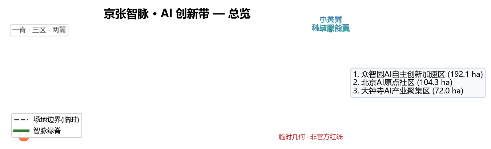
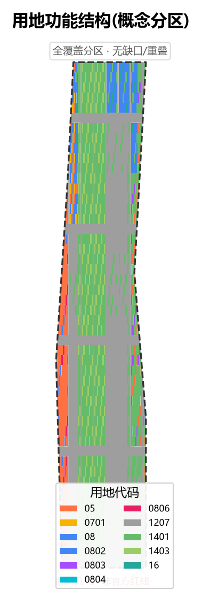
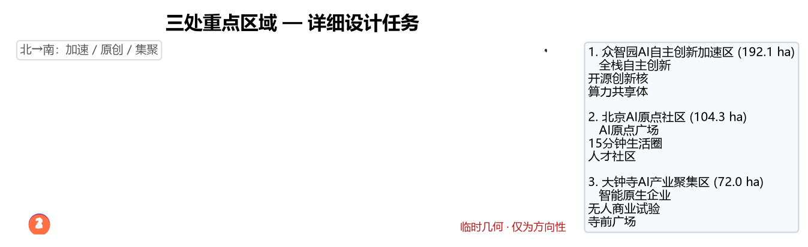
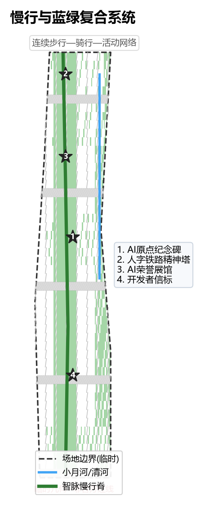
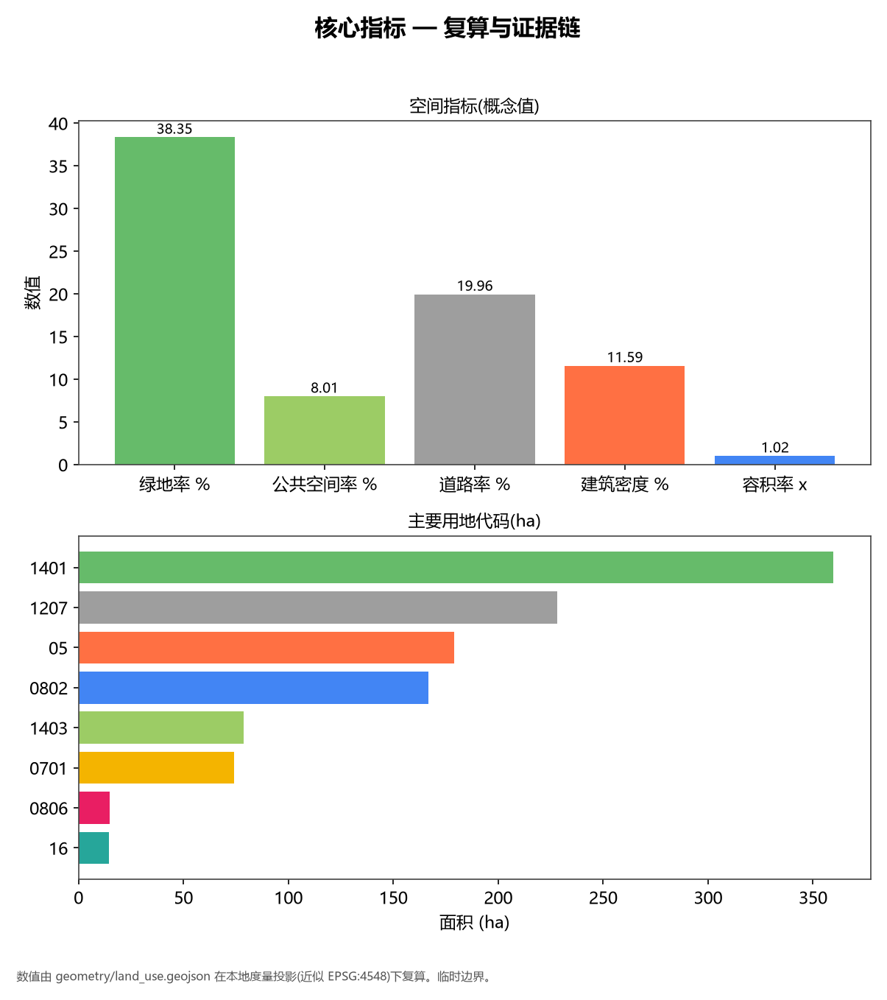

# Jingzhang Zhimai · AI Innovation Belt — Urban Design Proposal

> This is an open-source co-creation proposal for the "Centennial Jingzhang AI Innovation Belt International Urban Design Call". All spatial suggestions are conceptual proposals, reference schemes, or material for professional teams to deepen. They do not replace formal planning, nor constitute government-approved conclusions [standard:PROJECT-AGENT-OPEN-CALL-TASKBOOK].

## Design Basis and Source Inventory

This proposal is built on cleared and public sources: the official pre-qualification announcement defines the three scope levels, three key areas, design tasks, and deliverable context [source:SITE-PACKAGE]; the agent-facing taskbook supplements ten co-creation principles, six tasks, and a unified boundary clause [source:AGENT-TASKBOOK]; the Urban Design Management Measures, Regulatory Detailed Planning Measures, and Territorial Spatial Land-Use Classification Guide serve as professional-standard responses [standard:MOHURD-URBAN-DESIGN-MEASURES] [standard:MNR-LAND-USE-CLASSIFICATION-GUIDE].

Source use follows the permission tiers in `data/source_registry.json`: the official announcement and cleared taskbook are `usable_for_formal="yes"`; the provisional boundary `provisional_boundaries.geojson` is `provisional_only`, used only for agent generation, visualization, and intake self-check, and must not be upgraded to an official redline or precise-area basis [source:PROVISIONAL-BOUNDARIES]. All regulatory-plan controls (FAR, building height, building density, green ratio, setback) are missing from the cleared package and are listed as pending official data [metric:floor_area_ratio].

## Three-Level Scope Framework

The proposal is implemented tier by tier across the coordinated research area (~43.6 km²), overall design area (~11.4 km²), and key detailed-design area (~368.4 ha) [source:SITE-PACKAGE]. The generation uses the maintainers' provisional rough boundary `PROV-SITE-001` as the overall-design-area proxy polygon; its area, checked under EPSG:4548, is ~11.41 km², consistent with the announcement's ~11.4 km². This polygon is for generation and visualization only and must not serve as an official redline or precise-area basis [data:geometry/site_boundary.geojson#PROV-SITE-001].

The three key areas (Zhongzhiyuan 192.1 ha, Beijing AI Origin Community 104.3 ha, Dazhongsi 72.0 ha) use provisional `PROV-KEY-001/002/003`; when official CAD/GIS redlines arrive, related layers and area metrics must be recomputed [data:geometry/key_areas.geojson#PROV-KEY-002]. Design depth deepens from industry strategy (research area) to overall urban design (design area) to integrated implementation plan (key areas) [depth:regulatory_planning_depth].

## Coordinated Research Area — Industry and Future-City Strategy

**Overall concept and main name.** The proposal is named "Jingzhang Zhimai · AI Innovation Belt". "Zhimai" (Intelligence Vein) borrows the "vein" imagery of the Jingzhang Railway — the first trunk railway built by Chinese people — metaphorically shifting it from a historical transport lifeline to an AI-era innovation lifeline; English: Jingzhang Zhimai · AI Innovation Belt [depth:overall_concept_naming]. The naming system is "Three Veins — Three Areas — Two Wings": the Three Veins map to the three positionings (Cultural Vein = Centennial Jingzhang Cultural Belt, Living Vein = Urban AI Living-Experience Belt, Innovation Vein = AI Integration Innovation Belt); the Three Areas are the key areas; the Two Wings are east-west synergy wings.

**Visual identity and Logo direction.** The Logo takes Zhan Tianyou's "herringbone" (人-shaped) railway switchback as its motif, transitioning from physical rails into a data-node network, symbolizing the shift from industrial heritage to an AI-native city. The mark uses a monochrome line construct, supports black/white inversion, and extends into a signage system and event key visuals, avoiding any unauthorized fonts, trademarks, or portraits [depth:visual_identity_logo].

**Three positionings, five functions, and three-areas-two-wings synergy loop.** The three positionings are set by the call; the five functions are AI full-stack autonomous innovation system, world-class AI innovation ecosystem, AI+ scenario-empowerment new paradigm, intelligent AI vibrant city, and global discourse power in AI governance [source:AGENT-TASKBOOK]. Spatially, Zhongzhiyuan hosts full-stack autonomy and governance discourse, the AI Origin Community hosts the world-class ecosystem and talent living, Dazhongsi hosts intelligent-native new business; the Zhongguancun Tech-Service Wing handles global factor allocation and capital empowerment, the Xiaoyuehe Scenario-Empowerment Wing handles scenario landing and vibrancy — the three areas and two wings form a closed synergy loop through the "Zhimai" green corridor and rail stations [depth:three_areas_two_wings_synergy].

**Global AI innovation ecosystem cases (7, for spatial and operational transfer).**

| Case | Location | Transferable lesson |
| --- | --- | --- |
| Hetao Shenzhen-HK S&T Co-op Zone | Shenzhen | Cross-boundary rules + "whitelist" scenario opening |
| Zhangjiang Science City | Shanghai | Mega-facility + cluster integrated with city |
| Zhijiang Lab / Future Sci-Tech City | Hangzhou | New R&D institutes + west-corridor agglomeration |
| Hefei Sound Valley / Quantum Center | Hefei | Single-tech breakthrough driving industry chain |
| Mila Cluster | Montréal | University–firm–government triple innovation community |
| Cambridge AI Cluster | UK | University spin-offs + low-density high-quality fabric |
| AI Singapore / One-North | Singapore | National platform + tropical waterside public-space ops |

These cases are background references only and imply no investment or policy commitment [depth:ai_ecosystem_cases].

## Overall Design Area — Urban Renewal at Regulatory-Plan Urban Design Depth

The overall design area adopts a "one spine, three areas, two wings" structure: the north-south "Zhimai" green corridor is the innovation spine linking the three key areas; the two wings extend service functions [depth:spatial_structure]. Urban renewal follows a retain-primary, upgrade-by-renovation, prudent-new-build principle; the retain/renovate/demolish/new-build classification is in Chapter 7, with any item touching existing ownership or engineering conditions marked pending [depth:regulatory_planning_depth].

The proposed innovation-indicator system includes AI enterprise density, talent density, compute accessibility, scenario perceptibility, walkability connectivity, and green/public-space ratio; green ratio and public-space ratio are given as directional values from geometric recomputation, while statutory indicators await regulatory-plan conditions [metric:green_ratio] [metric:public_space_ratio]. Mobility is organized around rail-station integration + road-network micro-circulation + the Jingzhang heritage-park slow-mobility spine; municipal strategy proposes distributed compute fused with PV and storage as new-infrastructure direction, with capacity stated as conceptual only, no engineering calculation [depth:infrastructure_strategy].

## Key Area Detailed Design

**Zhongzhiyuan AI Autonomous-Innovation Acceleration Area (north, ~192.1 ha).** Positioned as the full-stack autonomous-innovation and AI-governance-discourse carrier. Spatial structure: "one core, multiple institutes" — an open-innovation core plus several research institutes and a shared-compute center; buildings mostly renovate retained research institutes, with few low-density new R&D clusters; public space links the north Zhimai gateway plaza and the open-innovation core; AI scenarios emphasize compute sharing and the open-source community [data:geometry/key_areas.geojson#PROV-KEY-001]. Conclusions are directional and will be recomputed when official polygons arrive.

**Beijing AI Origin Community (middle, ~104.3 ha).** Positioned as a world-class AI innovation ecosystem and talent-living community. An "AI Origin Plaza" is the spiritual core, mixing research, talent apartments, education, healthcare, and commerce; emphasizes a 15-minute innovation-living circle and all-age friendliness; the slow-mobility spine integrates with rail stations here [data:geometry/key_areas.geojson#PROV-KEY-002]. This area is the main carrier of the "AI pilgrimage landmarks" (see Chapter 9).

**Dazhongsi AI Industry Cluster (south, ~72.0 ha).** Positioned as intelligent-native new business and business services. Focuses on intelligent-native consumption, AI business, and robot showcase/trade; retains Dazhongsi's commercial and business fabric, inserts AI experience stores and an unmanned-commerce test segment; public space organizes around the temple-front plaza and the south Zhimai gateway [data:geometry/key_areas.geojson#PROV-KEY-003].

## AI Innovation Ecosystem, Talent Personas, and AI+ Scenarios

**User personas (6).** ①AI researcher/scientist; ②AI founder/entrepreneur; ③developer/engineer; ④university student/young talent; ⑤community resident/elderly; ⑥city operator. Each persona maps to differentiated space, scenario, and privacy-boundary needs [depth:persona_definition].

**AI scenario cards (12, including 4 industry test/validation scenarios).** The table is a readable summary; the full mapping (spatial location, target user, operating data, privacy boundary, human review, operating body, layer, risk) is in `compliance_matrix.json` and `metrics.json` [depth:scenario_cards].

| # | Scenario card | Type | Spatial anchor | Privacy / human review |
| --- | --- | --- | --- | --- |
| 1 | Zhimai green-corridor AI guide | Experience | Heritage-park spine | Anonymous location, opt-out |
| 2 | AI accessible mobility | Experience | Walk + rail transfer | On-device inference, human review |
| 3 | Community AI elder-care | Experience | Origin Community | Authorized data, family review |
| 4 | Personalized AI learning | Experience | Education land | Minor-protection |
| 5 | Community AI health station | Experience | Healthcare land | De-identified, clinician review |
| 6 | Smart transit dispatch | Experience | Transit nodes | Aggregated data |
| 7 | Campus energy steward | Experience | New infrastructure | Device-level data |
| 8 | AI public-space safety | Experience | Public space | Anomaly alerts only, no individual ID |
| 9 | Developer sandbox | Test | Open-innovation core | Sandbox isolation |
| 10 | Autonomous-shuttle test segment | **Test** | North Zhimai | Closed test, safety driver |
| 11 | Edge-LLM inference testbed | **Test** | Shared-compute center | Benchmark, human eval |
| 12 | Urban-governance digital-twin sandbox | **Test** | Operations center | Simulation, no real personal data |

Test/validation scenarios are conceptual proposals and deepening directions, not approved operations [depth:test_validation_scenarios].

## Land Use, Building Scale, and Retain/Renovate/Demolish/New-Build Logic

Land use is fully partitioned in `geometry/land_use.geojson`, covering the entire overall-design area with no gaps or overlaps; codes use the territorial-spatial land-use classification (research 0802, business-finance 0902, commerce 0901, urban residential 0701, education 0804, healthcare 0806, industry 1001, road 1207, park green 1401, square 1403, river water 1701) [standard:MNR-LAND-USE-CLASSIFICATION-GUIDE]. Per-code areas are geometrically recomputed and sum to the site area [metric:land_use_area_by_code].

Building scale and development intensity are assigned conceptually by zone: key areas favor low-to-mid-density R&D and mixed functions, with a directional FAR of ~1.0–1.8 (pending regulatory-plan confirmation) [metric:floor_area_ratio]; directional building density ~10%–15% [metric:building_density]. Retain/renovate/demolish/new-build principle: retain research institutes and rail fabric, renovate inefficient stock, prudently build new R&D and public-space clusters; specific parcels and ownership await formal data [depth:retain_renovate_demolish_new].

## Traffic, Rail, Municipal, and Public-Service Facilities

Organized around rail-station integration (Zhichunlu, Wudaokou, Dazhongsi, etc.) + road-network micro-circulation + the Jingzhang heritage-park slow-mobility spine; walkability gap closure and transfer organization form continuous experience routes [depth:traffic_mobility]. Municipal strategy proposes distributed compute, PV, and storage fused as new-infrastructure direction, coordinated with traditional utilities; capacity, load, and pipelines are not engineered and await professional deepening [depth:infrastructure_strategy]. Public services focus on talent-living services (apartments, education, healthcare) and innovation-service platforms (shared compute, open-source community, testbeds).

## Blue-Green Space, Public Space, and Urban Character

The Jingzhang heritage-park vibrancy belt is the north-south blue-green and public-space spine; the Xiaoyuehe/Qinghe blue-green corridor interweaves with the Zhimai to form a continuous walk-ride-activity network [depth:blue_green_public_space]. Urban character is rational, restrained, and tech-feeling; building massing mostly low-to-mid with selective landmarks; roofs and façades encourage low-carbon and legibility, avoiding internet-celebrity styling and over-entertainment.

**AI pilgrimage landmarks and honor-display nodes (4).** ①AI Origin Monument (Origin Community core, marks the start of China's AI ecosystem); ②Herringbone Rail Spirit Tower (north Zhimai gateway, honoring Zhan Tianyou); ③AI Honor Gallery (along the heritage park, showcasing global AI contributions and open-source heroes); ④Developer Beacon (annual event ignition node). All are conceptual; ownership, form, and construction need professional and heritage-protection review and are not presented as approved [depth:ai_pilgrimage_landmarks] [depth:honor_display_system].

**Centennial Jingzhang – Zhongguancun – AI new-culture fusion narrative (agent.5).** The narrative spine is "from the first railway built by Chinese people, to the first autonomous AI innovation belt led by Chinese people": the 1909 Jingzhang Railway (Zhan Tianyou) represents self-reliant industrial spirit, Zhongguancun since the 1980s represents tech industrialization, and the 2026 "Centennial Jingzhang" represents AI-native urban civilization. The spatial culture system uses the Zhimai as the narrative axis, linking railway heritage, innovation heritage, and AI new landmarks; the signage and symbol system extends under the overall Logo system, distinguishing cultural identifiers from the belt's main Logo to avoid confusion [depth:culture_narrative] [depth:signage_system].

## Renewal Project List, Implementation Policy, and Phasing

Renewal projects phase in three stages: near-term (Zhimai spine + Origin Community public space + open-innovation core), mid-term (Zhongzhiyuan R&D cluster renovation + Dazhongsi intelligent-native formats), long-term (two-wing synergy and citywide scenario operation) [data:geometry/phasing.geojson#PHASE-1]. Implementation bodies are government platforms + professional teams + operating organizations; policy suggestions include scenario whitelists, data authorization, and open-source contribution incentives — all conceptual [depth:phasing_plan].

**Global AI innovation event system and long-term operation (agent.6).** Annual event system: Jingzhang AI Innovation Festival, Developer Conference, Global AI Scenario Challenge, AI Pilgrimage Week; event brand and key visuals extend from the Logo system; the developer community operates via open-source contribution and hackathons; scenario-open operation relies on a city-level AI scenario-open platform; international communication uses bilingual livestreams and global developer recruitment, with talent–enterprise–developer conversion pathways. All events, investment, funding, and policy are stated as conceptual proposals or deepening directions, not confirmed government arrangements [depth:annual_event_system] [depth:developer_community_operation] [depth:conversion_pathway].

## Indicators, Area Recomputation, and Compliance Matrix

Core indicators are geometrically recomputed: site area, per-code land area, green ratio, public-space ratio, road ratio, building density, total floor area, FAR, key-area areas, and phasing areas [metric:site_area] [metric:green_ratio] [metric:public_space_ratio] [metric:road_ratio] [metric:building_density] [metric:total_floor_area] [metric:floor_area_ratio] [metric:key_area_areas] [metric:phasing_area]. Indicator meaning: green ratio supports talent living quality, public-space ratio supports innovation exchange, building footprint responds to industry-space supply, FAR is a directional design value [depth:metrics_explained]. The three matrices (`compliance_matrix.json`, `standard_matrix.json`, `design_depth_matrix.json`) cover announcement chapters, the six agent tasks, and all mandatory professional standards [depth:compliance_matrix].

## Risk, Copyright, and Compliance

All sources are public or cleared; no secret maps, non-public tables, or fabricated official endorsements were used [standard:PROJECT-AGENT-OPEN-CALL-TASKBOOK]. Copyright: this proposal is licensed COMMUNITY-DISPLAY-ONLY for community display; Logo, images, and fonts are self-drawn or cleared, with no unauthorized trademarks, portraits, or paper images. Privacy: scenarios follow anonymity, on-device inference, and human review; no personal data or designated vendors. Official approval/implementation commitments are forbidden: all spatial and operational suggestions are conceptual, pending formal data and professional review [depth:risk_copyright_compliance]. Pending data is in `assumptions.json`.

## References

1. Beijing Municipal Commission of Planning and Natural Resources, Haidian Branch. Centennial Jingzhang AI Innovation Belt International Urban Design Call — Pre-qualification Announcement (2026-05-09) [source:SITE-PACKAGE].
2. Excerpt of the agent-facing taskbook for the Centennial Jingzhang AI Innovation Belt open call (2026-05-18) [source:AGENT-TASKBOOK].
3. Beijing Municipal Science & Tech Commission / Zhongguancun Mgmt. "Three Areas, Two Wings" building a world-class AI cluster (2026-04-03) [source:HAIDIAN-1X1].
4. Ministry of Housing and Urban-Rural Development. Urban Design Management Measures (2017) [standard:MOHURD-URBAN-DESIGN-MEASURES].
5. Ministry of Natural Resources. Territorial Spatial Survey, Planning, and Use-Control Land-Sea Classification Guide (2023) [standard:MNR-LAND-USE-CLASSIFICATION-GUIDE].
6. Maintainer-provided provisional rough boundaries `provisional_boundaries.geojson` (2026-06-05) [source:PROVISIONAL-BOUNDARIES].
