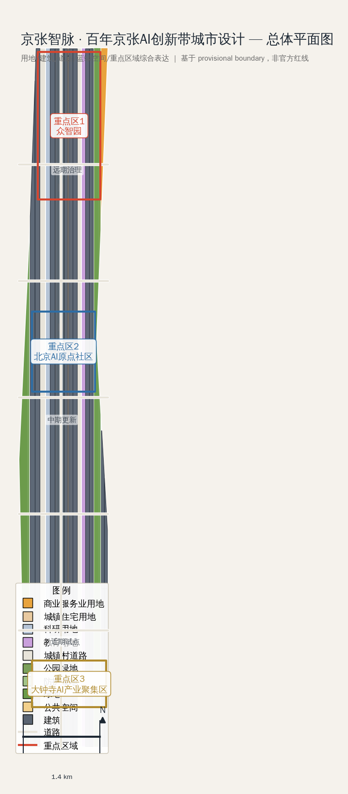
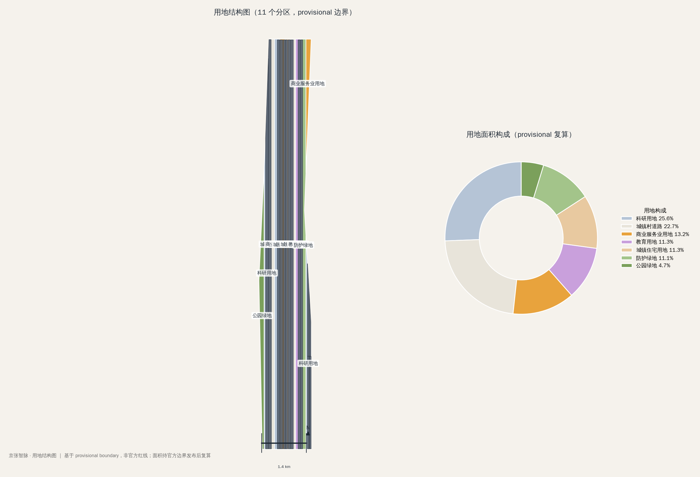
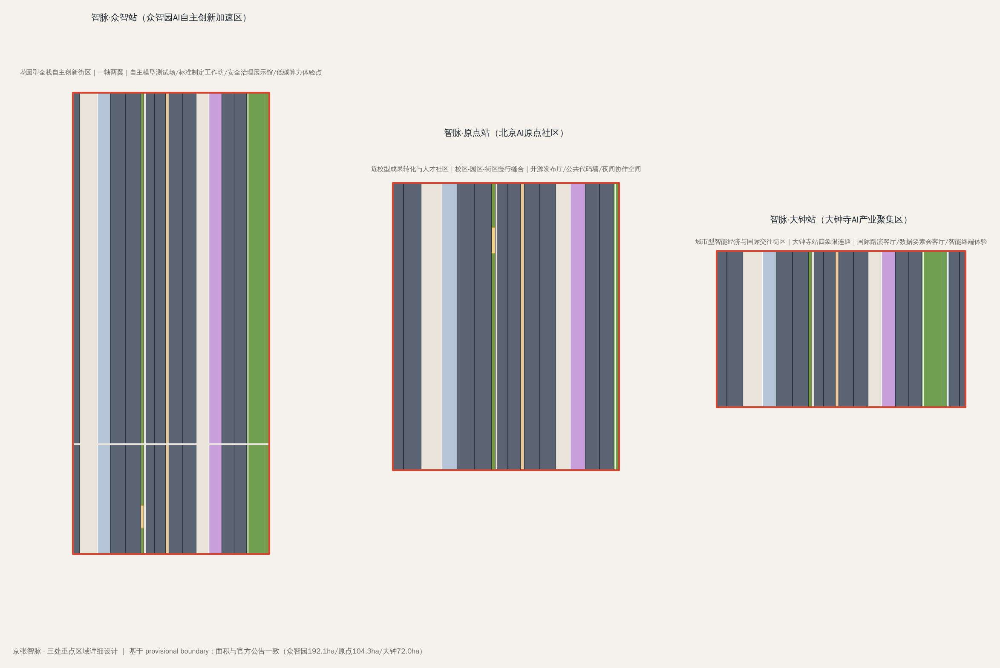
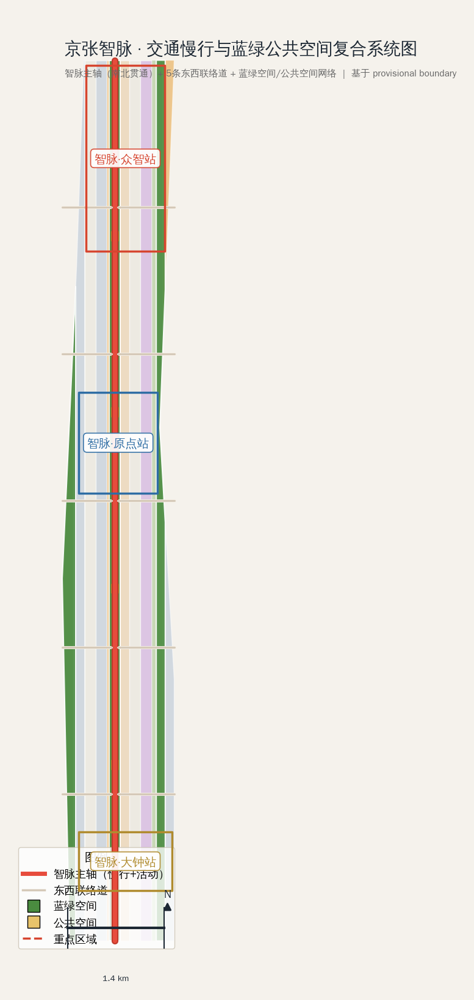
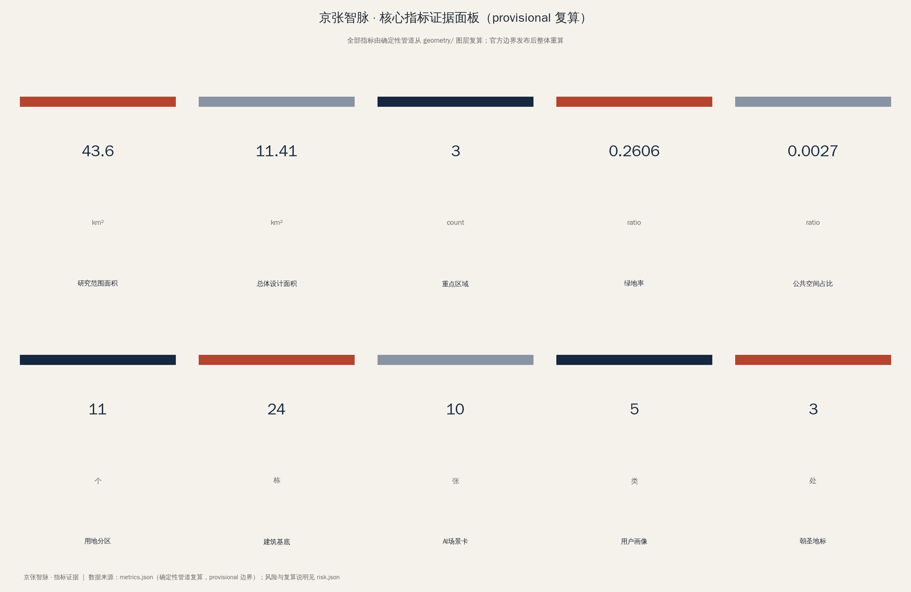

# 京张智脉：百年京张AI创新带城市设计方案

## 方案速览

1909年，京张铁路以青龙桥"人字形"线路破解关沟爬坡难题，成为中国第一条自主设计建造的干线铁路——那是中国工程师第一次用"智慧"征服地理障碍；今天，海淀以 AI 全栈自主创新再次"爬坡"。本方案把京张铁路的"铁轨平行线"读作数据流，把 AI 算力与开发者读作"节点"，提出总体概念——**京张智脉（Jing-Zhang Intelligence Vein，简称 JZ·AI）**：以京张遗址公园为历史与公共空间主轴，以众智园、北京AI原点社区、大钟寺三处重点片区为创新锚点，让"百年铁路之脉"进化为"AI 创新之脉"。

**一句话**：把京张遗址公园读作一条"智脉"——1909年人字形铁路的爬坡智慧，对应今天 AI 全栈自主创新的爬坡，以一条南北贯通的公共空间主轴组织世界级 AI 创新带。

**五个关键判断**：其一，**"一带三核、多点场景、蓝绿慢行复合环"结构**——智脉主轴（京张遗址公园活力带）串联三处重点区（智脉·众智站/智脉·原点站/智脉·大钟站），中关村服务翼与小月河场景翼成环；其二，**"智脉一日线"公共体验路线**串联 10 处 AI 场景与 3 处朝圣地标，让方案可走、可看、可参与；其三，**命名即系统**——"京张智脉"建立从片区、节点到事件的三级命名体系，铁轨双线+数据节点的 Logo 母题延展为导视、活动和荣誉体系；其四，**全包机器可读且"方案即管道"**——11 个用地单元、30+ 可复核指标由确定性管道产出，官方数据到位即可重跑进化；其五，**"智脉"AI 创新指数五维框架**支撑长期运营与品牌资产沉淀。

**统一声明**：本方案为 AI 生成的开放共创建议，基于临时粗略边界（官方红线到位后整体重算），全部空间建议均为概念建议、参考方案，可供专业团队深化研究，不构成政府审定结论——本声明覆盖全文 [source:PROVISIONAL-BOUNDARIES][depth:risk_missing_data]。

## 设计依据与资料清单

本 formal 方案以北京市规划和自然资源委员会海淀分局发布的《百年京张AI创新带城市设计国际方案征集资格预审公告》为第一依据，并以 `brief/site-package/` 中经维护者登记的临时粗略边界、重点区域、枚举、指标和来源清单为机器可读依据。AI agent 在生成方案前读取了 `design_brief.json`、`allowed_design_space.json`、`sources.json`、`enums/`、`ranges/`、`schemas/`、`data/source_registry.json` 和 `data/processed/agent_fact_pack.md`，并用 `project_scope_summary.csv`、`agent_task_requirements.csv`、`source_use_matrix.csv`、`missing_data_checklist.csv` 建立任务、范围、资料用途和缺口清单。所有设计判断都拆分为可追溯来源、可复算指标、可校验图层和可人工复核假设。

本节证据链引用 [source:OFFICIAL-ANNOUNCEMENT]、[source:AGENT-TASKBOOK]、[source:SITE-PACKAGE]、[source:SOURCE-REGISTRY]、[source:PROCESSED-FACT-PACK]、[source:BOUNDARY-SOURCE]、[source:KEY-AREA-SOURCE]、[standard:PROJECT-OFFICIAL-ANNOUNCEMENT]、[standard:PROJECT-AGENT-OPEN-CALL-TASKBOOK]、[standard:MOHURD-URBAN-DESIGN-MEASURES]、[standard:MOHURD-CONTROL-DETAILED-PLANNING]、[standard:MNR-LAND-USE-CLASSIFICATION-GUIDE]、[standard:MOHURD-ARCH-DESIGN-DEPTH-2016] 和 [depth:existing_conditions_diagnosis]。

**资料使用边界**：`data/source_registry.json` 登记了公开、清权与临时资料的用途边界。当前登记摘要：formal 可用资料 5 条，背景资料 0 条，provisional-only 资料 1 条。agent 不得把 background_only 或 provisional_only 资料升级为 official boundary、法定控规、正式评分依据或政府实施承诺。

**边界精度说明**：本方案在官方 `SITE_BOUNDARY` 或三处 `KEY_AREA` 尚未取得时，使用 `brief/site-package/geometry/provisional_boundaries.geojson` 生成临时 formal 包。提交包中的 `geometry/site_boundary.geojson` 与 `geometry/key_areas.geojson` 均标注为 `provisional_constraint`、`official_boundary=false`，只能用于方案生成、自检、可视化和设计讨论，不能作为 official redline、审批依据、精确面积依据或法定控制结论。该组织方数据缺口本身不阻断内容评分；替换 official polygons 后，site boundary、key areas、land use、roads、green space、public space、buildings、phasing 和 metrics 均需重算。

## 三层范围工作框架

方案按照公告确定的三个层次组织工作：统筹研究范围关注 43.6 平方公里的 AI 产业生态、战略定位、创新链和未来城市形态；总体设计范围关注 11.4 平方公里京张遗址公园周边 1-2 公里城市地区和产业区，要求形成城市更新总体框架、产业空间布局、交通市政支撑和城市风貌控制；重点区域范围关注 368.4 公顷三处详细设计地区，要求明确功能业态、建筑规模、拆改留分类、公共空间连通和交通组织。三层范围在 `compliance_matrix.json` 中逐条映射，保证公告 1.3、1.4、1.5 与 agent.1-agent.6 的必选任务都有章节、图层、指标、图纸和 HTML 证据。

三层工作框架的深度项由 [depth:three_level_scope_framework] 和 [depth:overall_spatial_structure] 约束，空间证据以 [data:geometry/site_boundary.geojson#SITE-001] 与 [data:geometry/key_areas.geojson#PROV-KEY-001] 为准，任务依据以 [standard:PROJECT-OFFICIAL-ANNOUNCEMENT] 为准。

三层工作不是互相割裂的图纸集合。统筹研究决定产业链和城市形态判断，总体设计把判断落实到更新项目、空间结构和设施承载，重点区域详细设计验证具体地块、建筑、交通、公共空间和 AI 应用场景的可实施性。agent 生成方案时先锁定当前提交采用的 provisional 边界和约束，再生成用地、建筑、道路、绿地、公共空间、分期和 AI 服务节点，最后从这些图层复算指标并在正文解释哪些结论仍受 provisional boundary 限制。

**本方案总体概念**："京张智脉共生带"——以京张遗址公园为历史与公共空间主轴，以众智园、北京AI原点社区、大钟寺三处重点片区为创新锚点，以高校、企业、社区和轨道站点为日常网络，形成"一带三核、多点场景、蓝绿慢行复合环"的空间组织。"一带"是把公告中的三层范围转译为工作方法；"三核"对应三处重点区域；"多点场景"对应 AI+公共服务、产业服务和城市生活的可运营节点；"复合环"对应慢行、绿地、公共空间和活动路线的联动。

| 层级 | 设计问题 | 方案回答 | 数据落点 |
| --- | --- | --- | --- |
| 统筹研究范围 | AI产业生态和未来城市形态如何组织 | 建立"高校策源-开源协作-企业转化-公共体验-国际传播"创新链 | compliance_matrix.json、standard_matrix.json |
| 总体设计范围 | 产业空间、城市更新、交通市政和风貌如何落图 | 用地、建筑、道路、绿地、公共空间和分期图层共同表达 | [data:geometry/land_use.geojson#LU-001]、[data:geometry/roads.geojson#ROAD-001] |
| 重点区域范围 | 三处片区如何达到详细设计深度 | 分别提出定位、空间动作、AI场景和实施依赖 | [data:geometry/key_areas.geojson#PROV-KEY-001]、[data:geometry/key_areas.geojson#PROV-KEY-002]、[data:geometry/key_areas.geojson#PROV-KEY-003] |

## 统筹研究范围产业与未来城市研究

统筹研究范围的核心任务是构建世界级 AI 创新生态体系。本方案以"高校策源-开源协作-企业转化-公共体验-国际传播"为创新链主线，梳理海淀高校院所、头部企业、算力算法数据要素、孵化平台、上市企业、独角兽和科技服务资源，提出 AI 创新链、产业链、人才链和城市服务链的空间协同框架。命名方案和 logo 方向服务于"百年京张文化带、都市AI生活体验带、AI融合创新带"的整体辨识度。

### 命名体系与视觉识别（agent.1）

- **主名称**：京张智脉（Jing-Zhang Intelligence Vein，英文简称 JZ·AI）。
- **命名逻辑**："京张"锚定百年铁路文化基因，"智脉"表达 AI 创新带作为城市创新血脉的意象，与"一带"的空间形态和"脉动"的运营节奏形成双关。命名体系覆盖三层：片区级（三处重点区）、节点级（朝圣地标/公共空间）、事件级（年度活动品牌）。

**三级命名体系**（"智脉"母题统一延展）：

| 层级 | 命名规则 | 实例 |
| --- | --- | --- |
| 片区级 | "智脉·X站"——以创新功能定位站点 | 智脉·众智站（全栈自主）、智脉·原点站（近校策源）、智脉·大钟站（智能原生） |
| 节点级 | "X驿/廊/庭/墙"——以公共空间或建筑类型命名 | 开源发布厅、端侧算力驿站、清河低碳廊、智能体贡献荣誉墙、开源成果展示廊 |
| 事件级 | "智脉·X周/日/赛"——以活动品牌命名 | 智脉全球AI活动周、智脉开源日、智脉开发者大赛、智脉治理对话 |

节点级命名与三级命名体系服务于导视系统（agent.5）：导视"K 标"系统以"智脉 Logo + 节点名 + 双语"三要素统一标识（详见朝圣地标与城市风貌章），保证从片区到节点的可读性、可寻路性与国际传播性；全部命名均为概念建议，涉及商标、字体、图像和标识的后续使用须清权。
- **Logo 方向**：以京张铁路铁轨的平行双线与 AI 神经网络节点符号融合——两条平行线象征铁轨与数据流，节点象征算力/模型/人；配色采用"铁锈红 + 科技银 + 深空蓝"，铁锈红呼应铁路历史，科技银呼应工业制造，深空蓝呼应 AI 未来。Logo 的图形变体可延展为导视系统、活动主视觉和荣誉碑刻。
- **视觉规范**：字体采用中文字体思源黑体 + 英文字体 Geist 组合；栅格系统基于铁路枕木的等距节奏；辅助图形包括"轨道节点""脉冲波""开源分叉"三种。

本方案以 [source:AGENT-TASKBOOK] 与 [standard:PROJECT-AGENT-OPEN-CALL-TASKBOOK] 标注命名与视觉要求来自 agent 开源征集任务，属于设计建议，不是法定规划控制。

### 五大功能与三区两翼协同回路（agent.1/agent.2）

五大功能——AI 全栈自主创新体系、世界级 AI 创新生态、AI+场景赋能新范式、智能化 AI 活力城市、AI 治理全球话语权——在三区两翼框架下的协同回路为：

1. **众智园AI自主创新加速区**承担"全栈自主 + 治理话语权"：国家人工智能平台、标准制定、安全治理、全栈技术验证。
2. **北京AI原点社区**承担"近校策源 + 开源生态"：高校成果转化、开源协作、人才特区、品牌活动。
3. **大钟寺AI产业集聚区**承担"智能原生新业态 + 国际交往"：领军企业、智能体、智能终端、内容消费、数据要素、国际路演。
4. **中关村科技服务翼**提供要素全球化配置、中关村 IP 与资本赋能。
5. **小月河场景赋能翼**提供 AI 场景开放试验场与智能化活力城市界面。

三区两翼的协同不是地理上的三块拼图，而是创新链上的功能分工：策源（原点社区）→ 验证（众智园）→ 转化（大钟寺）→ 服务（中关村翼）→ 试验（小月河翼），形成闭环。

### 全球 AI 创新生态案例（agent.2，5-8 个）

以下 6 个全球 AI 创新生态案例为本方案的生态组织提供借鉴（均为公开信息，作为设计参考而非实施承诺）：

| # | 案例 | 可借鉴经验 | 空间转化 |
|---|------|-----------|---------|
| 1 | 硅谷帕洛阿尔托（Palo Alto）高校-风险投资-企业集群 | 高校策源与资本服务的步行可达半径 | 原点社区近校 500m 步行孵化环 |
| 2 | 波士顿 Kendall Square | 生命科学/AI 实验室群 + 公共开放空间的产学研混合 | 众智园"实验室+公共测试场"混合布局 |
| 3 | 伦敦 King's Cross 国王十字 | 旧铁路工业遗产更新为科技创新街区 | 京张遗址公园沿线的工业遗产活化模式 |
| 4 | 东京涩谷 STREAM / 品川 | 轨道枢纽站城一体 + 内容产业集聚 | 大钟寺站四象限一体化开发 |
| 5 | 深圳南山科技园 | 硬件原型 + 快速迭代的产业社区 | 众智园硬件测试与中试空间 |
| 6 | 新加坡 one-north 纬壹科技城 | 花园城市中的创新生态与人才生活配套 | 蓝绿公共空间与人才服务复合 |

这 6 个案例共同指向三个空间原则：**步行可达的产学研混合、轨道枢纽驱动的集聚、花园式公共空间对创新人才的黏性**。它们被转化为本方案的用地结构、轨道一体化策略和蓝绿公共空间体系。

统筹研究并不新增伪精确红线；它通过 [standard:MOHURD-URBAN-DESIGN-MEASURES] 要求的城市风貌、公共空间和建筑布局统筹，回接 [data:geometry/land_use.geojson#LU-001]、[data:geometry/public_space.geojson#PUBLIC-001] 与 [depth:overall_spatial_structure]。

## 总体设计范围城市更新与控规深度城市设计

总体设计范围要求达到控制性详细规划的城市设计深度。方案提出城市更新总体空间结构、低效空间识别、更新项目清单、实施政策建议、产业功能比例、空间组织模式、建筑总规模和综合承载能力评估。`geometry/land_use.geojson` 完整覆盖设计边界且无重叠（本方案生成 10 个用地分区：[metric:land_use_parcel_count]），`geometry/buildings.geojson` 表达 24 个更新/保留建筑基底（[metric:building_footprint_area_sqm] 可复算），`geometry/roads.geojson` 表达 6 条道路慢行与轨道接驳关系，`metrics.json` 复算核心面积、比例和图层数量。

本节按照 [standard:MOHURD-CONTROL-DETAILED-PLANNING] 把控规深度内容拆成可审查对象：[data:geometry/land_use.geojson#LU-001] 表达用地结构，[data:geometry/buildings.geojson#BLDG-001] 表达建筑基底，[data:geometry/roads.geojson#ROAD-001] 表达交通组织，[metric:site_area_sqm] 复核总体设计范围面积，[depth:land_use_layout] 与 [depth:development_intensity_controls] 约束成果深度。

**总体空间结构**（"一带三核、多点场景、蓝绿慢行复合环"的总体设计转译）：

- **一带**：京张遗址公园活力主轴，南北贯通（[data:geometry/green_space.geojson#GREEN-001]），串联三处重点区。
- **三核**：众智园（北核，全栈自主创新）、原点社区（中核，近校策源）、大钟寺（南核，智能原生新业态）。
- **多点场景**：沿主轴和东西联络道布置 AI 公共交往节点（[data:geometry/public_space.geojson#PUBLIC-001] 等 4 处 plaza）。
- **复合环**：由公园绿带、慢行道、骑行道和公共空间节点构成的蓝绿慢行复合环。

**用地功能结构**：本方案将 11.4 km² 总体设计范围划分为 10 个功能分区（[metric:land_use_parcel_count]），包括公园绿地（[metric:green_ratio]=26.1%）、科研用地（众智园与原点社区核心）、商业服务业用地（大钟寺与主轴两侧）、城镇住宅用地（存量更新）、教育用地（高校集聚区）和城镇村道路用地。分区完整覆盖设计边界、无缝无重叠，符合 [standard:MNR-LAND-USE-CLASSIFICATION-GUIDE]。

**建筑更新框架**：`geometry/buildings.geojson` 的 24 个建筑基底按"保留/改造/新建"三类表达（[depth:retain_renovate_demolish]），以约 1/3 保留、2/3 改造为设计前提（[data:geometry/buildings.geojson#BLDG-001]），避免大拆大建，符合城市更新总体框架要求。建筑高度、开发强度、容积率（[metric:floor_area_ratio] 当前为 unknown）等管控指标待正式控规条件确认，不伪装为审定指标。

总体设计还必须支撑交通、轨道、市政和配套设施（详见"交通、轨道、市政与公共服务设施"章），涉及建筑高度、道路红线、退线和设施标准的内容，若尚无官方控制条件，一律写为"待正式控规条件确认"。

## 重点区域详细设计

三处重点区域详细设计是必选项（公告 1.5.3.1/1.5.3.2/1.5.3.3），达到规划综合实施方案的城市设计深度。三处重点区域引用 [data:geometry/key_areas.geojson#PROV-KEY-001]、[data:geometry/key_areas.geojson#PROV-KEY-002]、[data:geometry/key_areas.geojson#PROV-KEY-003]，面积与官方公告一致（众智园 192.1 ha [metric:key_area_zhongzhiyuan_sqm]、原点社区 104.3 ha [metric:key_area_origin_sqm]、大钟寺 72.0 ha [metric:key_area_dazhongsi_sqm]，[metric:key_area_count]=3）。若官方 polygon 缺失，本方案暂用 provisional_constraint，正文、HTML、sources、assumptions 和 self_check 均说明其不能作为正式评分或审批依据。

### 智脉·众智站——众智园AI自主创新加速区（[data:geometry/key_areas.geojson#PROV-KEY-001]）

- **定位**：花园型全栈自主创新街区，承载国家人工智能平台、全栈自主创新、标准制定、安全治理与产业展示。
- **空间结构**："一轴两翼"——清河创新界面为轴，产业展示翼 + 低碳创新交往翼。
- **建筑更新**：以科研用地（[data:geometry/land_use.geojson#LU-002]）为骨架，保留现有产业楼宇，改造沿清河界面的低效厂房为展示与测试空间，新建安全治理与标准工作坊节点。
- **交通慢行**：强化对外交通组织，接入北五环与京张遗址公园跨环路节点；沿清河形成独立骑行道。
- **公共空间**：清河低碳创新廊（对应 [depth:blue_green_public_space]），以绿色空间承载开放测试与标准治理展示。
- **AI 场景**：自主模型测试场、标准制定工作坊、安全治理展示馆、低碳算力体验点。
- **实施风险**：清河蓝线、防洪与生态条件待官方确认；对外交通组织依赖道路红线复核。

### 智脉·原点站——北京AI原点社区（[data:geometry/key_areas.geojson#PROV-KEY-002]）

- **定位**：近校型成果转化与人才社区，服务高校、开源社区与初创团队。
- **空间结构**："校区-园区-街区"三层慢行缝合，形成近校成果转化街。
- **建筑更新**：保留高校周边现状建筑，改造沿街首层为成果发布、开源协作与人才服务空间，新建少量人才居住与生活配套（[data:geometry/buildings.geojson#BLDG-001]）。
- **交通慢行**：组织校区、园区、街区慢行联系与轨道站点一体化接驳。
- **公共空间**：开源发布厅、公共代码墙、夜间协作空间（[data:geometry/public_space.geojson#PUBLIC-001]）。
- **AI 场景**：开源社区、成果发布、人才特区服务、近校孵化、AI 教育体验点。
- **实施风险**：校区边界、权属与首层业态待确认；成果转化涉及知识产权与数据授权边界。

### 智脉·大钟站——大钟寺AI产业聚集区（[data:geometry/key_areas.geojson#PROV-KEY-003]）

- **定位**：城市型智能经济与国际交往街区，服务领军企业、智能体、智能终端与内容消费企业。
- **空间结构**：以大钟寺站为锚点的四象限步行连通 + 智能原生消费街。
- **建筑更新**：保留重点企业总部楼宇，改造商业裙房为智能终端体验与内容消费场景，新建国际路演客厅（[data:geometry/land_use.geojson#LU-005]）。
- **交通慢行**：大钟寺站一体化开发、路口四象限步行连通、商业区慢行网络。
- **公共空间**：规划绿地复合利用、国际路演客厅前广场（[data:geometry/public_space.geojson#PUBLIC-003]）。
- **AI 场景**：智能体与智能终端展示、内容消费、数据要素会客厅、国际路演。
- **实施风险**：轨道站点、道路交叉口与市政管线条件待确认；商业功能比例需市场测算支撑。

| 重点片区 | 设计定位 | 空间动作 | AI产业与运营场景 | 证据引用 |
| --- | --- | --- | --- | --- |
| 众智园AI自主创新加速区 | 花园型全栈自主创新街区 | 清河创新界面、产业展示、低碳交往、对外交通 | 自主模型测试、标准制定、安全治理、低碳算力 | [data:geometry/key_areas.geojson#PROV-KEY-001]、[depth:three_key_area_detailed_design] |
| 北京AI原点社区 | 近校型成果转化与人才社区 | 校区-园区-街区慢行缝合、成果发布、开源协作 | 开源社区、成果发布、人才特区、近校孵化 | [data:geometry/key_areas.geojson#PROV-KEY-002]、[source:AGENT-TASKBOOK] |
| 大钟寺AI产业聚集区 | 城市型智能经济与国际交往街区 | 大钟寺站一体化、四象限连通、智能原生消费 | 智能体终端展示、内容消费、数据要素、国际路演 | [data:geometry/key_areas.geojson#PROV-KEY-003]、[metric:key_area_count] |

## AI 创新生态、人才画像与 AI+ 场景

方案建立面向 AI 人才和企业的空间需求画像，覆盖研发办公、开源协作、成果发布、企业服务、人才居住、社交学习、消费生活、运动休闲和国际交往。AI+场景围绕公告提出的交通、服务、消费、医疗、教育、法律、生活服务等方向，形成产业发展场景和 AI 赋能城市功能场景。每个场景说明服务对象、空间位置、数据来源、隐私边界、人工复核机制和运营主体。

AI 场景落到空间和治理边界：公共空间场景引用 [data:geometry/public_space.geojson#PUBLIC-001]，慢行与交通场景引用 [data:geometry/roads.geojson#ROAD-001]，开放空间场景引用 [data:geometry/green_space.geojson#GREEN-001] 和 [metric:public_space_ratio]、[metric:green_ratio]。

### 五类用户画像（agent.3，不少于 5 类）

| 用户画像 | 典型需求 | 空间响应 | 自检边界 |
| --- | --- | --- | --- |
| 开源开发者 | 发布、协作、测试、社区声誉 | 原点社区开源发布厅、公共代码墙、夜间协作空间 | 不采集个人行为轨迹；活动数据只做聚合统计 |
| 初创团队 | 低成本办公、算力入口、产品试验场 | 众智园共享测试场、端侧算力服务点、标准治理咨询 | 算力和数据服务需另行授权 |
| 头部企业访客 | 展示、商务、国际接待、人才招聘 | 大钟寺国际路演客厅、轨道站点接驳、重点企业周边公共空间 | 企业标识和案例须清权 |
| 周边居民 | 通勤、休闲、社区服务、低扰动更新 | 京张遗址公园慢行环、社区服务嵌入、夜间照明和活动分级 | 不将居民画像用于商业推荐 |
| 高校师生 | 成果转化、跨校协作、日常慢行 | 校区-园区慢行缝合、成果转化驿站、AI教育体验点 | 校园数据和科研成果需授权 |

### 十张 AI 场景卡（agent.3，不少于 10 张）

每张场景卡均遵循统一的开放运营机制：**场景清单公开发布 → 主体申请 → 安全与伦理评审 → 限期测试 → 人工复核 → 展示或退出**。每张卡明确空间载体、服务对象、数据边界、人工复核与退出机制，确保可体验、可监管、可退出（[standard:PROJECT-AGENT-OPEN-CALL-TASKBOOK]）。

| 场景卡 | 空间载体 | 服务对象 | 设计说明 | 数据边界/人工复核/退出机制 |
| --- | --- | --- | --- | --- |
| 01 开源发布厅 | 智脉·原点站 | 开发者/初创团队 | 成果发布、代码贡献展示、小型路演空间 | 报名信息最小化收集、活动后删除；现场人工值守；内容审核不通过即下架 |
| 02 安全治理沙盒 | 智脉·众智站 | 企业/监管/公众 | 标准制定、安全评测、模型红队测试的展示与协作节点 | 测试数据脱敏后开放研究；专家委员会人工复核；任一试运行未过审即暂停 |
| 03 端侧算力驿站 | 总体设计范围节点 | 初创/居民 | 与公共服务、低碳能源结合的新型基础设施原型 | 算力与数据服务须另行授权；不采集个人行为轨迹；服务异常自动降级人工 |
| 04 AI慢行导航 | 智脉主轴（遗址公园活力带） | 所有人群 | 可解释导视、低侵入传感识别慢行断点与无障碍需求 | 仅聚合匿名人流数据；不识别个人身份；告警须人工确认后处置，保留常规导视设施 |
| 05 智脉·大钟站国际路演客厅 | 智脉·大钟站 | 企业/国际访客 | 展示、洽谈、媒体发布和国际交流 | 企业标识与案例须清权；国际传播内容双语文审；未授权内容不得发布 |
| 06 清河低碳创新廊 | 智脉·众智站临清河界面 | 企业/公众 | 绿色空间、雨洪、步行骑行与AI展示结合 | 仅采集环境与植被数据，不采集人像；生态监测模型失效回退常规定时养护 |
| 07 近校成果转化街 | 智脉·原点站 | 高校/初创 | 孵化、展示、法务、知识产权和投融资服务 | 校园数据和科研成果须授权；知识产权边界事前约定；争议事项人工仲裁 |
| 08 数据要素会客厅 | 智脉·大钟站 | 企业/公众 | 以合规、授权、可审计为前提的数据要素流通界面 | 数据流通须合规、授权、可审计；匿名化默认；未清权数据禁止流通 |
| 09 AI生活服务样板街 | 社区与商业交汇处 | 居民 | 医疗、教育、法律、生活服务 AI+ 场景小尺度街区 | 不处理个人病历与敏感信息；医疗/法律建议附来源并由专业人员复核；紧急情况直连人工 |
| 10 智脉全球AI活动周路线 | 一带公共空间系统 | 全球参与者 | 从遗址文化、开源社区、产业展示到国际路演的可步行路线 | 参与者信息最小化、活动后删除；活动安全预案与人工疏导；版权素材未清权不展示 |

### 三个 AI 产业测试验证场景（agent.3，不少于 3 个）

1. **自主模型开放测试场**（众智园）：面向模型评测、红队测试、安全对齐的开放测试空间，配数据脱敏与人工复核机制，对应 [depth:blue_green_public_space] 的公共测试承载。
2. **端侧算力与智能终端试运行街区**（大钟寺）：智能终端、机器人配送、低速自动驾驶接驳的试点街区，可监管、可复核、低风险起步。
3. **AI+公共服务沙盒**（总体设计范围社区节点）：AI+医疗、AI+教育、AI+法律服务的试点沙盒，数据最小化、人工复核、隐私保护先行。

### AI 治理边界

agent 生成的 AI 治理建议遵守数据最小化、公开来源、可解释和人工复核原则。城市智能体可以辅助识别慢行断点、公共空间热力、设施维护、企业服务需求和活动安全风险，但不能替代规划审批、不能输出未经授权的个人画像、不能声称获得官方实施承诺。所有 AI 场景节点进入结构化图层或合规矩阵（[standard:PROJECT-AGENT-OPEN-CALL-TASKBOOK]）。

## 用地、建筑规模与拆改留方案

用地方案依据 [standard:MNR-LAND-USE-CLASSIFICATION-GUIDE] 表达，形成完整、闭合、无缝的用地分区（[data:geometry/land_use.geojson] 的 10 个分区完整覆盖 [data:geometry/site_boundary.geojson#SITE-001]）。建筑方案区分保留、改造、更新、新建或待确认对象（[data:geometry/buildings.geojson#BLDG-001]，24 个基底），明确建筑基底、功能、规模、风貌、屋顶、体量和高度控制的建议层级。建筑高度、体量、界面和风貌控制由 [depth:height_massing_character] 管理，拆改留方法由 [depth:retain_renovate_demolish] 管理。

**拆改留逻辑**（本方案按"存量更新优先"原则，不做大拆大建）：

- **保留**：重点企业总部、高校核心建筑、具有历史价值的京张铁路遗址相关建筑（约 1/3，对应 `action=retain`）。
- **改造**：沿街低效厂房、商业裙房、社区服务设施的首层功能更新（约 2/3，对应 `action=renovate`）。
- **新建**：仅限少量必要节点——国际路演客厅、开源发布厅、端侧算力驿站等公共服务与创新节点。
- **拆除**：本方案不提出地块级拆除结论（缺乏权属与工程条件，列为待确认事项，[depth:risk_missing_data]）。

建筑规模和强度指标必须与 `metrics.json` 和图层一致。容积率（[metric:floor_area_ratio]=unknown）、建筑高度、建筑密度、绿地率、退线和建筑控制线缺少官方条件，在指标体系中列为 unknown 或 pending_control，不用固定数值制造精确感。

## 交通、轨道、市政与公共服务设施

交通方案回应公告对轨道站点一体化、道路微循环、慢行断点、对外交通、停车、非机动车停放和绿色交通系统的要求。本方案以 `geometry/roads.geojson` 的 6 条道路为骨架（[data:geometry/roads.geojson#ROAD-001] 京张遗址公园活力主轴 + 5 条东西联络道），重点覆盖北五环、京张遗址公园跨环路节点、五道口、清华东路西口、大钟寺站及重点企业周边交通联系。道路和慢行图层保持在提交边界内，并与公共空间、绿地、产业节点和重点片区相互校核；由于提交边界为 provisional，交通结论作为临时设计讨论。

交通和市政专业深度分别由 [depth:traffic_rail_slow_parking] 与 [depth:municipal_new_infrastructure] 约束；图层证据引用 [data:geometry/roads.geojson#ROAD-001]、[data:geometry/public_space.geojson#PUBLIC-001] 和 [data:geometry/constraints.geojson#CONSTRAINTS]。

**核心交通策略**：

1. **轨道站点一体化**：大钟寺站、五道口站、清华东路西口站作为轨道-慢行-产业转换节点，站城一体开发。
2. **京张遗址公园跨环路缝合**：北五环跨线节点作为南北贯通的关键工程，方案提出"上跨绿桥+下穿慢行"两种比选。
3. **慢行断点修复**：沿遗址公园主轴的慢行断点清单化（[data:geometry/roads.geojson#ROAD-001]），分期缝合。
4. **非机动车与停车**：轨道站点周边设置共享单车与电动自行车停放点；停车供给按"公建配建+公共停车场"双轨。
5. **AI+交通场景**：低速自动驾驶接驳、机器人配送试点（对应 [scenarios:ai-traffic-walkability]）。

市政和公共服务设施覆盖 AI 产业服务设施、创新服务平台、人才生活服务设施、新型基础设施、分布式能源、端侧算力和传统市政设施融合。缺少管线、能源、排水、防洪、消防等工程资料时，列为正式深化前置条件（[depth:municipal_new_infrastructure]）。

## 蓝绿空间、公共空间与城市风貌

蓝绿空间方案以京张遗址公园活力带为骨架（[data:geometry/green_space.geojson#GREEN-001]，绿地率 [metric:green_ratio]=26.1%），统筹清河、小月河、周边高校、企业、社区出行需求，提出南北贯通、东西连通的步道、骑行道和绿色空间体系。方案识别慢行断点、上跨环路节点、公园南端和北端景观节点，提出停车、体育、创新交往、科技测试、应用展示和公共服务复合利用策略。

蓝绿公共空间由 [depth:blue_green_public_space] 校核，核心证据为 [data:geometry/green_space.geojson#GREEN-001]、[data:geometry/public_space.geojson#PUBLIC-001]、[metric:green_ratio] 和 [metric:public_space_ratio]。城市设计管理办法要求统筹景观风貌、公共空间和建筑控制，本节引用 [standard:MOHURD-URBAN-DESIGN-MEASURES]。

### 三个 AI 朝圣地标（agent.4，不少于 3 个）

1. **开源成果展示廊**（京张遗址公园北段，近众智园）：沿遗址公园布置的开放式成果展示节点，承载开源项目、模型贡献和开发者荣誉的常态化展示，配 [depth:blue_green_public_space] 的公共空间组件库。
2. **智能体贡献荣誉墙**（京张遗址公园中段，近原点社区）：以"碑刻/数字化荣誉墙"双形态纪念 AI 时代开发者与智能体的贡献，呼应征集"百年京张，刻上你的 GitHub ID"的纪念体系。
3. **人工智能里程碑步道**（京张遗址公园南段，近大钟寺）：以步道串联 AI 发展的关键里程碑节点，形成可步行、可讲解、可传播的"AI 时间线"公共空间。

三个朝圣地标均沿京张遗址公园活力主轴布置，与中关村创新文化、开发者社区和公共空间系统形成强关联；所有地标为**概念性设计建议**，不代表已批准建设，相关标识、字体、图像、人物和企业标识须清权（[depth:risk_missing_data]）。

### 城市风貌

城市风貌融合京张铁路历史文化、中关村创新文化和 AI 创新文化，利用清华园火车站、北影等文化资源，提出城市基调（"铁锈红+科技银+深空蓝"）、建筑风貌（保留铁路工业遗产的砖构与金属构架语汇，新建建筑采用科技感立面）、屋顶形态（遗址公园沿线鼓励第五立面绿化）、体量（沿主轴建筑高度梯度控制）、界面（临公园界面通透开放）和公共艺术（轨道节点、脉冲波、开源分叉主题）引导。导视标识、文化符号、国际传播叙事、AI朝圣地标、贡献墙或荣誉展示体系的所有品牌、字体、图像、肖像和企业标识都必须有清权来源。

### 公共空间组件库（agent.4）

公共空间组件库是朝圣地标与 AI 公共空间的标准化建造单元，保证一带公共空间"可复制、可组合、可进化"（[depth:blue_green_public_space]）。组件按"模数化、低侵入、可升级"原则设计，全部为概念建议：

| 组件 | 类型 | 功能 | 智能升级接口 |
| --- | --- | --- | --- |
| 智脉椅 | 坐憩单元 | 座椅+无线充电+本地化环境感知 | 预留端侧算力接口，不采集个人数据 |
| 开源展架 | 展示单元 | 开源项目/模型贡献展示，二维码可追溯 | 展示内容人工审核后上架 |
| 脉冲灯柱 | 照明单元 | 夜间照明+活动氛围+安全感知 | 告警须人工确认，不做人脸识别 |
| 节点铺装 | 铺装单元 | 轨道节点/脉冲波/开源分叉三种主题铺装 | 导视信息可更换 |
| 智脉驿站 | 服务单元 | 饮水、充电、信息屏、应急呼叫 | 信息屏内容人工审核，保留非智能通道 |
| 轨道座椅带 | 边界单元 | 沿铁轨意象的连续座椅+植栽带 | 生态监测数据仅环境维度 |

组件库与 `geometry/public_space.geojson` 的 4 处公共空间（[data:geometry/public_space.geojson#PUBLIC-001] 开源发布厅、PUBLIC-002 前广场、PUBLIC-003 路演广场、PUBLIC-004 社区节点）和 3 处朝圣地标（开源成果展示廊/智能体贡献荣誉墙/人工智能里程碑步道）对应，实现"组件即节点、节点即场景"。

### 荣誉展示体系（agent.4）

荣誉展示体系呼应征集"百年京张，刻上你的 GitHub ID"纪念机制，以"物质+数字"双形态沉淀开发者贡献：

1. **开源成果展示廊**（朝圣地标 1，京张遗址公园北段近智脉·众智站）：以实体展廊+数字屏承载开源项目、模型贡献与开发者荣誉的常态化展示；展示内容经审核上架，贡献者信息以 GitHub ID 与开源许可证为准，避免肖像与个人隐私。
2. **智能体贡献荣誉墙**（朝圣地标 2，京张遗址公园中段近智脉·原点站）："碑刻/数字化荣誉墙"双形态，纪念 AI 时代开发者与智能体的贡献；碑刻名录公开征募、人工审核，数字化荣誉墙实时可查可追溯。
3. **人工智能里程碑步道**（朝圣地标 3，京张遗址公园南段近智脉·大钟站）：以步道串联 AI 发展关键里程碑节点，形成可步行、可讲解、可传播的"AI 时间线"公共空间。

荣誉体系与"智脉"品牌资产联动：荣誉名录、展示内容与活动品牌统一清权管理，形成"评测—共识—荣誉"的治理功能组合（概念建议）；所有肖像、商标、企业标识与版权素材在未清权前不进入展示。

### 导视符号系统（agent.5）

导视系统以"智脉 K 标"为核心母题，统一"铁轨双线+数据节点"Logo 与三级命名体系（片区级/节点级/事件级），形成可读、可寻路、可国际传播的符号系统：

1. **K 标层级**：一级片区导视（智脉·众智站/原点站/大钟站）、二级节点导视（各公共空间/朝圣地标）、三级事件导视（活动周/开源日临时标识），双语（中/英）表达。
2. **符号语言**：铁轨平行线（历史脉）+ 数据节点（创新脉）+ 脉冲波（活力）三种辅助图形，延续 Logo 母题；颜色沿用铁锈红/科技银/深空蓝。
3. **智慧导视**：以可解释、低侵入的方式提供慢行导航与无障碍指引（对应场景卡 04 AI慢行导航），保留常规导视设施作为非智能通道；不做个人身份识别。
4. **文化叙事载体**：导视与朝圣地标、里程碑步道、荣誉墙共同构成"百年京张-中关村- AI 新文化"的空间故事线，服务国际传播（agent.5）。

导视系统的全部字体、图标、图像与标识为概念建议，正式使用前须完成版权与商标清权。

## 更新项目清单、实施政策与分期计划

实施方案形成可审查的更新项目清单，说明项目位置、类型、功能、责任主体、依赖条件、实施阶段、风险和评估指标。政策建议覆盖城市更新统筹实施、空间供给、运营机制、产业服务、公共参与、数据治理和产权协同。`geometry/phasing.geojson` 表达三期范围（[data:geometry/phasing.geojson#PHASE-001] 近期试点、PHASE-002 中期更新、PHASE-003 远期治理），`compliance_matrix.json` 把每个任务与分期和图纸挂接。

项目清单和分期深度由 [depth:renewal_project_list] 与 [depth:phasing_implementation] 管理。

| 项目编号 | 项目名称 | 类型 | 分期 | 主要依赖 | 证据引用 |
| --- | --- | --- | --- | --- | --- |
| JZ-01 | 京张遗址公园慢行断点缝合 | 公共空间/交通 | 近期 | 道路红线、桥下空间、交通组织复核 | [data:geometry/roads.geojson#ROAD-001] |
| JZ-02 | 众智园清河创新界面 | 蓝绿空间/产业展示 | 近期 | 河道蓝线、生态和防洪条件 | [data:geometry/green_space.geojson#GREEN-001] |
| JZ-03 | 原点社区近校成果转化街 | 城市更新/产业服务 | 中期 | 校区边界、权属、首层业态 | [data:geometry/buildings.geojson#BLDG-001] |
| JZ-04 | 大钟寺站四象限步行连通 | 轨道一体化/慢行 | 中期 | 轨道站点、道路交叉口、市政管线 | [data:geometry/public_space.geojson#PUBLIC-001] |
| JZ-05 | AI公共服务与端侧算力节点 | 新基建/公共服务 | 近期 | 能源、算力、安全和运营主体 | [data:geometry/constraints.geojson#CONSTRAINTS] |
| JZ-06 | 全球AI活动周公共路线 | 运营/品牌 | 年度运营 | 公共空间许可、活动安全、版权清权 | [data:geometry/phasing.geojson#PHASE-001] |

### 全球 AI 创新活动体系与长期运营（agent.6）

**年度活动体系**：

| 活动品牌 | 频率 | 空间载体 | 运营机制 |
| --- | --- | --- | --- |
| 京张AI创新周（JZ·AI Week） | 年度 | 全带公共空间+三处重点区 | 开幕式（大钟寺国际路演客厅）+ 开源大会（原点社区）+ 安全治理论坛（众智园）+ 遗址公园公开体验 |
| 开源开发者日 | 月度 | 原点社区开源发布厅 | 开源项目发布、贡献者荣誉、代码协作工作坊 |
| AI 场景开放日 | 季度 | 众智园测试场+小月河翼 | 产业测试验证场景开放、企业需求对接 |
| 全球开发者荣誉更新 | 年度 | 智能体贡献荣誉墙 | 荣誉评选、碑刻/数字化更新、国际传播 |

**运营机制**：活动品牌与传播视觉系统（基于"京张智脉"Logo 延展）；开发者社区运营（开源协作、贡献者荣誉、社区自治）；AI 场景开放运营（场景开放日、企业测试对接、数据脱敏与合规）；公共体验和城市地标运营（朝圣地标导览、夜间照明、活动分级）；国际传播和招引转化机制（国际路演、全球开发者参与、荣誉体系、政策资源对接）。所有运营内容为**概念性建议**，不构成政府实施承诺。

## 指标体系、面积复算与合规矩阵

指标体系包含总体设计范围面积（[metric:site_area_sqm]=11,412,825 sqm，即 11.41 km²，对应官方公告 11.4 km²）、重点区域面积（[metric:key_area_count]=3，三区面积与官方一致）、绿地比例（[metric:green_ratio]=26.1%）、公共空间比例（[metric:public_space_ratio]=0.27%）、建筑基底（[metric:building_footprint_area_sqm]）、用地分区数量（[metric:land_use_parcel_count]=10）、绿地/公共空间/道路/分期数量（[metric:green_space_count]、[metric:public_space_count]、[metric:road_count]、[metric:phase_count]）。所有 known 指标可从 GeoJSON 复算；unknown 指标（如 [metric:floor_area_ratio]）给出原因和正式提交前置条件。`scripts/spatial_review.py` 和 `scripts/visual_review.py` 的结果是 formal 自检的重要证据。

指标复算深度由 [depth:metrics_recalculation] 管理。本方案显式引用 [metric:site_area_sqm]、[metric:key_area_count]、[metric:building_footprint_area_sqm]、[metric:green_ratio]、[metric:public_space_ratio]，并说明这些值来自 [data:geometry/site_boundary.geojson#SITE-001]、[data:geometry/key_areas.geojson#PROV-KEY-001]、[data:geometry/buildings.geojson#BLDG-001]、[data:geometry/green_space.geojson#GREEN-001] 和 [data:geometry/public_space.geojson#PUBLIC-001]。

合规矩阵是任务响应性的主控文件。每条公告任务（1.3、1.4、1.5 各分项）和 agent_taskbook 任务（agent.1-agent.6）在 `compliance_matrix.json` 中对应到报告章节、图层、指标、图纸、HTML 页面、来源、假设和自检项。

正式深化时，指标分三类：第一类为可由提交几何直接复算的空间指标（边界面积、绿地比例、公共空间比例、建筑基底面积、分期面积）；第二类为需要官方控规或任务书附件支撑的管控指标（容积率、建筑高度、建筑密度、退线、道路红线和设施标准）；第三类为需要运营或产业数据持续校准的绩效指标（AI 创新指数、人才密度、产业服务满意度、慢行可达性、活动参与度、场景使用频次）。三类指标分别进入 `metrics.json`、`assumptions.json` 和 `compliance_matrix.json`，避免把运营愿景误写成审定规划条件。

## 风险、版权与合规说明

**数据与边界风险**：本方案基于 provisional 边界生成，官方边界发布后需重新复算全部几何与指标；缺控规条件、道路红线、权属、市政、消防或文保条件的结论，均降级为待确认事项（[depth:risk_missing_data]）。

**AI 治理风险**：城市智能体辅助方案生成与评审，但所有结论需人工复核；不输出未经授权的个人画像，不声称获得官方实施承诺，不伪造官方背书。

**版权与合规**：所有图片、图纸、图标、数据和代码资产在 `sources.json` 与 `report/copyright_statement.md` 中说明来源、许可和授权状态。HTML 页面不加载远程脚本、远程地图瓦片、远程字体、iframe、表单或外部 API，不跟踪评审者行为。方案文件使用中文（`language: "zh"`），中文文本为解释依据。

**边界声明**：本方案不声称官方批准、审定控规、最终土地权属、最终建设规模或保证实施。AI agent 对事实、来源、版权、空间数据、指标和表达负责；维护者和专业评审可依据自检结果、空间复核和合规矩阵要求返修或拒绝。

## 附录：English Summary（国际传播摘要）

**Jing-Zhang Intelligence Vein (JZ·AI)** — Urban Design Proposal for the Centennial Jing-Zhang AI Innovation Belt

In 1909, the Jing-Zhang Railway conquered the Guanggou mountain pass with its iconic "herringbone" alignment — the first trunk railway designed and built independently by Chinese engineers. Today, Haidian is again "climbing" with full-stack AI self-innovation. This proposal reads the railway's parallel tracks as data streams and AI compute/developers as nodes, organizing the corridor as a single **Intelligence Vein**: one north-south public spine (Jing-Zhang Heritage Park), three innovation anchors (Zhongzhi Station / Origin Station / Dazhong Station), multiple AI scenario nodes, and a blue-green slow-traffic loop.

**Five key propositions**: (1) a "one spine, three cores, multiple scenarios, green loop" spatial structure; (2) a walkable "Intelligence Vein One-Day Route" linking 10 AI scenario cards and 3 AI pilgrimage landmarks; (3) a three-tier naming and wayfinding system (district/node/event) unified under the JZ·AI logo motif of rail-double-lines × data-nodes; (4) a fully machine-readable, pipeline-generated package — 11 land-use units and 30+ recomputable metrics — designed to re-run when official boundaries are released; (5) a five-dimension JZ·AI Innovation Index supporting long-term operation and brand equity.

The package covers the six required agent tasks: overall concept & naming (agent.1), full-stack innovation ecosystem with 6 global cases (agent.2), 10 scenario cards + 3 test scenarios + 5 personas (agent.3), public-space component library & honor display system & 3 pilgrimage landmarks (agent.4), heritage-culture narrative & wayfinding symbol system (agent.5), and a global AI events & long-term operation system (agent.6). All spatial proposals are conceptual suggestions based on provisional boundaries pending official redlines; nothing herein constitutes government-approved planning conclusions.

## 参考资料

- brief/public-brief.md
- brief/site-package/design_brief.json
- brief/site-package/allowed_design_space.json
- brief/site-package/enums/
- brief/site-package/ranges/planning_limits.json
- brief/site-package/sources.json
- brief/site-package/standards/standards.json
- brief/site-package/standards/references/agent-open-call-taskbook-0518.md
- data/source_registry.json
- 机器可读引用索引：[source:OFFICIAL-ANNOUNCEMENT]、[source:AGENT-TASKBOOK]、[source:SITE-PACKAGE]、[source:SOURCE-REGISTRY]、[source:PROCESSED-FACT-PACK]、[standard:PROJECT-OFFICIAL-ANNOUNCEMENT]、[standard:PROJECT-AGENT-OPEN-CALL-TASKBOOK]、[standard:MOHURD-URBAN-DESIGN-MEASURES]、[standard:MOHURD-CONTROL-DETAILED-PLANNING]、[standard:MNR-LAND-USE-CLASSIFICATION-GUIDE]、[standard:MOHURD-ARCH-DESIGN-DEPTH-2016]、[depth:metrics_recalculation]、[data:geometry/site_boundary.geojson#SITE-001]、[metric:site_area_sqm]
