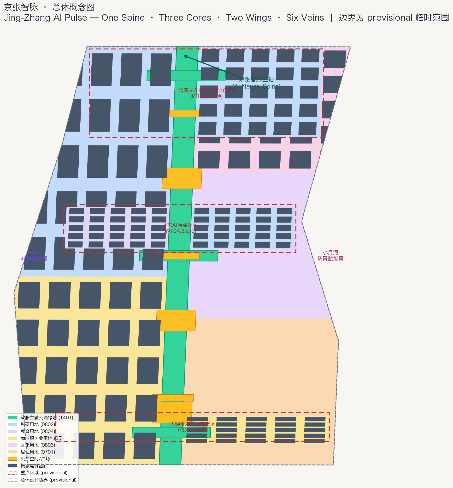
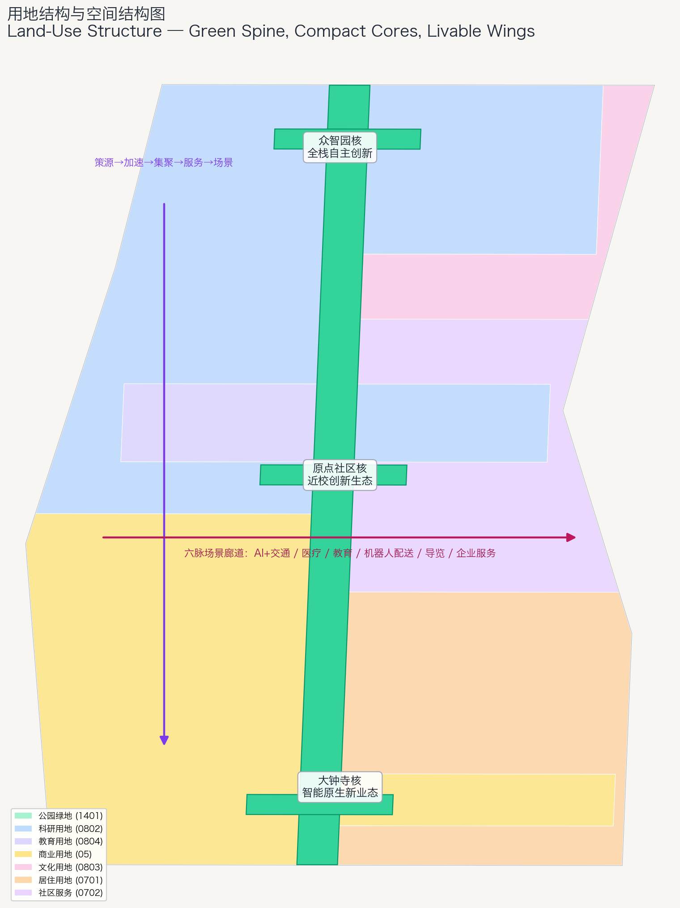
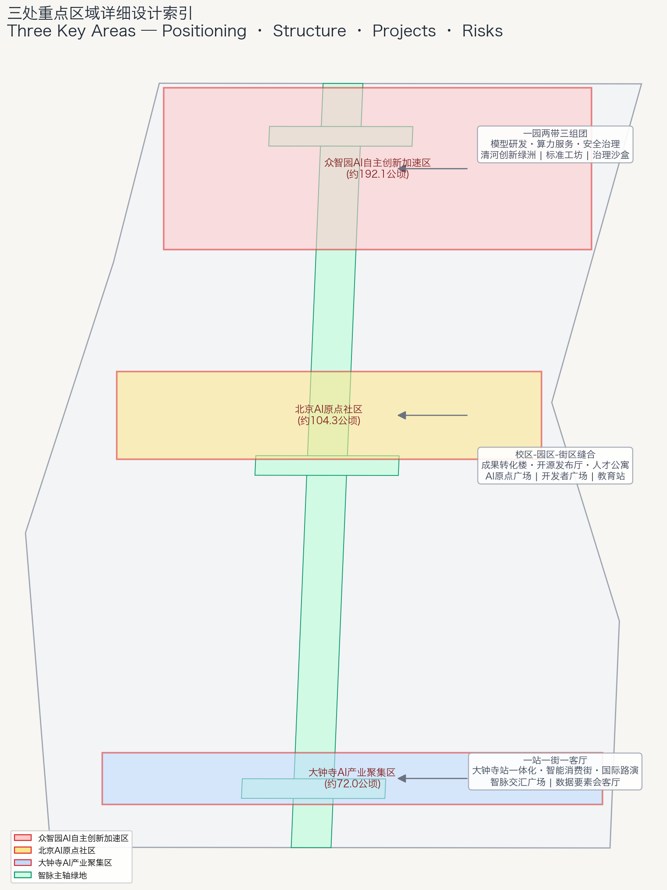
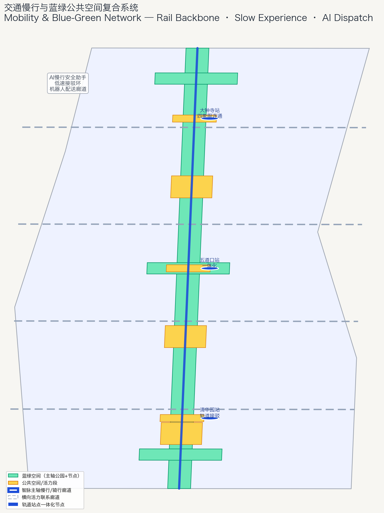
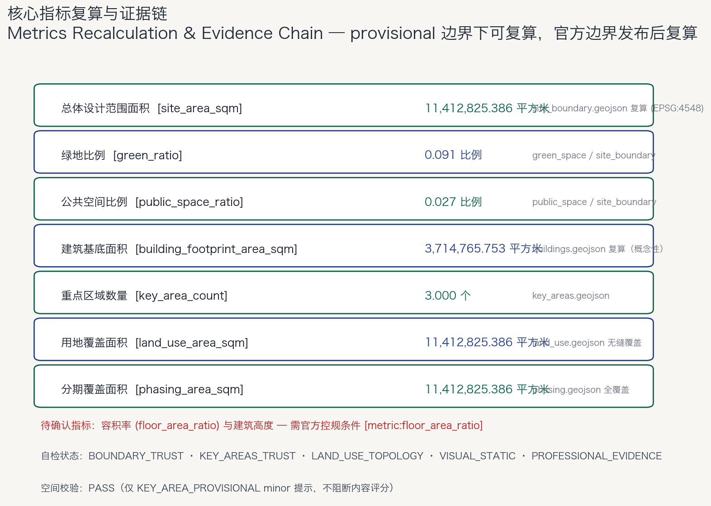

# 京张智脉：从百年钢轨到未来智脉

## 设计依据与资料清单

本方案以北京市规划和自然资源委员会海淀分局《百年京张AI创新带城市设计国际方案征集资格预审公告》为第一依据 [source:OFFICIAL-ANNOUNCEMENT]，以 `brief/site-package/` 中维护者整理的结构化任务书、临时边界、枚举、指标与来源清单为机器可读依据 [source:SITE-PACKAGE]，以 `data/source_registry.json` 与 `data/processed/agent_fact_pack.md` 为资料边界导航 [source:SOURCE-REGISTRY] [source:PROCESSED-FACT-PACK]。面向智能体的开源征集任务书 [source:AGENT-TASKBOOK] 定义了三大定位、五大功能、三区两翼、六项智能体任务与统一边界条款，是 agent.1–agent.6 的响应依据 [standard:PROJECT-AGENT-OPEN-CALL-TASKBOOK]。

本方案属于**概念性、前瞻性、可讨论的城市设计开源建议**，不是法定规划，不构成政府审定结论。所有空间落地建议均表述为"概念建议""参考方案""可供专业团队深化研究"。涉及容积率、建筑高度、道路红线、拆改留、投资测算的内容，在缺少官方控规或任务书附件依据时一律列为待确认事项，不伪装为已审定结论 [standard:MOHURD-CONTROL-DETAILED-PLANNING]。

边界状态说明：当前仓库未提供官方精确红线，本方案使用 `brief/site-package/geometry/provisional_boundaries.geojson` 中的临时粗略边界（SITE-001、PROV-KEY-001/002/003）生成 [source:BOUNDARY-SOURCE] [source:KEY-AREA-SOURCE]。临时边界仅用于方案生成、展示与自检，不得作为 official redline、审批依据或精确面积复算依据 [data:geometry/site_boundary.geojson#SITE-001] [data:geometry/key_areas.geojson#PROV-KEY-001]。组织方数据缺口不阻断内容评分；正式边界发布后，site boundary、key areas、land use、buildings、roads、green space、public space、phasing 与全部指标均需复算 [metric:site_area_sqm]。

专业标准方面，本方案以《城市设计管理办法》为城市设计统筹依据 [standard:MOHURD-URBAN-DESIGN-MEASURES]，以《国土空间调查、规划、用途管制用地用海分类指南》为用地分类依据 [standard:MNR-LAND-USE-CLASSIFICATION-GUIDE]，以《建筑工程设计文件编制深度规定（2016年版）》为图纸深度参照 [standard:MOHURD-ARCH-DESIGN-DEPTH-2016]（该标准当前为 needs_official_file 状态，仅作为深度方向参照，不作为 formal 权威依据）。

## 三层范围工作框架

公告确定三层工作范围 [standard:PROJECT-OFFICIAL-ANNOUNCEMENT]：

| 层级 | 公告面积 | 本方案工作目标 | 设计深度 |
| --- | --- | --- | --- |
| 统筹研究范围 | 约 43.6 平方公里 | AI 创新生态、未来城市形态、三区两翼协同 | 战略与生态研究 |
| 总体设计范围 | 约 11.4 平方公里 | 城市更新框架、空间结构、产业布局、设施支撑 | 控规深度城市设计 |
| 重点区域范围 | 约 368.4 公顷 | 众智园/原点社区/大钟寺三处详细设计 | 规划综合实施方案深度 |

三层范围在 `compliance_matrix.json` 中逐条映射公告 1.3、1.4、1.5 与 agent.1–agent.6 [depth:three_level_scope_framework]。空间证据以 [data:geometry/site_boundary.geojson#SITE-001] 与 [data:geometry/key_areas.geojson#PROV-KEY-001] 为基准，现状诊断与资料缺口记录在 [depth:existing_conditions_diagnosis]。

本方案的总体概念是**"京张智脉"（Jing-Zhang AI Pulse，缩写 JZ-Pulse）**：把百年京张铁路遗址重新想象为一条输送算力、人才、场景与创新能量的**AI 神经主轴**。钢轨即智脉——百年前詹天佑用"人"字形线路让火车翻越八达岭，今天我们用"人"字形的城市设计让 AI 翻越应用落地的山岭。由此形成"一轴三核、双翼六脉"的总体空间结构 [depth:overall_spatial_structure]：

- **一轴**：京张智脉主轴。以京张铁路遗址公园为底，南北贯通的文化-场景-创新复合主轴，对应"百年京张文化带、都市AI生活体验带、AI融合创新带"三大定位 [data:geometry/green_space.geojson#GREEN-SPINE]。
- **三核**：众智园AI自主创新加速区（北）、北京AI原点社区（中）、大钟寺AI产业聚集区（南），对应三处重点区域 [data:geometry/key_areas.geojson#PROV-KEY-001] [data:geometry/key_areas.geojson#PROV-KEY-002] [data:geometry/key_areas.geojson#PROV-KEY-003]。
- **双翼**：中关村科技服务翼（西）、小月河场景赋能翼（东），支撑要素配置与场景落地。
- **六脉**：六条 AI 场景廊道——AI+交通、AI+医疗、AI+教育、机器人配送、AI 导览、企业服务，连接三核两翼与社区 [data:geometry/roads.geojson#ROAD-SPINE]。

## 统筹研究范围产业与未来城市研究

### 三大定位、五大功能与三区两翼协同回路

统筹研究范围（约 43.6 平方公里）覆盖北五环至西直门外大街。本方案把三大定位落实为一条空间主轴与两条功能翼：**百年京张文化带**沿遗址公园主轴组织历史节点与叙事空间；**都市AI生活体验带**沿小月河翼组织居住、消费与公共服务场景；**AI融合创新带**沿中关村翼与三核组织产业、研发与转化空间。

五大功能对应五类空间机制 [source:AGENT-TASKBOOK]：

1. **AI全栈自主创新体系** → 众智园核 + 北段主轴：模型、算力、数据、框架、应用全栈布局。
2. **世界级AI创新生态** → AI原点社区核：高校策源、开源协作、人才特区。
3. **AI+场景赋能新范式** → 小月河场景赋能翼：AI+医疗、AI+教育、AI+交通等场景集成。
4. **智能化AI活力城市** → 智脉主轴公共空间：智慧慢行、公共体验、青年友好。
5. **AI治理全球话语权** → 众智园治理节点 + 全球活动体系：标准、评测、安全治理与国际发声。

三区两翼形成"策源-加速-集聚-服务-场景"的协同回路：高校与原点社区策源 → 众智园全栈加速 → 大钟寺产业集聚 → 中关村翼要素服务 → 小月河翼场景验证，回路沿线布置六脉场景廊道 [data:geometry/land_use.geojson#LU-0802]。

### 8 个全球 AI 创新生态案例

本方案从全球 AI 创新生态中选取 8 个案例，提炼可转化机制 [source:AGENT-TASKBOOK]：

| # | 案例 | 区位 | 可转化机制 |
| --- | --- | --- | --- |
| 1 | 新加坡裕廊创新区（JID） | 新加坡西部 | 政府-企业-学界共建、公共空间承载创新交往 |
| 2 | 伦敦国王十字（King's Cross） | 英国伦敦 | 铁路遗址活化、知识经济街区、分期更新 |
| 3 | 瑞典希斯塔（Kista） | 斯德哥尔摩 | 电信与 AI 产业集群、大学-园区联动 |
| 4 | 韩国板桥科技谷（Pangyo） | 京畿道城南 | 政府引导的 AI 集聚区、创业-大厂生态 |
| 5 | 美国奥斯汀创新区 | 德克萨斯州 | 大学-产业-资本三角、人才生活吸引力 |
| 6 | 德国阿德勒斯霍夫（Adlershof） | 柏林 | 科技园与城市街区融合、实验-展示-居住一体 |
| 7 | 杭州未来科技城 | 中国杭州 | 场景开放、平台企业带动、人才政策协同 |
| 8 | 深圳南山科技园 | 中国深圳 | 硬件+软件生态、紧凑高密度创新街坊 |

可转化经验：**铁路遗产活化**（案例 2）、**公共空间承载创新交往**（案例 1、6）、**大学-产业-资本闭环**（案例 3、5）、**场景开放与平台带动**（案例 7、8）、**紧凑创新街坊**（案例 4、8）。这些机制分别落到本方案的主轴公共空间、原点社区近校生态、三核产业空间与大钟寺紧凑街坊中 [data:geometry/buildings.geojson#BLDG-001]。

### 未来 AI 城市形态

本方案提出"人本智脉"未来城市形态：**城市是 AI 的测试场、展示场与生活场，AI 是城市的基础设施与公共品**。具体表现为：端侧算力与公共服务设施融合 [depth:municipal_new_infrastructure]；AI 交通与慢行系统融合 [depth:traffic_rail_slow_parking]；连续绿色空间与 AI 场景节点融合 [depth:blue_green_public_space]；文化叙事与科技叙事融合 [standard:MOHURD-URBAN-DESIGN-MEASURES]。

## 总体设计范围城市更新与控规深度城市设计

### 空间结构：一轴三核、双翼六脉

总体设计范围（约 11.4 平方公里 [metric:site_area_sqm]）的空间结构为：

- **主轴**：京张智脉主轴，以遗址公园为底，串联清华园站旧址、五道口、大钟寺三大门户 [data:geometry/roads.geojson#ROAD-SPINE]。
- **三核**：众智园（科研 0802）、原点社区（教育 0804+科研 0802）、大钟寺（商业 05）[data:geometry/land_use.geojson#LU-0802] [data:geometry/land_use.geojson#LU-0804] [data:geometry/land_use.geojson#LU-05]。
- **双翼**：中关村科技服务翼（西，商业与科研混合）、小月河场景赋能翼（东，文化 0803 + 居住 0701 + 社区服务 0702）[data:geometry/land_use.geojson#LU-05] [data:geometry/land_use.geojson#LU-0803] [data:geometry/land_use.geojson#LU-0701]。
- **六脉**：六条场景廊道沿主轴与横向道路组织 [data:geometry/roads.geojson#ROAD-L1]。

用地布局采用"主轴绿色开放 + 三核高密度创新 + 两翼宜居服务"的功能分区逻辑：公园绿地（1401）沿主轴形成连续绿色骨架 [metric:green_ratio]；科研/教育/商业用地集中在三核与西翼；居住与社区服务用地分布在东翼，靠近小月河与生活服务带 [depth:land_use_layout]。

### 城市更新总体框架

更新框架为"**保留文化基因、改造低效空间、更新功能界面、新建创新载体、留白弹性发展**"：

- **保留**：京张铁路遗址、清华园车站旧址等文化资产及可继续利用的建筑 [data:geometry/constraints.geojson#CONST-HERITAGE]。
- **改造**：沿主轴与三核周边的低效楼宇、老旧园区，植入 AI 产业与公共服务功能 [depth:retain_renovate_demolish]。
- **更新**：大钟寺周边传统商业向智能原生新业态转型 [data:geometry/land_use.geojson#LU-05]。
- **新建**：众智园全栈创新载体、原点社区成果转化空间 [data:geometry/buildings.geojson#BLDG-001]。
- **留白**：东翼南部预留弹性发展用地，为未来 AI 场景迭代留出空间 [data:geometry/land_use.geojson#LU-0702]。

开发强度与建筑高度：在官方控规条件发布前，本方案**不给出具体容积率与建筑高度结论**，仅提出"主轴两侧适度、三核紧凑、两翼宜居"的强度梯度原则，列为待确认控规条件 [depth:development_intensity_controls] [depth:height_massing_character] [metric:floor_area_ratio]。

## 重点区域详细设计

三处重点区域均基于 provisional 边界做方向性设计，正式 polygon 发布后需重新定位 [data:geometry/key_areas.geojson#PROV-KEY-001]。详细设计深度由 [depth:three_key_area_detailed_design] 检查，确保达到规划综合实施方案深度。

### 众智园AI自主创新加速区（约 192.1 公顷）

- **定位**：AI 全栈自主创新的"脑核"，国家 AI 平台与标准治理的策源地 [data:geometry/key_areas.geojson#PROV-KEY-001]。
- **空间结构**："一园两带三组团"——清河创新带、智脉主轴带，模型研发、算力服务、安全治理三大组团。
- **建筑更新**：以科研用地（0802）为主，布局研发楼、算力中心、测试场与治理展厅 [data:geometry/buildings.geojson#BLDG-001]。
- **交通慢行**：加强清河界面与五环门户交通组织，内部以慢行为主 [data:geometry/roads.geojson#ROAD-L1]。
- **公共空间**：清河创新绿洲节点 [data:geometry/green_space.geojson#GREEN-NODE2]，承载开放测试与标准治理展示。
- **AI 场景**：自主模型测试场、标准制定工作坊、安全治理沙盒（测试验证场景）。
- **实施风险**：清河蓝线、防洪、生态条件待官方确认 [data:geometry/constraints.geojson#CONST-HERITAGE]。

### 北京AI原点社区（约 104.3 公顷）

- **定位**：近校型成果转化与人才社区，"世界级 AI 创新生态"的心核 [data:geometry/key_areas.geojson#PROV-KEY-002]。
- **空间结构**："校区-园区-街区"三区缝合，形成高校一公里"近校创新生态圈"。
- **建筑更新**：教育用地（0804）与科研用地（0802）混合，布局成果转化楼、开源发布厅、人才公寓 [data:geometry/land_use.geojson#LU-0804]。
- **交通慢行**：打通校区与园区慢行断点，轨道站点一体化接驳 [data:geometry/roads.geojson#ROAD-L2]。
- **公共空间**：清华园站AI原点广场与开发者交流广场 [data:geometry/public_space.geojson#PUBLIC-S1] [data:geometry/public_space.geojson#PUBLIC-S2]。
- **AI 场景**：开源发布厅、近校成果转化街、AI 教育体验站。
- **实施风险**：校区边界、权属、首层业态需逐地块确认 [data:geometry/buildings.geojson#BLDG-001]。

### 大钟寺AI产业聚集区（约 72.0 公顷）

- **定位**：智能原生新业态与国际交往的"产业核" [data:geometry/key_areas.geojson#PROV-KEY-003]。
- **空间结构**："一站一街一客厅"——大钟寺站一体化枢纽、智能消费街、国际路演客厅。
- **建筑更新**：商业用地（05）主导，智能体、智能终端、内容消费、数据要素企业集聚 [data:geometry/land_use.geojson#LU-05]。
- **交通慢行**：大钟寺站四象限步行连通，路口一体化设计 [data:geometry/roads.geojson#ROAD-L3]。
- **公共空间**：大钟寺智脉交汇广场与绿意客厅 [data:geometry/public_space.geojson#PUBLIC-S3] [data:geometry/green_space.geojson#GREEN-NODE3]。
- **AI 场景**：国际路演客厅、数据要素会客厅、智能终端体验街。
- **实施风险**：轨道站点改造、市政管线、规划绿地复合利用需专业深化 [data:geometry/constraints.geojson#CONST-HERITAGE]。

## AI 创新生态、人才画像与 AI+ 场景

### 六类用户画像

| 画像 | 典型需求 | 空间响应 | 隐私边界 |
| --- | --- | --- | --- |
| 开源开发者 | 发布、协作、测试、声誉 | 原点社区开源发布厅、开发者交流广场、代码墙 | 不采集个人行为轨迹，活动数据聚合统计 |
| 初创团队 | 低成本办公、算力入口、验证场 | 众智园共享测试场、端侧算力驿站 | 算力与数据服务需另行授权 |
| 高校师生 | 成果转化、跨校协作、日常慢行 | 校区-园区慢行缝合、成果转化驿站、AI 教育站 | 校园数据与科研成果需授权 |
| 头部企业访客 | 展示、商务、国际接待 | 大钟寺国际路演客厅、轨道接驳 | 企业标识与案例须清权 |
| 周边居民 | 通勤、休闲、低扰动更新 | 遗址公园慢行环、社区服务嵌入 | 居民画像不用于商业推荐 |
| 国际访客 | 文化体验、AI 朝圣、传播 | 智脉主轴导览、朝圣地标、全球活动 | 访客数据最小化采集 |

### 12 张 AI 场景卡

本方案提出 12 张场景卡，其中 4 张为 AI 产业测试验证场景（标 ★），均需人工复核与公开数据边界 [source:AGENT-TASKBOOK]：

| # | 场景卡 | 空间载体 | 服务对象 | 数据/隐私边界 | 运营主体建议 |
| --- | --- | --- | --- | --- | --- |
| 01 | 京张文化数字导览 ★ | 智脉主轴 [data:geometry/roads.geojson#ROAD-SPINE] | 国际访客、居民 | 只使用公开文化与地图数据 | 遗址公园运营方+开发者社区 |
| 02 | AI 慢行安全助手 ★ | 主轴慢行道 [data:geometry/public_space.geojson#PUBLIC-SEG1] | 通勤者、老人儿童 | 不识别个体，仅聚合热力 | 交通管理部门+AI 企业 |
| 03 | 低速自动驾驶接驳 ★ | 三核间短驳环 [data:geometry/roads.geojson#ROAD-SPINE] | 开发者、访客 | 测试许可、安全员、数据脱敏 | 园区运营方+自动驾驶企业 |
| 04 | 机器人配送试点 ★ | 众智园/原点社区 [data:geometry/buildings.geojson#BLDG-001] | 园区人群 | 路线公开、不采集包裹内容 | 运营方+机器人企业 |
| 05 | 开源发布厅 | 原点社区 [data:geometry/public_space.geojson#PUBLIC-S2] | 开发者 | 贡献数据公开、荣誉可追溯 | 开源社区+园区 |
| 06 | 端侧算力驿站 | 主轴节点 [data:geometry/land_use.geojson#LU-0702] | 初创团队、居民 | 服务授权、能耗公开 | 运营商+算力服务商 |
| 07 | AI 健康服务导航 | 东翼生活服务带 [data:geometry/land_use.geojson#LU-0701] | 居民、老人 | 医疗数据不出域、人工复核 | 卫健部门+医疗机构 |
| 08 | AI 教育体验站 | 原点社区 [data:geometry/land_use.geojson#LU-0804] | 学生、教师 | 校园数据授权、未成年人保护 | 教育部门+高校 |
| 09 | 企业服务智能体 | 西翼科技服务翼 [data:geometry/land_use.geojson#LU-05] | 企业、创业者 | 企业数据授权、合规审计 | 中关村服务体系 |
| 10 | 数据要素会客厅 | 大钟寺 [data:geometry/land_use.geojson#LU-05] | 数据企业 | 授权、可审计、隐私计算 | 数据交易所+园区 |
| 11 | 城市智能体治理沙盒 | 众智园 [data:geometry/land_use.geojson#LU-0802] | 治理机构、开发者 | 模拟数据优先、人工复核 | 城市治理部门+高校 |
| 12 | 青年第三空间 | 主轴活动段 [data:geometry/public_space.geojson#PUBLIC-SEG3] | 青年、创业者 | 活动数据聚合、不追踪个人 | 社区+商业运营方 |

所有场景均遵守**数据最小化、公开来源、可解释、人工复核**四原则，禁止过度监控与无法人工复核的场景 [depth:risk_missing_data]。

## 用地、建筑规模与拆改留方案

用地分类依据 [standard:MNR-LAND-USE-CLASSIFICATION-GUIDE]，`geometry/land_use.geojson` 全覆盖总体设计边界、无缝隙无重叠 [data:geometry/land_use.geojson#LU-1401]。主要用地包括：公园绿地（1401）、科研用地（0802）、教育用地（0804）、商业服务业用地（05）、文化用地（0803）、城镇住宅用地（0701）、社区服务设施用地（0702），对应 [metric:land_use_area_sqm]。

建筑基底表达为概念性创新载体布局 [data:geometry/buildings.geojson#BLDG-001]，建筑基底面积约 [metric:building_footprint_area_sqm] 平方米。拆改留原则为"保文化、改低效、更新旧、建新核、留弹性"，具体地块拆改留结论必须等待官方控规、权属与工程条件确认 [depth:retain_renovate_demolish] [depth:development_intensity_controls]。

## 交通、轨道、市政与公共服务设施

### 交通与慢行

交通策略以"**轨道为骨干、慢行为体验、AI 为调度**"为原则 [depth:traffic_rail_slow_parking]：

- **主轴慢行**：京张智脉主轴打造连续慢行+骑行+AI 导览的体验廊道 [data:geometry/roads.geojson#ROAD-SPINE]。
- **横向联系**：四条横向活力廊道连接三核与两翼 [data:geometry/roads.geojson#ROAD-L1] [data:geometry/roads.geojson#ROAD-L2] [data:geometry/roads.geojson#ROAD-L3] [data:geometry/roads.geojson#ROAD-L4]。
- **轨道接驳**：加强五道口、大钟寺等站点一体化，解决慢行断点（跨环路节点、公园南北端）[data:geometry/public_space.geojson#PUBLIC-S1]。
- **停车与非机动车**：在轨道站周边组织停车换乘与共享单车集散，主轴禁行机动车 [data:geometry/green_space.geojson#GREEN-SPINE]。

### 市政与新型基础设施

市政与公共服务设施覆盖创新服务平台、人才生活服务、分布式能源、端侧算力与传统市政融合 [depth:municipal_new_infrastructure]。缺少管线、能源、排水、防洪、消防等工程资料，列为正式深化前置条件 [data:geometry/constraints.geojson#CONST-HERITAGE]。

## 蓝绿空间、公共空间与城市风貌

### 蓝绿公共空间

以京张智脉主轴公园绿地为骨架 [data:geometry/green_space.geojson#GREEN-SPINE]，统筹清河、小月河与遗址公园，形成南北贯通、东西连通的步道骑行系统。绿地面积约 [metric:green_space_area_sqm] 平方米、绿地比例 [metric:green_ratio]；公共空间面积约 [metric:public_space_area_sqm] 平方米、公共空间比例 [metric:public_space_ratio]。三个绿意节点（清河创新绿洲、五道口青年公园、大钟寺绿意客厅）与三个广场（清华园站AI原点广场、开发者交流广场、大钟寺智脉交汇广场）构成公共空间网络 [data:geometry/green_space.geojson#GREEN-NODE1] [data:geometry/public_space.geojson#PUBLIC-S2]。

### AI 朝圣地标（4 个）

| # | 朝圣地标 | 位置 | 内涵 | 表达载体 |
| --- | --- | --- | --- | --- |
| 1 | 清华园站·AI原点纪念站 | 原点社区 [data:geometry/public_space.geojson#PUBLIC-S1] | 詹天佑铁路起点 → AI 原点 | 旧址修缮、AI 原点纪念碑、人字广场 |
| 2 | 开发者步道·开源贡献荣誉墙 | 主轴中段 [data:geometry/roads.geojson#ROAD-SPINE] | 开发者贡献可记忆 [source:AGENT-TASKBOOK] | 代码枕木、荣誉墙、里程碑石刻 |
| 3 | 众智园·全栈自主创新灯塔 | 众智园 [data:geometry/land_use.geojson#LU-0802] | AI 全栈自主与治理话语权 | 模型测试场展示、标准工坊 |
| 4 | 大钟寺·智脉交汇广场 | 大钟寺 [data:geometry/public_space.geojson#PUBLIC-S3] | 智能原生新业态与国际交往 | 智脉钟、国际路演客厅、数据艺术装置 |

地标、Logo、字体、图像、人物与企业标识均须清权，地标为概念建议，不构成已批准建设 [depth:blue_green_public_space]。

### 城市风貌与叙事符号

城市风貌融合"**铁路灰、砖石红、科技蓝、生态绿**"四色基调，形成"工业遗产 + 数字未来"的独特城市气质。建筑风貌控制原则：主轴两侧以低多层为主、三核紧凑高密度、两翼宜居尺度；屋顶形态鼓励第五立面与光伏、绿化复合 [standard:MOHURD-URBAN-DESIGN-MEASURES]。

文化叙事主线为"**从'人'字形铁路到'人'本 AI 城市**"：詹天佑的"人"字，是百年前中国自主创新的密码；今天的"人"字，是 AI 以人为本的伦理宣言。三个文化篇章沿主轴展开——**百年京张**（清华园站至五道口，历史叙事）→ **中关村创新**（五道口至大钟寺，创新叙事）→ **AI 新文化**（大钟寺至南端，未来叙事）[depth:overall_spatial_structure]。

## 更新项目清单、实施政策与分期计划

### 更新项目清单

| 项目编号 | 项目名称 | 类型 | 主要依赖 | 分期 |
| --- | --- | --- | --- | --- |
| JZ-01 | 京张智脉主轴慢行贯通 | 公共空间/交通 | 道路红线、桥下空间复核 | 近期 |
| JZ-02 | 清华园站AI原点纪念站 | 文化/公共空间 | 文保审批、旧址修缮 | 近期 |
| JZ-03 | 众智园清河创新界面 | 蓝绿/产业展示 | 河道蓝线、防洪条件 | 近期 |
| JZ-04 | 原点社区近校成果转化街 | 城市更新 | 校区边界、权属、首层业态 | 近期 |
| JZ-05 | 大钟寺站四象限步行连通 | 轨道一体化 | 轨道站点、市政管线 | 中期 |
| JZ-06 | 中关村科技服务翼升级 | 产业服务 | 楼宇更新、运营主体 | 中期 |
| JZ-07 | 小月河场景赋能翼建设 | 场景集成 | 社区更新、场景开放许可 | 中期 |
| JZ-08 | 开发者步道与荣誉体系 | 文化/运营 | 公共空间许可、版权清权 | 近期 |
| JZ-09 | AI 公共服务与端侧算力节点 | 新基建 | 能源、算力、安全 | 中期 |
| JZ-10 | 东翼弹性发展用地预留 | 空间留白 | 控规条件确认 | 远期 |

分期计划对应 `geometry/phasing.geojson`：**近期（P1）** 三核先行 [data:geometry/phasing.geojson#PHASE-1]；**中期（P2）** 两翼联动 [data:geometry/phasing.geojson#PHASE-2]；**远期（P3）** 全域提升 [data:geometry/phasing.geojson#PHASE-3] [depth:phasing_implementation] [depth:renewal_project_list]。

### 全球 AI 创新活动体系与长期运营

面向 agent.6，本方案提出"**智脉四季**"全球 AI 创新活动体系 [source:AGENT-TASKBOOK]：

- **春·智脉开源周**（年度）：开源发布、黑客松、开发者荣誉颁奖，激活开发者社区。
- **夏·智脉场景季**（季度）：场景开放日，AI+医疗/教育/交通等场景轮换展示。
- **秋·智脉创新大会**（年度）：国际论坛、路演、标准治理对话，构建全球话语权。
- **冬·智脉朝圣之旅**（年度）：文化导览、贡献者纪念仪式、年终成果发布。

运营机制包括：开发者社区运营（贡献积分、荣誉体系、协作空间）、场景开放运营（许可、数据边界、人工复核）、公共体验运营（导览路线、活动分级）、国际传播与招引转化（英文内容、全球活动、企业对接）[depth:phasing_implementation]。所有活动与招商安排均为概念建议，不构成已确定的政府安排。

## 指标体系、面积复算与合规矩阵

核心指标及复算关系如下 [depth:metrics_recalculation]：

| 指标 | 值 | 公式/来源 | 状态 |
| --- | --- | --- | --- |
| 总体设计范围面积 | [metric:site_area_sqm] 平方米 | provisional SITE-001 复算 | known |
| 绿地比例 | [metric:green_ratio] | 绿地面积/场地面积 [data:geometry/green_space.geojson#GREEN-SPINE] | known（provisional） |
| 公共空间比例 | [metric:public_space_ratio] | 公共空间面积/场地面积 [data:geometry/public_space.geojson#PUBLIC-S2] | known（provisional） |
| 建筑基底面积 | [metric:building_footprint_area_sqm] 平方米 | buildings.geojson 复算 | known（概念性） |
| 重点区域数量 | [metric:key_area_count] | key_areas.geojson | known |
| 用地覆盖面积 | [metric:land_use_area_sqm] 平方米 | land_use.geojson 无缝覆盖 | known |
| 分期覆盖面积 | [metric:phasing_area_sqm] 平方米 | phasing.geojson 全覆盖 | known |
| 容积率 | [metric:floor_area_ratio] | 待官方控规 | unknown |
| 建筑高度 | 待确认 | 待官方控规 | unknown |

指标复算使用 EPSG:4548 投影面积。`compliance_matrix.json` 覆盖公告 1.3/1.4/1.5 全部任务与 agent.1–agent.6 全部任务；`standard_matrix.json` 覆盖全部 mandatory 标准；`design_depth_matrix.json` 覆盖 15 个核心深度项 [depth:metrics_recalculation]。

## 风险、版权与合规说明

- **资料合规**：本方案仅使用公开或已清权资料，不涉及非公开规划图件、内部数据或个人隐私 [source:SOURCE-REGISTRY]。
- **版权**：所有图件、图标、文字为本方案原创或引用公开资料并注明来源；Logo、地标、字体、图像均须在深化前完成清权，详见 `report/copyright_statement.md`。
- **AI 生成责任**：本方案由 AI Agent 生成，作者对事实、引用、版权与表达负责；AI 输出不作为政府审定结论 [source:AGENT-TASKBOOK]。
- **官方批准禁用**：不声称官方批准、审定控规、最终权属或保证实施 [standard:MOHURD-CONTROL-DETAILED-PLANNING]。
- **待补资料**：官方红线、三处重点区 polygon、控规指标、道路红线、权属、市政管线、文保控制线等，见 `assumptions.json` 与 `missing_data_checklist.csv` [depth:risk_missing_data] [data:geometry/constraints.geojson#CONST-HERITAGE]。

## 参考资料

本节引用机器可读索引以支撑方案证据链：[source:SITE-PACKAGE]、[source:OFFICIAL-ANNOUNCEMENT]、[source:AGENT-TASKBOOK]、[standard:PROJECT-OFFICIAL-ANNOUNCEMENT] 与 [metric:site_area_sqm]，全部证据来源登记于 `sources.json` 与 `data/source_registry.json`。

- `brief/site-package/design_brief.json`
- `brief/site-package/agent_taskbook.json`
- `brief/site-package/allowed_design_space.json`
- `brief/site-package/sources.json`
- `brief/site-package/enums/`
- `brief/site-package/ranges/planning_limits.json`
- `brief/site-package/geometry/provisional_boundaries.geojson`
- `brief/site-package/standards/standards.json`
- `data/source_registry.json`
- `data/processed/agent_fact_pack.md`
- `docs/formal-submission-guide.md`
- 北京市规划和自然资源委员会海淀分局《百年京张AI创新带城市设计国际方案征集资格预审公告》
