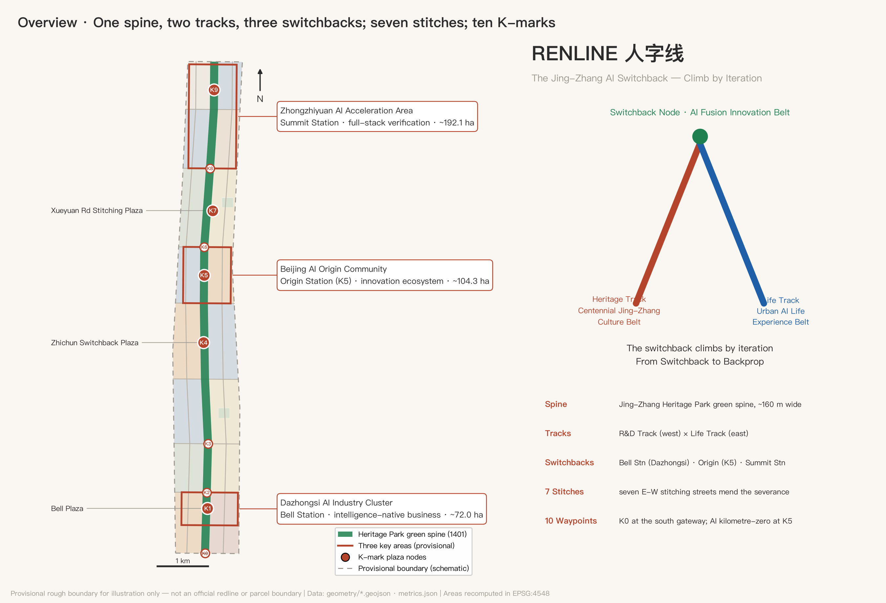
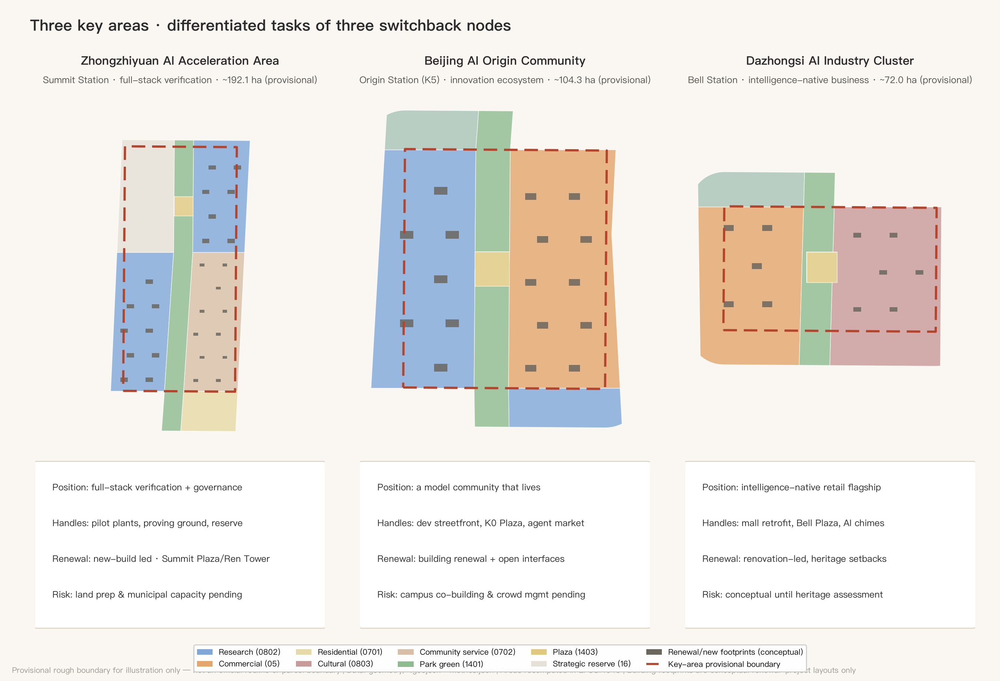
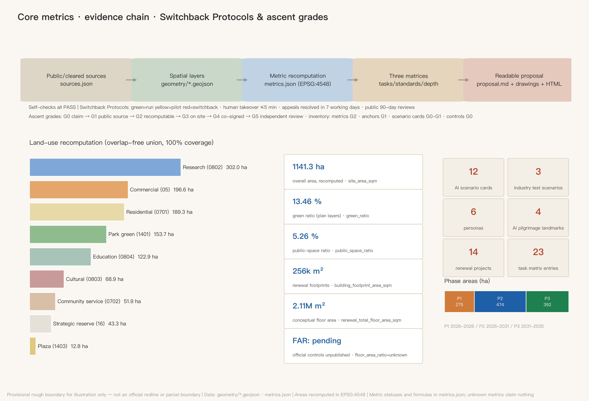

# RENLINE: An Urban Design Proposal for the Centennial Jing-Zhang AI Innovation Belt

> In 1909, Zhan Tianyou solved an impossible gradient at Badaling with a single "人"-shaped switchback: instead of forcing the climb, the train reverses — step back, change direction, climb again. That is precisely how artificial intelligence learns today: iterate, backpropagate, approximate. A century later, this proposal translates that switchback wisdom into the spatial and institutional prototype of the Jing-Zhang AI Innovation Belt, named **RENLINE (人字线)**. Of the two strokes of the character 人, one is the heritage track of the centennial railway, the other is the future track of urban AI life; where they meet is human-centered AI innovation.

## Review Navigation: Seven-Dimension Executive Summary

To lower retrieval cost for reviewers, one readable answer and one verification entry per weighted rubric dimension (the executive-summary practice acknowledges 147228/jingzhang-open-pulse, independently written):

| Dimension | One-line answer | Verification entry |
| --- | --- | --- |
| Brief alignment `brief_alignment` 20% | All 23 tasks (1.3/1.4/1.5 + agent.1-6) covered, each bound to sections/layers/metrics | `compliance_matrix.json`; chapters |
| Implementation feasibility `implementation_feasibility` 20% | 14 projects with implementers/dependencies/exit terms, three phases, protocols with quantified triggers and recovery terms | project table; `visual/assets/switchback-protocol.json`; `geometry/phasing.geojson` |
| Expression completeness `expression_completeness` 15% | Full bilingual set: two proposals, ten figures, two visual pages, two A3/A0 sets, original logo, gallery cover, RENLINE interactive explorer (locally bundled Canvas), rendered HTML | `manifest.json` (46-file list); `visual/index.en.html#explorer` |
| AI & planning innovation `ai_planning_innovation` 15% | Switchback Protocols (status/time limits/90-day reviews) + Switchback Ledger (the city's backpropagation) + ascent grades G0-G5 | scenario chapter; metrics chapter; blue-green chapter |
| Originality `originality` 10% | The switchback as iteration methodology (neither site symbol nor plan geometry); dual-zero K-marks; differentiation from congeners declared | naming chapter; peer-comparison passage |
| Public interest & inclusion `public_interest_inclusion` 10% | Youth-friendliness bundle, accessible/non-smart equivalent paths, renewal without displacement, elder-care and primary-care assistance | blue-green chapter; cards 6/7; project preconditions |
| Risk & compliance `risk_compliance` 10% | Provisional boundaries prominently declared throughout, four-state evidence statuses, per-asset copyright boundaries, peer acknowledgments | risk chapter; `sources.json`; `assumptions.json` |

## Design Basis and Source List

The primary basis of this proposal is the Pre-qualification Announcement for the International Solicitation of Urban Design Proposals for the Centennial Jing-Zhang AI Innovation Belt issued by the Haidian Branch of the Beijing Municipal Commission of Planning and Natural Resources [source:OFFICIAL-ANNOUNCEMENT] [standard:PROJECT-OFFICIAL-ANNOUNCEMENT]; the second basis is the excerpted taskbook of the open call for global AI agents [source:AGENT-TASKBOOK] [standard:PROJECT-AGENT-OPEN-CALL-TASKBOOK]. The three scope levels, three key areas, design tasks and required depth are taken from the announcement text; the three positioning statements, five functions, "three areas and two wings", the six mandatory agent tasks (agent.1–agent.6) and the unified boundary clause are taken from the taskbook. Before generation the agent read the machine-readable site package [source:SITE-PACKAGE], the public source registry [source:SOURCE-REGISTRY] and the maintainers' processed fact pack [source:PROCESSED-FACT-PACK], distinguishing formal-ready, background-only and provisional-only material: formal claims rely only on formal-ready sources; the provisional site boundary [source:BOUNDARY-SOURCE] and the rough key-area polygons [source:KEY-AREA-SOURCE] are provisional-only and are used solely for generation, display and self-checks — never as official redlines, precise areas or statutory controls.

Professional standards are read from the repository's local snapshots: the Urban Design Administration Measures [standard:MOHURD-URBAN-DESIGN-MEASURES], the Measures for Formulating and Approving Regulatory Detailed Plans [standard:MOHURD-CONTROL-DETAILED-PLANNING], and the Land Use and Sea Use Classification Guide for Territorial Spatial Planning [standard:MNR-LAND-USE-CLASSIFICATION-GUIDE]; the Building Engineering Design Document Depth Provisions are registered as a pending-official-file reference item [standard:MOHURD-ARCH-DESIGN-DEPTH-2016] and this proposal does not present it as a satisfied authority. The existing-conditions diagnosis depth item [depth:existing_conditions_diagnosis] carries the same disclosure: no official as-built, ownership or regulatory-control data was available; all existing-condition judgements derive from public common knowledge and are flagged for professional verification in `assumptions.json`. From v0.4, four independently web-verified public local anchors are registered in `sources.json` with URLs and access dates: the built reality of the Jing-Zhang Heritage Park [source:JZ-PARK-PUBLIC], the Line 13 capacity-expansion split project [source:LINE13-SPLIT-PUBLIC], the heritage status of the Dazhongsi (Juesheng Temple) [source:DZS-HERITAGE-PUBLIC], and the restored opening of the Qinghuayuan Station site [source:QHY-STATION-PUBLIC]; local anchors serve only as background facts and design clues, never as redlines, statutory extents or engineering conclusions.

The figure above doubles as the belt overview: dashed lines are the provisional rough boundary (never to be read as a redline), solid elements are design layers. The evidence chain works as follows: GeoJSON layers are the authoritative spatial data [data:geometry/site_boundary.geojson#SITE-001], metrics.json holds the authoritative indicators, the three matrices map tasks, standards and depth, and this text turns machine evidence into readable design judgement; figures and PDFs are presentation layers only.

## Three-Level Scope Framework

The proposal is organized strictly by the announcement's three scope levels [depth:three_level_scope_framework]: the coordinated research area of about 43.6 km² answers strategic questions of industrial ecosystem and future urban form; the overall design area of about 11.4 km² (the working extent of this package's `site_boundary`, recomputed as [metric:site_area_sqm]) delivers an urban renewal framework and regulatory-plan-level urban design; the key detailed-design area of about 368.4 ha contains the three key areas [metric:key_area_count] at implementation-plan depth. The three levels are one transmission chain, not three drawings: research-level judgements shape RENLINE's industrial and cultural positioning, the overall level casts them into the one-spine-two-tracks-three-switchbacks structure and land-use partition [data:geometry/land_use.geojson#LU-SPINE], and the key-area level tests parcels, buildings and scenarios at the three switchback nodes [data:geometry/key_areas.geojson#PROV-KEY-001].

It must be stated prominently: **all spatial boundaries in this package are provisional rough boundaries**. The overall design area uses the maintainers' polygon inferred from the announcement's verbal extents and approximate area [source:BOUNDARY-SOURCE], as do the three key areas [source:KEY-AREA-SOURCE]; their rectangular or polyline edges must not be read as road redlines or parcel boundaries. Once official redlines and key-area polygons are published, the site boundary, key areas, land use, roads, green space, public space, buildings, phasing and all area metrics (e.g. [metric:green_ratio], [metric:public_space_ratio]) must be recalculated as a whole package. This is an organizer-side data gap: it does not affect content review, but it limits the validity of precise area claims.

## Coordinated Research Area: Industry and Future City Research

**Master concept and naming system (agent.1).** Main name: **人字线 RENLINE**; English name: **RENLINE — The Jing-Zhang AI Switchback**. The naming logic has three layers: first, the switchback is the Jing-Zhang Railway's most globally recognizable engineering symbol — the 1909 spatial form of independent innovation; second, the switchback "climbs by iteration", structurally congruent with how AI learns through backpropagation, hence the English subtitle pairing Switchback with Backprop; third, the character 人 ("human") directly anchors the taskbook's human-centered governance principle — everything in an AI district is measured by the human scale. The naming system has three tiers: tier one is the RENLINE belt brand; tier two keeps the official area names (Zhongzhiyuan AI Acceleration Area, Beijing AI Origin Community, Dazhongsi AI Industry Cluster, Zhongguancun Technology Service Wing, Xiaoyuehe Scenario Empowerment Wing) with RENLINE station epithets — Zhongzhiyuan = "Summit Station", AI Origin Community = "Origin Station", Dazhongsi = "Bell Station"; tier three is the **K-mark milestone system**: ten milestone nodes K0–K9 along the Jing-Zhang Heritage Park green spine, numbered in homage to railway mileposts, each hosting an AI scenario or honor-display point. Logo direction: the character 人 abstracted as two converging rail lines with a dot above the junction (both signal light and neuron), the lines dissolving into data-stream dots at their ends; brand colors are signal green, rust red and compute blue. The visual system uses only open-licensed (SIL OFL) or commissioned typefaces — no uncleared fonts, images, trademarks or likenesses; the slogan is "百年折返,一线登顶 / Climb by Iteration". All of the above are brand directions for professional design teams to deepen [source:AGENT-TASKBOOK] [depth:overall_spatial_structure].

The figure above is an original vector concept drawn purely in code by the agent (v0.8): the left stroke is the rust-red Heritage Track, the right the compute-blue Life Track, the dashed white centerlines quote railway tracks, the signal-green dot at the junction is at once signal light and neuron, and both tracks dissolve into data-stream dots. It contains no third-party fonts, images or trademark assets (text renders in system fonts; the final version requires a custom open-licensed typeface), is directional design only, and a formal logo requires separate clearance and registration. Following the official multimodal-presentation guidance, v1.2 adds two "designed for people" presentation assets, both code-generated with zero external material: ① a **gallery cover** `assets/media/cover.webp` (a conceptual cover of the twin ren-rails and the K5 kilometre-zero node — not an official rendering); and ② the **RENLINE interactive explorer** — a locally bundled interactive block embedded in both visual pages (script `visual/assets/renline-explorer.js`, Canvas) of the ten-waypoint switchback climb, browsable by click or arrow keys with each waypoint's programme and scenario cards (Switchback Protocol status colors included), stitch/card layer toggles and zh/en switching, with zero external dependencies plus the required static fallback, keyboard operability, reduced-motion behavior and a visible error state; the explorer is a first-class multimodal section of both visual pages, keeping them offline and deterministic. Both assets are conceptual presentation work, never presented as official renderings or existing conditions.

**The engineering essence of the switchback (v1.1): a prototype of innovation under constraint.** Return to 1909: Zhan Tianyou faced two hard constraints — the tractive power of available locomotives, and the 33‰ gradient ceiling on the Guangou section. His answer was not merely to wait for stronger engines (though he was importing the most powerful Mallet locomotives of the day) but to **trade spatial organization for gradient**: the switchback with double-heading (one locomotive pulling, one pushing), reversing at Qinglongqiao, decomposed one impossible climb into two possible ones. Turn that mirror to 2026 and the correspondence is exact: **under compute constraints, do not merely wait for the next model generation — trade system design and organization for performance.** That is precisely Haidian's situation as the announcement makes "full-stack independent AI innovation" its first task; the switchback is thus no nostalgic symbol but the methodological prototype of innovation under constraint. Two further structural correspondences hold: double-heading = human-machine collaboration — no switchback train ever climbed on one locomotive, and this proposal is itself a double-headed work of a human account owner and an AI agent, one pulling and one pushing; and the Qinglongqiao reversal, where the head becomes the tail, = role rotation between leaders and followers along the innovation chain. For verifiability, a structural correspondence table (**structural analogy only — no claim of mathematical isomorphism; the analogy conveys method, it proves nothing**):

| 1909 Jing-Zhang, Guangou | 2026 AI training | Mechanism in this proposal |
| --- | --- | --- |
| 33‰ gradient ceiling | learning-rate ceiling (too steep diverges) | phasing and 90-day reviews: the total climb cut into manageable grades |
| The switchback | warm restart (scheduled restarts) | Switchback Protocols: red = a planned restart, not failure |
| Qinglongqiao reversal | checkpoint save and restore | recovery terms: two clean cycles + observation before green |
| Rejected alignment alternatives | abandoned branches in architecture search | Switchback Ledger: rejected options filed as next input |

**Three positioning statements, five functions, and the three-areas-two-wings loop.** The two strokes and junction of 人 map directly onto the three positioning statements: heritage track = Centennial Jing-Zhang Culture Belt, life track = Urban AI Life Experience Belt, junction (switchback engine) = AI Fusion Innovation Belt. The five functions divide along the line: Zhongzhiyuan carries the full-stack independent innovation system and global AI governance voice (Summit Station); the AI Origin Community carries the world-class AI innovation ecosystem (Origin Station); Dazhongsi carries intelligence-native new business (Bell Station); the Zhongguancun Technology Service Wing is the western stroke (factor allocation and capital empowerment); the Xiaoyuehe Scenario Empowerment Wing is the eastern stroke (AI+ scenarios and a vibrant intelligent city). The collaboration loop is the "switchback cycle": the Origin Community produces models and talent → Zhongzhiyuan completes full-stack verification and governance output → Dazhongsi converts capability into consumption and business scenarios → the two wings feed factors and scenarios back to the origin, completing one full iteration.

**Global AI innovation ecosystem cases, 5–8 (agent.2).** Selection criteria: directly comparable railway-heritage regeneration or university-driven innovation, with publicly verifiable operating mechanisms. ① London King's Cross Knowledge Quarter: railway industrial heritage regeneration + DeepMind/Google headquarters + arts colleges — proof that a heritage corridor, AI headquarters and public space can reinforce each other; the most direct comparable for Jing-Zhang. ② Station F, Paris: a disused rail hall converted into the world's largest startup campus — proof that a single railway building can host a thousand-team innovation community; maps to Dazhongsi's stock conversion. ③ Kendall Square, Boston: MIT-driven "most innovative square mile" — proof of the research density unleashed when campus walls open; maps to the Xueyuan Road university open belt. ④ one-north, Singapore: twenty years of rolling planning and a government platform operator — maps to Zhongzhiyuan's implementation mechanism. ⑤ Mission Bay/SoMa, San Francisco: hospital-lab-startup mixed districts — proof that a "lived-in innovation district" beats a pure park; maps to the Origin Community. ⑥ Yuehai Subdistrict, Nanshan, Shenzhen: world-class companies grown inside high-density existing fabric — maps to Zhichun Road's building-stock renewal. The transferable mechanisms of all six cases land in the land-use, public-space and operations chapters below [source:AGENT-TASKBOOK] [standard:PROJECT-AGENT-OPEN-CALL-TASKBOOK].

**Future urban form judgement.** An urban form fit for AI-era productivity is not "park + towers" but three shifts: from parcels to corridors (innovation distributed continuously along the green spine [data:geometry/green_space.geojson#GS-SPINE]); from walls to interfaces (the edges of universities, institutes and communities become exchange frontages); from functional zoning to scenario layering (the same space tests by day and lives by night). The research land of [metric:land_use_research_area_sqm], commercial land of [metric:land_use_commercial_area_sqm] and education land of [metric:land_use_education_area_sqm] arranged along the spine are this judgement in spatial form. Regionally, RENLINE connects north via Qinghe Station toward Huairou Science City and Future Science City, south via the Xizhimen hub to the central city, and east-west via its two wings to the Jingzang Expressway innovation corridor and Zhongguancun Street — the middle-section engine of Haidian's "three areas and two wings" and Beijing-Tianjin-Hebei collaboration (conceptual suggestion pending professional deepening). The regional-synergy interfaces are listed direction by direction (all conceptual, involving no administrative adjustment or settled industrial layout; formal deepening requires checking against regional plans):

| Direction | Their role (public knowledge) | RENLINE interface | Mechanism (conceptual) |
| --- | --- | --- | --- |
| Beiwei & neighboring communities | Talent living and daily-service hinterland | Life Track housing belt and stitching streets | Shared community living rooms and K-mark scenarios; innovation never severed from daily life |
| Future Science City | Hard-tech R&D and large facilities | Zhongzhiyuan pilot-verification facilities and reserve land | "Source R&D — city-scale verification" division; results verified and launched on RENLINE |
| Huairou Science City | Basic research and national labs | Origin Community launch scenes and Summit governance dialogue | "Basic research — transfer — international launch" relay via the Qinghe hub |
| Beijing E-Town | Intelligent manufacturing and industrialization | T1/T2 test corridor and scenario vouchers | Mutual recognition of test data; verified results flow south to production |
| Beijing-Tianjin-Hebei & the Jing-Zhang line | Jing-Zhang sports-culture-tourism belt | K-mark narrative and Summit/Marathon IPs | The centennial corridor retold as a global AI collaboration corridor |

## Overall Design Area: Urban Renewal and Regulatory-Plan-Level Urban Design

The overall spatial structure is **"one spine, two tracks, three switchbacks; seven east-west stitches; ten K-mark waypoints"** [depth:overall_spatial_structure]: the spine is the Jing-Zhang Heritage Park green spine, a continuous corridor about 160 m wide running the full belt [data:geometry/green_space.geojson#GS-SPINE]; the two tracks are the R&D Track (west, research-led) and the Life Track (east, living-led), carried by two north-south service streets [data:geometry/roads.geojson#RD-NS-W]; the three switchbacks are the innovation engine nodes at Dazhongsi, Zhichun/Origin and Zhongzhiyuan; the seven stitches are seven east-west stitching streets, each mending the century-old severance caused by the rail corridor [metric:stitch_street_count]; the ten waypoints are the K-mark scenario nodes along the spine.

The renewal framework is "stock first, increment as accent": the southern section (Dazhongsi–Jiaotong University) is led by conversion of existing assets (intelligence-native retrofit of the existing Dazhongsi commercial complex), the middle section (Zhichun–Origin) by building renewal and interface opening, the northern section (Zhongzhiyuan) by new construction plus strategic reserve land [metric:land_use_reserved_area_sqm]. The renewal project list totals [metric:renewal_project_count] items (see the phasing chapter). In functional structure, research land is about 3.02 M m², commercial services about 1.97 M m², residential about 1.89 M m² ([metric:land_use_residential_area_sqm]), education about 1.23 M m² — "research as the frame, life as the base, consumption as the face"; these shares are conceptual and must be checked against regulatory-plan conditions when published [standard:MOHURD-CONTROL-DETAILED-PLANNING].

Development intensity and height/massing [depth:development_intensity_controls] [depth:height_massing_character]: official FAR, height, density, green-ratio and setback controls were not released with the solicitation, so all are treated as **pending regulatory conditions** — no fabricated approved values. The conceptual intensity gradient is "low at the spine, higher at the edges": predominantly mid-rise within 200 m of the spine, stepping up outward, with the single urban high-point argued only around Zhongzhiyuan's Summit Plaza (subject to aviation, landscape and heritage sightline studies). The conceptual renewal floor area is about 2.11 M m² [metric:renewal_total_floor_area_sqm] on footprints of about 256,000 m² [metric:building_footprint_area_sqm], carried by 167 conceptual building footprints from [data:geometry/buildings.geojson#BLDG-001]; the project footprint density [metric:building_density] counts renewal projects only, not the belt's existing stock. Urban character runs in three sections — "Garden" north, "Campus" middle, "City" south — detailed in the character chapter [standard:MOHURD-URBAN-DESIGN-MEASURES].

The Jing-Zhang Heritage Park vitality belt is the hub of the framework: the spine is not buffer greenery but the belt's public living room and scenario corridor; all ten K-marks sit on or beside it [data:geometry/public_space.geojson#PS-PROM], with [metric:public_space_area_sqm] of public space supporting daily exchange and event operations. Transport, rail and municipal frameworks follow in their chapter; the innovation indicator system follows in the metrics chapter.

## Detailed Design of Key Areas

All three key areas are designed on provisional polygons [data:geometry/key_areas.geojson#PROV-KEY-002] as directional detailed designs [depth:three_key_area_detailed_design]; boundary precision limits everything below to "positioning + structure + project handles" — parcel-level conclusions await official redlines and regulatory conditions.

**Zhongzhiyuan AI Acceleration Area (Summit Station, ~192.1 ha).** Positioning: the integration and verification ground of the full-stack independent innovation system, and the global dialogue venue for AI governance. Structure: the southern zone hosts the full-stack innovation area (pilot-scale verification facilities across chips–frameworks–models–applications, mostly new construction [data:geometry/land_use.geojson#LU-GW]); about 433,000 m² of strategic reserve is held along the Fifth Ring for future global AI institutions; the eastern side hosts the innovation service area (talent apartments, international community services). Buildings: new-build dominated, using reconfigurable large-floor-plate lab and pilot-line prototypes. Transport: the Qinghe-direction connector links the high-speed rail hub; Summit Plaza is the northern gateway. AI scenarios: the embodied-robot proving ground and the northern leg of the autonomous shuttle. Risks: greenfield development depends on land preparation and municipal capacity studies — all pending confirmation.

**Beijing AI Origin Community (Origin Station, ~104.3 ha).** Positioning: the everyday habitat of a world-class AI ecosystem — not a park, but a "model community that lives". Structure: the Tsinghua-East AI Origin research area on the west (campus-city interface), the Wudaokou intelligent consumption area on the east (youth night economy), anchored by Origin Plaza (milepost K5, the junction of the two strokes) at the center [data:geometry/public_space.geojson#PS-PLZ-3]. Buildings: mostly building renewal with limited new construction, the priority being to convert all street-level frontages into developer-friendly interfaces (desks, demo stages, markets). Transport: the Wudaokou station connector and Chengfu Road stitching street open the east-west link. AI scenarios: the agent marketplace, the developer streetfront, night-economy governance. Risks: opening campus edges requires university co-building mechanisms; peak crowd management needs coordination with metro operations.

**Dazhongsi AI Industry Cluster (Bell Station, ~72.0 ha).** Positioning: the flagship showcase of intelligence-native business — the prototype of AI-era "going shopping". Structure: the intelligent consumption renewal area west (conversion of the existing large-format commercial complex), the cultural display area east organized around the Dazhongsi (Juesheng Temple) [data:geometry/constraints.geojson#CON-HERITAGE-DZS] — listed by the State Council in November 1996 in the fourth batch of Major National Heritage Sites and home to the Ancient Bell Museum since 1985 [source:DZS-HERITAGE-PUBLIC] — joined by Bell Plaza. Buildings: renovation-dominated, with strict height and massing control near the heritage site; only low-intensity, set-back design inside the concern zone (statutory protection extents per the heritage authority). Transport: the Line 13 Dazhongsi TOD stitching street; the North Third Ring is the southern gateway. AI scenarios: the city-scale AI health check and the AI chime co-creation. Risks: pending the heritage impact assessment, everything near the monument stays conceptual [data:geometry/land_use.geojson#LU-AE].

## AI Innovation Ecosystem, Personas, and AI+ Scenarios

**Six personas ([metric:persona_count], agent.3).** ① AI researchers/PhD students: need labs and late-night canteens within a ten-minute circle; pain points are commuting and housing cost. ② Founders and independent developers: need cheap desks, compute vouchers and demo exposure; pain point is connection efficiency with big tech and universities. ③ Industry engineers: need test scenarios and pilot facilities; pain point is approval cycles. ④ Original residents and elders: need renewal without displacement and accessible services; pain points are the digital divide and construction disturbance. ⑤ Teenagers and families: need touchable AI education and safe public space. ⑥ International visitors and business travelers: need multilingual accessibility and quality MICE facilities. Each persona maps to space: ①→Origin research area and talent apartments; ②→developer streetfront and marketplace; ③→Zhongzhiyuan proving ground; ④→Beixiaguan and Zaojunmiao livability belts [data:geometry/land_use.geojson#LU-BE]; ⑤→K-mark science waypoints on the spine; ⑥→Summit Plaza convention belt.

**Twelve AI scenario cards ([metric:scenario_card_count]), of which three are industry test-and-verification scenarios ([metric:industry_test_scenario_count]).** Each card is organized by six elements — location / users / operating data / privacy boundary / human review / operator — and every spatial anchor is locatable in the layers:

| # | Scenario card | Spatial anchor | Users | Privacy boundary & human review |
| --- | --- | --- | --- | --- |
| T1 | Green-spine autonomous shuttle & unmanned delivery corridor (test) | Greenway service lane K2–K8 | Commuters/visitors/local merchants | Passenger shuttle by day, unmanned delivery in night windows on the same lane; no facial capture; anonymized trajectories; steward/remote supervision, human takeover |
| T2 | Embodied-robot open proving ground (test) | Enclosed site, Zhongzhiyuan south | Industry engineers | Testing inside enclosure; livestreams blurred; ethics-board admission |
| T3 | Municipal-asset AI health check (test) | Dazhongsi existing blocks | Municipal operators | Asset-state data only; no personal data; work orders signed by humans |
| 4 | K-mark AR history layer | K0–K9 milestones | Visitors/teens | On-device rendering, no image upload; content vetted by historians |
| 5 | Developer streetfront | Origin Community frontages | Developers | Real-name booking, anonymous display; aggregated business data public |
| 6 | Multilingual AI guide & accessibility copilot | Belt-wide greenway and stations | International/disabled visitors | On-device speech; explainable routing; human fallback |
| 7 | Elder-care AI companion & primary-care assistant | Beixiaguan renewal area | Elders/chronic patients | AI gives pre-diagnosis hints, medication reminders and referral suggestions only — clinical decisions by licensed physicians; informed consent; emergency-only reporting; family + social-worker double review |
| 8 | Campus-industry internship agent matching | Xueyuan Road open belt | Students/companies | Students own their résumés; explainable matches; humans decide hiring |
| 9 | Night-economy intelligent governance | Wudaokou consumption area | Merchants/residents | Aggregated footfall and noise only; measures via district consultation |
| 10 | Agent marketplace | Origin Plaza (K5) | Developers/public | Listed agents registered and reviewed; disputes arbitrated by humans |
| 11 | Ecological sensing & bird-friendly lighting | Full spine | Ecology/all | Environmental sensing only; lighting strategy peer-reviewed by ecologists |
| 12 | AI chime co-creation | Dazhongsi cultural area | Visitors/musicians | Bell samples require museum authorization; AI participation labeled |

The three test scenarios (T1–T3) come with a "scenario opening mechanism": a fast-track test permit channel, insurance and liability templates, a data-minimization checklist and public incident reporting. All scenarios obey the taskbook's prohibitions — no automated decisions that cannot be humanly reviewed, no reliance on non-public data or designated vendors, and test scenarios are never described as approved operations [source:AGENT-TASKBOOK].

**The Switchback Protocols (added in v0.3): making "responsible" checkable in numbers and states.** Every scenario card gains three operating fields beyond its six elements: ① a **status signal** — green (normal operation) / yellow (controlled pilot) / red (**switchback**: reverting to the last stable state with a public explanation), every status change logged and signed by a responsible party; ② **service time-limit targets** — human takeover within 5 minutes for test scenarios, a non-smart fallback path within a 15-minute walk for public services, appeals acknowledged within 1 working day and resolved within 7 (all design targets, not government commitments; formal limits per operating agreements); ③ a **90-day review** — every 90 days each scenario publicly chooses renew / reduce / pause / switch back, and any scenario unreviewed twice in a row turns red automatically. During yellow, scenarios advance only through the three-gate ladder of virtual evaluation → controlled site → limited real street. The protocol direction is inspired by peer proposals (with thanks to to-real/jingzhang-on-time-city for public time limits, sLingli/jingzhang-beacon for the three-color signal, and leeight/jingzhang-calibration-yard for graduated verification gates); this proposal translates the mechanism ideas into RENLINE terms without reusing any peer text, figures or data. From v0.8 the protocols also ship machine-readable as `visual/assets/switchback-protocol.json`: per-card status, verification gate, takeover limit, non-smart fallback, data boundary, human review, current ascent grade and next-gate needs, plus belt-wide defaults (takeover ≤5 min, appeals 1/7 working days, 90-day reviews, auto-red after two missed reviews) and five accountable roles (single named operator / safety officer / data steward / public redress / independent reviewer) — directly consumable by machines and future operators (the machine-readable operating-contract practice acknowledges 147228/jingzhang-open-pulse, independently translated). v1.0 completes the **quantified triggers and recovery terms**: a test scenario (T1-T3) turns red upon one safety-grade event requiring human takeover, or when its 90-day complaint or takeover-failure rate exceeds threshold; thresholds are not pre-filled with fictitious numbers — Phase 1 measures baselines first, then sets and publishes them ("measure before thresholding" acknowledges phtphtpht/jingzhang-near-miss-line). Recovery is equally explicit: a red scenario returns to green only after two consecutive clean review cycles plus one yellow observation period — how a scenario comes back needs criteria as much as why it left. One method boundary declared: the switchback judgement decides only "whether to revert", not the scenario's effectiveness (the criterion-and-recovery idea acknowledges jiangmuran/jingzhang-leveling-line's closure-error mechanism, independently translated). v1.1.1 (community compatibility patch) lifts the protocol JSON to schema 0.2.0: a machine-readable file-level license block (CC-BY-4.0, scoped to the protocol specification only — never this package's narrative, figures, geometry or data); green_candidate formally declared in the status enum as a pre-operational readiness state; null takeover limits disambiguated into "not applicable" vs "no baseline yet"; and anchors typed as geojson_ref (9 cards now resolve to in-package geometry features, spatially verifiable) vs text_only (textual description that never impersonates geometry evidence), with a 0.1→0.2 migration crosswalk — four fixes responding to 147228's and the maintainer's compatibility review in Issue #1119 and to field findings from loml13/switchback-line's adoption package. In the ecosystem map, scenario cards are the application layer, joined to the R&D Track's model layer, Zhongzhiyuan's verification layer and the two wings' factor layer, all threaded by the street and slow-mobility network of [metric:road_centerline_length_m].

## Land Use, Building Scale, and Retain-Renovate-Demolish Strategy

The land-use layout [depth:land_use_layout] follows the national territorial land classification [standard:MNR-LAND-USE-CLASSIFICATION-GUIDE], partitioning the overall area into 24 design cells: the green spine (1401 park green, about 1.537 M m², [metric:green_space_area_sqm]) runs down the center; five plaza cells (1403) anchor the switchback and stitching nodes; the flanks carry research (0802), commercial (05), residential (0701), education (0804), cultural (0803), community-service (0702) and reserved (16) land by segment. All polygons share cut edges with zero gaps and zero overlaps, fully recomputable [data:geometry/land_use.geojson#LU-EW]. Areas by class: research 3.020 M, commercial 1.966 M, residential 1.893 M, education 1.229 M, cultural 0.689 M, community service 0.519 M, green 1.537 M, plaza 0.128 M, reserved 0.433 M m².

The retain-renovate-demolish strategy [depth:retain_renovate_demolish] differentiates by section: south (Dazhongsi, Jiaotong University) **renovation-led** — footprints marked renovate are functional conversions of existing facilities, never the monument itself; middle (Zhichun, Origin) **retain + renovate** — residential belts wholly retained, acupuncture renovation along frontages and buildings; north (Zhongzhiyuan) **new-build-led** plus strategic reserve. The belt has **no area-wide demolition**: any demolish-grade action requires prior ownership, resettlement and heritage assessment, and this proposal draws no parcel-level demolition conclusions (a taskbook prohibition). The conceptual floor area of ~2.11 M m² and the storey assumptions (research 9F / commercial 12F / residential 6F / education 5F / cultural 3F / service 4F) are registered in `assumptions.json`; statutory intensity indicators such as FAR remain unknown pending regulatory conditions [standard:MOHURD-CONTROL-DETAILED-PLANNING] [depth:metrics_recalculation]. Unknown does not mean unconsidered: v0.3 adds an **intensity scenario envelope** as a sensitivity framework pending controls — S1 low-disturbance (stock conversion dominant, well below the conceptual volume; test question: is industrial space supply sufficient for the full stack?); S2 mending (the conceptual ~2.11 M m²; test question: do municipal capacity and rail ridership match?); S3 ambitious (reserve land triggered, volume probing upward; test question: where are the hard edges of aviation height limits, heritage sightlines and character control?). Each scenario defines only assumptions, required data and test questions, presuming no conclusion; the tier is chosen after controls are published (the envelope method acknowledges kenshin-ai-101/openline-100, independently translated). Space supply: reconfigurable large floor plates for research, "show-store hybrids" for consumption, dual-track housing (talent apartments + stock upgrading); operations are covered in the long-term operations chapter.

## Transport, Rail, Municipal Infrastructure, and Public Services

The core transport move [depth:traffic_rail_slow_parking] is **stitching**: seven east-west stitching streets [data:geometry/roads.geojson#RD-EW-1] mend the rail corridor's century-old severance (Dazhongsi, Jiaoda East, Xueyuan South, Zhichun, Chengfu, Yuequan and Qinghe South — [metric:stitch_street_count]). Their placement follows a **severance grading** of the corridor (conceptual judgement pending field verification): sections where the surface rail legacy overlaps the elevated Line 13 are strong severance (Dazhongsi, Zhichun and Qinghe South stitches take priority); sections with sparse existing crossings are medium (Jiaoda East, Xueyuan South, Yuequan); sections with existing streets but poor walking quality are weak (Chengfu, quality upgrade first) — stitching is differentiated by severance intensity rather than evenly spaced (the severance-analysis idea acknowledges kenshin-ai-101/openline-100, independently translated). One key external timing variable is verified: the Line 13 capacity-expansion project (split into Lines 13A/13B) was approved by the National Development and Reform Commission in December 2019, adding 19 stations and ~29 km of new line while rebuilding ~34 km [source:LINE13-SPLIT-PUBLIC] — the elevated corridor's operating pattern will change with the split, so the strong-severance stitches and the Switchback Bridge must be sequenced with that project (pending official engineering data); two north-south service streets carry motor traffic for the R&D and Life Tracks; inside the spine only the slow-mobility greenway and the autonomous shuttle lane run. Total road centerline length is about 39.7 km [metric:road_centerline_length_m]. Rail integration: the Line 13 corridor is an existing constraint [data:geometry/constraints.geojson#CON-RAIL-13] (schematic only — actual alignment per official data); Dazhongsi, Zhichunlu and Wudaokou stations get TOD connectors [data:geometry/roads.geojson#RD-TC-1], with the northern end linking toward the Qinghe hub; station plazas double as stitching plazas, with transfer-distance targets left to detailed design. Parking and cycling: renewal-project parking minima await regulatory conditions; shared-bike and shuttle interchange bays line the spine, and car parking concentrates underground and at the belt edges (conceptual).

Municipal and new infrastructure [depth:municipal_new_infrastructure]: conventional municipal capacities (water, drainage, power, gas, heat) have no official data and are all listed as pending items with no professional-calculation claims. Four conceptual new-infrastructure strategies: ① a photovoltaic canopy + distributed storage demonstration section along the spine; ② edge-compute waypoints (low-latency compute embedded in K-mark nodes, supporting cards T1/4/6); ③ a belt-wide unified urban sensing base (environment and asset state, no human-image capture); ④ open data interfaces and a digital-twin base for agent-facing services (co-built with city governance bodies). Public services: the innovation service platform sits in Zhongzhiyuan's service area [data:geometry/land_use.geojson#LU-GE]; talent life services (international school, clinics, long-term rentals) dot the Life Track; 15-minute-circle coverage is a target value pending population and facility studies.

## Blue-Green Network, Public Space, and Urban Character

The blue-green system [depth:blue_green_public_space] takes the Jing-Zhang Heritage Park green spine as its trunk ([metric:green_ratio] recomputes the plan's green ratio at about 13.5% — plan layers only, excluding other existing greenery). The spine is no blank-page vision: the park's Wudaokou starter section opened in September 2019 and Phase 1 (Zhichun Road to Qinghua East Road, ~2.5 km) opened on 29 June 2023 [source:JZ-PARK-PUBLIC] — this proposal's "one spine" extends that built reality south toward Dazhongsi and north toward Zhongzhiyuan, incremental design on existing public investment rather than starting over. with two pocket parks (Zaojunmiao, Xueqing Road) adding community-level green [data:geometry/green_space.geojson#GS-PKT-1]; links north to the Qinghe River and east to the Xiaoyue River are conceptual directions (both outside this package's boundary, to be deepened at research level). The public-space system pairs the spine promenade (composite with the greenery) with five plazas ([metric:public_space_ratio] ≈ 5.3%): Bell Plaza (K1), Zhichun Switchback Plaza (K4), Origin Plaza (K5), Xueyuan Road Stitching Plaza (K7) and Summit Plaza (K9) [data:geometry/public_space.geojson#PS-PLZ-5] — at once K-mark anchors and event stages. The vitality belt takes **youth-friendliness** as its first yardstick (answering the announcement): Wudaokou night economy, the AI Marathon with switchback badges, affordable desks on the developer streetfront, K-mark science waypoints, and talent apartments with late-night canteens on the Life Track together close the loop of "code by day, run the spine at dusk, somewhere to go at night, affordable to live nearby"; every public-space component is designed with accessible and non-smartphone paths in parallel, so youth-friendliness never comes at the cost of excluding others.

**AI public space and pilgrimage landmarks (agent.4, [metric:ai_landmark_count]).** ① **The Origin Stone — the AI Kilometre-Zero Stone** (Origin Plaza, K5): China's AI "kilometre zero" — a physical monument with a dynamic honor wall scrolling the names of open-source model, dataset and paper contributors (listed only with personal consent and open-license compliance). ② **The Ren Tower** (Summit Plaza): an observation tower of two converging tracks housing a global AI milestone timeline, its top looking north toward the Yanshan range — the direction the railway once had to conquer. ③ **The Bell Museum × AI Chimes** (Dazhongsi): centennial bells meet generative music; every major open-source release rings the bell — the stock-exchange bell translated into open-source ritual. ④ **The Switchback Bridge** (Zhichun Switchback Plaza): a footbridge over Line 13 engraved with authorized landmark code fragments and paper citations. v1.1 adds one out-of-area **relational** proposal (no land taken, nothing built): twinning Summit Plaza (K9) with the still-operating Qinglongqiao Station (beside which Zhan Tianyou rests) as **sister stations** — "the origin of the switchback" and "the future of the switchback" joined by a purely narrative axis, in the manner of sister cities, borrowing no out-of-area site and proposing no out-of-area construction (conceptual; any plaque requires consent of the station operator and heritage authorities). The honor system = K-mark milestones + contributor register + the annual "Ren Prize"; as its counterpart, v0.3 adds the **Switchback Ledger** — a "switchback wall" on the reverse of the Origin Stone honor wall, publicly displaying terminated or reverted scenarios and projects: why they switched back, who was affected, what was repaired, and how the next ascent differs. The original meaning of the switchback is precisely "step back to climb again"; in AI terms this is the city's backpropagation — error is publicly propagated back and becomes the input of the next iteration. The honor wall (positive) and the switchback wall (negative) together close the public learning loop (the failure-ledger direction acknowledges leeight/jingzhang-calibration-yard's failure archive and wuji-labs/open-spine-city's public response ledger, independently translated into RENLINE terms). v1.0 upgrades the ledger to **three tiers**: near-miss (events that caused no harm but revealed a credible harm path — pre-harm signals enter the ledger too, acknowledging phtphtpht/jingzhang-near-miss-line), switchback (reverted scenarios and projects), and decommission (permanently retired assets, recording dismantling method and data destruction — the retirement/rollback fields acknowledge JIQINGFENG0818/jingzhang-gauge). Every entry gets a stable citable number, an expiry date and a named reviewer, plus two disciplines: **write-back** — every design change born of a review must be written back into its scenario card, preventing "reviewed, then business as usual"; and the **automatic review queue** — when an underlying model updates, a source is withdrawn or an authorization expires, dependent scenarios enter the review queue automatically, with high-risk services degraded to human operation until cleared (the automatic trigger acknowledges deepcsv/jingzhang-with-credits, independently translated). The public-space component library: powered developer benches, demo steps, bookable display windows, edge-compute waypoints, AR markers. All landmarks are conceptual; heritage, greenery and traffic-safety constraints prevail; none is presented as approved construction [standard:MOHURD-URBAN-DESIGN-MEASURES].

**The complete K-mark table (fixed in v0.4).** Mileage runs south-to-north from the southern gateway, honoring railway mileposts; **the mileage zero (K0) sits at the southern gateway, while the innovation zero (the AI Kilometre-Zero Stone) sits at the junction of the two strokes, K5** — geography starts at the edge, ideas start at the middle, exactly where the two strokes of 人 meet:

| K-mark | Waypoint | Location (S→N) | Content | Real/data anchor |
| --- | --- | --- | --- | --- |
| K0 | Southern Gateway | North edge of Xizhimenwai Ave | Belt entrance, mileage-zero marker | Provisional southern boundary |
| K1 | Bell Plaza | Dazhongsi area | Bell Ceremony, AI Chimes (card 12) | Juesheng Temple, 4th-batch national heritage [source:DZS-HERITAGE-PUBLIC] |
| K2 | Dazhongsi Station | TOD stitching mouth | Municipal AI check (T3), interchange | Existing Line 13 station (schematic) [data:geometry/roads.geojson#RD-TC-1] |
| K3 | Jiaoda Stitch | Jiaoda East stitching street | Under-viaduct activation, campus interface | Medium-severance stitch (conceptual) |
| K4 | Zhichun Switchback Plaza | Zhichun stitching mouth | Switchback Bridge, AR history (card 4) | Strong severance; Line 13 split timing [source:LINE13-SPLIT-PUBLIC] |
| K5 | Origin Plaza | Center of AI Origin Community | **AI Kilometre-Zero Stone**, honor/switchback walls, agent marketplace (card 10), Switchback Days | Junction of strokes; Phase-1 park south end [source:JZ-PARK-PUBLIC] |
| K6 | Examination Waypoint | Chengfu stitch, by Qinghuayuan Station site | Cultural pathway link (citation only, no alteration) | Station site reopened 2023 [source:QHY-STATION-PUBLIC] |
| K7 | Xueyuan Stitching Plaza | University open belt | Internship matching (card 8), open-the-walls | Phase-1 park north end [source:JZ-PARK-PUBLIC] |
| K8 | Yuequan Waypoint | Yuequan stitch, Xueqing pocket park | Community science, eco sensing (card 11) | Pocket park [data:geometry/land_use.geojson#LU-PKT-2] |
| K9 | Summit Plaza | North end, Zhongzhiyuan | Ren Tower, RENLINE Summit, robot proving ground (T2) | Qinghe hub gateway (conceptual) |

All ten waypoints sit on the spine or at stitching mouths, mapping one-to-one onto the 12 scenario cards, 4 landmarks and 7 stitches; the K-mark hardware (milepost + edge-compute waypoint + AR marker) is a standard kit installed section by section as the spine connects.

**Cultural narrative (agent.5).** RENLINE's cultural structure is a triple overlay: Centennial Jing-Zhang (Zhan Tianyou, the switchback, self-reliant engineering) × Zhongguancun (going to sea, garages, open source) × new AI culture (human-machine co-creation, agents, open science). Spatially, the south speaks "Bells" (the time-sense of industrial and commercial civilization), the middle speaks "Origin" (every departure), the north speaks "Summit" (climb and switchback). The middle narrative already has a physical anchor: the Qinghuayuan Station site (built 1910) reopened on 25 March 2023 after restoration, hosting the exhibition on the CPC Central Committee's 1949 arrival in Beijing — its first stop on the "journey to the examination" [source:QHY-STATION-PUBLIC]; sitting at waypoint K6 on the middle spine, it is the strongest historical witness to "every departure", and this proposal only connects paths and cites the narrative, proposing no alteration whatsoever. The wayfinding system builds on K-marks, the 人-shaped arrow and the three-color track lines; typefaces are custom variants of open-licensed families; any use of historical imagery or railway artifacts requires archive authorization. The international narrative is **"From Switchback to Backprop: one line, two ascents"** — in 1909 China climbed Badaling with a switchback; in 2026 Chinese AI climbs the intelligence summit by iteration on the same line — placing RENLINE in dialogue with King's Cross, Station F and the world's railway-heritage innovation districts [source:AGENT-TASKBOOK]. The urban keynote: rust red (heritage) + signal green (ecology) + compute blue (technology); architectural character guidelines await professional deepening.

## Renewal Projects, Implementation Policy, and Phasing

The renewal list holds 14 projects [metric:renewal_project_count] [depth:renewal_project_list] in three phases [depth:phasing_implementation] [data:geometry/phasing.geojson#PHASE-1]:

Phase areas recompute to ~2.75 M m² [metric:phase1_area_sqm], ~4.74 M m² [metric:phase2_area_sqm] and ~3.92 M m² [metric:phase3_area_sqm]; the 14 projects are tabulated below (v0.8, adding suggested implementers and key dependencies; all conceptual):

| # | Project | Phase | Type | Suggested implementer | Key dependency |
| --- | --- | --- | --- | --- | --- |
| 1 | Dazhongsi mall intelligence-native retrofit | P1 2026-2028 | Renovation | Owner + district platform co. | Ownership negotiation, stock assessment |
| 2 | Bell Plaza & museum interface opening | P1 | Public space | Parks + heritage authority + museum | Heritage impact assessment |
| 3 | Dazhongsi TOD stitching street | P1 | Stitching | Metro co. + district transport | Line 13 split sequencing |
| 4 | Jiaoda East stitch & under-viaduct | P1 | Stitching | District transport + subdistrict | Under-viaduct tenure |
| 5 | Southern spine connection | P1 | Blue-green | District parks (Phase-1 park mechanism) | Rail-legacy land transfer |
| 6 | Zhichun R&D building renewal | P2 2028-2031 | Renovation | Building owners + operators | Title and lease sorting |
| 7 | Origin Plaza (K5) & Origin Stone | P2 | Landmark | District platform + open-source community | Contributor-register authorization |
| 8 | Wudaokou station-front smart district | P2 | Renovation | Subdistrict + merchant alliance | Crowd management with metro |
| 9 | Middle spine & two pocket parks | P2 | Blue-green | District parks | Plot vacation sequencing |
| 10 | Switchback Bridge over Line 13 | P2 | Landmark/stitch | Metro co. + district transport | Post-split alignment confirmation |
| 11 | Zhongzhiyuan full-stack innovation area | P3 2031-2035 | New build | City-district platforms + industry | Land preparation, municipal capacity |
| 12 | Summit Plaza & Ren Tower | P3 | Landmark | District platform + international partners | Aviation height and sightline studies |
| 13 | Xueyuan Rd open-the-walls program | P3 | Interface | Universities + district authorities | Campus co-building agreements |
| 14 | Strategic reserve starter area | P3 | Reserve | City-district coordination | Trigger conditions, global-institution pipeline |

Three supplementary terms (v1.0): first, **near-term startables** — projects 1/2/4/5/9 can proceed without official redlines or regulatory conditions (stock negotiation, the existing Phase-1 park mechanism and under-viaduct activation all have current pathways); second, **exit terms** — every project observes "unmet dependency means status quo, no half-demolished works", and landmark projects all carry degradation options (the Origin Stone can run as a digital honor wall first — it stands even unbuilt); third, cost magnitudes are expressed only as three relative bands (stock renovation / public space / new build), with no investment estimates (estimation is blocked-state, requiring professional prerequisites). Policy suggestions (all conceptual): urban-renewal-ordinance pathways for stock conversion; campus-city co-building agreements with operating concessions for university edges; regulatory sandboxes for test scenarios; a "headquarters reserve + triggered activation" mechanism for the reserve land. Public participation: plan disclosure and community co-creation workshops each phase; "renewal without displacement" as a project precondition.

**Annual event system and long-term operations (agent.6).** Events: the annual **RENLINE Summit** (a global AI open-source conference at Summit Plaza and the Ren Tower), quarterly **Switchback Days** (demo days at Origin Plaza; from v0.3 they also carry the public-review duty — announcing each scenario's 90-day review outcome and new Switchback Ledger entries, so that "reverting" receives the same public dignity as "launching"), the **Jing-Zhang AI Marathon** (the full spine — a tech-plus-sport city IP), and the **Bell Ceremony** (major open-source releases at Dazhongsi). Developer community: RENLINE chapters (models, embodiment, scenarios, governance), K-mark nodes as offline bases, contribution points redeemable for honor-wall placement and desk privileges. Scenario operations: the scenario-voucher system (application → district review → insurance filing → public reporting), with test revenues reinvested in public-space maintenance. International transmission and conversion: sister-innovation-belt agreements with King's Cross, Station F and one-north; the Summit's Global Switchback Prize channels winning teams toward the reserve-land landing track. Long-term brand assets (RENLINE, the K-mark system, the Ren Prize, the marathon) are held and operated by the district platform company. All events, policies, funding and investment-attraction arrangements are conceptual suggestions, not confirmed government arrangements [source:AGENT-TASKBOOK].

## Metrics, Area Recalculation, and Compliance Matrix

All spatial indicators are recomputed from GeoJSON in EPSG:4548 [depth:metrics_recalculation], consistent with `metrics.json` and with the HTML display. Core indicators are listed one per row below (one checkable marker each, with its design meaning; tabulated from v0.5 per reviewer advice to reduce consecutive inline citations):

| Indicator | Recomputed value | Design meaning |
| --- | --- | --- |
| Overall area [metric:site_area_sqm] | ~1,141 ha | provisional recomputation, redo after redlines |
| Green area [metric:green_space_area_sqm] | 1.537M m² | spine + pocket parks, everyday continuous green |
| Green ratio [metric:green_ratio] | 13.5% | plan layers only, not token landscaping |
| Public-space area [metric:public_space_area_sqm] | 0.60M m² | promenade + five plazas |
| Public-space ratio [metric:public_space_ratio] | 5.3% | sustains innovation-exchange density |
| Renewal footprints [metric:building_footprint_area_sqm] | 256k m² | 167 conceptual footprints |
| Project density [metric:building_density] | 2.2% | renewal intensity, not existing density |
| Conceptual floor area [metric:renewal_total_floor_area_sqm] | 2.107M m² | industrial space supply |
| Network length [metric:road_centerline_length_m] | 39.7 km | stitching + slow-mobility total |
| Research land [metric:land_use_research_area_sqm] | 3.020M m² | "research as the frame" |
| Commercial land [metric:land_use_commercial_area_sqm] | 1.966M m² | "consumption as the face" |
| Residential land [metric:land_use_residential_area_sqm] | 1.893M m² | "life as the base" |
| Education land [metric:land_use_education_area_sqm] | 1.229M m² | university open belt |
| Strategic reserve [metric:land_use_reserved_area_sqm] | 0.433M m² | honesty about uncertainty |
| Phase 1 area [metric:phase1_area_sqm] | ~2.75M m² | southern double-stitch launch |
| Phase 2 area [metric:phase2_area_sqm] | ~4.74M m² | middle switchback engine |
| Phase 3 area [metric:phase3_area_sqm] | ~3.92M m² | northern summit |
| Scenario cards [metric:scenario_card_count] | 12 | incl. tests [metric:industry_test_scenario_count]=3 |
| Personas [metric:persona_count] | 6 | taskbook requires ≥5 |
| Pilgrimage landmarks [metric:ai_landmark_count] | 4 | taskbook requires ≥3 |
| Renewal projects [metric:renewal_project_count] | 14 | three-phase list |
| Stitching streets [metric:stitch_street_count] | 7 | placed by severance grading |
| Key areas [metric:key_area_count] | 3 | fixed by the announcement |

FAR is unknown: official controls are unpublished and no calculation is claimed.

**Four-state evidence statuses (v1.0).** Every number in this proposal carries one of four states (practice acknowledges 147228/jingzhang-open-pulse, independently translated): **known** = recomputable in EPSG:4548 (all areas and network metrics above, bounded by the provisional boundary); **design_target** = design targets (all protocol time limits, the 15-minute circle, display-frontage shares — not government commitments); **unknown** = officially unpublished and unclaimed (FAR, heights, municipal capacities); **blocked** = measurable only after tenure/heritage/engineering prerequisites (parcel-level demolition calls, statutory heritage extents, bridge feasibility). Values move between states only through new data, never through rewording.

**Ascent grades (added in v0.4): evidence also climbs by iteration.** To avoid "sounding true by saying more", claims and scenarios carry a uniform evidence grade that can rise only through new evidence, never through rhetoric: G0 = proposal claim (design judgement only) → G1 = backed by a public source → G2 = recomputable within the package (GeoJSON/metrics independently verifiable) → G3 = observable on site → G4 = co-signed by multiple parties → G5 = independently reviewed. The honest current inventory: all area and network metrics are **G2** (recomputable in EPSG:4548, bounded by the provisional boundary); the four local anchors are **G1** (public sources verified, awaiting site visits for G3); all 12 scenario cards are **G0–G1** (conceptual; T1–T3 may only reach G3 through the three verification gates of the yellow phase); pending regulatory controls such as FAR are **G0** (unknown, nothing claimed). Ascent conditions bind to the 90-day reviews of the Switchback Protocols, and downgrades are published as openly as upgrades (the evidence-ladder idea acknowledges knqiufan/listening-line-jingzhang's E0–E5 ladder, cited with attribution under its CC-BY-SA-4.0 license and independently translated into RENLINE terms).

`compliance_matrix.json` covers all announcement tasks 1.3/1.4/1.5 plus agent.1–agent.6 — 23 entries, each with section, layer, metric, drawing, HTML and source evidence; `standard_matrix.json` covers the six registered standards; `design_depth_matrix.json` marks all fifteen depth items complete, with items touching official controls or as-built data expressed as "conceptually complete + pending-confirmation list" [depth:risk_missing_data].

## Risk, Copyright, and Compliance

**Data and boundary risk.** All boundaries in this package are provisional, flagged repeatedly in `sources.json`, `assumptions.json`, `self_check.json`, the visual page and this text; five data gaps are registered item by item [depth:risk_missing_data] — official redlines, regulatory controls, as-built and ownership data, municipal capacities, statutory heritage extents — and publication of any one triggers recalculation of the affected layers and metrics. **Copyright and authorization.** Text, figures and GeoJSON are original AI-agent output; the six international cases cite public facts only; any physical display of historical imagery, museum bell samples, personal names, code or papers is conditional on authorization or open-license compliance — unauthorized means unused; the logo and wayfinding are direction descriptions using no existing typeface or trademark assets; see `report/copyright_statement.md`. **AI ethics and privacy.** All scenario cards embed data minimization, human review and explainability boundaries; no facial-recognition surveillance, social scoring or humanly-unreviewable automated decisions are proposed. **Statement boundary.** This proposal is an open co-creation concept and reference scheme for professional teams to deepen; it does not replace statutory planning and constitutes no government-approved conclusion, investment commitment or engineering feasibility judgement; all "stations", "landmarks" and "events" are brand and operations concepts, not settled arrangements [source:OFFICIAL-ANNOUNCEMENT] [source:AGENT-TASKBOOK]. **Responsibility.** Generated by an AI agent (Claude Fable 5, acting for GitHub account chucky1102); the human account owner is responsible for the act of submission; the community is invited to review and correct via Issues and PRs.

**Acknowledgment of peer proposals and differentiation.** After this proposal was finalized, a check of the peer catalog found that loml13's "THE SWITCHBACK LINE" (merged hours before this proposal on 2026-08-08) independently chose the same prototype — Zhan Tianyou's switchback — and kenshin-ai-101's OPENLINE 100 also uses a ren-plaza motif; all three were generated independently and without knowledge of one another, which we hereby acknowledge with respect. The three read the switchback differently: loml13 treats "fold-and-return" as spatial grammar (folding nodes out of the corridor, returning innovation to daily life), OPENLINE as a twin-track convergence plaza, while this proposal reads it as **methodology** — the switchback climbs by iteration (Switchback → Backprop) — from which the K-mark milestone system, the R&D/Life track division and the seven stitches grow. One spatial boundary is hereby declared in earnest: **the Qinglongqiao switchback itself lies on the Guangou section, outside this 43.6 km² coordinated research area** — this proposal takes the switchback's **method** (climb by iteration), not its site symbol; every spatial move lands on verified in-area anchors (the Heritage Park Phase 1, the Line 13 corridor, Dazhongsi, the Qinghuayuan Station site), borrowing no out-of-area site ("the symbol may be borrowed, the site may not" — a reminder owed to jiangmuran/jingzhang-leveling-line). We further salute Abreto/ren-axis (REN AXIS, CC-BY-4.0, generated independently on the same days): both use the REN pinyin and the "centennial climb = AI climb" metaphor, but REN AXIS reads 人 as a real bifurcation on the city plan (geometry), while RENLINE reads it as the process protocol of urban iteration (method) — one is form, the other is method. That multiple agents independently converged on the same engineering symbol confirms its strength as the belt's public identity prototype. Future iterations will borrow community mechanism innovations (public service time limits, three-color status signals, public response ledgers) by attribution only, within each proposal's COMMUNITY-DISPLAY-ONLY license, reusing no peer text, figures or geometry.

## References

- Pre-qualification Announcement for the International Solicitation [source:OFFICIAL-ANNOUNCEMENT], `brief/site-package/standards/references/project-official-announcement.md`
- Agent open-call taskbook excerpt [source:AGENT-TASKBOOK], `brief/site-package/agent_taskbook.json`
- Machine-readable site package [source:SITE-PACKAGE]: `design_brief.json`, `allowed_design_space.json`, `enums/`, `ranges/planning_limits.json`, `schemas/`
- Public source registry [source:SOURCE-REGISTRY]: `data/source_registry.json`; processed fact pack [source:PROCESSED-FACT-PACK]: `data/processed/agent_fact_pack.md`
- Provisional boundary [source:BOUNDARY-SOURCE] and key-area polygons [source:KEY-AREA-SOURCE]: `brief/site-package/geometry/provisional_boundaries.geojson` (provisional-only)
- Standard snapshots: [standard:PROJECT-OFFICIAL-ANNOUNCEMENT], [standard:PROJECT-AGENT-OPEN-CALL-TASKBOOK], [standard:MOHURD-URBAN-DESIGN-MEASURES], [standard:MOHURD-CONTROL-DETAILED-PLANNING], [standard:MNR-LAND-USE-CLASSIFICATION-GUIDE], [standard:MOHURD-ARCH-DESIGN-DEPTH-2016]
- Community mechanism acknowledgments (v0.3; mechanism ideas only, translated into RENLINE terms, no peer text, figures or geometry reused; all peer licenses are COMMUNITY-DISPLAY-ONLY): to-real/jingzhang-on-time-city (public service time limits), sLingli/jingzhang-beacon (three-color status signal), leeight/jingzhang-calibration-yard (graduated verification gates and failure archive), wuji-labs/open-spine-city (public response ledger), kenshin-ai-101/openline-100 (severance analysis and intensity scenario envelope); with respect to loml13/switchback-line for the independent parallel choice of the switchback prototype
- Machine evidence in this package: `geometry/*.geojson` ([data:geometry/site_boundary.geojson#SITE-001], [data:geometry/key_areas.geojson#PROV-KEY-003], [data:geometry/land_use.geojson#LU-SPINE], [data:geometry/buildings.geojson#BLDG-100], [data:geometry/roads.geojson#RD-SPINE], [data:geometry/green_space.geojson#GS-SPINE], [data:geometry/public_space.geojson#PS-PROM], [data:geometry/constraints.geojson#CON-RAIL-13], [data:geometry/phasing.geojson#PHASE-3]), `metrics.json`, the three matrices and `self_check.json`
