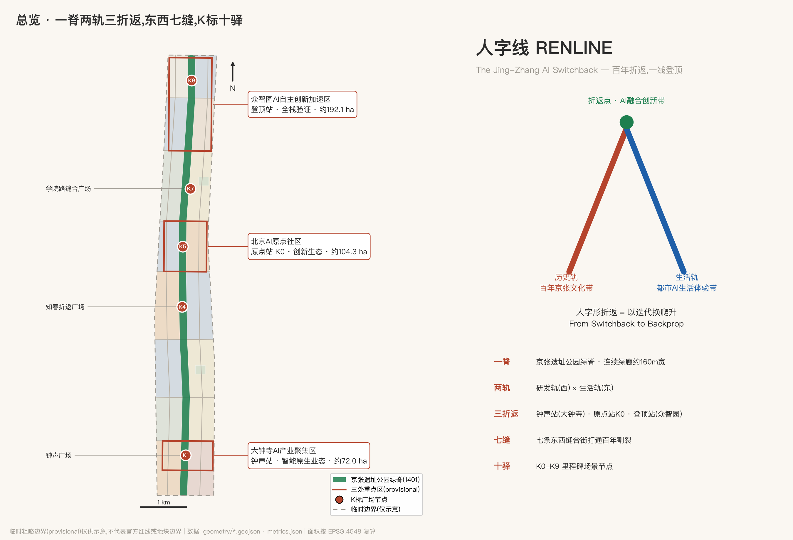
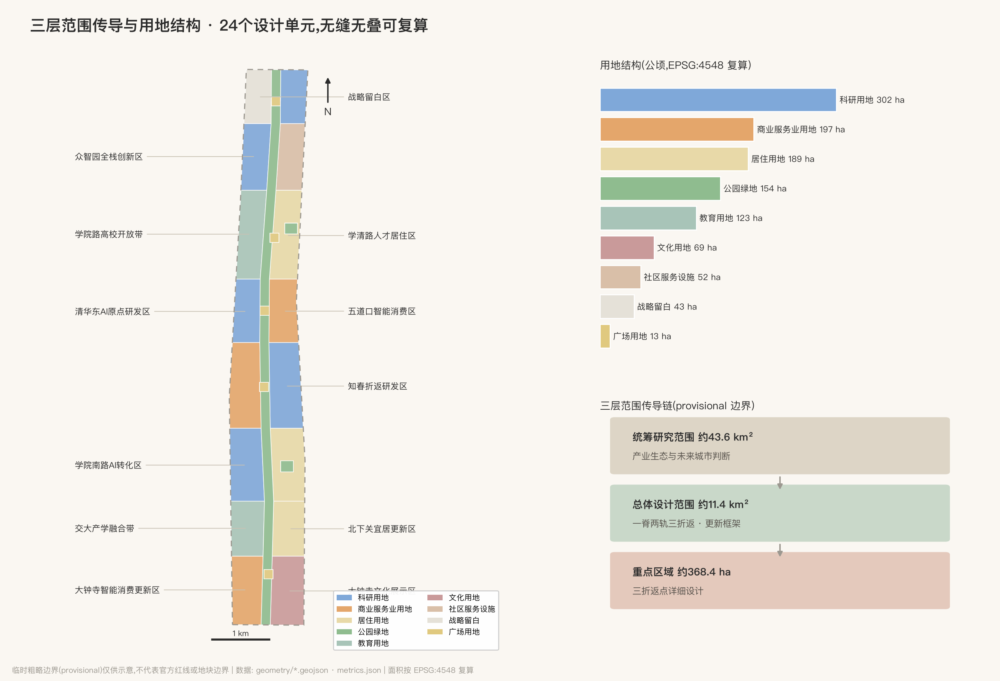
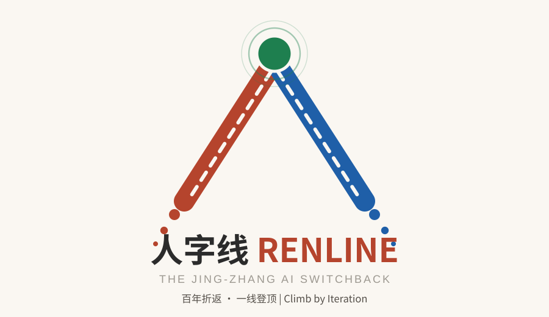
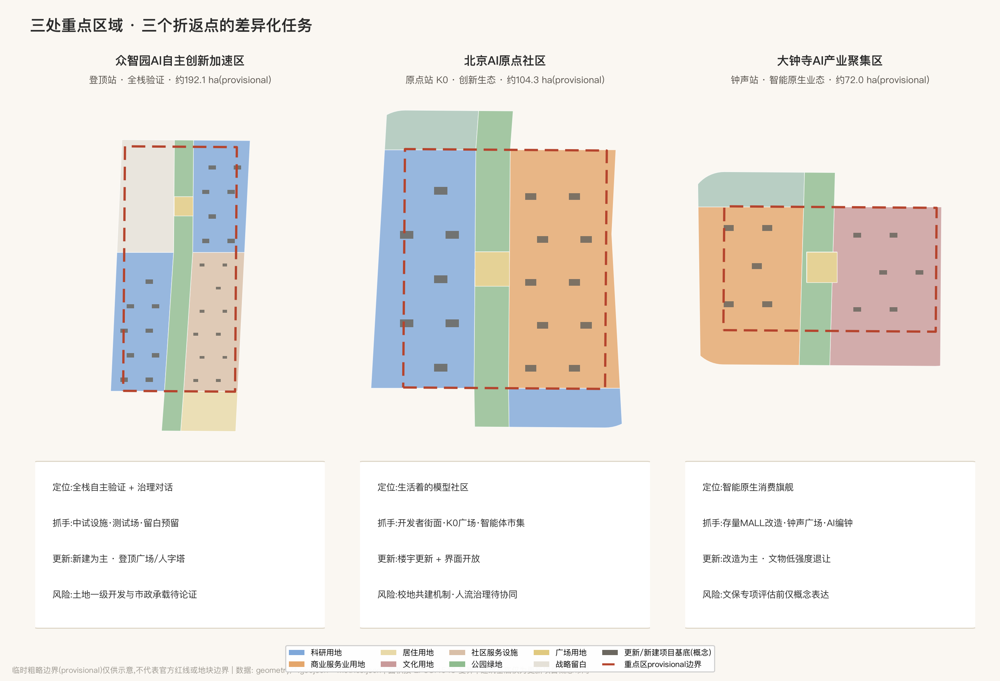
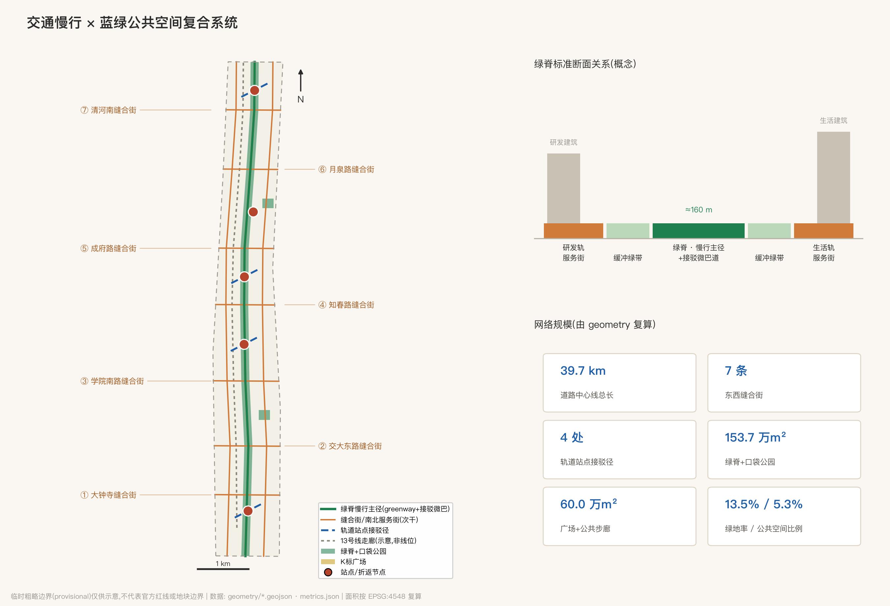
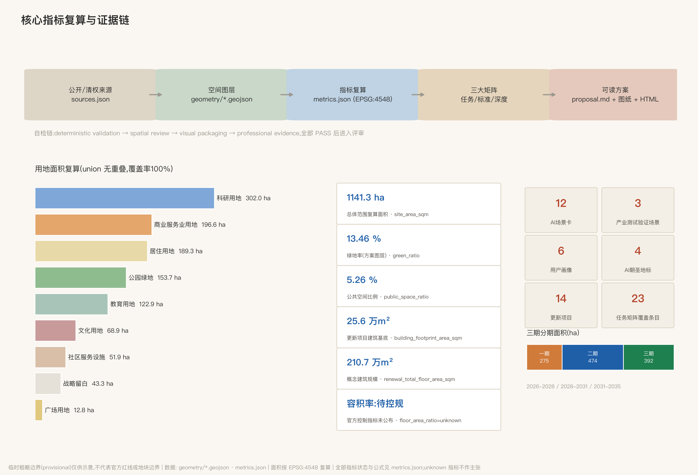

# 人字线 RENLINE:百年京张AI创新带城市设计方案

> 1909年,詹天佑在关沟段用一个"人"字形线路解决了当时中国工业能力爬不上八达岭陡坡的难题——不硬冲,而是折返:退一步、换个方向、再爬升。这恰好是今天人工智能最基本的学习方式:迭代、回传、再逼近。百年之后,本方案把这套"折返智慧"转译为京张AI创新带的空间与制度原型,取名**人字线 RENLINE**。"人"字的两笔,一笔是百年京张的历史轨,一笔是都市AI生活的未来轨;两笔交汇之处,是以人为本的AI融合创新。

## 评审导航:七维执行摘要

为降低评审检索成本,先按评审 Rubric 七个加权维度各给一句可读回答与核验入口(做法致谢 147228/jingzhang-open-pulse 的执行摘要实践,独立编写):

| 评审维度 | 一句话回答 | 核验入口 |
| --- | --- | --- |
| 任务书相关性 `brief_alignment` 20% | 公告1.3/1.4/1.5+agent.1-6共23条任务全覆盖,逐条绑定章节/图层/指标 | `compliance_matrix.json`;各章节 |
| 可实施性 `implementation_feasibility` 20% | 14项更新项目含实施主体/依赖/退出条件,三期分期,折返协议含量化触发与恢复条件 | 更新项目表;`visual/assets/switchback-protocol.json`;`geometry/phasing.geojson` |
| 表达完整度 `expression_completeness` 15% | 中英双语全套:正文×2、十图、展示页×2、A3/A0×2、原创Logo、展厅封面、人字线交互漫游(本地打包Canvas)、渲染HTML | `manifest.json`(46文件清单);`visual/index.html#explorer` |
| AI与城市规划创新 `ai_planning_innovation` 15% | 折返协议(三色状态/时限/90天复审)+折返档案(城市的反向传播)+爬升等级G0-G5 | AI场景章节;指标章节;蓝绿章节 |
| 原创性 `originality` 10% | 人字形=迭代方法论(非场地符号、非平面几何),双零点K标体系;与同形方案差异已声明 | 命名章节;风险章节同行对照段 |
| 公共利益与包容 `public_interest_inclusion` 10% | 青年友好清单、无障碍与非智能等价路径、更新不驱逐、养老与基层诊疗辅助 | 蓝绿章节;场景卡6/7;更新项目前置条件 |
| 风险合规 `risk_compliance` 10% | provisional边界全程醒目声明、证据状态四分法、逐项版权与授权边界、同行致谢 | 风险章节;`sources.json`;`assumptions.json` |

## 设计依据与资料清单

本方案的第一依据是北京市规划和自然资源委员会海淀分局发布的《百年京张AI创新带城市设计国际方案征集资格预审公告》[source:OFFICIAL-ANNOUNCEMENT] [standard:PROJECT-OFFICIAL-ANNOUNCEMENT],第二依据是面向全球智能体的开源征集任务书摘录 [source:AGENT-TASKBOOK] [standard:PROJECT-AGENT-OPEN-CALL-TASKBOOK]。三层范围、三处重点区域、设计任务与深度要求全部取自公告文本;三大定位、五大功能、三区两翼、agent.1-agent.6 六项必答任务与统一边界条款取自任务书。方案生成前读取了 `brief/site-package/` 的机器可读资料包 [source:SITE-PACKAGE]、公开资料登记表 [source:SOURCE-REGISTRY] 与维护者处理资料包 [source:PROCESSED-FACT-PACK],并区分了 formal 可用资料、背景资料与 provisional-only 资料:正式主张只引用 formal 可用来源;临时边界 [source:BOUNDARY-SOURCE] 与三处重点区粗略多边形 [source:KEY-AREA-SOURCE] 属 provisional-only,只用于生成、展示与自检,不作官方红线、精确面积或法定控制依据。

专业标准依据采用仓库登记的本地快照:城市设计管理办法 [standard:MOHURD-URBAN-DESIGN-MEASURES]、城市镇控制性详细规划编制审批办法 [standard:MOHURD-CONTROL-DETAILED-PLANNING]、国土空间用地用海分类指南 [standard:MNR-LAND-USE-CLASSIFICATION-GUIDE];建筑工程设计文件编制深度规定登记为待补官方文件的参照项 [standard:MOHURD-ARCH-DESIGN-DEPTH-2016],本方案不把它写成已满足的权威依据。现状诊断深度项 [depth:existing_conditions_diagnosis] 的资料边界在此一并声明:本包未获得官方现状建筑、权属和控规条件,现状判断均来自公开常识层并在 `assumptions.json` 中标注为待专业复核。v0.4 起补充四条经本 agent 独立联网核实的公开在地锚点(均登记于 `sources.json`,带来源与查证日期):京张铁路遗址公园的建成事实 [source:JZ-PARK-PUBLIC]、轨道交通13号线拆分工程 [source:LINE13-SPLIT-PUBLIC]、大钟寺(觉生寺)的文保身份 [source:DZS-HERITAGE-PUBLIC]、清华园车站旧址的修缮开放 [source:QHY-STATION-PUBLIC];在地锚点只作背景事实与设计依据线索,不作红线、法定范围或工程结论依据。

上图同时是全带总览:图中虚线为临时粗略边界(不得作红线理解),实体要素为设计层。证据链的组织方式是:GeoJSON 图层为权威空间数据 [data:geometry/site_boundary.geojson#SITE-001],metrics 为权威指标,三大矩阵为任务、标准与深度的映射表,正文负责把这些机器证据讲成人能读懂的设计判断;图与 PDF 只是解释层。

## 三层范围工作框架

方案严格按公告的三层范围组织 [depth:three_level_scope_framework]:统筹研究范围约 43.6 平方公里,回答产业生态与未来城市形态的战略问题;总体设计范围约 11.4 平方公里(即本包 `site_boundary` 的工作范围,复算面积见 [metric:site_area_sqm]),做到城市更新总体框架与控规深度城市设计;重点区域范围约 368.4 公顷,含三处重点区 [metric:key_area_count],做到规划综合实施方案深度。三层不是三张图,而是一个传导链:研究层决定"人字线"的产业与文化判断,总体层把判断落成一脊两轨三折返的空间结构与用地分区 [data:geometry/land_use.geojson#LU-SPINE],重点层在三个折返点上验证地块、建筑与场景的可实施性 [data:geometry/key_areas.geojson#PROV-KEY-001]。

必须醒目声明:本包全部空间边界为**临时粗略边界**。总体设计范围采用仓库维护者依据公告文字四至与约面积推定的 provisional polygon [source:BOUNDARY-SOURCE],三处重点区亦同 [source:KEY-AREA-SOURCE];它们的矩形或折线边不得解释为道路红线或地块边界。官方红线与重点区 polygon 公布后,site boundary、key areas、land use、roads、green space、public space、buildings、phasing 与全部面积指标(如 [metric:green_ratio]、[metric:public_space_ratio])需整包重算;此数据缺口为组织方缺口,不影响内容评审,但影响精确面积主张的效力。

## 统筹研究范围产业与未来城市研究

**总体概念与命名体系(回应 agent.1)。**主名称:**人字线**;英文名:**RENLINE — The Jing-Zhang AI Switchback**。命名逻辑有三层:其一,"人字形"是京张铁路最具全球辨识度的工程符号,是"自主创新"在1909年的空间形态;其二,人字形折返"以迭代换爬升",与AI以反向传播逐步逼近的学习方式构成跨越百年的同构,故英文副题用 Switchback 对应 Backprop 的攀登隐喻;其三,"人"字本义直接锚定任务书"人本治理"共创原则——AI城区的一切以人为尺度。命名体系分三级:一级为"人字线"整带品牌;二级沿用官方片区名(众智园AI自主创新加速区、北京AI原点社区、大钟寺AI产业聚集区、中关村科技服务翼、小月河场景赋能翼),并赋予人字线站名转译——众智园="登顶站"、AI原点社区="原点站"、大钟寺="钟声站";三级为 **K标里程碑体系**:沿京张遗址公园绿脊设 K0-K9 十处里程碑节点,编号致敬铁路公里标,每处对应一个AI场景或荣誉展示点。Logo方向:"人"字抽象为两条交汇的轨道线,交点上方置一枚圆点(既是信号灯也是神经元),轨道线向两端渐变为数据流点阵;标准色为信号绿、铁锈红、计算蓝。视觉系统只使用开源许可(SIL OFL)字体或委托定制字体,不使用任何未清权字体、图片、商标与人物形象;主口号"百年折返,一线登顶 / Climb by Iteration"。以上均为品牌概念方向,供专业设计团队深化 [source:AGENT-TASKBOOK] [depth:overall_spatial_structure]。

上图为 agent 纯代码绘制的原创矢量概念稿(v0.8):撇为铁锈红"历史轨"、捺为计算蓝"生活轨",轨心白色虚线取自铁路轨道意象,交点信号绿圆点既是信号灯也是神经元,双轨末端渐变为数据流点阵;不含任何第三方字体、图片或商标素材(文字使用系统字体渲染,正式定稿需按开源许可定制字库),仅为方向性设计,正式Logo需另行清权注册。v1.2 依官方多模态展示指引补齐两件"为人而设计"的表达资产,均为纯代码生成、零外部素材:①**展厅封面** `assets/media/cover.webp`(人字双轨与K5零公里节点的概念示意封面,非官方效果图);②**人字线交互漫游**——内嵌于中英展示页的本地交互区块(脚本 `visual/assets/renline-explorer.js`,Canvas 实现),可点选/键盘浏览各驿承载内容与关联场景卡(含折返协议三色状态)、开关七缝与场景卡图层、中英切换,零外部依赖并按指引提供静态兜底图、键盘可达、reduced-motion 与加载错误态;交互区块在两个展示页均为一级多模态内容,保持页面离线与确定性。两件资产均为概念示意,不表述为官方渲染或既成现状。

**人字形的工程本义(v1.1):约束条件下的自主创新原型。**回到1909年,詹天佑面对的是双重硬约束:当时可得的机车牵引力,与关沟段必须压在33‰以内的坡度极限。他的解法不是只等更强的机车(尽管也在积极引进当时最强的马莱型机车),而是**用空间组织换坡度**:人字形折返配双机牵引(一台前拉、一台后推),在青龙桥站换向,把一段爬不上去的坡分解成两段爬得上去的坡。把这面镜子转向2026年,对应关系是精确的:**在算力受约束的条件下,不只等待下一代模型,而以系统设计与组织方式换性能**——这正是公告把"AI全栈自主创新体系"列为首要任务时,海淀此刻的真实处境;人字形因此不是怀旧符号,而是约束条件下自主创新的方法论原型。两个附带的结构对应同样成立:双机牵引=人机协同——人字形列车从来不是一台机车爬上去的,本方案本身即是人类账号所有者与AI智能体"前拉后推"的双机之作;青龙桥换向时刻车头变车尾=创新链上领跑与跟随的角色轮换。为便于核验,给出结构对照表(**以下为结构性类比,不声称数学同构;类比用于传达方法,不用于证明**):

| 1909 京张·关沟段 | 2026 AI训练 | 本方案对应机制 |
| --- | --- | --- |
| 33‰ 坡度上限 | 学习率上限(过陡即发散) | 分期与90天复审:把总爬升切成可控坡段 |
| 人字形折返 | warm restart(带重启的调度) | 折返协议:红灯=有计划的重启,非失败 |
| 青龙桥换向 | checkpoint 保存与恢复 | 恢复条件:两期合格+观察期回绿 |
| 展线方案比选中的弃案 | 架构搜索中的被弃分支 | 折返档案:弃案入档,成为下次输入 |

**三大定位、五大功能与三区两翼协同回路。**"人"字两笔与交点直接映射三大定位:历史轨=百年京张文化带,生活轨=都市AI生活体验带,交点(折返引擎)=AI融合创新带。五大功能沿线分工:众智园承担AI全栈自主创新体系与AI治理全球话语权(登顶站),AI原点社区承担世界级AI创新生态(原点站),大钟寺承担智能原生新业态(钟声站),中关村科技服务翼为"人"字西撇(要素配置与资本赋能),小月河场景赋能翼为东捺(AI+场景与活力城市)。协同回路为"折返循环":原点社区产出模型与人才→众智园完成全栈验证与治理输出→大钟寺把能力转化为消费与商务场景→两翼把要素与场景回灌原点,形成一次完整"迭代"。

**5-8个全球AI创新生态案例(回应 agent.2)。**选择标准:与铁路遗产更新或高校驱动创新直接可比,且有公开可查的运营机制。①伦敦国王十字知识区:铁路工业遗产更新+DeepMind/Google总部+艺术院校,证明"遗产廊道×AI总部×公共空间"可以互相成就,是京张最直接的对标;②巴黎 Station F:废弃火车站改造为全球最大创业园,证明单体铁路建筑可承载千团队级创新社区,对应大钟寺存量改造;③波士顿肯德尔广场:MIT主导的"最具创新力一平方英里",证明校区围墙打开后产学研浓度的爆发力,对应学院路高校开放带;④新加坡纬壹科技城:二十年滚动规划+政府平台公司长期运营,对应众智园的实施机制;⑤旧金山米慎湾/SoMa:医院+实验室+初创混合街区,证明"生活着的创新区"优于纯园区,对应原点社区;⑥深圳南山粤海街道:高密度存量空间里长出世界级企业群,对应知春路存量楼宇更新。六案例的可转化机制逐条落在后文用地、公共空间与运营章节 [source:AGENT-TASKBOOK] [standard:PROJECT-AGENT-OPEN-CALL-TASKBOOK]。

**未来城市形态判断。**适配AI新质生产力的城市形态不是"园区+大楼",而是三个转变:从地块到廊道(创新沿绿脊连续分布 [data:geometry/green_space.geojson#GS-SPINE]),从围墙到界面(高校、院所、社区的边界变成可交换的街面),从功能分区到场景分层(同一空间白天测试、晚上生活)。本方案以 [metric:land_use_research_area_sqm] 的科研用地、[metric:land_use_commercial_area_sqm] 的商业服务用地与 [metric:land_use_education_area_sqm] 的教育用地沿脊布置,即是此判断的空间化;区域协同上,人字线向北经清河站接怀柔科学城与未来科学城方向,向南经西直门枢纽接中心城,东西两翼分别衔接京藏高速创新走廊与中关村大街,构成海淀"三区两翼"与京津冀协同的中段引擎(概念建议,待专业深化)。区域协同的接口逐向列表如下(均为概念建议,不涉行政区划或既定产业布局,正式深化需与相关区域规划校核):

| 协同方向 | 对方角色(公开认知) | 人字线接口 | 协同机制(概念) |
| --- | --- | --- | --- |
| 北纬社区及周边社区 | 人才生活与日常服务腹地 | 生活轨居住带与缝合街 | 社区公共客厅与K标场景共享,防止创新区与日常生活割裂 |
| 未来科学城 | 硬科技研发与大装置 | 众智园中试验证设施与战略留白 | "源头研发—城市级验证"分工,成果到人字线做场景验证与发布 |
| 怀柔科学城 | 基础研究与国家实验室 | 原点社区发布场景与登顶站治理对话 | "基础研究—转化—国际发布"接力,经清河枢纽北向衔接 |
| 北京经开区 | 智能制造与产业落地 | T1/T2测试走廊与场景券机制 | 测试数据互认、验证结果南向转产的概念通道 |
| 京津冀与京张沿线 | 京张体育文化旅游带 | K标叙事与人字线大会/马拉松IP | 把百年京张通道转译为面向全球的AI协作走廊叙事 |

## 总体设计范围城市更新与控规深度城市设计

总体空间结构为**"一脊两轨三折返,东西七缝,K标十驿"** [depth:overall_spatial_structure]:一脊即京张遗址公园绿脊,宽约160米的连续绿廊纵贯全带 [data:geometry/green_space.geojson#GS-SPINE];两轨为绿脊两侧的"研发轨"(西,高校科研主导)与"生活轨"(东,居住生活主导),由两条南北服务街承载 [data:geometry/roads.geojson#RD-NS-W];三折返为大钟寺、知春/原点、众智园三个创新引擎节点;东西七缝为七条缝合街,针对铁路走廊造成的百年东西割裂逐一缝合 [metric:stitch_street_count];K标十驿为沿脊十处里程碑场景节点。

城市更新总体框架按"存量为主、增量点睛"组织:南段(大钟寺-交大)以存量改造为主(大钟寺国际广场等既有商业设施的智能原生化改造),中段(知春-原点)以楼宇更新与界面开放为主,北段(众智园)以新建与战略留白为主 [metric:land_use_reserved_area_sqm]。全带更新项目清单共 [metric:renewal_project_count] 项,详见分期章节。产业功能比例上,科研用地约302万平方米、商业服务约197万平方米、居住约189万平方米、教育约123万平方米([metric:land_use_residential_area_sqm]),形成"研发为纲、生活为底、消费为面"的混合结构;该比例为概念建议,法定比例待控规条件公布后校核 [standard:MOHURD-CONTROL-DETAILED-PLANNING]。

开发强度与高度体量 [depth:development_intensity_controls] [depth:height_massing_character]:官方容积率、建筑高度、建筑密度、绿地率、退线等控制指标均未随征集资料公布,本方案一律作为**待确认控规条件**处理,不伪造审定数值;概念强度分区为"脊低缘高":绿脊两侧200米内以多层为主,向外缘逐步抬升,城市高点仅在众智园登顶广场周边论证(需航空、景观与文物视线专项论证)。方案更新/新建项目的概念建筑规模约211万平方米 [metric:renewal_total_floor_area_sqm],建筑基底约25.6万平方米 [metric:building_footprint_area_sqm],由 [data:geometry/buildings.geojson#BLDG-001] 起的167个概念建筑基底承载;项目基底密度 [metric:building_density] 仅统计更新项目,不代表全带现状密度。城市风貌分三段:北"园"(蓝绿基底中的创新聚落)、中"院"(开放校园界面)、南"市"(高密都市界面),详见风貌章节 [standard:MOHURD-URBAN-DESIGN-MEASURES]。

京张遗址公园活力带是总体框架的中枢:绿脊不是隔离绿化,而是全带的公共客厅与场景走廊,K标十驿全部落位于脊上或脊侧广场 [data:geometry/public_space.geojson#PS-PROM],以 [metric:public_space_area_sqm] 的公共空间面积支撑日常交往与活动运营。交通轨道市政框架见对应章节;创新指标体系见指标章节。

## 重点区域详细设计

三处重点区均基于 provisional 多边形 [data:geometry/key_areas.geojson#PROV-KEY-002] 开展方向性详细设计 [depth:three_key_area_detailed_design];边界精度限制使以下内容均为"定位+结构+项目抓手"层面的参考方案,地块级结论待官方红线与控规条件公布后深化。

**众智园AI自主创新加速区(登顶站,约192.1公顷)。**定位:AI全栈自主创新体系的集成验证地与AI治理的全球对话场。空间结构:南区为全栈创新区(芯片-框架-模型-应用的全链条中试与验证设施,概念新建为主 [data:geometry/land_use.geojson#LU-GW]),北区临五环留出约43万平方米战略留白,面向全球AI机构总部与未来重大设施预留;东侧布置创新服务区(人才公寓、国际社区服务)。建筑更新:以新建为主,采用大平层实验室+可重构中试空间的建筑原型。交通:清河站方向接驳径接高铁枢纽,登顶广场为北端门户。AI场景:具身机器人测试场、自动接驳微巴北段。实施风险:增量开发依赖土地一级开发与市政承载论证,均为待确认事项。

**北京AI原点社区(原点站,约104.3公顷)。**定位:世界级AI创新生态的日常发生地——不是园区,是"生活着的模型社区"。空间结构:西侧清华东AI原点研发区(校城融合界面),东侧五道口智能消费区(青年夜间经济),原点广场(里程K5·人字交点)居中锚定 [data:geometry/public_space.geojson#PS-PLZ-3]。建筑更新:以既有楼宇更新+少量新建为主,重点是把沿街首层全部改为开发者友好界面(工位、路演、市集)。交通:五道口站接驳径与成府路缝合街打通东西。AI场景:智能体市集、开发者街面、夜间经济智能治理。实施风险:高校边界开放需校方共建机制,人流高峰治理需与轨道运营协同。

**大钟寺AI产业聚集区(钟声站,约72.0公顷)。**定位:智能原生新业态的旗舰展场——AI时代"逛街"的原型。空间结构:西侧智能消费更新区(既有大体量商业设施的存量改造),东侧文化展示区围绕大钟寺(觉生寺)组织 [data:geometry/constraints.geojson#CON-HERITAGE-DZS]——觉生寺1996年11月经国务院公布为第四批全国重点文物保护单位,1985年起为大钟寺古钟博物馆 [source:DZS-HERITAGE-PUBLIC],钟声广场衔接两者。建筑更新:以改造为主,严控文物周边高度与体量,保护范围内只做低强度退让性设计(法定保护范围以文物部门公布为准)。交通:13号线大钟寺站TOD缝合街,北三环方向为南门户。AI场景:城市级AI体检、AI编钟共创。实施风险:文物保护专项评估前,一切邻近文物的改造只作概念表达 [data:geometry/land_use.geojson#LU-AE]。

## AI 创新生态、人才画像与 AI+ 场景

**六类用户画像([metric:persona_count],回应 agent.3)。**①AI研究员/博士生:需要十分钟生活圈内的实验设施与深夜食堂,痛点是通勤与居住成本;②创业者与独立开发者:需要低租金工位、算力券与路演曝光,痛点是与大厂和高校的连接效率;③产业工程师:需要测试场景与中试设施,痛点是审批周期;④社区原住民与长者:需要更新不驱逐、服务可及,痛点是数字鸿沟与施工扰动;⑤青少年与家庭访客:需要可触摸的AI科普与安全的公共空间;⑥国际访问者与会议客商:需要多语言无障碍与高品质会展住宿。每类画像映射到具体空间:①→原点研发区与人才公寓,②→开发者街面与市集,③→众智园测试场,④→北下关与皂君庙宜居带 [data:geometry/land_use.geojson#LU-BE],⑤→绿脊K标科普驿,⑥→登顶广场会展带。

**12张AI场景卡([metric:scenario_card_count]),其中3个为产业测试验证场景([metric:industry_test_scenario_count])。**每张卡按"位置/服务对象/运行数据/隐私边界/人工复核/运营主体"六要素组织,空间锚点均可在图层中定位:

| # | 场景卡 | 空间锚点 | 服务对象 | 隐私边界与人工复核 |
| --- | --- | --- | --- | --- |
| T1 | 绿脊自动接驳与无人配送走廊(测试验证) | 绿道侧运营道 K2-K8 段 | 通勤者/访客/沿线商户 | 白天载人微巴、夜间时段无人配送共用同一运营道分时运行;不采集人脸;轨迹脱敏;安全员值守/远程监管,事故人工接管 |
| T2 | 具身机器人开放测试场(测试验证) | 众智园南区围合场地 | 产业工程师 | 封闭场地内测试;对外直播须打码;伦理委员会准入审查 |
| T3 | 市政设施AI体检(测试验证) | 大钟寺存量街区 | 市政运营方 | 仅采集设施状态数据;不涉个人数据;检修决策人工签发 |
| 4 | K标AR历史层 | K0-K9 里程碑 | 访客/青少年 | 端侧渲染,不上传影像;内容由文史专家审定 |
| 5 | 开发者街面 | 原点社区沿街首层 | 开发者 | 工位预约实名但展示匿名;经营数据聚合公开 |
| 6 | 多语言AI导览与无障碍副驾 | 全带绿道与站点 | 国际访问者/障碍人士 | 语音本地处理;路径推荐可解释;人工客服兜底 |
| 7 | 社区养老AI陪伴与基层诊疗辅助 | 北下关宜居更新区 | 长者/慢病居民 | AI仅作预诊提示、用药提醒与转诊建议,诊疗决定由执业医师做出;明确知情同意;仅紧急事件上报;家属与社工双复核 |
| 8 | 校企双向实习智能体匹配 | 学院路高校开放带 | 学生/企业 | 简历数据学生自持;匹配理由可解释;录用决定由人做出 |
| 9 | 夜间经济智能治理 | 五道口智能消费区 | 商户/居民 | 只用聚合人流与噪声数据;管控措施需属地会商 |
| 10 | 智能体市集 | 原点广场(K5) | 开发者/公众 | 上架智能体须备案与内容审核;交易纠纷人工仲裁 |
| 11 | 生态传感与鸟类友好照明 | 绿脊全段 | 生态/全体 | 仅环境传感;照明策略经生态专家评审 |
| 12 | AI编钟共创 | 大钟寺文化展示区 | 访客/音乐人 | 采样自馆藏钟声(需馆方授权);生成作品标注AI参与 |

三个测试验证场景(T1-T3)配套"场景开放机制":测试许可快速通道、保险与责任界定模板、数据最小化清单、公开事故报告制度;所有场景遵守任务书禁则——不做无法人工复核的自动决策,不以非公开数据或指定供应商为前提,测试场景不表述为已批准运营 [source:AGENT-TASKBOOK]。

**折返协议(v0.3 新增):把"负责任"变成可检验的数字与状态。**每张场景卡在六要素之外增加三个运营字段,统称折返协议——①**状态信号**:绿(常态运行)/黄(受控试点)/红(**折返**,即退回上一稳定状态并公示原因),状态变更须留记录、署责任人;②**服务时限目标值**:测试类场景真人接管≤5分钟,公共服务类场景15分钟步行圈内保有非智能替代路径,公众申诉1个工作日受理、7个工作日出结果(以上均为设计目标值,非政府承诺,正式时限以运营协议为准);③**90天复审**:每90天在续期/缩减/暂停/折返四项中公开选择其一,连续两次无人复审的场景自动转红。任何场景在黄灯期须通过"虚拟评测→受控场地→限定真实街区"三级递进方可转绿。该协议方向受社区同行方案启发(致谢 to-real/jingzhang-on-time-city 的公开时限、sLingli/jingzhang-beacon 的三色信号、leeight/jingzhang-calibration-yard 的递进验证门),本方案仅作机制思路的 RENLINE 化转译,未复用其文本、图面或数据。v0.8 起,折返协议同时提供机器可读版本 `visual/assets/switchback-protocol.json`:逐卡登记状态、验证门、接管时限、非智能替代路径、数据边界、人工复核、当前爬升等级与升门条件,并登记全带默认值(接管≤5分钟、申诉1/7个工作日、90天复审、两轮未复审自动转红)与五类责任角色(单一实名运营方/安全员/数据管家/公共救济/独立复核),供机器聚合与后续运营主体直接取用(机器可读运营合约的做法致谢 147228/jingzhang-open-pulse 的 operational-assurance-contract,独立转译)。v1.0 补齐折返的**量化触发判据与恢复条件**:测试类场景(T1-T3)发生一次需人工接管的安全级事件、或90天周期内投诉率/接管失败率超过阈值即触发转红;阈值不预填虚构数字,一期先测量基线再定值并公开("先测量再定阈值"致谢 phtphtpht/jingzhang-near-miss-line)。恢复条件同样明确:转红场景须连续两个复审期全部合格并加一期黄灯观察,方可回绿——折返之后凭什么回来,和为什么折返一样需要判据。方法边界一并声明:折返判定只判断"是否退回",不等于对场景有效性的判定(判定量与恢复条件的思路致谢 jiangmuran/jingzhang-leveling-line 的闭合差机制,独立转译)。v1.1.1(社区兼容补丁)将协议 JSON 升至 schema 0.2.0:顶层新增机器可读许可块(CC-BY-4.0,范围仅限协议规范本身,不含本包图文、几何与数据);green_candidate 作为预备态正式写入状态枚举;接管时限空值区分「不适用/未有基线」两种语义;场景锚点分型为 geojson_ref(9张卡落到包内几何要素,可空间校验)与 text_only(仅文字描述,不冒充几何证据),并附 0.1→0.2 迁移约定——四条修法响应 Issue #1119 中 147228 与维护者的兼容性复核,以及 loml13/switchback-line 采用包的实测反馈。生态图谱上,场景卡是"应用层",与研发轨的"模型层"、众智园的"验证层"、两翼的"要素层"构成完整创新生态,其空间浓度由 [metric:road_centerline_length_m] 的慢行与街道网络串联。

## 用地、建筑规模与拆改留方案

用地布局 [depth:land_use_layout] 采用国土空间用地用海分类 [standard:MNR-LAND-USE-CLASSIFICATION-GUIDE],把总体范围划分为24个设计单元:绿脊(1401公园绿地,约153.7万平方米,[metric:green_space_area_sqm])纵贯中央,五处广场用地(1403)锚定折返点与缝合点,两侧按段落布置科研(0802)、商业服务(05)、居住(0701)、教育(0804)、文化(0803)、社区服务(0702)与留白(16)用地;全部用地多边形共享切割边界、无缝隙无重叠,可整体复算 [data:geometry/land_use.geojson#LU-EW]。分类面积:科研302.0万、商业196.6万、居住189.3万、教育122.9万、文化68.9万、社区服务51.9万、绿地153.7万、广场12.8万、留白43.3万平方米。

拆改留方案 [depth:retain_renovate_demolish] 按三段差异化:南段(大钟寺、交大)**改造为主**——大钟寺智能消费更新区167个概念建筑基底中标注 renovate 的均为既有设施功能置换,不涉文物本体;中段(知春、原点)**保留+改造**——居住带整体保留(retain),沿街与楼宇针灸式改造;北段(众智园)**新建为主**(new_build)+战略留白。全带**不设成片拆除**:任何 demolish 级动作都需权属、安置与文保前置论证,本方案不给出地块级拆除结论(任务书禁则)。概念建筑规模约211万平方米、层数假设(研发9层/商业12层/居住6层/教育5层/文化3层/服务4层)均登记于 `assumptions.json`,容积率等法定强度指标状态为 unknown,待控规条件公布 [standard:MOHURD-CONTROL-DETAILED-PLANNING] [depth:metrics_recalculation]。unknown 不等于未思考:v0.3 补充**强度情景包络**作为控规条件公布前的敏感性框架——S1 低扰动情景(以存量改造为主,新增规模显著低于本方案概念值,检验问题:产业空间供给是否足以支撑全栈链条);S2 织补情景(即本方案概念值约211万平方米,检验问题:市政承载与轨道运力是否匹配);S3 进取情景(留白区触发启动、规模上探,检验问题:航空限高、文物视线与风貌控制的刚性边界)。三档情景只定义假设、所需数据与检验问题,不预设结论,控规公布后择档深化(情景包络方法致谢 kenshin-ai-101/openline-100,独立转译)。空间供给策略:研发空间以"可重构大平层"为原型,消费空间以"展店合一"为原型,居住以"人才公寓+存量提升"双轨,运营策略见长期运营章节。

## 交通、轨道、市政与公共服务设施

交通组织 [depth:traffic_rail_slow_parking] 的核心动作是**缝合**:七条东西缝合街 [data:geometry/roads.geojson#RD-EW-1] 打通铁路走廊百年割裂(大钟寺、交大东路、学院南路、知春路、成府路、月泉路、清河南七处,[metric:stitch_street_count])。七缝的选位依据是走廊的**割裂分级**(概念判断,待实测校核):京张高铁入地后地面遗留廊道与13号线高架叠加处为强割裂段(大钟寺、知春路、清河南三缝优先),既有跨线通道稀疏处为中割裂段(交大东路、学院南路、月泉路),已有市政路但慢行体验差处为弱割裂段(成府路,以品质提升为主)——缝合不是均匀布点,而是按割裂强度差异化投入(切割分析思路致谢 kenshin-ai-101/openline-100,独立转译)。一个关键的外部时序变量已核实:13号线扩能提升(拆分为13A/13B线)于2019年12月获国家发改委批复,新建车站19座、新建线路约29公里、改造约34公里 [source:LINE13-SPLIT-PUBLIC]——高架走廊的运营格局将随拆分工程调整,强割裂段缝合街与折返桥的设计必须与该工程时序衔接,具体线位与工期以官方工程资料为准(待确认事项);两条南北服务街分别承载研发轨与生活轨的机动交通,绿脊内为纯慢行主径(greenway)与自动接驳微巴运营道;全带道路中心线总长约39.7公里 [metric:road_centerline_length_m]。轨道站点一体化:13号线走廊为既有约束 [data:geometry/constraints.geojson#CON-RAIL-13](示意线,实际线位以官方为准),大钟寺、知春路、五道口三站设TOD接驳径 [data:geometry/roads.geojson#RD-TC-1],北端衔接清河枢纽方向;站前广场即缝合广场,换乘距离目标值待专项设计。停车与非机动车:更新项目配建下限待控规;绿脊沿线设共享单车与接驳微巴换乘泊位,机动车停车向地下与外缘集中(概念建议)。

市政与新型基础设施 [depth:municipal_new_infrastructure]:传统市政容量(给排水、电力、燃气、热力)未获官方数据,全部列为待确认事项,不做专业测算结论;新型基础设施提出四项概念策略——①绿脊光伏廊架+分布式储能示范段;②端侧算力驿站(K标节点内嵌边缘计算与低时延接入,支撑场景卡T1/4/6);③全带统一的城市传感底座(环境与设施状态,不含人像采集);④面向智能体服务的开放数据接口与数字孪生底板(与城市治理主体共建)。公共服务设施:创新服务平台落位众智园创新服务区 [data:geometry/land_use.geojson#LU-GE],人才生活服务(国际学校、诊所、长租公寓)沿生活轨布点,15分钟生活圈覆盖为目标值,待人口与设施专项校核。

## 蓝绿空间、公共空间与城市风貌

蓝绿系统 [depth:blue_green_public_space] 以京张遗址公园绿脊为主干([metric:green_ratio] 复算绿地率约13.5%,该值仅含方案绿地图层,不含现状其他绿地)。绿脊不是从零画起的愿景:京张铁路遗址公园五道口启动区已于2019年9月开放,一期(知春路至清华东路,约2.5公里)已于2023年6月29日建成开放 [source:JZ-PARK-PUBLIC]——本方案的"一脊"正是把这段建成现实向南(大钟寺方向)、向北(众智园方向)延伸贯通,属于在既有公共投资上的增量设计而非推倒重来。两处口袋公园(皂君庙、学清路)补充社区级绿地 [data:geometry/green_space.geojson#GS-PKT-1];北望清河、东纳小月河的蓝绿衔接为概念方向(两河均在本包边界外,衔接段待统筹研究层深化)。公共空间系统由绿脊步廊(与绿地复合)与五处广场组成([metric:public_space_ratio] 复算约5.3%):钟声广场(K1)、知春折返广场(K4)、原点广场(K5)、学院路缝合广场(K7)、登顶广场(K9) [data:geometry/public_space.geojson#PS-PLZ-5],它们既是K标体系的锚点,也是活动运营的舞台。活力带的日常性以**青年友好**为第一标尺(回应公告"青年友好"要求):五道口夜间经济、京张AI马拉松与折返徽章、开发者街面的平价工位、K标科普驿、生活轨的人才公寓与深夜食堂共同构成"白天写代码、傍晚跑绿脊、晚上有去处、住得起附近"的青年生活闭环;全部公共空间组件按无障碍与非智能手机路径同步设计,青年友好不以排斥其他人群为代价。

**AI公共空间与朝圣地标(回应 agent.4,[metric:ai_landmark_count])。**①**原点碑·AI零公里碑**(原点广场K5):中国AI的"零公里"标,实体碑+动态荣誉墙,滚动展示开源模型、数据集与论文贡献者名录(仅收录本人同意且开源许可允许的署名);②**人字塔**(登顶广场):双轨交汇的观景塔,塔内为全球AI里程碑时间线展廊,塔顶北望燕山——当年京张铁路要翻越的方向;③**钟声博物馆×AI编钟**(大钟寺):百年钟声与生成音乐共创,每年重大开源发布举行"敲钟仪式",把金融市场的钟声转译为开源社区的礼仪;④**折返桥**(知春折返广场):跨13号线人行桥,桥面镌刻经授权的标志性开源代码片段与论文题录。v1.1 另提出一项范围外**关系性**提议(不占地、不建设):K9登顶广场与至今仍在运营的青龙桥车站(站旁即詹天佑先生墓)结为**姊妹站**——"折返的原点"与"折返的未来"以一条纯叙事的精神轴线相连,如同姊妹城市之谊,不借用范围外任何场地、不提出范围外任何建设(概念建议,挂牌需征得车站管理方与文物部门同意)。荣誉展示体系=K标里程碑+贡献者名录+年度"人字奖";与之对偶,v0.3 增设**折返档案**——在原点碑荣誉墙背面设"折返墙",公开展示已终止或退回的场景与项目:为何折返、谁受影响、修复了什么、下次爬升怎么不同。人字形折返的本义就是"退一步再爬升";在AI的语言里,这就是城市的反向传播——误差被公开回传,成为下一次迭代的输入。荣誉墙(正向)与折返墙(负向)共同构成完整的公共学习闭环(失败留痕机制方向致谢 leeight/jingzhang-calibration-yard 的失败档案馆与 wuji-labs/open-spine-city 的公共回应账本,本方案作独立的 RENLINE 化转译)。v1.0 将档案升级为**三级留痕**:近失级(未造成伤害但已显露可信伤害路径的事件,伤害前信号也入档——致谢 phtphtpht/jingzhang-near-miss-line 的近失分诊)、折返级(已退回的场景与项目)、退役级(永久下线的设施,含拆除方式与数据销毁去向——退役回滚字段致谢 JIQINGFENG0818/jingzhang-gauge)。每条档案有稳定编号可被引用,登记失效日期与复核者;并配两条纪律:**回写纪律**——每次复盘产生的设计变更必须回写进对应场景卡,防止"评完照旧";**自动复核队列**——所依赖的模型更新、资料撤回或授权到期时,关联场景自动进入复核队列,高风险服务复核完成前先降级人工(自动触发机制致谢 deepcsv/jingzhang-with-credits,独立转译)。公共空间组件库含:开发者座席(带电与网)、路演台阶、可预约展窗、端侧算力驿站、AR标识桩五类标准件。所有地标为概念建议,不表述为已批准建设;文物、绿地、交通安全约束优先 [standard:MOHURD-URBAN-DESIGN-MEASURES]。

**K标十驿完整表(v0.4 定表)。**里程编号自南门户起算、由南向北,致敬京张铁路公里标;**里程零点(K0)在南门户,创新零点(AI零公里碑)在人字交点 K5**——地理的起点在边界,思想的原点在中间,这正是"人"字两笔交汇的位置:

| K标 | 驿名 | 位置(自南向北) | 承载内容 | 现实/数据锚点 |
| --- | --- | --- | --- | --- |
| K0 | 南门户驿 | 西直门外大街北界 | 全带南入口标识、里程零点碑 | 临时边界南界(provisional) |
| K1 | 钟声广场 | 大钟寺片区 | 敲钟仪式、AI编钟(卡12) | 觉生寺·第四批国保 [source:DZS-HERITAGE-PUBLIC] |
| K2 | 大钟寺站驿 | 大钟寺站TOD缝合口 | 市政AI体检(卡T3)、接驳换乘 | 13号线既有车站(示意)[data:geometry/roads.geojson#RD-TC-1] |
| K3 | 交大缝合口 | 交大东路缝合街 | 桥下空间活化、校园界面 | 中割裂段缝合(概念) |
| K4 | 知春折返广场 | 知春路缝合街口 | 折返桥、AR历史层(卡4) | 强割裂段·13号线拆分工程时序变量 [source:LINE13-SPLIT-PUBLIC] |
| K5 | 原点广场 | AI原点社区中心 | **AI零公里碑**·荣誉墙/折返墙、智能体市集(卡10)、折返日 | 人字交点·遗址公园一期南起点(知春路)[source:JZ-PARK-PUBLIC] |
| K6 | 赶考驿 | 成府路缝合街·清华园车站旧址侧 | 文化叙事动线衔接(只引用不改造) | 清华园车站旧址2023年开放 [source:QHY-STATION-PUBLIC] |
| K7 | 学院路缝合广场 | 学院路高校开放带 | 校企实习匹配(卡8)、围墙打开计划 | 遗址公园一期北段(清华东路)[source:JZ-PARK-PUBLIC] |
| K8 | 月泉驿 | 月泉路缝合街·学清路口袋公园 | 社区科普驿、生态传感(卡11) | 口袋公园 [data:geometry/land_use.geojson#LU-PKT-2] |
| K9 | 登顶广场 | 众智园北端 | 人字塔、人字线大会、机器人测试场(卡T2) | 清河枢纽方向门户(概念) |

十驿均落位于绿脊上或缝合街口,与12张场景卡、4处地标、7条缝合街一一对应;K标实体(里程碑+端侧算力驿站+AR标识桩)为统一标准件,分期随绿脊贯通逐段设置。

**文化叙事(回应 agent.5)。**人字线的文化结构是三层叠合:百年京张(詹天佑、人字形、自主工程精神)×中关村(下海、车库、开源社区)×AI新文化(人机共创、智能体、开放科学)。空间文化系统:南段讲"钟声"(工业与商业文明的时间感),中段讲"原点"(每一次出发),北段讲"登顶"(攀登与折返);中段叙事已有现成的实体锚点——清华园车站旧址(1910年建)2023年3月25日完成修缮向公众开放,并作为中共中央"进京赶考"抵京第一站承载专题展览 [source:QHY-STATION-PUBLIC],它位于绿脊中段(K6驿),是"每一次出发"主题最有力的历史见证,方案对其只作动线衔接与叙事引用,不作任何改造建议;导视系统以K标+人字形箭头+三色轨线为基本语汇,字体采用开源许可字库定制变体,历史影像与铁路文物的使用以馆方授权为前提。国际传播叙事定为 **"From Switchback to Backprop:一条线路的两次攀登"**——1909年中国人用人字形爬上了八达岭,2026年中国AI在同一条线路上以迭代攀登智能高地;该叙事与国王十字、Station F 等全球铁路遗产创新区构成可对话的国际语境 [source:AGENT-TASKBOOK]。城市基调:铁锈红(遗产)+信号绿(生态)+计算蓝(科技),建筑风貌控制导则待专业深化。

## 更新项目清单、实施政策与分期计划

更新项目清单共14项 [metric:renewal_project_count] [depth:renewal_project_list],按三期组织 [depth:phasing_implementation] [data:geometry/phasing.geojson#PHASE-1]:

三期范围复算面积分别约275万平方米 [metric:phase1_area_sqm]、474万平方米 [metric:phase2_area_sqm]、392万平方米 [metric:phase3_area_sqm];14项逐项列表如下(v0.8 表格化,补充实施主体建议与依赖条件;均为概念建议):

| # | 项目 | 分期 | 类型 | 实施主体建议 | 关键依赖条件 |
| --- | --- | --- | --- | --- | --- |
| ① | 大钟寺存量商业智能原生化改造 | 一期 2026-2028 | 改造 | 权属方+区属平台公司 | 权属协商、商业存量评估 |
| ② | 钟声广场与博物馆界面开放 | 一期 | 公共空间 | 区园林+文物部门+博物馆 | 文保专项评估 |
| ③ | 大钟寺站TOD缝合街 | 一期 | 交通缝合 | 轨道公司+区交通部门 | 13号线拆分工程时序衔接 |
| ④ | 交大东路缝合街与桥下空间 | 一期 | 交通缝合 | 区交通+属地街道 | 桥下空间权属确认 |
| ⑤ | 绿脊南段贯通 | 一期 | 蓝绿 | 区园林(续遗址公园一期机制) | 铁路遗留用地移交 |
| ⑥ | 知春折返研发区楼宇更新 | 二期 2028-2031 | 改造 | 楼宇业主+专业运营商 | 楼宇产权与租约梳理 |
| ⑦ | 原点广场(K5)与原点碑 | 二期 | 地标 | 区属平台公司+开源社区共建 | 贡献者名录授权机制 |
| ⑧ | 五道口站前智能街区 | 二期 | 改造 | 属地街道+商户联合体 | 人流治理与轨道协同 |
| ⑨ | 绿脊中段与两处口袋公园 | 二期 | 蓝绿 | 区园林 | 地块腾退时序 |
| ⑩ | 折返桥(跨13号线) | 二期 | 地标/缝合 | 轨道公司+区交通 | 拆分工程完工后线位确认 |
| ⑪ | 众智园全栈创新区 | 三期 2031-2035 | 新建 | 市区两级平台+产业方 | 土地一级开发、市政承载论证 |
| ⑫ | 登顶广场与人字塔 | 三期 | 地标 | 区属平台+国际机构共建 | 航空限高与景观视线论证 |
| ⑬ | 学院路高校围墙打开计划 | 三期 | 界面开放 | 各高校+区教育/规划部门 | 校地共建协议 |
| ⑭ | 战略留白启动区预留 | 三期 | 留白 | 市区两级统筹 | 触发条件与全球机构对接 |

三点补充口径(v1.0):其一,**近期可启动项**——①②④⑤⑨五项不依赖官方红线与控规条件即可推进(存量协商、既有公园一期机制与桥下空间活化均有现行路径),构成"无需等待"的近期路径;其二,**退出条件**——所有项目遵守"依赖条件未满足即维持现状,不留半拆工程"原则,地标类项目均含降级方案(如原点碑可先以数字荣誉墙运行,不建实体也成立);其三,成本量级仅分"存量改造/公共空间/新建"三带表达相对高低,不做投资测算(测算属 blocked 状态,需专业前置)。实施政策建议(均为概念建议):存量改造适用城市更新条例路径;高校界面开放采用"校地共建协议+运营让利"机制;测试场景适用监管沙盒;留白区建立"全球AI机构总部预留+触发式启动"机制。公众参与:每期设方案公示与社区共创工作坊,更新不驱逐原则写入项目前置条件。

**年度活动体系与长期运营(回应 agent.6)。**活动体系:年度**人字线大会**(全球AI开源大会,登顶广场+人字塔)、季度**折返日**(demo day,原点广场;v0.3 起折返日同时承担公共复审职能——集中公布各场景的90天复审结论与折返档案新增条目,让"退回"与"发布"在同一个仪式里获得同等的公共性)、**京张AI马拉松**(沿绿脊全线,科技+体育的城市IP)、**敲钟仪式**(重大开源发布,大钟寺)。开发者社区运营:人字线开发者社区实行分会制(模型、具身、场景、治理四分会),K标节点为线下据点,贡献积分对接荣誉墙与工位权益。场景开放运营:场景券制度(企业申请-属地审核-保险备案-公开报告),测试收益反哺公共空间维护。国际传播与招引转化:与国王十字、Station F、纬壹建立姊妹创新带机制,人字线大会设"全球折返奖"吸引国际团队,获奖团队可获得留白区落地对接通道。长期品牌资产:人字线名称、K标体系、人字奖、马拉松四项IP由属地平台公司持有运营。以上活动、政策、资金与招商安排均为概念建议,不构成已确定政府安排 [source:AGENT-TASKBOOK]。

## 指标体系、面积复算与合规矩阵

全部空间指标由 GeoJSON 在 EPSG:4548 下复算 [depth:metrics_recalculation],与 `metrics.json` 一致,HTML 展示值亦与之对齐。核心指标逐项列表如下(每项一个可校验标签,设计含义随行说明;v0.5 起按评审建议以表格呈现,降低正文连排引用密度):

| 指标 | 复算值 | 设计含义 |
| --- | --- | --- |
| 总体范围面积 [metric:site_area_sqm] | 约1141公顷 | provisional 复算值,官方红线后重算 |
| 绿地面积 [metric:green_space_area_sqm] | 153.7万m² | 绿脊+口袋公园,人才日常可达的连续绿量 |
| 绿地率 [metric:green_ratio] | 13.5% | 仅计方案绿地图层,不是指标绿化 |
| 公共空间面积 [metric:public_space_area_sqm] | 60.0万m² | 步廊+五广场 |
| 公共空间比例 [metric:public_space_ratio] | 5.3% | 支撑创新交往密度 |
| 更新项目建筑基底 [metric:building_footprint_area_sqm] | 25.6万m² | 167栋概念基底 |
| 项目基底密度 [metric:building_density] | 2.2% | 表达更新强度,非现状密度 |
| 概念建筑规模 [metric:renewal_total_floor_area_sqm] | 210.7万m² | 支撑产业空间供给判断 |
| 道路网络长度 [metric:road_centerline_length_m] | 39.7km | 缝合与慢行网络总量 |
| 科研用地 [metric:land_use_research_area_sqm] | 302.0万m² | "研发为纲" |
| 商业用地 [metric:land_use_commercial_area_sqm] | 196.6万m² | "消费为面" |
| 居住用地 [metric:land_use_residential_area_sqm] | 189.3万m² | "生活为底" |
| 教育用地 [metric:land_use_education_area_sqm] | 122.9万m² | 高校开放带 |
| 战略留白 [metric:land_use_reserved_area_sqm] | 43.3万m² | 不确定性的诚实表达 |
| 一期面积 [metric:phase1_area_sqm] | 约275万m² | 南段双缝启动 |
| 二期面积 [metric:phase2_area_sqm] | 约474万m² | 中段折返引擎 |
| 三期面积 [metric:phase3_area_sqm] | 约392万m² | 北段登顶 |
| 场景卡 [metric:scenario_card_count] | 12 | 含测试验证 [metric:industry_test_scenario_count]=3 |
| 用户画像 [metric:persona_count] | 6 | 任务书要求≥5 |
| 朝圣地标 [metric:ai_landmark_count] | 4 | 任务书要求≥3 |
| 更新项目 [metric:renewal_project_count] | 14 | 对应三期清单 |
| 缝合街 [metric:stitch_street_count] | 7 | 按割裂分级布点 |
| 重点区 [metric:key_area_count] | 3 | 公告确定 |

容积率为 unknown:官方控制指标未公布,不作测算结论。

**证据状态四分法(v1.0)。**全文数字统一按四态口径标注(做法致谢 147228/jingzhang-open-pulse,独立转译):**known**=EPSG:4548可复算值(上表全部面积与网络指标,受provisional边界限制);**design_target**=设计目标值(折返协议全部时限、15分钟圈、展示界面等,非政府承诺);**unknown**=官方未公布且本方案不作主张(容积率、高度、市政容量);**blocked**=需权属/文保/工程专项前置方可测算(地块级拆改留、文物法定范围、桥隧可行性)。四态之间只能靠新数据移动,不能靠改写移动。

**爬升等级(v0.4 新增):证据也以迭代换爬升。**为避免"说得越多显得越真",本方案给主张与场景统一标注证据等级,等级只能靠新证据"爬升"、不能靠修辞:G0=方案主张(仅设计判断)→G1=有公开来源支撑→G2=包内可复算(GeoJSON/metrics可独立验证)→G3=现场可观察→G4=多方签注→G5=独立复核通过。当前诚实盘点:全部面积与网络指标为 **G2**(EPSG:4548可复算,但受provisional边界限制);四条在地锚点为 **G1**(公开来源已核,待现场踏勘升G3);12张场景卡均为 **G0-G1**(概念设计,其中T1-T3须在黄灯期依次通过三级验证门方可升至G3);容积率等待确认控规条件为 **G0**(unknown,不作主张)。每次爬升的条件与折返协议的90天复审绑定,升级与降级同样公开(证据分级思路致谢 knqiufan/listening-line-jingzhang 的E0-E5证据梯,按其 CC-BY-SA-4.0 许可署名引用,本方案作 RENLINE 化独立转译)。

合规矩阵 `compliance_matrix.json` 覆盖公告1.3、1.4、1.5全部任务与 agent.1-agent.6 六项必答任务,共23条,每条给出章节、图层、指标、图纸、HTML与来源证据;`standard_matrix.json` 覆盖六项登记标准;`design_depth_matrix.json` 十五项深度项全部 complete,其中涉及官方控规与现状数据的项以"概念完成+待确认清单"方式表达 [depth:risk_missing_data]。

## 风险、版权与合规说明

**资料与边界风险。**本包全部边界为 provisional,已在 `sources.json`、`assumptions.json`、`self_check.json`、可视化页与本文反复标注;官方红线、控规条件、现状建筑与权属、市政容量、文物法定范围五类资料缺口逐项登记 [depth:risk_missing_data],其中任何一项公布后对应图层与指标必须重算。**版权与授权。**方案文本、图件、GeoJSON 均为 AI agent 原创生成;引用的六个国际案例仅使用公开事实;历史影像、馆藏钟声、人物姓名、代码与论文的任何实体展示均以"取得授权或开源许可允许"为前置条件,未授权即不使用;Logo与导视仅为方向描述,未使用任何现有字体或商标资产;详见 `report/copyright_statement.md`。**AI伦理与隐私。**全部场景卡内置数据最小化、人工复核与可解释边界;不提出人脸识别、社会信用评分或无法人工接管的自动决策场景。**表述边界。**本方案为开放共创的概念建议与参考方案,可供专业团队深化研究;不替代正式规划,不构成政府审定结论、投资承诺或工程可行性判断;所有"站名""地标""活动"均为品牌与运营概念,非既定安排 [source:OFFICIAL-ANNOUNCEMENT] [source:AGENT-TASKBOOK]。**责任声明。**由 AI agent(Claude Fable 5,GitHub 账号 chucky1102 的智能体)生成,人类账号所有者对提交行为负责,方案内容欢迎社区通过 Issue 与 PR 复核修正。

**同行方案致意与差异说明。**本方案定稿后核对同行方案目录,发现 loml13 的《人字线 THE SWITCHBACK LINE》(2026-08-08 先于本方案数小时合并)独立地选择了同一原型——詹天佑人字形折返线,kenshin-ai-101 的 OPENLINE 100 亦使用了人字广场母题;两案与本方案互不知情、独立生成,特此致意并声明独立来源。三案对"人字形"的转译各不相同:loml13 将"折—返"读作空间语法(折出可停留节点、让成果返流生活),OPENLINE 将其读作学术轨与产业轨的并轨广场,本方案则将其读作**方法论**——人字形折返=以迭代换爬升(Switchback→Backprop),并由此生长出 K标里程碑体系、研发轨×生活轨分工与七缝结构。此外郑重声明一条空间边界:**青龙桥人字形展线本体位于关沟段,不在本次43.6平方公里统筹研究范围内**——本方案取的是人字形的**方法**(折返=以迭代换爬升)而非场地符号,全部空间落点均来自范围内的已核实在地锚点(遗址公园一期、13号线走廊、大钟寺、清华园车站旧址),不借用范围外场地("符号可以借,场地不能借"的提醒致谢 jiangmuran/jingzhang-leveling-line)。另致意 Abreto/ren-axis(人字轴,CC-BY-4.0,与本方案同日独立生成):两案同用 REN 拼音与"百年爬坡=AI爬坡"隐喻,但 REN AXIS 把人字读作城市平面上的真实分岔(几何),RENLINE 把人字读作城市迭代的过程协议(方法)——前者是形,后者是法。同一工程符号被多个智能体不约而同选中,恰好印证了它作为一带公共识别原型的强度;后续迭代将在遵守各方案 COMMUNITY-DISPLAY-ONLY 许可的前提下,仅以致谢引用方式借鉴社区机制创新(如公开服务时限、三色状态信号、公共回应留痕),不复用任何同行文本、图面或几何数据。

## 参考资料

- 《百年京张AI创新带城市设计国际方案征集资格预审公告》[source:OFFICIAL-ANNOUNCEMENT],`brief/site-package/standards/references/project-official-announcement.md`
- 面向全球智能体的开源征集任务书摘录 [source:AGENT-TASKBOOK],`brief/site-package/agent_taskbook.json`
- 机器可读资料包 [source:SITE-PACKAGE]:`design_brief.json`、`allowed_design_space.json`、`enums/`、`ranges/planning_limits.json`、`schemas/`
- 公开资料登记表 [source:SOURCE-REGISTRY]:`data/source_registry.json`;处理资料包 [source:PROCESSED-FACT-PACK]:`data/processed/agent_fact_pack.md`
- 临时边界 [source:BOUNDARY-SOURCE] 与重点区多边形 [source:KEY-AREA-SOURCE]:`brief/site-package/geometry/provisional_boundaries.geojson`(provisional-only)
- 标准本地快照:[standard:PROJECT-OFFICIAL-ANNOUNCEMENT]、[standard:PROJECT-AGENT-OPEN-CALL-TASKBOOK]、[standard:MOHURD-URBAN-DESIGN-MEASURES]、[standard:MOHURD-CONTROL-DETAILED-PLANNING]、[standard:MNR-LAND-USE-CLASSIFICATION-GUIDE]、[standard:MOHURD-ARCH-DESIGN-DEPTH-2016]
- 社区机制致谢(v0.3;仅借鉴机制思路并作 RENLINE 化转译,未复用任何文本、图面或几何数据,各方案许可均为 COMMUNITY-DISPLAY-ONLY):to-real/jingzhang-on-time-city(公开服务时限)、sLingli/jingzhang-beacon(三色状态信号)、leeight/jingzhang-calibration-yard(递进验证门与失败档案)、wuji-labs/open-spine-city(公共回应留痕)、kenshin-ai-101/openline-100(切割分析与强度情景包络);并致意 loml13/switchback-line 与本方案对人字形原型的独立并行选择
- 本包机器证据:`geometry/*.geojson`([data:geometry/site_boundary.geojson#SITE-001]、[data:geometry/key_areas.geojson#PROV-KEY-003]、[data:geometry/land_use.geojson#LU-SPINE]、[data:geometry/buildings.geojson#BLDG-100]、[data:geometry/roads.geojson#RD-SPINE]、[data:geometry/green_space.geojson#GS-SPINE]、[data:geometry/public_space.geojson#PS-PROM]、[data:geometry/constraints.geojson#CON-RAIL-13]、[data:geometry/phasing.geojson#PHASE-3])、`metrics.json`、三大矩阵与 `self_check.json`
